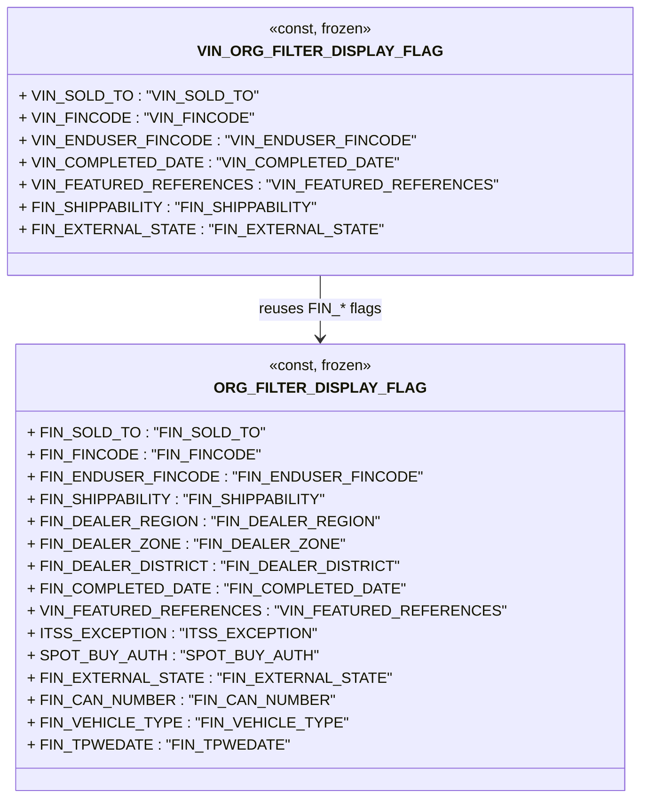

# Diagram: web/portal/src/pages/finishedvehicle/constants.js

> Auto-generated by Obscura crawlers

## Mermaid

### SVG

<svg id="container" width="596.9140625" xmlns="http://www.w3.org/2000/svg" class="classDiagram" height="858" viewBox="0 0 596.9140625 858" role="graphics-document document" aria-roledescription="class"><g><defs><marker id="container_class-aggregationStart" class="marker aggregation class" refX="18" refY="7" markerWidth="190" markerHeight="240" orient="auto"><path d="M 18,7 L9,13 L1,7 L9,1 Z"></path></marker></defs><defs><marker id="container_class-aggregationEnd" class="marker aggregation class" refX="1" refY="7" markerWidth="20" markerHeight="28" orient="auto"><path d="M 18,7 L9,13 L1,7 L9,1 Z"></path></marker></defs><defs><marker id="container_class-extensionStart" class="marker extension class" refX="18" refY="7" markerWidth="190" markerHeight="240" orient="auto"><path d="M 1,7 L18,13 V 1 Z"></path></marker></defs><defs><marker id="container_class-extensionEnd" class="marker extension class" refX="1" refY="7" markerWidth="20" markerHeight="28" orient="auto"><path d="M 1,1 V 13 L18,7 Z"></path></marker></defs><defs><marker id="container_class-compositionStart" class="marker composition class" refX="18" refY="7" markerWidth="190" markerHeight="240" orient="auto"><path d="M 18,7 L9,13 L1,7 L9,1 Z"></path></marker></defs><defs><marker id="container_class-compositionEnd" class="marker composition class" refX="1" refY="7" markerWidth="20" markerHeight="28" orient="auto"><path d="M 18,7 L9,13 L1,7 L9,1 Z"></path></marker></defs><defs><marker id="container_class-dependencyStart" class="marker dependency class" refX="6" refY="7" markerWidth="190" markerHeight="240" orient="auto"><path d="M 5,7 L9,13 L1,7 L9,1 Z"></path></marker></defs><defs><marker id="container_class-dependencyEnd" class="marker dependency class" refX="13" refY="7" markerWidth="20" markerHeight="28" orient="auto"><path d="M 18,7 L9,13 L14,7 L9,1 Z"></path></marker></defs><defs><marker id="container_class-lollipopStart" class="marker lollipop class" refX="13" refY="7" markerWidth="190" markerHeight="240" orient="auto"><circle stroke="black" fill="transparent" cx="7" cy="7" r="6"></circle></marker></defs><defs><marker id="container_class-lollipopEnd" class="marker lollipop class" refX="1" refY="7" markerWidth="190" markerHeight="240" orient="auto"><circle stroke="black" fill="transparent" cx="7" cy="7" r="6"></circle></marker></defs><g class="root"><g class="clusters"></g><g class="edgePaths"><path d="M298.457,296L298.457,302.167C298.457,308.333,298.457,320.667,298.457,332C298.457,343.333,298.457,353.667,298.457,358.833L298.457,364" id="id_VIN_ORG_FILTER_DISPLAY_FLAG_ORG_FILTER_DISPLAY_FLAG_1" class="edge-thickness-normal edge-pattern-solid relation" style=";;;" data-edge="true" data-et="edge" data-id="id_VIN_ORG_FILTER_DISPLAY_FLAG_ORG_FILTER_DISPLAY_FLAG_1" data-points="W3sieCI6Mjk4LjQ1NzAzMTI1LCJ5IjoyOTZ9LHsieCI6Mjk4LjQ1NzAzMTI1LCJ5IjozMzN9LHsieCI6Mjk4LjQ1NzAzMTI1LCJ5IjozNzB9XQ==" marker-end="url(#container_class-dependencyEnd)"></path></g><g class="edgeLabels"><g class="edgeLabel" transform="translate(298.45703125, 333)"><g class="label" data-id="id_VIN_ORG_FILTER_DISPLAY_FLAG_ORG_FILTER_DISPLAY_FLAG_1" transform="translate(-63.375, -12)"><foreignObject width="126.75" height="24">

reuses FIN_* flags

</foreignObject></g></g></g><g class="nodes"><g class="node default" id="classId-ORG_FILTER_DISPLAY_FLAG-0" transform="translate(298.45703125, 610)"><g class="basic label-container"><path d="M-282.43359375 -240 L282.43359375 -240 L282.43359375 240 L-282.43359375 240" stroke="none" stroke-width="0" fill="#ECECFF" style=""></path><path d="M-282.43359375 -240 C-88.73748947752881 -240, 104.95861479494238 -240, 282.43359375 -240 M-282.43359375 -240 C-168.6029908233314 -240, -54.77238789666279 -240, 282.43359375 -240 M282.43359375 -240 C282.43359375 -74.14382899628993, 282.43359375 91.71234200742015, 282.43359375 240 M282.43359375 -240 C282.43359375 -131.73466459659454, 282.43359375 -23.469329193189083, 282.43359375 240 M282.43359375 240 C153.0379091812675 240, 23.642224612535017 240, -282.43359375 240 M282.43359375 240 C139.7477904137346 240, -2.9380129225307883 240, -282.43359375 240 M-282.43359375 240 C-282.43359375 87.01415159661306, -282.43359375 -65.97169680677388, -282.43359375 -240 M-282.43359375 240 C-282.43359375 48.40652614608911, -282.43359375 -143.1869477078218, -282.43359375 -240" stroke="#9370DB" stroke-width="1.3" fill="none" stroke-dasharray="0 0" style=""></path></g><g class="annotation-group text" transform="translate(-55.3203125, -216)"><g class="label" style="" transform="translate(0,-12)"><foreignObject width="110.640625" height="24">

«const, frozen»

</foreignObject></g></g><g class="label-group text" transform="translate(-98.2734375, -192)"><g class="label" style="font-weight: bolder" transform="translate(0,-12)"><foreignObject width="196.546875" height="24">

ORG_FILTER_DISPLAY_FLAG

</foreignObject></g></g><g class="members-group text" transform="translate(-270.43359375, -144)"><g class="label" style="" transform="translate(0,-12)"><foreignObject width="227.78125" height="24">

+ FIN_SOLD_TO : "FIN_SOLD_TO"

</foreignObject></g><g class="label" style="" transform="translate(0,12)"><foreignObject width="225.125" height="24">

+ FIN_FINCODE : "FIN_FINCODE"

</foreignObject></g><g class="label" style="" transform="translate(0,36)"><foreignObject width="376.234375" height="24">

+ FIN_ENDUSER_FINCODE : "FIN_ENDUSER_FINCODE"

</foreignObject></g><g class="label" style="" transform="translate(0,60)"><foreignObject width="291.140625" height="24">

+ FIN_SHIPPABILITY : "FIN_SHIPPABILITY"

</foreignObject></g><g class="label" style="" transform="translate(0,84)"><foreignObject width="335.8125" height="24">

+ FIN_DEALER_REGION : "FIN_DEALER_REGION"

</foreignObject></g><g class="label" style="" transform="translate(0,108)"><foreignObject width="303.109375" height="24">

+ FIN_DEALER_ZONE : "FIN_DEALER_ZONE"

</foreignObject></g><g class="label" style="" transform="translate(0,132)"><foreignObject width="352.515625" height="24">

+ FIN_DEALER_DISTRICT : "FIN_DEALER_DISTRICT"

</foreignObject></g><g class="label" style="" transform="translate(0,156)"><foreignObject width="355.75" height="24">

+ FIN_COMPLETED_DATE : "FIN_COMPLETED_DATE"

</foreignObject></g><g class="label" style="" transform="translate(0,180)"><foreignObject width="442.59375" height="24">

+ VIN_FEATURED_REFERENCES : "VIN_FEATURED_REFERENCES"

</foreignObject></g><g class="label" style="" transform="translate(0,204)"><foreignObject width="269.609375" height="24">

+ ITSS_EXCEPTION : "ITSS_EXCEPTION"

</foreignObject></g><g class="label" style="" transform="translate(0,228)"><foreignObject width="275.78125" height="24">

+ SPOT_BUY_AUTH : "SPOT_BUY_AUTH"

</foreignObject></g><g class="label" style="" transform="translate(0,252)"><foreignObject width="342.59375" height="24">

+ FIN_EXTERNAL_STATE : "FIN_EXTERNAL_STATE"

</foreignObject></g><g class="label" style="" transform="translate(0,276)"><foreignObject width="298.3125" height="24">

+ FIN_CAN_NUMBER : "FIN_CAN_NUMBER"

</foreignObject></g><g class="label" style="" transform="translate(0,300)"><foreignObject width="301.359375" height="24">

+ FIN_VEHICLE_TYPE : "FIN_VEHICLE_TYPE"

</foreignObject></g><g class="label" style="" transform="translate(0,324)"><foreignObject width="248.421875" height="24">

+ FIN_TPWEDATE : "FIN_TPWEDATE"

</foreignObject></g></g><g class="methods-group text" transform="translate(-270.43359375, 240)"></g><g class="divider" style=""><path d="M-282.43359375 -168 C-160.71670971757567 -168, -38.99982568515131 -168, 282.43359375 -168 M-282.43359375 -168 C-64.23710046741371 -168, 153.95939281517258 -168, 282.43359375 -168" stroke="#9370DB" stroke-width="1.3" fill="none" stroke-dasharray="0 0" style=""></path></g><g class="divider" style=""><path d="M-282.43359375 216 C-86.06706956061058 216, 110.29945462877885 216, 282.43359375 216 M-282.43359375 216 C-166.47771956176996 216, -50.52184537353989 216, 282.43359375 216" stroke="#9370DB" stroke-width="1.3" fill="none" stroke-dasharray="0 0" style=""></path></g></g><g class="node default" id="classId-VIN_ORG_FILTER_DISPLAY_FLAG-1" transform="translate(298.45703125, 152)"><g class="basic label-container"><path d="M-290.45703125 -144 L290.45703125 -144 L290.45703125 144 L-290.45703125 144" stroke="none" stroke-width="0" fill="#ECECFF" style=""></path><path d="M-290.45703125 -144 C-163.6326265333357 -144, -36.80822181667139 -144, 290.45703125 -144 M-290.45703125 -144 C-150.9296717576997 -144, -11.402312265399416 -144, 290.45703125 -144 M290.45703125 -144 C290.45703125 -63.31143163408316, 290.45703125 17.377136731833673, 290.45703125 144 M290.45703125 -144 C290.45703125 -68.63167160807645, 290.45703125 6.73665678384711, 290.45703125 144 M290.45703125 144 C69.14686228196655 144, -152.1633066860669 144, -290.45703125 144 M290.45703125 144 C94.79962846731377 144, -100.85777431537247 144, -290.45703125 144 M-290.45703125 144 C-290.45703125 85.02196838728108, -290.45703125 26.043936774562155, -290.45703125 -144 M-290.45703125 144 C-290.45703125 80.07519988268335, -290.45703125 16.1503997653667, -290.45703125 -144" stroke="#9370DB" stroke-width="1.3" fill="none" stroke-dasharray="0 0" style=""></path></g><g class="annotation-group text" transform="translate(-55.3203125, -120)"><g class="label" style="" transform="translate(0,-12)"><foreignObject width="110.640625" height="24">

«const, frozen»

</foreignObject></g></g><g class="label-group text" transform="translate(-114.3203125, -96)"><g class="label" style="font-weight: bolder" transform="translate(0,-12)"><foreignObject width="228.640625" height="24">

VIN_ORG_FILTER_DISPLAY_FLAG

</foreignObject></g></g><g class="members-group text" transform="translate(-278.45703125, -48)"><g class="label" style="" transform="translate(0,-12)"><foreignObject width="230.03125" height="24">

+ VIN_SOLD_TO : "VIN_SOLD_TO"

</foreignObject></g><g class="label" style="" transform="translate(0,12)"><foreignObject width="227.375" height="24">

+ VIN_FINCODE : "VIN_FINCODE"

</foreignObject></g><g class="label" style="" transform="translate(0,36)"><foreignObject width="378.46875" height="24">

+ VIN_ENDUSER_FINCODE : "VIN_ENDUSER_FINCODE"

</foreignObject></g><g class="label" style="" transform="translate(0,60)"><foreignObject width="358" height="24">

+ VIN_COMPLETED_DATE : "VIN_COMPLETED_DATE"

</foreignObject></g><g class="label" style="" transform="translate(0,84)"><foreignObject width="442.59375" height="24">

+ VIN_FEATURED_REFERENCES : "VIN_FEATURED_REFERENCES"

</foreignObject></g><g class="label" style="" transform="translate(0,108)"><foreignObject width="291.140625" height="24">

+ FIN_SHIPPABILITY : "FIN_SHIPPABILITY"

</foreignObject></g><g class="label" style="" transform="translate(0,132)"><foreignObject width="342.59375" height="24">

+ FIN_EXTERNAL_STATE : "FIN_EXTERNAL_STATE"

</foreignObject></g></g><g class="methods-group text" transform="translate(-278.45703125, 144)"></g><g class="divider" style=""><path d="M-290.45703125 -72 C-119.83037817914882 -72, 50.79627489170235 -72, 290.45703125 -72 M-290.45703125 -72 C-64.10450753038188 -72, 162.24801618923624 -72, 290.45703125 -72" stroke="#9370DB" stroke-width="1.3" fill="none" stroke-dasharray="0 0" style=""></path></g><g class="divider" style=""><path d="M-290.45703125 120 C-89.68366880994301 120, 111.08969363011397 120, 290.45703125 120 M-290.45703125 120 C-172.42771175506786 120, -54.39839226013572 120, 290.45703125 120" stroke="#9370DB" stroke-width="1.3" fill="none" stroke-dasharray="0 0" style=""></path></g></g></g></g></g></svg>
