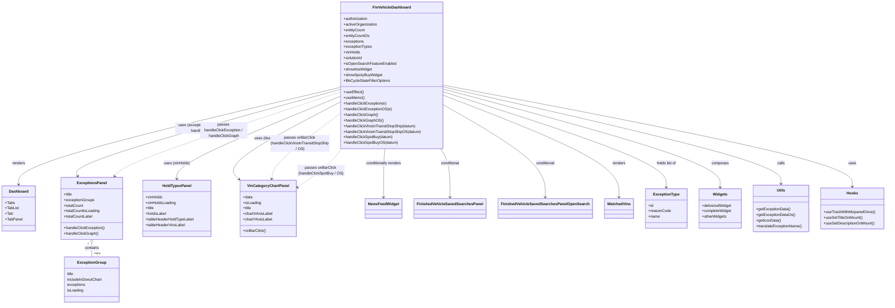

# Diagram: web/portal/src/pages/finishedvehicle/dashboard/FinishedVehicle.Dashboard.page.js

> Auto-generated by Obscura crawlers

## Mermaid

### SVG

<svg id="container" width="3677.8515625" xmlns="http://www.w3.org/2000/svg" class="classDiagram" height="1292" viewBox="0 0 3677.8515625 1292" role="graphics-document document" aria-roledescription="class"><g><defs><marker id="container_class-aggregationStart" class="marker aggregation class" refX="18" refY="7" markerWidth="190" markerHeight="240" orient="auto"><path d="M 18,7 L9,13 L1,7 L9,1 Z"></path></marker></defs><defs><marker id="container_class-aggregationEnd" class="marker aggregation class" refX="1" refY="7" markerWidth="20" markerHeight="28" orient="auto"><path d="M 18,7 L9,13 L1,7 L9,1 Z"></path></marker></defs><defs><marker id="container_class-extensionStart" class="marker extension class" refX="18" refY="7" markerWidth="190" markerHeight="240" orient="auto"><path d="M 1,7 L18,13 V 1 Z"></path></marker></defs><defs><marker id="container_class-extensionEnd" class="marker extension class" refX="1" refY="7" markerWidth="20" markerHeight="28" orient="auto"><path d="M 1,1 V 13 L18,7 Z"></path></marker></defs><defs><marker id="container_class-compositionStart" class="marker composition class" refX="18" refY="7" markerWidth="190" markerHeight="240" orient="auto"><path d="M 18,7 L9,13 L1,7 L9,1 Z"></path></marker></defs><defs><marker id="container_class-compositionEnd" class="marker composition class" refX="1" refY="7" markerWidth="20" markerHeight="28" orient="auto"><path d="M 18,7 L9,13 L1,7 L9,1 Z"></path></marker></defs><defs><marker id="container_class-dependencyStart" class="marker dependency class" refX="6" refY="7" markerWidth="190" markerHeight="240" orient="auto"><path d="M 5,7 L9,13 L1,7 L9,1 Z"></path></marker></defs><defs><marker id="container_class-dependencyEnd" class="marker dependency class" refX="13" refY="7" markerWidth="20" markerHeight="28" orient="auto"><path d="M 18,7 L9,13 L14,7 L9,1 Z"></path></marker></defs><defs><marker id="container_class-lollipopStart" class="marker lollipop class" refX="13" refY="7" markerWidth="190" markerHeight="240" orient="auto"><circle stroke="black" fill="transparent" cx="7" cy="7" r="6"></circle></marker></defs><defs><marker id="container_class-lollipopEnd" class="marker lollipop class" refX="1" refY="7" markerWidth="190" markerHeight="240" orient="auto"><circle stroke="black" fill="transparent" cx="7" cy="7" r="6"></circle></marker></defs><g class="root"><g class="clusters"></g><g class="edgePaths"><path d="M1436.199,370.755L1209.518,424.462C982.836,478.17,529.473,585.585,302.791,654.459C76.109,723.333,76.109,753.667,76.109,768.833L76.109,784" id="id_FinVehicleDashboard_Dashboard_1" class="edge-thickness-normal edge-pattern-solid relation" style=";;;" data-edge="true" data-et="edge" data-id="id_FinVehicleDashboard_Dashboard_1" data-points="W3sieCI6MTQzNi4xOTkyMTg3NSwieSI6MzcwLjc1NDcyMTE5NDU3Mn0seyJ4Ijo3Ni4xMDkzNzUsInkiOjY5M30seyJ4Ijo3Ni4xMDkzNzUsInkiOjc5MH1d" marker-end="url(#container_class-dependencyEnd)"></path><path d="M1436.199,378.93L1245.919,431.275C1055.638,483.62,675.077,588.31,489.055,649.913C303.033,711.516,311.551,730.033,315.809,739.291L320.068,748.549" id="id_FinVehicleDashboard_ExceptionsPanel_2" class="edge-thickness-normal edge-pattern-solid relation" style=";;;" data-edge="true" data-et="edge" data-id="id_FinVehicleDashboard_ExceptionsPanel_2" data-points="W3sieCI6MTQzNi4xOTkyMTg3NSwieSI6Mzc4LjkzMDE5ODEyMTA2MjF9LHsieCI6Mjk0LjUxNTYyNSwieSI6NjkzfSx7IngiOjMyMi41NzU0MDI3Njg3ODI0LCJ5Ijo3NTR9XQ==" marker-end="url(#container_class-dependencyEnd)"></path><path d="M1436.199,407.988L1320.549,455.49C1204.9,502.992,973.6,597.996,857.951,656.665C742.301,715.333,742.301,737.667,742.301,748.833L742.301,760" id="id_FinVehicleDashboard_HoldTypesPanel_3" class="edge-thickness-normal edge-pattern-solid relation" style=";;;" data-edge="true" data-et="edge" data-id="id_FinVehicleDashboard_HoldTypesPanel_3" data-points="W3sieCI6MTQzNi4xOTkyMTg3NSwieSI6NDA3Ljk4ODE5NjczMjU5NH0seyJ4Ijo3NDIuMzAwNzgxMjUsInkiOjY5M30seyJ4Ijo3NDIuMzAwNzgxMjUsInkiOjc2Nn1d" marker-end="url(#container_class-dependencyEnd)"></path><path d="M1436.199,431.371L1352.327,474.976C1268.455,518.581,1100.711,605.79,1028.94,661.551C957.169,717.311,981.371,741.623,993.472,753.779L1005.574,765.934" id="id_FinVehicleDashboard_VinCategoryChartPanel_4" class="edge-thickness-normal edge-pattern-solid relation" style=";;;" data-edge="true" data-et="edge" data-id="id_FinVehicleDashboard_VinCategoryChartPanel_4" data-points="W3sieCI6MTQzNi4xOTkyMTg3NSwieSI6NDMxLjM3MTQ3MjkwNjIwMjc3fSx7IngiOjkzMi45NjY3OTY4NzUsInkiOjY5M30seyJ4IjoxMDA5LjgwNjY0MDYyNSwieSI6NzcwLjE4NjY1ODgwNTM1MTJ9XQ==" marker-end="url(#container_class-dependencyEnd)"></path><path d="M1619.747,632L1618.747,642.167C1617.748,652.333,1615.749,672.667,1614.749,707C1613.75,741.333,1613.75,789.667,1613.75,813.833L1613.75,838" id="id_FinVehicleDashboard_NewsFeedWidget_5" class="edge-thickness-normal edge-pattern-solid relation" style=";;;" data-edge="true" data-et="edge" data-id="id_FinVehicleDashboard_NewsFeedWidget_5" data-points="W3sieCI6MTYxOS43NDY2MzgzMjEwNDU2LCJ5Ijo2MzJ9LHsieCI6MTYxMy43NSwieSI6NjkzfSx7IngiOjE2MTMuNzUsInkiOjg0NH1d" marker-end="url(#container_class-dependencyEnd)"></path><path d="M1844.238,632L1850.554,642.167C1856.87,652.333,1869.501,672.667,1875.817,707C1882.133,741.333,1882.133,789.667,1882.133,813.833L1882.133,838" id="id_FinVehicleDashboard_FinishedVehicleSavedSearchesPanel_6" class="edge-thickness-normal edge-pattern-solid relation" style=";;;" data-edge="true" data-et="edge" data-id="id_FinVehicleDashboard_FinishedVehicleSavedSearchesPanel_6" data-points="W3sieCI6MTg0NC4yMzg0Mjc4NjUyODE0LCJ5Ijo2MzJ9LHsieCI6MTg4Mi4xMzI4MTI1LCJ5Ijo2OTN9LHsieCI6MTg4Mi4xMzI4MTI1LCJ5Ijo4NDR9XQ==" marker-end="url(#container_class-dependencyEnd)"></path><path d="M1864.637,450.192L1931.223,490.66C1997.81,531.128,2130.983,612.064,2197.57,676.699C2264.156,741.333,2264.156,789.667,2264.156,813.833L2264.156,838" id="id_FinVehicleDashboard_FinishedVehicleSavedSearchesPanelOpenSearch_7" class="edge-thickness-normal edge-pattern-solid relation" style=";;;" data-edge="true" data-et="edge" data-id="id_FinVehicleDashboard_FinishedVehicleSavedSearchesPanelOpenSearch_7" data-points="W3sieCI6MTg2NC42MzY3MTg3NSwieSI6NDUwLjE5MTY0MDYyNDUwMjd9LHsieCI6MjI2NC4xNTYyNSwieSI6NjkzfSx7IngiOjIyNjQuMTU2MjUsInkiOjg0NH1d" marker-end="url(#container_class-dependencyEnd)"></path><path d="M1864.637,407.748L1980.701,455.29C2096.766,502.832,2328.895,597.916,2444.959,669.625C2561.023,741.333,2561.023,789.667,2561.023,813.833L2561.023,838" id="id_FinVehicleDashboard_WatchedVins_8" class="edge-thickness-normal edge-pattern-solid relation" style=";;;" data-edge="true" data-et="edge" data-id="id_FinVehicleDashboard_WatchedVins_8" data-points="W3sieCI6MTg2NC42MzY3MTg3NSwieSI6NDA3Ljc0Nzc2Mzk3OTE1MTk2fSx7IngiOjI1NjEuMDIzNDM3NSwieSI6NjkzfSx7IngiOjI1NjEuMDIzNDM3NSwieSI6ODQ0fV0=" marker-end="url(#container_class-dependencyEnd)"></path><path d="M383.295,1035.25L383.295,1038.542C383.295,1041.833,383.295,1048.417,383.295,1057.875C383.295,1067.333,383.295,1079.667,383.295,1085.833L383.295,1092" id="id_ExceptionsPanel_ExceptionGroup_9" class="edge-thickness-normal edge-pattern-solid relation" style=";;;" data-edge="true" data-et="edge" data-id="id_ExceptionsPanel_ExceptionGroup_9" data-points="W3sieCI6MzgzLjI5NDkyMTg3NSwieSI6MTAxOH0seyJ4IjozODMuMjk0OTIxODc1LCJ5IjoxMDU1fSx7IngiOjM4My4yOTQ5MjE4NzUsInkiOjEwOTJ9XQ==" marker-start="url(#container_class-aggregationStart)"></path><path d="M1864.637,392.339L2013.03,442.449C2161.423,492.559,2458.21,592.78,2606.603,660.056C2754.996,727.333,2754.996,761.667,2754.996,778.833L2754.996,796" id="id_FinVehicleDashboard_ExceptionType_10" class="edge-thickness-normal edge-pattern-solid relation" style=";;;" data-edge="true" data-et="edge" data-id="id_FinVehicleDashboard_ExceptionType_10" data-points="W3sieCI6MTg2NC42MzY3MTg3NSwieSI6MzkyLjMzODU2MjUxNjc5OH0seyJ4IjoyNzU0Ljk5NjA5Mzc1LCJ5Ijo2OTN9LHsieCI6Mjc1NC45OTYwOTM3NSwieSI6ODAyfV0=" marker-end="url(#container_class-dependencyEnd)"></path><path d="M1864.637,380.107L2050.494,432.256C2236.352,484.404,2608.066,588.702,2793.924,658.018C2979.781,727.333,2979.781,761.667,2979.781,778.833L2979.781,796" id="id_FinVehicleDashboard_Widgets_11" class="edge-thickness-normal edge-pattern-solid relation" style=";;;" data-edge="true" data-et="edge" data-id="id_FinVehicleDashboard_Widgets_11" data-points="W3sieCI6MTg2NC42MzY3MTg3NSwieSI6MzgwLjEwNjY2NTI1NjIxN30seyJ4IjoyOTc5Ljc4MTI1LCJ5Ijo2OTN9LHsieCI6Mjk3OS43ODEyNSwieSI6ODAyfV0=" marker-end="url(#container_class-dependencyEnd)"></path><path d="M1864.637,370.343L2093.467,424.119C2322.297,477.895,2779.957,585.448,3008.787,653.89C3237.617,722.333,3237.617,751.667,3237.617,766.333L3237.617,781" id="id_FinVehicleDashboard_Utils_12" class="edge-thickness-normal edge-pattern-solid relation" style=";;;" data-edge="true" data-et="edge" data-id="id_FinVehicleDashboard_Utils_12" data-points="W3sieCI6MTg2NC42MzY3MTg3NSwieSI6MzcwLjM0MjUxMDc2MTE0MzJ9LHsieCI6MzIzNy42MTcxODc1LCJ5Ijo2OTN9LHsieCI6MzIzNy42MTcxODc1LCJ5Ijo3ODd9XQ==" marker-end="url(#container_class-dependencyEnd)"></path><path d="M1864.637,362.335L2143.503,417.446C2422.368,472.557,2980.1,582.778,3258.966,654.556C3537.832,726.333,3537.832,759.667,3537.832,776.333L3537.832,793" id="id_FinVehicleDashboard_Hooks_13" class="edge-thickness-normal edge-pattern-solid relation" style=";;;" data-edge="true" data-et="edge" data-id="id_FinVehicleDashboard_Hooks_13" data-points="W3sieCI6MTg2NC42MzY3MTg3NSwieSI6MzYyLjMzNDk1NzMwMzUxOTZ9LHsieCI6MzUzNy44MzIwMzEyNSwieSI6NjkzfSx7IngiOjM1MzcuODMyMDMxMjUsInkiOjc5OX1d" marker-end="url(#container_class-dependencyEnd)"></path><path d="M1436.199,390.344L1282.585,440.786C1128.971,491.229,821.743,592.115,661.779,651.897C501.815,711.679,489.115,730.359,482.765,739.699L476.415,749.038" id="id_FinVehicleDashboard_ExceptionsPanel_14" class="edge-thickness-normal edge-pattern-dashed relation" style=";;;" data-edge="true" data-et="edge" data-id="id_FinVehicleDashboard_ExceptionsPanel_14" data-points="W3sieCI6MTQzNi4xOTkyMTg3NSwieSI6MzkwLjM0MzcxNzY1Mjg4NDd9LHsieCI6NTE0LjUxNTYyNSwieSI6NjkzfSx7IngiOjQ3My4wNDE3MjQwMTIzMDU3LCJ5Ijo3NTR9XQ==" marker-end="url(#container_class-dependencyEnd)"></path><path d="M1436.199,479.375L1388.343,514.979C1340.486,550.583,1244.773,621.792,1195.53,668.57C1146.286,715.349,1143.511,737.697,1142.124,748.871L1140.737,760.046" id="id_FinVehicleDashboard_VinCategoryChartPanel_15" class="edge-thickness-normal edge-pattern-dashed relation" style=";;;" data-edge="true" data-et="edge" data-id="id_FinVehicleDashboard_VinCategoryChartPanel_15" data-points="W3sieCI6MTQzNi4xOTkyMTg3NSwieSI6NDc5LjM3NDUxMDYwNTk3MjF9LHsieCI6MTE0OS4wNjA1NDY4NzUsInkiOjY5M30seyJ4IjoxMTM5Ljk5NzYwMTYwMjk3OTMsInkiOjc2Nn1d" marker-end="url(#container_class-dependencyEnd)"></path><path d="M1437.004,632L1430.05,642.167C1423.096,652.333,1409.188,672.667,1377.233,700.692C1345.278,728.718,1295.276,764.436,1270.276,782.295L1245.275,800.154" id="id_FinVehicleDashboard_VinCategoryChartPanel_16" class="edge-thickness-normal edge-pattern-dashed relation" style=";;;" data-edge="true" data-et="edge" data-id="id_FinVehicleDashboard_VinCategoryChartPanel_16" data-points="W3sieCI6MTQzNy4wMDQzODc5ODU5MjUsInkiOjYzMn0seyJ4IjoxMzk1LjI3OTI5Njg3NSwieSI6NjkzfSx7IngiOjEyNDAuMzkyNTc4MTI1LCJ5Ijo4MDMuNjQxNjg4MTEyNjU2NX1d" marker-end="url(#container_class-dependencyEnd)"></path></g><g class="edgeLabels"><g class="edgeLabel" transform="translate(76.109375, 693)"><g class="label" data-id="id_FinVehicleDashboard_Dashboard_1" transform="translate(-27.75, -12)"><foreignObject width="55.5" height="24">

renders

</foreignObject></g></g><g class="edgeLabel" transform="translate(832.98777, 544.86978)"><g class="label" data-id="id_FinVehicleDashboard_ExceptionsPanel_2" transform="translate(-100, -24)"><foreignObject width="200" height="48">

uses (exceptionGroups, handlers)

</foreignObject></g></g><g class="edgeLabel" transform="translate(742.30078125, 693)"><g class="label" data-id="id_FinVehicleDashboard_HoldTypesPanel_3" transform="translate(-55.609375, -12)"><foreignObject width="111.21875" height="24">

uses (vinHolds)

</foreignObject></g></g><g class="edgeLabel" transform="translate(1136.26603, 587.30554)"><g class="label" data-id="id_FinVehicleDashboard_VinCategoryChartPanel_4" transform="translate(-69.875, -12)"><foreignObject width="139.75" height="24">

uses (itss, spotBuy)

</foreignObject></g></g><g class="edgeLabel" transform="translate(1613.75, 693)"><g class="label" data-id="id_FinVehicleDashboard_NewsFeedWidget_5" transform="translate(-77.25, -12)"><foreignObject width="154.5" height="24">

conditionally renders

</foreignObject></g></g><g class="edgeLabel" transform="translate(1882.1328125, 693)"><g class="label" data-id="id_FinVehicleDashboard_FinishedVehicleSavedSearchesPanel_6" transform="translate(-41.1875, -12)"><foreignObject width="82.375" height="24">

conditional

</foreignObject></g></g><g class="edgeLabel" transform="translate(2264.15625, 693)"><g class="label" data-id="id_FinVehicleDashboard_FinishedVehicleSavedSearchesPanelOpenSearch_7" transform="translate(-41.1875, -12)"><foreignObject width="82.375" height="24">

conditional

</foreignObject></g></g><g class="edgeLabel" transform="translate(2561.0234375, 693)"><g class="label" data-id="id_FinVehicleDashboard_WatchedVins_8" transform="translate(-27.75, -12)"><foreignObject width="55.5" height="24">

renders

</foreignObject></g></g><g class="edgeLabel" transform="translate(383.294921875, 1055)"><g class="label" data-id="id_ExceptionsPanel_ExceptionGroup_9" transform="translate(-30.890625, -12)"><foreignObject width="61.78125" height="24">

contains

</foreignObject></g></g><g class="edgeLabel" transform="translate(2754.99609375, 693)"><g class="label" data-id="id_FinVehicleDashboard_ExceptionType_10" transform="translate(-43.0078125, -12)"><foreignObject width="86.015625" height="24">

holds list of

</foreignObject></g></g><g class="edgeLabel" transform="translate(2979.78125, 693)"><g class="label" data-id="id_FinVehicleDashboard_Widgets_11" transform="translate(-36.453125, -12)"><foreignObject width="72.90625" height="24">

composes

</foreignObject></g></g><g class="edgeLabel" transform="translate(3237.6171875, 693)"><g class="label" data-id="id_FinVehicleDashboard_Utils_12" transform="translate(-16.4453125, -12)"><foreignObject width="32.890625" height="24">

calls

</foreignObject></g></g><g class="edgeLabel" transform="translate(3537.83203125, 693)"><g class="label" data-id="id_FinVehicleDashboard_Hooks_13" transform="translate(-16.4921875, -12)"><foreignObject width="32.984375" height="24">

uses

</foreignObject></g></g><g class="edgeLabel" transform="translate(940.31643, 553.17838)"><g class="label" data-id="id_FinVehicleDashboard_ExceptionsPanel_14" transform="translate(-100, -36)"><foreignObject width="200" height="72">

passes handleClickException / handleClickGraph

</foreignObject></g></g><g class="edgeLabel" transform="translate(1263.12066, 608.14153)"><g class="label" data-id="id_FinVehicleDashboard_VinCategoryChartPanel_15" transform="translate(-126.21875, -36)"><foreignObject width="252.4375" height="72">

passes onBarClick (handleClickVinsInTransitStopShip / OS)

</foreignObject></g></g><g class="edgeLabel" transform="translate(1347.90475, 726.8415)"><g class="label" data-id="id_FinVehicleDashboard_VinCategoryChartPanel_16" transform="translate(-100, -24)"><foreignObject width="200" height="48">

passes onBarClick (handleClickSpotBuy / OS)

</foreignObject></g></g><g class="edgeTerminals" transform="translate(368.2949209375, 1035.4999991964285)"><g class="inner" transform="translate(0, 0)"><foreignObject style="width: 9px; height: 12px;">
1
</foreignObject></g></g><g class="edgeTerminals" transform="translate(393.2949209375, 1069.4999991964285)"><g class="inner" transform="translate(0, 0)"></g><foreignObject style="width: 36px; height: 12px;">
many
</foreignObject></g></g><g class="nodes"><g class="node default" id="classId-FinVehicleDashboard-0" transform="translate(1650.41796875, 320)"><g class="basic label-container"><path d="M-214.21875 -312 L214.21875 -312 L214.21875 312 L-214.21875 312" stroke="none" stroke-width="0" fill="#ECECFF" style=""></path><path d="M-214.21875 -312 C-48.61946788119562 -312, 116.97981423760876 -312, 214.21875 -312 M-214.21875 -312 C-49.57563356674234 -312, 115.06748286651532 -312, 214.21875 -312 M214.21875 -312 C214.21875 -63.80970392557293, 214.21875 184.38059214885413, 214.21875 312 M214.21875 -312 C214.21875 -105.12341479049513, 214.21875 101.75317041900973, 214.21875 312 M214.21875 312 C104.0811024367688 312, -6.056545126462396 312, -214.21875 312 M214.21875 312 C95.02116490463618 312, -24.17642019072764 312, -214.21875 312 M-214.21875 312 C-214.21875 112.30235196174021, -214.21875 -87.39529607651957, -214.21875 -312 M-214.21875 312 C-214.21875 66.09071954405906, -214.21875 -179.8185609118819, -214.21875 -312" stroke="#9370DB" stroke-width="1.3" fill="none" stroke-dasharray="0 0" style=""></path></g><g class="annotation-group text" transform="translate(0, -288)"></g><g class="label-group text" transform="translate(-76.203125, -288)"><g class="label" style="font-weight: bolder" transform="translate(0,-12)"><foreignObject width="152.40625" height="24">

FinVehicleDashboard

</foreignObject></g></g><g class="members-group text" transform="translate(-202.21875, -240)"><g class="label" style="" transform="translate(0,-12)"><foreignObject width="105.421875" height="24">

+authorization

</foreignObject></g><g class="label" style="" transform="translate(0,12)"><foreignObject width="143" height="24">

+activeOrganization

</foreignObject></g><g class="label" style="" transform="translate(0,36)"><foreignObject width="92.390625" height="24">

+entityCount

</foreignObject></g><g class="label" style="" transform="translate(0,60)"><foreignObject width="110.9375" height="24">

+entityCountOs

</foreignObject></g><g class="label" style="" transform="translate(0,84)"><foreignObject width="86.21875" height="24">

+exceptions

</foreignObject></g><g class="label" style="" transform="translate(0,108)"><foreignObject width="119.9375" height="24">

+exceptionTypes

</foreignObject></g><g class="label" style="" transform="translate(0,132)"><foreignObject width="71.46875" height="24">

+vinHolds

</foreignObject></g><g class="label" style="" transform="translate(0,156)"><foreignObject width="82.109375" height="24">

+solutionId

</foreignObject></g><g class="label" style="" transform="translate(0,180)"><foreignObject width="220.296875" height="24">

+isOpenSearchFeatureEnabled

</foreignObject></g><g class="label" style="" transform="translate(0,204)"><foreignObject width="120.796875" height="24">

+showItssWidget

</foreignObject></g><g class="label" style="" transform="translate(0,228)"><foreignObject width="163.5625" height="24">

+showSpotyBuyWidget

</foreignObject></g><g class="label" style="" transform="translate(0,252)"><foreignObject width="199.390625" height="24">

+lifeCycleStateFilterOptions

</foreignObject></g></g><g class="methods-group text" transform="translate(-202.21875, 72)"><g class="label" style="" transform="translate(0,-12)"><foreignObject width="84.8125" height="24">

+useEffect()

</foreignObject></g><g class="label" style="" transform="translate(0,12)"><foreignObject width="88.09375" height="24">

+useMemo()

</foreignObject></g><g class="label" style="" transform="translate(0,36)"><foreignObject width="182.015625" height="24">

+handleClickException(e)

</foreignObject></g><g class="label" style="" transform="translate(0,60)"><foreignObject width="201.796875" height="24">

+handleClickExceptionOS(e)

</foreignObject></g><g class="label" style="" transform="translate(0,84)"><foreignObject width="145.84375" height="24">

+handleClickGraph()

</foreignObject></g><g class="label" style="" transform="translate(0,108)"><foreignObject width="165.640625" height="24">

+handleClickGraphOS()

</foreignObject></g><g class="label" style="" transform="translate(0,132)"><foreignObject width="308.4375" height="24">

+handleClickVinsInTransitStopShip(datum)

</foreignObject></g><g class="label" style="" transform="translate(0,156)"><foreignObject width="328.234375" height="24">

+handleClickVinsInTransitStopShipOS(datum)

</foreignObject></g><g class="label" style="" transform="translate(0,180)"><foreignObject width="209.875" height="24">

+handleClickSpotBuy(datum)

</foreignObject></g><g class="label" style="" transform="translate(0,204)"><foreignObject width="229.671875" height="24">

+handleClickSpotBuyOS(datum)

</foreignObject></g></g><g class="divider" style=""><path d="M-214.21875 -264 C-52.18066418407463 -264, 109.85742163185074 -264, 214.21875 -264 M-214.21875 -264 C-107.39263264767743 -264, -0.5665152953548613 -264, 214.21875 -264" stroke="#9370DB" stroke-width="1.3" fill="none" stroke-dasharray="0 0" style=""></path></g><g class="divider" style=""><path d="M-214.21875 48 C-83.09552223326895 48, 48.0277055334621 48, 214.21875 48 M-214.21875 48 C-84.2712075198684 48, 45.676334960263205 48, 214.21875 48" stroke="#9370DB" stroke-width="1.3" fill="none" stroke-dasharray="0 0" style=""></path></g></g><g class="node default" id="classId-Dashboard-1" transform="translate(76.109375, 886)"><g class="basic label-container"><path d="M-68.109375 -96 L68.109375 -96 L68.109375 96 L-68.109375 96" stroke="none" stroke-width="0" fill="#ECECFF" style=""></path><path d="M-68.109375 -96 C-31.61930427011191 -96, 4.870766459776178 -96, 68.109375 -96 M-68.109375 -96 C-30.072778014152767 -96, 7.963818971694465 -96, 68.109375 -96 M68.109375 -96 C68.109375 -25.208781651443218, 68.109375 45.582436697113565, 68.109375 96 M68.109375 -96 C68.109375 -22.090710047550743, 68.109375 51.81857990489851, 68.109375 96 M68.109375 96 C27.460089207121356 96, -13.189196585757287 96, -68.109375 96 M68.109375 96 C34.306336761927994 96, 0.5032985238559888 96, -68.109375 96 M-68.109375 96 C-68.109375 19.848774776473064, -68.109375 -56.30245044705387, -68.109375 -96 M-68.109375 96 C-68.109375 27.307749123936077, -68.109375 -41.384501752127846, -68.109375 -96" stroke="#9370DB" stroke-width="1.3" fill="none" stroke-dasharray="0 0" style=""></path></g><g class="annotation-group text" transform="translate(0, -72)"></g><g class="label-group text" transform="translate(-39.4375, -72)"><g class="label" style="font-weight: bolder" transform="translate(0,-12)"><foreignObject width="78.875" height="24">

Dashboard

</foreignObject></g></g><g class="members-group text" transform="translate(-56.109375, -24)"><g class="label" style="" transform="translate(0,-12)"><foreignObject width="40.34375" height="24">

+Tabs

</foreignObject></g><g class="label" style="" transform="translate(0,12)"><foreignObject width="58.59375" height="24">

+TabList

</foreignObject></g><g class="label" style="" transform="translate(0,36)"><foreignObject width="32.875" height="24">

+Tab

</foreignObject></g><g class="label" style="" transform="translate(0,60)"><foreignObject width="72.78125" height="24">

+TabPanel

</foreignObject></g></g><g class="methods-group text" transform="translate(-56.109375, 96)"></g><g class="divider" style=""><path d="M-68.109375 -48 C-40.5517061837175 -48, -12.994037367434991 -48, 68.109375 -48 M-68.109375 -48 C-18.058942210663844 -48, 31.991490578672312 -48, 68.109375 -48" stroke="#9370DB" stroke-width="1.3" fill="none" stroke-dasharray="0 0" style=""></path></g><g class="divider" style=""><path d="M-68.109375 72 C-15.259998080962397 72, 37.589378838075206 72, 68.109375 72 M-68.109375 72 C-28.977653505883545 72, 10.15406798823291 72, 68.109375 72" stroke="#9370DB" stroke-width="1.3" fill="none" stroke-dasharray="0 0" style=""></path></g></g><g class="node default" id="classId-ExceptionsPanel-2" transform="translate(383.294921875, 886)"><g class="basic label-container"><path d="M-128.51171875 -132 L128.51171875 -132 L128.51171875 132 L-128.51171875 132" stroke="none" stroke-width="0" fill="#ECECFF" style=""></path><path d="M-128.51171875 -132 C-42.90890453482267 -132, 42.693909680354665 -132, 128.51171875 -132 M-128.51171875 -132 C-39.87390204924097 -132, 48.763914651518064 -132, 128.51171875 -132 M128.51171875 -132 C128.51171875 -73.87373488503016, 128.51171875 -15.747469770060334, 128.51171875 132 M128.51171875 -132 C128.51171875 -28.527740770299843, 128.51171875 74.94451845940031, 128.51171875 132 M128.51171875 132 C41.4362160088119 132, -45.639286732376206 132, -128.51171875 132 M128.51171875 132 C30.76210661952875 132, -66.9875055109425 132, -128.51171875 132 M-128.51171875 132 C-128.51171875 52.800000884183845, -128.51171875 -26.39999823163231, -128.51171875 -132 M-128.51171875 132 C-128.51171875 31.909938968679157, -128.51171875 -68.18012206264169, -128.51171875 -132" stroke="#9370DB" stroke-width="1.3" fill="none" stroke-dasharray="0 0" style=""></path></g><g class="annotation-group text" transform="translate(0, -108)"></g><g class="label-group text" transform="translate(-59.7421875, -108)"><g class="label" style="font-weight: bolder" transform="translate(0,-12)"><foreignObject width="119.484375" height="24">

ExceptionsPanel

</foreignObject></g></g><g class="members-group text" transform="translate(-116.51171875, -60)"><g class="label" style="" transform="translate(0,-12)"><foreignObject width="37.140625" height="24">

+title

</foreignObject></g><g class="label" style="" transform="translate(0,12)"><foreignObject width="130.171875" height="24">

+exceptionGroups

</foreignObject></g><g class="label" style="" transform="translate(0,36)"><foreignObject width="84.140625" height="24">

+totalCount

</foreignObject></g><g class="label" style="" transform="translate(0,60)"><foreignObject width="153.5625" height="24">

+totalCountIsLoading

</foreignObject></g><g class="label" style="" transform="translate(0,84)"><foreignObject width="123.5625" height="24">

+totalCountLabel

</foreignObject></g></g><g class="methods-group text" transform="translate(-116.51171875, 84)"><g class="label" style="" transform="translate(0,-12)"><foreignObject width="173.28125" height="24">

+handleClickException()

</foreignObject></g><g class="label" style="" transform="translate(0,12)"><foreignObject width="145.84375" height="24">

+handleClickGraph()

</foreignObject></g></g><g class="divider" style=""><path d="M-128.51171875 -84 C-39.408270614727016 -84, 49.69517752054597 -84, 128.51171875 -84 M-128.51171875 -84 C-32.7455497668965 -84, 63.020619216206995 -84, 128.51171875 -84" stroke="#9370DB" stroke-width="1.3" fill="none" stroke-dasharray="0 0" style=""></path></g><g class="divider" style=""><path d="M-128.51171875 60 C-51.846551444403005 60, 24.81861586119399 60, 128.51171875 60 M-128.51171875 60 C-32.09045273024303 60, 64.33081328951394 60, 128.51171875 60" stroke="#9370DB" stroke-width="1.3" fill="none" stroke-dasharray="0 0" style=""></path></g></g><g class="node default" id="classId-HoldTypesPanel-3" transform="translate(742.30078125, 886)"><g class="basic label-container"><path d="M-143.890625 -120 L143.890625 -120 L143.890625 120 L-143.890625 120" stroke="none" stroke-width="0" fill="#ECECFF" style=""></path><path d="M-143.890625 -120 C-68.2018006772372 -120, 7.487023645525596 -120, 143.890625 -120 M-143.890625 -120 C-86.13067998115943 -120, -28.370734962318863 -120, 143.890625 -120 M143.890625 -120 C143.890625 -68.72615602670021, 143.890625 -17.45231205340042, 143.890625 120 M143.890625 -120 C143.890625 -43.33547381369122, 143.890625 33.329052372617554, 143.890625 120 M143.890625 120 C67.1620613458674 120, -9.5665023082652 120, -143.890625 120 M143.890625 120 C36.602432714683516 120, -70.68575957063297 120, -143.890625 120 M-143.890625 120 C-143.890625 32.54440952221371, -143.890625 -54.911180955572576, -143.890625 -120 M-143.890625 120 C-143.890625 49.70145949022162, -143.890625 -20.597081019556754, -143.890625 -120" stroke="#9370DB" stroke-width="1.3" fill="none" stroke-dasharray="0 0" style=""></path></g><g class="annotation-group text" transform="translate(0, -96)"></g><g class="label-group text" transform="translate(-58.515625, -96)"><g class="label" style="font-weight: bolder" transform="translate(0,-12)"><foreignObject width="117.03125" height="24">

HoldTypesPanel

</foreignObject></g></g><g class="members-group text" transform="translate(-131.890625, -48)"><g class="label" style="" transform="translate(0,-12)"><foreignObject width="71.46875" height="24">

+vinHolds

</foreignObject></g><g class="label" style="" transform="translate(0,12)"><foreignObject width="128.703125" height="24">

+vinHoldsLoading

</foreignObject></g><g class="label" style="" transform="translate(0,36)"><foreignObject width="37.140625" height="24">

+title

</foreignObject></g><g class="label" style="" transform="translate(0,60)"><foreignObject width="87.78125" height="24">

+holdsLabel

</foreignObject></g><g class="label" style="" transform="translate(0,84)"><foreignObject width="205.265625" height="24">

+tableHeaderHoldTypeLabel

</foreignObject></g><g class="label" style="" transform="translate(0,108)"><foreignObject width="167.40625" height="24">

+tableHeaderVinsLabel

</foreignObject></g></g><g class="methods-group text" transform="translate(-131.890625, 120)"></g><g class="divider" style=""><path d="M-143.890625 -72 C-46.681674844802615 -72, 50.52727531039477 -72, 143.890625 -72 M-143.890625 -72 C-56.311244865148325 -72, 31.26813526970335 -72, 143.890625 -72" stroke="#9370DB" stroke-width="1.3" fill="none" stroke-dasharray="0 0" style=""></path></g><g class="divider" style=""><path d="M-143.890625 96 C-84.14277859814385 96, -24.394932196287698 96, 143.890625 96 M-143.890625 96 C-59.63557628484436 96, 24.619472430311276 96, 143.890625 96" stroke="#9370DB" stroke-width="1.3" fill="none" stroke-dasharray="0 0" style=""></path></g></g><g class="node default" id="classId-VinCategoryChartPanel-4" transform="translate(1125.099609375, 886)"><g class="basic label-container"><path d="M-115.29296875 -120 L115.29296875 -120 L115.29296875 120 L-115.29296875 120" stroke="none" stroke-width="0" fill="#ECECFF" style=""></path><path d="M-115.29296875 -120 C-27.322477321935523 -120, 60.648014106128954 -120, 115.29296875 -120 M-115.29296875 -120 C-50.294702279607506 -120, 14.703564190784988 -120, 115.29296875 -120 M115.29296875 -120 C115.29296875 -69.90247533973573, 115.29296875 -19.804950679471446, 115.29296875 120 M115.29296875 -120 C115.29296875 -36.971743304719425, 115.29296875 46.05651339056115, 115.29296875 120 M115.29296875 120 C29.34179149481774 120, -56.60938576036452 120, -115.29296875 120 M115.29296875 120 C32.09919867818233 120, -51.094571393635334 120, -115.29296875 120 M-115.29296875 120 C-115.29296875 53.272964585891, -115.29296875 -13.454070828217993, -115.29296875 -120 M-115.29296875 120 C-115.29296875 32.25761432328282, -115.29296875 -55.484771353434354, -115.29296875 -120" stroke="#9370DB" stroke-width="1.3" fill="none" stroke-dasharray="0 0" style=""></path></g><g class="annotation-group text" transform="translate(0, -96)"></g><g class="label-group text" transform="translate(-83.9453125, -96)"><g class="label" style="font-weight: bolder" transform="translate(0,-12)"><foreignObject width="167.890625" height="24">

VinCategoryChartPanel

</foreignObject></g></g><g class="members-group text" transform="translate(-103.29296875, -48)"><g class="label" style="" transform="translate(0,-12)"><foreignObject width="40.625" height="24">

+data

</foreignObject></g><g class="label" style="" transform="translate(0,12)"><foreignObject width="77.203125" height="24">

+isLoading

</foreignObject></g><g class="label" style="" transform="translate(0,36)"><foreignObject width="37.140625" height="24">

+title

</foreignObject></g><g class="label" style="" transform="translate(0,60)"><foreignObject width="122.640625" height="24">

+chartXAxisLabel

</foreignObject></g><g class="label" style="" transform="translate(0,84)"><foreignObject width="122.03125" height="24">

+chartYAxisLabel

</foreignObject></g></g><g class="methods-group text" transform="translate(-103.29296875, 96)"><g class="label" style="" transform="translate(0,-12)"><foreignObject width="95.53125" height="24">

+onBarClick()

</foreignObject></g></g><g class="divider" style=""><path d="M-115.29296875 -72 C-28.04157306953782 -72, 59.20982261092436 -72, 115.29296875 -72 M-115.29296875 -72 C-49.123687431412066 -72, 17.04559388717587 -72, 115.29296875 -72" stroke="#9370DB" stroke-width="1.3" fill="none" stroke-dasharray="0 0" style=""></path></g><g class="divider" style=""><path d="M-115.29296875 72 C-29.24480991699953 72, 56.80334891600094 72, 115.29296875 72 M-115.29296875 72 C-36.409013181787586 72, 42.47494238642483 72, 115.29296875 72" stroke="#9370DB" stroke-width="1.3" fill="none" stroke-dasharray="0 0" style=""></path></g></g><g class="node default" id="classId-NewsFeedWidget-5" transform="translate(1613.75, 886)"><g class="basic label-container"><path d="M-74.3984375 -42 L74.3984375 -42 L74.3984375 42 L-74.3984375 42" stroke="none" stroke-width="0" fill="#ECECFF" style=""></path><path d="M-74.3984375 -42 C-40.66618269840262 -42, -6.933927896805244 -42, 74.3984375 -42 M-74.3984375 -42 C-25.820415225969626 -42, 22.75760704806075 -42, 74.3984375 -42 M74.3984375 -42 C74.3984375 -17.430867810068367, 74.3984375 7.138264379863266, 74.3984375 42 M74.3984375 -42 C74.3984375 -14.607357238706573, 74.3984375 12.785285522586854, 74.3984375 42 M74.3984375 42 C37.59485771184669 42, 0.7912779236933858 42, -74.3984375 42 M74.3984375 42 C18.327909524672258 42, -37.742618450655485 42, -74.3984375 42 M-74.3984375 42 C-74.3984375 20.163540753555164, -74.3984375 -1.6729184928896714, -74.3984375 -42 M-74.3984375 42 C-74.3984375 11.544476698337998, -74.3984375 -18.911046603324003, -74.3984375 -42" stroke="#9370DB" stroke-width="1.3" fill="none" stroke-dasharray="0 0" style=""></path></g><g class="annotation-group text" transform="translate(0, -18)"></g><g class="label-group text" transform="translate(-62.3984375, -18)"><g class="label" style="font-weight: bolder" transform="translate(0,-12)"><foreignObject width="124.796875" height="24">

NewsFeedWidget

</foreignObject></g></g><g class="members-group text" transform="translate(-62.3984375, 30)"></g><g class="methods-group text" transform="translate(-62.3984375, 60)"></g><g class="divider" style=""><path d="M-74.3984375 6 C-41.26357747923943 6, -8.12871745847886 6, 74.3984375 6 M-74.3984375 6 C-36.0545087574025 6, 2.2894199851949963 6, 74.3984375 6" stroke="#9370DB" stroke-width="1.3" fill="none" stroke-dasharray="0 0" style=""></path></g><g class="divider" style=""><path d="M-74.3984375 24 C-32.47707308517641 24, 9.444291329647186 24, 74.3984375 24 M-74.3984375 24 C-16.19341998091148 24, 42.01159753817704 24, 74.3984375 24" stroke="#9370DB" stroke-width="1.3" fill="none" stroke-dasharray="0 0" style=""></path></g></g><g class="node default" id="classId-FinishedVehicleSavedSearchesPanel-6" transform="translate(1882.1328125, 886)"><g class="basic label-container"><path d="M-143.984375 -42 L143.984375 -42 L143.984375 42 L-143.984375 42" stroke="none" stroke-width="0" fill="#ECECFF" style=""></path><path d="M-143.984375 -42 C-48.21976022010392 -42, 47.54485455979216 -42, 143.984375 -42 M-143.984375 -42 C-66.13282145015059 -42, 11.718732099698826 -42, 143.984375 -42 M143.984375 -42 C143.984375 -15.667828660420462, 143.984375 10.664342679159077, 143.984375 42 M143.984375 -42 C143.984375 -9.42862040341474, 143.984375 23.14275919317052, 143.984375 42 M143.984375 42 C68.07729702398342 42, -7.829780952033161 42, -143.984375 42 M143.984375 42 C60.08958240188852 42, -23.80521019622296 42, -143.984375 42 M-143.984375 42 C-143.984375 19.14667699564305, -143.984375 -3.7066460087139035, -143.984375 -42 M-143.984375 42 C-143.984375 12.534665228977342, -143.984375 -16.930669542045315, -143.984375 -42" stroke="#9370DB" stroke-width="1.3" fill="none" stroke-dasharray="0 0" style=""></path></g><g class="annotation-group text" transform="translate(0, -18)"></g><g class="label-group text" transform="translate(-131.984375, -18)"><g class="label" style="font-weight: bolder" transform="translate(0,-12)"><foreignObject width="263.96875" height="24">

FinishedVehicleSavedSearchesPanel

</foreignObject></g></g><g class="members-group text" transform="translate(-131.984375, 30)"></g><g class="methods-group text" transform="translate(-131.984375, 60)"></g><g class="divider" style=""><path d="M-143.984375 6 C-30.75673393950693 6, 82.47090712098614 6, 143.984375 6 M-143.984375 6 C-59.682664919054886 6, 24.619045161890227 6, 143.984375 6" stroke="#9370DB" stroke-width="1.3" fill="none" stroke-dasharray="0 0" style=""></path></g><g class="divider" style=""><path d="M-143.984375 24 C-43.305408758406315 24, 57.37355748318737 24, 143.984375 24 M-143.984375 24 C-35.27806878146038 24, 73.42823743707925 24, 143.984375 24" stroke="#9370DB" stroke-width="1.3" fill="none" stroke-dasharray="0 0" style=""></path></g></g><g class="node default" id="classId-FinishedVehicleSavedSearchesPanelOpenSearch-7" transform="translate(2264.15625, 886)"><g class="basic label-container"><path d="M-188.0390625 -42 L188.0390625 -42 L188.0390625 42 L-188.0390625 42" stroke="none" stroke-width="0" fill="#ECECFF" style=""></path><path d="M-188.0390625 -42 C-108.74287456110798 -42, -29.446686622215964 -42, 188.0390625 -42 M-188.0390625 -42 C-106.79136301383747 -42, -25.543663527674937 -42, 188.0390625 -42 M188.0390625 -42 C188.0390625 -17.874569793772558, 188.0390625 6.250860412454884, 188.0390625 42 M188.0390625 -42 C188.0390625 -19.16541782668197, 188.0390625 3.669164346636059, 188.0390625 42 M188.0390625 42 C70.59732872179993 42, -46.84440505640015 42, -188.0390625 42 M188.0390625 42 C53.74691679158664 42, -80.54522891682672 42, -188.0390625 42 M-188.0390625 42 C-188.0390625 22.060433092158007, -188.0390625 2.1208661843160144, -188.0390625 -42 M-188.0390625 42 C-188.0390625 10.869915456514953, -188.0390625 -20.260169086970095, -188.0390625 -42" stroke="#9370DB" stroke-width="1.3" fill="none" stroke-dasharray="0 0" style=""></path></g><g class="annotation-group text" transform="translate(0, -18)"></g><g class="label-group text" transform="translate(-176.0390625, -18)"><g class="label" style="font-weight: bolder" transform="translate(0,-12)"><foreignObject width="352.078125" height="24">

FinishedVehicleSavedSearchesPanelOpenSearch

</foreignObject></g></g><g class="members-group text" transform="translate(-176.0390625, 30)"></g><g class="methods-group text" transform="translate(-176.0390625, 60)"></g><g class="divider" style=""><path d="M-188.0390625 6 C-40.59144135618578 6, 106.85617978762843 6, 188.0390625 6 M-188.0390625 6 C-48.97554555873768 6, 90.08797138252464 6, 188.0390625 6" stroke="#9370DB" stroke-width="1.3" fill="none" stroke-dasharray="0 0" style=""></path></g><g class="divider" style=""><path d="M-188.0390625 24 C-37.852275477816846 24, 112.33451154436631 24, 188.0390625 24 M-188.0390625 24 C-91.37364633719264 24, 5.291769825614722 24, 188.0390625 24" stroke="#9370DB" stroke-width="1.3" fill="none" stroke-dasharray="0 0" style=""></path></g></g><g class="node default" id="classId-WatchedVins-8" transform="translate(2561.0234375, 886)"><g class="basic label-container"><path d="M-58.828125 -42 L58.828125 -42 L58.828125 42 L-58.828125 42" stroke="none" stroke-width="0" fill="#ECECFF" style=""></path><path d="M-58.828125 -42 C-14.38424553860262 -42, 30.05963392279476 -42, 58.828125 -42 M-58.828125 -42 C-18.199824033544175 -42, 22.42847693291165 -42, 58.828125 -42 M58.828125 -42 C58.828125 -17.306683648678558, 58.828125 7.386632702642885, 58.828125 42 M58.828125 -42 C58.828125 -23.52119575205552, 58.828125 -5.042391504111038, 58.828125 42 M58.828125 42 C23.15829007377554 42, -12.511544852448921 42, -58.828125 42 M58.828125 42 C15.292428220480659 42, -28.243268559038682 42, -58.828125 42 M-58.828125 42 C-58.828125 9.20455729856699, -58.828125 -23.59088540286602, -58.828125 -42 M-58.828125 42 C-58.828125 13.491300259083673, -58.828125 -15.017399481832655, -58.828125 -42" stroke="#9370DB" stroke-width="1.3" fill="none" stroke-dasharray="0 0" style=""></path></g><g class="annotation-group text" transform="translate(0, -18)"></g><g class="label-group text" transform="translate(-46.828125, -18)"><g class="label" style="font-weight: bolder" transform="translate(0,-12)"><foreignObject width="93.65625" height="24">

WatchedVins

</foreignObject></g></g><g class="members-group text" transform="translate(-46.828125, 30)"></g><g class="methods-group text" transform="translate(-46.828125, 60)"></g><g class="divider" style=""><path d="M-58.828125 6 C-14.544404476726683 6, 29.739316046546634 6, 58.828125 6 M-58.828125 6 C-18.093875778078022 6, 22.640373443843956 6, 58.828125 6" stroke="#9370DB" stroke-width="1.3" fill="none" stroke-dasharray="0 0" style=""></path></g><g class="divider" style=""><path d="M-58.828125 24 C-27.713174794074686 24, 3.401775411850629 24, 58.828125 24 M-58.828125 24 C-32.115557671346195 24, -5.402990342692384 24, 58.828125 24" stroke="#9370DB" stroke-width="1.3" fill="none" stroke-dasharray="0 0" style=""></path></g></g><g class="node default" id="classId-ExceptionGroup-9" transform="translate(383.294921875, 1188)"><g class="basic label-container"><path d="M-116.36328125 -96 L116.36328125 -96 L116.36328125 96 L-116.36328125 96" stroke="none" stroke-width="0" fill="#ECECFF" style=""></path><path d="M-116.36328125 -96 C-44.95558388732498 -96, 26.452113475350046 -96, 116.36328125 -96 M-116.36328125 -96 C-51.78153997485293 -96, 12.800201300294134 -96, 116.36328125 -96 M116.36328125 -96 C116.36328125 -20.035880527691106, 116.36328125 55.92823894461779, 116.36328125 96 M116.36328125 -96 C116.36328125 -54.70022255786758, 116.36328125 -13.400445115735167, 116.36328125 96 M116.36328125 96 C40.22142647715249 96, -35.92042829569502 96, -116.36328125 96 M116.36328125 96 C36.143661130599014 96, -44.07595898880197 96, -116.36328125 96 M-116.36328125 96 C-116.36328125 52.58919674582035, -116.36328125 9.178393491640705, -116.36328125 -96 M-116.36328125 96 C-116.36328125 45.65468874408042, -116.36328125 -4.690622511839166, -116.36328125 -96" stroke="#9370DB" stroke-width="1.3" fill="none" stroke-dasharray="0 0" style=""></path></g><g class="annotation-group text" transform="translate(0, -72)"></g><g class="label-group text" transform="translate(-57.8515625, -72)"><g class="label" style="font-weight: bolder" transform="translate(0,-12)"><foreignObject width="115.703125" height="24">

ExceptionGroup

</foreignObject></g></g><g class="members-group text" transform="translate(-104.36328125, -24)"><g class="label" style="" transform="translate(0,-12)"><foreignObject width="29.234375" height="24">

title

</foreignObject></g><g class="label" style="" transform="translate(0,12)"><foreignObject width="150.875" height="24">

includeInDonutChart

</foreignObject></g><g class="label" style="" transform="translate(0,36)"><foreignObject width="78.234375" height="24">

exceptions

</foreignObject></g><g class="label" style="" transform="translate(0,60)"><foreignObject width="69.21875" height="24">

isLoading

</foreignObject></g></g><g class="methods-group text" transform="translate(-104.36328125, 96)"></g><g class="divider" style=""><path d="M-116.36328125 -48 C-54.10252699951899 -48, 8.158227250962014 -48, 116.36328125 -48 M-116.36328125 -48 C-55.18206762195496 -48, 5.999146006090086 -48, 116.36328125 -48" stroke="#9370DB" stroke-width="1.3" fill="none" stroke-dasharray="0 0" style=""></path></g><g class="divider" style=""><path d="M-116.36328125 72 C-52.9540133155 72, 10.455254619000002 72, 116.36328125 72 M-116.36328125 72 C-40.34886460885325 72, 35.665552032293505 72, 116.36328125 72" stroke="#9370DB" stroke-width="1.3" fill="none" stroke-dasharray="0 0" style=""></path></g></g><g class="node default" id="classId-ExceptionType-10" transform="translate(2754.99609375, 886)"><g class="basic label-container"><path d="M-85.14453125 -84 L85.14453125 -84 L85.14453125 84 L-85.14453125 84" stroke="none" stroke-width="0" fill="#ECECFF" style=""></path><path d="M-85.14453125 -84 C-46.04908556954136 -84, -6.953639889082723 -84, 85.14453125 -84 M-85.14453125 -84 C-49.03780900548221 -84, -12.93108676096442 -84, 85.14453125 -84 M85.14453125 -84 C85.14453125 -38.45137548018283, 85.14453125 7.097249039634335, 85.14453125 84 M85.14453125 -84 C85.14453125 -28.822536099066397, 85.14453125 26.354927801867206, 85.14453125 84 M85.14453125 84 C49.48939397512875 84, 13.834256700257498 84, -85.14453125 84 M85.14453125 84 C50.236542409853726 84, 15.328553569707452 84, -85.14453125 84 M-85.14453125 84 C-85.14453125 29.522232376797398, -85.14453125 -24.955535246405205, -85.14453125 -84 M-85.14453125 84 C-85.14453125 28.885083420271037, -85.14453125 -26.229833159457925, -85.14453125 -84" stroke="#9370DB" stroke-width="1.3" fill="none" stroke-dasharray="0 0" style=""></path></g><g class="annotation-group text" transform="translate(0, -60)"></g><g class="label-group text" transform="translate(-53.0390625, -60)"><g class="label" style="font-weight: bolder" transform="translate(0,-12)"><foreignObject width="106.078125" height="24">

ExceptionType

</foreignObject></g></g><g class="members-group text" transform="translate(-73.14453125, -12)"><g class="label" style="" transform="translate(0,-12)"><foreignObject width="22.078125" height="24">

+id

</foreignObject></g><g class="label" style="" transform="translate(0,12)"><foreignObject width="93.25" height="24">

+reasonCode

</foreignObject></g><g class="label" style="" transform="translate(0,36)"><foreignObject width="48.5" height="24">

+name

</foreignObject></g></g><g class="methods-group text" transform="translate(-73.14453125, 84)"></g><g class="divider" style=""><path d="M-85.14453125 -36 C-49.07413399660615 -36, -13.0037367432123 -36, 85.14453125 -36 M-85.14453125 -36 C-37.23622964769017 -36, 10.672071954619653 -36, 85.14453125 -36" stroke="#9370DB" stroke-width="1.3" fill="none" stroke-dasharray="0 0" style=""></path></g><g class="divider" style=""><path d="M-85.14453125 60 C-26.402250235289223 60, 32.340030779421554 60, 85.14453125 60 M-85.14453125 60 C-19.097374907887044 60, 46.94978143422591 60, 85.14453125 60" stroke="#9370DB" stroke-width="1.3" fill="none" stroke-dasharray="0 0" style=""></path></g></g><g class="node default" id="classId-Widgets-11" transform="translate(2979.78125, 886)"><g class="basic label-container"><path d="M-89.640625 -84 L89.640625 -84 L89.640625 84 L-89.640625 84" stroke="none" stroke-width="0" fill="#ECECFF" style=""></path><path d="M-89.640625 -84 C-33.554177496275344 -84, 22.532270007449313 -84, 89.640625 -84 M-89.640625 -84 C-50.89884007754074 -84, -12.15705515508148 -84, 89.640625 -84 M89.640625 -84 C89.640625 -35.761601351644146, 89.640625 12.476797296711709, 89.640625 84 M89.640625 -84 C89.640625 -25.936446883994236, 89.640625 32.12710623201153, 89.640625 84 M89.640625 84 C30.529629128667246 84, -28.58136674266551 84, -89.640625 84 M89.640625 84 C27.751673903521528 84, -34.137277192956944 84, -89.640625 84 M-89.640625 84 C-89.640625 25.868172495499962, -89.640625 -32.263655009000075, -89.640625 -84 M-89.640625 84 C-89.640625 24.386862647924133, -89.640625 -35.226274704151734, -89.640625 -84" stroke="#9370DB" stroke-width="1.3" fill="none" stroke-dasharray="0 0" style=""></path></g><g class="annotation-group text" transform="translate(0, -60)"></g><g class="label-group text" transform="translate(-29.4375, -60)"><g class="label" style="font-weight: bolder" transform="translate(0,-12)"><foreignObject width="58.875" height="24">

Widgets

</foreignObject></g></g><g class="members-group text" transform="translate(-77.640625, -12)"><g class="label" style="" transform="translate(0,-12)"><foreignObject width="125.84375" height="24">

+deliveredWidget

</foreignObject></g><g class="label" style="" transform="translate(0,12)"><foreignObject width="125.3125" height="24">

+completeWidget

</foreignObject></g><g class="label" style="" transform="translate(0,36)"><foreignObject width="104.71875" height="24">

+otherWidgets

</foreignObject></g></g><g class="methods-group text" transform="translate(-77.640625, 84)"></g><g class="divider" style=""><path d="M-89.640625 -36 C-20.958054174143413 -36, 47.724516651713174 -36, 89.640625 -36 M-89.640625 -36 C-41.29908767916743 -36, 7.042449641665144 -36, 89.640625 -36" stroke="#9370DB" stroke-width="1.3" fill="none" stroke-dasharray="0 0" style=""></path></g><g class="divider" style=""><path d="M-89.640625 60 C-25.07022269987553 60, 39.50017960024894 60, 89.640625 60 M-89.640625 60 C-33.948220531545466 60, 21.744183936909067 60, 89.640625 60" stroke="#9370DB" stroke-width="1.3" fill="none" stroke-dasharray="0 0" style=""></path></g></g><g class="node default" id="classId-Utils-12" transform="translate(3237.6171875, 886)"><g class="basic label-container"><path d="M-118.1953125 -99 L118.1953125 -99 L118.1953125 99 L-118.1953125 99" stroke="none" stroke-width="0" fill="#ECECFF" style=""></path><path d="M-118.1953125 -99 C-33.476242817595974 -99, 51.24282686480805 -99, 118.1953125 -99 M-118.1953125 -99 C-26.525002119209248 -99, 65.1453082615815 -99, 118.1953125 -99 M118.1953125 -99 C118.1953125 -47.36931527498453, 118.1953125 4.261369450030941, 118.1953125 99 M118.1953125 -99 C118.1953125 -23.456189650979724, 118.1953125 52.08762069804055, 118.1953125 99 M118.1953125 99 C62.022683764838995 99, 5.850055029677989 99, -118.1953125 99 M118.1953125 99 C69.36040402456706 99, 20.525495549134135 99, -118.1953125 99 M-118.1953125 99 C-118.1953125 42.91995892659947, -118.1953125 -13.16008214680106, -118.1953125 -99 M-118.1953125 99 C-118.1953125 37.81790432942604, -118.1953125 -23.364191341147915, -118.1953125 -99" stroke="#9370DB" stroke-width="1.3" fill="none" stroke-dasharray="0 0" style=""></path></g><g class="annotation-group text" transform="translate(0, -75)"></g><g class="label-group text" transform="translate(-16.796875, -75)"><g class="label" style="font-weight: bolder" transform="translate(0,-12)"><foreignObject width="33.59375" height="24">

Utils

</foreignObject></g></g><g class="members-group text" transform="translate(-106.1953125, -27)"></g><g class="methods-group text" transform="translate(-106.1953125, 3)"><g class="label" style="" transform="translate(0,-12)"><foreignObject width="144.875" height="24">

+getExceptionData()

</foreignObject></g><g class="label" style="" transform="translate(0,12)"><foreignObject width="163.421875" height="24">

+getExceptionDataOs()

</foreignObject></g><g class="label" style="" transform="translate(0,36)"><foreignObject width="104.90625" height="24">

+getIconData()

</foreignObject></g><g class="label" style="" transform="translate(0,60)"><foreignObject width="195.59375" height="24">

+translateExceptionName()

</foreignObject></g></g><g class="divider" style=""><path d="M-118.1953125 -51 C-52.282580196934745 -51, 13.63015210613051 -51, 118.1953125 -51 M-118.1953125 -51 C-47.012946910166264 -51, 24.169418679667473 -51, 118.1953125 -51" stroke="#9370DB" stroke-width="1.3" fill="none" stroke-dasharray="0 0" style=""></path></g><g class="divider" style=""><path d="M-118.1953125 -27 C-51.73559334158557 -27, 14.72412581682886 -27, 118.1953125 -27 M-118.1953125 -27 C-25.350746164098766 -27, 67.49382017180247 -27, 118.1953125 -27" stroke="#9370DB" stroke-width="1.3" fill="none" stroke-dasharray="0 0" style=""></path></g></g><g class="node default" id="classId-Hooks-13" transform="translate(3537.83203125, 886)"><g class="basic label-container"><path d="M-132.01953125 -87 L132.01953125 -87 L132.01953125 87 L-132.01953125 87" stroke="none" stroke-width="0" fill="#ECECFF" style=""></path><path d="M-132.01953125 -87 C-33.62309296127255 -87, 64.7733453274549 -87, 132.01953125 -87 M-132.01953125 -87 C-66.89612293549739 -87, -1.7727146209947762 -87, 132.01953125 -87 M132.01953125 -87 C132.01953125 -21.20276493427268, 132.01953125 44.59447013145464, 132.01953125 87 M132.01953125 -87 C132.01953125 -52.0266631261681, 132.01953125 -17.053326252336205, 132.01953125 87 M132.01953125 87 C75.19170587409084 87, 18.3638804981817 87, -132.01953125 87 M132.01953125 87 C47.317248353779746 87, -37.38503454244051 87, -132.01953125 87 M-132.01953125 87 C-132.01953125 40.82319136328188, -132.01953125 -5.353617273436242, -132.01953125 -87 M-132.01953125 87 C-132.01953125 37.87627714022991, -132.01953125 -11.247445719540181, -132.01953125 -87" stroke="#9370DB" stroke-width="1.3" fill="none" stroke-dasharray="0 0" style=""></path></g><g class="annotation-group text" transform="translate(0, -63)"></g><g class="label-group text" transform="translate(-22.9140625, -63)"><g class="label" style="font-weight: bolder" transform="translate(0,-12)"><foreignObject width="45.828125" height="24">

Hooks

</foreignObject></g></g><g class="members-group text" transform="translate(-120.01953125, -15)"></g><g class="methods-group text" transform="translate(-120.01953125, 15)"><g class="label" style="" transform="translate(0,-12)"><foreignObject width="216.75" height="24">

+useTrackWithMixpanelOnce()

</foreignObject></g><g class="label" style="" transform="translate(0,12)"><foreignObject width="165.515625" height="24">

+useSetTitleOnMount()

</foreignObject></g><g class="label" style="" transform="translate(0,36)"><foreignObject width="217.125" height="24">

+useSetDescriptionOnMount()

</foreignObject></g></g><g class="divider" style=""><path d="M-132.01953125 -39 C-47.7407965652167 -39, 36.537938119566604 -39, 132.01953125 -39 M-132.01953125 -39 C-64.73724905610912 -39, 2.5450331377817577 -39, 132.01953125 -39" stroke="#9370DB" stroke-width="1.3" fill="none" stroke-dasharray="0 0" style=""></path></g><g class="divider" style=""><path d="M-132.01953125 -15 C-62.833833769936476 -15, 6.3518637101270485 -15, 132.01953125 -15 M-132.01953125 -15 C-74.05610510539861 -15, -16.092678960797215 -15, 132.01953125 -15" stroke="#9370DB" stroke-width="1.3" fill="none" stroke-dasharray="0 0" style=""></path></g></g></g></g></g></svg>
