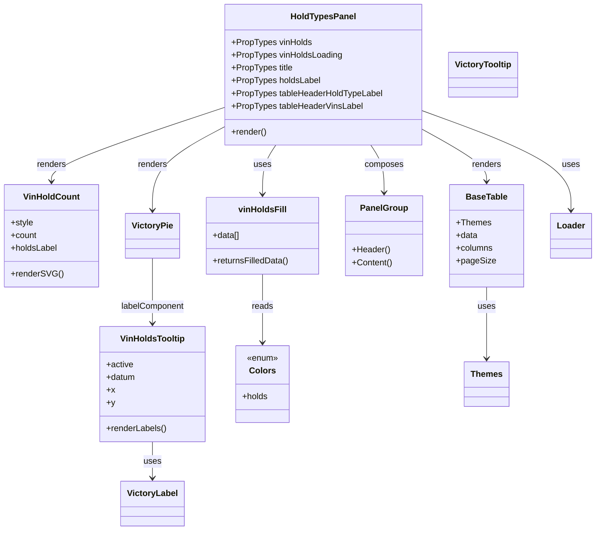

# Diagram: web/portal/src/pages/finishedvehicle/dashboard/components/organisms/FinishedVehicle.HoldTypesPanel.organism.js


> Auto-generated by Obscura crawlers

## Diagram 1



### SVG

<svg id="container" width="1091.140625" xmlns="http://www.w3.org/2000/svg" class="classDiagram" height="994" viewBox="0 0 1091.140625 994" role="graphics-document document" aria-roledescription="class"><style>#container{font-family:"trebuchet ms",verdana,arial,sans-serif;font-size:16px;fill:#333;}@keyframes edge-animation-frame{from{stroke-dashoffset:0;}}@keyframes dash{to{stroke-dashoffset:0;}}#container .edge-animation-slow{stroke-dasharray:9,5!important;stroke-dashoffset:900;animation:dash 50s linear infinite;stroke-linecap:round;}#container .edge-animation-fast{stroke-dasharray:9,5!important;stroke-dashoffset:900;animation:dash 20s linear infinite;stroke-linecap:round;}#container .error-icon{fill:#552222;}#container .error-text{fill:#552222;stroke:#552222;}#container .edge-thickness-normal{stroke-width:1px;}#container .edge-thickness-thick{stroke-width:3.5px;}#container .edge-pattern-solid{stroke-dasharray:0;}#container .edge-thickness-invisible{stroke-width:0;fill:none;}#container .edge-pattern-dashed{stroke-dasharray:3;}#container .edge-pattern-dotted{stroke-dasharray:2;}#container .marker{fill:#333333;stroke:#333333;}#container .marker.cross{stroke:#333333;}#container svg{font-family:"trebuchet ms",verdana,arial,sans-serif;font-size:16px;}#container p{margin:0;}#container g.classGroup text{fill:#9370DB;stroke:none;font-family:"trebuchet ms",verdana,arial,sans-serif;font-size:10px;}#container g.classGroup text .title{font-weight:bolder;}#container .nodeLabel,#container .edgeLabel{color:#131300;}#container .edgeLabel .label rect{fill:#ECECFF;}#container .label text{fill:#131300;}#container .labelBkg{background:#ECECFF;}#container .edgeLabel .label span{background:#ECECFF;}#container .classTitle{font-weight:bolder;}#container .node rect,#container .node circle,#container .node ellipse,#container .node polygon,#container .node path{fill:#ECECFF;stroke:#9370DB;stroke-width:1px;}#container .divider{stroke:#9370DB;stroke-width:1;}#container g.clickable{cursor:pointer;}#container g.classGroup rect{fill:#ECECFF;stroke:#9370DB;}#container g.classGroup line{stroke:#9370DB;stroke-width:1;}#container .classLabel .box{stroke:none;stroke-width:0;fill:#ECECFF;opacity:0.5;}#container .classLabel .label{fill:#9370DB;font-size:10px;}#container .relation{stroke:#333333;stroke-width:1;fill:none;}#container .dashed-line{stroke-dasharray:3;}#container .dotted-line{stroke-dasharray:1 2;}#container #compositionStart,#container .composition{fill:#333333!important;stroke:#333333!important;stroke-width:1;}#container #compositionEnd,#container .composition{fill:#333333!important;stroke:#333333!important;stroke-width:1;}#container #dependencyStart,#container .dependency{fill:#333333!important;stroke:#333333!important;stroke-width:1;}#container #dependencyStart,#container .dependency{fill:#333333!important;stroke:#333333!important;stroke-width:1;}#container #extensionStart,#container .extension{fill:transparent!important;stroke:#333333!important;stroke-width:1;}#container #extensionEnd,#container .extension{fill:transparent!important;stroke:#333333!important;stroke-width:1;}#container #aggregationStart,#container .aggregation{fill:transparent!important;stroke:#333333!important;stroke-width:1;}#container #aggregationEnd,#container .aggregation{fill:transparent!important;stroke:#333333!important;stroke-width:1;}#container #lollipopStart,#container .lollipop{fill:#ECECFF!important;stroke:#333333!important;stroke-width:1;}#container #lollipopEnd,#container .lollipop{fill:#ECECFF!important;stroke:#333333!important;stroke-width:1;}#container .edgeTerminals{font-size:11px;line-height:initial;}#container .classTitleText{text-anchor:middle;font-size:18px;fill:#333;}#container .label-icon{display:inline-block;height:1em;overflow:visible;vertical-align:-0.125em;}#container .node .label-icon path{fill:currentColor;stroke:revert;stroke-width:revert;}#container :root{--mermaid-font-family:"trebuchet ms",verdana,arial,sans-serif;}</style><g><defs><marker id="container_class-aggregationStart" class="marker aggregation class" refX="18" refY="7" markerWidth="190" markerHeight="240" orient="auto"><path d="M 18,7 L9,13 L1,7 L9,1 Z"></path></marker></defs><defs><marker id="container_class-aggregationEnd" class="marker aggregation class" refX="1" refY="7" markerWidth="20" markerHeight="28" orient="auto"><path d="M 18,7 L9,13 L1,7 L9,1 Z"></path></marker></defs><defs><marker id="container_class-extensionStart" class="marker extension class" refX="18" refY="7" markerWidth="190" markerHeight="240" orient="auto"><path d="M 1,7 L18,13 V 1 Z"></path></marker></defs><defs><marker id="container_class-extensionEnd" class="marker extension class" refX="1" refY="7" markerWidth="20" markerHeight="28" orient="auto"><path d="M 1,1 V 13 L18,7 Z"></path></marker></defs><defs><marker id="container_class-compositionStart" class="marker composition class" refX="18" refY="7" markerWidth="190" markerHeight="240" orient="auto"><path d="M 18,7 L9,13 L1,7 L9,1 Z"></path></marker></defs><defs><marker id="container_class-compositionEnd" class="marker composition class" refX="1" refY="7" markerWidth="20" markerHeight="28" orient="auto"><path d="M 18,7 L9,13 L1,7 L9,1 Z"></path></marker></defs><defs><marker id="container_class-dependencyStart" class="marker dependency class" refX="6" refY="7" markerWidth="190" markerHeight="240" orient="auto"><path d="M 5,7 L9,13 L1,7 L9,1 Z"></path></marker></defs><defs><marker id="container_class-dependencyEnd" class="marker dependency class" refX="13" refY="7" markerWidth="20" markerHeight="28" orient="auto"><path d="M 18,7 L9,13 L14,7 L9,1 Z"></path></marker></defs><defs><marker id="container_class-lollipopStart" class="marker lollipop class" refX="13" refY="7" markerWidth="190" markerHeight="240" orient="auto"><circle stroke="black" fill="transparent" cx="7" cy="7" r="6"></circle></marker></defs><defs><marker id="container_class-lollipopEnd" class="marker lollipop class" refX="1" refY="7" markerWidth="190" markerHeight="240" orient="auto"><circle stroke="black" fill="transparent" cx="7" cy="7" r="6"></circle></marker></defs><g class="root"><g class="clusters"></g><g class="edgePaths"><path d="M503.862,272L499.743,278.167C495.623,284.333,487.384,296.667,483.264,312C479.145,327.333,479.145,345.667,479.145,354.833L479.145,364" id="id_HoldTypesPanel_vinHoldsFill_1" class="edge-thickness-normal edge-pattern-solid relation" style=";;;" data-edge="true" data-et="edge" data-id="id_HoldTypesPanel_vinHoldsFill_1" data-points="W3sieCI6NTAzLjg2MjM2ODI1MDczOTcsInkiOjI3Mn0seyJ4Ijo0NzkuMTQ0NTMxMjUsInkiOjMwOX0seyJ4Ijo0NzkuMTQ0NTMxMjUsInkiOjM3MH1d" marker-end="url(#container_class-dependencyEnd)"></path><path d="M680.227,272L684.347,278.167C688.467,284.333,696.706,296.667,700.826,311.5C704.945,326.333,704.945,343.667,704.945,352.333L704.945,361" id="id_HoldTypesPanel_PanelGroup_2" class="edge-thickness-normal edge-pattern-solid relation" style=";;;" data-edge="true" data-et="edge" data-id="id_HoldTypesPanel_PanelGroup_2" data-points="W3sieCI6NjgwLjIyNzQ3NTQ5OTI2MDMsInkiOjI3Mn0seyJ4Ijo3MDQuOTQ1MzEyNSwieSI6MzA5fSx7IngiOjcwNC45NDUzMTI1LCJ5IjozNjd9XQ==" marker-end="url(#container_class-dependencyEnd)"></path><path d="M775.459,208.307L820.522,225.089C865.585,241.871,955.71,275.436,1000.773,306.384C1045.836,337.333,1045.836,365.667,1045.836,379.833L1045.836,394" id="id_HoldTypesPanel_Loader_3" class="edge-thickness-normal edge-pattern-solid relation" style=";;;" data-edge="true" data-et="edge" data-id="id_HoldTypesPanel_Loader_3" data-points="W3sieCI6Nzc1LjQ1ODk4NDM3NSwieSI6MjA4LjMwNjcyMTU4NTk0NDc5fSx7IngiOjEwNDUuODM1OTM3NSwieSI6MzA5fSx7IngiOjEwNDUuODM1OTM3NSwieSI6NDAwfV0=" marker-end="url(#container_class-dependencyEnd)"></path><path d="M408.631,201.981L355.849,219.818C303.068,237.654,197.505,273.327,144.723,296.33C91.941,319.333,91.941,329.667,91.941,334.833L91.941,340" id="id_HoldTypesPanel_VinHoldCount_4" class="edge-thickness-normal edge-pattern-solid relation" style=";;;" data-edge="true" data-et="edge" data-id="id_HoldTypesPanel_VinHoldCount_4" data-points="W3sieCI6NDA4LjYzMDg1OTM3NSwieSI6MjAxLjk4MTEyMTA5NjAyMzF9LHsieCI6OTEuOTQxNDA2MjUsInkiOjMwOX0seyJ4Ijo5MS45NDE0MDYyNSwieSI6MzQ2fV0=" marker-end="url(#container_class-dependencyEnd)"></path><path d="M408.631,237.761L386.355,249.634C364.079,261.507,319.528,285.254,297.252,311.294C274.977,337.333,274.977,365.667,274.977,379.833L274.977,394" id="id_HoldTypesPanel_VictoryPie_5" class="edge-thickness-normal edge-pattern-solid relation" style=";;;" data-edge="true" data-et="edge" data-id="id_HoldTypesPanel_VictoryPie_5" data-points="W3sieCI6NDA4LjYzMDg1OTM3NSwieSI6MjM3Ljc2MTE3ODc2Nzg4Njk1fSx7IngiOjI3NC45NzY1NjI1LCJ5IjozMDl9LHsieCI6Mjc0Ljk3NjU2MjUsInkiOjQwMH1d" marker-end="url(#container_class-dependencyEnd)"></path><path d="M775.459,243.304L794.899,254.253C814.34,265.203,853.221,287.101,872.661,303.217C892.102,319.333,892.102,329.667,892.102,334.833L892.102,340" id="id_HoldTypesPanel_BaseTable_6" class="edge-thickness-normal edge-pattern-solid relation" style=";;;" data-edge="true" data-et="edge" data-id="id_HoldTypesPanel_BaseTable_6" data-points="W3sieCI6Nzc1LjQ1ODk4NDM3NSwieSI6MjQzLjMwMzc1MTI0NDg4MjE2fSx7IngiOjg5Mi4xMDE1NjI1LCJ5IjozMDl9LHsieCI6ODkyLjEwMTU2MjUsInkiOjM0Nn1d" marker-end="url(#container_class-dependencyEnd)"></path><path d="M274.977,484L274.977,499.167C274.977,514.333,274.977,544.667,274.977,565C274.977,585.333,274.977,595.667,274.977,600.833L274.977,606" id="id_VictoryPie_VinHoldsTooltip_7" class="edge-thickness-normal edge-pattern-solid relation" style=";;;" data-edge="true" data-et="edge" data-id="id_VictoryPie_VinHoldsTooltip_7" data-points="W3sieCI6Mjc0Ljk3NjU2MjUsInkiOjQ4NH0seyJ4IjoyNzQuOTc2NTYyNSwieSI6NTc1fSx7IngiOjI3NC45NzY1NjI1LCJ5Ijo2MTJ9XQ==" marker-end="url(#container_class-dependencyEnd)"></path><path d="M274.977,828L274.977,834.167C274.977,840.333,274.977,852.667,274.977,864C274.977,875.333,274.977,885.667,274.977,890.833L274.977,896" id="id_VinHoldsTooltip_VictoryLabel_8" class="edge-thickness-normal edge-pattern-solid relation" style=";;;" data-edge="true" data-et="edge" data-id="id_VinHoldsTooltip_VictoryLabel_8" data-points="W3sieCI6Mjc0Ljk3NjU2MjUsInkiOjgyOH0seyJ4IjoyNzQuOTc2NTYyNSwieSI6ODY1fSx7IngiOjI3NC45NzY1NjI1LCJ5Ijo5MDJ9XQ==" marker-end="url(#container_class-dependencyEnd)"></path><path d="M479.145,514L479.145,524.167C479.145,534.333,479.145,554.667,479.145,576C479.145,597.333,479.145,619.667,479.145,630.833L479.145,642" id="id_vinHoldsFill_Colors_9" class="edge-thickness-normal edge-pattern-solid relation" style=";;;" data-edge="true" data-et="edge" data-id="id_vinHoldsFill_Colors_9" data-points="W3sieCI6NDc5LjE0NDUzMTI1LCJ5Ijo1MTR9LHsieCI6NDc5LjE0NDUzMTI1LCJ5Ijo1NzV9LHsieCI6NDc5LjE0NDUzMTI1LCJ5Ijo2NDh9XQ==" marker-end="url(#container_class-dependencyEnd)"></path><path d="M892.102,538L892.102,544.167C892.102,550.333,892.102,562.667,892.102,585C892.102,607.333,892.102,639.667,892.102,655.833L892.102,672" id="id_BaseTable_Themes_10" class="edge-thickness-normal edge-pattern-solid relation" style=";;;" data-edge="true" data-et="edge" data-id="id_BaseTable_Themes_10" data-points="W3sieCI6ODkyLjEwMTU2MjUsInkiOjUzOH0seyJ4Ijo4OTIuMTAxNTYyNSwieSI6NTc1fSx7IngiOjg5Mi4xMDE1NjI1LCJ5Ijo2Nzh9XQ==" marker-end="url(#container_class-dependencyEnd)"></path></g><g class="edgeLabels"><g class="edgeLabel" transform="translate(479.14453125, 309)"><g class="label" data-id="id_HoldTypesPanel_vinHoldsFill_1" transform="translate(-16.4921875, -12)"><foreignObject width="32.984375" height="24"><div xmlns="http://www.w3.org/1999/xhtml" class="labelBkg" style="display: table-cell; white-space: nowrap; line-height: 1.5; max-width: 200px; text-align: center;"><span class="edgeLabel"><p>uses</p></span></div></foreignObject></g></g><g class="edgeLabel" transform="translate(704.9453125, 309)"><g class="label" data-id="id_HoldTypesPanel_PanelGroup_2" transform="translate(-36.453125, -12)"><foreignObject width="72.90625" height="24"><div xmlns="http://www.w3.org/1999/xhtml" class="labelBkg" style="display: table-cell; white-space: nowrap; line-height: 1.5; max-width: 200px; text-align: center;"><span class="edgeLabel"><p>composes</p></span></div></foreignObject></g></g><g class="edgeLabel" transform="translate(1045.8359375, 309)"><g class="label" data-id="id_HoldTypesPanel_Loader_3" transform="translate(-16.4921875, -12)"><foreignObject width="32.984375" height="24"><div xmlns="http://www.w3.org/1999/xhtml" class="labelBkg" style="display: table-cell; white-space: nowrap; line-height: 1.5; max-width: 200px; text-align: center;"><span class="edgeLabel"><p>uses</p></span></div></foreignObject></g></g><g class="edgeLabel" transform="translate(91.94140625, 309)"><g class="label" data-id="id_HoldTypesPanel_VinHoldCount_4" transform="translate(-27.75, -12)"><foreignObject width="55.5" height="24"><div xmlns="http://www.w3.org/1999/xhtml" class="labelBkg" style="display: table-cell; white-space: nowrap; line-height: 1.5; max-width: 200px; text-align: center;"><span class="edgeLabel"><p>renders</p></span></div></foreignObject></g></g><g class="edgeLabel" transform="translate(274.9765625, 309)"><g class="label" data-id="id_HoldTypesPanel_VictoryPie_5" transform="translate(-27.75, -12)"><foreignObject width="55.5" height="24"><div xmlns="http://www.w3.org/1999/xhtml" class="labelBkg" style="display: table-cell; white-space: nowrap; line-height: 1.5; max-width: 200px; text-align: center;"><span class="edgeLabel"><p>renders</p></span></div></foreignObject></g></g><g class="edgeLabel" transform="translate(892.1015625, 309)"><g class="label" data-id="id_HoldTypesPanel_BaseTable_6" transform="translate(-27.75, -12)"><foreignObject width="55.5" height="24"><div xmlns="http://www.w3.org/1999/xhtml" class="labelBkg" style="display: table-cell; white-space: nowrap; line-height: 1.5; max-width: 200px; text-align: center;"><span class="edgeLabel"><p>renders</p></span></div></foreignObject></g></g><g class="edgeLabel" transform="translate(274.9765625, 575)"><g class="label" data-id="id_VictoryPie_VinHoldsTooltip_7" transform="translate(-60.015625, -12)"><foreignObject width="120.03125" height="24"><div xmlns="http://www.w3.org/1999/xhtml" class="labelBkg" style="display: table-cell; white-space: nowrap; line-height: 1.5; max-width: 200px; text-align: center;"><span class="edgeLabel"><p>labelComponent</p></span></div></foreignObject></g></g><g class="edgeLabel" transform="translate(274.9765625, 865)"><g class="label" data-id="id_VinHoldsTooltip_VictoryLabel_8" transform="translate(-16.4921875, -12)"><foreignObject width="32.984375" height="24"><div xmlns="http://www.w3.org/1999/xhtml" class="labelBkg" style="display: table-cell; white-space: nowrap; line-height: 1.5; max-width: 200px; text-align: center;"><span class="edgeLabel"><p>uses</p></span></div></foreignObject></g></g><g class="edgeLabel" transform="translate(479.14453125, 575)"><g class="label" data-id="id_vinHoldsFill_Colors_9" transform="translate(-20.0078125, -12)"><foreignObject width="40.015625" height="24"><div xmlns="http://www.w3.org/1999/xhtml" class="labelBkg" style="display: table-cell; white-space: nowrap; line-height: 1.5; max-width: 200px; text-align: center;"><span class="edgeLabel"><p>reads</p></span></div></foreignObject></g></g><g class="edgeLabel" transform="translate(892.1015625, 575)"><g class="label" data-id="id_BaseTable_Themes_10" transform="translate(-16.4921875, -12)"><foreignObject width="32.984375" height="24"><div xmlns="http://www.w3.org/1999/xhtml" class="labelBkg" style="display: table-cell; white-space: nowrap; line-height: 1.5; max-width: 200px; text-align: center;"><span class="edgeLabel"><p>uses</p></span></div></foreignObject></g></g></g><g class="nodes"><g class="node default" id="classId-HoldTypesPanel-0" transform="translate(592.044921875, 140)"><g class="basic label-container"><path d="M-183.4140625 -132 L183.4140625 -132 L183.4140625 132 L-183.4140625 132" stroke="none" stroke-width="0" fill="#ECECFF" style=""></path><path d="M-183.4140625 -132 C-74.96841964945362 -132, 33.477223201092755 -132, 183.4140625 -132 M-183.4140625 -132 C-97.73028986735657 -132, -12.04651723471315 -132, 183.4140625 -132 M183.4140625 -132 C183.4140625 -67.43819364316175, 183.4140625 -2.8763872863235065, 183.4140625 132 M183.4140625 -132 C183.4140625 -62.3213624008045, 183.4140625 7.357275198390994, 183.4140625 132 M183.4140625 132 C104.62637595965477 132, 25.83868941930953 132, -183.4140625 132 M183.4140625 132 C89.173002925786 132, -5.068056648428012 132, -183.4140625 132 M-183.4140625 132 C-183.4140625 27.95966308412264, -183.4140625 -76.08067383175472, -183.4140625 -132 M-183.4140625 132 C-183.4140625 71.21049806627404, -183.4140625 10.420996132548083, -183.4140625 -132" stroke="#9370DB" stroke-width="1.3" fill="none" stroke-dasharray="0 0" style=""></path></g><g class="annotation-group text" transform="translate(0, -108)"></g><g class="label-group text" transform="translate(-58.515625, -108)"><g class="label" style="font-weight: bolder" transform="translate(0,-12)"><foreignObject width="117.03125" height="24"><div xmlns="http://www.w3.org/1999/xhtml" style="display: table-cell; white-space: nowrap; line-height: 1.5; max-width: 166px; text-align: center;"><span class="nodeLabel markdown-node-label" style=""><p>HoldTypesPanel</p></span></div></foreignObject></g></g><g class="members-group text" transform="translate(-171.4140625, -60)"><g class="label" style="" transform="translate(0,-12)"><foreignObject width="150.578125" height="24"><div xmlns="http://www.w3.org/1999/xhtml" style="display: table-cell; white-space: nowrap; line-height: 1.5; max-width: 208px; text-align: center;"><span class="nodeLabel markdown-node-label" style=""><p>+PropTypes vinHolds</p></span></div></foreignObject></g><g class="label" style="" transform="translate(0,12)"><foreignObject width="207.8125" height="24"><div xmlns="http://www.w3.org/1999/xhtml" style="display: table-cell; white-space: nowrap; line-height: 1.5; max-width: 266px; text-align: center;"><span class="nodeLabel markdown-node-label" style=""><p>+PropTypes vinHoldsLoading</p></span></div></foreignObject></g><g class="label" style="" transform="translate(0,36)"><foreignObject width="116.1875" height="24"><div xmlns="http://www.w3.org/1999/xhtml" style="display: table-cell; white-space: nowrap; line-height: 1.5; max-width: 174px; text-align: center;"><span class="nodeLabel markdown-node-label" style=""><p>+PropTypes title</p></span></div></foreignObject></g><g class="label" style="" transform="translate(0,60)"><foreignObject width="166.75" height="24"><div xmlns="http://www.w3.org/1999/xhtml" style="display: table-cell; white-space: nowrap; line-height: 1.5; max-width: 224px; text-align: center;"><span class="nodeLabel markdown-node-label" style=""><p>+PropTypes holdsLabel</p></span></div></foreignObject></g><g class="label" style="" transform="translate(0,84)"><foreignObject width="284.3125" height="24"><div xmlns="http://www.w3.org/1999/xhtml" style="display: table-cell; white-space: nowrap; line-height: 1.5; max-width: 342px; text-align: center;"><span class="nodeLabel markdown-node-label" style=""><p>+PropTypes tableHeaderHoldTypeLabel</p></span></div></foreignObject></g><g class="label" style="" transform="translate(0,108)"><foreignObject width="246.4375" height="24"><div xmlns="http://www.w3.org/1999/xhtml" style="display: table-cell; white-space: nowrap; line-height: 1.5; max-width: 304px; text-align: center;"><span class="nodeLabel markdown-node-label" style=""><p>+PropTypes tableHeaderVinsLabel</p></span></div></foreignObject></g></g><g class="methods-group text" transform="translate(-171.4140625, 108)"><g class="label" style="" transform="translate(0,-12)"><foreignObject width="66.609375" height="24"><div xmlns="http://www.w3.org/1999/xhtml" style="display: table-cell; white-space: nowrap; line-height: 1.5; max-width: 124px; text-align: center;"><span class="nodeLabel markdown-node-label" style=""><p>+render()</p></span></div></foreignObject></g></g><g class="divider" style=""><path d="M-183.4140625 -84 C-95.49817968808388 -84, -7.58229687616776 -84, 183.4140625 -84 M-183.4140625 -84 C-92.4818772584375 -84, -1.5496920168750137 -84, 183.4140625 -84" stroke="#9370DB" stroke-width="1.3" fill="none" stroke-dasharray="0 0" style=""></path></g><g class="divider" style=""><path d="M-183.4140625 84 C-78.78463788086079 84, 25.84478673827843 84, 183.4140625 84 M-183.4140625 84 C-72.19555965552753 84, 39.022943188944936 84, 183.4140625 84" stroke="#9370DB" stroke-width="1.3" fill="none" stroke-dasharray="0 0" style=""></path></g></g><g class="node default" id="classId-VinHoldCount-1" transform="translate(91.94140625, 442)"><g class="basic label-container"><path d="M-83.94140625 -96 L83.94140625 -96 L83.94140625 96 L-83.94140625 96" stroke="none" stroke-width="0" fill="#ECECFF" style=""></path><path d="M-83.94140625 -96 C-30.770043424882267 -96, 22.401319400235465 -96, 83.94140625 -96 M-83.94140625 -96 C-49.2594696963907 -96, -14.577533142781405 -96, 83.94140625 -96 M83.94140625 -96 C83.94140625 -34.412841315398744, 83.94140625 27.174317369202512, 83.94140625 96 M83.94140625 -96 C83.94140625 -40.06226558289577, 83.94140625 15.875468834208462, 83.94140625 96 M83.94140625 96 C23.10698356269492 96, -37.72743912461016 96, -83.94140625 96 M83.94140625 96 C18.926518201225747 96, -46.088369847548506 96, -83.94140625 96 M-83.94140625 96 C-83.94140625 23.662460496790956, -83.94140625 -48.67507900641809, -83.94140625 -96 M-83.94140625 96 C-83.94140625 56.48762652654162, -83.94140625 16.975253053083236, -83.94140625 -96" stroke="#9370DB" stroke-width="1.3" fill="none" stroke-dasharray="0 0" style=""></path></g><g class="annotation-group text" transform="translate(0, -72)"></g><g class="label-group text" transform="translate(-49.9609375, -72)"><g class="label" style="font-weight: bolder" transform="translate(0,-12)"><foreignObject width="99.921875" height="24"><div xmlns="http://www.w3.org/1999/xhtml" style="display: table-cell; white-space: nowrap; line-height: 1.5; max-width: 150px; text-align: center;"><span class="nodeLabel markdown-node-label" style=""><p>VinHoldCount</p></span></div></foreignObject></g></g><g class="members-group text" transform="translate(-71.94140625, -24)"><g class="label" style="" transform="translate(0,-12)"><foreignObject width="42.359375" height="24"><div xmlns="http://www.w3.org/1999/xhtml" style="display: table-cell; white-space: nowrap; line-height: 1.5; max-width: 100px; text-align: center;"><span class="nodeLabel markdown-node-label" style=""><p>+style</p></span></div></foreignObject></g><g class="label" style="" transform="translate(0,12)"><foreignObject width="49.125" height="24"><div xmlns="http://www.w3.org/1999/xhtml" style="display: table-cell; white-space: nowrap; line-height: 1.5; max-width: 107px; text-align: center;"><span class="nodeLabel markdown-node-label" style=""><p>+count</p></span></div></foreignObject></g><g class="label" style="" transform="translate(0,36)"><foreignObject width="87.78125" height="24"><div xmlns="http://www.w3.org/1999/xhtml" style="display: table-cell; white-space: nowrap; line-height: 1.5; max-width: 145px; text-align: center;"><span class="nodeLabel markdown-node-label" style=""><p>+holdsLabel</p></span></div></foreignObject></g></g><g class="methods-group text" transform="translate(-71.94140625, 72)"><g class="label" style="" transform="translate(0,-12)"><foreignObject width="93.921875" height="24"><div xmlns="http://www.w3.org/1999/xhtml" style="display: table-cell; white-space: nowrap; line-height: 1.5; max-width: 151px; text-align: center;"><span class="nodeLabel markdown-node-label" style=""><p>+renderSVG()</p></span></div></foreignObject></g></g><g class="divider" style=""><path d="M-83.94140625 -48 C-23.497838498757197 -48, 36.945729252485606 -48, 83.94140625 -48 M-83.94140625 -48 C-44.83559174515142 -48, -5.7297772403028375 -48, 83.94140625 -48" stroke="#9370DB" stroke-width="1.3" fill="none" stroke-dasharray="0 0" style=""></path></g><g class="divider" style=""><path d="M-83.94140625 48 C-40.35273537326013 48, 3.2359355034797375 48, 83.94140625 48 M-83.94140625 48 C-39.78104957274315 48, 4.3793071045137 48, 83.94140625 48" stroke="#9370DB" stroke-width="1.3" fill="none" stroke-dasharray="0 0" style=""></path></g></g><g class="node default" id="classId-VinHoldsTooltip-2" transform="translate(274.9765625, 720)"><g class="basic label-container"><path d="M-97.8359375 -108 L97.8359375 -108 L97.8359375 108 L-97.8359375 108" stroke="none" stroke-width="0" fill="#ECECFF" style=""></path><path d="M-97.8359375 -108 C-25.286301835876216 -108, 47.26333382824757 -108, 97.8359375 -108 M-97.8359375 -108 C-57.393470331096395 -108, -16.95100316219279 -108, 97.8359375 -108 M97.8359375 -108 C97.8359375 -25.142816727531013, 97.8359375 57.714366544937974, 97.8359375 108 M97.8359375 -108 C97.8359375 -62.58259933509695, 97.8359375 -17.165198670193902, 97.8359375 108 M97.8359375 108 C50.890995400479454 108, 3.9460533009589085 108, -97.8359375 108 M97.8359375 108 C42.32949520142425 108, -13.176947097151498 108, -97.8359375 108 M-97.8359375 108 C-97.8359375 29.472420024582277, -97.8359375 -49.055159950835446, -97.8359375 -108 M-97.8359375 108 C-97.8359375 43.76718531364497, -97.8359375 -20.465629372710055, -97.8359375 -108" stroke="#9370DB" stroke-width="1.3" fill="none" stroke-dasharray="0 0" style=""></path></g><g class="annotation-group text" transform="translate(0, -84)"></g><g class="label-group text" transform="translate(-58.15625, -84)"><g class="label" style="font-weight: bolder" transform="translate(0,-12)"><foreignObject width="116.3125" height="24"><div xmlns="http://www.w3.org/1999/xhtml" style="display: table-cell; white-space: nowrap; line-height: 1.5; max-width: 165px; text-align: center;"><span class="nodeLabel markdown-node-label" style=""><p>VinHoldsTooltip</p></span></div></foreignObject></g></g><g class="members-group text" transform="translate(-85.8359375, -36)"><g class="label" style="" transform="translate(0,-12)"><foreignObject width="50.921875" height="24"><div xmlns="http://www.w3.org/1999/xhtml" style="display: table-cell; white-space: nowrap; line-height: 1.5; max-width: 108px; text-align: center;"><span class="nodeLabel markdown-node-label" style=""><p>+active</p></span></div></foreignObject></g><g class="label" style="" transform="translate(0,12)"><foreignObject width="55.0625" height="24"><div xmlns="http://www.w3.org/1999/xhtml" style="display: table-cell; white-space: nowrap; line-height: 1.5; max-width: 112px; text-align: center;"><span class="nodeLabel markdown-node-label" style=""><p>+datum</p></span></div></foreignObject></g><g class="label" style="" transform="translate(0,36)"><foreignObject width="15.1875" height="24"><div xmlns="http://www.w3.org/1999/xhtml" style="display: table-cell; white-space: nowrap; line-height: 1.5; max-width: 73px; text-align: center;"><span class="nodeLabel markdown-node-label" style=""><p>+x</p></span></div></foreignObject></g><g class="label" style="" transform="translate(0,60)"><foreignObject width="15.703125" height="24"><div xmlns="http://www.w3.org/1999/xhtml" style="display: table-cell; white-space: nowrap; line-height: 1.5; max-width: 73px; text-align: center;"><span class="nodeLabel markdown-node-label" style=""><p>+y</p></span></div></foreignObject></g></g><g class="methods-group text" transform="translate(-85.8359375, 84)"><g class="label" style="" transform="translate(0,-12)"><foreignObject width="113.515625" height="24"><div xmlns="http://www.w3.org/1999/xhtml" style="display: table-cell; white-space: nowrap; line-height: 1.5; max-width: 171px; text-align: center;"><span class="nodeLabel markdown-node-label" style=""><p>+renderLabels()</p></span></div></foreignObject></g></g><g class="divider" style=""><path d="M-97.8359375 -60 C-27.618882732758138 -60, 42.598172034483724 -60, 97.8359375 -60 M-97.8359375 -60 C-40.58283324514658 -60, 16.670271009706838 -60, 97.8359375 -60" stroke="#9370DB" stroke-width="1.3" fill="none" stroke-dasharray="0 0" style=""></path></g><g class="divider" style=""><path d="M-97.8359375 60 C-33.03215353964478 60, 31.771630420710437 60, 97.8359375 60 M-97.8359375 60 C-46.03755624188447 60, 5.760825016231067 60, 97.8359375 60" stroke="#9370DB" stroke-width="1.3" fill="none" stroke-dasharray="0 0" style=""></path></g></g><g class="node default" id="classId-vinHoldsFill-3" transform="translate(479.14453125, 442)"><g class="basic label-container"><path d="M-105.07421875 -72 L105.07421875 -72 L105.07421875 72 L-105.07421875 72" stroke="none" stroke-width="0" fill="#ECECFF" style=""></path><path d="M-105.07421875 -72 C-46.30365569881879 -72, 12.466907352362426 -72, 105.07421875 -72 M-105.07421875 -72 C-39.47404962667672 -72, 26.126119496646567 -72, 105.07421875 -72 M105.07421875 -72 C105.07421875 -20.599085296056998, 105.07421875 30.801829407886004, 105.07421875 72 M105.07421875 -72 C105.07421875 -41.18481018817672, 105.07421875 -10.369620376353438, 105.07421875 72 M105.07421875 72 C22.47973056496147 72, -60.11475762007706 72, -105.07421875 72 M105.07421875 72 C61.22961388013401 72, 17.38500901026802 72, -105.07421875 72 M-105.07421875 72 C-105.07421875 24.699512847171434, -105.07421875 -22.600974305657132, -105.07421875 -72 M-105.07421875 72 C-105.07421875 35.01585343969237, -105.07421875 -1.9682931206152574, -105.07421875 -72" stroke="#9370DB" stroke-width="1.3" fill="none" stroke-dasharray="0 0" style=""></path></g><g class="annotation-group text" transform="translate(0, -48)"></g><g class="label-group text" transform="translate(-42.6484375, -48)"><g class="label" style="font-weight: bolder" transform="translate(0,-12)"><foreignObject width="85.296875" height="24"><div xmlns="http://www.w3.org/1999/xhtml" style="display: table-cell; white-space: nowrap; line-height: 1.5; max-width: 135px; text-align: center;"><span class="nodeLabel markdown-node-label" style=""><p>vinHoldsFill</p></span></div></foreignObject></g></g><g class="members-group text" transform="translate(-93.07421875, 0)"><g class="label" style="" transform="translate(0,-12)"><foreignObject width="50.9375" height="24"><div xmlns="http://www.w3.org/1999/xhtml" style="display: table-cell; white-space: nowrap; line-height: 1.5; max-width: 108px; text-align: center;"><span class="nodeLabel markdown-node-label" style=""><p>+data[]</p></span></div></foreignObject></g></g><g class="methods-group text" transform="translate(-93.07421875, 48)"><g class="label" style="" transform="translate(0,-12)"><foreignObject width="143.5" height="24"><div xmlns="http://www.w3.org/1999/xhtml" style="display: table-cell; white-space: nowrap; line-height: 1.5; max-width: 201px; text-align: center;"><span class="nodeLabel markdown-node-label" style=""><p>+returnsFilledData()</p></span></div></foreignObject></g></g><g class="divider" style=""><path d="M-105.07421875 -24 C-60.573137429047264 -24, -16.07205610809453 -24, 105.07421875 -24 M-105.07421875 -24 C-27.55011249181868 -24, 49.97399376636264 -24, 105.07421875 -24" stroke="#9370DB" stroke-width="1.3" fill="none" stroke-dasharray="0 0" style=""></path></g><g class="divider" style=""><path d="M-105.07421875 24 C-39.53738510110513 24, 25.99944854778974 24, 105.07421875 24 M-105.07421875 24 C-61.22388564109082 24, -17.373552532181634 24, 105.07421875 24" stroke="#9370DB" stroke-width="1.3" fill="none" stroke-dasharray="0 0" style=""></path></g></g><g class="node default" id="classId-Colors-4" transform="translate(479.14453125, 720)"><g class="basic label-container"><path d="M-50.9453125 -72 L50.9453125 -72 L50.9453125 72 L-50.9453125 72" stroke="none" stroke-width="0" fill="#ECECFF" style=""></path><path d="M-50.9453125 -72 C-27.86604787911527 -72, -4.7867832582305425 -72, 50.9453125 -72 M-50.9453125 -72 C-19.6956633598366 -72, 11.553985780326798 -72, 50.9453125 -72 M50.9453125 -72 C50.9453125 -27.27358948550387, 50.9453125 17.45282102899226, 50.9453125 72 M50.9453125 -72 C50.9453125 -15.41112711654634, 50.9453125 41.17774576690732, 50.9453125 72 M50.9453125 72 C16.450946224352172 72, -18.043420051295655 72, -50.9453125 72 M50.9453125 72 C23.12580104975752 72, -4.69371040048496 72, -50.9453125 72 M-50.9453125 72 C-50.9453125 20.676851035138725, -50.9453125 -30.64629792972255, -50.9453125 -72 M-50.9453125 72 C-50.9453125 28.79270442228826, -50.9453125 -14.41459115542348, -50.9453125 -72" stroke="#9370DB" stroke-width="1.3" fill="none" stroke-dasharray="0 0" style=""></path></g><g class="annotation-group text" transform="translate(-29.53125, -48)"><g class="label" style="" transform="translate(0,-12)"><foreignObject width="59.0625" height="24"><div xmlns="http://www.w3.org/1999/xhtml" style="display: table-cell; white-space: nowrap; line-height: 1.5; max-width: 109px; text-align: center;"><span class="nodeLabel markdown-node-label" style=""><p>«enum»</p></span></div></foreignObject></g></g><g class="label-group text" transform="translate(-23.1015625, -24)"><g class="label" style="font-weight: bolder" transform="translate(0,-12)"><foreignObject width="46.203125" height="24"><div xmlns="http://www.w3.org/1999/xhtml" style="display: table-cell; white-space: nowrap; line-height: 1.5; max-width: 95px; text-align: center;"><span class="nodeLabel markdown-node-label" style=""><p>Colors</p></span></div></foreignObject></g></g><g class="members-group text" transform="translate(-38.9453125, 24)"><g class="label" style="" transform="translate(0,-12)"><foreignObject width="48.359375" height="24"><div xmlns="http://www.w3.org/1999/xhtml" style="display: table-cell; white-space: nowrap; line-height: 1.5; max-width: 106px; text-align: center;"><span class="nodeLabel markdown-node-label" style=""><p>+holds</p></span></div></foreignObject></g></g><g class="methods-group text" transform="translate(-38.9453125, 72)"></g><g class="divider" style=""><path d="M-50.9453125 0 C-20.05937455599955 0, 10.8265633880009 0, 50.9453125 0 M-50.9453125 0 C-20.55902816709174 0, 9.827256165816522 0, 50.9453125 0" stroke="#9370DB" stroke-width="1.3" fill="none" stroke-dasharray="0 0" style=""></path></g><g class="divider" style=""><path d="M-50.9453125 48 C-29.32448630768693 48, -7.703660115373857 48, 50.9453125 48 M-50.9453125 48 C-12.588101133865464 48, 25.76911023226907 48, 50.9453125 48" stroke="#9370DB" stroke-width="1.3" fill="none" stroke-dasharray="0 0" style=""></path></g></g><g class="node default" id="classId-VictoryPie-5" transform="translate(274.9765625, 442)"><g class="basic label-container"><path d="M-49.09375 -42 L49.09375 -42 L49.09375 42 L-49.09375 42" stroke="none" stroke-width="0" fill="#ECECFF" style=""></path><path d="M-49.09375 -42 C-22.015463391582347 -42, 5.062823216835305 -42, 49.09375 -42 M-49.09375 -42 C-12.195025539149995 -42, 24.70369892170001 -42, 49.09375 -42 M49.09375 -42 C49.09375 -17.55391716942397, 49.09375 6.892165661152063, 49.09375 42 M49.09375 -42 C49.09375 -19.39480427456257, 49.09375 3.2103914508748588, 49.09375 42 M49.09375 42 C18.30044741207348 42, -12.492855175853038 42, -49.09375 42 M49.09375 42 C14.2244721897669 42, -20.6448056204662 42, -49.09375 42 M-49.09375 42 C-49.09375 16.623042561771456, -49.09375 -8.753914876457088, -49.09375 -42 M-49.09375 42 C-49.09375 18.159986095366623, -49.09375 -5.680027809266754, -49.09375 -42" stroke="#9370DB" stroke-width="1.3" fill="none" stroke-dasharray="0 0" style=""></path></g><g class="annotation-group text" transform="translate(0, -18)"></g><g class="label-group text" transform="translate(-37.09375, -18)"><g class="label" style="font-weight: bolder" transform="translate(0,-12)"><foreignObject width="74.1875" height="24"><div xmlns="http://www.w3.org/1999/xhtml" style="display: table-cell; white-space: nowrap; line-height: 1.5; max-width: 123px; text-align: center;"><span class="nodeLabel markdown-node-label" style=""><p>VictoryPie</p></span></div></foreignObject></g></g><g class="members-group text" transform="translate(-37.09375, 30)"></g><g class="methods-group text" transform="translate(-37.09375, 60)"></g><g class="divider" style=""><path d="M-49.09375 6 C-21.94734531276454 6, 5.19905937447092 6, 49.09375 6 M-49.09375 6 C-14.178770576164737 6, 20.736208847670525 6, 49.09375 6" stroke="#9370DB" stroke-width="1.3" fill="none" stroke-dasharray="0 0" style=""></path></g><g class="divider" style=""><path d="M-49.09375 24 C-16.254016797771257 24, 16.585716404457486 24, 49.09375 24 M-49.09375 24 C-19.36071843487867 24, 10.37231313024266 24, 49.09375 24" stroke="#9370DB" stroke-width="1.3" fill="none" stroke-dasharray="0 0" style=""></path></g></g><g class="node default" id="classId-VictoryLabel-6" transform="translate(274.9765625, 944)"><g class="basic label-container"><path d="M-57.59375 -42 L57.59375 -42 L57.59375 42 L-57.59375 42" stroke="none" stroke-width="0" fill="#ECECFF" style=""></path><path d="M-57.59375 -42 C-27.927498604421018 -42, 1.7387527911579639 -42, 57.59375 -42 M-57.59375 -42 C-15.75661832269342 -42, 26.08051335461316 -42, 57.59375 -42 M57.59375 -42 C57.59375 -10.484506528134531, 57.59375 21.030986943730937, 57.59375 42 M57.59375 -42 C57.59375 -11.778932582224272, 57.59375 18.442134835551457, 57.59375 42 M57.59375 42 C14.975329527548702 42, -27.643090944902596 42, -57.59375 42 M57.59375 42 C30.64923499237159 42, 3.7047199847431784 42, -57.59375 42 M-57.59375 42 C-57.59375 14.404236997525249, -57.59375 -13.191526004949502, -57.59375 -42 M-57.59375 42 C-57.59375 19.381516650352996, -57.59375 -3.2369666992940083, -57.59375 -42" stroke="#9370DB" stroke-width="1.3" fill="none" stroke-dasharray="0 0" style=""></path></g><g class="annotation-group text" transform="translate(0, -18)"></g><g class="label-group text" transform="translate(-45.59375, -18)"><g class="label" style="font-weight: bolder" transform="translate(0,-12)"><foreignObject width="91.1875" height="24"><div xmlns="http://www.w3.org/1999/xhtml" style="display: table-cell; white-space: nowrap; line-height: 1.5; max-width: 140px; text-align: center;"><span class="nodeLabel markdown-node-label" style=""><p>VictoryLabel</p></span></div></foreignObject></g></g><g class="members-group text" transform="translate(-45.59375, 30)"></g><g class="methods-group text" transform="translate(-45.59375, 60)"></g><g class="divider" style=""><path d="M-57.59375 6 C-24.427681260286363 6, 8.738387479427274 6, 57.59375 6 M-57.59375 6 C-19.522786066112985 6, 18.54817786777403 6, 57.59375 6" stroke="#9370DB" stroke-width="1.3" fill="none" stroke-dasharray="0 0" style=""></path></g><g class="divider" style=""><path d="M-57.59375 24 C-19.282530566224047 24, 19.028688867551907 24, 57.59375 24 M-57.59375 24 C-12.054071011427908 24, 33.485607977144184 24, 57.59375 24" stroke="#9370DB" stroke-width="1.3" fill="none" stroke-dasharray="0 0" style=""></path></g></g><g class="node default" id="classId-VictoryTooltip-7" transform="translate(888.802734375, 140)"><g class="basic label-container"><path d="M-63.34375 -42 L63.34375 -42 L63.34375 42 L-63.34375 42" stroke="none" stroke-width="0" fill="#ECECFF" style=""></path><path d="M-63.34375 -42 C-36.02711551568149 -42, -8.710481031362981 -42, 63.34375 -42 M-63.34375 -42 C-17.14168842609837 -42, 29.06037314780326 -42, 63.34375 -42 M63.34375 -42 C63.34375 -12.195071688411133, 63.34375 17.609856623177734, 63.34375 42 M63.34375 -42 C63.34375 -16.144754440875275, 63.34375 9.71049111824945, 63.34375 42 M63.34375 42 C15.93200882259108 42, -31.47973235481784 42, -63.34375 42 M63.34375 42 C13.112484270158696 42, -37.11878145968261 42, -63.34375 42 M-63.34375 42 C-63.34375 9.060568899253383, -63.34375 -23.878862201493234, -63.34375 -42 M-63.34375 42 C-63.34375 10.328451637637954, -63.34375 -21.34309672472409, -63.34375 -42" stroke="#9370DB" stroke-width="1.3" fill="none" stroke-dasharray="0 0" style=""></path></g><g class="annotation-group text" transform="translate(0, -18)"></g><g class="label-group text" transform="translate(-51.34375, -18)"><g class="label" style="font-weight: bolder" transform="translate(0,-12)"><foreignObject width="102.6875" height="24"><div xmlns="http://www.w3.org/1999/xhtml" style="display: table-cell; white-space: nowrap; line-height: 1.5; max-width: 151px; text-align: center;"><span class="nodeLabel markdown-node-label" style=""><p>VictoryTooltip</p></span></div></foreignObject></g></g><g class="members-group text" transform="translate(-51.34375, 30)"></g><g class="methods-group text" transform="translate(-51.34375, 60)"></g><g class="divider" style=""><path d="M-63.34375 6 C-36.643603869504304 6, -9.943457739008608 6, 63.34375 6 M-63.34375 6 C-12.710397032664304 6, 37.92295593467139 6, 63.34375 6" stroke="#9370DB" stroke-width="1.3" fill="none" stroke-dasharray="0 0" style=""></path></g><g class="divider" style=""><path d="M-63.34375 24 C-30.706771312706238 24, 1.9302073745875248 24, 63.34375 24 M-63.34375 24 C-19.465339068112947 24, 24.413071863774107 24, 63.34375 24" stroke="#9370DB" stroke-width="1.3" fill="none" stroke-dasharray="0 0" style=""></path></g></g><g class="node default" id="classId-PanelGroup-8" transform="translate(704.9453125, 442)"><g class="basic label-container"><path d="M-70.7265625 -75 L70.7265625 -75 L70.7265625 75 L-70.7265625 75" stroke="none" stroke-width="0" fill="#ECECFF" style=""></path><path d="M-70.7265625 -75 C-15.770193106085955 -75, 39.18617628782809 -75, 70.7265625 -75 M-70.7265625 -75 C-33.92744276134359 -75, 2.8716769773128163 -75, 70.7265625 -75 M70.7265625 -75 C70.7265625 -18.07907929991233, 70.7265625 38.84184140017534, 70.7265625 75 M70.7265625 -75 C70.7265625 -42.37723061129247, 70.7265625 -9.754461222584936, 70.7265625 75 M70.7265625 75 C42.196817178162945 75, 13.66707185632589 75, -70.7265625 75 M70.7265625 75 C40.83032643577046 75, 10.934090371540911 75, -70.7265625 75 M-70.7265625 75 C-70.7265625 34.252228098379824, -70.7265625 -6.495543803240352, -70.7265625 -75 M-70.7265625 75 C-70.7265625 31.60720672832813, -70.7265625 -11.78558654334374, -70.7265625 -75" stroke="#9370DB" stroke-width="1.3" fill="none" stroke-dasharray="0 0" style=""></path></g><g class="annotation-group text" transform="translate(0, -51)"></g><g class="label-group text" transform="translate(-42.328125, -51)"><g class="label" style="font-weight: bolder" transform="translate(0,-12)"><foreignObject width="84.65625" height="24"><div xmlns="http://www.w3.org/1999/xhtml" style="display: table-cell; white-space: nowrap; line-height: 1.5; max-width: 134px; text-align: center;"><span class="nodeLabel markdown-node-label" style=""><p>PanelGroup</p></span></div></foreignObject></g></g><g class="members-group text" transform="translate(-58.7265625, -3)"></g><g class="methods-group text" transform="translate(-58.7265625, 27)"><g class="label" style="" transform="translate(0,-12)"><foreignObject width="70.96875" height="24"><div xmlns="http://www.w3.org/1999/xhtml" style="display: table-cell; white-space: nowrap; line-height: 1.5; max-width: 128px; text-align: center;"><span class="nodeLabel markdown-node-label" style=""><p>+Header()</p></span></div></foreignObject></g><g class="label" style="" transform="translate(0,12)"><foreignObject width="75.125" height="24"><div xmlns="http://www.w3.org/1999/xhtml" style="display: table-cell; white-space: nowrap; line-height: 1.5; max-width: 132px; text-align: center;"><span class="nodeLabel markdown-node-label" style=""><p>+Content()</p></span></div></foreignObject></g></g><g class="divider" style=""><path d="M-70.7265625 -27 C-31.446871458462766 -27, 7.832819583074468 -27, 70.7265625 -27 M-70.7265625 -27 C-38.576998555564145 -27, -6.427434611128291 -27, 70.7265625 -27" stroke="#9370DB" stroke-width="1.3" fill="none" stroke-dasharray="0 0" style=""></path></g><g class="divider" style=""><path d="M-70.7265625 -3 C-19.886863310327357 -3, 30.952835879345287 -3, 70.7265625 -3 M-70.7265625 -3 C-38.324639824015655 -3, -5.92271714803131 -3, 70.7265625 -3" stroke="#9370DB" stroke-width="1.3" fill="none" stroke-dasharray="0 0" style=""></path></g></g><g class="node default" id="classId-BaseTable-9" transform="translate(892.1015625, 442)"><g class="basic label-container"><path d="M-66.4296875 -96 L66.4296875 -96 L66.4296875 96 L-66.4296875 96" stroke="none" stroke-width="0" fill="#ECECFF" style=""></path><path d="M-66.4296875 -96 C-32.57845390687389 -96, 1.2727796862522212 -96, 66.4296875 -96 M-66.4296875 -96 C-38.450821971008224 -96, -10.471956442016449 -96, 66.4296875 -96 M66.4296875 -96 C66.4296875 -44.029856900805605, 66.4296875 7.94028619838879, 66.4296875 96 M66.4296875 -96 C66.4296875 -56.01141138694682, 66.4296875 -16.022822773893637, 66.4296875 96 M66.4296875 96 C17.377771768456462 96, -31.674143963087076 96, -66.4296875 96 M66.4296875 96 C36.14509171383371 96, 5.860495927667415 96, -66.4296875 96 M-66.4296875 96 C-66.4296875 38.85377291115411, -66.4296875 -18.29245417769178, -66.4296875 -96 M-66.4296875 96 C-66.4296875 56.03806654455685, -66.4296875 16.076133089113696, -66.4296875 -96" stroke="#9370DB" stroke-width="1.3" fill="none" stroke-dasharray="0 0" style=""></path></g><g class="annotation-group text" transform="translate(0, -72)"></g><g class="label-group text" transform="translate(-37.359375, -72)"><g class="label" style="font-weight: bolder" transform="translate(0,-12)"><foreignObject width="74.71875" height="24"><div xmlns="http://www.w3.org/1999/xhtml" style="display: table-cell; white-space: nowrap; line-height: 1.5; max-width: 123px; text-align: center;"><span class="nodeLabel markdown-node-label" style=""><p>BaseTable</p></span></div></foreignObject></g></g><g class="members-group text" transform="translate(-54.4296875, -24)"><g class="label" style="" transform="translate(0,-12)"><foreignObject width="63.46875" height="24"><div xmlns="http://www.w3.org/1999/xhtml" style="display: table-cell; white-space: nowrap; line-height: 1.5; max-width: 121px; text-align: center;"><span class="nodeLabel markdown-node-label" style=""><p>+Themes</p></span></div></foreignObject></g><g class="label" style="" transform="translate(0,12)"><foreignObject width="40.625" height="24"><div xmlns="http://www.w3.org/1999/xhtml" style="display: table-cell; white-space: nowrap; line-height: 1.5; max-width: 98px; text-align: center;"><span class="nodeLabel markdown-node-label" style=""><p>+data</p></span></div></foreignObject></g><g class="label" style="" transform="translate(0,36)"><foreignObject width="69.21875" height="24"><div xmlns="http://www.w3.org/1999/xhtml" style="display: table-cell; white-space: nowrap; line-height: 1.5; max-width: 127px; text-align: center;"><span class="nodeLabel markdown-node-label" style=""><p>+columns</p></span></div></foreignObject></g><g class="label" style="" transform="translate(0,60)"><foreignObject width="71.5" height="24"><div xmlns="http://www.w3.org/1999/xhtml" style="display: table-cell; white-space: nowrap; line-height: 1.5; max-width: 129px; text-align: center;"><span class="nodeLabel markdown-node-label" style=""><p>+pageSize</p></span></div></foreignObject></g></g><g class="methods-group text" transform="translate(-54.4296875, 96)"></g><g class="divider" style=""><path d="M-66.4296875 -48 C-17.981596675278567 -48, 30.466494149442866 -48, 66.4296875 -48 M-66.4296875 -48 C-15.884969444236901 -48, 34.6597486115262 -48, 66.4296875 -48" stroke="#9370DB" stroke-width="1.3" fill="none" stroke-dasharray="0 0" style=""></path></g><g class="divider" style=""><path d="M-66.4296875 72 C-32.53310648839825 72, 1.363474523203493 72, 66.4296875 72 M-66.4296875 72 C-22.980898598418605 72, 20.46789030316279 72, 66.4296875 72" stroke="#9370DB" stroke-width="1.3" fill="none" stroke-dasharray="0 0" style=""></path></g></g><g class="node default" id="classId-Loader-10" transform="translate(1045.8359375, 442)"><g class="basic label-container"><path d="M-37.3046875 -42 L37.3046875 -42 L37.3046875 42 L-37.3046875 42" stroke="none" stroke-width="0" fill="#ECECFF" style=""></path><path d="M-37.3046875 -42 C-21.8619963947182 -42, -6.4193052894364016 -42, 37.3046875 -42 M-37.3046875 -42 C-20.619588131542418 -42, -3.934488763084836 -42, 37.3046875 -42 M37.3046875 -42 C37.3046875 -19.49008853110997, 37.3046875 3.019822937780063, 37.3046875 42 M37.3046875 -42 C37.3046875 -22.947218826960366, 37.3046875 -3.8944376539207326, 37.3046875 42 M37.3046875 42 C8.727702222256266 42, -19.84928305548747 42, -37.3046875 42 M37.3046875 42 C11.44144497018343 42, -14.421797559633141 42, -37.3046875 42 M-37.3046875 42 C-37.3046875 16.386846016074852, -37.3046875 -9.226307967850296, -37.3046875 -42 M-37.3046875 42 C-37.3046875 14.852954760963936, -37.3046875 -12.294090478072128, -37.3046875 -42" stroke="#9370DB" stroke-width="1.3" fill="none" stroke-dasharray="0 0" style=""></path></g><g class="annotation-group text" transform="translate(0, -18)"></g><g class="label-group text" transform="translate(-25.3046875, -18)"><g class="label" style="font-weight: bolder" transform="translate(0,-12)"><foreignObject width="50.609375" height="24"><div xmlns="http://www.w3.org/1999/xhtml" style="display: table-cell; white-space: nowrap; line-height: 1.5; max-width: 101px; text-align: center;"><span class="nodeLabel markdown-node-label" style=""><p>Loader</p></span></div></foreignObject></g></g><g class="members-group text" transform="translate(-25.3046875, 30)"></g><g class="methods-group text" transform="translate(-25.3046875, 60)"></g><g class="divider" style=""><path d="M-37.3046875 6 C-17.331788126240845 6, 2.6411112475183103 6, 37.3046875 6 M-37.3046875 6 C-18.809790964065638 6, -0.3148944281312751 6, 37.3046875 6" stroke="#9370DB" stroke-width="1.3" fill="none" stroke-dasharray="0 0" style=""></path></g><g class="divider" style=""><path d="M-37.3046875 24 C-7.654790830736584 24, 21.995105838526833 24, 37.3046875 24 M-37.3046875 24 C-11.840292429923863 24, 13.624102640152273 24, 37.3046875 24" stroke="#9370DB" stroke-width="1.3" fill="none" stroke-dasharray="0 0" style=""></path></g></g><g class="node default" id="classId-Themes-11" transform="translate(892.1015625, 720)"><g class="basic label-container"><path d="M-40.3984375 -42 L40.3984375 -42 L40.3984375 42 L-40.3984375 42" stroke="none" stroke-width="0" fill="#ECECFF" style=""></path><path d="M-40.3984375 -42 C-14.32792617994832 -42, 11.742585140103358 -42, 40.3984375 -42 M-40.3984375 -42 C-16.406493156593697 -42, 7.585451186812605 -42, 40.3984375 -42 M40.3984375 -42 C40.3984375 -15.06151352410538, 40.3984375 11.876972951789242, 40.3984375 42 M40.3984375 -42 C40.3984375 -23.001749947465278, 40.3984375 -4.003499894930556, 40.3984375 42 M40.3984375 42 C18.22070419889494 42, -3.9570291022101216 42, -40.3984375 42 M40.3984375 42 C20.107463720810024 42, -0.1835100583799516 42, -40.3984375 42 M-40.3984375 42 C-40.3984375 9.270780197995926, -40.3984375 -23.45843960400815, -40.3984375 -42 M-40.3984375 42 C-40.3984375 16.48280611536943, -40.3984375 -9.034387769261137, -40.3984375 -42" stroke="#9370DB" stroke-width="1.3" fill="none" stroke-dasharray="0 0" style=""></path></g><g class="annotation-group text" transform="translate(0, -18)"></g><g class="label-group text" transform="translate(-28.3984375, -18)"><g class="label" style="font-weight: bolder" transform="translate(0,-12)"><foreignObject width="56.796875" height="24"><div xmlns="http://www.w3.org/1999/xhtml" style="display: table-cell; white-space: nowrap; line-height: 1.5; max-width: 106px; text-align: center;"><span class="nodeLabel markdown-node-label" style=""><p>Themes</p></span></div></foreignObject></g></g><g class="members-group text" transform="translate(-28.3984375, 30)"></g><g class="methods-group text" transform="translate(-28.3984375, 60)"></g><g class="divider" style=""><path d="M-40.3984375 6 C-23.771718901986066 6, -7.145000303972132 6, 40.3984375 6 M-40.3984375 6 C-10.47779548962042 6, 19.44284652075916 6, 40.3984375 6" stroke="#9370DB" stroke-width="1.3" fill="none" stroke-dasharray="0 0" style=""></path></g><g class="divider" style=""><path d="M-40.3984375 24 C-23.105731452288673 24, -5.8130254045773455 24, 40.3984375 24 M-40.3984375 24 C-20.568092649733764 24, -0.7377477994675274 24, 40.3984375 24" stroke="#9370DB" stroke-width="1.3" fill="none" stroke-dasharray="0 0" style=""></path></g></g></g></g></g></svg>

## Diagram 2

```mermaid
flowchart LR
    A[HoldTypesPanel(props)] --> B{prepare data}
    B --> C[vinHoldsFill(slice 0..6)]
    C --> D[short list data with fullDescription & fill]
    D --> E[Loader loaded={!vinHoldsLoading}]
    E --> F[Top overlay: VinHoldCount(count, holdsLabel)]
    E --> G[VictoryPie(data)]
    G --> H[VinHoldsTooltip(active, datum, x, y)]
    E --> I[BaseTable(theme=LIGHT, data, columns)]
    style A fill:#f9f,stroke:#333,stroke-width:1px
    style G fill:#ffebcd,stroke:#333,stroke-width:1px
    style I fill:#efe,stroke:#333,stroke-width:1px
```

> SVG rendering failed for this diagram.
