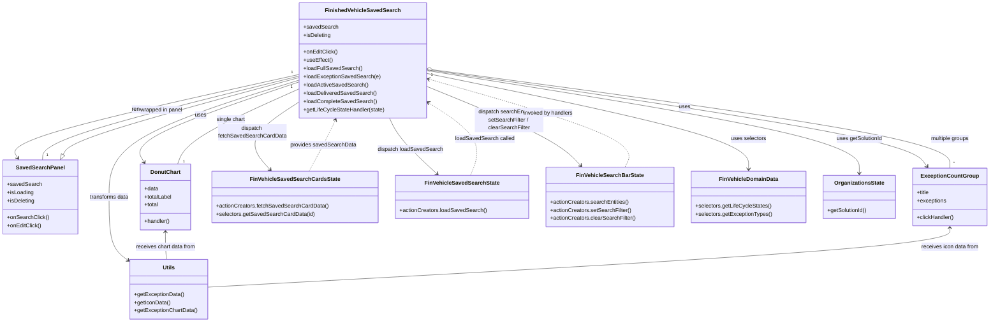

# Diagram: web/portal/src/pages/finishedvehicle/dashboard/components/organisms/FinishedVehicle.SavedSearch.organism.js

> Auto-generated by Obscura crawlers

## Mermaid

### SVG

<svg id="container" width="2842.1953125" xmlns="http://www.w3.org/2000/svg" class="classDiagram" height="938" viewBox="22.8671875 0 2842.1953125 938" role="graphics-document document" aria-roledescription="class"><g><defs><marker id="container_class-aggregationStart" class="marker aggregation class" refX="18" refY="7" markerWidth="190" markerHeight="240" orient="auto"><path d="M 18,7 L9,13 L1,7 L9,1 Z"></path></marker></defs><defs><marker id="container_class-aggregationEnd" class="marker aggregation class" refX="1" refY="7" markerWidth="20" markerHeight="28" orient="auto"><path d="M 18,7 L9,13 L1,7 L9,1 Z"></path></marker></defs><defs><marker id="container_class-extensionStart" class="marker extension class" refX="18" refY="7" markerWidth="190" markerHeight="240" orient="auto"><path d="M 1,7 L18,13 V 1 Z"></path></marker></defs><defs><marker id="container_class-extensionEnd" class="marker extension class" refX="1" refY="7" markerWidth="20" markerHeight="28" orient="auto"><path d="M 1,1 V 13 L18,7 Z"></path></marker></defs><defs><marker id="container_class-compositionStart" class="marker composition class" refX="18" refY="7" markerWidth="190" markerHeight="240" orient="auto"><path d="M 18,7 L9,13 L1,7 L9,1 Z"></path></marker></defs><defs><marker id="container_class-compositionEnd" class="marker composition class" refX="1" refY="7" markerWidth="20" markerHeight="28" orient="auto"><path d="M 18,7 L9,13 L1,7 L9,1 Z"></path></marker></defs><defs><marker id="container_class-dependencyStart" class="marker dependency class" refX="6" refY="7" markerWidth="190" markerHeight="240" orient="auto"><path d="M 5,7 L9,13 L1,7 L9,1 Z"></path></marker></defs><defs><marker id="container_class-dependencyEnd" class="marker dependency class" refX="13" refY="7" markerWidth="20" markerHeight="28" orient="auto"><path d="M 18,7 L9,13 L14,7 L9,1 Z"></path></marker></defs><defs><marker id="container_class-lollipopStart" class="marker lollipop class" refX="13" refY="7" markerWidth="190" markerHeight="240" orient="auto"><circle stroke="black" fill="transparent" cx="7" cy="7" r="6"></circle></marker></defs><defs><marker id="container_class-lollipopEnd" class="marker lollipop class" refX="1" refY="7" markerWidth="190" markerHeight="240" orient="auto"><circle stroke="black" fill="transparent" cx="7" cy="7" r="6"></circle></marker></defs><g class="root"><g class="clusters"></g><g class="edgePaths"><path d="M886.791,216.278L744.951,247.732C603.111,279.185,319.43,342.093,183.12,382.853C46.811,423.614,57.871,442.228,63.402,451.535L68.932,460.842" id="id_FinishedVehicleSavedSearch_SavedSearchPanel_1" class="edge-thickness-normal edge-pattern-solid relation" style=";;;" data-edge="true" data-et="edge" data-id="id_FinishedVehicleSavedSearch_SavedSearchPanel_1" data-points="W3sieCI6ODg2Ljc5MTAxNTYyNSwieSI6MjE2LjI3Nzg4MTQ4NTYwMDM3fSx7IngiOjM1Ljc1LCJ5Ijo0MDV9LHsieCI6NzEuOTk2OTQ4OTY0NDk3MDQsInkiOjQ2Nn1d" marker-end="url(#container_class-dependencyEnd)"></path><path d="M886.791,238.112L805.452,265.926C724.114,293.741,561.437,349.371,486.924,388.496C412.412,427.621,426.064,450.242,432.89,461.553L439.716,472.863" id="id_FinishedVehicleSavedSearch_DonutChart_2" class="edge-thickness-normal edge-pattern-solid relation" style=";;;" data-edge="true" data-et="edge" data-id="id_FinishedVehicleSavedSearch_DonutChart_2" data-points="W3sieCI6ODg2Ljc5MTAxNTYyNSwieSI6MjM4LjExMTYxMTQ2NTYzNjl9LHsieCI6Mzk4Ljc1OTc2NTYyNSwieSI6NDA1fSx7IngiOjQ0Mi44MTY0MDYyNSwieSI6NDc4fV0=" marker-end="url(#container_class-dependencyEnd)"></path><path d="M1250.057,202.715L1479.278,236.429C1708.5,270.143,2166.943,337.572,2406.09,384.65C2645.237,431.728,2665.088,458.455,2675.013,471.819L2684.938,485.183" id="id_FinishedVehicleSavedSearch_ExceptionCountGroup_3" class="edge-thickness-normal edge-pattern-solid relation" style=";;;" data-edge="true" data-et="edge" data-id="id_FinishedVehicleSavedSearch_ExceptionCountGroup_3" data-points="W3sieCI6MTI1MC4wNTY2NDA2MjUsInkiOjIwMi43MTQ3NzU0ODU2MjcyfSx7IngiOjI2MjUuMzg2NzE4NzUsInkiOjQwNX0seyJ4IjoyNjg4LjUxNTg3OTI1Mjk1ODcsInkiOjQ5MH1d" marker-end="url(#container_class-dependencyEnd)"></path><path d="M886.791,296.75L859.653,314.792C832.514,332.833,778.238,368.917,764.756,401.887C751.274,434.858,778.587,464.715,792.244,479.644L805.9,494.573" id="id_FinishedVehicleSavedSearch_FinVehicleSavedSearchCardsState_4" class="edge-thickness-normal edge-pattern-solid relation" style=";;;" data-edge="true" data-et="edge" data-id="id_FinishedVehicleSavedSearch_FinVehicleSavedSearchCardsState_4" data-points="W3sieCI6ODg2Ljc5MTAxNTYyNSwieSI6Mjk2Ljc1MDA1ODExODEwNzM1fSx7IngiOjcyMy45NjA5Mzc1LCJ5Ijo0MDV9LHsieCI6ODA5Ljk1MDE2NjQyMDExODMsInkiOjQ5OX1d" marker-end="url(#container_class-dependencyEnd)"></path><path d="M1145.661,344L1150.335,354.167C1155.009,364.333,1164.357,384.667,1186.959,411.812C1209.561,438.958,1245.416,472.916,1263.344,489.895L1281.272,506.874" id="id_FinishedVehicleSavedSearch_FinVehicleSavedSearchState_5" class="edge-thickness-normal edge-pattern-solid relation" style=";;;" data-edge="true" data-et="edge" data-id="id_FinishedVehicleSavedSearch_FinVehicleSavedSearchState_5" data-points="W3sieCI6MTE0NS42NjA3Mjc2ODgzMTg3LCJ5IjozNDR9LHsieCI6MTE3My43MDUwNzgxMjUsInkiOjQwNX0seyJ4IjoxMjg1LjYyODEzMTkzNDE3MTUsInkiOjUxMX1d" marker-end="url(#container_class-dependencyEnd)"></path><path d="M1250.057,251.519L1311.58,277.099C1373.104,302.679,1496.15,353.84,1569.529,392.349C1642.907,430.859,1666.618,456.718,1678.473,469.648L1690.328,482.578" id="id_FinishedVehicleSavedSearch_FinVehicleSearchBarState_6" class="edge-thickness-normal edge-pattern-solid relation" style=";;;" data-edge="true" data-et="edge" data-id="id_FinishedVehicleSavedSearch_FinVehicleSearchBarState_6" data-points="W3sieCI6MTI1MC4wNTY2NDA2MjUsInkiOjI1MS41MTkwOTk1NjE2OTU5fSx7IngiOjE2MTkuMTk3MjY1NjI1LCJ5Ijo0MDV9LHsieCI6MTY5NC4zODI1Njk4MDM5OTQsInkiOjQ4N31d" marker-end="url(#container_class-dependencyEnd)"></path><path d="M1250.057,213.731L1403.517,245.609C1556.977,277.487,1863.896,341.244,2017.356,387.788C2170.816,434.333,2170.816,463.667,2170.816,478.333L2170.816,493" id="id_FinishedVehicleSavedSearch_FinVehicleDomainData_7" class="edge-thickness-normal edge-pattern-solid relation" style=";;;" data-edge="true" data-et="edge" data-id="id_FinishedVehicleSavedSearch_FinVehicleDomainData_7" data-points="W3sieCI6MTI1MC4wNTY2NDA2MjUsInkiOjIxMy43MzA1ODI0NTExNjcxMn0seyJ4IjoyMTcwLjgxNjQwNjI1LCJ5Ijo0MDV9LHsieCI6MjE3MC44MTY0MDYyNSwieSI6NDk5fV0=" marker-end="url(#container_class-dependencyEnd)"></path><path d="M1250.057,205.266L1456.659,238.555C1663.26,271.844,2076.464,338.422,2283.066,388.378C2489.668,438.333,2489.668,471.667,2489.668,488.333L2489.668,505" id="id_FinishedVehicleSavedSearch_OrganizationsState_8" class="edge-thickness-normal edge-pattern-solid relation" style=";;;" data-edge="true" data-et="edge" data-id="id_FinishedVehicleSavedSearch_OrganizationsState_8" data-points="W3sieCI6MTI1MC4wNTY2NDA2MjUsInkiOjIwNS4yNjU4NDczNDcxMDU5M30seyJ4IjoyNDg5LjY2Nzk2ODc1LCJ5Ijo0MDV9LHsieCI6MjQ4OS42Njc5Njg3NSwieSI6NTExfV0=" marker-end="url(#container_class-dependencyEnd)"></path><path d="M886.791,232.661L794.716,261.384C702.642,290.108,518.493,347.554,426.418,404.444C334.344,461.333,334.344,517.667,334.344,570C334.344,622.333,334.344,670.667,344.298,701.811C354.252,732.956,374.16,746.911,384.113,753.889L394.067,760.867" id="id_FinishedVehicleSavedSearch_Utils_9" class="edge-thickness-normal edge-pattern-solid relation" style=";;;" data-edge="true" data-et="edge" data-id="id_FinishedVehicleSavedSearch_Utils_9" data-points="W3sieCI6ODg2Ljc5MTAxNTYyNSwieSI6MjMyLjY2MTI3NjIwNDAwNzQ2fSx7IngiOjMzNC4zNDM3NSwieSI6NDA1fSx7IngiOjMzNC4zNDM3NSwieSI6NTc0fSx7IngiOjMzNC4zNDM3NSwieSI6NzE5fSx7IngiOjM5OC45ODA0Njg3NSwieSI6NzY0LjMxMTIyMDU0NjM0MTl9XQ==" marker-end="url(#container_class-dependencyEnd)"></path><path d="M204.363,450.911L208.602,443.259C212.841,435.607,221.319,420.304,335.057,382.751C448.795,345.199,667.793,285.398,777.292,255.498L886.791,225.598" id="id_SavedSearchPanel_FinishedVehicleSavedSearch_10" class="edge-thickness-normal edge-pattern-solid relation" style=";;;" data-edge="true" data-et="edge" data-id="id_SavedSearchPanel_FinishedVehicleSavedSearch_10" data-points="W3sieCI6MTk2LjAwMzIzNTk0Njc0NTU4LCJ5Ijo0NjZ9LHsieCI6MjI5Ljc5Njg3NSwieSI6NDA1fSx7IngiOjg4Ni43OTEwMTU2MjUsInkiOjIyNS41OTc2MzU2NDQyMDA3OH1d" marker-start="url(#container_class-extensionStart)"></path><path d="M500.754,676L500.754,683.167C500.754,690.333,500.754,704.667,501.275,718C501.796,731.333,502.838,743.667,503.359,749.833L503.88,756" id="id_DonutChart_Utils_11" class="edge-thickness-normal edge-pattern-solid relation" style=";;;" data-edge="true" data-et="edge" data-id="id_DonutChart_Utils_11" data-points="W3sieCI6NTAwLjc1MzkwNjI1LCJ5Ijo2NzB9LHsieCI6NTAwLjc1MzkwNjI1LCJ5Ijo3MTl9LHsieCI6NTAzLjg3OTk3NzMxODU0ODQsInkiOjc1Nn1d" marker-start="url(#container_class-dependencyStart)"></path><path d="M2750.902,664L2750.902,673.167C2750.902,682.333,2750.902,700.667,2396.332,729.464C2041.762,758.262,1332.621,797.524,978.051,817.154L623.48,836.785" id="id_ExceptionCountGroup_Utils_12" class="edge-thickness-normal edge-pattern-solid relation" style=";;;" data-edge="true" data-et="edge" data-id="id_ExceptionCountGroup_Utils_12" data-points="W3sieCI6Mjc1MC45MDIzNDM3NSwieSI6NjU4fSx7IngiOjI3NTAuOTAyMzQzNzUsInkiOjcxOX0seyJ4Ijo2MjMuNDgwNDY4NzUsInkiOjgzNi43ODUyNTAzNTA1Njc1fV0=" marker-start="url(#container_class-dependencyStart)"></path><path d="M1814.833,487L1821.224,473.333C1827.614,459.667,1840.395,432.333,1747.225,389.614C1654.056,346.894,1454.936,288.789,1355.376,259.736L1255.816,230.683" id="id_FinVehicleSearchBarState_FinishedVehicleSavedSearch_13" class="edge-thickness-normal edge-pattern-dashed relation" style=";;;" data-edge="true" data-et="edge" data-id="id_FinVehicleSearchBarState_FinishedVehicleSavedSearch_13" data-points="W3sieCI6MTgxNC44MzMwNDgyNjE4MzQ0LCJ5Ijo0ODd9LHsieCI6MTg1My4xNzU3ODEyNSwieSI6NDA1fSx7IngiOjEyNTAuMDU2NjQwNjI1LCJ5IjoyMjkuMDAyNjI1NzMwMTY0NTR9XQ==" marker-end="url(#container_class-dependencyEnd)"></path><path d="M1374.924,511L1381.31,493.333C1387.697,475.667,1400.471,440.333,1380.493,405.157C1360.514,369.981,1307.785,334.963,1281.42,317.454L1255.055,299.944" id="id_FinVehicleSavedSearchState_FinishedVehicleSavedSearch_14" class="edge-thickness-normal edge-pattern-dashed relation" style=";;;" data-edge="true" data-et="edge" data-id="id_FinVehicleSavedSearchState_FinishedVehicleSavedSearch_14" data-points="W3sieCI6MTM3NC45MjM3NTg3ODMyODQsInkiOjUxMX0seyJ4IjoxNDEzLjI0NDE0MDYyNSwieSI6NDA1fSx7IngiOjEyNTAuMDU2NjQwNjI1LCJ5IjoyOTYuNjI0ODk1MjEyNjMzNH1d" marker-end="url(#container_class-dependencyEnd)"></path><path d="M916.096,499L923.937,483.333C931.778,467.667,947.46,436.333,959.558,411.409C971.655,386.484,980.168,367.968,984.424,358.71L988.681,349.451" id="id_FinVehicleSavedSearchCardsState_FinishedVehicleSavedSearch_15" class="edge-thickness-normal edge-pattern-dashed relation" style=";;;" data-edge="true" data-et="edge" data-id="id_FinVehicleSavedSearchCardsState_FinishedVehicleSavedSearch_15" data-points="W3sieCI6OTE2LjA5NTg2NDkyMjMzNzIsInkiOjQ5OX0seyJ4Ijo5NjMuMTQyNTc4MTI1LCJ5Ijo0MDV9LHsieCI6OTkxLjE4NjkyODU2MTY4MTMsInkiOjM0NH1d" marker-end="url(#container_class-dependencyEnd)"></path><path d="M1267.149,203.048L1514.441,236.707C1761.733,270.365,2256.318,337.683,2503.61,385.508C2750.902,433.333,2750.902,461.667,2750.902,475.833L2750.902,490" id="id_FinishedVehicleSavedSearch_ExceptionCountGroup_16" class="edge-thickness-normal edge-pattern-solid relation" style=";;;" data-edge="true" data-et="edge" data-id="id_FinishedVehicleSavedSearch_ExceptionCountGroup_16" data-points="W3sieCI6MTI1MC4wNTY2NDA2MjUsInkiOjIwMC43MjE4MDk5MjI4MTQzMn0seyJ4IjoyNzUwLjkwMjM0Mzc1LCJ5Ijo0MDV9LHsieCI6Mjc1MC45MDIzNDM3NSwieSI6NDkwfV0=" marker-start="url(#container_class-aggregationStart)"></path><path d="M886.791,258.05L832.575,282.542C778.358,307.034,669.925,356.017,611.336,392.675C552.747,429.333,544.001,453.667,539.629,465.833L535.256,478" id="id_FinishedVehicleSavedSearch_DonutChart_17" class="edge-thickness-normal edge-pattern-solid relation" style=";;;" data-edge="true" data-et="edge" data-id="id_FinishedVehicleSavedSearch_DonutChart_17" data-points="W3sieCI6ODg2Ljc5MTAxNTYyNSwieSI6MjU4LjA1MDM0MTE2ODcxOTU3fSx7IngiOjU2MS40OTIxODc1LCJ5Ijo0MDV9LHsieCI6NTM1LjI1NjEyNTE4NDkxMTMsInkiOjQ3OH1d"></path><path d="M886.791,221.124L763.434,251.77C640.077,282.416,393.363,343.708,269.375,384.521C145.388,425.333,144.127,445.667,143.497,455.833L142.867,466" id="id_FinishedVehicleSavedSearch_SavedSearchPanel_18" class="edge-thickness-normal edge-pattern-solid relation" style=";;;" data-edge="true" data-et="edge" data-id="id_FinishedVehicleSavedSearch_SavedSearchPanel_18" data-points="W3sieCI6ODg2Ljc5MTAxNTYyNSwieSI6MjIxLjEyMzY5NzY4NzY3Mzg4fSx7IngiOjE0Ni42NDg0Mzc1LCJ5Ijo0MDV9LHsieCI6MTQyLjg2Njk1NjM2MDk0Njc0LCJ5Ijo0NjZ9XQ=="></path></g><g class="edgeLabels"><g class="edgeLabel" transform="translate(426.63362, 318.31983)"><g class="label" data-id="id_FinishedVehicleSavedSearch_SavedSearchPanel_1" transform="translate(-27.75, -12)"><foreignObject width="55.5" height="24">

renders

</foreignObject></g></g><g class="edgeLabel" transform="translate(602.43666, 335.35014)"><g class="label" data-id="id_FinishedVehicleSavedSearch_DonutChart_2" transform="translate(-16.4921875, -12)"><foreignObject width="32.984375" height="24">

uses

</foreignObject></g></g><g class="edgeLabel" transform="translate(1990.09752, 311.56089)"><g class="label" data-id="id_FinishedVehicleSavedSearch_ExceptionCountGroup_3" transform="translate(-16.4921875, -12)"><foreignObject width="32.984375" height="24">

uses

</foreignObject></g></g><g class="edgeLabel" transform="translate(752.32979, 386.1403)"><g class="label" data-id="id_FinishedVehicleSavedSearch_FinVehicleSavedSearchCardsState_4" transform="translate(-100, -24)"><foreignObject width="200" height="48">

dispatch fetchSavedSearchCardData

</foreignObject></g></g><g class="edgeLabel" transform="translate(1205.29365, 434.91688)"><g class="label" data-id="id_FinishedVehicleSavedSearch_FinVehicleSavedSearchState_5" transform="translate(-95.2265625, -12)"><foreignObject width="190.453125" height="24">

dispatch loadSavedSearch

</foreignObject></g></g><g class="edgeLabel" transform="translate(1485.98983, 349.61515)"><g class="label" data-id="id_FinishedVehicleSavedSearch_FinVehicleSearchBarState_6" transform="translate(-100, -36)"><foreignObject width="200" height="72">

dispatch searchEntities / setSearchFilter / clearSearchFilter

</foreignObject></g></g><g class="edgeLabel" transform="translate(2170.81640625, 405)"><g class="label" data-id="id_FinishedVehicleSavedSearch_FinVehicleDomainData_7" transform="translate(-51.34375, -12)"><foreignObject width="102.6875" height="24">

uses selectors

</foreignObject></g></g><g class="edgeLabel" transform="translate(2489.66796875, 405)"><g class="label" data-id="id_FinishedVehicleSavedSearch_OrganizationsState_8" transform="translate(-67.5703125, -12)"><foreignObject width="135.140625" height="24">

uses getSolutionId

</foreignObject></g></g><g class="edgeLabel" transform="translate(334.34375, 574)"><g class="label" data-id="id_FinishedVehicleSavedSearch_Utils_9" transform="translate(-57.8671875, -12)"><foreignObject width="115.734375" height="24">

transforms data

</foreignObject></g></g><g class="edgeLabel"><g class="label" data-id="id_SavedSearchPanel_FinishedVehicleSavedSearch_10" transform="translate(0, 0)"><foreignObject width="0" height="0">

</foreignObject></g></g><g class="edgeLabel" transform="translate(500.75390625, 719)"><g class="label" data-id="id_DonutChart_Utils_11" transform="translate(-88.0703125, -12)"><foreignObject width="176.140625" height="24">

receives chart data from

</foreignObject></g></g><g class="edgeLabel" transform="translate(2750.90234375, 719)"><g class="label" data-id="id_ExceptionCountGroup_Utils_12" transform="translate(-84.5078125, -12)"><foreignObject width="169.015625" height="24">

receives icon data from

</foreignObject></g></g><g class="edgeLabel" transform="translate(1595.0649, 329.68016)"><g class="label" data-id="id_FinVehicleSearchBarState_FinishedVehicleSavedSearch_13" transform="translate(-73.4140625, -12)"><foreignObject width="146.828125" height="24">

invoked by handlers

</foreignObject></g></g><g class="edgeLabel" transform="translate(1413.244140625, 405)"><g class="label" data-id="id_FinVehicleSavedSearchState_FinishedVehicleSavedSearch_14" transform="translate(-85.953125, -12)"><foreignObject width="171.90625" height="24">

loadSavedSearch called

</foreignObject></g></g><g class="edgeLabel" transform="translate(954.64363, 421.98103)"><g class="label" data-id="id_FinVehicleSavedSearchCardsState_FinishedVehicleSavedSearch_15" transform="translate(-95.3359375, -12)"><foreignObject width="190.671875" height="24">

provides savedSearchData

</foreignObject></g></g><g class="edgeLabel" transform="translate(2750.90234375, 405)"><g class="label" data-id="id_FinishedVehicleSavedSearch_ExceptionCountGroup_16" transform="translate(-57.3671875, -12)"><foreignObject width="114.734375" height="24">

multiple groups

</foreignObject></g></g><g class="edgeLabel" transform="translate(688.79508, 347.49252)"><g class="label" data-id="id_FinishedVehicleSavedSearch_DonutChart_17" transform="translate(-42.46875, -12)"><foreignObject width="84.9375" height="24">

single chart

</foreignObject></g></g><g class="edgeLabel" transform="translate(487.06268, 320.42966)"><g class="label" data-id="id_FinishedVehicleSavedSearch_SavedSearchPanel_18" transform="translate(-63.1484375, -12)"><foreignObject width="126.296875" height="24">

wrapped in panel

</foreignObject></g></g><g class="edgeTerminals" transform="translate(1265.3737831754659, 217.94490940773)"><g class="inner" transform="translate(0, 0)"><foreignObject style="width: 9px; height: 12px;">
1
</foreignObject></g></g><g class="edgeTerminals" transform="translate(864.6675572585997, 251.58484058229442)"><g class="inner" transform="translate(0, 0)"><foreignObject style="width: 9px; height: 12px;">
1
</foreignObject></g></g><g class="edgeTerminals" transform="translate(866.1907128701237, 210.78554204659412)"><g class="inner" transform="translate(0, 0)"><foreignObject style="width: 9px; height: 12px;">
1
</foreignObject></g></g><g class="edgeTerminals" transform="translate(2760.9023418750003, 467.4999983928572)"><g class="inner" transform="translate(0, 0)"></g><foreignObject style="width: 9px; height: 12px;">
*
</foreignObject></g><g class="edgeTerminals" transform="translate(550.2909550134561, 461.604583391285)"><g class="inner" transform="translate(0, 0)"></g><foreignObject style="width: 9px; height: 12px;">
1
</foreignObject></g><g class="edgeTerminals" transform="translate(153.92098893639223, 444.4616201778834)"><g class="inner" transform="translate(0, 0)"></g><foreignObject style="width: 9px; height: 12px;">
1
</foreignObject></g></g><g class="nodes"><g class="node default" id="classId-FinishedVehicleSavedSearch-0" transform="translate(1068.423828125, 176)"><g class="basic label-container"><path d="M-181.6328125 -168 L181.6328125 -168 L181.6328125 168 L-181.6328125 168" stroke="none" stroke-width="0" fill="#ECECFF" style=""></path><path d="M-181.6328125 -168 C-76.01430700334518 -168, 29.60419849330964 -168, 181.6328125 -168 M-181.6328125 -168 C-70.01361868091128 -168, 41.60557513817744 -168, 181.6328125 -168 M181.6328125 -168 C181.6328125 -60.853725856314384, 181.6328125 46.29254828737123, 181.6328125 168 M181.6328125 -168 C181.6328125 -66.73382037235044, 181.6328125 34.53235925529913, 181.6328125 168 M181.6328125 168 C108.0130036974053 168, 34.39319489481059 168, -181.6328125 168 M181.6328125 168 C83.5876297148249 168, -14.457553070350201 168, -181.6328125 168 M-181.6328125 168 C-181.6328125 78.01689322840836, -181.6328125 -11.966213543183272, -181.6328125 -168 M-181.6328125 168 C-181.6328125 42.462429661930045, -181.6328125 -83.07514067613991, -181.6328125 -168" stroke="#9370DB" stroke-width="1.3" fill="none" stroke-dasharray="0 0" style=""></path></g><g class="annotation-group text" transform="translate(0, -144)"></g><g class="label-group text" transform="translate(-103.53125, -144)"><g class="label" style="font-weight: bolder" transform="translate(0,-12)"><foreignObject width="207.0625" height="24">

FinishedVehicleSavedSearch

</foreignObject></g></g><g class="members-group text" transform="translate(-169.6328125, -96)"><g class="label" style="" transform="translate(0,-12)"><foreignObject width="98.5625" height="24">

+savedSearch

</foreignObject></g><g class="label" style="" transform="translate(0,12)"><foreignObject width="80.3125" height="24">

+isDeleting

</foreignObject></g></g><g class="methods-group text" transform="translate(-169.6328125, -24)"><g class="label" style="" transform="translate(0,-12)"><foreignObject width="99.015625" height="24">

+onEditClick()

</foreignObject></g><g class="label" style="" transform="translate(0,12)"><foreignObject width="84.8125" height="24">

+useEffect()

</foreignObject></g><g class="label" style="" transform="translate(0,36)"><foreignObject width="168.359375" height="24">

+loadFullSavedSearch()

</foreignObject></g><g class="label" style="" transform="translate(0,60)"><foreignObject width="221.859375" height="24">

+loadExceptionSavedSearch(e)

</foreignObject></g><g class="label" style="" transform="translate(0,84)"><foreignObject width="186.046875" height="24">

+loadActiveSavedSearch()

</foreignObject></g><g class="label" style="" transform="translate(0,108)"><foreignObject width="211.140625" height="24">

+loadDeliveredSavedSearch()

</foreignObject></g><g class="label" style="" transform="translate(0,132)"><foreignObject width="211.1875" height="24">

+loadCompleteSavedSearch()

</foreignObject></g><g class="label" style="" transform="translate(0,156)"><foreignObject width="235.734375" height="24">

+getLifeCycleStateHandler(state)

</foreignObject></g></g><g class="divider" style=""><path d="M-181.6328125 -120 C-94.22116926211197 -120, -6.809526024223942 -120, 181.6328125 -120 M-181.6328125 -120 C-70.57439368294934 -120, 40.48402513410133 -120, 181.6328125 -120" stroke="#9370DB" stroke-width="1.3" fill="none" stroke-dasharray="0 0" style=""></path></g><g class="divider" style=""><path d="M-181.6328125 -48 C-105.0502131939191 -48, -28.467613887838212 -48, 181.6328125 -48 M-181.6328125 -48 C-107.73224153602287 -48, -33.83167057204574 -48, 181.6328125 -48" stroke="#9370DB" stroke-width="1.3" fill="none" stroke-dasharray="0 0" style=""></path></g></g><g class="node default" id="classId-SavedSearchPanel-1" transform="translate(136.171875, 574)"><g class="basic label-container"><path d="M-105.3046875 -108 L105.3046875 -108 L105.3046875 108 L-105.3046875 108" stroke="none" stroke-width="0" fill="#ECECFF" style=""></path><path d="M-105.3046875 -108 C-53.754933091478726 -108, -2.2051786829574525 -108, 105.3046875 -108 M-105.3046875 -108 C-24.240176098380417 -108, 56.82433530323917 -108, 105.3046875 -108 M105.3046875 -108 C105.3046875 -63.3370511851109, 105.3046875 -18.674102370221803, 105.3046875 108 M105.3046875 -108 C105.3046875 -23.021338862467445, 105.3046875 61.95732227506511, 105.3046875 108 M105.3046875 108 C25.438689614200655 108, -54.42730827159869 108, -105.3046875 108 M105.3046875 108 C33.0356344410702 108, -39.2334186178596 108, -105.3046875 108 M-105.3046875 108 C-105.3046875 32.0276142141808, -105.3046875 -43.9447715716384, -105.3046875 -108 M-105.3046875 108 C-105.3046875 28.05423583254901, -105.3046875 -51.89152833490198, -105.3046875 -108" stroke="#9370DB" stroke-width="1.3" fill="none" stroke-dasharray="0 0" style=""></path></g><g class="annotation-group text" transform="translate(0, -84)"></g><g class="label-group text" transform="translate(-66.984375, -84)"><g class="label" style="font-weight: bolder" transform="translate(0,-12)"><foreignObject width="133.96875" height="24">

SavedSearchPanel

</foreignObject></g></g><g class="members-group text" transform="translate(-93.3046875, -36)"><g class="label" style="" transform="translate(0,-12)"><foreignObject width="98.5625" height="24">

+savedSearch

</foreignObject></g><g class="label" style="" transform="translate(0,12)"><foreignObject width="77.203125" height="24">

+isLoading

</foreignObject></g><g class="label" style="" transform="translate(0,36)"><foreignObject width="80.3125" height="24">

+isDeleting

</foreignObject></g></g><g class="methods-group text" transform="translate(-93.3046875, 60)"><g class="label" style="" transform="translate(0,-12)"><foreignObject width="119.625" height="24">

+onSearchClick()

</foreignObject></g><g class="label" style="" transform="translate(0,12)"><foreignObject width="99.015625" height="24">

+onEditClick()

</foreignObject></g></g><g class="divider" style=""><path d="M-105.3046875 -60 C-39.063902361250655 -60, 27.17688277749869 -60, 105.3046875 -60 M-105.3046875 -60 C-46.895971255018836 -60, 11.512744989962329 -60, 105.3046875 -60" stroke="#9370DB" stroke-width="1.3" fill="none" stroke-dasharray="0 0" style=""></path></g><g class="divider" style=""><path d="M-105.3046875 36 C-47.22803765202106 36, 10.848612195957884 36, 105.3046875 36 M-105.3046875 36 C-57.04639304149985 36, -8.788098582999694 36, 105.3046875 36" stroke="#9370DB" stroke-width="1.3" fill="none" stroke-dasharray="0 0" style=""></path></g></g><g class="node default" id="classId-DonutChart-2" transform="translate(500.75390625, 574)"><g class="basic label-container"><path d="M-73.54296875 -96 L73.54296875 -96 L73.54296875 96 L-73.54296875 96" stroke="none" stroke-width="0" fill="#ECECFF" style=""></path><path d="M-73.54296875 -96 C-41.36076404757053 -96, -9.178559345141053 -96, 73.54296875 -96 M-73.54296875 -96 C-41.536442379430234 -96, -9.529916008860468 -96, 73.54296875 -96 M73.54296875 -96 C73.54296875 -39.48408371653687, 73.54296875 17.031832566926255, 73.54296875 96 M73.54296875 -96 C73.54296875 -32.51635856521362, 73.54296875 30.967282869572756, 73.54296875 96 M73.54296875 96 C22.164283805512625 96, -29.21440113897475 96, -73.54296875 96 M73.54296875 96 C40.788546841168845 96, 8.03412493233769 96, -73.54296875 96 M-73.54296875 96 C-73.54296875 48.578653566147516, -73.54296875 1.1573071322950312, -73.54296875 -96 M-73.54296875 96 C-73.54296875 29.2651943636684, -73.54296875 -37.4696112726632, -73.54296875 -96" stroke="#9370DB" stroke-width="1.3" fill="none" stroke-dasharray="0 0" style=""></path></g><g class="annotation-group text" transform="translate(0, -72)"></g><g class="label-group text" transform="translate(-41.9765625, -72)"><g class="label" style="font-weight: bolder" transform="translate(0,-12)"><foreignObject width="83.953125" height="24">

DonutChart

</foreignObject></g></g><g class="members-group text" transform="translate(-61.54296875, -24)"><g class="label" style="" transform="translate(0,-12)"><foreignObject width="40.625" height="24">

+data

</foreignObject></g><g class="label" style="" transform="translate(0,12)"><foreignObject width="81.109375" height="24">

+totalLabel

</foreignObject></g><g class="label" style="" transform="translate(0,36)"><foreignObject width="41.6875" height="24">

+total

</foreignObject></g></g><g class="methods-group text" transform="translate(-61.54296875, 72)"><g class="label" style="" transform="translate(0,-12)"><foreignObject width="74.890625" height="24">

+handler()

</foreignObject></g></g><g class="divider" style=""><path d="M-73.54296875 -48 C-36.541862152657416 -48, 0.4592444446851687 -48, 73.54296875 -48 M-73.54296875 -48 C-30.367833960352762 -48, 12.807300829294476 -48, 73.54296875 -48" stroke="#9370DB" stroke-width="1.3" fill="none" stroke-dasharray="0 0" style=""></path></g><g class="divider" style=""><path d="M-73.54296875 48 C-22.109794186718474 48, 29.32338037656305 48, 73.54296875 48 M-73.54296875 48 C-16.8842181759617 48, 39.7745323980766 48, 73.54296875 48" stroke="#9370DB" stroke-width="1.3" fill="none" stroke-dasharray="0 0" style=""></path></g></g><g class="node default" id="classId-ExceptionCountGroup-3" transform="translate(2750.90234375, 574)"><g class="basic label-container"><path d="M-106.16015625 -84 L106.16015625 -84 L106.16015625 84 L-106.16015625 84" stroke="none" stroke-width="0" fill="#ECECFF" style=""></path><path d="M-106.16015625 -84 C-25.715860259964728 -84, 54.728435730070544 -84, 106.16015625 -84 M-106.16015625 -84 C-52.86896286891154 -84, 0.42223051217692387 -84, 106.16015625 -84 M106.16015625 -84 C106.16015625 -47.275188778149385, 106.16015625 -10.55037755629877, 106.16015625 84 M106.16015625 -84 C106.16015625 -22.187119244157785, 106.16015625 39.62576151168443, 106.16015625 84 M106.16015625 84 C34.01180084402526 84, -38.13655456194948 84, -106.16015625 84 M106.16015625 84 C46.97473042118887 84, -12.210695407622254 84, -106.16015625 84 M-106.16015625 84 C-106.16015625 26.259010966607498, -106.16015625 -31.481978066785004, -106.16015625 -84 M-106.16015625 84 C-106.16015625 49.43145388989897, -106.16015625 14.862907779797936, -106.16015625 -84" stroke="#9370DB" stroke-width="1.3" fill="none" stroke-dasharray="0 0" style=""></path></g><g class="annotation-group text" transform="translate(0, -60)"></g><g class="label-group text" transform="translate(-79.2421875, -60)"><g class="label" style="font-weight: bolder" transform="translate(0,-12)"><foreignObject width="158.484375" height="24">

ExceptionCountGroup

</foreignObject></g></g><g class="members-group text" transform="translate(-94.16015625, -12)"><g class="label" style="" transform="translate(0,-12)"><foreignObject width="37.140625" height="24">

+title

</foreignObject></g><g class="label" style="" transform="translate(0,12)"><foreignObject width="86.21875" height="24">

+exceptions

</foreignObject></g></g><g class="methods-group text" transform="translate(-94.16015625, 60)"><g class="label" style="" transform="translate(0,-12)"><foreignObject width="109.078125" height="24">

+clickHandler()

</foreignObject></g></g><g class="divider" style=""><path d="M-106.16015625 -36 C-38.184590530761 -36, 29.790975188478 -36, 106.16015625 -36 M-106.16015625 -36 C-48.56302073792401 -36, 9.034114774151973 -36, 106.16015625 -36" stroke="#9370DB" stroke-width="1.3" fill="none" stroke-dasharray="0 0" style=""></path></g><g class="divider" style=""><path d="M-106.16015625 36 C-43.528384432978854 36, 19.103387384042293 36, 106.16015625 36 M-106.16015625 36 C-50.1883606574065 36, 5.783434935187003 36, 106.16015625 36" stroke="#9370DB" stroke-width="1.3" fill="none" stroke-dasharray="0 0" style=""></path></g></g><g class="node default" id="classId-FinVehicleSavedSearchCardsState-4" transform="translate(878.55859375, 574)"><g class="basic label-container"><path d="M-234.47265625 -75 L234.47265625 -75 L234.47265625 75 L-234.47265625 75" stroke="none" stroke-width="0" fill="#ECECFF" style=""></path><path d="M-234.47265625 -75 C-121.96019418986357 -75, -9.447732129727143 -75, 234.47265625 -75 M-234.47265625 -75 C-123.91959148959063 -75, -13.36652672918126 -75, 234.47265625 -75 M234.47265625 -75 C234.47265625 -28.335468731300985, 234.47265625 18.32906253739803, 234.47265625 75 M234.47265625 -75 C234.47265625 -38.93721569362789, 234.47265625 -2.8744313872557825, 234.47265625 75 M234.47265625 75 C77.46928739788746 75, -79.53408145422509 75, -234.47265625 75 M234.47265625 75 C80.21936826336304 75, -74.03391972327393 75, -234.47265625 75 M-234.47265625 75 C-234.47265625 23.748588319843186, -234.47265625 -27.502823360313627, -234.47265625 -75 M-234.47265625 75 C-234.47265625 30.57470209482112, -234.47265625 -13.85059581035776, -234.47265625 -75" stroke="#9370DB" stroke-width="1.3" fill="none" stroke-dasharray="0 0" style=""></path></g><g class="annotation-group text" transform="translate(0, -51)"></g><g class="label-group text" transform="translate(-123.4296875, -51)"><g class="label" style="font-weight: bolder" transform="translate(0,-12)"><foreignObject width="246.859375" height="24">

FinVehicleSavedSearchCardsState

</foreignObject></g></g><g class="members-group text" transform="translate(-222.47265625, -3)"></g><g class="methods-group text" transform="translate(-222.47265625, 27)"><g class="label" style="" transform="translate(0,-12)"><foreignObject width="321.515625" height="24">

+actionCreators.fetchSavedSearchCardData()

</foreignObject></g><g class="label" style="" transform="translate(0,12)"><foreignObject width="282.109375" height="24">

+selectors.getSavedSearchCardData(id)

</foreignObject></g></g><g class="divider" style=""><path d="M-234.47265625 -27 C-50.03928596639403 -27, 134.39408431721193 -27, 234.47265625 -27 M-234.47265625 -27 C-130.5643136315612 -27, -26.655971013122382 -27, 234.47265625 -27" stroke="#9370DB" stroke-width="1.3" fill="none" stroke-dasharray="0 0" style=""></path></g><g class="divider" style=""><path d="M-234.47265625 -3 C-111.42996289055515 -3, 11.612730468889708 -3, 234.47265625 -3 M-234.47265625 -3 C-112.94361478275896 -3, 8.585426684482087 -3, 234.47265625 -3" stroke="#9370DB" stroke-width="1.3" fill="none" stroke-dasharray="0 0" style=""></path></g></g><g class="node default" id="classId-FinVehicleSavedSearchState-5" transform="translate(1352.1484375, 574)"><g class="basic label-container"><path d="M-189.1171875 -63 L189.1171875 -63 L189.1171875 63 L-189.1171875 63" stroke="none" stroke-width="0" fill="#ECECFF" style=""></path><path d="M-189.1171875 -63 C-57.25001946138701 -63, 74.61714857722598 -63, 189.1171875 -63 M-189.1171875 -63 C-98.1530294886951 -63, -7.188871477390194 -63, 189.1171875 -63 M189.1171875 -63 C189.1171875 -33.808617539560544, 189.1171875 -4.61723507912108, 189.1171875 63 M189.1171875 -63 C189.1171875 -29.887266397659715, 189.1171875 3.2254672046805695, 189.1171875 63 M189.1171875 63 C111.07723821431918 63, 33.03728892863836 63, -189.1171875 63 M189.1171875 63 C98.68995469432713 63, 8.262721888654255 63, -189.1171875 63 M-189.1171875 63 C-189.1171875 23.197180167662154, -189.1171875 -16.605639664675692, -189.1171875 -63 M-189.1171875 63 C-189.1171875 17.414961247160072, -189.1171875 -28.170077505679856, -189.1171875 -63" stroke="#9370DB" stroke-width="1.3" fill="none" stroke-dasharray="0 0" style=""></path></g><g class="annotation-group text" transform="translate(0, -39)"></g><g class="label-group text" transform="translate(-102.890625, -39)"><g class="label" style="font-weight: bolder" transform="translate(0,-12)"><foreignObject width="205.78125" height="24">

FinVehicleSavedSearchState

</foreignObject></g></g><g class="members-group text" transform="translate(-177.1171875, 9)"></g><g class="methods-group text" transform="translate(-177.1171875, 39)"><g class="label" style="" transform="translate(0,-12)"><foreignObject width="251.34375" height="24">

+actionCreators.loadSavedSearch()

</foreignObject></g></g><g class="divider" style=""><path d="M-189.1171875 -15 C-110.13761978300512 -15, -31.158052066010242 -15, 189.1171875 -15 M-189.1171875 -15 C-82.718211657474 -15, 23.680764185052 -15, 189.1171875 -15" stroke="#9370DB" stroke-width="1.3" fill="none" stroke-dasharray="0 0" style=""></path></g><g class="divider" style=""><path d="M-189.1171875 9 C-98.15473851363437 9, -7.192289527268741 9, 189.1171875 9 M-189.1171875 9 C-112.68067257305314 9, -36.24415764610629 9, 189.1171875 9" stroke="#9370DB" stroke-width="1.3" fill="none" stroke-dasharray="0 0" style=""></path></g></g><g class="node default" id="classId-FinVehicleSearchBarState-6" transform="translate(1774.15234375, 574)"><g class="basic label-container"><path d="M-182.88671875 -87 L182.88671875 -87 L182.88671875 87 L-182.88671875 87" stroke="none" stroke-width="0" fill="#ECECFF" style=""></path><path d="M-182.88671875 -87 C-42.12669899005459 -87, 98.63332076989082 -87, 182.88671875 -87 M-182.88671875 -87 C-45.14080169100501 -87, 92.60511536798998 -87, 182.88671875 -87 M182.88671875 -87 C182.88671875 -42.0461190009822, 182.88671875 2.907761998035596, 182.88671875 87 M182.88671875 -87 C182.88671875 -39.71287402938124, 182.88671875 7.57425194123752, 182.88671875 87 M182.88671875 87 C109.36285641428701 87, 35.83899407857402 87, -182.88671875 87 M182.88671875 87 C81.2622367947088 87, -20.362245160582404 87, -182.88671875 87 M-182.88671875 87 C-182.88671875 30.68642640936524, -182.88671875 -25.62714718126952, -182.88671875 -87 M-182.88671875 87 C-182.88671875 32.65234907434266, -182.88671875 -21.69530185131468, -182.88671875 -87" stroke="#9370DB" stroke-width="1.3" fill="none" stroke-dasharray="0 0" style=""></path></g><g class="annotation-group text" transform="translate(0, -63)"></g><g class="label-group text" transform="translate(-93.3203125, -63)"><g class="label" style="font-weight: bolder" transform="translate(0,-12)"><foreignObject width="186.640625" height="24">

FinVehicleSearchBarState

</foreignObject></g></g><g class="members-group text" transform="translate(-170.88671875, -15)"></g><g class="methods-group text" transform="translate(-170.88671875, 15)"><g class="label" style="" transform="translate(0,-12)"><foreignObject width="229.359375" height="24">

+actionCreators.searchEntities()

</foreignObject></g><g class="label" style="" transform="translate(0,12)"><foreignObject width="234.953125" height="24">

+actionCreators.setSearchFilter()

</foreignObject></g><g class="label" style="" transform="translate(0,36)"><foreignObject width="248.453125" height="24">

+actionCreators.clearSearchFilter()

</foreignObject></g></g><g class="divider" style=""><path d="M-182.88671875 -39 C-58.9314808124693 -39, 65.0237571250614 -39, 182.88671875 -39 M-182.88671875 -39 C-40.093624947403896 -39, 102.69946885519221 -39, 182.88671875 -39" stroke="#9370DB" stroke-width="1.3" fill="none" stroke-dasharray="0 0" style=""></path></g><g class="divider" style=""><path d="M-182.88671875 -15 C-74.1964993093498 -15, 34.49372013130039 -15, 182.88671875 -15 M-182.88671875 -15 C-95.97887948975608 -15, -9.071040229512164 -15, 182.88671875 -15" stroke="#9370DB" stroke-width="1.3" fill="none" stroke-dasharray="0 0" style=""></path></g></g><g class="node default" id="classId-FinVehicleDomainData-7" transform="translate(2170.81640625, 574)"><g class="basic label-container"><path d="M-163.77734375 -75 L163.77734375 -75 L163.77734375 75 L-163.77734375 75" stroke="none" stroke-width="0" fill="#ECECFF" style=""></path><path d="M-163.77734375 -75 C-50.760799057169535 -75, 62.25574563566093 -75, 163.77734375 -75 M-163.77734375 -75 C-91.37102652779896 -75, -18.96470930559792 -75, 163.77734375 -75 M163.77734375 -75 C163.77734375 -44.80129020788546, 163.77734375 -14.602580415770923, 163.77734375 75 M163.77734375 -75 C163.77734375 -25.34165671019192, 163.77734375 24.31668657961616, 163.77734375 75 M163.77734375 75 C98.2549648384289 75, 32.73258592685781 75, -163.77734375 75 M163.77734375 75 C71.78354423914395 75, -20.2102552717121 75, -163.77734375 75 M-163.77734375 75 C-163.77734375 15.732062410574628, -163.77734375 -43.535875178850745, -163.77734375 -75 M-163.77734375 75 C-163.77734375 30.23546097882388, -163.77734375 -14.52907804235224, -163.77734375 -75" stroke="#9370DB" stroke-width="1.3" fill="none" stroke-dasharray="0 0" style=""></path></g><g class="annotation-group text" transform="translate(0, -51)"></g><g class="label-group text" transform="translate(-81.5546875, -51)"><g class="label" style="font-weight: bolder" transform="translate(0,-12)"><foreignObject width="163.109375" height="24">

FinVehicleDomainData

</foreignObject></g></g><g class="members-group text" transform="translate(-151.77734375, -3)"></g><g class="methods-group text" transform="translate(-151.77734375, 27)"><g class="label" style="" transform="translate(0,-12)"><foreignObject width="218.21875" height="24">

+selectors.getLifeCycleStates()

</foreignObject></g><g class="label" style="" transform="translate(0,12)"><foreignObject width="222" height="24">

+selectors.getExceptionTypes()

</foreignObject></g></g><g class="divider" style=""><path d="M-163.77734375 -27 C-40.07540187583339 -27, 83.62653999833321 -27, 163.77734375 -27 M-163.77734375 -27 C-88.4493213046529 -27, -13.121298859305796 -27, 163.77734375 -27" stroke="#9370DB" stroke-width="1.3" fill="none" stroke-dasharray="0 0" style=""></path></g><g class="divider" style=""><path d="M-163.77734375 -3 C-52.08908883748404 -3, 59.59916607503192 -3, 163.77734375 -3 M-163.77734375 -3 C-87.37186239783139 -3, -10.966381045662786 -3, 163.77734375 -3" stroke="#9370DB" stroke-width="1.3" fill="none" stroke-dasharray="0 0" style=""></path></g></g><g class="node default" id="classId-OrganizationsState-8" transform="translate(2489.66796875, 574)"><g class="basic label-container"><path d="M-105.07421875 -63 L105.07421875 -63 L105.07421875 63 L-105.07421875 63" stroke="none" stroke-width="0" fill="#ECECFF" style=""></path><path d="M-105.07421875 -63 C-27.266402272523592 -63, 50.541414204952815 -63, 105.07421875 -63 M-105.07421875 -63 C-43.22673022469779 -63, 18.62075830060442 -63, 105.07421875 -63 M105.07421875 -63 C105.07421875 -20.443279587780538, 105.07421875 22.113440824438925, 105.07421875 63 M105.07421875 -63 C105.07421875 -21.330193943870526, 105.07421875 20.339612112258948, 105.07421875 63 M105.07421875 63 C22.777367032081003 63, -59.519484685837995 63, -105.07421875 63 M105.07421875 63 C43.288019029798946 63, -18.49818069040211 63, -105.07421875 63 M-105.07421875 63 C-105.07421875 37.567033339575104, -105.07421875 12.134066679150209, -105.07421875 -63 M-105.07421875 63 C-105.07421875 26.88448973926777, -105.07421875 -9.231020521464458, -105.07421875 -63" stroke="#9370DB" stroke-width="1.3" fill="none" stroke-dasharray="0 0" style=""></path></g><g class="annotation-group text" transform="translate(0, -39)"></g><g class="label-group text" transform="translate(-69.8671875, -39)"><g class="label" style="font-weight: bolder" transform="translate(0,-12)"><foreignObject width="139.734375" height="24">

OrganizationsState

</foreignObject></g></g><g class="members-group text" transform="translate(-93.07421875, 9)"></g><g class="methods-group text" transform="translate(-93.07421875, 39)"><g class="label" style="" transform="translate(0,-12)"><foreignObject width="116.28125" height="24">

+getSolutionId()

</foreignObject></g></g><g class="divider" style=""><path d="M-105.07421875 -15 C-47.259877033515856 -15, 10.554464682968288 -15, 105.07421875 -15 M-105.07421875 -15 C-29.925590823976663 -15, 45.223037102046675 -15, 105.07421875 -15" stroke="#9370DB" stroke-width="1.3" fill="none" stroke-dasharray="0 0" style=""></path></g><g class="divider" style=""><path d="M-105.07421875 9 C-26.318553622331166 9, 52.43711150533767 9, 105.07421875 9 M-105.07421875 9 C-55.74999604348453 9, -6.425773336969058 9, 105.07421875 9" stroke="#9370DB" stroke-width="1.3" fill="none" stroke-dasharray="0 0" style=""></path></g></g><g class="node default" id="classId-Utils-9" transform="translate(511.23046875, 843)"><g class="basic label-container"><path d="M-112.25 -87 L112.25 -87 L112.25 87 L-112.25 87" stroke="none" stroke-width="0" fill="#ECECFF" style=""></path><path d="M-112.25 -87 C-44.31035700206638 -87, 23.629285995867235 -87, 112.25 -87 M-112.25 -87 C-37.01531211029699 -87, 38.21937577940602 -87, 112.25 -87 M112.25 -87 C112.25 -38.171758277338604, 112.25 10.656483445322792, 112.25 87 M112.25 -87 C112.25 -27.748625622956297, 112.25 31.502748754087406, 112.25 87 M112.25 87 C57.401462221527005 87, 2.5529244430540103 87, -112.25 87 M112.25 87 C31.020552766112615 87, -50.20889446777477 87, -112.25 87 M-112.25 87 C-112.25 43.33696698935346, -112.25 -0.32606602129307305, -112.25 -87 M-112.25 87 C-112.25 26.239042015122806, -112.25 -34.52191596975439, -112.25 -87" stroke="#9370DB" stroke-width="1.3" fill="none" stroke-dasharray="0 0" style=""></path></g><g class="annotation-group text" transform="translate(0, -63)"></g><g class="label-group text" transform="translate(-16.796875, -63)"><g class="label" style="font-weight: bolder" transform="translate(0,-12)"><foreignObject width="33.59375" height="24">

Utils

</foreignObject></g></g><g class="members-group text" transform="translate(-100.25, -15)"></g><g class="methods-group text" transform="translate(-100.25, 15)"><g class="label" style="" transform="translate(0,-12)"><foreignObject width="144.875" height="24">

+getExceptionData()

</foreignObject></g><g class="label" style="" transform="translate(0,12)"><foreignObject width="104.90625" height="24">

+getIconData()

</foreignObject></g><g class="label" style="" transform="translate(0,36)"><foreignObject width="183.703125" height="24">

+getExceptionChartData()

</foreignObject></g></g><g class="divider" style=""><path d="M-112.25 -39 C-41.524524970438776 -39, 29.200950059122448 -39, 112.25 -39 M-112.25 -39 C-63.85744818839505 -39, -15.464896376790094 -39, 112.25 -39" stroke="#9370DB" stroke-width="1.3" fill="none" stroke-dasharray="0 0" style=""></path></g><g class="divider" style=""><path d="M-112.25 -15 C-56.17037223837326 -15, -0.0907444767465222 -15, 112.25 -15 M-112.25 -15 C-65.26590971978467 -15, -18.28181943956936 -15, 112.25 -15" stroke="#9370DB" stroke-width="1.3" fill="none" stroke-dasharray="0 0" style=""></path></g></g></g></g></g></svg>
