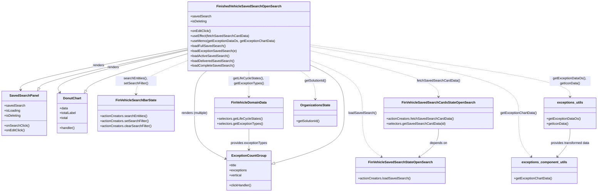

# Diagram: web/portal/src/pages/finishedvehicle/dashboard/components/organisms/FinishedVehicle.SavedSearchOpenSearch.organism.js

> Auto-generated by Obscura crawlers

## Mermaid

### SVG

<svg id="container" width="2858.3359375" xmlns="http://www.w3.org/2000/svg" class="classDiagram" height="932" viewBox="0 0 2858.3359375 932" role="graphics-document document" aria-roledescription="class"><g><defs><marker id="container_class-aggregationStart" class="marker aggregation class" refX="18" refY="7" markerWidth="190" markerHeight="240" orient="auto"><path d="M 18,7 L9,13 L1,7 L9,1 Z"></path></marker></defs><defs><marker id="container_class-aggregationEnd" class="marker aggregation class" refX="1" refY="7" markerWidth="20" markerHeight="28" orient="auto"><path d="M 18,7 L9,13 L1,7 L9,1 Z"></path></marker></defs><defs><marker id="container_class-extensionStart" class="marker extension class" refX="18" refY="7" markerWidth="190" markerHeight="240" orient="auto"><path d="M 1,7 L18,13 V 1 Z"></path></marker></defs><defs><marker id="container_class-extensionEnd" class="marker extension class" refX="1" refY="7" markerWidth="20" markerHeight="28" orient="auto"><path d="M 1,1 V 13 L18,7 Z"></path></marker></defs><defs><marker id="container_class-compositionStart" class="marker composition class" refX="18" refY="7" markerWidth="190" markerHeight="240" orient="auto"><path d="M 18,7 L9,13 L1,7 L9,1 Z"></path></marker></defs><defs><marker id="container_class-compositionEnd" class="marker composition class" refX="1" refY="7" markerWidth="20" markerHeight="28" orient="auto"><path d="M 18,7 L9,13 L1,7 L9,1 Z"></path></marker></defs><defs><marker id="container_class-dependencyStart" class="marker dependency class" refX="6" refY="7" markerWidth="190" markerHeight="240" orient="auto"><path d="M 5,7 L9,13 L1,7 L9,1 Z"></path></marker></defs><defs><marker id="container_class-dependencyEnd" class="marker dependency class" refX="13" refY="7" markerWidth="20" markerHeight="28" orient="auto"><path d="M 18,7 L9,13 L14,7 L9,1 Z"></path></marker></defs><defs><marker id="container_class-lollipopStart" class="marker lollipop class" refX="13" refY="7" markerWidth="190" markerHeight="240" orient="auto"><circle stroke="black" fill="transparent" cx="7" cy="7" r="6"></circle></marker></defs><defs><marker id="container_class-lollipopEnd" class="marker lollipop class" refX="1" refY="7" markerWidth="190" markerHeight="240" orient="auto"><circle stroke="black" fill="transparent" cx="7" cy="7" r="6"></circle></marker></defs><g class="root"><g class="clusters"></g><g class="edgePaths"><path d="M907.113,232.678L770.833,259.398C634.552,286.118,361.991,339.559,226.802,373.458C91.613,407.356,93.796,421.712,94.888,428.89L95.979,436.068" id="id_FinishedVehicleSavedSearchOpenSearch_SavedSearchPanel_1" class="edge-thickness-normal edge-pattern-solid relation" style=";;;" data-edge="true" data-et="edge" data-id="id_FinishedVehicleSavedSearchOpenSearch_SavedSearchPanel_1" data-points="W3sieCI6OTA3LjExMzI4MTI1LCJ5IjoyMzIuNjc3NjkyNzE3NjUzMzF9LHsieCI6ODkuNDI5Njg3NSwieSI6MzkzfSx7IngiOjk2Ljg4MTEyMDYyMTAxOTExLCJ5Ijo0NDJ9XQ==" marker-end="url(#container_class-dependencyEnd)"></path><path d="M907.113,242.409L797.862,267.507C688.61,292.606,470.107,342.803,366.219,377.202C262.331,411.601,273.059,430.202,278.423,439.502L283.787,448.802" id="id_FinishedVehicleSavedSearchOpenSearch_DonutChart_2" class="edge-thickness-normal edge-pattern-solid relation" style=";;;" data-edge="true" data-et="edge" data-id="id_FinishedVehicleSavedSearchOpenSearch_DonutChart_2" data-points="W3sieCI6OTA3LjExMzI4MTI1LCJ5IjoyNDIuNDA4NjE4MjQ3NjA5MTh9LHsieCI6MjUxLjYwMzUxNTYyNSwieSI6MzkzfSx7IngiOjI4Ni43ODQ5MDc0NDQyNjc1LCJ5Ijo0NTR9XQ==" marker-end="url(#container_class-dependencyEnd)"></path><path d="M991.606,344L981.661,352.167C971.716,360.333,951.827,376.667,941.882,411C931.938,445.333,931.938,497.667,931.938,548C931.938,598.333,931.938,646.667,957.392,683.645C982.846,720.623,1033.755,746.247,1059.21,759.058L1084.664,771.87" id="id_FinishedVehicleSavedSearchOpenSearch_ExceptionCountGroup_3" class="edge-thickness-normal edge-pattern-solid relation" style=";;;" data-edge="true" data-et="edge" data-id="id_FinishedVehicleSavedSearchOpenSearch_ExceptionCountGroup_3" data-points="W3sieCI6OTkxLjYwNTk3Mjc4MjI1OCwieSI6MzQ0fSx7IngiOjkzMS45Mzc1LCJ5IjozOTN9LHsieCI6OTMxLjkzNzUsInkiOjU1MH0seyJ4Ijo5MzEuOTM3NSwieSI6Njk1fSx7IngiOjEwOTAuMDIzNDM3NSwieSI6Nzc0LjU2NzYwODMxOTY1OTR9XQ==" marker-end="url(#container_class-dependencyEnd)"></path><path d="M1485.254,245.325L1587.883,269.937C1690.512,294.55,1895.77,343.775,1998.398,381.054C2101.027,418.333,2101.027,443.667,2101.027,456.333L2101.027,469" id="id_FinishedVehicleSavedSearchOpenSearch_FinVehicleSavedSearchCardsStateOpenSearch_4" class="edge-thickness-normal edge-pattern-dashed relation" style=";;;" data-edge="true" data-et="edge" data-id="id_FinishedVehicleSavedSearchOpenSearch_FinVehicleSavedSearchCardsStateOpenSearch_4" data-points="W3sieCI6MTQ4NS4yNTM5MDYyNSwieSI6MjQ1LjMyNDk2MTE0NjYwNjgyfSx7IngiOjIxMDEuMDI3MzQzNzUsInkiOjM5M30seyJ4IjoyMTAxLjAyNzM0Mzc1LCJ5Ijo0NzV9XQ==" marker-end="url(#container_class-dependencyEnd)"></path><path d="M1485.254,290.858L1528.098,307.882C1570.943,324.905,1656.632,358.953,1699.476,402.143C1742.32,445.333,1742.32,497.667,1742.32,548C1742.32,598.333,1742.32,646.667,1757.25,681.904C1772.179,717.142,1802.038,739.284,1816.968,750.355L1831.897,761.426" id="id_FinishedVehicleSavedSearchOpenSearch_FinVehicleSavedSearchStateOpenSearch_5" class="edge-thickness-normal edge-pattern-dashed relation" style=";;;" data-edge="true" data-et="edge" data-id="id_FinishedVehicleSavedSearchOpenSearch_FinVehicleSavedSearchStateOpenSearch_5" data-points="W3sieCI6MTQ4NS4yNTM5MDYyNSwieSI6MjkwLjg1ODE1ODUxMzk5Mzl9LHsieCI6MTc0Mi4zMjAzMTI1LCJ5IjozOTN9LHsieCI6MTc0Mi4zMjAzMTI1LCJ5Ijo1NTB9LHsieCI6MTc0Mi4zMjAzMTI1LCJ5Ijo2OTV9LHsieCI6MTgzNi43MTY4OTk2NzEwNTI3LCJ5Ijo3NjV9XQ==" marker-end="url(#container_class-dependencyEnd)"></path><path d="M907.113,290.551L864.025,307.626C820.936,324.701,734.759,358.85,691.671,386.592C648.582,414.333,648.582,435.667,648.582,446.333L648.582,457" id="id_FinishedVehicleSavedSearchOpenSearch_FinVehicleSearchBarState_6" class="edge-thickness-normal edge-pattern-dashed relation" style=";;;" data-edge="true" data-et="edge" data-id="id_FinishedVehicleSavedSearchOpenSearch_FinVehicleSearchBarState_6" data-points="W3sieCI6OTA3LjExMzI4MTI1LCJ5IjoyOTAuNTUwOTEwOTMyNjE4MX0seyJ4Ijo2NDguNTgyMDMxMjUsInkiOjM5M30seyJ4Ijo2NDguNTgyMDMxMjUsInkiOjQ2M31d" marker-end="url(#container_class-dependencyEnd)"></path><path d="M1196.184,344L1196.184,352.167C1196.184,360.333,1196.184,376.667,1196.184,397.5C1196.184,418.333,1196.184,443.667,1196.184,456.333L1196.184,469" id="id_FinishedVehicleSavedSearchOpenSearch_FinVehicleDomainData_7" class="edge-thickness-normal edge-pattern-dashed relation" style=";;;" data-edge="true" data-et="edge" data-id="id_FinishedVehicleSavedSearchOpenSearch_FinVehicleDomainData_7" data-points="W3sieCI6MTE5Ni4xODM1OTM3NSwieSI6MzQ0fSx7IngiOjExOTYuMTgzNTkzNzUsInkiOjM5M30seyJ4IjoxMTk2LjE4MzU5Mzc1LCJ5Ijo0NzV9XQ==" marker-end="url(#container_class-dependencyEnd)"></path><path d="M1443.036,344L1455.036,352.167C1467.036,360.333,1491.036,376.667,1503.035,399.5C1515.035,422.333,1515.035,451.667,1515.035,466.333L1515.035,481" id="id_FinishedVehicleSavedSearchOpenSearch_OrganizationsState_8" class="edge-thickness-normal edge-pattern-dashed relation" style=";;;" data-edge="true" data-et="edge" data-id="id_FinishedVehicleSavedSearchOpenSearch_OrganizationsState_8" data-points="W3sieCI6MTQ0My4wMzY0MTYzMzA2NDUxLCJ5IjozNDR9LHsieCI6MTUxNS4wMzUxNTYyNSwieSI6MzkzfSx7IngiOjE1MTUuMDM1MTU2MjUsInkiOjQ4N31d" marker-end="url(#container_class-dependencyEnd)"></path><path d="M1485.254,216.983L1692.176,246.319C1899.099,275.655,2312.944,334.328,2519.867,376.33C2726.789,418.333,2726.789,443.667,2726.789,456.333L2726.789,469" id="id_FinishedVehicleSavedSearchOpenSearch_exceptions_utils_9" class="edge-thickness-normal edge-pattern-dashed relation" style=";;;" data-edge="true" data-et="edge" data-id="id_FinishedVehicleSavedSearchOpenSearch_exceptions_utils_9" data-points="W3sieCI6MTQ4NS4yNTM5MDYyNSwieSI6MjE2Ljk4MjY0MzIwNDQxfSx7IngiOjI3MjYuNzg5MDYyNSwieSI6MzkzfSx7IngiOjI3MjYuNzg5MDYyNSwieSI6NDc1fV0=" marker-end="url(#container_class-dependencyEnd)"></path><path d="M1485.254,224.846L1651.109,252.872C1816.964,280.897,2148.673,336.949,2314.528,391.141C2480.383,445.333,2480.383,497.667,2480.383,548C2480.383,598.333,2480.383,646.667,2490.511,681.766C2500.638,716.866,2520.894,738.732,2531.021,749.665L2541.149,760.598" id="id_FinishedVehicleSavedSearchOpenSearch_exceptions_component_utils_10" class="edge-thickness-normal edge-pattern-dashed relation" style=";;;" data-edge="true" data-et="edge" data-id="id_FinishedVehicleSavedSearchOpenSearch_exceptions_component_utils_10" data-points="W3sieCI6MTQ4NS4yNTM5MDYyNSwieSI6MjI0Ljg0NjIwNDYyMDQ2MjA2fSx7IngiOjI0ODAuMzgyODEyNSwieSI6MzkzfSx7IngiOjI0ODAuMzgyODEyNSwieSI6NTUwfSx7IngiOjI0ODAuMzgyODEyNSwieSI6Njk1fSx7IngiOjI1NDUuMjI2NTYyNSwieSI6NzY1fV0=" marker-end="url(#container_class-dependencyEnd)"></path><path d="M184.211,427.057L187.485,421.381C190.759,415.705,197.306,404.352,317.79,373.045C438.273,341.738,672.693,290.475,789.903,264.844L907.113,239.213" id="id_SavedSearchPanel_FinishedVehicleSavedSearchOpenSearch_11" class="edge-thickness-normal edge-pattern-solid relation" style=";;;" data-edge="true" data-et="edge" data-id="id_SavedSearchPanel_FinishedVehicleSavedSearchOpenSearch_11" data-points="W3sieCI6MTc1LjU5MzA1MzM0Mzk0OTA0LCJ5Ijo0NDJ9LHsieCI6MjAzLjg1MzUxNTYyNSwieSI6MzkzfSx7IngiOjkwNy4xMTMyODEyNSwieSI6MjM5LjIxMzA5NzMzMDUwMTd9XQ==" marker-start="url(#container_class-extensionStart)"></path><path d="M407.956,439.167L412.525,431.473C417.093,423.778,426.23,408.389,509.423,378.269C592.616,348.15,749.865,303.299,828.489,280.874L907.113,258.449" id="id_DonutChart_FinishedVehicleSavedSearchOpenSearch_12" class="edge-thickness-normal edge-pattern-solid relation" style=";;;" data-edge="true" data-et="edge" data-id="id_DonutChart_FinishedVehicleSavedSearchOpenSearch_12" data-points="W3sieCI6Mzk5LjE0OTk1NTIxNDk2ODE0LCJ5Ijo0NTR9LHsieCI6NDM1LjM2NzE4NzUsInkiOjM5M30seyJ4Ijo5MDcuMTEzMjgxMjUsInkiOjI1OC40NDg2MTM0ODU3MTg5N31d" marker-start="url(#container_class-extensionStart)"></path><path d="M1318.912,792.432L1374.945,776.194C1430.978,759.955,1543.044,727.477,1599.076,687.072C1655.109,646.667,1655.109,598.333,1655.109,548C1655.109,497.667,1655.109,445.333,1626.8,405.781C1598.491,366.228,1541.872,339.457,1513.563,326.071L1485.254,312.685" id="id_ExceptionCountGroup_FinishedVehicleSavedSearchOpenSearch_13" class="edge-thickness-normal edge-pattern-solid relation" style=";;;" data-edge="true" data-et="edge" data-id="id_ExceptionCountGroup_FinishedVehicleSavedSearchOpenSearch_13" data-points="W3sieCI6MTMwMi4zNDM3NSwieSI6Nzk3LjIzNDAyMTM2NDQyOTV9LHsieCI6MTY1NS4xMDkzNzUsInkiOjY5NX0seyJ4IjoxNjU1LjEwOTM3NSwieSI6NTUwfSx7IngiOjE2NTUuMTA5Mzc1LCJ5IjozOTN9LHsieCI6MTQ4NS4yNTM5MDYyNSwieSI6MzEyLjY4NDk3MjU0OTY4NzJ9XQ==" marker-start="url(#container_class-extensionStart)"></path><path d="M2101.027,625L2101.027,636.667C2101.027,648.333,2101.027,671.667,2086.098,694.404C2071.168,717.142,2041.309,739.284,2026.38,750.355L2011.45,761.426" id="id_FinVehicleSavedSearchCardsStateOpenSearch_FinVehicleSavedSearchStateOpenSearch_14" class="edge-thickness-normal edge-pattern-solid relation" style=";;;" data-edge="true" data-et="edge" data-id="id_FinVehicleSavedSearchCardsStateOpenSearch_FinVehicleSavedSearchStateOpenSearch_14" data-points="W3sieCI6MjEwMS4wMjczNDM3NSwieSI6NjI1fSx7IngiOjIxMDEuMDI3MzQzNzUsInkiOjY5NX0seyJ4IjoyMDA2LjYzMDc1NjU3ODk0NzMsInkiOjc2NX1d" marker-end="url(#container_class-dependencyEnd)"></path><path d="M1196.184,625L1196.184,636.667C1196.184,648.333,1196.184,671.667,1196.184,688.5C1196.184,705.333,1196.184,715.667,1196.184,720.833L1196.184,726" id="id_FinVehicleDomainData_ExceptionCountGroup_15" class="edge-thickness-normal edge-pattern-solid relation" style=";;;" data-edge="true" data-et="edge" data-id="id_FinVehicleDomainData_ExceptionCountGroup_15" data-points="W3sieCI6MTE5Ni4xODM1OTM3NSwieSI6NjI1fSx7IngiOjExOTYuMTgzNTkzNzUsInkiOjY5NX0seyJ4IjoxMTk2LjE4MzU5Mzc1LCJ5Ijo3MzJ9XQ==" marker-end="url(#container_class-dependencyEnd)"></path><path d="M2726.789,625L2726.789,636.667C2726.789,648.333,2726.789,671.667,2716.661,694.266C2706.534,716.866,2686.278,738.732,2676.15,749.665L2666.023,760.598" id="id_exceptions_utils_exceptions_component_utils_16" class="edge-thickness-normal edge-pattern-solid relation" style=";;;" data-edge="true" data-et="edge" data-id="id_exceptions_utils_exceptions_component_utils_16" data-points="W3sieCI6MjcyNi43ODkwNjI1LCJ5Ijo2MjV9LHsieCI6MjcyNi43ODkwNjI1LCJ5Ijo2OTV9LHsieCI6MjY2MS45NDUzMTI1LCJ5Ijo3NjV9XQ==" marker-end="url(#container_class-dependencyEnd)"></path></g><g class="edgeLabels"><g class="edgeLabel" transform="translate(473.95285, 317.60697)"><g class="label" data-id="id_FinishedVehicleSavedSearchOpenSearch_SavedSearchPanel_1" transform="translate(-27.75, -12)"><foreignObject width="55.5" height="24">

renders

</foreignObject></g></g><g class="edgeLabel" transform="translate(545.04315, 325.58761)"><g class="label" data-id="id_FinishedVehicleSavedSearchOpenSearch_DonutChart_2" transform="translate(-27.75, -12)"><foreignObject width="55.5" height="24">

renders

</foreignObject></g></g><g class="edgeLabel" transform="translate(931.9375, 550)"><g class="label" data-id="id_FinishedVehicleSavedSearchOpenSearch_ExceptionCountGroup_3" transform="translate(-65.46875, -12)"><foreignObject width="130.9375" height="24">

renders (multiple)

</foreignObject></g></g><g class="edgeLabel" transform="translate(2101.02734375, 393)"><g class="label" data-id="id_FinishedVehicleSavedSearchOpenSearch_FinVehicleSavedSearchCardsStateOpenSearch_4" transform="translate(-102.4140625, -12)"><foreignObject width="204.828125" height="24">

fetchSavedSearchCardData()

</foreignObject></g></g><g class="edgeLabel" transform="translate(1742.3203125, 550)"><g class="label" data-id="id_FinishedVehicleSavedSearchOpenSearch_FinVehicleSavedSearchStateOpenSearch_5" transform="translate(-67.2109375, -12)"><foreignObject width="134.421875" height="24">

loadSavedSearch()

</foreignObject></g></g><g class="edgeLabel" transform="translate(648.58203125, 393)"><g class="label" data-id="id_FinishedVehicleSavedSearchOpenSearch_FinVehicleSearchBarState_6" transform="translate(-100, -24)"><foreignObject width="200" height="48">

searchEntities(), setSearchFilter()

</foreignObject></g></g><g class="edgeLabel" transform="translate(1196.18359375, 393)"><g class="label" data-id="id_FinishedVehicleSavedSearchOpenSearch_FinVehicleDomainData_7" transform="translate(-100, -24)"><foreignObject width="200" height="48">

getLifeCycleStates(), getExceptionTypes()

</foreignObject></g></g><g class="edgeLabel" transform="translate(1515.03515625, 393)"><g class="label" data-id="id_FinishedVehicleSavedSearchOpenSearch_OrganizationsState_8" transform="translate(-54.1484375, -12)"><foreignObject width="108.296875" height="24">

getSolutionId()

</foreignObject></g></g><g class="edgeLabel" transform="translate(2726.7890625, 393)"><g class="label" data-id="id_FinishedVehicleSavedSearchOpenSearch_exceptions_utils_9" transform="translate(-100, -24)"><foreignObject width="200" height="48">

getExceptionDataOs(), getIconData()

</foreignObject></g></g><g class="edgeLabel" transform="translate(2480.3828125, 550)"><g class="label" data-id="id_FinishedVehicleSavedSearchOpenSearch_exceptions_component_utils_10" transform="translate(-87.859375, -12)"><foreignObject width="175.71875" height="24">

getExceptionChartData()

</foreignObject></g></g><g class="edgeLabel"><g class="label" data-id="id_SavedSearchPanel_FinishedVehicleSavedSearchOpenSearch_11" transform="translate(0, 0)"><foreignObject width="0" height="0">

</foreignObject></g></g><g class="edgeLabel"><g class="label" data-id="id_DonutChart_FinishedVehicleSavedSearchOpenSearch_12" transform="translate(0, 0)"><foreignObject width="0" height="0">

</foreignObject></g></g><g class="edgeLabel"><g class="label" data-id="id_ExceptionCountGroup_FinishedVehicleSavedSearchOpenSearch_13" transform="translate(0, 0)"><foreignObject width="0" height="0">

</foreignObject></g></g><g class="edgeLabel" transform="translate(2101.02734375, 695)"><g class="label" data-id="id_FinVehicleSavedSearchCardsStateOpenSearch_FinVehicleSavedSearchStateOpenSearch_14" transform="translate(-42.9453125, -12)"><foreignObject width="85.890625" height="24">

depends on

</foreignObject></g></g><g class="edgeLabel" transform="translate(1196.18359375, 695)"><g class="label" data-id="id_FinVehicleDomainData_ExceptionCountGroup_15" transform="translate(-89.4140625, -12)"><foreignObject width="178.828125" height="24">

provides exceptionTypes

</foreignObject></g></g><g class="edgeLabel" transform="translate(2726.7890625, 695)"><g class="label" data-id="id_exceptions_utils_exceptions_component_utils_16" transform="translate(-96.7109375, -12)"><foreignObject width="193.421875" height="24">

provides transformed data

</foreignObject></g></g></g><g class="nodes"><g class="node default" id="classId-FinishedVehicleSavedSearchOpenSearch-0" transform="translate(1196.18359375, 176)"><g class="basic label-container"><path d="M-289.0703125 -168 L289.0703125 -168 L289.0703125 168 L-289.0703125 168" stroke="none" stroke-width="0" fill="#ECECFF" style=""></path><path d="M-289.0703125 -168 C-72.11233385614315 -168, 144.8456447877137 -168, 289.0703125 -168 M-289.0703125 -168 C-113.5911680884495 -168, 61.887976323100986 -168, 289.0703125 -168 M289.0703125 -168 C289.0703125 -73.71114996177286, 289.0703125 20.577700076454278, 289.0703125 168 M289.0703125 -168 C289.0703125 -34.9218770323084, 289.0703125 98.1562459353832, 289.0703125 168 M289.0703125 168 C90.2307509384942 168, -108.6088106230116 168, -289.0703125 168 M289.0703125 168 C124.41897684278524 168, -40.23235881442952 168, -289.0703125 168 M-289.0703125 168 C-289.0703125 42.25702249311942, -289.0703125 -83.48595501376116, -289.0703125 -168 M-289.0703125 168 C-289.0703125 50.2401050450932, -289.0703125 -67.5197899098136, -289.0703125 -168" stroke="#9370DB" stroke-width="1.3" fill="none" stroke-dasharray="0 0" style=""></path></g><g class="annotation-group text" transform="translate(0, -144)"></g><g class="label-group text" transform="translate(-147.578125, -144)"><g class="label" style="font-weight: bolder" transform="translate(0,-12)"><foreignObject width="295.15625" height="24">

FinishedVehicleSavedSearchOpenSearch

</foreignObject></g></g><g class="members-group text" transform="translate(-277.0703125, -96)"><g class="label" style="" transform="translate(0,-12)"><foreignObject width="98.5625" height="24">

+savedSearch

</foreignObject></g><g class="label" style="" transform="translate(0,12)"><foreignObject width="80.3125" height="24">

+isDeleting

</foreignObject></g></g><g class="methods-group text" transform="translate(-277.0703125, -24)"><g class="label" style="" transform="translate(0,-12)"><foreignObject width="99.015625" height="24">

+onEditClick()

</foreignObject></g><g class="label" style="" transform="translate(0,12)"><foreignObject width="279.25" height="24">

+useEffect(fetchSavedSearchCardData)

</foreignObject></g><g class="label" style="" transform="translate(0,36)"><foreignObject width="406.5625" height="24">

+useMemo(getExceptionDataOs, getExceptionChartData)

</foreignObject></g><g class="label" style="" transform="translate(0,60)"><foreignObject width="168.359375" height="24">

+loadFullSavedSearch()

</foreignObject></g><g class="label" style="" transform="translate(0,84)"><foreignObject width="221.859375" height="24">

+loadExceptionSavedSearch(e)

</foreignObject></g><g class="label" style="" transform="translate(0,108)"><foreignObject width="186.046875" height="24">

+loadActiveSavedSearch()

</foreignObject></g><g class="label" style="" transform="translate(0,132)"><foreignObject width="211.140625" height="24">

+loadDeliveredSavedSearch()

</foreignObject></g><g class="label" style="" transform="translate(0,156)"><foreignObject width="211.1875" height="24">

+loadCompleteSavedSearch()

</foreignObject></g></g><g class="divider" style=""><path d="M-289.0703125 -120 C-115.49356453727194 -120, 58.08318342545613 -120, 289.0703125 -120 M-289.0703125 -120 C-125.06983213650204 -120, 38.93064822699591 -120, 289.0703125 -120" stroke="#9370DB" stroke-width="1.3" fill="none" stroke-dasharray="0 0" style=""></path></g><g class="divider" style=""><path d="M-289.0703125 -48 C-68.01582361099847 -48, 153.03866527800307 -48, 289.0703125 -48 M-289.0703125 -48 C-145.07029053327142 -48, -1.0702685665428362 -48, 289.0703125 -48" stroke="#9370DB" stroke-width="1.3" fill="none" stroke-dasharray="0 0" style=""></path></g></g><g class="node default" id="classId-SavedSearchPanel-1" transform="translate(113.3046875, 550)"><g class="basic label-container"><path d="M-105.3046875 -108 L105.3046875 -108 L105.3046875 108 L-105.3046875 108" stroke="none" stroke-width="0" fill="#ECECFF" style=""></path><path d="M-105.3046875 -108 C-41.221373796230935 -108, 22.86193990753813 -108, 105.3046875 -108 M-105.3046875 -108 C-59.00326684277613 -108, -12.701846185552256 -108, 105.3046875 -108 M105.3046875 -108 C105.3046875 -35.14898477655407, 105.3046875 37.702030446891854, 105.3046875 108 M105.3046875 -108 C105.3046875 -35.2356962339704, 105.3046875 37.5286075320592, 105.3046875 108 M105.3046875 108 C54.05733378899248 108, 2.80998007798496 108, -105.3046875 108 M105.3046875 108 C33.13832442719405 108, -39.0280386456119 108, -105.3046875 108 M-105.3046875 108 C-105.3046875 59.979086844432885, -105.3046875 11.95817368886577, -105.3046875 -108 M-105.3046875 108 C-105.3046875 40.57356829288268, -105.3046875 -26.852863414234633, -105.3046875 -108" stroke="#9370DB" stroke-width="1.3" fill="none" stroke-dasharray="0 0" style=""></path></g><g class="annotation-group text" transform="translate(0, -84)"></g><g class="label-group text" transform="translate(-66.984375, -84)"><g class="label" style="font-weight: bolder" transform="translate(0,-12)"><foreignObject width="133.96875" height="24">

SavedSearchPanel

</foreignObject></g></g><g class="members-group text" transform="translate(-93.3046875, -36)"><g class="label" style="" transform="translate(0,-12)"><foreignObject width="98.5625" height="24">

+savedSearch

</foreignObject></g><g class="label" style="" transform="translate(0,12)"><foreignObject width="77.203125" height="24">

+isLoading

</foreignObject></g><g class="label" style="" transform="translate(0,36)"><foreignObject width="80.3125" height="24">

+isDeleting

</foreignObject></g></g><g class="methods-group text" transform="translate(-93.3046875, 60)"><g class="label" style="" transform="translate(0,-12)"><foreignObject width="119.625" height="24">

+onSearchClick()

</foreignObject></g><g class="label" style="" transform="translate(0,12)"><foreignObject width="99.015625" height="24">

+onEditClick()

</foreignObject></g></g><g class="divider" style=""><path d="M-105.3046875 -60 C-61.9361032331442 -60, -18.567518966288404 -60, 105.3046875 -60 M-105.3046875 -60 C-59.67004387904367 -60, -14.035400258087336 -60, 105.3046875 -60" stroke="#9370DB" stroke-width="1.3" fill="none" stroke-dasharray="0 0" style=""></path></g><g class="divider" style=""><path d="M-105.3046875 36 C-38.389498079241946 36, 28.525691341516108 36, 105.3046875 36 M-105.3046875 36 C-42.77735397811737 36, 19.749979543765264 36, 105.3046875 36" stroke="#9370DB" stroke-width="1.3" fill="none" stroke-dasharray="0 0" style=""></path></g></g><g class="node default" id="classId-DonutChart-2" transform="translate(342.15234375, 550)"><g class="basic label-container"><path d="M-73.54296875 -96 L73.54296875 -96 L73.54296875 96 L-73.54296875 96" stroke="none" stroke-width="0" fill="#ECECFF" style=""></path><path d="M-73.54296875 -96 C-38.181885093850795 -96, -2.82080143770159 -96, 73.54296875 -96 M-73.54296875 -96 C-20.915997639066838 -96, 31.710973471866325 -96, 73.54296875 -96 M73.54296875 -96 C73.54296875 -27.96132504086893, 73.54296875 40.07734991826214, 73.54296875 96 M73.54296875 -96 C73.54296875 -52.08242293122178, 73.54296875 -8.164845862443556, 73.54296875 96 M73.54296875 96 C14.933362730025394 96, -43.67624328994921 96, -73.54296875 96 M73.54296875 96 C21.44313651462123 96, -30.65669572075754 96, -73.54296875 96 M-73.54296875 96 C-73.54296875 57.12607757834131, -73.54296875 18.25215515668262, -73.54296875 -96 M-73.54296875 96 C-73.54296875 44.660390263378986, -73.54296875 -6.6792194732420285, -73.54296875 -96" stroke="#9370DB" stroke-width="1.3" fill="none" stroke-dasharray="0 0" style=""></path></g><g class="annotation-group text" transform="translate(0, -72)"></g><g class="label-group text" transform="translate(-41.9765625, -72)"><g class="label" style="font-weight: bolder" transform="translate(0,-12)"><foreignObject width="83.953125" height="24">

DonutChart

</foreignObject></g></g><g class="members-group text" transform="translate(-61.54296875, -24)"><g class="label" style="" transform="translate(0,-12)"><foreignObject width="40.625" height="24">

+data

</foreignObject></g><g class="label" style="" transform="translate(0,12)"><foreignObject width="81.109375" height="24">

+totalLabel

</foreignObject></g><g class="label" style="" transform="translate(0,36)"><foreignObject width="41.6875" height="24">

+total

</foreignObject></g></g><g class="methods-group text" transform="translate(-61.54296875, 72)"><g class="label" style="" transform="translate(0,-12)"><foreignObject width="74.890625" height="24">

+handler()

</foreignObject></g></g><g class="divider" style=""><path d="M-73.54296875 -48 C-24.015985520857456 -48, 25.51099770828509 -48, 73.54296875 -48 M-73.54296875 -48 C-15.95739049937169 -48, 41.62818775125662 -48, 73.54296875 -48" stroke="#9370DB" stroke-width="1.3" fill="none" stroke-dasharray="0 0" style=""></path></g><g class="divider" style=""><path d="M-73.54296875 48 C-15.588673811401861 48, 42.36562112719628 48, 73.54296875 48 M-73.54296875 48 C-32.29855464188437 48, 8.945859466231255 48, 73.54296875 48" stroke="#9370DB" stroke-width="1.3" fill="none" stroke-dasharray="0 0" style=""></path></g></g><g class="node default" id="classId-ExceptionCountGroup-3" transform="translate(1196.18359375, 828)"><g class="basic label-container"><path d="M-106.16015625 -96 L106.16015625 -96 L106.16015625 96 L-106.16015625 96" stroke="none" stroke-width="0" fill="#ECECFF" style=""></path><path d="M-106.16015625 -96 C-45.67568421333883 -96, 14.808787823322334 -96, 106.16015625 -96 M-106.16015625 -96 C-56.45528381029138 -96, -6.7504113705827535 -96, 106.16015625 -96 M106.16015625 -96 C106.16015625 -41.07889595924555, 106.16015625 13.8422080815089, 106.16015625 96 M106.16015625 -96 C106.16015625 -32.930422178926996, 106.16015625 30.139155642146008, 106.16015625 96 M106.16015625 96 C54.080876281405686 96, 2.0015963128113725 96, -106.16015625 96 M106.16015625 96 C45.3031398243334 96, -15.5538766013332 96, -106.16015625 96 M-106.16015625 96 C-106.16015625 56.35746806658641, -106.16015625 16.714936133172813, -106.16015625 -96 M-106.16015625 96 C-106.16015625 57.197161698480805, -106.16015625 18.39432339696161, -106.16015625 -96" stroke="#9370DB" stroke-width="1.3" fill="none" stroke-dasharray="0 0" style=""></path></g><g class="annotation-group text" transform="translate(0, -72)"></g><g class="label-group text" transform="translate(-79.2421875, -72)"><g class="label" style="font-weight: bolder" transform="translate(0,-12)"><foreignObject width="158.484375" height="24">

ExceptionCountGroup

</foreignObject></g></g><g class="members-group text" transform="translate(-94.16015625, -24)"><g class="label" style="" transform="translate(0,-12)"><foreignObject width="37.140625" height="24">

+title

</foreignObject></g><g class="label" style="" transform="translate(0,12)"><foreignObject width="86.21875" height="24">

+exceptions

</foreignObject></g><g class="label" style="" transform="translate(0,36)"><foreignObject width="61.546875" height="24">

+vertical

</foreignObject></g></g><g class="methods-group text" transform="translate(-94.16015625, 72)"><g class="label" style="" transform="translate(0,-12)"><foreignObject width="109.078125" height="24">

+clickHandler()

</foreignObject></g></g><g class="divider" style=""><path d="M-106.16015625 -48 C-47.82508469754773 -48, 10.50998685490454 -48, 106.16015625 -48 M-106.16015625 -48 C-22.17506051882266 -48, 61.81003521235468 -48, 106.16015625 -48" stroke="#9370DB" stroke-width="1.3" fill="none" stroke-dasharray="0 0" style=""></path></g><g class="divider" style=""><path d="M-106.16015625 48 C-60.90818520943546 48, -15.656214168870918 48, 106.16015625 48 M-106.16015625 48 C-47.54384804972627 48, 11.072460150547457 48, 106.16015625 48" stroke="#9370DB" stroke-width="1.3" fill="none" stroke-dasharray="0 0" style=""></path></g></g><g class="node default" id="classId-FinVehicleSearchBarState-4" transform="translate(648.58203125, 550)"><g class="basic label-container"><path d="M-182.88671875 -87 L182.88671875 -87 L182.88671875 87 L-182.88671875 87" stroke="none" stroke-width="0" fill="#ECECFF" style=""></path><path d="M-182.88671875 -87 C-63.05726267706437 -87, 56.772193395871255 -87, 182.88671875 -87 M-182.88671875 -87 C-75.19458311494469 -87, 32.49755252011062 -87, 182.88671875 -87 M182.88671875 -87 C182.88671875 -19.038129349489424, 182.88671875 48.92374130102115, 182.88671875 87 M182.88671875 -87 C182.88671875 -47.48919872681745, 182.88671875 -7.978397453634898, 182.88671875 87 M182.88671875 87 C108.78499436092496 87, 34.68326997184991 87, -182.88671875 87 M182.88671875 87 C43.732910735774595 87, -95.42089727845081 87, -182.88671875 87 M-182.88671875 87 C-182.88671875 34.873967429932925, -182.88671875 -17.25206514013415, -182.88671875 -87 M-182.88671875 87 C-182.88671875 28.569899690968988, -182.88671875 -29.860200618062024, -182.88671875 -87" stroke="#9370DB" stroke-width="1.3" fill="none" stroke-dasharray="0 0" style=""></path></g><g class="annotation-group text" transform="translate(0, -63)"></g><g class="label-group text" transform="translate(-93.3203125, -63)"><g class="label" style="font-weight: bolder" transform="translate(0,-12)"><foreignObject width="186.640625" height="24">

FinVehicleSearchBarState

</foreignObject></g></g><g class="members-group text" transform="translate(-170.88671875, -15)"></g><g class="methods-group text" transform="translate(-170.88671875, 15)"><g class="label" style="" transform="translate(0,-12)"><foreignObject width="229.359375" height="24">

+actionCreators.searchEntities()

</foreignObject></g><g class="label" style="" transform="translate(0,12)"><foreignObject width="234.953125" height="24">

+actionCreators.setSearchFilter()

</foreignObject></g><g class="label" style="" transform="translate(0,36)"><foreignObject width="248.453125" height="24">

+actionCreators.clearSearchFilter()

</foreignObject></g></g><g class="divider" style=""><path d="M-182.88671875 -39 C-47.77108925602272 -39, 87.34454023795456 -39, 182.88671875 -39 M-182.88671875 -39 C-93.08022354414574 -39, -3.273728338291477 -39, 182.88671875 -39" stroke="#9370DB" stroke-width="1.3" fill="none" stroke-dasharray="0 0" style=""></path></g><g class="divider" style=""><path d="M-182.88671875 -15 C-65.81095870320652 -15, 51.26480134358695 -15, 182.88671875 -15 M-182.88671875 -15 C-53.168814508132726 -15, 76.54908973373455 -15, 182.88671875 -15" stroke="#9370DB" stroke-width="1.3" fill="none" stroke-dasharray="0 0" style=""></path></g></g><g class="node default" id="classId-FinVehicleSavedSearchStateOpenSearch-5" transform="translate(1921.673828125, 828)"><g class="basic label-container"><path d="M-211.140625 -63 L211.140625 -63 L211.140625 63 L-211.140625 63" stroke="none" stroke-width="0" fill="#ECECFF" style=""></path><path d="M-211.140625 -63 C-101.68354901263008 -63, 7.773526974739838 -63, 211.140625 -63 M-211.140625 -63 C-96.09475731686085 -63, 18.9511103662783 -63, 211.140625 -63 M211.140625 -63 C211.140625 -27.889553149153556, 211.140625 7.220893701692887, 211.140625 63 M211.140625 -63 C211.140625 -15.133645558969661, 211.140625 32.73270888206068, 211.140625 63 M211.140625 63 C62.402231782865215 63, -86.33616143426957 63, -211.140625 63 M211.140625 63 C85.04860454546706 63, -41.043415909065885 63, -211.140625 63 M-211.140625 63 C-211.140625 16.931126829463523, -211.140625 -29.137746341072955, -211.140625 -63 M-211.140625 63 C-211.140625 32.75513874072625, -211.140625 2.5102774814524977, -211.140625 -63" stroke="#9370DB" stroke-width="1.3" fill="none" stroke-dasharray="0 0" style=""></path></g><g class="annotation-group text" transform="translate(0, -39)"></g><g class="label-group text" transform="translate(-146.9375, -39)"><g class="label" style="font-weight: bolder" transform="translate(0,-12)"><foreignObject width="293.875" height="24">

FinVehicleSavedSearchStateOpenSearch

</foreignObject></g></g><g class="members-group text" transform="translate(-199.140625, 9)"></g><g class="methods-group text" transform="translate(-199.140625, 39)"><g class="label" style="" transform="translate(0,-12)"><foreignObject width="251.34375" height="24">

+actionCreators.loadSavedSearch()

</foreignObject></g></g><g class="divider" style=""><path d="M-211.140625 -15 C-99.79478666451726 -15, 11.551051670965478 -15, 211.140625 -15 M-211.140625 -15 C-82.47403097938485 -15, 46.1925630412303 -15, 211.140625 -15" stroke="#9370DB" stroke-width="1.3" fill="none" stroke-dasharray="0 0" style=""></path></g><g class="divider" style=""><path d="M-211.140625 9 C-49.106455765201474 9, 112.92771346959705 9, 211.140625 9 M-211.140625 9 C-65.0373182611066 9, 81.06598847778679 9, 211.140625 9" stroke="#9370DB" stroke-width="1.3" fill="none" stroke-dasharray="0 0" style=""></path></g></g><g class="node default" id="classId-FinVehicleSavedSearchCardsStateOpenSearch-6" transform="translate(2101.02734375, 550)"><g class="basic label-container"><path d="M-256.49609375 -75 L256.49609375 -75 L256.49609375 75 L-256.49609375 75" stroke="none" stroke-width="0" fill="#ECECFF" style=""></path><path d="M-256.49609375 -75 C-92.94588935461493 -75, 70.60431504077013 -75, 256.49609375 -75 M-256.49609375 -75 C-98.9692120308444 -75, 58.557669688311194 -75, 256.49609375 -75 M256.49609375 -75 C256.49609375 -32.71377982146552, 256.49609375 9.572440357068956, 256.49609375 75 M256.49609375 -75 C256.49609375 -41.08075838705497, 256.49609375 -7.161516774109941, 256.49609375 75 M256.49609375 75 C151.77121694421774 75, 47.04634013843548 75, -256.49609375 75 M256.49609375 75 C90.51513448749182 75, -75.46582477501636 75, -256.49609375 75 M-256.49609375 75 C-256.49609375 41.24445260667857, -256.49609375 7.4889052133571425, -256.49609375 -75 M-256.49609375 75 C-256.49609375 40.402152792402056, -256.49609375 5.804305584804112, -256.49609375 -75" stroke="#9370DB" stroke-width="1.3" fill="none" stroke-dasharray="0 0" style=""></path></g><g class="annotation-group text" transform="translate(0, -51)"></g><g class="label-group text" transform="translate(-167.4765625, -51)"><g class="label" style="font-weight: bolder" transform="translate(0,-12)"><foreignObject width="334.953125" height="24">

FinVehicleSavedSearchCardsStateOpenSearch

</foreignObject></g></g><g class="members-group text" transform="translate(-244.49609375, -3)"></g><g class="methods-group text" transform="translate(-244.49609375, 27)"><g class="label" style="" transform="translate(0,-12)"><foreignObject width="321.515625" height="24">

+actionCreators.fetchSavedSearchCardData()

</foreignObject></g><g class="label" style="" transform="translate(0,12)"><foreignObject width="282.109375" height="24">

+selectors.getSavedSearchCardData(id)

</foreignObject></g></g><g class="divider" style=""><path d="M-256.49609375 -27 C-83.55870177335791 -27, 89.37869020328418 -27, 256.49609375 -27 M-256.49609375 -27 C-114.84514144709428 -27, 26.805810855811444 -27, 256.49609375 -27" stroke="#9370DB" stroke-width="1.3" fill="none" stroke-dasharray="0 0" style=""></path></g><g class="divider" style=""><path d="M-256.49609375 -3 C-112.8966719985414 -3, 30.702749752917214 -3, 256.49609375 -3 M-256.49609375 -3 C-84.2138044464908 -3, 88.0684848570184 -3, 256.49609375 -3" stroke="#9370DB" stroke-width="1.3" fill="none" stroke-dasharray="0 0" style=""></path></g></g><g class="node default" id="classId-FinVehicleDomainData-7" transform="translate(1196.18359375, 550)"><g class="basic label-container"><path d="M-163.77734375 -75 L163.77734375 -75 L163.77734375 75 L-163.77734375 75" stroke="none" stroke-width="0" fill="#ECECFF" style=""></path><path d="M-163.77734375 -75 C-48.31102651971422 -75, 67.15529071057156 -75, 163.77734375 -75 M-163.77734375 -75 C-45.827401762276324 -75, 72.12254022544735 -75, 163.77734375 -75 M163.77734375 -75 C163.77734375 -19.74368188014075, 163.77734375 35.5126362397185, 163.77734375 75 M163.77734375 -75 C163.77734375 -30.089316124291855, 163.77734375 14.82136775141629, 163.77734375 75 M163.77734375 75 C47.872090918515795 75, -68.03316191296841 75, -163.77734375 75 M163.77734375 75 C53.63131505802062 75, -56.51471363395876 75, -163.77734375 75 M-163.77734375 75 C-163.77734375 16.25223869458788, -163.77734375 -42.49552261082424, -163.77734375 -75 M-163.77734375 75 C-163.77734375 22.372174240617227, -163.77734375 -30.255651518765546, -163.77734375 -75" stroke="#9370DB" stroke-width="1.3" fill="none" stroke-dasharray="0 0" style=""></path></g><g class="annotation-group text" transform="translate(0, -51)"></g><g class="label-group text" transform="translate(-81.5546875, -51)"><g class="label" style="font-weight: bolder" transform="translate(0,-12)"><foreignObject width="163.109375" height="24">

FinVehicleDomainData

</foreignObject></g></g><g class="members-group text" transform="translate(-151.77734375, -3)"></g><g class="methods-group text" transform="translate(-151.77734375, 27)"><g class="label" style="" transform="translate(0,-12)"><foreignObject width="218.21875" height="24">

+selectors.getLifeCycleStates()

</foreignObject></g><g class="label" style="" transform="translate(0,12)"><foreignObject width="222" height="24">

+selectors.getExceptionTypes()

</foreignObject></g></g><g class="divider" style=""><path d="M-163.77734375 -27 C-67.16985248318501 -27, 29.43763878362998 -27, 163.77734375 -27 M-163.77734375 -27 C-47.71025945042135 -27, 68.3568248491573 -27, 163.77734375 -27" stroke="#9370DB" stroke-width="1.3" fill="none" stroke-dasharray="0 0" style=""></path></g><g class="divider" style=""><path d="M-163.77734375 -3 C-65.87655892768296 -3, 32.02422589463407 -3, 163.77734375 -3 M-163.77734375 -3 C-46.675727669632195 -3, 70.42588841073561 -3, 163.77734375 -3" stroke="#9370DB" stroke-width="1.3" fill="none" stroke-dasharray="0 0" style=""></path></g></g><g class="node default" id="classId-OrganizationsState-8" transform="translate(1515.03515625, 550)"><g class="basic label-container"><path d="M-105.07421875 -63 L105.07421875 -63 L105.07421875 63 L-105.07421875 63" stroke="none" stroke-width="0" fill="#ECECFF" style=""></path><path d="M-105.07421875 -63 C-39.29278219324556 -63, 26.488654363508886 -63, 105.07421875 -63 M-105.07421875 -63 C-21.82501007754655 -63, 61.4241985949069 -63, 105.07421875 -63 M105.07421875 -63 C105.07421875 -30.46656419433394, 105.07421875 2.066871611332118, 105.07421875 63 M105.07421875 -63 C105.07421875 -13.961539416385797, 105.07421875 35.076921167228406, 105.07421875 63 M105.07421875 63 C60.691841629130195 63, 16.30946450826039 63, -105.07421875 63 M105.07421875 63 C41.19690807135041 63, -22.680402607299186 63, -105.07421875 63 M-105.07421875 63 C-105.07421875 14.09945380483888, -105.07421875 -34.80109239032224, -105.07421875 -63 M-105.07421875 63 C-105.07421875 20.038532552922028, -105.07421875 -22.922934894155944, -105.07421875 -63" stroke="#9370DB" stroke-width="1.3" fill="none" stroke-dasharray="0 0" style=""></path></g><g class="annotation-group text" transform="translate(0, -39)"></g><g class="label-group text" transform="translate(-69.8671875, -39)"><g class="label" style="font-weight: bolder" transform="translate(0,-12)"><foreignObject width="139.734375" height="24">

OrganizationsState

</foreignObject></g></g><g class="members-group text" transform="translate(-93.07421875, 9)"></g><g class="methods-group text" transform="translate(-93.07421875, 39)"><g class="label" style="" transform="translate(0,-12)"><foreignObject width="116.28125" height="24">

+getSolutionId()

</foreignObject></g></g><g class="divider" style=""><path d="M-105.07421875 -15 C-43.578102466501285 -15, 17.91801381699743 -15, 105.07421875 -15 M-105.07421875 -15 C-38.922912022129154 -15, 27.228394705741692 -15, 105.07421875 -15" stroke="#9370DB" stroke-width="1.3" fill="none" stroke-dasharray="0 0" style=""></path></g><g class="divider" style=""><path d="M-105.07421875 9 C-56.50207344303571 9, -7.929928136071425 9, 105.07421875 9 M-105.07421875 9 C-63.01009026977012 9, -20.945961789540235 9, 105.07421875 9" stroke="#9370DB" stroke-width="1.3" fill="none" stroke-dasharray="0 0" style=""></path></g></g><g class="node default" id="classId-exceptions_utils-9" transform="translate(2726.7890625, 550)"><g class="basic label-container"><path d="M-123.546875 -75 L123.546875 -75 L123.546875 75 L-123.546875 75" stroke="none" stroke-width="0" fill="#ECECFF" style=""></path><path d="M-123.546875 -75 C-72.12756381857156 -75, -20.708252637143104 -75, 123.546875 -75 M-123.546875 -75 C-53.489616700472766 -75, 16.56764159905447 -75, 123.546875 -75 M123.546875 -75 C123.546875 -16.15349471339787, 123.546875 42.69301057320426, 123.546875 75 M123.546875 -75 C123.546875 -28.61682879432439, 123.546875 17.766342411351218, 123.546875 75 M123.546875 75 C62.477836977520475 75, 1.4087989550409503 75, -123.546875 75 M123.546875 75 C42.169140252783436 75, -39.20859449443313 75, -123.546875 75 M-123.546875 75 C-123.546875 36.4603662018768, -123.546875 -2.079267596246396, -123.546875 -75 M-123.546875 75 C-123.546875 26.090632622638005, -123.546875 -22.81873475472399, -123.546875 -75" stroke="#9370DB" stroke-width="1.3" fill="none" stroke-dasharray="0 0" style=""></path></g><g class="annotation-group text" transform="translate(0, -51)"></g><g class="label-group text" transform="translate(-59.671875, -51)"><g class="label" style="font-weight: bolder" transform="translate(0,-12)"><foreignObject width="119.34375" height="24">

exceptions_utils

</foreignObject></g></g><g class="members-group text" transform="translate(-111.546875, -3)"></g><g class="methods-group text" transform="translate(-111.546875, 27)"><g class="label" style="" transform="translate(0,-12)"><foreignObject width="163.421875" height="24">

+getExceptionDataOs()

</foreignObject></g><g class="label" style="" transform="translate(0,12)"><foreignObject width="104.90625" height="24">

+getIconData()

</foreignObject></g></g><g class="divider" style=""><path d="M-123.546875 -27 C-60.79019521983251 -27, 1.966484560334976 -27, 123.546875 -27 M-123.546875 -27 C-33.79944586171682 -27, 55.94798327656636 -27, 123.546875 -27" stroke="#9370DB" stroke-width="1.3" fill="none" stroke-dasharray="0 0" style=""></path></g><g class="divider" style=""><path d="M-123.546875 -3 C-49.14406549066524 -3, 25.258744018669518 -3, 123.546875 -3 M-123.546875 -3 C-36.48340680882592 -3, 50.58006138234816 -3, 123.546875 -3" stroke="#9370DB" stroke-width="1.3" fill="none" stroke-dasharray="0 0" style=""></path></g></g><g class="node default" id="classId-exceptions_component_utils-10" transform="translate(2603.5859375, 828)"><g class="basic label-container"><path d="M-156.328125 -63 L156.328125 -63 L156.328125 63 L-156.328125 63" stroke="none" stroke-width="0" fill="#ECECFF" style=""></path><path d="M-156.328125 -63 C-40.242171593492344 -63, 75.84378181301531 -63, 156.328125 -63 M-156.328125 -63 C-89.97321051367845 -63, -23.618296027356905 -63, 156.328125 -63 M156.328125 -63 C156.328125 -36.97824159123098, 156.328125 -10.956483182461966, 156.328125 63 M156.328125 -63 C156.328125 -28.86509045683976, 156.328125 5.2698190863204815, 156.328125 63 M156.328125 63 C66.03495209756335 63, -24.258220804873304 63, -156.328125 63 M156.328125 63 C48.33852708284854 63, -59.651070834302914 63, -156.328125 63 M-156.328125 63 C-156.328125 32.268316875074504, -156.328125 1.536633750149015, -156.328125 -63 M-156.328125 63 C-156.328125 33.66631113411532, -156.328125 4.3326222682306295, -156.328125 -63" stroke="#9370DB" stroke-width="1.3" fill="none" stroke-dasharray="0 0" style=""></path></g><g class="annotation-group text" transform="translate(0, -39)"></g><g class="label-group text" transform="translate(-104.953125, -39)"><g class="label" style="font-weight: bolder" transform="translate(0,-12)"><foreignObject width="209.90625" height="24">

exceptions_component_utils

</foreignObject></g></g><g class="members-group text" transform="translate(-144.328125, 9)"></g><g class="methods-group text" transform="translate(-144.328125, 39)"><g class="label" style="" transform="translate(0,-12)"><foreignObject width="183.703125" height="24">

+getExceptionChartData()

</foreignObject></g></g><g class="divider" style=""><path d="M-156.328125 -15 C-77.40402415272611 -15, 1.5200766945477824 -15, 156.328125 -15 M-156.328125 -15 C-74.03289885264331 -15, 8.262327294713373 -15, 156.328125 -15" stroke="#9370DB" stroke-width="1.3" fill="none" stroke-dasharray="0 0" style=""></path></g><g class="divider" style=""><path d="M-156.328125 9 C-61.17366207764128 9, 33.980800844717436 9, 156.328125 9 M-156.328125 9 C-41.95875199915736 9, 72.41062100168529 9, 156.328125 9" stroke="#9370DB" stroke-width="1.3" fill="none" stroke-dasharray="0 0" style=""></path></g></g></g></g></g></svg>
