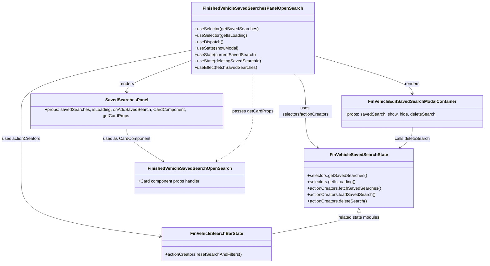

# Diagram: web/portal/src/pages/finishedvehicle/dashboard/components/organisms/FinishedVehicle.SavedSearchesPanelOpenSearch.organism.js


> Auto-generated by Obscura crawlers

## Diagram 1



### SVG

<svg id="container" width="1794.9765625" xmlns="http://www.w3.org/2000/svg" class="classDiagram" height="976" viewBox="0 0 1794.9765625 976" role="graphics-document document" aria-roledescription="class"><style>#container{font-family:"trebuchet ms",verdana,arial,sans-serif;font-size:16px;fill:#333;}@keyframes edge-animation-frame{from{stroke-dashoffset:0;}}@keyframes dash{to{stroke-dashoffset:0;}}#container .edge-animation-slow{stroke-dasharray:9,5!important;stroke-dashoffset:900;animation:dash 50s linear infinite;stroke-linecap:round;}#container .edge-animation-fast{stroke-dasharray:9,5!important;stroke-dashoffset:900;animation:dash 20s linear infinite;stroke-linecap:round;}#container .error-icon{fill:#552222;}#container .error-text{fill:#552222;stroke:#552222;}#container .edge-thickness-normal{stroke-width:1px;}#container .edge-thickness-thick{stroke-width:3.5px;}#container .edge-pattern-solid{stroke-dasharray:0;}#container .edge-thickness-invisible{stroke-width:0;fill:none;}#container .edge-pattern-dashed{stroke-dasharray:3;}#container .edge-pattern-dotted{stroke-dasharray:2;}#container .marker{fill:#333333;stroke:#333333;}#container .marker.cross{stroke:#333333;}#container svg{font-family:"trebuchet ms",verdana,arial,sans-serif;font-size:16px;}#container p{margin:0;}#container g.classGroup text{fill:#9370DB;stroke:none;font-family:"trebuchet ms",verdana,arial,sans-serif;font-size:10px;}#container g.classGroup text .title{font-weight:bolder;}#container .nodeLabel,#container .edgeLabel{color:#131300;}#container .edgeLabel .label rect{fill:#ECECFF;}#container .label text{fill:#131300;}#container .labelBkg{background:#ECECFF;}#container .edgeLabel .label span{background:#ECECFF;}#container .classTitle{font-weight:bolder;}#container .node rect,#container .node circle,#container .node ellipse,#container .node polygon,#container .node path{fill:#ECECFF;stroke:#9370DB;stroke-width:1px;}#container .divider{stroke:#9370DB;stroke-width:1;}#container g.clickable{cursor:pointer;}#container g.classGroup rect{fill:#ECECFF;stroke:#9370DB;}#container g.classGroup line{stroke:#9370DB;stroke-width:1;}#container .classLabel .box{stroke:none;stroke-width:0;fill:#ECECFF;opacity:0.5;}#container .classLabel .label{fill:#9370DB;font-size:10px;}#container .relation{stroke:#333333;stroke-width:1;fill:none;}#container .dashed-line{stroke-dasharray:3;}#container .dotted-line{stroke-dasharray:1 2;}#container #compositionStart,#container .composition{fill:#333333!important;stroke:#333333!important;stroke-width:1;}#container #compositionEnd,#container .composition{fill:#333333!important;stroke:#333333!important;stroke-width:1;}#container #dependencyStart,#container .dependency{fill:#333333!important;stroke:#333333!important;stroke-width:1;}#container #dependencyStart,#container .dependency{fill:#333333!important;stroke:#333333!important;stroke-width:1;}#container #extensionStart,#container .extension{fill:transparent!important;stroke:#333333!important;stroke-width:1;}#container #extensionEnd,#container .extension{fill:transparent!important;stroke:#333333!important;stroke-width:1;}#container #aggregationStart,#container .aggregation{fill:transparent!important;stroke:#333333!important;stroke-width:1;}#container #aggregationEnd,#container .aggregation{fill:transparent!important;stroke:#333333!important;stroke-width:1;}#container #lollipopStart,#container .lollipop{fill:#ECECFF!important;stroke:#333333!important;stroke-width:1;}#container #lollipopEnd,#container .lollipop{fill:#ECECFF!important;stroke:#333333!important;stroke-width:1;}#container .edgeTerminals{font-size:11px;line-height:initial;}#container .classTitleText{text-anchor:middle;font-size:18px;fill:#333;}#container .label-icon{display:inline-block;height:1em;overflow:visible;vertical-align:-0.125em;}#container .node .label-icon path{fill:currentColor;stroke:revert;stroke-width:revert;}#container :root{--mermaid-font-family:"trebuchet ms",verdana,arial,sans-serif;}</style><g><defs><marker id="container_class-aggregationStart" class="marker aggregation class" refX="18" refY="7" markerWidth="190" markerHeight="240" orient="auto"><path d="M 18,7 L9,13 L1,7 L9,1 Z"></path></marker></defs><defs><marker id="container_class-aggregationEnd" class="marker aggregation class" refX="1" refY="7" markerWidth="20" markerHeight="28" orient="auto"><path d="M 18,7 L9,13 L1,7 L9,1 Z"></path></marker></defs><defs><marker id="container_class-extensionStart" class="marker extension class" refX="18" refY="7" markerWidth="190" markerHeight="240" orient="auto"><path d="M 1,7 L18,13 V 1 Z"></path></marker></defs><defs><marker id="container_class-extensionEnd" class="marker extension class" refX="1" refY="7" markerWidth="20" markerHeight="28" orient="auto"><path d="M 1,1 V 13 L18,7 Z"></path></marker></defs><defs><marker id="container_class-compositionStart" class="marker composition class" refX="18" refY="7" markerWidth="190" markerHeight="240" orient="auto"><path d="M 18,7 L9,13 L1,7 L9,1 Z"></path></marker></defs><defs><marker id="container_class-compositionEnd" class="marker composition class" refX="1" refY="7" markerWidth="20" markerHeight="28" orient="auto"><path d="M 18,7 L9,13 L1,7 L9,1 Z"></path></marker></defs><defs><marker id="container_class-dependencyStart" class="marker dependency class" refX="6" refY="7" markerWidth="190" markerHeight="240" orient="auto"><path d="M 5,7 L9,13 L1,7 L9,1 Z"></path></marker></defs><defs><marker id="container_class-dependencyEnd" class="marker dependency class" refX="13" refY="7" markerWidth="20" markerHeight="28" orient="auto"><path d="M 18,7 L9,13 L14,7 L9,1 Z"></path></marker></defs><defs><marker id="container_class-lollipopStart" class="marker lollipop class" refX="13" refY="7" markerWidth="190" markerHeight="240" orient="auto"><circle stroke="black" fill="transparent" cx="7" cy="7" r="6"></circle></marker></defs><defs><marker id="container_class-lollipopEnd" class="marker lollipop class" refX="1" refY="7" markerWidth="190" markerHeight="240" orient="auto"><circle stroke="black" fill="transparent" cx="7" cy="7" r="6"></circle></marker></defs><g class="root"><g class="clusters"></g><g class="edgePaths"><path d="M717.543,225.115L676.757,240.095C635.971,255.076,554.4,285.038,513.614,305.186C472.828,325.333,472.828,335.667,472.828,340.833L472.828,346" id="id_FinishedVehicleSavedSearchesPanelOpenSearch_SavedSearchesPanel_1" class="edge-thickness-normal edge-pattern-solid relation" style=";;;" data-edge="true" data-et="edge" data-id="id_FinishedVehicleSavedSearchesPanelOpenSearch_SavedSearchesPanel_1" data-points="W3sieCI6NzE3LjU0Mjk2ODc1LCJ5IjoyMjUuMTE0NTgzMTU5NTQ1NTN9LHsieCI6NDcyLjgyODEyNSwieSI6MzE1fSx7IngiOjQ3Mi44MjgxMjUsInkiOjM1Mn1d" marker-end="url(#container_class-dependencyEnd)"></path><path d="M1164.66,208.417L1225.367,226.181C1286.073,243.945,1407.486,279.472,1468.192,302.403C1528.898,325.333,1528.898,335.667,1528.898,340.833L1528.898,346" id="id_FinishedVehicleSavedSearchesPanelOpenSearch_FinVehicleEditSavedSearchModalContainer_2" class="edge-thickness-normal edge-pattern-solid relation" style=";;;" data-edge="true" data-et="edge" data-id="id_FinishedVehicleSavedSearchesPanelOpenSearch_FinVehicleEditSavedSearchModalContainer_2" data-points="W3sieCI6MTE2NC42NjAxNTYyNSwieSI6MjA4LjQxNzI4OTEzNTgwOTAzfSx7IngiOjE1MjguODk4NDM3NSwieSI6MzE1fSx7IngiOjE1MjguODk4NDM3NSwieSI6MzUyfV0=" marker-end="url(#container_class-dependencyEnd)"></path><path d="M1093.933,278L1100.914,284.167C1107.896,290.333,1121.858,302.667,1128.839,325C1135.82,347.333,1135.82,379.667,1135.82,412C1135.82,444.333,1135.82,476.667,1143.211,498.398C1150.601,520.13,1165.381,531.26,1172.772,536.826L1180.162,542.391" id="id_FinishedVehicleSavedSearchesPanelOpenSearch_FinVehicleSavedSearchState_3" class="edge-thickness-normal edge-pattern-solid relation" style=";;;" data-edge="true" data-et="edge" data-id="id_FinishedVehicleSavedSearchesPanelOpenSearch_FinVehicleSavedSearchState_3" data-points="W3sieCI6MTA5My45MzMxMzk1MzQ4ODM2LCJ5IjoyNzh9LHsieCI6MTEzNS44MjAzMTI1LCJ5IjozMTV9LHsieCI6MTEzNS44MjAzMTI1LCJ5Ijo0MTJ9LHsieCI6MTEzNS44MjAzMTI1LCJ5Ijo1MDl9LHsieCI6MTE4NC45NTUwNzgxMjUsInkiOjU0Nn1d" marker-end="url(#container_class-dependencyEnd)"></path><path d="M717.543,187.617L611.165,208.847C504.786,230.078,292.03,272.539,185.652,309.936C79.273,347.333,79.273,379.667,79.273,412C79.273,444.333,79.273,476.667,79.273,517.5C79.273,558.333,79.273,607.667,79.273,657C79.273,706.333,79.273,755.667,165.588,792.242C251.903,828.817,424.532,852.634,510.847,864.543L597.162,876.451" id="id_FinishedVehicleSavedSearchesPanelOpenSearch_FinVehicleSearchBarState_4" class="edge-thickness-normal edge-pattern-solid relation" style=";;;" data-edge="true" data-et="edge" data-id="id_FinishedVehicleSavedSearchesPanelOpenSearch_FinVehicleSearchBarState_4" data-points="W3sieCI6NzE3LjU0Mjk2ODc1LCJ5IjoxODcuNjE2ODc1NDY0NTgyOX0seyJ4Ijo3OS4yNzM0Mzc1LCJ5IjozMTV9LHsieCI6NzkuMjczNDM3NSwieSI6NDEyfSx7IngiOjc5LjI3MzQzNzUsInkiOjUwOX0seyJ4Ijo3OS4yNzM0Mzc1LCJ5Ijo2NTd9LHsieCI6NzkuMjczNDM3NSwieSI6ODA1fSx7IngiOjYwMy4xMDU0Njg3NSwieSI6ODc3LjI3MTM4NDg0MDkwNzF9XQ==" marker-end="url(#container_class-dependencyEnd)"></path><path d="M472.828,472L472.828,478.167C472.828,484.333,472.828,496.667,495.186,516.966C517.543,537.265,562.258,565.529,584.615,579.662L606.973,593.794" id="id_SavedSearchesPanel_FinishedVehicleSavedSearchOpenSearch_5" class="edge-thickness-normal edge-pattern-solid relation" style=";;;" data-edge="true" data-et="edge" data-id="id_SavedSearchesPanel_FinishedVehicleSavedSearchOpenSearch_5" data-points="W3sieCI6NDcyLjgyODEyNSwieSI6NDcyfSx7IngiOjQ3Mi44MjgxMjUsInkiOjUwOX0seyJ4Ijo2MTIuMDQ0NTUyMzY0ODY0OSwieSI6NTk3fV0=" marker-end="url(#container_class-dependencyEnd)"></path><path d="M1528.898,472L1528.898,478.167C1528.898,484.333,1528.898,496.667,1521.508,508.398C1514.118,520.13,1499.337,531.26,1491.947,536.826L1484.557,542.391" id="id_FinVehicleEditSavedSearchModalContainer_FinVehicleSavedSearchState_6" class="edge-thickness-normal edge-pattern-solid relation" style=";;;" data-edge="true" data-et="edge" data-id="id_FinVehicleEditSavedSearchModalContainer_FinVehicleSavedSearchState_6" data-points="W3sieCI6MTUyOC44OTg0Mzc1LCJ5Ijo0NzJ9LHsieCI6MTUyOC44OTg0Mzc1LCJ5Ijo1MDl9LHsieCI6MTQ3OS43NjM2NzE4NzUsInkiOjU0Nn1d" marker-end="url(#container_class-dependencyEnd)"></path><path d="M941.102,278L941.102,284.167C941.102,290.333,941.102,302.667,941.102,325C941.102,347.333,941.102,379.667,941.102,412C941.102,444.333,941.102,476.667,918.744,506.966C896.387,537.265,851.672,565.529,829.314,579.662L806.957,593.794" id="id_FinishedVehicleSavedSearchesPanelOpenSearch_FinishedVehicleSavedSearchOpenSearch_7" class="edge-thickness-normal edge-pattern-dashed relation" style=";;;" data-edge="true" data-et="edge" data-id="id_FinishedVehicleSavedSearchesPanelOpenSearch_FinishedVehicleSavedSearchOpenSearch_7" data-points="W3sieCI6OTQxLjEwMTU2MjUsInkiOjI3OH0seyJ4Ijo5NDEuMTAxNTYyNSwieSI6MzE1fSx7IngiOjk0MS4xMDE1NjI1LCJ5Ijo0MTJ9LHsieCI6OTQxLjEwMTU2MjUsInkiOjUwOX0seyJ4Ijo4MDEuODg1MTM1MTM1MTM1MSwieSI6NTk3fV0=" marker-end="url(#container_class-dependencyEnd)"></path><path d="M1332.359,785.25L1332.359,788.542C1332.359,791.833,1332.359,798.417,1277.811,812.034C1223.262,825.652,1114.164,846.303,1059.615,856.629L1005.066,866.955" id="id_FinVehicleSavedSearchState_FinVehicleSearchBarState_8" class="edge-thickness-normal edge-pattern-solid relation" style=";;;" data-edge="true" data-et="edge" data-id="id_FinVehicleSavedSearchState_FinVehicleSearchBarState_8" data-points="W3sieCI6MTMzMi4zNTkzNzUsInkiOjc2OH0seyJ4IjoxMzMyLjM1OTM3NSwieSI6ODA1fSx7IngiOjEwMDUuMDY2NDA2MjUsInkiOjg2Ni45NTUyMTk2ODY3NzQ0fV0=" marker-start="url(#container_class-extensionStart)"></path></g><g class="edgeLabels"><g class="edgeLabel" transform="translate(472.828125, 315)"><g class="label" data-id="id_FinishedVehicleSavedSearchesPanelOpenSearch_SavedSearchesPanel_1" transform="translate(-27.75, -12)"><foreignObject width="55.5" height="24"><div xmlns="http://www.w3.org/1999/xhtml" class="labelBkg" style="display: table-cell; white-space: nowrap; line-height: 1.5; max-width: 200px; text-align: center;"><span class="edgeLabel"><p>renders</p></span></div></foreignObject></g></g><g class="edgeLabel" transform="translate(1528.8984375, 315)"><g class="label" data-id="id_FinishedVehicleSavedSearchesPanelOpenSearch_FinVehicleEditSavedSearchModalContainer_2" transform="translate(-27.75, -12)"><foreignObject width="55.5" height="24"><div xmlns="http://www.w3.org/1999/xhtml" class="labelBkg" style="display: table-cell; white-space: nowrap; line-height: 1.5; max-width: 200px; text-align: center;"><span class="edgeLabel"><p>renders</p></span></div></foreignObject></g></g><g class="edgeLabel" transform="translate(1135.8203125, 412)"><g class="label" data-id="id_FinishedVehicleSavedSearchesPanelOpenSearch_FinVehicleSavedSearchState_3" transform="translate(-100, -24)"><foreignObject width="200" height="48"><div xmlns="http://www.w3.org/1999/xhtml" class="labelBkg" style="display: table; white-space: break-spaces; line-height: 1.5; max-width: 200px; text-align: center; width: 200px;"><span class="edgeLabel"><p>uses selectors/actionCreators</p></span></div></foreignObject></g></g><g class="edgeLabel" transform="translate(79.2734375, 509)"><g class="label" data-id="id_FinishedVehicleSavedSearchesPanelOpenSearch_FinVehicleSearchBarState_4" transform="translate(-71.2734375, -12)"><foreignObject width="142.546875" height="24"><div xmlns="http://www.w3.org/1999/xhtml" class="labelBkg" style="display: table-cell; white-space: nowrap; line-height: 1.5; max-width: 200px; text-align: center;"><span class="edgeLabel"><p>uses actionCreators</p></span></div></foreignObject></g></g><g class="edgeLabel" transform="translate(472.828125, 509)"><g class="label" data-id="id_SavedSearchesPanel_FinishedVehicleSavedSearchOpenSearch_5" transform="translate(-87.0234375, -12)"><foreignObject width="174.046875" height="24"><div xmlns="http://www.w3.org/1999/xhtml" class="labelBkg" style="display: table-cell; white-space: nowrap; line-height: 1.5; max-width: 200px; text-align: center;"><span class="edgeLabel"><p>uses as CardComponent</p></span></div></foreignObject></g></g><g class="edgeLabel" transform="translate(1528.8984375, 509)"><g class="label" data-id="id_FinVehicleEditSavedSearchModalContainer_FinVehicleSavedSearchState_6" transform="translate(-65.8515625, -12)"><foreignObject width="131.703125" height="24"><div xmlns="http://www.w3.org/1999/xhtml" class="labelBkg" style="display: table-cell; white-space: nowrap; line-height: 1.5; max-width: 200px; text-align: center;"><span class="edgeLabel"><p>calls deleteSearch</p></span></div></foreignObject></g></g><g class="edgeLabel" transform="translate(941.1015625, 412)"><g class="label" data-id="id_FinishedVehicleSavedSearchesPanelOpenSearch_FinishedVehicleSavedSearchOpenSearch_7" transform="translate(-74.71875, -12)"><foreignObject width="149.4375" height="24"><div xmlns="http://www.w3.org/1999/xhtml" class="labelBkg" style="display: table-cell; white-space: nowrap; line-height: 1.5; max-width: 200px; text-align: center;"><span class="edgeLabel"><p>passes getCardProps</p></span></div></foreignObject></g></g><g class="edgeLabel" transform="translate(1332.359375, 805)"><g class="label" data-id="id_FinVehicleSavedSearchState_FinVehicleSearchBarState_8" transform="translate(-79.4375, -12)"><foreignObject width="158.875" height="24"><div xmlns="http://www.w3.org/1999/xhtml" class="labelBkg" style="display: table-cell; white-space: nowrap; line-height: 1.5; max-width: 200px; text-align: center;"><span class="edgeLabel"><p>related state modules</p></span></div></foreignObject></g></g></g><g class="nodes"><g class="node default" id="classId-FinishedVehicleSavedSearchesPanelOpenSearch-0" transform="translate(941.1015625, 143)"><g class="basic label-container"><path d="M-223.55859375 -135 L223.55859375 -135 L223.55859375 135 L-223.55859375 135" stroke="none" stroke-width="0" fill="#ECECFF" style=""></path><path d="M-223.55859375 -135 C-92.10016637900199 -135, 39.35826099199602 -135, 223.55859375 -135 M-223.55859375 -135 C-78.78812778886899 -135, 65.98233817226202 -135, 223.55859375 -135 M223.55859375 -135 C223.55859375 -29.105625684333205, 223.55859375 76.78874863133359, 223.55859375 135 M223.55859375 -135 C223.55859375 -30.71248897777673, 223.55859375 73.57502204444654, 223.55859375 135 M223.55859375 135 C54.82138539159308 135, -113.91582296681383 135, -223.55859375 135 M223.55859375 135 C76.41555308611095 135, -70.7274875777781 135, -223.55859375 135 M-223.55859375 135 C-223.55859375 75.13105712975215, -223.55859375 15.262114259504287, -223.55859375 -135 M-223.55859375 135 C-223.55859375 52.31456404847505, -223.55859375 -30.370871903049903, -223.55859375 -135" stroke="#9370DB" stroke-width="1.3" fill="none" stroke-dasharray="0 0" style=""></path></g><g class="annotation-group text" transform="translate(0, -111)"></g><g class="label-group text" transform="translate(-176.0390625, -111)"><g class="label" style="font-weight: bolder" transform="translate(0,-12)"><foreignObject width="352.078125" height="24"><div xmlns="http://www.w3.org/1999/xhtml" style="display: table-cell; white-space: nowrap; line-height: 1.5; max-width: 398px; text-align: center;"><span class="nodeLabel markdown-node-label" style=""><p>FinishedVehicleSavedSearchesPanelOpenSearch</p></span></div></foreignObject></g></g><g class="members-group text" transform="translate(-211.55859375, -63)"></g><g class="methods-group text" transform="translate(-211.55859375, -33)"><g class="label" style="" transform="translate(0,-12)"><foreignObject width="234.078125" height="24"><div xmlns="http://www.w3.org/1999/xhtml" style="display: table-cell; white-space: nowrap; line-height: 1.5; max-width: 291px; text-align: center;"><span class="nodeLabel markdown-node-label" style=""><p>+useSelector(getSavedSearches)</p></span></div></foreignObject></g><g class="label" style="" transform="translate(0,12)"><foreignObject width="195.3125" height="24"><div xmlns="http://www.w3.org/1999/xhtml" style="display: table-cell; white-space: nowrap; line-height: 1.5; max-width: 253px; text-align: center;"><span class="nodeLabel markdown-node-label" style=""><p>+useSelector(getIsLoading)</p></span></div></foreignObject></g><g class="label" style="" transform="translate(0,36)"><foreignObject width="106.765625" height="24"><div xmlns="http://www.w3.org/1999/xhtml" style="display: table-cell; white-space: nowrap; line-height: 1.5; max-width: 164px; text-align: center;"><span class="nodeLabel markdown-node-label" style=""><p>+useDispatch()</p></span></div></foreignObject></g><g class="label" style="" transform="translate(0,60)"><foreignObject width="163.46875" height="24"><div xmlns="http://www.w3.org/1999/xhtml" style="display: table-cell; white-space: nowrap; line-height: 1.5; max-width: 221px; text-align: center;"><span class="nodeLabel markdown-node-label" style=""><p>+useState(showModal)</p></span></div></foreignObject></g><g class="label" style="" transform="translate(0,84)"><foreignObject width="225.734375" height="24"><div xmlns="http://www.w3.org/1999/xhtml" style="display: table-cell; white-space: nowrap; line-height: 1.5; max-width: 283px; text-align: center;"><span class="nodeLabel markdown-node-label" style=""><p>+useState(currentSavedSearch)</p></span></div></foreignObject></g><g class="label" style="" transform="translate(0,108)"><foreignObject width="247.078125" height="24"><div xmlns="http://www.w3.org/1999/xhtml" style="display: table-cell; white-space: nowrap; line-height: 1.5; max-width: 304px; text-align: center;"><span class="nodeLabel markdown-node-label" style=""><p>+useState(deletingSavedSearchId)</p></span></div></foreignObject></g><g class="label" style="" transform="translate(0,132)"><foreignObject width="229.46875" height="24"><div xmlns="http://www.w3.org/1999/xhtml" style="display: table-cell; white-space: nowrap; line-height: 1.5; max-width: 287px; text-align: center;"><span class="nodeLabel markdown-node-label" style=""><p>+useEffect(fetchSavedSearches)</p></span></div></foreignObject></g></g><g class="divider" style=""><path d="M-223.55859375 -87 C-72.59981000979198 -87, 78.35897373041604 -87, 223.55859375 -87 M-223.55859375 -87 C-53.00394440283327 -87, 117.55070494433346 -87, 223.55859375 -87" stroke="#9370DB" stroke-width="1.3" fill="none" stroke-dasharray="0 0" style=""></path></g><g class="divider" style=""><path d="M-223.55859375 -63 C-85.48010535778343 -63, 52.59838303443314 -63, 223.55859375 -63 M-223.55859375 -63 C-94.59302032797603 -63, 34.37255309404793 -63, 223.55859375 -63" stroke="#9370DB" stroke-width="1.3" fill="none" stroke-dasharray="0 0" style=""></path></g></g><g class="node default" id="classId-SavedSearchesPanel-1" transform="translate(472.828125, 412)"><g class="basic label-container"><path d="M-358.5546875 -60 L358.5546875 -60 L358.5546875 60 L-358.5546875 60" stroke="none" stroke-width="0" fill="#ECECFF" style=""></path><path d="M-358.5546875 -60 C-97.8024134997222 -60, 162.9498605005556 -60, 358.5546875 -60 M-358.5546875 -60 C-88.99960958501578 -60, 180.55546832996845 -60, 358.5546875 -60 M358.5546875 -60 C358.5546875 -20.13278774904665, 358.5546875 19.7344245019067, 358.5546875 60 M358.5546875 -60 C358.5546875 -20.66228647972524, 358.5546875 18.675427040549522, 358.5546875 60 M358.5546875 60 C125.65211087160532 60, -107.25046575678937 60, -358.5546875 60 M358.5546875 60 C136.65548152182126 60, -85.24372445635748 60, -358.5546875 60 M-358.5546875 60 C-358.5546875 32.43684710589021, -358.5546875 4.873694211780425, -358.5546875 -60 M-358.5546875 60 C-358.5546875 32.77179239459208, -358.5546875 5.543584789184159, -358.5546875 -60" stroke="#9370DB" stroke-width="1.3" fill="none" stroke-dasharray="0 0" style=""></path></g><g class="annotation-group text" transform="translate(0, -36)"></g><g class="label-group text" transform="translate(-75.265625, -36)"><g class="label" style="font-weight: bolder" transform="translate(0,-12)"><foreignObject width="150.53125" height="24"><div xmlns="http://www.w3.org/1999/xhtml" style="display: table-cell; white-space: nowrap; line-height: 1.5; max-width: 198px; text-align: center;"><span class="nodeLabel markdown-node-label" style=""><p>SavedSearchesPanel</p></span></div></foreignObject></g></g><g class="members-group text" transform="translate(-346.5546875, 12)"><g class="label" style="" transform="translate(0,-12)"><foreignObject width="617.84375" height="24"><div xmlns="http://www.w3.org/1999/xhtml" style="display: table-cell; white-space: nowrap; line-height: 1.5; max-width: 675px; text-align: center;"><span class="nodeLabel markdown-node-label" style=""><p>+props: savedSearches, isLoading, onAddSavedSearch, CardComponent, getCardProps</p></span></div></foreignObject></g></g><g class="methods-group text" transform="translate(-346.5546875, 60)"></g><g class="divider" style=""><path d="M-358.5546875 -12 C-73.54992816293071 -12, 211.45483117413858 -12, 358.5546875 -12 M-358.5546875 -12 C-116.88006217425405 -12, 124.7945631514919 -12, 358.5546875 -12" stroke="#9370DB" stroke-width="1.3" fill="none" stroke-dasharray="0 0" style=""></path></g><g class="divider" style=""><path d="M-358.5546875 36 C-86.9601726925635 36, 184.634342114873 36, 358.5546875 36 M-358.5546875 36 C-194.00177412317183 36, -29.448860746343655 36, 358.5546875 36" stroke="#9370DB" stroke-width="1.3" fill="none" stroke-dasharray="0 0" style=""></path></g></g><g class="node default" id="classId-FinVehicleEditSavedSearchModalContainer-2" transform="translate(1528.8984375, 412)"><g class="basic label-container"><path d="M-258.078125 -60 L258.078125 -60 L258.078125 60 L-258.078125 60" stroke="none" stroke-width="0" fill="#ECECFF" style=""></path><path d="M-258.078125 -60 C-132.23206081748586 -60, -6.385996634971718 -60, 258.078125 -60 M-258.078125 -60 C-150.96482343531727 -60, -43.851521870634514 -60, 258.078125 -60 M258.078125 -60 C258.078125 -15.006052386498482, 258.078125 29.987895227003037, 258.078125 60 M258.078125 -60 C258.078125 -32.818976142871975, 258.078125 -5.63795228574395, 258.078125 60 M258.078125 60 C121.55678002590685 60, -14.964564948186307 60, -258.078125 60 M258.078125 60 C103.27434571856739 60, -51.52943356286522 60, -258.078125 60 M-258.078125 60 C-258.078125 16.703983017409286, -258.078125 -26.59203396518143, -258.078125 -60 M-258.078125 60 C-258.078125 29.86333355058125, -258.078125 -0.2733328988375021, -258.078125 -60" stroke="#9370DB" stroke-width="1.3" fill="none" stroke-dasharray="0 0" style=""></path></g><g class="annotation-group text" transform="translate(0, -36)"></g><g class="label-group text" transform="translate(-155.8125, -36)"><g class="label" style="font-weight: bolder" transform="translate(0,-12)"><foreignObject width="311.625" height="24"><div xmlns="http://www.w3.org/1999/xhtml" style="display: table-cell; white-space: nowrap; line-height: 1.5; max-width: 359px; text-align: center;"><span class="nodeLabel markdown-node-label" style=""><p>FinVehicleEditSavedSearchModalContainer</p></span></div></foreignObject></g></g><g class="members-group text" transform="translate(-246.078125, 12)"><g class="label" style="" transform="translate(0,-12)"><foreignObject width="336.34375" height="24"><div xmlns="http://www.w3.org/1999/xhtml" style="display: table-cell; white-space: nowrap; line-height: 1.5; max-width: 394px; text-align: center;"><span class="nodeLabel markdown-node-label" style=""><p>+props: savedSearch, show, hide, deleteSearch</p></span></div></foreignObject></g></g><g class="methods-group text" transform="translate(-246.078125, 60)"></g><g class="divider" style=""><path d="M-258.078125 -12 C-71.38855081392805 -12, 115.3010233721439 -12, 258.078125 -12 M-258.078125 -12 C-51.73772532055929 -12, 154.60267435888142 -12, 258.078125 -12" stroke="#9370DB" stroke-width="1.3" fill="none" stroke-dasharray="0 0" style=""></path></g><g class="divider" style=""><path d="M-258.078125 36 C-61.5937063384911 36, 134.8907123230178 36, 258.078125 36 M-258.078125 36 C-101.4040308412338 36, 55.27006331753239 36, 258.078125 36" stroke="#9370DB" stroke-width="1.3" fill="none" stroke-dasharray="0 0" style=""></path></g></g><g class="node default" id="classId-FinVehicleSavedSearchState-3" transform="translate(1332.359375, 657)"><g class="basic label-container"><path d="M-199.3046875 -111 L199.3046875 -111 L199.3046875 111 L-199.3046875 111" stroke="none" stroke-width="0" fill="#ECECFF" style=""></path><path d="M-199.3046875 -111 C-87.92971443187751 -111, 23.445258636244972 -111, 199.3046875 -111 M-199.3046875 -111 C-70.12298345909196 -111, 59.05872058181609 -111, 199.3046875 -111 M199.3046875 -111 C199.3046875 -48.90445494213766, 199.3046875 13.191090115724677, 199.3046875 111 M199.3046875 -111 C199.3046875 -54.67405745665096, 199.3046875 1.651885086698087, 199.3046875 111 M199.3046875 111 C44.056426125776255 111, -111.19183524844749 111, -199.3046875 111 M199.3046875 111 C70.10219840561598 111, -59.10029068876804 111, -199.3046875 111 M-199.3046875 111 C-199.3046875 34.252248741683545, -199.3046875 -42.49550251663291, -199.3046875 -111 M-199.3046875 111 C-199.3046875 56.42320754933879, -199.3046875 1.846415098677582, -199.3046875 -111" stroke="#9370DB" stroke-width="1.3" fill="none" stroke-dasharray="0 0" style=""></path></g><g class="annotation-group text" transform="translate(0, -87)"></g><g class="label-group text" transform="translate(-102.890625, -87)"><g class="label" style="font-weight: bolder" transform="translate(0,-12)"><foreignObject width="205.78125" height="24"><div xmlns="http://www.w3.org/1999/xhtml" style="display: table-cell; white-space: nowrap; line-height: 1.5; max-width: 253px; text-align: center;"><span class="nodeLabel markdown-node-label" style=""><p>FinVehicleSavedSearchState</p></span></div></foreignObject></g></g><g class="members-group text" transform="translate(-187.3046875, -39)"></g><g class="methods-group text" transform="translate(-187.3046875, -9)"><g class="label" style="" transform="translate(0,-12)"><foreignObject width="218.234375" height="24"><div xmlns="http://www.w3.org/1999/xhtml" style="display: table-cell; white-space: nowrap; line-height: 1.5; max-width: 276px; text-align: center;"><span class="nodeLabel markdown-node-label" style=""><p>+selectors.getSavedSearches()</p></span></div></foreignObject></g><g class="label" style="" transform="translate(0,12)"><foreignObject width="179.484375" height="24"><div xmlns="http://www.w3.org/1999/xhtml" style="display: table-cell; white-space: nowrap; line-height: 1.5; max-width: 237px; text-align: center;"><span class="nodeLabel markdown-node-label" style=""><p>+selectors.getIsLoading()</p></span></div></foreignObject></g><g class="label" style="" transform="translate(0,36)"><foreignObject width="271.71875" height="24"><div xmlns="http://www.w3.org/1999/xhtml" style="display: table-cell; white-space: nowrap; line-height: 1.5; max-width: 329px; text-align: center;"><span class="nodeLabel markdown-node-label" style=""><p>+actionCreators.fetchSavedSearches()</p></span></div></foreignObject></g><g class="label" style="" transform="translate(0,60)"><foreignObject width="251.34375" height="24"><div xmlns="http://www.w3.org/1999/xhtml" style="display: table-cell; white-space: nowrap; line-height: 1.5; max-width: 309px; text-align: center;"><span class="nodeLabel markdown-node-label" style=""><p>+actionCreators.loadSavedSearch()</p></span></div></foreignObject></g><g class="label" style="" transform="translate(0,84)"><foreignObject width="221.703125" height="24"><div xmlns="http://www.w3.org/1999/xhtml" style="display: table-cell; white-space: nowrap; line-height: 1.5; max-width: 279px; text-align: center;"><span class="nodeLabel markdown-node-label" style=""><p>+actionCreators.deleteSearch()</p></span></div></foreignObject></g></g><g class="divider" style=""><path d="M-199.3046875 -63 C-91.14765742077125 -63, 17.009372658457494 -63, 199.3046875 -63 M-199.3046875 -63 C-102.3438829734545 -63, -5.383078446908996 -63, 199.3046875 -63" stroke="#9370DB" stroke-width="1.3" fill="none" stroke-dasharray="0 0" style=""></path></g><g class="divider" style=""><path d="M-199.3046875 -39 C-76.50624663826618 -39, 46.29219422346765 -39, 199.3046875 -39 M-199.3046875 -39 C-70.16236211531424 -39, 58.979963269371524 -39, 199.3046875 -39" stroke="#9370DB" stroke-width="1.3" fill="none" stroke-dasharray="0 0" style=""></path></g></g><g class="node default" id="classId-FinVehicleSearchBarState-4" transform="translate(804.0859375, 905)"><g class="basic label-container"><path d="M-200.98046875 -63 L200.98046875 -63 L200.98046875 63 L-200.98046875 63" stroke="none" stroke-width="0" fill="#ECECFF" style=""></path><path d="M-200.98046875 -63 C-61.70790905902385 -63, 77.5646506319523 -63, 200.98046875 -63 M-200.98046875 -63 C-54.52694770286911 -63, 91.92657334426178 -63, 200.98046875 -63 M200.98046875 -63 C200.98046875 -30.98770968452191, 200.98046875 1.02458063095618, 200.98046875 63 M200.98046875 -63 C200.98046875 -19.381078375331683, 200.98046875 24.237843249336635, 200.98046875 63 M200.98046875 63 C113.73932577203098 63, 26.49818279406196 63, -200.98046875 63 M200.98046875 63 C95.44594583127507 63, -10.088577087449863 63, -200.98046875 63 M-200.98046875 63 C-200.98046875 33.84520601210133, -200.98046875 4.690412024202651, -200.98046875 -63 M-200.98046875 63 C-200.98046875 32.70269075892234, -200.98046875 2.405381517844674, -200.98046875 -63" stroke="#9370DB" stroke-width="1.3" fill="none" stroke-dasharray="0 0" style=""></path></g><g class="annotation-group text" transform="translate(0, -39)"></g><g class="label-group text" transform="translate(-93.3203125, -39)"><g class="label" style="font-weight: bolder" transform="translate(0,-12)"><foreignObject width="186.640625" height="24"><div xmlns="http://www.w3.org/1999/xhtml" style="display: table-cell; white-space: nowrap; line-height: 1.5; max-width: 234px; text-align: center;"><span class="nodeLabel markdown-node-label" style=""><p>FinVehicleSearchBarState</p></span></div></foreignObject></g></g><g class="members-group text" transform="translate(-188.98046875, 9)"></g><g class="methods-group text" transform="translate(-188.98046875, 39)"><g class="label" style="" transform="translate(0,-12)"><foreignObject width="284.640625" height="24"><div xmlns="http://www.w3.org/1999/xhtml" style="display: table-cell; white-space: nowrap; line-height: 1.5; max-width: 342px; text-align: center;"><span class="nodeLabel markdown-node-label" style=""><p>+actionCreators.resetSearchAndFilters()</p></span></div></foreignObject></g></g><g class="divider" style=""><path d="M-200.98046875 -15 C-42.68686065529167 -15, 115.60674743941667 -15, 200.98046875 -15 M-200.98046875 -15 C-116.87579010626779 -15, -32.77111146253557 -15, 200.98046875 -15" stroke="#9370DB" stroke-width="1.3" fill="none" stroke-dasharray="0 0" style=""></path></g><g class="divider" style=""><path d="M-200.98046875 9 C-48.83243514187623 9, 103.31559846624754 9, 200.98046875 9 M-200.98046875 9 C-114.98379489573568 9, -28.98712104147137 9, 200.98046875 9" stroke="#9370DB" stroke-width="1.3" fill="none" stroke-dasharray="0 0" style=""></path></g></g><g class="node default" id="classId-FinishedVehicleSavedSearchOpenSearch-5" transform="translate(706.96484375, 657)"><g class="basic label-container"><path d="M-202.796875 -60 L202.796875 -60 L202.796875 60 L-202.796875 60" stroke="none" stroke-width="0" fill="#ECECFF" style=""></path><path d="M-202.796875 -60 C-46.85028490307218 -60, 109.09630519385564 -60, 202.796875 -60 M-202.796875 -60 C-98.37989187559526 -60, 6.037091248809475 -60, 202.796875 -60 M202.796875 -60 C202.796875 -14.819176582479756, 202.796875 30.36164683504049, 202.796875 60 M202.796875 -60 C202.796875 -31.7210266095516, 202.796875 -3.442053219103201, 202.796875 60 M202.796875 60 C62.63645037813808 60, -77.52397424372384 60, -202.796875 60 M202.796875 60 C57.54544363259549 60, -87.70598773480901 60, -202.796875 60 M-202.796875 60 C-202.796875 21.139640625770248, -202.796875 -17.720718748459504, -202.796875 -60 M-202.796875 60 C-202.796875 16.458404561708853, -202.796875 -27.083190876582293, -202.796875 -60" stroke="#9370DB" stroke-width="1.3" fill="none" stroke-dasharray="0 0" style=""></path></g><g class="annotation-group text" transform="translate(0, -36)"></g><g class="label-group text" transform="translate(-147.578125, -36)"><g class="label" style="font-weight: bolder" transform="translate(0,-12)"><foreignObject width="295.15625" height="24"><div xmlns="http://www.w3.org/1999/xhtml" style="display: table-cell; white-space: nowrap; line-height: 1.5; max-width: 342px; text-align: center;"><span class="nodeLabel markdown-node-label" style=""><p>FinishedVehicleSavedSearchOpenSearch</p></span></div></foreignObject></g></g><g class="members-group text" transform="translate(-190.796875, 12)"><g class="label" style="" transform="translate(0,-12)"><foreignObject width="234.015625" height="24"><div xmlns="http://www.w3.org/1999/xhtml" style="display: table-cell; white-space: nowrap; line-height: 1.5; max-width: 292px; text-align: center;"><span class="nodeLabel markdown-node-label" style=""><p>+Card component props handler</p></span></div></foreignObject></g></g><g class="methods-group text" transform="translate(-190.796875, 60)"></g><g class="divider" style=""><path d="M-202.796875 -12 C-114.2154912443775 -12, -25.634107488755006 -12, 202.796875 -12 M-202.796875 -12 C-61.445064079317916 -12, 79.90674684136417 -12, 202.796875 -12" stroke="#9370DB" stroke-width="1.3" fill="none" stroke-dasharray="0 0" style=""></path></g><g class="divider" style=""><path d="M-202.796875 36 C-69.64692450308016 36, 63.503025993839685 36, 202.796875 36 M-202.796875 36 C-91.4347346399191 36, 19.9274057201618 36, 202.796875 36" stroke="#9370DB" stroke-width="1.3" fill="none" stroke-dasharray="0 0" style=""></path></g></g></g></g></g></svg>

## Diagram 2

```mermaid
sequenceDiagram
participant Component as FinishedVehicleSavedSearchesPanelOpenSearch
participant Redux as Store
participant Panel as SavedSearchesPanel
participant Modal as FinVehicleEditSavedSearchModalContainer
participant Card as FinishedVehicleSavedSearchOpenSearch
Note over Component: Mount
Component->>Redux: dispatch(fetchSavedSearches)
Redux-->>Component: savedSearches, isLoading updated
Component->>Panel: render(savedSearches,isLoading,CardComponent,getCardProps)
Panel->>Card: render card(s) with getCardProps
alt User clicks "Add Saved Search"
Panel->>Component: onAddSavedSearch()
Component->>Component: setShowModal(true)
Component->>Modal: show=true (render)
else User clicks "Edit" on a card
Card->>Component: onEditClick()
Component->>Redux: dispatch(loadSavedSearch(savedSearch,true))
Component->>Component: setCurrentSavedSearch(savedSearch); setShowModal(true)
Component->>Modal: show=true, savedSearch=currentSavedSearch
end
alt User deletes search via Modal
Modal->>Component: deleteSearch(id)
Component->>Redux: dispatch(deleteSearch(id))
Component->>Component: setDeletingSavedSearchId(id)
end
alt User closes modal
Modal->>Component: hide()
Component->>Redux: dispatch(resetSearchAndFilters(true))
Component->>Component: setShowModal(false); setCurrentSavedSearch(null)
end
```

> SVG rendering failed for this diagram.
