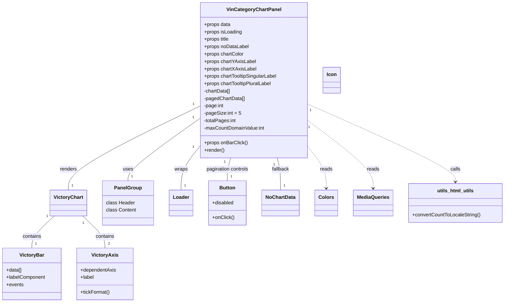

# Diagram: web/portal/src/pages/finishedvehicle/dashboard/components/organisms/FinishedVehicle.VinCategoryChartPanel.organism.js


> Auto-generated by Obscura crawlers

## Diagram 1



### SVG

<svg id="container" width="1608.2109375" xmlns="http://www.w3.org/2000/svg" class="classDiagram" height="980" viewBox="0 0 1608.2109375 980" role="graphics-document document" aria-roledescription="class"><style>#container{font-family:"trebuchet ms",verdana,arial,sans-serif;font-size:16px;fill:#333;}@keyframes edge-animation-frame{from{stroke-dashoffset:0;}}@keyframes dash{to{stroke-dashoffset:0;}}#container .edge-animation-slow{stroke-dasharray:9,5!important;stroke-dashoffset:900;animation:dash 50s linear infinite;stroke-linecap:round;}#container .edge-animation-fast{stroke-dasharray:9,5!important;stroke-dashoffset:900;animation:dash 20s linear infinite;stroke-linecap:round;}#container .error-icon{fill:#552222;}#container .error-text{fill:#552222;stroke:#552222;}#container .edge-thickness-normal{stroke-width:1px;}#container .edge-thickness-thick{stroke-width:3.5px;}#container .edge-pattern-solid{stroke-dasharray:0;}#container .edge-thickness-invisible{stroke-width:0;fill:none;}#container .edge-pattern-dashed{stroke-dasharray:3;}#container .edge-pattern-dotted{stroke-dasharray:2;}#container .marker{fill:#333333;stroke:#333333;}#container .marker.cross{stroke:#333333;}#container svg{font-family:"trebuchet ms",verdana,arial,sans-serif;font-size:16px;}#container p{margin:0;}#container g.classGroup text{fill:#9370DB;stroke:none;font-family:"trebuchet ms",verdana,arial,sans-serif;font-size:10px;}#container g.classGroup text .title{font-weight:bolder;}#container .nodeLabel,#container .edgeLabel{color:#131300;}#container .edgeLabel .label rect{fill:#ECECFF;}#container .label text{fill:#131300;}#container .labelBkg{background:#ECECFF;}#container .edgeLabel .label span{background:#ECECFF;}#container .classTitle{font-weight:bolder;}#container .node rect,#container .node circle,#container .node ellipse,#container .node polygon,#container .node path{fill:#ECECFF;stroke:#9370DB;stroke-width:1px;}#container .divider{stroke:#9370DB;stroke-width:1;}#container g.clickable{cursor:pointer;}#container g.classGroup rect{fill:#ECECFF;stroke:#9370DB;}#container g.classGroup line{stroke:#9370DB;stroke-width:1;}#container .classLabel .box{stroke:none;stroke-width:0;fill:#ECECFF;opacity:0.5;}#container .classLabel .label{fill:#9370DB;font-size:10px;}#container .relation{stroke:#333333;stroke-width:1;fill:none;}#container .dashed-line{stroke-dasharray:3;}#container .dotted-line{stroke-dasharray:1 2;}#container #compositionStart,#container .composition{fill:#333333!important;stroke:#333333!important;stroke-width:1;}#container #compositionEnd,#container .composition{fill:#333333!important;stroke:#333333!important;stroke-width:1;}#container #dependencyStart,#container .dependency{fill:#333333!important;stroke:#333333!important;stroke-width:1;}#container #dependencyStart,#container .dependency{fill:#333333!important;stroke:#333333!important;stroke-width:1;}#container #extensionStart,#container .extension{fill:transparent!important;stroke:#333333!important;stroke-width:1;}#container #extensionEnd,#container .extension{fill:transparent!important;stroke:#333333!important;stroke-width:1;}#container #aggregationStart,#container .aggregation{fill:transparent!important;stroke:#333333!important;stroke-width:1;}#container #aggregationEnd,#container .aggregation{fill:transparent!important;stroke:#333333!important;stroke-width:1;}#container #lollipopStart,#container .lollipop{fill:#ECECFF!important;stroke:#333333!important;stroke-width:1;}#container #lollipopEnd,#container .lollipop{fill:#ECECFF!important;stroke:#333333!important;stroke-width:1;}#container .edgeTerminals{font-size:11px;line-height:initial;}#container .classTitleText{text-anchor:middle;font-size:18px;fill:#333;}#container .label-icon{display:inline-block;height:1em;overflow:visible;vertical-align:-0.125em;}#container .node .label-icon path{fill:currentColor;stroke:revert;stroke-width:revert;}#container :root{--mermaid-font-family:"trebuchet ms",verdana,arial,sans-serif;}</style><g><defs><marker id="container_class-aggregationStart" class="marker aggregation class" refX="18" refY="7" markerWidth="190" markerHeight="240" orient="auto"><path d="M 18,7 L9,13 L1,7 L9,1 Z"></path></marker></defs><defs><marker id="container_class-aggregationEnd" class="marker aggregation class" refX="1" refY="7" markerWidth="20" markerHeight="28" orient="auto"><path d="M 18,7 L9,13 L1,7 L9,1 Z"></path></marker></defs><defs><marker id="container_class-extensionStart" class="marker extension class" refX="18" refY="7" markerWidth="190" markerHeight="240" orient="auto"><path d="M 1,7 L18,13 V 1 Z"></path></marker></defs><defs><marker id="container_class-extensionEnd" class="marker extension class" refX="1" refY="7" markerWidth="20" markerHeight="28" orient="auto"><path d="M 1,1 V 13 L18,7 Z"></path></marker></defs><defs><marker id="container_class-compositionStart" class="marker composition class" refX="18" refY="7" markerWidth="190" markerHeight="240" orient="auto"><path d="M 18,7 L9,13 L1,7 L9,1 Z"></path></marker></defs><defs><marker id="container_class-compositionEnd" class="marker composition class" refX="1" refY="7" markerWidth="20" markerHeight="28" orient="auto"><path d="M 18,7 L9,13 L1,7 L9,1 Z"></path></marker></defs><defs><marker id="container_class-dependencyStart" class="marker dependency class" refX="6" refY="7" markerWidth="190" markerHeight="240" orient="auto"><path d="M 5,7 L9,13 L1,7 L9,1 Z"></path></marker></defs><defs><marker id="container_class-dependencyEnd" class="marker dependency class" refX="13" refY="7" markerWidth="20" markerHeight="28" orient="auto"><path d="M 18,7 L9,13 L14,7 L9,1 Z"></path></marker></defs><defs><marker id="container_class-lollipopStart" class="marker lollipop class" refX="13" refY="7" markerWidth="190" markerHeight="240" orient="auto"><circle stroke="black" fill="transparent" cx="7" cy="7" r="6"></circle></marker></defs><defs><marker id="container_class-lollipopEnd" class="marker lollipop class" refX="1" refY="7" markerWidth="190" markerHeight="240" orient="auto"><circle stroke="black" fill="transparent" cx="7" cy="7" r="6"></circle></marker></defs><g class="root"><g class="clusters"></g><g class="edgePaths"><path d="M635.486,385.978L597.858,413.148C560.23,440.318,484.975,494.659,447.347,527.996C409.719,561.333,409.719,573.667,409.719,579.833L409.719,586" id="id_VinCategoryChartPanel_PanelGroup_1" class="edge-thickness-normal edge-pattern-solid relation" style=";;;" data-edge="true" data-et="edge" data-id="id_VinCategoryChartPanel_PanelGroup_1" data-points="W3sieCI6NjM1LjQ4NjMyODEyNSwieSI6Mzg1Ljk3NzY0OTcwNTQ5MzR9LHsieCI6NDA5LjcxODc1LCJ5Ijo1NDl9LHsieCI6NDA5LjcxODc1LCJ5Ijo1ODZ9XQ=="></path><path d="M635.486,477.83L625.986,489.691C616.486,501.553,597.485,525.277,587.985,548.305C578.484,571.333,578.484,593.667,578.484,604.833L578.484,616" id="id_VinCategoryChartPanel_Loader_2" class="edge-thickness-normal edge-pattern-solid relation" style=";;;" data-edge="true" data-et="edge" data-id="id_VinCategoryChartPanel_Loader_2" data-points="W3sieCI6NjM1LjQ4NjMyODEyNSwieSI6NDc3LjgyOTY4NjY5NTc0OTczfSx7IngiOjU3OC40ODQzNzUsInkiOjU0OX0seyJ4Ijo1NzguNDg0Mzc1LCJ5Ijo2MTZ9XQ=="></path><path d="M635.486,345.584L566.375,379.487C497.264,413.39,359.042,481.195,289.931,526.264C220.82,571.333,220.82,593.667,220.82,604.833L220.82,616" id="id_VinCategoryChartPanel_VictoryChart_3" class="edge-thickness-normal edge-pattern-solid relation" style=";;;" data-edge="true" data-et="edge" data-id="id_VinCategoryChartPanel_VictoryChart_3" data-points="W3sieCI6NjM1LjQ4NjMyODEyNSwieSI6MzQ1LjU4NDI3OTAxMjcxNDAzfSx7IngiOjIyMC44MjAzMTI1LCJ5Ijo1NDl9LHsieCI6MjIwLjgyMDMxMjUsInkiOjYxNn1d"></path><path d="M175.453,700L163.391,711.167C151.33,722.333,127.206,744.667,115.144,762C103.082,779.333,103.082,791.667,103.082,797.833L103.082,804" id="id_VictoryChart_VictoryBar_4" class="edge-thickness-normal edge-pattern-solid relation" style=";;;" data-edge="true" data-et="edge" data-id="id_VictoryChart_VictoryBar_4" data-points="W3sieCI6MTc1LjQ1MzI2ODM0ODYyMzg1LCJ5Ijo3MDB9LHsieCI6MTAzLjA4MjAzMTI1LCJ5Ijo3Njd9LHsieCI6MTAzLjA4MjAzMTI1LCJ5Ijo4MDR9XQ=="></path><path d="M266.187,700L278.249,711.167C290.311,722.333,314.435,744.667,326.497,762C338.559,779.333,338.559,791.667,338.559,797.833L338.559,804" id="id_VictoryChart_VictoryAxis_5" class="edge-thickness-normal edge-pattern-solid relation" style=";;;" data-edge="true" data-et="edge" data-id="id_VictoryChart_VictoryAxis_5" data-points="W3sieCI6MjY2LjE4NzM1NjY1MTM3NjE1LCJ5Ijo3MDB9LHsieCI6MzM4LjU1ODU5Mzc1LCJ5Ijo3Njd9LHsieCI6MzM4LjU1ODU5Mzc1LCJ5Ijo4MDR9XQ=="></path><path d="M736.459,512L734.66,518.167C732.862,524.333,729.265,536.667,727.466,549C725.668,561.333,725.668,573.667,725.668,579.833L725.668,586" id="id_VinCategoryChartPanel_Button_6" class="edge-thickness-normal edge-pattern-solid relation" style=";;;" data-edge="true" data-et="edge" data-id="id_VinCategoryChartPanel_Button_6" data-points="W3sieCI6NzM2LjQ1ODU1MTg0OTA0ODUsInkiOjUxMn0seyJ4Ijo3MjUuNjY3OTY4NzUsInkiOjU0OX0seyJ4Ijo3MjUuNjY3OTY4NzUsInkiOjU4Nn1d"></path><path d="M883.444,512L885.242,518.167C887.041,524.333,890.638,536.667,892.436,554C894.234,571.333,894.234,593.667,894.234,604.833L894.234,616" id="id_VinCategoryChartPanel_NoChartData_7" class="edge-thickness-normal edge-pattern-solid relation" style=";;;" data-edge="true" data-et="edge" data-id="id_VinCategoryChartPanel_NoChartData_7" data-points="W3sieCI6ODgzLjQ0Mzc5MTkwMDk1MTUsInkiOjUxMn0seyJ4Ijo4OTQuMjM0Mzc1LCJ5Ijo1NDl9LHsieCI6ODk0LjIzNDM3NSwieSI6NjE2fV0="></path><path d="M984.416,481.072L993.351,492.393C1002.285,503.715,1020.154,526.357,1029.089,547.845C1038.023,569.333,1038.023,589.667,1038.023,599.833L1038.023,610" id="id_VinCategoryChartPanel_Colors_8" class="edge-thickness-normal edge-pattern-dashed relation" style=";;;" data-edge="true" data-et="edge" data-id="id_VinCategoryChartPanel_Colors_8" data-points="W3sieCI6OTg0LjQxNjAxNTYyNSwieSI6NDgxLjA3MTc3MTcyODA1MzZ9LHsieCI6MTAzOC4wMjM0Mzc1LCJ5Ijo1NDl9LHsieCI6MTAzOC4wMjM0Mzc1LCJ5Ijo2MTZ9XQ==" marker-end="url(#container_class-dependencyEnd)"></path><path d="M984.416,394.247L1017.935,420.039C1051.454,445.831,1118.493,497.416,1152.012,533.374C1185.531,569.333,1185.531,589.667,1185.531,599.833L1185.531,610" id="id_VinCategoryChartPanel_MediaQueries_9" class="edge-thickness-normal edge-pattern-dashed relation" style=";;;" data-edge="true" data-et="edge" data-id="id_VinCategoryChartPanel_MediaQueries_9" data-points="W3sieCI6OTg0LjQxNjAxNTYyNSwieSI6Mzk0LjI0NjU3NjkwOTY3NjE1fSx7IngiOjExODUuNTMxMjUsInkiOjU0OX0seyJ4IjoxMTg1LjUzMTI1LCJ5Ijo2MTZ9XQ==" marker-end="url(#container_class-dependencyEnd)"></path><path d="M984.416,338.89L1061.859,373.908C1139.302,408.927,1294.188,478.963,1371.631,520.648C1449.074,562.333,1449.074,575.667,1449.074,582.333L1449.074,589" id="id_VinCategoryChartPanel_utils_html_utils_10" class="edge-thickness-normal edge-pattern-dashed relation" style=";;;" data-edge="true" data-et="edge" data-id="id_VinCategoryChartPanel_utils_html_utils_10" data-points="W3sieCI6OTg0LjQxNjAxNTYyNSwieSI6MzM4Ljg4OTg3OTAxNTEyOTk2fSx7IngiOjE0NDkuMDc0MjE4NzUsInkiOjU0OX0seyJ4IjoxNDQ5LjA3NDIxODc1LCJ5Ijo1OTV9XQ==" marker-end="url(#container_class-dependencyEnd)"></path></g><g class="edgeLabels"><g class="edgeLabel" transform="translate(409.71875, 549)"><g class="label" data-id="id_VinCategoryChartPanel_PanelGroup_1" transform="translate(-16.4921875, -12)"><foreignObject width="32.984375" height="24"><div xmlns="http://www.w3.org/1999/xhtml" class="labelBkg" style="display: table-cell; white-space: nowrap; line-height: 1.5; max-width: 200px; text-align: center;"><span class="edgeLabel"><p>uses</p></span></div></foreignObject></g></g><g class="edgeLabel" transform="translate(578.484375, 549)"><g class="label" data-id="id_VinCategoryChartPanel_Loader_2" transform="translate(-21.390625, -12)"><foreignObject width="42.78125" height="24"><div xmlns="http://www.w3.org/1999/xhtml" class="labelBkg" style="display: table-cell; white-space: nowrap; line-height: 1.5; max-width: 200px; text-align: center;"><span class="edgeLabel"><p>wraps</p></span></div></foreignObject></g></g><g class="edgeLabel" transform="translate(220.8203125, 549)"><g class="label" data-id="id_VinCategoryChartPanel_VictoryChart_3" transform="translate(-27.75, -12)"><foreignObject width="55.5" height="24"><div xmlns="http://www.w3.org/1999/xhtml" class="labelBkg" style="display: table-cell; white-space: nowrap; line-height: 1.5; max-width: 200px; text-align: center;"><span class="edgeLabel"><p>renders</p></span></div></foreignObject></g></g><g class="edgeLabel" transform="translate(103.08203125, 767)"><g class="label" data-id="id_VictoryChart_VictoryBar_4" transform="translate(-30.890625, -12)"><foreignObject width="61.78125" height="24"><div xmlns="http://www.w3.org/1999/xhtml" class="labelBkg" style="display: table-cell; white-space: nowrap; line-height: 1.5; max-width: 200px; text-align: center;"><span class="edgeLabel"><p>contains</p></span></div></foreignObject></g></g><g class="edgeLabel" transform="translate(338.55859375, 767)"><g class="label" data-id="id_VictoryChart_VictoryAxis_5" transform="translate(-30.890625, -12)"><foreignObject width="61.78125" height="24"><div xmlns="http://www.w3.org/1999/xhtml" class="labelBkg" style="display: table-cell; white-space: nowrap; line-height: 1.5; max-width: 200px; text-align: center;"><span class="edgeLabel"><p>contains</p></span></div></foreignObject></g></g><g class="edgeLabel" transform="translate(725.66796875, 549)"><g class="label" data-id="id_VinCategoryChartPanel_Button_6" transform="translate(-70.5390625, -12)"><foreignObject width="141.078125" height="24"><div xmlns="http://www.w3.org/1999/xhtml" class="labelBkg" style="display: table-cell; white-space: nowrap; line-height: 1.5; max-width: 200px; text-align: center;"><span class="edgeLabel"><p>pagination controls</p></span></div></foreignObject></g></g><g class="edgeLabel" transform="translate(894.234375, 549)"><g class="label" data-id="id_VinCategoryChartPanel_NoChartData_7" transform="translate(-28.4140625, -12)"><foreignObject width="56.828125" height="24"><div xmlns="http://www.w3.org/1999/xhtml" class="labelBkg" style="display: table-cell; white-space: nowrap; line-height: 1.5; max-width: 200px; text-align: center;"><span class="edgeLabel"><p>fallback</p></span></div></foreignObject></g></g><g class="edgeLabel" transform="translate(1038.0234375, 549)"><g class="label" data-id="id_VinCategoryChartPanel_Colors_8" transform="translate(-20.0078125, -12)"><foreignObject width="40.015625" height="24"><div xmlns="http://www.w3.org/1999/xhtml" class="labelBkg" style="display: table-cell; white-space: nowrap; line-height: 1.5; max-width: 200px; text-align: center;"><span class="edgeLabel"><p>reads</p></span></div></foreignObject></g></g><g class="edgeLabel" transform="translate(1185.53125, 549)"><g class="label" data-id="id_VinCategoryChartPanel_MediaQueries_9" transform="translate(-20.0078125, -12)"><foreignObject width="40.015625" height="24"><div xmlns="http://www.w3.org/1999/xhtml" class="labelBkg" style="display: table-cell; white-space: nowrap; line-height: 1.5; max-width: 200px; text-align: center;"><span class="edgeLabel"><p>reads</p></span></div></foreignObject></g></g><g class="edgeLabel" transform="translate(1449.07421875, 549)"><g class="label" data-id="id_VinCategoryChartPanel_utils_html_utils_10" transform="translate(-16.4453125, -12)"><foreignObject width="32.890625" height="24"><div xmlns="http://www.w3.org/1999/xhtml" class="labelBkg" style="display: table-cell; white-space: nowrap; line-height: 1.5; max-width: 200px; text-align: center;"><span class="edgeLabel"><p>calls</p></span></div></foreignObject></g></g><g class="edgeTerminals" transform="translate(612.5172644696762, 384.06140271310625)"><g class="inner" transform="translate(0, 0)"><foreignObject style="width: 9px; height: 12px;"><div xmlns="http://www.w3.org/1999/xhtml" style="display: inline-block; padding-right: 1px; white-space: nowrap;"><span class="edgeLabel">1</span></div></foreignObject></g></g><g class="edgeTerminals" transform="translate(612.8387203037048, 482.1117247056829)"><g class="inner" transform="translate(0, 0)"><foreignObject style="width: 9px; height: 12px;"><div xmlns="http://www.w3.org/1999/xhtml" style="display: inline-block; padding-right: 1px; white-space: nowrap;"><span class="edgeLabel">1</span></div></foreignObject></g></g><g class="edgeTerminals" transform="translate(613.1686979134655, 339.8246452862282)"><g class="inner" transform="translate(0, 0)"><foreignObject style="width: 9px; height: 12px;"><div xmlns="http://www.w3.org/1999/xhtml" style="display: inline-block; padding-right: 1px; white-space: nowrap;"><span class="edgeLabel">1</span></div></foreignObject></g></g><g class="edgeTerminals" transform="translate(152.42126730662886, 700.8814445763954)"><g class="inner" transform="translate(0, 0)"><foreignObject style="width: 9px; height: 12px;"><div xmlns="http://www.w3.org/1999/xhtml" style="display: inline-block; padding-right: 1px; white-space: nowrap;"><span class="edgeLabel">1</span></div></foreignObject></g></g><g class="edgeTerminals" transform="translate(268.8388203897544, 722.8958444346374)"><g class="inner" transform="translate(0, 0)"><foreignObject style="width: 9px; height: 12px;"><div xmlns="http://www.w3.org/1999/xhtml" style="display: inline-block; padding-right: 1px; white-space: nowrap;"><span class="edgeLabel">1</span></div></foreignObject></g></g><g class="edgeTerminals" transform="translate(717.1588925747641, 524.6005186472603)"><g class="inner" transform="translate(0, 0)"><foreignObject style="width: 9px; height: 12px;"><div xmlns="http://www.w3.org/1999/xhtml" style="display: inline-block; padding-right: 1px; white-space: nowrap;"><span class="edgeLabel">1</span></div></foreignObject></g></g><g class="edgeTerminals" transform="translate(873.943228320655, 532.9997438213503)"><g class="inner" transform="translate(0, 0)"><foreignObject style="width: 9px; height: 12px;"><div xmlns="http://www.w3.org/1999/xhtml" style="display: inline-block; padding-right: 1px; white-space: nowrap;"><span class="edgeLabel">1</span></div></foreignObject></g></g><g class="edgeTerminals" transform="translate(983.4823441970472, 504.1017150879769)"><g class="inner" transform="translate(0, 0)"><foreignObject style="width: 9px; height: 12px;"><div xmlns="http://www.w3.org/1999/xhtml" style="display: inline-block; padding-right: 1px; white-space: nowrap;"><span class="edgeLabel">1</span></div></foreignObject></g></g><g class="edgeTerminals" transform="translate(989.1377925675345, 416.80660242610026)"><g class="inner" transform="translate(0, 0)"><foreignObject style="width: 9px; height: 12px;"><div xmlns="http://www.w3.org/1999/xhtml" style="display: inline-block; padding-right: 1px; white-space: nowrap;"><span class="edgeLabel">1</span></div></foreignObject></g></g><g class="edgeTerminals" transform="translate(994.1813303275372, 359.76782349961337)"><g class="inner" transform="translate(0, 0)"><foreignObject style="width: 9px; height: 12px;"><div xmlns="http://www.w3.org/1999/xhtml" style="display: inline-block; padding-right: 1px; white-space: nowrap;"><span class="edgeLabel">1</span></div></foreignObject></g></g><g class="edgeTerminals" transform="translate(419.71875, 563.5)"><g class="inner" transform="translate(0, 0)"></g><foreignObject style="width: 9px; height: 12px;"><div xmlns="http://www.w3.org/1999/xhtml" style="display: inline-block; padding-right: 1px; white-space: nowrap;"><span class="edgeLabel">1</span></div></foreignObject></g><g class="edgeTerminals" transform="translate(588.4843774999998, 593.5000021428572)"><g class="inner" transform="translate(0, 0)"></g><foreignObject style="width: 9px; height: 12px;"><div xmlns="http://www.w3.org/1999/xhtml" style="display: inline-block; padding-right: 1px; white-space: nowrap;"><span class="edgeLabel">1</span></div></foreignObject></g><g class="edgeTerminals" transform="translate(230.82031124999997, 593.4999989285715)"><g class="inner" transform="translate(0, 0)"></g><foreignObject style="width: 9px; height: 12px;"><div xmlns="http://www.w3.org/1999/xhtml" style="display: inline-block; padding-right: 1px; white-space: nowrap;"><span class="edgeLabel">1</span></div></foreignObject></g><g class="edgeTerminals" transform="translate(113.08203062499999, 781.4999994642857)"><g class="inner" transform="translate(0, 0)"></g><foreignObject style="width: 9px; height: 12px;"><div xmlns="http://www.w3.org/1999/xhtml" style="display: inline-block; padding-right: 1px; white-space: nowrap;"><span class="edgeLabel">1</span></div></foreignObject></g><g class="edgeTerminals" transform="translate(348.5585918749999, 781.4999983928572)"><g class="inner" transform="translate(0, 0)"></g><foreignObject style="width: 9px; height: 12px;"><div xmlns="http://www.w3.org/1999/xhtml" style="display: inline-block; padding-right: 1px; white-space: nowrap;"><span class="edgeLabel">2</span></div></foreignObject></g><g class="edgeTerminals" transform="translate(735.667969375, 563.5000005357143)"><g class="inner" transform="translate(0, 0)"></g><foreignObject style="width: 9px; height: 12px;"><div xmlns="http://www.w3.org/1999/xhtml" style="display: inline-block; padding-right: 1px; white-space: nowrap;"><span class="edgeLabel">1</span></div></foreignObject></g><g class="edgeTerminals" transform="translate(904.2343774999998, 593.5000021428572)"><g class="inner" transform="translate(0, 0)"></g><foreignObject style="width: 9px; height: 12px;"><div xmlns="http://www.w3.org/1999/xhtml" style="display: inline-block; padding-right: 1px; white-space: nowrap;"><span class="edgeLabel">1</span></div></foreignObject></g></g><g class="nodes"><g class="node default" id="classId-VinCategoryChartPanel-0" transform="translate(809.951171875, 260)"><g class="basic label-container"><path d="M-174.46484375 -252 L174.46484375 -252 L174.46484375 252 L-174.46484375 252" stroke="none" stroke-width="0" fill="#ECECFF" style=""></path><path d="M-174.46484375 -252 C-89.69078157893077 -252, -4.916719407861535 -252, 174.46484375 -252 M-174.46484375 -252 C-67.25942537880556 -252, 39.94599299238888 -252, 174.46484375 -252 M174.46484375 -252 C174.46484375 -97.35197517135816, 174.46484375 57.296049657283675, 174.46484375 252 M174.46484375 -252 C174.46484375 -90.47799601547823, 174.46484375 71.04400796904355, 174.46484375 252 M174.46484375 252 C38.1079615075632 252, -98.2489207348736 252, -174.46484375 252 M174.46484375 252 C81.50769325531907 252, -11.449457239361863 252, -174.46484375 252 M-174.46484375 252 C-174.46484375 149.70430392568358, -174.46484375 47.40860785136715, -174.46484375 -252 M-174.46484375 252 C-174.46484375 148.7691585053392, -174.46484375 45.538317010678384, -174.46484375 -252" stroke="#9370DB" stroke-width="1.3" fill="none" stroke-dasharray="0 0" style=""></path></g><g class="annotation-group text" transform="translate(0, -228)"></g><g class="label-group text" transform="translate(-83.9453125, -228)"><g class="label" style="font-weight: bolder" transform="translate(0,-12)"><foreignObject width="167.890625" height="24"><div xmlns="http://www.w3.org/1999/xhtml" style="display: table-cell; white-space: nowrap; line-height: 1.5; max-width: 215px; text-align: center;"><span class="nodeLabel markdown-node-label" style=""><p>VinCategoryChartPanel</p></span></div></foreignObject></g></g><g class="members-group text" transform="translate(-162.46484375, -180)"><g class="label" style="" transform="translate(0,-12)"><foreignObject width="86.390625" height="24"><div xmlns="http://www.w3.org/1999/xhtml" style="display: table-cell; white-space: nowrap; line-height: 1.5; max-width: 144px; text-align: center;"><span class="nodeLabel markdown-node-label" style=""><p>+props data</p></span></div></foreignObject></g><g class="label" style="" transform="translate(0,12)"><foreignObject width="122.96875" height="24"><div xmlns="http://www.w3.org/1999/xhtml" style="display: table-cell; white-space: nowrap; line-height: 1.5; max-width: 181px; text-align: center;"><span class="nodeLabel markdown-node-label" style=""><p>+props isLoading</p></span></div></foreignObject></g><g class="label" style="" transform="translate(0,36)"><foreignObject width="82.984375" height="24"><div xmlns="http://www.w3.org/1999/xhtml" style="display: table-cell; white-space: nowrap; line-height: 1.5; max-width: 140px; text-align: center;"><span class="nodeLabel markdown-node-label" style=""><p>+props title</p></span></div></foreignObject></g><g class="label" style="" transform="translate(0,60)"><foreignObject width="145.109375" height="24"><div xmlns="http://www.w3.org/1999/xhtml" style="display: table-cell; white-space: nowrap; line-height: 1.5; max-width: 203px; text-align: center;"><span class="nodeLabel markdown-node-label" style=""><p>+props noDataLabel</p></span></div></foreignObject></g><g class="label" style="" transform="translate(0,84)"><foreignObject width="129.546875" height="24"><div xmlns="http://www.w3.org/1999/xhtml" style="display: table-cell; white-space: nowrap; line-height: 1.5; max-width: 188px; text-align: center;"><span class="nodeLabel markdown-node-label" style=""><p>+props chartColor</p></span></div></foreignObject></g><g class="label" style="" transform="translate(0,108)"><foreignObject width="167.78125" height="24"><div xmlns="http://www.w3.org/1999/xhtml" style="display: table-cell; white-space: nowrap; line-height: 1.5; max-width: 225px; text-align: center;"><span class="nodeLabel markdown-node-label" style=""><p>+props chartYAxisLabel</p></span></div></foreignObject></g><g class="label" style="" transform="translate(0,132)"><foreignObject width="168.40625" height="24"><div xmlns="http://www.w3.org/1999/xhtml" style="display: table-cell; white-space: nowrap; line-height: 1.5; max-width: 226px; text-align: center;"><span class="nodeLabel markdown-node-label" style=""><p>+props chartXAxisLabel</p></span></div></foreignObject></g><g class="label" style="" transform="translate(0,156)"><foreignObject width="240.984375" height="24"><div xmlns="http://www.w3.org/1999/xhtml" style="display: table-cell; white-space: nowrap; line-height: 1.5; max-width: 299px; text-align: center;"><span class="nodeLabel markdown-node-label" style=""><p>+props chartTooltipSingularLabel</p></span></div></foreignObject></g><g class="label" style="" transform="translate(0,180)"><foreignObject width="223.40625" height="24"><div xmlns="http://www.w3.org/1999/xhtml" style="display: table-cell; white-space: nowrap; line-height: 1.5; max-width: 281px; text-align: center;"><span class="nodeLabel markdown-node-label" style=""><p>+props chartTooltipPluralLabel</p></span></div></foreignObject></g><g class="label" style="" transform="translate(0,204)"><foreignObject width="87.65625" height="24"><div xmlns="http://www.w3.org/1999/xhtml" style="display: table-cell; white-space: nowrap; line-height: 1.5; max-width: 145px; text-align: center;"><span class="nodeLabel markdown-node-label" style=""><p>-chartData[]</p></span></div></foreignObject></g><g class="label" style="" transform="translate(0,228)"><foreignObject width="133.046875" height="24"><div xmlns="http://www.w3.org/1999/xhtml" style="display: table-cell; white-space: nowrap; line-height: 1.5; max-width: 190px; text-align: center;"><span class="nodeLabel markdown-node-label" style=""><p>-pagedChartData[]</p></span></div></foreignObject></g><g class="label" style="" transform="translate(0,252)"><foreignObject width="64.625" height="24"><div xmlns="http://www.w3.org/1999/xhtml" style="display: table-cell; white-space: nowrap; line-height: 1.5; max-width: 122px; text-align: center;"><span class="nodeLabel markdown-node-label" style=""><p>-page:int</p></span></div></foreignObject></g><g class="label" style="" transform="translate(0,276)"><foreignObject width="117.953125" height="24"><div xmlns="http://www.w3.org/1999/xhtml" style="display: table-cell; white-space: nowrap; line-height: 1.5; max-width: 175px; text-align: center;"><span class="nodeLabel markdown-node-label" style=""><p>-pageSize:int = 5</p></span></div></foreignObject></g><g class="label" style="" transform="translate(0,300)"><foreignObject width="104.875" height="24"><div xmlns="http://www.w3.org/1999/xhtml" style="display: table-cell; white-space: nowrap; line-height: 1.5; max-width: 162px; text-align: center;"><span class="nodeLabel markdown-node-label" style=""><p>-totalPages:int</p></span></div></foreignObject></g><g class="label" style="" transform="translate(0,324)"><foreignObject width="198.0625" height="24"><div xmlns="http://www.w3.org/1999/xhtml" style="display: table-cell; white-space: nowrap; line-height: 1.5; max-width: 256px; text-align: center;"><span class="nodeLabel markdown-node-label" style=""><p>-maxCountDomainValue:int</p></span></div></foreignObject></g></g><g class="methods-group text" transform="translate(-162.46484375, 204)"><g class="label" style="" transform="translate(0,-12)"><foreignObject width="141.28125" height="24"><div xmlns="http://www.w3.org/1999/xhtml" style="display: table-cell; white-space: nowrap; line-height: 1.5; max-width: 199px; text-align: center;"><span class="nodeLabel markdown-node-label" style=""><p>+props onBarClick()</p></span></div></foreignObject></g><g class="label" style="" transform="translate(0,12)"><foreignObject width="66.609375" height="24"><div xmlns="http://www.w3.org/1999/xhtml" style="display: table-cell; white-space: nowrap; line-height: 1.5; max-width: 124px; text-align: center;"><span class="nodeLabel markdown-node-label" style=""><p>+render()</p></span></div></foreignObject></g></g><g class="divider" style=""><path d="M-174.46484375 -204 C-61.56384847465581 -204, 51.33714680068837 -204, 174.46484375 -204 M-174.46484375 -204 C-59.60977713486031 -204, 55.24528948027938 -204, 174.46484375 -204" stroke="#9370DB" stroke-width="1.3" fill="none" stroke-dasharray="0 0" style=""></path></g><g class="divider" style=""><path d="M-174.46484375 180 C-55.07420543478568 180, 64.31643288042864 180, 174.46484375 180 M-174.46484375 180 C-50.36736784821814 180, 73.73010805356373 180, 174.46484375 180" stroke="#9370DB" stroke-width="1.3" fill="none" stroke-dasharray="0 0" style=""></path></g></g><g class="node default" id="classId-VictoryChart-1" transform="translate(220.8203125, 658)"><g class="basic label-container"><path d="M-57.4375 -42 L57.4375 -42 L57.4375 42 L-57.4375 42" stroke="none" stroke-width="0" fill="#ECECFF" style=""></path><path d="M-57.4375 -42 C-12.219750680663985 -42, 32.99799863867203 -42, 57.4375 -42 M-57.4375 -42 C-17.33063588288627 -42, 22.77622823422746 -42, 57.4375 -42 M57.4375 -42 C57.4375 -17.858743559832583, 57.4375 6.282512880334835, 57.4375 42 M57.4375 -42 C57.4375 -9.898892291946765, 57.4375 22.20221541610647, 57.4375 42 M57.4375 42 C33.74106638273979 42, 10.04463276547957 42, -57.4375 42 M57.4375 42 C24.686783466394758 42, -8.063933067210485 42, -57.4375 42 M-57.4375 42 C-57.4375 24.174052097190035, -57.4375 6.3481041943800705, -57.4375 -42 M-57.4375 42 C-57.4375 9.304439080314907, -57.4375 -23.391121839370186, -57.4375 -42" stroke="#9370DB" stroke-width="1.3" fill="none" stroke-dasharray="0 0" style=""></path></g><g class="annotation-group text" transform="translate(0, -18)"></g><g class="label-group text" transform="translate(-45.4375, -18)"><g class="label" style="font-weight: bolder" transform="translate(0,-12)"><foreignObject width="90.875" height="24"><div xmlns="http://www.w3.org/1999/xhtml" style="display: table-cell; white-space: nowrap; line-height: 1.5; max-width: 139px; text-align: center;"><span class="nodeLabel markdown-node-label" style=""><p>VictoryChart</p></span></div></foreignObject></g></g><g class="members-group text" transform="translate(-45.4375, 30)"></g><g class="methods-group text" transform="translate(-45.4375, 60)"></g><g class="divider" style=""><path d="M-57.4375 6 C-17.296863232213674 6, 22.84377353557265 6, 57.4375 6 M-57.4375 6 C-32.313077339778815 6, -7.1886546795576365 6, 57.4375 6" stroke="#9370DB" stroke-width="1.3" fill="none" stroke-dasharray="0 0" style=""></path></g><g class="divider" style=""><path d="M-57.4375 24 C-20.300849704048424 24, 16.83580059190315 24, 57.4375 24 M-57.4375 24 C-14.580452849338464 24, 28.276594301323073 24, 57.4375 24" stroke="#9370DB" stroke-width="1.3" fill="none" stroke-dasharray="0 0" style=""></path></g></g><g class="node default" id="classId-VictoryBar-2" transform="translate(103.08203125, 888)"><g class="basic label-container"><path d="M-95.08203125 -84 L95.08203125 -84 L95.08203125 84 L-95.08203125 84" stroke="none" stroke-width="0" fill="#ECECFF" style=""></path><path d="M-95.08203125 -84 C-37.508886086786156 -84, 20.06425907642769 -84, 95.08203125 -84 M-95.08203125 -84 C-44.01087077733822 -84, 7.060289695323561 -84, 95.08203125 -84 M95.08203125 -84 C95.08203125 -40.09055883824936, 95.08203125 3.8188823235012848, 95.08203125 84 M95.08203125 -84 C95.08203125 -17.541450445790062, 95.08203125 48.917099108419876, 95.08203125 84 M95.08203125 84 C27.787738393518723 84, -39.506554462962555 84, -95.08203125 84 M95.08203125 84 C35.141806937391856 84, -24.79841737521629 84, -95.08203125 84 M-95.08203125 84 C-95.08203125 46.828163183355905, -95.08203125 9.65632636671181, -95.08203125 -84 M-95.08203125 84 C-95.08203125 49.97625852696704, -95.08203125 15.952517053934073, -95.08203125 -84" stroke="#9370DB" stroke-width="1.3" fill="none" stroke-dasharray="0 0" style=""></path></g><g class="annotation-group text" transform="translate(0, -60)"></g><g class="label-group text" transform="translate(-38.1484375, -60)"><g class="label" style="font-weight: bolder" transform="translate(0,-12)"><foreignObject width="76.296875" height="24"><div xmlns="http://www.w3.org/1999/xhtml" style="display: table-cell; white-space: nowrap; line-height: 1.5; max-width: 125px; text-align: center;"><span class="nodeLabel markdown-node-label" style=""><p>VictoryBar</p></span></div></foreignObject></g></g><g class="members-group text" transform="translate(-83.08203125, -12)"><g class="label" style="" transform="translate(0,-12)"><foreignObject width="50.9375" height="24"><div xmlns="http://www.w3.org/1999/xhtml" style="display: table-cell; white-space: nowrap; line-height: 1.5; max-width: 108px; text-align: center;"><span class="nodeLabel markdown-node-label" style=""><p>+data[]</p></span></div></foreignObject></g><g class="label" style="" transform="translate(0,12)"><foreignObject width="128.015625" height="24"><div xmlns="http://www.w3.org/1999/xhtml" style="display: table-cell; white-space: nowrap; line-height: 1.5; max-width: 186px; text-align: center;"><span class="nodeLabel markdown-node-label" style=""><p>+labelComponent</p></span></div></foreignObject></g><g class="label" style="" transform="translate(0,36)"><foreignObject width="55.796875" height="24"><div xmlns="http://www.w3.org/1999/xhtml" style="display: table-cell; white-space: nowrap; line-height: 1.5; max-width: 113px; text-align: center;"><span class="nodeLabel markdown-node-label" style=""><p>+events</p></span></div></foreignObject></g></g><g class="methods-group text" transform="translate(-83.08203125, 84)"></g><g class="divider" style=""><path d="M-95.08203125 -36 C-29.961167279791667 -36, 35.159696690416666 -36, 95.08203125 -36 M-95.08203125 -36 C-42.73891095847616 -36, 9.604209333047677 -36, 95.08203125 -36" stroke="#9370DB" stroke-width="1.3" fill="none" stroke-dasharray="0 0" style=""></path></g><g class="divider" style=""><path d="M-95.08203125 60 C-33.472484601494465 60, 28.13706204701107 60, 95.08203125 60 M-95.08203125 60 C-39.09143608335002 60, 16.899159083299963 60, 95.08203125 60" stroke="#9370DB" stroke-width="1.3" fill="none" stroke-dasharray="0 0" style=""></path></g></g><g class="node default" id="classId-VictoryAxis-3" transform="translate(338.55859375, 888)"><g class="basic label-container"><path d="M-90.39453125 -84 L90.39453125 -84 L90.39453125 84 L-90.39453125 84" stroke="none" stroke-width="0" fill="#ECECFF" style=""></path><path d="M-90.39453125 -84 C-52.305086799134436 -84, -14.215642348268872 -84, 90.39453125 -84 M-90.39453125 -84 C-37.74683104743533 -84, 14.900869155129342 -84, 90.39453125 -84 M90.39453125 -84 C90.39453125 -41.438791766094646, 90.39453125 1.1224164678107087, 90.39453125 84 M90.39453125 -84 C90.39453125 -20.622560601538034, 90.39453125 42.75487879692393, 90.39453125 84 M90.39453125 84 C27.55963380653995 84, -35.2752636369201 84, -90.39453125 84 M90.39453125 84 C20.15592118861524 84, -50.08268887276952 84, -90.39453125 84 M-90.39453125 84 C-90.39453125 49.1994066795816, -90.39453125 14.3988133591632, -90.39453125 -84 M-90.39453125 84 C-90.39453125 29.89934541442917, -90.39453125 -24.20130917114166, -90.39453125 -84" stroke="#9370DB" stroke-width="1.3" fill="none" stroke-dasharray="0 0" style=""></path></g><g class="annotation-group text" transform="translate(0, -60)"></g><g class="label-group text" transform="translate(-40.5546875, -60)"><g class="label" style="font-weight: bolder" transform="translate(0,-12)"><foreignObject width="81.109375" height="24"><div xmlns="http://www.w3.org/1999/xhtml" style="display: table-cell; white-space: nowrap; line-height: 1.5; max-width: 129px; text-align: center;"><span class="nodeLabel markdown-node-label" style=""><p>VictoryAxis</p></span></div></foreignObject></g></g><g class="members-group text" transform="translate(-78.39453125, -12)"><g class="label" style="" transform="translate(0,-12)"><foreignObject width="116.234375" height="24"><div xmlns="http://www.w3.org/1999/xhtml" style="display: table-cell; white-space: nowrap; line-height: 1.5; max-width: 174px; text-align: center;"><span class="nodeLabel markdown-node-label" style=""><p>+dependentAxis</p></span></div></foreignObject></g><g class="label" style="" transform="translate(0,12)"><foreignObject width="44.21875" height="24"><div xmlns="http://www.w3.org/1999/xhtml" style="display: table-cell; white-space: nowrap; line-height: 1.5; max-width: 102px; text-align: center;"><span class="nodeLabel markdown-node-label" style=""><p>+label</p></span></div></foreignObject></g></g><g class="methods-group text" transform="translate(-78.39453125, 60)"><g class="label" style="" transform="translate(0,-12)"><foreignObject width="95.421875" height="24"><div xmlns="http://www.w3.org/1999/xhtml" style="display: table-cell; white-space: nowrap; line-height: 1.5; max-width: 153px; text-align: center;"><span class="nodeLabel markdown-node-label" style=""><p>+tickFormat()</p></span></div></foreignObject></g></g><g class="divider" style=""><path d="M-90.39453125 -36 C-47.81909176683194 -36, -5.243652283663877 -36, 90.39453125 -36 M-90.39453125 -36 C-36.2913304452305 -36, 17.811870359539 -36, 90.39453125 -36" stroke="#9370DB" stroke-width="1.3" fill="none" stroke-dasharray="0 0" style=""></path></g><g class="divider" style=""><path d="M-90.39453125 36 C-29.191150725076845 36, 32.01222979984631 36, 90.39453125 36 M-90.39453125 36 C-53.48887530012915 36, -16.583219350258304 36, 90.39453125 36" stroke="#9370DB" stroke-width="1.3" fill="none" stroke-dasharray="0 0" style=""></path></g></g><g class="node default" id="classId-PanelGroup-4" transform="translate(409.71875, 658)"><g class="basic label-container"><path d="M-81.4609375 -72 L81.4609375 -72 L81.4609375 72 L-81.4609375 72" stroke="none" stroke-width="0" fill="#ECECFF" style=""></path><path d="M-81.4609375 -72 C-31.201507891081015 -72, 19.05792171783797 -72, 81.4609375 -72 M-81.4609375 -72 C-16.844601102602212 -72, 47.771735294795576 -72, 81.4609375 -72 M81.4609375 -72 C81.4609375 -33.89556429252807, 81.4609375 4.208871414943857, 81.4609375 72 M81.4609375 -72 C81.4609375 -30.316689448798137, 81.4609375 11.366621102403727, 81.4609375 72 M81.4609375 72 C39.18985398572145 72, -3.0812295285571025 72, -81.4609375 72 M81.4609375 72 C39.83167814974207 72, -1.7975812005158645 72, -81.4609375 72 M-81.4609375 72 C-81.4609375 15.492160362980385, -81.4609375 -41.01567927403923, -81.4609375 -72 M-81.4609375 72 C-81.4609375 40.13745944403715, -81.4609375 8.27491888807429, -81.4609375 -72" stroke="#9370DB" stroke-width="1.3" fill="none" stroke-dasharray="0 0" style=""></path></g><g class="annotation-group text" transform="translate(0, -48)"></g><g class="label-group text" transform="translate(-42.328125, -48)"><g class="label" style="font-weight: bolder" transform="translate(0,-12)"><foreignObject width="84.65625" height="24"><div xmlns="http://www.w3.org/1999/xhtml" style="display: table-cell; white-space: nowrap; line-height: 1.5; max-width: 134px; text-align: center;"><span class="nodeLabel markdown-node-label" style=""><p>PanelGroup</p></span></div></foreignObject></g></g><g class="members-group text" transform="translate(-69.4609375, 0)"><g class="label" style="" transform="translate(0,-12)"><foreignObject width="92.4375" height="24"><div xmlns="http://www.w3.org/1999/xhtml" style="display: table-cell; white-space: nowrap; line-height: 1.5; max-width: 143px; text-align: center;"><span class="nodeLabel markdown-node-label" style=""><p>class Header</p></span></div></foreignObject></g><g class="label" style="" transform="translate(0,12)"><foreignObject width="96.59375" height="24"><div xmlns="http://www.w3.org/1999/xhtml" style="display: table-cell; white-space: nowrap; line-height: 1.5; max-width: 147px; text-align: center;"><span class="nodeLabel markdown-node-label" style=""><p>class Content</p></span></div></foreignObject></g></g><g class="methods-group text" transform="translate(-69.4609375, 72)"></g><g class="divider" style=""><path d="M-81.4609375 -24 C-19.884093967127143 -24, 41.692749565745714 -24, 81.4609375 -24 M-81.4609375 -24 C-31.453473191353304 -24, 18.553991117293393 -24, 81.4609375 -24" stroke="#9370DB" stroke-width="1.3" fill="none" stroke-dasharray="0 0" style=""></path></g><g class="divider" style=""><path d="M-81.4609375 48 C-47.91594508804604 48, -14.370952676092074 48, 81.4609375 48 M-81.4609375 48 C-25.776698337790556 48, 29.907540824418888 48, 81.4609375 48" stroke="#9370DB" stroke-width="1.3" fill="none" stroke-dasharray="0 0" style=""></path></g></g><g class="node default" id="classId-Loader-5" transform="translate(578.484375, 658)"><g class="basic label-container"><path d="M-37.3046875 -42 L37.3046875 -42 L37.3046875 42 L-37.3046875 42" stroke="none" stroke-width="0" fill="#ECECFF" style=""></path><path d="M-37.3046875 -42 C-16.898482386455306 -42, 3.507722727089387 -42, 37.3046875 -42 M-37.3046875 -42 C-22.103519035078335 -42, -6.9023505701566705 -42, 37.3046875 -42 M37.3046875 -42 C37.3046875 -22.412029697482286, 37.3046875 -2.8240593949645714, 37.3046875 42 M37.3046875 -42 C37.3046875 -20.360019621125947, 37.3046875 1.279960757748107, 37.3046875 42 M37.3046875 42 C12.702297439092359 42, -11.900092621815283 42, -37.3046875 42 M37.3046875 42 C8.347048324578338 42, -20.610590850843323 42, -37.3046875 42 M-37.3046875 42 C-37.3046875 14.279863554104935, -37.3046875 -13.44027289179013, -37.3046875 -42 M-37.3046875 42 C-37.3046875 16.301604422900976, -37.3046875 -9.396791154198048, -37.3046875 -42" stroke="#9370DB" stroke-width="1.3" fill="none" stroke-dasharray="0 0" style=""></path></g><g class="annotation-group text" transform="translate(0, -18)"></g><g class="label-group text" transform="translate(-25.3046875, -18)"><g class="label" style="font-weight: bolder" transform="translate(0,-12)"><foreignObject width="50.609375" height="24"><div xmlns="http://www.w3.org/1999/xhtml" style="display: table-cell; white-space: nowrap; line-height: 1.5; max-width: 101px; text-align: center;"><span class="nodeLabel markdown-node-label" style=""><p>Loader</p></span></div></foreignObject></g></g><g class="members-group text" transform="translate(-25.3046875, 30)"></g><g class="methods-group text" transform="translate(-25.3046875, 60)"></g><g class="divider" style=""><path d="M-37.3046875 6 C-20.913297278684762 6, -4.521907057369525 6, 37.3046875 6 M-37.3046875 6 C-12.81234375513592 6, 11.67999998972816 6, 37.3046875 6" stroke="#9370DB" stroke-width="1.3" fill="none" stroke-dasharray="0 0" style=""></path></g><g class="divider" style=""><path d="M-37.3046875 24 C-15.564522325533627 24, 6.175642848932746 24, 37.3046875 24 M-37.3046875 24 C-17.22696227530846 24, 2.850762949383082 24, 37.3046875 24" stroke="#9370DB" stroke-width="1.3" fill="none" stroke-dasharray="0 0" style=""></path></g></g><g class="node default" id="classId-Button-6" transform="translate(725.66796875, 658)"><g class="basic label-container"><path d="M-59.87890625 -72 L59.87890625 -72 L59.87890625 72 L-59.87890625 72" stroke="none" stroke-width="0" fill="#ECECFF" style=""></path><path d="M-59.87890625 -72 C-12.133798603865543 -72, 35.611309042268914 -72, 59.87890625 -72 M-59.87890625 -72 C-30.591631894943767 -72, -1.3043575398875333 -72, 59.87890625 -72 M59.87890625 -72 C59.87890625 -20.266657433034524, 59.87890625 31.46668513393095, 59.87890625 72 M59.87890625 -72 C59.87890625 -15.700325207906495, 59.87890625 40.59934958418701, 59.87890625 72 M59.87890625 72 C29.359712018022574 72, -1.1594822139548526 72, -59.87890625 72 M59.87890625 72 C21.827940565991582 72, -16.223025118016835 72, -59.87890625 72 M-59.87890625 72 C-59.87890625 17.647866198229572, -59.87890625 -36.704267603540856, -59.87890625 -72 M-59.87890625 72 C-59.87890625 28.506905562600004, -59.87890625 -14.986188874799993, -59.87890625 -72" stroke="#9370DB" stroke-width="1.3" fill="none" stroke-dasharray="0 0" style=""></path></g><g class="annotation-group text" transform="translate(0, -48)"></g><g class="label-group text" transform="translate(-24.8359375, -48)"><g class="label" style="font-weight: bolder" transform="translate(0,-12)"><foreignObject width="49.671875" height="24"><div xmlns="http://www.w3.org/1999/xhtml" style="display: table-cell; white-space: nowrap; line-height: 1.5; max-width: 99px; text-align: center;"><span class="nodeLabel markdown-node-label" style=""><p>Button</p></span></div></foreignObject></g></g><g class="members-group text" transform="translate(-47.87890625, 0)"><g class="label" style="" transform="translate(0,-12)"><foreignObject width="70.484375" height="24"><div xmlns="http://www.w3.org/1999/xhtml" style="display: table-cell; white-space: nowrap; line-height: 1.5; max-width: 128px; text-align: center;"><span class="nodeLabel markdown-node-label" style=""><p>+disabled</p></span></div></foreignObject></g></g><g class="methods-group text" transform="translate(-47.87890625, 48)"><g class="label" style="" transform="translate(0,-12)"><foreignObject width="70.921875" height="24"><div xmlns="http://www.w3.org/1999/xhtml" style="display: table-cell; white-space: nowrap; line-height: 1.5; max-width: 128px; text-align: center;"><span class="nodeLabel markdown-node-label" style=""><p>+onClick()</p></span></div></foreignObject></g></g><g class="divider" style=""><path d="M-59.87890625 -24 C-24.94169748632231 -24, 9.995511277355376 -24, 59.87890625 -24 M-59.87890625 -24 C-24.815890392408107 -24, 10.247125465183785 -24, 59.87890625 -24" stroke="#9370DB" stroke-width="1.3" fill="none" stroke-dasharray="0 0" style=""></path></g><g class="divider" style=""><path d="M-59.87890625 24 C-15.807566193273807 24, 28.263773863452386 24, 59.87890625 24 M-59.87890625 24 C-21.199480601317283 24, 17.479945047365433 24, 59.87890625 24" stroke="#9370DB" stroke-width="1.3" fill="none" stroke-dasharray="0 0" style=""></path></g></g><g class="node default" id="classId-Icon-7" transform="translate(1061.720703125, 260)"><g class="basic label-container"><path d="M-27.3046875 -42 L27.3046875 -42 L27.3046875 42 L-27.3046875 42" stroke="none" stroke-width="0" fill="#ECECFF" style=""></path><path d="M-27.3046875 -42 C-14.270370328636579 -42, -1.2360531572731581 -42, 27.3046875 -42 M-27.3046875 -42 C-9.03645779811422 -42, 9.231771903771559 -42, 27.3046875 -42 M27.3046875 -42 C27.3046875 -16.222837314684877, 27.3046875 9.554325370630245, 27.3046875 42 M27.3046875 -42 C27.3046875 -14.104020711712671, 27.3046875 13.791958576574658, 27.3046875 42 M27.3046875 42 C6.928229402321644 42, -13.448228695356711 42, -27.3046875 42 M27.3046875 42 C10.11444316863426 42, -7.07580116273148 42, -27.3046875 42 M-27.3046875 42 C-27.3046875 22.90013427785686, -27.3046875 3.8002685557137212, -27.3046875 -42 M-27.3046875 42 C-27.3046875 10.093543796962582, -27.3046875 -21.812912406074837, -27.3046875 -42" stroke="#9370DB" stroke-width="1.3" fill="none" stroke-dasharray="0 0" style=""></path></g><g class="annotation-group text" transform="translate(0, -18)"></g><g class="label-group text" transform="translate(-15.3046875, -18)"><g class="label" style="font-weight: bolder" transform="translate(0,-12)"><foreignObject width="30.609375" height="24"><div xmlns="http://www.w3.org/1999/xhtml" style="display: table-cell; white-space: nowrap; line-height: 1.5; max-width: 81px; text-align: center;"><span class="nodeLabel markdown-node-label" style=""><p>Icon</p></span></div></foreignObject></g></g><g class="members-group text" transform="translate(-15.3046875, 30)"></g><g class="methods-group text" transform="translate(-15.3046875, 60)"></g><g class="divider" style=""><path d="M-27.3046875 6 C-15.357616685737337 6, -3.4105458714746746 6, 27.3046875 6 M-27.3046875 6 C-10.746330636837065 6, 5.8120262263258695 6, 27.3046875 6" stroke="#9370DB" stroke-width="1.3" fill="none" stroke-dasharray="0 0" style=""></path></g><g class="divider" style=""><path d="M-27.3046875 24 C-10.970583284137678 24, 5.3635209317246435 24, 27.3046875 24 M-27.3046875 24 C-14.91070443793532 24, -2.5167213758706417 24, 27.3046875 24" stroke="#9370DB" stroke-width="1.3" fill="none" stroke-dasharray="0 0" style=""></path></g></g><g class="node default" id="classId-NoChartData-8" transform="translate(894.234375, 658)"><g class="basic label-container"><path d="M-58.6875 -42 L58.6875 -42 L58.6875 42 L-58.6875 42" stroke="none" stroke-width="0" fill="#ECECFF" style=""></path><path d="M-58.6875 -42 C-15.870261113292187 -42, 26.946977773415625 -42, 58.6875 -42 M-58.6875 -42 C-13.462909127805553 -42, 31.761681744388895 -42, 58.6875 -42 M58.6875 -42 C58.6875 -17.44128990858961, 58.6875 7.11742018282078, 58.6875 42 M58.6875 -42 C58.6875 -13.678098076319078, 58.6875 14.643803847361845, 58.6875 42 M58.6875 42 C17.475502184625114 42, -23.736495630749772 42, -58.6875 42 M58.6875 42 C31.030138158668027 42, 3.3727763173360543 42, -58.6875 42 M-58.6875 42 C-58.6875 19.457453699174685, -58.6875 -3.0850926016506293, -58.6875 -42 M-58.6875 42 C-58.6875 14.971829329434495, -58.6875 -12.05634134113101, -58.6875 -42" stroke="#9370DB" stroke-width="1.3" fill="none" stroke-dasharray="0 0" style=""></path></g><g class="annotation-group text" transform="translate(0, -18)"></g><g class="label-group text" transform="translate(-46.6875, -18)"><g class="label" style="font-weight: bolder" transform="translate(0,-12)"><foreignObject width="93.375" height="24"><div xmlns="http://www.w3.org/1999/xhtml" style="display: table-cell; white-space: nowrap; line-height: 1.5; max-width: 142px; text-align: center;"><span class="nodeLabel markdown-node-label" style=""><p>NoChartData</p></span></div></foreignObject></g></g><g class="members-group text" transform="translate(-46.6875, 30)"></g><g class="methods-group text" transform="translate(-46.6875, 60)"></g><g class="divider" style=""><path d="M-58.6875 6 C-29.784166091888412 6, -0.8808321837768247 6, 58.6875 6 M-58.6875 6 C-23.13220387370611 6, 12.423092252587779 6, 58.6875 6" stroke="#9370DB" stroke-width="1.3" fill="none" stroke-dasharray="0 0" style=""></path></g><g class="divider" style=""><path d="M-58.6875 24 C-18.859271602826013 24, 20.968956794347974 24, 58.6875 24 M-58.6875 24 C-21.20982443167972 24, 16.26785113664056 24, 58.6875 24" stroke="#9370DB" stroke-width="1.3" fill="none" stroke-dasharray="0 0" style=""></path></g></g><g class="node default" id="classId-Colors-9" transform="translate(1038.0234375, 658)"><g class="basic label-container"><path d="M-35.1015625 -42 L35.1015625 -42 L35.1015625 42 L-35.1015625 42" stroke="none" stroke-width="0" fill="#ECECFF" style=""></path><path d="M-35.1015625 -42 C-20.074256695196965 -42, -5.0469508903939335 -42, 35.1015625 -42 M-35.1015625 -42 C-16.615388491311258 -42, 1.8707855173774846 -42, 35.1015625 -42 M35.1015625 -42 C35.1015625 -18.110402192656384, 35.1015625 5.779195614687232, 35.1015625 42 M35.1015625 -42 C35.1015625 -19.037873378414442, 35.1015625 3.9242532431711155, 35.1015625 42 M35.1015625 42 C20.65314999405123 42, 6.2047374881024595 42, -35.1015625 42 M35.1015625 42 C16.33583036367309 42, -2.429901772653821 42, -35.1015625 42 M-35.1015625 42 C-35.1015625 16.596484938240053, -35.1015625 -8.807030123519894, -35.1015625 -42 M-35.1015625 42 C-35.1015625 17.931571028244594, -35.1015625 -6.136857943510812, -35.1015625 -42" stroke="#9370DB" stroke-width="1.3" fill="none" stroke-dasharray="0 0" style=""></path></g><g class="annotation-group text" transform="translate(0, -18)"></g><g class="label-group text" transform="translate(-23.1015625, -18)"><g class="label" style="font-weight: bolder" transform="translate(0,-12)"><foreignObject width="46.203125" height="24"><div xmlns="http://www.w3.org/1999/xhtml" style="display: table-cell; white-space: nowrap; line-height: 1.5; max-width: 95px; text-align: center;"><span class="nodeLabel markdown-node-label" style=""><p>Colors</p></span></div></foreignObject></g></g><g class="members-group text" transform="translate(-23.1015625, 30)"></g><g class="methods-group text" transform="translate(-23.1015625, 60)"></g><g class="divider" style=""><path d="M-35.1015625 6 C-17.75386381214274 6, -0.40616512428547935 6, 35.1015625 6 M-35.1015625 6 C-10.954481383898798 6, 13.192599732202403 6, 35.1015625 6" stroke="#9370DB" stroke-width="1.3" fill="none" stroke-dasharray="0 0" style=""></path></g><g class="divider" style=""><path d="M-35.1015625 24 C-10.255631226454483 24, 14.590300047091034 24, 35.1015625 24 M-35.1015625 24 C-12.658651657453792 24, 9.784259185092417 24, 35.1015625 24" stroke="#9370DB" stroke-width="1.3" fill="none" stroke-dasharray="0 0" style=""></path></g></g><g class="node default" id="classId-MediaQueries-10" transform="translate(1185.53125, 658)"><g class="basic label-container"><path d="M-62.40625 -42 L62.40625 -42 L62.40625 42 L-62.40625 42" stroke="none" stroke-width="0" fill="#ECECFF" style=""></path><path d="M-62.40625 -42 C-30.89379271820901 -42, 0.6186645635819801 -42, 62.40625 -42 M-62.40625 -42 C-17.441452295161078 -42, 27.523345409677844 -42, 62.40625 -42 M62.40625 -42 C62.40625 -16.04834145516629, 62.40625 9.903317089667418, 62.40625 42 M62.40625 -42 C62.40625 -13.263085412063514, 62.40625 15.473829175872972, 62.40625 42 M62.40625 42 C15.162879723766224 42, -32.08049055246755 42, -62.40625 42 M62.40625 42 C36.15348603869349 42, 9.900722077386973 42, -62.40625 42 M-62.40625 42 C-62.40625 11.578754393395538, -62.40625 -18.842491213208923, -62.40625 -42 M-62.40625 42 C-62.40625 15.231909200117332, -62.40625 -11.536181599765335, -62.40625 -42" stroke="#9370DB" stroke-width="1.3" fill="none" stroke-dasharray="0 0" style=""></path></g><g class="annotation-group text" transform="translate(0, -18)"></g><g class="label-group text" transform="translate(-50.40625, -18)"><g class="label" style="font-weight: bolder" transform="translate(0,-12)"><foreignObject width="100.8125" height="24"><div xmlns="http://www.w3.org/1999/xhtml" style="display: table-cell; white-space: nowrap; line-height: 1.5; max-width: 150px; text-align: center;"><span class="nodeLabel markdown-node-label" style=""><p>MediaQueries</p></span></div></foreignObject></g></g><g class="members-group text" transform="translate(-50.40625, 30)"></g><g class="methods-group text" transform="translate(-50.40625, 60)"></g><g class="divider" style=""><path d="M-62.40625 6 C-31.614038107854554 6, -0.821826215709109 6, 62.40625 6 M-62.40625 6 C-14.586879208703522 6, 33.23249158259296 6, 62.40625 6" stroke="#9370DB" stroke-width="1.3" fill="none" stroke-dasharray="0 0" style=""></path></g><g class="divider" style=""><path d="M-62.40625 24 C-30.38316083474978 24, 1.6399283305004388 24, 62.40625 24 M-62.40625 24 C-34.594072640048964 24, -6.7818952800979275 24, 62.40625 24" stroke="#9370DB" stroke-width="1.3" fill="none" stroke-dasharray="0 0" style=""></path></g></g><g class="node default" id="classId-utils_html_utils-11" transform="translate(1449.07421875, 658)"><g class="basic label-container"><path d="M-151.13671875 -63 L151.13671875 -63 L151.13671875 63 L-151.13671875 63" stroke="none" stroke-width="0" fill="#ECECFF" style=""></path><path d="M-151.13671875 -63 C-33.81751392630265 -63, 83.5016908973947 -63, 151.13671875 -63 M-151.13671875 -63 C-88.56495098991951 -63, -25.993183229839033 -63, 151.13671875 -63 M151.13671875 -63 C151.13671875 -19.491027239583552, 151.13671875 24.017945520832896, 151.13671875 63 M151.13671875 -63 C151.13671875 -18.307393668576303, 151.13671875 26.385212662847394, 151.13671875 63 M151.13671875 63 C47.6476732001946 63, -55.84137234961079 63, -151.13671875 63 M151.13671875 63 C77.6975885441462 63, 4.2584583382923995 63, -151.13671875 63 M-151.13671875 63 C-151.13671875 30.019296097098014, -151.13671875 -2.9614078058039723, -151.13671875 -63 M-151.13671875 63 C-151.13671875 26.809614883976195, -151.13671875 -9.38077023204761, -151.13671875 -63" stroke="#9370DB" stroke-width="1.3" fill="none" stroke-dasharray="0 0" style=""></path></g><g class="annotation-group text" transform="translate(0, -39)"></g><g class="label-group text" transform="translate(-57.1640625, -39)"><g class="label" style="font-weight: bolder" transform="translate(0,-12)"><foreignObject width="114.328125" height="24"><div xmlns="http://www.w3.org/1999/xhtml" style="display: table-cell; white-space: nowrap; line-height: 1.5; max-width: 163px; text-align: center;"><span class="nodeLabel markdown-node-label" style=""><p>utils_html_utils</p></span></div></foreignObject></g></g><g class="members-group text" transform="translate(-139.13671875, 9)"></g><g class="methods-group text" transform="translate(-139.13671875, 39)"><g class="label" style="" transform="translate(0,-12)"><foreignObject width="221.109375" height="24"><div xmlns="http://www.w3.org/1999/xhtml" style="display: table-cell; white-space: nowrap; line-height: 1.5; max-width: 278px; text-align: center;"><span class="nodeLabel markdown-node-label" style=""><p>+convertCountToLocaleString()</p></span></div></foreignObject></g></g><g class="divider" style=""><path d="M-151.13671875 -15 C-68.88811927315237 -15, 13.36048020369526 -15, 151.13671875 -15 M-151.13671875 -15 C-48.88870265671538 -15, 53.35931343656924 -15, 151.13671875 -15" stroke="#9370DB" stroke-width="1.3" fill="none" stroke-dasharray="0 0" style=""></path></g><g class="divider" style=""><path d="M-151.13671875 9 C-68.54340696716471 9, 14.049904815670573 9, 151.13671875 9 M-151.13671875 9 C-50.38524190316973 9, 50.366234943660544 9, 151.13671875 9" stroke="#9370DB" stroke-width="1.3" fill="none" stroke-dasharray="0 0" style=""></path></g></g></g></g></g></svg>

## Diagram 2

```mermaid
flowchart LR
    Props[Props: data, isLoading, onBarClick, labels] --> Order["Order by count desc\nmap -> label, cap at 5000"]
    Order --> ChartData[chartData]
    ChartData --> HasData{hasData?}
    HasData -- Yes --> Pagination["paginate (pageSize=5)\npagedChartData"]
    Pagination --> VictoryChartComp[VictoryChart\n(domain, scale, padding)]
    VictoryChartComp --> VictoryBarComp[VictoryBar\n(horizontal, barWidth, fill)]
    VictoryBarComp --> Tooltip[VictoryTooltip\n(label: formatted count + label)]
    VictoryBarComp --> ClickEvent[onClick -> onBarClick(datum)]
    VictoryChartComp --> VictoryAxisX[VictoryAxis (x)\nlabel: chartXAxisLabel]
    VictoryChartComp --> VictoryAxisY[VictoryAxis (y)\nlabel: chartYAxisLabel\ntickFormat: trunc/5000+]
    HasData -- No --> NoDataComp[NoChartData\n(label: noDataLabel)]
    Props --> Colors[Colors constants]
    Props --> MediaQueries[MediaQueries responsive rules]
    Pagination --> PagerButtons[Buttons up/down\nonClick: setPage(page +/- 1)]
    PagerButtons --> VictoryChartComp
```

> SVG rendering failed for this diagram.
