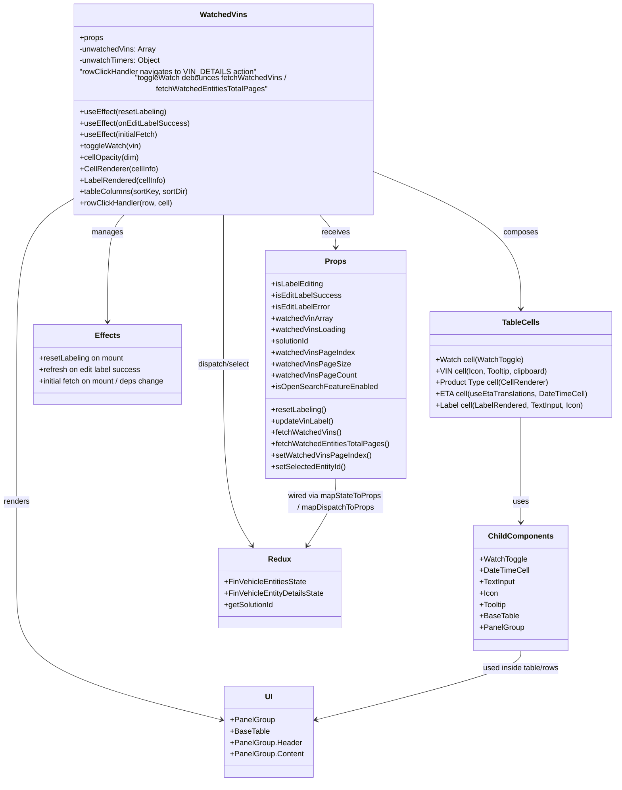

# Diagram: web/portal/src/pages/finishedvehicle/dashboard/components/organisms/FinishedVehicle.WatchedVins.organism.js

> Auto-generated by Obscura crawlers

## Mermaid

### SVG

<svg id="container" width="1301.953125" xmlns="http://www.w3.org/2000/svg" class="classDiagram" height="1654" viewBox="0 0 1301.953125 1654" role="graphics-document document" aria-roledescription="class"><g><defs><marker id="container_class-aggregationStart" class="marker aggregation class" refX="18" refY="7" markerWidth="190" markerHeight="240" orient="auto"><path d="M 18,7 L9,13 L1,7 L9,1 Z"></path></marker></defs><defs><marker id="container_class-aggregationEnd" class="marker aggregation class" refX="1" refY="7" markerWidth="20" markerHeight="28" orient="auto"><path d="M 18,7 L9,13 L1,7 L9,1 Z"></path></marker></defs><defs><marker id="container_class-extensionStart" class="marker extension class" refX="18" refY="7" markerWidth="190" markerHeight="240" orient="auto"><path d="M 1,7 L18,13 V 1 Z"></path></marker></defs><defs><marker id="container_class-extensionEnd" class="marker extension class" refX="1" refY="7" markerWidth="20" markerHeight="28" orient="auto"><path d="M 1,1 V 13 L18,7 Z"></path></marker></defs><defs><marker id="container_class-compositionStart" class="marker composition class" refX="18" refY="7" markerWidth="190" markerHeight="240" orient="auto"><path d="M 18,7 L9,13 L1,7 L9,1 Z"></path></marker></defs><defs><marker id="container_class-compositionEnd" class="marker composition class" refX="1" refY="7" markerWidth="20" markerHeight="28" orient="auto"><path d="M 18,7 L9,13 L1,7 L9,1 Z"></path></marker></defs><defs><marker id="container_class-dependencyStart" class="marker dependency class" refX="6" refY="7" markerWidth="190" markerHeight="240" orient="auto"><path d="M 5,7 L9,13 L1,7 L9,1 Z"></path></marker></defs><defs><marker id="container_class-dependencyEnd" class="marker dependency class" refX="13" refY="7" markerWidth="20" markerHeight="28" orient="auto"><path d="M 18,7 L9,13 L14,7 L9,1 Z"></path></marker></defs><defs><marker id="container_class-lollipopStart" class="marker lollipop class" refX="13" refY="7" markerWidth="190" markerHeight="240" orient="auto"><circle stroke="black" fill="transparent" cx="7" cy="7" r="6"></circle></marker></defs><defs><marker id="container_class-lollipopEnd" class="marker lollipop class" refX="1" refY="7" markerWidth="190" markerHeight="240" orient="auto"><circle stroke="black" fill="transparent" cx="7" cy="7" r="6"></circle></marker></defs><g class="root"><g class="clusters"></g><g class="edgePaths"><path d="M687.901,440L693.704,446.167C699.507,452.333,711.113,464.667,716.916,476C722.719,487.333,722.719,497.667,722.719,502.833L722.719,508" id="id_WatchedVins_Props_1" class="edge-thickness-normal edge-pattern-solid relation" style=";;;" data-edge="true" data-et="edge" data-id="id_WatchedVins_Props_1" data-points="W3sieCI6Njg3LjkwMTAwMDQ5NDA3MTEsInkiOjQ0MH0seyJ4Ijo3MjIuNzE4NzUsInkiOjQ3N30seyJ4Ijo3MjIuNzE4NzUsInkiOjUxNH1d" marker-end="url(#container_class-dependencyEnd)"></path><path d="M268.911,440L262.752,446.167C256.593,452.333,244.275,464.667,238.116,502C231.957,539.333,231.957,601.667,231.957,632.833L231.957,664" id="id_WatchedVins_Effects_2" class="edge-thickness-normal edge-pattern-solid relation" style=";;;" data-edge="true" data-et="edge" data-id="id_WatchedVins_Effects_2" data-points="W3sieCI6MjY4LjkxMDc1ODM5OTIwOTUsInkiOjQ0MH0seyJ4IjoyMzEuOTU3MDMxMjUsInkiOjQ3N30seyJ4IjoyMzEuOTU3MDMxMjUsInkiOjY3MH1d" marker-end="url(#container_class-dependencyEnd)"></path><path d="M166.547,403.281L144.747,415.568C122.948,427.854,79.349,452.427,57.549,510.88C35.75,569.333,35.75,661.667,35.75,758C35.75,854.333,35.75,954.667,35.75,1037C35.75,1119.333,35.75,1183.667,35.75,1244C35.75,1304.333,35.75,1360.667,108.726,1406.96C181.703,1453.254,327.656,1489.507,400.632,1507.634L473.609,1525.761" id="id_WatchedVins_UI_3" class="edge-thickness-normal edge-pattern-solid relation" style=";;;" data-edge="true" data-et="edge" data-id="id_WatchedVins_UI_3" data-points="W3sieCI6MTY2LjU0Njg3NSwieSI6NDAzLjI4MTM1MzMzNjM1MDA0fSx7IngiOjM1Ljc1LCJ5Ijo0Nzd9LHsieCI6MzUuNzUsInkiOjc1NH0seyJ4IjozNS43NSwieSI6MTA1NX0seyJ4IjozNS43NSwieSI6MTI0OH0seyJ4IjozNS43NSwieSI6MTQxN30seyJ4Ijo0NzkuNDMxNjQwNjI1LCJ5IjoxNTI3LjIwNzA5NjkyMjQ1NH1d" marker-end="url(#container_class-dependencyEnd)"></path><path d="M802.734,353.386L853.385,373.989C904.035,394.591,1005.336,435.795,1055.986,483.064C1106.637,530.333,1106.637,583.667,1106.637,610.333L1106.637,637" id="id_WatchedVins_TableCells_4" class="edge-thickness-normal edge-pattern-solid relation" style=";;;" data-edge="true" data-et="edge" data-id="id_WatchedVins_TableCells_4" data-points="W3sieCI6ODAyLjczNDM3NSwieSI6MzUzLjM4NjIxMjQ4Mzc1fSx7IngiOjExMDYuNjM2NzE4NzUsInkiOjQ3N30seyJ4IjoxMTA2LjYzNjcxODc1LCJ5Ijo2NDN9XQ==" marker-end="url(#container_class-dependencyEnd)"></path><path d="M1106.637,865L1106.637,896.667C1106.637,928.333,1106.637,991.667,1106.637,1032.5C1106.637,1073.333,1106.637,1091.667,1106.637,1100.833L1106.637,1110" id="id_TableCells_ChildComponents_5" class="edge-thickness-normal edge-pattern-solid relation" style=";;;" data-edge="true" data-et="edge" data-id="id_TableCells_ChildComponents_5" data-points="W3sieCI6MTEwNi42MzY3MTg3NSwieSI6ODY1fSx7IngiOjExMDYuNjM2NzE4NzUsInkiOjEwNTV9LHsieCI6MTEwNi42MzY3MTg3NSwieSI6MTExNn1d" marker-end="url(#container_class-dependencyEnd)"></path><path d="M484.641,440L484.641,446.167C484.641,452.333,484.641,464.667,484.641,517C484.641,569.333,484.641,661.667,484.641,758C484.641,854.333,484.641,954.667,495.321,1022.149C506,1089.631,527.36,1124.262,538.04,1141.578L548.72,1158.893" id="id_WatchedVins_Redux_6" class="edge-thickness-normal edge-pattern-solid relation" style=";;;" data-edge="true" data-et="edge" data-id="id_WatchedVins_Redux_6" data-points="W3sieCI6NDg0LjY0MDYyNSwieSI6NDQwfSx7IngiOjQ4NC42NDA2MjUsInkiOjQ3N30seyJ4Ijo0ODQuNjQwNjI1LCJ5Ijo3NTR9LHsieCI6NDg0LjY0MDYyNSwieSI6MTA1NX0seyJ4Ijo1NTEuODY5OTQwMDkwNjczNiwieSI6MTE2NH1d" marker-end="url(#container_class-dependencyEnd)"></path><path d="M722.719,994L722.719,1004.167C722.719,1014.333,722.719,1034.667,712.039,1062.149C701.359,1089.631,679.999,1124.262,669.319,1141.578L658.639,1158.893" id="id_Props_Redux_7" class="edge-thickness-normal edge-pattern-solid relation" style=";;;" data-edge="true" data-et="edge" data-id="id_Props_Redux_7" data-points="W3sieCI6NzIyLjcxODc1LCJ5Ijo5OTR9LHsieCI6NzIyLjcxODc1LCJ5IjoxMDU1fSx7IngiOjY1NS40ODk0MzQ5MDkzMjY0LCJ5IjoxMTY0fV0=" marker-end="url(#container_class-dependencyEnd)"></path><path d="M1106.637,1380L1106.637,1386.167C1106.637,1392.333,1106.637,1404.667,1033.66,1428.96C960.684,1453.254,814.731,1489.507,741.755,1507.634L668.778,1525.761" id="id_ChildComponents_UI_8" class="edge-thickness-normal edge-pattern-solid relation" style=";;;" data-edge="true" data-et="edge" data-id="id_ChildComponents_UI_8" data-points="W3sieCI6MTEwNi42MzY3MTg3NSwieSI6MTM4MH0seyJ4IjoxMTA2LjYzNjcxODc1LCJ5IjoxNDE3fSx7IngiOjY2Mi45NTUwNzgxMjUsInkiOjE1MjcuMjA3MDk2OTIyNDU0fV0=" marker-end="url(#container_class-dependencyEnd)"></path></g><g class="edgeLabels"><g class="edgeLabel" transform="translate(722.71875, 477)"><g class="label" data-id="id_WatchedVins_Props_1" transform="translate(-29.4921875, -12)"><foreignObject width="58.984375" height="24">

receives

</foreignObject></g></g><g class="edgeLabel" transform="translate(231.95703125, 477)"><g class="label" data-id="id_WatchedVins_Effects_2" transform="translate(-32.296875, -12)"><foreignObject width="64.59375" height="24">

manages

</foreignObject></g></g><g class="edgeLabel" transform="translate(35.75, 1055)"><g class="label" data-id="id_WatchedVins_UI_3" transform="translate(-27.75, -12)"><foreignObject width="55.5" height="24">

renders

</foreignObject></g></g><g class="edgeLabel" transform="translate(1106.63671875, 477)"><g class="label" data-id="id_WatchedVins_TableCells_4" transform="translate(-36.453125, -12)"><foreignObject width="72.90625" height="24">

composes

</foreignObject></g></g><g class="edgeLabel" transform="translate(1106.63671875, 1055)"><g class="label" data-id="id_TableCells_ChildComponents_5" transform="translate(-16.4921875, -12)"><foreignObject width="32.984375" height="24">

uses

</foreignObject></g></g><g class="edgeLabel" transform="translate(484.640625, 754)"><g class="label" data-id="id_WatchedVins_Redux_6" transform="translate(-56.4765625, -12)"><foreignObject width="112.953125" height="24">

dispatch/select

</foreignObject></g></g><g class="edgeLabel" transform="translate(722.71875, 1055)"><g class="label" data-id="id_Props_Redux_7" transform="translate(-100, -36)"><foreignObject width="200" height="72">

wired via mapStateToProps / mapDispatchToProps

</foreignObject></g></g><g class="edgeLabel" transform="translate(1106.63671875, 1417)"><g class="label" data-id="id_ChildComponents_UI_8" transform="translate(-83.375, -12)"><foreignObject width="166.75" height="24">

used inside table/rows

</foreignObject></g></g></g><g class="nodes"><g class="node default" id="classId-WatchedVins-0" transform="translate(484.640625, 224)"><g class="basic label-container"><path d="M-318.09375 -216 L318.09375 -216 L318.09375 216 L-318.09375 216" stroke="none" stroke-width="0" fill="#ECECFF" style=""></path><path d="M-318.09375 -216 C-156.34157168687463 -216, 5.41060662625074 -216, 318.09375 -216 M-318.09375 -216 C-117.04873700572927 -216, 83.99627598854147 -216, 318.09375 -216 M318.09375 -216 C318.09375 -111.5292575637736, 318.09375 -7.058515127547196, 318.09375 216 M318.09375 -216 C318.09375 -76.5034580938756, 318.09375 62.99308381224881, 318.09375 216 M318.09375 216 C83.73960127645398 216, -150.61454744709204 216, -318.09375 216 M318.09375 216 C72.12225978125991 216, -173.84923043748017 216, -318.09375 216 M-318.09375 216 C-318.09375 57.59365621542892, -318.09375 -100.81268756914216, -318.09375 -216 M-318.09375 216 C-318.09375 79.05389164889931, -318.09375 -57.89221670220138, -318.09375 -216" stroke="#9370DB" stroke-width="1.3" fill="none" stroke-dasharray="0 0" style=""></path></g><g class="annotation-group text" transform="translate(0, -192)"></g><g class="label-group text" transform="translate(-46.828125, -192)"><g class="label" style="font-weight: bolder" transform="translate(0,-12)"><foreignObject width="93.65625" height="24">

WatchedVins

</foreignObject></g></g><g class="members-group text" transform="translate(-306.09375, -144)"><g class="label" style="" transform="translate(0,-12)"><foreignObject width="49.515625" height="24">

+props

</foreignObject></g><g class="label" style="" transform="translate(0,12)"><foreignObject width="161.609375" height="24">

-unwatchedVins: Array

</foreignObject></g><g class="label" style="" transform="translate(0,36)"><foreignObject width="171.59375" height="24">

-unwatchTimers: Object

</foreignObject></g><g class="label" style="" transform="translate(0,60)"><foreignObject width="366.40625" height="24">

"rowClickHandler navigates to VIN_DETAILS action"

</foreignObject></g><g class="label" style="" transform="translate(0,84)"><foreignObject width="565.359375" height="24">

"toggleWatch debounces fetchWatchedVins / fetchWatchedEntitiesTotalPages"

</foreignObject></g></g><g class="methods-group text" transform="translate(-306.09375, 0)"><g class="label" style="" transform="translate(0,-12)"><foreignObject width="182.828125" height="24">

+useEffect(resetLabeling)

</foreignObject></g><g class="label" style="" transform="translate(0,12)"><foreignObject width="227.234375" height="24">

+useEffect(onEditLabelSuccess)

</foreignObject></g><g class="label" style="" transform="translate(0,36)"><foreignObject width="165.296875" height="24">

+useEffect(initialFetch)

</foreignObject></g><g class="label" style="" transform="translate(0,60)"><foreignObject width="128.890625" height="24">

+toggleWatch(vin)

</foreignObject></g><g class="label" style="" transform="translate(0,84)"><foreignObject width="126.421875" height="24">

+cellOpacity(dim)

</foreignObject></g><g class="label" style="" transform="translate(0,108)"><foreignObject width="165.578125" height="24">

+CellRenderer(cellInfo)

</foreignObject></g><g class="label" style="" transform="translate(0,132)"><foreignObject width="181.65625" height="24">

+LabelRendered(cellInfo)

</foreignObject></g><g class="label" style="" transform="translate(0,156)"><foreignObject width="229.71875" height="24">

+tableColumns(sortKey, sortDir)

</foreignObject></g><g class="label" style="" transform="translate(0,180)"><foreignObject width="196.4375" height="24">

+rowClickHandler(row, cell)

</foreignObject></g></g><g class="divider" style=""><path d="M-318.09375 -168 C-125.11473116010313 -168, 67.86428767979373 -168, 318.09375 -168 M-318.09375 -168 C-135.65655869150527 -168, 46.780632616989465 -168, 318.09375 -168" stroke="#9370DB" stroke-width="1.3" fill="none" stroke-dasharray="0 0" style=""></path></g><g class="divider" style=""><path d="M-318.09375 -24 C-76.13889687773784 -24, 165.81595624452433 -24, 318.09375 -24 M-318.09375 -24 C-71.61943967720822 -24, 174.85487064558356 -24, 318.09375 -24" stroke="#9370DB" stroke-width="1.3" fill="none" stroke-dasharray="0 0" style=""></path></g></g><g class="node default" id="classId-Props-1" transform="translate(722.71875, 754)"><g class="basic label-container"><path d="M-146.6015625 -240 L146.6015625 -240 L146.6015625 240 L-146.6015625 240" stroke="none" stroke-width="0" fill="#ECECFF" style=""></path><path d="M-146.6015625 -240 C-31.365715378547947 -240, 83.8701317429041 -240, 146.6015625 -240 M-146.6015625 -240 C-40.12712294249343 -240, 66.34731661501314 -240, 146.6015625 -240 M146.6015625 -240 C146.6015625 -92.72406918954397, 146.6015625 54.551861620912064, 146.6015625 240 M146.6015625 -240 C146.6015625 -112.74116254062942, 146.6015625 14.517674918741164, 146.6015625 240 M146.6015625 240 C72.09739449805582 240, -2.4067735038883598 240, -146.6015625 240 M146.6015625 240 C29.56560012218401 240, -87.47036225563198 240, -146.6015625 240 M-146.6015625 240 C-146.6015625 53.4081731331232, -146.6015625 -133.1836537337536, -146.6015625 -240 M-146.6015625 240 C-146.6015625 61.819915585602786, -146.6015625 -116.36016882879443, -146.6015625 -240" stroke="#9370DB" stroke-width="1.3" fill="none" stroke-dasharray="0 0" style=""></path></g><g class="annotation-group text" transform="translate(0, -216)"></g><g class="label-group text" transform="translate(-20.921875, -216)"><g class="label" style="font-weight: bolder" transform="translate(0,-12)"><foreignObject width="41.84375" height="24">

Props

</foreignObject></g></g><g class="members-group text" transform="translate(-134.6015625, -168)"><g class="label" style="" transform="translate(0,-12)"><foreignObject width="109.703125" height="24">

+isLabelEditing

</foreignObject></g><g class="label" style="" transform="translate(0,12)"><foreignObject width="143.6875" height="24">

+isEditLabelSuccess

</foreignObject></g><g class="label" style="" transform="translate(0,36)"><foreignObject width="123.28125" height="24">

+isEditLabelError

</foreignObject></g><g class="label" style="" transform="translate(0,60)"><foreignObject width="128.90625" height="24">

+watchedVinArray

</foreignObject></g><g class="label" style="" transform="translate(0,84)"><foreignObject width="156.3125" height="24">

+watchedVinsLoading

</foreignObject></g><g class="label" style="" transform="translate(0,108)"><foreignObject width="82.109375" height="24">

+solutionId

</foreignObject></g><g class="label" style="" transform="translate(0,132)"><foreignObject width="172.828125" height="24">

+watchedVinsPageIndex

</foreignObject></g><g class="label" style="" transform="translate(0,156)"><foreignObject width="161.65625" height="24">

+watchedVinsPageSize

</foreignObject></g><g class="label" style="" transform="translate(0,180)"><foreignObject width="175.265625" height="24">

+watchedVinsPageCount

</foreignObject></g><g class="label" style="" transform="translate(0,204)"><foreignObject width="220.296875" height="24">

+isOpenSearchFeatureEnabled

</foreignObject></g></g><g class="methods-group text" transform="translate(-134.6015625, 96)"><g class="label" style="" transform="translate(0,-12)"><foreignObject width="116.375" height="24">

+resetLabeling()

</foreignObject></g><g class="label" style="" transform="translate(0,12)"><foreignObject width="131.90625" height="24">

+updateVinLabel()

</foreignObject></g><g class="label" style="" transform="translate(0,36)"><foreignObject width="147.140625" height="24">

+fetchWatchedVins()

</foreignObject></g><g class="label" style="" transform="translate(0,60)"><foreignObject width="248.28125" height="24">

+fetchWatchedEntitiesTotalPages()

</foreignObject></g><g class="label" style="" transform="translate(0,84)"><foreignObject width="206.609375" height="24">

+setWatchedVinsPageIndex()

</foreignObject></g><g class="label" style="" transform="translate(0,108)"><foreignObject width="158.484375" height="24">

+setSelectedEntityId()

</foreignObject></g></g><g class="divider" style=""><path d="M-146.6015625 -192 C-76.17170718009744 -192, -5.741851860194885 -192, 146.6015625 -192 M-146.6015625 -192 C-32.41620458565579 -192, 81.76915332868842 -192, 146.6015625 -192" stroke="#9370DB" stroke-width="1.3" fill="none" stroke-dasharray="0 0" style=""></path></g><g class="divider" style=""><path d="M-146.6015625 72 C-50.499922562317494 72, 45.60171737536501 72, 146.6015625 72 M-146.6015625 72 C-79.74535946127394 72, -12.88915642254787 72, 146.6015625 72" stroke="#9370DB" stroke-width="1.3" fill="none" stroke-dasharray="0 0" style=""></path></g></g><g class="node default" id="classId-Effects-2" transform="translate(231.95703125, 754)"><g class="basic label-container"><path d="M-161.20703125 -84 L161.20703125 -84 L161.20703125 84 L-161.20703125 84" stroke="none" stroke-width="0" fill="#ECECFF" style=""></path><path d="M-161.20703125 -84 C-70.88746465213498 -84, 19.43210194573004 -84, 161.20703125 -84 M-161.20703125 -84 C-36.90645530474583 -84, 87.39412064050833 -84, 161.20703125 -84 M161.20703125 -84 C161.20703125 -38.39362977813872, 161.20703125 7.212740443722566, 161.20703125 84 M161.20703125 -84 C161.20703125 -19.970896376271085, 161.20703125 44.05820724745783, 161.20703125 84 M161.20703125 84 C56.520686639508625 84, -48.16565797098275 84, -161.20703125 84 M161.20703125 84 C32.670807652829836 84, -95.86541594434033 84, -161.20703125 84 M-161.20703125 84 C-161.20703125 44.06682915877808, -161.20703125 4.133658317556154, -161.20703125 -84 M-161.20703125 84 C-161.20703125 43.305830565084, -161.20703125 2.6116611301680024, -161.20703125 -84" stroke="#9370DB" stroke-width="1.3" fill="none" stroke-dasharray="0 0" style=""></path></g><g class="annotation-group text" transform="translate(0, -60)"></g><g class="label-group text" transform="translate(-24.8671875, -60)"><g class="label" style="font-weight: bolder" transform="translate(0,-12)"><foreignObject width="49.734375" height="24">

Effects

</foreignObject></g></g><g class="members-group text" transform="translate(-149.20703125, -12)"><g class="label" style="" transform="translate(0,-12)"><foreignObject width="180.734375" height="24">

+resetLabeling on mount

</foreignObject></g><g class="label" style="" transform="translate(0,12)"><foreignObject width="214.453125" height="24">

+refresh on edit label success

</foreignObject></g><g class="label" style="" transform="translate(0,36)"><foreignObject width="273.546875" height="24">

+initial fetch on mount / deps change

</foreignObject></g></g><g class="methods-group text" transform="translate(-149.20703125, 84)"></g><g class="divider" style=""><path d="M-161.20703125 -36 C-65.64534512663609 -36, 29.916340996727826 -36, 161.20703125 -36 M-161.20703125 -36 C-64.1593359653799 -36, 32.88835931924021 -36, 161.20703125 -36" stroke="#9370DB" stroke-width="1.3" fill="none" stroke-dasharray="0 0" style=""></path></g><g class="divider" style=""><path d="M-161.20703125 60 C-85.06377978160685 60, -8.920528313213708 60, 161.20703125 60 M-161.20703125 60 C-40.565972928329955 60, 80.07508539334009 60, 161.20703125 60" stroke="#9370DB" stroke-width="1.3" fill="none" stroke-dasharray="0 0" style=""></path></g></g><g class="node default" id="classId-UI-3" transform="translate(571.193359375, 1550)"><g class="basic label-container"><path d="M-91.76171875 -96 L91.76171875 -96 L91.76171875 96 L-91.76171875 96" stroke="none" stroke-width="0" fill="#ECECFF" style=""></path><path d="M-91.76171875 -96 C-34.121895339849786 -96, 23.517928070300428 -96, 91.76171875 -96 M-91.76171875 -96 C-38.65059495524261 -96, 14.46052883951478 -96, 91.76171875 -96 M91.76171875 -96 C91.76171875 -42.26597409590988, 91.76171875 11.468051808180235, 91.76171875 96 M91.76171875 -96 C91.76171875 -39.51447017720655, 91.76171875 16.971059645586905, 91.76171875 96 M91.76171875 96 C34.20770286697745 96, -23.3463130160451 96, -91.76171875 96 M91.76171875 96 C18.698355803827326 96, -54.36500714234535 96, -91.76171875 96 M-91.76171875 96 C-91.76171875 31.857054380526506, -91.76171875 -32.28589123894699, -91.76171875 -96 M-91.76171875 96 C-91.76171875 25.906488538186267, -91.76171875 -44.18702292362747, -91.76171875 -96" stroke="#9370DB" stroke-width="1.3" fill="none" stroke-dasharray="0 0" style=""></path></g><g class="annotation-group text" transform="translate(0, -72)"></g><g class="label-group text" transform="translate(-7.5546875, -72)"><g class="label" style="font-weight: bolder" transform="translate(0,-12)"><foreignObject width="15.109375" height="24">

UI

</foreignObject></g></g><g class="members-group text" transform="translate(-79.76171875, -24)"><g class="label" style="" transform="translate(0,-12)"><foreignObject width="91.84375" height="24">

+PanelGroup

</foreignObject></g><g class="label" style="" transform="translate(0,12)"><foreignObject width="81.46875" height="24">

+BaseTable

</foreignObject></g><g class="label" style="" transform="translate(0,36)"><foreignObject width="148.140625" height="24">

+PanelGroup.Header

</foreignObject></g><g class="label" style="" transform="translate(0,60)"><foreignObject width="151.96875" height="24">

+PanelGroup.Content

</foreignObject></g></g><g class="methods-group text" transform="translate(-79.76171875, 96)"></g><g class="divider" style=""><path d="M-91.76171875 -48 C-39.057927907165926 -48, 13.645862935668148 -48, 91.76171875 -48 M-91.76171875 -48 C-35.006473394060116 -48, 21.74877196187977 -48, 91.76171875 -48" stroke="#9370DB" stroke-width="1.3" fill="none" stroke-dasharray="0 0" style=""></path></g><g class="divider" style=""><path d="M-91.76171875 72 C-37.77387349110732 72, 16.213971767785367 72, 91.76171875 72 M-91.76171875 72 C-46.98961418229986 72, -2.21750961459972 72, 91.76171875 72" stroke="#9370DB" stroke-width="1.3" fill="none" stroke-dasharray="0 0" style=""></path></g></g><g class="node default" id="classId-TableCells-4" transform="translate(1106.63671875, 754)"><g class="basic label-container"><path d="M-187.31640625 -111 L187.31640625 -111 L187.31640625 111 L-187.31640625 111" stroke="none" stroke-width="0" fill="#ECECFF" style=""></path><path d="M-187.31640625 -111 C-66.4477748571415 -111, 54.42085653571701 -111, 187.31640625 -111 M-187.31640625 -111 C-100.3695768938521 -111, -13.422747537704197 -111, 187.31640625 -111 M187.31640625 -111 C187.31640625 -64.36945936005208, 187.31640625 -17.738918720104152, 187.31640625 111 M187.31640625 -111 C187.31640625 -64.83005018496576, 187.31640625 -18.6601003699315, 187.31640625 111 M187.31640625 111 C53.50155595814334 111, -80.31329433371332 111, -187.31640625 111 M187.31640625 111 C76.63849311571134 111, -34.03942001857732 111, -187.31640625 111 M-187.31640625 111 C-187.31640625 47.90047066152864, -187.31640625 -15.199058676942727, -187.31640625 -111 M-187.31640625 111 C-187.31640625 34.69486231990682, -187.31640625 -41.610275360186364, -187.31640625 -111" stroke="#9370DB" stroke-width="1.3" fill="none" stroke-dasharray="0 0" style=""></path></g><g class="annotation-group text" transform="translate(0, -87)"></g><g class="label-group text" transform="translate(-37.3046875, -87)"><g class="label" style="font-weight: bolder" transform="translate(0,-12)"><foreignObject width="74.609375" height="24">

TableCells

</foreignObject></g></g><g class="members-group text" transform="translate(-175.31640625, -39)"></g><g class="methods-group text" transform="translate(-175.31640625, -9)"><g class="label" style="" transform="translate(0,-12)"><foreignObject width="182.734375" height="24">

+Watch cell(WatchToggle)

</foreignObject></g><g class="label" style="" transform="translate(0,12)"><foreignObject width="238.5" height="24">

+VIN cell(Icon, Tooltip, clipboard)

</foreignObject></g><g class="label" style="" transform="translate(0,36)"><foreignObject width="235.46875" height="24">

+Product Type cell(CellRenderer)

</foreignObject></g><g class="label" style="" transform="translate(0,60)"><foreignObject width="313.328125" height="24">

+ETA cell(useEtaTranslations, DateTimeCell)

</foreignObject></g><g class="label" style="" transform="translate(0,84)"><foreignObject width="311.859375" height="24">

+Label cell(LabelRendered, TextInput, Icon)

</foreignObject></g></g><g class="divider" style=""><path d="M-187.31640625 -63 C-77.57660590789278 -63, 32.16319443421443 -63, 187.31640625 -63 M-187.31640625 -63 C-47.2717777796604 -63, 92.7728506906792 -63, 187.31640625 -63" stroke="#9370DB" stroke-width="1.3" fill="none" stroke-dasharray="0 0" style=""></path></g><g class="divider" style=""><path d="M-187.31640625 -39 C-91.72842251483705 -39, 3.859561220325901 -39, 187.31640625 -39 M-187.31640625 -39 C-40.69742538745277 -39, 105.92155547509446 -39, 187.31640625 -39" stroke="#9370DB" stroke-width="1.3" fill="none" stroke-dasharray="0 0" style=""></path></g></g><g class="node default" id="classId-ChildComponents-5" transform="translate(1106.63671875, 1248)"><g class="basic label-container"><path d="M-95.75 -132 L95.75 -132 L95.75 132 L-95.75 132" stroke="none" stroke-width="0" fill="#ECECFF" style=""></path><path d="M-95.75 -132 C-41.77263684915222 -132, 12.204726301695558 -132, 95.75 -132 M-95.75 -132 C-46.85232379119368 -132, 2.0453524176126336 -132, 95.75 -132 M95.75 -132 C95.75 -39.85678824754855, 95.75 52.2864235049029, 95.75 132 M95.75 -132 C95.75 -56.7369773500491, 95.75 18.526045299901796, 95.75 132 M95.75 132 C19.721816049695676 132, -56.30636790060865 132, -95.75 132 M95.75 132 C36.46815641057338 132, -22.813687178853243 132, -95.75 132 M-95.75 132 C-95.75 28.905454170967417, -95.75 -74.18909165806517, -95.75 -132 M-95.75 132 C-95.75 27.584167916796076, -95.75 -76.83166416640785, -95.75 -132" stroke="#9370DB" stroke-width="1.3" fill="none" stroke-dasharray="0 0" style=""></path></g><g class="annotation-group text" transform="translate(0, -108)"></g><g class="label-group text" transform="translate(-64.453125, -108)"><g class="label" style="font-weight: bolder" transform="translate(0,-12)"><foreignObject width="128.90625" height="24">

ChildComponents

</foreignObject></g></g><g class="members-group text" transform="translate(-83.75, -60)"><g class="label" style="" transform="translate(0,-12)"><foreignObject width="98.703125" height="24">

+WatchToggle

</foreignObject></g><g class="label" style="" transform="translate(0,12)"><foreignObject width="103.046875" height="24">

+DateTimeCell

</foreignObject></g><g class="label" style="" transform="translate(0,36)"><foreignObject width="75.390625" height="24">

+TextInput

</foreignObject></g><g class="label" style="" transform="translate(0,60)"><foreignObject width="38.765625" height="24">

+Icon

</foreignObject></g><g class="label" style="" transform="translate(0,84)"><foreignObject width="57.75" height="24">

+Tooltip

</foreignObject></g><g class="label" style="" transform="translate(0,108)"><foreignObject width="81.46875" height="24">

+BaseTable

</foreignObject></g><g class="label" style="" transform="translate(0,132)"><foreignObject width="91.84375" height="24">

+PanelGroup

</foreignObject></g></g><g class="methods-group text" transform="translate(-83.75, 132)"></g><g class="divider" style=""><path d="M-95.75 -84 C-19.55184232555044 -84, 56.64631534889912 -84, 95.75 -84 M-95.75 -84 C-32.54090820658961 -84, 30.668183586820774 -84, 95.75 -84" stroke="#9370DB" stroke-width="1.3" fill="none" stroke-dasharray="0 0" style=""></path></g><g class="divider" style=""><path d="M-95.75 108 C-33.77030575792607 108, 28.209388484147865 108, 95.75 108 M-95.75 108 C-23.659926252034722 108, 48.430147495930555 108, 95.75 108" stroke="#9370DB" stroke-width="1.3" fill="none" stroke-dasharray="0 0" style=""></path></g></g><g class="node default" id="classId-Redux-6" transform="translate(603.6796875, 1248)"><g class="basic label-container"><path d="M-128.50390625 -84 L128.50390625 -84 L128.50390625 84 L-128.50390625 84" stroke="none" stroke-width="0" fill="#ECECFF" style=""></path><path d="M-128.50390625 -84 C-66.59651332846315 -84, -4.689120406926307 -84, 128.50390625 -84 M-128.50390625 -84 C-66.53273172222882 -84, -4.561557194457649 -84, 128.50390625 -84 M128.50390625 -84 C128.50390625 -41.1435363851345, 128.50390625 1.7129272297309939, 128.50390625 84 M128.50390625 -84 C128.50390625 -47.03893823637037, 128.50390625 -10.07787647274074, 128.50390625 84 M128.50390625 84 C75.6374323421667 84, 22.770958434333394 84, -128.50390625 84 M128.50390625 84 C53.221345284340046 84, -22.061215681319908 84, -128.50390625 84 M-128.50390625 84 C-128.50390625 32.04124881558798, -128.50390625 -19.917502368824046, -128.50390625 -84 M-128.50390625 84 C-128.50390625 30.53854892313607, -128.50390625 -22.92290215372786, -128.50390625 -84" stroke="#9370DB" stroke-width="1.3" fill="none" stroke-dasharray="0 0" style=""></path></g><g class="annotation-group text" transform="translate(0, -60)"></g><g class="label-group text" transform="translate(-22.7109375, -60)"><g class="label" style="font-weight: bolder" transform="translate(0,-12)"><foreignObject width="45.421875" height="24">

Redux

</foreignObject></g></g><g class="members-group text" transform="translate(-116.50390625, -12)"><g class="label" style="" transform="translate(0,-12)"><foreignObject width="173.140625" height="24">

+FinVehicleEntitiesState

</foreignObject></g><g class="label" style="" transform="translate(0,12)"><foreignObject width="210.296875" height="24">

+FinVehicleEntityDetailsState

</foreignObject></g><g class="label" style="" transform="translate(0,36)"><foreignObject width="105.90625" height="24">

+getSolutionId

</foreignObject></g></g><g class="methods-group text" transform="translate(-116.50390625, 84)"></g><g class="divider" style=""><path d="M-128.50390625 -36 C-53.47688240324919 -36, 21.550141443501616 -36, 128.50390625 -36 M-128.50390625 -36 C-61.57452078041584 -36, 5.354864689168323 -36, 128.50390625 -36" stroke="#9370DB" stroke-width="1.3" fill="none" stroke-dasharray="0 0" style=""></path></g><g class="divider" style=""><path d="M-128.50390625 60 C-73.02591005054387 60, -17.547913851087742 60, 128.50390625 60 M-128.50390625 60 C-34.95553023223354 60, 58.592845785532916 60, 128.50390625 60" stroke="#9370DB" stroke-width="1.3" fill="none" stroke-dasharray="0 0" style=""></path></g></g></g></g></g></svg>
