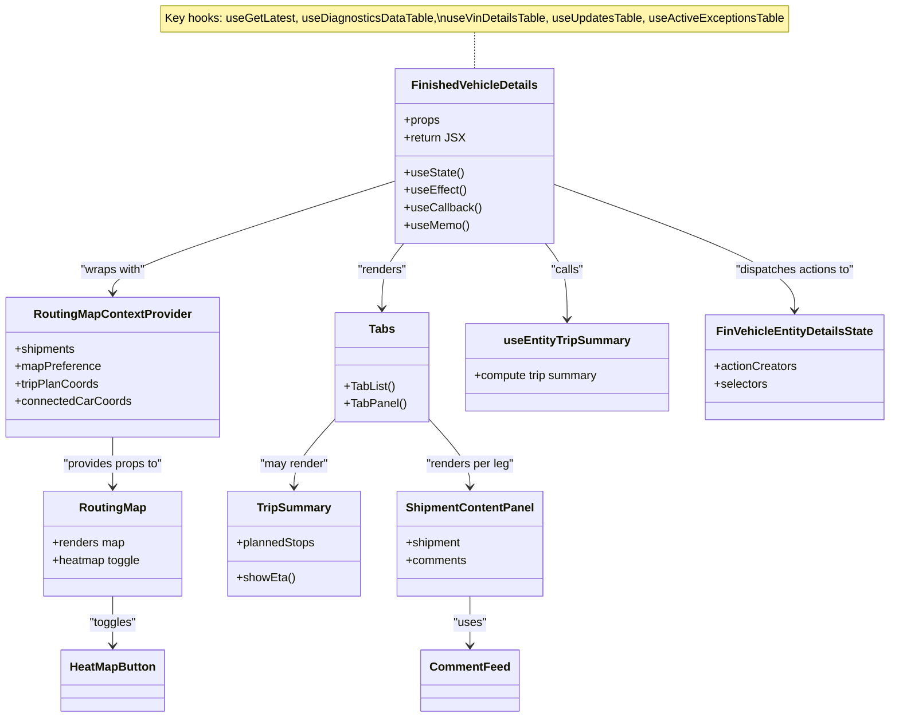

# Diagram: web/portal/src/pages/finishedvehicle/details/FinishedVehicle.Details.page.js


> Auto-generated by Obscura crawlers

## Diagram 1

```mermaid
flowchart TD
  A[FinishedVehicleDetails Component] -->|uses| B[useEffect: init fetches]
  A -->|uses| C[useState: loading, mapPreference, selectedLegID]
  A -->|dispatches| D[FinVehicleEntityDetailsState.fetchEntityDocuments]
  B --> E{entityId && details?}
  E -->|true| D
  B --> F[fetchEntityExceptions]
  B --> G[fetchEntityHolds]
  B --> H[fetchEntityPositionUpdates]
  B --> I[fetchEntityEvents]
  B --> J[fetchEntityDetails]
  B --> K[fetchPlannedTripLeg]
  B --> L[fetchActualTripLeg]
  B --> M[fetchEntityStateHistory]
  J & K & L & M -->|Promise.all then| C_set_loading_false[setIsLoading(false)]
  I & H -->|Promise.all then| C_set_event_loading_false[setIsLoadingEvent(false)]
  A -->|computes| N[tripSummary = useEntityTripSummary(combinedLegs, events)]
  N --> O{hasTripPlan?}
  O -->|true| P[ArrivalAndDeparturePanelGroup]
  A --> Q[RoutingMapContextProvider]
  Q --> R[RoutingMap]
  Q --> S[MapOptionsPanel]
  A --> T[Tabs / TabPanels]
  T --> U[EndToEndTab]
  T --> V[LegTabs...]
  V -->|each| W[ShipmentContentPanel]
  A --> X[ConnectedCarCoordinatesTable]
  A --> Y[BaseTable components for various tabs]
  A --> Z[CommentFeed / NewsFeedWidget]
  style A fill:#f9f,stroke:#333,stroke-width:1px
  style Q fill:#bbf,stroke:#333,stroke-width:1px
  style T fill:#bfb,stroke:#333,stroke-width:1px
```

> SVG rendering failed for this diagram.

## Diagram 2



### SVG

<svg id="container" width="1202.982421875" xmlns="http://www.w3.org/2000/svg" class="classDiagram" height="984" viewBox="0 0 1202.982421875 984" role="graphics-document document" aria-roledescription="class"><style>#container{font-family:"trebuchet ms",verdana,arial,sans-serif;font-size:16px;fill:#333;}@keyframes edge-animation-frame{from{stroke-dashoffset:0;}}@keyframes dash{to{stroke-dashoffset:0;}}#container .edge-animation-slow{stroke-dasharray:9,5!important;stroke-dashoffset:900;animation:dash 50s linear infinite;stroke-linecap:round;}#container .edge-animation-fast{stroke-dasharray:9,5!important;stroke-dashoffset:900;animation:dash 20s linear infinite;stroke-linecap:round;}#container .error-icon{fill:#552222;}#container .error-text{fill:#552222;stroke:#552222;}#container .edge-thickness-normal{stroke-width:1px;}#container .edge-thickness-thick{stroke-width:3.5px;}#container .edge-pattern-solid{stroke-dasharray:0;}#container .edge-thickness-invisible{stroke-width:0;fill:none;}#container .edge-pattern-dashed{stroke-dasharray:3;}#container .edge-pattern-dotted{stroke-dasharray:2;}#container .marker{fill:#333333;stroke:#333333;}#container .marker.cross{stroke:#333333;}#container svg{font-family:"trebuchet ms",verdana,arial,sans-serif;font-size:16px;}#container p{margin:0;}#container g.classGroup text{fill:#9370DB;stroke:none;font-family:"trebuchet ms",verdana,arial,sans-serif;font-size:10px;}#container g.classGroup text .title{font-weight:bolder;}#container .nodeLabel,#container .edgeLabel{color:#131300;}#container .edgeLabel .label rect{fill:#ECECFF;}#container .label text{fill:#131300;}#container .labelBkg{background:#ECECFF;}#container .edgeLabel .label span{background:#ECECFF;}#container .classTitle{font-weight:bolder;}#container .node rect,#container .node circle,#container .node ellipse,#container .node polygon,#container .node path{fill:#ECECFF;stroke:#9370DB;stroke-width:1px;}#container .divider{stroke:#9370DB;stroke-width:1;}#container g.clickable{cursor:pointer;}#container g.classGroup rect{fill:#ECECFF;stroke:#9370DB;}#container g.classGroup line{stroke:#9370DB;stroke-width:1;}#container .classLabel .box{stroke:none;stroke-width:0;fill:#ECECFF;opacity:0.5;}#container .classLabel .label{fill:#9370DB;font-size:10px;}#container .relation{stroke:#333333;stroke-width:1;fill:none;}#container .dashed-line{stroke-dasharray:3;}#container .dotted-line{stroke-dasharray:1 2;}#container #compositionStart,#container .composition{fill:#333333!important;stroke:#333333!important;stroke-width:1;}#container #compositionEnd,#container .composition{fill:#333333!important;stroke:#333333!important;stroke-width:1;}#container #dependencyStart,#container .dependency{fill:#333333!important;stroke:#333333!important;stroke-width:1;}#container #dependencyStart,#container .dependency{fill:#333333!important;stroke:#333333!important;stroke-width:1;}#container #extensionStart,#container .extension{fill:transparent!important;stroke:#333333!important;stroke-width:1;}#container #extensionEnd,#container .extension{fill:transparent!important;stroke:#333333!important;stroke-width:1;}#container #aggregationStart,#container .aggregation{fill:transparent!important;stroke:#333333!important;stroke-width:1;}#container #aggregationEnd,#container .aggregation{fill:transparent!important;stroke:#333333!important;stroke-width:1;}#container #lollipopStart,#container .lollipop{fill:#ECECFF!important;stroke:#333333!important;stroke-width:1;}#container #lollipopEnd,#container .lollipop{fill:#ECECFF!important;stroke:#333333!important;stroke-width:1;}#container .edgeTerminals{font-size:11px;line-height:initial;}#container .classTitleText{text-anchor:middle;font-size:18px;fill:#333;}#container .label-icon{display:inline-block;height:1em;overflow:visible;vertical-align:-0.125em;}#container .node .label-icon path{fill:currentColor;stroke:revert;stroke-width:revert;}#container :root{--mermaid-font-family:"trebuchet ms",verdana,arial,sans-serif;}</style><g><defs><marker id="container_class-aggregationStart" class="marker aggregation class" refX="18" refY="7" markerWidth="190" markerHeight="240" orient="auto"><path d="M 18,7 L9,13 L1,7 L9,1 Z"></path></marker></defs><defs><marker id="container_class-aggregationEnd" class="marker aggregation class" refX="1" refY="7" markerWidth="20" markerHeight="28" orient="auto"><path d="M 18,7 L9,13 L1,7 L9,1 Z"></path></marker></defs><defs><marker id="container_class-extensionStart" class="marker extension class" refX="18" refY="7" markerWidth="190" markerHeight="240" orient="auto"><path d="M 1,7 L18,13 V 1 Z"></path></marker></defs><defs><marker id="container_class-extensionEnd" class="marker extension class" refX="1" refY="7" markerWidth="20" markerHeight="28" orient="auto"><path d="M 1,1 V 13 L18,7 Z"></path></marker></defs><defs><marker id="container_class-compositionStart" class="marker composition class" refX="18" refY="7" markerWidth="190" markerHeight="240" orient="auto"><path d="M 18,7 L9,13 L1,7 L9,1 Z"></path></marker></defs><defs><marker id="container_class-compositionEnd" class="marker composition class" refX="1" refY="7" markerWidth="20" markerHeight="28" orient="auto"><path d="M 18,7 L9,13 L1,7 L9,1 Z"></path></marker></defs><defs><marker id="container_class-dependencyStart" class="marker dependency class" refX="6" refY="7" markerWidth="190" markerHeight="240" orient="auto"><path d="M 5,7 L9,13 L1,7 L9,1 Z"></path></marker></defs><defs><marker id="container_class-dependencyEnd" class="marker dependency class" refX="13" refY="7" markerWidth="20" markerHeight="28" orient="auto"><path d="M 18,7 L9,13 L14,7 L9,1 Z"></path></marker></defs><defs><marker id="container_class-lollipopStart" class="marker lollipop class" refX="13" refY="7" markerWidth="190" markerHeight="240" orient="auto"><circle stroke="black" fill="transparent" cx="7" cy="7" r="6"></circle></marker></defs><defs><marker id="container_class-lollipopEnd" class="marker lollipop class" refX="1" refY="7" markerWidth="190" markerHeight="240" orient="auto"><circle stroke="black" fill="transparent" cx="7" cy="7" r="6"></circle></marker></defs><g class="root"><g class="clusters"></g><g class="edgePaths"><path d="M639.229,44L639.229,48.167C639.229,52.333,639.229,60.667,639.229,69C639.229,77.333,639.229,85.667,639.229,89.833L639.229,94" id="edgeNote1" class="edge-thickness-normal edge-pattern-dotted relation" style="fill: none;;;fill: none" data-edge="true" data-et="edge" data-id="edgeNote1" data-points="W3sieCI6NjM5LjIyODUxNTYyNSwieSI6NDR9LHsieCI6NjM5LjIyODUxNTYyNSwieSI6Njl9LHsieCI6NjM5LjIyODUxNTYyNSwieSI6OTR9XQ=="></path><path d="M533.885,247.821L469.938,268.35C405.992,288.88,278.1,329.94,214.153,355.637C150.207,381.333,150.207,391.667,150.207,396.833L150.207,402" id="id_FinishedVehicleDetails_RoutingMapContextProvider_1" class="edge-thickness-normal edge-pattern-solid relation" style=";;;" data-edge="true" data-et="edge" data-id="id_FinishedVehicleDetails_RoutingMapContextProvider_1" data-points="W3sieCI6NTMzLjg4NDc2NTYyNSwieSI6MjQ3LjgyMDUzNjA2NzMyMTk0fSx7IngiOjE1MC4yMDcwMzEyNSwieSI6MzcxfSx7IngiOjE1MC4yMDcwMzEyNSwieSI6NDA4fV0=" marker-end="url(#container_class-dependencyEnd)"></path><path d="M150.207,600L150.207,606.167C150.207,612.333,150.207,624.667,150.207,636C150.207,647.333,150.207,657.667,150.207,662.833L150.207,668" id="id_RoutingMapContextProvider_RoutingMap_2" class="edge-thickness-normal edge-pattern-solid relation" style=";;;" data-edge="true" data-et="edge" data-id="id_RoutingMapContextProvider_RoutingMap_2" data-points="W3sieCI6MTUwLjIwNzAzMTI1LCJ5Ijo2MDB9LHsieCI6MTUwLjIwNzAzMTI1LCJ5Ijo2Mzd9LHsieCI6MTUwLjIwNzAzMTI1LCJ5Ijo2NzR9XQ==" marker-end="url(#container_class-dependencyEnd)"></path><path d="M542.959,334L538.011,340.167C533.064,346.333,523.17,358.667,518.223,373.5C513.275,388.333,513.275,405.667,513.275,414.333L513.275,423" id="id_FinishedVehicleDetails_Tabs_3" class="edge-thickness-normal edge-pattern-solid relation" style=";;;" data-edge="true" data-et="edge" data-id="id_FinishedVehicleDetails_Tabs_3" data-points="W3sieCI6NTQyLjk1ODYxMTE2NjQwMTMsInkiOjMzNH0seyJ4Ijo1MTMuMjc1MzkwNjI1LCJ5IjozNzF9LHsieCI6NTEzLjI3NTM5MDYyNSwieSI6NDI5fV0=" marker-end="url(#container_class-dependencyEnd)"></path><path d="M451.232,573.736L441.852,584.28C432.471,594.824,413.709,615.912,404.328,631.623C394.947,647.333,394.947,657.667,394.947,662.833L394.947,668" id="id_Tabs_TripSummary_4" class="edge-thickness-normal edge-pattern-solid relation" style=";;;" data-edge="true" data-et="edge" data-id="id_Tabs_TripSummary_4" data-points="W3sieCI6NDUxLjIzMjQyMTg3NSwieSI6NTczLjczNTg3MDg1Njk5MTl9LHsieCI6Mzk0Ljk0NzI2NTYyNSwieSI6NjM3fSx7IngiOjM5NC45NDcyNjU2MjUsInkiOjY3NH1d" marker-end="url(#container_class-dependencyEnd)"></path><path d="M575.318,573.736L584.699,584.28C594.08,594.824,612.842,615.912,622.223,631.623C631.604,647.333,631.604,657.667,631.604,662.833L631.604,668" id="id_Tabs_ShipmentContentPanel_5" class="edge-thickness-normal edge-pattern-solid relation" style=";;;" data-edge="true" data-et="edge" data-id="id_Tabs_ShipmentContentPanel_5" data-points="W3sieCI6NTc1LjMxODM1OTM3NSwieSI6NTczLjczNTg3MDg1Njk5MTl9LHsieCI6NjMxLjYwMzUxNTYyNSwieSI6NjM3fSx7IngiOjYzMS42MDM1MTU2MjUsInkiOjY3NH1d" marker-end="url(#container_class-dependencyEnd)"></path><path d="M735.498,334L740.446,340.167C745.393,346.333,755.287,358.667,760.234,376C765.182,393.333,765.182,415.667,765.182,426.833L765.182,438" id="id_FinishedVehicleDetails_useEntityTripSummary_6" class="edge-thickness-normal edge-pattern-solid relation" style=";;;" data-edge="true" data-et="edge" data-id="id_FinishedVehicleDetails_useEntityTripSummary_6" data-points="W3sieCI6NzM1LjQ5ODQyMDA4MzU5ODcsInkiOjMzNH0seyJ4Ijo3NjUuMTgxNjQwNjI1LCJ5IjozNzF9LHsieCI6NzY1LjE4MTY0MDYyNSwieSI6NDQ0fV0=" marker-end="url(#container_class-dependencyEnd)"></path><path d="M744.572,251.952L799.646,271.793C854.719,291.635,964.867,331.317,1019.94,360.325C1075.014,389.333,1075.014,407.667,1075.014,416.833L1075.014,426" id="id_FinishedVehicleDetails_FinVehicleEntityDetailsState_7" class="edge-thickness-normal edge-pattern-solid relation" style=";;;" data-edge="true" data-et="edge" data-id="id_FinishedVehicleDetails_FinVehicleEntityDetailsState_7" data-points="W3sieCI6NzQ0LjU3MjI2NTYyNSwieSI6MjUxLjk1MjExNTg4Mjc5MDU3fSx7IngiOjEwNzUuMDEzNjcxODc1LCJ5IjozNzF9LHsieCI6MTA3NS4wMTM2NzE4NzUsInkiOjQzMn1d" marker-end="url(#container_class-dependencyEnd)"></path><path d="M631.604,818L631.604,824.167C631.604,830.333,631.604,842.667,631.604,854C631.604,865.333,631.604,875.667,631.604,880.833L631.604,886" id="id_ShipmentContentPanel_CommentFeed_8" class="edge-thickness-normal edge-pattern-solid relation" style=";;;" data-edge="true" data-et="edge" data-id="id_ShipmentContentPanel_CommentFeed_8" data-points="W3sieCI6NjMxLjYwMzUxNTYyNSwieSI6ODE4fSx7IngiOjYzMS42MDM1MTU2MjUsInkiOjg1NX0seyJ4Ijo2MzEuNjAzNTE1NjI1LCJ5Ijo4OTJ9XQ==" marker-end="url(#container_class-dependencyEnd)"></path><path d="M150.207,818L150.207,824.167C150.207,830.333,150.207,842.667,150.207,854C150.207,865.333,150.207,875.667,150.207,880.833L150.207,886" id="id_RoutingMap_HeatMapButton_9" class="edge-thickness-normal edge-pattern-solid relation" style=";;;" data-edge="true" data-et="edge" data-id="id_RoutingMap_HeatMapButton_9" data-points="W3sieCI6MTUwLjIwNzAzMTI1LCJ5Ijo4MTh9LHsieCI6MTUwLjIwNzAzMTI1LCJ5Ijo4NTV9LHsieCI6MTUwLjIwNzAzMTI1LCJ5Ijo4OTJ9XQ==" marker-end="url(#container_class-dependencyEnd)"></path></g><g class="edgeLabels"><g class="edgeLabel"><g class="label" data-id="edgeNote1" transform="translate(0, 0)"><foreignObject width="0" height="0"><div xmlns="http://www.w3.org/1999/xhtml" class="labelBkg" style="display: table-cell; white-space: nowrap; line-height: 1.5; max-width: 200px; text-align: center;"><span class="edgeLabel"></span></div></foreignObject></g></g><g class="edgeLabel" transform="translate(150.20703125, 371)"><g class="label" data-id="id_FinishedVehicleDetails_RoutingMapContextProvider_1" transform="translate(-45.3828125, -12)"><foreignObject width="90.765625" height="24"><div xmlns="http://www.w3.org/1999/xhtml" class="labelBkg" style="display: table-cell; white-space: nowrap; line-height: 1.5; max-width: 200px; text-align: center;"><span class="edgeLabel"><p>"wraps with"</p></span></div></foreignObject></g></g><g class="edgeLabel" transform="translate(150.20703125, 637)"><g class="label" data-id="id_RoutingMapContextProvider_RoutingMap_2" transform="translate(-70.0625, -12)"><foreignObject width="140.125" height="24"><div xmlns="http://www.w3.org/1999/xhtml" class="labelBkg" style="display: table-cell; white-space: nowrap; line-height: 1.5; max-width: 200px; text-align: center;"><span class="edgeLabel"><p>"provides props to"</p></span></div></foreignObject></g></g><g class="edgeLabel" transform="translate(513.275390625, 371)"><g class="label" data-id="id_FinishedVehicleDetails_Tabs_3" transform="translate(-34.015625, -12)"><foreignObject width="68.03125" height="24"><div xmlns="http://www.w3.org/1999/xhtml" class="labelBkg" style="display: table-cell; white-space: nowrap; line-height: 1.5; max-width: 200px; text-align: center;"><span class="edgeLabel"><p>"renders"</p></span></div></foreignObject></g></g><g class="edgeLabel" transform="translate(394.947265625, 637)"><g class="label" data-id="id_Tabs_TripSummary_4" transform="translate(-47.6953125, -12)"><foreignObject width="95.390625" height="24"><div xmlns="http://www.w3.org/1999/xhtml" class="labelBkg" style="display: table-cell; white-space: nowrap; line-height: 1.5; max-width: 200px; text-align: center;"><span class="edgeLabel"><p>"may render"</p></span></div></foreignObject></g></g><g class="edgeLabel" transform="translate(631.603515625, 637)"><g class="label" data-id="id_Tabs_ShipmentContentPanel_5" transform="translate(-61.3984375, -12)"><foreignObject width="122.796875" height="24"><div xmlns="http://www.w3.org/1999/xhtml" class="labelBkg" style="display: table-cell; white-space: nowrap; line-height: 1.5; max-width: 200px; text-align: center;"><span class="edgeLabel"><p>"renders per leg"</p></span></div></foreignObject></g></g><g class="edgeLabel" transform="translate(765.181640625, 371)"><g class="label" data-id="id_FinishedVehicleDetails_useEntityTripSummary_6" transform="translate(-22.625, -12)"><foreignObject width="45.25" height="24"><div xmlns="http://www.w3.org/1999/xhtml" class="labelBkg" style="display: table-cell; white-space: nowrap; line-height: 1.5; max-width: 200px; text-align: center;"><span class="edgeLabel"><p>"calls"</p></span></div></foreignObject></g></g><g class="edgeLabel" transform="translate(1075.013671875, 371)"><g class="label" data-id="id_FinishedVehicleDetails_FinVehicleEntityDetailsState_7" transform="translate(-83.5, -12)"><foreignObject width="167" height="24"><div xmlns="http://www.w3.org/1999/xhtml" class="labelBkg" style="display: table-cell; white-space: nowrap; line-height: 1.5; max-width: 200px; text-align: center;"><span class="edgeLabel"><p>"dispatches actions to"</p></span></div></foreignObject></g></g><g class="edgeLabel" transform="translate(631.603515625, 855)"><g class="label" data-id="id_ShipmentContentPanel_CommentFeed_8" transform="translate(-22.7578125, -12)"><foreignObject width="45.515625" height="24"><div xmlns="http://www.w3.org/1999/xhtml" class="labelBkg" style="display: table-cell; white-space: nowrap; line-height: 1.5; max-width: 200px; text-align: center;"><span class="edgeLabel"><p>"uses"</p></span></div></foreignObject></g></g><g class="edgeLabel" transform="translate(150.20703125, 855)"><g class="label" data-id="id_RoutingMap_HeatMapButton_9" transform="translate(-32.5078125, -12)"><foreignObject width="65.015625" height="24"><div xmlns="http://www.w3.org/1999/xhtml" class="labelBkg" style="display: table-cell; white-space: nowrap; line-height: 1.5; max-width: 200px; text-align: center;"><span class="edgeLabel"><p>"toggles"</p></span></div></foreignObject></g></g></g><g class="nodes"><g class="node default" id="classId-FinishedVehicleDetails-0" transform="translate(639.228515625, 214)"><g class="basic label-container"><path d="M-105.34375 -120 L105.34375 -120 L105.34375 120 L-105.34375 120" stroke="none" stroke-width="0" fill="#ECECFF" style=""></path><path d="M-105.34375 -120 C-41.77169936968144 -120, 21.800351260637115 -120, 105.34375 -120 M-105.34375 -120 C-21.872144492221707 -120, 61.599461015556585 -120, 105.34375 -120 M105.34375 -120 C105.34375 -46.89156927980687, 105.34375 26.216861440386253, 105.34375 120 M105.34375 -120 C105.34375 -58.361506702076284, 105.34375 3.2769865958474327, 105.34375 120 M105.34375 120 C41.53223867879226 120, -22.279272642415478 120, -105.34375 120 M105.34375 120 C56.65386278717573 120, 7.9639755743514655 120, -105.34375 120 M-105.34375 120 C-105.34375 56.25322203101146, -105.34375 -7.493555937977078, -105.34375 -120 M-105.34375 120 C-105.34375 35.42347001414258, -105.34375 -49.15305997171484, -105.34375 -120" stroke="#9370DB" stroke-width="1.3" fill="none" stroke-dasharray="0 0" style=""></path></g><g class="annotation-group text" transform="translate(0, -96)"></g><g class="label-group text" transform="translate(-82.21875, -96)"><g class="label" style="font-weight: bolder" transform="translate(0,-12)"><foreignObject width="164.4375" height="24"><div xmlns="http://www.w3.org/1999/xhtml" style="display: table-cell; white-space: nowrap; line-height: 1.5; max-width: 213px; text-align: center;"><span class="nodeLabel markdown-node-label" style=""><p>FinishedVehicleDetails</p></span></div></foreignObject></g></g><g class="members-group text" transform="translate(-93.34375, -48)"><g class="label" style="" transform="translate(0,-12)"><foreignObject width="49.515625" height="24"><div xmlns="http://www.w3.org/1999/xhtml" style="display: table-cell; white-space: nowrap; line-height: 1.5; max-width: 107px; text-align: center;"><span class="nodeLabel markdown-node-label" style=""><p>+props</p></span></div></foreignObject></g><g class="label" style="" transform="translate(0,12)"><foreignObject width="79.421875" height="24"><div xmlns="http://www.w3.org/1999/xhtml" style="display: table-cell; white-space: nowrap; line-height: 1.5; max-width: 137px; text-align: center;"><span class="nodeLabel markdown-node-label" style=""><p>+return JSX</p></span></div></foreignObject></g></g><g class="methods-group text" transform="translate(-93.34375, 24)"><g class="label" style="" transform="translate(0,-12)"><foreignObject width="81.203125" height="24"><div xmlns="http://www.w3.org/1999/xhtml" style="display: table-cell; white-space: nowrap; line-height: 1.5; max-width: 139px; text-align: center;"><span class="nodeLabel markdown-node-label" style=""><p>+useState()</p></span></div></foreignObject></g><g class="label" style="" transform="translate(0,12)"><foreignObject width="84.8125" height="24"><div xmlns="http://www.w3.org/1999/xhtml" style="display: table-cell; white-space: nowrap; line-height: 1.5; max-width: 142px; text-align: center;"><span class="nodeLabel markdown-node-label" style=""><p>+useEffect()</p></span></div></foreignObject></g><g class="label" style="" transform="translate(0,36)"><foreignObject width="104.46875" height="24"><div xmlns="http://www.w3.org/1999/xhtml" style="display: table-cell; white-space: nowrap; line-height: 1.5; max-width: 162px; text-align: center;"><span class="nodeLabel markdown-node-label" style=""><p>+useCallback()</p></span></div></foreignObject></g><g class="label" style="" transform="translate(0,60)"><foreignObject width="88.09375" height="24"><div xmlns="http://www.w3.org/1999/xhtml" style="display: table-cell; white-space: nowrap; line-height: 1.5; max-width: 145px; text-align: center;"><span class="nodeLabel markdown-node-label" style=""><p>+useMemo()</p></span></div></foreignObject></g></g><g class="divider" style=""><path d="M-105.34375 -72 C-50.933788457090536 -72, 3.476173085818928 -72, 105.34375 -72 M-105.34375 -72 C-34.211158169146756 -72, 36.92143366170649 -72, 105.34375 -72" stroke="#9370DB" stroke-width="1.3" fill="none" stroke-dasharray="0 0" style=""></path></g><g class="divider" style=""><path d="M-105.34375 0 C-25.674731854253153 0, 53.994286291493694 0, 105.34375 0 M-105.34375 0 C-62.84899686882174 0, -20.354243737643486 0, 105.34375 0" stroke="#9370DB" stroke-width="1.3" fill="none" stroke-dasharray="0 0" style=""></path></g></g><g class="node default" id="classId-RoutingMapContextProvider-1" transform="translate(150.20703125, 504)"><g class="basic label-container"><path d="M-142.20703125 -96 L142.20703125 -96 L142.20703125 96 L-142.20703125 96" stroke="none" stroke-width="0" fill="#ECECFF" style=""></path><path d="M-142.20703125 -96 C-78.44244347229538 -96, -14.677855694590761 -96, 142.20703125 -96 M-142.20703125 -96 C-56.2559710564115 -96, 29.695089137177007 -96, 142.20703125 -96 M142.20703125 -96 C142.20703125 -22.286872215192517, 142.20703125 51.426255569614966, 142.20703125 96 M142.20703125 -96 C142.20703125 -42.82228634703302, 142.20703125 10.355427305933958, 142.20703125 96 M142.20703125 96 C34.78638502162815 96, -72.6342612067437 96, -142.20703125 96 M142.20703125 96 C48.6600803790007 96, -44.88687049199859 96, -142.20703125 96 M-142.20703125 96 C-142.20703125 39.400599970731605, -142.20703125 -17.19880005853679, -142.20703125 -96 M-142.20703125 96 C-142.20703125 38.00933471357429, -142.20703125 -19.98133057285142, -142.20703125 -96" stroke="#9370DB" stroke-width="1.3" fill="none" stroke-dasharray="0 0" style=""></path></g><g class="annotation-group text" transform="translate(0, -72)"></g><g class="label-group text" transform="translate(-103.0546875, -72)"><g class="label" style="font-weight: bolder" transform="translate(0,-12)"><foreignObject width="206.109375" height="24"><div xmlns="http://www.w3.org/1999/xhtml" style="display: table-cell; white-space: nowrap; line-height: 1.5; max-width: 253px; text-align: center;"><span class="nodeLabel markdown-node-label" style=""><p>RoutingMapContextProvider</p></span></div></foreignObject></g></g><g class="members-group text" transform="translate(-130.20703125, -24)"><g class="label" style="" transform="translate(0,-12)"><foreignObject width="83.90625" height="24"><div xmlns="http://www.w3.org/1999/xhtml" style="display: table-cell; white-space: nowrap; line-height: 1.5; max-width: 141px; text-align: center;"><span class="nodeLabel markdown-node-label" style=""><p>+shipments</p></span></div></foreignObject></g><g class="label" style="" transform="translate(0,12)"><foreignObject width="117.0625" height="24"><div xmlns="http://www.w3.org/1999/xhtml" style="display: table-cell; white-space: nowrap; line-height: 1.5; max-width: 174px; text-align: center;"><span class="nodeLabel markdown-node-label" style=""><p>+mapPreference</p></span></div></foreignObject></g><g class="label" style="" transform="translate(0,36)"><foreignObject width="115.765625" height="24"><div xmlns="http://www.w3.org/1999/xhtml" style="display: table-cell; white-space: nowrap; line-height: 1.5; max-width: 173px; text-align: center;"><span class="nodeLabel markdown-node-label" style=""><p>+tripPlanCoords</p></span></div></foreignObject></g><g class="label" style="" transform="translate(0,60)"><foreignObject width="157.359375" height="24"><div xmlns="http://www.w3.org/1999/xhtml" style="display: table-cell; white-space: nowrap; line-height: 1.5; max-width: 215px; text-align: center;"><span class="nodeLabel markdown-node-label" style=""><p>+connectedCarCoords</p></span></div></foreignObject></g></g><g class="methods-group text" transform="translate(-130.20703125, 96)"></g><g class="divider" style=""><path d="M-142.20703125 -48 C-36.27575235084939 -48, 69.65552654830122 -48, 142.20703125 -48 M-142.20703125 -48 C-30.255681461248287 -48, 81.69566832750343 -48, 142.20703125 -48" stroke="#9370DB" stroke-width="1.3" fill="none" stroke-dasharray="0 0" style=""></path></g><g class="divider" style=""><path d="M-142.20703125 72 C-76.16712934358759 72, -10.12722743717518 72, 142.20703125 72 M-142.20703125 72 C-61.85975732658788 72, 18.487516596824236 72, 142.20703125 72" stroke="#9370DB" stroke-width="1.3" fill="none" stroke-dasharray="0 0" style=""></path></g></g><g class="node default" id="classId-RoutingMap-2" transform="translate(150.20703125, 746)"><g class="basic label-container"><path d="M-94.65234375 -72 L94.65234375 -72 L94.65234375 72 L-94.65234375 72" stroke="none" stroke-width="0" fill="#ECECFF" style=""></path><path d="M-94.65234375 -72 C-44.28247611732788 -72, 6.087391515344237 -72, 94.65234375 -72 M-94.65234375 -72 C-28.012198285104745 -72, 38.62794717979051 -72, 94.65234375 -72 M94.65234375 -72 C94.65234375 -26.953915973319788, 94.65234375 18.092168053360425, 94.65234375 72 M94.65234375 -72 C94.65234375 -28.36024661107632, 94.65234375 15.27950677784736, 94.65234375 72 M94.65234375 72 C48.78261465024396 72, 2.912885550487914 72, -94.65234375 72 M94.65234375 72 C45.95295475045079 72, -2.7464342490984137 72, -94.65234375 72 M-94.65234375 72 C-94.65234375 39.6646940697436, -94.65234375 7.329388139487193, -94.65234375 -72 M-94.65234375 72 C-94.65234375 34.11310106809101, -94.65234375 -3.7737978638179754, -94.65234375 -72" stroke="#9370DB" stroke-width="1.3" fill="none" stroke-dasharray="0 0" style=""></path></g><g class="annotation-group text" transform="translate(0, -48)"></g><g class="label-group text" transform="translate(-43.8828125, -48)"><g class="label" style="font-weight: bolder" transform="translate(0,-12)"><foreignObject width="87.765625" height="24"><div xmlns="http://www.w3.org/1999/xhtml" style="display: table-cell; white-space: nowrap; line-height: 1.5; max-width: 137px; text-align: center;"><span class="nodeLabel markdown-node-label" style=""><p>RoutingMap</p></span></div></foreignObject></g></g><g class="members-group text" transform="translate(-82.65234375, 0)"><g class="label" style="" transform="translate(0,-12)"><foreignObject width="99.640625" height="24"><div xmlns="http://www.w3.org/1999/xhtml" style="display: table-cell; white-space: nowrap; line-height: 1.5; max-width: 157px; text-align: center;"><span class="nodeLabel markdown-node-label" style=""><p>+renders map</p></span></div></foreignObject></g><g class="label" style="" transform="translate(0,12)"><foreignObject width="121.421875" height="24"><div xmlns="http://www.w3.org/1999/xhtml" style="display: table-cell; white-space: nowrap; line-height: 1.5; max-width: 179px; text-align: center;"><span class="nodeLabel markdown-node-label" style=""><p>+heatmap toggle</p></span></div></foreignObject></g></g><g class="methods-group text" transform="translate(-82.65234375, 72)"></g><g class="divider" style=""><path d="M-94.65234375 -24 C-48.561226005643206 -24, -2.4701082612864127 -24, 94.65234375 -24 M-94.65234375 -24 C-31.394526276872128 -24, 31.863291196255744 -24, 94.65234375 -24" stroke="#9370DB" stroke-width="1.3" fill="none" stroke-dasharray="0 0" style=""></path></g><g class="divider" style=""><path d="M-94.65234375 48 C-49.01048335053908 48, -3.368622951078166 48, 94.65234375 48 M-94.65234375 48 C-34.946733891219154 48, 24.758875967561693 48, 94.65234375 48" stroke="#9370DB" stroke-width="1.3" fill="none" stroke-dasharray="0 0" style=""></path></g></g><g class="node default" id="classId-Tabs-3" transform="translate(513.275390625, 504)"><g class="basic label-container"><path d="M-62.04296875 -75 L62.04296875 -75 L62.04296875 75 L-62.04296875 75" stroke="none" stroke-width="0" fill="#ECECFF" style=""></path><path d="M-62.04296875 -75 C-26.441604068214076 -75, 9.159760613571848 -75, 62.04296875 -75 M-62.04296875 -75 C-24.68185982976773 -75, 12.679249090464538 -75, 62.04296875 -75 M62.04296875 -75 C62.04296875 -29.85026660337575, 62.04296875 15.299466793248499, 62.04296875 75 M62.04296875 -75 C62.04296875 -38.385488878128996, 62.04296875 -1.7709777562579916, 62.04296875 75 M62.04296875 75 C25.413359057293782 75, -11.216250635412436 75, -62.04296875 75 M62.04296875 75 C34.22073355370386 75, 6.398498357407718 75, -62.04296875 75 M-62.04296875 75 C-62.04296875 39.89642642290352, -62.04296875 4.792852845807033, -62.04296875 -75 M-62.04296875 75 C-62.04296875 21.88310296909735, -62.04296875 -31.2337940618053, -62.04296875 -75" stroke="#9370DB" stroke-width="1.3" fill="none" stroke-dasharray="0 0" style=""></path></g><g class="annotation-group text" transform="translate(0, -51)"></g><g class="label-group text" transform="translate(-16.9453125, -51)"><g class="label" style="font-weight: bolder" transform="translate(0,-12)"><foreignObject width="33.890625" height="24"><div xmlns="http://www.w3.org/1999/xhtml" style="display: table-cell; white-space: nowrap; line-height: 1.5; max-width: 83px; text-align: center;"><span class="nodeLabel markdown-node-label" style=""><p>Tabs</p></span></div></foreignObject></g></g><g class="members-group text" transform="translate(-50.04296875, -3)"></g><g class="methods-group text" transform="translate(-50.04296875, 27)"><g class="label" style="" transform="translate(0,-12)"><foreignObject width="68.96875" height="24"><div xmlns="http://www.w3.org/1999/xhtml" style="display: table-cell; white-space: nowrap; line-height: 1.5; max-width: 126px; text-align: center;"><span class="nodeLabel markdown-node-label" style=""><p>+TabList()</p></span></div></foreignObject></g><g class="label" style="" transform="translate(0,12)"><foreignObject width="83.140625" height="24"><div xmlns="http://www.w3.org/1999/xhtml" style="display: table-cell; white-space: nowrap; line-height: 1.5; max-width: 141px; text-align: center;"><span class="nodeLabel markdown-node-label" style=""><p>+TabPanel()</p></span></div></foreignObject></g></g><g class="divider" style=""><path d="M-62.04296875 -27 C-20.518328494861457 -27, 21.006311760277086 -27, 62.04296875 -27 M-62.04296875 -27 C-28.019862278376962 -27, 6.003244193246076 -27, 62.04296875 -27" stroke="#9370DB" stroke-width="1.3" fill="none" stroke-dasharray="0 0" style=""></path></g><g class="divider" style=""><path d="M-62.04296875 -3 C-29.610819414943258 -3, 2.8213299201134845 -3, 62.04296875 -3 M-62.04296875 -3 C-33.92634041376991 -3, -5.809712077539807 -3, 62.04296875 -3" stroke="#9370DB" stroke-width="1.3" fill="none" stroke-dasharray="0 0" style=""></path></g></g><g class="node default" id="classId-TripSummary-4" transform="translate(394.947265625, 746)"><g class="basic label-container"><path d="M-90.578125 -72 L90.578125 -72 L90.578125 72 L-90.578125 72" stroke="none" stroke-width="0" fill="#ECECFF" style=""></path><path d="M-90.578125 -72 C-52.97434992983578 -72, -15.370574859671564 -72, 90.578125 -72 M-90.578125 -72 C-51.19449709906264 -72, -11.810869198125275 -72, 90.578125 -72 M90.578125 -72 C90.578125 -36.77457589921623, 90.578125 -1.5491517984324616, 90.578125 72 M90.578125 -72 C90.578125 -28.483751803544408, 90.578125 15.032496392911185, 90.578125 72 M90.578125 72 C26.497413869985323 72, -37.583297260029354 72, -90.578125 72 M90.578125 72 C53.22542737708014 72, 15.872729754160275 72, -90.578125 72 M-90.578125 72 C-90.578125 21.813654563610626, -90.578125 -28.372690872778747, -90.578125 -72 M-90.578125 72 C-90.578125 38.907409343019914, -90.578125 5.814818686039828, -90.578125 -72" stroke="#9370DB" stroke-width="1.3" fill="none" stroke-dasharray="0 0" style=""></path></g><g class="annotation-group text" transform="translate(0, -48)"></g><g class="label-group text" transform="translate(-48.734375, -48)"><g class="label" style="font-weight: bolder" transform="translate(0,-12)"><foreignObject width="97.46875" height="24"><div xmlns="http://www.w3.org/1999/xhtml" style="display: table-cell; white-space: nowrap; line-height: 1.5; max-width: 146px; text-align: center;"><span class="nodeLabel markdown-node-label" style=""><p>TripSummary</p></span></div></foreignObject></g></g><g class="members-group text" transform="translate(-78.578125, 0)"><g class="label" style="" transform="translate(0,-12)"><foreignObject width="108.421875" height="24"><div xmlns="http://www.w3.org/1999/xhtml" style="display: table-cell; white-space: nowrap; line-height: 1.5; max-width: 166px; text-align: center;"><span class="nodeLabel markdown-node-label" style=""><p>+plannedStops</p></span></div></foreignObject></g></g><g class="methods-group text" transform="translate(-78.578125, 48)"><g class="label" style="" transform="translate(0,-12)"><foreignObject width="78.734375" height="24"><div xmlns="http://www.w3.org/1999/xhtml" style="display: table-cell; white-space: nowrap; line-height: 1.5; max-width: 136px; text-align: center;"><span class="nodeLabel markdown-node-label" style=""><p>+showEta()</p></span></div></foreignObject></g></g><g class="divider" style=""><path d="M-90.578125 -24 C-51.79183459943162 -24, -13.005544198863234 -24, 90.578125 -24 M-90.578125 -24 C-45.96496610351845 -24, -1.3518072070368987 -24, 90.578125 -24" stroke="#9370DB" stroke-width="1.3" fill="none" stroke-dasharray="0 0" style=""></path></g><g class="divider" style=""><path d="M-90.578125 24 C-42.670589693283524 24, 5.236945613432951 24, 90.578125 24 M-90.578125 24 C-25.810567259645566 24, 38.95699048070887 24, 90.578125 24" stroke="#9370DB" stroke-width="1.3" fill="none" stroke-dasharray="0 0" style=""></path></g></g><g class="node default" id="classId-ShipmentContentPanel-5" transform="translate(631.603515625, 746)"><g class="basic label-container"><path d="M-96.078125 -72 L96.078125 -72 L96.078125 72 L-96.078125 72" stroke="none" stroke-width="0" fill="#ECECFF" style=""></path><path d="M-96.078125 -72 C-54.45134646818733 -72, -12.824567936374663 -72, 96.078125 -72 M-96.078125 -72 C-50.490633436159754 -72, -4.903141872319509 -72, 96.078125 -72 M96.078125 -72 C96.078125 -19.833317845136925, 96.078125 32.33336430972615, 96.078125 72 M96.078125 -72 C96.078125 -30.461212260044697, 96.078125 11.077575479910607, 96.078125 72 M96.078125 72 C26.1620296413449 72, -43.7540657173102 72, -96.078125 72 M96.078125 72 C31.367342100958496 72, -33.34344079808301 72, -96.078125 72 M-96.078125 72 C-96.078125 28.985157494568554, -96.078125 -14.029685010862892, -96.078125 -72 M-96.078125 72 C-96.078125 42.54452780940193, -96.078125 13.089055618803862, -96.078125 -72" stroke="#9370DB" stroke-width="1.3" fill="none" stroke-dasharray="0 0" style=""></path></g><g class="annotation-group text" transform="translate(0, -48)"></g><g class="label-group text" transform="translate(-84.078125, -48)"><g class="label" style="font-weight: bolder" transform="translate(0,-12)"><foreignObject width="168.15625" height="24"><div xmlns="http://www.w3.org/1999/xhtml" style="display: table-cell; white-space: nowrap; line-height: 1.5; max-width: 217px; text-align: center;"><span class="nodeLabel markdown-node-label" style=""><p>ShipmentContentPanel</p></span></div></foreignObject></g></g><g class="members-group text" transform="translate(-84.078125, 0)"><g class="label" style="" transform="translate(0,-12)"><foreignObject width="76.4375" height="24"><div xmlns="http://www.w3.org/1999/xhtml" style="display: table-cell; white-space: nowrap; line-height: 1.5; max-width: 134px; text-align: center;"><span class="nodeLabel markdown-node-label" style=""><p>+shipment</p></span></div></foreignObject></g><g class="label" style="" transform="translate(0,12)"><foreignObject width="83.4375" height="24"><div xmlns="http://www.w3.org/1999/xhtml" style="display: table-cell; white-space: nowrap; line-height: 1.5; max-width: 141px; text-align: center;"><span class="nodeLabel markdown-node-label" style=""><p>+comments</p></span></div></foreignObject></g></g><g class="methods-group text" transform="translate(-84.078125, 72)"></g><g class="divider" style=""><path d="M-96.078125 -24 C-29.39809028384626 -24, 37.28194443230748 -24, 96.078125 -24 M-96.078125 -24 C-46.07993839588349 -24, 3.918248208233024 -24, 96.078125 -24" stroke="#9370DB" stroke-width="1.3" fill="none" stroke-dasharray="0 0" style=""></path></g><g class="divider" style=""><path d="M-96.078125 48 C-24.05937070697391 48, 47.95938358605218 48, 96.078125 48 M-96.078125 48 C-37.399398119354686 48, 21.27932876129063 48, 96.078125 48" stroke="#9370DB" stroke-width="1.3" fill="none" stroke-dasharray="0 0" style=""></path></g></g><g class="node default" id="classId-useEntityTripSummary-6" transform="translate(765.181640625, 504)"><g class="basic label-container"><path d="M-139.86328125 -60 L139.86328125 -60 L139.86328125 60 L-139.86328125 60" stroke="none" stroke-width="0" fill="#ECECFF" style=""></path><path d="M-139.86328125 -60 C-30.468731393297745 -60, 78.92581846340451 -60, 139.86328125 -60 M-139.86328125 -60 C-37.01582474974758 -60, 65.83163175050484 -60, 139.86328125 -60 M139.86328125 -60 C139.86328125 -25.64027859989538, 139.86328125 8.719442800209237, 139.86328125 60 M139.86328125 -60 C139.86328125 -34.207946873509954, 139.86328125 -8.415893747019908, 139.86328125 60 M139.86328125 60 C76.81818446586686 60, 13.773087681733742 60, -139.86328125 60 M139.86328125 60 C29.238607750978147 60, -81.3860657480437 60, -139.86328125 60 M-139.86328125 60 C-139.86328125 27.0159238432529, -139.86328125 -5.968152313494201, -139.86328125 -60 M-139.86328125 60 C-139.86328125 26.445645110486254, -139.86328125 -7.1087097790274925, -139.86328125 -60" stroke="#9370DB" stroke-width="1.3" fill="none" stroke-dasharray="0 0" style=""></path></g><g class="annotation-group text" transform="translate(0, -36)"></g><g class="label-group text" transform="translate(-82.8671875, -36)"><g class="label" style="font-weight: bolder" transform="translate(0,-12)"><foreignObject width="165.734375" height="24"><div xmlns="http://www.w3.org/1999/xhtml" style="display: table-cell; white-space: nowrap; line-height: 1.5; max-width: 213px; text-align: center;"><span class="nodeLabel markdown-node-label" style=""><p>useEntityTripSummary</p></span></div></foreignObject></g></g><g class="members-group text" transform="translate(-127.86328125, 12)"><g class="label" style="" transform="translate(0,-12)"><foreignObject width="172.859375" height="24"><div xmlns="http://www.w3.org/1999/xhtml" style="display: table-cell; white-space: nowrap; line-height: 1.5; max-width: 230px; text-align: center;"><span class="nodeLabel markdown-node-label" style=""><p>+compute trip summary</p></span></div></foreignObject></g></g><g class="methods-group text" transform="translate(-127.86328125, 60)"></g><g class="divider" style=""><path d="M-139.86328125 -12 C-71.97180669147248 -12, -4.08033213294496 -12, 139.86328125 -12 M-139.86328125 -12 C-83.32319806528155 -12, -26.78311488056309 -12, 139.86328125 -12" stroke="#9370DB" stroke-width="1.3" fill="none" stroke-dasharray="0 0" style=""></path></g><g class="divider" style=""><path d="M-139.86328125 36 C-67.3441210614661 36, 5.175039127067805 36, 139.86328125 36 M-139.86328125 36 C-80.5350278820981 36, -21.206774514196212 36, 139.86328125 36" stroke="#9370DB" stroke-width="1.3" fill="none" stroke-dasharray="0 0" style=""></path></g></g><g class="node default" id="classId-FinVehicleEntityDetailsState-7" transform="translate(1075.013671875, 504)"><g class="basic label-container"><path d="M-119.96875 -72 L119.96875 -72 L119.96875 72 L-119.96875 72" stroke="none" stroke-width="0" fill="#ECECFF" style=""></path><path d="M-119.96875 -72 C-30.604416818909854 -72, 58.75991636218029 -72, 119.96875 -72 M-119.96875 -72 C-36.58681616161604 -72, 46.795117676767916 -72, 119.96875 -72 M119.96875 -72 C119.96875 -42.67917922891186, 119.96875 -13.35835845782372, 119.96875 72 M119.96875 -72 C119.96875 -20.838694097550373, 119.96875 30.322611804899253, 119.96875 72 M119.96875 72 C34.95152883803536 72, -50.065692323929284 72, -119.96875 72 M119.96875 72 C35.02230042202882 72, -49.92414915594236 72, -119.96875 72 M-119.96875 72 C-119.96875 39.832818839231926, -119.96875 7.6656376784638525, -119.96875 -72 M-119.96875 72 C-119.96875 30.847755819359705, -119.96875 -10.30448836128059, -119.96875 -72" stroke="#9370DB" stroke-width="1.3" fill="none" stroke-dasharray="0 0" style=""></path></g><g class="annotation-group text" transform="translate(0, -48)"></g><g class="label-group text" transform="translate(-102.859375, -48)"><g class="label" style="font-weight: bolder" transform="translate(0,-12)"><foreignObject width="205.71875" height="24"><div xmlns="http://www.w3.org/1999/xhtml" style="display: table-cell; white-space: nowrap; line-height: 1.5; max-width: 252px; text-align: center;"><span class="nodeLabel markdown-node-label" style=""><p>FinVehicleEntityDetailsState</p></span></div></foreignObject></g></g><g class="members-group text" transform="translate(-107.96875, 0)"><g class="label" style="" transform="translate(0,-12)"><foreignObject width="113.078125" height="24"><div xmlns="http://www.w3.org/1999/xhtml" style="display: table-cell; white-space: nowrap; line-height: 1.5; max-width: 170px; text-align: center;"><span class="nodeLabel markdown-node-label" style=""><p>+actionCreators</p></span></div></foreignObject></g><g class="label" style="" transform="translate(0,12)"><foreignObject width="73.453125" height="24"><div xmlns="http://www.w3.org/1999/xhtml" style="display: table-cell; white-space: nowrap; line-height: 1.5; max-width: 131px; text-align: center;"><span class="nodeLabel markdown-node-label" style=""><p>+selectors</p></span></div></foreignObject></g></g><g class="methods-group text" transform="translate(-107.96875, 72)"></g><g class="divider" style=""><path d="M-119.96875 -24 C-68.10135272211787 -24, -16.233955444235747 -24, 119.96875 -24 M-119.96875 -24 C-58.72552656838103 -24, 2.517696863237944 -24, 119.96875 -24" stroke="#9370DB" stroke-width="1.3" fill="none" stroke-dasharray="0 0" style=""></path></g><g class="divider" style=""><path d="M-119.96875 48 C-33.635523131728235 48, 52.69770373654353 48, 119.96875 48 M-119.96875 48 C-56.326794786259676 48, 7.315160427480649 48, 119.96875 48" stroke="#9370DB" stroke-width="1.3" fill="none" stroke-dasharray="0 0" style=""></path></g></g><g class="node default" id="classId-CommentFeed-8" transform="translate(631.603515625, 934)"><g class="basic label-container"><path d="M-64.0078125 -42 L64.0078125 -42 L64.0078125 42 L-64.0078125 42" stroke="none" stroke-width="0" fill="#ECECFF" style=""></path><path d="M-64.0078125 -42 C-23.43634123690498 -42, 17.13513002619004 -42, 64.0078125 -42 M-64.0078125 -42 C-37.82615799229626 -42, -11.644503484592512 -42, 64.0078125 -42 M64.0078125 -42 C64.0078125 -13.00334853667069, 64.0078125 15.993302926658622, 64.0078125 42 M64.0078125 -42 C64.0078125 -10.12333383528749, 64.0078125 21.75333232942502, 64.0078125 42 M64.0078125 42 C21.110461692013352 42, -21.786889115973295 42, -64.0078125 42 M64.0078125 42 C20.45040293617148 42, -23.107006627657043 42, -64.0078125 42 M-64.0078125 42 C-64.0078125 10.72916405740305, -64.0078125 -20.5416718851939, -64.0078125 -42 M-64.0078125 42 C-64.0078125 19.802113175458825, -64.0078125 -2.3957736490823507, -64.0078125 -42" stroke="#9370DB" stroke-width="1.3" fill="none" stroke-dasharray="0 0" style=""></path></g><g class="annotation-group text" transform="translate(0, -18)"></g><g class="label-group text" transform="translate(-52.0078125, -18)"><g class="label" style="font-weight: bolder" transform="translate(0,-12)"><foreignObject width="104.015625" height="24"><div xmlns="http://www.w3.org/1999/xhtml" style="display: table-cell; white-space: nowrap; line-height: 1.5; max-width: 154px; text-align: center;"><span class="nodeLabel markdown-node-label" style=""><p>CommentFeed</p></span></div></foreignObject></g></g><g class="members-group text" transform="translate(-52.0078125, 30)"></g><g class="methods-group text" transform="translate(-52.0078125, 60)"></g><g class="divider" style=""><path d="M-64.0078125 6 C-35.00794790130786 6, -6.008083302615709 6, 64.0078125 6 M-64.0078125 6 C-14.391570330416073 6, 35.224671839167854 6, 64.0078125 6" stroke="#9370DB" stroke-width="1.3" fill="none" stroke-dasharray="0 0" style=""></path></g><g class="divider" style=""><path d="M-64.0078125 24 C-24.863039982349818 24, 14.281732535300364 24, 64.0078125 24 M-64.0078125 24 C-33.778748640760156 24, -3.5496847815203125 24, 64.0078125 24" stroke="#9370DB" stroke-width="1.3" fill="none" stroke-dasharray="0 0" style=""></path></g></g><g class="node default" id="classId-HeatMapButton-9" transform="translate(150.20703125, 934)"><g class="basic label-container"><path d="M-69.421875 -42 L69.421875 -42 L69.421875 42 L-69.421875 42" stroke="none" stroke-width="0" fill="#ECECFF" style=""></path><path d="M-69.421875 -42 C-34.155327729635786 -42, 1.1112195407284275 -42, 69.421875 -42 M-69.421875 -42 C-28.70675443802346 -42, 12.008366123953081 -42, 69.421875 -42 M69.421875 -42 C69.421875 -23.18706586069424, 69.421875 -4.37413172138848, 69.421875 42 M69.421875 -42 C69.421875 -25.051024924826823, 69.421875 -8.102049849653646, 69.421875 42 M69.421875 42 C34.48355541920167 42, -0.4547641615966569 42, -69.421875 42 M69.421875 42 C27.597544771221443 42, -14.226785457557114 42, -69.421875 42 M-69.421875 42 C-69.421875 15.470677070557802, -69.421875 -11.058645858884397, -69.421875 -42 M-69.421875 42 C-69.421875 17.655080380384803, -69.421875 -6.689839239230395, -69.421875 -42" stroke="#9370DB" stroke-width="1.3" fill="none" stroke-dasharray="0 0" style=""></path></g><g class="annotation-group text" transform="translate(0, -18)"></g><g class="label-group text" transform="translate(-57.421875, -18)"><g class="label" style="font-weight: bolder" transform="translate(0,-12)"><foreignObject width="114.84375" height="24"><div xmlns="http://www.w3.org/1999/xhtml" style="display: table-cell; white-space: nowrap; line-height: 1.5; max-width: 164px; text-align: center;"><span class="nodeLabel markdown-node-label" style=""><p>HeatMapButton</p></span></div></foreignObject></g></g><g class="members-group text" transform="translate(-57.421875, 30)"></g><g class="methods-group text" transform="translate(-57.421875, 60)"></g><g class="divider" style=""><path d="M-69.421875 6 C-34.505642436021986 6, 0.4105901279560271 6, 69.421875 6 M-69.421875 6 C-29.240509703514597 6, 10.940855592970806 6, 69.421875 6" stroke="#9370DB" stroke-width="1.3" fill="none" stroke-dasharray="0 0" style=""></path></g><g class="divider" style=""><path d="M-69.421875 24 C-16.125018530396822 24, 37.171837939206355 24, 69.421875 24 M-69.421875 24 C-40.48364007124694 24, -11.545405142493884 24, 69.421875 24" stroke="#9370DB" stroke-width="1.3" fill="none" stroke-dasharray="0 0" style=""></path></g></g><g class="node undefined" id="note0" transform="translate(639.228515625, 26)"><g class="basic label-container"><path d="M-430.1328125 -18 L430.1328125 -18 L430.1328125 18 L-430.1328125 18" stroke="none" stroke-width="0" fill="#fff5ad" style="fill:#fff5ad !important;stroke:#aaaa33 !important"></path><path d="M-430.1328125 -18 C-106.9758895498905 -18, 216.181033400219 -18, 430.1328125 -18 M-430.1328125 -18 C-139.1407297913143 -18, 151.8513529173714 -18, 430.1328125 -18 M430.1328125 -18 C430.1328125 -6.074535911394641, 430.1328125 5.850928177210719, 430.1328125 18 M430.1328125 -18 C430.1328125 -7.596992581040691, 430.1328125 2.8060148379186174, 430.1328125 18 M430.1328125 18 C100.07047338355102 18, -229.99186573289796 18, -430.1328125 18 M430.1328125 18 C240.22396515280425 18, 50.31511780560851 18, -430.1328125 18 M-430.1328125 18 C-430.1328125 5.562663066085241, -430.1328125 -6.874673867829518, -430.1328125 -18 M-430.1328125 18 C-430.1328125 8.089607094098803, -430.1328125 -1.820785811802395, -430.1328125 -18" stroke="#aaaa33" stroke-width="1.3" fill="none" stroke-dasharray="0 0" style="fill:#fff5ad !important;stroke:#aaaa33 !important"></path></g><g class="label" style="text-align:left !important;white-space:nowrap !important" transform="translate(-424.1328125, -12)"><rect></rect><foreignObject width="848.265625" height="24"><div style="text-align: center; white-space: break-spaces; display: table; line-height: 1.5; max-width: 200px; width: 200px;" xmlns="http://www.w3.org/1999/xhtml"><span style="text-align:left !important;white-space:nowrap !important" class="nodeLabel"><p>Key hooks: useGetLatest, useDiagnosticsDataTable,\nuseVinDetailsTable, useUpdatesTable, useActiveExceptionsTable</p></span></div></foreignObject></g></g></g></g></g></svg>
