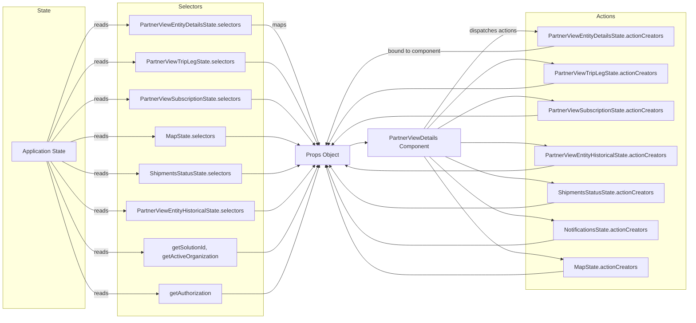

# Diagram: web/portal/src/pages/finishedvehicle/details/PartnerView.Details.page.container.js

> Auto-generated by Obscura crawlers

## Diagram 1

```mermaid
classDiagram
    class PartnerViewDetails {
        +props
    }
    class mapStateToProps {
        +solutionId
        +entityId
        +details
        +coords
        +connectedCarCoords
        +plannedLegs
        +actualLegs
        +combinedLegs
        +parentShipment
        +childShipments
        +shipmentsLoaded
        +exceptions
        +combinedExceptions
        +currentLocation
        +authorization
        +holds
        +events
        +media
        +documents
        +isFetchingComments
        +comments
        +shippers
        +vinSubscription
        +isVinSubscriptionLoading
        +vinSubscriptionRequestError
        +isVinSubscriptionUpdating
        +vinSubscriptionUpdateSuccess
        +vinSubscriptionUpdateError
        +isSharingVin
        +isShareVinSuccessful
        +isShareVinFailed
        +currentMapCoordinate
        +selectedMapCoordinate
        +selectedConnectedCarCoordinate
        +getHistoryByQualifier
        +activeOrganization
    }
    class actionCreators {
        +fetchEntityExceptions()
        +fetchEntityDetails()
        +fetchEntityMedia()
        +clearEntityMedia()
        +fetchEntityHolds()
        +fetchEntityPositionUpdates()
        +fetchEntityEvents()
        +fetchPlannedTripLeg()
        +fetchActualTripLeg()
        +fetchLegShipmentDetails()
        +clearLegShipmentDetails()
        +addCoordinate()
        +clearCoordinatesByType()
        +fetchHistoricalData()
        +fetchComments()
        +addComment()
        +cancelAddComment()
        +updateComment()
        +cancelUpdateComment()
        +markCommentsRead()
        +fetchNotification()
        +fetchEntityShippers()
        +fetchVinSubscription()
        +updateSubscription()
        +subscribe()
        +unsubscribe()
        +shareVin()
        +clearShareVin()
    }
    class ReduxState {
        <<module>>
    }
    ReduxState <|-- mapStateToProps : reads
    PartnerViewDetails <-- connect : connected_to
    connect ..> mapStateToProps : uses
    connect ..> actionCreators : binds
    actionCreators --> ReduxState : dispatches to
```

### SVG

<svg id="container" width="422.208984375" xmlns="http://www.w3.org/2000/svg" class="classDiagram" height="2358" viewBox="0 0 422.208984375 2358" role="graphics-document document" aria-roledescription="class"><g><defs><marker id="container_class-aggregationStart" class="marker aggregation class" refX="18" refY="7" markerWidth="190" markerHeight="240" orient="auto"><path d="M 18,7 L9,13 L1,7 L9,1 Z"></path></marker></defs><defs><marker id="container_class-aggregationEnd" class="marker aggregation class" refX="1" refY="7" markerWidth="20" markerHeight="28" orient="auto"><path d="M 18,7 L9,13 L1,7 L9,1 Z"></path></marker></defs><defs><marker id="container_class-extensionStart" class="marker extension class" refX="18" refY="7" markerWidth="190" markerHeight="240" orient="auto"><path d="M 1,7 L18,13 V 1 Z"></path></marker></defs><defs><marker id="container_class-extensionEnd" class="marker extension class" refX="1" refY="7" markerWidth="20" markerHeight="28" orient="auto"><path d="M 1,1 V 13 L18,7 Z"></path></marker></defs><defs><marker id="container_class-compositionStart" class="marker composition class" refX="18" refY="7" markerWidth="190" markerHeight="240" orient="auto"><path d="M 18,7 L9,13 L1,7 L9,1 Z"></path></marker></defs><defs><marker id="container_class-compositionEnd" class="marker composition class" refX="1" refY="7" markerWidth="20" markerHeight="28" orient="auto"><path d="M 18,7 L9,13 L1,7 L9,1 Z"></path></marker></defs><defs><marker id="container_class-dependencyStart" class="marker dependency class" refX="6" refY="7" markerWidth="190" markerHeight="240" orient="auto"><path d="M 5,7 L9,13 L1,7 L9,1 Z"></path></marker></defs><defs><marker id="container_class-dependencyEnd" class="marker dependency class" refX="13" refY="7" markerWidth="20" markerHeight="28" orient="auto"><path d="M 18,7 L9,13 L14,7 L9,1 Z"></path></marker></defs><defs><marker id="container_class-lollipopStart" class="marker lollipop class" refX="13" refY="7" markerWidth="190" markerHeight="240" orient="auto"><circle stroke="black" fill="transparent" cx="7" cy="7" r="6"></circle></marker></defs><defs><marker id="container_class-lollipopEnd" class="marker lollipop class" refX="1" refY="7" markerWidth="190" markerHeight="240" orient="auto"><circle stroke="black" fill="transparent" cx="7" cy="7" r="6"></circle></marker></defs><g class="root"><g class="clusters"></g><g class="edgePaths"><path d="M154.559,1333.25L154.559,1336.542C154.559,1339.833,154.559,1346.417,155.641,1355.875C156.724,1365.333,158.89,1377.667,159.973,1383.833L161.055,1390" id="id_ReduxState_mapStateToProps_1" class="edge-thickness-normal edge-pattern-solid relation" style=";;;" data-edge="true" data-et="edge" data-id="id_ReduxState_mapStateToProps_1" data-points="W3sieCI6MTU0LjU1ODU5Mzc1LCJ5IjoxMzE2fSx7IngiOjE1NC41NTg1OTM3NSwieSI6MTM1M30seyJ4IjoxNjEuMDU1MzcxMjgyNjQwMjQsInkiOjEzOTB9XQ==" marker-start="url(#container_class-extensionStart)"></path><path d="M245.338,134L245.338,139.167C245.338,144.333,245.338,154.667,245.338,166C245.338,177.333,245.338,189.667,245.338,195.833L245.338,202" id="id_PartnerViewDetails_connect_2" class="edge-thickness-normal edge-pattern-solid relation" style=";;;" data-edge="true" data-et="edge" data-id="id_PartnerViewDetails_connect_2" data-points="W3sieCI6MjQ1LjMzNzg5MDYyNSwieSI6MTI4fSx7IngiOjI0NS4zMzc4OTA2MjUsInkiOjE2NX0seyJ4IjoyNDUuMzM3ODkwNjI1LCJ5IjoyMDJ9XQ==" marker-start="url(#container_class-dependencyStart)"></path><path d="M286.252,279.605L294.563,286.838C302.874,294.07,319.495,308.535,327.806,386.434C336.117,464.333,336.117,605.667,336.117,747C336.117,888.333,336.117,1029.667,336.117,1115.5C336.117,1201.333,336.117,1231.667,336.117,1262C336.117,1292.333,336.117,1322.667,335.207,1343.015C334.297,1363.363,332.478,1373.727,331.568,1378.909L330.658,1384.09" id="id_connect_mapStateToProps_3" class="edge-thickness-normal edge-pattern-dashed relation" style=";;;" data-edge="true" data-et="edge" data-id="id_connect_mapStateToProps_3" data-points="W3sieCI6Mjg2LjI1MTk1MzEyNSwieSI6Mjc5LjYwNTE1NTAxNjI0Mzl9LHsieCI6MzM2LjExNzE4NzUsInkiOjMyM30seyJ4IjozMzYuMTE3MTg3NSwieSI6NzQ3fSx7IngiOjMzNi4xMTcxODc1LCJ5IjoxMTcxfSx7IngiOjMzNi4xMTcxODc1LCJ5IjoxMjYyfSx7IngiOjMzNi4xMTcxODc1LCJ5IjoxMzUzfSx7IngiOjMyOS42MjA0MDk5NjczNTk3NiwieSI6MTM5MH1d" marker-end="url(#container_class-dependencyEnd)"></path><path d="M204.424,279.605L196.113,286.838C187.802,294.07,171.18,308.535,162.869,320.934C154.559,333.333,154.559,343.667,154.559,348.833L154.559,354" id="id_connect_actionCreators_4" class="edge-thickness-normal edge-pattern-dashed relation" style=";;;" data-edge="true" data-et="edge" data-id="id_connect_actionCreators_4" data-points="W3sieCI6MjA0LjQyMzgyODEyNSwieSI6Mjc5LjYwNTE1NTAxNjI0Mzl9LHsieCI6MTU0LjU1ODU5Mzc1LCJ5IjozMjN9LHsieCI6MTU0LjU1ODU5Mzc1LCJ5IjozNjB9XQ==" marker-end="url(#container_class-dependencyEnd)"></path><path d="M154.559,1134L154.559,1140.167C154.559,1146.333,154.559,1158.667,154.559,1170C154.559,1181.333,154.559,1191.667,154.559,1196.833L154.559,1202" id="id_actionCreators_ReduxState_5" class="edge-thickness-normal edge-pattern-solid relation" style=";;;" data-edge="true" data-et="edge" data-id="id_actionCreators_ReduxState_5" data-points="W3sieCI6MTU0LjU1ODU5Mzc1LCJ5IjoxMTM0fSx7IngiOjE1NC41NTg1OTM3NSwieSI6MTE3MX0seyJ4IjoxNTQuNTU4NTkzNzUsInkiOjEyMDh9XQ==" marker-end="url(#container_class-dependencyEnd)"></path></g><g class="edgeLabels"><g class="edgeLabel" transform="translate(154.55859375, 1353)"><g class="label" data-id="id_ReduxState_mapStateToProps_1" transform="translate(-20.0078125, -12)"><foreignObject width="40.015625" height="24">

reads

</foreignObject></g></g><g class="edgeLabel" transform="translate(245.337890625, 165)"><g class="label" data-id="id_PartnerViewDetails_connect_2" transform="translate(-49.25, -12)"><foreignObject width="98.5" height="24">

connected_to

</foreignObject></g></g><g class="edgeLabel" transform="translate(336.1171875, 1171)"><g class="label" data-id="id_connect_mapStateToProps_3" transform="translate(-16.4921875, -12)"><foreignObject width="32.984375" height="24">

uses

</foreignObject></g></g><g class="edgeLabel" transform="translate(154.55859375, 323)"><g class="label" data-id="id_connect_actionCreators_4" transform="translate(-20.21875, -12)"><foreignObject width="40.4375" height="24">

binds

</foreignObject></g></g><g class="edgeLabel" transform="translate(154.55859375, 1171)"><g class="label" data-id="id_actionCreators_ReduxState_5" transform="translate(-48.7421875, -12)"><foreignObject width="97.484375" height="24">

dispatches to

</foreignObject></g></g></g><g class="nodes"><g class="node default" id="classId-PartnerViewDetails-0" transform="translate(245.337890625, 68)"><g class="basic label-container"><path d="M-82.03125 -60 L82.03125 -60 L82.03125 60 L-82.03125 60" stroke="none" stroke-width="0" fill="#ECECFF" style=""></path><path d="M-82.03125 -60 C-36.156314972663715 -60, 9.71862005467257 -60, 82.03125 -60 M-82.03125 -60 C-24.769559372833832 -60, 32.492131254332335 -60, 82.03125 -60 M82.03125 -60 C82.03125 -23.214610659318296, 82.03125 13.570778681363407, 82.03125 60 M82.03125 -60 C82.03125 -24.647190495572957, 82.03125 10.705619008854086, 82.03125 60 M82.03125 60 C21.39561760573502 60, -39.24001478852996 60, -82.03125 60 M82.03125 60 C43.03413593569866 60, 4.0370218713973145 60, -82.03125 60 M-82.03125 60 C-82.03125 21.3259194370387, -82.03125 -17.3481611259226, -82.03125 -60 M-82.03125 60 C-82.03125 28.178591194221593, -82.03125 -3.642817611556815, -82.03125 -60" stroke="#9370DB" stroke-width="1.3" fill="none" stroke-dasharray="0 0" style=""></path></g><g class="annotation-group text" transform="translate(0, -36)"></g><g class="label-group text" transform="translate(-70.03125, -36)"><g class="label" style="font-weight: bolder" transform="translate(0,-12)"><foreignObject width="140.0625" height="24">

PartnerViewDetails

</foreignObject></g></g><g class="members-group text" transform="translate(-70.03125, 12)"><g class="label" style="" transform="translate(0,-12)"><foreignObject width="49.515625" height="24">

+props

</foreignObject></g></g><g class="methods-group text" transform="translate(-70.03125, 60)"></g><g class="divider" style=""><path d="M-82.03125 -12 C-37.80550722091368 -12, 6.420235558172635 -12, 82.03125 -12 M-82.03125 -12 C-28.956571227136102 -12, 24.118107545727796 -12, 82.03125 -12" stroke="#9370DB" stroke-width="1.3" fill="none" stroke-dasharray="0 0" style=""></path></g><g class="divider" style=""><path d="M-82.03125 36 C-31.901953607365037 36, 18.227342785269926 36, 82.03125 36 M-82.03125 36 C-33.79551765531463 36, 14.440214689370734 36, 82.03125 36" stroke="#9370DB" stroke-width="1.3" fill="none" stroke-dasharray="0 0" style=""></path></g></g><g class="node default" id="classId-mapStateToProps-1" transform="translate(245.337890625, 1870)"><g class="basic label-container"><path d="M-168.87109375 -480 L168.87109375 -480 L168.87109375 480 L-168.87109375 480" stroke="none" stroke-width="0" fill="#ECECFF" style=""></path><path d="M-168.87109375 -480 C-60.47394664847313 -480, 47.92320045305374 -480, 168.87109375 -480 M-168.87109375 -480 C-89.89434714526683 -480, -10.91760054053367 -480, 168.87109375 -480 M168.87109375 -480 C168.87109375 -248.54099679421634, 168.87109375 -17.08199358843268, 168.87109375 480 M168.87109375 -480 C168.87109375 -117.80569664169542, 168.87109375 244.38860671660916, 168.87109375 480 M168.87109375 480 C55.7857116073841 480, -57.2996705352318 480, -168.87109375 480 M168.87109375 480 C86.55195392818742 480, 4.232814106374832 480, -168.87109375 480 M-168.87109375 480 C-168.87109375 230.45951171518286, -168.87109375 -19.080976569634288, -168.87109375 -480 M-168.87109375 480 C-168.87109375 116.3925193037764, -168.87109375 -247.2149613924472, -168.87109375 -480" stroke="#9370DB" stroke-width="1.3" fill="none" stroke-dasharray="0 0" style=""></path></g><g class="annotation-group text" transform="translate(0, -456)"></g><g class="label-group text" transform="translate(-64.7109375, -456)"><g class="label" style="font-weight: bolder" transform="translate(0,-12)"><foreignObject width="129.421875" height="24">

mapStateToProps

</foreignObject></g></g><g class="members-group text" transform="translate(-156.87109375, -408)"><g class="label" style="" transform="translate(0,-12)"><foreignObject width="82.109375" height="24">

+solutionId

</foreignObject></g><g class="label" style="" transform="translate(0,12)"><foreignObject width="64.234375" height="24">

+entityId

</foreignObject></g><g class="label" style="" transform="translate(0,36)"><foreignObject width="57.3125" height="24">

+details

</foreignObject></g><g class="label" style="" transform="translate(0,60)"><foreignObject width="56.75" height="24">

+coords

</foreignObject></g><g class="label" style="" transform="translate(0,84)"><foreignObject width="157.359375" height="24">

+connectedCarCoords

</foreignObject></g><g class="label" style="" transform="translate(0,108)"><foreignObject width="99.8125" height="24">

+plannedLegs

</foreignObject></g><g class="label" style="" transform="translate(0,132)"><foreignObject width="84.390625" height="24">

+actualLegs

</foreignObject></g><g class="label" style="" transform="translate(0,156)"><foreignObject width="112.03125" height="24">

+combinedLegs

</foreignObject></g><g class="label" style="" transform="translate(0,180)"><foreignObject width="125.296875" height="24">

+parentShipment

</foreignObject></g><g class="label" style="" transform="translate(0,204)"><foreignObject width="120.875" height="24">

+childShipments

</foreignObject></g><g class="label" style="" transform="translate(0,228)"><foreignObject width="137.21875" height="24">

+shipmentsLoaded

</foreignObject></g><g class="label" style="" transform="translate(0,252)"><foreignObject width="86.21875" height="24">

+exceptions

</foreignObject></g><g class="label" style="" transform="translate(0,276)"><foreignObject width="158.265625" height="24">

+combinedExceptions

</foreignObject></g><g class="label" style="" transform="translate(0,300)"><foreignObject width="122.640625" height="24">

+currentLocation

</foreignObject></g><g class="label" style="" transform="translate(0,324)"><foreignObject width="105.421875" height="24">

+authorization

</foreignObject></g><g class="label" style="" transform="translate(0,348)"><foreignObject width="48.359375" height="24">

+holds

</foreignObject></g><g class="label" style="" transform="translate(0,372)"><foreignObject width="55.796875" height="24">

+events

</foreignObject></g><g class="label" style="" transform="translate(0,396)"><foreignObject width="53.203125" height="24">

+media

</foreignObject></g><g class="label" style="" transform="translate(0,420)"><foreignObject width="88.765625" height="24">

+documents

</foreignObject></g><g class="label" style="" transform="translate(0,444)"><foreignObject width="157.515625" height="24">

+isFetchingComments

</foreignObject></g><g class="label" style="" transform="translate(0,468)"><foreignObject width="83.4375" height="24">

+comments

</foreignObject></g><g class="label" style="" transform="translate(0,492)"><foreignObject width="70.484375" height="24">

+shippers

</foreignObject></g><g class="label" style="" transform="translate(0,516)"><foreignObject width="121.453125" height="24">

+vinSubscription

</foreignObject></g><g class="label" style="" transform="translate(0,540)"><foreignObject width="191.84375" height="24">

+isVinSubscriptionLoading

</foreignObject></g><g class="label" style="" transform="translate(0,564)"><foreignObject width="216.25" height="24">

+vinSubscriptionRequestError

</foreignObject></g><g class="label" style="" transform="translate(0,588)"><foreignObject width="200.96875" height="24">

+isVinSubscriptionUpdating

</foreignObject></g><g class="label" style="" transform="translate(0,612)"><foreignObject width="230.265625" height="24">

+vinSubscriptionUpdateSuccess

</foreignObject></g><g class="label" style="" transform="translate(0,636)"><foreignObject width="209.859375" height="24">

+vinSubscriptionUpdateError

</foreignObject></g><g class="label" style="" transform="translate(0,660)"><foreignObject width="97.9375" height="24">

+isSharingVin

</foreignObject></g><g class="label" style="" transform="translate(0,684)"><foreignObject width="159.53125" height="24">

+isShareVinSuccessful

</foreignObject></g><g class="label" style="" transform="translate(0,708)"><foreignObject width="126.984375" height="24">

+isShareVinFailed

</foreignObject></g><g class="label" style="" transform="translate(0,732)"><foreignObject width="170.625" height="24">

+currentMapCoordinate

</foreignObject></g><g class="label" style="" transform="translate(0,756)"><foreignObject width="179.078125" height="24">

+selectedMapCoordinate

</foreignObject></g><g class="label" style="" transform="translate(0,780)"><foreignObject width="249.03125" height="24">

+selectedConnectedCarCoordinate

</foreignObject></g><g class="label" style="" transform="translate(0,804)"><foreignObject width="162.15625" height="24">

+getHistoryByQualifier

</foreignObject></g><g class="label" style="" transform="translate(0,828)"><foreignObject width="143" height="24">

+activeOrganization

</foreignObject></g></g><g class="methods-group text" transform="translate(-156.87109375, 480)"></g><g class="divider" style=""><path d="M-168.87109375 -432 C-49.95633424248663 -432, 68.95842526502673 -432, 168.87109375 -432 M-168.87109375 -432 C-37.07157363387026 -432, 94.72794648225948 -432, 168.87109375 -432" stroke="#9370DB" stroke-width="1.3" fill="none" stroke-dasharray="0 0" style=""></path></g><g class="divider" style=""><path d="M-168.87109375 456 C-58.57376056679409 456, 51.723572616411815 456, 168.87109375 456 M-168.87109375 456 C-84.44530951225016 456, -0.019525274500324485 456, 168.87109375 456" stroke="#9370DB" stroke-width="1.3" fill="none" stroke-dasharray="0 0" style=""></path></g></g><g class="node default" id="classId-actionCreators-2" transform="translate(154.55859375, 747)"><g class="basic label-container"><path d="M-146.55859375 -387 L146.55859375 -387 L146.55859375 387 L-146.55859375 387" stroke="none" stroke-width="0" fill="#ECECFF" style=""></path><path d="M-146.55859375 -387 C-71.83095911712596 -387, 2.896675515748086 -387, 146.55859375 -387 M-146.55859375 -387 C-69.69426907988914 -387, 7.170055590221722 -387, 146.55859375 -387 M146.55859375 -387 C146.55859375 -212.73735044916748, 146.55859375 -38.47470089833496, 146.55859375 387 M146.55859375 -387 C146.55859375 -209.7110767808702, 146.55859375 -32.4221535617404, 146.55859375 387 M146.55859375 387 C74.04060983942303 387, 1.522625928846054 387, -146.55859375 387 M146.55859375 387 C50.89092715632481 387, -44.776739437350386 387, -146.55859375 387 M-146.55859375 387 C-146.55859375 88.66036935837383, -146.55859375 -209.67926128325234, -146.55859375 -387 M-146.55859375 387 C-146.55859375 152.00277080581174, -146.55859375 -82.99445838837653, -146.55859375 -387" stroke="#9370DB" stroke-width="1.3" fill="none" stroke-dasharray="0 0" style=""></path></g><g class="annotation-group text" transform="translate(0, -363)"></g><g class="label-group text" transform="translate(-53.6328125, -363)"><g class="label" style="font-weight: bolder" transform="translate(0,-12)"><foreignObject width="107.265625" height="24">

actionCreators

</foreignObject></g></g><g class="members-group text" transform="translate(-134.55859375, -315)"></g><g class="methods-group text" transform="translate(-134.55859375, -285)"><g class="label" style="" transform="translate(0,-12)"><foreignObject width="174.4375" height="24">

+fetchEntityExceptions()

</foreignObject></g><g class="label" style="" transform="translate(0,12)"><foreignObject width="146.296875" height="24">

+fetchEntityDetails()

</foreignObject></g><g class="label" style="" transform="translate(0,36)"><foreignObject width="140.1875" height="24">

+fetchEntityMedia()

</foreignObject></g><g class="label" style="" transform="translate(0,60)"><foreignObject width="139.640625" height="24">

+clearEntityMedia()

</foreignObject></g><g class="label" style="" transform="translate(0,84)"><foreignObject width="138.109375" height="24">

+fetchEntityHolds()

</foreignObject></g><g class="label" style="" transform="translate(0,108)"><foreignObject width="215.484375" height="24">

+fetchEntityPositionUpdates()

</foreignObject></g><g class="label" style="" transform="translate(0,132)"><foreignObject width="143.625" height="24">

+fetchEntityEvents()

</foreignObject></g><g class="label" style="" transform="translate(0,156)"><foreignObject width="166.6875" height="24">

+fetchPlannedTripLeg()

</foreignObject></g><g class="label" style="" transform="translate(0,180)"><foreignObject width="152.328125" height="24">

+fetchActualTripLeg()

</foreignObject></g><g class="label" style="" transform="translate(0,204)"><foreignObject width="198.96875" height="24">

+fetchLegShipmentDetails()

</foreignObject></g><g class="label" style="" transform="translate(0,228)"><foreignObject width="198.421875" height="24">

+clearLegShipmentDetails()

</foreignObject></g><g class="label" style="" transform="translate(0,252)"><foreignObject width="125.40625" height="24">

+addCoordinate()

</foreignObject></g><g class="label" style="" transform="translate(0,276)"><foreignObject width="192.296875" height="24">

+clearCoordinatesByType()

</foreignObject></g><g class="label" style="" transform="translate(0,300)"><foreignObject width="156.96875" height="24">

+fetchHistoricalData()

</foreignObject></g><g class="label" style="" transform="translate(0,324)"><foreignObject width="131.359375" height="24">

+fetchComments()

</foreignObject></g><g class="label" style="" transform="translate(0,348)"><foreignObject width="115.234375" height="24">

+addComment()

</foreignObject></g><g class="label" style="" transform="translate(0,372)"><foreignObject width="162.25" height="24">

+cancelAddComment()

</foreignObject></g><g class="label" style="" transform="translate(0,396)"><foreignObject width="138.984375" height="24">

+updateComment()

</foreignObject></g><g class="label" style="" transform="translate(0,420)"><foreignObject width="186.5625" height="24">

+cancelUpdateComment()

</foreignObject></g><g class="label" style="" transform="translate(0,444)"><foreignObject width="168.171875" height="24">

+markCommentsRead()

</foreignObject></g><g class="label" style="" transform="translate(0,468)"><foreignObject width="139.5625" height="24">

+fetchNotification()

</foreignObject></g><g class="label" style="" transform="translate(0,492)"><foreignObject width="159.96875" height="24">

+fetchEntityShippers()

</foreignObject></g><g class="label" style="" transform="translate(0,516)"><foreignObject width="169.234375" height="24">

+fetchVinSubscription()

</foreignObject></g><g class="label" style="" transform="translate(0,540)"><foreignObject width="161.5625" height="24">

+updateSubscription()

</foreignObject></g><g class="label" style="" transform="translate(0,564)"><foreignObject width="88.6875" height="24">

+subscribe()

</foreignObject></g><g class="label" style="" transform="translate(0,588)"><foreignObject width="107.375" height="24">

+unsubscribe()

</foreignObject></g><g class="label" style="" transform="translate(0,612)"><foreignObject width="81.109375" height="24">

+shareVin()

</foreignObject></g><g class="label" style="" transform="translate(0,636)"><foreignObject width="118.0625" height="24">

+clearShareVin()

</foreignObject></g></g><g class="divider" style=""><path d="M-146.55859375 -339 C-87.46490388730413 -339, -28.37121402460828 -339, 146.55859375 -339 M-146.55859375 -339 C-59.669763111645494 -339, 27.21906752670901 -339, 146.55859375 -339" stroke="#9370DB" stroke-width="1.3" fill="none" stroke-dasharray="0 0" style=""></path></g><g class="divider" style=""><path d="M-146.55859375 -315 C-45.975023877279796 -315, 54.60854599544041 -315, 146.55859375 -315 M-146.55859375 -315 C-42.48466047353324 -315, 61.58927280293352 -315, 146.55859375 -315" stroke="#9370DB" stroke-width="1.3" fill="none" stroke-dasharray="0 0" style=""></path></g></g><g class="node default" id="classId-ReduxState-3" transform="translate(154.55859375, 1262)"><g class="basic label-container"><path d="M-54.0234375 -54 L54.0234375 -54 L54.0234375 54 L-54.0234375 54" stroke="none" stroke-width="0" fill="#ECECFF" style=""></path><path d="M-54.0234375 -54 C-26.87541628687912 -54, 0.2726049262417618 -54, 54.0234375 -54 M-54.0234375 -54 C-27.346702183058078 -54, -0.6699668661161553 -54, 54.0234375 -54 M54.0234375 -54 C54.0234375 -30.27931306434763, 54.0234375 -6.558626128695259, 54.0234375 54 M54.0234375 -54 C54.0234375 -30.03532003236527, 54.0234375 -6.07064006473054, 54.0234375 54 M54.0234375 54 C11.637781707991763 54, -30.747874084016473 54, -54.0234375 54 M54.0234375 54 C22.392343788746643 54, -9.238749922506713 54, -54.0234375 54 M-54.0234375 54 C-54.0234375 14.267183847481817, -54.0234375 -25.465632305036365, -54.0234375 -54 M-54.0234375 54 C-54.0234375 12.607234035216294, -54.0234375 -28.785531929567412, -54.0234375 -54" stroke="#9370DB" stroke-width="1.3" fill="none" stroke-dasharray="0 0" style=""></path></g><g class="annotation-group text" transform="translate(-36.6015625, -30)"><g class="label" style="" transform="translate(0,-12)"><foreignObject width="73.203125" height="24">

«module»

</foreignObject></g></g><g class="label-group text" transform="translate(-42.0234375, -6)"><g class="label" style="font-weight: bolder" transform="translate(0,-12)"><foreignObject width="84.046875" height="24">

ReduxState

</foreignObject></g></g><g class="members-group text" transform="translate(-42.0234375, 42)"></g><g class="methods-group text" transform="translate(-42.0234375, 72)"></g><g class="divider" style=""><path d="M-54.0234375 18 C-20.924661607973718 18, 12.174114284052564 18, 54.0234375 18 M-54.0234375 18 C-27.33055089927833 18, -0.6376642985566576 18, 54.0234375 18" stroke="#9370DB" stroke-width="1.3" fill="none" stroke-dasharray="0 0" style=""></path></g><g class="divider" style=""><path d="M-54.0234375 36 C-16.09101631523221 36, 21.84140486953558 36, 54.0234375 36 M-54.0234375 36 C-10.8571026358537 36, 32.3092322282926 36, 54.0234375 36" stroke="#9370DB" stroke-width="1.3" fill="none" stroke-dasharray="0 0" style=""></path></g></g><g class="node default" id="classId-connect-4" transform="translate(245.337890625, 244)"><g class="basic label-container"><path d="M-40.9140625 -42 L40.9140625 -42 L40.9140625 42 L-40.9140625 42" stroke="none" stroke-width="0" fill="#ECECFF" style=""></path><path d="M-40.9140625 -42 C-12.248234308957151 -42, 16.417593882085697 -42, 40.9140625 -42 M-40.9140625 -42 C-20.871644405104146 -42, -0.8292263102082913 -42, 40.9140625 -42 M40.9140625 -42 C40.9140625 -9.335389308992092, 40.9140625 23.329221382015817, 40.9140625 42 M40.9140625 -42 C40.9140625 -19.31731623635848, 40.9140625 3.3653675272830412, 40.9140625 42 M40.9140625 42 C11.525438880160628 42, -17.863184739678744 42, -40.9140625 42 M40.9140625 42 C14.976918287887752 42, -10.960225924224495 42, -40.9140625 42 M-40.9140625 42 C-40.9140625 13.67184717220275, -40.9140625 -14.656305655594501, -40.9140625 -42 M-40.9140625 42 C-40.9140625 17.042878922262815, -40.9140625 -7.914242155474369, -40.9140625 -42" stroke="#9370DB" stroke-width="1.3" fill="none" stroke-dasharray="0 0" style=""></path></g><g class="annotation-group text" transform="translate(0, -18)"></g><g class="label-group text" transform="translate(-28.9140625, -18)"><g class="label" style="font-weight: bolder" transform="translate(0,-12)"><foreignObject width="57.828125" height="24">

connect

</foreignObject></g></g><g class="members-group text" transform="translate(-28.9140625, 30)"></g><g class="methods-group text" transform="translate(-28.9140625, 60)"></g><g class="divider" style=""><path d="M-40.9140625 6 C-15.117576911379114 6, 10.678908677241772 6, 40.9140625 6 M-40.9140625 6 C-22.771680946858577 6, -4.6292993937171545 6, 40.9140625 6" stroke="#9370DB" stroke-width="1.3" fill="none" stroke-dasharray="0 0" style=""></path></g><g class="divider" style=""><path d="M-40.9140625 24 C-12.689896299452464 24, 15.534269901095072 24, 40.9140625 24 M-40.9140625 24 C-17.854850185546542 24, 5.204362128906915 24, 40.9140625 24" stroke="#9370DB" stroke-width="1.3" fill="none" stroke-dasharray="0 0" style=""></path></g></g></g></g></g></svg>

## Diagram 2

### SVG

<svg id="container" width="1945.84375" xmlns="http://www.w3.org/2000/svg" class="flowchart" height="892" viewBox="0 0 1945.84375 892" role="graphics-document document" aria-roledescription="flowchart-v2"><g><marker id="container_flowchart-v2-pointEnd" class="marker flowchart-v2" viewBox="0 0 10 10" refX="5" refY="5" markerUnits="userSpaceOnUse" markerWidth="8" markerHeight="8" orient="auto"><path d="M 0 0 L 10 5 L 0 10 z" class="arrowMarkerPath" style="stroke-width: 1; stroke-dasharray: 1, 0;"></path></marker><marker id="container_flowchart-v2-pointStart" class="marker flowchart-v2" viewBox="0 0 10 10" refX="4.5" refY="5" markerUnits="userSpaceOnUse" markerWidth="8" markerHeight="8" orient="auto"><path d="M 0 5 L 10 10 L 10 0 z" class="arrowMarkerPath" style="stroke-width: 1; stroke-dasharray: 1, 0;"></path></marker><marker id="container_flowchart-v2-circleEnd" class="marker flowchart-v2" viewBox="0 0 10 10" refX="11" refY="5" markerUnits="userSpaceOnUse" markerWidth="11" markerHeight="11" orient="auto"><circle cx="5" cy="5" r="5" class="arrowMarkerPath" style="stroke-width: 1; stroke-dasharray: 1, 0;"></circle></marker><marker id="container_flowchart-v2-circleStart" class="marker flowchart-v2" viewBox="0 0 10 10" refX="-1" refY="5" markerUnits="userSpaceOnUse" markerWidth="11" markerHeight="11" orient="auto"><circle cx="5" cy="5" r="5" class="arrowMarkerPath" style="stroke-width: 1; stroke-dasharray: 1, 0;"></circle></marker><marker id="container_flowchart-v2-crossEnd" class="marker cross flowchart-v2" viewBox="0 0 11 11" refX="12" refY="5.2" markerUnits="userSpaceOnUse" markerWidth="11" markerHeight="11" orient="auto"><path d="M 1,1 l 9,9 M 10,1 l -9,9" class="arrowMarkerPath" style="stroke-width: 2; stroke-dasharray: 1, 0;"></path></marker><marker id="container_flowchart-v2-crossStart" class="marker cross flowchart-v2" viewBox="0 0 11 11" refX="-1" refY="5.2" markerUnits="userSpaceOnUse" markerWidth="11" markerHeight="11" orient="auto"><path d="M 1,1 l 9,9 M 10,1 l -9,9" class="arrowMarkerPath" style="stroke-width: 2; stroke-dasharray: 1, 0;"></path></marker><g class="root"><g class="clusters"><g class="cluster" id="Actions" data-look="classic"><rect style="" x="1483.75" y="35" width="454.09375" height="775"></rect><g class="cluster-label" transform="translate(1684.1484375, 35)"><foreignObject width="53.296875" height="24">

Actions

</foreignObject></g></g><g class="cluster" id="Selectors" data-look="classic"><rect style="" x="332.1875" y="8" width="414.28125" height="876"></rect><g class="cluster-label" transform="translate(505.96875, 8)"><foreignObject width="66.71875" height="24">

Selectors

</foreignObject></g></g><g class="cluster" id="State" data-look="classic"><rect style="" x="8" y="19" width="234.171875" height="844"></rect><g class="cluster-label" transform="translate(106.40625, 19)"><foreignObject width="37.359375" height="24">

State

</foreignObject></g></g></g><g class="edgePaths"><path d="M134.016,397L152.042,342.5C170.068,288,206.12,179,231.647,124.5C257.174,70,272.177,70,287.18,70C302.182,70,317.185,70,329.777,70C342.37,70,352.552,70,357.643,70L362.734,70" id="L_S_SEL1_0" class="edge-thickness-normal edge-pattern-solid edge-thickness-normal edge-pattern-solid flowchart-link" style=";" data-edge="true" data-et="edge" data-id="L_S_SEL1_0" data-points="W3sieCI6MTM0LjAxNjIyMDg2ODY0NDA3LCJ5IjozOTd9LHsieCI6MjQyLjE3MTg3NSwieSI6NzB9LHsieCI6Mjg3LjE3OTY4NzUsInkiOjcwfSx7IngiOjMzMi4xODc1LCJ5Ijo3MH0seyJ4IjozNjYuNzM0Mzc1LCJ5Ijo3MH1d" marker-end="url(#container_flowchart-v2-pointEnd)"></path><path d="M137.731,397L155.138,359.833C172.545,322.667,207.358,248.333,232.266,211.167C257.174,174,272.177,174,287.18,174C302.182,174,317.185,174,333.035,174C348.885,174,365.583,174,373.932,174L382.281,174" id="L_S_SEL2_0" class="edge-thickness-normal edge-pattern-solid edge-thickness-normal edge-pattern-solid flowchart-link" style=";" data-edge="true" data-et="edge" data-id="L_S_SEL2_0" data-points="W3sieCI6MTM3LjczMTIxODc1LCJ5IjozOTd9LHsieCI6MjQyLjE3MTg3NSwieSI6MTc0fSx7IngiOjI4Ny4xNzk2ODc1LCJ5IjoxNzR9LHsieCI6MzMyLjE4NzUsInkiOjE3NH0seyJ4IjozODYuMjgxMjUsInkiOjE3NH1d" marker-end="url(#container_flowchart-v2-pointEnd)"></path><path d="M146.739,397L162.644,377.167C178.55,357.333,210.361,317.667,233.768,297.833C257.174,278,272.177,278,287.18,278C302.182,278,317.185,278,329.763,278C342.341,278,352.495,278,357.572,278L362.648,278" id="L_S_SEL3_0" class="edge-thickness-normal edge-pattern-solid edge-thickness-normal edge-pattern-solid flowchart-link" style=";" data-edge="true" data-et="edge" data-id="L_S_SEL3_0" data-points="W3sieCI6MTQ2LjczODgxNjM1MjczOTcyLCJ5IjozOTd9LHsieCI6MjQyLjE3MTg3NSwieSI6Mjc4fSx7IngiOjI4Ny4xNzk2ODc1LCJ5IjoyNzh9LHsieCI6MzMyLjE4NzUsInkiOjI3OH0seyJ4IjozNjYuNjQ4NDM3NSwieSI6Mjc4fV0=" marker-end="url(#container_flowchart-v2-pointEnd)"></path><path d="M200.355,397L207.325,394.5C214.294,392,228.233,387,242.704,384.5C257.174,382,272.177,382,287.18,382C302.182,382,317.185,382,342.109,382C367.034,382,401.88,382,419.303,382L436.727,382" id="L_S_SEL4_0" class="edge-thickness-normal edge-pattern-solid edge-thickness-normal edge-pattern-solid flowchart-link" style=";" data-edge="true" data-et="edge" data-id="L_S_SEL4_0" data-points="W3sieCI6MjAwLjM1NTQ2ODc1LCJ5IjozOTd9LHsieCI6MjQyLjE3MTg3NSwieSI6MzgyfSx7IngiOjI4Ny4xNzk2ODc1LCJ5IjozODJ9LHsieCI6MzMyLjE4NzUsInkiOjM4Mn0seyJ4Ijo0NDAuNzI2NTYyNSwieSI6MzgyfV0=" marker-end="url(#container_flowchart-v2-pointEnd)"></path><path d="M176.075,451L187.091,456.833C198.107,462.667,220.14,474.333,238.657,480.167C257.174,486,272.177,486,287.18,486C302.182,486,317.185,486,334.428,486C351.672,486,371.156,486,380.898,486L390.641,486" id="L_S_SEL5_0" class="edge-thickness-normal edge-pattern-solid edge-thickness-normal edge-pattern-solid flowchart-link" style=";" data-edge="true" data-et="edge" data-id="L_S_SEL5_0" data-points="W3sieCI6MTc2LjA3NDk3NDc5ODM4NzEsInkiOjQ1MX0seyJ4IjoyNDIuMTcxODc1LCJ5Ijo0ODZ9LHsieCI6Mjg3LjE3OTY4NzUsInkiOjQ4Nn0seyJ4IjozMzIuMTg3NSwieSI6NDg2fSx7IngiOjM5NC42NDA2MjUsInkiOjQ4Nn1d" marker-end="url(#container_flowchart-v2-pointEnd)"></path><path d="M144.13,451L160.47,474.167C176.811,497.333,209.491,543.667,233.333,566.833C257.174,590,272.177,590,287.18,590C302.182,590,317.185,590,328.186,590C339.188,590,346.188,590,349.688,590L353.188,590" id="L_S_SEL6_0" class="edge-thickness-normal edge-pattern-solid edge-thickness-normal edge-pattern-solid flowchart-link" style=";" data-edge="true" data-et="edge" data-id="L_S_SEL6_0" data-points="W3sieCI6MTQ0LjEzMDAzNTc2ODA3MjI4LCJ5Ijo0NTF9LHsieCI6MjQyLjE3MTg3NSwieSI6NTkwfSx7IngiOjI4Ny4xNzk2ODc1LCJ5Ijo1OTB9LHsieCI6MzMyLjE4NzUsInkiOjU5MH0seyJ4IjozNTcuMTg3NSwieSI6NTkwfV0=" marker-end="url(#container_flowchart-v2-pointEnd)"></path><path d="M136.296,451L153.942,493.5C171.588,536,206.88,621,232.027,663.5C257.174,706,272.177,706,287.18,706C302.182,706,317.185,706,336.876,706C356.568,706,380.948,706,393.138,706L405.328,706" id="L_S_ORG_0" class="edge-thickness-normal edge-pattern-solid edge-thickness-normal edge-pattern-solid flowchart-link" style=";" data-edge="true" data-et="edge" data-id="L_S_ORG_0" data-points="W3sieCI6MTM2LjI5NjI5MzIxODA4NTEsInkiOjQ1MX0seyJ4IjoyNDIuMTcxODc1LCJ5Ijo3MDZ9LHsieCI6Mjg3LjE3OTY4NzUsInkiOjcwNn0seyJ4IjozMzIuMTg3NSwieSI6NzA2fSx7IngiOjQwOS4zMjgxMjUsInkiOjcwNn1d" marker-end="url(#container_flowchart-v2-pointEnd)"></path><path d="M133.029,451L151.219,512.833C169.41,574.667,205.791,698.333,231.483,760.167C257.174,822,272.177,822,287.18,822C302.182,822,317.185,822,343.484,822C369.784,822,407.38,822,426.178,822L444.977,822" id="L_S_AUTH_0" class="edge-thickness-normal edge-pattern-solid edge-thickness-normal edge-pattern-solid flowchart-link" style=";" data-edge="true" data-et="edge" data-id="L_S_AUTH_0" data-points="W3sieCI6MTMzLjAyODk1MzM2MDU1Mjc4LCJ5Ijo0NTF9LHsieCI6MjQyLjE3MTg3NSwieSI6ODIyfSx7IngiOjI4Ny4xNzk2ODc1LCJ5Ijo4MjJ9LHsieCI6MzMyLjE4NzUsInkiOjgyMn0seyJ4Ijo0NDguOTc2NTYyNSwieSI6ODIyfV0=" marker-end="url(#container_flowchart-v2-pointEnd)"></path><path d="M711.922,70L717.68,70C723.438,70,734.953,70,748.161,70C761.37,70,776.271,70,802.17,125.534C828.069,181.068,864.966,292.136,883.415,347.67L901.863,403.204" id="L_SEL1_Props_0" class="edge-thickness-normal edge-pattern-solid edge-thickness-normal edge-pattern-solid flowchart-link" style=";" data-edge="true" data-et="edge" data-id="L_SEL1_Props_0" data-points="W3sieCI6NzExLjkyMTg3NSwieSI6NzB9LHsieCI6NzQ2LjQ2ODc1LCJ5Ijo3MH0seyJ4Ijo3OTEuMTcxODc1LCJ5Ijo3MH0seyJ4Ijo5MDMuMTI0MjcwMjYwOTg5LCJ5Ijo0MDd9XQ==" marker-end="url(#container_flowchart-v2-pointEnd)"></path><path d="M692.375,174L701.391,174C710.406,174,728.438,174,744.904,174C761.37,174,776.271,174,801.501,212.229C826.731,250.458,862.29,326.915,880.07,365.144L897.85,403.373" id="L_SEL2_Props_0" class="edge-thickness-normal edge-pattern-solid edge-thickness-normal edge-pattern-solid flowchart-link" style=";" data-edge="true" data-et="edge" data-id="L_SEL2_Props_0" data-points="W3sieCI6NjkyLjM3NSwieSI6MTc0fSx7IngiOjc0Ni40Njg3NSwieSI6MTc0fSx7IngiOjc5MS4xNzE4NzUsInkiOjE3NH0seyJ4Ijo4OTkuNTM2NDc4MzY1Mzg0NiwieSI6NDA3fV0=" marker-end="url(#container_flowchart-v2-pointEnd)"></path><path d="M712.008,278L717.751,278C723.495,278,734.982,278,748.176,278C761.37,278,776.271,278,799.978,298.973C823.686,319.946,856.2,361.892,872.457,382.865L888.714,403.839" id="L_SEL3_Props_0" class="edge-thickness-normal edge-pattern-solid edge-thickness-normal edge-pattern-solid flowchart-link" style=";" data-edge="true" data-et="edge" data-id="L_SEL3_Props_0" data-points="W3sieCI6NzEyLjAwNzgxMjUsInkiOjI3OH0seyJ4Ijo3NDYuNDY4NzUsInkiOjI3OH0seyJ4Ijo3OTEuMTcxODc1LCJ5IjoyNzh9LHsieCI6ODkxLjE2NDk2Mzk0MjMwNzcsInkiOjQwN31d" marker-end="url(#container_flowchart-v2-pointEnd)"></path><path d="M637.93,382L656.02,382C674.109,382,710.289,382,735.829,382C761.37,382,776.271,382,792.798,385.903C809.326,389.807,827.479,397.613,836.556,401.516L845.633,405.42" id="L_SEL4_Props_0" class="edge-thickness-normal edge-pattern-solid edge-thickness-normal edge-pattern-solid flowchart-link" style=";" data-edge="true" data-et="edge" data-id="L_SEL4_Props_0" data-points="W3sieCI6NjM3LjkyOTY4NzUsInkiOjM4Mn0seyJ4Ijo3NDYuNDY4NzUsInkiOjM4Mn0seyJ4Ijo3OTEuMTcxODc1LCJ5IjozODJ9LHsieCI6ODQ5LjMwNzM5MTgyNjkyMzEsInkiOjQwN31d" marker-end="url(#container_flowchart-v2-pointEnd)"></path><path d="M684.016,486L694.424,486C704.833,486,725.651,486,743.51,486C761.37,486,776.271,486,792.798,482.097C809.326,478.193,827.479,470.387,836.556,466.484L845.633,462.58" id="L_SEL5_Props_0" class="edge-thickness-normal edge-pattern-solid edge-thickness-normal edge-pattern-solid flowchart-link" style=";" data-edge="true" data-et="edge" data-id="L_SEL5_Props_0" data-points="W3sieCI6Njg0LjAxNTYyNSwieSI6NDg2fSx7IngiOjc0Ni40Njg3NSwieSI6NDg2fSx7IngiOjc5MS4xNzE4NzUsInkiOjQ4Nn0seyJ4Ijo4NDkuMzA3MzkxODI2OTIzMSwieSI6NDYxfV0=" marker-end="url(#container_flowchart-v2-pointEnd)"></path><path d="M721.469,590L725.635,590C729.802,590,738.135,590,749.753,590C761.37,590,776.271,590,799.978,569.027C823.686,548.054,856.2,506.108,872.457,485.135L888.714,464.161" id="L_SEL6_Props_0" class="edge-thickness-normal edge-pattern-solid edge-thickness-normal edge-pattern-solid flowchart-link" style=";" data-edge="true" data-et="edge" data-id="L_SEL6_Props_0" data-points="W3sieCI6NzIxLjQ2ODc1LCJ5Ijo1OTB9LHsieCI6NzQ2LjQ2ODc1LCJ5Ijo1OTB9LHsieCI6NzkxLjE3MTg3NSwieSI6NTkwfSx7IngiOjg5MS4xNjQ5NjM5NDIzMDc3LCJ5Ijo0NjF9XQ==" marker-end="url(#container_flowchart-v2-pointEnd)"></path><path d="M669.328,706L682.185,706C695.042,706,720.755,706,741.063,706C761.37,706,776.271,706,801.604,665.776C826.936,625.552,862.701,545.103,880.583,504.879L898.466,464.655" id="L_ORG_Props_0" class="edge-thickness-normal edge-pattern-solid edge-thickness-normal edge-pattern-solid flowchart-link" style=";" data-edge="true" data-et="edge" data-id="L_ORG_Props_0" data-points="W3sieCI6NjY5LjMyODEyNSwieSI6NzA2fSx7IngiOjc0Ni40Njg3NSwieSI6NzA2fSx7IngiOjc5MS4xNzE4NzUsInkiOjcwNn0seyJ4Ijo5MDAuMDkwNDc1NjQzMzgyMywieSI6NDYxfV0=" marker-end="url(#container_flowchart-v2-pointEnd)"></path><path d="M629.68,822L649.145,822C668.609,822,707.539,822,734.454,822C761.37,822,776.271,822,802.274,762.47C828.278,702.94,865.383,583.879,883.936,524.349L902.489,464.819" id="L_AUTH_Props_0" class="edge-thickness-normal edge-pattern-solid edge-thickness-normal edge-pattern-solid flowchart-link" style=";" data-edge="true" data-et="edge" data-id="L_AUTH_Props_0" data-points="W3sieCI6NjI5LjY3OTY4NzUsInkiOjgyMn0seyJ4Ijo3NDYuNDY4NzUsInkiOjgyMn0seyJ4Ijo3OTEuMTcxODc1LCJ5Ijo4MjJ9LHsieCI6OTAzLjY3OTA4MzQ0MDcyMTcsInkiOjQ2MX1d" marker-end="url(#container_flowchart-v2-pointEnd)"></path><path d="M1564.838,129L1551.323,131.5C1537.809,134,1510.779,139,1481.812,141.5C1452.844,144,1421.938,144,1369.365,144C1316.792,144,1242.552,144,1179.599,144C1116.646,144,1064.979,144,1024.066,187.204C983.154,230.408,952.995,316.816,937.915,360.02L922.836,403.223" id="L_A1_Props_0" class="edge-thickness-normal edge-pattern-solid edge-thickness-normal edge-pattern-solid flowchart-link" style=";" data-edge="true" data-et="edge" data-id="L_A1_Props_0" data-points="W3sieCI6MTU2NC44MzgxNjk2NDI4NTcsInkiOjEyOX0seyJ4IjoxNDgzLjc1LCJ5IjoxNDR9LHsieCI6MTM5MS4wMzEyNSwieSI6MTQ0fSx7IngiOjExNjguMzEyNSwieSI6MTQ0fSx7IngiOjEwMTMuMzEyNSwieSI6MTQ0fSx7IngiOjkyMS41MTc1NjQ2NTUxNzI1LCJ5Ijo0MDd9XQ==" marker-end="url(#container_flowchart-v2-pointEnd)"></path><path d="M1564.838,233L1551.323,235.5C1537.809,238,1510.779,243,1481.812,245.5C1452.844,248,1421.938,248,1369.365,248C1316.792,248,1242.552,248,1179.599,248C1116.646,248,1064.979,248,1025.044,273.914C985.108,299.829,956.903,351.658,942.801,377.572L928.699,403.487" id="L_A2_Props_0" class="edge-thickness-normal edge-pattern-solid edge-thickness-normal edge-pattern-solid flowchart-link" style=";" data-edge="true" data-et="edge" data-id="L_A2_Props_0" data-points="W3sieCI6MTU2NC44MzgxNjk2NDI4NTcsInkiOjIzM30seyJ4IjoxNDgzLjc1LCJ5IjoyNDh9LHsieCI6MTM5MS4wMzEyNSwieSI6MjQ4fSx7IngiOjExNjguMzEyNSwieSI6MjQ4fSx7IngiOjEwMTMuMzEyNSwieSI6MjQ4fSx7IngiOjkyNi43ODY3OTQzNTQ4Mzg3LCJ5Ijo0MDd9XQ==" marker-end="url(#container_flowchart-v2-pointEnd)"></path><path d="M1518.219,322.723L1512.474,323.102C1506.729,323.482,1495.24,324.241,1474.042,324.62C1452.844,325,1421.938,325,1369.365,325C1316.792,325,1242.552,325,1179.599,325C1116.646,325,1064.979,325,1026.908,338.178C988.838,351.356,964.363,377.713,952.126,390.891L939.888,404.069" id="L_A3_Props_0" class="edge-thickness-normal edge-pattern-solid edge-thickness-normal edge-pattern-solid flowchart-link" style=";" data-edge="true" data-et="edge" data-id="L_A3_Props_0" data-points="W3sieCI6MTUxOC4yMTg3NSwieSI6MzIyLjcyMjc5OTUzMjAzNDk3fSx7IngiOjE0ODMuNzUsInkiOjMyNX0seyJ4IjoxMzkxLjAzMTI1LCJ5IjozMjV9LHsieCI6MTE2OC4zMTI1LCJ5IjozMjV9LHsieCI6MTAxMy4zMTI1LCJ5IjozMjV9LHsieCI6OTM3LjE2NjI4NDQwMzY2OTcsInkiOjQwN31d" marker-end="url(#container_flowchart-v2-pointEnd)"></path><path d="M1564.838,463L1551.323,465.5C1537.809,468,1510.779,473,1481.812,475.5C1452.844,478,1421.938,478,1369.365,478C1316.792,478,1242.552,478,1179.599,478C1116.646,478,1064.979,478,1033.239,475.432C1001.5,472.865,989.687,467.73,983.78,465.162L977.874,462.595" id="L_A4_Props_0" class="edge-thickness-normal edge-pattern-solid edge-thickness-normal edge-pattern-solid flowchart-link" style=";" data-edge="true" data-et="edge" data-id="L_A4_Props_0" data-points="W3sieCI6MTU2NC44MzgxNjk2NDI4NTcsInkiOjQ2M30seyJ4IjoxNDgzLjc1LCJ5Ijo0Nzh9LHsieCI6MTM5MS4wMzEyNSwieSI6NDc4fSx7IngiOjExNjguMzEyNSwieSI6NDc4fSx7IngiOjEwMTMuMzEyNSwieSI6NDc4fSx7IngiOjk3NC4yMDUyNTU2ODE4MTgxLCJ5Ijo0NjF9XQ==" marker-end="url(#container_flowchart-v2-pointEnd)"></path><path d="M1564.838,567L1551.323,569.5C1537.809,572,1510.779,577,1481.812,579.5C1452.844,582,1421.938,582,1369.365,582C1316.792,582,1242.552,582,1179.599,582C1116.646,582,1064.979,582,1025.73,562.384C986.481,542.767,959.649,503.534,946.233,483.918L932.817,464.302" id="L_A5_Props_0" class="edge-thickness-normal edge-pattern-solid edge-thickness-normal edge-pattern-solid flowchart-link" style=";" data-edge="true" data-et="edge" data-id="L_A5_Props_0" data-points="W3sieCI6MTU2NC44MzgxNjk2NDI4NTcsInkiOjU2N30seyJ4IjoxNDgzLjc1LCJ5Ijo1ODJ9LHsieCI6MTM5MS4wMzEyNSwieSI6NTgyfSx7IngiOjExNjguMzEyNSwieSI6NTgyfSx7IngiOjEwMTMuMzEyNSwieSI6NTgyfSx7IngiOjkzMC41NTkzMzI3NzAyNzAzLCJ5Ijo0NjF9XQ==" marker-end="url(#container_flowchart-v2-pointEnd)"></path><path d="M1564.838,671L1551.323,673.5C1537.809,676,1510.779,681,1481.812,683.5C1452.844,686,1421.938,686,1369.365,686C1316.792,686,1242.552,686,1179.599,686C1116.646,686,1064.979,686,1024.332,649.119C983.685,612.237,954.057,538.475,939.243,501.593L924.429,464.712" id="L_A6_Props_0" class="edge-thickness-normal edge-pattern-solid edge-thickness-normal edge-pattern-solid flowchart-link" style=";" data-edge="true" data-et="edge" data-id="L_A6_Props_0" data-points="W3sieCI6MTU2NC44MzgxNjk2NDI4NTcsInkiOjY3MX0seyJ4IjoxNDgzLjc1LCJ5Ijo2ODZ9LHsieCI6MTM5MS4wMzEyNSwieSI6Njg2fSx7IngiOjExNjguMzEyNSwieSI6Njg2fSx7IngiOjEwMTMuMzEyNSwieSI6Njg2fSx7IngiOjkyMi45Mzg2MTYwNzE0Mjg2LCJ5Ijo0NjF9XQ==" marker-end="url(#container_flowchart-v2-pointEnd)"></path><path d="M1592.289,758.961L1574.199,760.634C1556.109,762.307,1519.93,765.654,1486.387,767.327C1452.844,769,1421.938,769,1369.365,769C1316.792,769,1242.552,769,1179.599,769C1116.646,769,1064.979,769,1023.829,718.305C982.678,667.61,952.043,566.219,936.726,515.524L921.409,464.829" id="L_A7_Props_0" class="edge-thickness-normal edge-pattern-solid edge-thickness-normal edge-pattern-solid flowchart-link" style=";" data-edge="true" data-et="edge" data-id="L_A7_Props_0" data-points="W3sieCI6MTU5Mi4yODkwNjI1LCJ5Ijo3NTguOTYxMDE0MzgzMDQzMX0seyJ4IjoxNDgzLjc1LCJ5Ijo3Njl9LHsieCI6MTM5MS4wMzEyNSwieSI6NzY5fSx7IngiOjExNjguMzEyNSwieSI6NzY5fSx7IngiOjEwMTMuMzEyNSwieSI6NzY5fSx7IngiOjkyMC4yNTE2NzkxMDQ0Nzc2LCJ5Ijo0NjF9XQ==" marker-end="url(#container_flowchart-v2-pointEnd)"></path><path d="M988.313,407.645L992.479,406.204C996.646,404.763,1004.979,401.882,1012.646,400.441C1020.313,399,1027.313,399,1030.813,399L1034.313,399" id="L_Props_PartnerViewDetails_0" class="edge-thickness-normal edge-pattern-solid edge-thickness-normal edge-pattern-solid flowchart-link" style=";" data-edge="true" data-et="edge" data-id="L_Props_PartnerViewDetails_0" data-points="W3sieCI6OTg4LjMxMjUsInkiOjQwNy42NDQ2NDM0MDg0NTk0fSx7IngiOjEwMTMuMzEyNSwieSI6Mzk5fSx7IngiOjEwMzguMzEyNSwieSI6Mzk5fV0=" marker-end="url(#container_flowchart-v2-pointEnd)"></path><path d="M1196.063,360L1228.558,314.333C1261.053,268.667,1326.042,177.333,1373.99,131.667C1421.938,86,1452.844,86,1473.39,86.359C1493.936,86.718,1504.121,87.436,1509.214,87.794L1514.307,88.153" id="L_PartnerViewDetails_A1_0" class="edge-thickness-normal edge-pattern-solid edge-thickness-normal edge-pattern-solid flowchart-link" style=";" data-edge="true" data-et="edge" data-id="L_PartnerViewDetails_A1_0" data-points="W3sieCI6MTE5Ni4wNjMzOTg1NjIzMDAzLCJ5IjozNjB9LHsieCI6MTM5MS4wMzEyNSwieSI6ODZ9LHsieCI6MTQ4My43NSwieSI6ODZ9LHsieCI6MTUxOC4yOTY4NzUsInkiOjg4LjQzNDUxOTMwMzU1Nzl9XQ==" marker-end="url(#container_flowchart-v2-pointEnd)"></path><path d="M1205.274,360L1236.234,327.333C1267.193,294.667,1329.112,229.333,1375.525,196.667C1421.938,164,1452.844,164,1481.156,166.379C1509.468,168.757,1535.187,173.515,1548.046,175.894L1560.905,178.272" id="L_PartnerViewDetails_A2_0" class="edge-thickness-normal edge-pattern-solid edge-thickness-normal edge-pattern-solid flowchart-link" style=";" data-edge="true" data-et="edge" data-id="L_PartnerViewDetails_A2_0" data-points="W3sieCI6MTIwNS4yNzQzMzUxMDYzODMsInkiOjM2MH0seyJ4IjoxMzkxLjAzMTI1LCJ5IjoxNjR9LHsieCI6MTQ4My43NSwieSI6MTY0fSx7IngiOjE1NjQuODM4MTY5NjQyODU3LCJ5IjoxNzl9XQ==" marker-end="url(#container_flowchart-v2-pointEnd)"></path><path d="M1234.618,360L1260.687,344.667C1286.756,329.333,1338.894,298.667,1380.416,283.333C1421.938,268,1452.844,268,1481.156,270.379C1509.468,272.757,1535.187,277.515,1548.046,279.894L1560.905,282.272" id="L_PartnerViewDetails_A3_0" class="edge-thickness-normal edge-pattern-solid edge-thickness-normal edge-pattern-solid flowchart-link" style=";" data-edge="true" data-et="edge" data-id="L_PartnerViewDetails_A3_0" data-points="W3sieCI6MTIzNC42MTgwODIwNjEwNjg3LCJ5IjozNjB9LHsieCI6MTM5MS4wMzEyNSwieSI6MjY4fSx7IngiOjE0ODMuNzUsInkiOjI2OH0seyJ4IjoxNTY0LjgzODE2OTY0Mjg1NywieSI6MjgzfV0=" marker-end="url(#container_flowchart-v2-pointEnd)"></path><path d="M1298.313,399L1313.766,399C1329.219,399,1360.125,399,1391.031,399C1421.938,399,1452.844,399,1477.866,400.559C1502.889,402.119,1522.027,405.238,1531.597,406.797L1541.166,408.357" id="L_PartnerViewDetails_A4_0" class="edge-thickness-normal edge-pattern-solid edge-thickness-normal edge-pattern-solid flowchart-link" style=";" data-edge="true" data-et="edge" data-id="L_PartnerViewDetails_A4_0" data-points="W3sieCI6MTI5OC4zMTI1LCJ5IjozOTl9LHsieCI6MTM5MS4wMzEyNSwieSI6Mzk5fSx7IngiOjE0ODMuNzUsInkiOjM5OX0seyJ4IjoxNTQ1LjExNDAyMDI3MDI3MDIsInkiOjQwOX1d" marker-end="url(#container_flowchart-v2-pointEnd)"></path><path d="M1256.05,438L1278.547,448C1301.044,458,1346.038,478,1383.988,488C1421.938,498,1452.844,498,1481.156,500.379C1509.468,502.757,1535.187,507.515,1548.046,509.894L1560.905,512.272" id="L_PartnerViewDetails_A5_0" class="edge-thickness-normal edge-pattern-solid edge-thickness-normal edge-pattern-solid flowchart-link" style=";" data-edge="true" data-et="edge" data-id="L_PartnerViewDetails_A5_0" data-points="W3sieCI6MTI1Ni4wNTAxODkzOTM5Mzk1LCJ5Ijo0Mzh9LHsieCI6MTM5MS4wMzEyNSwieSI6NDk4fSx7IngiOjE0ODMuNzUsInkiOjQ5OH0seyJ4IjoxNTY0LjgzODE2OTY0Mjg1NywieSI6NTEzfV0=" marker-end="url(#container_flowchart-v2-pointEnd)"></path><path d="M1211.101,438L1241.089,465.333C1271.078,492.667,1331.054,547.333,1376.496,574.667C1421.938,602,1452.844,602,1481.156,604.379C1509.468,606.757,1535.187,611.515,1548.046,613.894L1560.905,616.272" id="L_PartnerViewDetails_A6_0" class="edge-thickness-normal edge-pattern-solid edge-thickness-normal edge-pattern-solid flowchart-link" style=";" data-edge="true" data-et="edge" data-id="L_PartnerViewDetails_A6_0" data-points="W3sieCI6MTIxMS4xMDA4MzEyODA3ODgzLCJ5Ijo0Mzh9LHsieCI6MTM5MS4wMzEyNSwieSI6NjAyfSx7IngiOjE0ODMuNzUsInkiOjYwMn0seyJ4IjoxNTY0LjgzODE2OTY0Mjg1NywieSI6NjE3fV0=" marker-end="url(#container_flowchart-v2-pointEnd)"></path><path d="M1196.606,438L1229.01,482.667C1261.414,527.333,1326.223,616.667,1374.08,661.333C1421.938,706,1452.844,706,1485.731,709.225C1518.619,712.45,1553.487,718.9,1570.921,722.125L1588.356,725.35" id="L_PartnerViewDetails_A7_0" class="edge-thickness-normal edge-pattern-solid edge-thickness-normal edge-pattern-solid flowchart-link" style=";" data-edge="true" data-et="edge" data-id="L_PartnerViewDetails_A7_0" data-points="W3sieCI6MTE5Ni42MDU3NjE0MDA2NTE1LCJ5Ijo0Mzh9LHsieCI6MTM5MS4wMzEyNSwieSI6NzA2fSx7IngiOjE0ODMuNzUsInkiOjcwNn0seyJ4IjoxNTkyLjI4OTA2MjUsInkiOjcyNi4wNzc5NzEyMzM5MTM3fV0=" marker-end="url(#container_flowchart-v2-pointEnd)"></path></g><g class="edgeLabels"><g class="edgeLabel" transform="translate(287.1796875, 70)"><g class="label" data-id="L_S_SEL1_0" transform="translate(-20.0078125, -12)"><foreignObject width="40.015625" height="24">

reads

</foreignObject></g></g><g class="edgeLabel" transform="translate(287.1796875, 174)"><g class="label" data-id="L_S_SEL2_0" transform="translate(-20.0078125, -12)"><foreignObject width="40.015625" height="24">

reads

</foreignObject></g></g><g class="edgeLabel" transform="translate(287.1796875, 278)"><g class="label" data-id="L_S_SEL3_0" transform="translate(-20.0078125, -12)"><foreignObject width="40.015625" height="24">

reads

</foreignObject></g></g><g class="edgeLabel" transform="translate(287.1796875, 382)"><g class="label" data-id="L_S_SEL4_0" transform="translate(-20.0078125, -12)"><foreignObject width="40.015625" height="24">

reads

</foreignObject></g></g><g class="edgeLabel" transform="translate(287.1796875, 486)"><g class="label" data-id="L_S_SEL5_0" transform="translate(-20.0078125, -12)"><foreignObject width="40.015625" height="24">

reads

</foreignObject></g></g><g class="edgeLabel" transform="translate(287.1796875, 590)"><g class="label" data-id="L_S_SEL6_0" transform="translate(-20.0078125, -12)"><foreignObject width="40.015625" height="24">

reads

</foreignObject></g></g><g class="edgeLabel" transform="translate(287.1796875, 706)"><g class="label" data-id="L_S_ORG_0" transform="translate(-20.0078125, -12)"><foreignObject width="40.015625" height="24">

reads

</foreignObject></g></g><g class="edgeLabel" transform="translate(287.1796875, 822)"><g class="label" data-id="L_S_AUTH_0" transform="translate(-20.0078125, -12)"><foreignObject width="40.015625" height="24">

reads

</foreignObject></g></g><g class="edgeLabel" transform="translate(791.171875, 70)"><g class="label" data-id="L_SEL1_Props_0" transform="translate(-19.703125, -12)"><foreignObject width="39.40625" height="24">

maps

</foreignObject></g></g><g class="edgeLabel"><g class="label" data-id="L_SEL2_Props_0" transform="translate(0, 0)"><foreignObject width="0" height="0">

</foreignObject></g></g><g class="edgeLabel"><g class="label" data-id="L_SEL3_Props_0" transform="translate(0, 0)"><foreignObject width="0" height="0">

</foreignObject></g></g><g class="edgeLabel"><g class="label" data-id="L_SEL4_Props_0" transform="translate(0, 0)"><foreignObject width="0" height="0">

</foreignObject></g></g><g class="edgeLabel"><g class="label" data-id="L_SEL5_Props_0" transform="translate(0, 0)"><foreignObject width="0" height="0">

</foreignObject></g></g><g class="edgeLabel"><g class="label" data-id="L_SEL6_Props_0" transform="translate(0, 0)"><foreignObject width="0" height="0">

</foreignObject></g></g><g class="edgeLabel"><g class="label" data-id="L_ORG_Props_0" transform="translate(0, 0)"><foreignObject width="0" height="0">

</foreignObject></g></g><g class="edgeLabel"><g class="label" data-id="L_AUTH_Props_0" transform="translate(0, 0)"><foreignObject width="0" height="0">

</foreignObject></g></g><g class="edgeLabel" transform="translate(1168.3125, 144)"><g class="label" data-id="L_A1_Props_0" transform="translate(-76.4765625, -12)"><foreignObject width="152.953125" height="24">

bound to component

</foreignObject></g></g><g class="edgeLabel"><g class="label" data-id="L_A2_Props_0" transform="translate(0, 0)"><foreignObject width="0" height="0">

</foreignObject></g></g><g class="edgeLabel"><g class="label" data-id="L_A3_Props_0" transform="translate(0, 0)"><foreignObject width="0" height="0">

</foreignObject></g></g><g class="edgeLabel"><g class="label" data-id="L_A4_Props_0" transform="translate(0, 0)"><foreignObject width="0" height="0">

</foreignObject></g></g><g class="edgeLabel"><g class="label" data-id="L_A5_Props_0" transform="translate(0, 0)"><foreignObject width="0" height="0">

</foreignObject></g></g><g class="edgeLabel"><g class="label" data-id="L_A6_Props_0" transform="translate(0, 0)"><foreignObject width="0" height="0">

</foreignObject></g></g><g class="edgeLabel"><g class="label" data-id="L_A7_Props_0" transform="translate(0, 0)"><foreignObject width="0" height="0">

</foreignObject></g></g><g class="edgeLabel"><g class="label" data-id="L_Props_PartnerViewDetails_0" transform="translate(0, 0)"><foreignObject width="0" height="0">

</foreignObject></g></g><g class="edgeLabel" transform="translate(1391.03125, 86)"><g class="label" data-id="L_PartnerViewDetails_A1_0" transform="translate(-67.71875, -12)"><foreignObject width="135.4375" height="24">

dispatches actions

</foreignObject></g></g><g class="edgeLabel"><g class="label" data-id="L_PartnerViewDetails_A2_0" transform="translate(0, 0)"><foreignObject width="0" height="0">

</foreignObject></g></g><g class="edgeLabel"><g class="label" data-id="L_PartnerViewDetails_A3_0" transform="translate(0, 0)"><foreignObject width="0" height="0">

</foreignObject></g></g><g class="edgeLabel"><g class="label" data-id="L_PartnerViewDetails_A4_0" transform="translate(0, 0)"><foreignObject width="0" height="0">

</foreignObject></g></g><g class="edgeLabel"><g class="label" data-id="L_PartnerViewDetails_A5_0" transform="translate(0, 0)"><foreignObject width="0" height="0">

</foreignObject></g></g><g class="edgeLabel"><g class="label" data-id="L_PartnerViewDetails_A6_0" transform="translate(0, 0)"><foreignObject width="0" height="0">

</foreignObject></g></g><g class="edgeLabel"><g class="label" data-id="L_PartnerViewDetails_A7_0" transform="translate(0, 0)"><foreignObject width="0" height="0">

</foreignObject></g></g></g><g class="nodes"><g class="node default" id="flowchart-S-0" transform="translate(125.0859375, 424)"><rect class="basic label-container" style="" x="-92.0859375" y="-27" width="184.171875" height="54"></rect><g class="label" style="" transform="translate(-62.0859375, -12)"><rect></rect><foreignObject width="124.171875" height="24">

Application State

</foreignObject></g></g><g class="node default" id="flowchart-SEL1-1" transform="translate(539.328125, 70)"><rect class="basic label-container" style="" x="-172.59375" y="-27" width="345.1875" height="54"></rect><g class="label" style="" transform="translate(-142.59375, -12)"><rect></rect><foreignObject width="285.1875" height="24">

PartnerViewEntityDetailsState.selectors

</foreignObject></g></g><g class="node default" id="flowchart-SEL2-2" transform="translate(539.328125, 174)"><rect class="basic label-container" style="" x="-153.046875" y="-27" width="306.09375" height="54"></rect><g class="label" style="" transform="translate(-123.046875, -12)"><rect></rect><foreignObject width="246.09375" height="24">

PartnerViewTripLegState.selectors

</foreignObject></g></g><g class="node default" id="flowchart-SEL3-3" transform="translate(539.328125, 278)"><rect class="basic label-container" style="" x="-172.6796875" y="-27" width="345.359375" height="54"></rect><g class="label" style="" transform="translate(-142.6796875, -12)"><rect></rect><foreignObject width="285.359375" height="24">

PartnerViewSubscriptionState.selectors

</foreignObject></g></g><g class="node default" id="flowchart-SEL4-4" transform="translate(539.328125, 382)"><rect class="basic label-container" style="" x="-98.6015625" y="-27" width="197.203125" height="54"></rect><g class="label" style="" transform="translate(-68.6015625, -12)"><rect></rect><foreignObject width="137.203125" height="24">

MapState.selectors

</foreignObject></g></g><g class="node default" id="flowchart-SEL5-5" transform="translate(539.328125, 486)"><rect class="basic label-container" style="" x="-144.6875" y="-27" width="289.375" height="54"></rect><g class="label" style="" transform="translate(-114.6875, -12)"><rect></rect><foreignObject width="229.375" height="24">

ShipmentsStatusState.selectors

</foreignObject></g></g><g class="node default" id="flowchart-SEL6-6" transform="translate(539.328125, 590)"><rect class="basic label-container" style="" x="-182.140625" y="-27" width="364.28125" height="54"></rect><g class="label" style="" transform="translate(-152.140625, -12)"><rect></rect><foreignObject width="304.28125" height="24">

PartnerViewEntityHistoricalState.selectors

</foreignObject></g></g><g class="node default" id="flowchart-ORG-7" transform="translate(539.328125, 706)"><rect class="basic label-container" style="" x="-130" y="-39" width="260" height="78"></rect><g class="label" style="" transform="translate(-100, -24)"><rect></rect><foreignObject width="200" height="48">

getSolutionId, getActiveOrganization

</foreignObject></g></g><g class="node default" id="flowchart-AUTH-8" transform="translate(539.328125, 822)"><rect class="basic label-container" style="" x="-90.3515625" y="-27" width="180.703125" height="54"></rect><g class="label" style="" transform="translate(-60.3515625, -12)"><rect></rect><foreignObject width="120.703125" height="24">

getAuthorization

</foreignObject></g></g><g class="node default" id="flowchart-A1-9" transform="translate(1710.796875, 102)"><rect class="basic label-container" style="" x="-192.5" y="-27" width="385" height="54"></rect><g class="label" style="" transform="translate(-162.5, -12)"><rect></rect><foreignObject width="325" height="24">

PartnerViewEntityDetailsState.actionCreators

</foreignObject></g></g><g class="node default" id="flowchart-A2-10" transform="translate(1710.796875, 206)"><rect class="basic label-container" style="" x="-172.9453125" y="-27" width="345.890625" height="54"></rect><g class="label" style="" transform="translate(-142.9453125, -12)"><rect></rect><foreignObject width="285.890625" height="24">

PartnerViewTripLegState.actionCreators

</foreignObject></g></g><g class="node default" id="flowchart-A3-11" transform="translate(1710.796875, 310)"><rect class="basic label-container" style="" x="-192.578125" y="-27" width="385.15625" height="54"></rect><g class="label" style="" transform="translate(-162.578125, -12)"><rect></rect><foreignObject width="325.15625" height="24">

PartnerViewSubscriptionState.actionCreators

</foreignObject></g></g><g class="node default" id="flowchart-A4-12" transform="translate(1710.796875, 436)"><rect class="basic label-container" style="" x="-202.046875" y="-27" width="404.09375" height="54"></rect><g class="label" style="" transform="translate(-172.046875, -12)"><rect></rect><foreignObject width="344.09375" height="24">

PartnerViewEntityHistoricalState.actionCreators

</foreignObject></g></g><g class="node default" id="flowchart-A5-13" transform="translate(1710.796875, 540)"><rect class="basic label-container" style="" x="-164.5859375" y="-27" width="329.171875" height="54"></rect><g class="label" style="" transform="translate(-134.5859375, -12)"><rect></rect><foreignObject width="269.171875" height="24">

ShipmentsStatusState.actionCreators

</foreignObject></g></g><g class="node default" id="flowchart-A6-14" transform="translate(1710.796875, 644)"><rect class="basic label-container" style="" x="-149.3984375" y="-27" width="298.796875" height="54"></rect><g class="label" style="" transform="translate(-119.3984375, -12)"><rect></rect><foreignObject width="238.796875" height="24">

NotificationsState.actionCreators

</foreignObject></g></g><g class="node default" id="flowchart-A7-15" transform="translate(1710.796875, 748)"><rect class="basic label-container" style="" x="-118.5078125" y="-27" width="237.015625" height="54"></rect><g class="label" style="" transform="translate(-88.5078125, -12)"><rect></rect><foreignObject width="177.015625" height="24">

MapState.actionCreators

</foreignObject></g></g><g class="node default" id="flowchart-Props-33" transform="translate(912.09375, 434)"><rect class="basic label-container" style="" x="-76.21875" y="-27" width="152.4375" height="54"></rect><g class="label" style="" transform="translate(-46.21875, -12)"><rect></rect><foreignObject width="92.4375" height="24">

Props Object

</foreignObject></g></g><g class="node default" id="flowchart-PartnerViewDetails-63" transform="translate(1168.3125, 399)"><rect class="basic label-container" style="" x="-130" y="-39" width="260" height="78"></rect><g class="label" style="" transform="translate(-100, -24)"><rect></rect><foreignObject width="200" height="48">

PartnerViewDetails Component

</foreignObject></g></g></g></g></g></svg>
