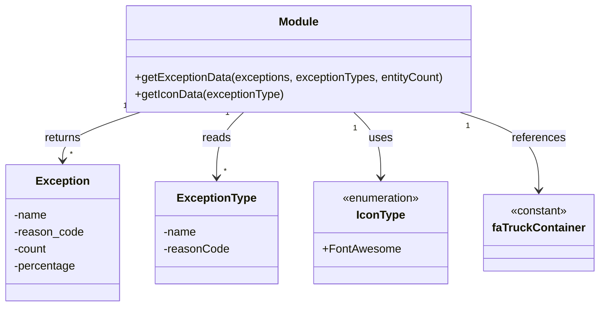

# Diagram: web/portal/src/pages/finishedvehicle/details/utils/exceptions.utils.js


> Auto-generated by Obscura crawlers

## Diagram 1

```mermaid
flowchart TD
  A[Start: getExceptionData(exceptions, exceptionTypes, entityCount)] --> B[Map exceptions -> updatedExceptions]
  B --> C{For each exception}
  C --> D[If name === "In Hold" then name = "On Hold"]
  C --> E[percentage = entityCount === 0 ? "0" : ((count/entityCount)*100).toFixed(1)]
  D --> E
  E --> F[After map: updatedExceptions]
  F --> G[ForEach type in exceptionTypes]
  G --> H{_.find(updatedExceptions, { reason_code: type.reasonCode })?}
  H -- No --> I[Push { name: type.name, reason_code: type.reasonCode, count:0, percentage:0 }]
  H -- Yes --> J[Do nothing]
  I --> K[Continue loop]
  J --> K
  K --> L[Return updatedExceptions]
  style A fill:#f9f,stroke:#333,stroke-width:1px
  style L fill:#9f9,stroke:#333,stroke-width:1px
```

> SVG rendering failed for this diagram.

## Diagram 2



### SVG

<svg id="container" width="830.328125" xmlns="http://www.w3.org/2000/svg" class="classDiagram" height="432" viewBox="0 0 830.328125 432" role="graphics-document document" aria-roledescription="class"><style>#container{font-family:"trebuchet ms",verdana,arial,sans-serif;font-size:16px;fill:#333;}@keyframes edge-animation-frame{from{stroke-dashoffset:0;}}@keyframes dash{to{stroke-dashoffset:0;}}#container .edge-animation-slow{stroke-dasharray:9,5!important;stroke-dashoffset:900;animation:dash 50s linear infinite;stroke-linecap:round;}#container .edge-animation-fast{stroke-dasharray:9,5!important;stroke-dashoffset:900;animation:dash 20s linear infinite;stroke-linecap:round;}#container .error-icon{fill:#552222;}#container .error-text{fill:#552222;stroke:#552222;}#container .edge-thickness-normal{stroke-width:1px;}#container .edge-thickness-thick{stroke-width:3.5px;}#container .edge-pattern-solid{stroke-dasharray:0;}#container .edge-thickness-invisible{stroke-width:0;fill:none;}#container .edge-pattern-dashed{stroke-dasharray:3;}#container .edge-pattern-dotted{stroke-dasharray:2;}#container .marker{fill:#333333;stroke:#333333;}#container .marker.cross{stroke:#333333;}#container svg{font-family:"trebuchet ms",verdana,arial,sans-serif;font-size:16px;}#container p{margin:0;}#container g.classGroup text{fill:#9370DB;stroke:none;font-family:"trebuchet ms",verdana,arial,sans-serif;font-size:10px;}#container g.classGroup text .title{font-weight:bolder;}#container .nodeLabel,#container .edgeLabel{color:#131300;}#container .edgeLabel .label rect{fill:#ECECFF;}#container .label text{fill:#131300;}#container .labelBkg{background:#ECECFF;}#container .edgeLabel .label span{background:#ECECFF;}#container .classTitle{font-weight:bolder;}#container .node rect,#container .node circle,#container .node ellipse,#container .node polygon,#container .node path{fill:#ECECFF;stroke:#9370DB;stroke-width:1px;}#container .divider{stroke:#9370DB;stroke-width:1;}#container g.clickable{cursor:pointer;}#container g.classGroup rect{fill:#ECECFF;stroke:#9370DB;}#container g.classGroup line{stroke:#9370DB;stroke-width:1;}#container .classLabel .box{stroke:none;stroke-width:0;fill:#ECECFF;opacity:0.5;}#container .classLabel .label{fill:#9370DB;font-size:10px;}#container .relation{stroke:#333333;stroke-width:1;fill:none;}#container .dashed-line{stroke-dasharray:3;}#container .dotted-line{stroke-dasharray:1 2;}#container #compositionStart,#container .composition{fill:#333333!important;stroke:#333333!important;stroke-width:1;}#container #compositionEnd,#container .composition{fill:#333333!important;stroke:#333333!important;stroke-width:1;}#container #dependencyStart,#container .dependency{fill:#333333!important;stroke:#333333!important;stroke-width:1;}#container #dependencyStart,#container .dependency{fill:#333333!important;stroke:#333333!important;stroke-width:1;}#container #extensionStart,#container .extension{fill:transparent!important;stroke:#333333!important;stroke-width:1;}#container #extensionEnd,#container .extension{fill:transparent!important;stroke:#333333!important;stroke-width:1;}#container #aggregationStart,#container .aggregation{fill:transparent!important;stroke:#333333!important;stroke-width:1;}#container #aggregationEnd,#container .aggregation{fill:transparent!important;stroke:#333333!important;stroke-width:1;}#container #lollipopStart,#container .lollipop{fill:#ECECFF!important;stroke:#333333!important;stroke-width:1;}#container #lollipopEnd,#container .lollipop{fill:#ECECFF!important;stroke:#333333!important;stroke-width:1;}#container .edgeTerminals{font-size:11px;line-height:initial;}#container .classTitleText{text-anchor:middle;font-size:18px;fill:#333;}#container .label-icon{display:inline-block;height:1em;overflow:visible;vertical-align:-0.125em;}#container .node .label-icon path{fill:currentColor;stroke:revert;stroke-width:revert;}#container :root{--mermaid-font-family:"trebuchet ms",verdana,arial,sans-serif;}</style><g><defs><marker id="container_class-aggregationStart" class="marker aggregation class" refX="18" refY="7" markerWidth="190" markerHeight="240" orient="auto"><path d="M 18,7 L9,13 L1,7 L9,1 Z"></path></marker></defs><defs><marker id="container_class-aggregationEnd" class="marker aggregation class" refX="1" refY="7" markerWidth="20" markerHeight="28" orient="auto"><path d="M 18,7 L9,13 L1,7 L9,1 Z"></path></marker></defs><defs><marker id="container_class-extensionStart" class="marker extension class" refX="18" refY="7" markerWidth="190" markerHeight="240" orient="auto"><path d="M 1,7 L18,13 V 1 Z"></path></marker></defs><defs><marker id="container_class-extensionEnd" class="marker extension class" refX="1" refY="7" markerWidth="20" markerHeight="28" orient="auto"><path d="M 1,1 V 13 L18,7 Z"></path></marker></defs><defs><marker id="container_class-compositionStart" class="marker composition class" refX="18" refY="7" markerWidth="190" markerHeight="240" orient="auto"><path d="M 18,7 L9,13 L1,7 L9,1 Z"></path></marker></defs><defs><marker id="container_class-compositionEnd" class="marker composition class" refX="1" refY="7" markerWidth="20" markerHeight="28" orient="auto"><path d="M 18,7 L9,13 L1,7 L9,1 Z"></path></marker></defs><defs><marker id="container_class-dependencyStart" class="marker dependency class" refX="6" refY="7" markerWidth="190" markerHeight="240" orient="auto"><path d="M 5,7 L9,13 L1,7 L9,1 Z"></path></marker></defs><defs><marker id="container_class-dependencyEnd" class="marker dependency class" refX="13" refY="7" markerWidth="20" markerHeight="28" orient="auto"><path d="M 18,7 L9,13 L14,7 L9,1 Z"></path></marker></defs><defs><marker id="container_class-lollipopStart" class="marker lollipop class" refX="13" refY="7" markerWidth="190" markerHeight="240" orient="auto"><circle stroke="black" fill="transparent" cx="7" cy="7" r="6"></circle></marker></defs><defs><marker id="container_class-lollipopEnd" class="marker lollipop class" refX="1" refY="7" markerWidth="190" markerHeight="240" orient="auto"><circle stroke="black" fill="transparent" cx="7" cy="7" r="6"></circle></marker></defs><g class="root"><g class="clusters"></g><g class="edgePaths"><path d="M195.283,158L177.245,164.167C159.207,170.333,123.131,182.667,105.093,194C87.055,205.333,87.055,215.667,87.055,220.833L87.055,226" id="id_Module_Exception_1" class="edge-thickness-normal edge-pattern-solid relation" style=";;;" data-edge="true" data-et="edge" data-id="id_Module_Exception_1" data-points="W3sieCI6MTk1LjI4Mjc4NDU5ODIxNDI4LCJ5IjoxNTh9LHsieCI6ODcuMDU0Njg3NSwieSI6MTk1fSx7IngiOjg3LjA1NDY4NzUsInkiOjIzMn1d" marker-end="url(#container_class-dependencyEnd)"></path><path d="M338.207,158L331.921,164.167C325.634,170.333,313.061,182.667,306.775,198C300.488,213.333,300.488,231.667,300.488,240.833L300.488,250" id="id_Module_ExceptionType_2" class="edge-thickness-normal edge-pattern-solid relation" style=";;;" data-edge="true" data-et="edge" data-id="id_Module_ExceptionType_2" data-points="W3sieCI6MzM4LjIwNzA2NjEyNzIzMjEsInkiOjE1OH0seyJ4IjozMDAuNDg4MjgxMjUsInkiOjE5NX0seyJ4IjozMDAuNDg4MjgxMjUsInkiOjI1Nn1d" marker-end="url(#container_class-dependencyEnd)"></path><path d="M491.121,158L497.408,164.167C503.694,170.333,516.267,182.667,522.553,198C528.84,213.333,528.84,231.667,528.84,240.833L528.84,250" id="id_Module_IconType_3" class="edge-thickness-normal edge-pattern-solid relation" style=";;;" data-edge="true" data-et="edge" data-id="id_Module_IconType_3" data-points="W3sieCI6NDkxLjEyMTA1ODg3Mjc2NzksInkiOjE1OH0seyJ4Ijo1MjguODM5ODQzNzUsInkiOjE5NX0seyJ4Ijo1MjguODM5ODQzNzUsInkiOjI1Nn1d" marker-end="url(#container_class-dependencyEnd)"></path><path d="M637.592,158L655.922,164.167C674.252,170.333,710.911,182.667,729.241,201C747.57,219.333,747.57,243.667,747.57,255.833L747.57,268" id="id_Module_faTruckContainer_4" class="edge-thickness-normal edge-pattern-solid relation" style=";;;" data-edge="true" data-et="edge" data-id="id_Module_faTruckContainer_4" data-points="W3sieCI6NjM3LjU5MjM1NDkxMDcxNDIsInkiOjE1OH0seyJ4Ijo3NDcuNTcwMzEyNSwieSI6MTk1fSx7IngiOjc0Ny41NzAzMTI1LCJ5IjoyNzR9XQ==" marker-end="url(#container_class-dependencyEnd)"></path></g><g class="edgeLabels"><g class="edgeLabel" transform="translate(87.0546875, 195)"><g class="label" data-id="id_Module_Exception_1" transform="translate(-26.265625, -12)"><foreignObject width="52.53125" height="24"><div xmlns="http://www.w3.org/1999/xhtml" class="labelBkg" style="display: table-cell; white-space: nowrap; line-height: 1.5; max-width: 200px; text-align: center;"><span class="edgeLabel"><p>returns</p></span></div></foreignObject></g></g><g class="edgeLabel" transform="translate(300.48828125, 195)"><g class="label" data-id="id_Module_ExceptionType_2" transform="translate(-20.0078125, -12)"><foreignObject width="40.015625" height="24"><div xmlns="http://www.w3.org/1999/xhtml" class="labelBkg" style="display: table-cell; white-space: nowrap; line-height: 1.5; max-width: 200px; text-align: center;"><span class="edgeLabel"><p>reads</p></span></div></foreignObject></g></g><g class="edgeLabel" transform="translate(528.83984375, 195)"><g class="label" data-id="id_Module_IconType_3" transform="translate(-16.4921875, -12)"><foreignObject width="32.984375" height="24"><div xmlns="http://www.w3.org/1999/xhtml" class="labelBkg" style="display: table-cell; white-space: nowrap; line-height: 1.5; max-width: 200px; text-align: center;"><span class="edgeLabel"><p>uses</p></span></div></foreignObject></g></g><g class="edgeLabel" transform="translate(747.5703125, 195)"><g class="label" data-id="id_Module_faTruckContainer_4" transform="translate(-37.828125, -12)"><foreignObject width="75.65625" height="24"><div xmlns="http://www.w3.org/1999/xhtml" class="labelBkg" style="display: table-cell; white-space: nowrap; line-height: 1.5; max-width: 200px; text-align: center;"><span class="edgeLabel"><p>references</p></span></div></foreignObject></g></g><g class="edgeTerminals" transform="translate(173.87139382679243, 149.46757551562217)"><g class="inner" transform="translate(0, 0)"><foreignObject style="width: 9px; height: 12px;"><div xmlns="http://www.w3.org/1999/xhtml" style="display: inline-block; padding-right: 1px; white-space: nowrap;"><span class="edgeLabel">1</span></div></foreignObject></g></g><g class="edgeTerminals" transform="translate(315.21015627465795, 159.54661983604626)"><g class="inner" transform="translate(0, 0)"><foreignObject style="width: 9px; height: 12px;"><div xmlns="http://www.w3.org/1999/xhtml" style="display: inline-block; padding-right: 1px; white-space: nowrap;"><span class="edgeLabel">1</span></div></foreignObject></g></g><g class="edgeTerminals" transform="translate(493.10980871865627, 180.96290121477028)"><g class="inner" transform="translate(0, 0)"><foreignObject style="width: 9px; height: 12px;"><div xmlns="http://www.w3.org/1999/xhtml" style="display: inline-block; padding-right: 1px; white-space: nowrap;"><span class="edgeLabel">1</span></div></foreignObject></g></g><g class="edgeTerminals" transform="translate(649.3957990139498, 177.79718748920564)"><g class="inner" transform="translate(0, 0)"><foreignObject style="width: 9px; height: 12px;"><div xmlns="http://www.w3.org/1999/xhtml" style="display: inline-block; padding-right: 1px; white-space: nowrap;"><span class="edgeLabel">1</span></div></foreignObject></g></g><g class="edgeTerminals" transform="translate(97.05468874999995, 209.50000107142858)"><g class="inner" transform="translate(0, 0)"></g><foreignObject style="width: 9px; height: 12px;"><div xmlns="http://www.w3.org/1999/xhtml" style="display: inline-block; padding-right: 1px; white-space: nowrap;"><span class="edgeLabel">*</span></div></foreignObject></g><g class="edgeTerminals" transform="translate(310.488280625, 233.4999994642857)"><g class="inner" transform="translate(0, 0)"></g><foreignObject style="width: 9px; height: 12px;"><div xmlns="http://www.w3.org/1999/xhtml" style="display: inline-block; padding-right: 1px; white-space: nowrap;"><span class="edgeLabel">*</span></div></foreignObject></g></g><g class="nodes"><g class="node default" id="classId-Module-0" transform="translate(414.6640625, 83)"><g class="basic label-container"><path d="M-243.3515625 -75 L243.3515625 -75 L243.3515625 75 L-243.3515625 75" stroke="none" stroke-width="0" fill="#ECECFF" style=""></path><path d="M-243.3515625 -75 C-143.05811815528224 -75, -42.76467381056449 -75, 243.3515625 -75 M-243.3515625 -75 C-64.56634085764139 -75, 114.21888078471721 -75, 243.3515625 -75 M243.3515625 -75 C243.3515625 -20.667859896435225, 243.3515625 33.66428020712955, 243.3515625 75 M243.3515625 -75 C243.3515625 -23.03026075038295, 243.3515625 28.9394784992341, 243.3515625 75 M243.3515625 75 C100.71958502626461 75, -41.91239244747078 75, -243.3515625 75 M243.3515625 75 C75.13676098318871 75, -93.07804053362258 75, -243.3515625 75 M-243.3515625 75 C-243.3515625 38.18879985371271, -243.3515625 1.3775997074254178, -243.3515625 -75 M-243.3515625 75 C-243.3515625 38.95767593806935, -243.3515625 2.9153518761387005, -243.3515625 -75" stroke="#9370DB" stroke-width="1.3" fill="none" stroke-dasharray="0 0" style=""></path></g><g class="annotation-group text" transform="translate(0, -51)"></g><g class="label-group text" transform="translate(-27.09375, -51)"><g class="label" style="font-weight: bolder" transform="translate(0,-12)"><foreignObject width="54.1875" height="24"><div xmlns="http://www.w3.org/1999/xhtml" style="display: table-cell; white-space: nowrap; line-height: 1.5; max-width: 104px; text-align: center;"><span class="nodeLabel markdown-node-label" style=""><p>Module</p></span></div></foreignObject></g></g><g class="members-group text" transform="translate(-231.3515625, -3)"></g><g class="methods-group text" transform="translate(-231.3515625, 27)"><g class="label" style="" transform="translate(0,-12)"><foreignObject width="435.609375" height="24"><div xmlns="http://www.w3.org/1999/xhtml" style="display: table-cell; white-space: nowrap; line-height: 1.5; max-width: 493px; text-align: center;"><span class="nodeLabel markdown-node-label" style=""><p>+getExceptionData(exceptions, exceptionTypes, entityCount)</p></span></div></foreignObject></g><g class="label" style="" transform="translate(0,12)"><foreignObject width="209.390625" height="24"><div xmlns="http://www.w3.org/1999/xhtml" style="display: table-cell; white-space: nowrap; line-height: 1.5; max-width: 267px; text-align: center;"><span class="nodeLabel markdown-node-label" style=""><p>+getIconData(exceptionType)</p></span></div></foreignObject></g></g><g class="divider" style=""><path d="M-243.3515625 -27 C-121.1245720983603 -27, 1.1024183032793928 -27, 243.3515625 -27 M-243.3515625 -27 C-118.95226469364916 -27, 5.447033112701689 -27, 243.3515625 -27" stroke="#9370DB" stroke-width="1.3" fill="none" stroke-dasharray="0 0" style=""></path></g><g class="divider" style=""><path d="M-243.3515625 -3 C-76.60544698756408 -3, 90.14066852487184 -3, 243.3515625 -3 M-243.3515625 -3 C-125.91712135745824 -3, -8.482680214916485 -3, 243.3515625 -3" stroke="#9370DB" stroke-width="1.3" fill="none" stroke-dasharray="0 0" style=""></path></g></g><g class="node default" id="classId-Exception-1" transform="translate(87.0546875, 328)"><g class="basic label-container"><path d="M-79.0546875 -96 L79.0546875 -96 L79.0546875 96 L-79.0546875 96" stroke="none" stroke-width="0" fill="#ECECFF" style=""></path><path d="M-79.0546875 -96 C-15.85182092240371 -96, 47.35104565519258 -96, 79.0546875 -96 M-79.0546875 -96 C-35.23153535288838 -96, 8.591616794223242 -96, 79.0546875 -96 M79.0546875 -96 C79.0546875 -43.29615582940676, 79.0546875 9.407688341186486, 79.0546875 96 M79.0546875 -96 C79.0546875 -32.81844400396971, 79.0546875 30.36311199206058, 79.0546875 96 M79.0546875 96 C25.129823074492684 96, -28.795041351014632 96, -79.0546875 96 M79.0546875 96 C28.90524194619237 96, -21.244203607615262 96, -79.0546875 96 M-79.0546875 96 C-79.0546875 44.325591781992244, -79.0546875 -7.348816436015511, -79.0546875 -96 M-79.0546875 96 C-79.0546875 35.35753945092014, -79.0546875 -25.284921098159714, -79.0546875 -96" stroke="#9370DB" stroke-width="1.3" fill="none" stroke-dasharray="0 0" style=""></path></g><g class="annotation-group text" transform="translate(0, -72)"></g><g class="label-group text" transform="translate(-35.703125, -72)"><g class="label" style="font-weight: bolder" transform="translate(0,-12)"><foreignObject width="71.40625" height="24"><div xmlns="http://www.w3.org/1999/xhtml" style="display: table-cell; white-space: nowrap; line-height: 1.5; max-width: 121px; text-align: center;"><span class="nodeLabel markdown-node-label" style=""><p>Exception</p></span></div></foreignObject></g></g><g class="members-group text" transform="translate(-67.0546875, -24)"><g class="label" style="" transform="translate(0,-12)"><foreignObject width="46.96875" height="24"><div xmlns="http://www.w3.org/1999/xhtml" style="display: table-cell; white-space: nowrap; line-height: 1.5; max-width: 104px; text-align: center;"><span class="nodeLabel markdown-node-label" style=""><p>-name</p></span></div></foreignObject></g><g class="label" style="" transform="translate(0,12)"><foreignObject width="98.40625" height="24"><div xmlns="http://www.w3.org/1999/xhtml" style="display: table-cell; white-space: nowrap; line-height: 1.5; max-width: 156px; text-align: center;"><span class="nodeLabel markdown-node-label" style=""><p>-reason_code</p></span></div></foreignObject></g><g class="label" style="" transform="translate(0,36)"><foreignObject width="47.59375" height="24"><div xmlns="http://www.w3.org/1999/xhtml" style="display: table-cell; white-space: nowrap; line-height: 1.5; max-width: 105px; text-align: center;"><span class="nodeLabel markdown-node-label" style=""><p>-count</p></span></div></foreignObject></g><g class="label" style="" transform="translate(0,60)"><foreignObject width="86.796875" height="24"><div xmlns="http://www.w3.org/1999/xhtml" style="display: table-cell; white-space: nowrap; line-height: 1.5; max-width: 144px; text-align: center;"><span class="nodeLabel markdown-node-label" style=""><p>-percentage</p></span></div></foreignObject></g></g><g class="methods-group text" transform="translate(-67.0546875, 96)"></g><g class="divider" style=""><path d="M-79.0546875 -48 C-17.951563618575804 -48, 43.15156026284839 -48, 79.0546875 -48 M-79.0546875 -48 C-19.58420407863516 -48, 39.88627934272968 -48, 79.0546875 -48" stroke="#9370DB" stroke-width="1.3" fill="none" stroke-dasharray="0 0" style=""></path></g><g class="divider" style=""><path d="M-79.0546875 72 C-20.43048673416346 72, 38.19371403167308 72, 79.0546875 72 M-79.0546875 72 C-29.78815833539496 72, 19.47837082921008 72, 79.0546875 72" stroke="#9370DB" stroke-width="1.3" fill="none" stroke-dasharray="0 0" style=""></path></g></g><g class="node default" id="classId-ExceptionType-2" transform="translate(300.48828125, 328)"><g class="basic label-container"><path d="M-84.37890625 -72 L84.37890625 -72 L84.37890625 72 L-84.37890625 72" stroke="none" stroke-width="0" fill="#ECECFF" style=""></path><path d="M-84.37890625 -72 C-32.375413224117445 -72, 19.62807980176511 -72, 84.37890625 -72 M-84.37890625 -72 C-40.926241428168545 -72, 2.5264233936629097 -72, 84.37890625 -72 M84.37890625 -72 C84.37890625 -27.89195476349893, 84.37890625 16.21609047300214, 84.37890625 72 M84.37890625 -72 C84.37890625 -37.02333669430403, 84.37890625 -2.046673388608056, 84.37890625 72 M84.37890625 72 C45.45644742536032 72, 6.533988600720633 72, -84.37890625 72 M84.37890625 72 C41.82604253371044 72, -0.7268211825791155 72, -84.37890625 72 M-84.37890625 72 C-84.37890625 27.481501337218134, -84.37890625 -17.036997325563732, -84.37890625 -72 M-84.37890625 72 C-84.37890625 27.358681980772666, -84.37890625 -17.28263603845467, -84.37890625 -72" stroke="#9370DB" stroke-width="1.3" fill="none" stroke-dasharray="0 0" style=""></path></g><g class="annotation-group text" transform="translate(0, -48)"></g><g class="label-group text" transform="translate(-53.0390625, -48)"><g class="label" style="font-weight: bolder" transform="translate(0,-12)"><foreignObject width="106.078125" height="24"><div xmlns="http://www.w3.org/1999/xhtml" style="display: table-cell; white-space: nowrap; line-height: 1.5; max-width: 154px; text-align: center;"><span class="nodeLabel markdown-node-label" style=""><p>ExceptionType</p></span></div></foreignObject></g></g><g class="members-group text" transform="translate(-72.37890625, 0)"><g class="label" style="" transform="translate(0,-12)"><foreignObject width="46.96875" height="24"><div xmlns="http://www.w3.org/1999/xhtml" style="display: table-cell; white-space: nowrap; line-height: 1.5; max-width: 104px; text-align: center;"><span class="nodeLabel markdown-node-label" style=""><p>-name</p></span></div></foreignObject></g><g class="label" style="" transform="translate(0,12)"><foreignObject width="91.71875" height="24"><div xmlns="http://www.w3.org/1999/xhtml" style="display: table-cell; white-space: nowrap; line-height: 1.5; max-width: 149px; text-align: center;"><span class="nodeLabel markdown-node-label" style=""><p>-reasonCode</p></span></div></foreignObject></g></g><g class="methods-group text" transform="translate(-72.37890625, 72)"></g><g class="divider" style=""><path d="M-84.37890625 -24 C-36.250304308128946 -24, 11.878297633742108 -24, 84.37890625 -24 M-84.37890625 -24 C-21.48576141909168 -24, 41.40738341181664 -24, 84.37890625 -24" stroke="#9370DB" stroke-width="1.3" fill="none" stroke-dasharray="0 0" style=""></path></g><g class="divider" style=""><path d="M-84.37890625 48 C-27.432278959162545 48, 29.51434833167491 48, 84.37890625 48 M-84.37890625 48 C-33.21626220641106 48, 17.94638183717788 48, 84.37890625 48" stroke="#9370DB" stroke-width="1.3" fill="none" stroke-dasharray="0 0" style=""></path></g></g><g class="node default" id="classId-IconType-3" transform="translate(528.83984375, 328)"><g class="basic label-container"><path d="M-93.97265625 -72 L93.97265625 -72 L93.97265625 72 L-93.97265625 72" stroke="none" stroke-width="0" fill="#ECECFF" style=""></path><path d="M-93.97265625 -72 C-28.269676623504566 -72, 37.43330300299087 -72, 93.97265625 -72 M-93.97265625 -72 C-26.120873635994315 -72, 41.73090897801137 -72, 93.97265625 -72 M93.97265625 -72 C93.97265625 -20.09989745532293, 93.97265625 31.800205089354137, 93.97265625 72 M93.97265625 -72 C93.97265625 -15.709156248501692, 93.97265625 40.581687502996616, 93.97265625 72 M93.97265625 72 C42.227120699391314 72, -9.518414851217372 72, -93.97265625 72 M93.97265625 72 C52.55570732999259 72, 11.138758409985186 72, -93.97265625 72 M-93.97265625 72 C-93.97265625 15.267968656793556, -93.97265625 -41.46406268641289, -93.97265625 -72 M-93.97265625 72 C-93.97265625 36.26055093520714, -93.97265625 0.5211018704142845, -93.97265625 -72" stroke="#9370DB" stroke-width="1.3" fill="none" stroke-dasharray="0 0" style=""></path></g><g class="annotation-group text" transform="translate(-55.5546875, -48)"><g class="label" style="" transform="translate(0,-12)"><foreignObject width="111.109375" height="24"><div xmlns="http://www.w3.org/1999/xhtml" style="display: table-cell; white-space: nowrap; line-height: 1.5; max-width: 161px; text-align: center;"><span class="nodeLabel markdown-node-label" style=""><p>«enumeration»</p></span></div></foreignObject></g></g><g class="label-group text" transform="translate(-32.640625, -24)"><g class="label" style="font-weight: bolder" transform="translate(0,-12)"><foreignObject width="65.28125" height="24"><div xmlns="http://www.w3.org/1999/xhtml" style="display: table-cell; white-space: nowrap; line-height: 1.5; max-width: 115px; text-align: center;"><span class="nodeLabel markdown-node-label" style=""><p>IconType</p></span></div></foreignObject></g></g><g class="members-group text" transform="translate(-81.97265625, 24)"><g class="label" style="" transform="translate(0,-12)"><foreignObject width="108.390625" height="24"><div xmlns="http://www.w3.org/1999/xhtml" style="display: table-cell; white-space: nowrap; line-height: 1.5; max-width: 166px; text-align: center;"><span class="nodeLabel markdown-node-label" style=""><p>+FontAwesome</p></span></div></foreignObject></g></g><g class="methods-group text" transform="translate(-81.97265625, 72)"></g><g class="divider" style=""><path d="M-93.97265625 0 C-46.71470836312324 0, 0.5432395237535133 0, 93.97265625 0 M-93.97265625 0 C-18.978834157103435 0, 56.01498793579313 0, 93.97265625 0" stroke="#9370DB" stroke-width="1.3" fill="none" stroke-dasharray="0 0" style=""></path></g><g class="divider" style=""><path d="M-93.97265625 48 C-18.862551651826863 48, 56.247552946346275 48, 93.97265625 48 M-93.97265625 48 C-34.60603335187933 48, 24.760589546241334 48, 93.97265625 48" stroke="#9370DB" stroke-width="1.3" fill="none" stroke-dasharray="0 0" style=""></path></g></g><g class="node default" id="classId-faTruckContainer-4" transform="translate(747.5703125, 328)"><g class="basic label-container"><path d="M-74.7578125 -54 L74.7578125 -54 L74.7578125 54 L-74.7578125 54" stroke="none" stroke-width="0" fill="#ECECFF" style=""></path><path d="M-74.7578125 -54 C-29.556188049697177 -54, 15.645436400605647 -54, 74.7578125 -54 M-74.7578125 -54 C-29.24420191646133 -54, 16.269408667077343 -54, 74.7578125 -54 M74.7578125 -54 C74.7578125 -26.701064730531748, 74.7578125 0.5978705389365047, 74.7578125 54 M74.7578125 -54 C74.7578125 -27.609278509838543, 74.7578125 -1.2185570196770854, 74.7578125 54 M74.7578125 54 C44.40245534326821 54, 14.047098186536417 54, -74.7578125 54 M74.7578125 54 C15.236405154363617 54, -44.28500219127277 54, -74.7578125 54 M-74.7578125 54 C-74.7578125 19.990860213235933, -74.7578125 -14.018279573528133, -74.7578125 -54 M-74.7578125 54 C-74.7578125 25.959912835213697, -74.7578125 -2.080174329572607, -74.7578125 -54" stroke="#9370DB" stroke-width="1.3" fill="none" stroke-dasharray="0 0" style=""></path></g><g class="annotation-group text" transform="translate(-40.4921875, -30)"><g class="label" style="" transform="translate(0,-12)"><foreignObject width="80.984375" height="24"><div xmlns="http://www.w3.org/1999/xhtml" style="display: table-cell; white-space: nowrap; line-height: 1.5; max-width: 131px; text-align: center;"><span class="nodeLabel markdown-node-label" style=""><p>«constant»</p></span></div></foreignObject></g></g><g class="label-group text" transform="translate(-62.7578125, -6)"><g class="label" style="font-weight: bolder" transform="translate(0,-12)"><foreignObject width="125.515625" height="24"><div xmlns="http://www.w3.org/1999/xhtml" style="display: table-cell; white-space: nowrap; line-height: 1.5; max-width: 174px; text-align: center;"><span class="nodeLabel markdown-node-label" style=""><p>faTruckContainer</p></span></div></foreignObject></g></g><g class="members-group text" transform="translate(-62.7578125, 42)"></g><g class="methods-group text" transform="translate(-62.7578125, 72)"></g><g class="divider" style=""><path d="M-74.7578125 18 C-42.20882266879702 18, -9.659832837594038 18, 74.7578125 18 M-74.7578125 18 C-30.302583085696867 18, 14.152646328606266 18, 74.7578125 18" stroke="#9370DB" stroke-width="1.3" fill="none" stroke-dasharray="0 0" style=""></path></g><g class="divider" style=""><path d="M-74.7578125 36 C-25.11478542409985 36, 24.5282416518003 36, 74.7578125 36 M-74.7578125 36 C-31.729379945445892 36, 11.299052609108216 36, 74.7578125 36" stroke="#9370DB" stroke-width="1.3" fill="none" stroke-dasharray="0 0" style=""></path></g></g></g></g></g></svg>

## Diagram 3

```mermaid
flowchart LR
  A[getIconData(exceptionType)] --> B{switch exceptionType}
  B -->|Delivered| C[return { type: IconType.FontAwesome, src: faTruckContainer }]
  B -->|default| D[return null]
  style C fill:#def,stroke:#333,stroke-width:1px
  style D fill:#fdd,stroke:#333,stroke-width:1px
```

> SVG rendering failed for this diagram.
