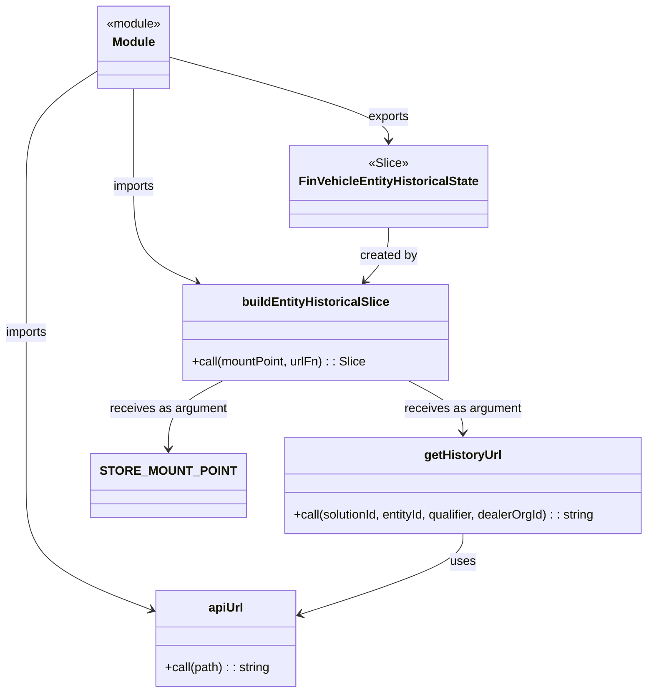

# Diagram: web/portal/src/pages/finishedvehicle/redux/FinVehicleEntityHistoricalState.js


> Auto-generated by Obscura crawlers

## Diagram 1



### SVG

<svg id="container" width="845.9921875" xmlns="http://www.w3.org/2000/svg" class="classDiagram" height="906" viewBox="0 0 845.9921875 906" role="graphics-document document" aria-roledescription="class"><style>#container{font-family:"trebuchet ms",verdana,arial,sans-serif;font-size:16px;fill:#333;}@keyframes edge-animation-frame{from{stroke-dashoffset:0;}}@keyframes dash{to{stroke-dashoffset:0;}}#container .edge-animation-slow{stroke-dasharray:9,5!important;stroke-dashoffset:900;animation:dash 50s linear infinite;stroke-linecap:round;}#container .edge-animation-fast{stroke-dasharray:9,5!important;stroke-dashoffset:900;animation:dash 20s linear infinite;stroke-linecap:round;}#container .error-icon{fill:#552222;}#container .error-text{fill:#552222;stroke:#552222;}#container .edge-thickness-normal{stroke-width:1px;}#container .edge-thickness-thick{stroke-width:3.5px;}#container .edge-pattern-solid{stroke-dasharray:0;}#container .edge-thickness-invisible{stroke-width:0;fill:none;}#container .edge-pattern-dashed{stroke-dasharray:3;}#container .edge-pattern-dotted{stroke-dasharray:2;}#container .marker{fill:#333333;stroke:#333333;}#container .marker.cross{stroke:#333333;}#container svg{font-family:"trebuchet ms",verdana,arial,sans-serif;font-size:16px;}#container p{margin:0;}#container g.classGroup text{fill:#9370DB;stroke:none;font-family:"trebuchet ms",verdana,arial,sans-serif;font-size:10px;}#container g.classGroup text .title{font-weight:bolder;}#container .nodeLabel,#container .edgeLabel{color:#131300;}#container .edgeLabel .label rect{fill:#ECECFF;}#container .label text{fill:#131300;}#container .labelBkg{background:#ECECFF;}#container .edgeLabel .label span{background:#ECECFF;}#container .classTitle{font-weight:bolder;}#container .node rect,#container .node circle,#container .node ellipse,#container .node polygon,#container .node path{fill:#ECECFF;stroke:#9370DB;stroke-width:1px;}#container .divider{stroke:#9370DB;stroke-width:1;}#container g.clickable{cursor:pointer;}#container g.classGroup rect{fill:#ECECFF;stroke:#9370DB;}#container g.classGroup line{stroke:#9370DB;stroke-width:1;}#container .classLabel .box{stroke:none;stroke-width:0;fill:#ECECFF;opacity:0.5;}#container .classLabel .label{fill:#9370DB;font-size:10px;}#container .relation{stroke:#333333;stroke-width:1;fill:none;}#container .dashed-line{stroke-dasharray:3;}#container .dotted-line{stroke-dasharray:1 2;}#container #compositionStart,#container .composition{fill:#333333!important;stroke:#333333!important;stroke-width:1;}#container #compositionEnd,#container .composition{fill:#333333!important;stroke:#333333!important;stroke-width:1;}#container #dependencyStart,#container .dependency{fill:#333333!important;stroke:#333333!important;stroke-width:1;}#container #dependencyStart,#container .dependency{fill:#333333!important;stroke:#333333!important;stroke-width:1;}#container #extensionStart,#container .extension{fill:transparent!important;stroke:#333333!important;stroke-width:1;}#container #extensionEnd,#container .extension{fill:transparent!important;stroke:#333333!important;stroke-width:1;}#container #aggregationStart,#container .aggregation{fill:transparent!important;stroke:#333333!important;stroke-width:1;}#container #aggregationEnd,#container .aggregation{fill:transparent!important;stroke:#333333!important;stroke-width:1;}#container #lollipopStart,#container .lollipop{fill:#ECECFF!important;stroke:#333333!important;stroke-width:1;}#container #lollipopEnd,#container .lollipop{fill:#ECECFF!important;stroke:#333333!important;stroke-width:1;}#container .edgeTerminals{font-size:11px;line-height:initial;}#container .classTitleText{text-anchor:middle;font-size:18px;fill:#333;}#container .label-icon{display:inline-block;height:1em;overflow:visible;vertical-align:-0.125em;}#container .node .label-icon path{fill:currentColor;stroke:revert;stroke-width:revert;}#container :root{--mermaid-font-family:"trebuchet ms",verdana,arial,sans-serif;}</style><g><defs><marker id="container_class-aggregationStart" class="marker aggregation class" refX="18" refY="7" markerWidth="190" markerHeight="240" orient="auto"><path d="M 18,7 L9,13 L1,7 L9,1 Z"></path></marker></defs><defs><marker id="container_class-aggregationEnd" class="marker aggregation class" refX="1" refY="7" markerWidth="20" markerHeight="28" orient="auto"><path d="M 18,7 L9,13 L1,7 L9,1 Z"></path></marker></defs><defs><marker id="container_class-extensionStart" class="marker extension class" refX="18" refY="7" markerWidth="190" markerHeight="240" orient="auto"><path d="M 1,7 L18,13 V 1 Z"></path></marker></defs><defs><marker id="container_class-extensionEnd" class="marker extension class" refX="1" refY="7" markerWidth="20" markerHeight="28" orient="auto"><path d="M 1,1 V 13 L18,7 Z"></path></marker></defs><defs><marker id="container_class-compositionStart" class="marker composition class" refX="18" refY="7" markerWidth="190" markerHeight="240" orient="auto"><path d="M 18,7 L9,13 L1,7 L9,1 Z"></path></marker></defs><defs><marker id="container_class-compositionEnd" class="marker composition class" refX="1" refY="7" markerWidth="20" markerHeight="28" orient="auto"><path d="M 18,7 L9,13 L1,7 L9,1 Z"></path></marker></defs><defs><marker id="container_class-dependencyStart" class="marker dependency class" refX="6" refY="7" markerWidth="190" markerHeight="240" orient="auto"><path d="M 5,7 L9,13 L1,7 L9,1 Z"></path></marker></defs><defs><marker id="container_class-dependencyEnd" class="marker dependency class" refX="13" refY="7" markerWidth="20" markerHeight="28" orient="auto"><path d="M 18,7 L9,13 L14,7 L9,1 Z"></path></marker></defs><defs><marker id="container_class-lollipopStart" class="marker lollipop class" refX="13" refY="7" markerWidth="190" markerHeight="240" orient="auto"><circle stroke="black" fill="transparent" cx="7" cy="7" r="6"></circle></marker></defs><defs><marker id="container_class-lollipopEnd" class="marker lollipop class" refX="1" refY="7" markerWidth="190" markerHeight="240" orient="auto"><circle stroke="black" fill="transparent" cx="7" cy="7" r="6"></circle></marker></defs><g class="root"><g class="clusters"></g><g class="edgePaths"><path d="M129.586,93.16L114.03,103.133C98.474,113.107,67.362,133.053,51.806,158.193C36.25,183.333,36.25,213.667,36.25,244C36.25,274.333,36.25,304.667,36.25,336.5C36.25,368.333,36.25,401.667,36.25,435C36.25,468.333,36.25,501.667,36.25,535C36.25,568.333,36.25,601.667,36.25,635C36.25,668.333,36.25,701.667,62.227,728.558C88.203,755.45,140.157,775.9,166.134,786.125L192.11,796.351" id="id_Module_apiUrl_1" class="edge-thickness-normal edge-pattern-solid relation" style=";;;" data-edge="true" data-et="edge" data-id="id_Module_apiUrl_1" data-points="W3sieCI6MTI5LjU4NTkzNzUsInkiOjkzLjE1OTc4NjQzNzY5MjY1fSx7IngiOjM2LjI1LCJ5IjoxNTN9LHsieCI6MzYuMjUsInkiOjI0NH0seyJ4IjozNi4yNSwieSI6MzM1fSx7IngiOjM2LjI1LCJ5Ijo0MzV9LHsieCI6MzYuMjUsInkiOjUzNX0seyJ4IjozNi4yNSwieSI6NjM1fSx7IngiOjM2LjI1LCJ5Ijo3MzV9LHsieCI6MTk3LjY5MzM1OTM3NSwieSI6Nzk4LjU0ODE2MTQxNzA1MDR9XQ==" marker-end="url(#container_class-dependencyEnd)"></path><path d="M178.188,116L178.188,122.167C178.188,128.333,178.188,140.667,178.188,162C178.188,183.333,178.188,213.667,178.188,244C178.188,274.333,178.188,304.667,191.449,325.601C204.711,346.536,231.234,358.071,244.496,363.839L257.757,369.607" id="id_Module_buildEntityHistoricalSlice_2" class="edge-thickness-normal edge-pattern-solid relation" style=";;;" data-edge="true" data-et="edge" data-id="id_Module_buildEntityHistoricalSlice_2" data-points="W3sieCI6MTc4LjE4NzUsInkiOjExNn0seyJ4IjoxNzguMTg3NSwieSI6MTUzfSx7IngiOjE3OC4xODc1LCJ5IjoyNDR9LHsieCI6MTc4LjE4NzUsInkiOjMzNX0seyJ4IjoyNjMuMjU5MzE2NDA2MjUwMDQsInkiOjM3Mn1d" marker-end="url(#container_class-dependencyEnd)"></path><path d="M226.789,75.663L272.64,88.552C318.492,101.442,410.194,127.221,456.045,145.277C501.896,163.333,501.896,173.667,501.896,178.833L501.896,184" id="id_Module_FinVehicleEntityHistoricalState_3" class="edge-thickness-normal edge-pattern-solid relation" style=";;;" data-edge="true" data-et="edge" data-id="id_Module_FinVehicleEntityHistoricalState_3" data-points="W3sieCI6MjI2Ljc4OTA2MjUsInkiOjc1LjY2MjcxMDY0NzQ2Mzc4fSx7IngiOjUwMS44OTY0ODQzNzUsInkiOjE1M30seyJ4Ijo1MDEuODk2NDg0Mzc1LCJ5IjoxOTB9XQ==" marker-end="url(#container_class-dependencyEnd)"></path><path d="M598.707,698L598.707,704.167C598.707,710.333,598.707,722.667,563.691,740.187C528.675,757.707,458.644,780.415,423.628,791.769L388.612,803.122" id="id_getHistoryUrl_apiUrl_4" class="edge-thickness-normal edge-pattern-solid relation" style=";;;" data-edge="true" data-et="edge" data-id="id_getHistoryUrl_apiUrl_4" data-points="W3sieCI6NTk4LjcwNzAzMTI1LCJ5Ijo2OTh9LHsieCI6NTk4LjcwNzAzMTI1LCJ5Ijo3MzV9LHsieCI6MzgyLjkwNDI5Njg3NSwieSI6ODA0Ljk3MzA4NTA4MjgwM31d" marker-end="url(#container_class-dependencyEnd)"></path><path d="M501.896,298L501.896,304.167C501.896,310.333,501.896,322.667,496.797,334.271C491.698,345.875,481.499,356.749,476.4,362.186L471.3,367.624" id="id_FinVehicleEntityHistoricalState_buildEntityHistoricalSlice_5" class="edge-thickness-normal edge-pattern-solid relation" style=";;;" data-edge="true" data-et="edge" data-id="id_FinVehicleEntityHistoricalState_buildEntityHistoricalSlice_5" data-points="W3sieCI6NTAxLjg5NjQ4NDM3NSwieSI6Mjk4fSx7IngiOjUwMS44OTY0ODQzNzUsInkiOjMzNX0seyJ4Ijo0NjcuMTk1OTc2NTYyNSwieSI6MzcyfV0=" marker-end="url(#container_class-dependencyEnd)"></path><path d="M528.187,498L539.94,504.167C551.693,510.333,575.2,522.667,586.954,534C598.707,545.333,598.707,555.667,598.707,560.833L598.707,566" id="id_buildEntityHistoricalSlice_getHistoryUrl_6" class="edge-thickness-normal edge-pattern-solid relation" style=";;;" data-edge="true" data-et="edge" data-id="id_buildEntityHistoricalSlice_getHistoryUrl_6" data-points="W3sieCI6NTI4LjE4NjYyMTA5Mzc1LCJ5Ijo0OTh9LHsieCI6NTk4LjcwNzAzMTI1LCJ5Ijo1MzV9LHsieCI6NTk4LjcwNzAzMTI1LCJ5Ijo1NzJ9XQ==" marker-end="url(#container_class-dependencyEnd)"></path><path d="M288.036,498L276.283,504.167C264.529,510.333,241.022,522.667,229.269,537.5C217.516,552.333,217.516,569.667,217.516,578.333L217.516,587" id="id_buildEntityHistoricalSlice_STORE_MOUNT_POINT_7" class="edge-thickness-normal edge-pattern-solid relation" style=";;;" data-edge="true" data-et="edge" data-id="id_buildEntityHistoricalSlice_STORE_MOUNT_POINT_7" data-points="W3sieCI6Mjg4LjAzNjAzNTE1NjI1LCJ5Ijo0OTh9LHsieCI6MjE3LjUxNTYyNSwieSI6NTM1fSx7IngiOjIxNy41MTU2MjUsInkiOjU5M31d" marker-end="url(#container_class-dependencyEnd)"></path></g><g class="edgeLabels"><g class="edgeLabel" transform="translate(36.25, 435)"><g class="label" data-id="id_Module_apiUrl_1" transform="translate(-28.25, -12)"><foreignObject width="56.5" height="24"><div xmlns="http://www.w3.org/1999/xhtml" class="labelBkg" style="display: table-cell; white-space: nowrap; line-height: 1.5; max-width: 200px; text-align: center;"><span class="edgeLabel"><p>imports</p></span></div></foreignObject></g></g><g class="edgeLabel" transform="translate(178.1875, 244)"><g class="label" data-id="id_Module_buildEntityHistoricalSlice_2" transform="translate(-28.25, -12)"><foreignObject width="56.5" height="24"><div xmlns="http://www.w3.org/1999/xhtml" class="labelBkg" style="display: table-cell; white-space: nowrap; line-height: 1.5; max-width: 200px; text-align: center;"><span class="edgeLabel"><p>imports</p></span></div></foreignObject></g></g><g class="edgeLabel" transform="translate(501.896484375, 153)"><g class="label" data-id="id_Module_FinVehicleEntityHistoricalState_3" transform="translate(-27.3046875, -12)"><foreignObject width="54.609375" height="24"><div xmlns="http://www.w3.org/1999/xhtml" class="labelBkg" style="display: table-cell; white-space: nowrap; line-height: 1.5; max-width: 200px; text-align: center;"><span class="edgeLabel"><p>exports</p></span></div></foreignObject></g></g><g class="edgeLabel" transform="translate(598.70703125, 735)"><g class="label" data-id="id_getHistoryUrl_apiUrl_4" transform="translate(-16.4921875, -12)"><foreignObject width="32.984375" height="24"><div xmlns="http://www.w3.org/1999/xhtml" class="labelBkg" style="display: table-cell; white-space: nowrap; line-height: 1.5; max-width: 200px; text-align: center;"><span class="edgeLabel"><p>uses</p></span></div></foreignObject></g></g><g class="edgeLabel" transform="translate(501.896484375, 335)"><g class="label" data-id="id_FinVehicleEntityHistoricalState_buildEntityHistoricalSlice_5" transform="translate(-37.9921875, -12)"><foreignObject width="75.984375" height="24"><div xmlns="http://www.w3.org/1999/xhtml" class="labelBkg" style="display: table-cell; white-space: nowrap; line-height: 1.5; max-width: 200px; text-align: center;"><span class="edgeLabel"><p>created by</p></span></div></foreignObject></g></g><g class="edgeLabel" transform="translate(598.70703125, 535)"><g class="label" data-id="id_buildEntityHistoricalSlice_getHistoryUrl_6" transform="translate(-76.5859375, -12)"><foreignObject width="153.171875" height="24"><div xmlns="http://www.w3.org/1999/xhtml" class="labelBkg" style="display: table-cell; white-space: nowrap; line-height: 1.5; max-width: 200px; text-align: center;"><span class="edgeLabel"><p>receives as argument</p></span></div></foreignObject></g></g><g class="edgeLabel" transform="translate(217.515625, 535)"><g class="label" data-id="id_buildEntityHistoricalSlice_STORE_MOUNT_POINT_7" transform="translate(-76.5859375, -12)"><foreignObject width="153.171875" height="24"><div xmlns="http://www.w3.org/1999/xhtml" class="labelBkg" style="display: table-cell; white-space: nowrap; line-height: 1.5; max-width: 200px; text-align: center;"><span class="edgeLabel"><p>receives as argument</p></span></div></foreignObject></g></g></g><g class="nodes"><g class="node default" id="classId-Module-0" transform="translate(178.1875, 62)"><g class="basic label-container"><path d="M-48.6015625 -54 L48.6015625 -54 L48.6015625 54 L-48.6015625 54" stroke="none" stroke-width="0" fill="#ECECFF" style=""></path><path d="M-48.6015625 -54 C-26.857216293402796 -54, -5.112870086805593 -54, 48.6015625 -54 M-48.6015625 -54 C-11.402682140562554 -54, 25.796198218874892 -54, 48.6015625 -54 M48.6015625 -54 C48.6015625 -25.87087174625975, 48.6015625 2.258256507480503, 48.6015625 54 M48.6015625 -54 C48.6015625 -16.588539559903353, 48.6015625 20.822920880193294, 48.6015625 54 M48.6015625 54 C12.698683030769416 54, -23.204196438461167 54, -48.6015625 54 M48.6015625 54 C18.618177411531306 54, -11.365207676937388 54, -48.6015625 54 M-48.6015625 54 C-48.6015625 27.062733466481546, -48.6015625 0.12546693296309286, -48.6015625 -54 M-48.6015625 54 C-48.6015625 28.287326946552422, -48.6015625 2.574653893104845, -48.6015625 -54" stroke="#9370DB" stroke-width="1.3" fill="none" stroke-dasharray="0 0" style=""></path></g><g class="annotation-group text" transform="translate(-36.6015625, -30)"><g class="label" style="" transform="translate(0,-12)"><foreignObject width="73.203125" height="24"><div xmlns="http://www.w3.org/1999/xhtml" style="display: table-cell; white-space: nowrap; line-height: 1.5; max-width: 123px; text-align: center;"><span class="nodeLabel markdown-node-label" style=""><p>«module»</p></span></div></foreignObject></g></g><g class="label-group text" transform="translate(-27.09375, -6)"><g class="label" style="font-weight: bolder" transform="translate(0,-12)"><foreignObject width="54.1875" height="24"><div xmlns="http://www.w3.org/1999/xhtml" style="display: table-cell; white-space: nowrap; line-height: 1.5; max-width: 104px; text-align: center;"><span class="nodeLabel markdown-node-label" style=""><p>Module</p></span></div></foreignObject></g></g><g class="members-group text" transform="translate(-36.6015625, 42)"></g><g class="methods-group text" transform="translate(-36.6015625, 72)"></g><g class="divider" style=""><path d="M-48.6015625 18 C-18.13390281195702 18, 12.333756876085957 18, 48.6015625 18 M-48.6015625 18 C-10.878632749699214 18, 26.84429700060157 18, 48.6015625 18" stroke="#9370DB" stroke-width="1.3" fill="none" stroke-dasharray="0 0" style=""></path></g><g class="divider" style=""><path d="M-48.6015625 36 C-12.011397352309224 36, 24.57876779538155 36, 48.6015625 36 M-48.6015625 36 C-21.01534298817178 36, 6.5708765236564375 36, 48.6015625 36" stroke="#9370DB" stroke-width="1.3" fill="none" stroke-dasharray="0 0" style=""></path></g></g><g class="node default" id="classId-apiUrl-1" transform="translate(290.298828125, 835)"><g class="basic label-container"><path d="M-92.60546875 -63 L92.60546875 -63 L92.60546875 63 L-92.60546875 63" stroke="none" stroke-width="0" fill="#ECECFF" style=""></path><path d="M-92.60546875 -63 C-53.5382177352512 -63, -14.470966720502403 -63, 92.60546875 -63 M-92.60546875 -63 C-22.946734531382788 -63, 46.711999687234425 -63, 92.60546875 -63 M92.60546875 -63 C92.60546875 -35.11442694435857, 92.60546875 -7.22885388871714, 92.60546875 63 M92.60546875 -63 C92.60546875 -33.669189928311205, 92.60546875 -4.33837985662241, 92.60546875 63 M92.60546875 63 C35.52581538457864 63, -21.553837980842715 63, -92.60546875 63 M92.60546875 63 C20.476899501296913 63, -51.651669747406174 63, -92.60546875 63 M-92.60546875 63 C-92.60546875 22.736357452317165, -92.60546875 -17.52728509536567, -92.60546875 -63 M-92.60546875 63 C-92.60546875 29.518038941444615, -92.60546875 -3.9639221171107692, -92.60546875 -63" stroke="#9370DB" stroke-width="1.3" fill="none" stroke-dasharray="0 0" style=""></path></g><g class="annotation-group text" transform="translate(0, -39)"></g><g class="label-group text" transform="translate(-22.2109375, -39)"><g class="label" style="font-weight: bolder" transform="translate(0,-12)"><foreignObject width="44.421875" height="24"><div xmlns="http://www.w3.org/1999/xhtml" style="display: table-cell; white-space: nowrap; line-height: 1.5; max-width: 94px; text-align: center;"><span class="nodeLabel markdown-node-label" style=""><p>apiUrl</p></span></div></foreignObject></g></g><g class="members-group text" transform="translate(-80.60546875, 9)"></g><g class="methods-group text" transform="translate(-80.60546875, 39)"><g class="label" style="" transform="translate(0,-12)"><foreignObject width="139" height="24"><div xmlns="http://www.w3.org/1999/xhtml" style="display: table-cell; white-space: nowrap; line-height: 1.5; max-width: 197px; text-align: center;"><span class="nodeLabel markdown-node-label" style=""><p>+call(path) : : string</p></span></div></foreignObject></g></g><g class="divider" style=""><path d="M-92.60546875 -15 C-46.00293219441991 -15, 0.5996043611601749 -15, 92.60546875 -15 M-92.60546875 -15 C-51.450397555632065 -15, -10.29532636126413 -15, 92.60546875 -15" stroke="#9370DB" stroke-width="1.3" fill="none" stroke-dasharray="0 0" style=""></path></g><g class="divider" style=""><path d="M-92.60546875 9 C-47.96655300410214 9, -3.327637258204277 9, 92.60546875 9 M-92.60546875 9 C-55.26156737040166 9, -17.917665990803314 9, 92.60546875 9" stroke="#9370DB" stroke-width="1.3" fill="none" stroke-dasharray="0 0" style=""></path></g></g><g class="node default" id="classId-buildEntityHistoricalSlice-2" transform="translate(408.111328125, 435)"><g class="basic label-container"><path d="M-172.375 -63 L172.375 -63 L172.375 63 L-172.375 63" stroke="none" stroke-width="0" fill="#ECECFF" style=""></path><path d="M-172.375 -63 C-44.3006517131148 -63, 83.7736965737704 -63, 172.375 -63 M-172.375 -63 C-53.20867354716168 -63, 65.95765290567664 -63, 172.375 -63 M172.375 -63 C172.375 -32.25745031248637, 172.375 -1.5149006249727321, 172.375 63 M172.375 -63 C172.375 -33.965915598962006, 172.375 -4.931831197924012, 172.375 63 M172.375 63 C35.324752980006764 63, -101.72549403998647 63, -172.375 63 M172.375 63 C65.61210888373276 63, -41.15078223253448 63, -172.375 63 M-172.375 63 C-172.375 28.732433058652425, -172.375 -5.535133882695149, -172.375 -63 M-172.375 63 C-172.375 30.918554566192235, -172.375 -1.1628908676155305, -172.375 -63" stroke="#9370DB" stroke-width="1.3" fill="none" stroke-dasharray="0 0" style=""></path></g><g class="annotation-group text" transform="translate(0, -39)"></g><g class="label-group text" transform="translate(-92.28125, -39)"><g class="label" style="font-weight: bolder" transform="translate(0,-12)"><foreignObject width="184.5625" height="24"><div xmlns="http://www.w3.org/1999/xhtml" style="display: table-cell; white-space: nowrap; line-height: 1.5; max-width: 232px; text-align: center;"><span class="nodeLabel markdown-node-label" style=""><p>buildEntityHistoricalSlice</p></span></div></foreignObject></g></g><g class="members-group text" transform="translate(-160.375, 9)"></g><g class="methods-group text" transform="translate(-160.375, 39)"><g class="label" style="" transform="translate(0,-12)"><foreignObject width="228.46875" height="24"><div xmlns="http://www.w3.org/1999/xhtml" style="display: table-cell; white-space: nowrap; line-height: 1.5; max-width: 286px; text-align: center;"><span class="nodeLabel markdown-node-label" style=""><p>+call(mountPoint, urlFn) : : Slice</p></span></div></foreignObject></g></g><g class="divider" style=""><path d="M-172.375 -15 C-68.10882540363075 -15, 36.15734919273851 -15, 172.375 -15 M-172.375 -15 C-68.22901967019395 -15, 35.9169606596121 -15, 172.375 -15" stroke="#9370DB" stroke-width="1.3" fill="none" stroke-dasharray="0 0" style=""></path></g><g class="divider" style=""><path d="M-172.375 9 C-94.75380246725553 9, -17.13260493451105 9, 172.375 9 M-172.375 9 C-68.3711529040414 9, 35.63269419191721 9, 172.375 9" stroke="#9370DB" stroke-width="1.3" fill="none" stroke-dasharray="0 0" style=""></path></g></g><g class="node default" id="classId-getHistoryUrl-3" transform="translate(598.70703125, 635)"><g class="basic label-container"><path d="M-239.28515625 -63 L239.28515625 -63 L239.28515625 63 L-239.28515625 63" stroke="none" stroke-width="0" fill="#ECECFF" style=""></path><path d="M-239.28515625 -63 C-54.63249042328289 -63, 130.02017540343422 -63, 239.28515625 -63 M-239.28515625 -63 C-55.34802571074073 -63, 128.58910482851854 -63, 239.28515625 -63 M239.28515625 -63 C239.28515625 -23.284479774700607, 239.28515625 16.431040450598786, 239.28515625 63 M239.28515625 -63 C239.28515625 -36.67887745603039, 239.28515625 -10.357754912060777, 239.28515625 63 M239.28515625 63 C127.41758365202547 63, 15.550011054050941 63, -239.28515625 63 M239.28515625 63 C93.43270581263792 63, -52.41974462472416 63, -239.28515625 63 M-239.28515625 63 C-239.28515625 30.10980817604778, -239.28515625 -2.7803836479044435, -239.28515625 -63 M-239.28515625 63 C-239.28515625 19.456532224860034, -239.28515625 -24.086935550279932, -239.28515625 -63" stroke="#9370DB" stroke-width="1.3" fill="none" stroke-dasharray="0 0" style=""></path></g><g class="annotation-group text" transform="translate(0, -39)"></g><g class="label-group text" transform="translate(-48.9453125, -39)"><g class="label" style="font-weight: bolder" transform="translate(0,-12)"><foreignObject width="97.890625" height="24"><div xmlns="http://www.w3.org/1999/xhtml" style="display: table-cell; white-space: nowrap; line-height: 1.5; max-width: 146px; text-align: center;"><span class="nodeLabel markdown-node-label" style=""><p>getHistoryUrl</p></span></div></foreignObject></g></g><g class="members-group text" transform="translate(-227.28515625, 9)"></g><g class="methods-group text" transform="translate(-227.28515625, 39)"><g class="label" style="" transform="translate(0,-12)"><foreignObject width="405.625" height="24"><div xmlns="http://www.w3.org/1999/xhtml" style="display: table-cell; white-space: nowrap; line-height: 1.5; max-width: 464px; text-align: center;"><span class="nodeLabel markdown-node-label" style=""><p>+call(solutionId, entityId, qualifier, dealerOrgId) : : string</p></span></div></foreignObject></g></g><g class="divider" style=""><path d="M-239.28515625 -15 C-62.74115050403765 -15, 113.8028552419247 -15, 239.28515625 -15 M-239.28515625 -15 C-137.1177737572085 -15, -34.95039126441705 -15, 239.28515625 -15" stroke="#9370DB" stroke-width="1.3" fill="none" stroke-dasharray="0 0" style=""></path></g><g class="divider" style=""><path d="M-239.28515625 9 C-75.40758892060987 9, 88.46997840878026 9, 239.28515625 9 M-239.28515625 9 C-79.85529494307272 9, 79.57456636385456 9, 239.28515625 9" stroke="#9370DB" stroke-width="1.3" fill="none" stroke-dasharray="0 0" style=""></path></g></g><g class="node default" id="classId-FinVehicleEntityHistoricalState-4" transform="translate(501.896484375, 244)"><g class="basic label-container"><path d="M-124.3203125 -54 L124.3203125 -54 L124.3203125 54 L-124.3203125 54" stroke="none" stroke-width="0" fill="#ECECFF" style=""></path><path d="M-124.3203125 -54 C-35.28274250516846 -54, 53.754827489663086 -54, 124.3203125 -54 M-124.3203125 -54 C-42.525435279010196 -54, 39.26944194197961 -54, 124.3203125 -54 M124.3203125 -54 C124.3203125 -21.48259852173841, 124.3203125 11.03480295652318, 124.3203125 54 M124.3203125 -54 C124.3203125 -26.69146186358258, 124.3203125 0.6170762728348365, 124.3203125 54 M124.3203125 54 C71.95633582773267 54, 19.592359155465346 54, -124.3203125 54 M124.3203125 54 C54.825768788254095 54, -14.66877492349181 54, -124.3203125 54 M-124.3203125 54 C-124.3203125 31.150685266081563, -124.3203125 8.301370532163126, -124.3203125 -54 M-124.3203125 54 C-124.3203125 20.92091241372723, -124.3203125 -12.15817517254554, -124.3203125 -54" stroke="#9370DB" stroke-width="1.3" fill="none" stroke-dasharray="0 0" style=""></path></g><g class="annotation-group text" transform="translate(-25.953125, -30)"><g class="label" style="" transform="translate(0,-12)"><foreignObject width="51.90625" height="24"><div xmlns="http://www.w3.org/1999/xhtml" style="display: table-cell; white-space: nowrap; line-height: 1.5; max-width: 102px; text-align: center;"><span class="nodeLabel markdown-node-label" style=""><p>«Slice»</p></span></div></foreignObject></g></g><g class="label-group text" transform="translate(-112.3203125, -6)"><g class="label" style="font-weight: bolder" transform="translate(0,-12)"><foreignObject width="224.640625" height="24"><div xmlns="http://www.w3.org/1999/xhtml" style="display: table-cell; white-space: nowrap; line-height: 1.5; max-width: 271px; text-align: center;"><span class="nodeLabel markdown-node-label" style=""><p>FinVehicleEntityHistoricalState</p></span></div></foreignObject></g></g><g class="members-group text" transform="translate(-112.3203125, 42)"></g><g class="methods-group text" transform="translate(-112.3203125, 72)"></g><g class="divider" style=""><path d="M-124.3203125 18 C-52.53965479552407 18, 19.241002908951856 18, 124.3203125 18 M-124.3203125 18 C-68.63353973658809 18, -12.946766973176167 18, 124.3203125 18" stroke="#9370DB" stroke-width="1.3" fill="none" stroke-dasharray="0 0" style=""></path></g><g class="divider" style=""><path d="M-124.3203125 36 C-50.973339159871045 36, 22.37363418025791 36, 124.3203125 36 M-124.3203125 36 C-34.82538355659322 36, 54.66954538681355 36, 124.3203125 36" stroke="#9370DB" stroke-width="1.3" fill="none" stroke-dasharray="0 0" style=""></path></g></g><g class="node default" id="classId-STORE_MOUNT_POINT-5" transform="translate(217.515625, 635)"><g class="basic label-container"><path d="M-91.90625 -42 L91.90625 -42 L91.90625 42 L-91.90625 42" stroke="none" stroke-width="0" fill="#ECECFF" style=""></path><path d="M-91.90625 -42 C-49.2733117647475 -42, -6.640373529494994 -42, 91.90625 -42 M-91.90625 -42 C-29.343827946632892 -42, 33.218594106734216 -42, 91.90625 -42 M91.90625 -42 C91.90625 -19.568421786874783, 91.90625 2.863156426250434, 91.90625 42 M91.90625 -42 C91.90625 -23.047946258157655, 91.90625 -4.09589251631531, 91.90625 42 M91.90625 42 C51.14099625689968 42, 10.375742513799366 42, -91.90625 42 M91.90625 42 C51.22176278004001 42, 10.537275560080019 42, -91.90625 42 M-91.90625 42 C-91.90625 18.923521585659266, -91.90625 -4.152956828681468, -91.90625 -42 M-91.90625 42 C-91.90625 21.69875640908047, -91.90625 1.3975128181609406, -91.90625 -42" stroke="#9370DB" stroke-width="1.3" fill="none" stroke-dasharray="0 0" style=""></path></g><g class="annotation-group text" transform="translate(0, -18)"></g><g class="label-group text" transform="translate(-79.90625, -18)"><g class="label" style="font-weight: bolder" transform="translate(0,-12)"><foreignObject width="159.8125" height="24"><div xmlns="http://www.w3.org/1999/xhtml" style="display: table-cell; white-space: nowrap; line-height: 1.5; max-width: 209px; text-align: center;"><span class="nodeLabel markdown-node-label" style=""><p>STORE_MOUNT_POINT</p></span></div></foreignObject></g></g><g class="members-group text" transform="translate(-79.90625, 30)"></g><g class="methods-group text" transform="translate(-79.90625, 60)"></g><g class="divider" style=""><path d="M-91.90625 6 C-53.23855365418652 6, -14.570857308373036 6, 91.90625 6 M-91.90625 6 C-50.39446993743229 6, -8.882689874864582 6, 91.90625 6" stroke="#9370DB" stroke-width="1.3" fill="none" stroke-dasharray="0 0" style=""></path></g><g class="divider" style=""><path d="M-91.90625 24 C-44.27459380785328 24, 3.3570623842934424 24, 91.90625 24 M-91.90625 24 C-54.4130214013267 24, -16.919792802653404 24, 91.90625 24" stroke="#9370DB" stroke-width="1.3" fill="none" stroke-dasharray="0 0" style=""></path></g></g></g></g></g></svg>

## Diagram 2

```mermaid
flowchart TD
    A[STORE_MOUNT_POINT = "fvEntityHistory"] --> B[buildEntityHistoricalSlice]
    B --> C[FinVehicleEntityHistoricalState]
    subgraph URL_Function
        D[getHistoryUrl(solutionId, entityId, qualifier, dealerOrgId)]
        D --> E[apiUrl(`/entity/solution/${solutionId}/entity/${entityId}/reference-history?qualifier=${qualifier}`)]
    end
    B --> D
    C -->|default export| Module[Module Export]
```

> SVG rendering failed for this diagram.
