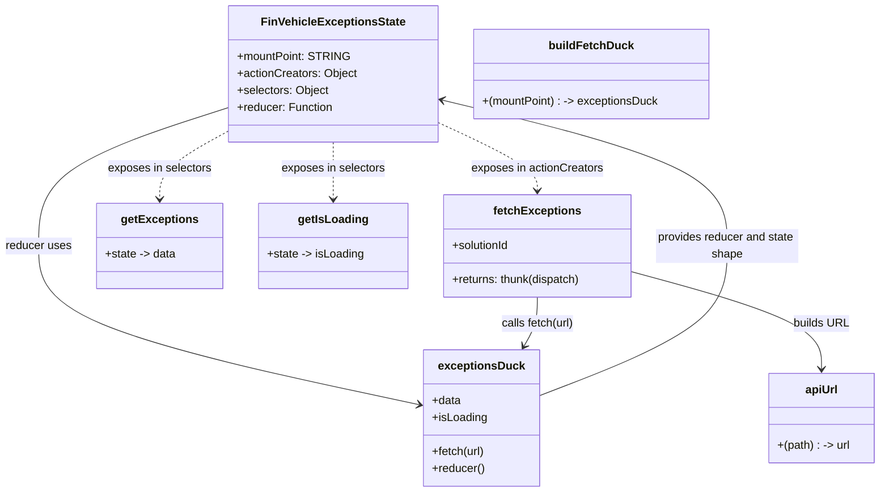

# Diagram: web/portal/src/pages/finishedvehicle/redux/FinVehicleExceptionsState.js


> Auto-generated by Obscura crawlers

## Diagram 1



### SVG

<svg id="container" width="1231.955078125" xmlns="http://www.w3.org/2000/svg" class="classDiagram" height="692" viewBox="0 0 1231.955078125 692" role="graphics-document document" aria-roledescription="class"><style>#container{font-family:"trebuchet ms",verdana,arial,sans-serif;font-size:16px;fill:#333;}@keyframes edge-animation-frame{from{stroke-dashoffset:0;}}@keyframes dash{to{stroke-dashoffset:0;}}#container .edge-animation-slow{stroke-dasharray:9,5!important;stroke-dashoffset:900;animation:dash 50s linear infinite;stroke-linecap:round;}#container .edge-animation-fast{stroke-dasharray:9,5!important;stroke-dashoffset:900;animation:dash 20s linear infinite;stroke-linecap:round;}#container .error-icon{fill:#552222;}#container .error-text{fill:#552222;stroke:#552222;}#container .edge-thickness-normal{stroke-width:1px;}#container .edge-thickness-thick{stroke-width:3.5px;}#container .edge-pattern-solid{stroke-dasharray:0;}#container .edge-thickness-invisible{stroke-width:0;fill:none;}#container .edge-pattern-dashed{stroke-dasharray:3;}#container .edge-pattern-dotted{stroke-dasharray:2;}#container .marker{fill:#333333;stroke:#333333;}#container .marker.cross{stroke:#333333;}#container svg{font-family:"trebuchet ms",verdana,arial,sans-serif;font-size:16px;}#container p{margin:0;}#container g.classGroup text{fill:#9370DB;stroke:none;font-family:"trebuchet ms",verdana,arial,sans-serif;font-size:10px;}#container g.classGroup text .title{font-weight:bolder;}#container .nodeLabel,#container .edgeLabel{color:#131300;}#container .edgeLabel .label rect{fill:#ECECFF;}#container .label text{fill:#131300;}#container .labelBkg{background:#ECECFF;}#container .edgeLabel .label span{background:#ECECFF;}#container .classTitle{font-weight:bolder;}#container .node rect,#container .node circle,#container .node ellipse,#container .node polygon,#container .node path{fill:#ECECFF;stroke:#9370DB;stroke-width:1px;}#container .divider{stroke:#9370DB;stroke-width:1;}#container g.clickable{cursor:pointer;}#container g.classGroup rect{fill:#ECECFF;stroke:#9370DB;}#container g.classGroup line{stroke:#9370DB;stroke-width:1;}#container .classLabel .box{stroke:none;stroke-width:0;fill:#ECECFF;opacity:0.5;}#container .classLabel .label{fill:#9370DB;font-size:10px;}#container .relation{stroke:#333333;stroke-width:1;fill:none;}#container .dashed-line{stroke-dasharray:3;}#container .dotted-line{stroke-dasharray:1 2;}#container #compositionStart,#container .composition{fill:#333333!important;stroke:#333333!important;stroke-width:1;}#container #compositionEnd,#container .composition{fill:#333333!important;stroke:#333333!important;stroke-width:1;}#container #dependencyStart,#container .dependency{fill:#333333!important;stroke:#333333!important;stroke-width:1;}#container #dependencyStart,#container .dependency{fill:#333333!important;stroke:#333333!important;stroke-width:1;}#container #extensionStart,#container .extension{fill:transparent!important;stroke:#333333!important;stroke-width:1;}#container #extensionEnd,#container .extension{fill:transparent!important;stroke:#333333!important;stroke-width:1;}#container #aggregationStart,#container .aggregation{fill:transparent!important;stroke:#333333!important;stroke-width:1;}#container #aggregationEnd,#container .aggregation{fill:transparent!important;stroke:#333333!important;stroke-width:1;}#container #lollipopStart,#container .lollipop{fill:#ECECFF!important;stroke:#333333!important;stroke-width:1;}#container #lollipopEnd,#container .lollipop{fill:#ECECFF!important;stroke:#333333!important;stroke-width:1;}#container .edgeTerminals{font-size:11px;line-height:initial;}#container .classTitleText{text-anchor:middle;font-size:18px;fill:#333;}#container .label-icon{display:inline-block;height:1em;overflow:visible;vertical-align:-0.125em;}#container .node .label-icon path{fill:currentColor;stroke:revert;stroke-width:revert;}#container :root{--mermaid-font-family:"trebuchet ms",verdana,arial,sans-serif;}</style><g><defs><marker id="container_class-aggregationStart" class="marker aggregation class" refX="18" refY="7" markerWidth="190" markerHeight="240" orient="auto"><path d="M 18,7 L9,13 L1,7 L9,1 Z"></path></marker></defs><defs><marker id="container_class-aggregationEnd" class="marker aggregation class" refX="1" refY="7" markerWidth="20" markerHeight="28" orient="auto"><path d="M 18,7 L9,13 L1,7 L9,1 Z"></path></marker></defs><defs><marker id="container_class-extensionStart" class="marker extension class" refX="18" refY="7" markerWidth="190" markerHeight="240" orient="auto"><path d="M 1,7 L18,13 V 1 Z"></path></marker></defs><defs><marker id="container_class-extensionEnd" class="marker extension class" refX="1" refY="7" markerWidth="20" markerHeight="28" orient="auto"><path d="M 1,1 V 13 L18,7 Z"></path></marker></defs><defs><marker id="container_class-compositionStart" class="marker composition class" refX="18" refY="7" markerWidth="190" markerHeight="240" orient="auto"><path d="M 18,7 L9,13 L1,7 L9,1 Z"></path></marker></defs><defs><marker id="container_class-compositionEnd" class="marker composition class" refX="1" refY="7" markerWidth="20" markerHeight="28" orient="auto"><path d="M 18,7 L9,13 L1,7 L9,1 Z"></path></marker></defs><defs><marker id="container_class-dependencyStart" class="marker dependency class" refX="6" refY="7" markerWidth="190" markerHeight="240" orient="auto"><path d="M 5,7 L9,13 L1,7 L9,1 Z"></path></marker></defs><defs><marker id="container_class-dependencyEnd" class="marker dependency class" refX="13" refY="7" markerWidth="20" markerHeight="28" orient="auto"><path d="M 18,7 L9,13 L14,7 L9,1 Z"></path></marker></defs><defs><marker id="container_class-lollipopStart" class="marker lollipop class" refX="13" refY="7" markerWidth="190" markerHeight="240" orient="auto"><circle stroke="black" fill="transparent" cx="7" cy="7" r="6"></circle></marker></defs><defs><marker id="container_class-lollipopEnd" class="marker lollipop class" refX="1" refY="7" markerWidth="190" markerHeight="240" orient="auto"><circle stroke="black" fill="transparent" cx="7" cy="7" r="6"></circle></marker></defs><g class="root"><g class="clusters"></g><g class="edgePaths"><path d="M320.273,150.724L275.957,165.103C231.641,179.483,143.008,208.241,98.691,240.787C54.375,273.333,54.375,309.667,54.375,346C54.375,382.333,54.375,418.667,143.311,455.944C232.247,493.222,410.119,531.444,499.055,550.555L587.991,569.666" id="id_FinVehicleExceptionsState_exceptionsDuck_1" class="edge-thickness-normal edge-pattern-solid relation" style=";;;" data-edge="true" data-et="edge" data-id="id_FinVehicleExceptionsState_exceptionsDuck_1" data-points="W3sieCI6MzIwLjI3MzQzNzUsInkiOjE1MC43MjM3NjkyMjYzNzA4NX0seyJ4Ijo1NC4zNzUsInkiOjIzN30seyJ4Ijo1NC4zNzUsInkiOjM0Nn0seyJ4Ijo1NC4zNzUsInkiOjQ1NX0seyJ4Ijo1OTMuODU3NDIxODc1LCJ5Ijo1NzAuOTI2NzEwNzQwMTUwNX1d" marker-end="url(#container_class-dependencyEnd)"></path><path d="M608.273,170.914L631.977,181.928C655.68,192.943,703.086,214.971,726.789,231.152C750.492,247.333,750.492,257.667,750.492,262.833L750.492,268" id="id_FinVehicleExceptionsState_fetchExceptions_2" class="edge-thickness-normal edge-pattern-dashed relation" style=";;;" data-edge="true" data-et="edge" data-id="id_FinVehicleExceptionsState_fetchExceptions_2" data-points="W3sieCI6NjA4LjI3MzQzNzUsInkiOjE3MC45MTM4NTUyMjQzNjk0Nn0seyJ4Ijo3NTAuNDkyMTg3NSwieSI6MjM3fSx7IngiOjc1MC40OTIxODc1LCJ5IjoyNzR9XQ==" marker-end="url(#container_class-dependencyEnd)"></path><path d="M320.273,183.453L304.099,192.378C287.924,201.302,255.576,219.151,239.401,235.242C223.227,251.333,223.227,265.667,223.227,272.833L223.227,280" id="id_FinVehicleExceptionsState_getExceptions_3" class="edge-thickness-normal edge-pattern-dashed relation" style=";;;" data-edge="true" data-et="edge" data-id="id_FinVehicleExceptionsState_getExceptions_3" data-points="W3sieCI6MzIwLjI3MzQzNzUsInkiOjE4My40NTM0MjU4MTE4ODgyNX0seyJ4IjoyMjMuMjI2NTYyNSwieSI6MjM3fSx7IngiOjIyMy4yMjY1NjI1LCJ5IjoyODZ9XQ==" marker-end="url(#container_class-dependencyEnd)"></path><path d="M464.273,200L464.273,206.167C464.273,212.333,464.273,224.667,464.273,238C464.273,251.333,464.273,265.667,464.273,272.833L464.273,280" id="id_FinVehicleExceptionsState_getIsLoading_4" class="edge-thickness-normal edge-pattern-dashed relation" style=";;;" data-edge="true" data-et="edge" data-id="id_FinVehicleExceptionsState_getIsLoading_4" data-points="W3sieCI6NDY0LjI3MzQzNzUsInkiOjIwMH0seyJ4Ijo0NjQuMjczNDM3NSwieSI6MjM3fSx7IngiOjQ2NC4yNzM0Mzc1LCJ5IjoyODZ9XQ==" marker-end="url(#container_class-dependencyEnd)"></path><path d="M883.141,382.239L927.53,394.366C971.919,406.493,1060.697,430.746,1105.086,453.54C1149.475,476.333,1149.475,497.667,1149.475,508.333L1149.475,519" id="id_fetchExceptions_apiUrl_5" class="edge-thickness-normal edge-pattern-solid relation" style=";;;" data-edge="true" data-et="edge" data-id="id_fetchExceptions_apiUrl_5" data-points="W3sieCI6ODgzLjE0MDYyNSwieSI6MzgyLjIzODg4ODk3MDQ3NjY0fSx7IngiOjExNDkuNDc0NjA5Mzc1LCJ5Ijo0NTV9LHsieCI6MTE0OS40NzQ2MDkzNzUsInkiOjUyNX1d" marker-end="url(#container_class-dependencyEnd)"></path><path d="M750.492,418L750.492,424.167C750.492,430.333,750.492,442.667,747.416,454.135C744.339,465.604,738.185,476.207,735.109,481.509L732.032,486.811" id="id_fetchExceptions_exceptionsDuck_6" class="edge-thickness-normal edge-pattern-solid relation" style=";;;" data-edge="true" data-et="edge" data-id="id_fetchExceptions_exceptionsDuck_6" data-points="W3sieCI6NzUwLjQ5MjE4NzUsInkiOjQxOH0seyJ4Ijo3NTAuNDkyMTg3NSwieSI6NDU1fSx7IngiOjcyOS4wMjA2MDMyNjU5Nzc1LCJ5Ijo0OTJ9XQ==" marker-end="url(#container_class-dependencyEnd)"></path><path d="M752.764,557.355L796.993,540.296C841.223,523.237,929.682,489.118,973.911,453.893C1018.141,418.667,1018.141,382.333,1018.141,346C1018.141,309.667,1018.141,273.333,950.802,238.997C883.463,204.66,748.785,172.32,681.446,156.15L614.108,139.98" id="id_exceptionsDuck_FinVehicleExceptionsState_7" class="edge-thickness-normal edge-pattern-solid relation" style=";;;" data-edge="true" data-et="edge" data-id="id_exceptionsDuck_FinVehicleExceptionsState_7" data-points="W3sieCI6NzUyLjc2MzY3MTg3NSwieSI6NTU3LjM1NTE1MTE0NDQxNTZ9LHsieCI6MTAxOC4xNDA2MjUsInkiOjQ1NX0seyJ4IjoxMDE4LjE0MDYyNSwieSI6MzQ2fSx7IngiOjEwMTguMTQwNjI1LCJ5IjoyMzd9LHsieCI6NjA4LjI3MzQzNzUsInkiOjEzOC41Nzg2ODY3OTAzMjM3M31d" marker-end="url(#container_class-dependencyEnd)"></path></g><g class="edgeLabels"><g class="edgeLabel" transform="translate(54.375, 346)"><g class="label" data-id="id_FinVehicleExceptionsState_exceptionsDuck_1" transform="translate(-46.375, -12)"><foreignObject width="92.75" height="24"><div xmlns="http://www.w3.org/1999/xhtml" class="labelBkg" style="display: table-cell; white-space: nowrap; line-height: 1.5; max-width: 200px; text-align: center;"><span class="edgeLabel"><p>reducer uses</p></span></div></foreignObject></g></g><g class="edgeLabel" transform="translate(750.4921875, 237)"><g class="label" data-id="id_FinVehicleExceptionsState_fetchExceptions_2" transform="translate(-93.2734375, -12)"><foreignObject width="186.546875" height="24"><div xmlns="http://www.w3.org/1999/xhtml" class="labelBkg" style="display: table-cell; white-space: nowrap; line-height: 1.5; max-width: 200px; text-align: center;"><span class="edgeLabel"><p>exposes in actionCreators</p></span></div></foreignObject></g></g><g class="edgeLabel" transform="translate(223.2265625, 237)"><g class="label" data-id="id_FinVehicleExceptionsState_getExceptions_3" transform="translate(-73.34375, -12)"><foreignObject width="146.6875" height="24"><div xmlns="http://www.w3.org/1999/xhtml" class="labelBkg" style="display: table-cell; white-space: nowrap; line-height: 1.5; max-width: 200px; text-align: center;"><span class="edgeLabel"><p>exposes in selectors</p></span></div></foreignObject></g></g><g class="edgeLabel" transform="translate(464.2734375, 237)"><g class="label" data-id="id_FinVehicleExceptionsState_getIsLoading_4" transform="translate(-73.34375, -12)"><foreignObject width="146.6875" height="24"><div xmlns="http://www.w3.org/1999/xhtml" class="labelBkg" style="display: table-cell; white-space: nowrap; line-height: 1.5; max-width: 200px; text-align: center;"><span class="edgeLabel"><p>exposes in selectors</p></span></div></foreignObject></g></g><g class="edgeLabel" transform="translate(1149.474609375, 455)"><g class="label" data-id="id_fetchExceptions_apiUrl_5" transform="translate(-38.734375, -12)"><foreignObject width="77.46875" height="24"><div xmlns="http://www.w3.org/1999/xhtml" class="labelBkg" style="display: table-cell; white-space: nowrap; line-height: 1.5; max-width: 200px; text-align: center;"><span class="edgeLabel"><p>builds URL</p></span></div></foreignObject></g></g><g class="edgeLabel" transform="translate(750.4921875, 455)"><g class="label" data-id="id_fetchExceptions_exceptionsDuck_6" transform="translate(-52.078125, -12)"><foreignObject width="104.15625" height="24"><div xmlns="http://www.w3.org/1999/xhtml" class="labelBkg" style="display: table-cell; white-space: nowrap; line-height: 1.5; max-width: 200px; text-align: center;"><span class="edgeLabel"><p>calls fetch(url)</p></span></div></foreignObject></g></g><g class="edgeLabel" transform="translate(1018.140625, 346)"><g class="label" data-id="id_exceptionsDuck_FinVehicleExceptionsState_7" transform="translate(-100, -24)"><foreignObject width="200" height="48"><div xmlns="http://www.w3.org/1999/xhtml" class="labelBkg" style="display: table; white-space: break-spaces; line-height: 1.5; max-width: 200px; text-align: center; width: 200px;"><span class="edgeLabel"><p>provides reducer and state shape</p></span></div></foreignObject></g></g></g><g class="nodes"><g class="node default" id="classId-FinVehicleExceptionsState-0" transform="translate(464.2734375, 104)"><g class="basic label-container"><path d="M-144 -96 L144 -96 L144 96 L-144 96" stroke="none" stroke-width="0" fill="#ECECFF" style=""></path><path d="M-144 -96 C-35.34634427857503 -96, 73.30731144284994 -96, 144 -96 M-144 -96 C-55.554074466554056 -96, 32.89185106689189 -96, 144 -96 M144 -96 C144 -55.03976846632703, 144 -14.079536932654065, 144 96 M144 -96 C144 -50.14744893198023, 144 -4.294897863960458, 144 96 M144 96 C31.496010215779762 96, -81.00797956844048 96, -144 96 M144 96 C69.46982755444508 96, -5.06034489110985 96, -144 96 M-144 96 C-144 36.82508289316616, -144 -22.349834213667677, -144 -96 M-144 96 C-144 41.4085260082501, -144 -13.182947983499801, -144 -96" stroke="#9370DB" stroke-width="1.3" fill="none" stroke-dasharray="0 0" style=""></path></g><g class="annotation-group text" transform="translate(0, -72)"></g><g class="label-group text" transform="translate(-95.640625, -72)"><g class="label" style="font-weight: bolder" transform="translate(0,-12)"><foreignObject width="191.28125" height="24"><div xmlns="http://www.w3.org/1999/xhtml" style="display: table-cell; white-space: nowrap; line-height: 1.5; max-width: 239px; text-align: center;"><span class="nodeLabel markdown-node-label" style=""><p>FinVehicleExceptionsState</p></span></div></foreignObject></g></g><g class="members-group text" transform="translate(-132, -24)"><g class="label" style="" transform="translate(0,-12)"><foreignObject width="153.546875" height="24"><div xmlns="http://www.w3.org/1999/xhtml" style="display: table-cell; white-space: nowrap; line-height: 1.5; max-width: 211px; text-align: center;"><span class="nodeLabel markdown-node-label" style=""><p>+mountPoint: STRING</p></span></div></foreignObject></g><g class="label" style="" transform="translate(0,12)"><foreignObject width="168.359375" height="24"><div xmlns="http://www.w3.org/1999/xhtml" style="display: table-cell; white-space: nowrap; line-height: 1.5; max-width: 226px; text-align: center;"><span class="nodeLabel markdown-node-label" style=""><p>+actionCreators: Object</p></span></div></foreignObject></g><g class="label" style="" transform="translate(0,36)"><foreignObject width="128.734375" height="24"><div xmlns="http://www.w3.org/1999/xhtml" style="display: table-cell; white-space: nowrap; line-height: 1.5; max-width: 186px; text-align: center;"><span class="nodeLabel markdown-node-label" style=""><p>+selectors: Object</p></span></div></foreignObject></g><g class="label" style="" transform="translate(0,60)"><foreignObject width="134.359375" height="24"><div xmlns="http://www.w3.org/1999/xhtml" style="display: table-cell; white-space: nowrap; line-height: 1.5; max-width: 192px; text-align: center;"><span class="nodeLabel markdown-node-label" style=""><p>+reducer: Function</p></span></div></foreignObject></g></g><g class="methods-group text" transform="translate(-132, 96)"></g><g class="divider" style=""><path d="M-144 -48 C-77.27859117165016 -48, -10.557182343300326 -48, 144 -48 M-144 -48 C-49.79571719740322 -48, 44.40856560519356 -48, 144 -48" stroke="#9370DB" stroke-width="1.3" fill="none" stroke-dasharray="0 0" style=""></path></g><g class="divider" style=""><path d="M-144 72 C-45.92508882111926 72, 52.14982235776148 72, 144 72 M-144 72 C-55.01076236465369 72, 33.97847527069263 72, 144 72" stroke="#9370DB" stroke-width="1.3" fill="none" stroke-dasharray="0 0" style=""></path></g></g><g class="node default" id="classId-exceptionsDuck-1" transform="translate(673.310546875, 588)"><g class="basic label-container"><path d="M-79.453125 -96 L79.453125 -96 L79.453125 96 L-79.453125 96" stroke="none" stroke-width="0" fill="#ECECFF" style=""></path><path d="M-79.453125 -96 C-43.291892532784864 -96, -7.130660065569728 -96, 79.453125 -96 M-79.453125 -96 C-46.60111264283609 -96, -13.749100285672185 -96, 79.453125 -96 M79.453125 -96 C79.453125 -32.24636905601504, 79.453125 31.507261887969918, 79.453125 96 M79.453125 -96 C79.453125 -33.19963985273459, 79.453125 29.600720294530817, 79.453125 96 M79.453125 96 C47.48894786559137 96, 15.524770731182734 96, -79.453125 96 M79.453125 96 C36.979617551736496 96, -5.493889896527008 96, -79.453125 96 M-79.453125 96 C-79.453125 28.95348250843061, -79.453125 -38.09303498313878, -79.453125 -96 M-79.453125 96 C-79.453125 52.052026899726656, -79.453125 8.104053799453311, -79.453125 -96" stroke="#9370DB" stroke-width="1.3" fill="none" stroke-dasharray="0 0" style=""></path></g><g class="annotation-group text" transform="translate(0, -72)"></g><g class="label-group text" transform="translate(-57.703125, -72)"><g class="label" style="font-weight: bolder" transform="translate(0,-12)"><foreignObject width="115.40625" height="24"><div xmlns="http://www.w3.org/1999/xhtml" style="display: table-cell; white-space: nowrap; line-height: 1.5; max-width: 164px; text-align: center;"><span class="nodeLabel markdown-node-label" style=""><p>exceptionsDuck</p></span></div></foreignObject></g></g><g class="members-group text" transform="translate(-67.453125, -24)"><g class="label" style="" transform="translate(0,-12)"><foreignObject width="40.625" height="24"><div xmlns="http://www.w3.org/1999/xhtml" style="display: table-cell; white-space: nowrap; line-height: 1.5; max-width: 98px; text-align: center;"><span class="nodeLabel markdown-node-label" style=""><p>+data</p></span></div></foreignObject></g><g class="label" style="" transform="translate(0,12)"><foreignObject width="77.203125" height="24"><div xmlns="http://www.w3.org/1999/xhtml" style="display: table-cell; white-space: nowrap; line-height: 1.5; max-width: 135px; text-align: center;"><span class="nodeLabel markdown-node-label" style=""><p>+isLoading</p></span></div></foreignObject></g></g><g class="methods-group text" transform="translate(-67.453125, 48)"><g class="label" style="" transform="translate(0,-12)"><foreignObject width="74.78125" height="24"><div xmlns="http://www.w3.org/1999/xhtml" style="display: table-cell; white-space: nowrap; line-height: 1.5; max-width: 132px; text-align: center;"><span class="nodeLabel markdown-node-label" style=""><p>+fetch(url)</p></span></div></foreignObject></g><g class="label" style="" transform="translate(0,12)"><foreignObject width="73.875" height="24"><div xmlns="http://www.w3.org/1999/xhtml" style="display: table-cell; white-space: nowrap; line-height: 1.5; max-width: 131px; text-align: center;"><span class="nodeLabel markdown-node-label" style=""><p>+reducer()</p></span></div></foreignObject></g></g><g class="divider" style=""><path d="M-79.453125 -48 C-39.94910770973229 -48, -0.4450904194645773 -48, 79.453125 -48 M-79.453125 -48 C-40.06511913610351 -48, -0.6771132722070234 -48, 79.453125 -48" stroke="#9370DB" stroke-width="1.3" fill="none" stroke-dasharray="0 0" style=""></path></g><g class="divider" style=""><path d="M-79.453125 24 C-16.651406647763665 24, 46.15031170447267 24, 79.453125 24 M-79.453125 24 C-40.43201527570417 24, -1.4109055514083337 24, 79.453125 24" stroke="#9370DB" stroke-width="1.3" fill="none" stroke-dasharray="0 0" style=""></path></g></g><g class="node default" id="classId-fetchExceptions-2" transform="translate(750.4921875, 346)"><g class="basic label-container"><path d="M-132.6484375 -72 L132.6484375 -72 L132.6484375 72 L-132.6484375 72" stroke="none" stroke-width="0" fill="#ECECFF" style=""></path><path d="M-132.6484375 -72 C-78.14851857618845 -72, -23.6485996523769 -72, 132.6484375 -72 M-132.6484375 -72 C-70.92386672345137 -72, -9.199295946902723 -72, 132.6484375 -72 M132.6484375 -72 C132.6484375 -18.148305990853764, 132.6484375 35.70338801829247, 132.6484375 72 M132.6484375 -72 C132.6484375 -21.73031150438061, 132.6484375 28.539376991238782, 132.6484375 72 M132.6484375 72 C48.542343648822026 72, -35.56375020235595 72, -132.6484375 72 M132.6484375 72 C33.1919636981786 72, -66.2645101036428 72, -132.6484375 72 M-132.6484375 72 C-132.6484375 14.751347323881696, -132.6484375 -42.49730535223661, -132.6484375 -72 M-132.6484375 72 C-132.6484375 18.325648020948094, -132.6484375 -35.34870395810381, -132.6484375 -72" stroke="#9370DB" stroke-width="1.3" fill="none" stroke-dasharray="0 0" style=""></path></g><g class="annotation-group text" transform="translate(0, -48)"></g><g class="label-group text" transform="translate(-58.140625, -48)"><g class="label" style="font-weight: bolder" transform="translate(0,-12)"><foreignObject width="116.28125" height="24"><div xmlns="http://www.w3.org/1999/xhtml" style="display: table-cell; white-space: nowrap; line-height: 1.5; max-width: 165px; text-align: center;"><span class="nodeLabel markdown-node-label" style=""><p>fetchExceptions</p></span></div></foreignObject></g></g><g class="members-group text" transform="translate(-120.6484375, 0)"><g class="label" style="" transform="translate(0,-12)"><foreignObject width="82.109375" height="24"><div xmlns="http://www.w3.org/1999/xhtml" style="display: table-cell; white-space: nowrap; line-height: 1.5; max-width: 139px; text-align: center;"><span class="nodeLabel markdown-node-label" style=""><p>+solutionId</p></span></div></foreignObject></g></g><g class="methods-group text" transform="translate(-120.6484375, 48)"><g class="label" style="" transform="translate(0,-12)"><foreignObject width="183.15625" height="24"><div xmlns="http://www.w3.org/1999/xhtml" style="display: table-cell; white-space: nowrap; line-height: 1.5; max-width: 241px; text-align: center;"><span class="nodeLabel markdown-node-label" style=""><p>+returns: thunk(dispatch)</p></span></div></foreignObject></g></g><g class="divider" style=""><path d="M-132.6484375 -24 C-33.8504262913994 -24, 64.9475849172012 -24, 132.6484375 -24 M-132.6484375 -24 C-35.54666282633583 -24, 61.555111847328334 -24, 132.6484375 -24" stroke="#9370DB" stroke-width="1.3" fill="none" stroke-dasharray="0 0" style=""></path></g><g class="divider" style=""><path d="M-132.6484375 24 C-30.06524276686156 24, 72.51795196627688 24, 132.6484375 24 M-132.6484375 24 C-78.45879100722564 24, -24.2691445144513 24, 132.6484375 24" stroke="#9370DB" stroke-width="1.3" fill="none" stroke-dasharray="0 0" style=""></path></g></g><g class="node default" id="classId-getExceptions-3" transform="translate(223.2265625, 346)"><g class="basic label-container"><path d="M-87.4765625 -60 L87.4765625 -60 L87.4765625 60 L-87.4765625 60" stroke="none" stroke-width="0" fill="#ECECFF" style=""></path><path d="M-87.4765625 -60 C-29.379658178382527 -60, 28.717246143234945 -60, 87.4765625 -60 M-87.4765625 -60 C-23.237384351855056 -60, 41.00179379628989 -60, 87.4765625 -60 M87.4765625 -60 C87.4765625 -35.13518423179994, 87.4765625 -10.270368463599873, 87.4765625 60 M87.4765625 -60 C87.4765625 -22.754377834136044, 87.4765625 14.491244331727913, 87.4765625 60 M87.4765625 60 C41.07759251668153 60, -5.321377466636946 60, -87.4765625 60 M87.4765625 60 C46.13460224327781 60, 4.792641986555623 60, -87.4765625 60 M-87.4765625 60 C-87.4765625 25.146803633854148, -87.4765625 -9.706392732291704, -87.4765625 -60 M-87.4765625 60 C-87.4765625 22.745086396276896, -87.4765625 -14.509827207446207, -87.4765625 -60" stroke="#9370DB" stroke-width="1.3" fill="none" stroke-dasharray="0 0" style=""></path></g><g class="annotation-group text" transform="translate(0, -36)"></g><g class="label-group text" transform="translate(-51.296875, -36)"><g class="label" style="font-weight: bolder" transform="translate(0,-12)"><foreignObject width="102.59375" height="24"><div xmlns="http://www.w3.org/1999/xhtml" style="display: table-cell; white-space: nowrap; line-height: 1.5; max-width: 151px; text-align: center;"><span class="nodeLabel markdown-node-label" style=""><p>getExceptions</p></span></div></foreignObject></g></g><g class="members-group text" transform="translate(-75.4765625, 12)"><g class="label" style="" transform="translate(0,-12)"><foreignObject width="99.65625" height="24"><div xmlns="http://www.w3.org/1999/xhtml" style="display: table-cell; white-space: nowrap; line-height: 1.5; max-width: 178px; text-align: center;"><span class="nodeLabel markdown-node-label" style=""><p>+state -&gt; data</p></span></div></foreignObject></g></g><g class="methods-group text" transform="translate(-75.4765625, 60)"></g><g class="divider" style=""><path d="M-87.4765625 -12 C-33.1911307498187 -12, 21.094301000362606 -12, 87.4765625 -12 M-87.4765625 -12 C-22.97766757041208 -12, 41.52122735917584 -12, 87.4765625 -12" stroke="#9370DB" stroke-width="1.3" fill="none" stroke-dasharray="0 0" style=""></path></g><g class="divider" style=""><path d="M-87.4765625 36 C-36.45025919128486 36, 14.576044117430285 36, 87.4765625 36 M-87.4765625 36 C-24.52563515473593 36, 38.42529219052814 36, 87.4765625 36" stroke="#9370DB" stroke-width="1.3" fill="none" stroke-dasharray="0 0" style=""></path></g></g><g class="node default" id="classId-getIsLoading-4" transform="translate(464.2734375, 346)"><g class="basic label-container"><path d="M-103.5703125 -60 L103.5703125 -60 L103.5703125 60 L-103.5703125 60" stroke="none" stroke-width="0" fill="#ECECFF" style=""></path><path d="M-103.5703125 -60 C-54.56945764150024 -60, -5.568602783000486 -60, 103.5703125 -60 M-103.5703125 -60 C-56.41202581742979 -60, -9.253739134859586 -60, 103.5703125 -60 M103.5703125 -60 C103.5703125 -13.043670119714022, 103.5703125 33.912659760571955, 103.5703125 60 M103.5703125 -60 C103.5703125 -33.69316366984232, 103.5703125 -7.386327339684641, 103.5703125 60 M103.5703125 60 C54.16394746913784 60, 4.757582438275676 60, -103.5703125 60 M103.5703125 60 C54.179263590070775 60, 4.78821468014155 60, -103.5703125 60 M-103.5703125 60 C-103.5703125 20.750697927386128, -103.5703125 -18.498604145227745, -103.5703125 -60 M-103.5703125 60 C-103.5703125 24.30595730003573, -103.5703125 -11.388085399928542, -103.5703125 -60" stroke="#9370DB" stroke-width="1.3" fill="none" stroke-dasharray="0 0" style=""></path></g><g class="annotation-group text" transform="translate(0, -36)"></g><g class="label-group text" transform="translate(-46.90625, -36)"><g class="label" style="font-weight: bolder" transform="translate(0,-12)"><foreignObject width="93.8125" height="24"><div xmlns="http://www.w3.org/1999/xhtml" style="display: table-cell; white-space: nowrap; line-height: 1.5; max-width: 143px; text-align: center;"><span class="nodeLabel markdown-node-label" style=""><p>getIsLoading</p></span></div></foreignObject></g></g><g class="members-group text" transform="translate(-91.5703125, 12)"><g class="label" style="" transform="translate(0,-12)"><foreignObject width="136.234375" height="24"><div xmlns="http://www.w3.org/1999/xhtml" style="display: table-cell; white-space: nowrap; line-height: 1.5; max-width: 215px; text-align: center;"><span class="nodeLabel markdown-node-label" style=""><p>+state -&gt; isLoading</p></span></div></foreignObject></g></g><g class="methods-group text" transform="translate(-91.5703125, 60)"></g><g class="divider" style=""><path d="M-103.5703125 -12 C-32.44105707103138 -12, 38.68819835793724 -12, 103.5703125 -12 M-103.5703125 -12 C-34.86063846422137 -12, 33.849035571557266 -12, 103.5703125 -12" stroke="#9370DB" stroke-width="1.3" fill="none" stroke-dasharray="0 0" style=""></path></g><g class="divider" style=""><path d="M-103.5703125 36 C-58.355540670513584 36, -13.140768841027167 36, 103.5703125 36 M-103.5703125 36 C-29.08562607426167 36, 45.39906035147666 36, 103.5703125 36" stroke="#9370DB" stroke-width="1.3" fill="none" stroke-dasharray="0 0" style=""></path></g></g><g class="node default" id="classId-buildFetchDuck-5" transform="translate(822.5703125, 104)"><g class="basic label-container"><path d="M-164.296875 -63 L164.296875 -63 L164.296875 63 L-164.296875 63" stroke="none" stroke-width="0" fill="#ECECFF" style=""></path><path d="M-164.296875 -63 C-62.179747987154215 -63, 39.93737902569157 -63, 164.296875 -63 M-164.296875 -63 C-60.23386126255616 -63, 43.82915247488768 -63, 164.296875 -63 M164.296875 -63 C164.296875 -16.43752195282017, 164.296875 30.12495609435966, 164.296875 63 M164.296875 -63 C164.296875 -19.662192270087395, 164.296875 23.67561545982521, 164.296875 63 M164.296875 63 C82.1351838372002 63, -0.026507325599595788 63, -164.296875 63 M164.296875 63 C78.21079305342622 63, -7.8752888931475695 63, -164.296875 63 M-164.296875 63 C-164.296875 32.09566720258711, -164.296875 1.1913344051742243, -164.296875 -63 M-164.296875 63 C-164.296875 24.46597783012706, -164.296875 -14.068044339745882, -164.296875 -63" stroke="#9370DB" stroke-width="1.3" fill="none" stroke-dasharray="0 0" style=""></path></g><g class="annotation-group text" transform="translate(0, -39)"></g><g class="label-group text" transform="translate(-56.203125, -39)"><g class="label" style="font-weight: bolder" transform="translate(0,-12)"><foreignObject width="112.40625" height="24"><div xmlns="http://www.w3.org/1999/xhtml" style="display: table-cell; white-space: nowrap; line-height: 1.5; max-width: 162px; text-align: center;"><span class="nodeLabel markdown-node-label" style=""><p>buildFetchDuck</p></span></div></foreignObject></g></g><g class="members-group text" transform="translate(-152.296875, 9)"></g><g class="methods-group text" transform="translate(-152.296875, 39)"><g class="label" style="" transform="translate(0,-12)"><foreignObject width="248.390625" height="24"><div xmlns="http://www.w3.org/1999/xhtml" style="display: table-cell; white-space: nowrap; line-height: 1.5; max-width: 320px; text-align: center;"><span class="nodeLabel markdown-node-label" style=""><p>+(mountPoint) : -&gt; exceptionsDuck</p></span></div></foreignObject></g></g><g class="divider" style=""><path d="M-164.296875 -15 C-86.60139495613224 -15, -8.905914912264478 -15, 164.296875 -15 M-164.296875 -15 C-59.084424321675456 -15, 46.12802635664909 -15, 164.296875 -15" stroke="#9370DB" stroke-width="1.3" fill="none" stroke-dasharray="0 0" style=""></path></g><g class="divider" style=""><path d="M-164.296875 9 C-51.13523666790071 9, 62.02640166419857 9, 164.296875 9 M-164.296875 9 C-90.1352256017381 9, -15.973576203476199 9, 164.296875 9" stroke="#9370DB" stroke-width="1.3" fill="none" stroke-dasharray="0 0" style=""></path></g></g><g class="node default" id="classId-apiUrl-6" transform="translate(1149.474609375, 588)"><g class="basic label-container"><path d="M-74.48046875 -63 L74.48046875 -63 L74.48046875 63 L-74.48046875 63" stroke="none" stroke-width="0" fill="#ECECFF" style=""></path><path d="M-74.48046875 -63 C-43.992229869362575 -63, -13.503990988725157 -63, 74.48046875 -63 M-74.48046875 -63 C-26.846109480883662 -63, 20.788249788232676 -63, 74.48046875 -63 M74.48046875 -63 C74.48046875 -23.948582345998084, 74.48046875 15.102835308003833, 74.48046875 63 M74.48046875 -63 C74.48046875 -20.07985219829935, 74.48046875 22.8402956034013, 74.48046875 63 M74.48046875 63 C22.62306568533399 63, -29.23433737933202 63, -74.48046875 63 M74.48046875 63 C22.915644101205743 63, -28.649180547588514 63, -74.48046875 63 M-74.48046875 63 C-74.48046875 31.37320057634168, -74.48046875 -0.2535988473166384, -74.48046875 -63 M-74.48046875 63 C-74.48046875 26.645970280192948, -74.48046875 -9.708059439614104, -74.48046875 -63" stroke="#9370DB" stroke-width="1.3" fill="none" stroke-dasharray="0 0" style=""></path></g><g class="annotation-group text" transform="translate(0, -39)"></g><g class="label-group text" transform="translate(-22.2109375, -39)"><g class="label" style="font-weight: bolder" transform="translate(0,-12)"><foreignObject width="44.421875" height="24"><div xmlns="http://www.w3.org/1999/xhtml" style="display: table-cell; white-space: nowrap; line-height: 1.5; max-width: 94px; text-align: center;"><span class="nodeLabel markdown-node-label" style=""><p>apiUrl</p></span></div></foreignObject></g></g><g class="members-group text" transform="translate(-62.48046875, 9)"></g><g class="methods-group text" transform="translate(-62.48046875, 39)"><g class="label" style="" transform="translate(0,-12)"><foreignObject width="102.75" height="24"><div xmlns="http://www.w3.org/1999/xhtml" style="display: table-cell; white-space: nowrap; line-height: 1.5; max-width: 174px; text-align: center;"><span class="nodeLabel markdown-node-label" style=""><p>+(path) : -&gt; url</p></span></div></foreignObject></g></g><g class="divider" style=""><path d="M-74.48046875 -15 C-40.79936602470898 -15, -7.118263299417961 -15, 74.48046875 -15 M-74.48046875 -15 C-24.746958991771933 -15, 24.986550766456133 -15, 74.48046875 -15" stroke="#9370DB" stroke-width="1.3" fill="none" stroke-dasharray="0 0" style=""></path></g><g class="divider" style=""><path d="M-74.48046875 9 C-29.347900505749884 9, 15.784667738500232 9, 74.48046875 9 M-74.48046875 9 C-19.789930649937354 9, 34.90060745012529 9, 74.48046875 9" stroke="#9370DB" stroke-width="1.3" fill="none" stroke-dasharray="0 0" style=""></path></g></g></g></g></g></svg>

## Diagram 2

```mermaid
flowchart TD
    A[fetchExceptions(solutionId)] --> B[apiUrl("/entity/.../exception/count?...")]
    B --> C[dispatch(exceptionsDuck.fetch(url))]
    C --> D[exceptionsDuck.fetch -> async request]
    D --> E[exceptionsDuck.reducer updates store at fvExceptions]
    E --> F[getExceptions(state) returns fvExceptions.data]
    E --> G[getIsLoading(state) returns fvExceptions.isLoading]
    style A fill:#f9f,stroke:#333,stroke-width:1px
    style C fill:#fffae6,stroke:#333,stroke-width:1px
    style E fill:#e6fffa,stroke:#333,stroke-width:1px
```

> SVG rendering failed for this diagram.
