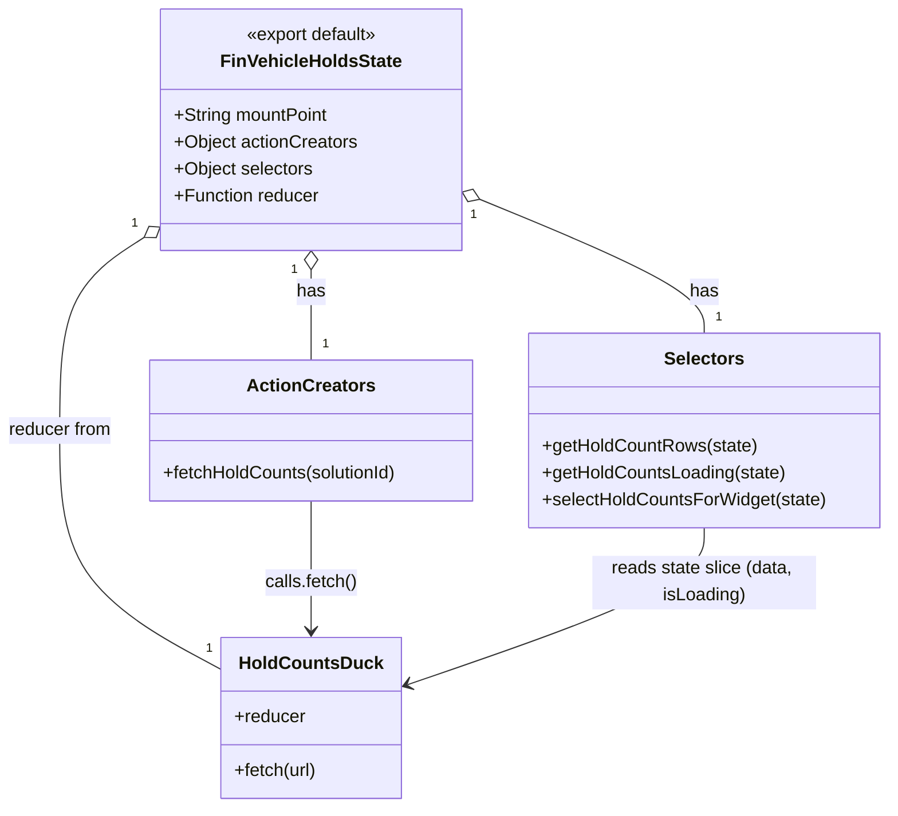

# Diagram: web/portal/src/pages/finishedvehicle/redux/FinVehicleHoldsState.js


> Auto-generated by Obscura crawlers

## Diagram 1

```mermaid
flowchart LR
  subgraph Constants
    STORE_MOUNT_POINT["STORE_MOUNT_POINT = \"fvHolds\""]
    HOLDS_URL_BASE["HOLDS_URL_BASE = apiUrl(\"/entity/\")"]
  end
  subgraph Ducks
    holdCountsDuck["holdCountsDuck\n(buildFetchDuck)"]
  end
  subgraph Actions
    fetchHoldCountsFunc["fetchHoldCounts(solutionId)"]
    dispatch["dispatch(...)"]
  end
  subgraph API
    constructedURL["holdsUrl = `${HOLDS_URL_BASE}solution/${solutionId}/entity/hold/count?status=ACTIVE&lifeCycleState=Active,Delivered`"]
    apiUrlFn["apiUrl(...)"]
  end
  subgraph State
    stateNode["state"]
    storeSlice["state[STORE_MOUNT_POINT]\n{ data, isLoading }"]
  end
  subgraph Selectors
    getHoldCountRows["getHoldCountRows(state) -> data"]
    getHoldCountsLoading["getHoldCountsLoading(state) -> isLoading"]
    selectHoldCountsForWidget["selectHoldCountsForWidget(rows) -> mapped rows"]
  end

  apiUrlFn --> HOLDS_URL_BASE
  HOLDS_URL_BASE --> constructedURL
  fetchHoldCountsFunc --> constructedURL
  fetchHoldCountsFunc --> dispatch
  dispatch --> holdCountsDuck
  holdCountsDuck --> storeSlice
  STORE_MOUNT_POINT --> storeSlice
  stateNode --> storeSlice
  storeSlice --> getHoldCountRows
  storeSlice --> getHoldCountsLoading
  getHoldCountRows --> selectHoldCountsForWidget
```

> SVG rendering failed for this diagram.

## Diagram 2



### SVG

<svg id="container" width="798.4375" xmlns="http://www.w3.org/2000/svg" class="classDiagram" height="722" viewBox="0 0 798.4375 722" role="graphics-document document" aria-roledescription="class"><style>#container{font-family:"trebuchet ms",verdana,arial,sans-serif;font-size:16px;fill:#333;}@keyframes edge-animation-frame{from{stroke-dashoffset:0;}}@keyframes dash{to{stroke-dashoffset:0;}}#container .edge-animation-slow{stroke-dasharray:9,5!important;stroke-dashoffset:900;animation:dash 50s linear infinite;stroke-linecap:round;}#container .edge-animation-fast{stroke-dasharray:9,5!important;stroke-dashoffset:900;animation:dash 20s linear infinite;stroke-linecap:round;}#container .error-icon{fill:#552222;}#container .error-text{fill:#552222;stroke:#552222;}#container .edge-thickness-normal{stroke-width:1px;}#container .edge-thickness-thick{stroke-width:3.5px;}#container .edge-pattern-solid{stroke-dasharray:0;}#container .edge-thickness-invisible{stroke-width:0;fill:none;}#container .edge-pattern-dashed{stroke-dasharray:3;}#container .edge-pattern-dotted{stroke-dasharray:2;}#container .marker{fill:#333333;stroke:#333333;}#container .marker.cross{stroke:#333333;}#container svg{font-family:"trebuchet ms",verdana,arial,sans-serif;font-size:16px;}#container p{margin:0;}#container g.classGroup text{fill:#9370DB;stroke:none;font-family:"trebuchet ms",verdana,arial,sans-serif;font-size:10px;}#container g.classGroup text .title{font-weight:bolder;}#container .nodeLabel,#container .edgeLabel{color:#131300;}#container .edgeLabel .label rect{fill:#ECECFF;}#container .label text{fill:#131300;}#container .labelBkg{background:#ECECFF;}#container .edgeLabel .label span{background:#ECECFF;}#container .classTitle{font-weight:bolder;}#container .node rect,#container .node circle,#container .node ellipse,#container .node polygon,#container .node path{fill:#ECECFF;stroke:#9370DB;stroke-width:1px;}#container .divider{stroke:#9370DB;stroke-width:1;}#container g.clickable{cursor:pointer;}#container g.classGroup rect{fill:#ECECFF;stroke:#9370DB;}#container g.classGroup line{stroke:#9370DB;stroke-width:1;}#container .classLabel .box{stroke:none;stroke-width:0;fill:#ECECFF;opacity:0.5;}#container .classLabel .label{fill:#9370DB;font-size:10px;}#container .relation{stroke:#333333;stroke-width:1;fill:none;}#container .dashed-line{stroke-dasharray:3;}#container .dotted-line{stroke-dasharray:1 2;}#container #compositionStart,#container .composition{fill:#333333!important;stroke:#333333!important;stroke-width:1;}#container #compositionEnd,#container .composition{fill:#333333!important;stroke:#333333!important;stroke-width:1;}#container #dependencyStart,#container .dependency{fill:#333333!important;stroke:#333333!important;stroke-width:1;}#container #dependencyStart,#container .dependency{fill:#333333!important;stroke:#333333!important;stroke-width:1;}#container #extensionStart,#container .extension{fill:transparent!important;stroke:#333333!important;stroke-width:1;}#container #extensionEnd,#container .extension{fill:transparent!important;stroke:#333333!important;stroke-width:1;}#container #aggregationStart,#container .aggregation{fill:transparent!important;stroke:#333333!important;stroke-width:1;}#container #aggregationEnd,#container .aggregation{fill:transparent!important;stroke:#333333!important;stroke-width:1;}#container #lollipopStart,#container .lollipop{fill:#ECECFF!important;stroke:#333333!important;stroke-width:1;}#container #lollipopEnd,#container .lollipop{fill:#ECECFF!important;stroke:#333333!important;stroke-width:1;}#container .edgeTerminals{font-size:11px;line-height:initial;}#container .classTitleText{text-anchor:middle;font-size:18px;fill:#333;}#container .label-icon{display:inline-block;height:1em;overflow:visible;vertical-align:-0.125em;}#container .node .label-icon path{fill:currentColor;stroke:revert;stroke-width:revert;}#container :root{--mermaid-font-family:"trebuchet ms",verdana,arial,sans-serif;}</style><g><defs><marker id="container_class-aggregationStart" class="marker aggregation class" refX="18" refY="7" markerWidth="190" markerHeight="240" orient="auto"><path d="M 18,7 L9,13 L1,7 L9,1 Z"></path></marker></defs><defs><marker id="container_class-aggregationEnd" class="marker aggregation class" refX="1" refY="7" markerWidth="20" markerHeight="28" orient="auto"><path d="M 18,7 L9,13 L1,7 L9,1 Z"></path></marker></defs><defs><marker id="container_class-extensionStart" class="marker extension class" refX="18" refY="7" markerWidth="190" markerHeight="240" orient="auto"><path d="M 1,7 L18,13 V 1 Z"></path></marker></defs><defs><marker id="container_class-extensionEnd" class="marker extension class" refX="1" refY="7" markerWidth="20" markerHeight="28" orient="auto"><path d="M 1,1 V 13 L18,7 Z"></path></marker></defs><defs><marker id="container_class-compositionStart" class="marker composition class" refX="18" refY="7" markerWidth="190" markerHeight="240" orient="auto"><path d="M 18,7 L9,13 L1,7 L9,1 Z"></path></marker></defs><defs><marker id="container_class-compositionEnd" class="marker composition class" refX="1" refY="7" markerWidth="20" markerHeight="28" orient="auto"><path d="M 18,7 L9,13 L1,7 L9,1 Z"></path></marker></defs><defs><marker id="container_class-dependencyStart" class="marker dependency class" refX="6" refY="7" markerWidth="190" markerHeight="240" orient="auto"><path d="M 5,7 L9,13 L1,7 L9,1 Z"></path></marker></defs><defs><marker id="container_class-dependencyEnd" class="marker dependency class" refX="13" refY="7" markerWidth="20" markerHeight="28" orient="auto"><path d="M 18,7 L9,13 L14,7 L9,1 Z"></path></marker></defs><defs><marker id="container_class-lollipopStart" class="marker lollipop class" refX="13" refY="7" markerWidth="190" markerHeight="240" orient="auto"><circle stroke="black" fill="transparent" cx="7" cy="7" r="6"></circle></marker></defs><defs><marker id="container_class-lollipopEnd" class="marker lollipop class" refX="1" refY="7" markerWidth="190" markerHeight="240" orient="auto"><circle stroke="black" fill="transparent" cx="7" cy="7" r="6"></circle></marker></defs><g class="root"><g class="clusters"></g><g class="edgePaths"><path d="M282.375,241.25L282.375,244.542C282.375,247.833,282.375,254.417,282.375,267.875C282.375,281.333,282.375,301.667,282.375,311.833L282.375,322" id="id_FinVehicleHoldsState_ActionCreators_1" class="edge-thickness-normal edge-pattern-solid relation" style=";;;" data-edge="true" data-et="edge" data-id="id_FinVehicleHoldsState_ActionCreators_1" data-points="W3sieCI6MjgyLjM3NSwieSI6MjI0fSx7IngiOjI4Mi4zNzUsInkiOjI2MX0seyJ4IjoyODIuMzc1LCJ5IjozMjJ9XQ==" marker-start="url(#container_class-aggregationStart)"></path><path d="M431.249,177.364L465.067,191.303C498.885,205.243,566.521,233.121,600.338,253.227C634.156,273.333,634.156,285.667,634.156,291.833L634.156,298" id="id_FinVehicleHoldsState_Selectors_2" class="edge-thickness-normal edge-pattern-solid relation" style=";;;" data-edge="true" data-et="edge" data-id="id_FinVehicleHoldsState_Selectors_2" data-points="W3sieCI6NDE1LjMwMDc4MTI1LCJ5IjoxNzAuNzkwNDA4MTkwNDU5MjZ9LHsieCI6NjM0LjE1NjI1LCJ5IjoyNjF9LHsieCI6NjM0LjE1NjI1LCJ5IjoyOTh9XQ==" marker-start="url(#container_class-aggregationStart)"></path><path d="M134.904,210.018L121.576,218.515C108.248,227.012,81.593,244.006,68.265,273.17C54.938,302.333,54.938,343.667,54.938,387C54.938,430.333,54.938,475.667,79.576,511.441C104.215,547.216,153.492,573.433,178.131,586.541L202.77,599.649" id="id_FinVehicleHoldsState_HoldCountsDuck_3" class="edge-thickness-normal edge-pattern-solid relation" style=";;;" data-edge="true" data-et="edge" data-id="id_FinVehicleHoldsState_HoldCountsDuck_3" data-points="W3sieCI6MTQ5LjQ0OTIxODc1LCJ5IjoyMDAuNzQ1MjA4MTYxNTgyODd9LHsieCI6NTQuOTM3NSwieSI6MjYxfSx7IngiOjU0LjkzNzUsInkiOjM4NX0seyJ4Ijo1NC45Mzc1LCJ5Ijo1MjF9LHsieCI6MjAyLjc2OTUzMTI1LCJ5Ijo1OTkuNjQ4NzUzMDkxNTA4Nn1d" marker-start="url(#container_class-aggregationStart)"></path><path d="M282.375,448L282.375,460.167C282.375,472.333,282.375,496.667,282.375,516C282.375,535.333,282.375,549.667,282.375,556.833L282.375,564" id="id_ActionCreators_HoldCountsDuck_4" class="edge-thickness-normal edge-pattern-solid relation" style=";;;" data-edge="true" data-et="edge" data-id="id_ActionCreators_HoldCountsDuck_4" data-points="W3sieCI6MjgyLjM3NSwieSI6NDQ4fSx7IngiOjI4Mi4zNzUsInkiOjUyMX0seyJ4IjoyODIuMzc1LCJ5Ijo1NzB9XQ==" marker-end="url(#container_class-dependencyEnd)"></path><path d="M634.156,472L634.156,480.167C634.156,488.333,634.156,504.667,589.739,528.111C545.322,551.556,456.488,582.111,412.071,597.389L367.654,612.667" id="id_Selectors_HoldCountsDuck_5" class="edge-thickness-normal edge-pattern-solid relation" style=";;;" data-edge="true" data-et="edge" data-id="id_Selectors_HoldCountsDuck_5" data-points="W3sieCI6NjM0LjE1NjI1LCJ5Ijo0NzJ9LHsieCI6NjM0LjE1NjI1LCJ5Ijo1MjF9LHsieCI6MzYxLjk4MDQ2ODc1LCJ5Ijo2MTQuNjE4NjAzOTc5NzQ1OX1d" marker-end="url(#container_class-dependencyEnd)"></path></g><g class="edgeLabels"><g class="edgeLabel" transform="translate(282.375, 261)"><g class="label" data-id="id_FinVehicleHoldsState_ActionCreators_1" transform="translate(-12.703125, -12)"><foreignObject width="25.40625" height="24"><div xmlns="http://www.w3.org/1999/xhtml" class="labelBkg" style="display: table-cell; white-space: nowrap; line-height: 1.5; max-width: 200px; text-align: center;"><span class="edgeLabel"><p>has</p></span></div></foreignObject></g></g><g class="edgeLabel" transform="translate(634.15625, 261)"><g class="label" data-id="id_FinVehicleHoldsState_Selectors_2" transform="translate(-12.703125, -12)"><foreignObject width="25.40625" height="24"><div xmlns="http://www.w3.org/1999/xhtml" class="labelBkg" style="display: table-cell; white-space: nowrap; line-height: 1.5; max-width: 200px; text-align: center;"><span class="edgeLabel"><p>has</p></span></div></foreignObject></g></g><g class="edgeLabel" transform="translate(54.9375, 385)"><g class="label" data-id="id_FinVehicleHoldsState_HoldCountsDuck_3" transform="translate(-46.9375, -12)"><foreignObject width="93.875" height="24"><div xmlns="http://www.w3.org/1999/xhtml" class="labelBkg" style="display: table-cell; white-space: nowrap; line-height: 1.5; max-width: 200px; text-align: center;"><span class="edgeLabel"><p>reducer from</p></span></div></foreignObject></g></g><g class="edgeLabel" transform="translate(282.375, 521)"><g class="label" data-id="id_ActionCreators_HoldCountsDuck_4" transform="translate(-41.6796875, -12)"><foreignObject width="83.359375" height="24"><div xmlns="http://www.w3.org/1999/xhtml" class="labelBkg" style="display: table-cell; white-space: nowrap; line-height: 1.5; max-width: 200px; text-align: center;"><span class="edgeLabel"><p>calls.fetch()</p></span></div></foreignObject></g></g><g class="edgeLabel" transform="translate(634.15625, 521)"><g class="label" data-id="id_Selectors_HoldCountsDuck_5" transform="translate(-100, -24)"><foreignObject width="200" height="48"><div xmlns="http://www.w3.org/1999/xhtml" class="labelBkg" style="display: table; white-space: break-spaces; line-height: 1.5; max-width: 200px; text-align: center; width: 200px;"><span class="edgeLabel"><p>reads state slice (data, isLoading)</p></span></div></foreignObject></g></g><g class="edgeTerminals" transform="translate(267.375, 241.5)"><g class="inner" transform="translate(0, 0)"><foreignObject style="width: 9px; height: 12px;"><div xmlns="http://www.w3.org/1999/xhtml" style="display: inline-block; padding-right: 1px; white-space: nowrap;"><span class="edgeLabel">1</span></div></foreignObject></g></g><g class="edgeTerminals" transform="translate(425.7639704096961, 191.32748821902055)"><g class="inner" transform="translate(0, 0)"><foreignObject style="width: 9px; height: 12px;"><div xmlns="http://www.w3.org/1999/xhtml" style="display: inline-block; padding-right: 1px; white-space: nowrap;"><span class="edgeLabel">1</span></div></foreignObject></g></g><g class="edgeTerminals" transform="translate(126.62929429306617, 197.50466786668414)"><g class="inner" transform="translate(0, 0)"><foreignObject style="width: 9px; height: 12px;"><div xmlns="http://www.w3.org/1999/xhtml" style="display: inline-block; padding-right: 1px; white-space: nowrap;"><span class="edgeLabel">1</span></div></foreignObject></g></g><g class="edgeTerminals" transform="translate(292.375, 299.5)"><g class="inner" transform="translate(0, 0)"></g><foreignObject style="width: 9px; height: 12px;"><div xmlns="http://www.w3.org/1999/xhtml" style="display: inline-block; padding-right: 1px; white-space: nowrap;"><span class="edgeLabel">1</span></div></foreignObject></g><g class="edgeTerminals" transform="translate(644.15625, 275.5)"><g class="inner" transform="translate(0, 0)"></g><foreignObject style="width: 9px; height: 12px;"><div xmlns="http://www.w3.org/1999/xhtml" style="display: inline-block; padding-right: 1px; white-space: nowrap;"><span class="edgeLabel">1</span></div></foreignObject></g><g class="edgeTerminals" transform="translate(189.36511935739347, 573.1867905126772)"><g class="inner" transform="translate(0, 0)"></g><foreignObject style="width: 9px; height: 12px;"><div xmlns="http://www.w3.org/1999/xhtml" style="display: inline-block; padding-right: 1px; white-space: nowrap;"><span class="edgeLabel">1</span></div></foreignObject></g></g><g class="nodes"><g class="node default" id="classId-FinVehicleHoldsState-0" transform="translate(282.375, 116)"><g class="basic label-container"><path d="M-132.92578125 -108 L132.92578125 -108 L132.92578125 108 L-132.92578125 108" stroke="none" stroke-width="0" fill="#ECECFF" style=""></path><path d="M-132.92578125 -108 C-65.51160153289472 -108, 1.9025781842105687 -108, 132.92578125 -108 M-132.92578125 -108 C-29.988728907675892 -108, 72.94832343464822 -108, 132.92578125 -108 M132.92578125 -108 C132.92578125 -34.222190776262536, 132.92578125 39.55561844747493, 132.92578125 108 M132.92578125 -108 C132.92578125 -50.45121802583633, 132.92578125 7.097563948327334, 132.92578125 108 M132.92578125 108 C27.3812470629545 108, -78.163287124091 108, -132.92578125 108 M132.92578125 108 C59.80308745014874 108, -13.319606349702525 108, -132.92578125 108 M-132.92578125 108 C-132.92578125 44.32177596905481, -132.92578125 -19.356448061890376, -132.92578125 -108 M-132.92578125 108 C-132.92578125 58.29265274798455, -132.92578125 8.585305495969095, -132.92578125 -108" stroke="#9370DB" stroke-width="1.3" fill="none" stroke-dasharray="0 0" style=""></path></g><g class="annotation-group text" transform="translate(-60.546875, -84)"><g class="label" style="" transform="translate(0,-12)"><foreignObject width="121.09375" height="24"><div xmlns="http://www.w3.org/1999/xhtml" style="display: table-cell; white-space: nowrap; line-height: 1.5; max-width: 171px; text-align: center;"><span class="nodeLabel markdown-node-label" style=""><p>«export default»</p></span></div></foreignObject></g></g><g class="label-group text" transform="translate(-77.0859375, -60)"><g class="label" style="font-weight: bolder" transform="translate(0,-12)"><foreignObject width="154.171875" height="24"><div xmlns="http://www.w3.org/1999/xhtml" style="display: table-cell; white-space: nowrap; line-height: 1.5; max-width: 202px; text-align: center;"><span class="nodeLabel markdown-node-label" style=""><p>FinVehicleHoldsState</p></span></div></foreignObject></g></g><g class="members-group text" transform="translate(-120.92578125, -12)"><g class="label" style="" transform="translate(0,-12)"><foreignObject width="139.8125" height="24"><div xmlns="http://www.w3.org/1999/xhtml" style="display: table-cell; white-space: nowrap; line-height: 1.5; max-width: 197px; text-align: center;"><span class="nodeLabel markdown-node-label" style=""><p>+String mountPoint</p></span></div></foreignObject></g><g class="label" style="" transform="translate(0,12)"><foreignObject width="164.765625" height="24"><div xmlns="http://www.w3.org/1999/xhtml" style="display: table-cell; white-space: nowrap; line-height: 1.5; max-width: 222px; text-align: center;"><span class="nodeLabel markdown-node-label" style=""><p>+Object actionCreators</p></span></div></foreignObject></g><g class="label" style="" transform="translate(0,36)"><foreignObject width="124.890625" height="24"><div xmlns="http://www.w3.org/1999/xhtml" style="display: table-cell; white-space: nowrap; line-height: 1.5; max-width: 182px; text-align: center;"><span class="nodeLabel markdown-node-label" style=""><p>+Object selectors</p></span></div></foreignObject></g><g class="label" style="" transform="translate(0,60)"><foreignObject width="130.359375" height="24"><div xmlns="http://www.w3.org/1999/xhtml" style="display: table-cell; white-space: nowrap; line-height: 1.5; max-width: 189px; text-align: center;"><span class="nodeLabel markdown-node-label" style=""><p>+Function reducer</p></span></div></foreignObject></g></g><g class="methods-group text" transform="translate(-120.92578125, 108)"></g><g class="divider" style=""><path d="M-132.92578125 -36 C-68.85516955981812 -36, -4.784557869636245 -36, 132.92578125 -36 M-132.92578125 -36 C-71.56781278867876 -36, -10.209844327357544 -36, 132.92578125 -36" stroke="#9370DB" stroke-width="1.3" fill="none" stroke-dasharray="0 0" style=""></path></g><g class="divider" style=""><path d="M-132.92578125 84 C-31.638033067428367 84, 69.64971511514327 84, 132.92578125 84 M-132.92578125 84 C-67.12133859225469 84, -1.3168959345093754 84, 132.92578125 84" stroke="#9370DB" stroke-width="1.3" fill="none" stroke-dasharray="0 0" style=""></path></g></g><g class="node default" id="classId-ActionCreators-1" transform="translate(282.375, 385)"><g class="basic label-container"><path d="M-145.5 -63 L145.5 -63 L145.5 63 L-145.5 63" stroke="none" stroke-width="0" fill="#ECECFF" style=""></path><path d="M-145.5 -63 C-54.159130940838025 -63, 37.18173811832395 -63, 145.5 -63 M-145.5 -63 C-31.343792227577524 -63, 82.81241554484495 -63, 145.5 -63 M145.5 -63 C145.5 -24.726829636371136, 145.5 13.546340727257729, 145.5 63 M145.5 -63 C145.5 -15.58140709071651, 145.5 31.83718581856698, 145.5 63 M145.5 63 C32.71552771840575 63, -80.0689445631885 63, -145.5 63 M145.5 63 C63.60458490471855 63, -18.2908301905629 63, -145.5 63 M-145.5 63 C-145.5 21.140233906892988, -145.5 -20.719532186214025, -145.5 -63 M-145.5 63 C-145.5 37.16465542334673, -145.5 11.329310846693467, -145.5 -63" stroke="#9370DB" stroke-width="1.3" fill="none" stroke-dasharray="0 0" style=""></path></g><g class="annotation-group text" transform="translate(0, -39)"></g><g class="label-group text" transform="translate(-53.96875, -39)"><g class="label" style="font-weight: bolder" transform="translate(0,-12)"><foreignObject width="107.9375" height="24"><div xmlns="http://www.w3.org/1999/xhtml" style="display: table-cell; white-space: nowrap; line-height: 1.5; max-width: 156px; text-align: center;"><span class="nodeLabel markdown-node-label" style=""><p>ActionCreators</p></span></div></foreignObject></g></g><g class="members-group text" transform="translate(-133.5, 9)"></g><g class="methods-group text" transform="translate(-133.5, 39)"><g class="label" style="" transform="translate(0,-12)"><foreignObject width="213.03125" height="24"><div xmlns="http://www.w3.org/1999/xhtml" style="display: table-cell; white-space: nowrap; line-height: 1.5; max-width: 270px; text-align: center;"><span class="nodeLabel markdown-node-label" style=""><p>+fetchHoldCounts(solutionId)</p></span></div></foreignObject></g></g><g class="divider" style=""><path d="M-145.5 -15 C-45.68091410329954 -15, 54.138171793400915 -15, 145.5 -15 M-145.5 -15 C-56.70956364229265 -15, 32.0808727154147 -15, 145.5 -15" stroke="#9370DB" stroke-width="1.3" fill="none" stroke-dasharray="0 0" style=""></path></g><g class="divider" style=""><path d="M-145.5 9 C-33.14222800338544 9, 79.21554399322912 9, 145.5 9 M-145.5 9 C-44.45629470355546 9, 56.587410592889086 9, 145.5 9" stroke="#9370DB" stroke-width="1.3" fill="none" stroke-dasharray="0 0" style=""></path></g></g><g class="node default" id="classId-Selectors-2" transform="translate(634.15625, 385)"><g class="basic label-container"><path d="M-156.28125 -87 L156.28125 -87 L156.28125 87 L-156.28125 87" stroke="none" stroke-width="0" fill="#ECECFF" style=""></path><path d="M-156.28125 -87 C-59.87654439035215 -87, 36.5281612192957 -87, 156.28125 -87 M-156.28125 -87 C-48.99827170892878 -87, 58.284706582142434 -87, 156.28125 -87 M156.28125 -87 C156.28125 -19.466135837751096, 156.28125 48.06772832449781, 156.28125 87 M156.28125 -87 C156.28125 -48.568631695923614, 156.28125 -10.137263391847227, 156.28125 87 M156.28125 87 C76.64400482257717 87, -2.9932403548456534 87, -156.28125 87 M156.28125 87 C93.28147858361442 87, 30.281707167228817 87, -156.28125 87 M-156.28125 87 C-156.28125 47.58925990223453, -156.28125 8.178519804469062, -156.28125 -87 M-156.28125 87 C-156.28125 51.49258896240852, -156.28125 15.985177924817037, -156.28125 -87" stroke="#9370DB" stroke-width="1.3" fill="none" stroke-dasharray="0 0" style=""></path></g><g class="annotation-group text" transform="translate(0, -63)"></g><g class="label-group text" transform="translate(-34.171875, -63)"><g class="label" style="font-weight: bolder" transform="translate(0,-12)"><foreignObject width="68.34375" height="24"><div xmlns="http://www.w3.org/1999/xhtml" style="display: table-cell; white-space: nowrap; line-height: 1.5; max-width: 117px; text-align: center;"><span class="nodeLabel markdown-node-label" style=""><p>Selectors</p></span></div></foreignObject></g></g><g class="members-group text" transform="translate(-144.28125, -15)"></g><g class="methods-group text" transform="translate(-144.28125, 15)"><g class="label" style="" transform="translate(0,-12)"><foreignObject width="191.59375" height="24"><div xmlns="http://www.w3.org/1999/xhtml" style="display: table-cell; white-space: nowrap; line-height: 1.5; max-width: 249px; text-align: center;"><span class="nodeLabel markdown-node-label" style=""><p>+getHoldCountRows(state)</p></span></div></foreignObject></g><g class="label" style="" transform="translate(0,12)"><foreignObject width="218.5625" height="24"><div xmlns="http://www.w3.org/1999/xhtml" style="display: table-cell; white-space: nowrap; line-height: 1.5; max-width: 276px; text-align: center;"><span class="nodeLabel markdown-node-label" style=""><p>+getHoldCountsLoading(state)</p></span></div></foreignObject></g><g class="label" style="" transform="translate(0,36)"><foreignObject width="254.390625" height="24"><div xmlns="http://www.w3.org/1999/xhtml" style="display: table-cell; white-space: nowrap; line-height: 1.5; max-width: 312px; text-align: center;"><span class="nodeLabel markdown-node-label" style=""><p>+selectHoldCountsForWidget(state)</p></span></div></foreignObject></g></g><g class="divider" style=""><path d="M-156.28125 -39 C-86.93494136233136 -39, -17.588632724662716 -39, 156.28125 -39 M-156.28125 -39 C-82.28905172583546 -39, -8.296853451670927 -39, 156.28125 -39" stroke="#9370DB" stroke-width="1.3" fill="none" stroke-dasharray="0 0" style=""></path></g><g class="divider" style=""><path d="M-156.28125 -15 C-45.64920093206314 -15, 64.98284813587372 -15, 156.28125 -15 M-156.28125 -15 C-60.00484820701098 -15, 36.27155358597804 -15, 156.28125 -15" stroke="#9370DB" stroke-width="1.3" fill="none" stroke-dasharray="0 0" style=""></path></g></g><g class="node default" id="classId-HoldCountsDuck-3" transform="translate(282.375, 642)"><g class="basic label-container"><path d="M-79.60546875 -72 L79.60546875 -72 L79.60546875 72 L-79.60546875 72" stroke="none" stroke-width="0" fill="#ECECFF" style=""></path><path d="M-79.60546875 -72 C-24.697903671891325 -72, 30.20966140621735 -72, 79.60546875 -72 M-79.60546875 -72 C-22.254471740064496 -72, 35.09652526987101 -72, 79.60546875 -72 M79.60546875 -72 C79.60546875 -26.298937532561197, 79.60546875 19.402124934877605, 79.60546875 72 M79.60546875 -72 C79.60546875 -18.26970157070096, 79.60546875 35.46059685859808, 79.60546875 72 M79.60546875 72 C43.5943840800476 72, 7.583299410095194 72, -79.60546875 72 M79.60546875 72 C33.32458020395815 72, -12.956308342083702 72, -79.60546875 72 M-79.60546875 72 C-79.60546875 22.676816134364834, -79.60546875 -26.64636773127033, -79.60546875 -72 M-79.60546875 72 C-79.60546875 34.091040102960505, -79.60546875 -3.817919794078989, -79.60546875 -72" stroke="#9370DB" stroke-width="1.3" fill="none" stroke-dasharray="0 0" style=""></path></g><g class="annotation-group text" transform="translate(0, -48)"></g><g class="label-group text" transform="translate(-60.4296875, -48)"><g class="label" style="font-weight: bolder" transform="translate(0,-12)"><foreignObject width="120.859375" height="24"><div xmlns="http://www.w3.org/1999/xhtml" style="display: table-cell; white-space: nowrap; line-height: 1.5; max-width: 171px; text-align: center;"><span class="nodeLabel markdown-node-label" style=""><p>HoldCountsDuck</p></span></div></foreignObject></g></g><g class="members-group text" transform="translate(-67.60546875, 0)"><g class="label" style="" transform="translate(0,-12)"><foreignObject width="63.515625" height="24"><div xmlns="http://www.w3.org/1999/xhtml" style="display: table-cell; white-space: nowrap; line-height: 1.5; max-width: 122px; text-align: center;"><span class="nodeLabel markdown-node-label" style=""><p>+reducer</p></span></div></foreignObject></g></g><g class="methods-group text" transform="translate(-67.60546875, 48)"><g class="label" style="" transform="translate(0,-12)"><foreignObject width="74.78125" height="24"><div xmlns="http://www.w3.org/1999/xhtml" style="display: table-cell; white-space: nowrap; line-height: 1.5; max-width: 132px; text-align: center;"><span class="nodeLabel markdown-node-label" style=""><p>+fetch(url)</p></span></div></foreignObject></g></g><g class="divider" style=""><path d="M-79.60546875 -24 C-33.309609426867944 -24, 12.986249896264113 -24, 79.60546875 -24 M-79.60546875 -24 C-26.43504987339763 -24, 26.735369003204738 -24, 79.60546875 -24" stroke="#9370DB" stroke-width="1.3" fill="none" stroke-dasharray="0 0" style=""></path></g><g class="divider" style=""><path d="M-79.60546875 24 C-25.200233500568316 24, 29.205001748863367 24, 79.60546875 24 M-79.60546875 24 C-45.708448888853745 24, -11.81142902770749 24, 79.60546875 24" stroke="#9370DB" stroke-width="1.3" fill="none" stroke-dasharray="0 0" style=""></path></g></g></g></g></g></svg>
