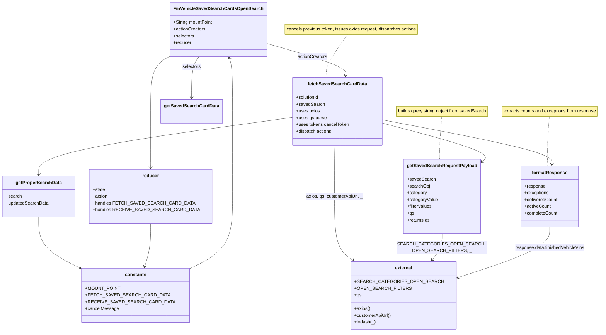

# Diagram: web/portal/src/pages/finishedvehicle/redux/FinVehicleSavedSearchCardsStateOpenSearch.js

> Auto-generated by Obscura crawlers

## Mermaid

### SVG

<svg id="container" width="2087.021484375" xmlns="http://www.w3.org/2000/svg" class="classDiagram" height="1174" viewBox="0 0 2087.021484375 1174" role="graphics-document document" aria-roledescription="class"><g><defs><marker id="container_class-aggregationStart" class="marker aggregation class" refX="18" refY="7" markerWidth="190" markerHeight="240" orient="auto"><path d="M 18,7 L9,13 L1,7 L9,1 Z"></path></marker></defs><defs><marker id="container_class-aggregationEnd" class="marker aggregation class" refX="1" refY="7" markerWidth="20" markerHeight="28" orient="auto"><path d="M 18,7 L9,13 L1,7 L9,1 Z"></path></marker></defs><defs><marker id="container_class-extensionStart" class="marker extension class" refX="18" refY="7" markerWidth="190" markerHeight="240" orient="auto"><path d="M 1,7 L18,13 V 1 Z"></path></marker></defs><defs><marker id="container_class-extensionEnd" class="marker extension class" refX="1" refY="7" markerWidth="20" markerHeight="28" orient="auto"><path d="M 1,1 V 13 L18,7 Z"></path></marker></defs><defs><marker id="container_class-compositionStart" class="marker composition class" refX="18" refY="7" markerWidth="190" markerHeight="240" orient="auto"><path d="M 18,7 L9,13 L1,7 L9,1 Z"></path></marker></defs><defs><marker id="container_class-compositionEnd" class="marker composition class" refX="1" refY="7" markerWidth="20" markerHeight="28" orient="auto"><path d="M 18,7 L9,13 L1,7 L9,1 Z"></path></marker></defs><defs><marker id="container_class-dependencyStart" class="marker dependency class" refX="6" refY="7" markerWidth="190" markerHeight="240" orient="auto"><path d="M 5,7 L9,13 L1,7 L9,1 Z"></path></marker></defs><defs><marker id="container_class-dependencyEnd" class="marker dependency class" refX="13" refY="7" markerWidth="20" markerHeight="28" orient="auto"><path d="M 18,7 L9,13 L14,7 L9,1 Z"></path></marker></defs><defs><marker id="container_class-lollipopStart" class="marker lollipop class" refX="13" refY="7" markerWidth="190" markerHeight="240" orient="auto"><circle stroke="black" fill="transparent" cx="7" cy="7" r="6"></circle></marker></defs><defs><marker id="container_class-lollipopEnd" class="marker lollipop class" refX="1" refY="7" markerWidth="190" markerHeight="240" orient="auto"><circle stroke="black" fill="transparent" cx="7" cy="7" r="6"></circle></marker></defs><g class="root"><g class="clusters"></g><g class="edgePaths"><path d="M1905.061,412L1903.602,433.167C1902.142,454.333,1899.222,496.667,1898.283,526C1897.343,555.333,1898.383,571.667,1898.904,579.833L1899.424,588" id="edgeNote1" class="edge-thickness-normal edge-pattern-dotted relation" style="fill: none;;;fill: none" data-edge="true" data-et="edge" data-id="edgeNote1" data-points="W3sieCI6MTkwNS4wNjEzNTUwNjQ2NTUxLCJ5Ijo0MTJ9LHsieCI6MTg5Ni4zMDI3MzQzNzUsInkiOjUzOX0seyJ4IjoxODk5LjQyMzc1MzQ4MzI4MDMsInkiOjU4OH1d"></path><path d="M1516.53,412L1515.07,433.167C1513.611,454.333,1510.691,496.667,1509.497,522C1508.302,547.333,1508.833,555.667,1509.098,559.833L1509.364,564" id="edgeNote2" class="edge-thickness-normal edge-pattern-dotted relation" style="fill: none;;;fill: none" data-edge="true" data-et="edge" data-id="edgeNote2" data-points="W3sieCI6MTUxNi41MzAxMDUwNjQ2NTUxLCJ5Ijo0MTJ9LHsieCI6MTUwNy43NzE0ODQzNzUsInkiOjUzOX0seyJ4IjoxNTA5LjM2Mzg0MTA2Mjg5OCwieSI6NTY0fV0="></path><path d="M1183.384,122L1169.585,141.167C1155.786,160.333,1128.187,198.667,1116.207,224C1104.228,249.333,1107.868,261.667,1109.688,267.833L1111.508,274" id="edgeNote3" class="edge-thickness-normal edge-pattern-dotted relation" style="fill: none;;;fill: none" data-edge="true" data-et="edge" data-id="edgeNote3" data-points="W3sieCI6MTE4My4zODQzMTAzODUzMzgzLCJ5IjoxMjJ9LHsieCI6MTEwMC41ODc4OTA2MjUsInkiOjIzN30seyJ4IjoxMTExLjUwNzgyNDk0MDI4NjYsInkiOjI3NH1d"></path><path d="M578.061,194.698L565.61,201.748C553.16,208.799,528.26,222.899,515.81,256.116C503.359,289.333,503.359,341.667,503.359,392C503.359,442.333,503.359,490.667,503.359,524C503.359,557.333,503.359,575.667,503.359,584.833L503.359,594" id="id_FinVehicleSavedSearchCardsOpenSearch_reducer_1" class="edge-thickness-normal edge-pattern-solid relation" style=";;;" data-edge="true" data-et="edge" data-id="id_FinVehicleSavedSearchCardsOpenSearch_reducer_1" data-points="W3sieCI6NTc4LjA2MDU0Njg3NSwieSI6MTk0LjY5ODA1NjU2NTAxODJ9LHsieCI6NTAzLjM1OTM3NSwieSI6MjM3fSx7IngiOjUwMy4zNTkzNzUsInkiOjM5NH0seyJ4Ijo1MDMuMzU5Mzc1LCJ5Ijo1Mzl9LHsieCI6NTAzLjM1OTM3NSwieSI6NjAwfV0=" marker-end="url(#container_class-dependencyEnd)"></path><path d="M898.389,151.865L945.867,166.055C993.346,180.244,1088.303,208.622,1134.58,228.003C1180.856,247.385,1178.453,257.77,1177.251,262.962L1176.049,268.155" id="id_FinVehicleSavedSearchCardsOpenSearch_fetchSavedSearchCardData_2" class="edge-thickness-normal edge-pattern-solid relation" style=";;;" data-edge="true" data-et="edge" data-id="id_FinVehicleSavedSearchCardsOpenSearch_fetchSavedSearchCardData_2" data-points="W3sieCI6ODk4LjM4ODY3MTg3NSwieSI6MTUxLjg2NTQ3NzYyMjAyNzc1fSx7IngiOjExODMuMjU5NzY1NjI1LCJ5IjoyMzd9LHsieCI6MTE3NC42OTY1MTkyMDc4MDI2LCJ5IjoyNzR9XQ==" marker-end="url(#container_class-dependencyEnd)"></path><path d="M669.108,200L664.668,206.167C660.228,212.333,651.348,224.667,646.909,249C642.469,273.333,642.469,309.667,642.469,327.833L642.469,346" id="id_FinVehicleSavedSearchCardsOpenSearch_getSavedSearchCardData_3" class="edge-thickness-normal edge-pattern-solid relation" style=";;;" data-edge="true" data-et="edge" data-id="id_FinVehicleSavedSearchCardsOpenSearch_getSavedSearchCardData_3" data-points="W3sieCI6NjY5LjEwNzU5ODA5NjgwNDUsInkiOjIwMH0seyJ4Ijo2NDIuNDY4NzUsInkiOjIzN30seyJ4Ijo2NDIuNDY4NzUsInkiOjM1Mn1d" marker-end="url(#container_class-dependencyEnd)"></path><path d="M1301.959,434.496L1368.639,451.914C1435.318,469.331,1568.678,504.165,1626.979,528.721C1685.281,553.277,1668.525,567.554,1660.146,574.692L1651.768,581.831" id="id_fetchSavedSearchCardData_getSavedSearchRequestPayload_4" class="edge-thickness-normal edge-pattern-solid relation" style=";;;" data-edge="true" data-et="edge" data-id="id_fetchSavedSearchCardData_getSavedSearchRequestPayload_4" data-points="W3sieCI6MTMwMS45NTg5ODQzNzUsInkiOjQzNC40OTY0MTQ3MjM5MDkxfSx7IngiOjE3MDIuMDM3MTA5Mzc1LCJ5Ijo1Mzl9LHsieCI6MTY0Ny4yMDExNzE4NzUsInkiOjU4NS43MjE5MTEzMDMzMTU2fV0=" marker-end="url(#container_class-dependencyEnd)"></path><path d="M991.889,416.203L848.978,436.669C706.068,457.135,420.247,498.068,277.336,531.7C134.426,565.333,134.426,591.667,134.426,604.833L134.426,618" id="id_fetchSavedSearchCardData_getProperSearchData_5" class="edge-thickness-normal edge-pattern-solid relation" style=";;;" data-edge="true" data-et="edge" data-id="id_fetchSavedSearchCardData_getProperSearchData_5" data-points="W3sieCI6OTkxLjg4ODY3MTg3NSwieSI6NDE2LjIwMjYwODQxNTUyNTV9LHsieCI6MTM0LjQyNTc4MTI1LCJ5Ijo1Mzl9LHsieCI6MTM0LjQyNTc4MTI1LCJ5Ijo2MjR9XQ==" marker-end="url(#container_class-dependencyEnd)"></path><path d="M1301.959,423.219L1404.35,442.515C1506.74,461.812,1711.521,500.406,1813.456,526.872C1915.39,553.337,1914.476,567.675,1914.02,574.843L1913.563,582.012" id="id_fetchSavedSearchCardData_formatResponse_6" class="edge-thickness-normal edge-pattern-solid relation" style=";;;" data-edge="true" data-et="edge" data-id="id_fetchSavedSearchCardData_formatResponse_6" data-points="W3sieCI6MTMwMS45NTg5ODQzNzUsInkiOjQyMy4yMTg1MDAxMDkxNTg2NH0seyJ4IjoxOTE2LjMwMjczNDM3NSwieSI6NTM5fSx7IngiOjE5MTMuMTgxNzE1MjY2NzE5NywieSI6NTg4fV0=" marker-end="url(#container_class-dependencyEnd)"></path><path d="M1138.648,514L1138.361,518.167C1138.073,522.333,1137.499,530.667,1137.211,561C1136.924,591.333,1136.924,643.667,1136.924,700C1136.924,756.333,1136.924,816.667,1150.019,855.872C1163.115,895.078,1189.306,913.156,1202.402,922.195L1215.498,931.234" id="id_fetchSavedSearchCardData_external_7" class="edge-thickness-normal edge-pattern-solid relation" style=";;;" data-edge="true" data-et="edge" data-id="id_fetchSavedSearchCardData_external_7" data-points="W3sieCI6MTEzOC42NDc5NjYwNTYwMzQ0LCJ5Ijo1MTR9LHsieCI6MTEzNi45MjM4MjgxMjUsInkiOjUzOX0seyJ4IjoxMTM2LjkyMzgyODEyNSwieSI6Njk2fSx7IngiOjExMzYuOTIzODI4MTI1LCJ5Ijo4Nzd9LHsieCI6MTIyMC40MzU1NDY4NzUsInkiOjkzNC42NDI4MDQ3MjIzOTk0fV0=" marker-end="url(#container_class-dependencyEnd)"></path><path d="M1517.771,828L1517.771,836.167C1517.771,844.333,1517.771,860.667,1511.826,876.221C1505.881,891.775,1493.991,906.55,1488.045,913.938L1482.1,921.326" id="id_getSavedSearchRequestPayload_external_8" class="edge-thickness-normal edge-pattern-solid relation" style=";;;" data-edge="true" data-et="edge" data-id="id_getSavedSearchRequestPayload_external_8" data-points="W3sieCI6MTUxNy43NzE0ODQzNzUsInkiOjgyOH0seyJ4IjoxNTE3Ljc3MTQ4NDM3NSwieSI6ODc3fSx7IngiOjE0NzguMzM4Mzk5MTMwOTE3MiwieSI6OTI2fV0=" marker-end="url(#container_class-dependencyEnd)"></path><path d="M134.426,768L134.426,786.167C134.426,804.333,134.426,840.667,159.913,872.145C185.401,903.624,236.376,930.248,261.864,943.559L287.352,956.871" id="id_getProperSearchData_constants_9" class="edge-thickness-normal edge-pattern-solid relation" style=";;;" data-edge="true" data-et="edge" data-id="id_getProperSearchData_constants_9" data-points="W3sieCI6MTM0LjQyNTc4MTI1LCJ5Ijo3Njh9LHsieCI6MTM0LjQyNTc4MTI1LCJ5Ijo4Nzd9LHsieCI6MjkyLjY2OTkyMTg3NSwieSI6OTU5LjY0OTAzOTM2MTE0MzR9XQ==" marker-end="url(#container_class-dependencyEnd)"></path><path d="M1906.303,804L1906.303,816.167C1906.303,828.333,1906.303,852.667,1846.721,884.03C1787.139,915.393,1667.975,953.787,1608.393,972.984L1548.811,992.18" id="id_formatResponse_external_10" class="edge-thickness-normal edge-pattern-solid relation" style=";;;" data-edge="true" data-et="edge" data-id="id_formatResponse_external_10" data-points="W3sieCI6MTkwNi4zMDI3MzQzNzUsInkiOjgwNH0seyJ4IjoxOTA2LjMwMjczNDM3NSwieSI6ODc3fSx7IngiOjE1NDMuMDk5NjA5Mzc1LCJ5Ijo5OTQuMDIwNDI3MzEyODczN31d" marker-end="url(#container_class-dependencyEnd)"></path><path d="M503.359,792L503.359,806.167C503.359,820.333,503.359,848.667,500.353,874.034C497.347,899.402,491.335,921.803,488.329,933.004L485.322,944.205" id="id_reducer_constants_11" class="edge-thickness-normal edge-pattern-solid relation" style=";;;" data-edge="true" data-et="edge" data-id="id_reducer_constants_11" data-points="W3sieCI6NTAzLjM1OTM3NSwieSI6NzkyfSx7IngiOjUwMy4zNTkzNzUsInkiOjg3N30seyJ4Ijo0ODMuNzY3MTE1ODQ2ODkzNSwieSI6OTUwfV0=" marker-end="url(#container_class-dependencyEnd)"></path><path d="M623.334,959.649L649.708,945.874C676.082,932.099,728.83,904.55,755.204,860.608C781.578,816.667,781.578,756.333,781.578,700C781.578,643.667,781.578,591.333,781.578,541C781.578,490.667,781.578,442.333,781.578,392C781.578,341.667,781.578,289.333,779.878,257.951C778.178,226.568,774.777,216.136,773.077,210.92L771.377,205.705" id="id_constants_FinVehicleSavedSearchCardsOpenSearch_12" class="edge-thickness-normal edge-pattern-solid relation" style=";;;" data-edge="true" data-et="edge" data-id="id_constants_FinVehicleSavedSearchCardsOpenSearch_12" data-points="W3sieCI6NjIzLjMzMzk4NDM3NSwieSI6OTU5LjY0OTAzOTM2MTE0MzR9LHsieCI6NzgxLjU3ODEyNSwieSI6ODc3fSx7IngiOjc4MS41NzgxMjUsInkiOjY5Nn0seyJ4Ijo3ODEuNTc4MTI1LCJ5Ijo1Mzl9LHsieCI6NzgxLjU3ODEyNSwieSI6Mzk0fSx7IngiOjc4MS41NzgxMjUsInkiOjIzN30seyJ4Ijo3NjkuNTE3MzcyNTMyODk0NywieSI6MjAwfV0=" marker-end="url(#container_class-dependencyEnd)"></path></g><g class="edgeLabels"><g class="edgeLabel"><g class="label" data-id="edgeNote1" transform="translate(0, 0)"><foreignObject width="0" height="0">

</foreignObject></g></g><g class="edgeLabel"><g class="label" data-id="edgeNote2" transform="translate(0, 0)"><foreignObject width="0" height="0">

</foreignObject></g></g><g class="edgeLabel"><g class="label" data-id="edgeNote3" transform="translate(0, 0)"><foreignObject width="0" height="0">

</foreignObject></g></g><g class="edgeLabel"><g class="label" data-id="id_FinVehicleSavedSearchCardsOpenSearch_reducer_1" transform="translate(0, 0)"><foreignObject width="0" height="0">

</foreignObject></g></g><g class="edgeLabel" transform="translate(1059.01812, 199.87004)"><g class="label" data-id="id_FinVehicleSavedSearchCardsOpenSearch_fetchSavedSearchCardData_2" transform="translate(-52.671875, -12)"><foreignObject width="105.34375" height="24">

actionCreators

</foreignObject></g></g><g class="edgeLabel" transform="translate(642.46875, 237)"><g class="label" data-id="id_FinVehicleSavedSearchCardsOpenSearch_getSavedSearchCardData_3" transform="translate(-32.734375, -12)"><foreignObject width="65.46875" height="24">

selectors

</foreignObject></g></g><g class="edgeLabel"><g class="label" data-id="id_fetchSavedSearchCardData_getSavedSearchRequestPayload_4" transform="translate(0, 0)"><foreignObject width="0" height="0">

</foreignObject></g></g><g class="edgeLabel"><g class="label" data-id="id_fetchSavedSearchCardData_getProperSearchData_5" transform="translate(0, 0)"><foreignObject width="0" height="0">

</foreignObject></g></g><g class="edgeLabel"><g class="label" data-id="id_fetchSavedSearchCardData_formatResponse_6" transform="translate(0, 0)"><foreignObject width="0" height="0">

</foreignObject></g></g><g class="edgeLabel" transform="translate(1136.923828125, 696)"><g class="label" data-id="id_fetchSavedSearchCardData_external_7" transform="translate(-99.9296875, -12)"><foreignObject width="199.859375" height="24">

axios, qs, customerApiUrl, _

</foreignObject></g></g><g class="edgeLabel" transform="translate(1517.771484375, 877)"><g class="label" data-id="id_getSavedSearchRequestPayload_external_8" transform="translate(-134.5625, -24)"><foreignObject width="269.125" height="48">

SEARCH_CATEGORIES_OPEN_SEARCH, OPEN_SEARCH_FILTERS, _

</foreignObject></g></g><g class="edgeLabel"><g class="label" data-id="id_getProperSearchData_constants_9" transform="translate(0, 0)"><foreignObject width="0" height="0">

</foreignObject></g></g><g class="edgeLabel" transform="translate(1906.302734375, 877)"><g class="label" data-id="id_formatResponse_external_10" transform="translate(-123.3203125, -12)"><foreignObject width="246.640625" height="24">

response.data.finishedVehicleVins

</foreignObject></g></g><g class="edgeLabel"><g class="label" data-id="id_reducer_constants_11" transform="translate(0, 0)"><foreignObject width="0" height="0">

</foreignObject></g></g><g class="edgeLabel"><g class="label" data-id="id_constants_FinVehicleSavedSearchCardsOpenSearch_12" transform="translate(0, 0)"><foreignObject width="0" height="0">

</foreignObject></g></g></g><g class="nodes"><g class="node default" id="classId-FinVehicleSavedSearchCardsOpenSearch-0" transform="translate(738.224609375, 104)"><g class="basic label-container"><path d="M-160.1640625 -96 L160.1640625 -96 L160.1640625 96 L-160.1640625 96" stroke="none" stroke-width="0" fill="#ECECFF" style=""></path><path d="M-160.1640625 -96 C-59.60935156581067 -96, 40.94535936837866 -96, 160.1640625 -96 M-160.1640625 -96 C-55.14228425400593 -96, 49.87949399198814 -96, 160.1640625 -96 M160.1640625 -96 C160.1640625 -49.934402388273334, 160.1640625 -3.8688047765466678, 160.1640625 96 M160.1640625 -96 C160.1640625 -20.824900479222435, 160.1640625 54.35019904155513, 160.1640625 96 M160.1640625 96 C60.063718997789266 96, -40.03662450442147 96, -160.1640625 96 M160.1640625 96 C58.13894660205405 96, -43.886169295891904 96, -160.1640625 96 M-160.1640625 96 C-160.1640625 32.89170032249615, -160.1640625 -30.216599355007702, -160.1640625 -96 M-160.1640625 96 C-160.1640625 32.68140907374011, -160.1640625 -30.637181852519774, -160.1640625 -96" stroke="#9370DB" stroke-width="1.3" fill="none" stroke-dasharray="0 0" style=""></path></g><g class="annotation-group text" transform="translate(0, -72)"></g><g class="label-group text" transform="translate(-148.1640625, -72)"><g class="label" style="font-weight: bolder" transform="translate(0,-12)"><foreignObject width="296.328125" height="24">

FinVehicleSavedSearchCardsOpenSearch

</foreignObject></g></g><g class="members-group text" transform="translate(-148.1640625, -24)"><g class="label" style="" transform="translate(0,-12)"><foreignObject width="139.8125" height="24">

+String mountPoint

</foreignObject></g><g class="label" style="" transform="translate(0,12)"><foreignObject width="113.078125" height="24">

+actionCreators

</foreignObject></g><g class="label" style="" transform="translate(0,36)"><foreignObject width="73.453125" height="24">

+selectors

</foreignObject></g><g class="label" style="" transform="translate(0,60)"><foreignObject width="63.515625" height="24">

+reducer

</foreignObject></g></g><g class="methods-group text" transform="translate(-148.1640625, 96)"></g><g class="divider" style=""><path d="M-160.1640625 -48 C-69.27473768452646 -48, 21.614587130947086 -48, 160.1640625 -48 M-160.1640625 -48 C-39.20481481889017 -48, 81.75443286221966 -48, 160.1640625 -48" stroke="#9370DB" stroke-width="1.3" fill="none" stroke-dasharray="0 0" style=""></path></g><g class="divider" style=""><path d="M-160.1640625 72 C-45.85233753209205 72, 68.4593874358159 72, 160.1640625 72 M-160.1640625 72 C-94.62532409494348 72, -29.08658568988696 72, 160.1640625 72" stroke="#9370DB" stroke-width="1.3" fill="none" stroke-dasharray="0 0" style=""></path></g></g><g class="node default" id="classId-formatResponse-1" transform="translate(1906.302734375, 696)"><g class="basic label-container"><path d="M-101.37890625 -108 L101.37890625 -108 L101.37890625 108 L-101.37890625 108" stroke="none" stroke-width="0" fill="#ECECFF" style=""></path><path d="M-101.37890625 -108 C-30.92908635045933 -108, 39.52073354908134 -108, 101.37890625 -108 M-101.37890625 -108 C-27.280005606678614 -108, 46.81889503664277 -108, 101.37890625 -108 M101.37890625 -108 C101.37890625 -45.6713163046335, 101.37890625 16.657367390733, 101.37890625 108 M101.37890625 -108 C101.37890625 -62.99249348732737, 101.37890625 -17.984986974654745, 101.37890625 108 M101.37890625 108 C57.66014641807716 108, 13.941386586154323 108, -101.37890625 108 M101.37890625 108 C54.4798394920219 108, 7.580772734043805 108, -101.37890625 108 M-101.37890625 108 C-101.37890625 55.58646030421604, -101.37890625 3.1729206084320793, -101.37890625 -108 M-101.37890625 108 C-101.37890625 27.13352865040376, -101.37890625 -53.73294269919248, -101.37890625 -108" stroke="#9370DB" stroke-width="1.3" fill="none" stroke-dasharray="0 0" style=""></path></g><g class="annotation-group text" transform="translate(0, -84)"></g><g class="label-group text" transform="translate(-60.3203125, -84)"><g class="label" style="font-weight: bolder" transform="translate(0,-12)"><foreignObject width="120.640625" height="24">

formatResponse

</foreignObject></g></g><g class="members-group text" transform="translate(-89.37890625, -36)"><g class="label" style="" transform="translate(0,-12)"><foreignObject width="74.296875" height="24">

+response

</foreignObject></g><g class="label" style="" transform="translate(0,12)"><foreignObject width="86.21875" height="24">

+exceptions

</foreignObject></g><g class="label" style="" transform="translate(0,36)"><foreignObject width="118.4375" height="24">

+deliveredCount

</foreignObject></g><g class="label" style="" transform="translate(0,60)"><foreignObject width="93.375" height="24">

+activeCount

</foreignObject></g><g class="label" style="" transform="translate(0,84)"><foreignObject width="117.90625" height="24">

+completeCount

</foreignObject></g></g><g class="methods-group text" transform="translate(-89.37890625, 108)"></g><g class="divider" style=""><path d="M-101.37890625 -60 C-37.79996456941073 -60, 25.778977111178534 -60, 101.37890625 -60 M-101.37890625 -60 C-45.33317789113184 -60, 10.712550467736321 -60, 101.37890625 -60" stroke="#9370DB" stroke-width="1.3" fill="none" stroke-dasharray="0 0" style=""></path></g><g class="divider" style=""><path d="M-101.37890625 84 C-57.816435025759766 84, -14.253963801519532 84, 101.37890625 84 M-101.37890625 84 C-29.469357236281027 84, 42.440191777437946 84, 101.37890625 84" stroke="#9370DB" stroke-width="1.3" fill="none" stroke-dasharray="0 0" style=""></path></g></g><g class="node default" id="classId-getSavedSearchRequestPayload-2" transform="translate(1517.771484375, 696)"><g class="basic label-container"><path d="M-129.4296875 -132 L129.4296875 -132 L129.4296875 132 L-129.4296875 132" stroke="none" stroke-width="0" fill="#ECECFF" style=""></path><path d="M-129.4296875 -132 C-45.58577865410419 -132, 38.25813019179162 -132, 129.4296875 -132 M-129.4296875 -132 C-31.533424479997564 -132, 66.36283854000487 -132, 129.4296875 -132 M129.4296875 -132 C129.4296875 -68.23621786438738, 129.4296875 -4.472435728774784, 129.4296875 132 M129.4296875 -132 C129.4296875 -50.841026758323295, 129.4296875 30.31794648335341, 129.4296875 132 M129.4296875 132 C39.0179742170273 132, -51.3937390659454 132, -129.4296875 132 M129.4296875 132 C53.87559829025449 132, -21.678490919491026 132, -129.4296875 132 M-129.4296875 132 C-129.4296875 58.14721787002904, -129.4296875 -15.705564259941923, -129.4296875 -132 M-129.4296875 132 C-129.4296875 57.72777229562948, -129.4296875 -16.544455408741044, -129.4296875 -132" stroke="#9370DB" stroke-width="1.3" fill="none" stroke-dasharray="0 0" style=""></path></g><g class="annotation-group text" transform="translate(0, -108)"></g><g class="label-group text" transform="translate(-117.4296875, -108)"><g class="label" style="font-weight: bolder" transform="translate(0,-12)"><foreignObject width="234.859375" height="24">

getSavedSearchRequestPayload

</foreignObject></g></g><g class="members-group text" transform="translate(-117.4296875, -60)"><g class="label" style="" transform="translate(0,-12)"><foreignObject width="98.5625" height="24">

+savedSearch

</foreignObject></g><g class="label" style="" transform="translate(0,12)"><foreignObject width="80.5" height="24">

+searchObj

</foreignObject></g><g class="label" style="" transform="translate(0,36)"><foreignObject width="69.890625" height="24">

+category

</foreignObject></g><g class="label" style="" transform="translate(0,60)"><foreignObject width="109.421875" height="24">

+categoryValue

</foreignObject></g><g class="label" style="" transform="translate(0,84)"><foreignObject width="89.0625" height="24">

+filterValues

</foreignObject></g><g class="label" style="" transform="translate(0,108)"><foreignObject width="25.03125" height="24">

+qs

</foreignObject></g><g class="label" style="" transform="translate(0,132)"><foreignObject width="81.796875" height="24">

+returns qs

</foreignObject></g></g><g class="methods-group text" transform="translate(-117.4296875, 132)"></g><g class="divider" style=""><path d="M-129.4296875 -84 C-71.31837907784583 -84, -13.207070655691666 -84, 129.4296875 -84 M-129.4296875 -84 C-32.738475065228826 -84, 63.95273736954235 -84, 129.4296875 -84" stroke="#9370DB" stroke-width="1.3" fill="none" stroke-dasharray="0 0" style=""></path></g><g class="divider" style=""><path d="M-129.4296875 108 C-34.45870136517341 108, 60.51228476965318 108, 129.4296875 108 M-129.4296875 108 C-52.997035384547345 108, 23.43561673090531 108, 129.4296875 108" stroke="#9370DB" stroke-width="1.3" fill="none" stroke-dasharray="0 0" style=""></path></g></g><g class="node default" id="classId-getProperSearchData-3" transform="translate(134.42578125, 696)"><g class="basic label-container"><path d="M-126.42578125 -72 L126.42578125 -72 L126.42578125 72 L-126.42578125 72" stroke="none" stroke-width="0" fill="#ECECFF" style=""></path><path d="M-126.42578125 -72 C-36.27852037513527 -72, 53.868740499729455 -72, 126.42578125 -72 M-126.42578125 -72 C-30.565460034865552 -72, 65.2948611802689 -72, 126.42578125 -72 M126.42578125 -72 C126.42578125 -42.88650493779462, 126.42578125 -13.773009875589239, 126.42578125 72 M126.42578125 -72 C126.42578125 -17.765150218125967, 126.42578125 36.469699563748065, 126.42578125 72 M126.42578125 72 C58.0112013560325 72, -10.403378537934998 72, -126.42578125 72 M126.42578125 72 C33.26181812667342 72, -59.90214499665316 72, -126.42578125 72 M-126.42578125 72 C-126.42578125 38.613001531952946, -126.42578125 5.2260030639058925, -126.42578125 -72 M-126.42578125 72 C-126.42578125 23.801913480644792, -126.42578125 -24.396173038710415, -126.42578125 -72" stroke="#9370DB" stroke-width="1.3" fill="none" stroke-dasharray="0 0" style=""></path></g><g class="annotation-group text" transform="translate(0, -48)"></g><g class="label-group text" transform="translate(-78.0234375, -48)"><g class="label" style="font-weight: bolder" transform="translate(0,-12)"><foreignObject width="156.046875" height="24">

getProperSearchData

</foreignObject></g></g><g class="members-group text" transform="translate(-114.42578125, 0)"><g class="label" style="" transform="translate(0,-12)"><foreignObject width="55.453125" height="24">

+search

</foreignObject></g><g class="label" style="" transform="translate(0,12)"><foreignObject width="150.828125" height="24">

+updatedSearchData

</foreignObject></g></g><g class="methods-group text" transform="translate(-114.42578125, 72)"></g><g class="divider" style=""><path d="M-126.42578125 -24 C-69.58670276594603 -24, -12.747624281892044 -24, 126.42578125 -24 M-126.42578125 -24 C-69.9248013086605 -24, -13.423821367321011 -24, 126.42578125 -24" stroke="#9370DB" stroke-width="1.3" fill="none" stroke-dasharray="0 0" style=""></path></g><g class="divider" style=""><path d="M-126.42578125 48 C-67.78704539060976 48, -9.148309531219539 48, 126.42578125 48 M-126.42578125 48 C-75.59524657068206 48, -24.764711891364115 48, 126.42578125 48" stroke="#9370DB" stroke-width="1.3" fill="none" stroke-dasharray="0 0" style=""></path></g></g><g class="node default" id="classId-fetchSavedSearchCardData-4" transform="translate(1146.923828125, 394)"><g class="basic label-container"><path d="M-155.03515625 -120 L155.03515625 -120 L155.03515625 120 L-155.03515625 120" stroke="none" stroke-width="0" fill="#ECECFF" style=""></path><path d="M-155.03515625 -120 C-65.04424795718013 -120, 24.946660335639734 -120, 155.03515625 -120 M-155.03515625 -120 C-41.24735015130062 -120, 72.54045594739875 -120, 155.03515625 -120 M155.03515625 -120 C155.03515625 -63.179637272063424, 155.03515625 -6.359274544126848, 155.03515625 120 M155.03515625 -120 C155.03515625 -46.3812216615526, 155.03515625 27.237556676894798, 155.03515625 120 M155.03515625 120 C54.332860588459724 120, -46.36943507308055 120, -155.03515625 120 M155.03515625 120 C62.99875557391147 120, -29.037645102177066 120, -155.03515625 120 M-155.03515625 120 C-155.03515625 63.026410341501794, -155.03515625 6.052820683003588, -155.03515625 -120 M-155.03515625 120 C-155.03515625 49.601976327899465, -155.03515625 -20.79604734420107, -155.03515625 -120" stroke="#9370DB" stroke-width="1.3" fill="none" stroke-dasharray="0 0" style=""></path></g><g class="annotation-group text" transform="translate(0, -96)"></g><g class="label-group text" transform="translate(-98.9453125, -96)"><g class="label" style="font-weight: bolder" transform="translate(0,-12)"><foreignObject width="197.890625" height="24">

fetchSavedSearchCardData

</foreignObject></g></g><g class="members-group text" transform="translate(-143.03515625, -48)"><g class="label" style="" transform="translate(0,-12)"><foreignObject width="82.109375" height="24">

+solutionId

</foreignObject></g><g class="label" style="" transform="translate(0,12)"><foreignObject width="98.5625" height="24">

+savedSearch

</foreignObject></g><g class="label" style="" transform="translate(0,36)"><foreignObject width="83" height="24">

+uses axios

</foreignObject></g><g class="label" style="" transform="translate(0,60)"><foreignObject width="106.265625" height="24">

+uses qs.parse

</foreignObject></g><g class="label" style="" transform="translate(0,84)"><foreignObject width="187.125" height="24">

+uses tokens cancelToken

</foreignObject></g><g class="label" style="" transform="translate(0,108)"><foreignObject width="127.21875" height="24">

+dispatch actions

</foreignObject></g></g><g class="methods-group text" transform="translate(-143.03515625, 120)"></g><g class="divider" style=""><path d="M-155.03515625 -72 C-79.2977219965994 -72, -3.5602877431988134 -72, 155.03515625 -72 M-155.03515625 -72 C-92.25698711450246 -72, -29.47881797900493 -72, 155.03515625 -72" stroke="#9370DB" stroke-width="1.3" fill="none" stroke-dasharray="0 0" style=""></path></g><g class="divider" style=""><path d="M-155.03515625 96 C-38.85967380395681 96, 77.31580864208638 96, 155.03515625 96 M-155.03515625 96 C-44.659617319985244 96, 65.71592161002951 96, 155.03515625 96" stroke="#9370DB" stroke-width="1.3" fill="none" stroke-dasharray="0 0" style=""></path></g></g><g class="node default" id="classId-reducer-5" transform="translate(503.359375, 696)"><g class="basic label-container"><path d="M-192.5078125 -96 L192.5078125 -96 L192.5078125 96 L-192.5078125 96" stroke="none" stroke-width="0" fill="#ECECFF" style=""></path><path d="M-192.5078125 -96 C-85.19741298820571 -96, 22.112986523588575 -96, 192.5078125 -96 M-192.5078125 -96 C-59.789341436871325 -96, 72.92912962625735 -96, 192.5078125 -96 M192.5078125 -96 C192.5078125 -40.56763058691014, 192.5078125 14.864738826179718, 192.5078125 96 M192.5078125 -96 C192.5078125 -46.446926969877325, 192.5078125 3.106146060245351, 192.5078125 96 M192.5078125 96 C94.6608341673803 96, -3.186144165239398 96, -192.5078125 96 M192.5078125 96 C112.71659530980115 96, 32.9253781196023 96, -192.5078125 96 M-192.5078125 96 C-192.5078125 46.74818259605674, -192.5078125 -2.503634807886513, -192.5078125 -96 M-192.5078125 96 C-192.5078125 51.728708173686556, -192.5078125 7.457416347373112, -192.5078125 -96" stroke="#9370DB" stroke-width="1.3" fill="none" stroke-dasharray="0 0" style=""></path></g><g class="annotation-group text" transform="translate(0, -72)"></g><g class="label-group text" transform="translate(-28.0625, -72)"><g class="label" style="font-weight: bolder" transform="translate(0,-12)"><foreignObject width="56.125" height="24">

reducer

</foreignObject></g></g><g class="members-group text" transform="translate(-180.5078125, -24)"><g class="label" style="" transform="translate(0,-12)"><foreignObject width="44.09375" height="24">

+state

</foreignObject></g><g class="label" style="" transform="translate(0,12)"><foreignObject width="53.109375" height="24">

+action

</foreignObject></g><g class="label" style="" transform="translate(0,36)"><foreignObject width="319.171875" height="24">

+handles FETCH_SAVED_SEARCH_CARD_DATA

</foreignObject></g><g class="label" style="" transform="translate(0,60)"><foreignObject width="332.953125" height="24">

+handles RECEIVE_SAVED_SEARCH_CARD_DATA

</foreignObject></g></g><g class="methods-group text" transform="translate(-180.5078125, 96)"></g><g class="divider" style=""><path d="M-192.5078125 -48 C-75.67110113341106 -48, 41.16561023317789 -48, 192.5078125 -48 M-192.5078125 -48 C-89.85948484814 -48, 12.788842803720001 -48, 192.5078125 -48" stroke="#9370DB" stroke-width="1.3" fill="none" stroke-dasharray="0 0" style=""></path></g><g class="divider" style=""><path d="M-192.5078125 72 C-72.3498363004967 72, 47.80813989900659 72, 192.5078125 72 M-192.5078125 72 C-49.38724962718905 72, 93.7333132456219 72, 192.5078125 72" stroke="#9370DB" stroke-width="1.3" fill="none" stroke-dasharray="0 0" style=""></path></g></g><g class="node default" id="classId-constants-6" transform="translate(458.001953125, 1046)"><g class="basic label-container"><path d="M-165.33203125 -96 L165.33203125 -96 L165.33203125 96 L-165.33203125 96" stroke="none" stroke-width="0" fill="#ECECFF" style=""></path><path d="M-165.33203125 -96 C-58.06107489241077 -96, 49.209881465178455 -96, 165.33203125 -96 M-165.33203125 -96 C-79.86717180015297 -96, 5.597687649694052 -96, 165.33203125 -96 M165.33203125 -96 C165.33203125 -30.047495548787765, 165.33203125 35.90500890242447, 165.33203125 96 M165.33203125 -96 C165.33203125 -38.37972445064396, 165.33203125 19.240551098712075, 165.33203125 96 M165.33203125 96 C93.93338920022138 96, 22.53474715044277 96, -165.33203125 96 M165.33203125 96 C70.53764996422021 96, -24.256731321559585 96, -165.33203125 96 M-165.33203125 96 C-165.33203125 21.941572408359434, -165.33203125 -52.11685518328113, -165.33203125 -96 M-165.33203125 96 C-165.33203125 24.857874277851977, -165.33203125 -46.284251444296046, -165.33203125 -96" stroke="#9370DB" stroke-width="1.3" fill="none" stroke-dasharray="0 0" style=""></path></g><g class="annotation-group text" transform="translate(0, -72)"></g><g class="label-group text" transform="translate(-35.7734375, -72)"><g class="label" style="font-weight: bolder" transform="translate(0,-12)"><foreignObject width="71.546875" height="24">

constants

</foreignObject></g></g><g class="members-group text" transform="translate(-153.33203125, -24)"><g class="label" style="" transform="translate(0,-12)"><foreignObject width="112.953125" height="24">

+MOUNT_POINT

</foreignObject></g><g class="label" style="" transform="translate(0,12)"><foreignObject width="257.109375" height="24">

+FETCH_SAVED_SEARCH_CARD_DATA

</foreignObject></g><g class="label" style="" transform="translate(0,36)"><foreignObject width="270.890625" height="24">

+RECEIVE_SAVED_SEARCH_CARD_DATA

</foreignObject></g><g class="label" style="" transform="translate(0,60)"><foreignObject width="115.421875" height="24">

+cancelMessage

</foreignObject></g></g><g class="methods-group text" transform="translate(-153.33203125, 96)"></g><g class="divider" style=""><path d="M-165.33203125 -48 C-66.23213808550585 -48, 32.867755078988296 -48, 165.33203125 -48 M-165.33203125 -48 C-50.76400825353943 -48, 63.80401474292114 -48, 165.33203125 -48" stroke="#9370DB" stroke-width="1.3" fill="none" stroke-dasharray="0 0" style=""></path></g><g class="divider" style=""><path d="M-165.33203125 72 C-35.80106602528093 72, 93.72989919943814 72, 165.33203125 72 M-165.33203125 72 C-85.2011008071109 72, -5.070170364221809 72, 165.33203125 72" stroke="#9370DB" stroke-width="1.3" fill="none" stroke-dasharray="0 0" style=""></path></g></g><g class="node default" id="classId-external-7" transform="translate(1381.767578125, 1046)"><g class="basic label-container"><path d="M-161.33203125 -120 L161.33203125 -120 L161.33203125 120 L-161.33203125 120" stroke="none" stroke-width="0" fill="#ECECFF" style=""></path><path d="M-161.33203125 -120 C-74.64642929355819 -120, 12.03917266288363 -120, 161.33203125 -120 M-161.33203125 -120 C-54.43315366628295 -120, 52.465723917434104 -120, 161.33203125 -120 M161.33203125 -120 C161.33203125 -39.890616860272985, 161.33203125 40.21876627945403, 161.33203125 120 M161.33203125 -120 C161.33203125 -45.25263748760102, 161.33203125 29.494725024797958, 161.33203125 120 M161.33203125 120 C90.58699452225919 120, 19.84195779451838 120, -161.33203125 120 M161.33203125 120 C42.53475144757503 120, -76.26252835484993 120, -161.33203125 120 M-161.33203125 120 C-161.33203125 66.16115518940728, -161.33203125 12.322310378814564, -161.33203125 -120 M-161.33203125 120 C-161.33203125 61.57187004560655, -161.33203125 3.143740091213104, -161.33203125 -120" stroke="#9370DB" stroke-width="1.3" fill="none" stroke-dasharray="0 0" style=""></path></g><g class="annotation-group text" transform="translate(0, -96)"></g><g class="label-group text" transform="translate(-30.2734375, -96)"><g class="label" style="font-weight: bolder" transform="translate(0,-12)"><foreignObject width="60.546875" height="24">

external

</foreignObject></g></g><g class="members-group text" transform="translate(-149.33203125, -48)"><g class="label" style="" transform="translate(0,-12)"><foreignObject width="268.390625" height="24">

+SEARCH_CATEGORIES_OPEN_SEARCH

</foreignObject></g><g class="label" style="" transform="translate(0,12)"><foreignObject width="174.328125" height="24">

+OPEN_SEARCH_FILTERS

</foreignObject></g><g class="label" style="" transform="translate(0,36)"><foreignObject width="25.03125" height="24">

+qs

</foreignObject></g></g><g class="methods-group text" transform="translate(-149.33203125, 48)"><g class="label" style="" transform="translate(0,-12)"><foreignObject width="55.90625" height="24">

+axios()

</foreignObject></g><g class="label" style="" transform="translate(0,12)"><foreignObject width="130.765625" height="24">

+customerApiUrl()

</foreignObject></g><g class="label" style="" transform="translate(0,36)"><foreignObject width="75.875" height="24">

+lodash(_)

</foreignObject></g></g><g class="divider" style=""><path d="M-161.33203125 -72 C-45.94152977959395 -72, 69.4489716908121 -72, 161.33203125 -72 M-161.33203125 -72 C-38.89123277579915 -72, 83.5495656984017 -72, 161.33203125 -72" stroke="#9370DB" stroke-width="1.3" fill="none" stroke-dasharray="0 0" style=""></path></g><g class="divider" style=""><path d="M-161.33203125 24 C-61.562688851833755 24, 38.20665354633249 24, 161.33203125 24 M-161.33203125 24 C-46.83690589567321 24, 67.65821945865358 24, 161.33203125 24" stroke="#9370DB" stroke-width="1.3" fill="none" stroke-dasharray="0 0" style=""></path></g></g><g class="node default" id="classId-getSavedSearchCardData-8" transform="translate(642.46875, 394)"><g class="basic label-container"><path d="M-104.109375 -42 L104.109375 -42 L104.109375 42 L-104.109375 42" stroke="none" stroke-width="0" fill="#ECECFF" style=""></path><path d="M-104.109375 -42 C-22.29356879634544 -42, 59.52223740730912 -42, 104.109375 -42 M-104.109375 -42 C-21.483647175982497 -42, 61.142080648035005 -42, 104.109375 -42 M104.109375 -42 C104.109375 -22.89123638756891, 104.109375 -3.782472775137819, 104.109375 42 M104.109375 -42 C104.109375 -10.301262234053599, 104.109375 21.397475531892802, 104.109375 42 M104.109375 42 C27.735645195883293 42, -48.63808460823341 42, -104.109375 42 M104.109375 42 C46.36007921663159 42, -11.38921656673682 42, -104.109375 42 M-104.109375 42 C-104.109375 12.435791458266095, -104.109375 -17.12841708346781, -104.109375 -42 M-104.109375 42 C-104.109375 8.844554316041943, -104.109375 -24.310891367916113, -104.109375 -42" stroke="#9370DB" stroke-width="1.3" fill="none" stroke-dasharray="0 0" style=""></path></g><g class="annotation-group text" transform="translate(0, -18)"></g><g class="label-group text" transform="translate(-92.109375, -18)"><g class="label" style="font-weight: bolder" transform="translate(0,-12)"><foreignObject width="184.21875" height="24">

getSavedSearchCardData

</foreignObject></g></g><g class="members-group text" transform="translate(-92.109375, 30)"></g><g class="methods-group text" transform="translate(-92.109375, 60)"></g><g class="divider" style=""><path d="M-104.109375 6 C-42.85631552320731 6, 18.396743953585386 6, 104.109375 6 M-104.109375 6 C-43.86532812515758 6, 16.378718749684836 6, 104.109375 6" stroke="#9370DB" stroke-width="1.3" fill="none" stroke-dasharray="0 0" style=""></path></g><g class="divider" style=""><path d="M-104.109375 24 C-40.27636789803348 24, 23.556639203933045 24, 104.109375 24 M-104.109375 24 C-57.6546673779327 24, -11.199959755865393 24, 104.109375 24" stroke="#9370DB" stroke-width="1.3" fill="none" stroke-dasharray="0 0" style=""></path></g></g><g class="node undefined" id="note0" transform="translate(1906.302734375, 394)"><g class="basic label-container"><path d="M-172.71875 -18 L172.71875 -18 L172.71875 18 L-172.71875 18" stroke="none" stroke-width="0" fill="#fff5ad" style="fill:#fff5ad !important;stroke:#aaaa33 !important"></path><path d="M-172.71875 -18 C-68.33640712008231 -18, 36.04593575983537 -18, 172.71875 -18 M-172.71875 -18 C-49.67530225761247 -18, 73.36814548477506 -18, 172.71875 -18 M172.71875 -18 C172.71875 -8.682194210582512, 172.71875 0.6356115788349754, 172.71875 18 M172.71875 -18 C172.71875 -7.301387341344414, 172.71875 3.3972253173111717, 172.71875 18 M172.71875 18 C59.48891282367005 18, -53.7409243526599 18, -172.71875 18 M172.71875 18 C51.06166223433756 18, -70.59542553132488 18, -172.71875 18 M-172.71875 18 C-172.71875 6.768143042905962, -172.71875 -4.463713914188077, -172.71875 -18 M-172.71875 18 C-172.71875 6.460234677967886, -172.71875 -5.079530644064228, -172.71875 -18" stroke="#aaaa33" stroke-width="1.3" fill="none" stroke-dasharray="0 0" style="fill:#fff5ad !important;stroke:#aaaa33 !important"></path></g><g class="label" style="text-align:left !important;white-space:nowrap !important" transform="translate(-166.71875, -12)"><rect></rect><foreignObject width="333.4375" height="24">

extracts counts and exceptions from response

</foreignObject></g></g><g class="node undefined" id="note1" transform="translate(1517.771484375, 394)"><g class="basic label-container"><path d="M-165.8125 -18 L165.8125 -18 L165.8125 18 L-165.8125 18" stroke="none" stroke-width="0" fill="#fff5ad" style="fill:#fff5ad !important;stroke:#aaaa33 !important"></path><path d="M-165.8125 -18 C-34.3082360590912 -18, 97.1960278818176 -18, 165.8125 -18 M-165.8125 -18 C-94.28671325823726 -18, -22.760926516474512 -18, 165.8125 -18 M165.8125 -18 C165.8125 -4.60221416515175, 165.8125 8.7955716696965, 165.8125 18 M165.8125 -18 C165.8125 -4.454266930458594, 165.8125 9.091466139082812, 165.8125 18 M165.8125 18 C81.50447677775239 18, -2.8035464444952254 18, -165.8125 18 M165.8125 18 C74.42318311190989 18, -16.966133776180214 18, -165.8125 18 M-165.8125 18 C-165.8125 9.536693069108177, -165.8125 1.0733861382163532, -165.8125 -18 M-165.8125 18 C-165.8125 9.125960325098692, -165.8125 0.2519206501973841, -165.8125 -18" stroke="#aaaa33" stroke-width="1.3" fill="none" stroke-dasharray="0 0" style="fill:#fff5ad !important;stroke:#aaaa33 !important"></path></g><g class="label" style="text-align:left !important;white-space:nowrap !important" transform="translate(-159.8125, -12)"><rect></rect><foreignObject width="319.625" height="24">

builds query string object from savedSearch

</foreignObject></g></g><g class="node undefined" id="note2" transform="translate(1196.34375, 104)"><g class="basic label-container"><path d="M-237.8203125 -18 L237.8203125 -18 L237.8203125 18 L-237.8203125 18" stroke="none" stroke-width="0" fill="#fff5ad" style="fill:#fff5ad !important;stroke:#aaaa33 !important"></path><path d="M-237.8203125 -18 C-120.32651436519592 -18, -2.8327162303918385 -18, 237.8203125 -18 M-237.8203125 -18 C-122.18285753203969 -18, -6.545402564079382 -18, 237.8203125 -18 M237.8203125 -18 C237.8203125 -7.247233834355946, 237.8203125 3.5055323312881086, 237.8203125 18 M237.8203125 -18 C237.8203125 -4.28079350023355, 237.8203125 9.4384129995329, 237.8203125 18 M237.8203125 18 C74.49742164018306 18, -88.82546921963387 18, -237.8203125 18 M237.8203125 18 C71.83051245403982 18, -94.15928759192036 18, -237.8203125 18 M-237.8203125 18 C-237.8203125 9.86415766078643, -237.8203125 1.728315321572861, -237.8203125 -18 M-237.8203125 18 C-237.8203125 9.656049173095184, -237.8203125 1.3120983461903677, -237.8203125 -18" stroke="#aaaa33" stroke-width="1.3" fill="none" stroke-dasharray="0 0" style="fill:#fff5ad !important;stroke:#aaaa33 !important"></path></g><g class="label" style="text-align:left !important;white-space:nowrap !important" transform="translate(-231.8203125, -12)"><rect></rect><foreignObject width="463.640625" height="24">

cancels previous token, issues axios request, dispatches actions

</foreignObject></g></g></g></g></g></svg>
