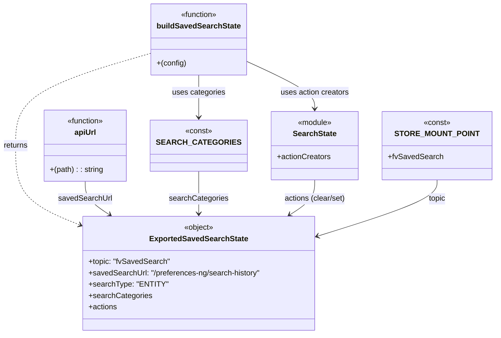

# Diagram: web/portal/src/pages/finishedvehicle/redux/FinVehicleSavedSearchState.js

> Auto-generated by Obscura crawlers

## Mermaid

### SVG

<svg id="container" width="1004.828125" xmlns="http://www.w3.org/2000/svg" class="classDiagram" height="704" viewBox="0 0 1004.828125 704" role="graphics-document document" aria-roledescription="class"><g><defs><marker id="container_class-aggregationStart" class="marker aggregation class" refX="18" refY="7" markerWidth="190" markerHeight="240" orient="auto"><path d="M 18,7 L9,13 L1,7 L9,1 Z"></path></marker></defs><defs><marker id="container_class-aggregationEnd" class="marker aggregation class" refX="1" refY="7" markerWidth="20" markerHeight="28" orient="auto"><path d="M 18,7 L9,13 L1,7 L9,1 Z"></path></marker></defs><defs><marker id="container_class-extensionStart" class="marker extension class" refX="18" refY="7" markerWidth="190" markerHeight="240" orient="auto"><path d="M 1,7 L18,13 V 1 Z"></path></marker></defs><defs><marker id="container_class-extensionEnd" class="marker extension class" refX="1" refY="7" markerWidth="20" markerHeight="28" orient="auto"><path d="M 1,1 V 13 L18,7 Z"></path></marker></defs><defs><marker id="container_class-compositionStart" class="marker composition class" refX="18" refY="7" markerWidth="190" markerHeight="240" orient="auto"><path d="M 18,7 L9,13 L1,7 L9,1 Z"></path></marker></defs><defs><marker id="container_class-compositionEnd" class="marker composition class" refX="1" refY="7" markerWidth="20" markerHeight="28" orient="auto"><path d="M 18,7 L9,13 L1,7 L9,1 Z"></path></marker></defs><defs><marker id="container_class-dependencyStart" class="marker dependency class" refX="6" refY="7" markerWidth="190" markerHeight="240" orient="auto"><path d="M 5,7 L9,13 L1,7 L9,1 Z"></path></marker></defs><defs><marker id="container_class-dependencyEnd" class="marker dependency class" refX="13" refY="7" markerWidth="20" markerHeight="28" orient="auto"><path d="M 18,7 L9,13 L14,7 L9,1 Z"></path></marker></defs><defs><marker id="container_class-lollipopStart" class="marker lollipop class" refX="13" refY="7" markerWidth="190" markerHeight="240" orient="auto"><circle stroke="black" fill="transparent" cx="7" cy="7" r="6"></circle></marker></defs><defs><marker id="container_class-lollipopEnd" class="marker lollipop class" refX="1" refY="7" markerWidth="190" markerHeight="240" orient="auto"><circle stroke="black" fill="transparent" cx="7" cy="7" r="6"></circle></marker></defs><g class="root"><g class="clusters"></g><g class="edgePaths"><path d="M313.859,111.819L267.26,125.682C220.661,139.546,127.464,167.273,80.865,199.803C34.266,232.333,34.266,269.667,34.266,307C34.266,344.333,34.266,381.667,55.113,409.028C75.96,436.388,117.655,453.777,138.502,462.471L159.349,471.165" id="id_buildSavedSearchState_ExportedSavedSearchState_1" class="edge-thickness-normal edge-pattern-dashed relation" style=";;;" data-edge="true" data-et="edge" data-id="id_buildSavedSearchState_ExportedSavedSearchState_1" data-points="W3sieCI6MzEzLjg1OTM3NSwieSI6MTExLjgxODcyNzA0MjU2MzM1fSx7IngiOjM0LjI2NTYyNSwieSI6MTk1fSx7IngiOjM0LjI2NTYyNSwieSI6MzA3fSx7IngiOjM0LjI2NTYyNSwieSI6NDE5fSx7IngiOjE2NC44ODY3MTg3NSwieSI6NDczLjQ3NDQ3NDQ0MzMxNDZ9XQ==" marker-end="url(#container_class-dependencyEnd)"></path><path d="M184.07,382L184.07,388.167C184.07,394.333,184.07,406.667,192.151,418.431C200.231,430.195,216.393,441.389,224.473,446.986L232.554,452.584" id="id_apiUrl_ExportedSavedSearchState_2" class="edge-thickness-normal edge-pattern-solid relation" style=";;;" data-edge="true" data-et="edge" data-id="id_apiUrl_ExportedSavedSearchState_2" data-points="W3sieCI6MTg0LjA3MDMxMjUsInkiOjM4Mn0seyJ4IjoxODQuMDcwMzEyNSwieSI6NDE5fSx7IngiOjIzNy40ODYxMTY2NDAxMjc0LCJ5Ijo0NTZ9XQ==" marker-end="url(#container_class-dependencyEnd)"></path><path d="M410.727,361L410.727,370.667C410.727,380.333,410.727,399.667,410.727,414.5C410.727,429.333,410.727,439.667,410.727,444.833L410.727,450" id="id_SEARCH_CATEGORIES_ExportedSavedSearchState_3" class="edge-thickness-normal edge-pattern-solid relation" style=";;;" data-edge="true" data-et="edge" data-id="id_SEARCH_CATEGORIES_ExportedSavedSearchState_3" data-points="W3sieCI6NDEwLjcyNjU2MjUsInkiOjM2MX0seyJ4Ijo0MTAuNzI2NTYyNSwieSI6NDE5fSx7IngiOjQxMC43MjY1NjI1LCJ5Ijo0NTZ9XQ==" marker-end="url(#container_class-dependencyEnd)"></path><path d="M639.398,379L639.398,385.667C639.398,392.333,639.398,405.667,631.241,417.934C623.084,430.201,606.769,441.403,598.611,447.003L590.454,452.604" id="id_SearchState_ExportedSavedSearchState_4" class="edge-thickness-normal edge-pattern-solid relation" style=";;;" data-edge="true" data-et="edge" data-id="id_SearchState_ExportedSavedSearchState_4" data-points="W3sieCI6NjM5LjM5ODQzNzUsInkiOjM3OX0seyJ4Ijo2MzkuMzk4NDM3NSwieSI6NDE5fSx7IngiOjU4NS41MDc2MTM0NTU0MTQsInkiOjQ1Nn1d" marker-end="url(#container_class-dependencyEnd)"></path><path d="M888.391,379L888.391,385.667C888.391,392.333,888.391,405.667,850.703,424.721C813.016,443.774,737.641,468.549,699.954,480.936L662.266,493.323" id="id_STORE_MOUNT_POINT_ExportedSavedSearchState_5" class="edge-thickness-normal edge-pattern-solid relation" style=";;;" data-edge="true" data-et="edge" data-id="id_STORE_MOUNT_POINT_ExportedSavedSearchState_5" data-points="W3sieCI6ODg4LjM5MDYyNSwieSI6Mzc5fSx7IngiOjg4OC4zOTA2MjUsInkiOjQxOX0seyJ4Ijo2NTYuNTY2NDA2MjUsInkiOjQ5NS4xOTY2NTIwMDExMTIxN31d" marker-end="url(#container_class-dependencyEnd)"></path><path d="M507.594,130.444L529.561,141.203C551.529,151.963,595.464,173.481,617.431,189.907C639.398,206.333,639.398,217.667,639.398,223.333L639.398,229" id="id_buildSavedSearchState_SearchState_6" class="edge-thickness-normal edge-pattern-solid relation" style=";;;" data-edge="true" data-et="edge" data-id="id_buildSavedSearchState_SearchState_6" data-points="W3sieCI6NTA3LjU5Mzc1LCJ5IjoxMzAuNDQ0MDcyNDI5MTA4M30seyJ4Ijo2MzkuMzk4NDM3NSwieSI6MTk1fSx7IngiOjYzOS4zOTg0Mzc1LCJ5IjoyMzV9XQ==" marker-end="url(#container_class-dependencyEnd)"></path><path d="M410.727,158L410.727,164.167C410.727,170.333,410.727,182.667,410.727,197.5C410.727,212.333,410.727,229.667,410.727,238.333L410.727,247" id="id_buildSavedSearchState_SEARCH_CATEGORIES_7" class="edge-thickness-normal edge-pattern-solid relation" style=";;;" data-edge="true" data-et="edge" data-id="id_buildSavedSearchState_SEARCH_CATEGORIES_7" data-points="W3sieCI6NDEwLjcyNjU2MjUsInkiOjE1OH0seyJ4Ijo0MTAuNzI2NTYyNSwieSI6MTk1fSx7IngiOjQxMC43MjY1NjI1LCJ5IjoyNTN9XQ==" marker-end="url(#container_class-dependencyEnd)"></path></g><g class="edgeLabels"><g class="edgeLabel" transform="translate(34.265625, 307)"><g class="label" data-id="id_buildSavedSearchState_ExportedSavedSearchState_1" transform="translate(-26.265625, -12)"><foreignObject width="52.53125" height="24">

returns

</foreignObject></g></g><g class="edgeLabel" transform="translate(184.0703125, 419)"><g class="label" data-id="id_apiUrl_ExportedSavedSearchState_2" transform="translate(-56.0234375, -12)"><foreignObject width="112.046875" height="24">

savedSearchUrl

</foreignObject></g></g><g class="edgeLabel" transform="translate(410.7265625, 419)"><g class="label" data-id="id_SEARCH_CATEGORIES_ExportedSavedSearchState_3" transform="translate(-61.7578125, -12)"><foreignObject width="123.515625" height="24">

searchCategories

</foreignObject></g></g><g class="edgeLabel" transform="translate(639.3984375, 419)"><g class="label" data-id="id_SearchState_ExportedSavedSearchState_4" transform="translate(-65.9921875, -12)"><foreignObject width="131.984375" height="24">

actions (clear/set)

</foreignObject></g></g><g class="edgeLabel" transform="translate(888.390625, 419)"><g class="label" data-id="id_STORE_MOUNT_POINT_ExportedSavedSearchState_5" transform="translate(-18.2734375, -12)"><foreignObject width="36.546875" height="24">

topic

</foreignObject></g></g><g class="edgeLabel" transform="translate(639.3984375, 195)"><g class="label" data-id="id_buildSavedSearchState_SearchState_6" transform="translate(-72.859375, -12)"><foreignObject width="145.71875" height="24">

uses action creators

</foreignObject></g></g><g class="edgeLabel" transform="translate(410.7265625, 195)"><g class="label" data-id="id_buildSavedSearchState_SEARCH_CATEGORIES_7" transform="translate(-55.9765625, -12)"><foreignObject width="111.953125" height="24">

uses categories

</foreignObject></g></g></g><g class="nodes"><g class="node default" id="classId-buildSavedSearchState-0" transform="translate(410.7265625, 83)"><g class="basic label-container"><path d="M-96.8671875 -75 L96.8671875 -75 L96.8671875 75 L-96.8671875 75" stroke="none" stroke-width="0" fill="#ECECFF" style=""></path><path d="M-96.8671875 -75 C-27.170421863214102 -75, 42.526343773571796 -75, 96.8671875 -75 M-96.8671875 -75 C-20.023221415025404 -75, 56.82074466994919 -75, 96.8671875 -75 M96.8671875 -75 C96.8671875 -17.213424685967915, 96.8671875 40.57315062806417, 96.8671875 75 M96.8671875 -75 C96.8671875 -15.772899645248842, 96.8671875 43.45420070950232, 96.8671875 75 M96.8671875 75 C48.77397039808955 75, 0.6807532961791054 75, -96.8671875 75 M96.8671875 75 C31.74310986313968 75, -33.38096777372064 75, -96.8671875 75 M-96.8671875 75 C-96.8671875 23.417467897189645, -96.8671875 -28.16506420562071, -96.8671875 -75 M-96.8671875 75 C-96.8671875 27.537100967455466, -96.8671875 -19.92579806508907, -96.8671875 -75" stroke="#9370DB" stroke-width="1.3" fill="none" stroke-dasharray="0 0" style=""></path></g><g class="annotation-group text" transform="translate(-39.484375, -51)"><g class="label" style="" transform="translate(0,-12)"><foreignObject width="78.96875" height="24">

«function»

</foreignObject></g></g><g class="label-group text" transform="translate(-84.8671875, -27)"><g class="label" style="font-weight: bolder" transform="translate(0,-12)"><foreignObject width="169.734375" height="24">

buildSavedSearchState

</foreignObject></g></g><g class="members-group text" transform="translate(-84.8671875, 21)"></g><g class="methods-group text" transform="translate(-84.8671875, 51)"><g class="label" style="" transform="translate(0,-12)"><foreignObject width="61.921875" height="24">

+(config)

</foreignObject></g></g><g class="divider" style=""><path d="M-96.8671875 -3 C-20.04504671586328 -3, 56.77709406827344 -3, 96.8671875 -3 M-96.8671875 -3 C-54.94998749432713 -3, -13.032787488654265 -3, 96.8671875 -3" stroke="#9370DB" stroke-width="1.3" fill="none" stroke-dasharray="0 0" style=""></path></g><g class="divider" style=""><path d="M-96.8671875 21 C-21.56523042017801 21, 53.73672665964398 21, 96.8671875 21 M-96.8671875 21 C-48.0025978827351 21, 0.8619917345297949 21, 96.8671875 21" stroke="#9370DB" stroke-width="1.3" fill="none" stroke-dasharray="0 0" style=""></path></g></g><g class="node default" id="classId-apiUrl-1" transform="translate(184.0703125, 307)"><g class="basic label-container"><path d="M-88.5390625 -75 L88.5390625 -75 L88.5390625 75 L-88.5390625 75" stroke="none" stroke-width="0" fill="#ECECFF" style=""></path><path d="M-88.5390625 -75 C-20.512478431304615 -75, 47.51410563739077 -75, 88.5390625 -75 M-88.5390625 -75 C-39.84381405778972 -75, 8.851434384420557 -75, 88.5390625 -75 M88.5390625 -75 C88.5390625 -35.39276014331851, 88.5390625 4.2144797133629766, 88.5390625 75 M88.5390625 -75 C88.5390625 -21.786136223132345, 88.5390625 31.42772755373531, 88.5390625 75 M88.5390625 75 C34.48590206667405 75, -19.5672583666519 75, -88.5390625 75 M88.5390625 75 C51.251441894426016 75, 13.963821288852031 75, -88.5390625 75 M-88.5390625 75 C-88.5390625 37.62460500172825, -88.5390625 0.24921000345649702, -88.5390625 -75 M-88.5390625 75 C-88.5390625 29.889551803456854, -88.5390625 -15.220896393086292, -88.5390625 -75" stroke="#9370DB" stroke-width="1.3" fill="none" stroke-dasharray="0 0" style=""></path></g><g class="annotation-group text" transform="translate(-39.484375, -51)"><g class="label" style="" transform="translate(0,-12)"><foreignObject width="78.96875" height="24">

«function»

</foreignObject></g></g><g class="label-group text" transform="translate(-22.2109375, -27)"><g class="label" style="font-weight: bolder" transform="translate(0,-12)"><foreignObject width="44.421875" height="24">

apiUrl

</foreignObject></g></g><g class="members-group text" transform="translate(-76.5390625, 21)"></g><g class="methods-group text" transform="translate(-76.5390625, 51)"><g class="label" style="" transform="translate(0,-12)"><foreignObject width="113.59375" height="24">

+(path) : : string

</foreignObject></g></g><g class="divider" style=""><path d="M-88.5390625 -3 C-18.003000203760124 -3, 52.53306209247975 -3, 88.5390625 -3 M-88.5390625 -3 C-27.83607047867892 -3, 32.86692154264216 -3, 88.5390625 -3" stroke="#9370DB" stroke-width="1.3" fill="none" stroke-dasharray="0 0" style=""></path></g><g class="divider" style=""><path d="M-88.5390625 21 C-25.061379591780316 21, 38.41630331643937 21, 88.5390625 21 M-88.5390625 21 C-35.636139205805 21, 17.266784088389997 21, 88.5390625 21" stroke="#9370DB" stroke-width="1.3" fill="none" stroke-dasharray="0 0" style=""></path></g></g><g class="node default" id="classId-SEARCH_CATEGORIES-2" transform="translate(410.7265625, 307)"><g class="basic label-container"><path d="M-88.1171875 -54 L88.1171875 -54 L88.1171875 54 L-88.1171875 54" stroke="none" stroke-width="0" fill="#ECECFF" style=""></path><path d="M-88.1171875 -54 C-17.777208645172834 -54, 52.56277020965433 -54, 88.1171875 -54 M-88.1171875 -54 C-32.686474505298456 -54, 22.744238489403088 -54, 88.1171875 -54 M88.1171875 -54 C88.1171875 -20.738237849698166, 88.1171875 12.523524300603668, 88.1171875 54 M88.1171875 -54 C88.1171875 -12.984695265939095, 88.1171875 28.03060946812181, 88.1171875 54 M88.1171875 54 C21.49215010113643 54, -45.13288729772714 54, -88.1171875 54 M88.1171875 54 C35.86241195203784 54, -16.392363595924323 54, -88.1171875 54 M-88.1171875 54 C-88.1171875 31.734367037837423, -88.1171875 9.468734075674845, -88.1171875 -54 M-88.1171875 54 C-88.1171875 29.620367468585364, -88.1171875 5.240734937170728, -88.1171875 -54" stroke="#9370DB" stroke-width="1.3" fill="none" stroke-dasharray="0 0" style=""></path></g><g class="annotation-group text" transform="translate(-28.6171875, -30)"><g class="label" style="" transform="translate(0,-12)"><foreignObject width="57.234375" height="24">

«const»

</foreignObject></g></g><g class="label-group text" transform="translate(-76.1171875, -6)"><g class="label" style="font-weight: bolder" transform="translate(0,-12)"><foreignObject width="152.234375" height="24">

SEARCH_CATEGORIES

</foreignObject></g></g><g class="members-group text" transform="translate(-76.1171875, 42)"></g><g class="methods-group text" transform="translate(-76.1171875, 72)"></g><g class="divider" style=""><path d="M-88.1171875 18 C-23.366813896650996 18, 41.38355970669801 18, 88.1171875 18 M-88.1171875 18 C-18.777573544757843 18, 50.562040410484315 18, 88.1171875 18" stroke="#9370DB" stroke-width="1.3" fill="none" stroke-dasharray="0 0" style=""></path></g><g class="divider" style=""><path d="M-88.1171875 36 C-48.55899232924999 36, -9.000797158499978 36, 88.1171875 36 M-88.1171875 36 C-33.82828522727736 36, 20.460617045445275 36, 88.1171875 36" stroke="#9370DB" stroke-width="1.3" fill="none" stroke-dasharray="0 0" style=""></path></g></g><g class="node default" id="classId-SearchState-3" transform="translate(639.3984375, 307)"><g class="basic label-container"><path d="M-90.5546875 -72 L90.5546875 -72 L90.5546875 72 L-90.5546875 72" stroke="none" stroke-width="0" fill="#ECECFF" style=""></path><path d="M-90.5546875 -72 C-40.90453360217239 -72, 8.745620295655215 -72, 90.5546875 -72 M-90.5546875 -72 C-42.353998317745756 -72, 5.8466908645084885 -72, 90.5546875 -72 M90.5546875 -72 C90.5546875 -20.045784861403305, 90.5546875 31.90843027719339, 90.5546875 72 M90.5546875 -72 C90.5546875 -28.546074754139028, 90.5546875 14.907850491721945, 90.5546875 72 M90.5546875 72 C47.28157998676617 72, 4.008472473532336 72, -90.5546875 72 M90.5546875 72 C31.099865333194508 72, -28.354956833610984 72, -90.5546875 72 M-90.5546875 72 C-90.5546875 34.346692877985774, -90.5546875 -3.3066142440284523, -90.5546875 -72 M-90.5546875 72 C-90.5546875 34.70875751928229, -90.5546875 -2.5824849614354264, -90.5546875 -72" stroke="#9370DB" stroke-width="1.3" fill="none" stroke-dasharray="0 0" style=""></path></g><g class="annotation-group text" transform="translate(-36.6015625, -48)"><g class="label" style="" transform="translate(0,-12)"><foreignObject width="73.203125" height="24">

«module»

</foreignObject></g></g><g class="label-group text" transform="translate(-44.03125, -24)"><g class="label" style="font-weight: bolder" transform="translate(0,-12)"><foreignObject width="88.0625" height="24">

SearchState

</foreignObject></g></g><g class="members-group text" transform="translate(-78.5546875, 24)"><g class="label" style="" transform="translate(0,-12)"><foreignObject width="113.078125" height="24">

+actionCreators

</foreignObject></g></g><g class="methods-group text" transform="translate(-78.5546875, 72)"></g><g class="divider" style=""><path d="M-90.5546875 0 C-21.87437979353463 0, 46.80592791293074 0, 90.5546875 0 M-90.5546875 0 C-22.405872310590766 0, 45.74294287881847 0, 90.5546875 0" stroke="#9370DB" stroke-width="1.3" fill="none" stroke-dasharray="0 0" style=""></path></g><g class="divider" style=""><path d="M-90.5546875 48 C-20.943661533617274 48, 48.66736443276545 48, 90.5546875 48 M-90.5546875 48 C-39.46785510468219 48, 11.618977290635627 48, 90.5546875 48" stroke="#9370DB" stroke-width="1.3" fill="none" stroke-dasharray="0 0" style=""></path></g></g><g class="node default" id="classId-STORE_MOUNT_POINT-4" transform="translate(888.390625, 307)"><g class="basic label-container"><path d="M-108.4375 -72 L108.4375 -72 L108.4375 72 L-108.4375 72" stroke="none" stroke-width="0" fill="#ECECFF" style=""></path><path d="M-108.4375 -72 C-61.51373801156711 -72, -14.589976023134227 -72, 108.4375 -72 M-108.4375 -72 C-39.22900573330314 -72, 29.97948853339372 -72, 108.4375 -72 M108.4375 -72 C108.4375 -17.575732653615702, 108.4375 36.848534692768595, 108.4375 72 M108.4375 -72 C108.4375 -14.809199028382409, 108.4375 42.38160194323518, 108.4375 72 M108.4375 72 C58.00580759204555 72, 7.574115184091099 72, -108.4375 72 M108.4375 72 C34.802034767519686 72, -38.83343046496063 72, -108.4375 72 M-108.4375 72 C-108.4375 25.51122638691649, -108.4375 -20.97754722616702, -108.4375 -72 M-108.4375 72 C-108.4375 31.64408240852027, -108.4375 -8.711835182959462, -108.4375 -72" stroke="#9370DB" stroke-width="1.3" fill="none" stroke-dasharray="0 0" style=""></path></g><g class="annotation-group text" transform="translate(-28.6171875, -48)"><g class="label" style="" transform="translate(0,-12)"><foreignObject width="57.234375" height="24">

«const»

</foreignObject></g></g><g class="label-group text" transform="translate(-79.90625, -24)"><g class="label" style="font-weight: bolder" transform="translate(0,-12)"><foreignObject width="159.8125" height="24">

STORE_MOUNT_POINT

</foreignObject></g></g><g class="members-group text" transform="translate(-96.4375, 24)"><g class="label" style="" transform="translate(0,-12)"><foreignObject width="112.96875" height="24">

+fvSavedSearch

</foreignObject></g></g><g class="methods-group text" transform="translate(-96.4375, 72)"></g><g class="divider" style=""><path d="M-108.4375 0 C-62.215284368111575 0, -15.993068736223151 0, 108.4375 0 M-108.4375 0 C-46.40046016886283 0, 15.636579662274343 0, 108.4375 0" stroke="#9370DB" stroke-width="1.3" fill="none" stroke-dasharray="0 0" style=""></path></g><g class="divider" style=""><path d="M-108.4375 48 C-38.288789334834306 48, 31.85992133033139 48, 108.4375 48 M-108.4375 48 C-34.49571194479891 48, 39.446076110402174 48, 108.4375 48" stroke="#9370DB" stroke-width="1.3" fill="none" stroke-dasharray="0 0" style=""></path></g></g><g class="node default" id="classId-ExportedSavedSearchState-5" transform="translate(410.7265625, 576)"><g class="basic label-container"><path d="M-245.83984375 -120 L245.83984375 -120 L245.83984375 120 L-245.83984375 120" stroke="none" stroke-width="0" fill="#ECECFF" style=""></path><path d="M-245.83984375 -120 C-116.59918663111458 -120, 12.641470487770846 -120, 245.83984375 -120 M-245.83984375 -120 C-119.34117218945352 -120, 7.1574993710929675 -120, 245.83984375 -120 M245.83984375 -120 C245.83984375 -46.233337903187774, 245.83984375 27.533324193624452, 245.83984375 120 M245.83984375 -120 C245.83984375 -67.85152523220168, 245.83984375 -15.703050464403361, 245.83984375 120 M245.83984375 120 C117.90400562555894 120, -10.031832498882125 120, -245.83984375 120 M245.83984375 120 C112.75164368719425 120, -20.336556375611508 120, -245.83984375 120 M-245.83984375 120 C-245.83984375 26.706991538422386, -245.83984375 -66.58601692315523, -245.83984375 -120 M-245.83984375 120 C-245.83984375 30.12804561719821, -245.83984375 -59.74390876560358, -245.83984375 -120" stroke="#9370DB" stroke-width="1.3" fill="none" stroke-dasharray="0 0" style=""></path></g><g class="annotation-group text" transform="translate(-31.7109375, -96)"><g class="label" style="" transform="translate(0,-12)"><foreignObject width="63.421875" height="24">

«object»

</foreignObject></g></g><g class="label-group text" transform="translate(-99.2421875, -72)"><g class="label" style="font-weight: bolder" transform="translate(0,-12)"><foreignObject width="198.484375" height="24">

ExportedSavedSearchState

</foreignObject></g></g><g class="members-group text" transform="translate(-233.83984375, -24)"><g class="label" style="" transform="translate(0,-12)"><foreignObject width="170.421875" height="24">

+topic: "fvSavedSearch"

</foreignObject></g><g class="label" style="" transform="translate(0,12)"><foreignObject width="368.4375" height="24">

+savedSearchUrl: "/preferences-ng/search-history"

</foreignObject></g><g class="label" style="" transform="translate(0,36)"><foreignObject width="159.734375" height="24">

+searchType: "ENTITY"

</foreignObject></g><g class="label" style="" transform="translate(0,60)"><foreignObject width="131.5" height="24">

+searchCategories

</foreignObject></g><g class="label" style="" transform="translate(0,84)"><foreignObject width="60.578125" height="24">

+actions

</foreignObject></g></g><g class="methods-group text" transform="translate(-233.83984375, 120)"></g><g class="divider" style=""><path d="M-245.83984375 -48 C-99.97452776852526 -48, 45.890788212949474 -48, 245.83984375 -48 M-245.83984375 -48 C-140.86163719936582 -48, -35.88343064873166 -48, 245.83984375 -48" stroke="#9370DB" stroke-width="1.3" fill="none" stroke-dasharray="0 0" style=""></path></g><g class="divider" style=""><path d="M-245.83984375 96 C-140.80835202672938 96, -35.77686030345879 96, 245.83984375 96 M-245.83984375 96 C-126.93750413643686 96, -8.035164522873714 96, 245.83984375 96" stroke="#9370DB" stroke-width="1.3" fill="none" stroke-dasharray="0 0" style=""></path></g></g></g></g></g></svg>
