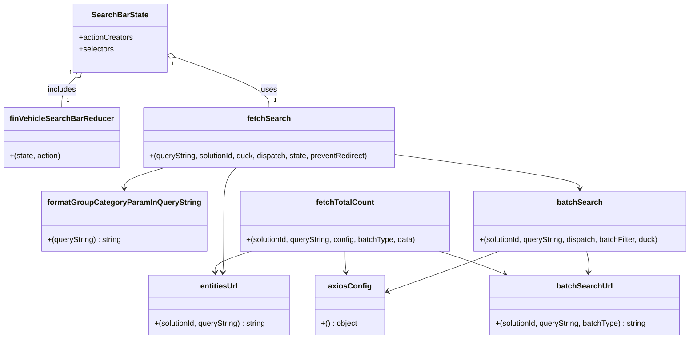

# Diagram: web/portal/src/pages/finishedvehicle/redux/FinVehicleSearchBarState.js


> Auto-generated by Obscura crawlers

## Diagram 1

```mermaid
flowchart LR
  A[fetchSearch(queryString, solutionId, duck, dispatch, state, preventRedirect)] -->|formatGroupCategoryParamInQueryString| B[queryString']
  B --> C{state.fvSearch.searchFilters.batch ?}
  C -- true --> D[batchSearch(solutionId, queryString', dispatch, batchFilter, duck)]
  C -- false --> E[Normal search]
  E --> E1[entitiesUrl(solutionId, queryString')]
  E --> E2[config = axiosConfig()]
  E --> E3[dispatch(duck.fetch(url, config))]
  E --> E4[dispatch(fetchTotalCount(solutionId, queryString', config))]
  E --> E5{!preventRedirect}
  E5 -- true --> E6[dispatch({ type: "VIN_SEARCH" })]
  D --> D1[batchType = batchFilter.batch_type]
  D --> D2[url = batchSearchUrl(solutionId, queryString', batchType)]
  D --> D3[data = { batch_list: batchFilter.batch_list }]
  D --> D4[dispatch({ type: duck.actions.REQUEST })]
  D --> D5[axios.post(url, data, config) -> then dispatch RECEIVE / catch REQUEST_ERROR]
  D --> D6[dispatch(fetchTotalCount(solutionId, queryString', config, batchType, data))]
  D5 --> D7[dispatch({ type: "VIN_SEARCH" })]
  subgraph FETCH_TOTAL_COUNT
    F(fetchTotalCount(solutionId, queryString, config, batchType, data))
    F --> F1[countParams = qs.parse(queryString)]
    F1 --> F2[remove pageNumber & pageSize]
    F2 --> F3[countQueryString = qs.stringify(countParams)]
    F3 --> F4[url = batchType ? batchSearchUrl(...) : entitiesUrl(...)]
    F4 --> F5[dispatch({ type: FETCH_TOTAL_COUNT_FOR_SEARCH })]
    F5 --> F6[axios({ method, url, data?, headers: Accept:application/json;version=count })]
    F6 --> F7[then -> dispatch(RECEIVE_TOTAL_COUNT_FOR_SEARCH with count, totalPages)]
    F6 --> F8[catch -> console.error]
  end
  E4 --> F
  D6 --> F
```

> SVG rendering failed for this diagram.

## Diagram 2



### SVG

<svg id="container" width="1447.853515625" xmlns="http://www.w3.org/2000/svg" class="classDiagram" height="712" viewBox="0 0 1447.853515625 712" role="graphics-document document" aria-roledescription="class"><style>#container{font-family:"trebuchet ms",verdana,arial,sans-serif;font-size:16px;fill:#333;}@keyframes edge-animation-frame{from{stroke-dashoffset:0;}}@keyframes dash{to{stroke-dashoffset:0;}}#container .edge-animation-slow{stroke-dasharray:9,5!important;stroke-dashoffset:900;animation:dash 50s linear infinite;stroke-linecap:round;}#container .edge-animation-fast{stroke-dasharray:9,5!important;stroke-dashoffset:900;animation:dash 20s linear infinite;stroke-linecap:round;}#container .error-icon{fill:#552222;}#container .error-text{fill:#552222;stroke:#552222;}#container .edge-thickness-normal{stroke-width:1px;}#container .edge-thickness-thick{stroke-width:3.5px;}#container .edge-pattern-solid{stroke-dasharray:0;}#container .edge-thickness-invisible{stroke-width:0;fill:none;}#container .edge-pattern-dashed{stroke-dasharray:3;}#container .edge-pattern-dotted{stroke-dasharray:2;}#container .marker{fill:#333333;stroke:#333333;}#container .marker.cross{stroke:#333333;}#container svg{font-family:"trebuchet ms",verdana,arial,sans-serif;font-size:16px;}#container p{margin:0;}#container g.classGroup text{fill:#9370DB;stroke:none;font-family:"trebuchet ms",verdana,arial,sans-serif;font-size:10px;}#container g.classGroup text .title{font-weight:bolder;}#container .nodeLabel,#container .edgeLabel{color:#131300;}#container .edgeLabel .label rect{fill:#ECECFF;}#container .label text{fill:#131300;}#container .labelBkg{background:#ECECFF;}#container .edgeLabel .label span{background:#ECECFF;}#container .classTitle{font-weight:bolder;}#container .node rect,#container .node circle,#container .node ellipse,#container .node polygon,#container .node path{fill:#ECECFF;stroke:#9370DB;stroke-width:1px;}#container .divider{stroke:#9370DB;stroke-width:1;}#container g.clickable{cursor:pointer;}#container g.classGroup rect{fill:#ECECFF;stroke:#9370DB;}#container g.classGroup line{stroke:#9370DB;stroke-width:1;}#container .classLabel .box{stroke:none;stroke-width:0;fill:#ECECFF;opacity:0.5;}#container .classLabel .label{fill:#9370DB;font-size:10px;}#container .relation{stroke:#333333;stroke-width:1;fill:none;}#container .dashed-line{stroke-dasharray:3;}#container .dotted-line{stroke-dasharray:1 2;}#container #compositionStart,#container .composition{fill:#333333!important;stroke:#333333!important;stroke-width:1;}#container #compositionEnd,#container .composition{fill:#333333!important;stroke:#333333!important;stroke-width:1;}#container #dependencyStart,#container .dependency{fill:#333333!important;stroke:#333333!important;stroke-width:1;}#container #dependencyStart,#container .dependency{fill:#333333!important;stroke:#333333!important;stroke-width:1;}#container #extensionStart,#container .extension{fill:transparent!important;stroke:#333333!important;stroke-width:1;}#container #extensionEnd,#container .extension{fill:transparent!important;stroke:#333333!important;stroke-width:1;}#container #aggregationStart,#container .aggregation{fill:transparent!important;stroke:#333333!important;stroke-width:1;}#container #aggregationEnd,#container .aggregation{fill:transparent!important;stroke:#333333!important;stroke-width:1;}#container #lollipopStart,#container .lollipop{fill:#ECECFF!important;stroke:#333333!important;stroke-width:1;}#container #lollipopEnd,#container .lollipop{fill:#ECECFF!important;stroke:#333333!important;stroke-width:1;}#container .edgeTerminals{font-size:11px;line-height:initial;}#container .classTitleText{text-anchor:middle;font-size:18px;fill:#333;}#container .label-icon{display:inline-block;height:1em;overflow:visible;vertical-align:-0.125em;}#container .node .label-icon path{fill:currentColor;stroke:revert;stroke-width:revert;}#container :root{--mermaid-font-family:"trebuchet ms",verdana,arial,sans-serif;}</style><g><defs><marker id="container_class-aggregationStart" class="marker aggregation class" refX="18" refY="7" markerWidth="190" markerHeight="240" orient="auto"><path d="M 18,7 L9,13 L1,7 L9,1 Z"></path></marker></defs><defs><marker id="container_class-aggregationEnd" class="marker aggregation class" refX="1" refY="7" markerWidth="20" markerHeight="28" orient="auto"><path d="M 18,7 L9,13 L1,7 L9,1 Z"></path></marker></defs><defs><marker id="container_class-extensionStart" class="marker extension class" refX="18" refY="7" markerWidth="190" markerHeight="240" orient="auto"><path d="M 1,7 L18,13 V 1 Z"></path></marker></defs><defs><marker id="container_class-extensionEnd" class="marker extension class" refX="1" refY="7" markerWidth="20" markerHeight="28" orient="auto"><path d="M 1,1 V 13 L18,7 Z"></path></marker></defs><defs><marker id="container_class-compositionStart" class="marker composition class" refX="18" refY="7" markerWidth="190" markerHeight="240" orient="auto"><path d="M 18,7 L9,13 L1,7 L9,1 Z"></path></marker></defs><defs><marker id="container_class-compositionEnd" class="marker composition class" refX="1" refY="7" markerWidth="20" markerHeight="28" orient="auto"><path d="M 18,7 L9,13 L1,7 L9,1 Z"></path></marker></defs><defs><marker id="container_class-dependencyStart" class="marker dependency class" refX="6" refY="7" markerWidth="190" markerHeight="240" orient="auto"><path d="M 5,7 L9,13 L1,7 L9,1 Z"></path></marker></defs><defs><marker id="container_class-dependencyEnd" class="marker dependency class" refX="13" refY="7" markerWidth="20" markerHeight="28" orient="auto"><path d="M 18,7 L9,13 L14,7 L9,1 Z"></path></marker></defs><defs><marker id="container_class-lollipopStart" class="marker lollipop class" refX="13" refY="7" markerWidth="190" markerHeight="240" orient="auto"><circle stroke="black" fill="transparent" cx="7" cy="7" r="6"></circle></marker></defs><defs><marker id="container_class-lollipopEnd" class="marker lollipop class" refX="1" refY="7" markerWidth="190" markerHeight="240" orient="auto"><circle stroke="black" fill="transparent" cx="7" cy="7" r="6"></circle></marker></defs><g class="root"><g class="clusters"></g><g class="edgePaths"><path d="M152.973,163.645L148.354,167.871C143.736,172.096,134.499,180.548,129.88,190.941C125.262,201.333,125.262,213.667,125.262,219.833L125.262,226" id="id_SearchBarState_finVehicleSearchBarReducer_1" class="edge-thickness-normal edge-pattern-solid relation" style=";;;" data-edge="true" data-et="edge" data-id="id_SearchBarState_finVehicleSearchBarReducer_1" data-points="W3sieCI6MTY1LjY5OTMwODM0Mjg4OTksInkiOjE1Mn0seyJ4IjoxMjUuMjYxNzE4NzUsInkiOjE4OX0seyJ4IjoxMjUuMjYxNzE4NzUsInkiOjIyNn1d" marker-start="url(#container_class-aggregationStart)"></path><path d="M357.505,119.176L391.107,130.813C424.708,142.451,491.911,165.725,525.512,183.529C559.113,201.333,559.113,213.667,559.113,219.833L559.113,226" id="id_SearchBarState_fetchSearch_2" class="edge-thickness-normal edge-pattern-solid relation" style=";;;" data-edge="true" data-et="edge" data-id="id_SearchBarState_fetchSearch_2" data-points="W3sieCI6MzQxLjIwNTA3ODEyNSwieSI6MTEzLjUzMDg2NDY1NzIyMTR9LHsieCI6NTU5LjExMzI4MTI1LCJ5IjoxODl9LHsieCI6NTU5LjExMzI4MTI1LCJ5IjoyMjZ9XQ==" marker-start="url(#container_class-aggregationStart)"></path><path d="M344.406,352L330.206,356.167C316.006,360.333,287.605,368.667,273.405,376C259.205,383.333,259.205,389.667,259.205,392.833L259.205,396" id="id_fetchSearch_formatGroupCategoryParamInQueryString_3" class="edge-thickness-normal edge-pattern-solid relation" style=";;;" data-edge="true" data-et="edge" data-id="id_fetchSearch_formatGroupCategoryParamInQueryString_3" data-points="W3sieCI6MzQ0LjQwNjI3MjE5NDYwMjI1LCJ5IjozNTJ9LHsieCI6MjU5LjIwNTA3ODEyNSwieSI6Mzc3fSx7IngiOjI1OS4yMDUwNzgxMjUsInkiOjQwMn1d" marker-end="url(#container_class-dependencyEnd)"></path><path d="M489.098,352L484.468,356.167C479.837,360.333,470.576,368.667,465.945,387.5C461.314,406.333,461.314,435.667,461.314,465C461.314,494.333,461.314,523.667,460.954,541.506C460.593,559.346,459.872,565.692,459.512,568.865L459.151,572.038" id="id_fetchSearch_entitiesUrl_4" class="edge-thickness-normal edge-pattern-solid relation" style=";;;" data-edge="true" data-et="edge" data-id="id_fetchSearch_entitiesUrl_4" data-points="W3sieCI6NDg5LjA5ODIxMTExNTA1NjgsInkiOjM1Mn0seyJ4Ijo0NjEuMzE0NDUzMTI1LCJ5IjozNzd9LHsieCI6NDYxLjMxNDQ1MzEyNSwieSI6NDY1fSx7IngiOjQ2MS4zMTQ0NTMxMjUsInkiOjU1M30seyJ4Ijo0NTguNDczNTQ0MDM0MDkwOTMsInkiOjU3OH1d" marker-end="url(#container_class-dependencyEnd)"></path><path d="M825.703,324.821L890.425,333.518C955.146,342.214,1084.59,359.607,1149.312,371.47C1214.033,383.333,1214.033,389.667,1214.033,392.833L1214.033,396" id="id_fetchSearch_batchSearch_5" class="edge-thickness-normal edge-pattern-solid relation" style=";;;" data-edge="true" data-et="edge" data-id="id_fetchSearch_batchSearch_5" data-points="W3sieCI6ODI1LjcwMzEyNSwieSI6MzI0LjgyMTAzMDEyMzU1NH0seyJ4IjoxMjE0LjAzMzIwMzEyNSwieSI6Mzc3fSx7IngiOjEyMTQuMDMzMjAzMTI1LCJ5Ijo0MDJ9XQ==" marker-end="url(#container_class-dependencyEnd)"></path><path d="M1228.351,528L1229.298,532.167C1230.245,536.333,1232.139,544.667,1232.726,552.006C1233.312,559.346,1232.591,565.692,1232.23,568.865L1231.87,572.038" id="id_batchSearch_batchSearchUrl_6" class="edge-thickness-normal edge-pattern-solid relation" style=";;;" data-edge="true" data-et="edge" data-id="id_batchSearch_batchSearchUrl_6" data-points="W3sieCI6MTIyOC4zNTEzODQ5NDMxODE4LCJ5Ijo1Mjh9LHsieCI6MTIzNC4wMzMyMDMxMjUsInkiOjU1M30seyJ4IjoxMjMxLjE5MjI5NDAzNDA5MSwieSI6NTc4fV0=" marker-end="url(#container_class-dependencyEnd)"></path><path d="M1043.371,528L1032.084,532.167C1020.797,536.333,998.223,544.667,958.344,558.963C918.465,573.259,861.282,593.519,832.69,603.648L804.099,613.778" id="id_batchSearch_axiosConfig_7" class="edge-thickness-normal edge-pattern-solid relation" style=";;;" data-edge="true" data-et="edge" data-id="id_batchSearch_axiosConfig_7" data-points="W3sieCI6MTA0My4zNzEzODIyNzk4Mjk1LCJ5Ijo1Mjh9LHsieCI6OTc1LjY0ODQzNzUsInkiOjU1M30seyJ4Ijo3OTguNDQzMzU5Mzc1LCJ5Ijo2MTUuNzgxODE2ODk1MDk1Nn1d" marker-end="url(#container_class-dependencyEnd)"></path><path d="M717.264,528L717.264,532.167C717.264,536.333,717.264,544.667,717.624,552.006C717.985,559.346,718.706,565.692,719.067,568.865L719.427,572.038" id="id_fetchTotalCount_axiosConfig_8" class="edge-thickness-normal edge-pattern-solid relation" style=";;;" data-edge="true" data-et="edge" data-id="id_fetchTotalCount_axiosConfig_8" data-points="W3sieCI6NzE3LjI2MzY3MTg3NSwieSI6NTI4fSx7IngiOjcxNy4yNjM2NzE4NzUsInkiOjU1M30seyJ4Ijo3MjAuMTA0NTgwOTY1OTA5MSwieSI6NTc4fV0=" marker-end="url(#container_class-dependencyEnd)"></path><path d="M519.709,528L506.643,532.167C493.578,536.333,467.446,544.667,454.741,552.006C442.036,559.346,442.757,565.692,443.117,568.865L443.478,572.038" id="id_fetchTotalCount_entitiesUrl_9" class="edge-thickness-normal edge-pattern-solid relation" style=";;;" data-edge="true" data-et="edge" data-id="id_fetchTotalCount_entitiesUrl_9" data-points="W3sieCI6NTE5LjcwOTExNzU0MjYxMzYsInkiOjUyOH0seyJ4Ijo0NDEuMzE0NDUzMTI1LCJ5Ijo1NTN9LHsieCI6NDQ0LjE1NTM2MjIxNTkwOTA3LCJ5Ijo1Nzh9XQ==" marker-end="url(#container_class-dependencyEnd)"></path><path d="M916.562,528L929.743,532.167C942.924,536.333,969.286,544.667,992.348,552.64C1015.41,560.614,1035.171,568.228,1045.051,572.036L1054.932,575.843" id="id_fetchTotalCount_batchSearchUrl_10" class="edge-thickness-normal edge-pattern-solid relation" style=";;;" data-edge="true" data-et="edge" data-id="id_fetchTotalCount_batchSearchUrl_10" data-points="W3sieCI6OTE2LjU2MTg1NjM1NjUzNDEsInkiOjUyOH0seyJ4Ijo5OTUuNjQ4NDM3NSwieSI6NTUzfSx7IngiOjEwNjAuNTMwNDczMTg4OTIwNSwieSI6NTc4fV0=" marker-end="url(#container_class-dependencyEnd)"></path></g><g class="edgeLabels"><g class="edgeLabel" transform="translate(125.26171875, 189)"><g class="label" data-id="id_SearchBarState_finVehicleSearchBarReducer_1" transform="translate(-30.6484375, -12)"><foreignObject width="61.296875" height="24"><div xmlns="http://www.w3.org/1999/xhtml" class="labelBkg" style="display: table-cell; white-space: nowrap; line-height: 1.5; max-width: 200px; text-align: center;"><span class="edgeLabel"><p>includes</p></span></div></foreignObject></g></g><g class="edgeLabel" transform="translate(559.11328125, 189)"><g class="label" data-id="id_SearchBarState_fetchSearch_2" transform="translate(-16.4921875, -12)"><foreignObject width="32.984375" height="24"><div xmlns="http://www.w3.org/1999/xhtml" class="labelBkg" style="display: table-cell; white-space: nowrap; line-height: 1.5; max-width: 200px; text-align: center;"><span class="edgeLabel"><p>uses</p></span></div></foreignObject></g></g><g class="edgeLabel"><g class="label" data-id="id_fetchSearch_formatGroupCategoryParamInQueryString_3" transform="translate(0, 0)"><foreignObject width="0" height="0"><div xmlns="http://www.w3.org/1999/xhtml" class="labelBkg" style="display: table-cell; white-space: nowrap; line-height: 1.5; max-width: 200px; text-align: center;"><span class="edgeLabel"></span></div></foreignObject></g></g><g class="edgeLabel"><g class="label" data-id="id_fetchSearch_entitiesUrl_4" transform="translate(0, 0)"><foreignObject width="0" height="0"><div xmlns="http://www.w3.org/1999/xhtml" class="labelBkg" style="display: table-cell; white-space: nowrap; line-height: 1.5; max-width: 200px; text-align: center;"><span class="edgeLabel"></span></div></foreignObject></g></g><g class="edgeLabel"><g class="label" data-id="id_fetchSearch_batchSearch_5" transform="translate(0, 0)"><foreignObject width="0" height="0"><div xmlns="http://www.w3.org/1999/xhtml" class="labelBkg" style="display: table-cell; white-space: nowrap; line-height: 1.5; max-width: 200px; text-align: center;"><span class="edgeLabel"></span></div></foreignObject></g></g><g class="edgeLabel"><g class="label" data-id="id_batchSearch_batchSearchUrl_6" transform="translate(0, 0)"><foreignObject width="0" height="0"><div xmlns="http://www.w3.org/1999/xhtml" class="labelBkg" style="display: table-cell; white-space: nowrap; line-height: 1.5; max-width: 200px; text-align: center;"><span class="edgeLabel"></span></div></foreignObject></g></g><g class="edgeLabel"><g class="label" data-id="id_batchSearch_axiosConfig_7" transform="translate(0, 0)"><foreignObject width="0" height="0"><div xmlns="http://www.w3.org/1999/xhtml" class="labelBkg" style="display: table-cell; white-space: nowrap; line-height: 1.5; max-width: 200px; text-align: center;"><span class="edgeLabel"></span></div></foreignObject></g></g><g class="edgeLabel"><g class="label" data-id="id_fetchTotalCount_axiosConfig_8" transform="translate(0, 0)"><foreignObject width="0" height="0"><div xmlns="http://www.w3.org/1999/xhtml" class="labelBkg" style="display: table-cell; white-space: nowrap; line-height: 1.5; max-width: 200px; text-align: center;"><span class="edgeLabel"></span></div></foreignObject></g></g><g class="edgeLabel"><g class="label" data-id="id_fetchTotalCount_entitiesUrl_9" transform="translate(0, 0)"><foreignObject width="0" height="0"><div xmlns="http://www.w3.org/1999/xhtml" class="labelBkg" style="display: table-cell; white-space: nowrap; line-height: 1.5; max-width: 200px; text-align: center;"><span class="edgeLabel"></span></div></foreignObject></g></g><g class="edgeLabel"><g class="label" data-id="id_fetchTotalCount_batchSearchUrl_10" transform="translate(0, 0)"><foreignObject width="0" height="0"><div xmlns="http://www.w3.org/1999/xhtml" class="labelBkg" style="display: table-cell; white-space: nowrap; line-height: 1.5; max-width: 200px; text-align: center;"><span class="edgeLabel"></span></div></foreignObject></g></g><g class="edgeTerminals" transform="translate(142.66255034892026, 152.74686621641362)"><g class="inner" transform="translate(0, 0)"><foreignObject style="width: 9px; height: 12px;"><div xmlns="http://www.w3.org/1999/xhtml" style="display: inline-block; padding-right: 1px; white-space: nowrap;"><span class="edgeLabel">1</span></div></foreignObject></g></g><g class="edgeTerminals" transform="translate(352.8324634818697, 133.43196652736935)"><g class="inner" transform="translate(0, 0)"><foreignObject style="width: 9px; height: 12px;"><div xmlns="http://www.w3.org/1999/xhtml" style="display: inline-block; padding-right: 1px; white-space: nowrap;"><span class="edgeLabel">1</span></div></foreignObject></g></g><g class="edgeTerminals" transform="translate(135.26171937499998, 203.5000005357143)"><g class="inner" transform="translate(0, 0)"></g><foreignObject style="width: 9px; height: 12px;"><div xmlns="http://www.w3.org/1999/xhtml" style="display: inline-block; padding-right: 1px; white-space: nowrap;"><span class="edgeLabel">1</span></div></foreignObject></g><g class="edgeTerminals" transform="translate(569.113280625, 203.49999946428574)"><g class="inner" transform="translate(0, 0)"></g><foreignObject style="width: 9px; height: 12px;"><div xmlns="http://www.w3.org/1999/xhtml" style="display: inline-block; padding-right: 1px; white-space: nowrap;"><span class="edgeLabel">1</span></div></foreignObject></g></g><g class="nodes"><g class="node default" id="classId-SearchBarState-0" transform="translate(244.388671875, 80)"><g class="basic label-container"><path d="M-96.81640625 -72 L96.81640625 -72 L96.81640625 72 L-96.81640625 72" stroke="none" stroke-width="0" fill="#ECECFF" style=""></path><path d="M-96.81640625 -72 C-48.64705445682117 -72, -0.47770266364233294 -72, 96.81640625 -72 M-96.81640625 -72 C-56.34921704584784 -72, -15.882027841695674 -72, 96.81640625 -72 M96.81640625 -72 C96.81640625 -34.027146193486985, 96.81640625 3.9457076130260305, 96.81640625 72 M96.81640625 -72 C96.81640625 -43.118591068648314, 96.81640625 -14.237182137296621, 96.81640625 72 M96.81640625 72 C37.705919976347595 72, -21.40456629730481 72, -96.81640625 72 M96.81640625 72 C43.4119655688236 72, -9.992475112352807 72, -96.81640625 72 M-96.81640625 72 C-96.81640625 21.890008830461255, -96.81640625 -28.21998233907749, -96.81640625 -72 M-96.81640625 72 C-96.81640625 40.4059011051603, -96.81640625 8.811802210320593, -96.81640625 -72" stroke="#9370DB" stroke-width="1.3" fill="none" stroke-dasharray="0 0" style=""></path></g><g class="annotation-group text" transform="translate(0, -48)"></g><g class="label-group text" transform="translate(-56.5546875, -48)"><g class="label" style="font-weight: bolder" transform="translate(0,-12)"><foreignObject width="113.109375" height="24"><div xmlns="http://www.w3.org/1999/xhtml" style="display: table-cell; white-space: nowrap; line-height: 1.5; max-width: 161px; text-align: center;"><span class="nodeLabel markdown-node-label" style=""><p>SearchBarState</p></span></div></foreignObject></g></g><g class="members-group text" transform="translate(-84.81640625, 0)"><g class="label" style="" transform="translate(0,-12)"><foreignObject width="113.078125" height="24"><div xmlns="http://www.w3.org/1999/xhtml" style="display: table-cell; white-space: nowrap; line-height: 1.5; max-width: 170px; text-align: center;"><span class="nodeLabel markdown-node-label" style=""><p>+actionCreators</p></span></div></foreignObject></g><g class="label" style="" transform="translate(0,12)"><foreignObject width="73.453125" height="24"><div xmlns="http://www.w3.org/1999/xhtml" style="display: table-cell; white-space: nowrap; line-height: 1.5; max-width: 131px; text-align: center;"><span class="nodeLabel markdown-node-label" style=""><p>+selectors</p></span></div></foreignObject></g></g><g class="methods-group text" transform="translate(-84.81640625, 72)"></g><g class="divider" style=""><path d="M-96.81640625 -24 C-25.93430874489188 -24, 44.94778876021624 -24, 96.81640625 -24 M-96.81640625 -24 C-25.77016011297046 -24, 45.27608602405908 -24, 96.81640625 -24" stroke="#9370DB" stroke-width="1.3" fill="none" stroke-dasharray="0 0" style=""></path></g><g class="divider" style=""><path d="M-96.81640625 48 C-46.37594135801489 48, 4.064523533970217 48, 96.81640625 48 M-96.81640625 48 C-25.094611898053273 48, 46.627182453893454 48, 96.81640625 48" stroke="#9370DB" stroke-width="1.3" fill="none" stroke-dasharray="0 0" style=""></path></g></g><g class="node default" id="classId-finVehicleSearchBarReducer-1" transform="translate(125.26171875, 289)"><g class="basic label-container"><path d="M-117.26171875 -63 L117.26171875 -63 L117.26171875 63 L-117.26171875 63" stroke="none" stroke-width="0" fill="#ECECFF" style=""></path><path d="M-117.26171875 -63 C-50.19237274131615 -63, 16.876973267367703 -63, 117.26171875 -63 M-117.26171875 -63 C-24.243965047974513 -63, 68.77378865405097 -63, 117.26171875 -63 M117.26171875 -63 C117.26171875 -24.30972318227088, 117.26171875 14.380553635458242, 117.26171875 63 M117.26171875 -63 C117.26171875 -32.8759828137304, 117.26171875 -2.751965627460798, 117.26171875 63 M117.26171875 63 C63.60197429260037 63, 9.942229835200735 63, -117.26171875 63 M117.26171875 63 C25.18563234772158 63, -66.89045405455684 63, -117.26171875 63 M-117.26171875 63 C-117.26171875 22.469945432873345, -117.26171875 -18.06010913425331, -117.26171875 -63 M-117.26171875 63 C-117.26171875 18.069079298913202, -117.26171875 -26.861841402173596, -117.26171875 -63" stroke="#9370DB" stroke-width="1.3" fill="none" stroke-dasharray="0 0" style=""></path></g><g class="annotation-group text" transform="translate(0, -39)"></g><g class="label-group text" transform="translate(-102.7890625, -39)"><g class="label" style="font-weight: bolder" transform="translate(0,-12)"><foreignObject width="205.578125" height="24"><div xmlns="http://www.w3.org/1999/xhtml" style="display: table-cell; white-space: nowrap; line-height: 1.5; max-width: 254px; text-align: center;"><span class="nodeLabel markdown-node-label" style=""><p>finVehicleSearchBarReducer</p></span></div></foreignObject></g></g><g class="members-group text" transform="translate(-105.26171875, 9)"></g><g class="methods-group text" transform="translate(-105.26171875, 39)"><g class="label" style="" transform="translate(0,-12)"><foreignObject width="107.734375" height="24"><div xmlns="http://www.w3.org/1999/xhtml" style="display: table-cell; white-space: nowrap; line-height: 1.5; max-width: 158px; text-align: center;"><span class="nodeLabel markdown-node-label" style=""><p>+(state, action)</p></span></div></foreignObject></g></g><g class="divider" style=""><path d="M-117.26171875 -15 C-64.79753908268245 -15, -12.333359415364896 -15, 117.26171875 -15 M-117.26171875 -15 C-31.590722203484347 -15, 54.080274343031306 -15, 117.26171875 -15" stroke="#9370DB" stroke-width="1.3" fill="none" stroke-dasharray="0 0" style=""></path></g><g class="divider" style=""><path d="M-117.26171875 9 C-62.51012730808962 9, -7.758535866179244 9, 117.26171875 9 M-117.26171875 9 C-29.922088616425214 9, 57.41754151714957 9, 117.26171875 9" stroke="#9370DB" stroke-width="1.3" fill="none" stroke-dasharray="0 0" style=""></path></g></g><g class="node default" id="classId-formatGroupCategoryParamInQueryString-2" transform="translate(259.205078125, 465)"><g class="basic label-container"><path d="M-167.109375 -63 L167.109375 -63 L167.109375 63 L-167.109375 63" stroke="none" stroke-width="0" fill="#ECECFF" style=""></path><path d="M-167.109375 -63 C-74.67612361599208 -63, 17.757127768015835 -63, 167.109375 -63 M-167.109375 -63 C-45.70003942690636 -63, 75.70929614618728 -63, 167.109375 -63 M167.109375 -63 C167.109375 -15.907522109060302, 167.109375 31.184955781879395, 167.109375 63 M167.109375 -63 C167.109375 -20.196716238046356, 167.109375 22.606567523907287, 167.109375 63 M167.109375 63 C97.66577482138953 63, 28.222174642779066 63, -167.109375 63 M167.109375 63 C45.175187751195296 63, -76.75899949760941 63, -167.109375 63 M-167.109375 63 C-167.109375 15.159618640097122, -167.109375 -32.680762719805756, -167.109375 -63 M-167.109375 63 C-167.109375 16.526949647578412, -167.109375 -29.946100704843175, -167.109375 -63" stroke="#9370DB" stroke-width="1.3" fill="none" stroke-dasharray="0 0" style=""></path></g><g class="annotation-group text" transform="translate(0, -39)"></g><g class="label-group text" transform="translate(-153.375, -39)"><g class="label" style="font-weight: bolder" transform="translate(0,-12)"><foreignObject width="306.75" height="24"><div xmlns="http://www.w3.org/1999/xhtml" style="display: table-cell; white-space: nowrap; line-height: 1.5; max-width: 352px; text-align: center;"><span class="nodeLabel markdown-node-label" style=""><p>formatGroupCategoryParamInQueryString</p></span></div></foreignObject></g></g><g class="members-group text" transform="translate(-155.109375, 9)"></g><g class="methods-group text" transform="translate(-155.109375, 39)"><g class="label" style="" transform="translate(0,-12)"><foreignObject width="156.84375" height="24"><div xmlns="http://www.w3.org/1999/xhtml" style="display: table-cell; white-space: nowrap; line-height: 1.5; max-width: 208px; text-align: center;"><span class="nodeLabel markdown-node-label" style=""><p>+(queryString) : string</p></span></div></foreignObject></g></g><g class="divider" style=""><path d="M-167.109375 -15 C-42.05398613184843 -15, 83.00140273630313 -15, 167.109375 -15 M-167.109375 -15 C-39.7560502085892 -15, 87.5972745828216 -15, 167.109375 -15" stroke="#9370DB" stroke-width="1.3" fill="none" stroke-dasharray="0 0" style=""></path></g><g class="divider" style=""><path d="M-167.109375 9 C-51.13811968088065 9, 64.8331356382387 9, 167.109375 9 M-167.109375 9 C-36.4695898570464 9, 94.1701952859072 9, 167.109375 9" stroke="#9370DB" stroke-width="1.3" fill="none" stroke-dasharray="0 0" style=""></path></g></g><g class="node default" id="classId-axiosConfig-3" transform="translate(727.263671875, 641)"><g class="basic label-container"><path d="M-71.1796875 -63 L71.1796875 -63 L71.1796875 63 L-71.1796875 63" stroke="none" stroke-width="0" fill="#ECECFF" style=""></path><path d="M-71.1796875 -63 C-33.80937810495216 -63, 3.560931290095681 -63, 71.1796875 -63 M-71.1796875 -63 C-28.213158923383233 -63, 14.753369653233534 -63, 71.1796875 -63 M71.1796875 -63 C71.1796875 -34.13947681158689, 71.1796875 -5.27895362317377, 71.1796875 63 M71.1796875 -63 C71.1796875 -20.114421595253248, 71.1796875 22.771156809493505, 71.1796875 63 M71.1796875 63 C22.701367473744504 63, -25.77695255251099 63, -71.1796875 63 M71.1796875 63 C33.4821981270822 63, -4.215291245835601 63, -71.1796875 63 M-71.1796875 63 C-71.1796875 15.590451888774354, -71.1796875 -31.819096222451293, -71.1796875 -63 M-71.1796875 63 C-71.1796875 28.23381279929211, -71.1796875 -6.53237440141578, -71.1796875 -63" stroke="#9370DB" stroke-width="1.3" fill="none" stroke-dasharray="0 0" style=""></path></g><g class="annotation-group text" transform="translate(0, -39)"></g><g class="label-group text" transform="translate(-42.203125, -39)"><g class="label" style="font-weight: bolder" transform="translate(0,-12)"><foreignObject width="84.40625" height="24"><div xmlns="http://www.w3.org/1999/xhtml" style="display: table-cell; white-space: nowrap; line-height: 1.5; max-width: 133px; text-align: center;"><span class="nodeLabel markdown-node-label" style=""><p>axiosConfig</p></span></div></foreignObject></g></g><g class="members-group text" transform="translate(-59.1796875, 9)"></g><g class="methods-group text" transform="translate(-59.1796875, 39)"><g class="label" style="" transform="translate(0,-12)"><foreignObject width="76.15625" height="24"><div xmlns="http://www.w3.org/1999/xhtml" style="display: table-cell; white-space: nowrap; line-height: 1.5; max-width: 126px; text-align: center;"><span class="nodeLabel markdown-node-label" style=""><p>+() : object</p></span></div></foreignObject></g></g><g class="divider" style=""><path d="M-71.1796875 -15 C-39.624021792977885 -15, -8.06835608595577 -15, 71.1796875 -15 M-71.1796875 -15 C-36.733480875100334 -15, -2.2872742502006673 -15, 71.1796875 -15" stroke="#9370DB" stroke-width="1.3" fill="none" stroke-dasharray="0 0" style=""></path></g><g class="divider" style=""><path d="M-71.1796875 9 C-37.02158577762603 9, -2.8634840552520586 9, 71.1796875 9 M-71.1796875 9 C-24.203763881320036 9, 22.772159737359928 9, 71.1796875 9" stroke="#9370DB" stroke-width="1.3" fill="none" stroke-dasharray="0 0" style=""></path></g></g><g class="node default" id="classId-entitiesUrl-4" transform="translate(451.314453125, 641)"><g class="basic label-container"><path d="M-150.9140625 -63 L150.9140625 -63 L150.9140625 63 L-150.9140625 63" stroke="none" stroke-width="0" fill="#ECECFF" style=""></path><path d="M-150.9140625 -63 C-61.211712953290984 -63, 28.49063659341803 -63, 150.9140625 -63 M-150.9140625 -63 C-33.84613421378977 -63, 83.22179407242047 -63, 150.9140625 -63 M150.9140625 -63 C150.9140625 -14.616148458687348, 150.9140625 33.7677030826253, 150.9140625 63 M150.9140625 -63 C150.9140625 -27.552425074248106, 150.9140625 7.895149851503788, 150.9140625 63 M150.9140625 63 C67.61932203154207 63, -15.675418436915862 63, -150.9140625 63 M150.9140625 63 C62.30470992992848 63, -26.304642640143044 63, -150.9140625 63 M-150.9140625 63 C-150.9140625 34.855470600183935, -150.9140625 6.710941200367877, -150.9140625 -63 M-150.9140625 63 C-150.9140625 25.922607738094797, -150.9140625 -11.154784523810406, -150.9140625 -63" stroke="#9370DB" stroke-width="1.3" fill="none" stroke-dasharray="0 0" style=""></path></g><g class="annotation-group text" transform="translate(0, -39)"></g><g class="label-group text" transform="translate(-38.796875, -39)"><g class="label" style="font-weight: bolder" transform="translate(0,-12)"><foreignObject width="77.59375" height="24"><div xmlns="http://www.w3.org/1999/xhtml" style="display: table-cell; white-space: nowrap; line-height: 1.5; max-width: 127px; text-align: center;"><span class="nodeLabel markdown-node-label" style=""><p>entitiesUrl</p></span></div></foreignObject></g></g><g class="members-group text" transform="translate(-138.9140625, 9)"></g><g class="methods-group text" transform="translate(-138.9140625, 39)"><g class="label" style="" transform="translate(0,-12)"><foreignObject width="239.03125" height="24"><div xmlns="http://www.w3.org/1999/xhtml" style="display: table-cell; white-space: nowrap; line-height: 1.5; max-width: 290px; text-align: center;"><span class="nodeLabel markdown-node-label" style=""><p>+(solutionId, queryString) : string</p></span></div></foreignObject></g></g><g class="divider" style=""><path d="M-150.9140625 -15 C-51.03891000164488 -15, 48.83624249671024 -15, 150.9140625 -15 M-150.9140625 -15 C-48.3529106920882 -15, 54.2082411158236 -15, 150.9140625 -15" stroke="#9370DB" stroke-width="1.3" fill="none" stroke-dasharray="0 0" style=""></path></g><g class="divider" style=""><path d="M-150.9140625 9 C-72.29116033038115 9, 6.331741839237708 9, 150.9140625 9 M-150.9140625 9 C-80.26802837067098 9, -9.621994241341952 9, 150.9140625 9" stroke="#9370DB" stroke-width="1.3" fill="none" stroke-dasharray="0 0" style=""></path></g></g><g class="node default" id="classId-batchSearchUrl-5" transform="translate(1224.033203125, 641)"><g class="basic label-container"><path d="M-200.71484375 -63 L200.71484375 -63 L200.71484375 63 L-200.71484375 63" stroke="none" stroke-width="0" fill="#ECECFF" style=""></path><path d="M-200.71484375 -63 C-74.69966241545605 -63, 51.31551891908791 -63, 200.71484375 -63 M-200.71484375 -63 C-95.5078078022622 -63, 9.699228145475587 -63, 200.71484375 -63 M200.71484375 -63 C200.71484375 -33.35502099487377, 200.71484375 -3.7100419897475376, 200.71484375 63 M200.71484375 -63 C200.71484375 -21.049784357101316, 200.71484375 20.900431285797367, 200.71484375 63 M200.71484375 63 C73.96608626598255 63, -52.78267121803489 63, -200.71484375 63 M200.71484375 63 C63.86377963704524 63, -72.98728447590952 63, -200.71484375 63 M-200.71484375 63 C-200.71484375 19.8517637665905, -200.71484375 -23.296472466818997, -200.71484375 -63 M-200.71484375 63 C-200.71484375 29.90234573546409, -200.71484375 -3.1953085290718235, -200.71484375 -63" stroke="#9370DB" stroke-width="1.3" fill="none" stroke-dasharray="0 0" style=""></path></g><g class="annotation-group text" transform="translate(0, -39)"></g><g class="label-group text" transform="translate(-55.9765625, -39)"><g class="label" style="font-weight: bolder" transform="translate(0,-12)"><foreignObject width="111.953125" height="24"><div xmlns="http://www.w3.org/1999/xhtml" style="display: table-cell; white-space: nowrap; line-height: 1.5; max-width: 161px; text-align: center;"><span class="nodeLabel markdown-node-label" style=""><p>batchSearchUrl</p></span></div></foreignObject></g></g><g class="members-group text" transform="translate(-188.71484375, 9)"></g><g class="methods-group text" transform="translate(-188.71484375, 39)"><g class="label" style="" transform="translate(0,-12)"><foreignObject width="321.453125" height="24"><div xmlns="http://www.w3.org/1999/xhtml" style="display: table-cell; white-space: nowrap; line-height: 1.5; max-width: 372px; text-align: center;"><span class="nodeLabel markdown-node-label" style=""><p>+(solutionId, queryString, batchType) : string</p></span></div></foreignObject></g></g><g class="divider" style=""><path d="M-200.71484375 -15 C-95.08886656705465 -15, 10.537110615890697 -15, 200.71484375 -15 M-200.71484375 -15 C-79.15340079563789 -15, 42.408042158724214 -15, 200.71484375 -15" stroke="#9370DB" stroke-width="1.3" fill="none" stroke-dasharray="0 0" style=""></path></g><g class="divider" style=""><path d="M-200.71484375 9 C-46.58616023489222 9, 107.54252328021556 9, 200.71484375 9 M-200.71484375 9 C-64.84515634982745 9, 71.0245310503451 9, 200.71484375 9" stroke="#9370DB" stroke-width="1.3" fill="none" stroke-dasharray="0 0" style=""></path></g></g><g class="node default" id="classId-fetchSearch-6" transform="translate(559.11328125, 289)"><g class="basic label-container"><path d="M-266.58984375 -63 L266.58984375 -63 L266.58984375 63 L-266.58984375 63" stroke="none" stroke-width="0" fill="#ECECFF" style=""></path><path d="M-266.58984375 -63 C-131.92363691835018 -63, 2.742569913299633 -63, 266.58984375 -63 M-266.58984375 -63 C-92.02740987047628 -63, 82.53502400904745 -63, 266.58984375 -63 M266.58984375 -63 C266.58984375 -20.080316355371323, 266.58984375 22.839367289257353, 266.58984375 63 M266.58984375 -63 C266.58984375 -14.453446441822763, 266.58984375 34.093107116354474, 266.58984375 63 M266.58984375 63 C115.00372501228438 63, -36.582393725431245 63, -266.58984375 63 M266.58984375 63 C81.4045115513861 63, -103.78082064722781 63, -266.58984375 63 M-266.58984375 63 C-266.58984375 26.51771083693506, -266.58984375 -9.964578326129882, -266.58984375 -63 M-266.58984375 63 C-266.58984375 23.716562965034434, -266.58984375 -15.566874069931131, -266.58984375 -63" stroke="#9370DB" stroke-width="1.3" fill="none" stroke-dasharray="0 0" style=""></path></g><g class="annotation-group text" transform="translate(0, -39)"></g><g class="label-group text" transform="translate(-43.2890625, -39)"><g class="label" style="font-weight: bolder" transform="translate(0,-12)"><foreignObject width="86.578125" height="24"><div xmlns="http://www.w3.org/1999/xhtml" style="display: table-cell; white-space: nowrap; line-height: 1.5; max-width: 135px; text-align: center;"><span class="nodeLabel markdown-node-label" style=""><p>fetchSearch</p></span></div></foreignObject></g></g><g class="members-group text" transform="translate(-254.58984375, 9)"></g><g class="methods-group text" transform="translate(-254.58984375, 39)"><g class="label" style="" transform="translate(0,-12)"><foreignObject width="465.890625" height="24"><div xmlns="http://www.w3.org/1999/xhtml" style="display: table-cell; white-space: nowrap; line-height: 1.5; max-width: 516px; text-align: center;"><span class="nodeLabel markdown-node-label" style=""><p>+(queryString, solutionId, duck, dispatch, state, preventRedirect)</p></span></div></foreignObject></g></g><g class="divider" style=""><path d="M-266.58984375 -15 C-147.7560426432603 -15, -28.922241536520573 -15, 266.58984375 -15 M-266.58984375 -15 C-143.19657441948644 -15, -19.803305088972877 -15, 266.58984375 -15" stroke="#9370DB" stroke-width="1.3" fill="none" stroke-dasharray="0 0" style=""></path></g><g class="divider" style=""><path d="M-266.58984375 9 C-91.01492500471755 9, 84.55999374056489 9, 266.58984375 9 M-266.58984375 9 C-107.35138299429366 9, 51.887077761412684 9, 266.58984375 9" stroke="#9370DB" stroke-width="1.3" fill="none" stroke-dasharray="0 0" style=""></path></g></g><g class="node default" id="classId-batchSearch-7" transform="translate(1214.033203125, 465)"><g class="basic label-container"><path d="M-225.8203125 -63 L225.8203125 -63 L225.8203125 63 L-225.8203125 63" stroke="none" stroke-width="0" fill="#ECECFF" style=""></path><path d="M-225.8203125 -63 C-100.33815614802732 -63, 25.144000203945353 -63, 225.8203125 -63 M-225.8203125 -63 C-88.22253381999161 -63, 49.37524486001678 -63, 225.8203125 -63 M225.8203125 -63 C225.8203125 -22.039164288365306, 225.8203125 18.921671423269387, 225.8203125 63 M225.8203125 -63 C225.8203125 -28.474882662271177, 225.8203125 6.050234675457645, 225.8203125 63 M225.8203125 63 C110.0331411951335 63, -5.754030109733009 63, -225.8203125 63 M225.8203125 63 C57.41947965431615 63, -110.9813531913677 63, -225.8203125 63 M-225.8203125 63 C-225.8203125 28.74856365244176, -225.8203125 -5.50287269511648, -225.8203125 -63 M-225.8203125 63 C-225.8203125 35.3275686971448, -225.8203125 7.655137394289589, -225.8203125 -63" stroke="#9370DB" stroke-width="1.3" fill="none" stroke-dasharray="0 0" style=""></path></g><g class="annotation-group text" transform="translate(0, -39)"></g><g class="label-group text" transform="translate(-45.1875, -39)"><g class="label" style="font-weight: bolder" transform="translate(0,-12)"><foreignObject width="90.375" height="24"><div xmlns="http://www.w3.org/1999/xhtml" style="display: table-cell; white-space: nowrap; line-height: 1.5; max-width: 139px; text-align: center;"><span class="nodeLabel markdown-node-label" style=""><p>batchSearch</p></span></div></foreignObject></g></g><g class="members-group text" transform="translate(-213.8203125, 9)"></g><g class="methods-group text" transform="translate(-213.8203125, 39)"><g class="label" style="" transform="translate(0,-12)"><foreignObject width="382.453125" height="24"><div xmlns="http://www.w3.org/1999/xhtml" style="display: table-cell; white-space: nowrap; line-height: 1.5; max-width: 432px; text-align: center;"><span class="nodeLabel markdown-node-label" style=""><p>+(solutionId, queryString, dispatch, batchFilter, duck)</p></span></div></foreignObject></g></g><g class="divider" style=""><path d="M-225.8203125 -15 C-81.34930956536053 -15, 63.121693369278944 -15, 225.8203125 -15 M-225.8203125 -15 C-90.89279179951359 -15, 44.03472890097282 -15, 225.8203125 -15" stroke="#9370DB" stroke-width="1.3" fill="none" stroke-dasharray="0 0" style=""></path></g><g class="divider" style=""><path d="M-225.8203125 9 C-70.38764909579663 9, 85.04501430840673 9, 225.8203125 9 M-225.8203125 9 C-48.60008346767967 9, 128.62014556464067 9, 225.8203125 9" stroke="#9370DB" stroke-width="1.3" fill="none" stroke-dasharray="0 0" style=""></path></g></g><g class="node default" id="classId-fetchTotalCount-8" transform="translate(717.263671875, 465)"><g class="basic label-container"><path d="M-220.94921875 -63 L220.94921875 -63 L220.94921875 63 L-220.94921875 63" stroke="none" stroke-width="0" fill="#ECECFF" style=""></path><path d="M-220.94921875 -63 C-45.92144435483709 -63, 129.10633004032582 -63, 220.94921875 -63 M-220.94921875 -63 C-129.8159587365566 -63, -38.68269872311322 -63, 220.94921875 -63 M220.94921875 -63 C220.94921875 -16.707516587313812, 220.94921875 29.584966825372376, 220.94921875 63 M220.94921875 -63 C220.94921875 -23.594864608910036, 220.94921875 15.810270782179927, 220.94921875 63 M220.94921875 63 C70.84135470984702 63, -79.26650933030595 63, -220.94921875 63 M220.94921875 63 C67.841830310711 63, -85.265558128578 63, -220.94921875 63 M-220.94921875 63 C-220.94921875 27.476053822005305, -220.94921875 -8.04789235598939, -220.94921875 -63 M-220.94921875 63 C-220.94921875 32.883222507832116, -220.94921875 2.7664450156642317, -220.94921875 -63" stroke="#9370DB" stroke-width="1.3" fill="none" stroke-dasharray="0 0" style=""></path></g><g class="annotation-group text" transform="translate(0, -39)"></g><g class="label-group text" transform="translate(-58.1953125, -39)"><g class="label" style="font-weight: bolder" transform="translate(0,-12)"><foreignObject width="116.390625" height="24"><div xmlns="http://www.w3.org/1999/xhtml" style="display: table-cell; white-space: nowrap; line-height: 1.5; max-width: 165px; text-align: center;"><span class="nodeLabel markdown-node-label" style=""><p>fetchTotalCount</p></span></div></foreignObject></g></g><g class="members-group text" transform="translate(-208.94921875, 9)"></g><g class="methods-group text" transform="translate(-208.94921875, 39)"><g class="label" style="" transform="translate(0,-12)"><foreignObject width="359.703125" height="24"><div xmlns="http://www.w3.org/1999/xhtml" style="display: table-cell; white-space: nowrap; line-height: 1.5; max-width: 410px; text-align: center;"><span class="nodeLabel markdown-node-label" style=""><p>+(solutionId, queryString, config, batchType, data)</p></span></div></foreignObject></g></g><g class="divider" style=""><path d="M-220.94921875 -15 C-99.07682304648048 -15, 22.79557265703903 -15, 220.94921875 -15 M-220.94921875 -15 C-114.0788199826471 -15, -7.208421215294209 -15, 220.94921875 -15" stroke="#9370DB" stroke-width="1.3" fill="none" stroke-dasharray="0 0" style=""></path></g><g class="divider" style=""><path d="M-220.94921875 9 C-63.51921206888164 9, 93.91079461223671 9, 220.94921875 9 M-220.94921875 9 C-83.87502036641686 9, 53.199178017166275 9, 220.94921875 9" stroke="#9370DB" stroke-width="1.3" fill="none" stroke-dasharray="0 0" style=""></path></g></g></g></g></g></svg>
