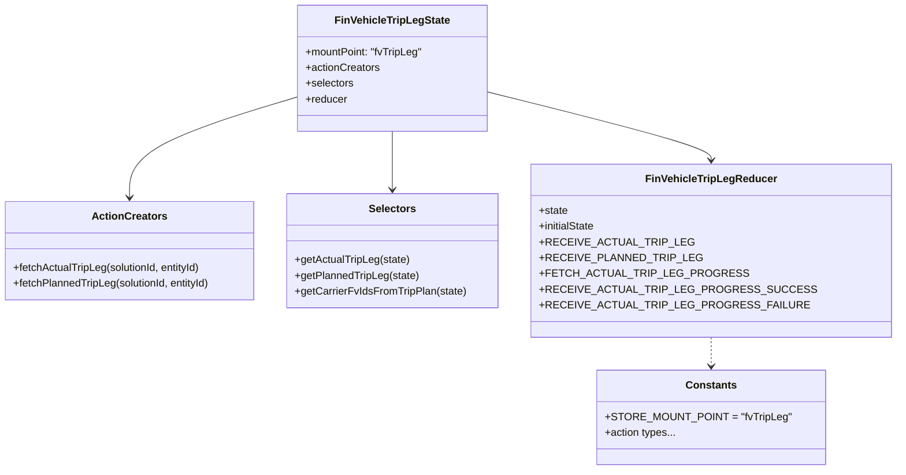

# Diagram: web/portal/src/pages/finishedvehicle/redux/FinVehicleTripLegState.js


> Auto-generated by Obscura crawlers

## Diagram 1



### SVG

<svg id="container" width="1288.1171875" xmlns="http://www.w3.org/2000/svg" class="classDiagram" height="716" viewBox="0 0 1288.1171875 716" role="graphics-document document" aria-roledescription="class"><style>#container{font-family:"trebuchet ms",verdana,arial,sans-serif;font-size:16px;fill:#333;}@keyframes edge-animation-frame{from{stroke-dashoffset:0;}}@keyframes dash{to{stroke-dashoffset:0;}}#container .edge-animation-slow{stroke-dasharray:9,5!important;stroke-dashoffset:900;animation:dash 50s linear infinite;stroke-linecap:round;}#container .edge-animation-fast{stroke-dasharray:9,5!important;stroke-dashoffset:900;animation:dash 20s linear infinite;stroke-linecap:round;}#container .error-icon{fill:#552222;}#container .error-text{fill:#552222;stroke:#552222;}#container .edge-thickness-normal{stroke-width:1px;}#container .edge-thickness-thick{stroke-width:3.5px;}#container .edge-pattern-solid{stroke-dasharray:0;}#container .edge-thickness-invisible{stroke-width:0;fill:none;}#container .edge-pattern-dashed{stroke-dasharray:3;}#container .edge-pattern-dotted{stroke-dasharray:2;}#container .marker{fill:#333333;stroke:#333333;}#container .marker.cross{stroke:#333333;}#container svg{font-family:"trebuchet ms",verdana,arial,sans-serif;font-size:16px;}#container p{margin:0;}#container g.classGroup text{fill:#9370DB;stroke:none;font-family:"trebuchet ms",verdana,arial,sans-serif;font-size:10px;}#container g.classGroup text .title{font-weight:bolder;}#container .nodeLabel,#container .edgeLabel{color:#131300;}#container .edgeLabel .label rect{fill:#ECECFF;}#container .label text{fill:#131300;}#container .labelBkg{background:#ECECFF;}#container .edgeLabel .label span{background:#ECECFF;}#container .classTitle{font-weight:bolder;}#container .node rect,#container .node circle,#container .node ellipse,#container .node polygon,#container .node path{fill:#ECECFF;stroke:#9370DB;stroke-width:1px;}#container .divider{stroke:#9370DB;stroke-width:1;}#container g.clickable{cursor:pointer;}#container g.classGroup rect{fill:#ECECFF;stroke:#9370DB;}#container g.classGroup line{stroke:#9370DB;stroke-width:1;}#container .classLabel .box{stroke:none;stroke-width:0;fill:#ECECFF;opacity:0.5;}#container .classLabel .label{fill:#9370DB;font-size:10px;}#container .relation{stroke:#333333;stroke-width:1;fill:none;}#container .dashed-line{stroke-dasharray:3;}#container .dotted-line{stroke-dasharray:1 2;}#container #compositionStart,#container .composition{fill:#333333!important;stroke:#333333!important;stroke-width:1;}#container #compositionEnd,#container .composition{fill:#333333!important;stroke:#333333!important;stroke-width:1;}#container #dependencyStart,#container .dependency{fill:#333333!important;stroke:#333333!important;stroke-width:1;}#container #dependencyStart,#container .dependency{fill:#333333!important;stroke:#333333!important;stroke-width:1;}#container #extensionStart,#container .extension{fill:transparent!important;stroke:#333333!important;stroke-width:1;}#container #extensionEnd,#container .extension{fill:transparent!important;stroke:#333333!important;stroke-width:1;}#container #aggregationStart,#container .aggregation{fill:transparent!important;stroke:#333333!important;stroke-width:1;}#container #aggregationEnd,#container .aggregation{fill:transparent!important;stroke:#333333!important;stroke-width:1;}#container #lollipopStart,#container .lollipop{fill:#ECECFF!important;stroke:#333333!important;stroke-width:1;}#container #lollipopEnd,#container .lollipop{fill:#ECECFF!important;stroke:#333333!important;stroke-width:1;}#container .edgeTerminals{font-size:11px;line-height:initial;}#container .classTitleText{text-anchor:middle;font-size:18px;fill:#333;}#container .label-icon{display:inline-block;height:1em;overflow:visible;vertical-align:-0.125em;}#container .node .label-icon path{fill:currentColor;stroke:revert;stroke-width:revert;}#container :root{--mermaid-font-family:"trebuchet ms",verdana,arial,sans-serif;}</style><g><defs><marker id="container_class-aggregationStart" class="marker aggregation class" refX="18" refY="7" markerWidth="190" markerHeight="240" orient="auto"><path d="M 18,7 L9,13 L1,7 L9,1 Z"></path></marker></defs><defs><marker id="container_class-aggregationEnd" class="marker aggregation class" refX="1" refY="7" markerWidth="20" markerHeight="28" orient="auto"><path d="M 18,7 L9,13 L1,7 L9,1 Z"></path></marker></defs><defs><marker id="container_class-extensionStart" class="marker extension class" refX="18" refY="7" markerWidth="190" markerHeight="240" orient="auto"><path d="M 1,7 L18,13 V 1 Z"></path></marker></defs><defs><marker id="container_class-extensionEnd" class="marker extension class" refX="1" refY="7" markerWidth="20" markerHeight="28" orient="auto"><path d="M 1,1 V 13 L18,7 Z"></path></marker></defs><defs><marker id="container_class-compositionStart" class="marker composition class" refX="18" refY="7" markerWidth="190" markerHeight="240" orient="auto"><path d="M 18,7 L9,13 L1,7 L9,1 Z"></path></marker></defs><defs><marker id="container_class-compositionEnd" class="marker composition class" refX="1" refY="7" markerWidth="20" markerHeight="28" orient="auto"><path d="M 18,7 L9,13 L1,7 L9,1 Z"></path></marker></defs><defs><marker id="container_class-dependencyStart" class="marker dependency class" refX="6" refY="7" markerWidth="190" markerHeight="240" orient="auto"><path d="M 5,7 L9,13 L1,7 L9,1 Z"></path></marker></defs><defs><marker id="container_class-dependencyEnd" class="marker dependency class" refX="13" refY="7" markerWidth="20" markerHeight="28" orient="auto"><path d="M 18,7 L9,13 L14,7 L9,1 Z"></path></marker></defs><defs><marker id="container_class-lollipopStart" class="marker lollipop class" refX="13" refY="7" markerWidth="190" markerHeight="240" orient="auto"><circle stroke="black" fill="transparent" cx="7" cy="7" r="6"></circle></marker></defs><defs><marker id="container_class-lollipopEnd" class="marker lollipop class" refX="1" refY="7" markerWidth="190" markerHeight="240" orient="auto"><circle stroke="black" fill="transparent" cx="7" cy="7" r="6"></circle></marker></defs><g class="root"><g class="clusters"></g><g class="edgePaths"><path d="M456.09,147.424L413.331,160.353C370.573,173.282,285.056,199.141,242.298,224.737C199.539,250.333,199.539,275.667,199.539,288.333L199.539,301" id="id_FinVehicleTripLegState_ActionCreators_1" class="edge-thickness-normal edge-pattern-solid relation" style=";;;" data-edge="true" data-et="edge" data-id="id_FinVehicleTripLegState_ActionCreators_1" data-points="W3sieCI6NDU2LjA4OTg0Mzc1LCJ5IjoxNDcuNDIzNjkxOTE3MjE5ODN9LHsieCI6MTk5LjUzOTA2MjUsInkiOjIyNX0seyJ4IjoxOTkuNTM5MDYyNSwieSI6MzA3fV0=" marker-end="url(#container_class-dependencyEnd)"></path><path d="M599.695,200L599.695,204.167C599.695,208.333,599.695,216.667,599.695,231.5C599.695,246.333,599.695,267.667,599.695,278.333L599.695,289" id="id_FinVehicleTripLegState_Selectors_2" class="edge-thickness-normal edge-pattern-solid relation" style=";;;" data-edge="true" data-et="edge" data-id="id_FinVehicleTripLegState_Selectors_2" data-points="W3sieCI6NTk5LjY5NTMxMjUsInkiOjIwMH0seyJ4Ijo1OTkuNjk1MzEyNSwieSI6MjI1fSx7IngiOjU5OS42OTUzMTI1LCJ5IjoyOTV9XQ==" marker-end="url(#container_class-dependencyEnd)"></path><path d="M743.301,143.09L793.453,156.742C843.605,170.393,943.91,197.697,994.063,214.515C1044.215,231.333,1044.215,237.667,1044.215,240.833L1044.215,244" id="id_FinVehicleTripLegState_FinVehicleTripLegReducer_3" class="edge-thickness-normal edge-pattern-solid relation" style=";;;" data-edge="true" data-et="edge" data-id="id_FinVehicleTripLegState_FinVehicleTripLegReducer_3" data-points="W3sieCI6NzQzLjMwMDc4MTI1LCJ5IjoxNDMuMDg5OTg0Nzk3NDkwMjd9LHsieCI6MTA0NC4yMTQ4NDM3NSwieSI6MjI1fSx7IngiOjEwNDQuMjE0ODQzNzUsInkiOjI1MH1d" marker-end="url(#container_class-dependencyEnd)"></path><path d="M1044.215,514L1044.215,518.167C1044.215,522.333,1044.215,530.667,1044.215,538C1044.215,545.333,1044.215,551.667,1044.215,554.833L1044.215,558" id="id_FinVehicleTripLegReducer_Constants_4" class="edge-thickness-normal edge-pattern-dashed relation" style=";;;" data-edge="true" data-et="edge" data-id="id_FinVehicleTripLegReducer_Constants_4" data-points="W3sieCI6MTA0NC4yMTQ4NDM3NSwieSI6NTE0fSx7IngiOjEwNDQuMjE0ODQzNzUsInkiOjUzOX0seyJ4IjoxMDQ0LjIxNDg0Mzc1LCJ5Ijo1NjR9XQ==" marker-end="url(#container_class-dependencyEnd)"></path></g><g class="edgeLabels"><g class="edgeLabel"><g class="label" data-id="id_FinVehicleTripLegState_ActionCreators_1" transform="translate(0, 0)"><foreignObject width="0" height="0"><div xmlns="http://www.w3.org/1999/xhtml" class="labelBkg" style="display: table-cell; white-space: nowrap; line-height: 1.5; max-width: 200px; text-align: center;"><span class="edgeLabel"></span></div></foreignObject></g></g><g class="edgeLabel"><g class="label" data-id="id_FinVehicleTripLegState_Selectors_2" transform="translate(0, 0)"><foreignObject width="0" height="0"><div xmlns="http://www.w3.org/1999/xhtml" class="labelBkg" style="display: table-cell; white-space: nowrap; line-height: 1.5; max-width: 200px; text-align: center;"><span class="edgeLabel"></span></div></foreignObject></g></g><g class="edgeLabel"><g class="label" data-id="id_FinVehicleTripLegState_FinVehicleTripLegReducer_3" transform="translate(0, 0)"><foreignObject width="0" height="0"><div xmlns="http://www.w3.org/1999/xhtml" class="labelBkg" style="display: table-cell; white-space: nowrap; line-height: 1.5; max-width: 200px; text-align: center;"><span class="edgeLabel"></span></div></foreignObject></g></g><g class="edgeLabel"><g class="label" data-id="id_FinVehicleTripLegReducer_Constants_4" transform="translate(0, 0)"><foreignObject width="0" height="0"><div xmlns="http://www.w3.org/1999/xhtml" class="labelBkg" style="display: table-cell; white-space: nowrap; line-height: 1.5; max-width: 200px; text-align: center;"><span class="edgeLabel"></span></div></foreignObject></g></g></g><g class="nodes"><g class="node default" id="classId-FinVehicleTripLegState-0" transform="translate(599.6953125, 104)"><g class="basic label-container"><path d="M-143.60546875 -96 L143.60546875 -96 L143.60546875 96 L-143.60546875 96" stroke="none" stroke-width="0" fill="#ECECFF" style=""></path><path d="M-143.60546875 -96 C-28.931142564498117 -96, 85.74318362100377 -96, 143.60546875 -96 M-143.60546875 -96 C-50.85276422277083 -96, 41.89994030445834 -96, 143.60546875 -96 M143.60546875 -96 C143.60546875 -25.054280020702464, 143.60546875 45.89143995859507, 143.60546875 96 M143.60546875 -96 C143.60546875 -51.38440805654219, 143.60546875 -6.768816113084384, 143.60546875 96 M143.60546875 96 C60.26439342961763 96, -23.076681890764746 96, -143.60546875 96 M143.60546875 96 C41.37678120653479 96, -60.851906336930426 96, -143.60546875 96 M-143.60546875 96 C-143.60546875 34.79964110258045, -143.60546875 -26.400717794839096, -143.60546875 -96 M-143.60546875 96 C-143.60546875 51.531298615436555, -143.60546875 7.062597230873109, -143.60546875 -96" stroke="#9370DB" stroke-width="1.3" fill="none" stroke-dasharray="0 0" style=""></path></g><g class="annotation-group text" transform="translate(0, -72)"></g><g class="label-group text" transform="translate(-83.1328125, -72)"><g class="label" style="font-weight: bolder" transform="translate(0,-12)"><foreignObject width="166.265625" height="24"><div xmlns="http://www.w3.org/1999/xhtml" style="display: table-cell; white-space: nowrap; line-height: 1.5; max-width: 213px; text-align: center;"><span class="nodeLabel markdown-node-label" style=""><p>FinVehicleTripLegState</p></span></div></foreignObject></g></g><g class="members-group text" transform="translate(-131.60546875, -24)"><g class="label" style="" transform="translate(0,-12)"><foreignObject width="180.078125" height="24"><div xmlns="http://www.w3.org/1999/xhtml" style="display: table-cell; white-space: nowrap; line-height: 1.5; max-width: 237px; text-align: center;"><span class="nodeLabel markdown-node-label" style=""><p>+mountPoint: "fvTripLeg"</p></span></div></foreignObject></g><g class="label" style="" transform="translate(0,12)"><foreignObject width="113.078125" height="24"><div xmlns="http://www.w3.org/1999/xhtml" style="display: table-cell; white-space: nowrap; line-height: 1.5; max-width: 170px; text-align: center;"><span class="nodeLabel markdown-node-label" style=""><p>+actionCreators</p></span></div></foreignObject></g><g class="label" style="" transform="translate(0,36)"><foreignObject width="73.453125" height="24"><div xmlns="http://www.w3.org/1999/xhtml" style="display: table-cell; white-space: nowrap; line-height: 1.5; max-width: 131px; text-align: center;"><span class="nodeLabel markdown-node-label" style=""><p>+selectors</p></span></div></foreignObject></g><g class="label" style="" transform="translate(0,60)"><foreignObject width="63.515625" height="24"><div xmlns="http://www.w3.org/1999/xhtml" style="display: table-cell; white-space: nowrap; line-height: 1.5; max-width: 122px; text-align: center;"><span class="nodeLabel markdown-node-label" style=""><p>+reducer</p></span></div></foreignObject></g></g><g class="methods-group text" transform="translate(-131.60546875, 96)"></g><g class="divider" style=""><path d="M-143.60546875 -48 C-45.38343015024486 -48, 52.838608449510275 -48, 143.60546875 -48 M-143.60546875 -48 C-52.425927999720756 -48, 38.75361275055849 -48, 143.60546875 -48" stroke="#9370DB" stroke-width="1.3" fill="none" stroke-dasharray="0 0" style=""></path></g><g class="divider" style=""><path d="M-143.60546875 72 C-49.29638395688394 72, 45.01270083623211 72, 143.60546875 72 M-143.60546875 72 C-75.98271025662159 72, -8.359951763243174 72, 143.60546875 72" stroke="#9370DB" stroke-width="1.3" fill="none" stroke-dasharray="0 0" style=""></path></g></g><g class="node default" id="classId-ActionCreators-1" transform="translate(199.5390625, 382)"><g class="basic label-container"><path d="M-191.5390625 -75 L191.5390625 -75 L191.5390625 75 L-191.5390625 75" stroke="none" stroke-width="0" fill="#ECECFF" style=""></path><path d="M-191.5390625 -75 C-99.91200107496088 -75, -8.284939649921768 -75, 191.5390625 -75 M-191.5390625 -75 C-98.05361739816567 -75, -4.5681722963313405 -75, 191.5390625 -75 M191.5390625 -75 C191.5390625 -17.565171405158566, 191.5390625 39.86965718968287, 191.5390625 75 M191.5390625 -75 C191.5390625 -31.02008958917905, 191.5390625 12.959820821641898, 191.5390625 75 M191.5390625 75 C82.10524128057808 75, -27.32857993884383 75, -191.5390625 75 M191.5390625 75 C69.05848184942559 75, -53.42209880114882 75, -191.5390625 75 M-191.5390625 75 C-191.5390625 40.207269010012865, -191.5390625 5.414538020025731, -191.5390625 -75 M-191.5390625 75 C-191.5390625 44.15189172996209, -191.5390625 13.303783459924176, -191.5390625 -75" stroke="#9370DB" stroke-width="1.3" fill="none" stroke-dasharray="0 0" style=""></path></g><g class="annotation-group text" transform="translate(0, -51)"></g><g class="label-group text" transform="translate(-53.96875, -51)"><g class="label" style="font-weight: bolder" transform="translate(0,-12)"><foreignObject width="107.9375" height="24"><div xmlns="http://www.w3.org/1999/xhtml" style="display: table-cell; white-space: nowrap; line-height: 1.5; max-width: 156px; text-align: center;"><span class="nodeLabel markdown-node-label" style=""><p>ActionCreators</p></span></div></foreignObject></g></g><g class="members-group text" transform="translate(-179.5390625, -3)"></g><g class="methods-group text" transform="translate(-179.5390625, 27)"><g class="label" style="" transform="translate(0,-12)"><foreignObject width="290.765625" height="24"><div xmlns="http://www.w3.org/1999/xhtml" style="display: table-cell; white-space: nowrap; line-height: 1.5; max-width: 348px; text-align: center;"><span class="nodeLabel markdown-node-label" style=""><p>+fetchActualTripLeg(solutionId, entityId)</p></span></div></foreignObject></g><g class="label" style="" transform="translate(0,12)"><foreignObject width="305.109375" height="24"><div xmlns="http://www.w3.org/1999/xhtml" style="display: table-cell; white-space: nowrap; line-height: 1.5; max-width: 362px; text-align: center;"><span class="nodeLabel markdown-node-label" style=""><p>+fetchPlannedTripLeg(solutionId, entityId)</p></span></div></foreignObject></g></g><g class="divider" style=""><path d="M-191.5390625 -27 C-99.94063632876293 -27, -8.34221015752587 -27, 191.5390625 -27 M-191.5390625 -27 C-70.6277899077659 -27, 50.2834826844682 -27, 191.5390625 -27" stroke="#9370DB" stroke-width="1.3" fill="none" stroke-dasharray="0 0" style=""></path></g><g class="divider" style=""><path d="M-191.5390625 -3 C-86.3482678819373 -3, 18.842526736125393 -3, 191.5390625 -3 M-191.5390625 -3 C-48.83685113008528 -3, 93.86536023982944 -3, 191.5390625 -3" stroke="#9370DB" stroke-width="1.3" fill="none" stroke-dasharray="0 0" style=""></path></g></g><g class="node default" id="classId-Selectors-2" transform="translate(599.6953125, 382)"><g class="basic label-container"><path d="M-158.6171875 -87 L158.6171875 -87 L158.6171875 87 L-158.6171875 87" stroke="none" stroke-width="0" fill="#ECECFF" style=""></path><path d="M-158.6171875 -87 C-55.329392188252356 -87, 47.95840312349529 -87, 158.6171875 -87 M-158.6171875 -87 C-90.47874640633007 -87, -22.34030531266015 -87, 158.6171875 -87 M158.6171875 -87 C158.6171875 -39.549874886625716, 158.6171875 7.900250226748568, 158.6171875 87 M158.6171875 -87 C158.6171875 -40.47559234142948, 158.6171875 6.048815317141035, 158.6171875 87 M158.6171875 87 C57.84157655512138 87, -42.934034389757244 87, -158.6171875 87 M158.6171875 87 C75.32530421518044 87, -7.966579069639124 87, -158.6171875 87 M-158.6171875 87 C-158.6171875 35.83174363467745, -158.6171875 -15.336512730645097, -158.6171875 -87 M-158.6171875 87 C-158.6171875 20.08522882679074, -158.6171875 -46.82954234641852, -158.6171875 -87" stroke="#9370DB" stroke-width="1.3" fill="none" stroke-dasharray="0 0" style=""></path></g><g class="annotation-group text" transform="translate(0, -63)"></g><g class="label-group text" transform="translate(-34.171875, -63)"><g class="label" style="font-weight: bolder" transform="translate(0,-12)"><foreignObject width="68.34375" height="24"><div xmlns="http://www.w3.org/1999/xhtml" style="display: table-cell; white-space: nowrap; line-height: 1.5; max-width: 117px; text-align: center;"><span class="nodeLabel markdown-node-label" style=""><p>Selectors</p></span></div></foreignObject></g></g><g class="members-group text" transform="translate(-146.6171875, -15)"></g><g class="methods-group text" transform="translate(-146.6171875, 15)"><g class="label" style="" transform="translate(0,-12)"><foreignObject width="174.75" height="24"><div xmlns="http://www.w3.org/1999/xhtml" style="display: table-cell; white-space: nowrap; line-height: 1.5; max-width: 232px; text-align: center;"><span class="nodeLabel markdown-node-label" style=""><p>+getActualTripLeg(state)</p></span></div></foreignObject></g><g class="label" style="" transform="translate(0,12)"><foreignObject width="189.09375" height="24"><div xmlns="http://www.w3.org/1999/xhtml" style="display: table-cell; white-space: nowrap; line-height: 1.5; max-width: 246px; text-align: center;"><span class="nodeLabel markdown-node-label" style=""><p>+getPlannedTripLeg(state)</p></span></div></foreignObject></g><g class="label" style="" transform="translate(0,36)"><foreignObject width="259.0625" height="24"><div xmlns="http://www.w3.org/1999/xhtml" style="display: table-cell; white-space: nowrap; line-height: 1.5; max-width: 316px; text-align: center;"><span class="nodeLabel markdown-node-label" style=""><p>+getCarrierFvIdsFromTripPlan(state)</p></span></div></foreignObject></g></g><g class="divider" style=""><path d="M-158.6171875 -39 C-50.621937390599626 -39, 57.37331271880075 -39, 158.6171875 -39 M-158.6171875 -39 C-83.53275635645907 -39, -8.44832521291815 -39, 158.6171875 -39" stroke="#9370DB" stroke-width="1.3" fill="none" stroke-dasharray="0 0" style=""></path></g><g class="divider" style=""><path d="M-158.6171875 -15 C-43.646932741917425 -15, 71.32332201616515 -15, 158.6171875 -15 M-158.6171875 -15 C-47.64660829740565 -15, 63.3239709051887 -15, 158.6171875 -15" stroke="#9370DB" stroke-width="1.3" fill="none" stroke-dasharray="0 0" style=""></path></g></g><g class="node default" id="classId-FinVehicleTripLegReducer-3" transform="translate(1044.21484375, 382)"><g class="basic label-container"><path d="M-235.90234375 -132 L235.90234375 -132 L235.90234375 132 L-235.90234375 132" stroke="none" stroke-width="0" fill="#ECECFF" style=""></path><path d="M-235.90234375 -132 C-91.53365778398066 -132, 52.835028182038684 -132, 235.90234375 -132 M-235.90234375 -132 C-94.45491537260341 -132, 46.99251300479318 -132, 235.90234375 -132 M235.90234375 -132 C235.90234375 -53.44639853495366, 235.90234375 25.107202930092683, 235.90234375 132 M235.90234375 -132 C235.90234375 -45.77079001873419, 235.90234375 40.45841996253162, 235.90234375 132 M235.90234375 132 C75.47762950911579 132, -84.94708473176843 132, -235.90234375 132 M235.90234375 132 C55.680378389293736 132, -124.54158697141253 132, -235.90234375 132 M-235.90234375 132 C-235.90234375 49.01802981876571, -235.90234375 -33.96394036246858, -235.90234375 -132 M-235.90234375 132 C-235.90234375 58.10158411046588, -235.90234375 -15.796831779068242, -235.90234375 -132" stroke="#9370DB" stroke-width="1.3" fill="none" stroke-dasharray="0 0" style=""></path></g><g class="annotation-group text" transform="translate(0, -108)"></g><g class="label-group text" transform="translate(-93.7265625, -108)"><g class="label" style="font-weight: bolder" transform="translate(0,-12)"><foreignObject width="187.453125" height="24"><div xmlns="http://www.w3.org/1999/xhtml" style="display: table-cell; white-space: nowrap; line-height: 1.5; max-width: 236px; text-align: center;"><span class="nodeLabel markdown-node-label" style=""><p>FinVehicleTripLegReducer</p></span></div></foreignObject></g></g><g class="members-group text" transform="translate(-223.90234375, -60)"><g class="label" style="" transform="translate(0,-12)"><foreignObject width="44.09375" height="24"><div xmlns="http://www.w3.org/1999/xhtml" style="display: table-cell; white-space: nowrap; line-height: 1.5; max-width: 101px; text-align: center;"><span class="nodeLabel markdown-node-label" style=""><p>+state</p></span></div></foreignObject></g><g class="label" style="" transform="translate(0,12)"><foreignObject width="87.25" height="24"><div xmlns="http://www.w3.org/1999/xhtml" style="display: table-cell; white-space: nowrap; line-height: 1.5; max-width: 145px; text-align: center;"><span class="nodeLabel markdown-node-label" style=""><p>+initialState</p></span></div></foreignObject></g><g class="label" style="" transform="translate(0,36)"><foreignObject width="200.34375" height="24"><div xmlns="http://www.w3.org/1999/xhtml" style="display: table-cell; white-space: nowrap; line-height: 1.5; max-width: 258px; text-align: center;"><span class="nodeLabel markdown-node-label" style=""><p>+RECEIVE_ACTUAL_TRIP_LEG</p></span></div></foreignObject></g><g class="label" style="" transform="translate(0,60)"><foreignObject width="213.203125" height="24"><div xmlns="http://www.w3.org/1999/xhtml" style="display: table-cell; white-space: nowrap; line-height: 1.5; max-width: 271px; text-align: center;"><span class="nodeLabel markdown-node-label" style=""><p>+RECEIVE_PLANNED_TRIP_LEG</p></span></div></foreignObject></g><g class="label" style="" transform="translate(0,84)"><foreignObject width="270.21875" height="24"><div xmlns="http://www.w3.org/1999/xhtml" style="display: table-cell; white-space: nowrap; line-height: 1.5; max-width: 328px; text-align: center;"><span class="nodeLabel markdown-node-label" style=""><p>+FETCH_ACTUAL_TRIP_LEG_PROGRESS</p></span></div></foreignObject></g><g class="label" style="" transform="translate(0,108)"><foreignObject width="354.078125" height="24"><div xmlns="http://www.w3.org/1999/xhtml" style="display: table-cell; white-space: nowrap; line-height: 1.5; max-width: 412px; text-align: center;"><span class="nodeLabel markdown-node-label" style=""><p>+RECEIVE_ACTUAL_TRIP_LEG_PROGRESS_SUCCESS</p></span></div></foreignObject></g><g class="label" style="" transform="translate(0,132)"><foreignObject width="349.171875" height="24"><div xmlns="http://www.w3.org/1999/xhtml" style="display: table-cell; white-space: nowrap; line-height: 1.5; max-width: 407px; text-align: center;"><span class="nodeLabel markdown-node-label" style=""><p>+RECEIVE_ACTUAL_TRIP_LEG_PROGRESS_FAILURE</p></span></div></foreignObject></g></g><g class="methods-group text" transform="translate(-223.90234375, 132)"></g><g class="divider" style=""><path d="M-235.90234375 -84 C-90.08643164029917 -84, 55.729480469401665 -84, 235.90234375 -84 M-235.90234375 -84 C-50.77732680184957 -84, 134.34769014630086 -84, 235.90234375 -84" stroke="#9370DB" stroke-width="1.3" fill="none" stroke-dasharray="0 0" style=""></path></g><g class="divider" style=""><path d="M-235.90234375 108 C-126.52126860791084 108, -17.14019346582168 108, 235.90234375 108 M-235.90234375 108 C-128.07361383600892 108, -20.244883922017863 108, 235.90234375 108" stroke="#9370DB" stroke-width="1.3" fill="none" stroke-dasharray="0 0" style=""></path></g></g><g class="node default" id="classId-Constants-4" transform="translate(1044.21484375, 636)"><g class="basic label-container"><path d="M-160.81640625 -72 L160.81640625 -72 L160.81640625 72 L-160.81640625 72" stroke="none" stroke-width="0" fill="#ECECFF" style=""></path><path d="M-160.81640625 -72 C-36.42367121938911 -72, 87.96906381122179 -72, 160.81640625 -72 M-160.81640625 -72 C-92.43543884862683 -72, -24.05447144725366 -72, 160.81640625 -72 M160.81640625 -72 C160.81640625 -17.39441056461478, 160.81640625 37.21117887077044, 160.81640625 72 M160.81640625 -72 C160.81640625 -39.74470650988038, 160.81640625 -7.489413019760761, 160.81640625 72 M160.81640625 72 C88.0462622410292 72, 15.276118232058394 72, -160.81640625 72 M160.81640625 72 C74.24999280399716 72, -12.316420642005681 72, -160.81640625 72 M-160.81640625 72 C-160.81640625 19.717955893597782, -160.81640625 -32.564088212804435, -160.81640625 -72 M-160.81640625 72 C-160.81640625 33.47348708533476, -160.81640625 -5.05302582933048, -160.81640625 -72" stroke="#9370DB" stroke-width="1.3" fill="none" stroke-dasharray="0 0" style=""></path></g><g class="annotation-group text" transform="translate(0, -48)"></g><g class="label-group text" transform="translate(-36.5390625, -48)"><g class="label" style="font-weight: bolder" transform="translate(0,-12)"><foreignObject width="73.078125" height="24"><div xmlns="http://www.w3.org/1999/xhtml" style="display: table-cell; white-space: nowrap; line-height: 1.5; max-width: 122px; text-align: center;"><span class="nodeLabel markdown-node-label" style=""><p>Constants</p></span></div></foreignObject></g></g><g class="members-group text" transform="translate(-148.81640625, 0)"><g class="label" style="" transform="translate(0,-12)"><foreignObject width="261.09375" height="24"><div xmlns="http://www.w3.org/1999/xhtml" style="display: table-cell; white-space: nowrap; line-height: 1.5; max-width: 318px; text-align: center;"><span class="nodeLabel markdown-node-label" style=""><p>+STORE_MOUNT_POINT = "fvTripLeg"</p></span></div></foreignObject></g><g class="label" style="" transform="translate(0,12)"><foreignObject width="108.140625" height="24"><div xmlns="http://www.w3.org/1999/xhtml" style="display: table-cell; white-space: nowrap; line-height: 1.5; max-width: 166px; text-align: center;"><span class="nodeLabel markdown-node-label" style=""><p>+action types...</p></span></div></foreignObject></g></g><g class="methods-group text" transform="translate(-148.81640625, 72)"></g><g class="divider" style=""><path d="M-160.81640625 -24 C-94.74257797331136 -24, -28.66874969662271 -24, 160.81640625 -24 M-160.81640625 -24 C-35.005697258601344 -24, 90.80501173279731 -24, 160.81640625 -24" stroke="#9370DB" stroke-width="1.3" fill="none" stroke-dasharray="0 0" style=""></path></g><g class="divider" style=""><path d="M-160.81640625 48 C-47.54301432616363 48, 65.73037759767274 48, 160.81640625 48 M-160.81640625 48 C-72.7833869447366 48, 15.249632360526789 48, 160.81640625 48" stroke="#9370DB" stroke-width="1.3" fill="none" stroke-dasharray="0 0" style=""></path></g></g></g></g></g></svg>

## Diagram 2

```mermaid
flowchart LR
  Start(["start: fetchActualTripLeg(solutionId, entityId)"])
  BuildURL[/build apiUrl with escaped entity id/]
  AxiosGet[/axios.get(url)/]
  ProcessResponses{responses -> actualLegs exist?}
  MapLegs[/map actualLegs[0].tripLegs/]
  ArrivedCheck{actualLeg.dest.arrived?}
  MarkComplete[/set progress:100, isProgressLoading:false/]
  MarkUnfinished[/set progress:0, isProgressLoading:true and if id != "fvGenerated" push id to unfinishedTripLeg/]
  DispatchActual>dispatch RECEIVE_ACTUAL_TRIP_LEG(payload: actualLegs)
  ForEachUnfinished[/forEach id in unfinishedTripLeg dispatch fetchActualTripLegProgressUpdates/]
  End(["end"])
  Start --> BuildURL --> AxiosGet --> ProcessResponses
  ProcessResponses -- yes --> MapLegs --> ArrivedCheck
  ArrivedCheck -- yes --> MarkComplete --> MapLegs
  ArrivedCheck -- no --> MarkUnfinished --> MapLegs
  MapLegs --> DispatchActual --> ForEachUnfinished --> End

  subgraph ProgressUpdateFlow
    PU_Start(["fetchActualTripLegProgressUpdates(solutionId, actualTripLegId)"])
    PU_Dispatch[/dispatch FETCH_ACTUAL_TRIP_LEG_PROGRESS(actualTripLegId)/]
    PU_Axios[/axios.get(progress-url)/]
    PU_Success[/dispatch RECEIVE_ACTUAL_TRIP_LEG_PROGRESS_SUCCESS(data)/]
    PU_404[/dispatch RECEIVE_ACTUAL_TRIP_LEG_PROGRESS_FAILURE(actualTripLegId)/]
    PU_Error["throw Error(err)"]
    PU_Start --> PU_Dispatch --> PU_Axios
    PU_Axios -->|200| PU_Success
    PU_Axios -->|404| PU_404
    PU_Axios -->|other error| PU_Error
  end
```

> SVG rendering failed for this diagram.
