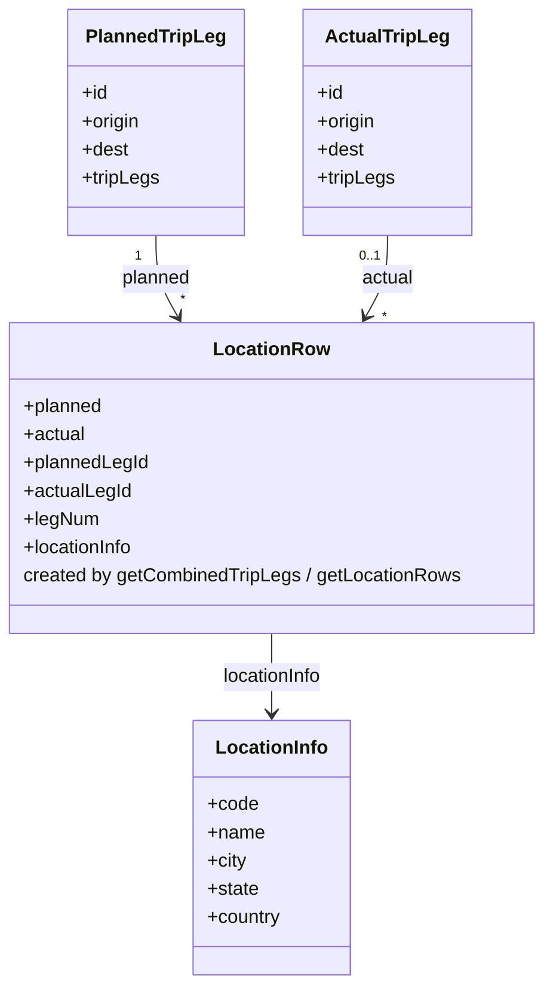

# Diagram: web/portal/src/pages/finishedvehicle/redux/TripProgressSelectors.js


> Auto-generated by Obscura crawlers

## Diagram 1

```mermaid
flowchart TD
    FVTLS[FinVehicleTripLegState.selectors]
    GP[getPlannedTripLegs]
    GA[getActualTripLegs]
    GCL[getCombinedTripLegs]
    GLR[getLocationRows]
    GLKS[getLegLocationCodeString]
    GLI[getLocationInfo]
    LOD[lodash utilities\n(keyBy, get, pick, last)]

    FVTLS -->|getPlannedTripLeg| GP
    FVTLS -->|getActualTripLeg| GA
    GP --> GCL
    GA --> GCL
    GCL --> GLR
    GCL -->|uses| GLKS
    GLR -->|uses| GLI
    GCL -->|uses| LOD
    GLR -->|uses| LOD
```

> SVG rendering failed for this diagram.

## Diagram 2



### SVG

<svg id="container" width="462.15625" xmlns="http://www.w3.org/2000/svg" class="classDiagram" height="836" viewBox="0 0 462.15625 836" role="graphics-document document" aria-roledescription="class"><style>#container{font-family:"trebuchet ms",verdana,arial,sans-serif;font-size:16px;fill:#333;}@keyframes edge-animation-frame{from{stroke-dashoffset:0;}}@keyframes dash{to{stroke-dashoffset:0;}}#container .edge-animation-slow{stroke-dasharray:9,5!important;stroke-dashoffset:900;animation:dash 50s linear infinite;stroke-linecap:round;}#container .edge-animation-fast{stroke-dasharray:9,5!important;stroke-dashoffset:900;animation:dash 20s linear infinite;stroke-linecap:round;}#container .error-icon{fill:#552222;}#container .error-text{fill:#552222;stroke:#552222;}#container .edge-thickness-normal{stroke-width:1px;}#container .edge-thickness-thick{stroke-width:3.5px;}#container .edge-pattern-solid{stroke-dasharray:0;}#container .edge-thickness-invisible{stroke-width:0;fill:none;}#container .edge-pattern-dashed{stroke-dasharray:3;}#container .edge-pattern-dotted{stroke-dasharray:2;}#container .marker{fill:#333333;stroke:#333333;}#container .marker.cross{stroke:#333333;}#container svg{font-family:"trebuchet ms",verdana,arial,sans-serif;font-size:16px;}#container p{margin:0;}#container g.classGroup text{fill:#9370DB;stroke:none;font-family:"trebuchet ms",verdana,arial,sans-serif;font-size:10px;}#container g.classGroup text .title{font-weight:bolder;}#container .nodeLabel,#container .edgeLabel{color:#131300;}#container .edgeLabel .label rect{fill:#ECECFF;}#container .label text{fill:#131300;}#container .labelBkg{background:#ECECFF;}#container .edgeLabel .label span{background:#ECECFF;}#container .classTitle{font-weight:bolder;}#container .node rect,#container .node circle,#container .node ellipse,#container .node polygon,#container .node path{fill:#ECECFF;stroke:#9370DB;stroke-width:1px;}#container .divider{stroke:#9370DB;stroke-width:1;}#container g.clickable{cursor:pointer;}#container g.classGroup rect{fill:#ECECFF;stroke:#9370DB;}#container g.classGroup line{stroke:#9370DB;stroke-width:1;}#container .classLabel .box{stroke:none;stroke-width:0;fill:#ECECFF;opacity:0.5;}#container .classLabel .label{fill:#9370DB;font-size:10px;}#container .relation{stroke:#333333;stroke-width:1;fill:none;}#container .dashed-line{stroke-dasharray:3;}#container .dotted-line{stroke-dasharray:1 2;}#container #compositionStart,#container .composition{fill:#333333!important;stroke:#333333!important;stroke-width:1;}#container #compositionEnd,#container .composition{fill:#333333!important;stroke:#333333!important;stroke-width:1;}#container #dependencyStart,#container .dependency{fill:#333333!important;stroke:#333333!important;stroke-width:1;}#container #dependencyStart,#container .dependency{fill:#333333!important;stroke:#333333!important;stroke-width:1;}#container #extensionStart,#container .extension{fill:transparent!important;stroke:#333333!important;stroke-width:1;}#container #extensionEnd,#container .extension{fill:transparent!important;stroke:#333333!important;stroke-width:1;}#container #aggregationStart,#container .aggregation{fill:transparent!important;stroke:#333333!important;stroke-width:1;}#container #aggregationEnd,#container .aggregation{fill:transparent!important;stroke:#333333!important;stroke-width:1;}#container #lollipopStart,#container .lollipop{fill:#ECECFF!important;stroke:#333333!important;stroke-width:1;}#container #lollipopEnd,#container .lollipop{fill:#ECECFF!important;stroke:#333333!important;stroke-width:1;}#container .edgeTerminals{font-size:11px;line-height:initial;}#container .classTitleText{text-anchor:middle;font-size:18px;fill:#333;}#container .label-icon{display:inline-block;height:1em;overflow:visible;vertical-align:-0.125em;}#container .node .label-icon path{fill:currentColor;stroke:revert;stroke-width:revert;}#container :root{--mermaid-font-family:"trebuchet ms",verdana,arial,sans-serif;}</style><g><defs><marker id="container_class-aggregationStart" class="marker aggregation class" refX="18" refY="7" markerWidth="190" markerHeight="240" orient="auto"><path d="M 18,7 L9,13 L1,7 L9,1 Z"></path></marker></defs><defs><marker id="container_class-aggregationEnd" class="marker aggregation class" refX="1" refY="7" markerWidth="20" markerHeight="28" orient="auto"><path d="M 18,7 L9,13 L1,7 L9,1 Z"></path></marker></defs><defs><marker id="container_class-extensionStart" class="marker extension class" refX="18" refY="7" markerWidth="190" markerHeight="240" orient="auto"><path d="M 1,7 L18,13 V 1 Z"></path></marker></defs><defs><marker id="container_class-extensionEnd" class="marker extension class" refX="1" refY="7" markerWidth="20" markerHeight="28" orient="auto"><path d="M 1,1 V 13 L18,7 Z"></path></marker></defs><defs><marker id="container_class-compositionStart" class="marker composition class" refX="18" refY="7" markerWidth="190" markerHeight="240" orient="auto"><path d="M 18,7 L9,13 L1,7 L9,1 Z"></path></marker></defs><defs><marker id="container_class-compositionEnd" class="marker composition class" refX="1" refY="7" markerWidth="20" markerHeight="28" orient="auto"><path d="M 18,7 L9,13 L1,7 L9,1 Z"></path></marker></defs><defs><marker id="container_class-dependencyStart" class="marker dependency class" refX="6" refY="7" markerWidth="190" markerHeight="240" orient="auto"><path d="M 5,7 L9,13 L1,7 L9,1 Z"></path></marker></defs><defs><marker id="container_class-dependencyEnd" class="marker dependency class" refX="13" refY="7" markerWidth="20" markerHeight="28" orient="auto"><path d="M 18,7 L9,13 L14,7 L9,1 Z"></path></marker></defs><defs><marker id="container_class-lollipopStart" class="marker lollipop class" refX="13" refY="7" markerWidth="190" markerHeight="240" orient="auto"><circle stroke="black" fill="transparent" cx="7" cy="7" r="6"></circle></marker></defs><defs><marker id="container_class-lollipopEnd" class="marker lollipop class" refX="1" refY="7" markerWidth="190" markerHeight="240" orient="auto"><circle stroke="black" fill="transparent" cx="7" cy="7" r="6"></circle></marker></defs><g class="root"><g class="clusters"></g><g class="edgePaths"><path d="M134.436,200L134.436,206.167C134.436,212.333,134.436,224.667,137.466,236.132C140.496,247.597,146.556,258.194,149.586,263.493L152.615,268.791" id="id_PlannedTripLeg_LocationRow_1" class="edge-thickness-normal edge-pattern-solid relation" style=";;;" data-edge="true" data-et="edge" data-id="id_PlannedTripLeg_LocationRow_1" data-points="W3sieCI6MTM0LjQzNTU0Njg3NSwieSI6MjAwfSx7IngiOjEzNC40MzU1NDY4NzUsInkiOjIzN30seyJ4IjoxNTUuNTkzOTgxMTM5MDUzMjYsInkiOjI3NH1d" marker-end="url(#container_class-dependencyEnd)"></path><path d="M327.721,200L327.721,206.167C327.721,212.333,327.721,224.667,324.691,236.132C321.661,247.597,315.601,258.194,312.571,263.493L309.541,268.791" id="id_ActualTripLeg_LocationRow_2" class="edge-thickness-normal edge-pattern-solid relation" style=";;;" data-edge="true" data-et="edge" data-id="id_ActualTripLeg_LocationRow_2" data-points="W3sieCI6MzI3LjcyMDcwMzEyNSwieSI6MjAwfSx7IngiOjMyNy43MjA3MDMxMjUsInkiOjIzN30seyJ4IjozMDYuNTYyMjY4ODYwOTQ2NzQsInkiOjI3NH1d" marker-end="url(#container_class-dependencyEnd)"></path><path d="M231.078,538L231.078,544.167C231.078,550.333,231.078,562.667,231.078,574C231.078,585.333,231.078,595.667,231.078,600.833L231.078,606" id="id_LocationRow_LocationInfo_3" class="edge-thickness-normal edge-pattern-solid relation" style=";;;" data-edge="true" data-et="edge" data-id="id_LocationRow_LocationInfo_3" data-points="W3sieCI6MjMxLjA3ODEyNSwieSI6NTM4fSx7IngiOjIzMS4wNzgxMjUsInkiOjU3NX0seyJ4IjoyMzEuMDc4MTI1LCJ5Ijo2MTJ9XQ==" marker-end="url(#container_class-dependencyEnd)"></path></g><g class="edgeLabels"><g class="edgeLabel" transform="translate(134.435546875, 237)"><g class="label" data-id="id_PlannedTripLeg_LocationRow_1" transform="translate(-29.9296875, -12)"><foreignObject width="59.859375" height="24"><div xmlns="http://www.w3.org/1999/xhtml" class="labelBkg" style="display: table-cell; white-space: nowrap; line-height: 1.5; max-width: 200px; text-align: center;"><span class="edgeLabel"><p>planned</p></span></div></foreignObject></g></g><g class="edgeLabel" transform="translate(327.720703125, 237)"><g class="label" data-id="id_ActualTripLeg_LocationRow_2" transform="translate(-22.34375, -12)"><foreignObject width="44.6875" height="24"><div xmlns="http://www.w3.org/1999/xhtml" class="labelBkg" style="display: table-cell; white-space: nowrap; line-height: 1.5; max-width: 200px; text-align: center;"><span class="edgeLabel"><p>actual</p></span></div></foreignObject></g></g><g class="edgeLabel" transform="translate(231.078125, 575)"><g class="label" data-id="id_LocationRow_LocationInfo_3" transform="translate(-43.8984375, -12)"><foreignObject width="87.796875" height="24"><div xmlns="http://www.w3.org/1999/xhtml" class="labelBkg" style="display: table-cell; white-space: nowrap; line-height: 1.5; max-width: 200px; text-align: center;"><span class="edgeLabel"><p>locationInfo</p></span></div></foreignObject></g></g><g class="edgeTerminals" transform="translate(119.43554843750007, 217.50000133928572)"><g class="inner" transform="translate(0, 0)"><foreignObject style="width: 9px; height: 12px;"><div xmlns="http://www.w3.org/1999/xhtml" style="display: inline-block; padding-right: 1px; white-space: nowrap;"><span class="edgeLabel">1</span></div></foreignObject></g></g><g class="edgeTerminals" transform="translate(312.7207015625001, 217.49999866071428)"><g class="inner" transform="translate(0, 0)"><foreignObject style="width: 36px; height: 12px;"><div xmlns="http://www.w3.org/1999/xhtml" style="display: inline-block; padding-right: 1px; white-space: nowrap;"><span class="edgeLabel">0..1</span></div></foreignObject></g></g><g class="edgeTerminals" transform="translate(154.9280163963218, 246.36228516178156)"><g class="inner" transform="translate(0, 0)"></g><foreignObject style="width: 9px; height: 12px;"><div xmlns="http://www.w3.org/1999/xhtml" style="display: inline-block; padding-right: 1px; white-space: nowrap;"><span class="edgeLabel">*</span></div></foreignObject></g><g class="edgeTerminals" transform="translate(323.2708052572685, 261.2547148382184)"><g class="inner" transform="translate(0, 0)"></g><foreignObject style="width: 9px; height: 12px;"><div xmlns="http://www.w3.org/1999/xhtml" style="display: inline-block; padding-right: 1px; white-space: nowrap;"><span class="edgeLabel">*</span></div></foreignObject></g></g><g class="nodes"><g class="node default" id="classId-PlannedTripLeg-0" transform="translate(134.435546875, 104)"><g class="basic label-container"><path d="M-73.390625 -96 L73.390625 -96 L73.390625 96 L-73.390625 96" stroke="none" stroke-width="0" fill="#ECECFF" style=""></path><path d="M-73.390625 -96 C-40.884572292895925 -96, -8.37851958579185 -96, 73.390625 -96 M-73.390625 -96 C-15.786462900247244 -96, 41.81769919950551 -96, 73.390625 -96 M73.390625 -96 C73.390625 -31.25777883890524, 73.390625 33.48444232218952, 73.390625 96 M73.390625 -96 C73.390625 -51.136852634462144, 73.390625 -6.273705268924289, 73.390625 96 M73.390625 96 C20.183388875481647 96, -33.023847249036706 96, -73.390625 96 M73.390625 96 C30.865512402323887 96, -11.659600195352226 96, -73.390625 96 M-73.390625 96 C-73.390625 23.31530295530908, -73.390625 -49.36939408938184, -73.390625 -96 M-73.390625 96 C-73.390625 57.21880127725994, -73.390625 18.437602554519884, -73.390625 -96" stroke="#9370DB" stroke-width="1.3" fill="none" stroke-dasharray="0 0" style=""></path></g><g class="annotation-group text" transform="translate(0, -72)"></g><g class="label-group text" transform="translate(-56.9375, -72)"><g class="label" style="font-weight: bolder" transform="translate(0,-12)"><foreignObject width="113.875" height="24"><div xmlns="http://www.w3.org/1999/xhtml" style="display: table-cell; white-space: nowrap; line-height: 1.5; max-width: 163px; text-align: center;"><span class="nodeLabel markdown-node-label" style=""><p>PlannedTripLeg</p></span></div></foreignObject></g></g><g class="members-group text" transform="translate(-61.390625, -24)"><g class="label" style="" transform="translate(0,-12)"><foreignObject width="22.078125" height="24"><div xmlns="http://www.w3.org/1999/xhtml" style="display: table-cell; white-space: nowrap; line-height: 1.5; max-width: 79px; text-align: center;"><span class="nodeLabel markdown-node-label" style=""><p>+id</p></span></div></foreignObject></g><g class="label" style="" transform="translate(0,12)"><foreignObject width="50.234375" height="24"><div xmlns="http://www.w3.org/1999/xhtml" style="display: table-cell; white-space: nowrap; line-height: 1.5; max-width: 108px; text-align: center;"><span class="nodeLabel markdown-node-label" style=""><p>+origin</p></span></div></foreignObject></g><g class="label" style="" transform="translate(0,36)"><foreignObject width="39.53125" height="24"><div xmlns="http://www.w3.org/1999/xhtml" style="display: table-cell; white-space: nowrap; line-height: 1.5; max-width: 97px; text-align: center;"><span class="nodeLabel markdown-node-label" style=""><p>+dest</p></span></div></foreignObject></g><g class="label" style="" transform="translate(0,60)"><foreignObject width="65.84375" height="24"><div xmlns="http://www.w3.org/1999/xhtml" style="display: table-cell; white-space: nowrap; line-height: 1.5; max-width: 123px; text-align: center;"><span class="nodeLabel markdown-node-label" style=""><p>+tripLegs</p></span></div></foreignObject></g></g><g class="methods-group text" transform="translate(-61.390625, 96)"></g><g class="divider" style=""><path d="M-73.390625 -48 C-29.88526755013298 -48, 13.62008989973404 -48, 73.390625 -48 M-73.390625 -48 C-42.092139161507376 -48, -10.793653323014752 -48, 73.390625 -48" stroke="#9370DB" stroke-width="1.3" fill="none" stroke-dasharray="0 0" style=""></path></g><g class="divider" style=""><path d="M-73.390625 72 C-20.84858525906263 72, 31.69345448187474 72, 73.390625 72 M-73.390625 72 C-19.6033749153047 72, 34.1838751693906 72, 73.390625 72" stroke="#9370DB" stroke-width="1.3" fill="none" stroke-dasharray="0 0" style=""></path></g></g><g class="node default" id="classId-ActualTripLeg-1" transform="translate(327.720703125, 104)"><g class="basic label-container"><path d="M-69.89453125 -96 L69.89453125 -96 L69.89453125 96 L-69.89453125 96" stroke="none" stroke-width="0" fill="#ECECFF" style=""></path><path d="M-69.89453125 -96 C-28.1070914025641 -96, 13.680348444871797 -96, 69.89453125 -96 M-69.89453125 -96 C-24.257109130042785 -96, 21.38031298991443 -96, 69.89453125 -96 M69.89453125 -96 C69.89453125 -40.87995357015329, 69.89453125 14.24009285969342, 69.89453125 96 M69.89453125 -96 C69.89453125 -37.342792206124145, 69.89453125 21.31441558775171, 69.89453125 96 M69.89453125 96 C17.899819676726402 96, -34.094891896547196 96, -69.89453125 96 M69.89453125 96 C24.00248122970485 96, -21.889568790590303 96, -69.89453125 96 M-69.89453125 96 C-69.89453125 38.90098025904328, -69.89453125 -18.19803948191344, -69.89453125 -96 M-69.89453125 96 C-69.89453125 54.956343292052665, -69.89453125 13.91268658410533, -69.89453125 -96" stroke="#9370DB" stroke-width="1.3" fill="none" stroke-dasharray="0 0" style=""></path></g><g class="annotation-group text" transform="translate(0, -72)"></g><g class="label-group text" transform="translate(-49.9453125, -72)"><g class="label" style="font-weight: bolder" transform="translate(0,-12)"><foreignObject width="99.890625" height="24"><div xmlns="http://www.w3.org/1999/xhtml" style="display: table-cell; white-space: nowrap; line-height: 1.5; max-width: 148px; text-align: center;"><span class="nodeLabel markdown-node-label" style=""><p>ActualTripLeg</p></span></div></foreignObject></g></g><g class="members-group text" transform="translate(-57.89453125, -24)"><g class="label" style="" transform="translate(0,-12)"><foreignObject width="22.078125" height="24"><div xmlns="http://www.w3.org/1999/xhtml" style="display: table-cell; white-space: nowrap; line-height: 1.5; max-width: 79px; text-align: center;"><span class="nodeLabel markdown-node-label" style=""><p>+id</p></span></div></foreignObject></g><g class="label" style="" transform="translate(0,12)"><foreignObject width="50.234375" height="24"><div xmlns="http://www.w3.org/1999/xhtml" style="display: table-cell; white-space: nowrap; line-height: 1.5; max-width: 108px; text-align: center;"><span class="nodeLabel markdown-node-label" style=""><p>+origin</p></span></div></foreignObject></g><g class="label" style="" transform="translate(0,36)"><foreignObject width="39.53125" height="24"><div xmlns="http://www.w3.org/1999/xhtml" style="display: table-cell; white-space: nowrap; line-height: 1.5; max-width: 97px; text-align: center;"><span class="nodeLabel markdown-node-label" style=""><p>+dest</p></span></div></foreignObject></g><g class="label" style="" transform="translate(0,60)"><foreignObject width="65.84375" height="24"><div xmlns="http://www.w3.org/1999/xhtml" style="display: table-cell; white-space: nowrap; line-height: 1.5; max-width: 123px; text-align: center;"><span class="nodeLabel markdown-node-label" style=""><p>+tripLegs</p></span></div></foreignObject></g></g><g class="methods-group text" transform="translate(-57.89453125, 96)"></g><g class="divider" style=""><path d="M-69.89453125 -48 C-27.94785948157108 -48, 13.998812286857842 -48, 69.89453125 -48 M-69.89453125 -48 C-29.53773977466772 -48, 10.81905170066456 -48, 69.89453125 -48" stroke="#9370DB" stroke-width="1.3" fill="none" stroke-dasharray="0 0" style=""></path></g><g class="divider" style=""><path d="M-69.89453125 72 C-31.516996387172355 72, 6.860538475655289 72, 69.89453125 72 M-69.89453125 72 C-30.798388728017684 72, 8.297753793964631 72, 69.89453125 72" stroke="#9370DB" stroke-width="1.3" fill="none" stroke-dasharray="0 0" style=""></path></g></g><g class="node default" id="classId-LocationRow-2" transform="translate(231.078125, 406)"><g class="basic label-container"><path d="M-223.078125 -132 L223.078125 -132 L223.078125 132 L-223.078125 132" stroke="none" stroke-width="0" fill="#ECECFF" style=""></path><path d="M-223.078125 -132 C-123.59093707025372 -132, -24.103749140507432 -132, 223.078125 -132 M-223.078125 -132 C-108.45278979248654 -132, 6.172545415026917 -132, 223.078125 -132 M223.078125 -132 C223.078125 -34.164243354507235, 223.078125 63.67151329098553, 223.078125 132 M223.078125 -132 C223.078125 -57.47593980326438, 223.078125 17.048120393471237, 223.078125 132 M223.078125 132 C110.15866234212064 132, -2.760800315758729 132, -223.078125 132 M223.078125 132 C100.07000009192343 132, -22.938124816153135 132, -223.078125 132 M-223.078125 132 C-223.078125 61.51785402802983, -223.078125 -8.964291943940339, -223.078125 -132 M-223.078125 132 C-223.078125 43.3467277606664, -223.078125 -45.306544478667206, -223.078125 -132" stroke="#9370DB" stroke-width="1.3" fill="none" stroke-dasharray="0 0" style=""></path></g><g class="annotation-group text" transform="translate(0, -108)"></g><g class="label-group text" transform="translate(-46.828125, -108)"><g class="label" style="font-weight: bolder" transform="translate(0,-12)"><foreignObject width="93.65625" height="24"><div xmlns="http://www.w3.org/1999/xhtml" style="display: table-cell; white-space: nowrap; line-height: 1.5; max-width: 143px; text-align: center;"><span class="nodeLabel markdown-node-label" style=""><p>LocationRow</p></span></div></foreignObject></g></g><g class="members-group text" transform="translate(-211.078125, -60)"><g class="label" style="" transform="translate(0,-12)"><foreignObject width="67.84375" height="24"><div xmlns="http://www.w3.org/1999/xhtml" style="display: table-cell; white-space: nowrap; line-height: 1.5; max-width: 125px; text-align: center;"><span class="nodeLabel markdown-node-label" style=""><p>+planned</p></span></div></foreignObject></g><g class="label" style="" transform="translate(0,12)"><foreignObject width="52.421875" height="24"><div xmlns="http://www.w3.org/1999/xhtml" style="display: table-cell; white-space: nowrap; line-height: 1.5; max-width: 110px; text-align: center;"><span class="nodeLabel markdown-node-label" style=""><p>+actual</p></span></div></foreignObject></g><g class="label" style="" transform="translate(0,36)"><foreignObject width="106.75" height="24"><div xmlns="http://www.w3.org/1999/xhtml" style="display: table-cell; white-space: nowrap; line-height: 1.5; max-width: 164px; text-align: center;"><span class="nodeLabel markdown-node-label" style=""><p>+plannedLegId</p></span></div></foreignObject></g><g class="label" style="" transform="translate(0,60)"><foreignObject width="91.3125" height="24"><div xmlns="http://www.w3.org/1999/xhtml" style="display: table-cell; white-space: nowrap; line-height: 1.5; max-width: 149px; text-align: center;"><span class="nodeLabel markdown-node-label" style=""><p>+actualLegId</p></span></div></foreignObject></g><g class="label" style="" transform="translate(0,84)"><foreignObject width="63.59375" height="24"><div xmlns="http://www.w3.org/1999/xhtml" style="display: table-cell; white-space: nowrap; line-height: 1.5; max-width: 121px; text-align: center;"><span class="nodeLabel markdown-node-label" style=""><p>+legNum</p></span></div></foreignObject></g><g class="label" style="" transform="translate(0,108)"><foreignObject width="95.78125" height="24"><div xmlns="http://www.w3.org/1999/xhtml" style="display: table-cell; white-space: nowrap; line-height: 1.5; max-width: 153px; text-align: center;"><span class="nodeLabel markdown-node-label" style=""><p>+locationInfo</p></span></div></foreignObject></g><g class="label" style="" transform="translate(0,132)"><foreignObject width="375.328125" height="24"><div xmlns="http://www.w3.org/1999/xhtml" style="display: table-cell; white-space: nowrap; line-height: 1.5; max-width: 425px; text-align: center;"><span class="nodeLabel markdown-node-label" style=""><p>created by getCombinedTripLegs / getLocationRows</p></span></div></foreignObject></g></g><g class="methods-group text" transform="translate(-211.078125, 132)"></g><g class="divider" style=""><path d="M-223.078125 -84 C-75.28359502497685 -84, 72.5109349500463 -84, 223.078125 -84 M-223.078125 -84 C-79.01473024992762 -84, 65.04866450014475 -84, 223.078125 -84" stroke="#9370DB" stroke-width="1.3" fill="none" stroke-dasharray="0 0" style=""></path></g><g class="divider" style=""><path d="M-223.078125 108 C-91.76385490479313 108, 39.55041519041373 108, 223.078125 108 M-223.078125 108 C-114.30736942904592 108, -5.53661385809184 108, 223.078125 108" stroke="#9370DB" stroke-width="1.3" fill="none" stroke-dasharray="0 0" style=""></path></g></g><g class="node default" id="classId-LocationInfo-3" transform="translate(231.078125, 720)"><g class="basic label-container"><path d="M-66.4609375 -108 L66.4609375 -108 L66.4609375 108 L-66.4609375 108" stroke="none" stroke-width="0" fill="#ECECFF" style=""></path><path d="M-66.4609375 -108 C-27.190507107532454 -108, 12.079923284935091 -108, 66.4609375 -108 M-66.4609375 -108 C-17.26908637858103 -108, 31.92276474283794 -108, 66.4609375 -108 M66.4609375 -108 C66.4609375 -38.28786608555532, 66.4609375 31.424267828889356, 66.4609375 108 M66.4609375 -108 C66.4609375 -38.44242012498442, 66.4609375 31.115159750031154, 66.4609375 108 M66.4609375 108 C21.691009303411434 108, -23.078918893177132 108, -66.4609375 108 M66.4609375 108 C36.1662916940528 108, 5.871645888105611 108, -66.4609375 108 M-66.4609375 108 C-66.4609375 50.96039801699544, -66.4609375 -6.079203966009118, -66.4609375 -108 M-66.4609375 108 C-66.4609375 25.7528734006291, -66.4609375 -56.4942531987418, -66.4609375 -108" stroke="#9370DB" stroke-width="1.3" fill="none" stroke-dasharray="0 0" style=""></path></g><g class="annotation-group text" transform="translate(0, -84)"></g><g class="label-group text" transform="translate(-45.75, -84)"><g class="label" style="font-weight: bolder" transform="translate(0,-12)"><foreignObject width="91.5" height="24"><div xmlns="http://www.w3.org/1999/xhtml" style="display: table-cell; white-space: nowrap; line-height: 1.5; max-width: 141px; text-align: center;"><span class="nodeLabel markdown-node-label" style=""><p>LocationInfo</p></span></div></foreignObject></g></g><g class="members-group text" transform="translate(-54.4609375, -36)"><g class="label" style="" transform="translate(0,-12)"><foreignObject width="42.953125" height="24"><div xmlns="http://www.w3.org/1999/xhtml" style="display: table-cell; white-space: nowrap; line-height: 1.5; max-width: 100px; text-align: center;"><span class="nodeLabel markdown-node-label" style=""><p>+code</p></span></div></foreignObject></g><g class="label" style="" transform="translate(0,12)"><foreignObject width="48.5" height="24"><div xmlns="http://www.w3.org/1999/xhtml" style="display: table-cell; white-space: nowrap; line-height: 1.5; max-width: 106px; text-align: center;"><span class="nodeLabel markdown-node-label" style=""><p>+name</p></span></div></foreignObject></g><g class="label" style="" transform="translate(0,36)"><foreignObject width="33.71875" height="24"><div xmlns="http://www.w3.org/1999/xhtml" style="display: table-cell; white-space: nowrap; line-height: 1.5; max-width: 91px; text-align: center;"><span class="nodeLabel markdown-node-label" style=""><p>+city</p></span></div></foreignObject></g><g class="label" style="" transform="translate(0,60)"><foreignObject width="44.09375" height="24"><div xmlns="http://www.w3.org/1999/xhtml" style="display: table-cell; white-space: nowrap; line-height: 1.5; max-width: 101px; text-align: center;"><span class="nodeLabel markdown-node-label" style=""><p>+state</p></span></div></foreignObject></g><g class="label" style="" transform="translate(0,84)"><foreignObject width="63.171875" height="24"><div xmlns="http://www.w3.org/1999/xhtml" style="display: table-cell; white-space: nowrap; line-height: 1.5; max-width: 121px; text-align: center;"><span class="nodeLabel markdown-node-label" style=""><p>+country</p></span></div></foreignObject></g></g><g class="methods-group text" transform="translate(-54.4609375, 108)"></g><g class="divider" style=""><path d="M-66.4609375 -60 C-34.74747365501412 -60, -3.0340098100282376 -60, 66.4609375 -60 M-66.4609375 -60 C-17.181177826053236 -60, 32.09858184789353 -60, 66.4609375 -60" stroke="#9370DB" stroke-width="1.3" fill="none" stroke-dasharray="0 0" style=""></path></g><g class="divider" style=""><path d="M-66.4609375 84 C-38.655193206969585 84, -10.849448913939163 84, 66.4609375 84 M-66.4609375 84 C-20.900795142756564 84, 24.65934721448687 84, 66.4609375 84" stroke="#9370DB" stroke-width="1.3" fill="none" stroke-dasharray="0 0" style=""></path></g></g></g></g></g></svg>
