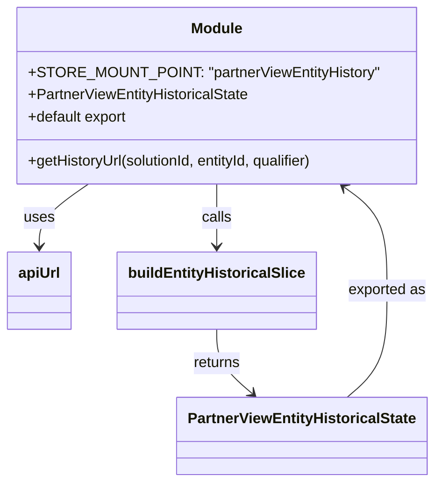

# Diagram: web/portal/src/pages/finishedvehicle/redux/partnerview/PartnerViewEntityHistoricalState.js


> Auto-generated by Obscura crawlers

## Diagram 1



### SVG

<svg id="container" width="463.4375" xmlns="http://www.w3.org/2000/svg" class="classDiagram" height="524" viewBox="0 0 463.4375 524" role="graphics-document document" aria-roledescription="class"><style>#container{font-family:"trebuchet ms",verdana,arial,sans-serif;font-size:16px;fill:#333;}@keyframes edge-animation-frame{from{stroke-dashoffset:0;}}@keyframes dash{to{stroke-dashoffset:0;}}#container .edge-animation-slow{stroke-dasharray:9,5!important;stroke-dashoffset:900;animation:dash 50s linear infinite;stroke-linecap:round;}#container .edge-animation-fast{stroke-dasharray:9,5!important;stroke-dashoffset:900;animation:dash 20s linear infinite;stroke-linecap:round;}#container .error-icon{fill:#552222;}#container .error-text{fill:#552222;stroke:#552222;}#container .edge-thickness-normal{stroke-width:1px;}#container .edge-thickness-thick{stroke-width:3.5px;}#container .edge-pattern-solid{stroke-dasharray:0;}#container .edge-thickness-invisible{stroke-width:0;fill:none;}#container .edge-pattern-dashed{stroke-dasharray:3;}#container .edge-pattern-dotted{stroke-dasharray:2;}#container .marker{fill:#333333;stroke:#333333;}#container .marker.cross{stroke:#333333;}#container svg{font-family:"trebuchet ms",verdana,arial,sans-serif;font-size:16px;}#container p{margin:0;}#container g.classGroup text{fill:#9370DB;stroke:none;font-family:"trebuchet ms",verdana,arial,sans-serif;font-size:10px;}#container g.classGroup text .title{font-weight:bolder;}#container .nodeLabel,#container .edgeLabel{color:#131300;}#container .edgeLabel .label rect{fill:#ECECFF;}#container .label text{fill:#131300;}#container .labelBkg{background:#ECECFF;}#container .edgeLabel .label span{background:#ECECFF;}#container .classTitle{font-weight:bolder;}#container .node rect,#container .node circle,#container .node ellipse,#container .node polygon,#container .node path{fill:#ECECFF;stroke:#9370DB;stroke-width:1px;}#container .divider{stroke:#9370DB;stroke-width:1;}#container g.clickable{cursor:pointer;}#container g.classGroup rect{fill:#ECECFF;stroke:#9370DB;}#container g.classGroup line{stroke:#9370DB;stroke-width:1;}#container .classLabel .box{stroke:none;stroke-width:0;fill:#ECECFF;opacity:0.5;}#container .classLabel .label{fill:#9370DB;font-size:10px;}#container .relation{stroke:#333333;stroke-width:1;fill:none;}#container .dashed-line{stroke-dasharray:3;}#container .dotted-line{stroke-dasharray:1 2;}#container #compositionStart,#container .composition{fill:#333333!important;stroke:#333333!important;stroke-width:1;}#container #compositionEnd,#container .composition{fill:#333333!important;stroke:#333333!important;stroke-width:1;}#container #dependencyStart,#container .dependency{fill:#333333!important;stroke:#333333!important;stroke-width:1;}#container #dependencyStart,#container .dependency{fill:#333333!important;stroke:#333333!important;stroke-width:1;}#container #extensionStart,#container .extension{fill:transparent!important;stroke:#333333!important;stroke-width:1;}#container #extensionEnd,#container .extension{fill:transparent!important;stroke:#333333!important;stroke-width:1;}#container #aggregationStart,#container .aggregation{fill:transparent!important;stroke:#333333!important;stroke-width:1;}#container #aggregationEnd,#container .aggregation{fill:transparent!important;stroke:#333333!important;stroke-width:1;}#container #lollipopStart,#container .lollipop{fill:#ECECFF!important;stroke:#333333!important;stroke-width:1;}#container #lollipopEnd,#container .lollipop{fill:#ECECFF!important;stroke:#333333!important;stroke-width:1;}#container .edgeTerminals{font-size:11px;line-height:initial;}#container .classTitleText{text-anchor:middle;font-size:18px;fill:#333;}#container .label-icon{display:inline-block;height:1em;overflow:visible;vertical-align:-0.125em;}#container .node .label-icon path{fill:currentColor;stroke:revert;stroke-width:revert;}#container :root{--mermaid-font-family:"trebuchet ms",verdana,arial,sans-serif;}</style><g><defs><marker id="container_class-aggregationStart" class="marker aggregation class" refX="18" refY="7" markerWidth="190" markerHeight="240" orient="auto"><path d="M 18,7 L9,13 L1,7 L9,1 Z"></path></marker></defs><defs><marker id="container_class-aggregationEnd" class="marker aggregation class" refX="1" refY="7" markerWidth="20" markerHeight="28" orient="auto"><path d="M 18,7 L9,13 L1,7 L9,1 Z"></path></marker></defs><defs><marker id="container_class-extensionStart" class="marker extension class" refX="18" refY="7" markerWidth="190" markerHeight="240" orient="auto"><path d="M 1,7 L18,13 V 1 Z"></path></marker></defs><defs><marker id="container_class-extensionEnd" class="marker extension class" refX="1" refY="7" markerWidth="20" markerHeight="28" orient="auto"><path d="M 1,1 V 13 L18,7 Z"></path></marker></defs><defs><marker id="container_class-compositionStart" class="marker composition class" refX="18" refY="7" markerWidth="190" markerHeight="240" orient="auto"><path d="M 18,7 L9,13 L1,7 L9,1 Z"></path></marker></defs><defs><marker id="container_class-compositionEnd" class="marker composition class" refX="1" refY="7" markerWidth="20" markerHeight="28" orient="auto"><path d="M 18,7 L9,13 L1,7 L9,1 Z"></path></marker></defs><defs><marker id="container_class-dependencyStart" class="marker dependency class" refX="6" refY="7" markerWidth="190" markerHeight="240" orient="auto"><path d="M 5,7 L9,13 L1,7 L9,1 Z"></path></marker></defs><defs><marker id="container_class-dependencyEnd" class="marker dependency class" refX="13" refY="7" markerWidth="20" markerHeight="28" orient="auto"><path d="M 18,7 L9,13 L14,7 L9,1 Z"></path></marker></defs><defs><marker id="container_class-lollipopStart" class="marker lollipop class" refX="13" refY="7" markerWidth="190" markerHeight="240" orient="auto"><circle stroke="black" fill="transparent" cx="7" cy="7" r="6"></circle></marker></defs><defs><marker id="container_class-lollipopEnd" class="marker lollipop class" refX="1" refY="7" markerWidth="190" markerHeight="240" orient="auto"><circle stroke="black" fill="transparent" cx="7" cy="7" r="6"></circle></marker></defs><g class="root"><g class="clusters"></g><g class="edgePaths"><path d="M94.649,200L85.909,206.167C77.169,212.333,59.69,224.667,50.951,236C42.211,247.333,42.211,257.667,42.211,262.833L42.211,268" id="id_Module_apiUrl_1" class="edge-thickness-normal edge-pattern-solid relation" style=";;;" data-edge="true" data-et="edge" data-id="id_Module_apiUrl_1" data-points="W3sieCI6OTQuNjQ4NjEzNzIxODA0NTEsInkiOjIwMH0seyJ4Ijo0Mi4yMTA5Mzc1LCJ5IjoyMzd9LHsieCI6NDIuMjEwOTM3NSwieSI6Mjc0fV0=" marker-end="url(#container_class-dependencyEnd)"></path><path d="M230.703,200L230.703,206.167C230.703,212.333,230.703,224.667,230.703,236C230.703,247.333,230.703,257.667,230.703,262.833L230.703,268" id="id_Module_buildEntityHistoricalSlice_2" class="edge-thickness-normal edge-pattern-solid relation" style=";;;" data-edge="true" data-et="edge" data-id="id_Module_buildEntityHistoricalSlice_2" data-points="W3sieCI6MjMwLjcwMzEyNSwieSI6MjAwfSx7IngiOjIzMC43MDMxMjUsInkiOjIzN30seyJ4IjoyMzAuNzAzMTI1LCJ5IjoyNzR9XQ==" marker-end="url(#container_class-dependencyEnd)"></path><path d="M230.703,358L230.703,364.167C230.703,370.333,230.703,382.667,237.052,394.344C243.4,406.022,256.097,417.044,262.446,422.556L268.794,428.067" id="id_buildEntityHistoricalSlice_PartnerViewEntityHistoricalState_3" class="edge-thickness-normal edge-pattern-solid relation" style=";;;" data-edge="true" data-et="edge" data-id="id_buildEntityHistoricalSlice_PartnerViewEntityHistoricalState_3" data-points="W3sieCI6MjMwLjcwMzEyNSwieSI6MzU4fSx7IngiOjIzMC43MDMxMjUsInkiOjM5NX0seyJ4IjoyNzMuMzI1MjA3Njc0MDUwNiwieSI6NDMyfV0=" marker-end="url(#container_class-dependencyEnd)"></path><path d="M370.089,432L377.193,425.833C384.296,419.667,398.504,407.333,405.607,388C412.711,368.667,412.711,342.333,412.711,316C412.711,289.667,412.711,263.333,405.079,244.59C397.448,225.847,382.185,214.693,374.553,209.117L366.922,203.54" id="id_PartnerViewEntityHistoricalState_Module_4" class="edge-thickness-normal edge-pattern-solid relation" style=";;;" data-edge="true" data-et="edge" data-id="id_PartnerViewEntityHistoricalState_Module_4" data-points="W3sieCI6MzcwLjA4ODg1NDgyNTk0OTQsInkiOjQzMn0seyJ4Ijo0MTIuNzEwOTM3NSwieSI6Mzk1fSx7IngiOjQxMi43MTA5Mzc1LCJ5IjozMTZ9LHsieCI6NDEyLjcxMDkzNzUsInkiOjIzN30seyJ4IjozNjIuMDc3MTg1MTUwMzc1OTUsInkiOjIwMH1d" marker-end="url(#container_class-dependencyEnd)"></path></g><g class="edgeLabels"><g class="edgeLabel" transform="translate(42.2109375, 237)"><g class="label" data-id="id_Module_apiUrl_1" transform="translate(-16.4921875, -12)"><foreignObject width="32.984375" height="24"><div xmlns="http://www.w3.org/1999/xhtml" class="labelBkg" style="display: table-cell; white-space: nowrap; line-height: 1.5; max-width: 200px; text-align: center;"><span class="edgeLabel"><p>uses</p></span></div></foreignObject></g></g><g class="edgeLabel" transform="translate(230.703125, 237)"><g class="label" data-id="id_Module_buildEntityHistoricalSlice_2" transform="translate(-16.4453125, -12)"><foreignObject width="32.890625" height="24"><div xmlns="http://www.w3.org/1999/xhtml" class="labelBkg" style="display: table-cell; white-space: nowrap; line-height: 1.5; max-width: 200px; text-align: center;"><span class="edgeLabel"><p>calls</p></span></div></foreignObject></g></g><g class="edgeLabel" transform="translate(230.703125, 395)"><g class="label" data-id="id_buildEntityHistoricalSlice_PartnerViewEntityHistoricalState_3" transform="translate(-26.265625, -12)"><foreignObject width="52.53125" height="24"><div xmlns="http://www.w3.org/1999/xhtml" class="labelBkg" style="display: table-cell; white-space: nowrap; line-height: 1.5; max-width: 200px; text-align: center;"><span class="edgeLabel"><p>returns</p></span></div></foreignObject></g></g><g class="edgeLabel" transform="translate(412.7109375, 316)"><g class="label" data-id="id_PartnerViewEntityHistoricalState_Module_4" transform="translate(-42.7265625, -12)"><foreignObject width="85.453125" height="24"><div xmlns="http://www.w3.org/1999/xhtml" class="labelBkg" style="display: table-cell; white-space: nowrap; line-height: 1.5; max-width: 200px; text-align: center;"><span class="edgeLabel"><p>exported as</p></span></div></foreignObject></g></g></g><g class="nodes"><g class="node default" id="classId-Module-0" transform="translate(230.703125, 104)"><g class="basic label-container"><path d="M-209.3125 -96 L209.3125 -96 L209.3125 96 L-209.3125 96" stroke="none" stroke-width="0" fill="#ECECFF" style=""></path><path d="M-209.3125 -96 C-42.10485444746888 -96, 125.10279110506224 -96, 209.3125 -96 M-209.3125 -96 C-64.2281103997046 -96, 80.85627920059079 -96, 209.3125 -96 M209.3125 -96 C209.3125 -47.82765674275677, 209.3125 0.3446865144864546, 209.3125 96 M209.3125 -96 C209.3125 -37.04588042879215, 209.3125 21.908239142415695, 209.3125 96 M209.3125 96 C64.15615476764646 96, -81.00019046470709 96, -209.3125 96 M209.3125 96 C49.12511569423597 96, -111.06226861152805 96, -209.3125 96 M-209.3125 96 C-209.3125 36.26386630083279, -209.3125 -23.472267398334424, -209.3125 -96 M-209.3125 96 C-209.3125 48.88523276995182, -209.3125 1.7704655399036398, -209.3125 -96" stroke="#9370DB" stroke-width="1.3" fill="none" stroke-dasharray="0 0" style=""></path></g><g class="annotation-group text" transform="translate(0, -72)"></g><g class="label-group text" transform="translate(-27.09375, -72)"><g class="label" style="font-weight: bolder" transform="translate(0,-12)"><foreignObject width="54.1875" height="24"><div xmlns="http://www.w3.org/1999/xhtml" style="display: table-cell; white-space: nowrap; line-height: 1.5; max-width: 104px; text-align: center;"><span class="nodeLabel markdown-node-label" style=""><p>Module</p></span></div></foreignObject></g></g><g class="members-group text" transform="translate(-197.3125, -24)"><g class="label" style="" transform="translate(0,-12)"><foreignObject width="367.53125" height="24"><div xmlns="http://www.w3.org/1999/xhtml" style="display: table-cell; white-space: nowrap; line-height: 1.5; max-width: 425px; text-align: center;"><span class="nodeLabel markdown-node-label" style=""><p>+STORE_MOUNT_POINT: "partnerViewEntityHistory"</p></span></div></foreignObject></g><g class="label" style="" transform="translate(0,12)"><foreignObject width="243.0625" height="24"><div xmlns="http://www.w3.org/1999/xhtml" style="display: table-cell; white-space: nowrap; line-height: 1.5; max-width: 300px; text-align: center;"><span class="nodeLabel markdown-node-label" style=""><p>+PartnerViewEntityHistoricalState</p></span></div></foreignObject></g><g class="label" style="" transform="translate(0,36)"><foreignObject width="111.140625" height="24"><div xmlns="http://www.w3.org/1999/xhtml" style="display: table-cell; white-space: nowrap; line-height: 1.5; max-width: 169px; text-align: center;"><span class="nodeLabel markdown-node-label" style=""><p>+default export</p></span></div></foreignObject></g></g><g class="methods-group text" transform="translate(-197.3125, 72)"><g class="label" style="" transform="translate(0,-12)"><foreignObject width="321.40625" height="24"><div xmlns="http://www.w3.org/1999/xhtml" style="display: table-cell; white-space: nowrap; line-height: 1.5; max-width: 379px; text-align: center;"><span class="nodeLabel markdown-node-label" style=""><p>+getHistoryUrl(solutionId, entityId, qualifier)</p></span></div></foreignObject></g></g><g class="divider" style=""><path d="M-209.3125 -48 C-100.24767026368248 -48, 8.81715947263504 -48, 209.3125 -48 M-209.3125 -48 C-69.11454350709414 -48, 71.08341298581172 -48, 209.3125 -48" stroke="#9370DB" stroke-width="1.3" fill="none" stroke-dasharray="0 0" style=""></path></g><g class="divider" style=""><path d="M-209.3125 48 C-113.36173873705378 48, -17.41097747410757 48, 209.3125 48 M-209.3125 48 C-73.4307355507625 48, 62.45102889847499 48, 209.3125 48" stroke="#9370DB" stroke-width="1.3" fill="none" stroke-dasharray="0 0" style=""></path></g></g><g class="node default" id="classId-apiUrl-1" transform="translate(42.2109375, 316)"><g class="basic label-container"><path d="M-34.2109375 -42 L34.2109375 -42 L34.2109375 42 L-34.2109375 42" stroke="none" stroke-width="0" fill="#ECECFF" style=""></path><path d="M-34.2109375 -42 C-18.178850261534745 -42, -2.1467630230694894 -42, 34.2109375 -42 M-34.2109375 -42 C-10.230503668174197 -42, 13.749930163651605 -42, 34.2109375 -42 M34.2109375 -42 C34.2109375 -23.95666617957742, 34.2109375 -5.913332359154843, 34.2109375 42 M34.2109375 -42 C34.2109375 -21.79504913081516, 34.2109375 -1.5900982616303168, 34.2109375 42 M34.2109375 42 C6.965714169869919 42, -20.27950916026016 42, -34.2109375 42 M34.2109375 42 C17.653232012957385 42, 1.0955265259147708 42, -34.2109375 42 M-34.2109375 42 C-34.2109375 19.08304297361047, -34.2109375 -3.8339140527790576, -34.2109375 -42 M-34.2109375 42 C-34.2109375 18.185486288517442, -34.2109375 -5.629027422965116, -34.2109375 -42" stroke="#9370DB" stroke-width="1.3" fill="none" stroke-dasharray="0 0" style=""></path></g><g class="annotation-group text" transform="translate(0, -18)"></g><g class="label-group text" transform="translate(-22.2109375, -18)"><g class="label" style="font-weight: bolder" transform="translate(0,-12)"><foreignObject width="44.421875" height="24"><div xmlns="http://www.w3.org/1999/xhtml" style="display: table-cell; white-space: nowrap; line-height: 1.5; max-width: 94px; text-align: center;"><span class="nodeLabel markdown-node-label" style=""><p>apiUrl</p></span></div></foreignObject></g></g><g class="members-group text" transform="translate(-22.2109375, 30)"></g><g class="methods-group text" transform="translate(-22.2109375, 60)"></g><g class="divider" style=""><path d="M-34.2109375 6 C-20.178457050064694 6, -6.145976600129384 6, 34.2109375 6 M-34.2109375 6 C-14.079134510028425 6, 6.052668479943151 6, 34.2109375 6" stroke="#9370DB" stroke-width="1.3" fill="none" stroke-dasharray="0 0" style=""></path></g><g class="divider" style=""><path d="M-34.2109375 24 C-10.22361293075133 24, 13.763711638497341 24, 34.2109375 24 M-34.2109375 24 C-8.044707903700438 24, 18.121521692599124 24, 34.2109375 24" stroke="#9370DB" stroke-width="1.3" fill="none" stroke-dasharray="0 0" style=""></path></g></g><g class="node default" id="classId-buildEntityHistoricalSlice-2" transform="translate(230.703125, 316)"><g class="basic label-container"><path d="M-104.28125 -42 L104.28125 -42 L104.28125 42 L-104.28125 42" stroke="none" stroke-width="0" fill="#ECECFF" style=""></path><path d="M-104.28125 -42 C-31.521604250007883 -42, 41.238041499984234 -42, 104.28125 -42 M-104.28125 -42 C-23.67826299838208 -42, 56.92472400323584 -42, 104.28125 -42 M104.28125 -42 C104.28125 -23.45607088709125, 104.28125 -4.912141774182501, 104.28125 42 M104.28125 -42 C104.28125 -20.07786757862327, 104.28125 1.8442648427534607, 104.28125 42 M104.28125 42 C41.331773567627295 42, -21.61770286474541 42, -104.28125 42 M104.28125 42 C33.098702523508024 42, -38.08384495298395 42, -104.28125 42 M-104.28125 42 C-104.28125 16.927050446439882, -104.28125 -8.145899107120236, -104.28125 -42 M-104.28125 42 C-104.28125 13.14488797175035, -104.28125 -15.7102240564993, -104.28125 -42" stroke="#9370DB" stroke-width="1.3" fill="none" stroke-dasharray="0 0" style=""></path></g><g class="annotation-group text" transform="translate(0, -18)"></g><g class="label-group text" transform="translate(-92.28125, -18)"><g class="label" style="font-weight: bolder" transform="translate(0,-12)"><foreignObject width="184.5625" height="24"><div xmlns="http://www.w3.org/1999/xhtml" style="display: table-cell; white-space: nowrap; line-height: 1.5; max-width: 232px; text-align: center;"><span class="nodeLabel markdown-node-label" style=""><p>buildEntityHistoricalSlice</p></span></div></foreignObject></g></g><g class="members-group text" transform="translate(-92.28125, 30)"></g><g class="methods-group text" transform="translate(-92.28125, 60)"></g><g class="divider" style=""><path d="M-104.28125 6 C-51.61485845434981 6, 1.051533091300385 6, 104.28125 6 M-104.28125 6 C-22.505652504388365 6, 59.26994499122327 6, 104.28125 6" stroke="#9370DB" stroke-width="1.3" fill="none" stroke-dasharray="0 0" style=""></path></g><g class="divider" style=""><path d="M-104.28125 24 C-37.060464476445745 24, 30.16032104710851 24, 104.28125 24 M-104.28125 24 C-49.64813455830594 24, 4.984980883388118 24, 104.28125 24" stroke="#9370DB" stroke-width="1.3" fill="none" stroke-dasharray="0 0" style=""></path></g></g><g class="node default" id="classId-PartnerViewEntityHistoricalState-3" transform="translate(321.70703125, 474)"><g class="basic label-container"><path d="M-132.0859375 -42 L132.0859375 -42 L132.0859375 42 L-132.0859375 42" stroke="none" stroke-width="0" fill="#ECECFF" style=""></path><path d="M-132.0859375 -42 C-54.40229995982479 -42, 23.281337580350424 -42, 132.0859375 -42 M-132.0859375 -42 C-39.18634595703459 -42, 53.71324558593082 -42, 132.0859375 -42 M132.0859375 -42 C132.0859375 -23.084902096585655, 132.0859375 -4.169804193171309, 132.0859375 42 M132.0859375 -42 C132.0859375 -12.454795158883119, 132.0859375 17.090409682233762, 132.0859375 42 M132.0859375 42 C27.34036527459611 42, -77.40520695080778 42, -132.0859375 42 M132.0859375 42 C37.13482030883557 42, -57.81629688232886 42, -132.0859375 42 M-132.0859375 42 C-132.0859375 20.314071562658025, -132.0859375 -1.3718568746839495, -132.0859375 -42 M-132.0859375 42 C-132.0859375 25.077903900942694, -132.0859375 8.155807801885388, -132.0859375 -42" stroke="#9370DB" stroke-width="1.3" fill="none" stroke-dasharray="0 0" style=""></path></g><g class="annotation-group text" transform="translate(0, -18)"></g><g class="label-group text" transform="translate(-120.0859375, -18)"><g class="label" style="font-weight: bolder" transform="translate(0,-12)"><foreignObject width="240.171875" height="24"><div xmlns="http://www.w3.org/1999/xhtml" style="display: table-cell; white-space: nowrap; line-height: 1.5; max-width: 285px; text-align: center;"><span class="nodeLabel markdown-node-label" style=""><p>PartnerViewEntityHistoricalState</p></span></div></foreignObject></g></g><g class="members-group text" transform="translate(-120.0859375, 30)"></g><g class="methods-group text" transform="translate(-120.0859375, 60)"></g><g class="divider" style=""><path d="M-132.0859375 6 C-33.349375621943565 6, 65.38718625611287 6, 132.0859375 6 M-132.0859375 6 C-48.128889408569805 6, 35.82815868286039 6, 132.0859375 6" stroke="#9370DB" stroke-width="1.3" fill="none" stroke-dasharray="0 0" style=""></path></g><g class="divider" style=""><path d="M-132.0859375 24 C-48.326270286215134 24, 35.43339692756973 24, 132.0859375 24 M-132.0859375 24 C-31.457912291105515 24, 69.17011291778897 24, 132.0859375 24" stroke="#9370DB" stroke-width="1.3" fill="none" stroke-dasharray="0 0" style=""></path></g></g></g></g></g></svg>

## Diagram 2

```mermaid
flowchart TD
    GH[getHistoryUrl(solutionId, entityId, qualifier)]
    AP(apiUrl)
    BS(buildEntityHistoricalSlice)
    SP[STORE_MOUNT_POINT: "partnerViewEntityHistory"]
    PH(PartnerViewEntityHistoricalState)
    EX[export default PartnerViewEntityHistoricalState]

    GH -->|builds URL string| AP
    GH -->|passed as factory| BS
    SP -->|mount point arg| BS
    BS -->|creates slice| PH
    PH --> EX
```

> SVG rendering failed for this diagram.
