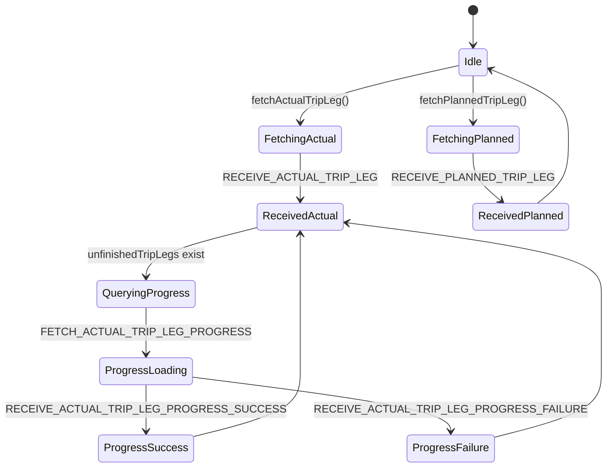

# Diagram: web/portal/src/pages/finishedvehicle/redux/partnerview/PartnerViewTripLegState.js


> Auto-generated by Obscura crawlers

## Diagram 1

```mermaid
flowchart LR
  subgraph Actions[Action Creators]
    A1[fetchActualTripLeg(solutionId, entityId)]
    A2[fetchPlannedTripLeg(solutionId, entityId)]
    A3[fetchActualTripLegProgressUpdates(actualTripLegInternalId, internalEntityId)]
  end

  A1 -->|calls| HTTP1[axios.get /trip-leg/internal/actual-trip-leg]
  HTTP1 -->|response| PROC1[map actualLegs]
  PROC1 --> DECIDE{actualLeg.dest.arrived?}
  DECIDE -->|yes| ARRIVED[set progress=100, isProgressLoading=false]
  DECIDE -->|no| UNFIN[set progress=0, isProgressLoading=true<br/>push internalId to unfinishedTripLeg]
  PROC1 --> DIS1[dispatch RECEIVE_ACTUAL_TRIP_LEG]
  DIS1 --> FOR1[forEach unfinishedTripLeg -> dispatch fetchActualTripLegProgressUpdates]
  FOR1 --> A3

  A3 -->|dispatch| DIS2[FETCH_ACTUAL_TRIP_LEG_PROGRESS]
  A3 -->|calls| HTTP2[axios.get /trip-leg/internal/actual-trip-leg/{id}/progress-update]
  HTTP2 -->|200| DIS3[dispatch RECEIVE_ACTUAL_TRIP_LEG_PROGRESS_SUCCESS]
  HTTP2 -->|404| DIS4[dispatch RECEIVE_ACTUAL_TRIP_LEG_PROGRESS_FAILURE]
  HTTP2 -->|other error| ERR[throw Error]

  A2 -->|calls| HTTP3[axios.get /trip-leg/internal/planned-trip-leg]
  HTTP3 -->|response| DIS5[dispatch RECEIVE_PLANNED_TRIP_LEG]

  %% reducer interactions
  DIS1 --> R[PartnerViewTripLegReducer]
  DIS5 --> R
  DIS2 --> R
  DIS3 --> R
  DIS4 --> R
```

> SVG rendering failed for this diagram.

## Diagram 2

```mermaid
classDiagram
  class PartnerViewTripLegState {
    +string mountPoint = "partnerViewTripLeg"
    +object actionCreators
    +object selectors
    +function reducer(state, action)
  }
  class InitialState {
    +object planned = { tripLegs: [] }
    +object actual = { tripLegs: [] }
  }
  class Actions {
    +RECEIVE_ACTUAL_TRIP_LEG
    +RECEIVE_PLANNED_TRIP_LEG
    +RECEIVE_ACTUAL_TRIP_LEG_PROGRESS_SUCCESS
    +RECEIVE_ACTUAL_TRIP_LEG_PROGRESS_FAILURE
    +FETCH_ACTUAL_TRIP_LEG_PROGRESS
  }
  class Selectors {
    +getActualTripLeg(state)
    +getPlannedTripLeg(state)
    +getCombinedTripLegs(state)
    +getLegLocationCodeString(leg)
  }
  class Reducer {
    +PartnerViewTripLegReducer(state, action)
  }

  PartnerViewTripLegState --> InitialState
  PartnerViewTripLegState --> Actions
  PartnerViewTripLegState --> Selectors
  PartnerViewTripLegState --> Reducer
```

> SVG rendering failed for this diagram.

## Diagram 3



### SVG

<svg id="container" width="763.281005859375" xmlns="http://www.w3.org/2000/svg" class="statediagram" height="690" viewBox="0 0 763.281005859375 690" role="graphics-document document" aria-roledescription="stateDiagram"><style>#container{font-family:"trebuchet ms",verdana,arial,sans-serif;font-size:16px;fill:#333;}@keyframes edge-animation-frame{from{stroke-dashoffset:0;}}@keyframes dash{to{stroke-dashoffset:0;}}#container .edge-animation-slow{stroke-dasharray:9,5!important;stroke-dashoffset:900;animation:dash 50s linear infinite;stroke-linecap:round;}#container .edge-animation-fast{stroke-dasharray:9,5!important;stroke-dashoffset:900;animation:dash 20s linear infinite;stroke-linecap:round;}#container .error-icon{fill:#552222;}#container .error-text{fill:#552222;stroke:#552222;}#container .edge-thickness-normal{stroke-width:1px;}#container .edge-thickness-thick{stroke-width:3.5px;}#container .edge-pattern-solid{stroke-dasharray:0;}#container .edge-thickness-invisible{stroke-width:0;fill:none;}#container .edge-pattern-dashed{stroke-dasharray:3;}#container .edge-pattern-dotted{stroke-dasharray:2;}#container .marker{fill:#333333;stroke:#333333;}#container .marker.cross{stroke:#333333;}#container svg{font-family:"trebuchet ms",verdana,arial,sans-serif;font-size:16px;}#container p{margin:0;}#container defs #statediagram-barbEnd{fill:#333333;stroke:#333333;}#container g.stateGroup text{fill:#9370DB;stroke:none;font-size:10px;}#container g.stateGroup text{fill:#333;stroke:none;font-size:10px;}#container g.stateGroup .state-title{font-weight:bolder;fill:#131300;}#container g.stateGroup rect{fill:#ECECFF;stroke:#9370DB;}#container g.stateGroup line{stroke:#333333;stroke-width:1;}#container .transition{stroke:#333333;stroke-width:1;fill:none;}#container .stateGroup .composit{fill:white;border-bottom:1px;}#container .stateGroup .alt-composit{fill:#e0e0e0;border-bottom:1px;}#container .state-note{stroke:#aaaa33;fill:#fff5ad;}#container .state-note text{fill:black;stroke:none;font-size:10px;}#container .stateLabel .box{stroke:none;stroke-width:0;fill:#ECECFF;opacity:0.5;}#container .edgeLabel .label rect{fill:#ECECFF;opacity:0.5;}#container .edgeLabel{background-color:rgba(232,232,232, 0.8);text-align:center;}#container .edgeLabel p{background-color:rgba(232,232,232, 0.8);}#container .edgeLabel rect{opacity:0.5;background-color:rgba(232,232,232, 0.8);fill:rgba(232,232,232, 0.8);}#container .edgeLabel .label text{fill:#333;}#container .label div .edgeLabel{color:#333;}#container .stateLabel text{fill:#131300;font-size:10px;font-weight:bold;}#container .node circle.state-start{fill:#333333;stroke:#333333;}#container .node .fork-join{fill:#333333;stroke:#333333;}#container .node circle.state-end{fill:#9370DB;stroke:white;stroke-width:1.5;}#container .end-state-inner{fill:white;stroke-width:1.5;}#container .node rect{fill:#ECECFF;stroke:#9370DB;stroke-width:1px;}#container .node polygon{fill:#ECECFF;stroke:#9370DB;stroke-width:1px;}#container #statediagram-barbEnd{fill:#333333;}#container .statediagram-cluster rect{fill:#ECECFF;stroke:#9370DB;stroke-width:1px;}#container .cluster-label,#container .nodeLabel{color:#131300;}#container .statediagram-cluster rect.outer{rx:5px;ry:5px;}#container .statediagram-state .divider{stroke:#9370DB;}#container .statediagram-state .title-state{rx:5px;ry:5px;}#container .statediagram-cluster.statediagram-cluster .inner{fill:white;}#container .statediagram-cluster.statediagram-cluster-alt .inner{fill:#f0f0f0;}#container .statediagram-cluster .inner{rx:0;ry:0;}#container .statediagram-state rect.basic{rx:5px;ry:5px;}#container .statediagram-state rect.divider{stroke-dasharray:10,10;fill:#f0f0f0;}#container .note-edge{stroke-dasharray:5;}#container .statediagram-note rect{fill:#fff5ad;stroke:#aaaa33;stroke-width:1px;rx:0;ry:0;}#container .statediagram-note rect{fill:#fff5ad;stroke:#aaaa33;stroke-width:1px;rx:0;ry:0;}#container .statediagram-note text{fill:black;}#container .statediagram-note .nodeLabel{color:black;}#container .statediagram .edgeLabel{color:red;}#container #dependencyStart,#container #dependencyEnd{fill:#333333;stroke:#333333;stroke-width:1;}#container .statediagramTitleText{text-anchor:middle;font-size:18px;fill:#333;}#container :root{--mermaid-font-family:"trebuchet ms",verdana,arial,sans-serif;}</style><g><defs><marker id="container_stateDiagram-barbEnd" refX="19" refY="7" markerWidth="20" markerHeight="14" markerUnits="userSpaceOnUse" orient="auto"><path d="M 19,7 L9,13 L14,7 L9,1 Z"></path></marker></defs><g class="root"><g class="clusters"></g><g class="edgePaths"><path d="M592.883,22L592.883,26.167C592.883,30.333,592.883,38.667,592.966,47.083C593.049,55.5,593.216,64,593.299,68.25L593.383,72.5" id="edge0" class="edge-thickness-normal edge-pattern-solid transition" style="fill:none;;;fill:none" data-edge="true" data-et="edge" data-id="edge0" data-points="W3sieCI6NTkyLjg4MjgxMjUsInkiOjIyfSx7IngiOjU5Mi44ODI4MTI1LCJ5Ijo0N30seyJ4Ijo1OTMuMzgyODEyNSwieSI6NzIuNX1d" marker-end="url(#container_stateDiagram-barbEnd)"></path><path d="M571.57,98.183L538.658,106.652C505.745,115.122,439.919,132.061,407.09,146.78C374.26,161.5,374.427,174,374.51,180.25L374.594,186.5" id="edge1" class="edge-thickness-normal edge-pattern-solid transition" style="fill:none;;;fill:none" data-edge="true" data-et="edge" data-id="edge1" data-points="W3sieCI6NTcxLjU3MDMxMjUsInkiOjk4LjE4MjY5OTUxNzk0MzIyfSx7IngiOjM3NC4wOTM3NSwieSI6MTQ5fSx7IngiOjM3NC41OTM3NSwieSI6MTg2LjV9XQ==" marker-end="url(#container_stateDiagram-barbEnd)"></path><path d="M374.594,226.5L374.51,232.583C374.427,238.667,374.26,250.833,374.26,263.167C374.26,275.5,374.427,288,374.51,294.25L374.594,300.5" id="edge2" class="edge-thickness-normal edge-pattern-solid transition" style="fill:none;;;fill:none" data-edge="true" data-et="edge" data-id="edge2" data-points="W3sieCI6Mzc0LjU5Mzc1LCJ5IjoyMjYuNX0seyJ4IjozNzQuMDkzNzUsInkiOjI2M30seyJ4IjozNzQuNTkzNzUsInkiOjMwMC41fV0=" marker-end="url(#container_stateDiagram-barbEnd)"></path><path d="M312.815,338.741L290.854,345.117C268.893,351.494,224.97,364.247,203.092,376.873C181.214,389.5,181.38,402,181.464,408.25L181.547,414.5" id="edge3" class="edge-thickness-normal edge-pattern-solid transition" style="fill:none;;;fill:none" data-edge="true" data-et="edge" data-id="edge3" data-points="W3sieCI6MzEyLjgxNTQwMzY1ODM5MzgsInkiOjMzOC43NDA5ODgwNTc4MDQ5fSx7IngiOjE4MS4wNDY4NzUsInkiOjM3N30seyJ4IjoxODEuNTQ2ODc1LCJ5Ijo0MTQuNX1d" marker-end="url(#container_stateDiagram-barbEnd)"></path><path d="M181.547,454.5L181.464,460.583C181.38,466.667,181.214,478.833,181.214,491.167C181.214,503.5,181.38,516,181.464,522.25L181.547,528.5" id="edge4" class="edge-thickness-normal edge-pattern-solid transition" style="fill:none;;;fill:none" data-edge="true" data-et="edge" data-id="edge4" data-points="W3sieCI6MTgxLjU0Njg3NSwieSI6NDU0LjV9LHsieCI6MTgxLjA0Njg3NSwieSI6NDkxfSx7IngiOjE4MS41NDY4NzUsInkiOjUyOC41fV0=" marker-end="url(#container_stateDiagram-barbEnd)"></path><path d="M181.547,568.5L181.464,574.583C181.38,580.667,181.214,592.833,181.214,605.167C181.214,617.5,181.38,630,181.464,636.25L181.547,642.5" id="edge5" class="edge-thickness-normal edge-pattern-solid transition" style="fill:none;;;fill:none" data-edge="true" data-et="edge" data-id="edge5" data-points="W3sieCI6MTgxLjU0Njg3NSwieSI6NTY4LjV9LHsieCI6MTgxLjA0Njg3NSwieSI6NjA1fSx7IngiOjE4MS41NDY4NzUsInkiOjY0Mi41fV0=" marker-end="url(#container_stateDiagram-barbEnd)"></path><path d="M248.938,558.513L301.563,566.261C354.188,574.008,459.438,589.504,512.146,603.502C564.854,617.5,565.021,630,565.104,636.25L565.188,642.5" id="edge6" class="edge-thickness-normal edge-pattern-solid transition" style="fill:none;;;fill:none" data-edge="true" data-et="edge" data-id="edge6" data-points="W3sieCI6MjQ4LjkzNzUsInkiOjU1OC41MTI2NjY0NzY2MDE3fSx7IngiOjU2NC42ODc1LCJ5Ijo2MDV9LHsieCI6NTY1LjE4NzUsInkiOjY0Mi41fV0=" marker-end="url(#container_stateDiagram-barbEnd)"></path><path d="M246.259,643.393L267.565,636.994C288.871,630.595,331.482,617.798,352.788,601.899C374.094,586,374.094,567,374.094,548C374.094,529,374.094,510,374.094,491C374.094,472,374.094,453,374.094,434C374.094,415,374.094,396,374.177,380.417C374.26,364.833,374.427,352.667,374.51,346.583L374.594,340.5" id="edge7" class="edge-thickness-normal edge-pattern-solid transition" style="fill:none;;;fill:none" data-edge="true" data-et="edge" data-id="edge7" data-points="W3sieCI6MjQ2LjI1ODkyMzcyNTcxNjc2LCJ5Ijo2NDMuMzkyNzkyMDg4MTA4OX0seyJ4IjozNzQuMDkzNzUsInkiOjYwNX0seyJ4IjozNzQuMDkzNzUsInkiOjU0OH0seyJ4IjozNzQuMDkzNzUsInkiOjQ5MX0seyJ4IjozNzQuMDkzNzUsInkiOjQzNH0seyJ4IjozNzQuMDkzNzUsInkiOjM3N30seyJ4IjozNzQuNTkzNzUsInkiOjM0MC41fV0=" marker-end="url(#container_stateDiagram-barbEnd)"></path><path d="M626.85,644.059L648.256,637.549C669.661,631.039,712.471,618.02,733.876,602.01C755.281,586,755.281,567,755.281,548C755.281,529,755.281,510,755.281,491C755.281,472,755.281,453,755.281,434C755.281,415,755.281,396,702.329,378.653C649.378,361.306,543.474,345.611,490.522,337.764L437.57,329.917" id="edge8" class="edge-thickness-normal edge-pattern-solid transition" style="fill:none;;;fill:none" data-edge="true" data-et="edge" data-id="edge8" data-points="W3sieCI6NjI2Ljg1MDM2MDU3OTM3MDksInkiOjY0NC4wNTg3NzA2Njc4NTE2fSx7IngiOjc1NS4yODEyNSwieSI6NjA1fSx7IngiOjc1NS4yODEyNSwieSI6NTQ4fSx7IngiOjc1NS4yODEyNSwieSI6NDkxfSx7IngiOjc1NS4yODEyNSwieSI6NDM0fSx7IngiOjc1NS4yODEyNSwieSI6Mzc3fSx7IngiOjQzNy41NzAzMTI1LCJ5IjozMjkuOTE3MDU2MDc0NzY2NH1d" marker-end="url(#container_stateDiagram-barbEnd)"></path><path d="M593.383,112.5L593.299,118.583C593.216,124.667,593.049,136.833,593.049,149.167C593.049,161.5,593.216,174,593.299,180.25L593.383,186.5" id="edge9" class="edge-thickness-normal edge-pattern-solid transition" style="fill:none;;;fill:none" data-edge="true" data-et="edge" data-id="edge9" data-points="W3sieCI6NTkzLjM4MjgxMjUsInkiOjExMi41fSx7IngiOjU5Mi44ODI4MTI1LCJ5IjoxNDl9LHsieCI6NTkzLjM4MjgxMjUsInkiOjE4Ni41fV0=" marker-end="url(#container_stateDiagram-barbEnd)"></path><path d="M593.383,226.5L593.299,232.583C593.216,238.667,593.049,250.833,599.682,263.167C606.314,275.5,619.746,288,626.461,294.25L633.177,300.5" id="edge10" class="edge-thickness-normal edge-pattern-solid transition" style="fill:none;;;fill:none" data-edge="true" data-et="edge" data-id="edge10" data-points="W3sieCI6NTkzLjM4MjgxMjUsInkiOjIyNi41fSx7IngiOjU5Mi44ODI4MTI1LCJ5IjoyNjN9LHsieCI6NjMzLjE3NzA4MzMzMzMzMzQsInkiOjMwMC41fV0=" marker-end="url(#container_stateDiagram-barbEnd)"></path><path d="M676.198,300.5L682.747,294.25C689.296,288,702.394,275.5,708.943,259.75C715.492,244,715.492,225,715.492,206C715.492,187,715.492,168,698.776,150.773C682.06,133.547,648.628,118.094,631.911,110.367L615.195,102.64" id="edge11" class="edge-thickness-normal edge-pattern-solid transition" style="fill:none;;;fill:none" data-edge="true" data-et="edge" data-id="edge11" data-points="W3sieCI6Njc2LjE5NzkxNjY2NjY2NjYsInkiOjMwMC41fSx7IngiOjcxNS40OTIxODc1LCJ5IjoyNjN9LHsieCI6NzE1LjQ5MjE4NzUsInkiOjIwNn0seyJ4Ijo3MTUuNDkyMTg3NSwieSI6MTQ5fSx7IngiOjYxNS4xOTUzMTI1LCJ5IjoxMDIuNjQwNDM1ODM1MzUxMDh9XQ==" marker-end="url(#container_stateDiagram-barbEnd)"></path></g><g class="edgeLabels"><g class="edgeLabel"><g class="label" data-id="edge0" transform="translate(0, 0)"><foreignObject width="0" height="0"><div xmlns="http://www.w3.org/1999/xhtml" class="labelBkg" style="display: table-cell; white-space: nowrap; line-height: 1.5; max-width: 200px; text-align: center;"><span class="edgeLabel"></span></div></foreignObject></g></g><g class="edgeLabel" transform="translate(374.09375, 149)"><g class="label" data-id="edge1" transform="translate(-72.2890625, -12)"><foreignObject width="144.578125" height="24"><div xmlns="http://www.w3.org/1999/xhtml" class="labelBkg" style="display: table-cell; white-space: nowrap; line-height: 1.5; max-width: 200px; text-align: center;"><span class="edgeLabel"><p>fetchActualTripLeg()</p></span></div></foreignObject></g></g><g class="edgeLabel" transform="translate(374.09375, 263)"><g class="label" data-id="edge2" transform="translate(-96.1796875, -12)"><foreignObject width="192.359375" height="24"><div xmlns="http://www.w3.org/1999/xhtml" class="labelBkg" style="display: table-cell; white-space: nowrap; line-height: 1.5; max-width: 200px; text-align: center;"><span class="edgeLabel"><p>RECEIVE_ACTUAL_TRIP_LEG</p></span></div></foreignObject></g></g><g class="edgeLabel" transform="translate(181.046875, 377)"><g class="label" data-id="edge3" transform="translate(-87.6015625, -12)"><foreignObject width="175.203125" height="24"><div xmlns="http://www.w3.org/1999/xhtml" class="labelBkg" style="display: table-cell; white-space: nowrap; line-height: 1.5; max-width: 200px; text-align: center;"><span class="edgeLabel"><p>unfinishedTripLegs exist</p></span></div></foreignObject></g></g><g class="edgeLabel" transform="translate(181.046875, 491)"><g class="label" data-id="edge4" transform="translate(-131.1171875, -12)"><foreignObject width="262.234375" height="24"><div xmlns="http://www.w3.org/1999/xhtml" class="labelBkg" style="display: table; white-space: break-spaces; line-height: 1.5; max-width: 200px; text-align: center; width: 200px;"><span class="edgeLabel"><p>FETCH_ACTUAL_TRIP_LEG_PROGRESS</p></span></div></foreignObject></g></g><g class="edgeLabel" transform="translate(181.046875, 605)"><g class="label" data-id="edge5" transform="translate(-173.046875, -12)"><foreignObject width="346.09375" height="24"><div xmlns="http://www.w3.org/1999/xhtml" class="labelBkg" style="display: table; white-space: break-spaces; line-height: 1.5; max-width: 200px; text-align: center; width: 200px;"><span class="edgeLabel"><p>RECEIVE_ACTUAL_TRIP_LEG_PROGRESS_SUCCESS</p></span></div></foreignObject></g></g><g class="edgeLabel" transform="translate(564.6875, 605)"><g class="label" data-id="edge6" transform="translate(-170.59375, -12)"><foreignObject width="341.1875" height="24"><div xmlns="http://www.w3.org/1999/xhtml" class="labelBkg" style="display: table; white-space: break-spaces; line-height: 1.5; max-width: 200px; text-align: center; width: 200px;"><span class="edgeLabel"><p>RECEIVE_ACTUAL_TRIP_LEG_PROGRESS_FAILURE</p></span></div></foreignObject></g></g><g class="edgeLabel"><g class="label" data-id="edge7" transform="translate(0, 0)"><foreignObject width="0" height="0"><div xmlns="http://www.w3.org/1999/xhtml" class="labelBkg" style="display: table-cell; white-space: nowrap; line-height: 1.5; max-width: 200px; text-align: center;"><span class="edgeLabel"></span></div></foreignObject></g></g><g class="edgeLabel"><g class="label" data-id="edge8" transform="translate(0, 0)"><foreignObject width="0" height="0"><div xmlns="http://www.w3.org/1999/xhtml" class="labelBkg" style="display: table-cell; white-space: nowrap; line-height: 1.5; max-width: 200px; text-align: center;"><span class="edgeLabel"></span></div></foreignObject></g></g><g class="edgeLabel" transform="translate(592.8828125, 149)"><g class="label" data-id="edge9" transform="translate(-79.46875, -12)"><foreignObject width="158.9375" height="24"><div xmlns="http://www.w3.org/1999/xhtml" class="labelBkg" style="display: table-cell; white-space: nowrap; line-height: 1.5; max-width: 200px; text-align: center;"><span class="edgeLabel"><p>fetchPlannedTripLeg()</p></span></div></foreignObject></g></g><g class="edgeLabel" transform="translate(592.8828125, 263)"><g class="label" data-id="edge10" transform="translate(-102.609375, -12)"><foreignObject width="205.21875" height="24"><div xmlns="http://www.w3.org/1999/xhtml" class="labelBkg" style="display: table; white-space: break-spaces; line-height: 1.5; max-width: 200px; text-align: center; width: 200px;"><span class="edgeLabel"><p>RECEIVE_PLANNED_TRIP_LEG</p></span></div></foreignObject></g></g><g class="edgeLabel"><g class="label" data-id="edge11" transform="translate(0, 0)"><foreignObject width="0" height="0"><div xmlns="http://www.w3.org/1999/xhtml" class="labelBkg" style="display: table-cell; white-space: nowrap; line-height: 1.5; max-width: 200px; text-align: center;"><span class="edgeLabel"></span></div></foreignObject></g></g></g><g class="nodes"><g class="node default" id="state-root_start-0" transform="translate(592.8828125, 15)"><circle class="state-start" r="7" width="14" height="14"></circle></g><g class="node  statediagram-state" id="state-Idle-11" transform="translate(592.8828125, 92)"><g class="basic label-container outer-path"><path d="M-16.8125 -20 C-5.549377153014211 -20, 5.713745693971578 -20, 16.8125 -20 C16.8125 -20, 16.8125 -20, 16.8125 -20 C16.932466058445492 -19.995038167119887, 17.052432116890984 -19.990076334239774, 17.225396727361662 -19.982922465033347 C17.340240152264723 -19.96860724704804, 17.455083577167784 -19.95429202906273, 17.63547295140367 -19.931806517013612 C17.745947546461192 -19.90864243034555, 17.856422141518713 -19.88547834367749, 18.039927435703998 -19.847001329696653 C18.134396810739783 -19.81887657819146, 18.228866185775566 -19.79075182668627, 18.435997346023417 -19.729086208503173 C18.525023774063428 -19.694347988485347, 18.61405020210344 -19.65960976846752, 18.820977123264846 -19.578866633275286 C18.91195126258599 -19.53439208659292, 19.00292540190713 -19.489917539910554, 19.19223696518537 -19.397368756032446 C19.266702428113703 -19.352996971288718, 19.341167891042033 -19.308625186544987, 19.547240790612136 -19.185832391312644 C19.63394706858694 -19.123925298739042, 19.720653346561743 -19.062018206165437, 19.88356356344834 -18.94570254698197 C19.973361206222297 -18.869647823125092, 20.063158848996252 -18.793593099268218, 20.198907858128706 -18.678619553365657 C20.310228850063567 -18.567298561430796, 20.421549841998424 -18.45597756949594, 20.491119553365657 -18.386407858128706 C20.569444289506016 -18.29393001691621, 20.647769025646376 -18.201452175703714, 20.75820254698197 -18.07106356344834 C20.818459760014484 -17.98666808554777, 20.878716973047 -17.9022726076472, 20.998332391312644 -17.734740790612136 C21.076001149525613 -17.604395796179276, 21.15366990773858 -17.474050801746415, 21.209868756032446 -17.37973696518537 C21.260852741453828 -17.275447556099362, 21.31183672687521 -17.171158147013355, 21.391366633275286 -17.008477123264846 C21.436710722693146 -16.892270181414418, 21.482054812111006 -16.776063239563992, 21.541586208503173 -16.623497346023417 C21.58384877996817 -16.48153987084477, 21.62611135143317 -16.339582395666124, 21.659501329696653 -16.227427435703994 C21.67697056214562 -16.14411284582093, 21.694439794594583 -16.060798255937872, 21.744306517013612 -15.82297295140367 C21.759458211101947 -15.701418921002325, 21.774609905190285 -15.57986489060098, 21.795422465033347 -15.412896727361662 C21.801076074758207 -15.2762050468742, 21.80672968448307 -15.139513366386735, 21.8125 -15 C21.8125 -15, 21.8125 -15, 21.8125 -15 C21.8125 -7.352274468719662, 21.8125 0.29545106256067655, 21.8125 15 C21.8125 15, 21.8125 15, 21.8125 15 C21.806131047335157 15.153987078180158, 21.799762094670317 15.307974156360318, 21.795422465033347 15.412896727361662 C21.784659238633488 15.499244401845939, 21.77389601223363 15.585592076330215, 21.744306517013612 15.822972951403669 C21.721128907069218 15.933512041923414, 21.697951297124828 16.04405113244316, 21.659501329696653 16.227427435703994 C21.6250528451181 16.343137855704157, 21.590604360539547 16.458848275704316, 21.541586208503173 16.623497346023417 C21.507608779653584 16.7105740333986, 21.47363135080399 16.797650720773785, 21.391366633275286 17.008477123264846 C21.351141920012164 17.09075808937986, 21.310917206749043 17.173039055494872, 21.209868756032446 17.379736965185366 C21.137339519681593 17.50145672903751, 21.06481028333074 17.62317649288965, 20.998332391312644 17.734740790612133 C20.907317390149267 17.862215231143587, 20.81630238898589 17.98968967167504, 20.75820254698197 18.07106356344834 C20.70096231639579 18.13864697599415, 20.643722085809607 18.20623038853996, 20.491119553365657 18.386407858128706 C20.41639326283068 18.46113414866368, 20.3416669722957 18.53586043919866, 20.198907858128706 18.678619553365657 C20.125029569176675 18.7411912723072, 20.051151280224648 18.803762991248743, 19.88356356344834 18.94570254698197 C19.803837200958547 19.002626075687083, 19.724110838468754 19.059549604392195, 19.547240790612136 19.185832391312644 C19.435087822180986 19.25266105493603, 19.32293485374983 19.319489718559417, 19.19223696518537 19.397368756032446 C19.111019230073254 19.437073687330876, 19.029801494961134 19.476778618629307, 18.820977123264846 19.578866633275286 C18.70234392209846 19.62515745201604, 18.583710720932075 19.671448270756795, 18.435997346023417 19.729086208503173 C18.295963292165112 19.770776152630965, 18.155929238306808 19.812466096758758, 18.039927435703998 19.847001329696653 C17.938340814568146 19.868301804209196, 17.8367541934323 19.88960227872174, 17.63547295140367 19.931806517013612 C17.47677373681901 19.951588353481778, 17.318074522234348 19.971370189949944, 17.225396727361662 19.982922465033347 C17.082988412383685 19.9888125165097, 16.940580097405704 19.994702567986057, 16.8125 20 C16.8125 20, 16.8125 20, 16.8125 20 C7.992679757604167 20, -0.8271404847916664 20, -16.8125 20 C-16.8125 20, -16.8125 20, -16.8125 20 C-16.922660471446093 19.995443729198136, -17.03282094289219 19.99088745839627, -17.225396727361662 19.982922465033347 C-17.360759497190486 19.966049513370418, -17.496122267019313 19.94917656170749, -17.63547295140367 19.931806517013612 C-17.73058704767241 19.91186318824942, -17.825701143941153 19.891919859485224, -18.039927435703994 19.847001329696653 C-18.173592226770232 19.807207597258948, -18.307257017836474 19.767413864821243, -18.435997346023417 19.729086208503173 C-18.572497884125653 19.675823533255592, -18.70899842222789 19.622560858008015, -18.820977123264846 19.578866633275286 C-18.922672408236174 19.52915083785712, -19.024367693207505 19.47943504243895, -19.19223696518537 19.397368756032446 C-19.327618656090664 19.316698778154606, -19.46300034699596 19.236028800276763, -19.547240790612133 19.185832391312644 C-19.675895696092155 19.09397455437592, -19.804550601572174 19.002116717439197, -19.88356356344834 18.94570254698197 C-19.979336510449397 18.864586998598813, -20.075109457450452 18.783471450215654, -20.198907858128706 18.67861955336566 C-20.26831495486546 18.609212456628907, -20.33772205160221 18.539805359892153, -20.491119553365657 18.386407858128706 C-20.58048653105316 18.280892466957575, -20.669853508740665 18.17537707578644, -20.758202546981966 18.07106356344834 C-20.836002609998438 17.962097795392875, -20.91380267301491 17.853132027337413, -20.998332391312644 17.734740790612133 C-21.061791627392576 17.628242451204265, -21.125250863472505 17.5217441117964, -21.209868756032446 17.37973696518537 C-21.260435526130387 17.276300983684195, -21.31100229622833 17.172865002183016, -21.391366633275286 17.00847712326485 C-21.44340320815312 16.875118811110887, -21.495439783030957 16.74176049895693, -21.541586208503173 16.623497346023417 C-21.567326543331497 16.537037085423613, -21.593066878159817 16.450576824823813, -21.659501329696653 16.227427435703994 C-21.683155791487856 16.114614134444412, -21.706810253279063 16.00180083318483, -21.744306517013612 15.82297295140367 C-21.75498131508456 15.73733469064686, -21.76565611315551 15.651696429890048, -21.795422465033347 15.412896727361664 C-21.800169530728187 15.298123260711009, -21.804916596423027 15.183349794060353, -21.8125 15 C-21.8125 15, -21.8125 15, -21.8125 15 C-21.8125 6.547909611338989, -21.8125 -1.904180777322022, -21.8125 -15 C-21.8125 -15, -21.8125 -15, -21.8125 -15 C-21.808887208536092 -15.0873492441972, -21.80527441707218 -15.1746984883944, -21.795422465033347 -15.41289672736166 C-21.77927168737706 -15.542465876975687, -21.763120909720776 -15.672035026589711, -21.744306517013612 -15.822972951403669 C-21.711590226695844 -15.97900409463123, -21.678873936378075 -16.135035237858794, -21.659501329696653 -16.227427435703994 C-21.62207941790044 -16.353125421671262, -21.58465750610423 -16.478823407638533, -21.541586208503173 -16.623497346023417 C-21.50872465872387 -16.70771428043194, -21.475863108944573 -16.791931214840467, -21.39136663327529 -17.008477123264846 C-21.328149801834073 -17.137789218833767, -21.264932970392856 -17.267101314402684, -21.209868756032446 -17.379736965185366 C-21.157043973571255 -17.46838838866945, -21.10421919111007 -17.557039812153533, -20.998332391312644 -17.734740790612133 C-20.933147600390065 -17.826037770756095, -20.86796280946749 -17.917334750900054, -20.75820254698197 -18.07106356344834 C-20.684950402120165 -18.15755220745558, -20.611698257258364 -18.244040851462824, -20.49111955336566 -18.386407858128706 C-20.413340625973262 -18.464186785521104, -20.335561698580864 -18.541965712913502, -20.198907858128706 -18.678619553365657 C-20.091096658994676 -18.76993098121079, -19.983285459860642 -18.861242409055926, -19.88356356344834 -18.945702546981966 C-19.769352077648755 -19.027247980478933, -19.655140591849168 -19.1087934139759, -19.547240790612136 -19.185832391312644 C-19.470224212282854 -19.23172431088097, -19.393207633953576 -19.277616230449297, -19.192236965185366 -19.397368756032446 C-19.067248172293624 -19.4584720535818, -18.942259379401882 -19.519575351131156, -18.82097712326485 -19.578866633275286 C-18.668049087988027 -19.638539337811434, -18.51512105271121 -19.698212042347578, -18.43599734602342 -19.729086208503173 C-18.309058147118638 -19.76687764540124, -18.182118948213855 -19.804669082299313, -18.039927435703994 -19.847001329696653 C-17.916294979842508 -19.87292432965035, -17.792662523981022 -19.898847329604045, -17.635472951403674 -19.931806517013612 C-17.551926925168573 -19.942220518323406, -17.46838089893347 -19.9526345196332, -17.225396727361662 -19.982922465033347 C-17.060743124178543 -19.98973258843566, -16.896089520995428 -19.99654271183798, -16.8125 -20 C-16.8125 -20, -16.8125 -20, -16.8125 -20" stroke="none" stroke-width="0" fill="#ECECFF" style=""></path><path d="M-16.8125 -20 C-9.96338605364339 -20, -3.1142721072867783 -20, 16.8125 -20 M-16.8125 -20 C-4.1837653491207245 -20, 8.444969301758551 -20, 16.8125 -20 M16.8125 -20 C16.8125 -20, 16.8125 -20, 16.8125 -20 M16.8125 -20 C16.8125 -20, 16.8125 -20, 16.8125 -20 M16.8125 -20 C16.967958907396145 -19.993570172028488, 17.123417814792287 -19.98714034405698, 17.225396727361662 -19.982922465033347 M16.8125 -20 C16.932922349225645 -19.99501929479362, 17.05334469845129 -19.99003858958724, 17.225396727361662 -19.982922465033347 M17.225396727361662 -19.982922465033347 C17.376432272805737 -19.96409590392733, 17.527467818249814 -19.945269342821312, 17.63547295140367 -19.931806517013612 M17.225396727361662 -19.982922465033347 C17.36949810078094 -19.964960247568825, 17.51359947420022 -19.946998030104304, 17.63547295140367 -19.931806517013612 M17.63547295140367 -19.931806517013612 C17.73539088691143 -19.910855929083507, 17.835308822419183 -19.8899053411534, 18.039927435703998 -19.847001329696653 M17.63547295140367 -19.931806517013612 C17.73404832445785 -19.91113743482712, 17.832623697512027 -19.890468352640628, 18.039927435703998 -19.847001329696653 M18.039927435703998 -19.847001329696653 C18.125089681604567 -19.821647430587337, 18.210251927505137 -19.79629353147802, 18.435997346023417 -19.729086208503173 M18.039927435703998 -19.847001329696653 C18.178661495940887 -19.805698410438527, 18.317395556177775 -19.7643954911804, 18.435997346023417 -19.729086208503173 M18.435997346023417 -19.729086208503173 C18.554464745286985 -19.68286008586566, 18.67293214455055 -19.636633963228142, 18.820977123264846 -19.578866633275286 M18.435997346023417 -19.729086208503173 C18.529712787428927 -19.69251832979249, 18.623428228834438 -19.65595045108181, 18.820977123264846 -19.578866633275286 M18.820977123264846 -19.578866633275286 C18.90332157011125 -19.53861088617362, 18.985666016957648 -19.49835513907195, 19.19223696518537 -19.397368756032446 M18.820977123264846 -19.578866633275286 C18.947646118031216 -19.516941935081018, 19.074315112797585 -19.455017236886746, 19.19223696518537 -19.397368756032446 M19.19223696518537 -19.397368756032446 C19.3084556059449 -19.328117477544406, 19.42467424670443 -19.25886619905637, 19.547240790612136 -19.185832391312644 M19.19223696518537 -19.397368756032446 C19.32389777757361 -19.318915940502407, 19.455558589961853 -19.24046312497237, 19.547240790612136 -19.185832391312644 M19.547240790612136 -19.185832391312644 C19.673910426303173 -19.095392009760708, 19.80058006199421 -19.00495162820877, 19.88356356344834 -18.94570254698197 M19.547240790612136 -19.185832391312644 C19.67149463510315 -19.097116851524778, 19.795748479594167 -19.008401311736915, 19.88356356344834 -18.94570254698197 M19.88356356344834 -18.94570254698197 C20.002312860363354 -18.845127022880476, 20.121062157278367 -18.74455149877898, 20.198907858128706 -18.678619553365657 M19.88356356344834 -18.94570254698197 C20.007507035387153 -18.84072778104187, 20.131450507325965 -18.73575301510177, 20.198907858128706 -18.678619553365657 M20.198907858128706 -18.678619553365657 C20.286453565793455 -18.591073845700908, 20.373999273458203 -18.50352813803616, 20.491119553365657 -18.386407858128706 M20.198907858128706 -18.678619553365657 C20.314796212813377 -18.562731198680986, 20.43068456749805 -18.44684284399631, 20.491119553365657 -18.386407858128706 M20.491119553365657 -18.386407858128706 C20.55719732821663 -18.308389976786685, 20.62327510306761 -18.230372095444665, 20.75820254698197 -18.07106356344834 M20.491119553365657 -18.386407858128706 C20.55211476270583 -18.314390950545704, 20.613109972046 -18.2423740429627, 20.75820254698197 -18.07106356344834 M20.75820254698197 -18.07106356344834 C20.85314841490865 -17.938083601463823, 20.948094282835328 -17.80510363947931, 20.998332391312644 -17.734740790612136 M20.75820254698197 -18.07106356344834 C20.823907703547732 -17.97903776587441, 20.8896128601135 -17.887011968300474, 20.998332391312644 -17.734740790612136 M20.998332391312644 -17.734740790612136 C21.04288329670688 -17.659974724446023, 21.087434202101118 -17.585208658279907, 21.209868756032446 -17.37973696518537 M20.998332391312644 -17.734740790612136 C21.05521250624909 -17.639283641105475, 21.112092621185543 -17.543826491598814, 21.209868756032446 -17.37973696518537 M21.209868756032446 -17.37973696518537 C21.259942553942242 -17.277309374412628, 21.31001635185204 -17.174881783639886, 21.391366633275286 -17.008477123264846 M21.209868756032446 -17.37973696518537 C21.249236401076686 -17.299209160133675, 21.288604046120927 -17.21868135508198, 21.391366633275286 -17.008477123264846 M21.391366633275286 -17.008477123264846 C21.442989143506374 -16.87617996785578, 21.49461165373746 -16.743882812446714, 21.541586208503173 -16.623497346023417 M21.391366633275286 -17.008477123264846 C21.447542326774172 -16.86451115919674, 21.503718020273055 -16.720545195128636, 21.541586208503173 -16.623497346023417 M21.541586208503173 -16.623497346023417 C21.569508583375747 -16.529707742113846, 21.59743095824832 -16.435918138204276, 21.659501329696653 -16.227427435703994 M21.541586208503173 -16.623497346023417 C21.584478062802894 -16.47942614706286, 21.627369917102616 -16.3353549481023, 21.659501329696653 -16.227427435703994 M21.659501329696653 -16.227427435703994 C21.68973511379396 -16.08323590753932, 21.719968897891267 -15.939044379374643, 21.744306517013612 -15.82297295140367 M21.659501329696653 -16.227427435703994 C21.683261660157854 -16.114109223604864, 21.70702199061905 -16.000791011505733, 21.744306517013612 -15.82297295140367 M21.744306517013612 -15.82297295140367 C21.75475791521617 -15.73912690967105, 21.765209313418733 -15.65528086793843, 21.795422465033347 -15.412896727361662 M21.744306517013612 -15.82297295140367 C21.763713670943023 -15.667279616718718, 21.783120824872437 -15.511586282033766, 21.795422465033347 -15.412896727361662 M21.795422465033347 -15.412896727361662 C21.799709420835757 -15.309247692262868, 21.803996376638167 -15.205598657164074, 21.8125 -15 M21.795422465033347 -15.412896727361662 C21.800054135591065 -15.300913257895326, 21.80468580614878 -15.18892978842899, 21.8125 -15 M21.8125 -15 C21.8125 -15, 21.8125 -15, 21.8125 -15 M21.8125 -15 C21.8125 -15, 21.8125 -15, 21.8125 -15 M21.8125 -15 C21.8125 -6.30319377817375, 21.8125 2.3936124436525006, 21.8125 15 M21.8125 -15 C21.8125 -6.113639016800047, 21.8125 2.7727219663999065, 21.8125 15 M21.8125 15 C21.8125 15, 21.8125 15, 21.8125 15 M21.8125 15 C21.8125 15, 21.8125 15, 21.8125 15 M21.8125 15 C21.807447135459046 15.122167001082694, 21.802394270918096 15.244334002165388, 21.795422465033347 15.412896727361662 M21.8125 15 C21.80625088034409 15.151089783148137, 21.800001760688183 15.302179566296273, 21.795422465033347 15.412896727361662 M21.795422465033347 15.412896727361662 C21.78346747819888 15.508805265684346, 21.77151249136441 15.604713804007032, 21.744306517013612 15.822972951403669 M21.795422465033347 15.412896727361662 C21.7769232490064 15.561306156315965, 21.75842403297946 15.709715585270267, 21.744306517013612 15.822972951403669 M21.744306517013612 15.822972951403669 C21.727333725238374 15.90391990714747, 21.710360933463136 15.984866862891272, 21.659501329696653 16.227427435703994 M21.744306517013612 15.822972951403669 C21.714956806901146 15.962948137397134, 21.685607096788676 16.102923323390602, 21.659501329696653 16.227427435703994 M21.659501329696653 16.227427435703994 C21.629972519570654 16.32661296051258, 21.600443709444654 16.425798485321167, 21.541586208503173 16.623497346023417 M21.659501329696653 16.227427435703994 C21.622609250603137 16.351345744994365, 21.585717171509625 16.475264054284736, 21.541586208503173 16.623497346023417 M21.541586208503173 16.623497346023417 C21.489997143114003 16.755708789648434, 21.438408077724834 16.887920233273455, 21.391366633275286 17.008477123264846 M21.541586208503173 16.623497346023417 C21.50039183590533 16.729069475103532, 21.459197463307483 16.83464160418365, 21.391366633275286 17.008477123264846 M21.391366633275286 17.008477123264846 C21.343487730797758 17.106414983669417, 21.29560882832023 17.204352844073988, 21.209868756032446 17.379736965185366 M21.391366633275286 17.008477123264846 C21.33520170409512 17.123364322198896, 21.279036774914953 17.238251521132945, 21.209868756032446 17.379736965185366 M21.209868756032446 17.379736965185366 C21.14602078015338 17.486887694152696, 21.082172804274308 17.594038423120022, 20.998332391312644 17.734740790612133 M21.209868756032446 17.379736965185366 C21.134678073781195 17.5059232115596, 21.05948739152994 17.632109457933836, 20.998332391312644 17.734740790612133 M20.998332391312644 17.734740790612133 C20.94875713815761 17.804175252836654, 20.899181885002573 17.873609715061175, 20.75820254698197 18.07106356344834 M20.998332391312644 17.734740790612133 C20.909345221858917 17.859375076121058, 20.820358052405194 17.98400936162998, 20.75820254698197 18.07106356344834 M20.75820254698197 18.07106356344834 C20.65912483110484 18.18804440153457, 20.560047115227714 18.305025239620793, 20.491119553365657 18.386407858128706 M20.75820254698197 18.07106356344834 C20.69606894450156 18.14442456927218, 20.633935342021154 18.217785575096016, 20.491119553365657 18.386407858128706 M20.491119553365657 18.386407858128706 C20.397252350089463 18.4802750614049, 20.30338514681327 18.574142264681093, 20.198907858128706 18.678619553365657 M20.491119553365657 18.386407858128706 C20.397798654963267 18.479728756531095, 20.304477756560882 18.57304965493348, 20.198907858128706 18.678619553365657 M20.198907858128706 18.678619553365657 C20.09443622725924 18.76710251117175, 19.98996459638978 18.855585468977843, 19.88356356344834 18.94570254698197 M20.198907858128706 18.678619553365657 C20.131763144470458 18.735488224947403, 20.064618430812207 18.79235689652915, 19.88356356344834 18.94570254698197 M19.88356356344834 18.94570254698197 C19.77586461932056 19.02259811509914, 19.66816567519278 19.099493683216313, 19.547240790612136 19.185832391312644 M19.88356356344834 18.94570254698197 C19.76221858891206 19.03234119354159, 19.640873614375774 19.11897984010121, 19.547240790612136 19.185832391312644 M19.547240790612136 19.185832391312644 C19.41006361611077 19.267572245190753, 19.2728864416094 19.349312099068857, 19.19223696518537 19.397368756032446 M19.547240790612136 19.185832391312644 C19.408010958474936 19.26879536365652, 19.26878112633774 19.351758336000398, 19.19223696518537 19.397368756032446 M19.19223696518537 19.397368756032446 C19.04854208978004 19.46761690008656, 18.904847214374712 19.53786504414068, 18.820977123264846 19.578866633275286 M19.19223696518537 19.397368756032446 C19.087365437148527 19.44863732206813, 18.982493909111685 19.49990588810381, 18.820977123264846 19.578866633275286 M18.820977123264846 19.578866633275286 C18.70590960538844 19.623766118078823, 18.59084208751204 19.66866560288236, 18.435997346023417 19.729086208503173 M18.820977123264846 19.578866633275286 C18.73578740265247 19.612107765409217, 18.650597682040093 19.645348897543148, 18.435997346023417 19.729086208503173 M18.435997346023417 19.729086208503173 C18.309830743731332 19.766647633423947, 18.18366414143925 19.80420905834472, 18.039927435703998 19.847001329696653 M18.435997346023417 19.729086208503173 C18.34828729371677 19.75519862244364, 18.26057724141012 19.78131103638411, 18.039927435703998 19.847001329696653 M18.039927435703998 19.847001329696653 C17.922436633521333 19.871636560294622, 17.80494583133867 19.896271790892587, 17.63547295140367 19.931806517013612 M18.039927435703998 19.847001329696653 C17.953099898841447 19.865207149668304, 17.866272361978897 19.883412969639956, 17.63547295140367 19.931806517013612 M17.63547295140367 19.931806517013612 C17.476739890442204 19.951592572428247, 17.31800682948074 19.971378627842885, 17.225396727361662 19.982922465033347 M17.63547295140367 19.931806517013612 C17.541077365224115 19.943572914560114, 17.446681779044557 19.955339312106616, 17.225396727361662 19.982922465033347 M17.225396727361662 19.982922465033347 C17.1193024448545 19.987310557016674, 17.013208162347343 19.991698649000003, 16.8125 20 M17.225396727361662 19.982922465033347 C17.07254444993022 19.98924448199204, 16.919692172498777 19.995566498950726, 16.8125 20 M16.8125 20 C16.8125 20, 16.8125 20, 16.8125 20 M16.8125 20 C16.8125 20, 16.8125 20, 16.8125 20 M16.8125 20 C5.530612381536061 20, -5.751275236927878 20, -16.8125 20 M16.8125 20 C6.4993949672026865 20, -3.813710065594627 20, -16.8125 20 M-16.8125 20 C-16.8125 20, -16.8125 20, -16.8125 20 M-16.8125 20 C-16.8125 20, -16.8125 20, -16.8125 20 M-16.8125 20 C-16.92831268348989 19.995209951978747, -17.04412536697978 19.990419903957495, -17.225396727361662 19.982922465033347 M-16.8125 20 C-16.951860181210826 19.99423602026881, -17.091220362421655 19.988472040537623, -17.225396727361662 19.982922465033347 M-17.225396727361662 19.982922465033347 C-17.367399767270875 19.96522180456809, -17.509402807180088 19.947521144102826, -17.63547295140367 19.931806517013612 M-17.225396727361662 19.982922465033347 C-17.344609614144115 19.968062594192773, -17.46382250092657 19.9532027233522, -17.63547295140367 19.931806517013612 M-17.63547295140367 19.931806517013612 C-17.75424074387281 19.906903529709638, -17.873008536341953 19.88200054240566, -18.039927435703994 19.847001329696653 M-17.63547295140367 19.931806517013612 C-17.73089085242791 19.91179948709095, -17.826308753452146 19.891792457168286, -18.039927435703994 19.847001329696653 M-18.039927435703994 19.847001329696653 C-18.144368510609496 19.815907874515652, -18.248809585515 19.78481441933465, -18.435997346023417 19.729086208503173 M-18.039927435703994 19.847001329696653 C-18.164054977321303 19.810046959440527, -18.288182518938612 19.773092589184404, -18.435997346023417 19.729086208503173 M-18.435997346023417 19.729086208503173 C-18.577752737041337 19.673773083285116, -18.719508128059253 19.61845995806706, -18.820977123264846 19.578866633275286 M-18.435997346023417 19.729086208503173 C-18.543384446473937 19.68718363187896, -18.650771546924453 19.64528105525475, -18.820977123264846 19.578866633275286 M-18.820977123264846 19.578866633275286 C-18.9014407079599 19.539530383650344, -18.981904292654953 19.500194134025403, -19.19223696518537 19.397368756032446 M-18.820977123264846 19.578866633275286 C-18.903292488737616 19.53862510319088, -18.985607854210386 19.498383573106477, -19.19223696518537 19.397368756032446 M-19.19223696518537 19.397368756032446 C-19.332204196093517 19.313966389394245, -19.47217142700167 19.23056402275604, -19.547240790612133 19.185832391312644 M-19.19223696518537 19.397368756032446 C-19.263792014450114 19.354731201407184, -19.335347063714863 19.31209364678192, -19.547240790612133 19.185832391312644 M-19.547240790612133 19.185832391312644 C-19.66062326660934 19.10487885943779, -19.774005742606548 19.02392532756293, -19.88356356344834 18.94570254698197 M-19.547240790612133 19.185832391312644 C-19.663417984078706 19.102883469517543, -19.779595177545275 19.01993454772244, -19.88356356344834 18.94570254698197 M-19.88356356344834 18.94570254698197 C-20.004190896039226 18.84353640780073, -20.12481822863011 18.741370268619495, -20.198907858128706 18.67861955336566 M-19.88356356344834 18.94570254698197 C-19.959956232202643 18.881001256977914, -20.03634890095695 18.81629996697386, -20.198907858128706 18.67861955336566 M-20.198907858128706 18.67861955336566 C-20.284800065807595 18.59272734568677, -20.370692273486483 18.50683513800788, -20.491119553365657 18.386407858128706 M-20.198907858128706 18.67861955336566 C-20.28816175871992 18.589365652774443, -20.377415659311136 18.50011175218323, -20.491119553365657 18.386407858128706 M-20.491119553365657 18.386407858128706 C-20.56446386434832 18.299810393788196, -20.63780817533098 18.213212929447685, -20.758202546981966 18.07106356344834 M-20.491119553365657 18.386407858128706 C-20.572201808375933 18.29067422053873, -20.653284063386213 18.194940582948753, -20.758202546981966 18.07106356344834 M-20.758202546981966 18.07106356344834 C-20.849233919430265 17.943566193505696, -20.940265291878568 17.816068823563054, -20.998332391312644 17.734740790612133 M-20.758202546981966 18.07106356344834 C-20.812481342157 17.99504138073982, -20.86676013733203 17.9190191980313, -20.998332391312644 17.734740790612133 M-20.998332391312644 17.734740790612133 C-21.074224363811926 17.60737762734649, -21.15011633631121 17.480014464080853, -21.209868756032446 17.37973696518537 M-20.998332391312644 17.734740790612133 C-21.05418689768317 17.641004834361183, -21.110041404053696 17.547268878110234, -21.209868756032446 17.37973696518537 M-21.209868756032446 17.37973696518537 C-21.257255127043912 17.282806593997805, -21.30464149805538 17.185876222810236, -21.391366633275286 17.00847712326485 M-21.209868756032446 17.37973696518537 C-21.27702028393663 17.242376319357696, -21.344171811840813 17.10501567353002, -21.391366633275286 17.00847712326485 M-21.391366633275286 17.00847712326485 C-21.42200248321119 16.929964168704608, -21.452638333147092 16.851451214144365, -21.541586208503173 16.623497346023417 M-21.391366633275286 17.00847712326485 C-21.447480393576743 16.86466988037881, -21.503594153878204 16.720862637492765, -21.541586208503173 16.623497346023417 M-21.541586208503173 16.623497346023417 C-21.56804323076369 16.534629774774036, -21.594500253024204 16.44576220352465, -21.659501329696653 16.227427435703994 M-21.541586208503173 16.623497346023417 C-21.566077398394306 16.541232889305604, -21.590568588285436 16.458968432587792, -21.659501329696653 16.227427435703994 M-21.659501329696653 16.227427435703994 C-21.68646958753628 16.098809916397805, -21.713437845375903 15.970192397091617, -21.744306517013612 15.82297295140367 M-21.659501329696653 16.227427435703994 C-21.68331133475602 16.113872314582903, -21.707121339815387 16.000317193461814, -21.744306517013612 15.82297295140367 M-21.744306517013612 15.82297295140367 C-21.757825447603462 15.714517719247322, -21.771344378193316 15.606062487090973, -21.795422465033347 15.412896727361664 M-21.744306517013612 15.82297295140367 C-21.75558415932489 15.732498390053083, -21.766861801636168 15.642023828702495, -21.795422465033347 15.412896727361664 M-21.795422465033347 15.412896727361664 C-21.802229887183255 15.248308434440327, -21.80903730933316 15.08372014151899, -21.8125 15 M-21.795422465033347 15.412896727361664 C-21.800191652152133 15.29758841399163, -21.804960839270922 15.182280100621595, -21.8125 15 M-21.8125 15 C-21.8125 15, -21.8125 15, -21.8125 15 M-21.8125 15 C-21.8125 15, -21.8125 15, -21.8125 15 M-21.8125 15 C-21.8125 3.20842558796285, -21.8125 -8.5831488240743, -21.8125 -15 M-21.8125 15 C-21.8125 5.38633235024902, -21.8125 -4.227335299501959, -21.8125 -15 M-21.8125 -15 C-21.8125 -15, -21.8125 -15, -21.8125 -15 M-21.8125 -15 C-21.8125 -15, -21.8125 -15, -21.8125 -15 M-21.8125 -15 C-21.80690316711778 -15.135318942995601, -21.801306334235566 -15.270637885991201, -21.795422465033347 -15.41289672736166 M-21.8125 -15 C-21.807318210876865 -15.125284110089613, -21.802136421753726 -15.250568220179225, -21.795422465033347 -15.41289672736166 M-21.795422465033347 -15.41289672736166 C-21.776422116186414 -15.565326479963009, -21.75742176733948 -15.717756232564357, -21.744306517013612 -15.822972951403669 M-21.795422465033347 -15.41289672736166 C-21.780615128619797 -15.53168815821303, -21.765807792206246 -15.650479589064398, -21.744306517013612 -15.822972951403669 M-21.744306517013612 -15.822972951403669 C-21.7256913031155 -15.911752977431572, -21.707076089217388 -16.000533003459477, -21.659501329696653 -16.227427435703994 M-21.744306517013612 -15.822972951403669 C-21.710612196153384 -15.983668536173012, -21.67691787529316 -16.144364120942356, -21.659501329696653 -16.227427435703994 M-21.659501329696653 -16.227427435703994 C-21.616629052862677 -16.371432875116298, -21.573756776028702 -16.515438314528602, -21.541586208503173 -16.623497346023417 M-21.659501329696653 -16.227427435703994 C-21.615486312378884 -16.375271272739546, -21.571471295061116 -16.523115109775095, -21.541586208503173 -16.623497346023417 M-21.541586208503173 -16.623497346023417 C-21.498611268035845 -16.733632679470986, -21.45563632756852 -16.843768012918556, -21.39136663327529 -17.008477123264846 M-21.541586208503173 -16.623497346023417 C-21.48826995305874 -16.760135198401894, -21.434953697614308 -16.89677305078037, -21.39136663327529 -17.008477123264846 M-21.39136663327529 -17.008477123264846 C-21.35500268786336 -17.08286076251356, -21.318638742451434 -17.15724440176227, -21.209868756032446 -17.379736965185366 M-21.39136663327529 -17.008477123264846 C-21.337407572397783 -17.118852146465578, -21.28344851152028 -17.229227169666306, -21.209868756032446 -17.379736965185366 M-21.209868756032446 -17.379736965185366 C-21.15956872683343 -17.464151305993298, -21.109268697634416 -17.54856564680123, -20.998332391312644 -17.734740790612133 M-21.209868756032446 -17.379736965185366 C-21.135799996672723 -17.504040382009915, -21.061731237313005 -17.628343798834464, -20.998332391312644 -17.734740790612133 M-20.998332391312644 -17.734740790612133 C-20.91289301207728 -17.854406086751965, -20.827453632841916 -17.974071382891797, -20.75820254698197 -18.07106356344834 M-20.998332391312644 -17.734740790612133 C-20.90305993895805 -17.868178162547782, -20.80778748660346 -18.001615534483435, -20.75820254698197 -18.07106356344834 M-20.75820254698197 -18.07106356344834 C-20.671737669994723 -18.173152450797485, -20.585272793007476 -18.27524133814663, -20.49111955336566 -18.386407858128706 M-20.75820254698197 -18.07106356344834 C-20.689221760894238 -18.152509023680764, -20.620240974806503 -18.233954483913184, -20.49111955336566 -18.386407858128706 M-20.49111955336566 -18.386407858128706 C-20.424330057069184 -18.453197354425182, -20.357540560772705 -18.519986850721658, -20.198907858128706 -18.678619553365657 M-20.49111955336566 -18.386407858128706 C-20.37431837014874 -18.503209041345624, -20.257517186931818 -18.620010224562545, -20.198907858128706 -18.678619553365657 M-20.198907858128706 -18.678619553365657 C-20.086339705644875 -18.773959915181027, -19.973771553161043 -18.8693002769964, -19.88356356344834 -18.945702546981966 M-20.198907858128706 -18.678619553365657 C-20.109726118710178 -18.754152633689667, -20.020544379291646 -18.829685714013678, -19.88356356344834 -18.945702546981966 M-19.88356356344834 -18.945702546981966 C-19.80115452432458 -19.00454146998843, -19.718745485200824 -19.06338039299489, -19.547240790612136 -19.185832391312644 M-19.88356356344834 -18.945702546981966 C-19.807917463588414 -18.99971282416422, -19.732271363728486 -19.05372310134647, -19.547240790612136 -19.185832391312644 M-19.547240790612136 -19.185832391312644 C-19.468112534820445 -19.232982597529915, -19.388984279028755 -19.28013280374719, -19.192236965185366 -19.397368756032446 M-19.547240790612136 -19.185832391312644 C-19.438050702669404 -19.25089556137588, -19.32886061472667 -19.315958731439117, -19.192236965185366 -19.397368756032446 M-19.192236965185366 -19.397368756032446 C-19.06148884022063 -19.46128761946735, -18.930740715255894 -19.525206482902252, -18.82097712326485 -19.578866633275286 M-19.192236965185366 -19.397368756032446 C-19.07911439713424 -19.4526710097406, -18.96599182908312 -19.507973263448754, -18.82097712326485 -19.578866633275286 M-18.82097712326485 -19.578866633275286 C-18.714166849480865 -19.62054413143577, -18.60735657569688 -19.66222162959626, -18.43599734602342 -19.729086208503173 M-18.82097712326485 -19.578866633275286 C-18.709594740436142 -19.622328173921108, -18.598212357607437 -19.66578971456693, -18.43599734602342 -19.729086208503173 M-18.43599734602342 -19.729086208503173 C-18.293531497616126 -19.77150012923583, -18.15106564920883 -19.813914049968485, -18.039927435703994 -19.847001329696653 M-18.43599734602342 -19.729086208503173 C-18.280725270634363 -19.775312708195354, -18.125453195245306 -19.82153920788754, -18.039927435703994 -19.847001329696653 M-18.039927435703994 -19.847001329696653 C-17.94096670510696 -19.86775121286292, -17.842005974509924 -19.888501096029188, -17.635472951403674 -19.931806517013612 M-18.039927435703994 -19.847001329696653 C-17.886415283897822 -19.879189443055992, -17.732903132091646 -19.91137755641533, -17.635472951403674 -19.931806517013612 M-17.635472951403674 -19.931806517013612 C-17.489704495446333 -19.949976536099793, -17.34393603948899 -19.968146555185974, -17.225396727361662 -19.982922465033347 M-17.635472951403674 -19.931806517013612 C-17.499962231747013 -19.94869791060335, -17.36445151209035 -19.965589304193088, -17.225396727361662 -19.982922465033347 M-17.225396727361662 -19.982922465033347 C-17.132455112238684 -19.986766558669697, -17.039513497115706 -19.990610652306042, -16.8125 -20 M-17.225396727361662 -19.982922465033347 C-17.115335564360272 -19.987474628407558, -17.00527440135888 -19.992026791781765, -16.8125 -20 M-16.8125 -20 C-16.8125 -20, -16.8125 -20, -16.8125 -20 M-16.8125 -20 C-16.8125 -20, -16.8125 -20, -16.8125 -20" stroke="#9370DB" stroke-width="1.3" fill="none" stroke-dasharray="0 0" style=""></path></g><g class="label" style="" transform="translate(-13.8125, -12)"><rect></rect><foreignObject width="27.625" height="24"><div xmlns="http://www.w3.org/1999/xhtml" style="display: table-cell; white-space: nowrap; line-height: 1.5; max-width: 200px; text-align: center;"><span class="nodeLabel"><p>Idle</p></span></div></foreignObject></g></g><g class="node  statediagram-state" id="state-FetchingActual-2" transform="translate(374.09375, 206)"><g class="basic label-container outer-path"><path d="M-55.9609375 -20 C-15.218152272509933 -20, 25.524632954980135 -20, 55.9609375 -20 C55.9609375 -20, 55.9609375 -20, 55.9609375 -20 C56.08866005179777 -19.994717356181788, 56.216382603595534 -19.98943471236358, 56.37383422736166 -19.982922465033347 C56.50251270438348 -19.966882709599897, 56.6311911814053 -19.95084295416645, 56.78391045140367 -19.931806517013612 C56.907038358624106 -19.90598930978487, 57.03016626584455 -19.880172102556134, 57.188364935703994 -19.847001329696653 C57.278430498937134 -19.820187649769718, 57.368496062170266 -19.793373969842786, 57.58443484602342 -19.729086208503173 C57.73073713032374 -19.671998880020773, 57.87703941462405 -19.61491155153837, 57.969414623264846 -19.578866633275286 C58.07281132813526 -19.52831906435211, 58.17620803300567 -19.477771495428936, 58.340674465185366 -19.397368756032446 C58.41814842867269 -19.351204294066886, 58.49562239216001 -19.305039832101325, 58.695678290612136 -19.185832391312644 C58.81989819834139 -19.09714108190695, 58.94411810607064 -19.008449772501262, 59.03200106344834 -18.94570254698197 C59.10212513143797 -18.886310491000085, 59.1722491994276 -18.8269184350182, 59.347345358128706 -18.678619553365657 C59.4555868688464 -18.570378042647963, 59.56382837956409 -18.462136531930266, 59.63955705336566 -18.386407858128706 C59.71569165541669 -18.29651590334912, 59.791826257467726 -18.206623948569536, 59.90664004698197 -18.07106356344834 C59.98707965276278 -17.95840088573137, 60.06751925854359 -17.845738208014392, 60.146769891312644 -17.734740790612136 C60.19212698682061 -17.658621762865284, 60.23748408232858 -17.58250273511843, 60.35830625603245 -17.37973696518537 C60.396729705988236 -17.301140542057293, 60.43515315594402 -17.222544118929218, 60.53980413327529 -17.008477123264846 C60.57095027936812 -16.928656391735306, 60.60209642546095 -16.84883566020576, 60.690023708503176 -16.623497346023417 C60.72336398089026 -16.511509345156995, 60.756704253277356 -16.39952134429057, 60.80793882969665 -16.227427435703994 C60.82964654518314 -16.12389859330417, 60.85135426066962 -16.020369750904347, 60.89274401701361 -15.82297295140367 C60.91163156752665 -15.671448120194457, 60.93051911803969 -15.519923288985243, 60.94385996503335 -15.412896727361662 C60.94829561060943 -15.305652704985203, 60.9527312561855 -15.198408682608742, 60.9609375 -15 C60.9609375 -15, 60.9609375 -15, 60.9609375 -15 C60.9609375 -8.975804872445071, 60.9609375 -2.9516097448901437, 60.9609375 15 C60.9609375 15, 60.9609375 15, 60.9609375 15 C60.95452878686587 15.154948397696074, 60.948120073731744 15.309896795392149, 60.94385996503335 15.412896727361662 C60.928592486693525 15.535379633593177, 60.91332500835371 15.657862539824691, 60.89274401701361 15.822972951403669 C60.874518486173024 15.909894493710722, 60.85629295533244 15.996816036017773, 60.80793882969665 16.227427435703994 C60.78276829853961 16.311973759510135, 60.757597767382556 16.396520083316275, 60.690023708503176 16.623497346023417 C60.65112924284333 16.723175318770554, 60.61223477718348 16.822853291517696, 60.53980413327529 17.008477123264846 C60.49071543942793 17.108889651470186, 60.441626745580564 17.20930217967553, 60.35830625603245 17.379736965185366 C60.299216338537526 17.47890264188892, 60.2401264210426 17.57806831859247, 60.146769891312644 17.734740790612133 C60.08612987254599 17.81967242130256, 60.02548985377933 17.904604051992983, 59.90664004698197 18.07106356344834 C59.837943517834134 18.152173402146026, 59.76924698868629 18.233283240843715, 59.63955705336566 18.386407858128706 C59.54667628908199 18.479288622412376, 59.453795524798316 18.572169386696046, 59.347345358128706 18.678619553365657 C59.2766191841541 18.738521567103728, 59.2058930101795 18.798423580841796, 59.03200106344834 18.94570254698197 C58.92550963466379 19.021735965715227, 58.81901820587924 19.097769384448483, 58.695678290612136 19.185832391312644 C58.56451210025348 19.263990476086125, 58.433345909894825 19.342148560859606, 58.340674465185366 19.397368756032446 C58.193626468076694 19.469256141401072, 58.04657847096802 19.541143526769694, 57.969414623264846 19.578866633275286 C57.831551203196085 19.632661106716434, 57.69368778312732 19.686455580157585, 57.58443484602342 19.729086208503173 C57.49715669383494 19.7550700402074, 57.40987854164646 19.781053871911624, 57.188364935703994 19.847001329696653 C57.0540883064193 19.875156178117923, 56.91981167713461 19.903311026539193, 56.78391045140367 19.931806517013612 C56.66045677904437 19.94719500122507, 56.53700310668507 19.96258348543652, 56.37383422736166 19.982922465033347 C56.257422283229175 19.987737298658118, 56.14101033909669 19.99255213228289, 55.9609375 20 C55.9609375 20, 55.9609375 20, 55.9609375 20 C21.95620231053492 20, -12.04853287893016 20, -55.9609375 20 C-55.9609375 20, -55.9609375 20, -55.9609375 20 C-56.10271186975296 19.994136168692105, -56.24448623950591 19.988272337384206, -56.37383422736166 19.982922465033347 C-56.506206275438316 19.966422306448052, -56.63857832351498 19.949922147862758, -56.78391045140367 19.931806517013612 C-56.89516376584399 19.908479150061392, -57.006417080284315 19.885151783109176, -57.188364935703994 19.847001329696653 C-57.334619385215895 19.80345949354613, -57.4808738347278 19.7599176573956, -57.58443484602342 19.729086208503173 C-57.66812247887178 19.696431192833547, -57.75181011172014 19.66377617716392, -57.969414623264846 19.578866633275286 C-58.07143640412771 19.52899122374174, -58.17345818499058 19.4791158142082, -58.340674465185366 19.397368756032446 C-58.422595413114514 19.348554466500495, -58.50451636104366 19.299740176968545, -58.695678290612136 19.185832391312644 C-58.82845108794162 19.091034436106664, -58.96122388527111 18.996236480900684, -59.03200106344834 18.94570254698197 C-59.13940159445867 18.85473893729531, -59.246802125468996 18.76377532760865, -59.347345358128706 18.67861955336566 C-59.40912452206536 18.616840389429, -59.47090368600202 18.555061225492345, -59.63955705336566 18.386407858128706 C-59.706014428155044 18.30794178398632, -59.77247180294444 18.22947570984393, -59.90664004698197 18.07106356344834 C-59.95922879583471 17.997408437891416, -60.01181754468745 17.923753312334494, -60.146769891312644 17.734740790612133 C-60.22752742633073 17.599212159866156, -60.30828496134881 17.46368352912018, -60.35830625603244 17.37973696518537 C-60.40119522582137 17.292006175239727, -60.4440841956103 17.204275385294086, -60.53980413327528 17.00847712326485 C-60.58189529003721 16.90060673334091, -60.62398644679914 16.792736343416973, -60.690023708503176 16.623497346023417 C-60.72312084290353 16.512326031258198, -60.75621797730389 16.40115471649298, -60.80793882969665 16.227427435703994 C-60.84180046280933 16.065933902213324, -60.875662095922 15.904440368722657, -60.89274401701361 15.82297295140367 C-60.9098423098457 15.685802388521049, -60.92694060267778 15.548631825638425, -60.94385996503335 15.412896727361664 C-60.94862071368953 15.297792437207027, -60.9533814623457 15.18268814705239, -60.9609375 15 C-60.9609375 15, -60.9609375 15, -60.9609375 15 C-60.9609375 8.096517354921861, -60.9609375 1.1930347098437242, -60.9609375 -15 C-60.9609375 -15, -60.9609375 -15, -60.9609375 -15 C-60.95482968959567 -15.147673240442318, -60.948721879191346 -15.295346480884637, -60.94385996503335 -15.41289672736166 C-60.929960605677145 -15.524403938363445, -60.91606124632095 -15.63591114936523, -60.89274401701361 -15.822972951403669 C-60.863485559952 -15.962512931641573, -60.834227102890374 -16.10205291187948, -60.80793882969665 -16.227427435703994 C-60.76153365384625 -16.38329967372908, -60.71512847799585 -16.539171911754163, -60.690023708503176 -16.623497346023417 C-60.63535349418397 -16.76360509761586, -60.58068327986476 -16.9037128492083, -60.53980413327529 -17.008477123264846 C-60.4915117612415 -17.10726074916502, -60.443219389207705 -17.206044375065197, -60.35830625603245 -17.379736965185366 C-60.30039323059776 -17.4769275621713, -60.24248020516307 -17.574118159157234, -60.146769891312644 -17.734740790612133 C-60.06943149396161 -17.84305995567181, -59.992093096610574 -17.951379120731485, -59.90664004698197 -18.07106356344834 C-59.821575087484845 -18.171499571340217, -59.73651012798773 -18.271935579232093, -59.63955705336566 -18.386407858128706 C-59.553755375699645 -18.472209535794722, -59.467953698033625 -18.558011213460738, -59.347345358128706 -18.678619553365657 C-59.22399048450412 -18.783095801963114, -59.100635610879536 -18.887572050560568, -59.03200106344834 -18.945702546981966 C-58.95821015848644 -18.998388240466515, -58.884419253524534 -19.051073933951066, -58.695678290612136 -19.185832391312644 C-58.59026576354339 -19.248644623674487, -58.484853236474656 -19.31145685603633, -58.340674465185366 -19.397368756032446 C-58.25733908471883 -19.43810894106204, -58.1740037042523 -19.478849126091635, -57.969414623264846 -19.578866633275286 C-57.87206919220933 -19.61685093834273, -57.774723761153815 -19.654835243410172, -57.58443484602342 -19.729086208503173 C-57.44910494493778 -19.76937566567185, -57.31377504385213 -19.80966512284052, -57.188364935703994 -19.847001329696653 C-57.03294925048369 -19.879588572040873, -56.877533565263384 -19.912175814385094, -56.78391045140367 -19.931806517013612 C-56.65103729962511 -19.94836913811021, -56.51816414784654 -19.96493175920681, -56.37383422736166 -19.982922465033347 C-56.23308632381498 -19.988743841384913, -56.092338420268305 -19.994565217736476, -55.9609375 -20 C-55.9609375 -20, -55.9609375 -20, -55.9609375 -20" stroke="none" stroke-width="0" fill="#ECECFF" style=""></path><path d="M-55.9609375 -20 C-11.366781190789766 -20, 33.22737511842047 -20, 55.9609375 -20 M-55.9609375 -20 C-32.283400240956155 -20, -8.605862981912303 -20, 55.9609375 -20 M55.9609375 -20 C55.9609375 -20, 55.9609375 -20, 55.9609375 -20 M55.9609375 -20 C55.9609375 -20, 55.9609375 -20, 55.9609375 -20 M55.9609375 -20 C56.10046532877526 -19.994229086314256, 56.239993157550515 -19.988458172628512, 56.37383422736166 -19.982922465033347 M55.9609375 -20 C56.06396821245289 -19.995738618211394, 56.166998924905776 -19.991477236422792, 56.37383422736166 -19.982922465033347 M56.37383422736166 -19.982922465033347 C56.515840526431084 -19.965221398314192, 56.657846825500506 -19.947520331595033, 56.78391045140367 -19.931806517013612 M56.37383422736166 -19.982922465033347 C56.498859853891396 -19.96733803693889, 56.62388548042114 -19.951753608844434, 56.78391045140367 -19.931806517013612 M56.78391045140367 -19.931806517013612 C56.918742728887324 -19.903535161416816, 57.05357500637098 -19.87526380582002, 57.188364935703994 -19.847001329696653 M56.78391045140367 -19.931806517013612 C56.9131694646447 -19.904703752040504, 57.04242847788574 -19.877600987067396, 57.188364935703994 -19.847001329696653 M57.188364935703994 -19.847001329696653 C57.28117232590317 -19.819371372515203, 57.37397971610234 -19.791741415333753, 57.58443484602342 -19.729086208503173 M57.188364935703994 -19.847001329696653 C57.27205750537735 -19.82208497215748, 57.35575007505069 -19.797168614618307, 57.58443484602342 -19.729086208503173 M57.58443484602342 -19.729086208503173 C57.71006049642917 -19.680066927602493, 57.835686146834924 -19.63104764670181, 57.969414623264846 -19.578866633275286 M57.58443484602342 -19.729086208503173 C57.67981994217349 -19.69186682848948, 57.77520503832356 -19.654647448475792, 57.969414623264846 -19.578866633275286 M57.969414623264846 -19.578866633275286 C58.06708352933552 -19.53111921455971, 58.16475243540619 -19.483371795844135, 58.340674465185366 -19.397368756032446 M57.969414623264846 -19.578866633275286 C58.10197936540943 -19.514059679816427, 58.234544107554015 -19.449252726357567, 58.340674465185366 -19.397368756032446 M58.340674465185366 -19.397368756032446 C58.46341059388901 -19.32423389768398, 58.58614672259266 -19.25109903933551, 58.695678290612136 -19.185832391312644 M58.340674465185366 -19.397368756032446 C58.47177505290406 -19.319249761947514, 58.60287564062275 -19.241130767862586, 58.695678290612136 -19.185832391312644 M58.695678290612136 -19.185832391312644 C58.81729510574687 -19.098999654296293, 58.93891192088161 -19.01216691727994, 59.03200106344834 -18.94570254698197 M58.695678290612136 -19.185832391312644 C58.80665783324804 -19.10659452088147, 58.91763737588394 -19.027356650450294, 59.03200106344834 -18.94570254698197 M59.03200106344834 -18.94570254698197 C59.113499306402915 -18.876677056208976, 59.19499754935748 -18.80765156543598, 59.347345358128706 -18.678619553365657 M59.03200106344834 -18.94570254698197 C59.15771987893444 -18.83922414175838, 59.28343869442053 -18.73274573653479, 59.347345358128706 -18.678619553365657 M59.347345358128706 -18.678619553365657 C59.42836656270296 -18.597598348791397, 59.509387767277225 -18.51657714421714, 59.63955705336566 -18.386407858128706 M59.347345358128706 -18.678619553365657 C59.44387881143988 -18.582086100054486, 59.54041226475105 -18.485552646743315, 59.63955705336566 -18.386407858128706 M59.63955705336566 -18.386407858128706 C59.69942642072331 -18.31572022966262, 59.75929578808097 -18.245032601196534, 59.90664004698197 -18.07106356344834 M59.63955705336566 -18.386407858128706 C59.72916277712052 -18.280610580008503, 59.818768500875386 -18.1748133018883, 59.90664004698197 -18.07106356344834 M59.90664004698197 -18.07106356344834 C60.00077264469522 -17.939222657269273, 60.094905242408466 -17.8073817510902, 60.146769891312644 -17.734740790612136 M59.90664004698197 -18.07106356344834 C59.97331336663833 -17.977681769096524, 60.03998668629468 -17.884299974744707, 60.146769891312644 -17.734740790612136 M60.146769891312644 -17.734740790612136 C60.227200985819906 -17.599759997729738, 60.30763208032717 -17.46477920484734, 60.35830625603245 -17.37973696518537 M60.146769891312644 -17.734740790612136 C60.20093757329349 -17.64383569094679, 60.25510525527432 -17.55293059128144, 60.35830625603245 -17.37973696518537 M60.35830625603245 -17.37973696518537 C60.41434295121229 -17.265112073091554, 60.47037964639213 -17.150487180997743, 60.53980413327529 -17.008477123264846 M60.35830625603245 -17.37973696518537 C60.4198747385807 -17.2537966211693, 60.48144322112895 -17.12785627715323, 60.53980413327529 -17.008477123264846 M60.53980413327529 -17.008477123264846 C60.586376688069244 -16.889121894474307, 60.632949242863205 -16.76976666568377, 60.690023708503176 -16.623497346023417 M60.53980413327529 -17.008477123264846 C60.57239308683602 -16.924958793091772, 60.60498204039675 -16.841440462918698, 60.690023708503176 -16.623497346023417 M60.690023708503176 -16.623497346023417 C60.7184261004294 -16.528095393252517, 60.74682849235562 -16.432693440481618, 60.80793882969665 -16.227427435703994 M60.690023708503176 -16.623497346023417 C60.725697230965835 -16.503672096305188, 60.761370753428494 -16.38384684658696, 60.80793882969665 -16.227427435703994 M60.80793882969665 -16.227427435703994 C60.84012223629921 -16.07393773145024, 60.872305642901765 -15.920448027196485, 60.89274401701361 -15.82297295140367 M60.80793882969665 -16.227427435703994 C60.83711868741088 -16.08826231294265, 60.866298545125105 -15.949097190181307, 60.89274401701361 -15.82297295140367 M60.89274401701361 -15.82297295140367 C60.9065295437495 -15.71237895932705, 60.92031507048539 -15.601784967250433, 60.94385996503335 -15.412896727361662 M60.89274401701361 -15.82297295140367 C60.910267065907696 -15.682394795220105, 60.92779011480178 -15.541816639036538, 60.94385996503335 -15.412896727361662 M60.94385996503335 -15.412896727361662 C60.94785309592088 -15.316351723729339, 60.9518462268084 -15.219806720097015, 60.9609375 -15 M60.94385996503335 -15.412896727361662 C60.94878618288026 -15.293791761028272, 60.95371240072717 -15.174686794694882, 60.9609375 -15 M60.9609375 -15 C60.9609375 -15, 60.9609375 -15, 60.9609375 -15 M60.9609375 -15 C60.9609375 -15, 60.9609375 -15, 60.9609375 -15 M60.9609375 -15 C60.9609375 -6.816200619916911, 60.9609375 1.367598760166178, 60.9609375 15 M60.9609375 -15 C60.9609375 -5.340966202428529, 60.9609375 4.318067595142942, 60.9609375 15 M60.9609375 15 C60.9609375 15, 60.9609375 15, 60.9609375 15 M60.9609375 15 C60.9609375 15, 60.9609375 15, 60.9609375 15 M60.9609375 15 C60.95459693942103 15.153300620833624, 60.94825637884205 15.306601241667249, 60.94385996503335 15.412896727361662 M60.9609375 15 C60.9550216240008 15.14303269437398, 60.94910574800161 15.286065388747963, 60.94385996503335 15.412896727361662 M60.94385996503335 15.412896727361662 C60.927074103141784 15.547560822002467, 60.910288241250214 15.682224916643271, 60.89274401701361 15.822972951403669 M60.94385996503335 15.412896727361662 C60.92884759435433 15.533333039715531, 60.91383522367532 15.653769352069398, 60.89274401701361 15.822972951403669 M60.89274401701361 15.822972951403669 C60.870087118803674 15.931028653787731, 60.847430220593736 16.039084356171795, 60.80793882969665 16.227427435703994 M60.89274401701361 15.822972951403669 C60.87380711559054 15.91328717558772, 60.85487021416747 16.003601399771775, 60.80793882969665 16.227427435703994 M60.80793882969665 16.227427435703994 C60.784290349291076 16.30686128115677, 60.76064186888549 16.386295126609546, 60.690023708503176 16.623497346023417 M60.80793882969665 16.227427435703994 C60.76378725567115 16.375729958635304, 60.71963568164564 16.52403248156661, 60.690023708503176 16.623497346023417 M60.690023708503176 16.623497346023417 C60.6506765586657 16.72433544889075, 60.611329408828226 16.825173551758077, 60.53980413327529 17.008477123264846 M60.690023708503176 16.623497346023417 C60.63446700458764 16.765876975743602, 60.578910300672106 16.90825660546379, 60.53980413327529 17.008477123264846 M60.53980413327529 17.008477123264846 C60.49108464090881 17.108134437770104, 60.442365148542336 17.207791752275362, 60.35830625603245 17.379736965185366 M60.53980413327529 17.008477123264846 C60.50195948545067 17.085889587709865, 60.46411483762604 17.16330205215488, 60.35830625603245 17.379736965185366 M60.35830625603245 17.379736965185366 C60.2960454973273 17.48422400004378, 60.23378473862215 17.5887110349022, 60.146769891312644 17.734740790612133 M60.35830625603245 17.379736965185366 C60.301810748579655 17.474548660052747, 60.24531524112685 17.56936035492013, 60.146769891312644 17.734740790612133 M60.146769891312644 17.734740790612133 C60.077858832746756 17.83125673331205, 60.00894777418086 17.927772676011966, 59.90664004698197 18.07106356344834 M60.146769891312644 17.734740790612133 C60.07663916531478 17.832964983837098, 60.006508439316924 17.93118917706206, 59.90664004698197 18.07106356344834 M59.90664004698197 18.07106356344834 C59.82619023437227 18.16605047770698, 59.74574042176257 18.26103739196562, 59.63955705336566 18.386407858128706 M59.90664004698197 18.07106356344834 C59.80455624534205 18.19159368028789, 59.70247244370213 18.31212379712744, 59.63955705336566 18.386407858128706 M59.63955705336566 18.386407858128706 C59.54124699623399 18.484717915260372, 59.442936939102324 18.58302797239204, 59.347345358128706 18.678619553365657 M59.63955705336566 18.386407858128706 C59.5560303616843 18.469934549810063, 59.47250367000294 18.553461241491416, 59.347345358128706 18.678619553365657 M59.347345358128706 18.678619553365657 C59.22572355082672 18.781627969662406, 59.10410174352474 18.88463638595916, 59.03200106344834 18.94570254698197 M59.347345358128706 18.678619553365657 C59.25998163015958 18.752612856536487, 59.17261790219045 18.826606159707318, 59.03200106344834 18.94570254698197 M59.03200106344834 18.94570254698197 C58.95360351820234 19.001677318410835, 58.875205972956344 19.0576520898397, 58.695678290612136 19.185832391312644 M59.03200106344834 18.94570254698197 C58.94302041394466 19.009233509615203, 58.85403976444098 19.072764472248434, 58.695678290612136 19.185832391312644 M58.695678290612136 19.185832391312644 C58.621716567768445 19.229904012118304, 58.547754844924754 19.273975632923968, 58.340674465185366 19.397368756032446 M58.695678290612136 19.185832391312644 C58.580989805237756 19.25417189509729, 58.466301319863376 19.322511398881932, 58.340674465185366 19.397368756032446 M58.340674465185366 19.397368756032446 C58.25497777718486 19.439263313974326, 58.16928108918436 19.48115787191621, 57.969414623264846 19.578866633275286 M58.340674465185366 19.397368756032446 C58.240716573794124 19.446235191484586, 58.140758682402875 19.49510162693673, 57.969414623264846 19.578866633275286 M57.969414623264846 19.578866633275286 C57.843193908244615 19.628118109109064, 57.716973193224376 19.677369584942845, 57.58443484602342 19.729086208503173 M57.969414623264846 19.578866633275286 C57.888948830885276 19.610264482892863, 57.80848303850571 19.641662332510435, 57.58443484602342 19.729086208503173 M57.58443484602342 19.729086208503173 C57.48606559699381 19.75837200280066, 57.3876963479642 19.787657797098145, 57.188364935703994 19.847001329696653 M57.58443484602342 19.729086208503173 C57.48431307176908 19.75889375216582, 57.38419129751473 19.788701295828467, 57.188364935703994 19.847001329696653 M57.188364935703994 19.847001329696653 C57.08627321717453 19.868407711995467, 56.98418149864506 19.889814094294277, 56.78391045140367 19.931806517013612 M57.188364935703994 19.847001329696653 C57.099454099181 19.865643971671272, 57.01054326265802 19.884286613645887, 56.78391045140367 19.931806517013612 M56.78391045140367 19.931806517013612 C56.69086344727019 19.943404813983378, 56.59781644313671 19.955003110953143, 56.37383422736166 19.982922465033347 M56.78391045140367 19.931806517013612 C56.6824499040072 19.944453561057404, 56.580989356610736 19.9571006051012, 56.37383422736166 19.982922465033347 M56.37383422736166 19.982922465033347 C56.221625140533384 19.989217879431912, 56.0694160537051 19.995513293830474, 55.9609375 20 M56.37383422736166 19.982922465033347 C56.2715122677083 19.987154532589326, 56.16919030805494 19.991386600145304, 55.9609375 20 M55.9609375 20 C55.9609375 20, 55.9609375 20, 55.9609375 20 M55.9609375 20 C55.9609375 20, 55.9609375 20, 55.9609375 20 M55.9609375 20 C26.80530977938866 20, -2.350317941222677 20, -55.9609375 20 M55.9609375 20 C31.193378262579706 20, 6.425819025159413 20, -55.9609375 20 M-55.9609375 20 C-55.9609375 20, -55.9609375 20, -55.9609375 20 M-55.9609375 20 C-55.9609375 20, -55.9609375 20, -55.9609375 20 M-55.9609375 20 C-56.06572964387766 19.995665764868768, -56.17052178775533 19.991331529737536, -56.37383422736166 19.982922465033347 M-55.9609375 20 C-56.06321368202185 19.995769825820865, -56.16548986404371 19.991539651641734, -56.37383422736166 19.982922465033347 M-56.37383422736166 19.982922465033347 C-56.468694891716005 19.971098095552815, -56.56355555607035 19.959273726072283, -56.78391045140367 19.931806517013612 M-56.37383422736166 19.982922465033347 C-56.536465513540755 19.962650496352076, -56.699096799719854 19.942378527670805, -56.78391045140367 19.931806517013612 M-56.78391045140367 19.931806517013612 C-56.896476079638944 19.908203986794526, -57.00904170787421 19.88460145657544, -57.188364935703994 19.847001329696653 M-56.78391045140367 19.931806517013612 C-56.92682748252807 19.90183996684356, -57.06974451365246 19.87187341667351, -57.188364935703994 19.847001329696653 M-57.188364935703994 19.847001329696653 C-57.28254447001684 19.818962867513328, -57.37672400432969 19.79092440533, -57.58443484602342 19.729086208503173 M-57.188364935703994 19.847001329696653 C-57.28515520063809 19.81818561933166, -57.38194546557217 19.789369908966673, -57.58443484602342 19.729086208503173 M-57.58443484602342 19.729086208503173 C-57.7344378651565 19.670554848808035, -57.884440884289575 19.6120234891129, -57.969414623264846 19.578866633275286 M-57.58443484602342 19.729086208503173 C-57.677809042395936 19.69265148401756, -57.77118323876845 19.656216759531944, -57.969414623264846 19.578866633275286 M-57.969414623264846 19.578866633275286 C-58.05404280897185 19.537494434275047, -58.13867099467885 19.496122235274804, -58.340674465185366 19.397368756032446 M-57.969414623264846 19.578866633275286 C-58.07157862093885 19.52892169817928, -58.173742618612856 19.47897676308327, -58.340674465185366 19.397368756032446 M-58.340674465185366 19.397368756032446 C-58.421053266606535 19.349473386362195, -58.501432068027704 19.30157801669194, -58.695678290612136 19.185832391312644 M-58.340674465185366 19.397368756032446 C-58.471227212718055 19.319576203842207, -58.60177996025074 19.241783651651968, -58.695678290612136 19.185832391312644 M-58.695678290612136 19.185832391312644 C-58.79697998831641 19.113504369350224, -58.898281686020674 19.041176347387804, -59.03200106344834 18.94570254698197 M-58.695678290612136 19.185832391312644 C-58.786740954177134 19.120814899211837, -58.87780361774213 19.055797407111033, -59.03200106344834 18.94570254698197 M-59.03200106344834 18.94570254698197 C-59.15498807876752 18.84153785847642, -59.277975094086706 18.737373169970873, -59.347345358128706 18.67861955336566 M-59.03200106344834 18.94570254698197 C-59.10066893981196 18.887543822394736, -59.16933681617558 18.829385097807506, -59.347345358128706 18.67861955336566 M-59.347345358128706 18.67861955336566 C-59.40645635102028 18.619508560474085, -59.46556734391186 18.56039756758251, -59.63955705336566 18.386407858128706 M-59.347345358128706 18.67861955336566 C-59.41358225791653 18.612382653577836, -59.479819157704355 18.546145753790007, -59.63955705336566 18.386407858128706 M-59.63955705336566 18.386407858128706 C-59.70099002957388 18.313874080181286, -59.762423005782104 18.24134030223387, -59.90664004698197 18.07106356344834 M-59.63955705336566 18.386407858128706 C-59.69644191626254 18.319244027420797, -59.75332677915943 18.25208019671289, -59.90664004698197 18.07106356344834 M-59.90664004698197 18.07106356344834 C-59.99547851120911 17.946637552568003, -60.08431697543625 17.82221154168767, -60.146769891312644 17.734740790612133 M-59.90664004698197 18.07106356344834 C-59.98497573763679 17.961347602208686, -60.063311428291605 17.851631640969035, -60.146769891312644 17.734740790612133 M-60.146769891312644 17.734740790612133 C-60.219270996554904 17.61306823685163, -60.291772101797164 17.491395683091124, -60.35830625603244 17.37973696518537 M-60.146769891312644 17.734740790612133 C-60.20030733073009 17.64489337443893, -60.25384477014753 17.555045958265723, -60.35830625603244 17.37973696518537 M-60.35830625603244 17.37973696518537 C-60.42623684813879 17.24078271806088, -60.49416744024515 17.101828470936393, -60.53980413327528 17.00847712326485 M-60.35830625603244 17.37973696518537 C-60.41525755576203 17.263241219582312, -60.47220885549163 17.14674547397926, -60.53980413327528 17.00847712326485 M-60.53980413327528 17.00847712326485 C-60.583404541506326 16.896738853315963, -60.62700494973736 16.785000583367072, -60.690023708503176 16.623497346023417 M-60.53980413327528 17.00847712326485 C-60.58047909233365 16.90423613700299, -60.62115405139201 16.79999515074113, -60.690023708503176 16.623497346023417 M-60.690023708503176 16.623497346023417 C-60.723240452515356 16.51192426965419, -60.75645719652753 16.400351193284965, -60.80793882969665 16.227427435703994 M-60.690023708503176 16.623497346023417 C-60.729900275508136 16.489554318550404, -60.769776842513096 16.35561129107739, -60.80793882969665 16.227427435703994 M-60.80793882969665 16.227427435703994 C-60.83310369629623 16.10741068360395, -60.8582685628958 15.987393931503899, -60.89274401701361 15.82297295140367 M-60.80793882969665 16.227427435703994 C-60.82893463904638 16.12729382935663, -60.8499304483961 16.02716022300927, -60.89274401701361 15.82297295140367 M-60.89274401701361 15.82297295140367 C-60.9041610396948 15.731380215040955, -60.91557806237598 15.639787478678238, -60.94385996503335 15.412896727361664 M-60.89274401701361 15.82297295140367 C-60.90747250558848 15.70481407507223, -60.92220099416335 15.58665519874079, -60.94385996503335 15.412896727361664 M-60.94385996503335 15.412896727361664 C-60.94826226980039 15.306458811426545, -60.95266457456743 15.200020895491424, -60.9609375 15 M-60.94385996503335 15.412896727361664 C-60.95028077686423 15.257655810147671, -60.95670158869512 15.102414892933677, -60.9609375 15 M-60.9609375 15 C-60.9609375 15, -60.9609375 15, -60.9609375 15 M-60.9609375 15 C-60.9609375 15, -60.9609375 15, -60.9609375 15 M-60.9609375 15 C-60.9609375 7.9880018152175305, -60.9609375 0.976003630435061, -60.9609375 -15 M-60.9609375 15 C-60.9609375 6.961413855181343, -60.9609375 -1.0771722896373142, -60.9609375 -15 M-60.9609375 -15 C-60.9609375 -15, -60.9609375 -15, -60.9609375 -15 M-60.9609375 -15 C-60.9609375 -15, -60.9609375 -15, -60.9609375 -15 M-60.9609375 -15 C-60.955917578032235 -15.121370523096545, -60.95089765606446 -15.24274104619309, -60.94385996503335 -15.41289672736166 M-60.9609375 -15 C-60.95446957246101 -15.156380070008717, -60.948001644922016 -15.312760140017437, -60.94385996503335 -15.41289672736166 M-60.94385996503335 -15.41289672736166 C-60.932962091909175 -15.500324601322312, -60.92206421878501 -15.587752475282961, -60.89274401701361 -15.822972951403669 M-60.94385996503335 -15.41289672736166 C-60.93145930796739 -15.512380642309042, -60.91905865090142 -15.611864557256425, -60.89274401701361 -15.822972951403669 M-60.89274401701361 -15.822972951403669 C-60.86140530045875 -15.972434144095327, -60.83006658390388 -16.121895336786984, -60.80793882969665 -16.227427435703994 M-60.89274401701361 -15.822972951403669 C-60.870265840376774 -15.930176291521132, -60.84778766373993 -16.037379631638597, -60.80793882969665 -16.227427435703994 M-60.80793882969665 -16.227427435703994 C-60.77975309801106 -16.32210163955513, -60.75156736632545 -16.416775843406263, -60.690023708503176 -16.623497346023417 M-60.80793882969665 -16.227427435703994 C-60.76088373388546 -16.385482716395526, -60.71382863807427 -16.543537997087054, -60.690023708503176 -16.623497346023417 M-60.690023708503176 -16.623497346023417 C-60.63741832592302 -16.75831338738611, -60.58481294334286 -16.893129428748804, -60.53980413327529 -17.008477123264846 M-60.690023708503176 -16.623497346023417 C-60.6463716714827 -16.73536792921994, -60.602719634462225 -16.847238512416464, -60.53980413327529 -17.008477123264846 M-60.53980413327529 -17.008477123264846 C-60.473245816486816 -17.144624336360472, -60.40668749969834 -17.2807715494561, -60.35830625603245 -17.379736965185366 M-60.53980413327529 -17.008477123264846 C-60.46797163847771 -17.155412839915815, -60.39613914368013 -17.302348556566784, -60.35830625603245 -17.379736965185366 M-60.35830625603245 -17.379736965185366 C-60.2761604002843 -17.517595498739045, -60.19401454453615 -17.655454032292724, -60.146769891312644 -17.734740790612133 M-60.35830625603245 -17.379736965185366 C-60.29136282009168 -17.49208254641753, -60.224419384150906 -17.604428127649697, -60.146769891312644 -17.734740790612133 M-60.146769891312644 -17.734740790612133 C-60.077237670120084 -17.832126725701233, -60.007705448927524 -17.92951266079033, -59.90664004698197 -18.07106356344834 M-60.146769891312644 -17.734740790612133 C-60.06320176395983 -17.851785235422263, -59.979633636607026 -17.96882968023239, -59.90664004698197 -18.07106356344834 M-59.90664004698197 -18.07106356344834 C-59.8361595972563 -18.15427967319221, -59.76567914753063 -18.23749578293608, -59.63955705336566 -18.386407858128706 M-59.90664004698197 -18.07106356344834 C-59.84328380364416 -18.145868138604705, -59.77992756030636 -18.220672713761065, -59.63955705336566 -18.386407858128706 M-59.63955705336566 -18.386407858128706 C-59.52414632988002 -18.501818581614344, -59.40873560639438 -18.617229305099983, -59.347345358128706 -18.678619553365657 M-59.63955705336566 -18.386407858128706 C-59.55080680204757 -18.47515810944679, -59.462056550729486 -18.56390836076488, -59.347345358128706 -18.678619553365657 M-59.347345358128706 -18.678619553365657 C-59.24697266195728 -18.763630890570845, -59.14659996578585 -18.848642227776033, -59.03200106344834 -18.945702546981966 M-59.347345358128706 -18.678619553365657 C-59.23995398758371 -18.769575404533946, -59.13256261703871 -18.860531255702234, -59.03200106344834 -18.945702546981966 M-59.03200106344834 -18.945702546981966 C-58.9416083966627 -19.010241670576914, -58.851215729877055 -19.07478079417186, -58.695678290612136 -19.185832391312644 M-59.03200106344834 -18.945702546981966 C-58.913490936102995 -19.03031715155085, -58.79498080875766 -19.114931756119734, -58.695678290612136 -19.185832391312644 M-58.695678290612136 -19.185832391312644 C-58.601771262324675 -19.241788834490936, -58.50786423403721 -19.29774527766923, -58.340674465185366 -19.397368756032446 M-58.695678290612136 -19.185832391312644 C-58.564925035453925 -19.263744420114584, -58.434171780295706 -19.34165644891652, -58.340674465185366 -19.397368756032446 M-58.340674465185366 -19.397368756032446 C-58.26036390899046 -19.436630194582232, -58.18005335279556 -19.475891633132022, -57.969414623264846 -19.578866633275286 M-58.340674465185366 -19.397368756032446 C-58.20526164159567 -19.463568051668226, -58.06984881800597 -19.529767347304006, -57.969414623264846 -19.578866633275286 M-57.969414623264846 -19.578866633275286 C-57.88601165841968 -19.611410571145377, -57.80260869357453 -19.64395450901547, -57.58443484602342 -19.729086208503173 M-57.969414623264846 -19.578866633275286 C-57.81854606950965 -19.637735725627994, -57.667677515754455 -19.696604817980706, -57.58443484602342 -19.729086208503173 M-57.58443484602342 -19.729086208503173 C-57.46020555501058 -19.76607087086681, -57.33597626399774 -19.80305553323044, -57.188364935703994 -19.847001329696653 M-57.58443484602342 -19.729086208503173 C-57.444868557614114 -19.770636892823106, -57.305302269204816 -19.812187577143042, -57.188364935703994 -19.847001329696653 M-57.188364935703994 -19.847001329696653 C-57.10596429715359 -19.864278926703378, -57.02356365860319 -19.881556523710103, -56.78391045140367 -19.931806517013612 M-57.188364935703994 -19.847001329696653 C-57.081834088836416 -19.869338499327167, -56.97530324196884 -19.891675668957685, -56.78391045140367 -19.931806517013612 M-56.78391045140367 -19.931806517013612 C-56.68173060843309 -19.944543221157215, -56.579550765462514 -19.957279925300817, -56.37383422736166 -19.982922465033347 M-56.78391045140367 -19.931806517013612 C-56.65877820995567 -19.94740423464377, -56.53364596850767 -19.963001952273927, -56.37383422736166 -19.982922465033347 M-56.37383422736166 -19.982922465033347 C-56.22425936788765 -19.989108926982613, -56.07468450841364 -19.99529538893188, -55.9609375 -20 M-56.37383422736166 -19.982922465033347 C-56.25936104372246 -19.987657110930964, -56.14488786008325 -19.99239175682858, -55.9609375 -20 M-55.9609375 -20 C-55.9609375 -20, -55.9609375 -20, -55.9609375 -20 M-55.9609375 -20 C-55.9609375 -20, -55.9609375 -20, -55.9609375 -20" stroke="#9370DB" stroke-width="1.3" fill="none" stroke-dasharray="0 0" style=""></path></g><g class="label" style="" transform="translate(-52.9609375, -12)"><rect></rect><foreignObject width="105.921875" height="24"><div xmlns="http://www.w3.org/1999/xhtml" style="display: table-cell; white-space: nowrap; line-height: 1.5; max-width: 200px; text-align: center;"><span class="nodeLabel"><p>FetchingActual</p></span></div></foreignObject></g></g><g class="node  statediagram-state" id="state-ReceivedActual-8" transform="translate(374.09375, 320)"><g class="basic label-container outer-path"><path d="M-57.9765625 -20 C-16.938021402551136 -20, 24.100519694897727 -20, 57.9765625 -20 C57.9765625 -20, 57.9765625 -20, 57.9765625 -20 C58.06039610692251 -19.996532616369358, 58.14422971384502 -19.993065232738715, 58.38945922736166 -19.982922465033347 C58.5474335165263 -19.963230990424552, 58.705407805690925 -19.943539515815758, 58.79953545140367 -19.931806517013612 C58.93761955923259 -19.90285332429482, 59.075703667061504 -19.87390013157603, 59.203989935703994 -19.847001329696653 C59.34093516303643 -19.806230969068274, 59.47788039036886 -19.765460608439895, 59.60005984602342 -19.729086208503173 C59.71565575120249 -19.683980546334343, 59.83125165638156 -19.638874884165514, 59.985039623264846 -19.578866633275286 C60.12668099330865 -19.509622386820475, 60.26832236335245 -19.440378140365667, 60.356299465185366 -19.397368756032446 C60.487857049834965 -19.318977450883445, 60.619414634484556 -19.24058614573444, 60.711303290612136 -19.185832391312644 C60.83840066269002 -19.095086611850473, 60.965498034767904 -19.0043408323883, 61.04762606344834 -18.94570254698197 C61.13156727051339 -18.874607971152, 61.21550847757845 -18.803513395322028, 61.362970358128706 -18.678619553365657 C61.426253032682624 -18.61533687881174, 61.48953570723654 -18.552054204257825, 61.65518205336566 -18.386407858128706 C61.72536111433241 -18.30354759742007, 61.79554017529916 -18.220687336711435, 61.92226504698197 -18.07106356344834 C62.01503284220867 -17.941134182085896, 62.10780063743537 -17.811204800723452, 62.162394891312644 -17.734740790612136 C62.21780592560161 -17.641749076542112, 62.273216959890576 -17.548757362472085, 62.37393125603245 -17.37973696518537 C62.43024712092024 -17.264541022326576, 62.48656298580803 -17.14934507946778, 62.55542913327529 -17.008477123264846 C62.590339178748174 -16.91901034432309, 62.62524922422105 -16.829543565381332, 62.705648708503176 -16.623497346023417 C62.75011714765269 -16.47413049190221, 62.79458558680219 -16.324763637781004, 62.82356382969665 -16.227427435703994 C62.856246177415095 -16.071558172155516, 62.88892852513353 -15.915688908607034, 62.90836901701361 -15.82297295140367 C62.91916026768676 -15.73640045299228, 62.92995151835991 -15.64982795458089, 62.95948496503335 -15.412896727361662 C62.963003377493 -15.3278293571037, 62.966521789952665 -15.24276198684574, 62.9765625 -15 C62.9765625 -15, 62.9765625 -15, 62.9765625 -15 C62.9765625 -5.0841131588280515, 62.9765625 4.831773682343897, 62.9765625 15 C62.9765625 15, 62.9765625 15, 62.9765625 15 C62.97227965905164 15.103549547100517, 62.96799681810327 15.207099094201034, 62.95948496503335 15.412896727361662 C62.946474414589375 15.517273494407302, 62.9334638641454 15.621650261452944, 62.90836901701361 15.822972951403669 C62.88835205093546 15.918438240126362, 62.86833508485731 16.013903528849056, 62.82356382969665 16.227427435703994 C62.79402123599504 16.32665925872694, 62.764478642293426 16.425891081749892, 62.705648708503176 16.623497346023417 C62.649299123825465 16.767908954989586, 62.592949539147746 16.912320563955756, 62.55542913327529 17.008477123264846 C62.502180231827076 17.11739949213451, 62.44893133037886 17.226321861004173, 62.37393125603245 17.379736965185366 C62.30183507436852 17.500729969500536, 62.22973889270458 17.62172297381571, 62.162394891312644 17.734740790612133 C62.09492638477674 17.829236313484436, 62.02745787824084 17.92373183635674, 61.92226504698197 18.07106356344834 C61.851452008436326 18.154672360069924, 61.78063896989068 18.238281156691507, 61.65518205336566 18.386407858128706 C61.55126751050317 18.490322400991193, 61.44735296764068 18.594236943853677, 61.362970358128706 18.678619553365657 C61.28383767068244 18.745641520823405, 61.20470498323616 18.812663488281153, 61.04762606344834 18.94570254698197 C60.96430451305495 19.005192990512242, 60.88098296266155 19.06468343404251, 60.711303290612136 19.185832391312644 C60.62261590529884 19.23867860237284, 60.53392851998554 19.291524813433032, 60.356299465185366 19.397368756032446 C60.27357123784074 19.437812121987246, 60.19084301049611 19.478255487942047, 59.985039623264846 19.578866633275286 C59.86828295094764 19.62442522818692, 59.75152627863043 19.66998382309855, 59.60005984602342 19.729086208503173 C59.44925335828266 19.773983245151005, 59.298446870541895 19.818880281798837, 59.203989935703994 19.847001329696653 C59.11974331396743 19.86466598867441, 59.035496692230865 19.882330647652168, 58.79953545140367 19.931806517013612 C58.65432290589996 19.949907241934014, 58.50911036039624 19.968007966854415, 58.38945922736166 19.982922465033347 C58.29404187847863 19.986868955775446, 58.1986245295956 19.990815446517544, 57.9765625 20 C57.9765625 20, 57.9765625 20, 57.9765625 20 C31.116266083431817 20, 4.255969666863635 20, -57.9765625 20 C-57.9765625 20, -57.9765625 20, -57.9765625 20 C-58.063618785174235 19.99639932541091, -58.15067507034847 19.99279865082182, -58.38945922736166 19.982922465033347 C-58.479196929298894 19.971736672152158, -58.568934631236125 19.96055087927097, -58.79953545140367 19.931806517013612 C-58.9120557374592 19.908213494049843, -59.02457602351473 19.884620471086073, -59.203989935703994 19.847001329696653 C-59.315178859153214 19.813898952963935, -59.42636778260244 19.780796576231218, -59.60005984602342 19.729086208503173 C-59.67882941473239 19.69835022741572, -59.757598983441355 19.667614246328263, -59.985039623264846 19.578866633275286 C-60.066832375569334 19.538880593200712, -60.14862512787382 19.49889455312614, -60.356299465185366 19.397368756032446 C-60.45543139160267 19.33829894934296, -60.55456331801997 19.279229142653474, -60.711303290612136 19.185832391312644 C-60.82944401053434 19.101481538574376, -60.94758473045655 19.017130685836108, -61.04762606344834 18.94570254698197 C-61.15932018579078 18.851102450935194, -61.271014308133225 18.756502354888415, -61.362970358128706 18.67861955336566 C-61.450230957901574 18.591358953592792, -61.53749155767444 18.504098353819924, -61.65518205336566 18.386407858128706 C-61.738302858815786 18.288267308582558, -61.821423664265915 18.190126759036414, -61.92226504698197 18.07106356344834 C-61.9923115787203 17.972957291620865, -62.062358110458625 17.874851019793393, -62.162394891312644 17.734740790612133 C-62.22556183639895 17.62873297878334, -62.28872878148527 17.52272516695455, -62.37393125603244 17.37973696518537 C-62.44465856428695 17.23506194374201, -62.51538587254146 17.09038692229865, -62.55542913327528 17.00847712326485 C-62.59404328694802 16.90951752857325, -62.632657440620754 16.81055793388165, -62.705648708503176 16.623497346023417 C-62.746673766502695 16.48569660530198, -62.787698824502215 16.34789586458054, -62.82356382969665 16.227427435703994 C-62.85598532529607 16.072802232956715, -62.88840682089548 15.918177030209431, -62.90836901701361 15.82297295140367 C-62.92595667493304 15.681876471170971, -62.94354433285247 15.540779990938272, -62.95948496503335 15.412896727361664 C-62.963182383192205 15.323501398324986, -62.96687980135106 15.234106069288309, -62.9765625 15 C-62.9765625 15, -62.9765625 15, -62.9765625 15 C-62.9765625 3.2653890187729555, -62.9765625 -8.469221962454089, -62.9765625 -15 C-62.9765625 -15, -62.9765625 -15, -62.9765625 -15 C-62.97312102664695 -15.083207154167814, -62.9696795532939 -15.16641430833563, -62.95948496503335 -15.41289672736166 C-62.945185778998024 -15.527611536406706, -62.93088659296269 -15.642326345451753, -62.90836901701361 -15.822972951403669 C-62.87469339574489 -15.983579353731736, -62.841017774476164 -16.144185756059805, -62.82356382969665 -16.227427435703994 C-62.7938649582129 -16.32718418654393, -62.76416608672915 -16.426940937383865, -62.705648708503176 -16.623497346023417 C-62.65991551013837 -16.74070148864139, -62.61418231177357 -16.857905631259364, -62.55542913327529 -17.008477123264846 C-62.48345691653764 -17.15569864571239, -62.41148469979999 -17.302920168159936, -62.37393125603245 -17.379736965185366 C-62.3179294901183 -17.47372005483763, -62.261927724204156 -17.567703144489897, -62.162394891312644 -17.734740790612133 C-62.07927293144542 -17.851160338977916, -61.9961509715782 -17.967579887343703, -61.92226504698197 -18.07106356344834 C-61.823651259122805 -18.187496642758816, -61.72503747126364 -18.30392972206929, -61.65518205336566 -18.386407858128706 C-61.56829428716142 -18.47329562433294, -61.48140652095719 -18.56018339053718, -61.362970358128706 -18.678619553365657 C-61.27117314145569 -18.75636782992644, -61.179375924782676 -18.83411610648722, -61.04762606344834 -18.945702546981966 C-60.9497974496739 -19.015550834680827, -60.85196883589946 -19.085399122379687, -60.711303290612136 -19.185832391312644 C-60.622811543250926 -19.23856202745668, -60.53431979588971 -19.291291663600713, -60.356299465185366 -19.397368756032446 C-60.220893635473054 -19.463564632569913, -60.08548780576074 -19.52976050910738, -59.985039623264846 -19.578866633275286 C-59.87988244236962 -19.619899092588952, -59.7747252614744 -19.660931551902614, -59.60005984602342 -19.729086208503173 C-59.496596056393834 -19.759888713251563, -59.39313226676425 -19.790691217999957, -59.203989935703994 -19.847001329696653 C-59.11884773803974 -19.8648537711994, -59.033705540375486 -19.882706212702143, -58.79953545140367 -19.931806517013612 C-58.64236684523111 -19.95139756334218, -58.48519823905855 -19.970988609670748, -58.38945922736166 -19.982922465033347 C-58.28188322889623 -19.98737184124203, -58.17430723043079 -19.991821217450713, -57.9765625 -20 C-57.9765625 -20, -57.9765625 -20, -57.9765625 -20" stroke="none" stroke-width="0" fill="#ECECFF" style=""></path><path d="M-57.9765625 -20 C-20.89612678776838 -20, 16.184308924463238 -20, 57.9765625 -20 M-57.9765625 -20 C-12.323502537647649 -20, 33.3295574247047 -20, 57.9765625 -20 M57.9765625 -20 C57.9765625 -20, 57.9765625 -20, 57.9765625 -20 M57.9765625 -20 C57.9765625 -20, 57.9765625 -20, 57.9765625 -20 M57.9765625 -20 C58.107567048636824 -19.994581611788423, 58.23857159727364 -19.989163223576842, 58.38945922736166 -19.982922465033347 M57.9765625 -20 C58.08795731853084 -19.99539267622507, 58.19935213706169 -19.99078535245014, 58.38945922736166 -19.982922465033347 M58.38945922736166 -19.982922465033347 C58.55188827876903 -19.962675704890085, 58.7143173301764 -19.94242894474682, 58.79953545140367 -19.931806517013612 M58.38945922736166 -19.982922465033347 C58.498085621527636 -19.969382199121245, 58.60671201569361 -19.955841933209143, 58.79953545140367 -19.931806517013612 M58.79953545140367 -19.931806517013612 C58.90802419260354 -19.90905882011231, 59.01651293380342 -19.88631112321101, 59.203989935703994 -19.847001329696653 M58.79953545140367 -19.931806517013612 C58.92138946882217 -19.906256416387638, 59.04324348624067 -19.880706315761664, 59.203989935703994 -19.847001329696653 M59.203989935703994 -19.847001329696653 C59.36164082603963 -19.800066626110624, 59.51929171637527 -19.7531319225246, 59.60005984602342 -19.729086208503173 M59.203989935703994 -19.847001329696653 C59.34201944931906 -19.805908163055765, 59.48004896293412 -19.764814996414877, 59.60005984602342 -19.729086208503173 M59.60005984602342 -19.729086208503173 C59.68790927718766 -19.694807254091426, 59.77575870835189 -19.660528299679683, 59.985039623264846 -19.578866633275286 M59.60005984602342 -19.729086208503173 C59.69771024518842 -19.69098290451014, 59.795360644353416 -19.65287960051711, 59.985039623264846 -19.578866633275286 M59.985039623264846 -19.578866633275286 C60.11133329318638 -19.51712542021709, 60.237626963107914 -19.455384207158897, 60.356299465185366 -19.397368756032446 M59.985039623264846 -19.578866633275286 C60.103283120129014 -19.521060910017958, 60.22152661699318 -19.46325518676063, 60.356299465185366 -19.397368756032446 M60.356299465185366 -19.397368756032446 C60.43740280124345 -19.34904165742794, 60.518506137301536 -19.300714558823437, 60.711303290612136 -19.185832391312644 M60.356299465185366 -19.397368756032446 C60.42948518953383 -19.353759529964396, 60.50267091388229 -19.310150303896343, 60.711303290612136 -19.185832391312644 M60.711303290612136 -19.185832391312644 C60.796671496078254 -19.124880664147405, 60.88203970154438 -19.06392893698217, 61.04762606344834 -18.94570254698197 M60.711303290612136 -19.185832391312644 C60.79586909279174 -19.125453569082318, 60.88043489497135 -19.06507474685199, 61.04762606344834 -18.94570254698197 M61.04762606344834 -18.94570254698197 C61.127417793037644 -18.878122399302, 61.207209522626954 -18.81054225162203, 61.362970358128706 -18.678619553365657 M61.04762606344834 -18.94570254698197 C61.145755076490005 -18.862591512452717, 61.243884089531676 -18.779480477923467, 61.362970358128706 -18.678619553365657 M61.362970358128706 -18.678619553365657 C61.446980524408 -18.59460938708637, 61.53099069068728 -18.510599220807077, 61.65518205336566 -18.386407858128706 M61.362970358128706 -18.678619553365657 C61.44615822153559 -18.59543168995877, 61.52934608494248 -18.512243826551884, 61.65518205336566 -18.386407858128706 M61.65518205336566 -18.386407858128706 C61.74959366801669 -18.274936275349702, 61.84400528266772 -18.163464692570702, 61.92226504698197 -18.07106356344834 M61.65518205336566 -18.386407858128706 C61.74045961282666 -18.2857208339338, 61.82573717228766 -18.1850338097389, 61.92226504698197 -18.07106356344834 M61.92226504698197 -18.07106356344834 C61.998577184844734 -17.964181764234244, 62.0748893227075 -17.857299965020147, 62.162394891312644 -17.734740790612136 M61.92226504698197 -18.07106356344834 C62.009391274446 -17.949035689365722, 62.09651750191004 -17.827007815283107, 62.162394891312644 -17.734740790612136 M62.162394891312644 -17.734740790612136 C62.22099417949043 -17.63639849614208, 62.27959346766822 -17.53805620167202, 62.37393125603245 -17.37973696518537 M62.162394891312644 -17.734740790612136 C62.22628265625678 -17.627523286977834, 62.290170421200905 -17.52030578334353, 62.37393125603245 -17.37973696518537 M62.37393125603245 -17.37973696518537 C62.43174435084152 -17.2614783895711, 62.48955744565059 -17.143219813956826, 62.55542913327529 -17.008477123264846 M62.37393125603245 -17.37973696518537 C62.43019471732351 -17.26464821559701, 62.48645817861457 -17.149559466008647, 62.55542913327529 -17.008477123264846 M62.55542913327529 -17.008477123264846 C62.611121744072854 -16.865749194056452, 62.666814354870425 -16.723021264848057, 62.705648708503176 -16.623497346023417 M62.55542913327529 -17.008477123264846 C62.59151931667914 -16.91598591001025, 62.627609500083 -16.82349469675565, 62.705648708503176 -16.623497346023417 M62.705648708503176 -16.623497346023417 C62.73753796307637 -16.516383228078908, 62.76942721764957 -16.4092691101344, 62.82356382969665 -16.227427435703994 M62.705648708503176 -16.623497346023417 C62.72938006588318 -16.54378512172071, 62.75311142326318 -16.464072897418, 62.82356382969665 -16.227427435703994 M62.82356382969665 -16.227427435703994 C62.849280747809864 -16.104777829207674, 62.874997665923075 -15.982128222711351, 62.90836901701361 -15.82297295140367 M62.82356382969665 -16.227427435703994 C62.85454292491335 -16.079681355819368, 62.88552202013006 -15.931935275934741, 62.90836901701361 -15.82297295140367 M62.90836901701361 -15.82297295140367 C62.924918846563884 -15.690202419437927, 62.941468676114155 -15.557431887472186, 62.95948496503335 -15.412896727361662 M62.90836901701361 -15.82297295140367 C62.926492875188764 -15.677574820028516, 62.944616733363915 -15.532176688653362, 62.95948496503335 -15.412896727361662 M62.95948496503335 -15.412896727361662 C62.96538098296996 -15.270344156674687, 62.971277000906575 -15.127791585987712, 62.9765625 -15 M62.95948496503335 -15.412896727361662 C62.963067061012936 -15.326289631550901, 62.96664915699253 -15.239682535740139, 62.9765625 -15 M62.9765625 -15 C62.9765625 -15, 62.9765625 -15, 62.9765625 -15 M62.9765625 -15 C62.9765625 -15, 62.9765625 -15, 62.9765625 -15 M62.9765625 -15 C62.9765625 -7.421201567089971, 62.9765625 0.15759686582005727, 62.9765625 15 M62.9765625 -15 C62.9765625 -8.72886451506642, 62.9765625 -2.457729030132839, 62.9765625 15 M62.9765625 15 C62.9765625 15, 62.9765625 15, 62.9765625 15 M62.9765625 15 C62.9765625 15, 62.9765625 15, 62.9765625 15 M62.9765625 15 C62.971232301534315 15.128872317167968, 62.96590210306863 15.257744634335936, 62.95948496503335 15.412896727361662 M62.9765625 15 C62.97220918362667 15.105253485777045, 62.967855867253334 15.21050697155409, 62.95948496503335 15.412896727361662 M62.95948496503335 15.412896727361662 C62.941250773243674 15.5591800069886, 62.923016581454 15.705463286615537, 62.90836901701361 15.822972951403669 M62.95948496503335 15.412896727361662 C62.94196053135824 15.553485992911178, 62.924436097683135 15.694075258460693, 62.90836901701361 15.822972951403669 M62.90836901701361 15.822972951403669 C62.88089260126699 15.954013986897015, 62.853416185520366 16.08505502239036, 62.82356382969665 16.227427435703994 M62.90836901701361 15.822972951403669 C62.890541999892896 15.90799389462998, 62.87271498277218 15.99301483785629, 62.82356382969665 16.227427435703994 M62.82356382969665 16.227427435703994 C62.78203106127241 16.366933545680475, 62.740498292848166 16.506439655656955, 62.705648708503176 16.623497346023417 M62.82356382969665 16.227427435703994 C62.78365294876358 16.3614857216298, 62.74374206783051 16.49554400755561, 62.705648708503176 16.623497346023417 M62.705648708503176 16.623497346023417 C62.66388769020352 16.73052166357982, 62.62212667190386 16.837545981136227, 62.55542913327529 17.008477123264846 M62.705648708503176 16.623497346023417 C62.64994373105797 16.76625696823353, 62.59423875361275 16.909016590443642, 62.55542913327529 17.008477123264846 M62.55542913327529 17.008477123264846 C62.508450980449496 17.104572470807042, 62.46147282762371 17.200667818349235, 62.37393125603245 17.379736965185366 M62.55542913327529 17.008477123264846 C62.48769218330882 17.14703526906113, 62.41995523334235 17.285593414857416, 62.37393125603245 17.379736965185366 M62.37393125603245 17.379736965185366 C62.303596579228746 17.497773782914283, 62.23326190242505 17.6158106006432, 62.162394891312644 17.734740790612133 M62.37393125603245 17.379736965185366 C62.31636739327286 17.47634159159588, 62.258803530513276 17.572946218006397, 62.162394891312644 17.734740790612133 M62.162394891312644 17.734740790612133 C62.075908057425174 17.85587313827152, 61.98942122353771 17.977005485930906, 61.92226504698197 18.07106356344834 M62.162394891312644 17.734740790612133 C62.076537475754996 17.854991583050634, 61.990680060197356 17.975242375489138, 61.92226504698197 18.07106356344834 M61.92226504698197 18.07106356344834 C61.81976735276948 18.192082362324896, 61.717269658556994 18.313101161201452, 61.65518205336566 18.386407858128706 M61.92226504698197 18.07106356344834 C61.83763402967262 18.170987216767273, 61.753003012363266 18.270910870086205, 61.65518205336566 18.386407858128706 M61.65518205336566 18.386407858128706 C61.544935759776564 18.496654151717802, 61.434689466187464 18.6069004453069, 61.362970358128706 18.678619553365657 M61.65518205336566 18.386407858128706 C61.549828954075586 18.491760957418773, 61.44447585478552 18.597114056708843, 61.362970358128706 18.678619553365657 M61.362970358128706 18.678619553365657 C61.25524504440271 18.769858239980735, 61.14751973067672 18.861096926595813, 61.04762606344834 18.94570254698197 M61.362970358128706 18.678619553365657 C61.27111950751908 18.75641325555358, 61.17926865690945 18.834206957741497, 61.04762606344834 18.94570254698197 M61.04762606344834 18.94570254698197 C60.969574363311466 19.001430389749075, 60.891522663174584 19.05715823251618, 60.711303290612136 19.185832391312644 M61.04762606344834 18.94570254698197 C60.930477324848084 19.029345138669672, 60.81332858624782 19.11298773035738, 60.711303290612136 19.185832391312644 M60.711303290612136 19.185832391312644 C60.61567150843402 19.242816564734763, 60.5200397262559 19.299800738156883, 60.356299465185366 19.397368756032446 M60.711303290612136 19.185832391312644 C60.63585087355924 19.230792273064633, 60.56039845650635 19.275752154816622, 60.356299465185366 19.397368756032446 M60.356299465185366 19.397368756032446 C60.27281484889823 19.438181898009145, 60.189330232611084 19.478995039985843, 59.985039623264846 19.578866633275286 M60.356299465185366 19.397368756032446 C60.27655948940311 19.43635125481553, 60.19681951362085 19.475333753598616, 59.985039623264846 19.578866633275286 M59.985039623264846 19.578866633275286 C59.87868616033914 19.62036588328575, 59.77233269741344 19.66186513329621, 59.60005984602342 19.729086208503173 M59.985039623264846 19.578866633275286 C59.84852579577182 19.632134494059244, 59.7120119682788 19.6854023548432, 59.60005984602342 19.729086208503173 M59.60005984602342 19.729086208503173 C59.504602016095866 19.757505235779686, 59.40914418616832 19.7859242630562, 59.203989935703994 19.847001329696653 M59.60005984602342 19.729086208503173 C59.45097067757166 19.77347197704703, 59.30188150911991 19.817857745590885, 59.203989935703994 19.847001329696653 M59.203989935703994 19.847001329696653 C59.114788633158604 19.865704875991522, 59.02558733061321 19.88440842228639, 58.79953545140367 19.931806517013612 M59.203989935703994 19.847001329696653 C59.044504014766574 19.880442010723872, 58.88501809382916 19.91388269175109, 58.79953545140367 19.931806517013612 M58.79953545140367 19.931806517013612 C58.692095196042516 19.945198930877883, 58.584654940681354 19.958591344742153, 58.38945922736166 19.982922465033347 M58.79953545140367 19.931806517013612 C58.6980737291463 19.944453707503666, 58.596612006888925 19.957100897993715, 58.38945922736166 19.982922465033347 M58.38945922736166 19.982922465033347 C58.27208224355715 19.9877772129942, 58.15470525975263 19.992631960955052, 57.9765625 20 M58.38945922736166 19.982922465033347 C58.303707861673935 19.986469167753246, 58.2179564959862 19.990015870473144, 57.9765625 20 M57.9765625 20 C57.9765625 20, 57.9765625 20, 57.9765625 20 M57.9765625 20 C57.9765625 20, 57.9765625 20, 57.9765625 20 M57.9765625 20 C15.124296517385304 20, -27.727969465229393 20, -57.9765625 20 M57.9765625 20 C16.68571394063791 20, -24.60513461872418 20, -57.9765625 20 M-57.9765625 20 C-57.9765625 20, -57.9765625 20, -57.9765625 20 M-57.9765625 20 C-57.9765625 20, -57.9765625 20, -57.9765625 20 M-57.9765625 20 C-58.078433643215575 19.995786578349815, -58.180304786431144 19.991573156699626, -58.38945922736166 19.982922465033347 M-57.9765625 20 C-58.060042541152754 19.996547239957767, -58.14352258230551 19.99309447991553, -58.38945922736166 19.982922465033347 M-58.38945922736166 19.982922465033347 C-58.53935847913631 19.964237542785515, -58.68925773091096 19.94555262053768, -58.79953545140367 19.931806517013612 M-58.38945922736166 19.982922465033347 C-58.552888465642454 19.962551031726328, -58.71631770392325 19.942179598419308, -58.79953545140367 19.931806517013612 M-58.79953545140367 19.931806517013612 C-58.92973205708163 19.904507159579975, -59.05992866275959 19.87720780214634, -59.203989935703994 19.847001329696653 M-58.79953545140367 19.931806517013612 C-58.93100089085236 19.90424111311547, -59.06246633030105 19.87667570921733, -59.203989935703994 19.847001329696653 M-59.203989935703994 19.847001329696653 C-59.28658972166428 19.82241030796464, -59.36918950762456 19.797819286232624, -59.60005984602342 19.729086208503173 M-59.203989935703994 19.847001329696653 C-59.33986353373694 19.806550006933637, -59.47573713176989 19.766098684170625, -59.60005984602342 19.729086208503173 M-59.60005984602342 19.729086208503173 C-59.71041918339307 19.686023861434215, -59.82077852076272 19.642961514365258, -59.985039623264846 19.578866633275286 M-59.60005984602342 19.729086208503173 C-59.75151918951769 19.669986589278928, -59.90297853301196 19.61088697005468, -59.985039623264846 19.578866633275286 M-59.985039623264846 19.578866633275286 C-60.11497106595473 19.515347021476384, -60.24490250864461 19.451827409677485, -60.356299465185366 19.397368756032446 M-59.985039623264846 19.578866633275286 C-60.06435838235886 19.54009005478344, -60.14367714145288 19.5013134762916, -60.356299465185366 19.397368756032446 M-60.356299465185366 19.397368756032446 C-60.45674773287667 19.337514580195673, -60.55719600056798 19.2776604043589, -60.711303290612136 19.185832391312644 M-60.356299465185366 19.397368756032446 C-60.461256701920775 19.33482781782325, -60.566213938656176 19.272286879614057, -60.711303290612136 19.185832391312644 M-60.711303290612136 19.185832391312644 C-60.81947751717205 19.108597478061398, -60.927651743731964 19.03136256481015, -61.04762606344834 18.94570254698197 M-60.711303290612136 19.185832391312644 C-60.798394711793364 19.123650311775112, -60.885486132974584 19.061468232237576, -61.04762606344834 18.94570254698197 M-61.04762606344834 18.94570254698197 C-61.15096705441418 18.858177192326647, -61.254308045380014 18.77065183767132, -61.362970358128706 18.67861955336566 M-61.04762606344834 18.94570254698197 C-61.17359821425593 18.83900957768605, -61.299570365063516 18.73231660839013, -61.362970358128706 18.67861955336566 M-61.362970358128706 18.67861955336566 C-61.42772725425973 18.613862657234638, -61.49248415039075 18.549105761103615, -61.65518205336566 18.386407858128706 M-61.362970358128706 18.67861955336566 C-61.462954478311616 18.57863543318275, -61.562938598494526 18.478651312999837, -61.65518205336566 18.386407858128706 M-61.65518205336566 18.386407858128706 C-61.72375754007209 18.305440933971532, -61.79233302677852 18.224474009814358, -61.92226504698197 18.07106356344834 M-61.65518205336566 18.386407858128706 C-61.75267962452707 18.2712926933829, -61.85017719568849 18.15617752863709, -61.92226504698197 18.07106356344834 M-61.92226504698197 18.07106356344834 C-61.99197244911893 17.973432272180656, -62.061679851255896 17.875800980912974, -62.162394891312644 17.734740790612133 M-61.92226504698197 18.07106356344834 C-61.98941126009238 17.977019440604337, -62.056557473202794 17.882975317760334, -62.162394891312644 17.734740790612133 M-62.162394891312644 17.734740790612133 C-62.24687002516805 17.592973224019836, -62.331345159023456 17.45120565742754, -62.37393125603244 17.37973696518537 M-62.162394891312644 17.734740790612133 C-62.24133009908409 17.602270419587096, -62.32026530685553 17.469800048562064, -62.37393125603244 17.37973696518537 M-62.37393125603244 17.37973696518537 C-62.44171873119345 17.24107546845176, -62.50950620635445 17.10241397171815, -62.55542913327528 17.00847712326485 M-62.37393125603244 17.37973696518537 C-62.43313574566473 17.258632245968965, -62.492340235297014 17.13752752675256, -62.55542913327528 17.00847712326485 M-62.55542913327528 17.00847712326485 C-62.601925421318725 16.88931734940473, -62.64842170936217 16.770157575544616, -62.705648708503176 16.623497346023417 M-62.55542913327528 17.00847712326485 C-62.61422155222688 16.85780506659625, -62.67301397117848 16.70713300992765, -62.705648708503176 16.623497346023417 M-62.705648708503176 16.623497346023417 C-62.740113661319164 16.50773161018879, -62.77457861413515 16.391965874354163, -62.82356382969665 16.227427435703994 M-62.705648708503176 16.623497346023417 C-62.7377004080473 16.515837585039932, -62.76975210759144 16.408177824056448, -62.82356382969665 16.227427435703994 M-62.82356382969665 16.227427435703994 C-62.85658010237143 16.069965611012933, -62.88959637504621 15.912503786321867, -62.90836901701361 15.82297295140367 M-62.82356382969665 16.227427435703994 C-62.851695193302135 16.09326281064167, -62.87982655690762 15.959098185579343, -62.90836901701361 15.82297295140367 M-62.90836901701361 15.82297295140367 C-62.92141091506384 15.718344699087758, -62.934452813114056 15.613716446771846, -62.95948496503335 15.412896727361664 M-62.90836901701361 15.82297295140367 C-62.92185770368226 15.71476035023606, -62.9353463903509 15.60654774906845, -62.95948496503335 15.412896727361664 M-62.95948496503335 15.412896727361664 C-62.964519855195796 15.29116430668377, -62.96955474535825 15.169431886005878, -62.9765625 15 M-62.95948496503335 15.412896727361664 C-62.96434425042133 15.295410038683798, -62.96920353580931 15.177923350005932, -62.9765625 15 M-62.9765625 15 C-62.9765625 15, -62.9765625 15, -62.9765625 15 M-62.9765625 15 C-62.9765625 15, -62.9765625 15, -62.9765625 15 M-62.9765625 15 C-62.9765625 5.425894206504738, -62.9765625 -4.148211586990524, -62.9765625 -15 M-62.9765625 15 C-62.9765625 4.254999773706395, -62.9765625 -6.490000452587211, -62.9765625 -15 M-62.9765625 -15 C-62.9765625 -15, -62.9765625 -15, -62.9765625 -15 M-62.9765625 -15 C-62.9765625 -15, -62.9765625 -15, -62.9765625 -15 M-62.9765625 -15 C-62.972063889352945 -15.10876637743513, -62.967565278705884 -15.217532754870259, -62.95948496503335 -15.41289672736166 M-62.9765625 -15 C-62.96976562222984 -15.164333353323736, -62.962968744459694 -15.328666706647473, -62.95948496503335 -15.41289672736166 M-62.95948496503335 -15.41289672736166 C-62.949034641670174 -15.496734146226192, -62.938584318307 -15.580571565090725, -62.90836901701361 -15.822972951403669 M-62.95948496503335 -15.41289672736166 C-62.93946796543555 -15.573482531395808, -62.91945096583775 -15.734068335429955, -62.90836901701361 -15.822972951403669 M-62.90836901701361 -15.822972951403669 C-62.87539207783105 -15.980247186068537, -62.84241513864849 -16.137521420733407, -62.82356382969665 -16.227427435703994 M-62.90836901701361 -15.822972951403669 C-62.87801778051177 -15.967724635771166, -62.84766654400992 -16.112476320138665, -62.82356382969665 -16.227427435703994 M-62.82356382969665 -16.227427435703994 C-62.799738777123025 -16.307454376614388, -62.7759137245494 -16.387481317524784, -62.705648708503176 -16.623497346023417 M-62.82356382969665 -16.227427435703994 C-62.78360624154128 -16.361642608423967, -62.74364865338591 -16.495857781143936, -62.705648708503176 -16.623497346023417 M-62.705648708503176 -16.623497346023417 C-62.67523544590695 -16.701439858120917, -62.64482218331072 -16.779382370218414, -62.55542913327529 -17.008477123264846 M-62.705648708503176 -16.623497346023417 C-62.65866441351232 -16.743907774504425, -62.61168011852147 -16.864318202985434, -62.55542913327529 -17.008477123264846 M-62.55542913327529 -17.008477123264846 C-62.5017267363686 -17.118327131921717, -62.44802433946192 -17.22817714057859, -62.37393125603245 -17.379736965185366 M-62.55542913327529 -17.008477123264846 C-62.48851687771694 -17.145348329686186, -62.42160462215858 -17.282219536107522, -62.37393125603245 -17.379736965185366 M-62.37393125603245 -17.379736965185366 C-62.31122680779897 -17.48496860714748, -62.24852235956548 -17.590200249109596, -62.162394891312644 -17.734740790612133 M-62.37393125603245 -17.379736965185366 C-62.30411333789342 -17.496906549977655, -62.23429541975438 -17.61407613476994, -62.162394891312644 -17.734740790612133 M-62.162394891312644 -17.734740790612133 C-62.085166760903256 -17.842905517210937, -62.00793863049387 -17.951070243809745, -61.92226504698197 -18.07106356344834 M-62.162394891312644 -17.734740790612133 C-62.07648134019982 -17.855070205787538, -61.99056778908699 -17.975399620962946, -61.92226504698197 -18.07106356344834 M-61.92226504698197 -18.07106356344834 C-61.81879546552916 -18.193229867421184, -61.715325884076364 -18.315396171394028, -61.65518205336566 -18.386407858128706 M-61.92226504698197 -18.07106356344834 C-61.849683870773426 -18.156759996263663, -61.77710269456488 -18.24245642907898, -61.65518205336566 -18.386407858128706 M-61.65518205336566 -18.386407858128706 C-61.54022871178368 -18.501361199710683, -61.4252753702017 -18.61631454129266, -61.362970358128706 -18.678619553365657 M-61.65518205336566 -18.386407858128706 C-61.58486322594594 -18.456726685548425, -61.51454439852621 -18.527045512968147, -61.362970358128706 -18.678619553365657 M-61.362970358128706 -18.678619553365657 C-61.25552101188175 -18.769624507448757, -61.14807166563478 -18.860629461531857, -61.04762606344834 -18.945702546981966 M-61.362970358128706 -18.678619553365657 C-61.24158662322577 -18.781426332625973, -61.12020288832284 -18.88423311188629, -61.04762606344834 -18.945702546981966 M-61.04762606344834 -18.945702546981966 C-60.96268395530366 -19.006350046507176, -60.87774184715899 -19.066997546032386, -60.711303290612136 -19.185832391312644 M-61.04762606344834 -18.945702546981966 C-60.949618047519024 -19.015678925357413, -60.85161003158971 -19.08565530373286, -60.711303290612136 -19.185832391312644 M-60.711303290612136 -19.185832391312644 C-60.59574421472317 -19.25469065444416, -60.4801851388342 -19.323548917575682, -60.356299465185366 -19.397368756032446 M-60.711303290612136 -19.185832391312644 C-60.61465989571464 -19.243419355076263, -60.51801650081714 -19.301006318839878, -60.356299465185366 -19.397368756032446 M-60.356299465185366 -19.397368756032446 C-60.22168457508488 -19.46317796575502, -60.08706968498439 -19.528987175477592, -59.985039623264846 -19.578866633275286 M-60.356299465185366 -19.397368756032446 C-60.269822855466785 -19.439644594469183, -60.1833462457482 -19.48192043290592, -59.985039623264846 -19.578866633275286 M-59.985039623264846 -19.578866633275286 C-59.83204476622038 -19.63856541174608, -59.67904990917591 -19.69826419021687, -59.60005984602342 -19.729086208503173 M-59.985039623264846 -19.578866633275286 C-59.8970362313852 -19.613205663344605, -59.809032839505555 -19.647544693413927, -59.60005984602342 -19.729086208503173 M-59.60005984602342 -19.729086208503173 C-59.45449607652123 -19.77242242030575, -59.30893230701904 -19.815758632108327, -59.203989935703994 -19.847001329696653 M-59.60005984602342 -19.729086208503173 C-59.48354473152186 -19.763774261014518, -59.3670296170203 -19.79846231352586, -59.203989935703994 -19.847001329696653 M-59.203989935703994 -19.847001329696653 C-59.08160058075556 -19.872663678798702, -58.95921122580713 -19.898326027900747, -58.79953545140367 -19.931806517013612 M-59.203989935703994 -19.847001329696653 C-59.115788752952135 -19.865495172923012, -59.02758757020028 -19.883989016149375, -58.79953545140367 -19.931806517013612 M-58.79953545140367 -19.931806517013612 C-58.654271676968335 -19.949913627613682, -58.50900790253299 -19.96802073821375, -58.38945922736166 -19.982922465033347 M-58.79953545140367 -19.931806517013612 C-58.65286554216587 -19.95008890213402, -58.50619563292806 -19.968371287254428, -58.38945922736166 -19.982922465033347 M-58.38945922736166 -19.982922465033347 C-58.23299585401338 -19.989393838023947, -58.0765324806651 -19.99586521101455, -57.9765625 -20 M-58.38945922736166 -19.982922465033347 C-58.28094434080946 -19.987410673940545, -58.17242945425726 -19.991898882847742, -57.9765625 -20 M-57.9765625 -20 C-57.9765625 -20, -57.9765625 -20, -57.9765625 -20 M-57.9765625 -20 C-57.9765625 -20, -57.9765625 -20, -57.9765625 -20" stroke="#9370DB" stroke-width="1.3" fill="none" stroke-dasharray="0 0" style=""></path></g><g class="label" style="" transform="translate(-54.9765625, -12)"><rect></rect><foreignObject width="109.953125" height="24"><div xmlns="http://www.w3.org/1999/xhtml" style="display: table-cell; white-space: nowrap; line-height: 1.5; max-width: 200px; text-align: center;"><span class="nodeLabel"><p>ReceivedActual</p></span></div></foreignObject></g></g><g class="node  statediagram-state" id="state-QueryingProgress-4" transform="translate(181.046875, 434)"><g class="basic label-container outer-path"><path d="M-66.4453125 -20 C-27.13898710893836 -20, 12.167338282123282 -20, 66.4453125 -20 C66.4453125 -20, 66.4453125 -20, 66.4453125 -20 C66.59037978586963 -19.99399997267407, 66.73544707173926 -19.987999945348143, 66.85820922736166 -19.982922465033347 C66.9656444787979 -19.969530674907666, 67.07307973023416 -19.956138884781986, 67.26828545140367 -19.931806517013612 C67.37553171343018 -19.909319340598852, 67.48277797545668 -19.886832164184096, 67.672739935704 -19.847001329696653 C67.77505384264303 -19.816541159857536, 67.87736774958205 -19.786080990018416, 68.06880984602341 -19.729086208503173 C68.1946613897979 -19.679978783736495, 68.32051293357237 -19.630871358969816, 68.45378962326485 -19.578866633275286 C68.53111981615503 -19.541062205563037, 68.6084500090452 -19.503257777850788, 68.82504946518537 -19.397368756032446 C68.9482254413612 -19.323971805479236, 69.07140141753703 -19.25057485492603, 69.18005329061214 -19.185832391312644 C69.3140491634846 -19.090161176953664, 69.44804503635707 -18.994489962594685, 69.51637606344833 -18.94570254698197 C69.5899967805496 -18.883348980270025, 69.66361749765085 -18.82099541355808, 69.8317203581287 -18.678619553365657 C69.9165391542149 -18.593800757279467, 70.00135795030108 -18.508981961193278, 70.12393205336566 -18.386407858128706 C70.21238246332669 -18.28197465642728, 70.30083287328773 -18.17754145472586, 70.39101504698196 -18.07106356344834 C70.48414642405069 -17.9406249540322, 70.57727780111942 -17.810186344616053, 70.63114489131264 -17.734740790612136 C70.67919620086836 -17.654100288296426, 70.72724751042408 -17.573459785980717, 70.84268125603245 -17.37973696518537 C70.91317257454081 -17.235544668483353, 70.98366389304918 -17.091352371781337, 71.02417913327528 -17.008477123264846 C71.0760703610555 -16.87549130379822, 71.1279615888357 -16.742505484331595, 71.17439870850318 -16.623497346023417 C71.20685446020713 -16.514480397759087, 71.23931021191108 -16.405463449494754, 71.29231382969665 -16.227427435703994 C71.31726510871353 -16.108429329495173, 71.3422163877304 -15.989431223286354, 71.37711901701361 -15.82297295140367 C71.38872422144027 -15.729870532395816, 71.40032942586691 -15.636768113387962, 71.42823496503335 -15.412896727361662 C71.43476871539322 -15.25492520827199, 71.4413024657531 -15.096953689182316, 71.4453125 -15 C71.4453125 -15, 71.4453125 -15, 71.4453125 -15 C71.4453125 -3.9625691684383995, 71.4453125 7.074861663123201, 71.4453125 15 C71.4453125 15, 71.4453125 15, 71.4453125 15 C71.44138585951917 15.094937413814487, 71.43745921903835 15.189874827628973, 71.42823496503335 15.412896727361662 C71.41352952049938 15.530870733537283, 71.3988240759654 15.648844739712903, 71.37711901701361 15.822972951403669 C71.35847033444102 15.911912596859398, 71.33982165186843 16.000852242315126, 71.29231382969665 16.227427435703994 C71.25294944371656 16.359650077440794, 71.21358505773645 16.49187271917759, 71.17439870850318 16.623497346023417 C71.118105453969 16.767764593203992, 71.06181219943481 16.912031840384568, 71.02417913327528 17.008477123264846 C70.97649768662028 17.10601108132868, 70.92881623996529 17.203545039392516, 70.84268125603245 17.379736965185366 C70.78876547021721 17.470219328540004, 70.734849684402 17.560701691894646, 70.63114489131264 17.734740790612133 C70.55581549411293 17.840246175887764, 70.48048609691322 17.94575156116339, 70.39101504698196 18.07106356344834 C70.28681726866523 18.194089647833774, 70.18261949034849 18.317115732219207, 70.12393205336566 18.386407858128706 C70.02714197752495 18.483197933969414, 69.93035190168425 18.57998800981012, 69.8317203581287 18.678619553365657 C69.74966449419507 18.748117325016743, 69.66760863026143 18.817615096667826, 69.51637606344833 18.94570254698197 C69.4236423138779 19.011913171557758, 69.33090856430749 19.078123796133546, 69.18005329061214 19.185832391312644 C69.09493306943445 19.236553033915378, 69.00981284825676 19.28727367651811, 68.82504946518537 19.397368756032446 C68.73153669799032 19.44308436225909, 68.63802393079528 19.488799968485733, 68.45378962326485 19.578866633275286 C68.33650093146434 19.624632822833494, 68.21921223966382 19.670399012391698, 68.06880984602341 19.729086208503173 C67.9306484720424 19.770218631675867, 67.79248709806139 19.811351054848558, 67.672739935704 19.847001329696653 C67.5112234274985 19.880867780100445, 67.34970691929301 19.914734230504234, 67.26828545140367 19.931806517013612 C67.15644809947987 19.945747028392823, 67.04461074755608 19.959687539772034, 66.85820922736166 19.982922465033347 C66.73360686494655 19.98807605686409, 66.60900450253143 19.993229648694832, 66.4453125 20 C66.4453125 20, 66.4453125 20, 66.4453125 20 C15.345161573861951 20, -35.7549893522761 20, -66.4453125 20 C-66.4453125 20, -66.4453125 20, -66.4453125 20 C-66.55124589016098 19.995618562573334, -66.65717928032198 19.991237125146668, -66.85820922736166 19.982922465033347 C-67.01758252626928 19.96305660404195, -67.1769558251769 19.94319074305055, -67.26828545140367 19.931806517013612 C-67.39566263319973 19.90509833060097, -67.52303981499581 19.87839014418833, -67.672739935704 19.847001329696653 C-67.82728410584363 19.800991536786448, -67.98182827598325 19.754981743876243, -68.06880984602341 19.729086208503173 C-68.21416809037352 19.672367245552426, -68.35952633472361 19.61564828260168, -68.45378962326485 19.578866633275286 C-68.59413599550611 19.51025547266941, -68.73448236774736 19.44164431206353, -68.82504946518537 19.397368756032446 C-68.94984184485207 19.323008638059935, -69.07463422451877 19.24864852008742, -69.18005329061214 19.185832391312644 C-69.2496715149974 19.136125934496672, -69.31928973938265 19.0864194776807, -69.51637606344833 18.94570254698197 C-69.59736830828344 18.877105614755273, -69.67836055311854 18.80850868252858, -69.8317203581287 18.67861955336566 C-69.94242410111275 18.567915810381624, -70.05312784409678 18.45721206739759, -70.12393205336566 18.386407858128706 C-70.22964067012933 18.261597930159784, -70.33534928689299 18.136788002190865, -70.39101504698196 18.07106356344834 C-70.47266638548719 17.95670374845571, -70.55431772399241 17.84234393346308, -70.63114489131264 17.734740790612133 C-70.71530053887761 17.593509391195756, -70.79945618644258 17.45227799177938, -70.84268125603245 17.37973696518537 C-70.8853170463475 17.29252406213117, -70.92795283666256 17.205311159076974, -71.02417913327528 17.00847712326485 C-71.0841161142356 16.854871805558297, -71.1440530951959 16.701266487851747, -71.17439870850318 16.623497346023417 C-71.20293393151304 16.52764922150748, -71.23146915452291 16.431801096991546, -71.29231382969665 16.227427435703994 C-71.31022490881826 16.14200558241198, -71.32813598793986 16.056583729119964, -71.37711901701361 15.82297295140367 C-71.39495328930292 15.67989801447573, -71.41278756159222 15.53682307754779, -71.42823496503335 15.412896727361664 C-71.43347119529103 15.286296351995231, -71.43870742554873 15.159695976628798, -71.4453125 15 C-71.4453125 15, -71.4453125 15, -71.4453125 15 C-71.4453125 4.6178393993685845, -71.4453125 -5.764321201262831, -71.4453125 -15 C-71.4453125 -15, -71.4453125 -15, -71.4453125 -15 C-71.44044868590255 -15.117596182777904, -71.43558487180509 -15.235192365555806, -71.42823496503335 -15.41289672736166 C-71.40932928578708 -15.564566995812266, -71.3904236065408 -15.71623726426287, -71.37711901701361 -15.822972951403669 C-71.35524758875084 -15.927282575835829, -71.33337616048807 -16.031592200267987, -71.29231382969665 -16.227427435703994 C-71.247938523019 -16.376481463366595, -71.20356321634137 -16.525535491029196, -71.17439870850318 -16.623497346023417 C-71.13848779582372 -16.715529127786212, -71.10257688314427 -16.807560909549007, -71.02417913327528 -17.008477123264846 C-70.95546307067691 -17.14903807596148, -70.88674700807856 -17.289599028658113, -70.84268125603245 -17.379736965185366 C-70.77154305355306 -17.499122272991052, -70.70040485107366 -17.618507580796734, -70.63114489131264 -17.734740790612133 C-70.58080174992577 -17.80525074722211, -70.53045860853891 -17.875760703832093, -70.39101504698196 -18.07106356344834 C-70.30154844311518 -18.17669658302708, -70.2120818392484 -18.28232960260582, -70.12393205336566 -18.386407858128706 C-70.01158288421004 -18.498757027284327, -69.89923371505442 -18.61110619643995, -69.8317203581287 -18.678619553365657 C-69.7539311223032 -18.744503675342436, -69.67614188647768 -18.810387797319212, -69.51637606344833 -18.945702546981966 C-69.39674441135816 -19.031117904827592, -69.27711275926796 -19.116533262673222, -69.18005329061214 -19.185832391312644 C-69.0949259147806 -19.236557297163703, -69.00979853894907 -19.287282203014765, -68.82504946518537 -19.397368756032446 C-68.68470882797058 -19.46597711295472, -68.5443681907558 -19.534585469877, -68.45378962326485 -19.578866633275286 C-68.35339203526603 -19.618041893677674, -68.25299444726721 -19.657217154080065, -68.06880984602341 -19.729086208503173 C-67.95028236768695 -19.76437336768558, -67.83175488935048 -19.799660526867985, -67.672739935704 -19.847001329696653 C-67.55235420021 -19.87224356397802, -67.431968464716 -19.89748579825939, -67.26828545140367 -19.931806517013612 C-67.1650582087678 -19.944673779389337, -67.06183096613194 -19.957541041765065, -66.85820922736167 -19.982922465033347 C-66.76526601179484 -19.986766624864543, -66.672322796228 -19.990610784695736, -66.4453125 -20 C-66.4453125 -20, -66.4453125 -20, -66.4453125 -20" stroke="none" stroke-width="0" fill="#ECECFF" style=""></path><path d="M-66.4453125 -20 C-22.856153730389615 -20, 20.73300503922077 -20, 66.4453125 -20 M-66.4453125 -20 C-25.34254716688107 -20, 15.760218166237863 -20, 66.4453125 -20 M66.4453125 -20 C66.4453125 -20, 66.4453125 -20, 66.4453125 -20 M66.4453125 -20 C66.4453125 -20, 66.4453125 -20, 66.4453125 -20 M66.4453125 -20 C66.55747244514798 -19.9953610303541, 66.66963239029596 -19.990722060708197, 66.85820922736166 -19.982922465033347 M66.4453125 -20 C66.5350761113353 -19.9962873495726, 66.62483972267059 -19.992574699145198, 66.85820922736166 -19.982922465033347 M66.85820922736166 -19.982922465033347 C66.96109865661295 -19.970097311052093, 67.06398808586424 -19.957272157070843, 67.26828545140367 -19.931806517013612 M66.85820922736166 -19.982922465033347 C67.0203584191066 -19.962710589360626, 67.18250761085156 -19.9424987136879, 67.26828545140367 -19.931806517013612 M67.26828545140367 -19.931806517013612 C67.3580745487522 -19.91297972310914, 67.44786364610074 -19.89415292920466, 67.672739935704 -19.847001329696653 M67.26828545140367 -19.931806517013612 C67.35098770899256 -19.91446567714508, 67.43368996658145 -19.89712483727655, 67.672739935704 -19.847001329696653 M67.672739935704 -19.847001329696653 C67.79640754031807 -19.8101838886191, 67.92007514493216 -19.773366447541548, 68.06880984602341 -19.729086208503173 M67.672739935704 -19.847001329696653 C67.78110961742627 -19.814738277591342, 67.88947929914855 -19.782475225486035, 68.06880984602341 -19.729086208503173 M68.06880984602341 -19.729086208503173 C68.17384714820398 -19.688100526009123, 68.27888445038454 -19.647114843515073, 68.45378962326485 -19.578866633275286 M68.06880984602341 -19.729086208503173 C68.14711029066746 -19.698533280193885, 68.22541073531151 -19.667980351884594, 68.45378962326485 -19.578866633275286 M68.45378962326485 -19.578866633275286 C68.54164302495211 -19.535917722258368, 68.62949642663936 -19.49296881124145, 68.82504946518537 -19.397368756032446 M68.45378962326485 -19.578866633275286 C68.57612657736631 -19.519059740714788, 68.69846353146777 -19.459252848154286, 68.82504946518537 -19.397368756032446 M68.82504946518537 -19.397368756032446 C68.9295355759714 -19.335108547954924, 69.03402168675743 -19.272848339877402, 69.18005329061214 -19.185832391312644 M68.82504946518537 -19.397368756032446 C68.94668297849071 -19.32489091385207, 69.06831649179607 -19.252413071671693, 69.18005329061214 -19.185832391312644 M69.18005329061214 -19.185832391312644 C69.26557570095973 -19.124770563978235, 69.35109811130734 -19.06370873664383, 69.51637606344833 -18.94570254698197 M69.18005329061214 -19.185832391312644 C69.26346011717337 -19.126281061768807, 69.34686694373461 -19.06672973222497, 69.51637606344833 -18.94570254698197 M69.51637606344833 -18.94570254698197 C69.61346664286516 -18.86347102086899, 69.71055722228199 -18.78123949475601, 69.8317203581287 -18.678619553365657 M69.51637606344833 -18.94570254698197 C69.62418200429646 -18.854395572677824, 69.73198794514458 -18.763088598373677, 69.8317203581287 -18.678619553365657 M69.8317203581287 -18.678619553365657 C69.93785305677126 -18.572486854723103, 70.04398575541381 -18.466354156080552, 70.12393205336566 -18.386407858128706 M69.8317203581287 -18.678619553365657 C69.93911364483233 -18.571226266662038, 70.04650693153594 -18.463832979958422, 70.12393205336566 -18.386407858128706 M70.12393205336566 -18.386407858128706 C70.22797308520254 -18.263566843962334, 70.3320141170394 -18.140725829795965, 70.39101504698196 -18.07106356344834 M70.12393205336566 -18.386407858128706 C70.22854453039089 -18.26289213990339, 70.3331570074161 -18.139376421678072, 70.39101504698196 -18.07106356344834 M70.39101504698196 -18.07106356344834 C70.44606438177838 -17.993962172852235, 70.5011137165748 -17.91686078225613, 70.63114489131264 -17.734740790612136 M70.39101504698196 -18.07106356344834 C70.4790990091799 -17.94769429841016, 70.56718297137783 -17.824325033371974, 70.63114489131264 -17.734740790612136 M70.63114489131264 -17.734740790612136 C70.71023771994025 -17.602005897659723, 70.78933054856786 -17.46927100470731, 70.84268125603245 -17.37973696518537 M70.63114489131264 -17.734740790612136 C70.67522930927154 -17.66075759137426, 70.71931372723044 -17.586774392136384, 70.84268125603245 -17.37973696518537 M70.84268125603245 -17.37973696518537 C70.90290601757717 -17.256545246414603, 70.96313077912187 -17.133353527643834, 71.02417913327528 -17.008477123264846 M70.84268125603245 -17.37973696518537 C70.8825052125187 -17.29827576016009, 70.92232916900493 -17.216814555134814, 71.02417913327528 -17.008477123264846 M71.02417913327528 -17.008477123264846 C71.0788524938069 -16.868361308621022, 71.13352585433853 -16.7282454939772, 71.17439870850318 -16.623497346023417 M71.02417913327528 -17.008477123264846 C71.06071923120012 -16.91483287791169, 71.09725932912498 -16.821188632558528, 71.17439870850318 -16.623497346023417 M71.17439870850318 -16.623497346023417 C71.21095086531516 -16.5007208155499, 71.24750302212712 -16.377944285076385, 71.29231382969665 -16.227427435703994 M71.17439870850318 -16.623497346023417 C71.20114599797135 -16.533654784410253, 71.22789328743953 -16.44381222279709, 71.29231382969665 -16.227427435703994 M71.29231382969665 -16.227427435703994 C71.31839142146558 -16.103057697668092, 71.3444690132345 -15.978687959632186, 71.37711901701361 -15.82297295140367 M71.29231382969665 -16.227427435703994 C71.32155979393876 -16.087947036454405, 71.35080575818085 -15.948466637204817, 71.37711901701361 -15.82297295140367 M71.37711901701361 -15.82297295140367 C71.394834235177 -15.680853122779611, 71.41254945334039 -15.53873329415555, 71.42823496503335 -15.412896727361662 M71.37711901701361 -15.82297295140367 C71.38806661126853 -15.735146191100467, 71.39901420552344 -15.647319430797262, 71.42823496503335 -15.412896727361662 M71.42823496503335 -15.412896727361662 C71.43458807960025 -15.259292579084685, 71.44094119416714 -15.105688430807707, 71.4453125 -15 M71.42823496503335 -15.412896727361662 C71.43373469171928 -15.279925595729669, 71.43923441840519 -15.146954464097677, 71.4453125 -15 M71.4453125 -15 C71.4453125 -15, 71.4453125 -15, 71.4453125 -15 M71.4453125 -15 C71.4453125 -15, 71.4453125 -15, 71.4453125 -15 M71.4453125 -15 C71.4453125 -3.2701178096896584, 71.4453125 8.459764380620683, 71.4453125 15 M71.4453125 -15 C71.4453125 -7.409485502736714, 71.4453125 0.18102899452657262, 71.4453125 15 M71.4453125 15 C71.4453125 15, 71.4453125 15, 71.4453125 15 M71.4453125 15 C71.4453125 15, 71.4453125 15, 71.4453125 15 M71.4453125 15 C71.43859567767923 15.162397791012177, 71.43187885535846 15.324795582024356, 71.42823496503335 15.412896727361662 M71.4453125 15 C71.43870206787331 15.15982551327757, 71.4320916357466 15.319651026555139, 71.42823496503335 15.412896727361662 M71.42823496503335 15.412896727361662 C71.40892717514852 15.56779291685445, 71.38961938526369 15.72268910634724, 71.37711901701361 15.822972951403669 M71.42823496503335 15.412896727361662 C71.41016124803485 15.557892602588023, 71.39208753103635 15.702888477814383, 71.37711901701361 15.822972951403669 M71.37711901701361 15.822972951403669 C71.3524549451277 15.940601303995816, 71.3277908732418 16.058229656587965, 71.29231382969665 16.227427435703994 M71.37711901701361 15.822972951403669 C71.3535897062685 15.935189379955279, 71.33006039552338 16.04740580850689, 71.29231382969665 16.227427435703994 M71.29231382969665 16.227427435703994 C71.2549152136683 16.353047172566395, 71.21751659763993 16.478666909428796, 71.17439870850318 16.623497346023417 M71.29231382969665 16.227427435703994 C71.26732801311998 16.311353314171612, 71.24234219654332 16.39527919263923, 71.17439870850318 16.623497346023417 M71.17439870850318 16.623497346023417 C71.13529686793326 16.723706775117446, 71.09619502736335 16.82391620421147, 71.02417913327528 17.008477123264846 M71.17439870850318 16.623497346023417 C71.13971728814536 16.71237820901023, 71.10503586778755 16.80125907199704, 71.02417913327528 17.008477123264846 M71.02417913327528 17.008477123264846 C70.97166559784347 17.115895276905395, 70.91915206241165 17.223313430545943, 70.84268125603245 17.379736965185366 M71.02417913327528 17.008477123264846 C70.95263929192423 17.154814207722737, 70.88109945057317 17.30115129218063, 70.84268125603245 17.379736965185366 M70.84268125603245 17.379736965185366 C70.80012348747876 17.451158116145393, 70.75756571892506 17.522579267105417, 70.63114489131264 17.734740790612133 M70.84268125603245 17.379736965185366 C70.79393394139568 17.46154551473786, 70.74518662675891 17.543354064290355, 70.63114489131264 17.734740790612133 M70.63114489131264 17.734740790612133 C70.57413429949972 17.81458909257144, 70.51712370768679 17.89443739453074, 70.39101504698196 18.07106356344834 M70.63114489131264 17.734740790612133 C70.57644085723933 17.811358557454657, 70.52173682316604 17.887976324297185, 70.39101504698196 18.07106356344834 M70.39101504698196 18.07106356344834 C70.31745164119782 18.157919712532138, 70.24388823541369 18.24477586161593, 70.12393205336566 18.386407858128706 M70.39101504698196 18.07106356344834 C70.28681808200486 18.19408868752548, 70.18262111702776 18.31711381160262, 70.12393205336566 18.386407858128706 M70.12393205336566 18.386407858128706 C70.02736707991183 18.482972831582543, 69.93080210645799 18.57953780503638, 69.8317203581287 18.678619553365657 M70.12393205336566 18.386407858128706 C70.01229165135815 18.49804826013622, 69.90065124935063 18.609688662143732, 69.8317203581287 18.678619553365657 M69.8317203581287 18.678619553365657 C69.72233498626248 18.771264237505186, 69.61294961439624 18.863908921644718, 69.51637606344833 18.94570254698197 M69.8317203581287 18.678619553365657 C69.75448309189056 18.744036180948957, 69.67724582565242 18.809452808532253, 69.51637606344833 18.94570254698197 M69.51637606344833 18.94570254698197 C69.38783542078346 19.03747880183675, 69.25929477811859 19.129255056691527, 69.18005329061214 19.185832391312644 M69.51637606344833 18.94570254698197 C69.42603641352554 19.010203817264415, 69.33569676360274 19.074705087546864, 69.18005329061214 19.185832391312644 M69.18005329061214 19.185832391312644 C69.04434888386416 19.266694666093525, 68.9086444771162 19.34755694087441, 68.82504946518537 19.397368756032446 M69.18005329061214 19.185832391312644 C69.0910985425934 19.238837915965313, 69.00214379457465 19.291843440617985, 68.82504946518537 19.397368756032446 M68.82504946518537 19.397368756032446 C68.68095751158327 19.467811019788392, 68.53686555798116 19.538253283544336, 68.45378962326485 19.578866633275286 M68.82504946518537 19.397368756032446 C68.73274935606388 19.44249152985084, 68.6404492469424 19.487614303669236, 68.45378962326485 19.578866633275286 M68.45378962326485 19.578866633275286 C68.32964654874311 19.627307411270866, 68.20550347422136 19.675748189266447, 68.06880984602341 19.729086208503173 M68.45378962326485 19.578866633275286 C68.3077109560409 19.635866706103723, 68.16163228881696 19.69286677893216, 68.06880984602341 19.729086208503173 M68.06880984602341 19.729086208503173 C67.97519948399272 19.75695522075637, 67.88158912196204 19.784824233009566, 67.672739935704 19.847001329696653 M68.06880984602341 19.729086208503173 C67.92984919049225 19.770456588103247, 67.7908885349611 19.811826967703325, 67.672739935704 19.847001329696653 M67.672739935704 19.847001329696653 C67.56401136645451 19.869799313251857, 67.45528279720503 19.892597296807065, 67.26828545140367 19.931806517013612 M67.672739935704 19.847001329696653 C67.56037074873937 19.870562670512726, 67.44800156177475 19.894124011328802, 67.26828545140367 19.931806517013612 M67.26828545140367 19.931806517013612 C67.16326566074407 19.944897220267478, 67.05824587008446 19.957987923521344, 66.85820922736166 19.982922465033347 M67.26828545140367 19.931806517013612 C67.1263913432919 19.949493599144482, 66.98449723518011 19.96718068127535, 66.85820922736166 19.982922465033347 M66.85820922736166 19.982922465033347 C66.77460198944982 19.986380485972454, 66.69099475153799 19.989838506911557, 66.4453125 20 M66.85820922736166 19.982922465033347 C66.70780699961841 19.989143147187356, 66.55740477187516 19.99536382934137, 66.4453125 20 M66.4453125 20 C66.4453125 20, 66.4453125 20, 66.4453125 20 M66.4453125 20 C66.4453125 20, 66.4453125 20, 66.4453125 20 M66.4453125 20 C20.83542575260352 20, -24.77446099479296 20, -66.4453125 20 M66.4453125 20 C35.78842922288895 20, 5.1315459457779085 20, -66.4453125 20 M-66.4453125 20 C-66.4453125 20, -66.4453125 20, -66.4453125 20 M-66.4453125 20 C-66.4453125 20, -66.4453125 20, -66.4453125 20 M-66.4453125 20 C-66.53077754561072 19.996465139566084, -66.61624259122142 19.99293027913217, -66.85820922736166 19.982922465033347 M-66.4453125 20 C-66.59715705606949 19.993719662705146, -66.749001612139 19.987439325410293, -66.85820922736166 19.982922465033347 M-66.85820922736166 19.982922465033347 C-66.97332502624879 19.96857329566633, -67.0884408251359 19.95422412629932, -67.26828545140367 19.931806517013612 M-66.85820922736166 19.982922465033347 C-66.96484853708324 19.969629888938933, -67.07148784680483 19.956337312844518, -67.26828545140367 19.931806517013612 M-67.26828545140367 19.931806517013612 C-67.35132907028526 19.914394101208867, -67.43437268916684 19.89698168540412, -67.672739935704 19.847001329696653 M-67.26828545140367 19.931806517013612 C-67.37003904891915 19.910471031236018, -67.47179264643464 19.88913554545842, -67.672739935704 19.847001329696653 M-67.672739935704 19.847001329696653 C-67.81910043774984 19.803427920338805, -67.96546093979568 19.759854510980958, -68.06880984602341 19.729086208503173 M-67.672739935704 19.847001329696653 C-67.83017835813763 19.80012988054567, -67.98761678057124 19.753258431394684, -68.06880984602341 19.729086208503173 M-68.06880984602341 19.729086208503173 C-68.21456324576188 19.672213055441418, -68.36031664550035 19.61533990237966, -68.45378962326485 19.578866633275286 M-68.06880984602341 19.729086208503173 C-68.15359144702033 19.69600432513736, -68.23837304801725 19.66292244177155, -68.45378962326485 19.578866633275286 M-68.45378962326485 19.578866633275286 C-68.52895863718575 19.542118741581678, -68.60412765110667 19.505370849888067, -68.82504946518537 19.397368756032446 M-68.45378962326485 19.578866633275286 C-68.54655395002699 19.53351691728097, -68.63931827678914 19.488167201286657, -68.82504946518537 19.397368756032446 M-68.82504946518537 19.397368756032446 C-68.93945998937895 19.32919488116081, -69.05387051357253 19.261021006289173, -69.18005329061214 19.185832391312644 M-68.82504946518537 19.397368756032446 C-68.92023717931924 19.340649189730136, -69.01542489345312 19.283929623427824, -69.18005329061214 19.185832391312644 M-69.18005329061214 19.185832391312644 C-69.25799685258872 19.130181757707966, -69.33594041456531 19.07453112410329, -69.51637606344833 18.94570254698197 M-69.18005329061214 19.185832391312644 C-69.28915739051445 19.107933561255898, -69.39826149041676 19.030034731199155, -69.51637606344833 18.94570254698197 M-69.51637606344833 18.94570254698197 C-69.60506239993565 18.870589051537557, -69.69374873642296 18.795475556093148, -69.8317203581287 18.67861955336566 M-69.51637606344833 18.94570254698197 C-69.59965655632678 18.875167567522897, -69.68293704920521 18.804632588063825, -69.8317203581287 18.67861955336566 M-69.8317203581287 18.67861955336566 C-69.90645487275656 18.603885038737808, -69.98118938738442 18.529150524109955, -70.12393205336566 18.386407858128706 M-69.8317203581287 18.67861955336566 C-69.90528523192499 18.60505467956938, -69.97885010572126 18.531489805773102, -70.12393205336566 18.386407858128706 M-70.12393205336566 18.386407858128706 C-70.17967935370285 18.32058714499704, -70.23542665404004 18.254766431865377, -70.39101504698196 18.07106356344834 M-70.12393205336566 18.386407858128706 C-70.18052677240375 18.31958659962754, -70.23712149144184 18.252765341126373, -70.39101504698196 18.07106356344834 M-70.39101504698196 18.07106356344834 C-70.45022301461583 17.98813764516391, -70.5094309822497 17.90521172687948, -70.63114489131264 17.734740790612133 M-70.39101504698196 18.07106356344834 C-70.47607176432831 17.951934218630733, -70.56112848167466 17.83280487381312, -70.63114489131264 17.734740790612133 M-70.63114489131264 17.734740790612133 C-70.6849000898759 17.64452792743937, -70.73865528843916 17.554315064266607, -70.84268125603245 17.37973696518537 M-70.63114489131264 17.734740790612133 C-70.69320561496457 17.630589457888, -70.7552663386165 17.526438125163867, -70.84268125603245 17.37973696518537 M-70.84268125603245 17.37973696518537 C-70.90492697186063 17.25241131835324, -70.96717268768883 17.12508567152111, -71.02417913327528 17.00847712326485 M-70.84268125603245 17.37973696518537 C-70.90090718453557 17.260633924752455, -70.95913311303867 17.14153088431954, -71.02417913327528 17.00847712326485 M-71.02417913327528 17.00847712326485 C-71.08082963270685 16.86329433587717, -71.1374801321384 16.71811154848949, -71.17439870850318 16.623497346023417 M-71.02417913327528 17.00847712326485 C-71.0796688999839 16.866269038903987, -71.1351586666925 16.724060954543123, -71.17439870850318 16.623497346023417 M-71.17439870850318 16.623497346023417 C-71.21069825971986 16.50156930278767, -71.24699781093655 16.379641259551917, -71.29231382969665 16.227427435703994 M-71.17439870850318 16.623497346023417 C-71.21865124373902 16.474855700364543, -71.26290377897485 16.326214054705666, -71.29231382969665 16.227427435703994 M-71.29231382969665 16.227427435703994 C-71.32515941890782 16.070779637777576, -71.35800500811897 15.914131839851157, -71.37711901701361 15.82297295140367 M-71.29231382969665 16.227427435703994 C-71.32609883308473 16.066299366128025, -71.3598838364728 15.905171296552055, -71.37711901701361 15.82297295140367 M-71.37711901701361 15.82297295140367 C-71.38940519048721 15.724407477786084, -71.40169136396081 15.625842004168497, -71.42823496503335 15.412896727361664 M-71.37711901701361 15.82297295140367 C-71.39241727221801 15.700243138660529, -71.40771552742241 15.577513325917387, -71.42823496503335 15.412896727361664 M-71.42823496503335 15.412896727361664 C-71.43173784092495 15.328204996686251, -71.43524071681655 15.243513266010838, -71.4453125 15 M-71.42823496503335 15.412896727361664 C-71.43281716570014 15.302109329582763, -71.43739936636693 15.19132193180386, -71.4453125 15 M-71.4453125 15 C-71.4453125 15, -71.4453125 15, -71.4453125 15 M-71.4453125 15 C-71.4453125 15, -71.4453125 15, -71.4453125 15 M-71.4453125 15 C-71.4453125 8.080081704811601, -71.4453125 1.1601634096232036, -71.4453125 -15 M-71.4453125 15 C-71.4453125 7.150471526876868, -71.4453125 -0.6990569462462641, -71.4453125 -15 M-71.4453125 -15 C-71.4453125 -15, -71.4453125 -15, -71.4453125 -15 M-71.4453125 -15 C-71.4453125 -15, -71.4453125 -15, -71.4453125 -15 M-71.4453125 -15 C-71.44039393298819 -15.118919986195339, -71.43547536597639 -15.23783997239068, -71.42823496503335 -15.41289672736166 M-71.4453125 -15 C-71.44023096438444 -15.122860203755145, -71.43514942876888 -15.245720407510289, -71.42823496503335 -15.41289672736166 M-71.42823496503335 -15.41289672736166 C-71.41732851336586 -15.500393422439558, -71.40642206169838 -15.587890117517453, -71.37711901701361 -15.822972951403669 M-71.42823496503335 -15.41289672736166 C-71.41552383165904 -15.514871429570364, -71.40281269828475 -15.616846131779068, -71.37711901701361 -15.822972951403669 M-71.37711901701361 -15.822972951403669 C-71.36010921887231 -15.904096398600151, -71.343099420731 -15.985219845796633, -71.29231382969665 -16.227427435703994 M-71.37711901701361 -15.822972951403669 C-71.35492509913165 -15.928820599354747, -71.3327311812497 -16.034668247305824, -71.29231382969665 -16.227427435703994 M-71.29231382969665 -16.227427435703994 C-71.26239510203887 -16.327922670414793, -71.23247637438108 -16.428417905125595, -71.17439870850318 -16.623497346023417 M-71.29231382969665 -16.227427435703994 C-71.25408172425524 -16.3558468141538, -71.21584961881385 -16.484266192603606, -71.17439870850318 -16.623497346023417 M-71.17439870850318 -16.623497346023417 C-71.1358397650325 -16.722315449093458, -71.09728082156181 -16.821133552163502, -71.02417913327528 -17.008477123264846 M-71.17439870850318 -16.623497346023417 C-71.11654408839725 -16.771766030227695, -71.05868946829133 -16.920034714431974, -71.02417913327528 -17.008477123264846 M-71.02417913327528 -17.008477123264846 C-70.97533238293995 -17.10839474810606, -70.92648563260462 -17.20831237294728, -70.84268125603245 -17.379736965185366 M-71.02417913327528 -17.008477123264846 C-70.97585541037243 -17.107324878392696, -70.92753168746958 -17.20617263352054, -70.84268125603245 -17.379736965185366 M-70.84268125603245 -17.379736965185366 C-70.79413575914886 -17.46120682084703, -70.74559026226528 -17.54267667650869, -70.63114489131264 -17.734740790612133 M-70.84268125603245 -17.379736965185366 C-70.78655798962751 -17.473923958970516, -70.73043472322257 -17.568110952755667, -70.63114489131264 -17.734740790612133 M-70.63114489131264 -17.734740790612133 C-70.5743882371085 -17.81423343082123, -70.51763158290434 -17.89372607103033, -70.39101504698196 -18.07106356344834 M-70.63114489131264 -17.734740790612133 C-70.57308616747963 -17.816057092803877, -70.51502744364662 -17.897373394995622, -70.39101504698196 -18.07106356344834 M-70.39101504698196 -18.07106356344834 C-70.33069576923825 -18.14228240010347, -70.27037649149453 -18.2135012367586, -70.12393205336566 -18.386407858128706 M-70.39101504698196 -18.07106356344834 C-70.3215312375699 -18.153102942197513, -70.25204742815785 -18.235142320946682, -70.12393205336566 -18.386407858128706 M-70.12393205336566 -18.386407858128706 C-70.03618923850537 -18.474150672989, -69.94844642364507 -18.561893487849296, -69.8317203581287 -18.678619553365657 M-70.12393205336566 -18.386407858128706 C-70.05151367858001 -18.458826232914355, -69.97909530379437 -18.5312446077, -69.8317203581287 -18.678619553365657 M-69.8317203581287 -18.678619553365657 C-69.722176467624 -18.77139849594342, -69.61263257711929 -18.864177438521182, -69.51637606344833 -18.945702546981966 M-69.8317203581287 -18.678619553365657 C-69.75771899513623 -18.74129551070223, -69.68371763214374 -18.803971468038807, -69.51637606344833 -18.945702546981966 M-69.51637606344833 -18.945702546981966 C-69.44001907106046 -19.000220391673352, -69.36366207867258 -19.054738236364738, -69.18005329061214 -19.185832391312644 M-69.51637606344833 -18.945702546981966 C-69.38599487728585 -19.03879292463562, -69.25561369112337 -19.131883302289268, -69.18005329061214 -19.185832391312644 M-69.18005329061214 -19.185832391312644 C-69.0429165247902 -19.267548166844165, -68.90577975896825 -19.349263942375686, -68.82504946518537 -19.397368756032446 M-69.18005329061214 -19.185832391312644 C-69.05500354351973 -19.260345866983673, -68.92995379642731 -19.3348593426547, -68.82504946518537 -19.397368756032446 M-68.82504946518537 -19.397368756032446 C-68.73510853127308 -19.441338199368612, -68.64516759736081 -19.485307642704775, -68.45378962326485 -19.578866633275286 M-68.82504946518537 -19.397368756032446 C-68.68633636342418 -19.46518145935417, -68.54762326166298 -19.532994162675898, -68.45378962326485 -19.578866633275286 M-68.45378962326485 -19.578866633275286 C-68.3420700205565 -19.62245975752646, -68.23035041784817 -19.666052881777635, -68.06880984602341 -19.729086208503173 M-68.45378962326485 -19.578866633275286 C-68.34491798614715 -19.62134847790457, -68.23604634902945 -19.663830322533848, -68.06880984602341 -19.729086208503173 M-68.06880984602341 -19.729086208503173 C-67.97035487195588 -19.758397524250213, -67.87189989788834 -19.787708839997258, -67.672739935704 -19.847001329696653 M-68.06880984602341 -19.729086208503173 C-67.97243157067795 -19.75777926425339, -67.87605329533248 -19.786472320003607, -67.672739935704 -19.847001329696653 M-67.672739935704 -19.847001329696653 C-67.5310915590389 -19.876701870999856, -67.3894431823738 -19.906402412303056, -67.26828545140367 -19.931806517013612 M-67.672739935704 -19.847001329696653 C-67.5824844026732 -19.865925924879, -67.4922288696424 -19.88485052006135, -67.26828545140367 -19.931806517013612 M-67.26828545140367 -19.931806517013612 C-67.10852685159367 -19.951720405712404, -66.94876825178366 -19.9716342944112, -66.85820922736167 -19.982922465033347 M-67.26828545140367 -19.931806517013612 C-67.17918931906229 -19.942912338328078, -67.0900931867209 -19.954018159642544, -66.85820922736167 -19.982922465033347 M-66.85820922736167 -19.982922465033347 C-66.76582682628558 -19.986743429405628, -66.6734444252095 -19.99056439377791, -66.4453125 -20 M-66.85820922736167 -19.982922465033347 C-66.70113387097875 -19.98941914982949, -66.54405851459583 -19.995915834625638, -66.4453125 -20 M-66.4453125 -20 C-66.4453125 -20, -66.4453125 -20, -66.4453125 -20 M-66.4453125 -20 C-66.4453125 -20, -66.4453125 -20, -66.4453125 -20" stroke="#9370DB" stroke-width="1.3" fill="none" stroke-dasharray="0 0" style=""></path></g><g class="label" style="" transform="translate(-63.4453125, -12)"><rect></rect><foreignObject width="126.890625" height="24"><div xmlns="http://www.w3.org/1999/xhtml" style="display: table-cell; white-space: nowrap; line-height: 1.5; max-width: 200px; text-align: center;"><span class="nodeLabel"><p>QueryingProgress</p></span></div></foreignObject></g></g><g class="node  statediagram-state" id="state-ProgressLoading-6" transform="translate(181.046875, 548)"><g class="basic label-container outer-path"><path d="M-62.390625 -20 C-29.551306436832498 -20, 3.288012126335005 -20, 62.390625 -20 C62.390625 -20, 62.390625 -20, 62.390625 -20 C62.505111144454155 -19.99526481803911, 62.61959728890831 -19.99052963607822, 62.80352172736166 -19.982922465033347 C62.95937198946295 -19.96349575012189, 63.11522225156424 -19.94406903521043, 63.21359795140367 -19.931806517013612 C63.301183865173186 -19.913441682126443, 63.3887697789427 -19.895076847239274, 63.618052435703994 -19.847001329696653 C63.77613022431726 -19.79993953298683, 63.93420801293051 -19.75287773627701, 64.01412234602341 -19.729086208503173 C64.16744260059058 -19.669260459525024, 64.32076285515774 -19.60943471054687, 64.39910212326485 -19.578866633275286 C64.48258331054191 -19.53805516763947, 64.56606449781896 -19.497243702003658, 64.77036196518537 -19.397368756032446 C64.85362636914564 -19.34775394046492, 64.9368907731059 -19.29813912489739, 65.12536579061214 -19.185832391312644 C65.22684376592952 -19.11337850955358, 65.3283217412469 -19.04092462779452, 65.46168856344833 -18.94570254698197 C65.54048007927264 -18.878969537148212, 65.61927159509696 -18.812236527314454, 65.7770328581287 -18.678619553365657 C65.87463604868631 -18.581016362808057, 65.9722392392439 -18.483413172250458, 66.06924455336566 -18.386407858128706 C66.13285761790858 -18.311300054748454, 66.19647068245149 -18.236192251368198, 66.33632754698196 -18.07106356344834 C66.4234929926452 -17.94898076086013, 66.51065843830843 -17.826897958271918, 66.57645739131264 -17.734740790612136 C66.65852790484192 -17.597008697616097, 66.74059841837119 -17.459276604620058, 66.78799375603245 -17.37973696518537 C66.85630986404455 -17.23999413267135, 66.92462597205665 -17.100251300157325, 66.96949163327528 -17.008477123264846 C67.01312576166423 -16.896652435957503, 67.05675989005317 -16.78482774865016, 67.11971120850318 -16.623497346023417 C67.16150461304991 -16.483115774743784, 67.20329801759665 -16.34273420346415, 67.23762632969665 -16.227427435703994 C67.26037223099074 -16.11894725814764, 67.28311813228481 -16.010467080591283, 67.32243151701361 -15.82297295140367 C67.33887870323093 -15.69102587262685, 67.35532588944824 -15.55907879385003, 67.37354746503335 -15.412896727361662 C67.37724811955741 -15.323423150228743, 67.38094877408146 -15.233949573095826, 67.390625 -15 C67.390625 -15, 67.390625 -15, 67.390625 -15 C67.390625 -3.9107746977071773, 67.390625 7.178450604585645, 67.390625 15 C67.390625 15, 67.390625 15, 67.390625 15 C67.38464452286547 15.144594605821839, 67.37866404573093 15.289189211643677, 67.37354746503335 15.412896727361662 C67.35684973318669 15.546853801249844, 67.34015200134003 15.680810875138024, 67.32243151701361 15.822972951403669 C67.2909130534019 15.973291397118196, 67.25939458979018 16.123609842832725, 67.23762632969665 16.227427435703994 C67.20942376582788 16.322158177861784, 67.1812212019591 16.416888920019577, 67.11971120850318 16.623497346023417 C67.08211505625121 16.71984802666633, 67.04451890399925 16.816198707309248, 66.96949163327528 17.008477123264846 C66.90578521945261 17.138790675601793, 66.84207880562994 17.269104227938744, 66.78799375603245 17.379736965185366 C66.72124248327344 17.491760054988106, 66.65449121051444 17.603783144790846, 66.57645739131264 17.734740790612133 C66.48466827868263 17.863299441711696, 66.39287916605262 17.99185809281126, 66.33632754698196 18.07106356344834 C66.28192464544024 18.135296947921653, 66.22752174389852 18.199530332394964, 66.06924455336566 18.386407858128706 C66.001351991869 18.454300419625373, 65.93345943037232 18.522192981122043, 65.7770328581287 18.678619553365657 C65.65837048101922 18.779121460147113, 65.53970810390972 18.87962336692857, 65.46168856344833 18.94570254698197 C65.36700376665001 19.013306192503578, 65.2723189698517 19.080909838025185, 65.12536579061214 19.185832391312644 C65.04653159282316 19.232807376992966, 64.96769739503418 19.27978236267329, 64.77036196518537 19.397368756032446 C64.67214176030232 19.44538568831473, 64.57392155541928 19.493402620597017, 64.39910212326485 19.578866633275286 C64.28207581313112 19.624530441189417, 64.16504950299736 19.67019424910355, 64.01412234602341 19.729086208503173 C63.86826366276709 19.772510219934436, 63.72240497951078 19.815934231365702, 63.618052435703994 19.847001329696653 C63.52698695448187 19.866095753155726, 63.43592147325975 19.8851901766148, 63.21359795140367 19.931806517013612 C63.07172392653948 19.94949109577028, 62.92984990167529 19.967175674526953, 62.80352172736166 19.982922465033347 C62.655580247350464 19.98904136990831, 62.50763876733927 19.995160274783274, 62.390625 20 C62.390625 20, 62.390625 20, 62.390625 20 C35.37565498870784 20, 8.360684977415687 20, -62.390625 20 C-62.390625 20, -62.390625 20, -62.390625 20 C-62.53628884832762 19.993975298668296, -62.68195269665525 19.987950597336592, -62.80352172736166 19.982922465033347 C-62.89994994327686 19.970902700454527, -62.99637815919206 19.958882935875703, -63.21359795140367 19.931806517013612 C-63.31453023440404 19.910643242780214, -63.415462517404414 19.88947996854682, -63.618052435703994 19.847001329696653 C-63.75725909238352 19.80555771238155, -63.89646574906305 19.764114095066443, -64.01412234602341 19.729086208503173 C-64.14829662156123 19.676731243724962, -64.28247089709903 19.624376278946748, -64.39910212326485 19.578866633275286 C-64.5316536676863 19.51406613179012, -64.66420521210776 19.449265630304954, -64.77036196518537 19.397368756032446 C-64.87618649992449 19.334311020387016, -64.9820110346636 19.27125328474159, -65.12536579061214 19.185832391312644 C-65.22038930257655 19.117986907810753, -65.31541281454096 19.050141424308865, -65.46168856344833 18.94570254698197 C-65.54041018885863 18.879028731309372, -65.61913181426894 18.81235491563677, -65.7770328581287 18.67861955336566 C-65.86610023060564 18.589552180888724, -65.95516760308259 18.500484808411787, -66.06924455336566 18.386407858128706 C-66.14056944618416 18.302194716309156, -66.21189433900264 18.217981574489606, -66.33632754698196 18.07106356344834 C-66.39566525833324 17.987955927781314, -66.4550029696845 17.90484829211429, -66.57645739131264 17.734740790612133 C-66.63745473066164 17.63237404701024, -66.69845207001065 17.53000730340835, -66.78799375603245 17.37973696518537 C-66.83692172209602 17.2796532109167, -66.88584968815961 17.17956945664803, -66.96949163327528 17.00847712326485 C-67.01413381568129 16.8940690149197, -67.05877599808728 16.779660906574552, -67.11971120850318 16.623497346023417 C-67.1595074497577 16.489824127990023, -67.19930369101222 16.356150909956632, -67.23762632969665 16.227427435703994 C-67.26005790177528 16.120446362916546, -67.28248947385391 16.013465290129098, -67.32243151701361 15.82297295140367 C-67.3420982372789 15.665197253248422, -67.3617649575442 15.507421555093174, -67.37354746503335 15.412896727361664 C-67.37881218767946 15.285607469556648, -67.38407691032556 15.15831821175163, -67.390625 15 C-67.390625 15, -67.390625 15, -67.390625 15 C-67.390625 4.507057768724184, -67.390625 -5.985884462551631, -67.390625 -15 C-67.390625 -15, -67.390625 -15, -67.390625 -15 C-67.38474007224922 -15.142284434715178, -67.37885514449843 -15.284568869430355, -67.37354746503335 -15.41289672736166 C-67.35557698410952 -15.557064394145815, -67.33760650318568 -15.701232060929971, -67.32243151701361 -15.822972951403669 C-67.29749323221269 -15.941909085354942, -67.27255494741176 -16.060845219306213, -67.23762632969665 -16.227427435703994 C-67.19572996291504 -16.36815485103417, -67.15383359613342 -16.508882266364346, -67.11971120850318 -16.623497346023417 C-67.0640495710201 -16.766145897429706, -67.00838793353702 -16.908794448835994, -66.96949163327528 -17.008477123264846 C-66.93069566207163 -17.087835550784924, -66.89189969086796 -17.167193978305, -66.78799375603245 -17.379736965185366 C-66.70795786474233 -17.514054521493332, -66.6279219734522 -17.6483720778013, -66.57645739131264 -17.734740790612133 C-66.52012488812744 -17.81363937035703, -66.46379238494222 -17.89253795010193, -66.33632754698196 -18.07106356344834 C-66.23552777967272 -18.190077623818446, -66.13472801236348 -18.309091684188548, -66.06924455336566 -18.386407858128706 C-65.96084912228918 -18.494803289205183, -65.8524536912127 -18.603198720281664, -65.7770328581287 -18.678619553365657 C-65.6972270299461 -18.74621164194503, -65.61742120176352 -18.813803730524405, -65.46168856344833 -18.945702546981966 C-65.3832276756764 -19.001722544105085, -65.30476678790446 -19.057742541228205, -65.12536579061214 -19.185832391312644 C-64.99010931109844 -19.266427759395597, -64.85485283158474 -19.347023127478554, -64.77036196518537 -19.397368756032446 C-64.68411708431242 -19.439531309139532, -64.59787220343947 -19.48169386224662, -64.39910212326485 -19.578866633275286 C-64.29053028752533 -19.62123149504379, -64.1819584517858 -19.663596356812295, -64.01412234602341 -19.729086208503173 C-63.920832027329666 -19.756859939726734, -63.82754170863592 -19.784633670950296, -63.618052435703994 -19.847001329696653 C-63.49478771862539 -19.872847222936052, -63.37152300154679 -19.898693116175455, -63.21359795140367 -19.931806517013612 C-63.12082436877307 -19.943370732028587, -63.02805078614247 -19.954934947043558, -62.80352172736166 -19.982922465033347 C-62.66556791429272 -19.988628276947917, -62.52761410122379 -19.99433408886249, -62.390625 -20 C-62.390625 -20, -62.390625 -20, -62.390625 -20" stroke="none" stroke-width="0" fill="#ECECFF" style=""></path><path d="M-62.390625 -20 C-17.881330707387527 -20, 26.627963585224947 -20, 62.390625 -20 M-62.390625 -20 C-20.298932666713533 -20, 21.792759666572934 -20, 62.390625 -20 M62.390625 -20 C62.390625 -20, 62.390625 -20, 62.390625 -20 M62.390625 -20 C62.390625 -20, 62.390625 -20, 62.390625 -20 M62.390625 -20 C62.4863622464216 -19.996040278197835, 62.5820994928432 -19.992080556395674, 62.80352172736166 -19.982922465033347 M62.390625 -20 C62.47706842277988 -19.99642467358704, 62.56351184555976 -19.992849347174083, 62.80352172736166 -19.982922465033347 M62.80352172736166 -19.982922465033347 C62.942629512746926 -19.965582697668133, 63.08173729813219 -19.94824293030292, 63.21359795140367 -19.931806517013612 M62.80352172736166 -19.982922465033347 C62.88877880349147 -19.9722951815766, 62.97403587962127 -19.96166789811986, 63.21359795140367 -19.931806517013612 M63.21359795140367 -19.931806517013612 C63.32279487607123 -19.908910329654265, 63.431991800738786 -19.88601414229492, 63.618052435703994 -19.847001329696653 M63.21359795140367 -19.931806517013612 C63.34477875134475 -19.904300795744042, 63.475959551285825 -19.876795074474476, 63.618052435703994 -19.847001329696653 M63.618052435703994 -19.847001329696653 C63.718735391992496 -19.81702671490377, 63.81941834828099 -19.787052100110888, 64.01412234602341 -19.729086208503173 M63.618052435703994 -19.847001329696653 C63.754723710921745 -19.806312528146513, 63.891394986139495 -19.765623726596374, 64.01412234602341 -19.729086208503173 M64.01412234602341 -19.729086208503173 C64.16396613219379 -19.67061698170289, 64.31380991836417 -19.612147754902608, 64.39910212326485 -19.578866633275286 M64.01412234602341 -19.729086208503173 C64.09890108607578 -19.696005441481386, 64.18367982612817 -19.6629246744596, 64.39910212326485 -19.578866633275286 M64.39910212326485 -19.578866633275286 C64.52360709093604 -19.517999863463572, 64.64811205860723 -19.457133093651862, 64.77036196518537 -19.397368756032446 M64.39910212326485 -19.578866633275286 C64.50919221949499 -19.525046864706002, 64.61928231572514 -19.47122709613672, 64.77036196518537 -19.397368756032446 M64.77036196518537 -19.397368756032446 C64.89068360426587 -19.32567262121582, 65.01100524334636 -19.25397648639919, 65.12536579061214 -19.185832391312644 M64.77036196518537 -19.397368756032446 C64.8977749017609 -19.321447125078013, 65.02518783833644 -19.245525494123584, 65.12536579061214 -19.185832391312644 M65.12536579061214 -19.185832391312644 C65.1939692800894 -19.13685044129542, 65.26257276956667 -19.08786849127819, 65.46168856344833 -18.94570254698197 M65.12536579061214 -19.185832391312644 C65.23291445779098 -19.109044118874706, 65.34046312496983 -19.03225584643677, 65.46168856344833 -18.94570254698197 M65.46168856344833 -18.94570254698197 C65.57367619755476 -18.85085385915183, 65.6856638316612 -18.75600517132169, 65.7770328581287 -18.678619553365657 M65.46168856344833 -18.94570254698197 C65.55743748181517 -18.864607349813873, 65.65318640018201 -18.78351215264578, 65.7770328581287 -18.678619553365657 M65.7770328581287 -18.678619553365657 C65.88853807500175 -18.567114336492615, 66.00004329187479 -18.455609119619574, 66.06924455336566 -18.386407858128706 M65.7770328581287 -18.678619553365657 C65.8431782905564 -18.612474120937975, 65.90932372298407 -18.546328688510293, 66.06924455336566 -18.386407858128706 M66.06924455336566 -18.386407858128706 C66.15024974640251 -18.29076520743882, 66.23125493943937 -18.195122556748938, 66.33632754698196 -18.07106356344834 M66.06924455336566 -18.386407858128706 C66.12513352039475 -18.32041987944998, 66.18102248742385 -18.25443190077125, 66.33632754698196 -18.07106356344834 M66.33632754698196 -18.07106356344834 C66.41050854416756 -17.967166612468535, 66.48468954135315 -17.863269661488733, 66.57645739131264 -17.734740790612136 M66.33632754698196 -18.07106356344834 C66.39071650391959 -17.99488708959138, 66.44510546085722 -17.918710615734422, 66.57645739131264 -17.734740790612136 M66.57645739131264 -17.734740790612136 C66.64727753804078 -17.615889249227855, 66.71809768476894 -17.49703770784357, 66.78799375603245 -17.37973696518537 M66.57645739131264 -17.734740790612136 C66.65437584685364 -17.603976749994153, 66.73229430239465 -17.473212709376174, 66.78799375603245 -17.37973696518537 M66.78799375603245 -17.37973696518537 C66.84117498659003 -17.27095301933497, 66.89435621714762 -17.162169073484574, 66.96949163327528 -17.008477123264846 M66.78799375603245 -17.37973696518537 C66.82676217339692 -17.30043489994422, 66.86553059076138 -17.221132834703074, 66.96949163327528 -17.008477123264846 M66.96949163327528 -17.008477123264846 C67.01545928850166 -16.890672119206528, 67.06142694372804 -16.77286711514821, 67.11971120850318 -16.623497346023417 M66.96949163327528 -17.008477123264846 C67.00481585388303 -16.917948904421404, 67.0401400744908 -16.827420685577962, 67.11971120850318 -16.623497346023417 M67.11971120850318 -16.623497346023417 C67.14651203987077 -16.533474940340316, 67.17331287123838 -16.44345253465722, 67.23762632969665 -16.227427435703994 M67.11971120850318 -16.623497346023417 C67.15047335286849 -16.520169124530856, 67.1812354972338 -16.416840903038295, 67.23762632969665 -16.227427435703994 M67.23762632969665 -16.227427435703994 C67.26664024916289 -16.089053708736245, 67.29565416862911 -15.950679981768499, 67.32243151701361 -15.82297295140367 M67.23762632969665 -16.227427435703994 C67.25520796176619 -16.14357678744981, 67.27278959383574 -16.05972613919563, 67.32243151701361 -15.82297295140367 M67.32243151701361 -15.82297295140367 C67.33849656895251 -15.694091533893868, 67.3545616208914 -15.565210116384064, 67.37354746503335 -15.412896727361662 M67.32243151701361 -15.82297295140367 C67.33464046801083 -15.725026992883636, 67.34684941900805 -15.627081034363602, 67.37354746503335 -15.412896727361662 M67.37354746503335 -15.412896727361662 C67.37967760208709 -15.26468367830572, 67.38580773914083 -15.11647062924978, 67.390625 -15 M67.37354746503335 -15.412896727361662 C67.377208127666 -15.324390065015976, 67.38086879029862 -15.235883402670288, 67.390625 -15 M67.390625 -15 C67.390625 -15, 67.390625 -15, 67.390625 -15 M67.390625 -15 C67.390625 -15, 67.390625 -15, 67.390625 -15 M67.390625 -15 C67.390625 -4.672854684192336, 67.390625 5.6542906316153285, 67.390625 15 M67.390625 -15 C67.390625 -4.534670153265553, 67.390625 5.930659693468893, 67.390625 15 M67.390625 15 C67.390625 15, 67.390625 15, 67.390625 15 M67.390625 15 C67.390625 15, 67.390625 15, 67.390625 15 M67.390625 15 C67.38653644523771 15.098852140211353, 67.38244789047543 15.197704280422705, 67.37354746503335 15.412896727361662 M67.390625 15 C67.38419001155745 15.155583676082658, 67.37775502311489 15.311167352165317, 67.37354746503335 15.412896727361662 M67.37354746503335 15.412896727361662 C67.36328402594471 15.49523487250438, 67.35302058685606 15.577573017647095, 67.32243151701361 15.822972951403669 M67.37354746503335 15.412896727361662 C67.35973257368533 15.52372629619526, 67.3459176823373 15.634555865028856, 67.32243151701361 15.822972951403669 M67.32243151701361 15.822972951403669 C67.29668053277908 15.945785026682493, 67.27092954854454 16.068597101961316, 67.23762632969665 16.227427435703994 M67.32243151701361 15.822972951403669 C67.28869854239719 15.983852884389496, 67.25496556778076 16.14473281737532, 67.23762632969665 16.227427435703994 M67.23762632969665 16.227427435703994 C67.19512094998628 16.37020048940217, 67.1526155702759 16.512973543100344, 67.11971120850318 16.623497346023417 M67.23762632969665 16.227427435703994 C67.19078792984203 16.38475484750801, 67.14394952998741 16.542082259312025, 67.11971120850318 16.623497346023417 M67.11971120850318 16.623497346023417 C67.06737364014334 16.757627038361825, 67.01503607178353 16.891756730700234, 66.96949163327528 17.008477123264846 M67.11971120850318 16.623497346023417 C67.08162065923598 16.721115057627514, 67.0435301099688 16.818732769231616, 66.96949163327528 17.008477123264846 M66.96949163327528 17.008477123264846 C66.93292668423517 17.083271922006766, 66.89636173519506 17.158066720748685, 66.78799375603245 17.379736965185366 M66.96949163327528 17.008477123264846 C66.89831452747835 17.154072220287244, 66.82713742168141 17.29966731730964, 66.78799375603245 17.379736965185366 M66.78799375603245 17.379736965185366 C66.71803326084823 17.49714582513266, 66.64807276566403 17.61455468507995, 66.57645739131264 17.734740790612133 M66.78799375603245 17.379736965185366 C66.73180358631267 17.474036237219863, 66.67561341659288 17.56833550925436, 66.57645739131264 17.734740790612133 M66.57645739131264 17.734740790612133 C66.52264140991717 17.810114762290976, 66.46882542852171 17.885488733969815, 66.33632754698196 18.07106356344834 M66.57645739131264 17.734740790612133 C66.51969919732876 17.81423558741692, 66.4629410033449 17.89373038422171, 66.33632754698196 18.07106356344834 M66.33632754698196 18.07106356344834 C66.23851161009833 18.18655462189207, 66.14069567321471 18.302045680335805, 66.06924455336566 18.386407858128706 M66.33632754698196 18.07106356344834 C66.2393807694482 18.18552840738685, 66.14243399191443 18.29999325132536, 66.06924455336566 18.386407858128706 M66.06924455336566 18.386407858128706 C65.98245662176745 18.473195789726915, 65.89566869016924 18.559983721325125, 65.7770328581287 18.678619553365657 M66.06924455336566 18.386407858128706 C66.00716951969927 18.448482891795088, 65.9450944860329 18.51055792546147, 65.7770328581287 18.678619553365657 M65.7770328581287 18.678619553365657 C65.65732390912264 18.780007861327938, 65.53761496011658 18.88139616929022, 65.46168856344833 18.94570254698197 M65.7770328581287 18.678619553365657 C65.68161641658278 18.759433157030596, 65.58619997503688 18.840246760695535, 65.46168856344833 18.94570254698197 M65.46168856344833 18.94570254698197 C65.35407326852591 19.02253839071446, 65.2464579736035 19.09937423444695, 65.12536579061214 19.185832391312644 M65.46168856344833 18.94570254698197 C65.39182904952501 18.995581281216815, 65.3219695356017 19.045460015451663, 65.12536579061214 19.185832391312644 M65.12536579061214 19.185832391312644 C65.00550632091053 19.257253132955196, 64.88564685120892 19.328673874597747, 64.77036196518537 19.397368756032446 M65.12536579061214 19.185832391312644 C65.01825880387226 19.249654302481655, 64.91115181713238 19.313476213650667, 64.77036196518537 19.397368756032446 M64.77036196518537 19.397368756032446 C64.63604564998525 19.463032001380487, 64.50172933478514 19.528695246728525, 64.39910212326485 19.578866633275286 M64.77036196518537 19.397368756032446 C64.64058699225183 19.460811874428558, 64.51081201931828 19.524254992824673, 64.39910212326485 19.578866633275286 M64.39910212326485 19.578866633275286 C64.26410108297021 19.631544202662692, 64.12910004267557 19.684221772050094, 64.01412234602341 19.729086208503173 M64.39910212326485 19.578866633275286 C64.27559548917337 19.627059071444354, 64.15208885508189 19.675251509613418, 64.01412234602341 19.729086208503173 M64.01412234602341 19.729086208503173 C63.909669291739 19.760183230099795, 63.80521623745459 19.79128025169642, 63.618052435703994 19.847001329696653 M64.01412234602341 19.729086208503173 C63.90331799002115 19.76207409454641, 63.79251363401888 19.79506198058965, 63.618052435703994 19.847001329696653 M63.618052435703994 19.847001329696653 C63.5368829407084 19.8640207830461, 63.45571344571281 19.88104023639555, 63.21359795140367 19.931806517013612 M63.618052435703994 19.847001329696653 C63.502873716777316 19.871151767416244, 63.38769499785063 19.895302205135838, 63.21359795140367 19.931806517013612 M63.21359795140367 19.931806517013612 C63.084945595532716 19.947843016449003, 62.95629323966176 19.96387951588439, 62.80352172736166 19.982922465033347 M63.21359795140367 19.931806517013612 C63.08320989679749 19.94805937107072, 62.952821842191305 19.964312225127824, 62.80352172736166 19.982922465033347 M62.80352172736166 19.982922465033347 C62.71858094773021 19.986435641665963, 62.63364016809875 19.98994881829858, 62.390625 20 M62.80352172736166 19.982922465033347 C62.66072468939425 19.988828594211473, 62.517927651426845 19.9947347233896, 62.390625 20 M62.390625 20 C62.390625 20, 62.390625 20, 62.390625 20 M62.390625 20 C62.390625 20, 62.390625 20, 62.390625 20 M62.390625 20 C19.948626136735975 20, -22.49337272652805 20, -62.390625 20 M62.390625 20 C27.917418406550965 20, -6.55578818689807 20, -62.390625 20 M-62.390625 20 C-62.390625 20, -62.390625 20, -62.390625 20 M-62.390625 20 C-62.390625 20, -62.390625 20, -62.390625 20 M-62.390625 20 C-62.554934991133244 19.993204088497194, -62.71924498226649 19.986408176994388, -62.80352172736166 19.982922465033347 M-62.390625 20 C-62.546680195804605 19.993545509357485, -62.7027353916092 19.98709101871497, -62.80352172736166 19.982922465033347 M-62.80352172736166 19.982922465033347 C-62.95022354297525 19.964636102787345, -63.09692535858885 19.946349740541343, -63.21359795140367 19.931806517013612 M-62.80352172736166 19.982922465033347 C-62.887471802589715 19.972458099069105, -62.97142187781776 19.961993733104865, -63.21359795140367 19.931806517013612 M-63.21359795140367 19.931806517013612 C-63.33749457866041 19.90582812614319, -63.46139120591716 19.879849735272774, -63.618052435703994 19.847001329696653 M-63.21359795140367 19.931806517013612 C-63.295774358454224 19.914575936408202, -63.37795076550478 19.897345355802788, -63.618052435703994 19.847001329696653 M-63.618052435703994 19.847001329696653 C-63.737353650073366 19.81148381931686, -63.85665486444273 19.77596630893707, -64.01412234602341 19.729086208503173 M-63.618052435703994 19.847001329696653 C-63.751522038067165 19.807265707453585, -63.884991640430336 19.767530085210513, -64.01412234602341 19.729086208503173 M-64.01412234602341 19.729086208503173 C-64.13909746099823 19.680320767315337, -64.26407257597306 19.6315553261275, -64.39910212326485 19.578866633275286 M-64.01412234602341 19.729086208503173 C-64.14597406529855 19.677637507990898, -64.2778257845737 19.62618880747862, -64.39910212326485 19.578866633275286 M-64.39910212326485 19.578866633275286 C-64.53044873436698 19.514655187796134, -64.66179534546913 19.450443742316978, -64.77036196518537 19.397368756032446 M-64.39910212326485 19.578866633275286 C-64.48976327997806 19.534545094466488, -64.58042443669127 19.49022355565769, -64.77036196518537 19.397368756032446 M-64.77036196518537 19.397368756032446 C-64.88636267252507 19.32824733767571, -65.00236337986476 19.259125919318972, -65.12536579061214 19.185832391312644 M-64.77036196518537 19.397368756032446 C-64.84852250244657 19.35079518489725, -64.92668303970775 19.30422161376206, -65.12536579061214 19.185832391312644 M-65.12536579061214 19.185832391312644 C-65.20123470815457 19.131663025362883, -65.27710362569701 19.077493659413125, -65.46168856344833 18.94570254698197 M-65.12536579061214 19.185832391312644 C-65.25182607586875 19.095541483097897, -65.37828636112535 19.005250574883153, -65.46168856344833 18.94570254698197 M-65.46168856344833 18.94570254698197 C-65.53380981856877 18.88461895978577, -65.60593107368922 18.823535372589568, -65.7770328581287 18.67861955336566 M-65.46168856344833 18.94570254698197 C-65.54571272667509 18.874537710867042, -65.62973688990184 18.803372874752114, -65.7770328581287 18.67861955336566 M-65.7770328581287 18.67861955336566 C-65.86357815720744 18.59207425428693, -65.95012345628616 18.5055289552082, -66.06924455336566 18.386407858128706 M-65.7770328581287 18.67861955336566 C-65.8507597051135 18.60489270638086, -65.92448655209832 18.531165859396058, -66.06924455336566 18.386407858128706 M-66.06924455336566 18.386407858128706 C-66.14512055626936 18.29682123078543, -66.22099655917305 18.20723460344215, -66.33632754698196 18.07106356344834 M-66.06924455336566 18.386407858128706 C-66.1602143436778 18.279000029667667, -66.25118413398992 18.17159220120663, -66.33632754698196 18.07106356344834 M-66.33632754698196 18.07106356344834 C-66.41388043688771 17.962443982874074, -66.49143332679346 17.853824402299807, -66.57645739131264 17.734740790612133 M-66.33632754698196 18.07106356344834 C-66.40447324257903 17.975619578282988, -66.47261893817608 17.88017559311763, -66.57645739131264 17.734740790612133 M-66.57645739131264 17.734740790612133 C-66.6327917010083 17.640199620486495, -66.68912601070396 17.545658450360854, -66.78799375603245 17.37973696518537 M-66.57645739131264 17.734740790612133 C-66.64332893069366 17.622515867375494, -66.71020047007468 17.510290944138852, -66.78799375603245 17.37973696518537 M-66.78799375603245 17.37973696518537 C-66.8249886092156 17.30406278346327, -66.86198346239875 17.22838860174117, -66.96949163327528 17.00847712326485 M-66.78799375603245 17.37973696518537 C-66.85563941159657 17.241365565073924, -66.92328506716069 17.10299416496248, -66.96949163327528 17.00847712326485 M-66.96949163327528 17.00847712326485 C-67.02690891435844 16.861329242919222, -67.0843261954416 16.71418136257359, -67.11971120850318 16.623497346023417 M-66.96949163327528 17.00847712326485 C-67.01243566172474 16.898421010529603, -67.05537969017419 16.78836489779436, -67.11971120850318 16.623497346023417 M-67.11971120850318 16.623497346023417 C-67.14334903630426 16.544099282038406, -67.16698686410534 16.4647012180534, -67.23762632969665 16.227427435703994 M-67.11971120850318 16.623497346023417 C-67.14410887603752 16.54154702536457, -67.16850654357187 16.459596704705724, -67.23762632969665 16.227427435703994 M-67.23762632969665 16.227427435703994 C-67.2632368703946 16.10528516636464, -67.28884741109256 15.983142897025285, -67.32243151701361 15.82297295140367 M-67.23762632969665 16.227427435703994 C-67.25738825123446 16.133178510169678, -67.27715017277228 16.038929584635362, -67.32243151701361 15.82297295140367 M-67.32243151701361 15.82297295140367 C-67.34205706105597 15.665527588313605, -67.36168260509834 15.50808222522354, -67.37354746503335 15.412896727361664 M-67.32243151701361 15.82297295140367 C-67.34249733846947 15.66199547541635, -67.36256315992532 15.501017999429031, -67.37354746503335 15.412896727361664 M-67.37354746503335 15.412896727361664 C-67.37732846851345 15.321480491580235, -67.38110947199355 15.230064255798805, -67.390625 15 M-67.37354746503335 15.412896727361664 C-67.37878474302782 15.286271020055342, -67.38402202102229 15.159645312749019, -67.390625 15 M-67.390625 15 C-67.390625 15, -67.390625 15, -67.390625 15 M-67.390625 15 C-67.390625 15, -67.390625 15, -67.390625 15 M-67.390625 15 C-67.390625 7.2410703924984885, -67.390625 -0.517859215003023, -67.390625 -15 M-67.390625 15 C-67.390625 5.762987818316512, -67.390625 -3.4740243633669756, -67.390625 -15 M-67.390625 -15 C-67.390625 -15, -67.390625 -15, -67.390625 -15 M-67.390625 -15 C-67.390625 -15, -67.390625 -15, -67.390625 -15 M-67.390625 -15 C-67.38652869590183 -15.099039501878599, -67.38243239180366 -15.198079003757195, -67.37354746503335 -15.41289672736166 M-67.390625 -15 C-67.38465966236127 -15.144228566561063, -67.37869432472256 -15.288457133122126, -67.37354746503335 -15.41289672736166 M-67.37354746503335 -15.41289672736166 C-67.35948975687694 -15.525674287062632, -67.34543204872053 -15.638451846763601, -67.32243151701361 -15.822972951403669 M-67.37354746503335 -15.41289672736166 C-67.35784648867363 -15.538857359000128, -67.34214551231392 -15.664817990638594, -67.32243151701361 -15.822972951403669 M-67.32243151701361 -15.822972951403669 C-67.29325066828892 -15.962142800510629, -67.26406981956424 -16.10131264961759, -67.23762632969665 -16.227427435703994 M-67.32243151701361 -15.822972951403669 C-67.29297241611904 -15.963469845959581, -67.26351331522447 -16.103966740515492, -67.23762632969665 -16.227427435703994 M-67.23762632969665 -16.227427435703994 C-67.1947735625442 -16.371367343251254, -67.15192079539173 -16.515307250798518, -67.11971120850318 -16.623497346023417 M-67.23762632969665 -16.227427435703994 C-67.20745873611713 -16.328758596310532, -67.1772911425376 -16.43008975691707, -67.11971120850318 -16.623497346023417 M-67.11971120850318 -16.623497346023417 C-67.08399859555321 -16.71502092913388, -67.04828598260323 -16.806544512244344, -66.96949163327528 -17.008477123264846 M-67.11971120850318 -16.623497346023417 C-67.06757614793133 -16.757108055379828, -67.01544108735948 -16.890718764736242, -66.96949163327528 -17.008477123264846 M-66.96949163327528 -17.008477123264846 C-66.90432727961658 -17.141772939203296, -66.8391629259579 -17.275068755141746, -66.78799375603245 -17.379736965185366 M-66.96949163327528 -17.008477123264846 C-66.92611332925078 -17.097208862387998, -66.88273502522628 -17.185940601511145, -66.78799375603245 -17.379736965185366 M-66.78799375603245 -17.379736965185366 C-66.7450453828645 -17.451813635268408, -66.70209700969656 -17.523890305351454, -66.57645739131264 -17.734740790612133 M-66.78799375603245 -17.379736965185366 C-66.70926375734766 -17.511862950927664, -66.63053375866286 -17.643988936669963, -66.57645739131264 -17.734740790612133 M-66.57645739131264 -17.734740790612133 C-66.51654222140077 -17.81865720731528, -66.4566270514889 -17.90257362401843, -66.33632754698196 -18.07106356344834 M-66.57645739131264 -17.734740790612133 C-66.5263728525177 -17.80488855175648, -66.47628831372276 -17.875036312900832, -66.33632754698196 -18.07106356344834 M-66.33632754698196 -18.07106356344834 C-66.26377980506443 -18.15672052047086, -66.1912320631469 -18.242377477493378, -66.06924455336566 -18.386407858128706 M-66.33632754698196 -18.07106356344834 C-66.28069602564028 -18.13674757657832, -66.22506450429862 -18.202431589708297, -66.06924455336566 -18.386407858128706 M-66.06924455336566 -18.386407858128706 C-65.99447452704108 -18.461177884453292, -65.91970450071649 -18.535947910777875, -65.7770328581287 -18.678619553365657 M-66.06924455336566 -18.386407858128706 C-65.9757786033683 -18.479873808126076, -65.88231265337092 -18.573339758123442, -65.7770328581287 -18.678619553365657 M-65.7770328581287 -18.678619553365657 C-65.67603635297543 -18.764159229827737, -65.57503984782215 -18.84969890628982, -65.46168856344833 -18.945702546981966 M-65.7770328581287 -18.678619553365657 C-65.66805824907688 -18.770916339147785, -65.55908364002504 -18.863213124929914, -65.46168856344833 -18.945702546981966 M-65.46168856344833 -18.945702546981966 C-65.38284187531178 -19.00199800027094, -65.30399518717523 -19.058293453559916, -65.12536579061214 -19.185832391312644 M-65.46168856344833 -18.945702546981966 C-65.34675680583454 -19.027762244669738, -65.23182504822074 -19.10982194235751, -65.12536579061214 -19.185832391312644 M-65.12536579061214 -19.185832391312644 C-64.98834833076296 -19.26747707591511, -64.85133087091378 -19.349121760517573, -64.77036196518537 -19.397368756032446 M-65.12536579061214 -19.185832391312644 C-65.00012997551221 -19.26045673945062, -64.87489416041227 -19.335081087588602, -64.77036196518537 -19.397368756032446 M-64.77036196518537 -19.397368756032446 C-64.68455355378397 -19.4393179322169, -64.59874514238257 -19.481267108401347, -64.39910212326485 -19.578866633275286 M-64.77036196518537 -19.397368756032446 C-64.62198384334626 -19.469906399758653, -64.47360572150714 -19.54244404348486, -64.39910212326485 -19.578866633275286 M-64.39910212326485 -19.578866633275286 C-64.25313621346032 -19.635822708022136, -64.10717030365579 -19.692778782768983, -64.01412234602341 -19.729086208503173 M-64.39910212326485 -19.578866633275286 C-64.26147597444874 -19.63256852318635, -64.12384982563263 -19.686270413097418, -64.01412234602341 -19.729086208503173 M-64.01412234602341 -19.729086208503173 C-63.879847832629544 -19.7690614631426, -63.74557331923568 -19.809036717782025, -63.618052435703994 -19.847001329696653 M-64.01412234602341 -19.729086208503173 C-63.9089890400701 -19.76038574979617, -63.80385573411679 -19.791685291089166, -63.618052435703994 -19.847001329696653 M-63.618052435703994 -19.847001329696653 C-63.50460624962906 -19.87078849347881, -63.39116006355413 -19.894575657260965, -63.21359795140367 -19.931806517013612 M-63.618052435703994 -19.847001329696653 C-63.488134941362105 -19.874242163637398, -63.35821744702021 -19.90148299757814, -63.21359795140367 -19.931806517013612 M-63.21359795140367 -19.931806517013612 C-63.085835479003464 -19.94773209259005, -62.95807300660325 -19.96365766816649, -62.80352172736166 -19.982922465033347 M-63.21359795140367 -19.931806517013612 C-63.13100316346076 -19.94210194659394, -63.048408375517845 -19.952397376174265, -62.80352172736166 -19.982922465033347 M-62.80352172736166 -19.982922465033347 C-62.679083548966545 -19.988069266162793, -62.55464537057142 -19.993216067292238, -62.390625 -20 M-62.80352172736166 -19.982922465033347 C-62.703638478454934 -19.987053666766737, -62.6037552295482 -19.991184868500127, -62.390625 -20 M-62.390625 -20 C-62.390625 -20, -62.390625 -20, -62.390625 -20 M-62.390625 -20 C-62.390625 -20, -62.390625 -20, -62.390625 -20" stroke="#9370DB" stroke-width="1.3" fill="none" stroke-dasharray="0 0" style=""></path></g><g class="label" style="" transform="translate(-59.390625, -12)"><rect></rect><foreignObject width="118.78125" height="24"><div xmlns="http://www.w3.org/1999/xhtml" style="display: table-cell; white-space: nowrap; line-height: 1.5; max-width: 200px; text-align: center;"><span class="nodeLabel"><p>ProgressLoading</p></span></div></foreignObject></g></g><g class="node  statediagram-state" id="state-ProgressSuccess-7" transform="translate(181.046875, 662)"><g class="basic label-container outer-path"><path d="M-61.8671875 -20 C-30.687309258595498 -20, 0.4925689828090043 -20, 61.8671875 -20 C61.8671875 -20, 61.8671875 -20, 61.8671875 -20 C61.954860998697924 -19.99637379727074, 62.04253449739584 -19.992747594541473, 62.28008422736166 -19.982922465033347 C62.392609769523744 -19.968896170830394, 62.50513531168583 -19.95486987662744, 62.69016045140367 -19.931806517013612 C62.78253364568481 -19.912437894960554, 62.874906839965945 -19.893069272907496, 63.094614935703994 -19.847001329696653 C63.22824048280254 -19.807219280694337, 63.36186602990109 -19.76743723169202, 63.49068484602342 -19.729086208503173 C63.596143079656166 -19.687936278046802, 63.70160131328891 -19.646786347590428, 63.875664623264846 -19.578866633275286 C63.95302232917343 -19.541048755267923, 64.030380035082 -19.50323087726056, 64.24692446518537 -19.397368756032446 C64.37769572218029 -19.319446000464136, 64.50846697917522 -19.241523244895824, 64.60192829061214 -19.185832391312644 C64.70847383468359 -19.10976033500718, 64.81501937875504 -19.033688278701717, 64.93825106344833 -18.94570254698197 C65.02362764119573 -18.873392274197105, 65.10900421894311 -18.801082001412237, 65.2535953581287 -18.678619553365657 C65.33666161645426 -18.595553295040098, 65.41972787477982 -18.51248703671454, 65.54580705336566 -18.386407858128706 C65.60697838157346 -18.31418300739164, 65.66814970978123 -18.241958156654576, 65.81289004698196 -18.07106356344834 C65.8861069113424 -17.968516964508456, 65.95932377570284 -17.865970365568575, 66.05301989131264 -17.734740790612136 C66.12826372482637 -17.60846534491026, 66.20350755834009 -17.482189899208386, 66.26455625603245 -17.37973696518537 C66.32032144559433 -17.26566744670989, 66.37608663515621 -17.151597928234413, 66.44605413327528 -17.008477123264846 C66.50279976482209 -16.863050533160518, 66.55954539636889 -16.717623943056186, 66.59627370850318 -16.623497346023417 C66.63438259858363 -16.49549184067544, 66.6724914886641 -16.367486335327467, 66.71418882969665 -16.227427435703994 C66.73152388903551 -16.144752746725224, 66.74885894837438 -16.062078057746454, 66.79899401701361 -15.82297295140367 C66.81873104734505 -15.664633192763295, 66.8384680776765 -15.506293434122918, 66.85010996503335 -15.412896727361662 C66.85591600777971 -15.2725195562083, 66.86172205052605 -15.132142385054935, 66.8671875 -15 C66.8671875 -15, 66.8671875 -15, 66.8671875 -15 C66.8671875 -6.6169978987996565, 66.8671875 1.766004202400687, 66.8671875 15 C66.8671875 15, 66.8671875 15, 66.8671875 15 C66.86255873158541 15.111913302114933, 66.85792996317082 15.223826604229867, 66.85010996503335 15.412896727361662 C66.82967279874875 15.576853306566154, 66.80923563246414 15.740809885770647, 66.79899401701361 15.822972951403669 C66.76925004741364 15.9648284471134, 66.73950607781366 16.106683942823132, 66.71418882969665 16.227427435703994 C66.6793102337006 16.344582574488562, 66.64443163770456 16.461737713273134, 66.59627370850318 16.623497346023417 C66.55170574865735 16.73771523824898, 66.50713778881153 16.851933130474546, 66.44605413327528 17.008477123264846 C66.40782590875344 17.086674206384973, 66.36959768423158 17.164871289505097, 66.26455625603245 17.379736965185366 C66.2149285352697 17.463023026857663, 66.16530081450695 17.546309088529963, 66.05301989131264 17.734740790612133 C65.99018032564084 17.82275307842032, 65.92734075996901 17.910765366228507, 65.81289004698196 18.07106356344834 C65.70739338737418 18.195623234076205, 65.6018967277664 18.32018290470407, 65.54580705336566 18.386407858128706 C65.47058152774933 18.46163338374503, 65.39535600213301 18.536858909361356, 65.2535953581287 18.678619553365657 C65.16779562385335 18.75128822144786, 65.08199588957801 18.823956889530063, 64.93825106344833 18.94570254698197 C64.8077621903705 19.03886981161536, 64.67727331729267 19.132037076248746, 64.60192829061214 19.185832391312644 C64.46721011362719 19.266107000711056, 64.33249193664224 19.346381610109468, 64.24692446518537 19.397368756032446 C64.15876894790543 19.440465362362897, 64.07061343062549 19.483561968693348, 63.875664623264846 19.578866633275286 C63.72880176144669 19.636172699783916, 63.58193889962854 19.693478766292547, 63.49068484602342 19.729086208503173 C63.3598014804478 19.768051874694812, 63.22891811487218 19.807017540886456, 63.094614935703994 19.847001329696653 C62.991231432540836 19.868678570749875, 62.887847929377685 19.890355811803097, 62.69016045140367 19.931806517013612 C62.60073579713686 19.94295328854338, 62.511311142870056 19.95410006007314, 62.28008422736166 19.982922465033347 C62.13518714138045 19.98891545283982, 61.99029005539923 19.994908440646288, 61.8671875 20 C61.8671875 20, 61.8671875 20, 61.8671875 20 C28.475053213158724 20, -4.917081073682553 20, -61.8671875 20 C-61.8671875 20, -61.8671875 20, -61.8671875 20 C-61.97964627521239 19.99534867065121, -62.092105050424784 19.990697341302422, -62.28008422736166 19.982922465033347 C-62.40469860290372 19.967389299321045, -62.52931297844579 19.951856133608743, -62.69016045140367 19.931806517013612 C-62.842646300315266 19.899833596741747, -62.995132149226855 19.867860676469878, -63.094614935703994 19.847001329696653 C-63.236876672198264 19.80464817571334, -63.379138408692526 19.762295021730022, -63.49068484602342 19.729086208503173 C-63.64285580345437 19.669708916659186, -63.79502676088531 19.6103316248152, -63.875664623264846 19.578866633275286 C-63.95841813173495 19.53841090813134, -64.04117164020505 19.497955182987397, -64.24692446518537 19.397368756032446 C-64.37145695181772 19.323163500694545, -64.49598943845008 19.248958245356643, -64.60192829061214 19.185832391312644 C-64.70190976673473 19.114446989441678, -64.80189124285732 19.043061587570712, -64.93825106344833 18.94570254698197 C-65.04899496773957 18.85190724457182, -65.1597388720308 18.75811194216167, -65.2535953581287 18.67861955336566 C-65.33567472035132 18.59654019114304, -65.41775408257395 18.51446082892042, -65.54580705336566 18.386407858128706 C-65.6468641085249 18.267090018568148, -65.74792116368413 18.14777217900759, -65.81289004698196 18.07106356344834 C-65.90284819171482 17.94506934244642, -65.99280633644769 17.8190751214445, -66.05301989131264 17.734740790612133 C-66.11498820921953 17.630744534737424, -66.17695652712642 17.526748278862716, -66.26455625603245 17.37973696518537 C-66.31491212666849 17.276732385428815, -66.36526799730451 17.173727805672264, -66.44605413327528 17.00847712326485 C-66.49160591052309 16.89173792312259, -66.5371576877709 16.77499872298033, -66.59627370850318 16.623497346023417 C-66.63095393659286 16.50700851329094, -66.66563416468253 16.390519680558466, -66.71418882969665 16.227427435703994 C-66.73900928201444 16.109053270633517, -66.76382973433222 15.990679105563038, -66.79899401701361 15.82297295140367 C-66.81789582443326 15.671333744570857, -66.83679763185292 15.519694537738044, -66.85010996503335 15.412896727361664 C-66.85576273703407 15.27622530117642, -66.8614155090348 15.139553874991178, -66.8671875 15 C-66.8671875 15, -66.8671875 15, -66.8671875 15 C-66.8671875 3.122769229926398, -66.8671875 -8.754461540147204, -66.8671875 -15 C-66.8671875 -15, -66.8671875 -15, -66.8671875 -15 C-66.86063290776102 -15.158475429267309, -66.85407831552203 -15.31695085853462, -66.85010996503335 -15.41289672736166 C-66.83767230782982 -15.512677474849419, -66.82523465062629 -15.612458222337175, -66.79899401701361 -15.822972951403669 C-66.76525172031262 -15.983897343449447, -66.73150942361163 -16.144821735495224, -66.71418882969665 -16.227427435703994 C-66.6690037139386 -16.379201564118798, -66.62381859818055 -16.530975692533598, -66.59627370850318 -16.623497346023417 C-66.56493872971882 -16.703802014266337, -66.53360375093445 -16.78410668250926, -66.44605413327528 -17.008477123264846 C-66.38166955630807 -17.140177880486313, -66.31728497934084 -17.27187863770778, -66.26455625603245 -17.379736965185366 C-66.18989421550839 -17.50503603627093, -66.11523217498433 -17.630335107356498, -66.05301989131264 -17.734740790612133 C-66.0015749749781 -17.806793879049298, -65.95013005864355 -17.87884696748646, -65.81289004698196 -18.07106356344834 C-65.72946172109333 -18.169567201690136, -65.6460333952047 -18.26807083993193, -65.54580705336566 -18.386407858128706 C-65.46674400030311 -18.46547091119126, -65.38768094724054 -18.54453396425382, -65.2535953581287 -18.678619553365657 C-65.1562901177126 -18.76103288807092, -65.0589848772965 -18.843446222776176, -64.93825106344833 -18.945702546981966 C-64.8703999005119 -18.99414734617348, -64.80254873757545 -19.042592145364996, -64.60192829061214 -19.185832391312644 C-64.47411230668706 -19.26199418635835, -64.34629632276199 -19.338155981404057, -64.24692446518537 -19.397368756032446 C-64.13811061313861 -19.450564606838554, -64.02929676109186 -19.50376045764466, -63.875664623264846 -19.578866633275286 C-63.77585454125353 -19.617812648129977, -63.67604445924221 -19.65675866298467, -63.49068484602342 -19.729086208503173 C-63.37477769005981 -19.763593263915734, -63.2588705340962 -19.798100319328295, -63.094614935703994 -19.847001329696653 C-62.94572198712648 -19.87822089799031, -62.79682903854898 -19.909440466283968, -62.69016045140367 -19.931806517013612 C-62.56189307176398 -19.947795029211818, -62.4336256921243 -19.963783541410024, -62.28008422736166 -19.982922465033347 C-62.159231276482174 -19.98792098005587, -62.03837832560269 -19.992919495078393, -61.8671875 -20 C-61.8671875 -20, -61.8671875 -20, -61.8671875 -20" stroke="none" stroke-width="0" fill="#ECECFF" style=""></path><path d="M-61.8671875 -20 C-21.41390502218288 -20, 19.039377455634238 -20, 61.8671875 -20 M-61.8671875 -20 C-15.298574617354888 -20, 31.270038265290225 -20, 61.8671875 -20 M61.8671875 -20 C61.8671875 -20, 61.8671875 -20, 61.8671875 -20 M61.8671875 -20 C61.8671875 -20, 61.8671875 -20, 61.8671875 -20 M61.8671875 -20 C61.95838758930631 -19.99622793640424, 62.04958767861263 -19.992455872808474, 62.28008422736166 -19.982922465033347 M61.8671875 -20 C61.98041799159417 -19.99531675222556, 62.09364848318835 -19.990633504451115, 62.28008422736166 -19.982922465033347 M62.28008422736166 -19.982922465033347 C62.399648797027986 -19.968018756967016, 62.51921336669431 -19.953115048900685, 62.69016045140367 -19.931806517013612 M62.28008422736166 -19.982922465033347 C62.3755453943396 -19.971023242978845, 62.47100656131755 -19.959124020924342, 62.69016045140367 -19.931806517013612 M62.69016045140367 -19.931806517013612 C62.77586616643444 -19.913835918344414, 62.86157188146521 -19.895865319675217, 63.094614935703994 -19.847001329696653 M62.69016045140367 -19.931806517013612 C62.820922106047846 -19.904388681270838, 62.95168376069202 -19.876970845528064, 63.094614935703994 -19.847001329696653 M63.094614935703994 -19.847001329696653 C63.20886979528903 -19.812986184228905, 63.323124654874064 -19.778971038761156, 63.49068484602342 -19.729086208503173 M63.094614935703994 -19.847001329696653 C63.196323331722425 -19.81672142826906, 63.29803172774086 -19.786441526841465, 63.49068484602342 -19.729086208503173 M63.49068484602342 -19.729086208503173 C63.59906186239472 -19.686797365488044, 63.70743887876602 -19.644508522472915, 63.875664623264846 -19.578866633275286 M63.49068484602342 -19.729086208503173 C63.63134328255433 -19.67420111625418, 63.772001719085246 -19.619316024005187, 63.875664623264846 -19.578866633275286 M63.875664623264846 -19.578866633275286 C64.0090241207473 -19.51367114760674, 64.14238361822974 -19.448475661938197, 64.24692446518537 -19.397368756032446 M63.875664623264846 -19.578866633275286 C63.97414341143825 -19.530723287325294, 64.07262219961164 -19.4825799413753, 64.24692446518537 -19.397368756032446 M64.24692446518537 -19.397368756032446 C64.33239859169171 -19.346437231626993, 64.41787271819807 -19.295505707221537, 64.60192829061214 -19.185832391312644 M64.24692446518537 -19.397368756032446 C64.32467661697714 -19.35103852981755, 64.40242876876893 -19.30470830360266, 64.60192829061214 -19.185832391312644 M64.60192829061214 -19.185832391312644 C64.6798448209809 -19.130201057904987, 64.75776135134967 -19.07456972449733, 64.93825106344833 -18.94570254698197 M64.60192829061214 -19.185832391312644 C64.69802236915517 -19.11722253796538, 64.79411644769819 -19.048612684618114, 64.93825106344833 -18.94570254698197 M64.93825106344833 -18.94570254698197 C65.04695191348938 -18.85363762325463, 65.15565276353041 -18.761572699527296, 65.2535953581287 -18.678619553365657 M64.93825106344833 -18.94570254698197 C65.05702479635143 -18.845106326654296, 65.17579852925451 -18.744510106326626, 65.2535953581287 -18.678619553365657 M65.2535953581287 -18.678619553365657 C65.3140944057966 -18.618120505697775, 65.37459345346447 -18.557621458029892, 65.54580705336566 -18.386407858128706 M65.2535953581287 -18.678619553365657 C65.32191810284532 -18.61029680864905, 65.39024084756193 -18.541974063932447, 65.54580705336566 -18.386407858128706 M65.54580705336566 -18.386407858128706 C65.62236472614734 -18.29601638468136, 65.698922398929 -18.20562491123401, 65.81289004698196 -18.07106356344834 M65.54580705336566 -18.386407858128706 C65.62919656824587 -18.28795004395797, 65.71258608312608 -18.189492229787234, 65.81289004698196 -18.07106356344834 M65.81289004698196 -18.07106356344834 C65.89449077706418 -17.956774629962357, 65.97609150714639 -17.842485696476377, 66.05301989131264 -17.734740790612136 M65.81289004698196 -18.07106356344834 C65.87044658548305 -17.990450615576353, 65.92800312398413 -17.909837667704362, 66.05301989131264 -17.734740790612136 M66.05301989131264 -17.734740790612136 C66.13260113699033 -17.60118622808939, 66.21218238266802 -17.46763166556664, 66.26455625603245 -17.37973696518537 M66.05301989131264 -17.734740790612136 C66.12783313432992 -17.609187969002043, 66.20264637734718 -17.483635147391954, 66.26455625603245 -17.37973696518537 M66.26455625603245 -17.37973696518537 C66.3112537485117 -17.284215717558126, 66.35795124099096 -17.188694469930883, 66.44605413327528 -17.008477123264846 M66.26455625603245 -17.37973696518537 C66.33488393216024 -17.235879404323068, 66.40521160828801 -17.092021843460767, 66.44605413327528 -17.008477123264846 M66.44605413327528 -17.008477123264846 C66.50185335270852 -16.86547597953863, 66.55765257214176 -16.722474835812417, 66.59627370850318 -16.623497346023417 M66.44605413327528 -17.008477123264846 C66.48018435055613 -16.92100887269863, 66.51431456783699 -16.83354062213241, 66.59627370850318 -16.623497346023417 M66.59627370850318 -16.623497346023417 C66.62273409608117 -16.534618470871866, 66.64919448365917 -16.44573959572032, 66.71418882969665 -16.227427435703994 M66.59627370850318 -16.623497346023417 C66.62692732338168 -16.52053366865099, 66.65758093826018 -16.41756999127856, 66.71418882969665 -16.227427435703994 M66.71418882969665 -16.227427435703994 C66.74608880874271 -16.075289459449774, 66.77798878778876 -15.923151483195554, 66.79899401701361 -15.82297295140367 M66.71418882969665 -16.227427435703994 C66.73809846988479 -16.113397132864687, 66.76200811007291 -15.99936683002538, 66.79899401701361 -15.82297295140367 M66.79899401701361 -15.82297295140367 C66.81357218027931 -15.70602005554507, 66.82815034354502 -15.589067159686467, 66.85010996503335 -15.412896727361662 M66.79899401701361 -15.82297295140367 C66.81620658901244 -15.684885587189973, 66.83341916101126 -15.546798222976273, 66.85010996503335 -15.412896727361662 M66.85010996503335 -15.412896727361662 C66.8564449570902 -15.259730740979913, 66.86277994914705 -15.106564754598164, 66.8671875 -15 M66.85010996503335 -15.412896727361662 C66.85503022230758 -15.293935874389016, 66.8599504795818 -15.174975021416369, 66.8671875 -15 M66.8671875 -15 C66.8671875 -15, 66.8671875 -15, 66.8671875 -15 M66.8671875 -15 C66.8671875 -15, 66.8671875 -15, 66.8671875 -15 M66.8671875 -15 C66.8671875 -5.426764515979974, 66.8671875 4.146470968040052, 66.8671875 15 M66.8671875 -15 C66.8671875 -5.896670696761678, 66.8671875 3.206658606476644, 66.8671875 15 M66.8671875 15 C66.8671875 15, 66.8671875 15, 66.8671875 15 M66.8671875 15 C66.8671875 15, 66.8671875 15, 66.8671875 15 M66.8671875 15 C66.86125519924873 15.14342980826608, 66.85532289849746 15.286859616532157, 66.85010996503335 15.412896727361662 M66.8671875 15 C66.86137435097798 15.140548985058297, 66.85556120195595 15.281097970116592, 66.85010996503335 15.412896727361662 M66.85010996503335 15.412896727361662 C66.8332977358933 15.547772352495693, 66.81648550675325 15.682647977629724, 66.79899401701361 15.822972951403669 M66.85010996503335 15.412896727361662 C66.83442050021908 15.538765007957654, 66.8187310354048 15.664633288553643, 66.79899401701361 15.822972951403669 M66.79899401701361 15.822972951403669 C66.777855375346 15.923787756311002, 66.75671673367836 16.024602561218334, 66.71418882969665 16.227427435703994 M66.79899401701361 15.822972951403669 C66.7803533435897 15.91187439947787, 66.76171267016578 16.00077584755207, 66.71418882969665 16.227427435703994 M66.71418882969665 16.227427435703994 C66.67419214015956 16.36177394764996, 66.63419545062247 16.49612045959593, 66.59627370850318 16.623497346023417 M66.71418882969665 16.227427435703994 C66.67981450419354 16.342888759760715, 66.64544017869044 16.45835008381744, 66.59627370850318 16.623497346023417 M66.59627370850318 16.623497346023417 C66.56182429583232 16.711783624266456, 66.52737488316149 16.8000699025095, 66.44605413327528 17.008477123264846 M66.59627370850318 16.623497346023417 C66.56392689899297 16.70639511417925, 66.53158008948276 16.789292882335086, 66.44605413327528 17.008477123264846 M66.44605413327528 17.008477123264846 C66.40215310993499 17.098278101838623, 66.35825208659467 17.1880790804124, 66.26455625603245 17.379736965185366 M66.44605413327528 17.008477123264846 C66.38822681350156 17.12676479650938, 66.33039949372785 17.24505246975392, 66.26455625603245 17.379736965185366 M66.26455625603245 17.379736965185366 C66.21755189882268 17.45862045476078, 66.1705475416129 17.537503944336194, 66.05301989131264 17.734740790612133 M66.26455625603245 17.379736965185366 C66.2004460573923 17.487327760726696, 66.13633585875213 17.594918556268027, 66.05301989131264 17.734740790612133 M66.05301989131264 17.734740790612133 C65.96300310442163 17.860817145066843, 65.87298631753063 17.986893499521553, 65.81289004698196 18.07106356344834 M66.05301989131264 17.734740790612133 C65.9772692853644 17.840836115445853, 65.90151867941617 17.946931440279574, 65.81289004698196 18.07106356344834 M65.81289004698196 18.07106356344834 C65.7194662394325 18.181368844586395, 65.62604243188305 18.291674125724445, 65.54580705336566 18.386407858128706 M65.81289004698196 18.07106356344834 C65.73338530378517 18.16493463635969, 65.65388056058838 18.258805709271037, 65.54580705336566 18.386407858128706 M65.54580705336566 18.386407858128706 C65.46394940192411 18.46826550957026, 65.38209175048256 18.550123161011808, 65.2535953581287 18.678619553365657 M65.54580705336566 18.386407858128706 C65.45415321617327 18.4780616953211, 65.36249937898087 18.569715532513488, 65.2535953581287 18.678619553365657 M65.2535953581287 18.678619553365657 C65.15756186305667 18.75995577470834, 65.06152836798465 18.841291996051027, 64.93825106344833 18.94570254698197 M65.2535953581287 18.678619553365657 C65.13163567359143 18.781914137083216, 65.00967598905416 18.885208720800776, 64.93825106344833 18.94570254698197 M64.93825106344833 18.94570254698197 C64.81941869498324 19.03054722728813, 64.70058632651815 19.11539190759429, 64.60192829061214 19.185832391312644 M64.93825106344833 18.94570254698197 C64.8191164422984 19.03076303155719, 64.69998182114846 19.11582351613241, 64.60192829061214 19.185832391312644 M64.60192829061214 19.185832391312644 C64.461563267445 19.269471790687827, 64.32119824427787 19.35311119006301, 64.24692446518537 19.397368756032446 M64.60192829061214 19.185832391312644 C64.52914173864019 19.22920376227217, 64.45635518666823 19.272575133231697, 64.24692446518537 19.397368756032446 M64.24692446518537 19.397368756032446 C64.14170632968681 19.44880676813106, 64.03648819418825 19.50024478022968, 63.875664623264846 19.578866633275286 M64.24692446518537 19.397368756032446 C64.15806764075742 19.440808210536293, 64.06921081632947 19.484247665040144, 63.875664623264846 19.578866633275286 M63.875664623264846 19.578866633275286 C63.72735314192498 19.636737952875336, 63.579041660585105 19.694609272475383, 63.49068484602342 19.729086208503173 M63.875664623264846 19.578866633275286 C63.740210227454256 19.631721102533955, 63.604755831643665 19.684575571792628, 63.49068484602342 19.729086208503173 M63.49068484602342 19.729086208503173 C63.36008916524188 19.76796622722078, 63.22949348446034 19.806846245938388, 63.094614935703994 19.847001329696653 M63.49068484602342 19.729086208503173 C63.332772528801215 19.776098742245466, 63.17486021157901 19.823111275987763, 63.094614935703994 19.847001329696653 M63.094614935703994 19.847001329696653 C62.95206310662874 19.87689130504954, 62.8095112775535 19.906781280402427, 62.69016045140367 19.931806517013612 M63.094614935703994 19.847001329696653 C63.00889554143474 19.86497479660054, 62.923176147165485 19.882948263504428, 62.69016045140367 19.931806517013612 M62.69016045140367 19.931806517013612 C62.551312708460195 19.94911387012226, 62.41246496551672 19.96642122323091, 62.28008422736166 19.982922465033347 M62.69016045140367 19.931806517013612 C62.53262448467463 19.95144335478779, 62.37508851794558 19.97108019256197, 62.28008422736166 19.982922465033347 M62.28008422736166 19.982922465033347 C62.14567357406919 19.988481730775558, 62.01126292077672 19.994040996517768, 61.8671875 20 M62.28008422736166 19.982922465033347 C62.15691116674179 19.988016940504554, 62.03373810612193 19.99311141597576, 61.8671875 20 M61.8671875 20 C61.8671875 20, 61.8671875 20, 61.8671875 20 M61.8671875 20 C61.8671875 20, 61.8671875 20, 61.8671875 20 M61.8671875 20 C14.293424295897466 20, -33.28033890820507 20, -61.8671875 20 M61.8671875 20 C35.58037389242338 20, 9.29356028484677 20, -61.8671875 20 M-61.8671875 20 C-61.8671875 20, -61.8671875 20, -61.8671875 20 M-61.8671875 20 C-61.8671875 20, -61.8671875 20, -61.8671875 20 M-61.8671875 20 C-61.993136086589836 19.994790727925523, -62.119084673179664 19.989581455851045, -62.28008422736166 19.982922465033347 M-61.8671875 20 C-61.99547191854921 19.99469411720105, -62.12375633709841 19.9893882344021, -62.28008422736166 19.982922465033347 M-62.28008422736166 19.982922465033347 C-62.400050166605276 19.967968726301383, -62.52001610584888 19.953014987569418, -62.69016045140367 19.931806517013612 M-62.28008422736166 19.982922465033347 C-62.42000638862254 19.9654811858211, -62.559928549883416 19.948039906608855, -62.69016045140367 19.931806517013612 M-62.69016045140367 19.931806517013612 C-62.777537750687 19.91348542398434, -62.86491504997033 19.895164330955065, -63.094614935703994 19.847001329696653 M-62.69016045140367 19.931806517013612 C-62.827655067984246 19.90297692761158, -62.96514968456482 19.874147338209546, -63.094614935703994 19.847001329696653 M-63.094614935703994 19.847001329696653 C-63.19768500830129 19.816316039587317, -63.30075508089858 19.785630749477978, -63.49068484602342 19.729086208503173 M-63.094614935703994 19.847001329696653 C-63.22184273760157 19.80912397196495, -63.349070539499145 19.771246614233245, -63.49068484602342 19.729086208503173 M-63.49068484602342 19.729086208503173 C-63.604235229557545 19.684778711356998, -63.717785613091664 19.640471214210823, -63.875664623264846 19.578866633275286 M-63.49068484602342 19.729086208503173 C-63.60875397852422 19.683015490038727, -63.72682311102502 19.636944771574278, -63.875664623264846 19.578866633275286 M-63.875664623264846 19.578866633275286 C-63.97248601692826 19.531533538129047, -64.06930741059166 19.484200442982807, -64.24692446518537 19.397368756032446 M-63.875664623264846 19.578866633275286 C-63.971059238503955 19.532231047598337, -64.06645385374307 19.485595461921385, -64.24692446518537 19.397368756032446 M-64.24692446518537 19.397368756032446 C-64.37691884767072 19.31990891719299, -64.50691323015609 19.24244907835353, -64.60192829061214 19.185832391312644 M-64.24692446518537 19.397368756032446 C-64.35456338152626 19.333229883619566, -64.46220229786715 19.269091011206687, -64.60192829061214 19.185832391312644 M-64.60192829061214 19.185832391312644 C-64.6744374099618 19.134061875164843, -64.74694652931147 19.08229135901704, -64.93825106344833 18.94570254698197 M-64.60192829061214 19.185832391312644 C-64.70888646502337 19.109465722607244, -64.81584463943462 19.033099053901843, -64.93825106344833 18.94570254698197 M-64.93825106344833 18.94570254698197 C-65.03909658246674 18.860290749252997, -65.13994210148515 18.774878951524023, -65.2535953581287 18.67861955336566 M-64.93825106344833 18.94570254698197 C-65.03191546133283 18.866372848603834, -65.12557985921732 18.7870431502257, -65.2535953581287 18.67861955336566 M-65.2535953581287 18.67861955336566 C-65.33039327791604 18.601821633578318, -65.4071911977034 18.525023713790976, -65.54580705336566 18.386407858128706 M-65.2535953581287 18.67861955336566 C-65.36484759910539 18.567367312388974, -65.47609984008209 18.456115071412288, -65.54580705336566 18.386407858128706 M-65.54580705336566 18.386407858128706 C-65.63270062267648 18.283812814709563, -65.7195941919873 18.181217771290417, -65.81289004698196 18.07106356344834 M-65.54580705336566 18.386407858128706 C-65.60707303102922 18.314071254990395, -65.66833900869275 18.241734651852084, -65.81289004698196 18.07106356344834 M-65.81289004698196 18.07106356344834 C-65.88755188500971 17.96649315296675, -65.96221372303746 17.861922742485156, -66.05301989131264 17.734740790612133 M-65.81289004698196 18.07106356344834 C-65.87905650836666 17.9783916682756, -65.94522296975134 17.88571977310286, -66.05301989131264 17.734740790612133 M-66.05301989131264 17.734740790612133 C-66.12003568274677 17.622273781194487, -66.18705147418089 17.50980677177684, -66.26455625603245 17.37973696518537 M-66.05301989131264 17.734740790612133 C-66.09533664714115 17.663724111193105, -66.13765340296968 17.592707431774077, -66.26455625603245 17.37973696518537 M-66.26455625603245 17.37973696518537 C-66.3341864694079 17.237306087186322, -66.40381668278334 17.094875209187276, -66.44605413327528 17.00847712326485 M-66.26455625603245 17.37973696518537 C-66.31717266989571 17.27210837034971, -66.36978908375899 17.16447977551405, -66.44605413327528 17.00847712326485 M-66.44605413327528 17.00847712326485 C-66.49555026626938 16.881629405678986, -66.54504639926346 16.75478168809312, -66.59627370850318 16.623497346023417 M-66.44605413327528 17.00847712326485 C-66.47931908862543 16.92322634898181, -66.51258404397558 16.83797557469877, -66.59627370850318 16.623497346023417 M-66.59627370850318 16.623497346023417 C-66.63895294562701 16.480140315567585, -66.68163218275083 16.336783285111753, -66.71418882969665 16.227427435703994 M-66.59627370850318 16.623497346023417 C-66.64066318346558 16.47439572793122, -66.68505265842798 16.325294109839025, -66.71418882969665 16.227427435703994 M-66.71418882969665 16.227427435703994 C-66.74117441616865 16.098727272360424, -66.76816000264066 15.97002710901685, -66.79899401701361 15.82297295140367 M-66.71418882969665 16.227427435703994 C-66.7320338849613 16.142320464624536, -66.74987894022594 16.057213493545074, -66.79899401701361 15.82297295140367 M-66.79899401701361 15.82297295140367 C-66.81014857737895 15.733485811427329, -66.82130313774428 15.643998671450987, -66.85010996503335 15.412896727361664 M-66.79899401701361 15.82297295140367 C-66.8143628550881 15.69967688961361, -66.82973169316259 15.57638082782355, -66.85010996503335 15.412896727361664 M-66.85010996503335 15.412896727361664 C-66.85496395839291 15.29553798813432, -66.85981795175248 15.178179248906979, -66.8671875 15 M-66.85010996503335 15.412896727361664 C-66.85449205033652 15.306947672991287, -66.85887413563967 15.20099861862091, -66.8671875 15 M-66.8671875 15 C-66.8671875 15, -66.8671875 15, -66.8671875 15 M-66.8671875 15 C-66.8671875 15, -66.8671875 15, -66.8671875 15 M-66.8671875 15 C-66.8671875 4.690120952872954, -66.8671875 -5.619758094254092, -66.8671875 -15 M-66.8671875 15 C-66.8671875 7.075154593365271, -66.8671875 -0.8496908132694578, -66.8671875 -15 M-66.8671875 -15 C-66.8671875 -15, -66.8671875 -15, -66.8671875 -15 M-66.8671875 -15 C-66.8671875 -15, -66.8671875 -15, -66.8671875 -15 M-66.8671875 -15 C-66.86312694595023 -15.098175145399999, -66.85906639190047 -15.196350290799998, -66.85010996503335 -15.41289672736166 M-66.8671875 -15 C-66.86226295050336 -15.119064629342878, -66.85733840100671 -15.238129258685754, -66.85010996503335 -15.41289672736166 M-66.85010996503335 -15.41289672736166 C-66.83080381811591 -15.567779736195815, -66.81149767119845 -15.722662745029972, -66.79899401701361 -15.822972951403669 M-66.85010996503335 -15.41289672736166 C-66.83128060066585 -15.56395476189043, -66.81245123629834 -15.7150127964192, -66.79899401701361 -15.822972951403669 M-66.79899401701361 -15.822972951403669 C-66.7782703831891 -15.921808493149463, -66.75754674936456 -16.020644034895255, -66.71418882969665 -16.227427435703994 M-66.79899401701361 -15.822972951403669 C-66.772661818902 -15.94855696276756, -66.74632962079036 -16.074140974131453, -66.71418882969665 -16.227427435703994 M-66.71418882969665 -16.227427435703994 C-66.68669521406404 -16.319776862713432, -66.65920159843142 -16.41212628972287, -66.59627370850318 -16.623497346023417 M-66.71418882969665 -16.227427435703994 C-66.67073892453598 -16.373373094464238, -66.6272890193753 -16.519318753224486, -66.59627370850318 -16.623497346023417 M-66.59627370850318 -16.623497346023417 C-66.56265830940848 -16.709646230652634, -66.52904291031378 -16.79579511528185, -66.44605413327528 -17.008477123264846 M-66.59627370850318 -16.623497346023417 C-66.54764465798071 -16.748122921679595, -66.49901560745823 -16.872748497335774, -66.44605413327528 -17.008477123264846 M-66.44605413327528 -17.008477123264846 C-66.40391226258545 -17.0946796975771, -66.36177039189562 -17.180882271889356, -66.26455625603245 -17.379736965185366 M-66.44605413327528 -17.008477123264846 C-66.39356414013082 -17.11584712038691, -66.34107414698634 -17.223217117508973, -66.26455625603245 -17.379736965185366 M-66.26455625603245 -17.379736965185366 C-66.20844023943374 -17.473911792225813, -66.15232422283503 -17.568086619266257, -66.05301989131264 -17.734740790612133 M-66.26455625603245 -17.379736965185366 C-66.18370190088585 -17.515428081072116, -66.10284754573925 -17.651119196958863, -66.05301989131264 -17.734740790612133 M-66.05301989131264 -17.734740790612133 C-65.9819608670412 -17.83426514646479, -65.91090184276975 -17.93378950231745, -65.81289004698196 -18.07106356344834 M-66.05301989131264 -17.734740790612133 C-66.00310909574985 -17.804645209219192, -65.95319830018705 -17.87454962782625, -65.81289004698196 -18.07106356344834 M-65.81289004698196 -18.07106356344834 C-65.74775638153056 -18.147966736928662, -65.68262271607917 -18.224869910408984, -65.54580705336566 -18.386407858128706 M-65.81289004698196 -18.07106356344834 C-65.7552117117436 -18.139164245179536, -65.69753337650525 -18.20726492691073, -65.54580705336566 -18.386407858128706 M-65.54580705336566 -18.386407858128706 C-65.44671195052055 -18.48550296097381, -65.34761684767545 -18.584598063818916, -65.2535953581287 -18.678619553365657 M-65.54580705336566 -18.386407858128706 C-65.45801727573011 -18.474197635764256, -65.37022749809456 -18.561987413399805, -65.2535953581287 -18.678619553365657 M-65.2535953581287 -18.678619553365657 C-65.18812504992482 -18.734070075867738, -65.12265474172092 -18.78952059836982, -64.93825106344833 -18.945702546981966 M-65.2535953581287 -18.678619553365657 C-65.1481926020829 -18.767891133968234, -65.0427898460371 -18.857162714570816, -64.93825106344833 -18.945702546981966 M-64.93825106344833 -18.945702546981966 C-64.85818586802549 -19.002867997751363, -64.77812067260263 -19.06003344852076, -64.60192829061214 -19.185832391312644 M-64.93825106344833 -18.945702546981966 C-64.86808839706909 -18.99579772791008, -64.79792573068983 -19.045892908838198, -64.60192829061214 -19.185832391312644 M-64.60192829061214 -19.185832391312644 C-64.48823776249687 -19.25357724164396, -64.37454723438158 -19.321322091975272, -64.24692446518537 -19.397368756032446 M-64.60192829061214 -19.185832391312644 C-64.46028779301827 -19.27023180847975, -64.3186472954244 -19.354631225646852, -64.24692446518537 -19.397368756032446 M-64.24692446518537 -19.397368756032446 C-64.12478161683313 -19.45708075607438, -64.00263876848088 -19.516792756116313, -63.875664623264846 -19.578866633275286 M-64.24692446518537 -19.397368756032446 C-64.14753573622139 -19.445956944928696, -64.0481470072574 -19.49454513382495, -63.875664623264846 -19.578866633275286 M-63.875664623264846 -19.578866633275286 C-63.72656685148289 -19.637044764357906, -63.57746907970094 -19.695222895440526, -63.49068484602342 -19.729086208503173 M-63.875664623264846 -19.578866633275286 C-63.734763691024995 -19.63384634764353, -63.59386275878515 -19.688826062011774, -63.49068484602342 -19.729086208503173 M-63.49068484602342 -19.729086208503173 C-63.35098976375353 -19.77067523641671, -63.21129468148364 -19.81226426433025, -63.094614935703994 -19.847001329696653 M-63.49068484602342 -19.729086208503173 C-63.342828764108816 -19.77310487127938, -63.194972682194205 -19.81712353405559, -63.094614935703994 -19.847001329696653 M-63.094614935703994 -19.847001329696653 C-62.9338860595896 -19.88070263101788, -62.773157183475206 -19.914403932339102, -62.69016045140367 -19.931806517013612 M-63.094614935703994 -19.847001329696653 C-62.987927141974964 -19.869371407623408, -62.88123934824594 -19.89174148555016, -62.69016045140367 -19.931806517013612 M-62.69016045140367 -19.931806517013612 C-62.54772017805111 -19.94956167857075, -62.405279904698546 -19.967316840127886, -62.28008422736166 -19.982922465033347 M-62.69016045140367 -19.931806517013612 C-62.60464942118593 -19.942465455814403, -62.519138390968195 -19.953124394615198, -62.28008422736166 -19.982922465033347 M-62.28008422736166 -19.982922465033347 C-62.13661687258255 -19.988856318719883, -61.99314951780344 -19.994790172406418, -61.8671875 -20 M-62.28008422736166 -19.982922465033347 C-62.12746344289061 -19.98923490737237, -61.974842658419554 -19.995547349711398, -61.8671875 -20 M-61.8671875 -20 C-61.8671875 -20, -61.8671875 -20, -61.8671875 -20 M-61.8671875 -20 C-61.8671875 -20, -61.8671875 -20, -61.8671875 -20" stroke="#9370DB" stroke-width="1.3" fill="none" stroke-dasharray="0 0" style=""></path></g><g class="label" style="" transform="translate(-58.8671875, -12)"><rect></rect><foreignObject width="117.734375" height="24"><div xmlns="http://www.w3.org/1999/xhtml" style="display: table-cell; white-space: nowrap; line-height: 1.5; max-width: 200px; text-align: center;"><span class="nodeLabel"><p>ProgressSuccess</p></span></div></foreignObject></g></g><g class="node  statediagram-state" id="state-ProgressFailure-8" transform="translate(564.6875, 662)"><g class="basic label-container outer-path"><path d="M-58.0390625 -20 C-30.169142124426983 -20, -2.2992217488539666 -20, 58.0390625 -20 C58.0390625 -20, 58.0390625 -20, 58.0390625 -20 C58.1899143374766 -19.993760721849863, 58.3407661749532 -19.987521443699727, 58.45195922736166 -19.982922465033347 C58.54535294841121 -19.971280949845067, 58.63874666946075 -19.959639434656783, 58.86203545140367 -19.931806517013612 C58.99036246919667 -19.904899170935874, 59.118689486989666 -19.877991824858135, 59.266489935703994 -19.847001329696653 C59.346091043860774 -19.823303053026574, 59.42569215201756 -19.7996047763565, 59.66255984602342 -19.729086208503173 C59.80682341266598 -19.672794390119385, 59.95108697930854 -19.616502571735598, 60.047539623264846 -19.578866633275286 C60.14457661677887 -19.53142813778459, 60.2416136102929 -19.483989642293896, 60.418799465185366 -19.397368756032446 C60.51513947806029 -19.33996256871567, 60.61147949093522 -19.282556381398894, 60.773803290612136 -19.185832391312644 C60.874609122482305 -19.113858410750833, 60.97541495435247 -19.04188443018902, 61.11012606344834 -18.94570254698197 C61.18686466935338 -18.880708263156937, 61.263603275258426 -18.8157139793319, 61.425470358128706 -18.678619553365657 C61.51815064718862 -18.58593926430574, 61.61083093624854 -18.493258975245826, 61.71768205336566 -18.386407858128706 C61.78694481499187 -18.30462947000711, 61.85620757661808 -18.222851081885512, 61.98476504698197 -18.07106356344834 C62.03764486729266 -17.997000766949455, 62.090524687603356 -17.92293797045057, 62.224894891312644 -17.734740790612136 C62.26720432929556 -17.6637363921226, 62.30951376727848 -17.592731993633066, 62.43643125603245 -17.37973696518537 C62.477743064849236 -17.29523230957306, 62.51905487366602 -17.21072765396075, 62.61792913327529 -17.008477123264846 C62.65657287440363 -16.90944170242309, 62.69521661553197 -16.810406281581333, 62.768148708503176 -16.623497346023417 C62.80006592893262 -16.51628929242365, 62.83198314936205 -16.409081238823884, 62.88606382969665 -16.227427435703994 C62.919652019270075 -16.067238014251185, 62.9532402088435 -15.907048592798377, 62.97086901701361 -15.82297295140367 C62.98242178964708 -15.730291164949909, 62.99397456228054 -15.637609378496148, 63.02198496503335 -15.412896727361662 C63.02546879951789 -15.328665375463068, 63.02895263400243 -15.244434023564475, 63.0390625 -15 C63.0390625 -15, 63.0390625 -15, 63.0390625 -15 C63.0390625 -7.106777289934864, 63.0390625 0.7864454201302724, 63.0390625 15 C63.0390625 15, 63.0390625 15, 63.0390625 15 C63.034386606203405 15.113052688802783, 63.02971071240682 15.226105377605569, 63.02198496503335 15.412896727361662 C63.00349610966165 15.56122303825701, 62.98500725428995 15.709549349152358, 62.97086901701361 15.822972951403669 C62.94168742185501 15.962146360417215, 62.9125058266964 16.101319769430763, 62.88606382969665 16.227427435703994 C62.85536942378537 16.330528127740287, 62.824675017874085 16.433628819776576, 62.768148708503176 16.623497346023417 C62.71952284237354 16.74811476078017, 62.67089697624392 16.87273217553692, 62.61792913327529 17.008477123264846 C62.56976344540397 17.10700161256878, 62.52159775753265 17.205526101872714, 62.43643125603245 17.379736965185366 C62.37303551865603 17.486128740018923, 62.309639781279614 17.592520514852477, 62.224894891312644 17.734740790612133 C62.160460676036024 17.824986524155843, 62.0960264607594 17.915232257699554, 61.98476504698197 18.07106356344834 C61.88248460888803 18.191825848510444, 61.780204170794086 18.312588133572547, 61.71768205336566 18.386407858128706 C61.63127005313848 18.472819858355887, 61.544858052911295 18.559231858583065, 61.425470358128706 18.678619553365657 C61.33965476089031 18.751301656692227, 61.25383916365192 18.823983760018795, 61.11012606344834 18.94570254698197 C61.002857963253064 19.02229049844395, 60.89558986305779 19.098878449905932, 60.773803290612136 19.185832391312644 C60.658843614193636 19.254333489884473, 60.54388393777513 19.3228345884563, 60.418799465185366 19.397368756032446 C60.31077333139743 19.450179514847182, 60.20274719760948 19.502990273661922, 60.047539623264846 19.578866633275286 C59.94067894401877 19.620563799708115, 59.833818264772695 19.662260966140945, 59.66255984602342 19.729086208503173 C59.58209363337995 19.753042037937888, 59.50162742073647 19.776997867372607, 59.266489935703994 19.847001329696653 C59.10936644863955 19.879946660431322, 58.952242961575095 19.912891991165992, 58.86203545140367 19.931806517013612 C58.704826441055296 19.951402599717444, 58.54761743070693 19.97099868242127, 58.45195922736166 19.982922465033347 C58.334721106936904 19.98777146956233, 58.21748298651215 19.99262047409131, 58.0390625 20 C58.0390625 20, 58.0390625 20, 58.0390625 20 C26.339534372252427 20, -5.359993755495147 20, -58.0390625 20 C-58.0390625 20, -58.0390625 20, -58.0390625 20 C-58.13532594365507 19.996018514519275, -58.23158938731013 19.99203702903855, -58.45195922736166 19.982922465033347 C-58.56438071080231 19.968909141736493, -58.67680219424296 19.95489581843964, -58.86203545140367 19.931806517013612 C-58.948659566311456 19.91364335014051, -59.03528368121924 19.895480183267413, -59.266489935703994 19.847001329696653 C-59.37692826046681 19.81412241587482, -59.48736658522964 19.78124350205299, -59.66255984602342 19.729086208503173 C-59.76717455510508 19.688265422348007, -59.871789264186745 19.647444636192837, -60.047539623264846 19.578866633275286 C-60.192200966588764 19.508146011845916, -60.33686230991268 19.437425390416546, -60.418799465185366 19.397368756032446 C-60.5381567897867 19.326247227923574, -60.65751411438802 19.255125699814705, -60.773803290612136 19.185832391312644 C-60.88198537288597 19.10859186918946, -60.99016745515981 19.03135134706628, -61.11012606344834 18.94570254698197 C-61.22467102940757 18.848687909558205, -61.33921599536679 18.751673272134443, -61.425470358128706 18.67861955336566 C-61.53354245558941 18.570547455904954, -61.64161455305012 18.462475358444244, -61.71768205336566 18.386407858128706 C-61.774974534287985 18.31876275372758, -61.83226701521032 18.251117649326456, -61.98476504698197 18.07106356344834 C-62.05326419973167 17.975124530739084, -62.121763352481366 17.879185498029823, -62.224894891312644 17.734740790612133 C-62.28977013929854 17.62586607660724, -62.354645387284435 17.51699136260235, -62.43643125603244 17.37973696518537 C-62.49344599815158 17.26311144610027, -62.550460740270715 17.146485927015174, -62.61792913327528 17.00847712326485 C-62.66225335374288 16.894883881531026, -62.70657757421047 16.781290639797206, -62.768148708503176 16.623497346023417 C-62.795596693047365 16.531301191138184, -62.82304467759155 16.43910503625295, -62.88606382969665 16.227427435703994 C-62.91428835656208 16.092818494681172, -62.94251288342751 15.958209553658351, -62.97086901701361 15.82297295140367 C-62.98836047100899 15.682648264387018, -63.005851925004364 15.542323577370363, -63.02198496503335 15.412896727361664 C-63.027518470692286 15.279108895459945, -63.03305197635123 15.145321063558226, -63.0390625 15 C-63.0390625 15, -63.0390625 15, -63.0390625 15 C-63.0390625 8.87317107474626, -63.0390625 2.746342149492518, -63.0390625 -15 C-63.0390625 -15, -63.0390625 -15, -63.0390625 -15 C-63.03358880024316 -15.132341858504352, -63.02811510048632 -15.264683717008703, -63.02198496503335 -15.41289672736166 C-63.007159166403525 -15.531836270812502, -62.9923333677737 -15.650775814263342, -62.97086901701361 -15.822972951403669 C-62.95381105018035 -15.904326125626067, -62.936753083347085 -15.985679299848465, -62.88606382969665 -16.227427435703994 C-62.84684223434766 -16.359170452165557, -62.80762063899867 -16.49091346862712, -62.768148708503176 -16.623497346023417 C-62.72977597909609 -16.721838223348325, -62.691403249689 -16.820179100673236, -62.61792913327529 -17.008477123264846 C-62.560480080633795 -17.12599103872309, -62.5030310279923 -17.243504954181333, -62.43643125603245 -17.379736965185366 C-62.35402950378785 -17.518024948471123, -62.27162775154325 -17.656312931756876, -62.224894891312644 -17.734740790612133 C-62.15400527916844 -17.83402787001736, -62.083115667024224 -17.933314949422584, -61.98476504698197 -18.07106356344834 C-61.914430424004294 -18.154107495876204, -61.84409580102662 -18.237151428304067, -61.71768205336566 -18.386407858128706 C-61.62411374518543 -18.47997616630893, -61.53054543700521 -18.57354447448915, -61.425470358128706 -18.678619553365657 C-61.30255674208134 -18.782722075859077, -61.17964312603399 -18.8868245983525, -61.11012606344834 -18.945702546981966 C-61.01710697031088 -19.012116902948755, -60.924087877173406 -19.07853125891554, -60.773803290612136 -19.185832391312644 C-60.631974858666844 -19.270343793046273, -60.49014642672155 -19.3548551947799, -60.418799465185366 -19.397368756032446 C-60.32486572928538 -19.443290161318686, -60.2309319933854 -19.489211566604922, -60.047539623264846 -19.578866633275286 C-59.94641483916378 -19.61832564647729, -59.845290055062705 -19.657784659679297, -59.66255984602342 -19.729086208503173 C-59.505535051051325 -19.77583451542349, -59.34851025607924 -19.82258282234381, -59.266489935703994 -19.847001329696653 C-59.15882196163376 -19.86957692982842, -59.05115398756353 -19.892152529960182, -58.86203545140367 -19.931806517013612 C-58.7361451217927 -19.947498730234738, -58.610254792181735 -19.963190943455864, -58.45195922736166 -19.982922465033347 C-58.29023475965313 -19.989611438496283, -58.12851029194461 -19.996300411959222, -58.0390625 -20 C-58.0390625 -20, -58.0390625 -20, -58.0390625 -20" stroke="none" stroke-width="0" fill="#ECECFF" style=""></path><path d="M-58.0390625 -20 C-14.744667097291632 -20, 28.549728305416735 -20, 58.0390625 -20 M-58.0390625 -20 C-31.46147982213949 -20, -4.883897144278983 -20, 58.0390625 -20 M58.0390625 -20 C58.0390625 -20, 58.0390625 -20, 58.0390625 -20 M58.0390625 -20 C58.0390625 -20, 58.0390625 -20, 58.0390625 -20 M58.0390625 -20 C58.16721407565168 -19.994699611623936, 58.29536565130335 -19.98939922324787, 58.45195922736166 -19.982922465033347 M58.0390625 -20 C58.16764702816574 -19.994681704575495, 58.29623155633148 -19.98936340915099, 58.45195922736166 -19.982922465033347 M58.45195922736166 -19.982922465033347 C58.539886977475994 -19.971962282411603, 58.62781472759033 -19.961002099789855, 58.86203545140367 -19.931806517013612 M58.45195922736166 -19.982922465033347 C58.59329415113181 -19.965305085157972, 58.734629074901946 -19.947687705282597, 58.86203545140367 -19.931806517013612 M58.86203545140367 -19.931806517013612 C58.97721075916801 -19.907656794539548, 59.09238606693235 -19.883507072065484, 59.266489935703994 -19.847001329696653 M58.86203545140367 -19.931806517013612 C58.95918621361119 -19.91143614430963, 59.05633697581871 -19.89106577160565, 59.266489935703994 -19.847001329696653 M59.266489935703994 -19.847001329696653 C59.3652769424273 -19.817591163545114, 59.46406394915061 -19.78818099739357, 59.66255984602342 -19.729086208503173 M59.266489935703994 -19.847001329696653 C59.376640786272176 -19.814208000650684, 59.486791636840366 -19.781414671604715, 59.66255984602342 -19.729086208503173 M59.66255984602342 -19.729086208503173 C59.76742854553759 -19.6881663149737, 59.87229724505177 -19.647246421444223, 60.047539623264846 -19.578866633275286 M59.66255984602342 -19.729086208503173 C59.80347723333179 -19.67410007334727, 59.94439462064016 -19.61911393819136, 60.047539623264846 -19.578866633275286 M60.047539623264846 -19.578866633275286 C60.146084668807624 -19.530690896071146, 60.2446297143504 -19.48251515886701, 60.418799465185366 -19.397368756032446 M60.047539623264846 -19.578866633275286 C60.159342312283314 -19.524209629108277, 60.271145001301775 -19.46955262494127, 60.418799465185366 -19.397368756032446 M60.418799465185366 -19.397368756032446 C60.492282852507984 -19.35358216133072, 60.56576623983061 -19.309795566628996, 60.773803290612136 -19.185832391312644 M60.418799465185366 -19.397368756032446 C60.50169747442285 -19.347972264331194, 60.58459548366034 -19.298575772629942, 60.773803290612136 -19.185832391312644 M60.773803290612136 -19.185832391312644 C60.87316150225323 -19.114891991728193, 60.97251971389433 -19.043951592143745, 61.11012606344834 -18.94570254698197 M60.773803290612136 -19.185832391312644 C60.84213464340954 -19.13704474315022, 60.91046599620693 -19.088257094987796, 61.11012606344834 -18.94570254698197 M61.11012606344834 -18.94570254698197 C61.17803302001335 -18.88818828858976, 61.24593997657836 -18.830674030197546, 61.425470358128706 -18.678619553365657 M61.11012606344834 -18.94570254698197 C61.21353801528288 -18.858117091536617, 61.31694996711741 -18.770531636091263, 61.425470358128706 -18.678619553365657 M61.425470358128706 -18.678619553365657 C61.51481422581296 -18.5892756856814, 61.60415809349722 -18.499931817997144, 61.71768205336566 -18.386407858128706 M61.425470358128706 -18.678619553365657 C61.52112474729153 -18.58296516420283, 61.61677913645436 -18.487310775040005, 61.71768205336566 -18.386407858128706 M61.71768205336566 -18.386407858128706 C61.82259124282013 -18.26254181220017, 61.9275004322746 -18.138675766271636, 61.98476504698197 -18.07106356344834 M61.71768205336566 -18.386407858128706 C61.81178176290892 -18.27530454101456, 61.905881472452194 -18.164201223900413, 61.98476504698197 -18.07106356344834 M61.98476504698197 -18.07106356344834 C62.077490017778125 -17.941194161432765, 62.17021498857427 -17.811324759417186, 62.224894891312644 -17.734740790612136 M61.98476504698197 -18.07106356344834 C62.06798640389146 -17.954504800863013, 62.15120776080095 -17.837946038277686, 62.224894891312644 -17.734740790612136 M62.224894891312644 -17.734740790612136 C62.30779215051827 -17.595621239350244, 62.3906894097239 -17.45650168808835, 62.43643125603245 -17.37973696518537 M62.224894891312644 -17.734740790612136 C62.26770434348207 -17.662897260046115, 62.31051379565151 -17.59105372948009, 62.43643125603245 -17.37973696518537 M62.43643125603245 -17.37973696518537 C62.48532656449494 -17.279720013107465, 62.534221872957424 -17.179703061029556, 62.61792913327529 -17.008477123264846 M62.43643125603245 -17.37973696518537 C62.48579306402383 -17.278765773069043, 62.53515487201521 -17.17779458095272, 62.61792913327529 -17.008477123264846 M62.61792913327529 -17.008477123264846 C62.667950433608105 -16.88028351713701, 62.71797173394092 -16.752089911009172, 62.768148708503176 -16.623497346023417 M62.61792913327529 -17.008477123264846 C62.66521041609527 -16.88730558020788, 62.71249169891525 -16.76613403715091, 62.768148708503176 -16.623497346023417 M62.768148708503176 -16.623497346023417 C62.793593407306176 -16.538030109328034, 62.81903810610917 -16.452562872632654, 62.88606382969665 -16.227427435703994 M62.768148708503176 -16.623497346023417 C62.80420437196111 -16.50238850732868, 62.84026003541904 -16.381279668633944, 62.88606382969665 -16.227427435703994 M62.88606382969665 -16.227427435703994 C62.91555473057379 -16.08677888007693, 62.94504563145092 -15.94613032444987, 62.97086901701361 -15.82297295140367 M62.88606382969665 -16.227427435703994 C62.906899671887956 -16.12805674771824, 62.92773551407926 -16.028686059732483, 62.97086901701361 -15.82297295140367 M62.97086901701361 -15.82297295140367 C62.98723577777718 -15.691671083518322, 63.00360253854074 -15.560369215632976, 63.02198496503335 -15.412896727361662 M62.97086901701361 -15.82297295140367 C62.986218603135235 -15.69983133785221, 63.00156818925686 -15.57668972430075, 63.02198496503335 -15.412896727361662 M63.02198496503335 -15.412896727361662 C63.026935720777146 -15.293198489379803, 63.031886476520945 -15.173500251397941, 63.0390625 -15 M63.02198496503335 -15.412896727361662 C63.02718223671946 -15.287238283411892, 63.03237950840558 -15.161579839462123, 63.0390625 -15 M63.0390625 -15 C63.0390625 -15, 63.0390625 -15, 63.0390625 -15 M63.0390625 -15 C63.0390625 -15, 63.0390625 -15, 63.0390625 -15 M63.0390625 -15 C63.0390625 -5.960204259934413, 63.0390625 3.0795914801311746, 63.0390625 15 M63.0390625 -15 C63.0390625 -6.8671587067052275, 63.0390625 1.265682586589545, 63.0390625 15 M63.0390625 15 C63.0390625 15, 63.0390625 15, 63.0390625 15 M63.0390625 15 C63.0390625 15, 63.0390625 15, 63.0390625 15 M63.0390625 15 C63.032424677631006 15.160487748279705, 63.02578685526201 15.32097549655941, 63.02198496503335 15.412896727361662 M63.0390625 15 C63.03476010096983 15.104022417921083, 63.03045770193965 15.208044835842164, 63.02198496503335 15.412896727361662 M63.02198496503335 15.412896727361662 C63.00234140127054 15.570486653141161, 62.98269783750774 15.728076578920659, 62.97086901701361 15.822972951403669 M63.02198496503335 15.412896727361662 C63.0099334078039 15.509579998902893, 62.997881850574444 15.606263270444124, 62.97086901701361 15.822972951403669 M62.97086901701361 15.822972951403669 C62.938604468151176 15.976849640839728, 62.90633991928874 16.130726330275785, 62.88606382969665 16.227427435703994 M62.97086901701361 15.822972951403669 C62.93757362609269 15.98176595205075, 62.90427823517177 16.14055895269783, 62.88606382969665 16.227427435703994 M62.88606382969665 16.227427435703994 C62.85094413399613 16.345392414120354, 62.81582443829561 16.46335739253671, 62.768148708503176 16.623497346023417 M62.88606382969665 16.227427435703994 C62.857397911131514 16.323714558851574, 62.828731992566375 16.420001681999153, 62.768148708503176 16.623497346023417 M62.768148708503176 16.623497346023417 C62.71613128293752 16.756806582696196, 62.664113857371866 16.89011581936898, 62.61792913327529 17.008477123264846 M62.768148708503176 16.623497346023417 C62.716929485962375 16.754760963659958, 62.66571026342157 16.8860245812965, 62.61792913327529 17.008477123264846 M62.61792913327529 17.008477123264846 C62.551368405777865 17.144629267544445, 62.48480767828045 17.28078141182404, 62.43643125603245 17.379736965185366 M62.61792913327529 17.008477123264846 C62.56057988771279 17.12578688007983, 62.5032306421503 17.243096636894816, 62.43643125603245 17.379736965185366 M62.43643125603245 17.379736965185366 C62.383012563306664 17.469385098696925, 62.32959387058088 17.559033232208485, 62.224894891312644 17.734740790612133 M62.43643125603245 17.379736965185366 C62.35223841989129 17.52103077508528, 62.26804558375014 17.662324584985193, 62.224894891312644 17.734740790612133 M62.224894891312644 17.734740790612133 C62.13931898893307 17.85459729931259, 62.053743086553496 17.974453808013052, 61.98476504698197 18.07106356344834 M62.224894891312644 17.734740790612133 C62.16196921660418 17.82287368163003, 62.09904354189572 17.911006572647928, 61.98476504698197 18.07106356344834 M61.98476504698197 18.07106356344834 C61.90949888949129 18.15993014767308, 61.83423273200061 18.24879673189782, 61.71768205336566 18.386407858128706 M61.98476504698197 18.07106356344834 C61.89883882266002 18.172516464797347, 61.81291259833806 18.273969366146357, 61.71768205336566 18.386407858128706 M61.71768205336566 18.386407858128706 C61.64807088850461 18.456019022989754, 61.57845972364356 18.525630187850798, 61.425470358128706 18.678619553365657 M61.71768205336566 18.386407858128706 C61.65825653348527 18.44583337800909, 61.59883101360489 18.50525889788948, 61.425470358128706 18.678619553365657 M61.425470358128706 18.678619553365657 C61.301961160622156 18.78322650762381, 61.1784519631156 18.887833461881964, 61.11012606344834 18.94570254698197 M61.425470358128706 18.678619553365657 C61.317616916083296 18.76996675913169, 61.209763474037885 18.86131396489772, 61.11012606344834 18.94570254698197 M61.11012606344834 18.94570254698197 C61.03454442776543 18.999666797626496, 60.958962792082524 19.05363104827102, 60.773803290612136 19.185832391312644 M61.11012606344834 18.94570254698197 C60.98559777206498 19.034614038084644, 60.86106948068161 19.123525529187315, 60.773803290612136 19.185832391312644 M60.773803290612136 19.185832391312644 C60.69222594850535 19.23444193621551, 60.61064860639857 19.283051481118378, 60.418799465185366 19.397368756032446 M60.773803290612136 19.185832391312644 C60.65938465192724 19.2540111013716, 60.54496601324234 19.322189811430555, 60.418799465185366 19.397368756032446 M60.418799465185366 19.397368756032446 C60.32679842190315 19.442345325470903, 60.23479737862093 19.48732189490936, 60.047539623264846 19.578866633275286 M60.418799465185366 19.397368756032446 C60.280216273012314 19.46511795042641, 60.14163308083926 19.532867144820376, 60.047539623264846 19.578866633275286 M60.047539623264846 19.578866633275286 C59.93096514069107 19.624354137528428, 59.81439065811729 19.669841641781574, 59.66255984602342 19.729086208503173 M60.047539623264846 19.578866633275286 C59.9463589695191 19.618347446880293, 59.84517831577336 19.657828260485296, 59.66255984602342 19.729086208503173 M59.66255984602342 19.729086208503173 C59.57558375545909 19.754980112565608, 59.48860766489476 19.78087401662804, 59.266489935703994 19.847001329696653 M59.66255984602342 19.729086208503173 C59.57076882122911 19.756413580593534, 59.4789777964348 19.783740952683896, 59.266489935703994 19.847001329696653 M59.266489935703994 19.847001329696653 C59.14672758889972 19.872112853115226, 59.02696524209545 19.897224376533803, 58.86203545140367 19.931806517013612 M59.266489935703994 19.847001329696653 C59.10824763154536 19.880181251706556, 58.950005327386734 19.913361173716456, 58.86203545140367 19.931806517013612 M58.86203545140367 19.931806517013612 C58.757164184212456 19.94487870683645, 58.65229291702124 19.957950896659288, 58.45195922736166 19.982922465033347 M58.86203545140367 19.931806517013612 C58.77892159493367 19.942166648418365, 58.69580773846367 19.952526779823117, 58.45195922736166 19.982922465033347 M58.45195922736166 19.982922465033347 C58.368493738940415 19.986374623170153, 58.28502825051916 19.989826781306963, 58.0390625 20 M58.45195922736166 19.982922465033347 C58.34895542538282 19.987182733796512, 58.24595162340398 19.991443002559677, 58.0390625 20 M58.0390625 20 C58.0390625 20, 58.0390625 20, 58.0390625 20 M58.0390625 20 C58.0390625 20, 58.0390625 20, 58.0390625 20 M58.0390625 20 C19.868839638208392 20, -18.301383223583215 20, -58.0390625 20 M58.0390625 20 C18.19292524603668 20, -21.65321200792664 20, -58.0390625 20 M-58.0390625 20 C-58.0390625 20, -58.0390625 20, -58.0390625 20 M-58.0390625 20 C-58.0390625 20, -58.0390625 20, -58.0390625 20 M-58.0390625 20 C-58.156672296123 19.995135622850427, -58.274282092246 19.990271245700853, -58.45195922736166 19.982922465033347 M-58.0390625 20 C-58.135000694523974 19.996031966922843, -58.23093888904794 19.99206393384569, -58.45195922736166 19.982922465033347 M-58.45195922736166 19.982922465033347 C-58.56778936542062 19.968484253381423, -58.68361950347958 19.954046041729498, -58.86203545140367 19.931806517013612 M-58.45195922736166 19.982922465033347 C-58.604826242966645 19.963867611409853, -58.75769325857163 19.944812757786355, -58.86203545140367 19.931806517013612 M-58.86203545140367 19.931806517013612 C-59.014255064950966 19.899889420427268, -59.16647467849826 19.867972323840924, -59.266489935703994 19.847001329696653 M-58.86203545140367 19.931806517013612 C-59.01933559669965 19.898824144943024, -59.17663574199563 19.86584177287244, -59.266489935703994 19.847001329696653 M-59.266489935703994 19.847001329696653 C-59.365606546276915 19.817493036227535, -59.46472315684983 19.787984742758418, -59.66255984602342 19.729086208503173 M-59.266489935703994 19.847001329696653 C-59.399959421628424 19.8072657421189, -59.533428907552846 19.76753015454115, -59.66255984602342 19.729086208503173 M-59.66255984602342 19.729086208503173 C-59.77158760954727 19.686543443161167, -59.880615373071116 19.644000677819164, -60.047539623264846 19.578866633275286 M-59.66255984602342 19.729086208503173 C-59.78205266240489 19.682459966864638, -59.901545478786346 19.635833725226107, -60.047539623264846 19.578866633275286 M-60.047539623264846 19.578866633275286 C-60.16352758858954 19.522163572197503, -60.27951555391422 19.46546051111972, -60.418799465185366 19.397368756032446 M-60.047539623264846 19.578866633275286 C-60.15942195663352 19.524170693357984, -60.271304290002206 19.469474753440686, -60.418799465185366 19.397368756032446 M-60.418799465185366 19.397368756032446 C-60.5417164257487 19.324126145283905, -60.66463338631204 19.250883534535365, -60.773803290612136 19.185832391312644 M-60.418799465185366 19.397368756032446 C-60.541349764553715 19.324344627933154, -60.66390006392206 19.25132049983386, -60.773803290612136 19.185832391312644 M-60.773803290612136 19.185832391312644 C-60.879834858049094 19.11012730727073, -60.98586642548606 19.034422223228816, -61.11012606344834 18.94570254698197 M-60.773803290612136 19.185832391312644 C-60.88164610282512 19.10883410335699, -60.9894889150381 19.031835815401337, -61.11012606344834 18.94570254698197 M-61.11012606344834 18.94570254698197 C-61.2082018733508 18.862636573213067, -61.306277683253256 18.77957059944416, -61.425470358128706 18.67861955336566 M-61.11012606344834 18.94570254698197 C-61.18228981446841 18.88458296759475, -61.25445356548849 18.82346338820753, -61.425470358128706 18.67861955336566 M-61.425470358128706 18.67861955336566 C-61.48481146865316 18.619278442841203, -61.54415257917762 18.559937332316743, -61.71768205336566 18.386407858128706 M-61.425470358128706 18.67861955336566 C-61.50469481719804 18.599395094296323, -61.58391927626738 18.520170635226982, -61.71768205336566 18.386407858128706 M-61.71768205336566 18.386407858128706 C-61.78648675516296 18.305170300225132, -61.85529145696027 18.22393274232156, -61.98476504698197 18.07106356344834 M-61.71768205336566 18.386407858128706 C-61.78504343770686 18.306874421925404, -61.852404822048065 18.227340985722098, -61.98476504698197 18.07106356344834 M-61.98476504698197 18.07106356344834 C-62.0341683793043 18.00186989133188, -62.083571711626625 17.932676219215416, -62.224894891312644 17.734740790612133 M-61.98476504698197 18.07106356344834 C-62.06907402701743 17.952981489895365, -62.153383007052895 17.83489941634239, -62.224894891312644 17.734740790612133 M-62.224894891312644 17.734740790612133 C-62.2783257399096 17.64507225691656, -62.33175658850654 17.55540372322099, -62.43643125603244 17.37973696518537 M-62.224894891312644 17.734740790612133 C-62.30204712290533 17.605262639695173, -62.37919935449801 17.475784488778217, -62.43643125603244 17.37973696518537 M-62.43643125603244 17.37973696518537 C-62.504266501485624 17.240977752757274, -62.572101746938806 17.10221854032918, -62.61792913327528 17.00847712326485 M-62.43643125603244 17.37973696518537 C-62.499402978864794 17.250926247289645, -62.56237470169714 17.122115529393916, -62.61792913327528 17.00847712326485 M-62.61792913327528 17.00847712326485 C-62.654922256536125 16.91367187347754, -62.69191537979697 16.818866623690226, -62.768148708503176 16.623497346023417 M-62.61792913327528 17.00847712326485 C-62.663217847242194 16.892412096532606, -62.7085065612091 16.776347069800362, -62.768148708503176 16.623497346023417 M-62.768148708503176 16.623497346023417 C-62.814782855971984 16.466856005889557, -62.861417003440785 16.3102146657557, -62.88606382969665 16.227427435703994 M-62.768148708503176 16.623497346023417 C-62.80744859544214 16.491491352746795, -62.8467484823811 16.35948535947017, -62.88606382969665 16.227427435703994 M-62.88606382969665 16.227427435703994 C-62.919124978242245 16.06975158817115, -62.952186126787836 15.912075740638308, -62.97086901701361 15.82297295140367 M-62.88606382969665 16.227427435703994 C-62.916950492327764 16.08012218703407, -62.947837154958876 15.932816938364148, -62.97086901701361 15.82297295140367 M-62.97086901701361 15.82297295140367 C-62.984132854280176 15.716564198102642, -62.99739669154674 15.610155444801613, -63.02198496503335 15.412896727361664 M-62.97086901701361 15.82297295140367 C-62.987568253332576 15.689003807929646, -63.004267489651546 15.555034664455622, -63.02198496503335 15.412896727361664 M-63.02198496503335 15.412896727361664 C-63.02545096149134 15.329096659181618, -63.028916957949335 15.24529659100157, -63.0390625 15 M-63.02198496503335 15.412896727361664 C-63.02733547024618 15.283533438314254, -63.032685975459 15.154170149266847, -63.0390625 15 M-63.0390625 15 C-63.0390625 15, -63.0390625 15, -63.0390625 15 M-63.0390625 15 C-63.0390625 15, -63.0390625 15, -63.0390625 15 M-63.0390625 15 C-63.0390625 3.0845023828176483, -63.0390625 -8.830995234364703, -63.0390625 -15 M-63.0390625 15 C-63.0390625 5.496519008618238, -63.0390625 -4.006961982763524, -63.0390625 -15 M-63.0390625 -15 C-63.0390625 -15, -63.0390625 -15, -63.0390625 -15 M-63.0390625 -15 C-63.0390625 -15, -63.0390625 -15, -63.0390625 -15 M-63.0390625 -15 C-63.033262369871565 -15.14023421723211, -63.02746223974313 -15.280468434464218, -63.02198496503335 -15.41289672736166 M-63.0390625 -15 C-63.03352584062081 -15.13386408182714, -63.02798918124163 -15.26772816365428, -63.02198496503335 -15.41289672736166 M-63.02198496503335 -15.41289672736166 C-63.007191763474786 -15.531574761745102, -62.99239856191622 -15.650252796128544, -62.97086901701361 -15.822972951403669 M-63.02198496503335 -15.41289672736166 C-63.006776170475625 -15.534908844637743, -62.9915673759179 -15.656920961913825, -62.97086901701361 -15.822972951403669 M-62.97086901701361 -15.822972951403669 C-62.940545915798324 -15.9675904524367, -62.91022281458303 -16.11220795346973, -62.88606382969665 -16.227427435703994 M-62.97086901701361 -15.822972951403669 C-62.938358020562376 -15.978025003286175, -62.90584702411114 -16.13307705516868, -62.88606382969665 -16.227427435703994 M-62.88606382969665 -16.227427435703994 C-62.85102805941685 -16.34511051360141, -62.815992289137036 -16.462793591498823, -62.768148708503176 -16.623497346023417 M-62.88606382969665 -16.227427435703994 C-62.86207849658373 -16.307992749455664, -62.838093163470795 -16.388558063207334, -62.768148708503176 -16.623497346023417 M-62.768148708503176 -16.623497346023417 C-62.72834233684728 -16.725512333548384, -62.68853596519137 -16.82752732107335, -62.61792913327529 -17.008477123264846 M-62.768148708503176 -16.623497346023417 C-62.710138557826646 -16.772164620919597, -62.652128407150116 -16.920831895815777, -62.61792913327529 -17.008477123264846 M-62.61792913327529 -17.008477123264846 C-62.55752794510721 -17.132029728461934, -62.497126756939124 -17.255582333659017, -62.43643125603245 -17.379736965185366 M-62.61792913327529 -17.008477123264846 C-62.577039625370546 -17.092117948554566, -62.5361501174658 -17.175758773844287, -62.43643125603245 -17.379736965185366 M-62.43643125603245 -17.379736965185366 C-62.380257883193615 -17.47400804841649, -62.32408451035478 -17.56827913164761, -62.224894891312644 -17.734740790612133 M-62.43643125603245 -17.379736965185366 C-62.383240792886475 -17.46900208004187, -62.33005032974051 -17.558267194898377, -62.224894891312644 -17.734740790612133 M-62.224894891312644 -17.734740790612133 C-62.164891607561856 -17.818780618425254, -62.104888323811075 -17.902820446238376, -61.98476504698197 -18.07106356344834 M-62.224894891312644 -17.734740790612133 C-62.14751603955942 -17.84311661558743, -62.07013718780619 -17.95149244056273, -61.98476504698197 -18.07106356344834 M-61.98476504698197 -18.07106356344834 C-61.90697044951657 -18.162915471110093, -61.829175852051165 -18.254767378771845, -61.71768205336566 -18.386407858128706 M-61.98476504698197 -18.07106356344834 C-61.905206370136895 -18.16499831569788, -61.82564769329182 -18.258933067947417, -61.71768205336566 -18.386407858128706 M-61.71768205336566 -18.386407858128706 C-61.65889394737343 -18.445195964120938, -61.60010584138119 -18.503984070113166, -61.425470358128706 -18.678619553365657 M-61.71768205336566 -18.386407858128706 C-61.61493280399507 -18.4891571074993, -61.51218355462447 -18.59190635686989, -61.425470358128706 -18.678619553365657 M-61.425470358128706 -18.678619553365657 C-61.312393284715505 -18.774390949221036, -61.1993162113023 -18.870162345076416, -61.11012606344834 -18.945702546981966 M-61.425470358128706 -18.678619553365657 C-61.300370590868496 -18.784573651486973, -61.17527082360829 -18.89052774960829, -61.11012606344834 -18.945702546981966 M-61.11012606344834 -18.945702546981966 C-61.02633717877189 -19.00552666077695, -60.94254829409543 -19.065350774571936, -60.773803290612136 -19.185832391312644 M-61.11012606344834 -18.945702546981966 C-61.019545991465975 -19.01037547531555, -60.92896591948361 -19.07504840364913, -60.773803290612136 -19.185832391312644 M-60.773803290612136 -19.185832391312644 C-60.697473359337174 -19.231315158045668, -60.62114342806222 -19.27679792477869, -60.418799465185366 -19.397368756032446 M-60.773803290612136 -19.185832391312644 C-60.687658863806135 -19.237163328001866, -60.601514437000134 -19.288494264691085, -60.418799465185366 -19.397368756032446 M-60.418799465185366 -19.397368756032446 C-60.28825490228411 -19.46118810403843, -60.15771033938285 -19.525007452044417, -60.047539623264846 -19.578866633275286 M-60.418799465185366 -19.397368756032446 C-60.307451497606735 -19.45180346043323, -60.19610353002811 -19.506238164834016, -60.047539623264846 -19.578866633275286 M-60.047539623264846 -19.578866633275286 C-59.936027264179266 -19.62237889081392, -59.82451490509369 -19.665891148352554, -59.66255984602342 -19.729086208503173 M-60.047539623264846 -19.578866633275286 C-59.964590324599065 -19.611233550052866, -59.88164102593329 -19.643600466830446, -59.66255984602342 -19.729086208503173 M-59.66255984602342 -19.729086208503173 C-59.513111011963105 -19.77357905413801, -59.363662177902796 -19.818071899772846, -59.266489935703994 -19.847001329696653 M-59.66255984602342 -19.729086208503173 C-59.5323237032452 -19.767859188119523, -59.40208756046698 -19.806632167735877, -59.266489935703994 -19.847001329696653 M-59.266489935703994 -19.847001329696653 C-59.164965902962926 -19.868288680802856, -59.06344187022186 -19.88957603190906, -58.86203545140367 -19.931806517013612 M-59.266489935703994 -19.847001329696653 C-59.11938172793452 -19.877846677195603, -58.97227352016505 -19.908692024694556, -58.86203545140367 -19.931806517013612 M-58.86203545140367 -19.931806517013612 C-58.748691765479336 -19.945934792730178, -58.635348079555 -19.960063068446743, -58.45195922736166 -19.982922465033347 M-58.86203545140367 -19.931806517013612 C-58.77443735583457 -19.942725608239147, -58.68683926026547 -19.953644699464682, -58.45195922736166 -19.982922465033347 M-58.45195922736166 -19.982922465033347 C-58.341361053185594 -19.987496839354037, -58.23076287900952 -19.992071213674727, -58.0390625 -20 M-58.45195922736166 -19.982922465033347 C-58.30547296731791 -19.988981181565244, -58.15898670727416 -19.995039898097136, -58.0390625 -20 M-58.0390625 -20 C-58.0390625 -20, -58.0390625 -20, -58.0390625 -20 M-58.0390625 -20 C-58.0390625 -20, -58.0390625 -20, -58.0390625 -20" stroke="#9370DB" stroke-width="1.3" fill="none" stroke-dasharray="0 0" style=""></path></g><g class="label" style="" transform="translate(-55.0390625, -12)"><rect></rect><foreignObject width="110.078125" height="24"><div xmlns="http://www.w3.org/1999/xhtml" style="display: table-cell; white-space: nowrap; line-height: 1.5; max-width: 200px; text-align: center;"><span class="nodeLabel"><p>ProgressFailure</p></span></div></foreignObject></g></g><g class="node  statediagram-state" id="state-FetchingPlanned-10" transform="translate(592.8828125, 206)"><g class="basic label-container outer-path"><path d="M-63.140625 -20 C-31.321219521210107 -20, 0.49818595757978557 -20, 63.140625 -20 C63.140625 -20, 63.140625 -20, 63.140625 -20 C63.27278861103959 -19.994533672612835, 63.404952222079174 -19.98906734522567, 63.55352172736166 -19.982922465033347 C63.64050515140413 -19.972079992533704, 63.72748857544659 -19.96123752003406, 63.96359795140367 -19.931806517013612 C64.11125302596201 -19.900846503607205, 64.25890810052034 -19.8698864902008, 64.368052435704 -19.847001329696653 C64.50407917329879 -19.806504415310734, 64.6401059108936 -19.766007500924815, 64.76412234602341 -19.729086208503173 C64.89070270572992 -19.679694398877338, 65.01728306543643 -19.630302589251507, 65.14910212326485 -19.578866633275286 C65.2961861406836 -19.506961638650075, 65.44327015810235 -19.435056644024865, 65.52036196518537 -19.397368756032446 C65.62268696398881 -19.336396291184165, 65.72501196279225 -19.275423826335885, 65.87536579061214 -19.185832391312644 C65.94668299494398 -19.134912886130504, 66.01800019927582 -19.083993380948368, 66.21168856344833 -18.94570254698197 C66.32960434853742 -18.845832971386407, 66.4475201336265 -18.74596339579085, 66.5270328581287 -18.678619553365657 C66.64089111826138 -18.564761293232987, 66.75474937839405 -18.45090303310032, 66.81924455336566 -18.386407858128706 C66.8736470092649 -18.322174999824476, 66.92804946516415 -18.257942141520246, 67.08632754698196 -18.07106356344834 C67.1435044373567 -17.99098234586132, 67.20068132773143 -17.9109011282743, 67.32645739131264 -17.734740790612136 C67.38522488865061 -17.636116204747815, 67.44399238598858 -17.53749161888349, 67.53799375603245 -17.37973696518537 C67.58201001438029 -17.289700269636107, 67.62602627272813 -17.19966357408684, 67.71949163327528 -17.008477123264846 C67.77058458083238 -16.87753712067664, 67.82167752838949 -16.746597118088427, 67.86971120850318 -16.623497346023417 C67.91466898457975 -16.47248683813793, 67.9596267606563 -16.321476330252437, 67.98762632969665 -16.227427435703994 C68.0159106569686 -16.0925332934648, 68.04419498424053 -15.957639151225608, 68.07243151701361 -15.82297295140367 C68.08862273445153 -15.693079374803691, 68.10481395188944 -15.563185798203712, 68.12354746503335 -15.412896727361662 C68.12957159255836 -15.267246752400718, 68.13559572008337 -15.121596777439773, 68.140625 -15 C68.140625 -15, 68.140625 -15, 68.140625 -15 C68.140625 -3.5958736770934383, 68.140625 7.808252645813123, 68.140625 15 C68.140625 15, 68.140625 15, 68.140625 15 C68.13420949159334 15.155112692238527, 68.12779398318666 15.310225384477054, 68.12354746503335 15.412896727361662 C68.1065132943018 15.54955287253545, 68.08947912357026 15.686209017709238, 68.07243151701361 15.822972951403669 C68.0482207579189 15.938439356159963, 68.02400999882418 16.053905760916255, 67.98762632969665 16.227427435703994 C67.94913234895658 16.356726437776363, 67.91063836821651 16.486025439848728, 67.86971120850318 16.623497346023417 C67.83674986656445 16.707970025818305, 67.80378852462572 16.79244270561319, 67.71949163327528 17.008477123264846 C67.68159215272932 17.086001749834104, 67.64369267218336 17.163526376403357, 67.53799375603245 17.379736965185366 C67.48119273595684 17.475061376388577, 67.42439171588124 17.570385787591785, 67.32645739131264 17.734740790612133 C67.23390803052413 17.864364235508663, 67.14135866973562 17.993987680405194, 67.08632754698196 18.07106356344834 C66.99078498601442 18.18387045202003, 66.89524242504687 18.29667734059172, 66.81924455336566 18.386407858128706 C66.7179320569184 18.487720354575973, 66.61661956047112 18.58903285102324, 66.5270328581287 18.678619553365657 C66.42415198258799 18.765755210134497, 66.32127110704728 18.85289086690334, 66.21168856344833 18.94570254698197 C66.0791926689868 19.040302797340267, 65.94669677452528 19.13490304769856, 65.87536579061214 19.185832391312644 C65.75234325803292 19.25913790932825, 65.62932072545371 19.33244342734385, 65.52036196518537 19.397368756032446 C65.38629756415459 19.462908848047377, 65.25223316312382 19.528448940062304, 65.14910212326485 19.578866633275286 C65.06858907169305 19.610282923486892, 64.98807602012126 19.641699213698498, 64.76412234602341 19.729086208503173 C64.6513728518246 19.762653187277788, 64.53862335762581 19.796220166052404, 64.368052435704 19.847001329696653 C64.25922702812338 19.869819618114654, 64.15040162054277 19.892637906532656, 63.96359795140367 19.931806517013612 C63.83493937437737 19.947843791915208, 63.70628079735106 19.9638810668168, 63.55352172736166 19.982922465033347 C63.45163203805072 19.987136653755712, 63.34974234873977 19.991350842478077, 63.140625 20 C63.140625 20, 63.140625 20, 63.140625 20 C24.343983302782497 20, -14.452658394435005 20, -63.140625 20 C-63.140625 20, -63.140625 20, -63.140625 20 C-63.242444042154936 19.99578873326562, -63.34426308430987 19.991577466531243, -63.55352172736166 19.982922465033347 C-63.676783886979905 19.96755785286017, -63.80004604659814 19.952193240686995, -63.96359795140367 19.931806517013612 C-64.08300783479719 19.906768897400614, -64.2024177181907 19.881731277787612, -64.368052435704 19.847001329696653 C-64.48107600382556 19.81335275557996, -64.59409957194714 19.77970418146327, -64.76412234602341 19.729086208503173 C-64.88242350938958 19.682924951314106, -65.00072467275575 19.636763694125044, -65.14910212326485 19.578866633275286 C-65.27780861054006 19.515945865688376, -65.40651509781527 19.45302509810147, -65.52036196518537 19.397368756032446 C-65.63438878954247 19.329423516636655, -65.74841561389957 19.26147827724086, -65.87536579061214 19.185832391312644 C-66.00684022960155 19.09196144614365, -66.13831466859097 18.99809050097465, -66.21168856344833 18.94570254698197 C-66.33601916004774 18.840399903179485, -66.46034975664716 18.735097259377003, -66.5270328581287 18.67861955336566 C-66.60718986151608 18.598462549978297, -66.68734686490343 18.518305546590934, -66.81924455336566 18.386407858128706 C-66.89149128373643 18.30110630476788, -66.96373801410718 18.215804751407052, -67.08632754698196 18.07106356344834 C-67.15122967088169 17.980162483102582, -67.21613179478143 17.889261402756823, -67.32645739131264 17.734740790612133 C-67.40779713098497 17.598235094387555, -67.4891368706573 17.461729398162976, -67.53799375603245 17.37973696518537 C-67.60242917698521 17.24793220492914, -67.66686459793799 17.116127444672912, -67.71949163327528 17.00847712326485 C-67.77680350475961 16.86159938456896, -67.83411537624396 16.714721645873073, -67.86971120850318 16.623497346023417 C-67.90740270201447 16.496893851037164, -67.94509419552575 16.37029035605091, -67.98762632969665 16.227427435703994 C-68.00526709900976 16.14329474900261, -68.02290786832285 16.059162062301223, -68.07243151701361 15.82297295140367 C-68.09074349112744 15.676065665316433, -68.10905546524128 15.529158379229195, -68.12354746503335 15.412896727361664 C-68.129511740836 15.268693833629992, -68.13547601663865 15.12449093989832, -68.140625 15 C-68.140625 15, -68.140625 15, -68.140625 15 C-68.140625 8.364926595350893, -68.140625 1.7298531907017853, -68.140625 -15 C-68.140625 -15, -68.140625 -15, -68.140625 -15 C-68.1362863650218 -15.104898522369426, -68.1319477300436 -15.209797044738853, -68.12354746503335 -15.41289672736166 C-68.1074234410509 -15.542251246396242, -68.09129941706843 -15.671605765430826, -68.07243151701361 -15.822972951403669 C-68.04095327845637 -15.973099555036613, -68.00947503989913 -16.123226158669556, -67.98762632969665 -16.227427435703994 C-67.95129410404478 -16.349465230432912, -67.9149618783929 -16.471503025161827, -67.86971120850318 -16.623497346023417 C-67.8355903466636 -16.71094162064847, -67.80146948482401 -16.798385895273526, -67.71949163327528 -17.008477123264846 C-67.67439570041108 -17.10072232833698, -67.62929976754688 -17.19296753340911, -67.53799375603245 -17.379736965185366 C-67.47279379570176 -17.489156616817016, -67.40759383537107 -17.598576268448667, -67.32645739131264 -17.734740790612133 C-67.24336669450733 -17.85111655233533, -67.16027599770202 -17.967492314058525, -67.08632754698196 -18.07106356344834 C-66.98906900690473 -18.18589650472636, -66.89181046682748 -18.300729446004386, -66.81924455336566 -18.386407858128706 C-66.70294074143163 -18.502711670062727, -66.58663692949762 -18.61901548199675, -66.5270328581287 -18.678619553365657 C-66.40482739140546 -18.782122303976085, -66.2826219246822 -18.88562505458651, -66.21168856344833 -18.945702546981966 C-66.1409641415614 -18.9961988136334, -66.07023971967448 -19.04669508028483, -65.87536579061214 -19.185832391312644 C-65.79872629344688 -19.23149961927787, -65.72208679628163 -19.277166847243098, -65.52036196518537 -19.397368756032446 C-65.41803576413082 -19.447392987529323, -65.31570956307625 -19.4974172190262, -65.14910212326485 -19.578866633275286 C-65.02045171731848 -19.629066177450408, -64.89180131137209 -19.67926572162553, -64.76412234602341 -19.729086208503173 C-64.63258102044328 -19.768247757875162, -64.50103969486314 -19.80740930724715, -64.368052435704 -19.847001329696653 C-64.2506994224741 -19.87160766898941, -64.13334640924421 -19.896214008282165, -63.96359795140367 -19.931806517013612 C-63.80202918088195 -19.95194604325631, -63.64046041036023 -19.97208556949901, -63.55352172736166 -19.982922465033347 C-63.44945895740733 -19.98722653303596, -63.345396187453 -19.991530601038576, -63.140625 -20 C-63.140625 -20, -63.140625 -20, -63.140625 -20" stroke="none" stroke-width="0" fill="#ECECFF" style=""></path><path d="M-63.140625 -20 C-13.130411117373988 -20, 36.87980276525202 -20, 63.140625 -20 M-63.140625 -20 C-21.38456574701786 -20, 20.37149350596428 -20, 63.140625 -20 M63.140625 -20 C63.140625 -20, 63.140625 -20, 63.140625 -20 M63.140625 -20 C63.140625 -20, 63.140625 -20, 63.140625 -20 M63.140625 -20 C63.237574248466984 -19.995990149422436, 63.334523496933976 -19.991980298844872, 63.55352172736166 -19.982922465033347 M63.140625 -20 C63.267804052477004 -19.994739835479976, 63.39498310495401 -19.989479670959952, 63.55352172736166 -19.982922465033347 M63.55352172736166 -19.982922465033347 C63.69771397349265 -19.964948920297125, 63.841906219623624 -19.946975375560903, 63.96359795140367 -19.931806517013612 M63.55352172736166 -19.982922465033347 C63.68491876525903 -19.966543841340155, 63.8163158031564 -19.950165217646965, 63.96359795140367 -19.931806517013612 M63.96359795140367 -19.931806517013612 C64.07923573130303 -19.90755982433014, 64.19487351120239 -19.88331313164667, 64.368052435704 -19.847001329696653 M63.96359795140367 -19.931806517013612 C64.09511828606044 -19.904229602800754, 64.2266386207172 -19.876652688587896, 64.368052435704 -19.847001329696653 M64.368052435704 -19.847001329696653 C64.50799285136776 -19.805339262867214, 64.6479332670315 -19.763677196037776, 64.76412234602341 -19.729086208503173 M64.368052435704 -19.847001329696653 C64.50619231574274 -19.805875305547822, 64.64433219578147 -19.764749281398995, 64.76412234602341 -19.729086208503173 M64.76412234602341 -19.729086208503173 C64.85054240301255 -19.69536499762529, 64.9369624600017 -19.661643786747412, 65.14910212326485 -19.578866633275286 M64.76412234602341 -19.729086208503173 C64.9125423021704 -19.671172561902043, 65.06096225831739 -19.613258915300914, 65.14910212326485 -19.578866633275286 M65.14910212326485 -19.578866633275286 C65.25305736232721 -19.528046013623868, 65.35701260138956 -19.477225393972446, 65.52036196518537 -19.397368756032446 M65.14910212326485 -19.578866633275286 C65.25495234966192 -19.527119610765766, 65.360802576059 -19.475372588256242, 65.52036196518537 -19.397368756032446 M65.52036196518537 -19.397368756032446 C65.61564032096068 -19.340595179035184, 65.710918676736 -19.28382160203792, 65.87536579061214 -19.185832391312644 M65.52036196518537 -19.397368756032446 C65.61796798365604 -19.339208193122346, 65.71557400212671 -19.281047630212246, 65.87536579061214 -19.185832391312644 M65.87536579061214 -19.185832391312644 C65.94892951102338 -19.133308904479534, 66.02249323143462 -19.08078541764642, 66.21168856344833 -18.94570254698197 M65.87536579061214 -19.185832391312644 C65.99480108176377 -19.100557232482412, 66.1142363729154 -19.015282073652184, 66.21168856344833 -18.94570254698197 M66.21168856344833 -18.94570254698197 C66.30526689924358 -18.866445739475246, 66.39884523503882 -18.787188931968526, 66.5270328581287 -18.678619553365657 M66.21168856344833 -18.94570254698197 C66.3082651513846 -18.863906349446783, 66.40484173932089 -18.782110151911596, 66.5270328581287 -18.678619553365657 M66.5270328581287 -18.678619553365657 C66.62471343697308 -18.58093897452129, 66.72239401581744 -18.48325839567692, 66.81924455336566 -18.386407858128706 M66.5270328581287 -18.678619553365657 C66.63507402983889 -18.57057838165547, 66.74311520154909 -18.462537209945285, 66.81924455336566 -18.386407858128706 M66.81924455336566 -18.386407858128706 C66.88827289795954 -18.30490624567419, 66.95730124255341 -18.223404633219676, 67.08632754698196 -18.07106356344834 M66.81924455336566 -18.386407858128706 C66.91457428711247 -18.27385225418171, 67.00990402085928 -18.16129665023471, 67.08632754698196 -18.07106356344834 M67.08632754698196 -18.07106356344834 C67.14284537422277 -17.991905421213712, 67.19936320146358 -17.912747278979086, 67.32645739131264 -17.734740790612136 M67.08632754698196 -18.07106356344834 C67.17552069957999 -17.94614078059566, 67.264713852178 -17.82121799774298, 67.32645739131264 -17.734740790612136 M67.32645739131264 -17.734740790612136 C67.37754415676238 -17.649006136018066, 67.42863092221212 -17.563271481424, 67.53799375603245 -17.37973696518537 M67.32645739131264 -17.734740790612136 C67.40016967991433 -17.611035608908633, 67.47388196851603 -17.48733042720513, 67.53799375603245 -17.37973696518537 M67.53799375603245 -17.37973696518537 C67.58570063573015 -17.282150983001163, 67.63340751542786 -17.184565000816953, 67.71949163327528 -17.008477123264846 M67.53799375603245 -17.37973696518537 C67.60370214359243 -17.24532831011482, 67.6694105311524 -17.11091965504427, 67.71949163327528 -17.008477123264846 M67.71949163327528 -17.008477123264846 C67.76564397683525 -16.890198803572265, 67.81179632039523 -16.77192048387968, 67.86971120850318 -16.623497346023417 M67.71949163327528 -17.008477123264846 C67.75169614226547 -16.925944040087067, 67.78390065125566 -16.84341095690929, 67.86971120850318 -16.623497346023417 M67.86971120850318 -16.623497346023417 C67.90651503611357 -16.49987546823944, 67.94331886372397 -16.376253590455462, 67.98762632969665 -16.227427435703994 M67.86971120850318 -16.623497346023417 C67.91470923683194 -16.472351633206156, 67.95970726516069 -16.321205920388895, 67.98762632969665 -16.227427435703994 M67.98762632969665 -16.227427435703994 C68.01951541848592 -16.075341397465948, 68.0514045072752 -15.9232553592279, 68.07243151701361 -15.82297295140367 M67.98762632969665 -16.227427435703994 C68.0146332523112 -16.0986255156306, 68.04164017492576 -15.96982359555721, 68.07243151701361 -15.82297295140367 M68.07243151701361 -15.82297295140367 C68.0901338812637 -15.680956242929694, 68.10783624551378 -15.538939534455718, 68.12354746503335 -15.412896727361662 M68.07243151701361 -15.82297295140367 C68.08840254045688 -15.694845874797899, 68.10437356390015 -15.566718798192127, 68.12354746503335 -15.412896727361662 M68.12354746503335 -15.412896727361662 C68.12710302369437 -15.326931244758633, 68.1306585823554 -15.240965762155604, 68.140625 -15 M68.12354746503335 -15.412896727361662 C68.12799360536573 -15.305398965172003, 68.13243974569811 -15.197901202982345, 68.140625 -15 M68.140625 -15 C68.140625 -15, 68.140625 -15, 68.140625 -15 M68.140625 -15 C68.140625 -15, 68.140625 -15, 68.140625 -15 M68.140625 -15 C68.140625 -4.817265561633722, 68.140625 5.365468876732557, 68.140625 15 M68.140625 -15 C68.140625 -6.50312237708021, 68.140625 1.99375524583958, 68.140625 15 M68.140625 15 C68.140625 15, 68.140625 15, 68.140625 15 M68.140625 15 C68.140625 15, 68.140625 15, 68.140625 15 M68.140625 15 C68.13670356022274 15.09481167239515, 68.13278212044548 15.189623344790299, 68.12354746503335 15.412896727361662 M68.140625 15 C68.13662022127289 15.096826622428729, 68.1326154425458 15.19365324485746, 68.12354746503335 15.412896727361662 M68.12354746503335 15.412896727361662 C68.10982938840237 15.522949602909943, 68.09611131177141 15.633002478458222, 68.07243151701361 15.822972951403669 M68.12354746503335 15.412896727361662 C68.10421989615593 15.567951593254119, 68.0848923272785 15.723006459146573, 68.07243151701361 15.822972951403669 M68.07243151701361 15.822972951403669 C68.05363667769403 15.91260965034869, 68.03484183837446 16.002246349293713, 67.98762632969665 16.227427435703994 M68.07243151701361 15.822972951403669 C68.04154160576329 15.970293693449062, 68.01065169451296 16.117614435494453, 67.98762632969665 16.227427435703994 M67.98762632969665 16.227427435703994 C67.94681373608523 16.36451452112587, 67.9060011424738 16.501601606547744, 67.86971120850318 16.623497346023417 M67.98762632969665 16.227427435703994 C67.96018779675107 16.319591843229162, 67.93274926380548 16.41175625075433, 67.86971120850318 16.623497346023417 M67.86971120850318 16.623497346023417 C67.81875004945904 16.754099603598796, 67.7677888904149 16.884701861174175, 67.71949163327528 17.008477123264846 M67.86971120850318 16.623497346023417 C67.82606501983007 16.735352941190154, 67.78241883115696 16.84720853635689, 67.71949163327528 17.008477123264846 M67.71949163327528 17.008477123264846 C67.64839659884984 17.15390434061357, 67.57730156442439 17.29933155796229, 67.53799375603245 17.379736965185366 M67.71949163327528 17.008477123264846 C67.65169445426456 17.147158469540322, 67.58389727525385 17.285839815815798, 67.53799375603245 17.379736965185366 M67.53799375603245 17.379736965185366 C67.47995575798302 17.477137293280006, 67.4219177599336 17.574537621374645, 67.32645739131264 17.734740790612133 M67.53799375603245 17.379736965185366 C67.47645392747309 17.483014123151168, 67.41491409891374 17.586291281116967, 67.32645739131264 17.734740790612133 M67.32645739131264 17.734740790612133 C67.23356442227211 17.864845488808992, 67.14067145323156 17.994950187005852, 67.08632754698196 18.07106356344834 M67.32645739131264 17.734740790612133 C67.24107602923138 17.8543248286718, 67.15569466715012 17.97390886673147, 67.08632754698196 18.07106356344834 M67.08632754698196 18.07106356344834 C67.02651027102252 18.141689687716784, 66.96669299506307 18.212315811985228, 66.81924455336566 18.386407858128706 M67.08632754698196 18.07106356344834 C66.99422923272209 18.179803837616653, 66.90213091846222 18.28854411178497, 66.81924455336566 18.386407858128706 M66.81924455336566 18.386407858128706 C66.71535010232851 18.490302309165852, 66.61145565129137 18.594196760202998, 66.5270328581287 18.678619553365657 M66.81924455336566 18.386407858128706 C66.73320058364504 18.47245182784933, 66.64715661392441 18.558495797569954, 66.5270328581287 18.678619553365657 M66.5270328581287 18.678619553365657 C66.41134352394175 18.776603421237596, 66.29565418975479 18.874587289109535, 66.21168856344833 18.94570254698197 M66.5270328581287 18.678619553365657 C66.45292656891984 18.741384378674336, 66.37882027971095 18.80414920398302, 66.21168856344833 18.94570254698197 M66.21168856344833 18.94570254698197 C66.11145688682582 19.01726658857629, 66.0112252102033 19.08883063017061, 65.87536579061214 19.185832391312644 M66.21168856344833 18.94570254698197 C66.13375647813415 19.001344986407187, 66.05582439281997 19.056987425832403, 65.87536579061214 19.185832391312644 M65.87536579061214 19.185832391312644 C65.7467166856579 19.262490618738113, 65.61806758070365 19.33914884616358, 65.52036196518537 19.397368756032446 M65.87536579061214 19.185832391312644 C65.75981945142112 19.25468306501951, 65.64427311223011 19.32353373872638, 65.52036196518537 19.397368756032446 M65.52036196518537 19.397368756032446 C65.37758052892782 19.46717034689768, 65.23479909267029 19.536971937762917, 65.14910212326485 19.578866633275286 M65.52036196518537 19.397368756032446 C65.41919265465711 19.44682741821367, 65.31802334412885 19.496286080394892, 65.14910212326485 19.578866633275286 M65.14910212326485 19.578866633275286 C65.06076763558752 19.613334857325764, 64.9724331479102 19.647803081376242, 64.76412234602341 19.729086208503173 M65.14910212326485 19.578866633275286 C65.02497509589617 19.627301149652315, 64.90084806852747 19.675735666029343, 64.76412234602341 19.729086208503173 M64.76412234602341 19.729086208503173 C64.62688250533301 19.769944279328424, 64.48964266464263 19.810802350153676, 64.368052435704 19.847001329696653 M64.76412234602341 19.729086208503173 C64.62206496620107 19.77137852286927, 64.4800075863787 19.81367083723537, 64.368052435704 19.847001329696653 M64.368052435704 19.847001329696653 C64.28673000950559 19.864052849347264, 64.20540758330719 19.881104368997878, 63.96359795140367 19.931806517013612 M64.368052435704 19.847001329696653 C64.26967835063978 19.867628206229963, 64.17130426557554 19.888255082763273, 63.96359795140367 19.931806517013612 M63.96359795140367 19.931806517013612 C63.809476874045295 19.951017689271648, 63.655355796686926 19.970228861529684, 63.55352172736166 19.982922465033347 M63.96359795140367 19.931806517013612 C63.87405542991263 19.942967980677555, 63.78451290842158 19.9541294443415, 63.55352172736166 19.982922465033347 M63.55352172736166 19.982922465033347 C63.41920759827294 19.98847773850496, 63.28489346918421 19.994033011976573, 63.140625 20 M63.55352172736166 19.982922465033347 C63.41668349882743 19.988582136030256, 63.27984527029321 19.99424180702717, 63.140625 20 M63.140625 20 C63.140625 20, 63.140625 20, 63.140625 20 M63.140625 20 C63.140625 20, 63.140625 20, 63.140625 20 M63.140625 20 C20.658609939502306 20, -21.82340512099539 20, -63.140625 20 M63.140625 20 C19.25405485813635 20, -24.6325152837273 20, -63.140625 20 M-63.140625 20 C-63.140625 20, -63.140625 20, -63.140625 20 M-63.140625 20 C-63.140625 20, -63.140625 20, -63.140625 20 M-63.140625 20 C-63.291087709676276 19.993776816294737, -63.44155041935255 19.98755363258947, -63.55352172736166 19.982922465033347 M-63.140625 20 C-63.24426344855312 19.995713482060356, -63.34790189710625 19.991426964120713, -63.55352172736166 19.982922465033347 M-63.55352172736166 19.982922465033347 C-63.67077670574194 19.96830664722059, -63.78803168412223 19.95369082940783, -63.96359795140367 19.931806517013612 M-63.55352172736166 19.982922465033347 C-63.650262923645855 19.970863687492216, -63.74700411993004 19.958804909951084, -63.96359795140367 19.931806517013612 M-63.96359795140367 19.931806517013612 C-64.05819704115592 19.911971173760264, -64.15279613090816 19.892135830506916, -64.368052435704 19.847001329696653 M-63.96359795140367 19.931806517013612 C-64.10203591821751 19.902779127868115, -64.24047388503135 19.87375173872262, -64.368052435704 19.847001329696653 M-64.368052435704 19.847001329696653 C-64.51480268439846 19.803311887734182, -64.66155293309292 19.75962244577171, -64.76412234602341 19.729086208503173 M-64.368052435704 19.847001329696653 C-64.45171604388565 19.82209359436713, -64.5353796520673 19.797185859037608, -64.76412234602341 19.729086208503173 M-64.76412234602341 19.729086208503173 C-64.90129761428642 19.675560252729873, -65.03847288254943 19.622034296956574, -65.14910212326485 19.578866633275286 M-64.76412234602341 19.729086208503173 C-64.85956802155849 19.6918431903401, -64.95501369709356 19.65460017217703, -65.14910212326485 19.578866633275286 M-65.14910212326485 19.578866633275286 C-65.24493515379895 19.532016719420582, -65.34076818433304 19.48516680556588, -65.52036196518537 19.397368756032446 M-65.14910212326485 19.578866633275286 C-65.24698908236003 19.531012614931615, -65.34487604145522 19.483158596587945, -65.52036196518537 19.397368756032446 M-65.52036196518537 19.397368756032446 C-65.59573923767286 19.352453650722445, -65.67111651016035 19.307538545412445, -65.87536579061214 19.185832391312644 M-65.52036196518537 19.397368756032446 C-65.59936954609881 19.35029045643485, -65.67837712701225 19.30321215683725, -65.87536579061214 19.185832391312644 M-65.87536579061214 19.185832391312644 C-65.98764973028293 19.105663199299258, -66.0999336699537 19.025494007285868, -66.21168856344833 18.94570254698197 M-65.87536579061214 19.185832391312644 C-66.00518867429932 19.093140633964573, -66.13501155798652 19.0004488766165, -66.21168856344833 18.94570254698197 M-66.21168856344833 18.94570254698197 C-66.28366048548634 18.88474543845488, -66.35563240752435 18.823788329927783, -66.5270328581287 18.67861955336566 M-66.21168856344833 18.94570254698197 C-66.32138249171997 18.85279652889778, -66.4310764199916 18.75989051081359, -66.5270328581287 18.67861955336566 M-66.5270328581287 18.67861955336566 C-66.58727424310365 18.618378168390723, -66.64751562807858 18.558136783415783, -66.81924455336566 18.386407858128706 M-66.5270328581287 18.67861955336566 C-66.62373186741043 18.58192054408394, -66.72043087669215 18.485221534802214, -66.81924455336566 18.386407858128706 M-66.81924455336566 18.386407858128706 C-66.91989680757546 18.267567966146004, -67.02054906178526 18.148728074163305, -67.08632754698196 18.07106356344834 M-66.81924455336566 18.386407858128706 C-66.9127581508459 18.275996562219706, -67.00627174832616 18.165585266310703, -67.08632754698196 18.07106356344834 M-67.08632754698196 18.07106356344834 C-67.13680143194877 18.00037048906116, -67.18727531691556 17.929677414673982, -67.32645739131264 17.734740790612133 M-67.08632754698196 18.07106356344834 C-67.15089259575515 17.980634586191343, -67.21545764452836 17.890205608934345, -67.32645739131264 17.734740790612133 M-67.32645739131264 17.734740790612133 C-67.40822987342898 17.59750885886181, -67.4900023555453 17.460276927111494, -67.53799375603245 17.37973696518537 M-67.32645739131264 17.734740790612133 C-67.38165021716513 17.642115277548704, -67.4368430430176 17.549489764485276, -67.53799375603245 17.37973696518537 M-67.53799375603245 17.37973696518537 C-67.5774176278052 17.299094146522187, -67.61684149957796 17.218451327859004, -67.71949163327528 17.00847712326485 M-67.53799375603245 17.37973696518537 C-67.60223081887023 17.248337952938627, -67.66646788170799 17.116938940691888, -67.71949163327528 17.00847712326485 M-67.71949163327528 17.00847712326485 C-67.75199501795632 16.925178087336192, -67.78449840263734 16.84187905140754, -67.86971120850318 16.623497346023417 M-67.71949163327528 17.00847712326485 C-67.76017175684315 16.904222901499466, -67.80085188041102 16.799968679734082, -67.86971120850318 16.623497346023417 M-67.86971120850318 16.623497346023417 C-67.90765858272714 16.496034362874035, -67.9456059569511 16.368571379724653, -67.98762632969665 16.227427435703994 M-67.86971120850318 16.623497346023417 C-67.91193525857963 16.481669261908017, -67.95415930865609 16.339841177792614, -67.98762632969665 16.227427435703994 M-67.98762632969665 16.227427435703994 C-68.01775329059593 16.083745370731812, -68.04788025149522 15.940063305759628, -68.07243151701361 15.82297295140367 M-67.98762632969665 16.227427435703994 C-68.01167697675852 16.112724640247166, -68.03572762382038 15.998021844790339, -68.07243151701361 15.82297295140367 M-68.07243151701361 15.82297295140367 C-68.08282062515038 15.739626629933875, -68.09320973328714 15.65628030846408, -68.12354746503335 15.412896727361664 M-68.07243151701361 15.82297295140367 C-68.08420050646016 15.728556571780429, -68.09596949590673 15.634140192157187, -68.12354746503335 15.412896727361664 M-68.12354746503335 15.412896727361664 C-68.12871086600494 15.288057201786934, -68.13387426697652 15.163217676212206, -68.140625 15 M-68.12354746503335 15.412896727361664 C-68.12938908040869 15.271659489335683, -68.13523069578402 15.1304222513097, -68.140625 15 M-68.140625 15 C-68.140625 15, -68.140625 15, -68.140625 15 M-68.140625 15 C-68.140625 15, -68.140625 15, -68.140625 15 M-68.140625 15 C-68.140625 6.379135408545164, -68.140625 -2.2417291829096726, -68.140625 -15 M-68.140625 15 C-68.140625 5.180018511496671, -68.140625 -4.6399629770066575, -68.140625 -15 M-68.140625 -15 C-68.140625 -15, -68.140625 -15, -68.140625 -15 M-68.140625 -15 C-68.140625 -15, -68.140625 -15, -68.140625 -15 M-68.140625 -15 C-68.13551247035227 -15.123609570363104, -68.13039994070454 -15.24721914072621, -68.12354746503335 -15.41289672736166 M-68.140625 -15 C-68.1345647188636 -15.146524088693184, -68.12850443772719 -15.293048177386368, -68.12354746503335 -15.41289672736166 M-68.12354746503335 -15.41289672736166 C-68.10484164210989 -15.56296365420587, -68.08613581918644 -15.713030581050079, -68.07243151701361 -15.822972951403669 M-68.12354746503335 -15.41289672736166 C-68.10599781618465 -15.55368828091674, -68.08844816733594 -15.694479834471819, -68.07243151701361 -15.822972951403669 M-68.07243151701361 -15.822972951403669 C-68.04019144609536 -15.97673290017087, -68.0079513751771 -16.130492848938072, -67.98762632969665 -16.227427435703994 M-68.07243151701361 -15.822972951403669 C-68.04861136360317 -15.936576472230342, -68.02479121019275 -16.050179993057014, -67.98762632969665 -16.227427435703994 M-67.98762632969665 -16.227427435703994 C-67.94469474261486 -16.37163209472698, -67.90176315553305 -16.515836753749962, -67.86971120850318 -16.623497346023417 M-67.98762632969665 -16.227427435703994 C-67.96131396939134 -16.31580909601132, -67.93500160908602 -16.404190756318645, -67.86971120850318 -16.623497346023417 M-67.86971120850318 -16.623497346023417 C-67.83361181468348 -16.716012163550857, -67.79751242086378 -16.8085269810783, -67.71949163327528 -17.008477123264846 M-67.86971120850318 -16.623497346023417 C-67.81608902946053 -16.76091921339137, -67.76246685041788 -16.89834108075933, -67.71949163327528 -17.008477123264846 M-67.71949163327528 -17.008477123264846 C-67.66743784679828 -17.11495484538695, -67.61538406032129 -17.221432567509055, -67.53799375603245 -17.379736965185366 M-67.71949163327528 -17.008477123264846 C-67.66321836124999 -17.12358594103084, -67.6069450892247 -17.238694758796832, -67.53799375603245 -17.379736965185366 M-67.53799375603245 -17.379736965185366 C-67.48205387677157 -17.473616195632708, -67.4261139975107 -17.56749542608005, -67.32645739131264 -17.734740790612133 M-67.53799375603245 -17.379736965185366 C-67.47190661858474 -17.490645492125964, -67.40581948113703 -17.601554019066562, -67.32645739131264 -17.734740790612133 M-67.32645739131264 -17.734740790612133 C-67.27334600201524 -17.80912791965672, -67.22023461271786 -17.883515048701305, -67.08632754698196 -18.07106356344834 M-67.32645739131264 -17.734740790612133 C-67.25929619766333 -17.828805895006322, -67.19213500401402 -17.922870999400516, -67.08632754698196 -18.07106356344834 M-67.08632754698196 -18.07106356344834 C-67.02008656707707 -18.14927414063339, -66.9538455871722 -18.227484717818438, -66.81924455336566 -18.386407858128706 M-67.08632754698196 -18.07106356344834 C-67.00198390331992 -18.170647915343057, -66.91764025965787 -18.270232267237773, -66.81924455336566 -18.386407858128706 M-66.81924455336566 -18.386407858128706 C-66.7489217868284 -18.456730624665965, -66.67859902029114 -18.52705339120323, -66.5270328581287 -18.678619553365657 M-66.81924455336566 -18.386407858128706 C-66.74625717248982 -18.459395239004547, -66.67326979161398 -18.532382619880387, -66.5270328581287 -18.678619553365657 M-66.5270328581287 -18.678619553365657 C-66.40463490724933 -18.782285329740336, -66.28223695636996 -18.885951106115016, -66.21168856344833 -18.945702546981966 M-66.5270328581287 -18.678619553365657 C-66.40194341302042 -18.78456490907024, -66.27685396791213 -18.89051026477483, -66.21168856344833 -18.945702546981966 M-66.21168856344833 -18.945702546981966 C-66.08257749338996 -19.037886079167535, -65.95346642333158 -19.130069611353104, -65.87536579061214 -19.185832391312644 M-66.21168856344833 -18.945702546981966 C-66.08386446136939 -19.036967201691727, -65.95604035929045 -19.128231856401484, -65.87536579061214 -19.185832391312644 M-65.87536579061214 -19.185832391312644 C-65.76455102361693 -19.251863659959565, -65.65373625662171 -19.317894928606485, -65.52036196518537 -19.397368756032446 M-65.87536579061214 -19.185832391312644 C-65.73918424802862 -19.266978977340052, -65.6030027054451 -19.348125563367457, -65.52036196518537 -19.397368756032446 M-65.52036196518537 -19.397368756032446 C-65.3904616798488 -19.460873135929464, -65.26056139451222 -19.524377515826483, -65.14910212326485 -19.578866633275286 M-65.52036196518537 -19.397368756032446 C-65.3898398200954 -19.4611771446383, -65.25931767500542 -19.524985533244152, -65.14910212326485 -19.578866633275286 M-65.14910212326485 -19.578866633275286 C-65.05261237702173 -19.616517049092838, -64.95612263077861 -19.654167464910387, -64.76412234602341 -19.729086208503173 M-65.14910212326485 -19.578866633275286 C-65.0371047056839 -19.62256816122614, -64.92510728810295 -19.666269689177, -64.76412234602341 -19.729086208503173 M-64.76412234602341 -19.729086208503173 C-64.61134860842947 -19.774568920807784, -64.45857487083552 -19.820051633112396, -64.368052435704 -19.847001329696653 M-64.76412234602341 -19.729086208503173 C-64.63692972703214 -19.76695309182985, -64.50973710804085 -19.804819975156526, -64.368052435704 -19.847001329696653 M-64.368052435704 -19.847001329696653 C-64.28706938149503 -19.86398169052408, -64.20608632728606 -19.88096205135151, -63.96359795140367 -19.931806517013612 M-64.368052435704 -19.847001329696653 C-64.2512128905766 -19.87150000605006, -64.13437334544918 -19.89599868240347, -63.96359795140367 -19.931806517013612 M-63.96359795140367 -19.931806517013612 C-63.86290159623359 -19.944358304595728, -63.762205241063505 -19.95691009217784, -63.55352172736166 -19.982922465033347 M-63.96359795140367 -19.931806517013612 C-63.80541631978294 -19.951523836832607, -63.64723468816222 -19.9712411566516, -63.55352172736166 -19.982922465033347 M-63.55352172736166 -19.982922465033347 C-63.46617699442546 -19.986535069910122, -63.37883226148926 -19.990147674786897, -63.140625 -20 M-63.55352172736166 -19.982922465033347 C-63.42613350878738 -19.988191280727147, -63.29874529021309 -19.993460096420947, -63.140625 -20 M-63.140625 -20 C-63.140625 -20, -63.140625 -20, -63.140625 -20 M-63.140625 -20 C-63.140625 -20, -63.140625 -20, -63.140625 -20" stroke="#9370DB" stroke-width="1.3" fill="none" stroke-dasharray="0 0" style=""></path></g><g class="label" style="" transform="translate(-60.140625, -12)"><rect></rect><foreignObject width="120.28125" height="24"><div xmlns="http://www.w3.org/1999/xhtml" style="display: table-cell; white-space: nowrap; line-height: 1.5; max-width: 200px; text-align: center;"><span class="nodeLabel"><p>FetchingPlanned</p></span></div></foreignObject></g></g><g class="node  statediagram-state" id="state-ReceivedPlanned-11" transform="translate(654.1875, 320)"><g class="basic label-container outer-path"><path d="M-65.15625 -20 C-34.0889212466535 -20, -3.021592493307004 -20, 65.15625 -20 C65.15625 -20, 65.15625 -20, 65.15625 -20 C65.24515973133349 -19.996322666310714, 65.33406946266697 -19.992645332621425, 65.56914672736166 -19.982922465033347 C65.72218945167118 -19.96384570934267, 65.87523217598071 -19.944768953651995, 65.97922295140367 -19.931806517013612 C66.09313282775184 -19.90792212760532, 66.20704270410002 -19.88403773819703, 66.383677435704 -19.847001329696653 C66.53456368560688 -19.802080546824307, 66.68544993550977 -19.757159763951957, 66.77974734602341 -19.729086208503173 C66.86492868157427 -19.6958483482304, 66.95011001712514 -19.662610487957625, 67.16472712326485 -19.578866633275286 C67.30366989531039 -19.510941650993203, 67.44261266735593 -19.443016668711117, 67.53598696518537 -19.397368756032446 C67.63222400013355 -19.34002393024113, 67.72846103508171 -19.282679104449812, 67.89099079061214 -19.185832391312644 C67.97354105852597 -19.126892632888197, 68.05609132643981 -19.067952874463753, 68.22731356344833 -18.94570254698197 C68.3250736881657 -18.862903944926135, 68.42283381288307 -18.7801053428703, 68.5426578581287 -18.678619553365657 C68.60893477457614 -18.61234263691822, 68.67521169102358 -18.546065720470782, 68.83486955336566 -18.386407858128706 C68.92523272864625 -18.279716258682, 69.01559590392685 -18.1730246592353, 69.10195254698196 -18.07106356344834 C69.19566043765677 -17.939817496487244, 69.28936832833158 -17.808571429526147, 69.34208239131264 -17.734740790612136 C69.39074968788277 -17.65306652870232, 69.4394169844529 -17.571392266792504, 69.55361875603245 -17.37973696518537 C69.61378492470726 -17.25666510004567, 69.67395109338206 -17.13359323490597, 69.73511663327528 -17.008477123264846 C69.7736510061067 -16.909721989346547, 69.81218537893814 -16.810966855428248, 69.88533620850318 -16.623497346023417 C69.9208505979356 -16.504206614731462, 69.95636498736802 -16.38491588343951, 70.00325132969665 -16.227427435703994 C70.02193650802715 -16.138313733997528, 70.04062168635767 -16.04920003229106, 70.08805651701361 -15.82297295140367 C70.1015514973089 -15.714709859797155, 70.1150464776042 -15.606446768190638, 70.13917246503335 -15.412896727361662 C70.14490516936563 -15.274292715579387, 70.1506378736979 -15.135688703797113, 70.15625 -15 C70.15625 -15, 70.15625 -15, 70.15625 -15 C70.15625 -4.038144263982339, 70.15625 6.923711472035322, 70.15625 15 C70.15625 15, 70.15625 15, 70.15625 15 C70.15197760246858 15.103297048558854, 70.14770520493714 15.206594097117707, 70.13917246503335 15.412896727361662 C70.12627214294625 15.516389190582023, 70.11337182085914 15.619881653802384, 70.08805651701361 15.822972951403669 C70.05759457838592 15.968252598418701, 70.02713263975822 16.113532245433735, 70.00325132969665 16.227427435703994 C69.95777910706725 16.380165939100003, 69.91230688443785 16.532904442496015, 69.88533620850318 16.623497346023417 C69.82737322644981 16.77204373809851, 69.76941024439643 16.920590130173608, 69.73511663327528 17.008477123264846 C69.69128139132323 17.098143543858246, 69.64744614937119 17.187809964451645, 69.55361875603245 17.379736965185366 C69.47322157488925 17.51466084409936, 69.39282439374607 17.64958472301336, 69.34208239131264 17.734740790612133 C69.25845805508837 17.851863960845016, 69.17483371886408 17.9689871310779, 69.10195254698196 18.07106356344834 C69.04394834642554 18.13954899363355, 68.98594414586911 18.208034423818756, 68.83486955336566 18.386407858128706 C68.7619770733339 18.459300338160475, 68.68908459330213 18.532192818192243, 68.5426578581287 18.678619553365657 C68.47402956593963 18.736744751867224, 68.40540127375056 18.794869950368792, 68.22731356344833 18.94570254698197 C68.12706731179686 19.017276994946947, 68.0268210601454 19.088851442911928, 67.89099079061214 19.185832391312644 C67.76662360456501 19.25993914888128, 67.64225641851789 19.334045906449916, 67.53598696518537 19.397368756032446 C67.4528891777782 19.437992788892984, 67.36979139037105 19.478616821753523, 67.16472712326485 19.578866633275286 C67.02518371934873 19.63331663844786, 66.88564031543262 19.68776664362043, 66.77974734602341 19.729086208503173 C66.65794754721306 19.765347579700197, 66.5361477484027 19.801608950897226, 66.383677435704 19.847001329696653 C66.24071010996732 19.876978425537928, 66.09774278423065 19.9069555213792, 65.97922295140367 19.931806517013612 C65.86070861803665 19.946579313261758, 65.74219428466965 19.961352109509903, 65.56914672736166 19.982922465033347 C65.4188755108313 19.98913772852351, 65.26860429430094 19.99535299201367, 65.15625 20 C65.15625 20, 65.15625 20, 65.15625 20 C24.652243639948132 20, -15.851762720103736 20, -65.15625 20 C-65.15625 20, -65.15625 20, -65.15625 20 C-65.2526973922188 19.9960109063504, -65.34914478443761 19.9920218127008, -65.56914672736166 19.982922465033347 C-65.71570908654478 19.964653486013276, -65.8622714457279 19.9463845069932, -65.97922295140367 19.931806517013612 C-66.10507867519871 19.90541734679632, -66.23093439899374 19.879028176579023, -66.383677435704 19.847001329696653 C-66.49269460754782 19.814545511430207, -66.60171177939164 19.782089693163762, -66.77974734602341 19.729086208503173 C-66.86339451242027 19.69644698289192, -66.94704167881714 19.663807757280665, -67.16472712326485 19.578866633275286 C-67.25995111881957 19.532314458479437, -67.35517511437429 19.48576228368359, -67.53598696518537 19.397368756032446 C-67.6502230858549 19.32929880310426, -67.76445920652445 19.26122885017607, -67.89099079061214 19.185832391312644 C-67.9869872386461 19.117292244809036, -68.08298368668007 19.048752098305425, -68.22731356344833 18.94570254698197 C-68.35114359438646 18.840823860668408, -68.47497362532458 18.735945174354846, -68.5426578581287 18.67861955336566 C-68.60781462036765 18.613462791126718, -68.67297138260659 18.548306028887776, -68.83486955336566 18.386407858128706 C-68.93283886627071 18.270735708958682, -69.03080817917575 18.15506355978866, -69.10195254698196 18.07106356344834 C-69.19188702385732 17.945102491343366, -69.28182150073268 17.819141419238388, -69.34208239131264 17.734740790612133 C-69.41212518496386 17.61719381601656, -69.48216797861508 17.499646841420983, -69.55361875603245 17.37973696518537 C-69.62335281531134 17.23709366699562, -69.69308687459022 17.09445036880587, -69.73511663327528 17.00847712326485 C-69.78214818782513 16.887945578914206, -69.82917974237496 16.76741403456356, -69.88533620850318 16.623497346023417 C-69.93242228519111 16.465338002401303, -69.97950836187904 16.30717865877919, -70.00325132969665 16.227427435703994 C-70.0233825243995 16.13141736568959, -70.04351371910234 16.035407295675185, -70.08805651701361 15.82297295140367 C-70.09941657546432 15.731837208942938, -70.11077663391504 15.640701466482206, -70.13917246503335 15.412896727361664 C-70.14410161773088 15.293720802882326, -70.14903077042842 15.174544878402989, -70.15625 15 C-70.15625 15, -70.15625 15, -70.15625 15 C-70.15625 8.573085190524298, -70.15625 2.146170381048595, -70.15625 -15 C-70.15625 -15, -70.15625 -15, -70.15625 -15 C-70.1500086606944 -15.15090167162125, -70.1437673213888 -15.3018033432425, -70.13917246503335 -15.41289672736166 C-70.12093696865455 -15.559190473017464, -70.10270147227573 -15.705484218673268, -70.08805651701361 -15.822972951403669 C-70.0564065636706 -15.973918500402089, -70.02475661032761 -16.12486404940051, -70.00325132969665 -16.227427435703994 C-69.96366731951781 -16.36038778212042, -69.92408330933895 -16.493348128536844, -69.88533620850318 -16.623497346023417 C-69.85398341322518 -16.703847674026342, -69.82263061794717 -16.784198002029267, -69.73511663327528 -17.008477123264846 C-69.67481263670102 -17.13183091987914, -69.61450864012674 -17.25518471649343, -69.55361875603245 -17.379736965185366 C-69.49958225614787 -17.470421912887417, -69.4455457562633 -17.561106860589472, -69.34208239131264 -17.734740790612133 C-69.2769913971584 -17.82590640020822, -69.21190040300417 -17.917072009804304, -69.10195254698196 -18.07106356344834 C-69.032419430649 -18.153161158769024, -68.96288631431602 -18.235258754089706, -68.83486955336566 -18.386407858128706 C-68.7729325118408 -18.44834489965356, -68.71099547031595 -18.510281941178413, -68.5426578581287 -18.678619553365657 C-68.47823039136344 -18.73318683422363, -68.41380292459817 -18.787754115081604, -68.22731356344833 -18.945702546981966 C-68.12550467730287 -19.018392694531077, -68.02369579115742 -19.091082842080183, -67.89099079061214 -19.185832391312644 C-67.76512083433356 -19.260834605574985, -67.639250878055 -19.33583681983733, -67.53598696518537 -19.397368756032446 C-67.42679489393085 -19.450749506942447, -67.31760282267632 -19.504130257852445, -67.16472712326485 -19.578866633275286 C-67.03955326680035 -19.627709623633038, -66.91437941033587 -19.676552613990786, -66.77974734602341 -19.729086208503173 C-66.65789652374272 -19.765362770045467, -66.53604570146202 -19.801639331587765, -66.383677435704 -19.847001329696653 C-66.27167005346763 -19.870486808038844, -66.15966267123126 -19.893972286381036, -65.97922295140367 -19.931806517013612 C-65.82104229284103 -19.951523715541043, -65.66286163427837 -19.971240914068478, -65.56914672736167 -19.982922465033347 C-65.41548618232981 -19.989277912187273, -65.26182563729796 -19.995633359341202, -65.15625 -20 C-65.15625 -20, -65.15625 -20, -65.15625 -20" stroke="none" stroke-width="0" fill="#ECECFF" style=""></path><path d="M-65.15625 -20 C-19.909804006617613 -20, 25.336641986764775 -20, 65.15625 -20 M-65.15625 -20 C-31.7479610674959 -20, 1.660327865008199 -20, 65.15625 -20 M65.15625 -20 C65.15625 -20, 65.15625 -20, 65.15625 -20 M65.15625 -20 C65.15625 -20, 65.15625 -20, 65.15625 -20 M65.15625 -20 C65.2725724763096 -19.995188866791757, 65.38889495261921 -19.99037773358351, 65.56914672736166 -19.982922465033347 M65.15625 -20 C65.2911948082568 -19.994418641445044, 65.4261396165136 -19.988837282890085, 65.56914672736166 -19.982922465033347 M65.56914672736166 -19.982922465033347 C65.70558860944483 -19.965915002168188, 65.842030491528 -19.948907539303033, 65.97922295140367 -19.931806517013612 M65.56914672736166 -19.982922465033347 C65.68619818347258 -19.968332016245007, 65.80324963958351 -19.953741567456667, 65.97922295140367 -19.931806517013612 M65.97922295140367 -19.931806517013612 C66.11468374454365 -19.903403375542172, 66.25014453768364 -19.875000234070736, 66.383677435704 -19.847001329696653 M65.97922295140367 -19.931806517013612 C66.11218769308776 -19.903926742495653, 66.24515243477185 -19.876046967977693, 66.383677435704 -19.847001329696653 M66.383677435704 -19.847001329696653 C66.5232477623511 -19.805449443141235, 66.6628180889982 -19.76389755658582, 66.77974734602341 -19.729086208503173 M66.383677435704 -19.847001329696653 C66.51004044228063 -19.80938143268696, 66.63640344885725 -19.771761535677264, 66.77974734602341 -19.729086208503173 M66.77974734602341 -19.729086208503173 C66.91454894042697 -19.676486463143963, 67.04935053483054 -19.623886717784757, 67.16472712326485 -19.578866633275286 M66.77974734602341 -19.729086208503173 C66.90037875902159 -19.682015685086142, 67.02101017201977 -19.634945161669112, 67.16472712326485 -19.578866633275286 M67.16472712326485 -19.578866633275286 C67.28370929925241 -19.520699791799068, 67.40269147523998 -19.462532950322853, 67.53598696518537 -19.397368756032446 M67.16472712326485 -19.578866633275286 C67.29176155556915 -19.516763283554752, 67.41879598787345 -19.454659933834222, 67.53598696518537 -19.397368756032446 M67.53598696518537 -19.397368756032446 C67.63987568575466 -19.33546451525926, 67.74376440632396 -19.273560274486076, 67.89099079061214 -19.185832391312644 M67.53598696518537 -19.397368756032446 C67.65247839389019 -19.32795493121067, 67.76896982259501 -19.258541106388893, 67.89099079061214 -19.185832391312644 M67.89099079061214 -19.185832391312644 C67.97878740803924 -19.12314681133321, 68.06658402546633 -19.060461231353774, 68.22731356344833 -18.94570254698197 M67.89099079061214 -19.185832391312644 C68.01117393844676 -19.10002327307385, 68.1313570862814 -19.014214154835056, 68.22731356344833 -18.94570254698197 M68.22731356344833 -18.94570254698197 C68.30311577435452 -18.88150134926542, 68.37891798526071 -18.81730015154887, 68.5426578581287 -18.678619553365657 M68.22731356344833 -18.94570254698197 C68.30697824606796 -18.878230002596446, 68.38664292868759 -18.81075745821092, 68.5426578581287 -18.678619553365657 M68.5426578581287 -18.678619553365657 C68.63856484896111 -18.582712562533253, 68.73447183979351 -18.486805571700852, 68.83486955336566 -18.386407858128706 M68.5426578581287 -18.678619553365657 C68.62217257354109 -18.59910483795327, 68.70168728895348 -18.519590122540887, 68.83486955336566 -18.386407858128706 M68.83486955336566 -18.386407858128706 C68.89153348857045 -18.31950487625395, 68.94819742377523 -18.252601894379197, 69.10195254698196 -18.07106356344834 M68.83486955336566 -18.386407858128706 C68.90471007479178 -18.30394731030038, 68.97455059621791 -18.221486762472054, 69.10195254698196 -18.07106356344834 M69.10195254698196 -18.07106356344834 C69.17128061010047 -17.973963569533087, 69.24060867321897 -17.876863575617833, 69.34208239131264 -17.734740790612136 M69.10195254698196 -18.07106356344834 C69.19199065677073 -17.944957344417166, 69.28202876655949 -17.818851125385986, 69.34208239131264 -17.734740790612136 M69.34208239131264 -17.734740790612136 C69.39199671943881 -17.65097373972295, 69.44191104756499 -17.567206688833764, 69.55361875603245 -17.37973696518537 M69.34208239131264 -17.734740790612136 C69.39709242757519 -17.64242203806132, 69.45210246383772 -17.550103285510502, 69.55361875603245 -17.37973696518537 M69.55361875603245 -17.37973696518537 C69.6249673179194 -17.233791149125132, 69.69631587980635 -17.087845333064895, 69.73511663327528 -17.008477123264846 M69.55361875603245 -17.37973696518537 C69.61628723994781 -17.251546532408653, 69.67895572386317 -17.123356099631938, 69.73511663327528 -17.008477123264846 M69.73511663327528 -17.008477123264846 C69.79114505827404 -16.864888576016693, 69.84717348327278 -16.72130002876854, 69.88533620850318 -16.623497346023417 M69.73511663327528 -17.008477123264846 C69.7676300893329 -16.925152276610078, 69.80014354539051 -16.841827429955313, 69.88533620850318 -16.623497346023417 M69.88533620850318 -16.623497346023417 C69.93184179720244 -16.46728782718449, 69.97834738590169 -16.31107830834556, 70.00325132969665 -16.227427435703994 M69.88533620850318 -16.623497346023417 C69.92148382435306 -16.502079644688607, 69.95763144020296 -16.3806619433538, 70.00325132969665 -16.227427435703994 M70.00325132969665 -16.227427435703994 C70.03410072785658 -16.080299909446502, 70.0649501260165 -15.933172383189008, 70.08805651701361 -15.82297295140367 M70.00325132969665 -16.227427435703994 C70.02904328966144 -16.104419938206657, 70.05483524962622 -15.98141244070932, 70.08805651701361 -15.82297295140367 M70.08805651701361 -15.82297295140367 C70.09880285132945 -15.736760793177968, 70.1095491856453 -15.650548634952267, 70.13917246503335 -15.412896727361662 M70.08805651701361 -15.82297295140367 C70.09841608957008 -15.73986357827794, 70.10877566212656 -15.656754205152211, 70.13917246503335 -15.412896727361662 M70.13917246503335 -15.412896727361662 C70.14468490449083 -15.279618229251854, 70.1501973439483 -15.146339731142044, 70.15625 -15 M70.13917246503335 -15.412896727361662 C70.14339317231935 -15.310849433712828, 70.14761387960534 -15.208802140063996, 70.15625 -15 M70.15625 -15 C70.15625 -15, 70.15625 -15, 70.15625 -15 M70.15625 -15 C70.15625 -15, 70.15625 -15, 70.15625 -15 M70.15625 -15 C70.15625 -4.382780654391448, 70.15625 6.234438691217104, 70.15625 15 M70.15625 -15 C70.15625 -3.6908633654758827, 70.15625 7.618273269048235, 70.15625 15 M70.15625 15 C70.15625 15, 70.15625 15, 70.15625 15 M70.15625 15 C70.15625 15, 70.15625 15, 70.15625 15 M70.15625 15 C70.15117746172862 15.122642668029115, 70.14610492345724 15.245285336058231, 70.13917246503335 15.412896727361662 M70.15625 15 C70.1521581286673 15.098932327490878, 70.1480662573346 15.197864654981757, 70.13917246503335 15.412896727361662 M70.13917246503335 15.412896727361662 C70.12202758942263 15.550440999247236, 70.1048827138119 15.68798527113281, 70.08805651701361 15.822972951403669 M70.13917246503335 15.412896727361662 C70.1288289965641 15.495876905910503, 70.11848552809484 15.578857084459342, 70.08805651701361 15.822972951403669 M70.08805651701361 15.822972951403669 C70.06112460968157 15.951417107189691, 70.03419270234954 16.079861262975715, 70.00325132969665 16.227427435703994 M70.08805651701361 15.822972951403669 C70.06714444685286 15.922707187245965, 70.0462323766921 16.022441423088264, 70.00325132969665 16.227427435703994 M70.00325132969665 16.227427435703994 C69.97618408446563 16.318344709779943, 69.9491168392346 16.409261983855888, 69.88533620850318 16.623497346023417 M70.00325132969665 16.227427435703994 C69.96979119141933 16.339818058998425, 69.93633105314201 16.452208682292852, 69.88533620850318 16.623497346023417 M69.88533620850318 16.623497346023417 C69.82632659590065 16.77472602231516, 69.76731698329813 16.925954698606905, 69.73511663327528 17.008477123264846 M69.88533620850318 16.623497346023417 C69.83874535826244 16.74289946202566, 69.7921545080217 16.862301578027907, 69.73511663327528 17.008477123264846 M69.73511663327528 17.008477123264846 C69.67723891323354 17.12686789190546, 69.61936119319179 17.24525866054607, 69.55361875603245 17.379736965185366 M69.73511663327528 17.008477123264846 C69.66697587144517 17.14786127943073, 69.59883510961505 17.287245435596617, 69.55361875603245 17.379736965185366 M69.55361875603245 17.379736965185366 C69.50478363803151 17.4616928677956, 69.45594852003059 17.54364877040583, 69.34208239131264 17.734740790612133 M69.55361875603245 17.379736965185366 C69.48662798892347 17.49216197836672, 69.4196372218145 17.60458699154807, 69.34208239131264 17.734740790612133 M69.34208239131264 17.734740790612133 C69.26780643469911 17.8387707405459, 69.19353047808558 17.942800690479668, 69.10195254698196 18.07106356344834 M69.34208239131264 17.734740790612133 C69.24866066574796 17.865586058398954, 69.1552389401833 17.99643132618577, 69.10195254698196 18.07106356344834 M69.10195254698196 18.07106356344834 C69.03299103066949 18.152486271900113, 68.96402951435701 18.23390898035188, 68.83486955336566 18.386407858128706 M69.10195254698196 18.07106356344834 C69.01961649872744 18.168277551924483, 68.93728045047294 18.265491540400625, 68.83486955336566 18.386407858128706 M68.83486955336566 18.386407858128706 C68.77297219088076 18.4483052206136, 68.71107482839587 18.510202583098497, 68.5426578581287 18.678619553365657 M68.83486955336566 18.386407858128706 C68.7469302353281 18.474347176166276, 68.65899091729052 18.562286494203843, 68.5426578581287 18.678619553365657 M68.5426578581287 18.678619553365657 C68.47599878050802 18.73507691220476, 68.40933970288734 18.791534271043865, 68.22731356344833 18.94570254698197 M68.5426578581287 18.678619553365657 C68.45408179070222 18.75363965567956, 68.36550572327573 18.828659757993464, 68.22731356344833 18.94570254698197 M68.22731356344833 18.94570254698197 C68.13942895679853 19.008450950058915, 68.05154435014872 19.07119935313586, 67.89099079061214 19.185832391312644 M68.22731356344833 18.94570254698197 C68.12243738039584 19.020582702429117, 68.01756119734335 19.095462857876264, 67.89099079061214 19.185832391312644 M67.89099079061214 19.185832391312644 C67.76363216842006 19.261721657919413, 67.63627354622798 19.33761092452618, 67.53598696518537 19.397368756032446 M67.89099079061214 19.185832391312644 C67.77076277228431 19.257472740269336, 67.65053475395649 19.329113089226023, 67.53598696518537 19.397368756032446 M67.53598696518537 19.397368756032446 C67.38760706519544 19.469907269043617, 67.23922716520552 19.542445782054788, 67.16472712326485 19.578866633275286 M67.53598696518537 19.397368756032446 C67.44391547557994 19.44237976457979, 67.35184398597453 19.487390773127135, 67.16472712326485 19.578866633275286 M67.16472712326485 19.578866633275286 C67.01917268023371 19.63566215318894, 66.87361823720256 19.69245767310259, 66.77974734602341 19.729086208503173 M67.16472712326485 19.578866633275286 C67.08666968029675 19.60932474203639, 67.00861223732863 19.639782850797488, 66.77974734602341 19.729086208503173 M66.77974734602341 19.729086208503173 C66.66879194190976 19.762119063517535, 66.55783653779612 19.795151918531896, 66.383677435704 19.847001329696653 M66.77974734602341 19.729086208503173 C66.64026763475053 19.77061111769284, 66.50078792347765 19.81213602688251, 66.383677435704 19.847001329696653 M66.383677435704 19.847001329696653 C66.30254215326293 19.86401360942779, 66.22140687082185 19.881025889158927, 65.97922295140367 19.931806517013612 M66.383677435704 19.847001329696653 C66.30131601556077 19.864270703468144, 66.21895459541753 19.881540077239634, 65.97922295140367 19.931806517013612 M65.97922295140367 19.931806517013612 C65.83340883013894 19.949982228274422, 65.6875947088742 19.968157939535235, 65.56914672736166 19.982922465033347 M65.97922295140367 19.931806517013612 C65.83651057341228 19.949595596378607, 65.69379819542091 19.9673846757436, 65.56914672736166 19.982922465033347 M65.56914672736166 19.982922465033347 C65.42110898715535 19.98904535125943, 65.27307124694904 19.99516823748551, 65.15625 20 M65.56914672736166 19.982922465033347 C65.41758417122901 19.989191138724536, 65.26602161509635 19.995459812415728, 65.15625 20 M65.15625 20 C65.15625 20, 65.15625 20, 65.15625 20 M65.15625 20 C65.15625 20, 65.15625 20, 65.15625 20 M65.15625 20 C26.729480969365376 20, -11.697288061269248 20, -65.15625 20 M65.15625 20 C18.221215058453495 20, -28.71381988309301 20, -65.15625 20 M-65.15625 20 C-65.15625 20, -65.15625 20, -65.15625 20 M-65.15625 20 C-65.15625 20, -65.15625 20, -65.15625 20 M-65.15625 20 C-65.31920147836797 19.993260277000793, -65.48215295673594 19.986520554001586, -65.56914672736166 19.982922465033347 M-65.15625 20 C-65.31975978890641 19.99323718510611, -65.48326957781283 19.98647437021222, -65.56914672736166 19.982922465033347 M-65.56914672736166 19.982922465033347 C-65.667373885612 19.9706784625263, -65.76560104386233 19.958434460019255, -65.97922295140367 19.931806517013612 M-65.56914672736166 19.982922465033347 C-65.70315747922072 19.966218042234594, -65.83716823107979 19.949513619435844, -65.97922295140367 19.931806517013612 M-65.97922295140367 19.931806517013612 C-66.10449872742569 19.90553894905673, -66.2297745034477 19.879271381099848, -66.383677435704 19.847001329696653 M-65.97922295140367 19.931806517013612 C-66.0844735676718 19.90973778351129, -66.1897241839399 19.887669050008967, -66.383677435704 19.847001329696653 M-66.383677435704 19.847001329696653 C-66.48127047750769 19.817946622302593, -66.57886351931138 19.78889191490853, -66.77974734602341 19.729086208503173 M-66.383677435704 19.847001329696653 C-66.5150159862362 19.807900149072026, -66.64635453676837 19.7687989684474, -66.77974734602341 19.729086208503173 M-66.77974734602341 19.729086208503173 C-66.88158849364638 19.689347669387526, -66.98342964126934 19.64960913027188, -67.16472712326485 19.578866633275286 M-66.77974734602341 19.729086208503173 C-66.92137281686334 19.673823778295883, -67.06299828770325 19.618561348088598, -67.16472712326485 19.578866633275286 M-67.16472712326485 19.578866633275286 C-67.26876011893903 19.528008000732637, -67.37279311461322 19.47714936818999, -67.53598696518537 19.397368756032446 M-67.16472712326485 19.578866633275286 C-67.24691229505491 19.538688751004013, -67.32909746684497 19.498510868732744, -67.53598696518537 19.397368756032446 M-67.53598696518537 19.397368756032446 C-67.62290243929802 19.345578374873636, -67.70981791341067 19.293787993714826, -67.89099079061214 19.185832391312644 M-67.53598696518537 19.397368756032446 C-67.65305218450358 19.327613026217616, -67.77011740382179 19.25785729640279, -67.89099079061214 19.185832391312644 M-67.89099079061214 19.185832391312644 C-68.02385486943811 19.09096926237086, -68.15671894826409 18.996106133429073, -68.22731356344833 18.94570254698197 M-67.89099079061214 19.185832391312644 C-68.00445045534542 19.104823747739516, -68.1179101200787 19.02381510416639, -68.22731356344833 18.94570254698197 M-68.22731356344833 18.94570254698197 C-68.3371279143388 18.85269453614231, -68.44694226522927 18.759686525302648, -68.5426578581287 18.67861955336566 M-68.22731356344833 18.94570254698197 C-68.35266513972316 18.839535177504313, -68.47801671599798 18.733367808026657, -68.5426578581287 18.67861955336566 M-68.5426578581287 18.67861955336566 C-68.6400462071555 18.581231204338867, -68.7374345561823 18.48384285531207, -68.83486955336566 18.386407858128706 M-68.5426578581287 18.67861955336566 C-68.61380331286901 18.607474098625357, -68.68494876760931 18.536328643885053, -68.83486955336566 18.386407858128706 M-68.83486955336566 18.386407858128706 C-68.92691175616596 18.277733834635526, -69.01895395896625 18.16905981114235, -69.10195254698196 18.07106356344834 M-68.83486955336566 18.386407858128706 C-68.92919996263372 18.275032154364204, -69.02353037190177 18.163656450599706, -69.10195254698196 18.07106356344834 M-69.10195254698196 18.07106356344834 C-69.1947053752531 17.941155144611443, -69.28745820352424 17.81124672577454, -69.34208239131264 17.734740790612133 M-69.10195254698196 18.07106356344834 C-69.18562897407904 17.95386743540872, -69.2693054011761 17.836671307369098, -69.34208239131264 17.734740790612133 M-69.34208239131264 17.734740790612133 C-69.40800866218174 17.624102232624004, -69.47393493305084 17.513463674635876, -69.55361875603245 17.37973696518537 M-69.34208239131264 17.734740790612133 C-69.4216159535642 17.601266251203647, -69.50114951581577 17.467791711795158, -69.55361875603245 17.37973696518537 M-69.55361875603245 17.37973696518537 C-69.62550452672254 17.232692270954445, -69.69739029741261 17.08564757672352, -69.73511663327528 17.00847712326485 M-69.55361875603245 17.37973696518537 C-69.61395808456903 17.256310895886987, -69.67429741310562 17.132884826588604, -69.73511663327528 17.00847712326485 M-69.73511663327528 17.00847712326485 C-69.77648814907052 16.902451015077368, -69.81785966486575 16.796424906889882, -69.88533620850318 16.623497346023417 M-69.73511663327528 17.00847712326485 C-69.78681504320146 16.875985453607804, -69.83851345312763 16.743493783950754, -69.88533620850318 16.623497346023417 M-69.88533620850318 16.623497346023417 C-69.9141311401592 16.52677687554243, -69.94292607181522 16.430056405061443, -70.00325132969665 16.227427435703994 M-69.88533620850318 16.623497346023417 C-69.91647758825081 16.518895295336215, -69.94761896799844 16.41429324464901, -70.00325132969665 16.227427435703994 M-70.00325132969665 16.227427435703994 C-70.03468711744753 16.077503289250135, -70.0661229051984 15.927579142796276, -70.08805651701361 15.82297295140367 M-70.00325132969665 16.227427435703994 C-70.02921733298311 16.1035898875442, -70.05518333626956 15.979752339384401, -70.08805651701361 15.82297295140367 M-70.08805651701361 15.82297295140367 C-70.10498430818225 15.687170233216303, -70.12191209935088 15.551367515028936, -70.13917246503335 15.412896727361664 M-70.08805651701361 15.82297295140367 C-70.10523440347902 15.685163850885033, -70.12241228994444 15.547354750366395, -70.13917246503335 15.412896727361664 M-70.13917246503335 15.412896727361664 C-70.14519307611515 15.267331772159233, -70.15121368719693 15.1217668169568, -70.15625 15 M-70.13917246503335 15.412896727361664 C-70.14445182945568 15.285253464046173, -70.149731193878 15.15761020073068, -70.15625 15 M-70.15625 15 C-70.15625 15, -70.15625 15, -70.15625 15 M-70.15625 15 C-70.15625 15, -70.15625 15, -70.15625 15 M-70.15625 15 C-70.15625 4.0293444063036965, -70.15625 -6.941311187392607, -70.15625 -15 M-70.15625 15 C-70.15625 7.769569632747032, -70.15625 0.5391392654940645, -70.15625 -15 M-70.15625 -15 C-70.15625 -15, -70.15625 -15, -70.15625 -15 M-70.15625 -15 C-70.15625 -15, -70.15625 -15, -70.15625 -15 M-70.15625 -15 C-70.15115462188422 -15.123194884553516, -70.14605924376845 -15.246389769107033, -70.13917246503335 -15.41289672736166 M-70.15625 -15 C-70.15269251734645 -15.086012000453609, -70.14913503469289 -15.172024000907218, -70.13917246503335 -15.41289672736166 M-70.13917246503335 -15.41289672736166 C-70.12468244517596 -15.529142495260077, -70.11019242531859 -15.645388263158493, -70.08805651701361 -15.822972951403669 M-70.13917246503335 -15.41289672736166 C-70.12329821314462 -15.540247456952134, -70.10742396125589 -15.667598186542607, -70.08805651701361 -15.822972951403669 M-70.08805651701361 -15.822972951403669 C-70.06675857559642 -15.924547491653842, -70.04546063417922 -16.026122031904013, -70.00325132969665 -16.227427435703994 M-70.08805651701361 -15.822972951403669 C-70.06785591066715 -15.919314060726087, -70.0476553043207 -16.015655170048504, -70.00325132969665 -16.227427435703994 M-70.00325132969665 -16.227427435703994 C-69.96739332354707 -16.347872355203272, -69.9315353173975 -16.46831727470255, -69.88533620850318 -16.623497346023417 M-70.00325132969665 -16.227427435703994 C-69.97633846942661 -16.317826139837155, -69.94942560915656 -16.408224843970316, -69.88533620850318 -16.623497346023417 M-69.88533620850318 -16.623497346023417 C-69.8548824646825 -16.70154360260791, -69.82442872086183 -16.779589859192402, -69.73511663327528 -17.008477123264846 M-69.88533620850318 -16.623497346023417 C-69.85029812912863 -16.713292247733914, -69.81526004975407 -16.803087149444412, -69.73511663327528 -17.008477123264846 M-69.73511663327528 -17.008477123264846 C-69.66448586026635 -17.15295467870719, -69.59385508725742 -17.29743223414953, -69.55361875603245 -17.379736965185366 M-69.73511663327528 -17.008477123264846 C-69.67770024874261 -17.125924215038413, -69.62028386420994 -17.24337130681198, -69.55361875603245 -17.379736965185366 M-69.55361875603245 -17.379736965185366 C-69.50267731654098 -17.465227731353032, -69.4517358770495 -17.5507184975207, -69.34208239131264 -17.734740790612133 M-69.55361875603245 -17.379736965185366 C-69.47621158823559 -17.509642954256034, -69.39880442043871 -17.639548943326698, -69.34208239131264 -17.734740790612133 M-69.34208239131264 -17.734740790612133 C-69.25029870833815 -17.86329183700598, -69.15851502536366 -17.99184288339983, -69.10195254698196 -18.07106356344834 M-69.34208239131264 -17.734740790612133 C-69.25430937920663 -17.857674542949162, -69.16653636710063 -17.980608295286196, -69.10195254698196 -18.07106356344834 M-69.10195254698196 -18.07106356344834 C-69.03222597881363 -18.153389566919444, -68.96249941064528 -18.235715570390543, -68.83486955336566 -18.386407858128706 M-69.10195254698196 -18.07106356344834 C-68.99679632309093 -18.195221282384978, -68.8916400991999 -18.319379001321614, -68.83486955336566 -18.386407858128706 M-68.83486955336566 -18.386407858128706 C-68.75954828221377 -18.461729129280595, -68.68422701106188 -18.537050400432484, -68.5426578581287 -18.678619553365657 M-68.83486955336566 -18.386407858128706 C-68.75167753563117 -18.4695998758632, -68.66848551789667 -18.552791893597696, -68.5426578581287 -18.678619553365657 M-68.5426578581287 -18.678619553365657 C-68.46470617082612 -18.744641264725047, -68.38675448352353 -18.810662976084437, -68.22731356344833 -18.945702546981966 M-68.5426578581287 -18.678619553365657 C-68.46936365830422 -18.740696574050865, -68.39606945847973 -18.802773594736074, -68.22731356344833 -18.945702546981966 M-68.22731356344833 -18.945702546981966 C-68.10689743372643 -19.03167801109098, -67.98648130400454 -19.117653475199994, -67.89099079061214 -19.185832391312644 M-68.22731356344833 -18.945702546981966 C-68.11079142967922 -19.028897751419347, -67.99426929591012 -19.112092955856728, -67.89099079061214 -19.185832391312644 M-67.89099079061214 -19.185832391312644 C-67.78950300660502 -19.246305984425412, -67.6880152225979 -19.30677957753818, -67.53598696518537 -19.397368756032446 M-67.89099079061214 -19.185832391312644 C-67.77360402075922 -19.25577972365768, -67.6562172509063 -19.325727056002723, -67.53598696518537 -19.397368756032446 M-67.53598696518537 -19.397368756032446 C-67.40641155216717 -19.460714315530645, -67.27683613914897 -19.52405987502884, -67.16472712326485 -19.578866633275286 M-67.53598696518537 -19.397368756032446 C-67.4457926547968 -19.441462067580026, -67.35559834440824 -19.485555379127607, -67.16472712326485 -19.578866633275286 M-67.16472712326485 -19.578866633275286 C-67.02043707411363 -19.635168785166016, -66.8761470249624 -19.691470937056746, -66.77974734602341 -19.729086208503173 M-67.16472712326485 -19.578866633275286 C-67.05824593849044 -19.620415720505765, -66.95176475371602 -19.661964807736243, -66.77974734602341 -19.729086208503173 M-66.77974734602341 -19.729086208503173 C-66.68843304780741 -19.756271652941894, -66.5971187495914 -19.783457097380616, -66.383677435704 -19.847001329696653 M-66.77974734602341 -19.729086208503173 C-66.64539565157999 -19.76908444093661, -66.51104395713655 -19.809082673370046, -66.383677435704 -19.847001329696653 M-66.383677435704 -19.847001329696653 C-66.27159170327813 -19.870503236345993, -66.15950597085228 -19.894005142995336, -65.97922295140367 -19.931806517013612 M-66.383677435704 -19.847001329696653 C-66.23378123117148 -19.87843125864273, -66.08388502663897 -19.909861187588806, -65.97922295140367 -19.931806517013612 M-65.97922295140367 -19.931806517013612 C-65.86284523546206 -19.94631298417743, -65.74646751952044 -19.960819451341244, -65.56914672736167 -19.982922465033347 M-65.97922295140367 -19.931806517013612 C-65.8606130229416 -19.94659122917793, -65.74200309447954 -19.961375941342247, -65.56914672736167 -19.982922465033347 M-65.56914672736167 -19.982922465033347 C-65.48405948442851 -19.98644169943293, -65.39897224149534 -19.989960933832517, -65.15625 -20 M-65.56914672736167 -19.982922465033347 C-65.4305030688197 -19.988656809167736, -65.29185941027774 -19.994391153302125, -65.15625 -20 M-65.15625 -20 C-65.15625 -20, -65.15625 -20, -65.15625 -20 M-65.15625 -20 C-65.15625 -20, -65.15625 -20, -65.15625 -20" stroke="#9370DB" stroke-width="1.3" fill="none" stroke-dasharray="0 0" style=""></path></g><g class="label" style="" transform="translate(-62.15625, -12)"><rect></rect><foreignObject width="124.3125" height="24"><div xmlns="http://www.w3.org/1999/xhtml" style="display: table-cell; white-space: nowrap; line-height: 1.5; max-width: 200px; text-align: center;"><span class="nodeLabel"><p>ReceivedPlanned</p></span></div></foreignObject></g></g></g></g></g></svg>
