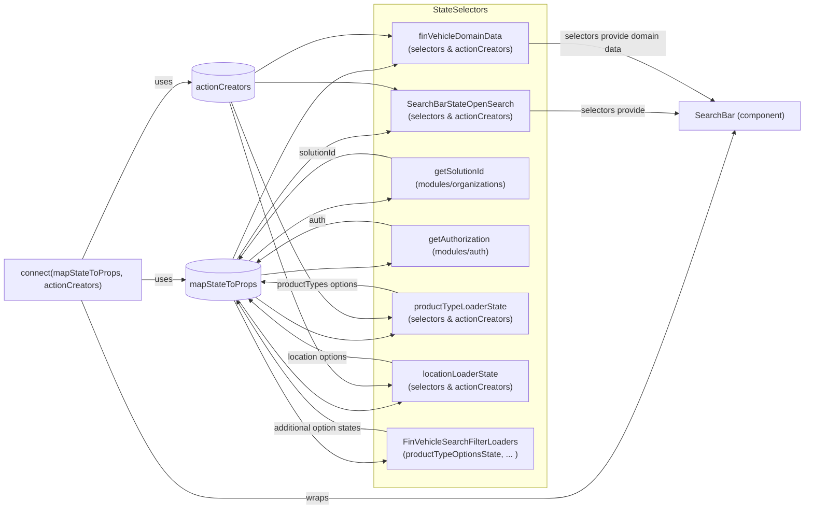

# Diagram: web/portal/src/pages/finishedvehicle/search/FinVehicleSearchBarContainerOpenSearch.js

> Auto-generated by Obscura crawlers

## Mermaid

### SVG

<svg id="container" width="1747.078125" xmlns="http://www.w3.org/2000/svg" class="flowchart" height="964" viewBox="0 0 1747.078125 964" role="graphics-document document" aria-roledescription="flowchart-v2"><g><marker id="container_flowchart-v2-pointEnd" class="marker flowchart-v2" viewBox="0 0 10 10" refX="5" refY="5" markerUnits="userSpaceOnUse" markerWidth="8" markerHeight="8" orient="auto"><path d="M 0 0 L 10 5 L 0 10 z" class="arrowMarkerPath" style="stroke-width: 1; stroke-dasharray: 1, 0;"></path></marker><marker id="container_flowchart-v2-pointStart" class="marker flowchart-v2" viewBox="0 0 10 10" refX="4.5" refY="5" markerUnits="userSpaceOnUse" markerWidth="8" markerHeight="8" orient="auto"><path d="M 0 5 L 10 10 L 10 0 z" class="arrowMarkerPath" style="stroke-width: 1; stroke-dasharray: 1, 0;"></path></marker><marker id="container_flowchart-v2-circleEnd" class="marker flowchart-v2" viewBox="0 0 10 10" refX="11" refY="5" markerUnits="userSpaceOnUse" markerWidth="11" markerHeight="11" orient="auto"><circle cx="5" cy="5" r="5" class="arrowMarkerPath" style="stroke-width: 1; stroke-dasharray: 1, 0;"></circle></marker><marker id="container_flowchart-v2-circleStart" class="marker flowchart-v2" viewBox="0 0 10 10" refX="-1" refY="5" markerUnits="userSpaceOnUse" markerWidth="11" markerHeight="11" orient="auto"><circle cx="5" cy="5" r="5" class="arrowMarkerPath" style="stroke-width: 1; stroke-dasharray: 1, 0;"></circle></marker><marker id="container_flowchart-v2-crossEnd" class="marker cross flowchart-v2" viewBox="0 0 11 11" refX="12" refY="5.2" markerUnits="userSpaceOnUse" markerWidth="11" markerHeight="11" orient="auto"><path d="M 1,1 l 9,9 M 10,1 l -9,9" class="arrowMarkerPath" style="stroke-width: 2; stroke-dasharray: 1, 0;"></path></marker><marker id="container_flowchart-v2-crossStart" class="marker cross flowchart-v2" viewBox="0 0 11 11" refX="-1" refY="5.2" markerUnits="userSpaceOnUse" markerWidth="11" markerHeight="11" orient="auto"><path d="M 1,1 l 9,9 M 10,1 l -9,9" class="arrowMarkerPath" style="stroke-width: 2; stroke-dasharray: 1, 0;"></path></marker><g class="root"><g class="clusters"><g class="cluster" id="StateSelectors" data-look="classic"><rect style="" x="717.484375" y="8" width="541.1875" height="916"></rect><g class="cluster-label" transform="translate(936.046875, 8)"><foreignObject width="104.0625" height="24">

StateSelectors

</foreignObject></g></g></g><g class="edgePaths"><path d="M154.155,569L180.045,631.5C205.934,694,257.713,819,302.351,881.5C346.99,944,384.487,944,433.777,944C483.068,944,544.151,944,593.401,944C642.651,944,680.068,944,743.875,944C807.682,944,897.88,944,988.078,944C1078.276,944,1168.474,944,1234.406,944C1300.339,944,1342.005,944,1401.17,828.411C1460.335,712.822,1536.999,481.644,1575.33,366.055L1613.662,250.466" id="L_Connect_SearchBar_0" class="edge-thickness-normal edge-pattern-solid edge-thickness-normal edge-pattern-solid flowchart-link" style=";" data-edge="true" data-et="edge" data-id="L_Connect_SearchBar_0" data-points="W3sieCI6MTU0LjE1NTA2MTE0MTMwNDM0LCJ5Ijo1Njl9LHsieCI6MzA5LjQ5MjE4NzUsInkiOjk0NH0seyJ4Ijo0MjEuOTg0Mzc1LCJ5Ijo5NDR9LHsieCI6NjA1LjIzNDM3NSwieSI6OTQ0fSx7IngiOjcxNy40ODQzNzUsInkiOjk0NH0seyJ4Ijo5ODguMDc4MTI1LCJ5Ijo5NDR9LHsieCI6MTI1OC42NzE4NzUsInkiOjk0NH0seyJ4IjoxMzgzLjY3MTg3NSwieSI6OTQ0fSx7IngiOjE2MTQuOTIxMjQyMzMzOTkxLCJ5IjoyNDYuNjY4OTg1MzY2ODIxM31d" marker-end="url(#container_flowchart-v2-pointEnd)"></path><path d="M268,530L274.915,530C281.831,530,295.661,530,308.826,530C321.99,530,334.487,530,340.736,530L346.984,530" id="L_Connect_mapStateToProps_0" class="edge-thickness-normal edge-pattern-solid edge-thickness-normal edge-pattern-solid flowchart-link" style=";" data-edge="true" data-et="edge" data-id="L_Connect_mapStateToProps_0" data-points="W3sieCI6MjY4LCJ5Ijo1MzB9LHsieCI6MzA5LjQ5MjE4NzUsInkiOjUzMH0seyJ4IjozNTAuOTg0Mzc1LCJ5Ijo1MzB9XQ==" marker-end="url(#container_flowchart-v2-pointEnd)"></path><path d="M155.883,491L181.484,435.167C207.086,379.333,258.289,267.667,291.944,211.833C325.599,156,341.706,156,349.759,156L357.813,156" id="L_Connect_actionCreatorsObj_0" class="edge-thickness-normal edge-pattern-solid edge-thickness-normal edge-pattern-solid flowchart-link" style=";" data-edge="true" data-et="edge" data-id="L_Connect_actionCreatorsObj_0" data-points="W3sieCI6MTU1Ljg4Mjg3NTE2NzExMjMsInkiOjQ5MX0seyJ4IjozMDkuNDkyMTg3NSwieSI6MTU2fSx7IngiOjM2MS44MTI1LCJ5IjoxNTZ9XQ==" marker-end="url(#container_flowchart-v2-pointEnd)"></path><path d="M448.558,491.523L474.671,452.602C500.784,413.682,553.009,335.841,597.83,296.92C642.651,258,680.068,258,714.047,255.291C748.026,252.582,778.567,247.165,793.838,244.456L809.108,241.747" id="L_mapStateToProps_SearchBarState_0" class="edge-thickness-normal edge-pattern-solid edge-thickness-normal edge-pattern-solid flowchart-link" style=";" data-edge="true" data-et="edge" data-id="L_mapStateToProps_SearchBarState_0" data-points="W3sieCI6NDQ4LjU1ODE5NjY1Njg0NDIsInkiOjQ5MS41MjI1Nzk2NjE2NTUyfSx7IngiOjYwNS4yMzQzNzUsInkiOjI1OH0seyJ4Ijo3MTcuNDg0Mzc1LCJ5IjoyNTh9LHsieCI6ODEzLjA0Njg3NSwieSI6MjQxLjA0ODM4ODk1OTQ2NDE1fV0=" marker-end="url(#container_flowchart-v2-pointEnd)"></path><path d="M440.33,491.008L467.814,431.84C495.298,372.672,550.266,254.336,596.459,195.168C642.651,136,680.068,136,717.241,132.315C754.414,128.63,791.343,121.261,809.808,117.576L828.273,113.891" id="L_mapStateToProps_FinDomain_0" class="edge-thickness-normal edge-pattern-solid edge-thickness-normal edge-pattern-solid flowchart-link" style=";" data-edge="true" data-et="edge" data-id="L_mapStateToProps_FinDomain_0" data-points="W3sieCI6NDQwLjMyOTc1NDQxNzkyMjksInkiOjQ5MS4wMDc2ODYyNjc2MTM5Nn0seyJ4Ijo2MDUuMjM0Mzc1LCJ5IjoxMzZ9LHsieCI6NzE3LjQ4NDM3NSwieSI6MTM2fSx7IngiOjgzMi4xOTUzMTI1LCJ5IjoxMTMuMTA4MTUzMzY2NDM5NTR9XQ==" marker-end="url(#container_flowchart-v2-pointEnd)"></path><path d="M472.179,494.449L494.355,476.374C516.531,458.299,560.883,422.15,601.767,404.075C642.651,386,680.068,386,721.552,381.96C763.036,377.92,808.588,369.839,831.364,365.799L854.14,361.759" id="L_mapStateToProps_Org_0" class="edge-thickness-normal edge-pattern-solid edge-thickness-normal edge-pattern-solid flowchart-link" style=";" data-edge="true" data-et="edge" data-id="L_mapStateToProps_Org_0" data-points="W3sieCI6NDcyLjE3OTM3MTQ2MjkyNzksInkiOjQ5NC40NDg2NjEzOTM5MjExfSx7IngiOjYwNS4yMzQzNzUsInkiOjM4Nn0seyJ4Ijo3MTcuNDg0Mzc1LCJ5IjozODZ9LHsieCI6ODU4LjA3ODEyNSwieSI6MzYxLjA2MDM5OTU4NDI0NzZ9XQ==" marker-end="url(#container_flowchart-v2-pointEnd)"></path><path d="M492.984,521.348L511.693,519.068C530.401,516.788,567.818,512.229,605.234,509.949C642.651,507.669,680.068,507.669,721.549,504.162C763.031,500.655,808.578,493.641,831.351,490.135L854.125,486.628" id="L_mapStateToProps_Auth_0" class="edge-thickness-normal edge-pattern-solid edge-thickness-normal edge-pattern-solid flowchart-link" style=";" data-edge="true" data-et="edge" data-id="L_mapStateToProps_Auth_0" data-points="W3sieCI6NDkyLjk4NDM3NSwieSI6NTIxLjM0Nzg3NDI3NTgyMTZ9LHsieCI6NjA1LjIzNDM3NSwieSI6NTA3LjY2ODk4NTM2NjgyMTN9LHsieCI6NzE3LjQ4NDM3NSwieSI6NTA3LjY2ODk4NTM2NjgyMTN9LHsieCI6ODU4LjA3ODEyNSwieSI6NDg2LjAxODgyMTkzMzkzODg1fV0=" marker-end="url(#container_flowchart-v2-pointEnd)"></path><path d="M484.474,562.46L504.6,576.328C524.727,590.196,564.981,617.933,603.816,631.801C642.651,645.669,680.068,645.669,715.751,642.428C751.435,639.186,785.386,632.703,802.361,629.462L819.337,626.221" id="L_mapStateToProps_ProductLoader_0" class="edge-thickness-normal edge-pattern-solid edge-thickness-normal edge-pattern-solid flowchart-link" style=";" data-edge="true" data-et="edge" data-id="L_mapStateToProps_ProductLoader_0" data-points="W3sieCI6NDg0LjQ3MzcyMzA5NzQxMDg3LCJ5Ijo1NjIuNDU5ODg1NzIzMTQyMX0seyJ4Ijo2MDUuMjM0Mzc1LCJ5Ijo2NDUuNjY4OTg1MzY2ODIxM30seyJ4Ijo3MTcuNDg0Mzc1LCJ5Ijo2NDUuNjY4OTg1MzY2ODIxM30seyJ4Ijo4MjMuMjY1NjI1LCJ5Ijo2MjUuNDcwNDA0MDY3OTc3M31d" marker-end="url(#container_flowchart-v2-pointEnd)"></path><path d="M450.897,568.291L476.62,603.576C502.343,638.861,553.788,709.43,598.22,744.715C642.651,780,680.068,780,718.373,775.8C756.678,771.599,795.872,763.198,815.469,758.998L835.065,754.797" id="L_mapStateToProps_LocationLoader_0" class="edge-thickness-normal edge-pattern-solid edge-thickness-normal edge-pattern-solid flowchart-link" style=";" data-edge="true" data-et="edge" data-id="L_mapStateToProps_LocationLoader_0" data-points="W3sieCI6NDUwLjg5NjY5Mjk2MjY0NjUsInkiOjU2OC4yOTE0ODk3NTQzNTA5fSx7IngiOjYwNS4yMzQzNzUsInkiOjc4MH0seyJ4Ijo3MTcuNDg0Mzc1LCJ5Ijo3ODB9LHsieCI6ODM4Ljk3NjU2MjUsInkiOjc1My45NTg5NDQ0NTA4NjA0fV0=" marker-end="url(#container_flowchart-v2-pointEnd)"></path><path d="M442.815,568.859L469.885,620.216C496.955,671.572,551.094,774.286,596.873,825.643C642.651,877,680.068,877,702.279,876.65C724.491,876.301,731.498,875.602,735.001,875.252L738.504,874.903" id="L_mapStateToProps_FilterLoaders_0" class="edge-thickness-normal edge-pattern-solid edge-thickness-normal edge-pattern-solid flowchart-link" style=";" data-edge="true" data-et="edge" data-id="L_mapStateToProps_FilterLoaders_0" data-points="W3sieCI6NDQyLjgxNDU3NTI2MTI3MjcsInkiOjU2OC44NTg3MzEzNDM1MTcxfSx7IngiOjYwNS4yMzQzNzUsInkiOjg3N30seyJ4Ijo3MTcuNDg0Mzc1LCJ5Ijo4Nzd9LHsieCI6NzQyLjQ4NDM3NSwieSI6ODc0LjUwNTQ4NTYyMTg5NjJ9XQ==" marker-end="url(#container_flowchart-v2-pointEnd)"></path><path d="M482.156,156L502.669,156C523.182,156,564.208,156,603.43,156C642.651,156,680.068,156,714.049,159.048C748.031,162.096,778.578,168.192,793.851,171.24L809.124,174.288" id="L_actionCreatorsObj_SearchBarState_0" class="edge-thickness-normal edge-pattern-solid edge-thickness-normal edge-pattern-solid flowchart-link" style=";" data-edge="true" data-et="edge" data-id="L_actionCreatorsObj_SearchBarState_0" data-points="W3sieCI6NDgyLjE1NjI1LCJ5IjoxNTZ9LHsieCI6NjA1LjIzNDM3NSwieSI6MTU2fSx7IngiOjcxNy40ODQzNzUsInkiOjE1Nn0seyJ4Ijo4MTMuMDQ2ODc1LCJ5IjoxNzUuMDcwNTYyNDIwNjAyODR9XQ==" marker-end="url(#container_flowchart-v2-pointEnd)"></path><path d="M482.156,138.382L502.669,126.152C523.182,113.921,564.208,89.461,603.43,77.23C642.651,65,680.068,65,717.229,66.159C754.391,67.319,791.297,69.637,809.75,70.797L828.203,71.956" id="L_actionCreatorsObj_FinDomain_0" class="edge-thickness-normal edge-pattern-solid edge-thickness-normal edge-pattern-solid flowchart-link" style=";" data-edge="true" data-et="edge" data-id="L_actionCreatorsObj_FinDomain_0" data-points="W3sieCI6NDgyLjE1NjI1LCJ5IjoxMzguMzgyMDU2MjQ5OTkyNH0seyJ4Ijo2MDUuMjM0Mzc1LCJ5Ijo2NX0seyJ4Ijo3MTcuNDg0Mzc1LCJ5Ijo2NX0seyJ4Ijo4MzIuMTk1MzEyNSwieSI6NzIuMjA2NjkyNDU4NzEzNDh9XQ==" marker-end="url(#container_flowchart-v2-pointEnd)"></path><path d="M437.496,193.48L465.452,261.845C493.409,330.209,549.322,466.939,595.986,535.304C642.651,603.669,680.068,603.669,715.74,603.063C751.412,602.457,785.34,601.244,802.304,600.638L819.268,600.032" id="L_actionCreatorsObj_ProductLoader_0" class="edge-thickness-normal edge-pattern-solid edge-thickness-normal edge-pattern-solid flowchart-link" style=";" data-edge="true" data-et="edge" data-id="L_actionCreatorsObj_ProductLoader_0" data-points="W3sieCI6NDM3LjQ5NjA2NzUwNzc3NjQsInkiOjE5My40Nzk2ODQ3MjgxNzc2fSx7IngiOjYwNS4yMzQzNzUsInkiOjYwMy42Njg5ODUzNjY4MjEzfSx7IngiOjcxNy40ODQzNzUsInkiOjYwMy42Njg5ODUzNjY4MjEzfSx7IngiOjgyMy4yNjU2MjUsInkiOjU5OS44ODkxNTkxMjA1MjM4fV0=" marker-end="url(#container_flowchart-v2-pointEnd)"></path><path d="M434.047,193.645L462.578,283.316C491.109,372.986,548.172,552.328,595.411,641.998C642.651,731.669,680.068,731.669,718.358,730.969C756.649,730.27,795.814,728.87,815.397,728.17L834.979,727.471" id="L_actionCreatorsObj_LocationLoader_0" class="edge-thickness-normal edge-pattern-solid edge-thickness-normal edge-pattern-solid flowchart-link" style=";" data-edge="true" data-et="edge" data-id="L_actionCreatorsObj_LocationLoader_0" data-points="W3sieCI6NDM0LjA0NzA0MjY0ODkzMjksInkiOjE5My42NDUyMTY5NDIxMjIxMn0seyJ4Ijo2MDUuMjM0Mzc1LCJ5Ijo3MzEuNjY4OTg1MzY2ODIxM30seyJ4Ijo3MTcuNDg0Mzc1LCJ5Ijo3MzEuNjY4OTg1MzY2ODIxM30seyJ4Ijo4MzguOTc2NTYyNSwieSI6NzI3LjMyNzc2ODM4MzM1MjF9XQ==" marker-end="url(#container_flowchart-v2-pointEnd)"></path><path d="M1163.109,210L1179.036,210C1194.964,210,1226.818,210,1263.578,210C1300.339,210,1342.005,210,1383.006,210.812C1424.006,211.624,1464.341,213.247,1484.508,214.059L1504.675,214.871" id="L_SearchBarState_SearchBar_0" class="edge-thickness-normal edge-pattern-solid edge-thickness-normal edge-pattern-solid flowchart-link" style=";" data-edge="true" data-et="edge" data-id="L_SearchBarState_SearchBar_0" data-points="W3sieCI6MTE2My4xMDkzNzUsInkiOjIxMH0seyJ4IjoxMjU4LjY3MTg3NSwieSI6MjEwfSx7IngiOjEzODMuNjcxODc1LCJ5IjoyMTB9LHsieCI6MTUwOC42NzE4NzUsInkiOjIxNS4wMzE2NzEzMDI1ODA1Mn1d" marker-end="url(#container_flowchart-v2-pointEnd)"></path><path d="M1143.961,82L1163.079,82C1182.198,82,1220.435,82,1260.387,82C1300.339,82,1342.005,82,1394.442,100.113C1446.88,118.227,1510.088,154.453,1541.691,172.567L1573.295,190.68" id="L_FinDomain_SearchBar_0" class="edge-thickness-normal edge-pattern-solid edge-thickness-normal edge-pattern-solid flowchart-link" style=";" data-edge="true" data-et="edge" data-id="L_FinDomain_SearchBar_0" data-points="W3sieCI6MTE0My45NjA5Mzc1LCJ5Ijo4Mn0seyJ4IjoxMjU4LjY3MTg3NSwieSI6ODJ9LHsieCI6MTM4My42NzE4NzUsInkiOjgyfSx7IngiOjE1NzYuNzY1NzM3NDYxODk2LCJ5IjoxOTIuNjY4OTg1MzY2ODIxM31d" marker-end="url(#container_flowchart-v2-pointEnd)"></path><path d="M858.078,314.94L834.646,310.783C811.214,306.626,764.349,298.313,722.208,294.157C680.068,290,642.651,290,598.824,323.104C554.996,356.208,504.758,422.417,479.638,455.521L454.519,488.625" id="L_Org_mapStateToProps_0" class="edge-thickness-normal edge-pattern-solid edge-thickness-normal edge-pattern-solid flowchart-link" style=";" data-edge="true" data-et="edge" data-id="L_Org_mapStateToProps_0" data-points="W3sieCI6ODU4LjA3ODEyNSwieSI6MzE0LjkzOTYwMDQxNTc1MjR9LHsieCI6NzE3LjQ4NDM3NSwieSI6MjkwfSx7IngiOjYwNS4yMzQzNzUsInkiOjI5MH0seyJ4Ijo0NTIuMTAxMzcyODc3NzU2OCwieSI6NDkxLjgxMTYyNjkzNzQ3MDZ9XQ==" marker-end="url(#container_flowchart-v2-pointEnd)"></path><path d="M858.078,442.94L834.646,438.783C811.214,434.626,764.349,426.313,722.208,422.157C680.068,418,642.651,418,604.709,431.011C566.768,444.023,528.301,470.045,509.067,483.057L489.834,496.068" id="L_Auth_mapStateToProps_0" class="edge-thickness-normal edge-pattern-solid edge-thickness-normal edge-pattern-solid flowchart-link" style=";" data-edge="true" data-et="edge" data-id="L_Auth_mapStateToProps_0" data-points="W3sieCI6ODU4LjA3ODEyNSwieSI6NDQyLjkzOTYwMDQxNTc1MjR9LHsieCI6NzE3LjQ4NDM3NSwieSI6NDE4fSx7IngiOjYwNS4yMzQzNzUsInkiOjQxOH0seyJ4Ijo0ODYuNTIwNzk5MDIzNzY0NSwieSI6NDk4LjMwOTMzOTkwMjg3MzF9XQ==" marker-end="url(#container_flowchart-v2-pointEnd)"></path><path d="M823.266,560.908L805.635,557.368C788.005,553.828,752.745,546.749,716.406,543.209C680.068,539.669,642.651,539.669,605.9,538.717C569.149,537.765,533.064,535.861,515.021,534.909L496.979,533.957" id="L_ProductLoader_mapStateToProps_0" class="edge-thickness-normal edge-pattern-solid edge-thickness-normal edge-pattern-solid flowchart-link" style=";" data-edge="true" data-et="edge" data-id="L_ProductLoader_mapStateToProps_0" data-points="W3sieCI6ODIzLjI2NTYyNSwieSI6NTYwLjkwODIxNDQzODY4OTh9LHsieCI6NzE3LjQ4NDM3NSwieSI6NTM5LjY2ODk4NTM2NjgyMTN9LHsieCI6NjA1LjIzNDM3NSwieSI6NTM5LjY2ODk4NTM2NjgyMTN9LHsieCI6NDkyLjk4NDM3NSwieSI6NTMzLjc0NjIzNzE2ODA0NTR9XQ==" marker-end="url(#container_flowchart-v2-pointEnd)"></path><path d="M838.977,697.573L818.728,694.256C798.479,690.938,757.982,684.304,719.025,680.986C680.068,677.669,642.651,677.669,602.071,659.447C561.491,641.226,517.748,604.783,495.877,586.561L474.005,568.339" id="L_LocationLoader_mapStateToProps_0" class="edge-thickness-normal edge-pattern-solid edge-thickness-normal edge-pattern-solid flowchart-link" style=";" data-edge="true" data-et="edge" data-id="L_LocationLoader_mapStateToProps_0" data-points="W3sieCI6ODM4Ljk3NjU2MjUsInkiOjY5Ny41NzI4ODkwNjcwMzM5fSx7IngiOjcxNy40ODQzNzUsInkiOjY3Ny42Njg5ODUzNjY4MjEzfSx7IngiOjYwNS4yMzQzNzUsInkiOjY3Ny42Njg5ODUzNjY4MjEzfSx7IngiOjQ3MC45MzIyMjU5ODM3ODMxNiwieSI6NTY1Ljc3OTEzNzc5ODY4Mzl9XQ==" marker-end="url(#container_flowchart-v2-pointEnd)"></path><path d="M742.484,815.511L738.318,814.926C734.151,814.341,725.818,813.17,702.943,812.585C680.068,812,642.651,812,598.035,771.984C553.419,731.968,501.605,651.937,475.697,611.921L449.79,571.905" id="L_FilterLoaders_mapStateToProps_0" class="edge-thickness-normal edge-pattern-solid edge-thickness-normal edge-pattern-solid flowchart-link" style=";" data-edge="true" data-et="edge" data-id="L_FilterLoaders_mapStateToProps_0" data-points="W3sieCI6NzQyLjQ4NDM3NSwieSI6ODE1LjUxMDc5ODAxMzYyNzR9LHsieCI6NzE3LjQ4NDM3NSwieSI6ODEyfSx7IngiOjYwNS4yMzQzNzUsInkiOjgxMn0seyJ4Ijo0NDcuNjE1ODYyNTU1NTM3NjYsInkiOjU2OC41NDcxODQ5NTc4ODcyfV0=" marker-end="url(#container_flowchart-v2-pointEnd)"></path></g><g class="edgeLabels"><g class="edgeLabel" transform="translate(605.234375, 944)"><g class="label" data-id="L_Connect_SearchBar_0" transform="translate(-21.390625, -12)"><foreignObject width="42.78125" height="24">

wraps

</foreignObject></g></g><g class="edgeLabel" transform="translate(309.4921875, 530)"><g class="label" data-id="L_Connect_mapStateToProps_0" transform="translate(-16.4921875, -12)"><foreignObject width="32.984375" height="24">

uses

</foreignObject></g></g><g class="edgeLabel" transform="translate(309.4921875, 156)"><g class="label" data-id="L_Connect_actionCreatorsObj_0" transform="translate(-16.4921875, -12)"><foreignObject width="32.984375" height="24">

uses

</foreignObject></g></g><g class="edgeLabel"><g class="label" data-id="L_mapStateToProps_SearchBarState_0" transform="translate(0, 0)"><foreignObject width="0" height="0">

</foreignObject></g></g><g class="edgeLabel"><g class="label" data-id="L_mapStateToProps_FinDomain_0" transform="translate(0, 0)"><foreignObject width="0" height="0">

</foreignObject></g></g><g class="edgeLabel"><g class="label" data-id="L_mapStateToProps_Org_0" transform="translate(0, 0)"><foreignObject width="0" height="0">

</foreignObject></g></g><g class="edgeLabel"><g class="label" data-id="L_mapStateToProps_Auth_0" transform="translate(0, 0)"><foreignObject width="0" height="0">

</foreignObject></g></g><g class="edgeLabel"><g class="label" data-id="L_mapStateToProps_ProductLoader_0" transform="translate(0, 0)"><foreignObject width="0" height="0">

</foreignObject></g></g><g class="edgeLabel"><g class="label" data-id="L_mapStateToProps_LocationLoader_0" transform="translate(0, 0)"><foreignObject width="0" height="0">

</foreignObject></g></g><g class="edgeLabel"><g class="label" data-id="L_mapStateToProps_FilterLoaders_0" transform="translate(0, 0)"><foreignObject width="0" height="0">

</foreignObject></g></g><g class="edgeLabel"><g class="label" data-id="L_actionCreatorsObj_SearchBarState_0" transform="translate(0, 0)"><foreignObject width="0" height="0">

</foreignObject></g></g><g class="edgeLabel"><g class="label" data-id="L_actionCreatorsObj_FinDomain_0" transform="translate(0, 0)"><foreignObject width="0" height="0">

</foreignObject></g></g><g class="edgeLabel"><g class="label" data-id="L_actionCreatorsObj_ProductLoader_0" transform="translate(0, 0)"><foreignObject width="0" height="0">

</foreignObject></g></g><g class="edgeLabel"><g class="label" data-id="L_actionCreatorsObj_LocationLoader_0" transform="translate(0, 0)"><foreignObject width="0" height="0">

</foreignObject></g></g><g class="edgeLabel" transform="translate(1383.671875, 210)"><g class="label" data-id="L_SearchBarState_SearchBar_0" transform="translate(-62.4296875, -12)"><foreignObject width="124.859375" height="24">

selectors provide

</foreignObject></g></g><g class="edgeLabel" transform="translate(1383.671875, 82)"><g class="label" data-id="L_FinDomain_SearchBar_0" transform="translate(-100, -24)"><foreignObject width="200" height="48">

selectors provide domain data

</foreignObject></g></g><g class="edgeLabel" transform="translate(605.234375, 290)"><g class="label" data-id="L_Org_mapStateToProps_0" transform="translate(-37.0625, -12)"><foreignObject width="74.125" height="24">

solutionId

</foreignObject></g></g><g class="edgeLabel" transform="translate(605.234375, 418)"><g class="label" data-id="L_Auth_mapStateToProps_0" transform="translate(-16.5859375, -12)"><foreignObject width="33.171875" height="24">

auth

</foreignObject></g></g><g class="edgeLabel" transform="translate(605.234375, 539.6689853668213)"><g class="label" data-id="L_ProductLoader_mapStateToProps_0" transform="translate(-78.8125, -12)"><foreignObject width="157.625" height="24">

productTypes options

</foreignObject></g></g><g class="edgeLabel" transform="translate(605.234375, 677.6689853668213)"><g class="label" data-id="L_LocationLoader_mapStateToProps_0" transform="translate(-59.3671875, -12)"><foreignObject width="118.734375" height="24">

location options

</foreignObject></g></g><g class="edgeLabel" transform="translate(605.234375, 812)"><g class="label" data-id="L_FilterLoaders_mapStateToProps_0" transform="translate(-87.25, -12)"><foreignObject width="174.5" height="24">

additional option states

</foreignObject></g></g></g><g class="nodes"><g class="node default" id="flowchart-SearchBar-0" transform="translate(1623.875, 219.6689853668213)"><rect class="basic label-container" style="" x="-115.203125" y="-27" width="230.40625" height="54"></rect><g class="label" style="" transform="translate(-85.203125, -12)"><rect></rect><foreignObject width="170.40625" height="24">

SearchBar (component)

</foreignObject></g></g><g class="node default" id="flowchart-Connect-1" transform="translate(138, 530)"><rect class="basic label-container" style="" x="-130" y="-39" width="260" height="78"></rect><g class="label" style="" transform="translate(-100, -24)"><rect></rect><foreignObject width="200" height="48">

connect(mapStateToProps, actionCreators)

</foreignObject></g></g><g class="node default" id="flowchart-SearchBarState-2" transform="translate(988.078125, 210)"><rect class="basic label-container" style="" x="-175.03125" y="-39" width="350.0625" height="78"></rect><g class="label" style="" transform="translate(-145.03125, -24)"><rect></rect><foreignObject width="290.0625" height="48">

SearchBarStateOpenSearch\n(selectors &amp; actionCreators)

</foreignObject></g></g><g class="node default" id="flowchart-FinDomain-3" transform="translate(988.078125, 82)"><rect class="basic label-container" style="" x="-155.8828125" y="-39" width="311.765625" height="78"></rect><g class="label" style="" transform="translate(-125.8828125, -24)"><rect></rect><foreignObject width="251.765625" height="48">

finVehicleDomainData\n(selectors &amp; actionCreators)

</foreignObject></g></g><g class="node default" id="flowchart-Org-4" transform="translate(988.078125, 338)"><rect class="basic label-container" style="" x="-130" y="-39" width="260" height="78"></rect><g class="label" style="" transform="translate(-100, -24)"><rect></rect><foreignObject width="200" height="48">

getSolutionId (modules/organizations)

</foreignObject></g></g><g class="node default" id="flowchart-Auth-5" transform="translate(988.078125, 466)"><rect class="basic label-container" style="" x="-130" y="-39" width="260" height="78"></rect><g class="label" style="" transform="translate(-100, -24)"><rect></rect><foreignObject width="200" height="48">

getAuthorization (modules/auth)

</foreignObject></g></g><g class="node default" id="flowchart-ProductLoader-6" transform="translate(988.078125, 594)"><rect class="basic label-container" style="" x="-164.8125" y="-39" width="329.625" height="78"></rect><g class="label" style="" transform="translate(-134.8125, -24)"><rect></rect><foreignObject width="269.625" height="48">

productTypeLoaderState\n(selectors &amp; actionCreators)

</foreignObject></g></g><g class="node default" id="flowchart-LocationLoader-7" transform="translate(988.078125, 722)"><rect class="basic label-container" style="" x="-149.1015625" y="-39" width="298.203125" height="78"></rect><g class="label" style="" transform="translate(-119.1015625, -24)"><rect></rect><foreignObject width="238.203125" height="48">

locationLoaderState\n(selectors &amp; actionCreators)

</foreignObject></g></g><g class="node default" id="flowchart-FilterLoaders-8" transform="translate(988.078125, 850)"><rect class="basic label-container" style="" x="-245.59375" y="-39" width="491.1875" height="78"></rect><g class="label" style="" transform="translate(-215.59375, -24)"><rect></rect><foreignObject width="431.1875" height="48">

FinVehicleSearchFilterLoaders\n(productTypeOptionsState, ... )

</foreignObject></g></g><g class="node default" id="flowchart-mapStateToProps-12" transform="translate(421.984375, 530)"><path d="M0,13.295880149812735 a71,13.295880149812735 0,0,0 142,0 a71,13.295880149812735 0,0,0 -142,0 l0,52.29588014981273 a71,13.295880149812735 0,0,0 142,0 l0,-52.29588014981273" class="basic label-container" style="" transform="translate(-71, -39.443820224719104)"></path><g class="label" style="" transform="translate(-63.5, -2)"><rect></rect><foreignObject width="127" height="24">

mapStateToProps

</foreignObject></g></g><g class="node default" id="flowchart-actionCreatorsObj-14" transform="translate(421.984375, 156)"><path d="M0,12.262769074003312 a60.171875,12.262769074003312 0,0,0 120.34375,0 a60.171875,12.262769074003312 0,0,0 -120.34375,0 l0,51.262769074003316 a60.171875,12.262769074003312 0,0,0 120.34375,0 l0,-51.262769074003316" class="basic label-container" style="" transform="translate(-60.171875, -37.89415361100497)"></path><g class="label" style="" transform="translate(-52.671875, -2)"><rect></rect><foreignObject width="105.34375" height="24">

actionCreators

</foreignObject></g></g></g></g></g></svg>
