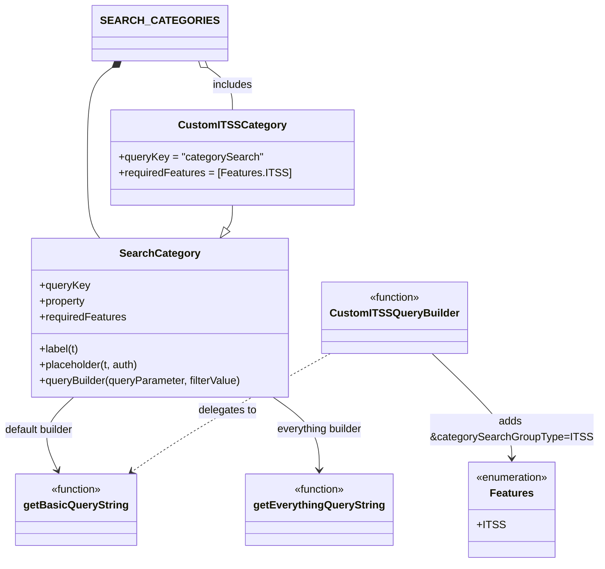

# Diagram: web/portal/src/pages/finishedvehicle/search/FinVehicleSearchCategoryDefs.js

> Auto-generated by Obscura crawlers

## Mermaid

```mermaid
classDiagram
class SEARCH_CATEGORIES
class SearchCategory {
  +queryKey
  +label(t)
  +placeholder(t, auth)
  +queryBuilder(queryParameter, filterValue)
  +property
  +requiredFeatures
}
class getBasicQueryString <<function>>
class getEverythingQueryString <<function>>
class CustomITSSQueryBuilder <<function>>
class Features {
  <<enumeration>>
  +ITSS
}
SEARCH_CATEGORIES *-- SearchCategory
SearchCategory --> getBasicQueryString : default builder
SearchCategory --> getEverythingQueryString : everything builder
CustomITSSQueryBuilder ..> getBasicQueryString : delegates to
CustomITSSQueryBuilder --> Features : adds &categorySearchGroupType=ITSS
class CustomITSSCategory {
  +queryKey = "categorySearch"
  +requiredFeatures = [Features.ITSS]
}
CustomITSSCategory --|> SearchCategory
SEARCH_CATEGORIES o-- CustomITSSCategory : includes
```

> SVG rendering failed for this diagram.
