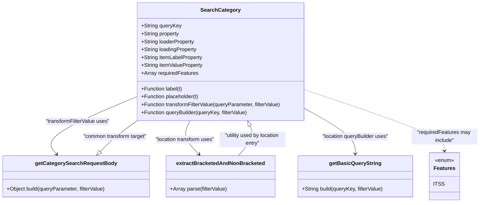

# Diagram: web/portal/src/pages/finishedvehicle/search/FinVehicleSearchCategoryDefsOpenSearch.js

> Auto-generated by Obscura crawlers

## Mermaid

```mermaid
classDiagram
    class SearchCategory {
      +String queryKey
      +Function label(t)
      +Function placeholder(t)
      +Function transformFilterValue(queryParameter, filterValue)
      +Function queryBuilder(queryKey, filterValue)
      +String property
      +String loaderProperty
      +String loadingProperty
      +String itemLabelProperty
      +String itemValueProperty
      +Array requiredFeatures
    }

    class extractBracketedAndNonBracketed {
      +Array parse(filterValue)
    }

    class getCategorySearchRequestBody {
      +Object build(queryParameter, filterValue)
    }

    class getBasicQueryString {
      +String build(queryKey, filterValue)
    }

    class Features <<enum>> {
      ITSS
    }

    SearchCategory --> getCategorySearchRequestBody : "transformFilterValue uses"
    SearchCategory --> extractBracketedAndNonBracketed : "location transform uses"
    SearchCategory --> getBasicQueryString : "location queryBuilder uses"
    SearchCategory ..> Features : "requiredFeatures may include"
    extractBracketedAndNonBracketed --|> SearchCategory : "utility used by location entry"
    getCategorySearchRequestBody <|-- SearchCategory : "common transform target"
```

> SVG rendering failed for this diagram.
