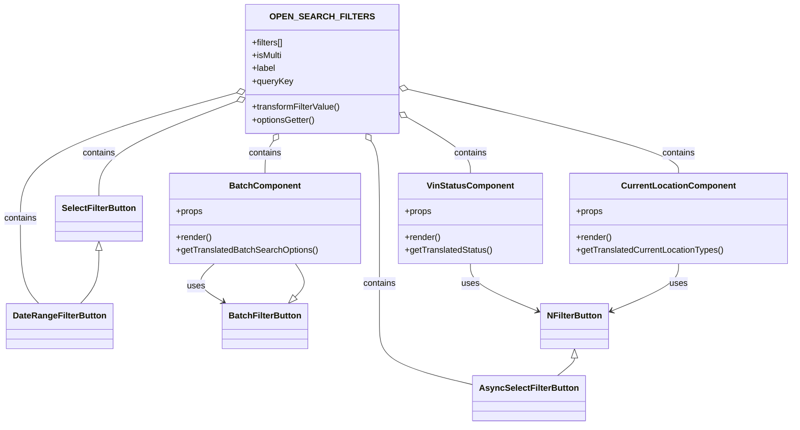

# Diagram: web/portal/src/pages/finishedvehicle/search/FinVehicleSearchFilterDefsOpenSearch.js

> Auto-generated by Obscura crawlers

## Mermaid

### SVG

<svg id="container" width="1452.5234375" xmlns="http://www.w3.org/2000/svg" class="classDiagram" height="790" viewBox="0 0 1452.5234375 790" role="graphics-document document" aria-roledescription="class"><g><defs><marker id="container_class-aggregationStart" class="marker aggregation class" refX="18" refY="7" markerWidth="190" markerHeight="240" orient="auto"><path d="M 18,7 L9,13 L1,7 L9,1 Z"></path></marker></defs><defs><marker id="container_class-aggregationEnd" class="marker aggregation class" refX="1" refY="7" markerWidth="20" markerHeight="28" orient="auto"><path d="M 18,7 L9,13 L1,7 L9,1 Z"></path></marker></defs><defs><marker id="container_class-extensionStart" class="marker extension class" refX="18" refY="7" markerWidth="190" markerHeight="240" orient="auto"><path d="M 1,7 L18,13 V 1 Z"></path></marker></defs><defs><marker id="container_class-extensionEnd" class="marker extension class" refX="1" refY="7" markerWidth="20" markerHeight="28" orient="auto"><path d="M 1,1 V 13 L18,7 Z"></path></marker></defs><defs><marker id="container_class-compositionStart" class="marker composition class" refX="18" refY="7" markerWidth="190" markerHeight="240" orient="auto"><path d="M 18,7 L9,13 L1,7 L9,1 Z"></path></marker></defs><defs><marker id="container_class-compositionEnd" class="marker composition class" refX="1" refY="7" markerWidth="20" markerHeight="28" orient="auto"><path d="M 18,7 L9,13 L1,7 L9,1 Z"></path></marker></defs><defs><marker id="container_class-dependencyStart" class="marker dependency class" refX="6" refY="7" markerWidth="190" markerHeight="240" orient="auto"><path d="M 5,7 L9,13 L1,7 L9,1 Z"></path></marker></defs><defs><marker id="container_class-dependencyEnd" class="marker dependency class" refX="13" refY="7" markerWidth="20" markerHeight="28" orient="auto"><path d="M 18,7 L9,13 L14,7 L9,1 Z"></path></marker></defs><defs><marker id="container_class-lollipopStart" class="marker lollipop class" refX="13" refY="7" markerWidth="190" markerHeight="240" orient="auto"><circle stroke="black" fill="transparent" cx="7" cy="7" r="6"></circle></marker></defs><defs><marker id="container_class-lollipopEnd" class="marker lollipop class" refX="1" refY="7" markerWidth="190" markerHeight="240" orient="auto"><circle stroke="black" fill="transparent" cx="7" cy="7" r="6"></circle></marker></defs><g class="root"><g class="clusters"></g><g class="edgePaths"><path d="M863.875,490L863.875,496.167C863.875,502.333,863.875,514.667,884.553,529.403C905.231,544.14,946.586,561.279,967.264,569.849L987.942,578.419" id="id_VinStatusComponent_NFilterButton_1" class="edge-thickness-normal edge-pattern-solid relation" style=";;;" data-edge="true" data-et="edge" data-id="id_VinStatusComponent_NFilterButton_1" data-points="W3sieCI6ODYzLjg3NSwieSI6NDkwfSx7IngiOjg2My44NzUsInkiOjUyN30seyJ4Ijo5OTMuNDg0Mzc1LCJ5Ijo1ODAuNzE1NzI2MDU0MzQ2NX1d" marker-end="url(#container_class-dependencyEnd)"></path><path d="M394.057,490L387.25,496.167C380.442,502.333,366.828,514.667,369.586,526.491C372.344,538.315,391.476,549.63,401.042,555.288L410.608,560.946" id="id_BatchComponent_BatchFilterButton_2" class="edge-thickness-normal edge-pattern-solid relation" style=";;;" data-edge="true" data-et="edge" data-id="id_BatchComponent_BatchFilterButton_2" data-points="W3sieCI6Mzk0LjA1NzMwMjQyNzY4NTk1LCJ5Ijo0OTB9LHsieCI6MzUzLjIxMjg5MDYyNSwieSI6NTI3fSx7IngiOjQxNS43NzIwNTMwMDYzMjkxLCJ5Ijo1NjR9XQ==" marker-end="url(#container_class-dependencyEnd)"></path><path d="M1245.109,490L1245.109,496.167C1245.109,502.333,1245.109,514.667,1224.432,529.403C1203.754,544.14,1162.398,561.279,1141.721,569.849L1121.043,578.419" id="id_CurrentLocationComponent_NFilterButton_3" class="edge-thickness-normal edge-pattern-solid relation" style=";;;" data-edge="true" data-et="edge" data-id="id_CurrentLocationComponent_NFilterButton_3" data-points="W3sieCI6MTI0NS4xMDkzNzUsInkiOjQ5MH0seyJ4IjoxMjQ1LjEwOTM3NSwieSI6NTI3fSx7IngiOjExMTUuNSwieSI6NTgwLjcxNTcyNjA1NDM0NjV9XQ==" marker-end="url(#container_class-dependencyEnd)"></path><path d="M681.876,262.333L684.406,266.111C686.935,269.889,691.995,277.444,694.525,301.389C697.055,325.333,697.055,365.667,697.055,406C697.055,446.333,697.055,486.667,697.055,520C697.055,553.333,697.055,579.667,697.055,604C697.055,628.333,697.055,650.667,726.161,668.95C755.267,687.233,813.479,701.466,842.585,708.582L871.691,715.699" id="id_OPEN_SEARCH_FILTERS_AsyncSelectFilterButton_4" class="edge-thickness-normal edge-pattern-solid relation" style=";;;" data-edge="true" data-et="edge" data-id="id_OPEN_SEARCH_FILTERS_AsyncSelectFilterButton_4" data-points="W3sieCI6NjcyLjI3NzcwNDUxODMxMjEsInkiOjI0OH0seyJ4Ijo2OTcuMDU0Njg3NSwieSI6Mjg1fSx7IngiOjY5Ny4wNTQ2ODc1LCJ5Ijo0MDZ9LHsieCI6Njk3LjA1NDY4NzUsInkiOjUyN30seyJ4Ijo2OTcuMDU0Njg3NSwieSI6NjA2fSx7IngiOjY5Ny4wNTQ2ODc1LCJ5Ijo2NzN9LHsieCI6ODcxLjY5MTQwNjI1LCJ5Ijo3MTUuNjk4ODc4MTM0MzEwMn1d" marker-start="url(#container_class-aggregationStart)"></path><path d="M438.357,171.595L371.779,190.496C305.201,209.397,172.046,247.198,105.468,286.266C38.891,325.333,38.891,365.667,38.891,406C38.891,446.333,38.891,486.667,44.521,513C50.151,539.333,61.412,551.667,67.042,557.833L72.673,564" id="id_OPEN_SEARCH_FILTERS_DateRangeFilterButton_5" class="edge-thickness-normal edge-pattern-solid relation" style=";;;" data-edge="true" data-et="edge" data-id="id_OPEN_SEARCH_FILTERS_DateRangeFilterButton_5" data-points="W3sieCI6NDU0Ljk1MTE3MTg3NSwieSI6MTY2Ljg4NDE4NTQ2OTk0MzZ9LHsieCI6MzguODkwNjI1LCJ5IjoyODV9LHsieCI6MzguODkwNjI1LCJ5Ijo0MDZ9LHsieCI6MzguODkwNjI1LCJ5Ijo1Mjd9LHsieCI6NzIuNjcyNTE3ODAwNjMyOSwieSI6NTY0fV0=" marker-start="url(#container_class-aggregationStart)"></path><path d="M438.848,186.791L396.231,203.16C353.615,219.528,268.382,252.264,225.765,281.799C183.148,311.333,183.148,337.667,183.148,350.833L183.148,364" id="id_OPEN_SEARCH_FILTERS_SelectFilterButton_6" class="edge-thickness-normal edge-pattern-solid relation" style=";;;" data-edge="true" data-et="edge" data-id="id_OPEN_SEARCH_FILTERS_SelectFilterButton_6" data-points="W3sieCI6NDU0Ljk1MTE3MTg3NSwieSI6MTgwLjYwNjYzODYwMzY2NjY4fSx7IngiOjE4My4xNDg0Mzc1LCJ5IjoyODV9LHsieCI6MTgzLjE0ODQzNzUsInkiOjM2NH1d" marker-start="url(#container_class-aggregationStart)"></path><path d="M501.964,262.333L499.434,266.111C496.904,269.889,491.845,277.444,489.315,287.389C486.785,297.333,486.785,309.667,486.785,315.833L486.785,322" id="id_OPEN_SEARCH_FILTERS_BatchComponent_7" class="edge-thickness-normal edge-pattern-solid relation" style=";;;" data-edge="true" data-et="edge" data-id="id_OPEN_SEARCH_FILTERS_BatchComponent_7" data-points="W3sieCI6NTExLjU2MjEzOTIzMTY4Nzg3LCJ5IjoyNDh9LHsieCI6NDg2Ljc4NTE1NjI1LCJ5IjoyODV9LHsieCI6NDg2Ljc4NTE1NjI1LCJ5IjozMjJ9XQ==" marker-start="url(#container_class-aggregationStart)"></path><path d="M743.828,215.697L763.836,227.247C783.844,238.798,823.859,261.899,843.867,279.616C863.875,297.333,863.875,309.667,863.875,315.833L863.875,322" id="id_OPEN_SEARCH_FILTERS_VinStatusComponent_8" class="edge-thickness-normal edge-pattern-solid relation" style=";;;" data-edge="true" data-et="edge" data-id="id_OPEN_SEARCH_FILTERS_VinStatusComponent_8" data-points="W3sieCI6NzI4Ljg4ODY3MTg3NSwieSI6MjA3LjA3MjIyNzI4OTM3NTk3fSx7IngiOjg2My44NzUsInkiOjI4NX0seyJ4Ijo4NjMuODc1LCJ5IjozMjJ9XQ==" marker-start="url(#container_class-aggregationStart)"></path><path d="M745.661,164.953L828.902,184.961C912.144,204.969,1078.627,244.984,1161.868,271.159C1245.109,297.333,1245.109,309.667,1245.109,315.833L1245.109,322" id="id_OPEN_SEARCH_FILTERS_CurrentLocationComponent_9" class="edge-thickness-normal edge-pattern-solid relation" style=";;;" data-edge="true" data-et="edge" data-id="id_OPEN_SEARCH_FILTERS_CurrentLocationComponent_9" data-points="W3sieCI6NzI4Ljg4ODY3MTg3NSwieSI6MTYwLjkyMTY3OTM3OTcyNjN9LHsieCI6MTI0NS4xMDkzNzUsInkiOjI4NX0seyJ4IjoxMjQ1LjEwOTM3NSwieSI6MzIyfV0=" marker-start="url(#container_class-aggregationStart)"></path><path d="M1054.492,665.25L1054.492,666.542C1054.492,667.833,1054.492,670.417,1049.305,675.875C1044.118,681.333,1033.743,689.667,1028.556,693.833L1023.369,698" id="id_NFilterButton_AsyncSelectFilterButton_10" class="edge-thickness-normal edge-pattern-solid relation" style=";;;" data-edge="true" data-et="edge" data-id="id_NFilterButton_AsyncSelectFilterButton_10" data-points="W3sieCI6MTA1NC40OTIxODc1LCJ5Ijo2NDh9LHsieCI6MTA1NC40OTIxODc1LCJ5Ijo2NzN9LHsieCI6MTAyMy4zNjg5OTQ4Njk0MDMsInkiOjY5OH1d" marker-start="url(#container_class-extensionStart)"></path><path d="M541.402,551.856L545.581,547.713C549.76,543.57,558.117,535.285,558.235,524.976C558.352,514.667,550.229,502.333,546.168,496.167L542.107,490" id="id_BatchFilterButton_BatchComponent_11" class="edge-thickness-normal edge-pattern-solid relation" style=";;;" data-edge="true" data-et="edge" data-id="id_BatchFilterButton_BatchComponent_11" data-points="W3sieCI6NTI5LjE1MTcwMDk0OTM2NzEsInkiOjU2NH0seyJ4Ijo1NjYuNDc0NjA5Mzc1LCJ5Ijo1Mjd9LHsieCI6NTQyLjEwNjc2MDA3MjMxNCwieSI6NDkwfV0=" marker-start="url(#container_class-extensionStart)"></path><path d="M183.148,465.25L183.148,475.542C183.148,485.833,183.148,506.417,177.518,522.875C171.888,539.333,160.627,551.667,154.997,557.833L149.367,564" id="id_SelectFilterButton_DateRangeFilterButton_12" class="edge-thickness-normal edge-pattern-solid relation" style=";;;" data-edge="true" data-et="edge" data-id="id_SelectFilterButton_DateRangeFilterButton_12" data-points="W3sieCI6MTgzLjE0ODQzNzUsInkiOjQ0OH0seyJ4IjoxODMuMTQ4NDM3NSwieSI6NTI3fSx7IngiOjE0OS4zNjY1NDQ2OTkzNjcxLCJ5Ijo1NjR9XQ==" marker-start="url(#container_class-extensionStart)"></path></g><g class="edgeLabels"><g class="edgeLabel" transform="translate(863.875, 527)"><g class="label" data-id="id_VinStatusComponent_NFilterButton_1" transform="translate(-16.4921875, -12)"><foreignObject width="32.984375" height="24">

uses

</foreignObject></g></g><g class="edgeLabel" transform="translate(360.77456, 531.47227)"><g class="label" data-id="id_BatchComponent_BatchFilterButton_2" transform="translate(-16.4921875, -12)"><foreignObject width="32.984375" height="24">

uses

</foreignObject></g></g><g class="edgeLabel" transform="translate(1245.109375, 527)"><g class="label" data-id="id_CurrentLocationComponent_NFilterButton_3" transform="translate(-16.4921875, -12)"><foreignObject width="32.984375" height="24">

uses

</foreignObject></g></g><g class="edgeLabel" transform="translate(697.0546875, 527)"><g class="label" data-id="id_OPEN_SEARCH_FILTERS_AsyncSelectFilterButton_4" transform="translate(-30.890625, -12)"><foreignObject width="61.78125" height="24">

contains

</foreignObject></g></g><g class="edgeLabel" transform="translate(38.890625, 406)"><g class="label" data-id="id_OPEN_SEARCH_FILTERS_DateRangeFilterButton_5" transform="translate(-30.890625, -12)"><foreignObject width="61.78125" height="24">

contains

</foreignObject></g></g><g class="edgeLabel" transform="translate(183.1484375, 285)"><g class="label" data-id="id_OPEN_SEARCH_FILTERS_SelectFilterButton_6" transform="translate(-30.890625, -12)"><foreignObject width="61.78125" height="24">

contains

</foreignObject></g></g><g class="edgeLabel" transform="translate(486.78515625, 285)"><g class="label" data-id="id_OPEN_SEARCH_FILTERS_BatchComponent_7" transform="translate(-30.890625, -12)"><foreignObject width="61.78125" height="24">

contains

</foreignObject></g></g><g class="edgeLabel" transform="translate(863.875, 285)"><g class="label" data-id="id_OPEN_SEARCH_FILTERS_VinStatusComponent_8" transform="translate(-30.890625, -12)"><foreignObject width="61.78125" height="24">

contains

</foreignObject></g></g><g class="edgeLabel" transform="translate(1245.109375, 285)"><g class="label" data-id="id_OPEN_SEARCH_FILTERS_CurrentLocationComponent_9" transform="translate(-30.890625, -12)"><foreignObject width="61.78125" height="24">

contains

</foreignObject></g></g><g class="edgeLabel"><g class="label" data-id="id_NFilterButton_AsyncSelectFilterButton_10" transform="translate(0, 0)"><foreignObject width="0" height="0">

</foreignObject></g></g><g class="edgeLabel"><g class="label" data-id="id_BatchFilterButton_BatchComponent_11" transform="translate(0, 0)"><foreignObject width="0" height="0">

</foreignObject></g></g><g class="edgeLabel"><g class="label" data-id="id_SelectFilterButton_DateRangeFilterButton_12" transform="translate(0, 0)"><foreignObject width="0" height="0">

</foreignObject></g></g></g><g class="nodes"><g class="node default" id="classId-VinStatusComponent-0" transform="translate(863.875, 406)"><g class="basic label-container"><path d="M-131.8203125 -84 L131.8203125 -84 L131.8203125 84 L-131.8203125 84" stroke="none" stroke-width="0" fill="#ECECFF" style=""></path><path d="M-131.8203125 -84 C-40.647607572921174 -84, 50.52509735415765 -84, 131.8203125 -84 M-131.8203125 -84 C-58.51569747338641 -84, 14.78891755322718 -84, 131.8203125 -84 M131.8203125 -84 C131.8203125 -48.07609574297299, 131.8203125 -12.152191485945977, 131.8203125 84 M131.8203125 -84 C131.8203125 -28.684313419097734, 131.8203125 26.631373161804532, 131.8203125 84 M131.8203125 84 C49.52747693516176 84, -32.765358629676484 84, -131.8203125 84 M131.8203125 84 C55.29819595135443 84, -21.22392059729114 84, -131.8203125 84 M-131.8203125 84 C-131.8203125 28.488889436374237, -131.8203125 -27.022221127251527, -131.8203125 -84 M-131.8203125 84 C-131.8203125 38.51553588786267, -131.8203125 -6.968928224274663, -131.8203125 -84" stroke="#9370DB" stroke-width="1.3" fill="none" stroke-dasharray="0 0" style=""></path></g><g class="annotation-group text" transform="translate(0, -60)"></g><g class="label-group text" transform="translate(-76.96875, -60)"><g class="label" style="font-weight: bolder" transform="translate(0,-12)"><foreignObject width="153.9375" height="24">

VinStatusComponent

</foreignObject></g></g><g class="members-group text" transform="translate(-119.8203125, -12)"><g class="label" style="" transform="translate(0,-12)"><foreignObject width="49.515625" height="24">

+props

</foreignObject></g></g><g class="methods-group text" transform="translate(-119.8203125, 36)"><g class="label" style="" transform="translate(0,-12)"><foreignObject width="66.609375" height="24">

+render()

</foreignObject></g><g class="label" style="" transform="translate(0,12)"><foreignObject width="162.671875" height="24">

+getTranslatedStatus()

</foreignObject></g></g><g class="divider" style=""><path d="M-131.8203125 -36 C-30.911305179435786 -36, 69.99770214112843 -36, 131.8203125 -36 M-131.8203125 -36 C-74.48792634453974 -36, -17.15554018907949 -36, 131.8203125 -36" stroke="#9370DB" stroke-width="1.3" fill="none" stroke-dasharray="0 0" style=""></path></g><g class="divider" style=""><path d="M-131.8203125 12 C-32.7592057799377 12, 66.3019009401246 12, 131.8203125 12 M-131.8203125 12 C-72.5091342570739 12, -13.197956014147806 12, 131.8203125 12" stroke="#9370DB" stroke-width="1.3" fill="none" stroke-dasharray="0 0" style=""></path></g></g><g class="node default" id="classId-BatchComponent-1" transform="translate(486.78515625, 406)"><g class="basic label-container"><path d="M-175.26953125 -84 L175.26953125 -84 L175.26953125 84 L-175.26953125 84" stroke="none" stroke-width="0" fill="#ECECFF" style=""></path><path d="M-175.26953125 -84 C-78.00653285840328 -84, 19.25646553319345 -84, 175.26953125 -84 M-175.26953125 -84 C-81.27907859308229 -84, 12.711374063835422 -84, 175.26953125 -84 M175.26953125 -84 C175.26953125 -42.29058825394234, 175.26953125 -0.5811765078846776, 175.26953125 84 M175.26953125 -84 C175.26953125 -44.35290717596254, 175.26953125 -4.705814351925085, 175.26953125 84 M175.26953125 84 C41.25493014711756 84, -92.75967095576488 84, -175.26953125 84 M175.26953125 84 C39.534420138061336 84, -96.20069097387733 84, -175.26953125 84 M-175.26953125 84 C-175.26953125 41.308894560782015, -175.26953125 -1.38221087843597, -175.26953125 -84 M-175.26953125 84 C-175.26953125 46.42926079863213, -175.26953125 8.858521597264257, -175.26953125 -84" stroke="#9370DB" stroke-width="1.3" fill="none" stroke-dasharray="0 0" style=""></path></g><g class="annotation-group text" transform="translate(0, -60)"></g><g class="label-group text" transform="translate(-62.7734375, -60)"><g class="label" style="font-weight: bolder" transform="translate(0,-12)"><foreignObject width="125.546875" height="24">

BatchComponent

</foreignObject></g></g><g class="members-group text" transform="translate(-163.26953125, -12)"><g class="label" style="" transform="translate(0,-12)"><foreignObject width="49.515625" height="24">

+props

</foreignObject></g></g><g class="methods-group text" transform="translate(-163.26953125, 36)"><g class="label" style="" transform="translate(0,-12)"><foreignObject width="66.609375" height="24">

+render()

</foreignObject></g><g class="label" style="" transform="translate(0,12)"><foreignObject width="263.765625" height="24">

+getTranslatedBatchSearchOptions()

</foreignObject></g></g><g class="divider" style=""><path d="M-175.26953125 -36 C-90.52112547234812 -36, -5.772719694696235 -36, 175.26953125 -36 M-175.26953125 -36 C-103.67223021707397 -36, -32.07492918414795 -36, 175.26953125 -36" stroke="#9370DB" stroke-width="1.3" fill="none" stroke-dasharray="0 0" style=""></path></g><g class="divider" style=""><path d="M-175.26953125 12 C-61.04115030184393 12, 53.187230646312145 12, 175.26953125 12 M-175.26953125 12 C-83.88568269017684 12, 7.4981658696463285 12, 175.26953125 12" stroke="#9370DB" stroke-width="1.3" fill="none" stroke-dasharray="0 0" style=""></path></g></g><g class="node default" id="classId-CurrentLocationComponent-2" transform="translate(1245.109375, 406)"><g class="basic label-container"><path d="M-199.4140625 -84 L199.4140625 -84 L199.4140625 84 L-199.4140625 84" stroke="none" stroke-width="0" fill="#ECECFF" style=""></path><path d="M-199.4140625 -84 C-111.14723838704984 -84, -22.880414274099678 -84, 199.4140625 -84 M-199.4140625 -84 C-53.08849042410131 -84, 93.23708165179738 -84, 199.4140625 -84 M199.4140625 -84 C199.4140625 -35.64236601024344, 199.4140625 12.715267979513115, 199.4140625 84 M199.4140625 -84 C199.4140625 -36.434692370105736, 199.4140625 11.130615259788527, 199.4140625 84 M199.4140625 84 C90.26636309762503 84, -18.881336304749937 84, -199.4140625 84 M199.4140625 84 C48.69017074430948 84, -102.03372101138103 84, -199.4140625 84 M-199.4140625 84 C-199.4140625 27.85069137432579, -199.4140625 -28.298617251348418, -199.4140625 -84 M-199.4140625 84 C-199.4140625 20.54241314309445, -199.4140625 -42.9151737138111, -199.4140625 -84" stroke="#9370DB" stroke-width="1.3" fill="none" stroke-dasharray="0 0" style=""></path></g><g class="annotation-group text" transform="translate(0, -60)"></g><g class="label-group text" transform="translate(-100.75, -60)"><g class="label" style="font-weight: bolder" transform="translate(0,-12)"><foreignObject width="201.5" height="24">

CurrentLocationComponent

</foreignObject></g></g><g class="members-group text" transform="translate(-187.4140625, -12)"><g class="label" style="" transform="translate(0,-12)"><foreignObject width="49.515625" height="24">

+props

</foreignObject></g></g><g class="methods-group text" transform="translate(-187.4140625, 36)"><g class="label" style="" transform="translate(0,-12)"><foreignObject width="66.609375" height="24">

+render()

</foreignObject></g><g class="label" style="" transform="translate(0,12)"><foreignObject width="274.078125" height="24">

+getTranslatedCurrentLocationTypes()

</foreignObject></g></g><g class="divider" style=""><path d="M-199.4140625 -36 C-118.60426151970688 -36, -37.79446053941376 -36, 199.4140625 -36 M-199.4140625 -36 C-41.067110409872754 -36, 117.27984168025449 -36, 199.4140625 -36" stroke="#9370DB" stroke-width="1.3" fill="none" stroke-dasharray="0 0" style=""></path></g><g class="divider" style=""><path d="M-199.4140625 12 C-63.69362786454201 12, 72.02680677091598 12, 199.4140625 12 M-199.4140625 12 C-60.65461915664744 12, 78.10482418670512 12, 199.4140625 12" stroke="#9370DB" stroke-width="1.3" fill="none" stroke-dasharray="0 0" style=""></path></g></g><g class="node default" id="classId-AsyncSelectFilterButton-3" transform="translate(971.08203125, 740)"><g class="basic label-container"><path d="M-99.390625 -42 L99.390625 -42 L99.390625 42 L-99.390625 42" stroke="none" stroke-width="0" fill="#ECECFF" style=""></path><path d="M-99.390625 -42 C-24.81107353577883 -42, 49.76847792844234 -42, 99.390625 -42 M-99.390625 -42 C-56.65457422949123 -42, -13.918523458982463 -42, 99.390625 -42 M99.390625 -42 C99.390625 -21.51432224841557, 99.390625 -1.0286444968311415, 99.390625 42 M99.390625 -42 C99.390625 -9.743661985434429, 99.390625 22.512676029131143, 99.390625 42 M99.390625 42 C42.99128903565544 42, -13.408046928689117 42, -99.390625 42 M99.390625 42 C57.8898854421835 42, 16.389145884366997 42, -99.390625 42 M-99.390625 42 C-99.390625 18.361322519109727, -99.390625 -5.277354961780546, -99.390625 -42 M-99.390625 42 C-99.390625 14.565448712734867, -99.390625 -12.869102574530267, -99.390625 -42" stroke="#9370DB" stroke-width="1.3" fill="none" stroke-dasharray="0 0" style=""></path></g><g class="annotation-group text" transform="translate(0, -18)"></g><g class="label-group text" transform="translate(-87.390625, -18)"><g class="label" style="font-weight: bolder" transform="translate(0,-12)"><foreignObject width="174.78125" height="24">

AsyncSelectFilterButton

</foreignObject></g></g><g class="members-group text" transform="translate(-87.390625, 30)"></g><g class="methods-group text" transform="translate(-87.390625, 60)"></g><g class="divider" style=""><path d="M-99.390625 6 C-21.673681316094374 6, 56.04326236781125 6, 99.390625 6 M-99.390625 6 C-37.76355677888545 6, 23.863511442229097 6, 99.390625 6" stroke="#9370DB" stroke-width="1.3" fill="none" stroke-dasharray="0 0" style=""></path></g><g class="divider" style=""><path d="M-99.390625 24 C-31.85099240245006 24, 35.68864019509988 24, 99.390625 24 M-99.390625 24 C-50.49665464248225 24, -1.6026842849644964 24, 99.390625 24" stroke="#9370DB" stroke-width="1.3" fill="none" stroke-dasharray="0 0" style=""></path></g></g><g class="node default" id="classId-DateRangeFilterButton-4" transform="translate(111.01953125, 606)"><g class="basic label-container"><path d="M-95.078125 -42 L95.078125 -42 L95.078125 42 L-95.078125 42" stroke="none" stroke-width="0" fill="#ECECFF" style=""></path><path d="M-95.078125 -42 C-48.77356323145953 -42, -2.469001462919067 -42, 95.078125 -42 M-95.078125 -42 C-56.77856930903545 -42, -18.479013618070894 -42, 95.078125 -42 M95.078125 -42 C95.078125 -9.09932450391544, 95.078125 23.80135099216912, 95.078125 42 M95.078125 -42 C95.078125 -24.52913155500274, 95.078125 -7.058263110005477, 95.078125 42 M95.078125 42 C26.034899182367113 42, -43.008326635265774 42, -95.078125 42 M95.078125 42 C41.06349793433628 42, -12.951129131327434 42, -95.078125 42 M-95.078125 42 C-95.078125 17.53153763864128, -95.078125 -6.936924722717443, -95.078125 -42 M-95.078125 42 C-95.078125 10.419587675114467, -95.078125 -21.160824649771065, -95.078125 -42" stroke="#9370DB" stroke-width="1.3" fill="none" stroke-dasharray="0 0" style=""></path></g><g class="annotation-group text" transform="translate(0, -18)"></g><g class="label-group text" transform="translate(-83.078125, -18)"><g class="label" style="font-weight: bolder" transform="translate(0,-12)"><foreignObject width="166.15625" height="24">

DateRangeFilterButton

</foreignObject></g></g><g class="members-group text" transform="translate(-83.078125, 30)"></g><g class="methods-group text" transform="translate(-83.078125, 60)"></g><g class="divider" style=""><path d="M-95.078125 6 C-44.360879915480695 6, 6.356365169038611 6, 95.078125 6 M-95.078125 6 C-32.31808080055571 6, 30.441963398888575 6, 95.078125 6" stroke="#9370DB" stroke-width="1.3" fill="none" stroke-dasharray="0 0" style=""></path></g><g class="divider" style=""><path d="M-95.078125 24 C-34.35710518798053 24, 26.36391462403894 24, 95.078125 24 M-95.078125 24 C-23.687547191890275 24, 47.70303061621945 24, 95.078125 24" stroke="#9370DB" stroke-width="1.3" fill="none" stroke-dasharray="0 0" style=""></path></g></g><g class="node default" id="classId-BatchFilterButton-5" transform="translate(486.78515625, 606)"><g class="basic label-container"><path d="M-76.4140625 -42 L76.4140625 -42 L76.4140625 42 L-76.4140625 42" stroke="none" stroke-width="0" fill="#ECECFF" style=""></path><path d="M-76.4140625 -42 C-37.363791834951 -42, 1.6864788300979967 -42, 76.4140625 -42 M-76.4140625 -42 C-38.07582549067977 -42, 0.2624115186404623 -42, 76.4140625 -42 M76.4140625 -42 C76.4140625 -10.48946751029057, 76.4140625 21.02106497941886, 76.4140625 42 M76.4140625 -42 C76.4140625 -20.301837688976143, 76.4140625 1.3963246220477146, 76.4140625 42 M76.4140625 42 C38.377350883401775 42, 0.3406392668035494 42, -76.4140625 42 M76.4140625 42 C22.385845252068876 42, -31.64237199586225 42, -76.4140625 42 M-76.4140625 42 C-76.4140625 9.171870833445595, -76.4140625 -23.65625833310881, -76.4140625 -42 M-76.4140625 42 C-76.4140625 11.68030453829649, -76.4140625 -18.63939092340702, -76.4140625 -42" stroke="#9370DB" stroke-width="1.3" fill="none" stroke-dasharray="0 0" style=""></path></g><g class="annotation-group text" transform="translate(0, -18)"></g><g class="label-group text" transform="translate(-64.4140625, -18)"><g class="label" style="font-weight: bolder" transform="translate(0,-12)"><foreignObject width="128.828125" height="24">

BatchFilterButton

</foreignObject></g></g><g class="members-group text" transform="translate(-64.4140625, 30)"></g><g class="methods-group text" transform="translate(-64.4140625, 60)"></g><g class="divider" style=""><path d="M-76.4140625 6 C-44.821248855007 6, -13.228435210014005 6, 76.4140625 6 M-76.4140625 6 C-39.83660413794573 6, -3.2591457758914544 6, 76.4140625 6" stroke="#9370DB" stroke-width="1.3" fill="none" stroke-dasharray="0 0" style=""></path></g><g class="divider" style=""><path d="M-76.4140625 24 C-28.883662102511572 24, 18.646738294976856 24, 76.4140625 24 M-76.4140625 24 C-32.86500609943893 24, 10.684050301122141 24, 76.4140625 24" stroke="#9370DB" stroke-width="1.3" fill="none" stroke-dasharray="0 0" style=""></path></g></g><g class="node default" id="classId-NFilterButton-6" transform="translate(1054.4921875, 606)"><g class="basic label-container"><path d="M-61.0078125 -42 L61.0078125 -42 L61.0078125 42 L-61.0078125 42" stroke="none" stroke-width="0" fill="#ECECFF" style=""></path><path d="M-61.0078125 -42 C-15.50093152404937 -42, 30.00594945190126 -42, 61.0078125 -42 M-61.0078125 -42 C-18.014402953318857 -42, 24.979006593362286 -42, 61.0078125 -42 M61.0078125 -42 C61.0078125 -19.420254546156542, 61.0078125 3.1594909076869158, 61.0078125 42 M61.0078125 -42 C61.0078125 -14.027221110956873, 61.0078125 13.945557778086254, 61.0078125 42 M61.0078125 42 C33.395296563335194 42, 5.7827806266703945 42, -61.0078125 42 M61.0078125 42 C22.792976059408808 42, -15.421860381182384 42, -61.0078125 42 M-61.0078125 42 C-61.0078125 13.024226399345611, -61.0078125 -15.951547201308777, -61.0078125 -42 M-61.0078125 42 C-61.0078125 19.66509900795139, -61.0078125 -2.6698019840972194, -61.0078125 -42" stroke="#9370DB" stroke-width="1.3" fill="none" stroke-dasharray="0 0" style=""></path></g><g class="annotation-group text" transform="translate(0, -18)"></g><g class="label-group text" transform="translate(-49.0078125, -18)"><g class="label" style="font-weight: bolder" transform="translate(0,-12)"><foreignObject width="98.015625" height="24">

NFilterButton

</foreignObject></g></g><g class="members-group text" transform="translate(-49.0078125, 30)"></g><g class="methods-group text" transform="translate(-49.0078125, 60)"></g><g class="divider" style=""><path d="M-61.0078125 6 C-21.33638645018776 6, 18.33503959962448 6, 61.0078125 6 M-61.0078125 6 C-32.19973885161419 6, -3.391665203228385 6, 61.0078125 6" stroke="#9370DB" stroke-width="1.3" fill="none" stroke-dasharray="0 0" style=""></path></g><g class="divider" style=""><path d="M-61.0078125 24 C-36.269462396320066 24, -11.531112292640124 24, 61.0078125 24 M-61.0078125 24 C-28.666355225914508 24, 3.6751020481709844 24, 61.0078125 24" stroke="#9370DB" stroke-width="1.3" fill="none" stroke-dasharray="0 0" style=""></path></g></g><g class="node default" id="classId-SelectFilterButton-7" transform="translate(183.1484375, 406)"><g class="basic label-container"><path d="M-78.3671875 -42 L78.3671875 -42 L78.3671875 42 L-78.3671875 42" stroke="none" stroke-width="0" fill="#ECECFF" style=""></path><path d="M-78.3671875 -42 C-27.784185943866753 -42, 22.798815612266495 -42, 78.3671875 -42 M-78.3671875 -42 C-45.47190482776075 -42, -12.576622155521505 -42, 78.3671875 -42 M78.3671875 -42 C78.3671875 -11.374102324435611, 78.3671875 19.251795351128777, 78.3671875 42 M78.3671875 -42 C78.3671875 -12.824563599696674, 78.3671875 16.350872800606652, 78.3671875 42 M78.3671875 42 C44.66272373299599 42, 10.958259965991985 42, -78.3671875 42 M78.3671875 42 C20.514937506144243 42, -37.337312487711515 42, -78.3671875 42 M-78.3671875 42 C-78.3671875 19.789427122657987, -78.3671875 -2.4211457546840265, -78.3671875 -42 M-78.3671875 42 C-78.3671875 8.749813348803215, -78.3671875 -24.50037330239357, -78.3671875 -42" stroke="#9370DB" stroke-width="1.3" fill="none" stroke-dasharray="0 0" style=""></path></g><g class="annotation-group text" transform="translate(0, -18)"></g><g class="label-group text" transform="translate(-66.3671875, -18)"><g class="label" style="font-weight: bolder" transform="translate(0,-12)"><foreignObject width="132.734375" height="24">

SelectFilterButton

</foreignObject></g></g><g class="members-group text" transform="translate(-66.3671875, 30)"></g><g class="methods-group text" transform="translate(-66.3671875, 60)"></g><g class="divider" style=""><path d="M-78.3671875 6 C-15.967752920646696 6, 46.43168165870661 6, 78.3671875 6 M-78.3671875 6 C-27.74454916078546 6, 22.87808917842908 6, 78.3671875 6" stroke="#9370DB" stroke-width="1.3" fill="none" stroke-dasharray="0 0" style=""></path></g><g class="divider" style=""><path d="M-78.3671875 24 C-42.12910338651817 24, -5.891019273036335 24, 78.3671875 24 M-78.3671875 24 C-25.802391865444243 24, 26.762403769111515 24, 78.3671875 24" stroke="#9370DB" stroke-width="1.3" fill="none" stroke-dasharray="0 0" style=""></path></g></g><g class="node default" id="classId-OPEN_SEARCH_FILTERS-8" transform="translate(591.919921875, 128)"><g class="basic label-container"><path d="M-136.96875 -120 L136.96875 -120 L136.96875 120 L-136.96875 120" stroke="none" stroke-width="0" fill="#ECECFF" style=""></path><path d="M-136.96875 -120 C-59.844419678750356 -120, 17.27991064249929 -120, 136.96875 -120 M-136.96875 -120 C-54.28697853410418 -120, 28.394792931791642 -120, 136.96875 -120 M136.96875 -120 C136.96875 -61.880239732884434, 136.96875 -3.760479465768867, 136.96875 120 M136.96875 -120 C136.96875 -24.540089269990375, 136.96875 70.91982146001925, 136.96875 120 M136.96875 120 C34.034891840196806 120, -68.89896631960639 120, -136.96875 120 M136.96875 120 C77.7949878570906 120, 18.621225714181193 120, -136.96875 120 M-136.96875 120 C-136.96875 66.49021130746567, -136.96875 12.980422614931356, -136.96875 -120 M-136.96875 120 C-136.96875 58.58078452711956, -136.96875 -2.8384309457608765, -136.96875 -120" stroke="#9370DB" stroke-width="1.3" fill="none" stroke-dasharray="0 0" style=""></path></g><g class="annotation-group text" transform="translate(0, -96)"></g><g class="label-group text" transform="translate(-83.828125, -96)"><g class="label" style="font-weight: bolder" transform="translate(0,-12)"><foreignObject width="167.65625" height="24">

OPEN_SEARCH_FILTERS

</foreignObject></g></g><g class="members-group text" transform="translate(-124.96875, -48)"><g class="label" style="" transform="translate(0,-12)"><foreignObject width="59.609375" height="24">

+filters[]

</foreignObject></g><g class="label" style="" transform="translate(0,12)"><foreignObject width="56.71875" height="24">

+isMulti

</foreignObject></g><g class="label" style="" transform="translate(0,36)"><foreignObject width="44.21875" height="24">

+label

</foreignObject></g><g class="label" style="" transform="translate(0,60)"><foreignObject width="75.375" height="24">

+queryKey

</foreignObject></g></g><g class="methods-group text" transform="translate(-124.96875, 72)"><g class="label" style="" transform="translate(0,-12)"><foreignObject width="166.109375" height="24">

+transformFilterValue()

</foreignObject></g><g class="label" style="" transform="translate(0,12)"><foreignObject width="118.71875" height="24">

+optionsGetter()

</foreignObject></g></g><g class="divider" style=""><path d="M-136.96875 -72 C-81.93989356631256 -72, -26.911037132625125 -72, 136.96875 -72 M-136.96875 -72 C-36.123879594306615 -72, 64.72099081138677 -72, 136.96875 -72" stroke="#9370DB" stroke-width="1.3" fill="none" stroke-dasharray="0 0" style=""></path></g><g class="divider" style=""><path d="M-136.96875 48 C-67.05564689634338 48, 2.8574562073132483 48, 136.96875 48 M-136.96875 48 C-42.04647033387593 48, 52.87580933224814 48, 136.96875 48" stroke="#9370DB" stroke-width="1.3" fill="none" stroke-dasharray="0 0" style=""></path></g></g></g></g></g></svg>
