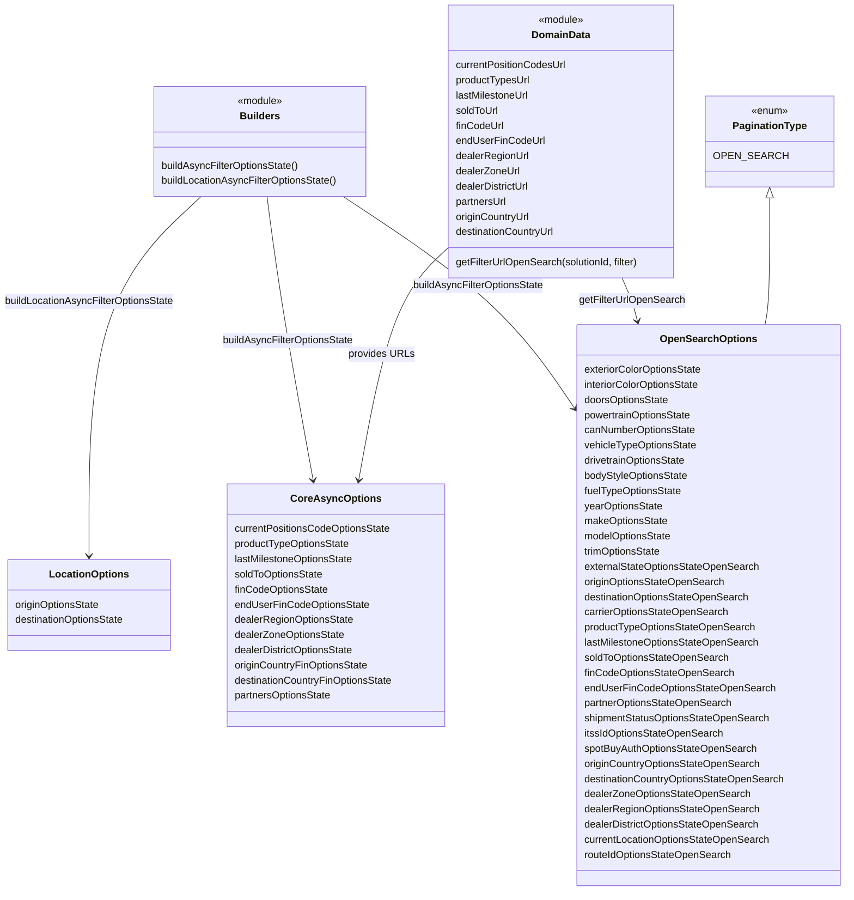

# Diagram: web/portal/src/pages/finishedvehicle/search/FinVehicleSearchFilterLoaders.js


> Auto-generated by Obscura crawlers

## Diagram 1



### SVG

<svg id="container" width="1349.296875" xmlns="http://www.w3.org/2000/svg" class="classDiagram" height="1410" viewBox="0 0 1349.296875 1410" role="graphics-document document" aria-roledescription="class"><style>#container{font-family:"trebuchet ms",verdana,arial,sans-serif;font-size:16px;fill:#333;}@keyframes edge-animation-frame{from{stroke-dashoffset:0;}}@keyframes dash{to{stroke-dashoffset:0;}}#container .edge-animation-slow{stroke-dasharray:9,5!important;stroke-dashoffset:900;animation:dash 50s linear infinite;stroke-linecap:round;}#container .edge-animation-fast{stroke-dasharray:9,5!important;stroke-dashoffset:900;animation:dash 20s linear infinite;stroke-linecap:round;}#container .error-icon{fill:#552222;}#container .error-text{fill:#552222;stroke:#552222;}#container .edge-thickness-normal{stroke-width:1px;}#container .edge-thickness-thick{stroke-width:3.5px;}#container .edge-pattern-solid{stroke-dasharray:0;}#container .edge-thickness-invisible{stroke-width:0;fill:none;}#container .edge-pattern-dashed{stroke-dasharray:3;}#container .edge-pattern-dotted{stroke-dasharray:2;}#container .marker{fill:#333333;stroke:#333333;}#container .marker.cross{stroke:#333333;}#container svg{font-family:"trebuchet ms",verdana,arial,sans-serif;font-size:16px;}#container p{margin:0;}#container g.classGroup text{fill:#9370DB;stroke:none;font-family:"trebuchet ms",verdana,arial,sans-serif;font-size:10px;}#container g.classGroup text .title{font-weight:bolder;}#container .nodeLabel,#container .edgeLabel{color:#131300;}#container .edgeLabel .label rect{fill:#ECECFF;}#container .label text{fill:#131300;}#container .labelBkg{background:#ECECFF;}#container .edgeLabel .label span{background:#ECECFF;}#container .classTitle{font-weight:bolder;}#container .node rect,#container .node circle,#container .node ellipse,#container .node polygon,#container .node path{fill:#ECECFF;stroke:#9370DB;stroke-width:1px;}#container .divider{stroke:#9370DB;stroke-width:1;}#container g.clickable{cursor:pointer;}#container g.classGroup rect{fill:#ECECFF;stroke:#9370DB;}#container g.classGroup line{stroke:#9370DB;stroke-width:1;}#container .classLabel .box{stroke:none;stroke-width:0;fill:#ECECFF;opacity:0.5;}#container .classLabel .label{fill:#9370DB;font-size:10px;}#container .relation{stroke:#333333;stroke-width:1;fill:none;}#container .dashed-line{stroke-dasharray:3;}#container .dotted-line{stroke-dasharray:1 2;}#container #compositionStart,#container .composition{fill:#333333!important;stroke:#333333!important;stroke-width:1;}#container #compositionEnd,#container .composition{fill:#333333!important;stroke:#333333!important;stroke-width:1;}#container #dependencyStart,#container .dependency{fill:#333333!important;stroke:#333333!important;stroke-width:1;}#container #dependencyStart,#container .dependency{fill:#333333!important;stroke:#333333!important;stroke-width:1;}#container #extensionStart,#container .extension{fill:transparent!important;stroke:#333333!important;stroke-width:1;}#container #extensionEnd,#container .extension{fill:transparent!important;stroke:#333333!important;stroke-width:1;}#container #aggregationStart,#container .aggregation{fill:transparent!important;stroke:#333333!important;stroke-width:1;}#container #aggregationEnd,#container .aggregation{fill:transparent!important;stroke:#333333!important;stroke-width:1;}#container #lollipopStart,#container .lollipop{fill:#ECECFF!important;stroke:#333333!important;stroke-width:1;}#container #lollipopEnd,#container .lollipop{fill:#ECECFF!important;stroke:#333333!important;stroke-width:1;}#container .edgeTerminals{font-size:11px;line-height:initial;}#container .classTitleText{text-anchor:middle;font-size:18px;fill:#333;}#container .label-icon{display:inline-block;height:1em;overflow:visible;vertical-align:-0.125em;}#container .node .label-icon path{fill:currentColor;stroke:revert;stroke-width:revert;}#container :root{--mermaid-font-family:"trebuchet ms",verdana,arial,sans-serif;}</style><g><defs><marker id="container_class-aggregationStart" class="marker aggregation class" refX="18" refY="7" markerWidth="190" markerHeight="240" orient="auto"><path d="M 18,7 L9,13 L1,7 L9,1 Z"></path></marker></defs><defs><marker id="container_class-aggregationEnd" class="marker aggregation class" refX="1" refY="7" markerWidth="20" markerHeight="28" orient="auto"><path d="M 18,7 L9,13 L1,7 L9,1 Z"></path></marker></defs><defs><marker id="container_class-extensionStart" class="marker extension class" refX="18" refY="7" markerWidth="190" markerHeight="240" orient="auto"><path d="M 1,7 L18,13 V 1 Z"></path></marker></defs><defs><marker id="container_class-extensionEnd" class="marker extension class" refX="1" refY="7" markerWidth="20" markerHeight="28" orient="auto"><path d="M 1,1 V 13 L18,7 Z"></path></marker></defs><defs><marker id="container_class-compositionStart" class="marker composition class" refX="18" refY="7" markerWidth="190" markerHeight="240" orient="auto"><path d="M 18,7 L9,13 L1,7 L9,1 Z"></path></marker></defs><defs><marker id="container_class-compositionEnd" class="marker composition class" refX="1" refY="7" markerWidth="20" markerHeight="28" orient="auto"><path d="M 18,7 L9,13 L1,7 L9,1 Z"></path></marker></defs><defs><marker id="container_class-dependencyStart" class="marker dependency class" refX="6" refY="7" markerWidth="190" markerHeight="240" orient="auto"><path d="M 5,7 L9,13 L1,7 L9,1 Z"></path></marker></defs><defs><marker id="container_class-dependencyEnd" class="marker dependency class" refX="13" refY="7" markerWidth="20" markerHeight="28" orient="auto"><path d="M 18,7 L9,13 L14,7 L9,1 Z"></path></marker></defs><defs><marker id="container_class-lollipopStart" class="marker lollipop class" refX="13" refY="7" markerWidth="190" markerHeight="240" orient="auto"><circle stroke="black" fill="transparent" cx="7" cy="7" r="6"></circle></marker></defs><defs><marker id="container_class-lollipopEnd" class="marker lollipop class" refX="1" refY="7" markerWidth="190" markerHeight="240" orient="auto"><circle stroke="black" fill="transparent" cx="7" cy="7" r="6"></circle></marker></defs><g class="root"><g class="clusters"></g><g class="edgePaths"><path d="M325.539,311L295.3,338.667C265.062,366.333,204.586,421.667,174.348,516.5C144.109,611.333,144.109,745.667,144.109,812.833L144.109,880" id="id_Builders_LocationOptions_1" class="edge-thickness-normal edge-pattern-solid relation" style=";;;" data-edge="true" data-et="edge" data-id="id_Builders_LocationOptions_1" data-points="W3sieCI6MzI1LjUzODU5OTMwODMwMDQsInkiOjMxMX0seyJ4IjoxNDQuMTA5Mzc1LCJ5Ijo0Nzd9LHsieCI6MTQ0LjEwOTM3NSwieSI6ODg2fV0=" marker-end="url(#container_class-dependencyEnd)"></path><path d="M431.242,311L434.618,338.667C437.995,366.333,444.747,421.667,456.767,496.516C468.787,571.366,486.073,665.732,494.717,712.915L503.36,760.098" id="id_Builders_CoreAsyncOptions_2" class="edge-thickness-normal edge-pattern-solid relation" style=";;;" data-edge="true" data-et="edge" data-id="id_Builders_CoreAsyncOptions_2" data-points="W3sieCI6NDMxLjI0MjA5NDg2MTY2MDA2LCJ5IjozMTF9LHsieCI6NDUxLjUsInkiOjQ3N30seyJ4Ijo1MDQuNDQxMjQzODI3OTYyNiwieSI6NzY2fV0=" marker-end="url(#container_class-dependencyEnd)"></path><path d="M552.441,311L594.36,338.667C636.279,366.333,720.116,421.667,781.316,477.591C842.516,533.515,881.079,590.031,900.36,618.288L919.642,646.546" id="id_Builders_OpenSearchOptions_3" class="edge-thickness-normal edge-pattern-solid relation" style=";;;" data-edge="true" data-et="edge" data-id="id_Builders_OpenSearchOptions_3" data-points="W3sieCI6NTUyLjQ0MTM5MDgxMDI3NjcsInkiOjMxMX0seyJ4Ijo4MDMuOTUzMTI1LCJ5Ijo0Nzd9LHsieCI6OTIzLjAyMzQzNzUsInkiOjY1MS41MDIxMTI1NjcwOTYzfV0=" marker-end="url(#container_class-dependencyEnd)"></path><path d="M721.258,391.116L705.669,405.43C690.081,419.744,658.904,448.372,634.672,509.869C610.44,571.366,593.153,665.732,584.51,712.915L575.866,760.098" id="id_DomainData_CoreAsyncOptions_4" class="edge-thickness-normal edge-pattern-solid relation" style=";;;" data-edge="true" data-et="edge" data-id="id_DomainData_CoreAsyncOptions_4" data-points="W3sieCI6NzIxLjI1NzgxMjUsInkiOjM5MS4xMTU5NDI0Mzk5MjM0fSx7IngiOjYyNy43MjY1NjI1LCJ5Ijo0Nzd9LHsieCI6NTc0Ljc4NTMxODY3MjAzNzQsInkiOjc2Nn1d" marker-end="url(#container_class-dependencyEnd)"></path><path d="M997.097,440L999.776,446.167C1002.455,452.333,1007.814,464.667,1011.778,476.029C1015.743,487.392,1018.313,497.784,1019.599,502.98L1020.884,508.176" id="id_DomainData_OpenSearchOptions_5" class="edge-thickness-normal edge-pattern-solid relation" style=";;;" data-edge="true" data-et="edge" data-id="id_DomainData_OpenSearchOptions_5" data-points="W3sieCI6OTk3LjA5NjkxNTE0MzI4MDYsInkiOjQ0MH0seyJ4IjoxMDEzLjE3MTg3NSwieSI6NDc3fSx7IngiOjEwMjIuMzI0ODE5NzExNTM4NSwieSI6NTE0fV0=" marker-end="url(#container_class-dependencyEnd)"></path><path d="M1227.254,313.25L1227.254,340.542C1227.254,367.833,1227.254,422.417,1226.035,455.875C1224.816,489.333,1222.377,501.667,1221.158,507.833L1219.939,514" id="id_PaginationType_OpenSearchOptions_6" class="edge-thickness-normal edge-pattern-solid relation" style=";;;" data-edge="true" data-et="edge" data-id="id_PaginationType_OpenSearchOptions_6" data-points="W3sieCI6MTIyNy4yNTM5MDYyNSwieSI6Mjk2fSx7IngiOjEyMjcuMjUzOTA2MjUsInkiOjQ3N30seyJ4IjoxMjE5LjkzOTAwMjQwMzg0NjIsInkiOjUxNH1d" marker-start="url(#container_class-extensionStart)"></path></g><g class="edgeLabels"><g class="edgeLabel" transform="translate(144.109375, 477)"><g class="label" data-id="id_Builders_LocationOptions_1" transform="translate(-136.109375, -12)"><foreignObject width="272.21875" height="24"><div xmlns="http://www.w3.org/1999/xhtml" class="labelBkg" style="display: table; white-space: break-spaces; line-height: 1.5; max-width: 200px; text-align: center; width: 200px;"><span class="edgeLabel"><p>buildLocationAsyncFilterOptionsState</p></span></div></foreignObject></g></g><g class="edgeLabel" transform="translate(462.90396, 539.25286)"><g class="label" data-id="id_Builders_CoreAsyncOptions_2" transform="translate(-105.0546875, -12)"><foreignObject width="210.109375" height="24"><div xmlns="http://www.w3.org/1999/xhtml" class="labelBkg" style="display: table; white-space: break-spaces; line-height: 1.5; max-width: 200px; text-align: center; width: 200px;"><span class="edgeLabel"><p>buildAsyncFilterOptionsState</p></span></div></foreignObject></g></g><g class="edgeLabel" transform="translate(766.35465, 452.18467)"><g class="label" data-id="id_Builders_OpenSearchOptions_3" transform="translate(-105.0546875, -12)"><foreignObject width="210.109375" height="24"><div xmlns="http://www.w3.org/1999/xhtml" class="labelBkg" style="display: table; white-space: break-spaces; line-height: 1.5; max-width: 200px; text-align: center; width: 200px;"><span class="edgeLabel"><p>buildAsyncFilterOptionsState</p></span></div></foreignObject></g></g><g class="edgeLabel" transform="translate(612.69624, 559.04873)"><g class="label" data-id="id_DomainData_CoreAsyncOptions_4" transform="translate(-51.171875, -12)"><foreignObject width="102.34375" height="24"><div xmlns="http://www.w3.org/1999/xhtml" class="labelBkg" style="display: table-cell; white-space: nowrap; line-height: 1.5; max-width: 200px; text-align: center;"><span class="edgeLabel"><p>provides URLs</p></span></div></foreignObject></g></g><g class="edgeLabel" transform="translate(1012.72841, 475.97927)"><g class="label" data-id="id_DomainData_OpenSearchOptions_5" transform="translate(-84.1640625, -12)"><foreignObject width="168.328125" height="24"><div xmlns="http://www.w3.org/1999/xhtml" class="labelBkg" style="display: table-cell; white-space: nowrap; line-height: 1.5; max-width: 200px; text-align: center;"><span class="edgeLabel"><p>getFilterUrlOpenSearch</p></span></div></foreignObject></g></g><g class="edgeLabel"><g class="label" data-id="id_PaginationType_OpenSearchOptions_6" transform="translate(0, 0)"><foreignObject width="0" height="0"><div xmlns="http://www.w3.org/1999/xhtml" class="labelBkg" style="display: table-cell; white-space: nowrap; line-height: 1.5; max-width: 200px; text-align: center;"><span class="edgeLabel"></span></div></foreignObject></g></g></g><g class="nodes"><g class="node default" id="classId-Builders-0" transform="translate(420.625, 224)"><g class="basic label-container"><path d="M-171.58984375 -87 L171.58984375 -87 L171.58984375 87 L-171.58984375 87" stroke="none" stroke-width="0" fill="#ECECFF" style=""></path><path d="M-171.58984375 -87 C-50.81227135130291 -87, 69.96530104739418 -87, 171.58984375 -87 M-171.58984375 -87 C-38.239552197729154 -87, 95.11073935454169 -87, 171.58984375 -87 M171.58984375 -87 C171.58984375 -36.977691328244354, 171.58984375 13.044617343511291, 171.58984375 87 M171.58984375 -87 C171.58984375 -33.923136400006406, 171.58984375 19.153727199987188, 171.58984375 87 M171.58984375 87 C101.12520230562986 87, 30.66056086125971 87, -171.58984375 87 M171.58984375 87 C50.32314613335433 87, -70.94355148329134 87, -171.58984375 87 M-171.58984375 87 C-171.58984375 18.61158618426748, -171.58984375 -49.77682763146504, -171.58984375 -87 M-171.58984375 87 C-171.58984375 22.703490854470914, -171.58984375 -41.59301829105817, -171.58984375 -87" stroke="#9370DB" stroke-width="1.3" fill="none" stroke-dasharray="0 0" style=""></path></g><g class="annotation-group text" transform="translate(-36.6015625, -63)"><g class="label" style="" transform="translate(0,-12)"><foreignObject width="73.203125" height="24"><div xmlns="http://www.w3.org/1999/xhtml" style="display: table-cell; white-space: nowrap; line-height: 1.5; max-width: 123px; text-align: center;"><span class="nodeLabel markdown-node-label" style=""><p>«module»</p></span></div></foreignObject></g></g><g class="label-group text" transform="translate(-30.296875, -39)"><g class="label" style="font-weight: bolder" transform="translate(0,-12)"><foreignObject width="60.59375" height="24"><div xmlns="http://www.w3.org/1999/xhtml" style="display: table-cell; white-space: nowrap; line-height: 1.5; max-width: 110px; text-align: center;"><span class="nodeLabel markdown-node-label" style=""><p>Builders</p></span></div></foreignObject></g></g><g class="members-group text" transform="translate(-159.58984375, 9)"></g><g class="methods-group text" transform="translate(-159.58984375, 39)"><g class="label" style="" transform="translate(0,-12)"><foreignObject width="220.46875" height="24"><div xmlns="http://www.w3.org/1999/xhtml" style="display: table-cell; white-space: nowrap; line-height: 1.5; max-width: 270px; text-align: center;"><span class="nodeLabel markdown-node-label" style=""><p>buildAsyncFilterOptionsState()</p></span></div></foreignObject></g><g class="label" style="" transform="translate(0,12)"><foreignObject width="282.578125" height="24"><div xmlns="http://www.w3.org/1999/xhtml" style="display: table-cell; white-space: nowrap; line-height: 1.5; max-width: 333px; text-align: center;"><span class="nodeLabel markdown-node-label" style=""><p>buildLocationAsyncFilterOptionsState()</p></span></div></foreignObject></g></g><g class="divider" style=""><path d="M-171.58984375 -15 C-56.75127701774092 -15, 58.087289714518164 -15, 171.58984375 -15 M-171.58984375 -15 C-51.392932667203766 -15, 68.80397841559247 -15, 171.58984375 -15" stroke="#9370DB" stroke-width="1.3" fill="none" stroke-dasharray="0 0" style=""></path></g><g class="divider" style=""><path d="M-171.58984375 9 C-86.06698651198548 9, -0.5441292739709525 9, 171.58984375 9 M-171.58984375 9 C-81.7321051512527 9, 8.125633447494607 9, 171.58984375 9" stroke="#9370DB" stroke-width="1.3" fill="none" stroke-dasharray="0 0" style=""></path></g></g><g class="node default" id="classId-DomainData-1" transform="translate(903.25390625, 224)"><g class="basic label-container"><path d="M-181.99609375 -216 L181.99609375 -216 L181.99609375 216 L-181.99609375 216" stroke="none" stroke-width="0" fill="#ECECFF" style=""></path><path d="M-181.99609375 -216 C-85.3641530389792 -216, 11.267787672041607 -216, 181.99609375 -216 M-181.99609375 -216 C-106.41945302437854 -216, -30.84281229875708 -216, 181.99609375 -216 M181.99609375 -216 C181.99609375 -45.95121666025591, 181.99609375 124.09756667948818, 181.99609375 216 M181.99609375 -216 C181.99609375 -122.63322295548899, 181.99609375 -29.26644591097798, 181.99609375 216 M181.99609375 216 C77.1522558040927 216, -27.691582141814592 216, -181.99609375 216 M181.99609375 216 C99.66838080399128 216, 17.340667857982567 216, -181.99609375 216 M-181.99609375 216 C-181.99609375 67.35045485500765, -181.99609375 -81.29909028998469, -181.99609375 -216 M-181.99609375 216 C-181.99609375 61.15102108015651, -181.99609375 -93.69795783968698, -181.99609375 -216" stroke="#9370DB" stroke-width="1.3" fill="none" stroke-dasharray="0 0" style=""></path></g><g class="annotation-group text" transform="translate(-36.6015625, -192)"><g class="label" style="" transform="translate(0,-12)"><foreignObject width="73.203125" height="24"><div xmlns="http://www.w3.org/1999/xhtml" style="display: table-cell; white-space: nowrap; line-height: 1.5; max-width: 123px; text-align: center;"><span class="nodeLabel markdown-node-label" style=""><p>«module»</p></span></div></foreignObject></g></g><g class="label-group text" transform="translate(-44.7890625, -168)"><g class="label" style="font-weight: bolder" transform="translate(0,-12)"><foreignObject width="89.578125" height="24"><div xmlns="http://www.w3.org/1999/xhtml" style="display: table-cell; white-space: nowrap; line-height: 1.5; max-width: 139px; text-align: center;"><span class="nodeLabel markdown-node-label" style=""><p>DomainData</p></span></div></foreignObject></g></g><g class="members-group text" transform="translate(-169.99609375, -120)"><g class="label" style="" transform="translate(0,-12)"><foreignObject width="176.90625" height="24"><div xmlns="http://www.w3.org/1999/xhtml" style="display: table-cell; white-space: nowrap; line-height: 1.5; max-width: 227px; text-align: center;"><span class="nodeLabel markdown-node-label" style=""><p>currentPositionCodesUrl</p></span></div></foreignObject></g><g class="label" style="" transform="translate(0,12)"><foreignObject width="119.515625" height="24"><div xmlns="http://www.w3.org/1999/xhtml" style="display: table-cell; white-space: nowrap; line-height: 1.5; max-width: 170px; text-align: center;"><span class="nodeLabel markdown-node-label" style=""><p>productTypesUrl</p></span></div></foreignObject></g><g class="label" style="" transform="translate(0,36)"><foreignObject width="118.59375" height="24"><div xmlns="http://www.w3.org/1999/xhtml" style="display: table-cell; white-space: nowrap; line-height: 1.5; max-width: 169px; text-align: center;"><span class="nodeLabel markdown-node-label" style=""><p>lastMilestoneUrl</p></span></div></foreignObject></g><g class="label" style="" transform="translate(0,60)"><foreignObject width="69.1875" height="24"><div xmlns="http://www.w3.org/1999/xhtml" style="display: table-cell; white-space: nowrap; line-height: 1.5; max-width: 119px; text-align: center;"><span class="nodeLabel markdown-node-label" style=""><p>soldToUrl</p></span></div></foreignObject></g><g class="label" style="" transform="translate(0,84)"><foreignObject width="76.3125" height="24"><div xmlns="http://www.w3.org/1999/xhtml" style="display: table-cell; white-space: nowrap; line-height: 1.5; max-width: 127px; text-align: center;"><span class="nodeLabel markdown-node-label" style=""><p>finCodeUrl</p></span></div></foreignObject></g><g class="label" style="" transform="translate(0,108)"><foreignObject width="139.46875" height="24"><div xmlns="http://www.w3.org/1999/xhtml" style="display: table-cell; white-space: nowrap; line-height: 1.5; max-width: 190px; text-align: center;"><span class="nodeLabel markdown-node-label" style=""><p>endUserFinCodeUrl</p></span></div></foreignObject></g><g class="label" style="" transform="translate(0,132)"><foreignObject width="117.359375" height="24"><div xmlns="http://www.w3.org/1999/xhtml" style="display: table-cell; white-space: nowrap; line-height: 1.5; max-width: 168px; text-align: center;"><span class="nodeLabel markdown-node-label" style=""><p>dealerRegionUrl</p></span></div></foreignObject></g><g class="label" style="" transform="translate(0,156)"><foreignObject width="103.078125" height="24"><div xmlns="http://www.w3.org/1999/xhtml" style="display: table-cell; white-space: nowrap; line-height: 1.5; max-width: 153px; text-align: center;"><span class="nodeLabel markdown-node-label" style=""><p>dealerZoneUrl</p></span></div></foreignObject></g><g class="label" style="" transform="translate(0,180)"><foreignObject width="119.8125" height="24"><div xmlns="http://www.w3.org/1999/xhtml" style="display: table-cell; white-space: nowrap; line-height: 1.5; max-width: 170px; text-align: center;"><span class="nodeLabel markdown-node-label" style=""><p>dealerDistrictUrl</p></span></div></foreignObject></g><g class="label" style="" transform="translate(0,204)"><foreignObject width="82.96875" height="24"><div xmlns="http://www.w3.org/1999/xhtml" style="display: table-cell; white-space: nowrap; line-height: 1.5; max-width: 133px; text-align: center;"><span class="nodeLabel markdown-node-label" style=""><p>partnersUrl</p></span></div></foreignObject></g><g class="label" style="" transform="translate(0,228)"><foreignObject width="120.203125" height="24"><div xmlns="http://www.w3.org/1999/xhtml" style="display: table-cell; white-space: nowrap; line-height: 1.5; max-width: 171px; text-align: center;"><span class="nodeLabel markdown-node-label" style=""><p>originCountryUrl</p></span></div></foreignObject></g><g class="label" style="" transform="translate(0,252)"><foreignObject width="161.09375" height="24"><div xmlns="http://www.w3.org/1999/xhtml" style="display: table-cell; white-space: nowrap; line-height: 1.5; max-width: 211px; text-align: center;"><span class="nodeLabel markdown-node-label" style=""><p>destinationCountryUrl</p></span></div></foreignObject></g></g><g class="methods-group text" transform="translate(-169.99609375, 192)"><g class="label" style="" transform="translate(0,-12)"><foreignObject width="295.203125" height="24"><div xmlns="http://www.w3.org/1999/xhtml" style="display: table-cell; white-space: nowrap; line-height: 1.5; max-width: 345px; text-align: center;"><span class="nodeLabel markdown-node-label" style=""><p>getFilterUrlOpenSearch(solutionId, filter)</p></span></div></foreignObject></g></g><g class="divider" style=""><path d="M-181.99609375 -144 C-97.79464755375548 -144, -13.593201357510964 -144, 181.99609375 -144 M-181.99609375 -144 C-38.08346558640565 -144, 105.8291625771887 -144, 181.99609375 -144" stroke="#9370DB" stroke-width="1.3" fill="none" stroke-dasharray="0 0" style=""></path></g><g class="divider" style=""><path d="M-181.99609375 168 C-85.88750885259917 168, 10.221076044801663 168, 181.99609375 168 M-181.99609375 168 C-65.51170916333908 168, 50.972675423321846 168, 181.99609375 168" stroke="#9370DB" stroke-width="1.3" fill="none" stroke-dasharray="0 0" style=""></path></g></g><g class="node default" id="classId-PaginationType-2" transform="translate(1227.25390625, 224)"><g class="basic label-container"><path d="M-92.00390625 -72 L92.00390625 -72 L92.00390625 72 L-92.00390625 72" stroke="none" stroke-width="0" fill="#ECECFF" style=""></path><path d="M-92.00390625 -72 C-52.60077448558539 -72, -13.19764272117078 -72, 92.00390625 -72 M-92.00390625 -72 C-48.73130100736756 -72, -5.4586957647351255 -72, 92.00390625 -72 M92.00390625 -72 C92.00390625 -24.799741373151463, 92.00390625 22.400517253697075, 92.00390625 72 M92.00390625 -72 C92.00390625 -34.14348726262901, 92.00390625 3.7130254747419826, 92.00390625 72 M92.00390625 72 C23.99087011504068 72, -44.02216601991864 72, -92.00390625 72 M92.00390625 72 C47.550701918043806 72, 3.097497586087613 72, -92.00390625 72 M-92.00390625 72 C-92.00390625 14.793736651943362, -92.00390625 -42.412526696113275, -92.00390625 -72 M-92.00390625 72 C-92.00390625 39.31944565619671, -92.00390625 6.638891312393426, -92.00390625 -72" stroke="#9370DB" stroke-width="1.3" fill="none" stroke-dasharray="0 0" style=""></path></g><g class="annotation-group text" transform="translate(-29.53125, -48)"><g class="label" style="" transform="translate(0,-12)"><foreignObject width="59.0625" height="24"><div xmlns="http://www.w3.org/1999/xhtml" style="display: table-cell; white-space: nowrap; line-height: 1.5; max-width: 109px; text-align: center;"><span class="nodeLabel markdown-node-label" style=""><p>«enum»</p></span></div></foreignObject></g></g><g class="label-group text" transform="translate(-56.3203125, -24)"><g class="label" style="font-weight: bolder" transform="translate(0,-12)"><foreignObject width="112.640625" height="24"><div xmlns="http://www.w3.org/1999/xhtml" style="display: table-cell; white-space: nowrap; line-height: 1.5; max-width: 161px; text-align: center;"><span class="nodeLabel markdown-node-label" style=""><p>PaginationType</p></span></div></foreignObject></g></g><g class="members-group text" transform="translate(-80.00390625, 24)"><g class="label" style="" transform="translate(0,-12)"><foreignObject width="103.6875" height="24"><div xmlns="http://www.w3.org/1999/xhtml" style="display: table-cell; white-space: nowrap; line-height: 1.5; max-width: 154px; text-align: center;"><span class="nodeLabel markdown-node-label" style=""><p>OPEN_SEARCH</p></span></div></foreignObject></g></g><g class="methods-group text" transform="translate(-80.00390625, 72)"></g><g class="divider" style=""><path d="M-92.00390625 0 C-47.6169688848582 0, -3.2300315197164053 0, 92.00390625 0 M-92.00390625 0 C-30.413159034790354 0, 31.177588180419292 0, 92.00390625 0" stroke="#9370DB" stroke-width="1.3" fill="none" stroke-dasharray="0 0" style=""></path></g><g class="divider" style=""><path d="M-92.00390625 48 C-49.126512934419736 48, -6.249119618839472 48, 92.00390625 48 M-92.00390625 48 C-38.480410973467094 48, 15.043084303065811 48, 92.00390625 48" stroke="#9370DB" stroke-width="1.3" fill="none" stroke-dasharray="0 0" style=""></path></g></g><g class="node default" id="classId-LocationOptions-3" transform="translate(144.109375, 958)"><g class="basic label-container"><path d="M-130.84765625 -72 L130.84765625 -72 L130.84765625 72 L-130.84765625 72" stroke="none" stroke-width="0" fill="#ECECFF" style=""></path><path d="M-130.84765625 -72 C-42.168467770396305 -72, 46.51072070920739 -72, 130.84765625 -72 M-130.84765625 -72 C-40.298394066900144 -72, 50.25086811619971 -72, 130.84765625 -72 M130.84765625 -72 C130.84765625 -31.103975764452635, 130.84765625 9.79204847109473, 130.84765625 72 M130.84765625 -72 C130.84765625 -19.733146786303507, 130.84765625 32.533706427392985, 130.84765625 72 M130.84765625 72 C50.209016672992135 72, -30.42962290401573 72, -130.84765625 72 M130.84765625 72 C49.19255478138439 72, -32.462546687231224 72, -130.84765625 72 M-130.84765625 72 C-130.84765625 17.196527621873287, -130.84765625 -37.60694475625343, -130.84765625 -72 M-130.84765625 72 C-130.84765625 32.02750484853392, -130.84765625 -7.944990302932155, -130.84765625 -72" stroke="#9370DB" stroke-width="1.3" fill="none" stroke-dasharray="0 0" style=""></path></g><g class="annotation-group text" transform="translate(0, -48)"></g><g class="label-group text" transform="translate(-60.1484375, -48)"><g class="label" style="font-weight: bolder" transform="translate(0,-12)"><foreignObject width="120.296875" height="24"><div xmlns="http://www.w3.org/1999/xhtml" style="display: table-cell; white-space: nowrap; line-height: 1.5; max-width: 169px; text-align: center;"><span class="nodeLabel markdown-node-label" style=""><p>LocationOptions</p></span></div></foreignObject></g></g><g class="members-group text" transform="translate(-118.84765625, 0)"><g class="label" style="" transform="translate(0,-12)"><foreignObject width="136.640625" height="24"><div xmlns="http://www.w3.org/1999/xhtml" style="display: table-cell; white-space: nowrap; line-height: 1.5; max-width: 187px; text-align: center;"><span class="nodeLabel markdown-node-label" style=""><p>originOptionsState</p></span></div></foreignObject></g><g class="label" style="" transform="translate(0,12)"><foreignObject width="177.546875" height="24"><div xmlns="http://www.w3.org/1999/xhtml" style="display: table-cell; white-space: nowrap; line-height: 1.5; max-width: 228px; text-align: center;"><span class="nodeLabel markdown-node-label" style=""><p>destinationOptionsState</p></span></div></foreignObject></g></g><g class="methods-group text" transform="translate(-118.84765625, 72)"></g><g class="divider" style=""><path d="M-130.84765625 -24 C-75.8950842557467 -24, -20.942512261493405 -24, 130.84765625 -24 M-130.84765625 -24 C-46.102998157871184 -24, 38.64165993425763 -24, 130.84765625 -24" stroke="#9370DB" stroke-width="1.3" fill="none" stroke-dasharray="0 0" style=""></path></g><g class="divider" style=""><path d="M-130.84765625 48 C-41.87959568693071 48, 47.08846487613857 48, 130.84765625 48 M-130.84765625 48 C-68.60224765498705 48, -6.356839059974121 48, 130.84765625 48" stroke="#9370DB" stroke-width="1.3" fill="none" stroke-dasharray="0 0" style=""></path></g></g><g class="node default" id="classId-CoreAsyncOptions-4" transform="translate(539.61328125, 958)"><g class="basic label-container"><path d="M-172.76953125 -192 L172.76953125 -192 L172.76953125 192 L-172.76953125 192" stroke="none" stroke-width="0" fill="#ECECFF" style=""></path><path d="M-172.76953125 -192 C-52.311702030879616 -192, 68.14612718824077 -192, 172.76953125 -192 M-172.76953125 -192 C-59.15936368105834 -192, 54.450803887883325 -192, 172.76953125 -192 M172.76953125 -192 C172.76953125 -78.00924288212282, 172.76953125 35.98151423575436, 172.76953125 192 M172.76953125 -192 C172.76953125 -97.34271318024147, 172.76953125 -2.68542636048295, 172.76953125 192 M172.76953125 192 C67.44789161992443 192, -37.87374801015113 192, -172.76953125 192 M172.76953125 192 C70.5508479260333 192, -31.667835397933402 192, -172.76953125 192 M-172.76953125 192 C-172.76953125 95.91912402507762, -172.76953125 -0.16175194984475638, -172.76953125 -192 M-172.76953125 192 C-172.76953125 89.4876047443727, -172.76953125 -13.024790511254594, -172.76953125 -192" stroke="#9370DB" stroke-width="1.3" fill="none" stroke-dasharray="0 0" style=""></path></g><g class="annotation-group text" transform="translate(0, -168)"></g><g class="label-group text" transform="translate(-66.3203125, -168)"><g class="label" style="font-weight: bolder" transform="translate(0,-12)"><foreignObject width="132.640625" height="24"><div xmlns="http://www.w3.org/1999/xhtml" style="display: table-cell; white-space: nowrap; line-height: 1.5; max-width: 181px; text-align: center;"><span class="nodeLabel markdown-node-label" style=""><p>CoreAsyncOptions</p></span></div></foreignObject></g></g><g class="members-group text" transform="translate(-160.76953125, -120)"><g class="label" style="" transform="translate(0,-12)"><foreignObject width="249.84375" height="24"><div xmlns="http://www.w3.org/1999/xhtml" style="display: table-cell; white-space: nowrap; line-height: 1.5; max-width: 300px; text-align: center;"><span class="nodeLabel markdown-node-label" style=""><p>currentPositionsCodeOptionsState</p></span></div></foreignObject></g><g class="label" style="" transform="translate(0,12)"><foreignObject width="184.984375" height="24"><div xmlns="http://www.w3.org/1999/xhtml" style="display: table-cell; white-space: nowrap; line-height: 1.5; max-width: 235px; text-align: center;"><span class="nodeLabel markdown-node-label" style=""><p>productTypeOptionsState</p></span></div></foreignObject></g><g class="label" style="" transform="translate(0,36)"><foreignObject width="191.546875" height="24"><div xmlns="http://www.w3.org/1999/xhtml" style="display: table-cell; white-space: nowrap; line-height: 1.5; max-width: 242px; text-align: center;"><span class="nodeLabel markdown-node-label" style=""><p>lastMilestoneOptionsState</p></span></div></foreignObject></g><g class="label" style="" transform="translate(0,60)"><foreignObject width="142.140625" height="24"><div xmlns="http://www.w3.org/1999/xhtml" style="display: table-cell; white-space: nowrap; line-height: 1.5; max-width: 192px; text-align: center;"><span class="nodeLabel markdown-node-label" style=""><p>soldToOptionsState</p></span></div></foreignObject></g><g class="label" style="" transform="translate(0,84)"><foreignObject width="149.25" height="24"><div xmlns="http://www.w3.org/1999/xhtml" style="display: table-cell; white-space: nowrap; line-height: 1.5; max-width: 199px; text-align: center;"><span class="nodeLabel markdown-node-label" style=""><p>finCodeOptionsState</p></span></div></foreignObject></g><g class="label" style="" transform="translate(0,108)"><foreignObject width="212.40625" height="24"><div xmlns="http://www.w3.org/1999/xhtml" style="display: table-cell; white-space: nowrap; line-height: 1.5; max-width: 262px; text-align: center;"><span class="nodeLabel markdown-node-label" style=""><p>endUserFinCodeOptionsState</p></span></div></foreignObject></g><g class="label" style="" transform="translate(0,132)"><foreignObject width="190.296875" height="24"><div xmlns="http://www.w3.org/1999/xhtml" style="display: table-cell; white-space: nowrap; line-height: 1.5; max-width: 240px; text-align: center;"><span class="nodeLabel markdown-node-label" style=""><p>dealerRegionOptionsState</p></span></div></foreignObject></g><g class="label" style="" transform="translate(0,156)"><foreignObject width="176.03125" height="24"><div xmlns="http://www.w3.org/1999/xhtml" style="display: table-cell; white-space: nowrap; line-height: 1.5; max-width: 226px; text-align: center;"><span class="nodeLabel markdown-node-label" style=""><p>dealerZoneOptionsState</p></span></div></foreignObject></g><g class="label" style="" transform="translate(0,180)"><foreignObject width="192.765625" height="24"><div xmlns="http://www.w3.org/1999/xhtml" style="display: table-cell; white-space: nowrap; line-height: 1.5; max-width: 243px; text-align: center;"><span class="nodeLabel markdown-node-label" style=""><p>dealerDistrictOptionsState</p></span></div></foreignObject></g><g class="label" style="" transform="translate(0,204)"><foreignObject width="214.328125" height="24"><div xmlns="http://www.w3.org/1999/xhtml" style="display: table-cell; white-space: nowrap; line-height: 1.5; max-width: 264px; text-align: center;"><span class="nodeLabel markdown-node-label" style=""><p>originCountryFinOptionsState</p></span></div></foreignObject></g><g class="label" style="" transform="translate(0,228)"><foreignObject width="255.21875" height="24"><div xmlns="http://www.w3.org/1999/xhtml" style="display: table-cell; white-space: nowrap; line-height: 1.5; max-width: 305px; text-align: center;"><span class="nodeLabel markdown-node-label" style=""><p>destinationCountryFinOptionsState</p></span></div></foreignObject></g><g class="label" style="" transform="translate(0,252)"><foreignObject width="155.90625" height="24"><div xmlns="http://www.w3.org/1999/xhtml" style="display: table-cell; white-space: nowrap; line-height: 1.5; max-width: 206px; text-align: center;"><span class="nodeLabel markdown-node-label" style=""><p>partnersOptionsState</p></span></div></foreignObject></g></g><g class="methods-group text" transform="translate(-160.76953125, 192)"></g><g class="divider" style=""><path d="M-172.76953125 -144 C-43.206359413415186 -144, 86.35681242316963 -144, 172.76953125 -144 M-172.76953125 -144 C-35.042516136271956 -144, 102.68449897745609 -144, 172.76953125 -144" stroke="#9370DB" stroke-width="1.3" fill="none" stroke-dasharray="0 0" style=""></path></g><g class="divider" style=""><path d="M-172.76953125 168 C-86.96657429450333 168, -1.163617339006663 168, 172.76953125 168 M-172.76953125 168 C-48.2858977972068 168, 76.1977356555864 168, 172.76953125 168" stroke="#9370DB" stroke-width="1.3" fill="none" stroke-dasharray="0 0" style=""></path></g></g><g class="node default" id="classId-OpenSearchOptions-5" transform="translate(1132.16015625, 958)"><g class="basic label-container"><path d="M-209.13671875 -444 L209.13671875 -444 L209.13671875 444 L-209.13671875 444" stroke="none" stroke-width="0" fill="#ECECFF" style=""></path><path d="M-209.13671875 -444 C-120.43186814165765 -444, -31.72701753331529 -444, 209.13671875 -444 M-209.13671875 -444 C-89.63214241203596 -444, 29.87243392592808 -444, 209.13671875 -444 M209.13671875 -444 C209.13671875 -144.15862021575686, 209.13671875 155.6827595684863, 209.13671875 444 M209.13671875 -444 C209.13671875 -127.24032578873374, 209.13671875 189.51934842253252, 209.13671875 444 M209.13671875 444 C97.29908116295118 444, -14.538556424097635 444, -209.13671875 444 M209.13671875 444 C105.74139636852028 444, 2.346073987040569 444, -209.13671875 444 M-209.13671875 444 C-209.13671875 223.88337153090058, -209.13671875 3.766743061801151, -209.13671875 -444 M-209.13671875 444 C-209.13671875 208.9227987298988, -209.13671875 -26.154402540202398, -209.13671875 -444" stroke="#9370DB" stroke-width="1.3" fill="none" stroke-dasharray="0 0" style=""></path></g><g class="annotation-group text" transform="translate(0, -420)"></g><g class="label-group text" transform="translate(-72.8515625, -420)"><g class="label" style="font-weight: bolder" transform="translate(0,-12)"><foreignObject width="145.703125" height="24"><div xmlns="http://www.w3.org/1999/xhtml" style="display: table-cell; white-space: nowrap; line-height: 1.5; max-width: 194px; text-align: center;"><span class="nodeLabel markdown-node-label" style=""><p>OpenSearchOptions</p></span></div></foreignObject></g></g><g class="members-group text" transform="translate(-197.13671875, -372)"><g class="label" style="" transform="translate(0,-12)"><foreignObject width="189.3125" height="24"><div xmlns="http://www.w3.org/1999/xhtml" style="display: table-cell; white-space: nowrap; line-height: 1.5; max-width: 239px; text-align: center;"><span class="nodeLabel markdown-node-label" style=""><p>exteriorColorOptionsState</p></span></div></foreignObject></g><g class="label" style="" transform="translate(0,12)"><foreignObject width="186.875" height="24"><div xmlns="http://www.w3.org/1999/xhtml" style="display: table-cell; white-space: nowrap; line-height: 1.5; max-width: 237px; text-align: center;"><span class="nodeLabel markdown-node-label" style=""><p>interiorColorOptionsState</p></span></div></foreignObject></g><g class="label" style="" transform="translate(0,36)"><foreignObject width="136.078125" height="24"><div xmlns="http://www.w3.org/1999/xhtml" style="display: table-cell; white-space: nowrap; line-height: 1.5; max-width: 186px; text-align: center;"><span class="nodeLabel markdown-node-label" style=""><p>doorsOptionsState</p></span></div></foreignObject></g><g class="label" style="" transform="translate(0,60)"><foreignObject width="173.609375" height="24"><div xmlns="http://www.w3.org/1999/xhtml" style="display: table-cell; white-space: nowrap; line-height: 1.5; max-width: 224px; text-align: center;"><span class="nodeLabel markdown-node-label" style=""><p>powertrainOptionsState</p></span></div></foreignObject></g><g class="label" style="" transform="translate(0,84)"><foreignObject width="178.328125" height="24"><div xmlns="http://www.w3.org/1999/xhtml" style="display: table-cell; white-space: nowrap; line-height: 1.5; max-width: 228px; text-align: center;"><span class="nodeLabel markdown-node-label" style=""><p>canNumberOptionsState</p></span></div></foreignObject></g><g class="label" style="" transform="translate(0,108)"><foreignObject width="179.53125" height="24"><div xmlns="http://www.w3.org/1999/xhtml" style="display: table-cell; white-space: nowrap; line-height: 1.5; max-width: 230px; text-align: center;"><span class="nodeLabel markdown-node-label" style=""><p>vehicleTypeOptionsState</p></span></div></foreignObject></g><g class="label" style="" transform="translate(0,132)"><foreignObject width="165.171875" height="24"><div xmlns="http://www.w3.org/1999/xhtml" style="display: table-cell; white-space: nowrap; line-height: 1.5; max-width: 215px; text-align: center;"><span class="nodeLabel markdown-node-label" style=""><p>drivetrainOptionsState</p></span></div></foreignObject></g><g class="label" style="" transform="translate(0,156)"><foreignObject width="166.3125" height="24"><div xmlns="http://www.w3.org/1999/xhtml" style="display: table-cell; white-space: nowrap; line-height: 1.5; max-width: 216px; text-align: center;"><span class="nodeLabel markdown-node-label" style=""><p>bodyStyleOptionsState</p></span></div></foreignObject></g><g class="label" style="" transform="translate(0,180)"><foreignObject width="156.21875" height="24"><div xmlns="http://www.w3.org/1999/xhtml" style="display: table-cell; white-space: nowrap; line-height: 1.5; max-width: 206px; text-align: center;"><span class="nodeLabel markdown-node-label" style=""><p>fuelTypeOptionsState</p></span></div></foreignObject></g><g class="label" style="" transform="translate(0,204)"><foreignObject width="125.65625" height="24"><div xmlns="http://www.w3.org/1999/xhtml" style="display: table-cell; white-space: nowrap; line-height: 1.5; max-width: 176px; text-align: center;"><span class="nodeLabel markdown-node-label" style=""><p>yearOptionsState</p></span></div></foreignObject></g><g class="label" style="" transform="translate(0,228)"><foreignObject width="133.59375" height="24"><div xmlns="http://www.w3.org/1999/xhtml" style="display: table-cell; white-space: nowrap; line-height: 1.5; max-width: 184px; text-align: center;"><span class="nodeLabel markdown-node-label" style=""><p>makeOptionsState</p></span></div></foreignObject></g><g class="label" style="" transform="translate(0,252)"><foreignObject width="140.4375" height="24"><div xmlns="http://www.w3.org/1999/xhtml" style="display: table-cell; white-space: nowrap; line-height: 1.5; max-width: 190px; text-align: center;"><span class="nodeLabel markdown-node-label" style=""><p>modelOptionsState</p></span></div></foreignObject></g><g class="label" style="" transform="translate(0,276)"><foreignObject width="124.578125" height="24"><div xmlns="http://www.w3.org/1999/xhtml" style="display: table-cell; white-space: nowrap; line-height: 1.5; max-width: 175px; text-align: center;"><span class="nodeLabel markdown-node-label" style=""><p>trimOptionsState</p></span></div></foreignObject></g><g class="label" style="" transform="translate(0,300)"><foreignObject width="278.5" height="24"><div xmlns="http://www.w3.org/1999/xhtml" style="display: table-cell; white-space: nowrap; line-height: 1.5; max-width: 329px; text-align: center;"><span class="nodeLabel markdown-node-label" style=""><p>externalStateOptionsStateOpenSearch</p></span></div></foreignObject></g><g class="label" style="" transform="translate(0,324)"><foreignObject width="224.03125" height="24"><div xmlns="http://www.w3.org/1999/xhtml" style="display: table-cell; white-space: nowrap; line-height: 1.5; max-width: 274px; text-align: center;"><span class="nodeLabel markdown-node-label" style=""><p>originOptionsStateOpenSearch</p></span></div></foreignObject></g><g class="label" style="" transform="translate(0,348)"><foreignObject width="264.921875" height="24"><div xmlns="http://www.w3.org/1999/xhtml" style="display: table-cell; white-space: nowrap; line-height: 1.5; max-width: 315px; text-align: center;"><span class="nodeLabel markdown-node-label" style=""><p>destinationOptionsStateOpenSearch</p></span></div></foreignObject></g><g class="label" style="" transform="translate(0,372)"><foreignObject width="229.734375" height="24"><div xmlns="http://www.w3.org/1999/xhtml" style="display: table-cell; white-space: nowrap; line-height: 1.5; max-width: 280px; text-align: center;"><span class="nodeLabel markdown-node-label" style=""><p>carrierOptionsStateOpenSearch</p></span></div></foreignObject></g><g class="label" style="" transform="translate(0,396)"><foreignObject width="272.359375" height="24"><div xmlns="http://www.w3.org/1999/xhtml" style="display: table-cell; white-space: nowrap; line-height: 1.5; max-width: 322px; text-align: center;"><span class="nodeLabel markdown-node-label" style=""><p>productTypeOptionsStateOpenSearch</p></span></div></foreignObject></g><g class="label" style="" transform="translate(0,420)"><foreignObject width="278.921875" height="24"><div xmlns="http://www.w3.org/1999/xhtml" style="display: table-cell; white-space: nowrap; line-height: 1.5; max-width: 329px; text-align: center;"><span class="nodeLabel markdown-node-label" style=""><p>lastMilestoneOptionsStateOpenSearch</p></span></div></foreignObject></g><g class="label" style="" transform="translate(0,444)"><foreignObject width="229.515625" height="24"><div xmlns="http://www.w3.org/1999/xhtml" style="display: table-cell; white-space: nowrap; line-height: 1.5; max-width: 280px; text-align: center;"><span class="nodeLabel markdown-node-label" style=""><p>soldToOptionsStateOpenSearch</p></span></div></foreignObject></g><g class="label" style="" transform="translate(0,468)"><foreignObject width="236.625" height="24"><div xmlns="http://www.w3.org/1999/xhtml" style="display: table-cell; white-space: nowrap; line-height: 1.5; max-width: 287px; text-align: center;"><span class="nodeLabel markdown-node-label" style=""><p>finCodeOptionsStateOpenSearch</p></span></div></foreignObject></g><g class="label" style="" transform="translate(0,492)"><foreignObject width="299.78125" height="24"><div xmlns="http://www.w3.org/1999/xhtml" style="display: table-cell; white-space: nowrap; line-height: 1.5; max-width: 350px; text-align: center;"><span class="nodeLabel markdown-node-label" style=""><p>endUserFinCodeOptionsStateOpenSearch</p></span></div></foreignObject></g><g class="label" style="" transform="translate(0,516)"><foreignObject width="236.0625" height="24"><div xmlns="http://www.w3.org/1999/xhtml" style="display: table-cell; white-space: nowrap; line-height: 1.5; max-width: 286px; text-align: center;"><span class="nodeLabel markdown-node-label" style=""><p>partnerOptionsStateOpenSearch</p></span></div></foreignObject></g><g class="label" style="" transform="translate(0,540)"><foreignObject width="295.875" height="24"><div xmlns="http://www.w3.org/1999/xhtml" style="display: table-cell; white-space: nowrap; line-height: 1.5; max-width: 346px; text-align: center;"><span class="nodeLabel markdown-node-label" style=""><p>shipmentStatusOptionsStateOpenSearch</p></span></div></foreignObject></g><g class="label" style="" transform="translate(0,564)"><foreignObject width="221.140625" height="24"><div xmlns="http://www.w3.org/1999/xhtml" style="display: table-cell; white-space: nowrap; line-height: 1.5; max-width: 271px; text-align: center;"><span class="nodeLabel markdown-node-label" style=""><p>itssIdOptionsStateOpenSearch</p></span></div></foreignObject></g><g class="label" style="" transform="translate(0,588)"><foreignObject width="274.421875" height="24"><div xmlns="http://www.w3.org/1999/xhtml" style="display: table-cell; white-space: nowrap; line-height: 1.5; max-width: 324px; text-align: center;"><span class="nodeLabel markdown-node-label" style=""><p>spotBuyAuthOptionsStateOpenSearch</p></span></div></foreignObject></g><g class="label" style="" transform="translate(0,612)"><foreignObject width="280.515625" height="24"><div xmlns="http://www.w3.org/1999/xhtml" style="display: table-cell; white-space: nowrap; line-height: 1.5; max-width: 331px; text-align: center;"><span class="nodeLabel markdown-node-label" style=""><p>originCountryOptionsStateOpenSearch</p></span></div></foreignObject></g><g class="label" style="" transform="translate(0,636)"><foreignObject width="321.421875" height="24"><div xmlns="http://www.w3.org/1999/xhtml" style="display: table-cell; white-space: nowrap; line-height: 1.5; max-width: 371px; text-align: center;"><span class="nodeLabel markdown-node-label" style=""><p>destinationCountryOptionsStateOpenSearch</p></span></div></foreignObject></g><g class="label" style="" transform="translate(0,660)"><foreignObject width="263.40625" height="24"><div xmlns="http://www.w3.org/1999/xhtml" style="display: table-cell; white-space: nowrap; line-height: 1.5; max-width: 313px; text-align: center;"><span class="nodeLabel markdown-node-label" style=""><p>dealerZoneOptionsStateOpenSearch</p></span></div></foreignObject></g><g class="label" style="" transform="translate(0,684)"><foreignObject width="277.671875" height="24"><div xmlns="http://www.w3.org/1999/xhtml" style="display: table-cell; white-space: nowrap; line-height: 1.5; max-width: 328px; text-align: center;"><span class="nodeLabel markdown-node-label" style=""><p>dealerRegionOptionsStateOpenSearch</p></span></div></foreignObject></g><g class="label" style="" transform="translate(0,708)"><foreignObject width="280.140625" height="24"><div xmlns="http://www.w3.org/1999/xhtml" style="display: table-cell; white-space: nowrap; line-height: 1.5; max-width: 330px; text-align: center;"><span class="nodeLabel markdown-node-label" style=""><p>dealerDistrictOptionsStateOpenSearch</p></span></div></foreignObject></g><g class="label" style="" transform="translate(0,732)"><foreignObject width="296.4375" height="24"><div xmlns="http://www.w3.org/1999/xhtml" style="display: table-cell; white-space: nowrap; line-height: 1.5; max-width: 346px; text-align: center;"><span class="nodeLabel markdown-node-label" style=""><p>currentLocationOptionsStateOpenSearch</p></span></div></foreignObject></g><g class="label" style="" transform="translate(0,756)"><foreignObject width="234.6875" height="24"><div xmlns="http://www.w3.org/1999/xhtml" style="display: table-cell; white-space: nowrap; line-height: 1.5; max-width: 285px; text-align: center;"><span class="nodeLabel markdown-node-label" style=""><p>routeIdOptionsStateOpenSearch</p></span></div></foreignObject></g></g><g class="methods-group text" transform="translate(-197.13671875, 444)"></g><g class="divider" style=""><path d="M-209.13671875 -396 C-90.23989819752539 -396, 28.656922354949216 -396, 209.13671875 -396 M-209.13671875 -396 C-107.55273294819033 -396, -5.96874714638065 -396, 209.13671875 -396" stroke="#9370DB" stroke-width="1.3" fill="none" stroke-dasharray="0 0" style=""></path></g><g class="divider" style=""><path d="M-209.13671875 420 C-103.43674002807704 420, 2.2632386938459206 420, 209.13671875 420 M-209.13671875 420 C-107.78438964905715 420, -6.432060548114293 420, 209.13671875 420" stroke="#9370DB" stroke-width="1.3" fill="none" stroke-dasharray="0 0" style=""></path></g></g></g></g></g></svg>

## Diagram 2

```mermaid
flowchart LR
    subgraph IMPORTS
        A[buildAsyncFilterOptionsState] --> B[buildLocationAsyncFilterOptionsState]
        C[DomainData URLs & getFilterUrlOpenSearch] 
        D[PaginationType.OPEN_SEARCH]
    end
    subgraph OPTION_STATE_FACTORY["Option State Factory (per export)"]
        E[getUrl] --> F[fetch data]
        F --> G[getResponseData]
        G --> H[transformResult]
        H --> I[optionsState (topic)]
    end
    subgraph VARIANTS
        LOC[originOptionsState / destinationOptionsState] 
        CORE[currentPositionsCodeOptionsState ... partnersOptionsState]
        OS[OpenSearch options e.g. exteriorColorOptionsState ... routeIdOptionsState]
    end
    A --> OPTION_STATE_FACTORY
    B --> LOC
    C --> OPTION_STATE_FACTORY
    D --> OS
    OPTION_STATE_FACTORY --> LOC
    OPTION_STATE_FACTORY --> CORE
    OPTION_STATE_FACTORY --> OS
```

> SVG rendering failed for this diagram.
