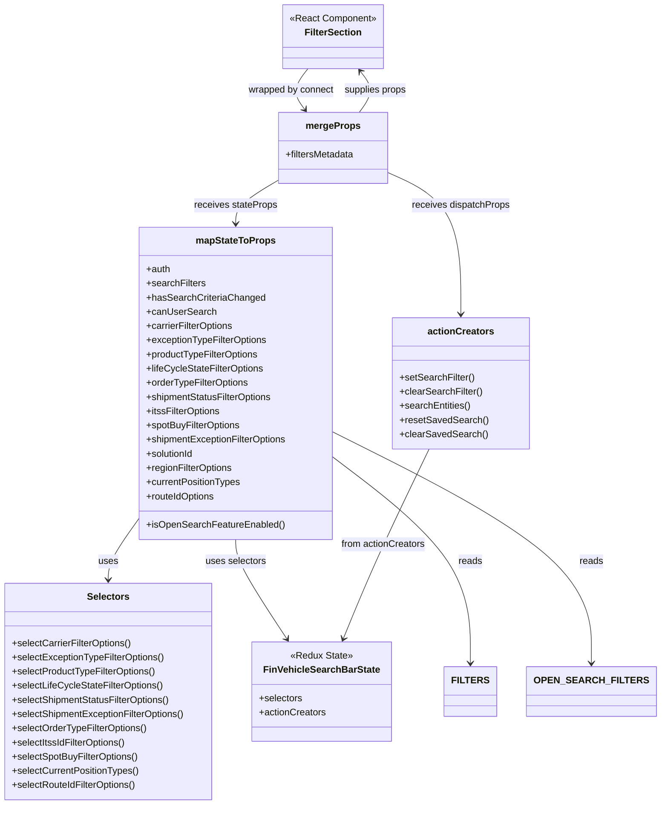

# Diagram: web/portal/src/pages/finishedvehicle/search/FinVehicleSearchFiltersContainer.js


> Auto-generated by Obscura crawlers

## Diagram 1



### SVG

<svg id="container" width="1082.61328125" xmlns="http://www.w3.org/2000/svg" class="classDiagram" height="1360" viewBox="0 0 1082.61328125 1360" role="graphics-document document" aria-roledescription="class"><style>#container{font-family:"trebuchet ms",verdana,arial,sans-serif;font-size:16px;fill:#333;}@keyframes edge-animation-frame{from{stroke-dashoffset:0;}}@keyframes dash{to{stroke-dashoffset:0;}}#container .edge-animation-slow{stroke-dasharray:9,5!important;stroke-dashoffset:900;animation:dash 50s linear infinite;stroke-linecap:round;}#container .edge-animation-fast{stroke-dasharray:9,5!important;stroke-dashoffset:900;animation:dash 20s linear infinite;stroke-linecap:round;}#container .error-icon{fill:#552222;}#container .error-text{fill:#552222;stroke:#552222;}#container .edge-thickness-normal{stroke-width:1px;}#container .edge-thickness-thick{stroke-width:3.5px;}#container .edge-pattern-solid{stroke-dasharray:0;}#container .edge-thickness-invisible{stroke-width:0;fill:none;}#container .edge-pattern-dashed{stroke-dasharray:3;}#container .edge-pattern-dotted{stroke-dasharray:2;}#container .marker{fill:#333333;stroke:#333333;}#container .marker.cross{stroke:#333333;}#container svg{font-family:"trebuchet ms",verdana,arial,sans-serif;font-size:16px;}#container p{margin:0;}#container g.classGroup text{fill:#9370DB;stroke:none;font-family:"trebuchet ms",verdana,arial,sans-serif;font-size:10px;}#container g.classGroup text .title{font-weight:bolder;}#container .nodeLabel,#container .edgeLabel{color:#131300;}#container .edgeLabel .label rect{fill:#ECECFF;}#container .label text{fill:#131300;}#container .labelBkg{background:#ECECFF;}#container .edgeLabel .label span{background:#ECECFF;}#container .classTitle{font-weight:bolder;}#container .node rect,#container .node circle,#container .node ellipse,#container .node polygon,#container .node path{fill:#ECECFF;stroke:#9370DB;stroke-width:1px;}#container .divider{stroke:#9370DB;stroke-width:1;}#container g.clickable{cursor:pointer;}#container g.classGroup rect{fill:#ECECFF;stroke:#9370DB;}#container g.classGroup line{stroke:#9370DB;stroke-width:1;}#container .classLabel .box{stroke:none;stroke-width:0;fill:#ECECFF;opacity:0.5;}#container .classLabel .label{fill:#9370DB;font-size:10px;}#container .relation{stroke:#333333;stroke-width:1;fill:none;}#container .dashed-line{stroke-dasharray:3;}#container .dotted-line{stroke-dasharray:1 2;}#container #compositionStart,#container .composition{fill:#333333!important;stroke:#333333!important;stroke-width:1;}#container #compositionEnd,#container .composition{fill:#333333!important;stroke:#333333!important;stroke-width:1;}#container #dependencyStart,#container .dependency{fill:#333333!important;stroke:#333333!important;stroke-width:1;}#container #dependencyStart,#container .dependency{fill:#333333!important;stroke:#333333!important;stroke-width:1;}#container #extensionStart,#container .extension{fill:transparent!important;stroke:#333333!important;stroke-width:1;}#container #extensionEnd,#container .extension{fill:transparent!important;stroke:#333333!important;stroke-width:1;}#container #aggregationStart,#container .aggregation{fill:transparent!important;stroke:#333333!important;stroke-width:1;}#container #aggregationEnd,#container .aggregation{fill:transparent!important;stroke:#333333!important;stroke-width:1;}#container #lollipopStart,#container .lollipop{fill:#ECECFF!important;stroke:#333333!important;stroke-width:1;}#container #lollipopEnd,#container .lollipop{fill:#ECECFF!important;stroke:#333333!important;stroke-width:1;}#container .edgeTerminals{font-size:11px;line-height:initial;}#container .classTitleText{text-anchor:middle;font-size:18px;fill:#333;}#container .label-icon{display:inline-block;height:1em;overflow:visible;vertical-align:-0.125em;}#container .node .label-icon path{fill:currentColor;stroke:revert;stroke-width:revert;}#container :root{--mermaid-font-family:"trebuchet ms",verdana,arial,sans-serif;}</style><g><defs><marker id="container_class-aggregationStart" class="marker aggregation class" refX="18" refY="7" markerWidth="190" markerHeight="240" orient="auto"><path d="M 18,7 L9,13 L1,7 L9,1 Z"></path></marker></defs><defs><marker id="container_class-aggregationEnd" class="marker aggregation class" refX="1" refY="7" markerWidth="20" markerHeight="28" orient="auto"><path d="M 18,7 L9,13 L1,7 L9,1 Z"></path></marker></defs><defs><marker id="container_class-extensionStart" class="marker extension class" refX="18" refY="7" markerWidth="190" markerHeight="240" orient="auto"><path d="M 1,7 L18,13 V 1 Z"></path></marker></defs><defs><marker id="container_class-extensionEnd" class="marker extension class" refX="1" refY="7" markerWidth="20" markerHeight="28" orient="auto"><path d="M 1,1 V 13 L18,7 Z"></path></marker></defs><defs><marker id="container_class-compositionStart" class="marker composition class" refX="18" refY="7" markerWidth="190" markerHeight="240" orient="auto"><path d="M 18,7 L9,13 L1,7 L9,1 Z"></path></marker></defs><defs><marker id="container_class-compositionEnd" class="marker composition class" refX="1" refY="7" markerWidth="20" markerHeight="28" orient="auto"><path d="M 18,7 L9,13 L1,7 L9,1 Z"></path></marker></defs><defs><marker id="container_class-dependencyStart" class="marker dependency class" refX="6" refY="7" markerWidth="190" markerHeight="240" orient="auto"><path d="M 5,7 L9,13 L1,7 L9,1 Z"></path></marker></defs><defs><marker id="container_class-dependencyEnd" class="marker dependency class" refX="13" refY="7" markerWidth="20" markerHeight="28" orient="auto"><path d="M 18,7 L9,13 L14,7 L9,1 Z"></path></marker></defs><defs><marker id="container_class-lollipopStart" class="marker lollipop class" refX="13" refY="7" markerWidth="190" markerHeight="240" orient="auto"><circle stroke="black" fill="transparent" cx="7" cy="7" r="6"></circle></marker></defs><defs><marker id="container_class-lollipopEnd" class="marker lollipop class" refX="1" refY="7" markerWidth="190" markerHeight="240" orient="auto"><circle stroke="black" fill="transparent" cx="7" cy="7" r="6"></circle></marker></defs><g class="root"><g class="clusters"></g><g class="edgePaths"><path d="M235.002,878.918L226.659,890.598C218.316,902.278,201.631,925.639,193.288,942.486C184.945,959.333,184.945,969.667,184.945,974.833L184.945,980" id="id_mapStateToProps_Selectors_1" class="edge-thickness-normal edge-pattern-solid relation" style=";;;" data-edge="true" data-et="edge" data-id="id_mapStateToProps_Selectors_1" data-points="W3sieCI6MjM1LjAwMTk1MzEyNSwieSI6ODc4LjkxNzUxOTg3MjgxNH0seyJ4IjoxODQuOTQ1MzEyNSwieSI6OTQ5fSx7IngiOjE4NC45NDUzMTI1LCJ5Ijo5ODZ9XQ==" marker-end="url(#container_class-dependencyEnd)"></path><path d="M399.936,912L399.936,918.167C399.936,924.333,399.936,936.667,413.664,964.654C427.393,992.641,454.851,1036.281,468.58,1058.101L482.309,1079.922" id="id_mapStateToProps_FinVehicleSearchBarState_2" class="edge-thickness-normal edge-pattern-solid relation" style=";;;" data-edge="true" data-et="edge" data-id="id_mapStateToProps_FinVehicleSearchBarState_2" data-points="W3sieCI6Mzk5LjkzNTU0Njg3NSwieSI6OTEyfSx7IngiOjM5OS45MzU1NDY4NzUsInkiOjk0OX0seyJ4Ijo0ODUuNTA0MjI1ODUyMjcyNywieSI6MTA4NX1d" marker-end="url(#container_class-dependencyEnd)"></path><path d="M564.869,774.176L602.957,803.313C641.044,832.451,717.219,890.725,755.307,948.529C793.395,1006.333,793.395,1063.667,793.395,1092.333L793.395,1121" id="id_mapStateToProps_FILTERS_3" class="edge-thickness-normal edge-pattern-solid relation" style=";;;" data-edge="true" data-et="edge" data-id="id_mapStateToProps_FILTERS_3" data-points="W3sieCI6NTY0Ljg2OTE0MDYyNSwieSI6Nzc0LjE3NTgyNDM5NDAyMTN9LHsieCI6NzkzLjM5NDUzMTI1LCJ5Ijo5NDl9LHsieCI6NzkzLjM5NDUzMTI1LCJ5IjoxMTI3fV0=" marker-end="url(#container_class-dependencyEnd)"></path><path d="M564.869,733.765L633.855,769.637C702.841,805.51,840.813,877.255,909.799,941.794C978.785,1006.333,978.785,1063.667,978.785,1092.333L978.785,1121" id="id_mapStateToProps_OPEN_SEARCH_FILTERS_4" class="edge-thickness-normal edge-pattern-solid relation" style=";;;" data-edge="true" data-et="edge" data-id="id_mapStateToProps_OPEN_SEARCH_FILTERS_4" data-points="W3sieCI6NTY0Ljg2OTE0MDYyNSwieSI6NzMzLjc2NDk1Njc2MDI3Njh9LHsieCI6OTc4Ljc4NTE1NjI1LCJ5Ijo5NDl9LHsieCI6OTc4Ljc4NTE1NjI1LCJ5IjoxMTI3fV0=" marker-end="url(#container_class-dependencyEnd)"></path><path d="M722.463,759L707.9,790.667C693.338,822.333,664.213,885.667,640.086,939.085C615.96,992.502,596.832,1036.005,587.269,1057.756L577.705,1079.507" id="id_actionCreators_FinVehicleSearchBarState_5" class="edge-thickness-normal edge-pattern-solid relation" style=";;;" data-edge="true" data-et="edge" data-id="id_actionCreators_FinVehicleSearchBarState_5" data-points="W3sieCI6NzIyLjQ2MjU5MjE0MDc4MDgsInkiOjc1OX0seyJ4Ijo2MzUuMDg3ODkwNjI1LCJ5Ijo5NDl9LHsieCI6NTc1LjI4OTY2NjE5MzE4MTgsInkiOjEwODV9XQ==" marker-end="url(#container_class-dependencyEnd)"></path><path d="M470.822,304.96L459.008,311.967C447.193,318.973,423.564,332.987,411.75,345.16C399.936,357.333,399.936,367.667,399.936,372.833L399.936,378" id="id_mergeProps_mapStateToProps_6" class="edge-thickness-normal edge-pattern-solid relation" style=";;;" data-edge="true" data-et="edge" data-id="id_mergeProps_mapStateToProps_6" data-points="W3sieCI6NDcwLjgyMjI2NTYyNSwieSI6MzA0Ljk1OTk0ODQxMjk4Mjd9LHsieCI6Mzk5LjkzNTU0Njg3NSwieSI6MzQ3fSx7IngiOjM5OS45MzU1NDY4NzUsInkiOjM4NH1d" marker-end="url(#container_class-dependencyEnd)"></path><path d="M656.166,292.803L675.723,301.836C695.28,310.869,734.394,328.934,753.951,368.634C773.508,408.333,773.508,469.667,773.508,500.333L773.508,531" id="id_mergeProps_actionCreators_7" class="edge-thickness-normal edge-pattern-solid relation" style=";;;" data-edge="true" data-et="edge" data-id="id_mergeProps_actionCreators_7" data-points="W3sieCI6NjU2LjE2NjAxNTYyNSwieSI6MjkyLjgwMjc5MzcxNjkyNjl9LHsieCI6NzczLjUwNzgxMjUsInkiOjM0N30seyJ4Ijo3NzMuNTA3ODEyNSwieSI6NTM3fV0=" marker-end="url(#container_class-dependencyEnd)"></path><path d="M608.866,190L613.529,183.833C618.193,177.667,627.519,165.333,627.839,153.779C628.159,142.224,619.473,131.448,615.13,126.059L610.787,120.671" id="id_mergeProps_FilterSection_8" class="edge-thickness-normal edge-pattern-solid relation" style=";;;" data-edge="true" data-et="edge" data-id="id_mergeProps_FilterSection_8" data-points="W3sieCI6NjA4Ljg2NjI0MTE0MDQ2MzksInkiOjE5MH0seyJ4Ijo2MzYuODQ1NzAzMTI1LCJ5IjoxNTN9LHsieCI6NjA3LjAyMTQ0MTQ0OTE3NTksInkiOjExNn1d" marker-end="url(#container_class-dependencyEnd)"></path><path d="M519.967,116L514.996,122.167C510.025,128.333,500.084,140.667,499.173,152.202C498.263,163.738,506.383,174.476,510.443,179.845L514.503,185.214" id="id_FilterSection_mergeProps_9" class="edge-thickness-normal edge-pattern-solid relation" style=";;;" data-edge="true" data-et="edge" data-id="id_FilterSection_mergeProps_9" data-points="W3sieCI6NTE5Ljk2NjgzOTgwMDgyNDEsInkiOjExNn0seyJ4Ijo0OTAuMTQyNTc4MTI1LCJ5IjoxNTN9LHsieCI6NTE4LjEyMjA0MDEwOTUzNjEsInkiOjE5MH1d" marker-end="url(#container_class-dependencyEnd)"></path></g><g class="edgeLabels"><g class="edgeLabel" transform="translate(184.9453125, 949)"><g class="label" data-id="id_mapStateToProps_Selectors_1" transform="translate(-16.4921875, -12)"><foreignObject width="32.984375" height="24"><div xmlns="http://www.w3.org/1999/xhtml" class="labelBkg" style="display: table-cell; white-space: nowrap; line-height: 1.5; max-width: 200px; text-align: center;"><span class="edgeLabel"><p>uses</p></span></div></foreignObject></g></g><g class="edgeLabel" transform="translate(399.935546875, 949)"><g class="label" data-id="id_mapStateToProps_FinVehicleSearchBarState_2" transform="translate(-51.34375, -12)"><foreignObject width="102.6875" height="24"><div xmlns="http://www.w3.org/1999/xhtml" class="labelBkg" style="display: table-cell; white-space: nowrap; line-height: 1.5; max-width: 200px; text-align: center;"><span class="edgeLabel"><p>uses selectors</p></span></div></foreignObject></g></g><g class="edgeLabel" transform="translate(793.39453125, 949)"><g class="label" data-id="id_mapStateToProps_FILTERS_3" transform="translate(-20.0078125, -12)"><foreignObject width="40.015625" height="24"><div xmlns="http://www.w3.org/1999/xhtml" class="labelBkg" style="display: table-cell; white-space: nowrap; line-height: 1.5; max-width: 200px; text-align: center;"><span class="edgeLabel"><p>reads</p></span></div></foreignObject></g></g><g class="edgeLabel" transform="translate(978.78515625, 949)"><g class="label" data-id="id_mapStateToProps_OPEN_SEARCH_FILTERS_4" transform="translate(-20.0078125, -12)"><foreignObject width="40.015625" height="24"><div xmlns="http://www.w3.org/1999/xhtml" class="labelBkg" style="display: table-cell; white-space: nowrap; line-height: 1.5; max-width: 200px; text-align: center;"><span class="edgeLabel"><p>reads</p></span></div></foreignObject></g></g><g class="edgeLabel" transform="translate(647.7394, 921.48876)"><g class="label" data-id="id_actionCreators_FinVehicleSearchBarState_5" transform="translate(-71.84375, -12)"><foreignObject width="143.6875" height="24"><div xmlns="http://www.w3.org/1999/xhtml" class="labelBkg" style="display: table-cell; white-space: nowrap; line-height: 1.5; max-width: 200px; text-align: center;"><span class="edgeLabel"><p>from actionCreators</p></span></div></foreignObject></g></g><g class="edgeLabel" transform="translate(399.935546875, 347)"><g class="label" data-id="id_mergeProps_mapStateToProps_6" transform="translate(-70.15625, -12)"><foreignObject width="140.3125" height="24"><div xmlns="http://www.w3.org/1999/xhtml" class="labelBkg" style="display: table-cell; white-space: nowrap; line-height: 1.5; max-width: 200px; text-align: center;"><span class="edgeLabel"><p>receives stateProps</p></span></div></foreignObject></g></g><g class="edgeLabel" transform="translate(773.5078125, 347)"><g class="label" data-id="id_mergeProps_actionCreators_7" transform="translate(-83.1875, -12)"><foreignObject width="166.375" height="24"><div xmlns="http://www.w3.org/1999/xhtml" class="labelBkg" style="display: table-cell; white-space: nowrap; line-height: 1.5; max-width: 200px; text-align: center;"><span class="edgeLabel"><p>receives dispatchProps</p></span></div></foreignObject></g></g><g class="edgeLabel" transform="translate(636.4894, 152.55797)"><g class="label" data-id="id_mergeProps_FilterSection_8" transform="translate(-53.4765625, -12)"><foreignObject width="106.953125" height="24"><div xmlns="http://www.w3.org/1999/xhtml" class="labelBkg" style="display: table-cell; white-space: nowrap; line-height: 1.5; max-width: 200px; text-align: center;"><span class="edgeLabel"><p>supplies props</p></span></div></foreignObject></g></g><g class="edgeLabel" transform="translate(490.49888, 152.55797)"><g class="label" data-id="id_FilterSection_mergeProps_9" transform="translate(-73.2265625, -12)"><foreignObject width="146.453125" height="24"><div xmlns="http://www.w3.org/1999/xhtml" class="labelBkg" style="display: table-cell; white-space: nowrap; line-height: 1.5; max-width: 200px; text-align: center;"><span class="edgeLabel"><p>wrapped by connect</p></span></div></foreignObject></g></g></g><g class="nodes"><g class="node default" id="classId-FilterSection-0" transform="translate(563.494140625, 62)"><g class="basic label-container"><path d="M-85.2109375 -54 L85.2109375 -54 L85.2109375 54 L-85.2109375 54" stroke="none" stroke-width="0" fill="#ECECFF" style=""></path><path d="M-85.2109375 -54 C-42.78711897024656 -54, -0.36330044049311994 -54, 85.2109375 -54 M-85.2109375 -54 C-28.171632558229028 -54, 28.867672383541944 -54, 85.2109375 -54 M85.2109375 -54 C85.2109375 -16.635926847095867, 85.2109375 20.728146305808266, 85.2109375 54 M85.2109375 -54 C85.2109375 -20.051956908803973, 85.2109375 13.896086182392054, 85.2109375 54 M85.2109375 54 C37.35257889914061 54, -10.50577970171878 54, -85.2109375 54 M85.2109375 54 C40.650845874329825 54, -3.9092457513403502 54, -85.2109375 54 M-85.2109375 54 C-85.2109375 19.148700104816562, -85.2109375 -15.702599790366875, -85.2109375 -54 M-85.2109375 54 C-85.2109375 16.243135233220464, -85.2109375 -21.513729533559072, -85.2109375 -54" stroke="#9370DB" stroke-width="1.3" fill="none" stroke-dasharray="0 0" style=""></path></g><g class="annotation-group text" transform="translate(-73.2109375, -30)"><g class="label" style="" transform="translate(0,-12)"><foreignObject width="146.421875" height="24"><div xmlns="http://www.w3.org/1999/xhtml" style="display: table-cell; white-space: nowrap; line-height: 1.5; max-width: 196px; text-align: center;"><span class="nodeLabel markdown-node-label" style=""><p>«React Component»</p></span></div></foreignObject></g></g><g class="label-group text" transform="translate(-46.3203125, -6)"><g class="label" style="font-weight: bolder" transform="translate(0,-12)"><foreignObject width="92.640625" height="24"><div xmlns="http://www.w3.org/1999/xhtml" style="display: table-cell; white-space: nowrap; line-height: 1.5; max-width: 141px; text-align: center;"><span class="nodeLabel markdown-node-label" style=""><p>FilterSection</p></span></div></foreignObject></g></g><g class="members-group text" transform="translate(-73.2109375, 42)"></g><g class="methods-group text" transform="translate(-73.2109375, 72)"></g><g class="divider" style=""><path d="M-85.2109375 18 C-35.1624284922145 18, 14.886080515570995 18, 85.2109375 18 M-85.2109375 18 C-27.467741205625423 18, 30.275455088749155 18, 85.2109375 18" stroke="#9370DB" stroke-width="1.3" fill="none" stroke-dasharray="0 0" style=""></path></g><g class="divider" style=""><path d="M-85.2109375 36 C-23.35752888625875 36, 38.4958797274825 36, 85.2109375 36 M-85.2109375 36 C-40.603117777840936 36, 4.004701944318128 36, 85.2109375 36" stroke="#9370DB" stroke-width="1.3" fill="none" stroke-dasharray="0 0" style=""></path></g></g><g class="node default" id="classId-mapStateToProps-1" transform="translate(399.935546875, 648)"><g class="basic label-container"><path d="M-164.93359375 -264 L164.93359375 -264 L164.93359375 264 L-164.93359375 264" stroke="none" stroke-width="0" fill="#ECECFF" style=""></path><path d="M-164.93359375 -264 C-92.03409188575687 -264, -19.13459002151373 -264, 164.93359375 -264 M-164.93359375 -264 C-42.26460274253938 -264, 80.40438826492124 -264, 164.93359375 -264 M164.93359375 -264 C164.93359375 -120.89295631802457, 164.93359375 22.214087363950853, 164.93359375 264 M164.93359375 -264 C164.93359375 -135.2207315187695, 164.93359375 -6.441463037538995, 164.93359375 264 M164.93359375 264 C50.72522643143985 264, -63.4831408871203 264, -164.93359375 264 M164.93359375 264 C91.39650384948705 264, 17.859413948974094 264, -164.93359375 264 M-164.93359375 264 C-164.93359375 88.1196314645739, -164.93359375 -87.7607370708522, -164.93359375 -264 M-164.93359375 264 C-164.93359375 82.34497773064021, -164.93359375 -99.31004453871958, -164.93359375 -264" stroke="#9370DB" stroke-width="1.3" fill="none" stroke-dasharray="0 0" style=""></path></g><g class="annotation-group text" transform="translate(0, -240)"></g><g class="label-group text" transform="translate(-64.7109375, -240)"><g class="label" style="font-weight: bolder" transform="translate(0,-12)"><foreignObject width="129.421875" height="24"><div xmlns="http://www.w3.org/1999/xhtml" style="display: table-cell; white-space: nowrap; line-height: 1.5; max-width: 177px; text-align: center;"><span class="nodeLabel markdown-node-label" style=""><p>mapStateToProps</p></span></div></foreignObject></g></g><g class="members-group text" transform="translate(-152.93359375, -192)"><g class="label" style="" transform="translate(0,-12)"><foreignObject width="40.921875" height="24"><div xmlns="http://www.w3.org/1999/xhtml" style="display: table-cell; white-space: nowrap; line-height: 1.5; max-width: 98px; text-align: center;"><span class="nodeLabel markdown-node-label" style=""><p>+auth</p></span></div></foreignObject></g><g class="label" style="" transform="translate(0,12)"><foreignObject width="99.609375" height="24"><div xmlns="http://www.w3.org/1999/xhtml" style="display: table-cell; white-space: nowrap; line-height: 1.5; max-width: 157px; text-align: center;"><span class="nodeLabel markdown-node-label" style=""><p>+searchFilters</p></span></div></foreignObject></g><g class="label" style="" transform="translate(0,36)"><foreignObject width="197.75" height="24"><div xmlns="http://www.w3.org/1999/xhtml" style="display: table-cell; white-space: nowrap; line-height: 1.5; max-width: 255px; text-align: center;"><span class="nodeLabel markdown-node-label" style=""><p>+hasSearchCriteriaChanged</p></span></div></foreignObject></g><g class="label" style="" transform="translate(0,60)"><foreignObject width="115.140625" height="24"><div xmlns="http://www.w3.org/1999/xhtml" style="display: table-cell; white-space: nowrap; line-height: 1.5; max-width: 173px; text-align: center;"><span class="nodeLabel markdown-node-label" style=""><p>+canUserSearch</p></span></div></foreignObject></g><g class="label" style="" transform="translate(0,84)"><foreignObject width="149.921875" height="24"><div xmlns="http://www.w3.org/1999/xhtml" style="display: table-cell; white-space: nowrap; line-height: 1.5; max-width: 207px; text-align: center;"><span class="nodeLabel markdown-node-label" style=""><p>+carrierFilterOptions</p></span></div></foreignObject></g><g class="label" style="" transform="translate(0,108)"><foreignObject width="206.453125" height="24"><div xmlns="http://www.w3.org/1999/xhtml" style="display: table-cell; white-space: nowrap; line-height: 1.5; max-width: 264px; text-align: center;"><span class="nodeLabel markdown-node-label" style=""><p>+exceptionTypeFilterOptions</p></span></div></foreignObject></g><g class="label" style="" transform="translate(0,132)"><foreignObject width="192.546875" height="24"><div xmlns="http://www.w3.org/1999/xhtml" style="display: table-cell; white-space: nowrap; line-height: 1.5; max-width: 250px; text-align: center;"><span class="nodeLabel markdown-node-label" style=""><p>+productTypeFilterOptions</p></span></div></foreignObject></g><g class="label" style="" transform="translate(0,156)"><foreignObject width="199.390625" height="24"><div xmlns="http://www.w3.org/1999/xhtml" style="display: table-cell; white-space: nowrap; line-height: 1.5; max-width: 257px; text-align: center;"><span class="nodeLabel markdown-node-label" style=""><p>+lifeCycleStateFilterOptions</p></span></div></foreignObject></g><g class="label" style="" transform="translate(0,180)"><foreignObject width="175.203125" height="24"><div xmlns="http://www.w3.org/1999/xhtml" style="display: table-cell; white-space: nowrap; line-height: 1.5; max-width: 233px; text-align: center;"><span class="nodeLabel markdown-node-label" style=""><p>+orderTypeFilterOptions</p></span></div></foreignObject></g><g class="label" style="" transform="translate(0,204)"><foreignObject width="216.078125" height="24"><div xmlns="http://www.w3.org/1999/xhtml" style="display: table-cell; white-space: nowrap; line-height: 1.5; max-width: 273px; text-align: center;"><span class="nodeLabel markdown-node-label" style=""><p>+shipmentStatusFilterOptions</p></span></div></foreignObject></g><g class="label" style="" transform="translate(0,228)"><foreignObject width="127.046875" height="24"><div xmlns="http://www.w3.org/1999/xhtml" style="display: table-cell; white-space: nowrap; line-height: 1.5; max-width: 184px; text-align: center;"><span class="nodeLabel markdown-node-label" style=""><p>+itssFilterOptions</p></span></div></foreignObject></g><g class="label" style="" transform="translate(0,252)"><foreignObject width="160.984375" height="24"><div xmlns="http://www.w3.org/1999/xhtml" style="display: table-cell; white-space: nowrap; line-height: 1.5; max-width: 218px; text-align: center;"><span class="nodeLabel markdown-node-label" style=""><p>+spotBuyFilterOptions</p></span></div></foreignObject></g><g class="label" style="" transform="translate(0,276)"><foreignObject width="241.15625" height="24"><div xmlns="http://www.w3.org/1999/xhtml" style="display: table-cell; white-space: nowrap; line-height: 1.5; max-width: 299px; text-align: center;"><span class="nodeLabel markdown-node-label" style=""><p>+shipmentExceptionFilterOptions</p></span></div></foreignObject></g><g class="label" style="" transform="translate(0,300)"><foreignObject width="82.109375" height="24"><div xmlns="http://www.w3.org/1999/xhtml" style="display: table-cell; white-space: nowrap; line-height: 1.5; max-width: 139px; text-align: center;"><span class="nodeLabel markdown-node-label" style=""><p>+solutionId</p></span></div></foreignObject></g><g class="label" style="" transform="translate(0,324)"><foreignObject width="147.9375" height="24"><div xmlns="http://www.w3.org/1999/xhtml" style="display: table-cell; white-space: nowrap; line-height: 1.5; max-width: 205px; text-align: center;"><span class="nodeLabel markdown-node-label" style=""><p>+regionFilterOptions</p></span></div></foreignObject></g><g class="label" style="" transform="translate(0,348)"><foreignObject width="160.890625" height="24"><div xmlns="http://www.w3.org/1999/xhtml" style="display: table-cell; white-space: nowrap; line-height: 1.5; max-width: 218px; text-align: center;"><span class="nodeLabel markdown-node-label" style=""><p>+currentPositionTypes</p></span></div></foreignObject></g><g class="label" style="" transform="translate(0,372)"><foreignObject width="117.9375" height="24"><div xmlns="http://www.w3.org/1999/xhtml" style="display: table-cell; white-space: nowrap; line-height: 1.5; max-width: 175px; text-align: center;"><span class="nodeLabel markdown-node-label" style=""><p>+routeIdOptions</p></span></div></foreignObject></g></g><g class="methods-group text" transform="translate(-152.93359375, 240)"><g class="label" style="" transform="translate(0,-12)"><foreignObject width="230.671875" height="24"><div xmlns="http://www.w3.org/1999/xhtml" style="display: table-cell; white-space: nowrap; line-height: 1.5; max-width: 288px; text-align: center;"><span class="nodeLabel markdown-node-label" style=""><p>+isOpenSearchFeatureEnabled()</p></span></div></foreignObject></g></g><g class="divider" style=""><path d="M-164.93359375 -216 C-82.46019854340832 -216, 0.013196663183350665 -216, 164.93359375 -216 M-164.93359375 -216 C-58.05434750936237 -216, 48.824898731275255 -216, 164.93359375 -216" stroke="#9370DB" stroke-width="1.3" fill="none" stroke-dasharray="0 0" style=""></path></g><g class="divider" style=""><path d="M-164.93359375 216 C-97.23115229412949 216, -29.528710838258974 216, 164.93359375 216 M-164.93359375 216 C-71.73024904627572 216, 21.473095657448567 216, 164.93359375 216" stroke="#9370DB" stroke-width="1.3" fill="none" stroke-dasharray="0 0" style=""></path></g></g><g class="node default" id="classId-actionCreators-2" transform="translate(773.5078125, 648)"><g class="basic label-container"><path d="M-112.18359375 -111 L112.18359375 -111 L112.18359375 111 L-112.18359375 111" stroke="none" stroke-width="0" fill="#ECECFF" style=""></path><path d="M-112.18359375 -111 C-40.45474729615131 -111, 31.27409915769738 -111, 112.18359375 -111 M-112.18359375 -111 C-60.41512217726773 -111, -8.646650604535466 -111, 112.18359375 -111 M112.18359375 -111 C112.18359375 -54.34952269512273, 112.18359375 2.300954609754541, 112.18359375 111 M112.18359375 -111 C112.18359375 -38.07350971101884, 112.18359375 34.85298057796231, 112.18359375 111 M112.18359375 111 C60.2762929120713 111, 8.368992074142596 111, -112.18359375 111 M112.18359375 111 C57.428161210390535 111, 2.672728670781069 111, -112.18359375 111 M-112.18359375 111 C-112.18359375 36.18953224814794, -112.18359375 -38.62093550370412, -112.18359375 -111 M-112.18359375 111 C-112.18359375 55.96424040383258, -112.18359375 0.928480807665153, -112.18359375 -111" stroke="#9370DB" stroke-width="1.3" fill="none" stroke-dasharray="0 0" style=""></path></g><g class="annotation-group text" transform="translate(0, -87)"></g><g class="label-group text" transform="translate(-53.6328125, -87)"><g class="label" style="font-weight: bolder" transform="translate(0,-12)"><foreignObject width="107.265625" height="24"><div xmlns="http://www.w3.org/1999/xhtml" style="display: table-cell; white-space: nowrap; line-height: 1.5; max-width: 155px; text-align: center;"><span class="nodeLabel markdown-node-label" style=""><p>actionCreators</p></span></div></foreignObject></g></g><g class="members-group text" transform="translate(-100.18359375, -39)"></g><g class="methods-group text" transform="translate(-100.18359375, -9)"><g class="label" style="" transform="translate(0,-12)"><foreignObject width="125.953125" height="24"><div xmlns="http://www.w3.org/1999/xhtml" style="display: table-cell; white-space: nowrap; line-height: 1.5; max-width: 183px; text-align: center;"><span class="nodeLabel markdown-node-label" style=""><p>+setSearchFilter()</p></span></div></foreignObject></g><g class="label" style="" transform="translate(0,12)"><foreignObject width="139.6875" height="24"><div xmlns="http://www.w3.org/1999/xhtml" style="display: table-cell; white-space: nowrap; line-height: 1.5; max-width: 197px; text-align: center;"><span class="nodeLabel markdown-node-label" style=""><p>+clearSearchFilter()</p></span></div></foreignObject></g><g class="label" style="" transform="translate(0,36)"><foreignObject width="120.359375" height="24"><div xmlns="http://www.w3.org/1999/xhtml" style="display: table-cell; white-space: nowrap; line-height: 1.5; max-width: 178px; text-align: center;"><span class="nodeLabel markdown-node-label" style=""><p>+searchEntities()</p></span></div></foreignObject></g><g class="label" style="" transform="translate(0,60)"><foreignObject width="146.734375" height="24"><div xmlns="http://www.w3.org/1999/xhtml" style="display: table-cell; white-space: nowrap; line-height: 1.5; max-width: 204px; text-align: center;"><span class="nodeLabel markdown-node-label" style=""><p>+resetSavedSearch()</p></span></div></foreignObject></g><g class="label" style="" transform="translate(0,84)"><foreignObject width="146.046875" height="24"><div xmlns="http://www.w3.org/1999/xhtml" style="display: table-cell; white-space: nowrap; line-height: 1.5; max-width: 203px; text-align: center;"><span class="nodeLabel markdown-node-label" style=""><p>+clearSavedSearch()</p></span></div></foreignObject></g></g><g class="divider" style=""><path d="M-112.18359375 -63 C-59.93141409811716 -63, -7.679234446234318 -63, 112.18359375 -63 M-112.18359375 -63 C-33.159210376955016 -63, 45.86517299608997 -63, 112.18359375 -63" stroke="#9370DB" stroke-width="1.3" fill="none" stroke-dasharray="0 0" style=""></path></g><g class="divider" style=""><path d="M-112.18359375 -39 C-41.57746741188362 -39, 29.028658926232765 -39, 112.18359375 -39 M-112.18359375 -39 C-52.523544960135894 -39, 7.136503829728213 -39, 112.18359375 -39" stroke="#9370DB" stroke-width="1.3" fill="none" stroke-dasharray="0 0" style=""></path></g></g><g class="node default" id="classId-mergeProps-3" transform="translate(563.494140625, 250)"><g class="basic label-container"><path d="M-92.671875 -60 L92.671875 -60 L92.671875 60 L-92.671875 60" stroke="none" stroke-width="0" fill="#ECECFF" style=""></path><path d="M-92.671875 -60 C-45.032299592299566 -60, 2.607275815400868 -60, 92.671875 -60 M-92.671875 -60 C-23.416777854811215 -60, 45.83831929037757 -60, 92.671875 -60 M92.671875 -60 C92.671875 -22.61259037386929, 92.671875 14.774819252261423, 92.671875 60 M92.671875 -60 C92.671875 -12.501827999111804, 92.671875 34.99634400177639, 92.671875 60 M92.671875 60 C41.681219720419556 60, -9.309435559160889 60, -92.671875 60 M92.671875 60 C24.8707781664601 60, -42.9303186670798 60, -92.671875 60 M-92.671875 60 C-92.671875 20.07666282758955, -92.671875 -19.846674344820897, -92.671875 -60 M-92.671875 60 C-92.671875 16.12922725247094, -92.671875 -27.74154549505812, -92.671875 -60" stroke="#9370DB" stroke-width="1.3" fill="none" stroke-dasharray="0 0" style=""></path></g><g class="annotation-group text" transform="translate(0, -36)"></g><g class="label-group text" transform="translate(-43.859375, -36)"><g class="label" style="font-weight: bolder" transform="translate(0,-12)"><foreignObject width="87.71875" height="24"><div xmlns="http://www.w3.org/1999/xhtml" style="display: table-cell; white-space: nowrap; line-height: 1.5; max-width: 136px; text-align: center;"><span class="nodeLabel markdown-node-label" style=""><p>mergeProps</p></span></div></foreignObject></g></g><g class="members-group text" transform="translate(-80.671875, 12)"><g class="label" style="" transform="translate(0,-12)"><foreignObject width="117.484375" height="24"><div xmlns="http://www.w3.org/1999/xhtml" style="display: table-cell; white-space: nowrap; line-height: 1.5; max-width: 175px; text-align: center;"><span class="nodeLabel markdown-node-label" style=""><p>+filtersMetadata</p></span></div></foreignObject></g></g><g class="methods-group text" transform="translate(-80.671875, 60)"></g><g class="divider" style=""><path d="M-92.671875 -12 C-18.94956675024862 -12, 54.77274149950276 -12, 92.671875 -12 M-92.671875 -12 C-39.02069870189755 -12, 14.630477596204898 -12, 92.671875 -12" stroke="#9370DB" stroke-width="1.3" fill="none" stroke-dasharray="0 0" style=""></path></g><g class="divider" style=""><path d="M-92.671875 36 C-42.87576755385671 36, 6.920339892286577 36, 92.671875 36 M-92.671875 36 C-34.881017166476056 36, 22.909840667047888 36, 92.671875 36" stroke="#9370DB" stroke-width="1.3" fill="none" stroke-dasharray="0 0" style=""></path></g></g><g class="node default" id="classId-FinVehicleSearchBarState-4" transform="translate(538.35546875, 1169)"><g class="basic label-container"><path d="M-115.19921875 -84 L115.19921875 -84 L115.19921875 84 L-115.19921875 84" stroke="none" stroke-width="0" fill="#ECECFF" style=""></path><path d="M-115.19921875 -84 C-63.45479780384916 -84, -11.710376857698321 -84, 115.19921875 -84 M-115.19921875 -84 C-40.161310636461494 -84, 34.87659747707701 -84, 115.19921875 -84 M115.19921875 -84 C115.19921875 -38.024162324244465, 115.19921875 7.951675351511071, 115.19921875 84 M115.19921875 -84 C115.19921875 -24.88253849349387, 115.19921875 34.23492301301226, 115.19921875 84 M115.19921875 84 C50.56946269042797 84, -14.060293369144063 84, -115.19921875 84 M115.19921875 84 C52.21069264265895 84, -10.777833464682104 84, -115.19921875 84 M-115.19921875 84 C-115.19921875 41.939487796647626, -115.19921875 -0.12102440670474834, -115.19921875 -84 M-115.19921875 84 C-115.19921875 38.32745099599972, -115.19921875 -7.345098008000562, -115.19921875 -84" stroke="#9370DB" stroke-width="1.3" fill="none" stroke-dasharray="0 0" style=""></path></g><g class="annotation-group text" transform="translate(-52.1640625, -60)"><g class="label" style="" transform="translate(0,-12)"><foreignObject width="104.328125" height="24"><div xmlns="http://www.w3.org/1999/xhtml" style="display: table-cell; white-space: nowrap; line-height: 1.5; max-width: 154px; text-align: center;"><span class="nodeLabel markdown-node-label" style=""><p>«Redux State»</p></span></div></foreignObject></g></g><g class="label-group text" transform="translate(-93.3203125, -36)"><g class="label" style="font-weight: bolder" transform="translate(0,-12)"><foreignObject width="186.640625" height="24"><div xmlns="http://www.w3.org/1999/xhtml" style="display: table-cell; white-space: nowrap; line-height: 1.5; max-width: 234px; text-align: center;"><span class="nodeLabel markdown-node-label" style=""><p>FinVehicleSearchBarState</p></span></div></foreignObject></g></g><g class="members-group text" transform="translate(-103.19921875, 12)"><g class="label" style="" transform="translate(0,-12)"><foreignObject width="73.453125" height="24"><div xmlns="http://www.w3.org/1999/xhtml" style="display: table-cell; white-space: nowrap; line-height: 1.5; max-width: 131px; text-align: center;"><span class="nodeLabel markdown-node-label" style=""><p>+selectors</p></span></div></foreignObject></g><g class="label" style="" transform="translate(0,12)"><foreignObject width="113.078125" height="24"><div xmlns="http://www.w3.org/1999/xhtml" style="display: table-cell; white-space: nowrap; line-height: 1.5; max-width: 170px; text-align: center;"><span class="nodeLabel markdown-node-label" style=""><p>+actionCreators</p></span></div></foreignObject></g></g><g class="methods-group text" transform="translate(-103.19921875, 84)"></g><g class="divider" style=""><path d="M-115.19921875 -12 C-52.21228668723387 -12, 10.774645375532259 -12, 115.19921875 -12 M-115.19921875 -12 C-52.947605326815214 -12, 9.304008096369571 -12, 115.19921875 -12" stroke="#9370DB" stroke-width="1.3" fill="none" stroke-dasharray="0 0" style=""></path></g><g class="divider" style=""><path d="M-115.19921875 60 C-42.72147667903688 60, 29.756265391926235 60, 115.19921875 60 M-115.19921875 60 C-68.25006971212136 60, -21.300920674242704 60, 115.19921875 60" stroke="#9370DB" stroke-width="1.3" fill="none" stroke-dasharray="0 0" style=""></path></g></g><g class="node default" id="classId-FILTERS-5" transform="translate(793.39453125, 1169)"><g class="basic label-container"><path d="M-39.5625 -42 L39.5625 -42 L39.5625 42 L-39.5625 42" stroke="none" stroke-width="0" fill="#ECECFF" style=""></path><path d="M-39.5625 -42 C-22.487602798943783 -42, -5.412705597887566 -42, 39.5625 -42 M-39.5625 -42 C-16.214261700356257 -42, 7.133976599287486 -42, 39.5625 -42 M39.5625 -42 C39.5625 -14.66538848967894, 39.5625 12.669223020642121, 39.5625 42 M39.5625 -42 C39.5625 -17.238120807546608, 39.5625 7.523758384906785, 39.5625 42 M39.5625 42 C23.299168505450925 42, 7.035837010901851 42, -39.5625 42 M39.5625 42 C19.022212897954265 42, -1.5180742040914694 42, -39.5625 42 M-39.5625 42 C-39.5625 8.490338413849841, -39.5625 -25.019323172300318, -39.5625 -42 M-39.5625 42 C-39.5625 21.319801208993162, -39.5625 0.6396024179863247, -39.5625 -42" stroke="#9370DB" stroke-width="1.3" fill="none" stroke-dasharray="0 0" style=""></path></g><g class="annotation-group text" transform="translate(0, -18)"></g><g class="label-group text" transform="translate(-27.5625, -18)"><g class="label" style="font-weight: bolder" transform="translate(0,-12)"><foreignObject width="55.125" height="24"><div xmlns="http://www.w3.org/1999/xhtml" style="display: table-cell; white-space: nowrap; line-height: 1.5; max-width: 105px; text-align: center;"><span class="nodeLabel markdown-node-label" style=""><p>FILTERS</p></span></div></foreignObject></g></g><g class="members-group text" transform="translate(-27.5625, 30)"></g><g class="methods-group text" transform="translate(-27.5625, 60)"></g><g class="divider" style=""><path d="M-39.5625 6 C-17.84525898036802 6, 3.871982039263962 6, 39.5625 6 M-39.5625 6 C-18.167612519287033 6, 3.227274961425934 6, 39.5625 6" stroke="#9370DB" stroke-width="1.3" fill="none" stroke-dasharray="0 0" style=""></path></g><g class="divider" style=""><path d="M-39.5625 24 C-9.885305986789408 24, 19.791888026421184 24, 39.5625 24 M-39.5625 24 C-15.459015393653377 24, 8.644469212693245 24, 39.5625 24" stroke="#9370DB" stroke-width="1.3" fill="none" stroke-dasharray="0 0" style=""></path></g></g><g class="node default" id="classId-OPEN_SEARCH_FILTERS-6" transform="translate(978.78515625, 1169)"><g class="basic label-container"><path d="M-95.828125 -42 L95.828125 -42 L95.828125 42 L-95.828125 42" stroke="none" stroke-width="0" fill="#ECECFF" style=""></path><path d="M-95.828125 -42 C-34.271390967032275 -42, 27.28534306593545 -42, 95.828125 -42 M-95.828125 -42 C-46.83857533526308 -42, 2.15097432947384 -42, 95.828125 -42 M95.828125 -42 C95.828125 -10.209119558468114, 95.828125 21.581760883063772, 95.828125 42 M95.828125 -42 C95.828125 -24.913295337039436, 95.828125 -7.826590674078872, 95.828125 42 M95.828125 42 C57.06505135614668 42, 18.301977712293365 42, -95.828125 42 M95.828125 42 C53.56240860606937 42, 11.296692212138737 42, -95.828125 42 M-95.828125 42 C-95.828125 18.85393102805658, -95.828125 -4.292137943886843, -95.828125 -42 M-95.828125 42 C-95.828125 22.246328338289405, -95.828125 2.492656676578811, -95.828125 -42" stroke="#9370DB" stroke-width="1.3" fill="none" stroke-dasharray="0 0" style=""></path></g><g class="annotation-group text" transform="translate(0, -18)"></g><g class="label-group text" transform="translate(-83.828125, -18)"><g class="label" style="font-weight: bolder" transform="translate(0,-12)"><foreignObject width="167.65625" height="24"><div xmlns="http://www.w3.org/1999/xhtml" style="display: table-cell; white-space: nowrap; line-height: 1.5; max-width: 217px; text-align: center;"><span class="nodeLabel markdown-node-label" style=""><p>OPEN_SEARCH_FILTERS</p></span></div></foreignObject></g></g><g class="members-group text" transform="translate(-83.828125, 30)"></g><g class="methods-group text" transform="translate(-83.828125, 60)"></g><g class="divider" style=""><path d="M-95.828125 6 C-34.45248521668792 6, 26.923154566624163 6, 95.828125 6 M-95.828125 6 C-38.9505454472357 6, 17.927034105528605 6, 95.828125 6" stroke="#9370DB" stroke-width="1.3" fill="none" stroke-dasharray="0 0" style=""></path></g><g class="divider" style=""><path d="M-95.828125 24 C-38.3291817975453 24, 19.169761404909394 24, 95.828125 24 M-95.828125 24 C-44.92653444673145 24, 5.975056106537096 24, 95.828125 24" stroke="#9370DB" stroke-width="1.3" fill="none" stroke-dasharray="0 0" style=""></path></g></g><g class="node default" id="classId-Selectors-7" transform="translate(184.9453125, 1169)"><g class="basic label-container"><path d="M-176.9453125 -183 L176.9453125 -183 L176.9453125 183 L-176.9453125 183" stroke="none" stroke-width="0" fill="#ECECFF" style=""></path><path d="M-176.9453125 -183 C-51.57490202875792 -183, 73.79550844248416 -183, 176.9453125 -183 M-176.9453125 -183 C-69.0858748781089 -183, 38.77356274378221 -183, 176.9453125 -183 M176.9453125 -183 C176.9453125 -102.4687337238216, 176.9453125 -21.9374674476432, 176.9453125 183 M176.9453125 -183 C176.9453125 -86.755856259842, 176.9453125 9.48828748031599, 176.9453125 183 M176.9453125 183 C43.703444399824264 183, -89.53842370035147 183, -176.9453125 183 M176.9453125 183 C50.78556732740269 183, -75.37417784519462 183, -176.9453125 183 M-176.9453125 183 C-176.9453125 68.59338947970507, -176.9453125 -45.813221040589866, -176.9453125 -183 M-176.9453125 183 C-176.9453125 90.6717055001641, -176.9453125 -1.6565889996718113, -176.9453125 -183" stroke="#9370DB" stroke-width="1.3" fill="none" stroke-dasharray="0 0" style=""></path></g><g class="annotation-group text" transform="translate(0, -159)"></g><g class="label-group text" transform="translate(-34.171875, -159)"><g class="label" style="font-weight: bolder" transform="translate(0,-12)"><foreignObject width="68.34375" height="24"><div xmlns="http://www.w3.org/1999/xhtml" style="display: table-cell; white-space: nowrap; line-height: 1.5; max-width: 117px; text-align: center;"><span class="nodeLabel markdown-node-label" style=""><p>Selectors</p></span></div></foreignObject></g></g><g class="members-group text" transform="translate(-164.9453125, -111)"></g><g class="methods-group text" transform="translate(-164.9453125, -81)"><g class="label" style="" transform="translate(0,-12)"><foreignObject width="204.546875" height="24"><div xmlns="http://www.w3.org/1999/xhtml" style="display: table-cell; white-space: nowrap; line-height: 1.5; max-width: 262px; text-align: center;"><span class="nodeLabel markdown-node-label" style=""><p>+selectCarrierFilterOptions()</p></span></div></foreignObject></g><g class="label" style="" transform="translate(0,12)"><foreignObject width="259.75" height="24"><div xmlns="http://www.w3.org/1999/xhtml" style="display: table-cell; white-space: nowrap; line-height: 1.5; max-width: 317px; text-align: center;"><span class="nodeLabel markdown-node-label" style=""><p>+selectExceptionTypeFilterOptions()</p></span></div></foreignObject></g><g class="label" style="" transform="translate(0,36)"><foreignObject width="245.34375" height="24"><div xmlns="http://www.w3.org/1999/xhtml" style="display: table-cell; white-space: nowrap; line-height: 1.5; max-width: 303px; text-align: center;"><span class="nodeLabel markdown-node-label" style=""><p>+selectProductTypeFilterOptions()</p></span></div></foreignObject></g><g class="label" style="" transform="translate(0,60)"><foreignObject width="255.96875" height="24"><div xmlns="http://www.w3.org/1999/xhtml" style="display: table-cell; white-space: nowrap; line-height: 1.5; max-width: 313px; text-align: center;"><span class="nodeLabel markdown-node-label" style=""><p>+selectLifeCycleStateFilterOptions()</p></span></div></foreignObject></g><g class="label" style="" transform="translate(0,84)"><foreignObject width="270.625" height="24"><div xmlns="http://www.w3.org/1999/xhtml" style="display: table-cell; white-space: nowrap; line-height: 1.5; max-width: 328px; text-align: center;"><span class="nodeLabel markdown-node-label" style=""><p>+selectShipmentStatusFilterOptions()</p></span></div></foreignObject></g><g class="label" style="" transform="translate(0,108)"><foreignObject width="295.71875" height="24"><div xmlns="http://www.w3.org/1999/xhtml" style="display: table-cell; white-space: nowrap; line-height: 1.5; max-width: 353px; text-align: center;"><span class="nodeLabel markdown-node-label" style=""><p>+selectShipmentExceptionFilterOptions()</p></span></div></foreignObject></g><g class="label" style="" transform="translate(0,132)"><foreignObject width="230.25" height="24"><div xmlns="http://www.w3.org/1999/xhtml" style="display: table-cell; white-space: nowrap; line-height: 1.5; max-width: 288px; text-align: center;"><span class="nodeLabel markdown-node-label" style=""><p>+selectOrderTypeFilterOptions()</p></span></div></foreignObject></g><g class="label" style="" transform="translate(0,156)"><foreignObject width="194.859375" height="24"><div xmlns="http://www.w3.org/1999/xhtml" style="display: table-cell; white-space: nowrap; line-height: 1.5; max-width: 252px; text-align: center;"><span class="nodeLabel markdown-node-label" style=""><p>+selectItssIdFilterOptions()</p></span></div></foreignObject></g><g class="label" style="" transform="translate(0,180)"><foreignObject width="215.546875" height="24"><div xmlns="http://www.w3.org/1999/xhtml" style="display: table-cell; white-space: nowrap; line-height: 1.5; max-width: 273px; text-align: center;"><span class="nodeLabel markdown-node-label" style=""><p>+selectSpotBuyFilterOptions()</p></span></div></foreignObject></g><g class="label" style="" transform="translate(0,204)"><foreignObject width="215.40625" height="24"><div xmlns="http://www.w3.org/1999/xhtml" style="display: table-cell; white-space: nowrap; line-height: 1.5; max-width: 273px; text-align: center;"><span class="nodeLabel markdown-node-label" style=""><p>+selectCurrentPositionTypes()</p></span></div></foreignObject></g><g class="label" style="" transform="translate(0,228)"><foreignObject width="211.921875" height="24"><div xmlns="http://www.w3.org/1999/xhtml" style="display: table-cell; white-space: nowrap; line-height: 1.5; max-width: 269px; text-align: center;"><span class="nodeLabel markdown-node-label" style=""><p>+selectRouteIdFilterOptions()</p></span></div></foreignObject></g></g><g class="divider" style=""><path d="M-176.9453125 -135 C-51.55081880931306 -135, 73.84367488137389 -135, 176.9453125 -135 M-176.9453125 -135 C-58.230651482500306 -135, 60.48400953499939 -135, 176.9453125 -135" stroke="#9370DB" stroke-width="1.3" fill="none" stroke-dasharray="0 0" style=""></path></g><g class="divider" style=""><path d="M-176.9453125 -111 C-44.34186533455565 -111, 88.2615818308887 -111, 176.9453125 -111 M-176.9453125 -111 C-79.11611659675894 -111, 18.713079306482115 -111, 176.9453125 -111" stroke="#9370DB" stroke-width="1.3" fill="none" stroke-dasharray="0 0" style=""></path></g></g></g></g></g></svg>

## Diagram 2

```mermaid
flowchart TD
    A[connect(...)] -->|mapStateToProps| B[mapStateToProps(state)]
    A -->|actionCreators| C[actionCreators]
    A -->|mergeProps| D[mergeProps(stateProps, dispatchProps, ownProps)]
    B --> E[getAuthorization(state)]
    B --> F[FinVehicleSearchBarState.selectors]
    B --> G[DomainDataState.selectors.selectRegionFilterOptions(state)]
    B --> H[Selectors (filter option selectors)]
    H -->|examples| H1(selectCarrierFilterOptions) & H2(selectProductTypeFilterOptions) & H3(selectRouteIdFilterOptions)
    C --> I(setSearchFilter, clearSearchFilter, searchEntities, resetSavedSearch, clearSavedSearch)
    D --> J{isOpenSearchFeatureEnabled?}
    J -->|true| K[filtersMetadata = OPEN_SEARCH_FILTERS]
    J -->|false| L[filtersMetadata = FILTERS]
    D --> M[props -> FilterSection]
    M --> N[FilterSection UI receives mapped props and actions]
```

> SVG rendering failed for this diagram.
