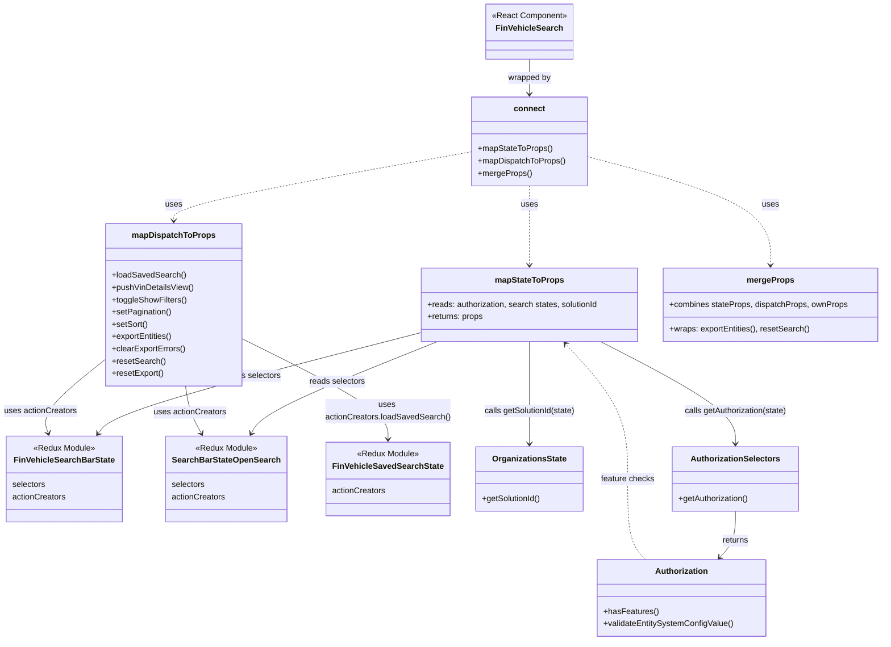

# Diagram: web/portal/src/pages/finishedvehicle/search/FinishedVehicle.Search.page.container.js


> Auto-generated by Obscura crawlers

## Diagram 1



### SVG

<svg id="container" width="1717.337890625" xmlns="http://www.w3.org/2000/svg" class="classDiagram" height="1254" viewBox="0 0 1717.337890625 1254" role="graphics-document document" aria-roledescription="class"><style>#container{font-family:"trebuchet ms",verdana,arial,sans-serif;font-size:16px;fill:#333;}@keyframes edge-animation-frame{from{stroke-dashoffset:0;}}@keyframes dash{to{stroke-dashoffset:0;}}#container .edge-animation-slow{stroke-dasharray:9,5!important;stroke-dashoffset:900;animation:dash 50s linear infinite;stroke-linecap:round;}#container .edge-animation-fast{stroke-dasharray:9,5!important;stroke-dashoffset:900;animation:dash 20s linear infinite;stroke-linecap:round;}#container .error-icon{fill:#552222;}#container .error-text{fill:#552222;stroke:#552222;}#container .edge-thickness-normal{stroke-width:1px;}#container .edge-thickness-thick{stroke-width:3.5px;}#container .edge-pattern-solid{stroke-dasharray:0;}#container .edge-thickness-invisible{stroke-width:0;fill:none;}#container .edge-pattern-dashed{stroke-dasharray:3;}#container .edge-pattern-dotted{stroke-dasharray:2;}#container .marker{fill:#333333;stroke:#333333;}#container .marker.cross{stroke:#333333;}#container svg{font-family:"trebuchet ms",verdana,arial,sans-serif;font-size:16px;}#container p{margin:0;}#container g.classGroup text{fill:#9370DB;stroke:none;font-family:"trebuchet ms",verdana,arial,sans-serif;font-size:10px;}#container g.classGroup text .title{font-weight:bolder;}#container .nodeLabel,#container .edgeLabel{color:#131300;}#container .edgeLabel .label rect{fill:#ECECFF;}#container .label text{fill:#131300;}#container .labelBkg{background:#ECECFF;}#container .edgeLabel .label span{background:#ECECFF;}#container .classTitle{font-weight:bolder;}#container .node rect,#container .node circle,#container .node ellipse,#container .node polygon,#container .node path{fill:#ECECFF;stroke:#9370DB;stroke-width:1px;}#container .divider{stroke:#9370DB;stroke-width:1;}#container g.clickable{cursor:pointer;}#container g.classGroup rect{fill:#ECECFF;stroke:#9370DB;}#container g.classGroup line{stroke:#9370DB;stroke-width:1;}#container .classLabel .box{stroke:none;stroke-width:0;fill:#ECECFF;opacity:0.5;}#container .classLabel .label{fill:#9370DB;font-size:10px;}#container .relation{stroke:#333333;stroke-width:1;fill:none;}#container .dashed-line{stroke-dasharray:3;}#container .dotted-line{stroke-dasharray:1 2;}#container #compositionStart,#container .composition{fill:#333333!important;stroke:#333333!important;stroke-width:1;}#container #compositionEnd,#container .composition{fill:#333333!important;stroke:#333333!important;stroke-width:1;}#container #dependencyStart,#container .dependency{fill:#333333!important;stroke:#333333!important;stroke-width:1;}#container #dependencyStart,#container .dependency{fill:#333333!important;stroke:#333333!important;stroke-width:1;}#container #extensionStart,#container .extension{fill:transparent!important;stroke:#333333!important;stroke-width:1;}#container #extensionEnd,#container .extension{fill:transparent!important;stroke:#333333!important;stroke-width:1;}#container #aggregationStart,#container .aggregation{fill:transparent!important;stroke:#333333!important;stroke-width:1;}#container #aggregationEnd,#container .aggregation{fill:transparent!important;stroke:#333333!important;stroke-width:1;}#container #lollipopStart,#container .lollipop{fill:#ECECFF!important;stroke:#333333!important;stroke-width:1;}#container #lollipopEnd,#container .lollipop{fill:#ECECFF!important;stroke:#333333!important;stroke-width:1;}#container .edgeTerminals{font-size:11px;line-height:initial;}#container .classTitleText{text-anchor:middle;font-size:18px;fill:#333;}#container .label-icon{display:inline-block;height:1em;overflow:visible;vertical-align:-0.125em;}#container .node .label-icon path{fill:currentColor;stroke:revert;stroke-width:revert;}#container :root{--mermaid-font-family:"trebuchet ms",verdana,arial,sans-serif;}</style><g><defs><marker id="container_class-aggregationStart" class="marker aggregation class" refX="18" refY="7" markerWidth="190" markerHeight="240" orient="auto"><path d="M 18,7 L9,13 L1,7 L9,1 Z"></path></marker></defs><defs><marker id="container_class-aggregationEnd" class="marker aggregation class" refX="1" refY="7" markerWidth="20" markerHeight="28" orient="auto"><path d="M 18,7 L9,13 L1,7 L9,1 Z"></path></marker></defs><defs><marker id="container_class-extensionStart" class="marker extension class" refX="18" refY="7" markerWidth="190" markerHeight="240" orient="auto"><path d="M 1,7 L18,13 V 1 Z"></path></marker></defs><defs><marker id="container_class-extensionEnd" class="marker extension class" refX="1" refY="7" markerWidth="20" markerHeight="28" orient="auto"><path d="M 1,1 V 13 L18,7 Z"></path></marker></defs><defs><marker id="container_class-compositionStart" class="marker composition class" refX="18" refY="7" markerWidth="190" markerHeight="240" orient="auto"><path d="M 18,7 L9,13 L1,7 L9,1 Z"></path></marker></defs><defs><marker id="container_class-compositionEnd" class="marker composition class" refX="1" refY="7" markerWidth="20" markerHeight="28" orient="auto"><path d="M 18,7 L9,13 L1,7 L9,1 Z"></path></marker></defs><defs><marker id="container_class-dependencyStart" class="marker dependency class" refX="6" refY="7" markerWidth="190" markerHeight="240" orient="auto"><path d="M 5,7 L9,13 L1,7 L9,1 Z"></path></marker></defs><defs><marker id="container_class-dependencyEnd" class="marker dependency class" refX="13" refY="7" markerWidth="20" markerHeight="28" orient="auto"><path d="M 18,7 L9,13 L14,7 L9,1 Z"></path></marker></defs><defs><marker id="container_class-lollipopStart" class="marker lollipop class" refX="13" refY="7" markerWidth="190" markerHeight="240" orient="auto"><circle stroke="black" fill="transparent" cx="7" cy="7" r="6"></circle></marker></defs><defs><marker id="container_class-lollipopEnd" class="marker lollipop class" refX="1" refY="7" markerWidth="190" markerHeight="240" orient="auto"><circle stroke="black" fill="transparent" cx="7" cy="7" r="6"></circle></marker></defs><g class="root"><g class="clusters"></g><g class="edgePaths"><path d="M1027.709,116L1027.709,122.167C1027.709,128.333,1027.709,140.667,1027.709,152C1027.709,163.333,1027.709,173.667,1027.709,178.833L1027.709,184" id="id_FinVehicleSearch_connect_1" class="edge-thickness-normal edge-pattern-solid relation" style=";;;" data-edge="true" data-et="edge" data-id="id_FinVehicleSearch_connect_1" data-points="W3sieCI6MTAyNy43MDg5ODQzNzUsInkiOjExNn0seyJ4IjoxMDI3LjcwODk4NDM3NSwieSI6MTUzfSx7IngiOjEwMjcuNzA4OTg0Mzc1LCJ5IjoxOTB9XQ==" marker-end="url(#container_class-dependencyEnd)"></path><path d="M1027.709,364L1027.709,370.167C1027.709,376.333,1027.709,388.667,1027.709,414.5C1027.709,440.333,1027.709,479.667,1027.709,499.333L1027.709,519" id="id_connect_mapStateToProps_2" class="edge-thickness-normal edge-pattern-dashed relation" style=";;;" data-edge="true" data-et="edge" data-id="id_connect_mapStateToProps_2" data-points="W3sieCI6MTAyNy43MDg5ODQzNzUsInkiOjM2NH0seyJ4IjoxMDI3LjcwODk4NDM3NSwieSI6NDAxfSx7IngiOjEwMjcuNzA4OTg0Mzc1LCJ5Ijo1MjV9XQ==" marker-end="url(#container_class-dependencyEnd)"></path><path d="M915.799,297.209L820.007,314.508C724.215,331.806,532.632,366.403,436.84,388.868C341.049,411.333,341.049,421.667,341.049,426.833L341.049,432" id="id_connect_mapDispatchToProps_3" class="edge-thickness-normal edge-pattern-dashed relation" style=";;;" data-edge="true" data-et="edge" data-id="id_connect_mapDispatchToProps_3" data-points="W3sieCI6OTE1Ljc5ODgyODEyNSwieSI6Mjk3LjIwOTIxMDExNDYyODY2fSx7IngiOjM0MS4wNDg4MjgxMjUsInkiOjQwMX0seyJ4IjozNDEuMDQ4ODI4MTI1LCJ5Ijo0Mzh9XQ==" marker-end="url(#container_class-dependencyEnd)"></path><path d="M1139.619,306.35L1199.769,322.125C1259.919,337.9,1380.218,369.45,1440.368,404.892C1500.518,440.333,1500.518,479.667,1500.518,499.333L1500.518,519" id="id_connect_mergeProps_4" class="edge-thickness-normal edge-pattern-dashed relation" style=";;;" data-edge="true" data-et="edge" data-id="id_connect_mergeProps_4" data-points="W3sieCI6MTEzOS42MTkxNDA2MjUsInkiOjMwNi4zNDk4NDU5MTc0MzE2fSx7IngiOjE1MDAuNTE3NTc4MTI1LCJ5Ijo0MDF9LHsieCI6MTUwMC41MTc1NzgxMjUsInkiOjUyNX1d" marker-end="url(#container_class-dependencyEnd)"></path><path d="M1167.459,669L1211.455,691.667C1255.45,714.333,1343.441,759.667,1387.436,793C1431.432,826.333,1431.432,847.667,1431.432,858.333L1431.432,869" id="id_mapStateToProps_AuthorizationSelectors_5" class="edge-thickness-normal edge-pattern-solid relation" style=";;;" data-edge="true" data-et="edge" data-id="id_mapStateToProps_AuthorizationSelectors_5" data-points="W3sieCI6MTE2Ny40NTkxMzQ2MTUzODQ1LCJ5Ijo2Njl9LHsieCI6MTQzMS40MzE2NDA2MjUsInkiOjgwNX0seyJ4IjoxNDMxLjQzMTY0MDYyNSwieSI6ODc1fV0=" marker-end="url(#container_class-dependencyEnd)"></path><path d="M1027.709,669L1027.709,691.667C1027.709,714.333,1027.709,759.667,1027.709,793C1027.709,826.333,1027.709,847.667,1027.709,858.333L1027.709,869" id="id_mapStateToProps_OrganizationsState_6" class="edge-thickness-normal edge-pattern-solid relation" style=";;;" data-edge="true" data-et="edge" data-id="id_mapStateToProps_OrganizationsState_6" data-points="W3sieCI6MTAyNy43MDg5ODQzNzUsInkiOjY2OX0seyJ4IjoxMDI3LjcwODk4NDM3NSwieSI6ODA1fSx7IngiOjEwMjcuNzA4OTg0Mzc1LCJ5Ijo4NzV9XQ==" marker-end="url(#container_class-dependencyEnd)"></path><path d="M813.721,652.477L715.667,677.897C617.613,703.318,421.506,754.159,317.688,786.958C213.87,819.757,202.341,834.515,196.576,841.893L190.812,849.272" id="id_mapStateToProps_FinVehicleSearchBarState_7" class="edge-thickness-normal edge-pattern-solid relation" style=";;;" data-edge="true" data-et="edge" data-id="id_mapStateToProps_FinVehicleSearchBarState_7" data-points="W3sieCI6ODEzLjcyMDcwMzEyNSwieSI6NjUyLjQ3NjcyNjE1NDY4NX0seyJ4IjoyMjUuMzk4NDM3NSwieSI6ODA1fSx7IngiOjE4Ny4xMTc5MDcwNzIzNjg0NCwieSI6ODU0fV0=" marker-end="url(#container_class-dependencyEnd)"></path><path d="M851.15,669L795.566,691.667C739.983,714.333,628.815,759.667,569.227,789.624C509.639,819.58,501.629,834.161,497.624,841.451L493.62,848.741" id="id_mapStateToProps_SearchBarStateOpenSearch_8" class="edge-thickness-normal edge-pattern-solid relation" style=";;;" data-edge="true" data-et="edge" data-id="id_mapStateToProps_SearchBarStateOpenSearch_8" data-points="W3sieCI6ODUxLjE0OTU2NDMwMjg4NDYsInkiOjY2OX0seyJ4Ijo1MTcuNjQ4NDM3NSwieSI6ODA1fSx7IngiOjQ5MC43MzA2NzQzNDIxMDUyNiwieSI6ODU0fV0=" marker-end="url(#container_class-dependencyEnd)"></path><path d="M471.881,662.5L519.32,686.25C566.76,710,661.639,757.5,709.078,790.417C756.518,823.333,756.518,841.667,756.518,850.833L756.518,860" id="id_mapDispatchToProps_FinVehicleSavedSearchState_9" class="edge-thickness-normal edge-pattern-solid relation" style=";;;" data-edge="true" data-et="edge" data-id="id_mapDispatchToProps_FinVehicleSavedSearchState_9" data-points="W3sieCI6NDcxLjg4MDg1OTM3NSwieSI6NjYyLjQ5OTY2MTUyNjg4OTh9LHsieCI6NzU2LjUxNzU3ODEyNSwieSI6ODA1fSx7IngiOjc1Ni41MTc1NzgxMjUsInkiOjg2Nn1d" marker-end="url(#container_class-dependencyEnd)"></path><path d="M210.217,700.956L188.393,718.296C166.569,735.637,122.921,770.319,103.387,794.873C83.853,819.427,88.433,833.854,90.723,841.068L93.013,848.281" id="id_mapDispatchToProps_FinVehicleSearchBarState_10" class="edge-thickness-normal edge-pattern-solid relation" style=";;;" data-edge="true" data-et="edge" data-id="id_mapDispatchToProps_FinVehicleSearchBarState_10" data-points="W3sieCI6MjEwLjIxNjc5Njg3NSwieSI6NzAwLjk1NTc3MDc2NjAyODN9LHsieCI6NzkuMjczNDM3NSwieSI6ODA1fSx7IngiOjk0LjgyODQzMzM4ODE1Nzg5LCJ5Ijo4NTR9XQ==" marker-end="url(#container_class-dependencyEnd)"></path><path d="M364.344,756L365.541,764.167C366.737,772.333,369.13,788.667,374.332,804.124C379.533,819.58,387.543,834.161,391.548,841.451L395.552,848.741" id="id_mapDispatchToProps_SearchBarStateOpenSearch_11" class="edge-thickness-normal edge-pattern-solid relation" style=";;;" data-edge="true" data-et="edge" data-id="id_mapDispatchToProps_SearchBarStateOpenSearch_11" data-points="W3sieCI6MzY0LjM0NDMyMjc5MTQ2NjM3LCJ5Ijo3NTZ9LHsieCI6MzcxLjUyMzQzNzUsInkiOjgwNX0seyJ4IjozOTguNDQxMjAwNjU3ODk0NzQsInkiOjg1NH1d" marker-end="url(#container_class-dependencyEnd)"></path><path d="M1431.432,1001L1431.432,1010.667C1431.432,1020.333,1431.432,1039.667,1426.307,1054.772C1421.183,1069.878,1410.934,1080.755,1405.809,1086.194L1400.685,1091.633" id="id_AuthorizationSelectors_Authorization_12" class="edge-thickness-normal edge-pattern-solid relation" style=";;;" data-edge="true" data-et="edge" data-id="id_AuthorizationSelectors_Authorization_12" data-points="W3sieCI6MTQzMS40MzE2NDA2MjUsInkiOjEwMDF9LHsieCI6MTQzMS40MzE2NDA2MjUsInkiOjEwNTl9LHsieCI6MTM5Ni41Njk5Mjg4NTA0NDYzLCJ5IjoxMDk2fV0=" marker-end="url(#container_class-dependencyEnd)"></path><path d="M1255.239,1096L1249.428,1089.833C1243.618,1083.667,1231.998,1071.333,1226.187,1045C1220.377,1018.667,1220.377,978.333,1220.377,936C1220.377,893.667,1220.377,849.333,1200.061,805.234C1179.744,761.134,1139.112,717.268,1118.795,695.335L1098.479,673.402" id="id_Authorization_mapStateToProps_13" class="edge-thickness-normal edge-pattern-dashed relation" style=";;;" data-edge="true" data-et="edge" data-id="id_Authorization_mapStateToProps_13" data-points="W3sieCI6MTI1NS4yMzg2NjQ4OTk1NTM3LCJ5IjoxMDk2fSx7IngiOjEyMjAuMzc2OTUzMTI1LCJ5IjoxMDU5fSx7IngiOjEyMjAuMzc2OTUzMTI1LCJ5Ijo5Mzh9LHsieCI6MTIyMC4zNzY5NTMxMjUsInkiOjgwNX0seyJ4IjoxMDk0LjQwMTc0Mjc4ODQ2MTQsInkiOjY2OX1d" marker-end="url(#container_class-dependencyEnd)"></path></g><g class="edgeLabels"><g class="edgeLabel" transform="translate(1027.708984375, 153)"><g class="label" data-id="id_FinVehicleSearch_connect_1" transform="translate(-42.3203125, -12)"><foreignObject width="84.640625" height="24"><div xmlns="http://www.w3.org/1999/xhtml" class="labelBkg" style="display: table-cell; white-space: nowrap; line-height: 1.5; max-width: 200px; text-align: center;"><span class="edgeLabel"><p>wrapped by</p></span></div></foreignObject></g></g><g class="edgeLabel" transform="translate(1027.708984375, 401)"><g class="label" data-id="id_connect_mapStateToProps_2" transform="translate(-16.4921875, -12)"><foreignObject width="32.984375" height="24"><div xmlns="http://www.w3.org/1999/xhtml" class="labelBkg" style="display: table-cell; white-space: nowrap; line-height: 1.5; max-width: 200px; text-align: center;"><span class="edgeLabel"><p>uses</p></span></div></foreignObject></g></g><g class="edgeLabel" transform="translate(341.048828125, 401)"><g class="label" data-id="id_connect_mapDispatchToProps_3" transform="translate(-16.4921875, -12)"><foreignObject width="32.984375" height="24"><div xmlns="http://www.w3.org/1999/xhtml" class="labelBkg" style="display: table-cell; white-space: nowrap; line-height: 1.5; max-width: 200px; text-align: center;"><span class="edgeLabel"><p>uses</p></span></div></foreignObject></g></g><g class="edgeLabel" transform="translate(1500.517578125, 401)"><g class="label" data-id="id_connect_mergeProps_4" transform="translate(-16.4921875, -12)"><foreignObject width="32.984375" height="24"><div xmlns="http://www.w3.org/1999/xhtml" class="labelBkg" style="display: table-cell; white-space: nowrap; line-height: 1.5; max-width: 200px; text-align: center;"><span class="edgeLabel"><p>uses</p></span></div></foreignObject></g></g><g class="edgeLabel" transform="translate(1431.431640625, 805)"><g class="label" data-id="id_mapStateToProps_AuthorizationSelectors_5" transform="translate(-100, -24)"><foreignObject width="200" height="48"><div xmlns="http://www.w3.org/1999/xhtml" class="labelBkg" style="display: table; white-space: break-spaces; line-height: 1.5; max-width: 200px; text-align: center; width: 200px;"><span class="edgeLabel"><p>calls getAuthorization(state)</p></span></div></foreignObject></g></g><g class="edgeLabel" transform="translate(1027.708984375, 805)"><g class="label" data-id="id_mapStateToProps_OrganizationsState_6" transform="translate(-90.7578125, -12)"><foreignObject width="181.515625" height="24"><div xmlns="http://www.w3.org/1999/xhtml" class="labelBkg" style="display: table-cell; white-space: nowrap; line-height: 1.5; max-width: 200px; text-align: center;"><span class="edgeLabel"><p>calls getSolutionId(state)</p></span></div></foreignObject></g></g><g class="edgeLabel" transform="translate(489.46431, 736.5406)"><g class="label" data-id="id_mapStateToProps_FinVehicleSearchBarState_7" transform="translate(-54.8515625, -12)"><foreignObject width="109.703125" height="24"><div xmlns="http://www.w3.org/1999/xhtml" class="labelBkg" style="display: table-cell; white-space: nowrap; line-height: 1.5; max-width: 200px; text-align: center;"><span class="edgeLabel"><p>reads selectors</p></span></div></foreignObject></g></g><g class="edgeLabel" transform="translate(658.51509, 747.55532)"><g class="label" data-id="id_mapStateToProps_SearchBarStateOpenSearch_8" transform="translate(-54.8515625, -12)"><foreignObject width="109.703125" height="24"><div xmlns="http://www.w3.org/1999/xhtml" class="labelBkg" style="display: table-cell; white-space: nowrap; line-height: 1.5; max-width: 200px; text-align: center;"><span class="edgeLabel"><p>reads selectors</p></span></div></foreignObject></g></g><g class="edgeLabel" transform="translate(756.517578125, 805)"><g class="label" data-id="id_mapDispatchToProps_FinVehicleSavedSearchState_9" transform="translate(-121.796875, -24)"><foreignObject width="243.59375" height="48"><div xmlns="http://www.w3.org/1999/xhtml" class="labelBkg" style="display: table; white-space: break-spaces; line-height: 1.5; max-width: 200px; text-align: center; width: 200px;"><span class="edgeLabel"><p>uses actionCreators.loadSavedSearch()</p></span></div></foreignObject></g></g><g class="edgeLabel" transform="translate(79.2734375, 805)"><g class="label" data-id="id_mapDispatchToProps_FinVehicleSearchBarState_10" transform="translate(-71.2734375, -12)"><foreignObject width="142.546875" height="24"><div xmlns="http://www.w3.org/1999/xhtml" class="labelBkg" style="display: table-cell; white-space: nowrap; line-height: 1.5; max-width: 200px; text-align: center;"><span class="edgeLabel"><p>uses actionCreators</p></span></div></foreignObject></g></g><g class="edgeLabel" transform="translate(373.06022, 807.7975)"><g class="label" data-id="id_mapDispatchToProps_SearchBarStateOpenSearch_11" transform="translate(-71.2734375, -12)"><foreignObject width="142.546875" height="24"><div xmlns="http://www.w3.org/1999/xhtml" class="labelBkg" style="display: table-cell; white-space: nowrap; line-height: 1.5; max-width: 200px; text-align: center;"><span class="edgeLabel"><p>uses actionCreators</p></span></div></foreignObject></g></g><g class="edgeLabel" transform="translate(1431.431640625, 1059)"><g class="label" data-id="id_AuthorizationSelectors_Authorization_12" transform="translate(-26.265625, -12)"><foreignObject width="52.53125" height="24"><div xmlns="http://www.w3.org/1999/xhtml" class="labelBkg" style="display: table-cell; white-space: nowrap; line-height: 1.5; max-width: 200px; text-align: center;"><span class="edgeLabel"><p>returns</p></span></div></foreignObject></g></g><g class="edgeLabel" transform="translate(1220.376953125, 938)"><g class="label" data-id="id_Authorization_mapStateToProps_13" transform="translate(-52.59375, -12)"><foreignObject width="105.1875" height="24"><div xmlns="http://www.w3.org/1999/xhtml" class="labelBkg" style="display: table-cell; white-space: nowrap; line-height: 1.5; max-width: 200px; text-align: center;"><span class="edgeLabel"><p>feature checks</p></span></div></foreignObject></g></g></g><g class="nodes"><g class="node default" id="classId-FinVehicleSearch-0" transform="translate(1027.708984375, 62)"><g class="basic label-container"><path d="M-85.2109375 -54 L85.2109375 -54 L85.2109375 54 L-85.2109375 54" stroke="none" stroke-width="0" fill="#ECECFF" style=""></path><path d="M-85.2109375 -54 C-30.771055320452184 -54, 23.66882685909563 -54, 85.2109375 -54 M-85.2109375 -54 C-32.789737331877404 -54, 19.63146283624519 -54, 85.2109375 -54 M85.2109375 -54 C85.2109375 -18.450135696153644, 85.2109375 17.09972860769271, 85.2109375 54 M85.2109375 -54 C85.2109375 -12.226529050760568, 85.2109375 29.546941898478863, 85.2109375 54 M85.2109375 54 C35.69362039693523 54, -13.823696706129539 54, -85.2109375 54 M85.2109375 54 C33.728953409064566 54, -17.753030681870868 54, -85.2109375 54 M-85.2109375 54 C-85.2109375 25.13929082692867, -85.2109375 -3.721418346142663, -85.2109375 -54 M-85.2109375 54 C-85.2109375 29.79170228750555, -85.2109375 5.583404575011102, -85.2109375 -54" stroke="#9370DB" stroke-width="1.3" fill="none" stroke-dasharray="0 0" style=""></path></g><g class="annotation-group text" transform="translate(-73.2109375, -30)"><g class="label" style="" transform="translate(0,-12)"><foreignObject width="146.421875" height="24"><div xmlns="http://www.w3.org/1999/xhtml" style="display: table-cell; white-space: nowrap; line-height: 1.5; max-width: 196px; text-align: center;"><span class="nodeLabel markdown-node-label" style=""><p>«React Component»</p></span></div></foreignObject></g></g><g class="label-group text" transform="translate(-61.484375, -6)"><g class="label" style="font-weight: bolder" transform="translate(0,-12)"><foreignObject width="122.96875" height="24"><div xmlns="http://www.w3.org/1999/xhtml" style="display: table-cell; white-space: nowrap; line-height: 1.5; max-width: 172px; text-align: center;"><span class="nodeLabel markdown-node-label" style=""><p>FinVehicleSearch</p></span></div></foreignObject></g></g><g class="members-group text" transform="translate(-73.2109375, 42)"></g><g class="methods-group text" transform="translate(-73.2109375, 72)"></g><g class="divider" style=""><path d="M-85.2109375 18 C-33.457704802852376 18, 18.295527894295248 18, 85.2109375 18 M-85.2109375 18 C-32.939760638177574 18, 19.33141622364485 18, 85.2109375 18" stroke="#9370DB" stroke-width="1.3" fill="none" stroke-dasharray="0 0" style=""></path></g><g class="divider" style=""><path d="M-85.2109375 36 C-33.41669914178182 36, 18.37753921643636 36, 85.2109375 36 M-85.2109375 36 C-44.607209679329 36, -4.003481858658006 36, 85.2109375 36" stroke="#9370DB" stroke-width="1.3" fill="none" stroke-dasharray="0 0" style=""></path></g></g><g class="node default" id="classId-connect-1" transform="translate(1027.708984375, 277)"><g class="basic label-container"><path d="M-111.91015625 -87 L111.91015625 -87 L111.91015625 87 L-111.91015625 87" stroke="none" stroke-width="0" fill="#ECECFF" style=""></path><path d="M-111.91015625 -87 C-46.94778005013153 -87, 18.014596149736946 -87, 111.91015625 -87 M-111.91015625 -87 C-37.36527072830259 -87, 37.17961479339482 -87, 111.91015625 -87 M111.91015625 -87 C111.91015625 -30.62101629717258, 111.91015625 25.75796740565484, 111.91015625 87 M111.91015625 -87 C111.91015625 -47.934229307424616, 111.91015625 -8.868458614849231, 111.91015625 87 M111.91015625 87 C58.08462377931945 87, 4.259091308638901 87, -111.91015625 87 M111.91015625 87 C63.91286668370702 87, 15.915577117414045 87, -111.91015625 87 M-111.91015625 87 C-111.91015625 33.69583469282541, -111.91015625 -19.608330614349185, -111.91015625 -87 M-111.91015625 87 C-111.91015625 29.573325557373224, -111.91015625 -27.853348885253553, -111.91015625 -87" stroke="#9370DB" stroke-width="1.3" fill="none" stroke-dasharray="0 0" style=""></path></g><g class="annotation-group text" transform="translate(0, -63)"></g><g class="label-group text" transform="translate(-28.9140625, -63)"><g class="label" style="font-weight: bolder" transform="translate(0,-12)"><foreignObject width="57.828125" height="24"><div xmlns="http://www.w3.org/1999/xhtml" style="display: table-cell; white-space: nowrap; line-height: 1.5; max-width: 108px; text-align: center;"><span class="nodeLabel markdown-node-label" style=""><p>connect</p></span></div></foreignObject></g></g><g class="members-group text" transform="translate(-99.91015625, -15)"></g><g class="methods-group text" transform="translate(-99.91015625, 15)"><g class="label" style="" transform="translate(0,-12)"><foreignObject width="145.359375" height="24"><div xmlns="http://www.w3.org/1999/xhtml" style="display: table-cell; white-space: nowrap; line-height: 1.5; max-width: 203px; text-align: center;"><span class="nodeLabel markdown-node-label" style=""><p>+mapStateToProps()</p></span></div></foreignObject></g><g class="label" style="" transform="translate(0,12)"><foreignObject width="170.90625" height="24"><div xmlns="http://www.w3.org/1999/xhtml" style="display: table-cell; white-space: nowrap; line-height: 1.5; max-width: 228px; text-align: center;"><span class="nodeLabel markdown-node-label" style=""><p>+mapDispatchToProps()</p></span></div></foreignObject></g><g class="label" style="" transform="translate(0,36)"><foreignObject width="104.5" height="24"><div xmlns="http://www.w3.org/1999/xhtml" style="display: table-cell; white-space: nowrap; line-height: 1.5; max-width: 162px; text-align: center;"><span class="nodeLabel markdown-node-label" style=""><p>+mergeProps()</p></span></div></foreignObject></g></g><g class="divider" style=""><path d="M-111.91015625 -39 C-27.86332480342878 -39, 56.18350664314244 -39, 111.91015625 -39 M-111.91015625 -39 C-35.70589063805262 -39, 40.498374973894755 -39, 111.91015625 -39" stroke="#9370DB" stroke-width="1.3" fill="none" stroke-dasharray="0 0" style=""></path></g><g class="divider" style=""><path d="M-111.91015625 -15 C-28.79663676643115 -15, 54.3168827171377 -15, 111.91015625 -15 M-111.91015625 -15 C-27.457370140709926 -15, 56.99541596858015 -15, 111.91015625 -15" stroke="#9370DB" stroke-width="1.3" fill="none" stroke-dasharray="0 0" style=""></path></g></g><g class="node default" id="classId-mapStateToProps-2" transform="translate(1027.708984375, 597)"><g class="basic label-container"><path d="M-213.98828125 -72 L213.98828125 -72 L213.98828125 72 L-213.98828125 72" stroke="none" stroke-width="0" fill="#ECECFF" style=""></path><path d="M-213.98828125 -72 C-68.34680937949747 -72, 77.29466249100506 -72, 213.98828125 -72 M-213.98828125 -72 C-62.17131631698217 -72, 89.64564861603566 -72, 213.98828125 -72 M213.98828125 -72 C213.98828125 -25.39349178655663, 213.98828125 21.21301642688674, 213.98828125 72 M213.98828125 -72 C213.98828125 -22.047580273818966, 213.98828125 27.90483945236207, 213.98828125 72 M213.98828125 72 C93.68030391595707 72, -26.627673418085863 72, -213.98828125 72 M213.98828125 72 C108.94033262629485 72, 3.8923840025896936 72, -213.98828125 72 M-213.98828125 72 C-213.98828125 36.21406998049178, -213.98828125 0.42813996098355744, -213.98828125 -72 M-213.98828125 72 C-213.98828125 19.452453990798247, -213.98828125 -33.095092018403506, -213.98828125 -72" stroke="#9370DB" stroke-width="1.3" fill="none" stroke-dasharray="0 0" style=""></path></g><g class="annotation-group text" transform="translate(0, -48)"></g><g class="label-group text" transform="translate(-64.7109375, -48)"><g class="label" style="font-weight: bolder" transform="translate(0,-12)"><foreignObject width="129.421875" height="24"><div xmlns="http://www.w3.org/1999/xhtml" style="display: table-cell; white-space: nowrap; line-height: 1.5; max-width: 177px; text-align: center;"><span class="nodeLabel markdown-node-label" style=""><p>mapStateToProps</p></span></div></foreignObject></g></g><g class="members-group text" transform="translate(-201.98828125, 0)"><g class="label" style="" transform="translate(0,-12)"><foreignObject width="339.265625" height="24"><div xmlns="http://www.w3.org/1999/xhtml" style="display: table-cell; white-space: nowrap; line-height: 1.5; max-width: 397px; text-align: center;"><span class="nodeLabel markdown-node-label" style=""><p>+reads: authorization, search states, solutionId</p></span></div></foreignObject></g><g class="label" style="" transform="translate(0,12)"><foreignObject width="110.125" height="24"><div xmlns="http://www.w3.org/1999/xhtml" style="display: table-cell; white-space: nowrap; line-height: 1.5; max-width: 167px; text-align: center;"><span class="nodeLabel markdown-node-label" style=""><p>+returns: props</p></span></div></foreignObject></g></g><g class="methods-group text" transform="translate(-201.98828125, 72)"></g><g class="divider" style=""><path d="M-213.98828125 -24 C-121.58189934752772 -24, -29.175517445055448 -24, 213.98828125 -24 M-213.98828125 -24 C-70.23417808627616 -24, 73.51992507744768 -24, 213.98828125 -24" stroke="#9370DB" stroke-width="1.3" fill="none" stroke-dasharray="0 0" style=""></path></g><g class="divider" style=""><path d="M-213.98828125 48 C-73.17365950156383 48, 67.64096224687233 48, 213.98828125 48 M-213.98828125 48 C-47.315133708040435 48, 119.35801383391913 48, 213.98828125 48" stroke="#9370DB" stroke-width="1.3" fill="none" stroke-dasharray="0 0" style=""></path></g></g><g class="node default" id="classId-mapDispatchToProps-3" transform="translate(341.048828125, 597)"><g class="basic label-container"><path d="M-130.83203125 -159 L130.83203125 -159 L130.83203125 159 L-130.83203125 159" stroke="none" stroke-width="0" fill="#ECECFF" style=""></path><path d="M-130.83203125 -159 C-48.83248969964767 -159, 33.16705185070467 -159, 130.83203125 -159 M-130.83203125 -159 C-43.484562865721145 -159, 43.86290551855771 -159, 130.83203125 -159 M130.83203125 -159 C130.83203125 -39.02815774006574, 130.83203125 80.94368451986853, 130.83203125 159 M130.83203125 -159 C130.83203125 -84.23650088338097, 130.83203125 -9.47300176676194, 130.83203125 159 M130.83203125 159 C39.847092574365675 159, -51.13784610126865 159, -130.83203125 159 M130.83203125 159 C40.45009397467051 159, -49.93184330065898 159, -130.83203125 159 M-130.83203125 159 C-130.83203125 66.32368443806024, -130.83203125 -26.35263112387952, -130.83203125 -159 M-130.83203125 159 C-130.83203125 51.32946123105039, -130.83203125 -56.341077537899224, -130.83203125 -159" stroke="#9370DB" stroke-width="1.3" fill="none" stroke-dasharray="0 0" style=""></path></g><g class="annotation-group text" transform="translate(0, -135)"></g><g class="label-group text" transform="translate(-77.1953125, -135)"><g class="label" style="font-weight: bolder" transform="translate(0,-12)"><foreignObject width="154.390625" height="24"><div xmlns="http://www.w3.org/1999/xhtml" style="display: table-cell; white-space: nowrap; line-height: 1.5; max-width: 203px; text-align: center;"><span class="nodeLabel markdown-node-label" style=""><p>mapDispatchToProps</p></span></div></foreignObject></g></g><g class="members-group text" transform="translate(-118.83203125, -87)"></g><g class="methods-group text" transform="translate(-118.83203125, -57)"><g class="label" style="" transform="translate(0,-12)"><foreignObject width="142.40625" height="24"><div xmlns="http://www.w3.org/1999/xhtml" style="display: table-cell; white-space: nowrap; line-height: 1.5; max-width: 200px; text-align: center;"><span class="nodeLabel markdown-node-label" style=""><p>+loadSavedSearch()</p></span></div></foreignObject></g><g class="label" style="" transform="translate(0,12)"><foreignObject width="160.46875" height="24"><div xmlns="http://www.w3.org/1999/xhtml" style="display: table-cell; white-space: nowrap; line-height: 1.5; max-width: 218px; text-align: center;"><span class="nodeLabel markdown-node-label" style=""><p>+pushVinDetailsView()</p></span></div></foreignObject></g><g class="label" style="" transform="translate(0,36)"><foreignObject width="146.203125" height="24"><div xmlns="http://www.w3.org/1999/xhtml" style="display: table-cell; white-space: nowrap; line-height: 1.5; max-width: 204px; text-align: center;"><span class="nodeLabel markdown-node-label" style=""><p>+toggleShowFilters()</p></span></div></foreignObject></g><g class="label" style="" transform="translate(0,60)"><foreignObject width="117.203125" height="24"><div xmlns="http://www.w3.org/1999/xhtml" style="display: table-cell; white-space: nowrap; line-height: 1.5; max-width: 175px; text-align: center;"><span class="nodeLabel markdown-node-label" style=""><p>+setPagination()</p></span></div></foreignObject></g><g class="label" style="" transform="translate(0,84)"><foreignObject width="70.34375" height="24"><div xmlns="http://www.w3.org/1999/xhtml" style="display: table-cell; white-space: nowrap; line-height: 1.5; max-width: 128px; text-align: center;"><span class="nodeLabel markdown-node-label" style=""><p>+setSort()</p></span></div></foreignObject></g><g class="label" style="" transform="translate(0,108)"><foreignObject width="120.046875" height="24"><div xmlns="http://www.w3.org/1999/xhtml" style="display: table-cell; white-space: nowrap; line-height: 1.5; max-width: 177px; text-align: center;"><span class="nodeLabel markdown-node-label" style=""><p>+exportEntities()</p></span></div></foreignObject></g><g class="label" style="" transform="translate(0,132)"><foreignObject width="144.203125" height="24"><div xmlns="http://www.w3.org/1999/xhtml" style="display: table-cell; white-space: nowrap; line-height: 1.5; max-width: 202px; text-align: center;"><span class="nodeLabel markdown-node-label" style=""><p>+clearExportErrors()</p></span></div></foreignObject></g><g class="label" style="" transform="translate(0,156)"><foreignObject width="103.453125" height="24"><div xmlns="http://www.w3.org/1999/xhtml" style="display: table-cell; white-space: nowrap; line-height: 1.5; max-width: 161px; text-align: center;"><span class="nodeLabel markdown-node-label" style=""><p>+resetSearch()</p></span></div></foreignObject></g><g class="label" style="" transform="translate(0,180)"><foreignObject width="101.859375" height="24"><div xmlns="http://www.w3.org/1999/xhtml" style="display: table-cell; white-space: nowrap; line-height: 1.5; max-width: 159px; text-align: center;"><span class="nodeLabel markdown-node-label" style=""><p>+resetExport()</p></span></div></foreignObject></g></g><g class="divider" style=""><path d="M-130.83203125 -111 C-37.784492652251984 -111, 55.26304594549603 -111, 130.83203125 -111 M-130.83203125 -111 C-31.252670229207453 -111, 68.3266907915851 -111, 130.83203125 -111" stroke="#9370DB" stroke-width="1.3" fill="none" stroke-dasharray="0 0" style=""></path></g><g class="divider" style=""><path d="M-130.83203125 -87 C-63.81584649570652 -87, 3.200338258586953 -87, 130.83203125 -87 M-130.83203125 -87 C-50.242207892241325 -87, 30.34761546551735 -87, 130.83203125 -87" stroke="#9370DB" stroke-width="1.3" fill="none" stroke-dasharray="0 0" style=""></path></g></g><g class="node default" id="classId-mergeProps-4" transform="translate(1500.517578125, 597)"><g class="basic label-container"><path d="M-208.8203125 -72 L208.8203125 -72 L208.8203125 72 L-208.8203125 72" stroke="none" stroke-width="0" fill="#ECECFF" style=""></path><path d="M-208.8203125 -72 C-64.95611285569879 -72, 78.90808678860242 -72, 208.8203125 -72 M-208.8203125 -72 C-112.31684297552441 -72, -15.813373451048818 -72, 208.8203125 -72 M208.8203125 -72 C208.8203125 -26.54306698457774, 208.8203125 18.913866030844517, 208.8203125 72 M208.8203125 -72 C208.8203125 -19.033489042519157, 208.8203125 33.933021914961685, 208.8203125 72 M208.8203125 72 C120.64323647019155 72, 32.466160440383106 72, -208.8203125 72 M208.8203125 72 C59.12154886934198 72, -90.57721476131604 72, -208.8203125 72 M-208.8203125 72 C-208.8203125 34.84647854917172, -208.8203125 -2.3070429016565583, -208.8203125 -72 M-208.8203125 72 C-208.8203125 32.763530129404465, -208.8203125 -6.47293974119107, -208.8203125 -72" stroke="#9370DB" stroke-width="1.3" fill="none" stroke-dasharray="0 0" style=""></path></g><g class="annotation-group text" transform="translate(0, -48)"></g><g class="label-group text" transform="translate(-43.859375, -48)"><g class="label" style="font-weight: bolder" transform="translate(0,-12)"><foreignObject width="87.71875" height="24"><div xmlns="http://www.w3.org/1999/xhtml" style="display: table-cell; white-space: nowrap; line-height: 1.5; max-width: 136px; text-align: center;"><span class="nodeLabel markdown-node-label" style=""><p>mergeProps</p></span></div></foreignObject></g></g><g class="members-group text" transform="translate(-196.8203125, 0)"><g class="label" style="" transform="translate(0,-12)"><foreignObject width="349.78125" height="24"><div xmlns="http://www.w3.org/1999/xhtml" style="display: table-cell; white-space: nowrap; line-height: 1.5; max-width: 407px; text-align: center;"><span class="nodeLabel markdown-node-label" style=""><p>+combines stateProps, dispatchProps, ownProps</p></span></div></foreignObject></g></g><g class="methods-group text" transform="translate(-196.8203125, 48)"><g class="label" style="" transform="translate(0,-12)"><foreignObject width="274.421875" height="24"><div xmlns="http://www.w3.org/1999/xhtml" style="display: table-cell; white-space: nowrap; line-height: 1.5; max-width: 332px; text-align: center;"><span class="nodeLabel markdown-node-label" style=""><p>+wraps: exportEntities(), resetSearch()</p></span></div></foreignObject></g></g><g class="divider" style=""><path d="M-208.8203125 -24 C-49.969717061513165 -24, 108.88087837697367 -24, 208.8203125 -24 M-208.8203125 -24 C-108.39841068147668 -24, -7.976508862953352 -24, 208.8203125 -24" stroke="#9370DB" stroke-width="1.3" fill="none" stroke-dasharray="0 0" style=""></path></g><g class="divider" style=""><path d="M-208.8203125 24 C-67.24626699122493 24, 74.32777851755014 24, 208.8203125 24 M-208.8203125 24 C-55.20074300258304 24, 98.41882649483392 24, 208.8203125 24" stroke="#9370DB" stroke-width="1.3" fill="none" stroke-dasharray="0 0" style=""></path></g></g><g class="node default" id="classId-FinVehicleSearchBarState-5" transform="translate(121.494140625, 938)"><g class="basic label-container"><path d="M-111.33203125 -84 L111.33203125 -84 L111.33203125 84 L-111.33203125 84" stroke="none" stroke-width="0" fill="#ECECFF" style=""></path><path d="M-111.33203125 -84 C-37.17259334647525 -84, 36.986844557049494 -84, 111.33203125 -84 M-111.33203125 -84 C-56.41671902289991 -84, -1.5014067957998236 -84, 111.33203125 -84 M111.33203125 -84 C111.33203125 -21.721005076014933, 111.33203125 40.557989847970134, 111.33203125 84 M111.33203125 -84 C111.33203125 -21.343852993811417, 111.33203125 41.312294012377166, 111.33203125 84 M111.33203125 84 C41.109534830350114 84, -29.112961589299772 84, -111.33203125 84 M111.33203125 84 C57.40714064333234 84, 3.4822500366646807 84, -111.33203125 84 M-111.33203125 84 C-111.33203125 28.480095014291145, -111.33203125 -27.03980997141771, -111.33203125 -84 M-111.33203125 84 C-111.33203125 31.63107171424322, -111.33203125 -20.73785657151356, -111.33203125 -84" stroke="#9370DB" stroke-width="1.3" fill="none" stroke-dasharray="0 0" style=""></path></g><g class="annotation-group text" transform="translate(-60.4921875, -60)"><g class="label" style="" transform="translate(0,-12)"><foreignObject width="120.984375" height="24"><div xmlns="http://www.w3.org/1999/xhtml" style="display: table-cell; white-space: nowrap; line-height: 1.5; max-width: 171px; text-align: center;"><span class="nodeLabel markdown-node-label" style=""><p>«Redux Module»</p></span></div></foreignObject></g></g><g class="label-group text" transform="translate(-93.3203125, -36)"><g class="label" style="font-weight: bolder" transform="translate(0,-12)"><foreignObject width="186.640625" height="24"><div xmlns="http://www.w3.org/1999/xhtml" style="display: table-cell; white-space: nowrap; line-height: 1.5; max-width: 234px; text-align: center;"><span class="nodeLabel markdown-node-label" style=""><p>FinVehicleSearchBarState</p></span></div></foreignObject></g></g><g class="members-group text" transform="translate(-99.33203125, 12)"><g class="label" style="" transform="translate(0,-12)"><foreignObject width="65.46875" height="24"><div xmlns="http://www.w3.org/1999/xhtml" style="display: table-cell; white-space: nowrap; line-height: 1.5; max-width: 115px; text-align: center;"><span class="nodeLabel markdown-node-label" style=""><p>selectors</p></span></div></foreignObject></g><g class="label" style="" transform="translate(0,12)"><foreignObject width="105.34375" height="24"><div xmlns="http://www.w3.org/1999/xhtml" style="display: table-cell; white-space: nowrap; line-height: 1.5; max-width: 155px; text-align: center;"><span class="nodeLabel markdown-node-label" style=""><p>actionCreators</p></span></div></foreignObject></g></g><g class="methods-group text" transform="translate(-99.33203125, 84)"></g><g class="divider" style=""><path d="M-111.33203125 -12 C-41.69643928254446 -12, 27.93915268491108 -12, 111.33203125 -12 M-111.33203125 -12 C-40.42640468786047 -12, 30.479221874279062 -12, 111.33203125 -12" stroke="#9370DB" stroke-width="1.3" fill="none" stroke-dasharray="0 0" style=""></path></g><g class="divider" style=""><path d="M-111.33203125 60 C-45.70900516642109 60, 19.914020917157814 60, 111.33203125 60 M-111.33203125 60 C-33.43819658137771 60, 44.45563808724458 60, 111.33203125 60" stroke="#9370DB" stroke-width="1.3" fill="none" stroke-dasharray="0 0" style=""></path></g></g><g class="node default" id="classId-SearchBarStateOpenSearch-6" transform="translate(444.5859375, 938)"><g class="basic label-container"><path d="M-114.97265625 -84 L114.97265625 -84 L114.97265625 84 L-114.97265625 84" stroke="none" stroke-width="0" fill="#ECECFF" style=""></path><path d="M-114.97265625 -84 C-42.168121736492154 -84, 30.636412777015693 -84, 114.97265625 -84 M-114.97265625 -84 C-53.27759160551933 -84, 8.417473038961333 -84, 114.97265625 -84 M114.97265625 -84 C114.97265625 -40.706045182385836, 114.97265625 2.5879096352283284, 114.97265625 84 M114.97265625 -84 C114.97265625 -28.729800102318002, 114.97265625 26.540399795363996, 114.97265625 84 M114.97265625 84 C29.06028803173234 84, -56.85208018653532 84, -114.97265625 84 M114.97265625 84 C64.616429697339 84, 14.260203144678002 84, -114.97265625 84 M-114.97265625 84 C-114.97265625 37.04841585670622, -114.97265625 -9.903168286587558, -114.97265625 -84 M-114.97265625 84 C-114.97265625 23.395856425676826, -114.97265625 -37.20828714864635, -114.97265625 -84" stroke="#9370DB" stroke-width="1.3" fill="none" stroke-dasharray="0 0" style=""></path></g><g class="annotation-group text" transform="translate(-60.4921875, -60)"><g class="label" style="" transform="translate(0,-12)"><foreignObject width="120.984375" height="24"><div xmlns="http://www.w3.org/1999/xhtml" style="display: table-cell; white-space: nowrap; line-height: 1.5; max-width: 171px; text-align: center;"><span class="nodeLabel markdown-node-label" style=""><p>«Redux Module»</p></span></div></foreignObject></g></g><g class="label-group text" transform="translate(-100.6015625, -36)"><g class="label" style="font-weight: bolder" transform="translate(0,-12)"><foreignObject width="201.203125" height="24"><div xmlns="http://www.w3.org/1999/xhtml" style="display: table-cell; white-space: nowrap; line-height: 1.5; max-width: 248px; text-align: center;"><span class="nodeLabel markdown-node-label" style=""><p>SearchBarStateOpenSearch</p></span></div></foreignObject></g></g><g class="members-group text" transform="translate(-102.97265625, 12)"><g class="label" style="" transform="translate(0,-12)"><foreignObject width="65.46875" height="24"><div xmlns="http://www.w3.org/1999/xhtml" style="display: table-cell; white-space: nowrap; line-height: 1.5; max-width: 115px; text-align: center;"><span class="nodeLabel markdown-node-label" style=""><p>selectors</p></span></div></foreignObject></g><g class="label" style="" transform="translate(0,12)"><foreignObject width="105.34375" height="24"><div xmlns="http://www.w3.org/1999/xhtml" style="display: table-cell; white-space: nowrap; line-height: 1.5; max-width: 155px; text-align: center;"><span class="nodeLabel markdown-node-label" style=""><p>actionCreators</p></span></div></foreignObject></g></g><g class="methods-group text" transform="translate(-102.97265625, 84)"></g><g class="divider" style=""><path d="M-114.97265625 -12 C-45.61841595744383 -12, 23.73582433511234 -12, 114.97265625 -12 M-114.97265625 -12 C-61.389951624442794 -12, -7.807246998885589 -12, 114.97265625 -12" stroke="#9370DB" stroke-width="1.3" fill="none" stroke-dasharray="0 0" style=""></path></g><g class="divider" style=""><path d="M-114.97265625 60 C-24.89165586511764 60, 65.18934451976472 60, 114.97265625 60 M-114.97265625 60 C-55.98627860500477 60, 3.0000990399904595 60, 114.97265625 60" stroke="#9370DB" stroke-width="1.3" fill="none" stroke-dasharray="0 0" style=""></path></g></g><g class="node default" id="classId-FinVehicleSavedSearchState-7" transform="translate(756.517578125, 938)"><g class="basic label-container"><path d="M-116.1171875 -72 L116.1171875 -72 L116.1171875 72 L-116.1171875 72" stroke="none" stroke-width="0" fill="#ECECFF" style=""></path><path d="M-116.1171875 -72 C-68.64778575112099 -72, -21.178384002241984 -72, 116.1171875 -72 M-116.1171875 -72 C-23.817422673050956 -72, 68.48234215389809 -72, 116.1171875 -72 M116.1171875 -72 C116.1171875 -30.018241519717833, 116.1171875 11.963516960564334, 116.1171875 72 M116.1171875 -72 C116.1171875 -34.34079042770711, 116.1171875 3.318419144585775, 116.1171875 72 M116.1171875 72 C25.249447158201704 72, -65.61829318359659 72, -116.1171875 72 M116.1171875 72 C23.41634268818872 72, -69.28450212362256 72, -116.1171875 72 M-116.1171875 72 C-116.1171875 19.675663179615604, -116.1171875 -32.64867364076879, -116.1171875 -72 M-116.1171875 72 C-116.1171875 32.7276173805127, -116.1171875 -6.544765238974605, -116.1171875 -72" stroke="#9370DB" stroke-width="1.3" fill="none" stroke-dasharray="0 0" style=""></path></g><g class="annotation-group text" transform="translate(-60.4921875, -48)"><g class="label" style="" transform="translate(0,-12)"><foreignObject width="120.984375" height="24"><div xmlns="http://www.w3.org/1999/xhtml" style="display: table-cell; white-space: nowrap; line-height: 1.5; max-width: 171px; text-align: center;"><span class="nodeLabel markdown-node-label" style=""><p>«Redux Module»</p></span></div></foreignObject></g></g><g class="label-group text" transform="translate(-102.890625, -24)"><g class="label" style="font-weight: bolder" transform="translate(0,-12)"><foreignObject width="205.78125" height="24"><div xmlns="http://www.w3.org/1999/xhtml" style="display: table-cell; white-space: nowrap; line-height: 1.5; max-width: 253px; text-align: center;"><span class="nodeLabel markdown-node-label" style=""><p>FinVehicleSavedSearchState</p></span></div></foreignObject></g></g><g class="members-group text" transform="translate(-104.1171875, 24)"><g class="label" style="" transform="translate(0,-12)"><foreignObject width="105.34375" height="24"><div xmlns="http://www.w3.org/1999/xhtml" style="display: table-cell; white-space: nowrap; line-height: 1.5; max-width: 155px; text-align: center;"><span class="nodeLabel markdown-node-label" style=""><p>actionCreators</p></span></div></foreignObject></g></g><g class="methods-group text" transform="translate(-104.1171875, 72)"></g><g class="divider" style=""><path d="M-116.1171875 0 C-25.780892755534254 0, 64.5554019889315 0, 116.1171875 0 M-116.1171875 0 C-40.49832445546156 0, 35.12053858907689 0, 116.1171875 0" stroke="#9370DB" stroke-width="1.3" fill="none" stroke-dasharray="0 0" style=""></path></g><g class="divider" style=""><path d="M-116.1171875 48 C-48.907368862070996 48, 18.30244977585801 48, 116.1171875 48 M-116.1171875 48 C-24.16889992463372 48, 67.77938765073256 48, 116.1171875 48" stroke="#9370DB" stroke-width="1.3" fill="none" stroke-dasharray="0 0" style=""></path></g></g><g class="node default" id="classId-OrganizationsState-8" transform="translate(1027.708984375, 938)"><g class="basic label-container"><path d="M-105.07421875 -63 L105.07421875 -63 L105.07421875 63 L-105.07421875 63" stroke="none" stroke-width="0" fill="#ECECFF" style=""></path><path d="M-105.07421875 -63 C-32.50728261905728 -63, 40.05965351188544 -63, 105.07421875 -63 M-105.07421875 -63 C-42.79690432912802 -63, 19.480410091743963 -63, 105.07421875 -63 M105.07421875 -63 C105.07421875 -16.302174285679634, 105.07421875 30.395651428640733, 105.07421875 63 M105.07421875 -63 C105.07421875 -15.270990045969214, 105.07421875 32.45801990806157, 105.07421875 63 M105.07421875 63 C54.06252794019903 63, 3.0508371303980653 63, -105.07421875 63 M105.07421875 63 C38.84162969531168 63, -27.390959359376637 63, -105.07421875 63 M-105.07421875 63 C-105.07421875 25.865425036169448, -105.07421875 -11.269149927661104, -105.07421875 -63 M-105.07421875 63 C-105.07421875 20.547599572515644, -105.07421875 -21.904800854968713, -105.07421875 -63" stroke="#9370DB" stroke-width="1.3" fill="none" stroke-dasharray="0 0" style=""></path></g><g class="annotation-group text" transform="translate(0, -39)"></g><g class="label-group text" transform="translate(-69.8671875, -39)"><g class="label" style="font-weight: bolder" transform="translate(0,-12)"><foreignObject width="139.734375" height="24"><div xmlns="http://www.w3.org/1999/xhtml" style="display: table-cell; white-space: nowrap; line-height: 1.5; max-width: 187px; text-align: center;"><span class="nodeLabel markdown-node-label" style=""><p>OrganizationsState</p></span></div></foreignObject></g></g><g class="members-group text" transform="translate(-93.07421875, 9)"></g><g class="methods-group text" transform="translate(-93.07421875, 39)"><g class="label" style="" transform="translate(0,-12)"><foreignObject width="116.28125" height="24"><div xmlns="http://www.w3.org/1999/xhtml" style="display: table-cell; white-space: nowrap; line-height: 1.5; max-width: 174px; text-align: center;"><span class="nodeLabel markdown-node-label" style=""><p>+getSolutionId()</p></span></div></foreignObject></g></g><g class="divider" style=""><path d="M-105.07421875 -15 C-56.15658992380903 -15, -7.238961097618059 -15, 105.07421875 -15 M-105.07421875 -15 C-37.2694548592567 -15, 30.535309031486605 -15, 105.07421875 -15" stroke="#9370DB" stroke-width="1.3" fill="none" stroke-dasharray="0 0" style=""></path></g><g class="divider" style=""><path d="M-105.07421875 9 C-57.69447222872075 9, -10.314725707441497 9, 105.07421875 9 M-105.07421875 9 C-47.81395166790028 9, 9.446315414199447 9, 105.07421875 9" stroke="#9370DB" stroke-width="1.3" fill="none" stroke-dasharray="0 0" style=""></path></g></g><g class="node default" id="classId-AuthorizationSelectors-9" transform="translate(1431.431640625, 938)"><g class="basic label-container"><path d="M-123.4609375 -63 L123.4609375 -63 L123.4609375 63 L-123.4609375 63" stroke="none" stroke-width="0" fill="#ECECFF" style=""></path><path d="M-123.4609375 -63 C-40.94610334696141 -63, 41.568730806077184 -63, 123.4609375 -63 M-123.4609375 -63 C-37.39117829977991 -63, 48.67858090044018 -63, 123.4609375 -63 M123.4609375 -63 C123.4609375 -16.766056664313112, 123.4609375 29.467886671373776, 123.4609375 63 M123.4609375 -63 C123.4609375 -35.75402704873423, 123.4609375 -8.50805409746846, 123.4609375 63 M123.4609375 63 C43.97520229491967 63, -35.51053291016066 63, -123.4609375 63 M123.4609375 63 C26.856516850563708 63, -69.74790379887258 63, -123.4609375 63 M-123.4609375 63 C-123.4609375 34.494546757581546, -123.4609375 5.989093515163091, -123.4609375 -63 M-123.4609375 63 C-123.4609375 34.656095013776834, -123.4609375 6.312190027553676, -123.4609375 -63" stroke="#9370DB" stroke-width="1.3" fill="none" stroke-dasharray="0 0" style=""></path></g><g class="annotation-group text" transform="translate(0, -39)"></g><g class="label-group text" transform="translate(-83.875, -39)"><g class="label" style="font-weight: bolder" transform="translate(0,-12)"><foreignObject width="167.75" height="24"><div xmlns="http://www.w3.org/1999/xhtml" style="display: table-cell; white-space: nowrap; line-height: 1.5; max-width: 215px; text-align: center;"><span class="nodeLabel markdown-node-label" style=""><p>AuthorizationSelectors</p></span></div></foreignObject></g></g><g class="members-group text" transform="translate(-111.4609375, 9)"></g><g class="methods-group text" transform="translate(-111.4609375, 39)"><g class="label" style="" transform="translate(0,-12)"><foreignObject width="139.046875" height="24"><div xmlns="http://www.w3.org/1999/xhtml" style="display: table-cell; white-space: nowrap; line-height: 1.5; max-width: 196px; text-align: center;"><span class="nodeLabel markdown-node-label" style=""><p>+getAuthorization()</p></span></div></foreignObject></g></g><g class="divider" style=""><path d="M-123.4609375 -15 C-24.724432040209862 -15, 74.01207341958028 -15, 123.4609375 -15 M-123.4609375 -15 C-40.16726775579832 -15, 43.12640198840336 -15, 123.4609375 -15" stroke="#9370DB" stroke-width="1.3" fill="none" stroke-dasharray="0 0" style=""></path></g><g class="divider" style=""><path d="M-123.4609375 9 C-59.86578916212684 9, 3.7293591757463247 9, 123.4609375 9 M-123.4609375 9 C-33.382645796483175 9, 56.69564590703365 9, 123.4609375 9" stroke="#9370DB" stroke-width="1.3" fill="none" stroke-dasharray="0 0" style=""></path></g></g><g class="node default" id="classId-Authorization-10" transform="translate(1325.904296875, 1171)"><g class="basic label-container"><path d="M-163.79296875 -75 L163.79296875 -75 L163.79296875 75 L-163.79296875 75" stroke="none" stroke-width="0" fill="#ECECFF" style=""></path><path d="M-163.79296875 -75 C-71.80735407121928 -75, 20.17826060756144 -75, 163.79296875 -75 M-163.79296875 -75 C-50.78856369648348 -75, 62.21584135703304 -75, 163.79296875 -75 M163.79296875 -75 C163.79296875 -30.63480583449558, 163.79296875 13.73038833100884, 163.79296875 75 M163.79296875 -75 C163.79296875 -30.405215881657092, 163.79296875 14.189568236685815, 163.79296875 75 M163.79296875 75 C76.64575524944594 75, -10.501458251108119 75, -163.79296875 75 M163.79296875 75 C74.34083653399688 75, -15.111295682006244 75, -163.79296875 75 M-163.79296875 75 C-163.79296875 44.75319501746899, -163.79296875 14.50639003493798, -163.79296875 -75 M-163.79296875 75 C-163.79296875 41.99131883934406, -163.79296875 8.982637678688121, -163.79296875 -75" stroke="#9370DB" stroke-width="1.3" fill="none" stroke-dasharray="0 0" style=""></path></g><g class="annotation-group text" transform="translate(0, -51)"></g><g class="label-group text" transform="translate(-49.7109375, -51)"><g class="label" style="font-weight: bolder" transform="translate(0,-12)"><foreignObject width="99.421875" height="24"><div xmlns="http://www.w3.org/1999/xhtml" style="display: table-cell; white-space: nowrap; line-height: 1.5; max-width: 148px; text-align: center;"><span class="nodeLabel markdown-node-label" style=""><p>Authorization</p></span></div></foreignObject></g></g><g class="members-group text" transform="translate(-151.79296875, -3)"></g><g class="methods-group text" transform="translate(-151.79296875, 27)"><g class="label" style="" transform="translate(0,-12)"><foreignObject width="105.28125" height="24"><div xmlns="http://www.w3.org/1999/xhtml" style="display: table-cell; white-space: nowrap; line-height: 1.5; max-width: 163px; text-align: center;"><span class="nodeLabel markdown-node-label" style=""><p>+hasFeatures()</p></span></div></foreignObject></g><g class="label" style="" transform="translate(0,12)"><foreignObject width="253.875" height="24"><div xmlns="http://www.w3.org/1999/xhtml" style="display: table-cell; white-space: nowrap; line-height: 1.5; max-width: 311px; text-align: center;"><span class="nodeLabel markdown-node-label" style=""><p>+validateEntitySystemConfigValue()</p></span></div></foreignObject></g></g><g class="divider" style=""><path d="M-163.79296875 -27 C-38.07890116107677 -27, 87.63516642784646 -27, 163.79296875 -27 M-163.79296875 -27 C-90.590167832127 -27, -17.387366914253988 -27, 163.79296875 -27" stroke="#9370DB" stroke-width="1.3" fill="none" stroke-dasharray="0 0" style=""></path></g><g class="divider" style=""><path d="M-163.79296875 -3 C-86.7426700853564 -3, -9.692371420712789 -3, 163.79296875 -3 M-163.79296875 -3 C-66.35296626661258 -3, 31.087036216774834 -3, 163.79296875 -3" stroke="#9370DB" stroke-width="1.3" fill="none" stroke-dasharray="0 0" style=""></path></g></g></g></g></g></svg>

## Diagram 2

```mermaid
flowchart LR
    State[(Redux State)]
    subgraph Selectors
        FVB[FinVehicleSearchBarState.selectors]
        OS[SearchBarStateOpenSearch.selectors]
        AUTH[getAuthorization(state)]
        SOL[getSolutionId(state)]
    end
    subgraph Props
        savedSearch
        vinSearchResults
        vinSearchResultsOS
        showFilters
        showFiltersOS
        isLoading
        isLoadingOS
        sortColumn
        sortColumnOS
        reverseSort
        reverseSortOS
        page
        pageOS
        pageSize
        pageSizeOS
        totalPages
        totalEntities
        totalEntitiesIsLoading
        solutionId
        exportIdentifier
        exportName
        isExporting
        exportFailed
        showItssData
        showSpotBuyData
        showScheduleWindow
        isOpenSearchFeatureEnabled
        displayShippabilityStatus
        displayExternalState
        totalEntitiesOS
        totalPagesOS
    end
    subgraph Dispatchers
        loadSavedSearch -->|dispatch| FVSAction[FinVehicleSavedSearchState.actionCreators.loadSavedSearch]
        pushVinDetailsView -->|dispatch| VINDETAILS[VIN_DETAILS action]
        toggleShowFilters -->|dispatch| FVBToggle[FinVehicleSearchBarState.actionCreators.toggleShowFilters]
        toggleShowFiltersOS -->|dispatch| OSToggle[SearchBarStateOpenSearch.actionCreators.toggleShowFilters]
        setPagination -->|dispatch| FVBSetPage
        setPaginationOS -->|dispatch| OSSetPage
        setSort -->|dispatch| FVBSetSort
        setSortOS -->|dispatch| OSSetSort
        exportEntities -->|dispatch| FVBExport
        exportEntitiesOS -->|dispatch| OSExport
        clearExportErrors -->|dispatch| FBVClear
        clearExportErrorsOS -->|dispatch| OSClear
        resetSearch -->|dispatch| FVBResetSearch
        resetSearchOS -->|dispatch| OSResetSearch
        resetExport -->|dispatch| FVBResetExport
        resetExportOS -->|dispatch| OSResetExport
    end
    State --> Selectors
    FVB --> Props
    OS --> Props
    AUTH --> Props
    SOL --> Props
    Props --> FinVehicleSearch
    FinVehicleSearch --> Dispatchers
    ExportRequest[RequestMethod.POST] --> exportEntitiesOS
    Features[Features enum] --> AUTH
    AUTH -->|hasFeatures/validate| showItssData & showSpotBuyData & showScheduleWindow & isOpenSearchFeatureEnabled & displayShippabilityStatus & displayExternalState
```

> SVG rendering failed for this diagram.
