# Diagram: web/portal/src/pages/finishedvehicle/search/FinishedVehicle.Search.page.js

> Auto-generated by Obscura crawlers

## Mermaid

```mermaid
classDiagram
class FinVehicleSearch {
  +props
  +rowClickHandler(row, cell)
  +render()
}
class Search {
  <<component>>
  +isLoading
  +searchResults
  +totalCount
  +TotalCountLabel
  +SavedSearchModalContainer
  +SearchBarContainer
  +FiltersContainer
  +exportProps
  +tableProps
}
class SearchResultsTotalCountLabel {
  +render()
}
class FinVehicleSearchBarContainer
class FinVehicleSearchBarContainerOpenSearch
class FiltersContainer
class FinVehicleSearchFiltersContainerOpenSearch
class FinVehicleEditSavedSearchModalContainer
class FinVehicleEditSavedSearchModalContainerOpenSearch
class columns {
  +columns(t, solutionId, showItssData, showSpotBuyData, showScheduleWindow, isOpenSearchFeatureEnabled, displayShippabilityStatus, displayExternalState)
}
class useSetTitleOnMount {
  +hook(title)
}
class useTrackWithMixpanelOnce {
  +hook(eventName)
}

FinVehicleSearch --> Search : renders with props
FinVehicleSearch --> SearchResultsTotalCountLabel : provides TotalCountLabel
FinVehicleSearch ..> FinVehicleSearchBarContainer : default SearchBarContainer
FinVehicleSearch ..> FinVehicleSearchBarContainerOpenSearch : OpenSearch SearchBarContainer
FinVehicleSearch ..> FiltersContainer : default FiltersContainer
FinVehicleSearch ..> FinVehicleSearchFiltersContainerOpenSearch : OpenSearch FiltersContainer
FinVehicleSearch ..> FinVehicleEditSavedSearchModalContainer : default SavedSearchModalContainer
FinVehicleSearch ..> FinVehicleEditSavedSearchModalContainerOpenSearch : OpenSearch SavedSearchModalContainer
FinVehicleSearch ..> columns : builds table columns
FinVehicleSearch ..> useSetTitleOnMount : sets page title
FinVehicleSearch ..> useTrackWithMixpanelOnce : tracking event
FinVehicleSearch o-- Search : passes tableProps, exportProps, handlers
SearchResultsTotalCountLabel --|> Search : composes TotalCount display
columns <.. Search : used by tableProps
```

### SVG

<svg id="container" width="4579.2734375" xmlns="http://www.w3.org/2000/svg" class="classDiagram" height="842" viewBox="0 0 4579.2734375 842" role="graphics-document document" aria-roledescription="class"><g><defs><marker id="container_class-aggregationStart" class="marker aggregation class" refX="18" refY="7" markerWidth="190" markerHeight="240" orient="auto"><path d="M 18,7 L9,13 L1,7 L9,1 Z"></path></marker></defs><defs><marker id="container_class-aggregationEnd" class="marker aggregation class" refX="1" refY="7" markerWidth="20" markerHeight="28" orient="auto"><path d="M 18,7 L9,13 L1,7 L9,1 Z"></path></marker></defs><defs><marker id="container_class-extensionStart" class="marker extension class" refX="18" refY="7" markerWidth="190" markerHeight="240" orient="auto"><path d="M 1,7 L18,13 V 1 Z"></path></marker></defs><defs><marker id="container_class-extensionEnd" class="marker extension class" refX="1" refY="7" markerWidth="20" markerHeight="28" orient="auto"><path d="M 1,1 V 13 L18,7 Z"></path></marker></defs><defs><marker id="container_class-compositionStart" class="marker composition class" refX="18" refY="7" markerWidth="190" markerHeight="240" orient="auto"><path d="M 18,7 L9,13 L1,7 L9,1 Z"></path></marker></defs><defs><marker id="container_class-compositionEnd" class="marker composition class" refX="1" refY="7" markerWidth="20" markerHeight="28" orient="auto"><path d="M 18,7 L9,13 L1,7 L9,1 Z"></path></marker></defs><defs><marker id="container_class-dependencyStart" class="marker dependency class" refX="6" refY="7" markerWidth="190" markerHeight="240" orient="auto"><path d="M 5,7 L9,13 L1,7 L9,1 Z"></path></marker></defs><defs><marker id="container_class-dependencyEnd" class="marker dependency class" refX="13" refY="7" markerWidth="20" markerHeight="28" orient="auto"><path d="M 18,7 L9,13 L14,7 L9,1 Z"></path></marker></defs><defs><marker id="container_class-lollipopStart" class="marker lollipop class" refX="13" refY="7" markerWidth="190" markerHeight="240" orient="auto"><circle stroke="black" fill="transparent" cx="7" cy="7" r="6"></circle></marker></defs><defs><marker id="container_class-lollipopEnd" class="marker lollipop class" refX="1" refY="7" markerWidth="190" markerHeight="240" orient="auto"><circle stroke="black" fill="transparent" cx="7" cy="7" r="6"></circle></marker></defs><g class="root"><g class="clusters"></g><g class="edgePaths"><path d="M1687.859,102.698L1419.268,123.081C1150.677,143.465,613.495,184.233,344.904,223.283C76.313,262.333,76.313,299.667,76.313,337C76.313,374.333,76.313,411.667,503.83,464.498C931.348,517.329,1786.383,585.659,2213.9,619.824L2641.418,653.988" id="id_FinVehicleSearch_Search_1" class="edge-thickness-normal edge-pattern-solid relation" style=";;;" data-edge="true" data-et="edge" data-id="id_FinVehicleSearch_Search_1" data-points="W3sieCI6MTY4Ny44NTkzNzUsInkiOjEwMi42OTc3MDEwNjIzMTY5NX0seyJ4Ijo3Ni4zMTI1LCJ5IjoyMjV9LHsieCI6NzYuMzEyNSwieSI6MzM3fSx7IngiOjc2LjMxMjUsInkiOjQ0OX0seyJ4IjoyNjQ3LjM5ODQzNzUsInkiOjY1NC40NjY0MzY0OTg4NTk5fV0=" marker-end="url(#container_class-dependencyEnd)"></path><path d="M1969.781,105.744L2173.639,125.62C2377.497,145.496,2785.214,185.248,2989.072,212.291C3192.93,239.333,3192.93,253.667,3192.93,260.833L3192.93,268" id="id_FinVehicleSearch_SearchResultsTotalCountLabel_2" class="edge-thickness-normal edge-pattern-solid relation" style=";;;" data-edge="true" data-et="edge" data-id="id_FinVehicleSearch_SearchResultsTotalCountLabel_2" data-points="W3sieCI6MTk2OS43ODEyNSwieSI6MTA1Ljc0MzYyMjc4NTAxMzEyfSx7IngiOjMxOTIuOTI5Njg3NSwieSI6MjI1fSx7IngiOjMxOTIuOTI5Njg3NSwieSI6Mjc0fV0=" marker-end="url(#container_class-dependencyEnd)"></path><path d="M1687.859,104.273L1456.755,124.394C1225.651,144.515,763.443,184.758,532.339,215.545C301.234,246.333,301.234,267.667,301.234,278.333L301.234,289" id="id_FinVehicleSearch_FinVehicleSearchBarContainer_3" class="edge-thickness-normal edge-pattern-dashed relation" style=";;;" data-edge="true" data-et="edge" data-id="id_FinVehicleSearch_FinVehicleSearchBarContainer_3" data-points="W3sieCI6MTY4Ny44NTkzNzUsInkiOjEwNC4yNzI4MzE0MTgwMzYwMn0seyJ4IjozMDEuMjM0Mzc1LCJ5IjoyMjV9LHsieCI6MzAxLjIzNDM3NSwieSI6Mjk1fV0=" marker-end="url(#container_class-dependencyEnd)"></path><path d="M1687.859,107.75L1512.967,127.292C1338.076,146.834,988.292,185.917,813.4,216.125C638.508,246.333,638.508,267.667,638.508,278.333L638.508,289" id="id_FinVehicleSearch_FinVehicleSearchBarContainerOpenSearch_4" class="edge-thickness-normal edge-pattern-dashed relation" style=";;;" data-edge="true" data-et="edge" data-id="id_FinVehicleSearch_FinVehicleSearchBarContainerOpenSearch_4" data-points="W3sieCI6MTY4Ny44NTkzNzUsInkiOjEwNy43NTAzMjE2MDY3MjA5Mn0seyJ4Ijo2MzguNTA3ODEyNSwieSI6MjI1fSx7IngiOjYzOC41MDc4MTI1LCJ5IjoyOTV9XQ==" marker-end="url(#container_class-dependencyEnd)"></path><path d="M1687.859,112.729L1560.617,131.441C1433.375,150.153,1178.891,187.576,1051.648,216.955C924.406,246.333,924.406,267.667,924.406,278.333L924.406,289" id="id_FinVehicleSearch_FiltersContainer_5" class="edge-thickness-normal edge-pattern-dashed relation" style=";;;" data-edge="true" data-et="edge" data-id="id_FinVehicleSearch_FiltersContainer_5" data-points="W3sieCI6MTY4Ny44NTkzNzUsInkiOjExMi43MjkyMjczMTM5NTV9LHsieCI6OTI0LjQwNjI1LCJ5IjoyMjV9LHsieCI6OTI0LjQwNjI1LCJ5IjoyOTV9XQ==" marker-end="url(#container_class-dependencyEnd)"></path><path d="M1687.859,122.814L1609.951,139.845C1532.042,156.876,1376.224,190.938,1298.315,218.636C1220.406,246.333,1220.406,267.667,1220.406,278.333L1220.406,289" id="id_FinVehicleSearch_FinVehicleSearchFiltersContainerOpenSearch_6" class="edge-thickness-normal edge-pattern-dashed relation" style=";;;" data-edge="true" data-et="edge" data-id="id_FinVehicleSearch_FinVehicleSearchFiltersContainerOpenSearch_6" data-points="W3sieCI6MTY4Ny44NTkzNzUsInkiOjEyMi44MTQyMTk4NTk1MjIwN30seyJ4IjoxMjIwLjQwNjI1LCJ5IjoyMjV9LHsieCI6MTIyMC40MDYyNSwieSI6Mjk1fV0=" marker-end="url(#container_class-dependencyEnd)"></path><path d="M1693.134,176L1679.943,184.167C1666.751,192.333,1640.368,208.667,1627.176,227.5C1613.984,246.333,1613.984,267.667,1613.984,278.333L1613.984,289" id="id_FinVehicleSearch_FinVehicleEditSavedSearchModalContainer_7" class="edge-thickness-normal edge-pattern-dashed relation" style=";;;" data-edge="true" data-et="edge" data-id="id_FinVehicleSearch_FinVehicleEditSavedSearchModalContainer_7" data-points="W3sieCI6MTY5My4xMzQ0NTcyMzY4NDIsInkiOjE3Nn0seyJ4IjoxNjEzLjk4NDM3NSwieSI6MjI1fSx7IngiOjE2MTMuOTg0Mzc1LCJ5IjoyOTV9XQ==" marker-end="url(#container_class-dependencyEnd)"></path><path d="M1964.506,176L1977.698,184.167C1990.89,192.333,2017.273,208.667,2030.465,227.5C2043.656,246.333,2043.656,267.667,2043.656,278.333L2043.656,289" id="id_FinVehicleSearch_FinVehicleEditSavedSearchModalContainerOpenSearch_8" class="edge-thickness-normal edge-pattern-dashed relation" style=";;;" data-edge="true" data-et="edge" data-id="id_FinVehicleSearch_FinVehicleEditSavedSearchModalContainerOpenSearch_8" data-points="W3sieCI6MTk2NC41MDYxNjc3NjMxNTgsInkiOjE3Nn0seyJ4IjoyMDQzLjY1NjI1LCJ5IjoyMjV9LHsieCI6MjA0My42NTYyNSwieSI6Mjk1fV0=" marker-end="url(#container_class-dependencyEnd)"></path><path d="M1969.781,100.761L2302.943,121.467C2636.105,142.174,3302.43,183.587,3635.592,211.46C3968.754,239.333,3968.754,253.667,3968.754,260.833L3968.754,268" id="id_FinVehicleSearch_columns_9" class="edge-thickness-normal edge-pattern-dashed relation" style=";;;" data-edge="true" data-et="edge" data-id="id_FinVehicleSearch_columns_9" data-points="W3sieCI6MTk2OS43ODEyNSwieSI6MTAwLjc2MDkyODI1NjAyNDN9LHsieCI6Mzk2OC43NTM5MDYyNSwieSI6MjI1fSx7IngiOjM5NjguNzUzOTA2MjUsInkiOjI3NH1d" marker-end="url(#container_class-dependencyEnd)"></path><path d="M1969.781,115.793L2077.612,133.994C2185.443,152.196,2401.104,188.598,2508.935,213.966C2616.766,239.333,2616.766,253.667,2616.766,260.833L2616.766,268" id="id_FinVehicleSearch_useSetTitleOnMount_10" class="edge-thickness-normal edge-pattern-dashed relation" style=";;;" data-edge="true" data-et="edge" data-id="id_FinVehicleSearch_useSetTitleOnMount_10" data-points="W3sieCI6MTk2OS43ODEyNSwieSI6MTE1Ljc5MzI4MTU3Njg4NjA5fSx7IngiOjI2MTYuNzY1NjI1LCJ5IjoyMjV9LHsieCI6MjYxNi43NjU2MjUsInkiOjI3NH1d" marker-end="url(#container_class-dependencyEnd)"></path><path d="M1969.781,109.687L2122.954,128.906C2276.128,148.124,2582.474,186.562,2735.647,212.948C2888.82,239.333,2888.82,253.667,2888.82,260.833L2888.82,268" id="id_FinVehicleSearch_useTrackWithMixpanelOnce_11" class="edge-thickness-normal edge-pattern-dashed relation" style=";;;" data-edge="true" data-et="edge" data-id="id_FinVehicleSearch_useTrackWithMixpanelOnce_11" data-points="W3sieCI6MTk2OS43ODEyNSwieSI6MTA5LjY4NjYwODE5NTc1NDcyfSx7IngiOjI4ODguODIwMzEyNSwieSI6MjI1fSx7IngiOjI4ODguODIwMzEyNSwieSI6Mjc0fV0=" marker-end="url(#container_class-dependencyEnd)"></path><path d="M1986.567,129.352L2053.892,145.293C2121.217,161.235,2255.866,193.117,2323.191,227.725C2390.516,262.333,2390.516,299.667,2390.516,337C2390.516,374.333,2390.516,411.667,2433.329,453.49C2476.143,495.313,2561.771,541.626,2604.585,564.783L2647.398,587.94" id="id_FinVehicleSearch_Search_12" class="edge-thickness-normal edge-pattern-solid relation" style=";;;" data-edge="true" data-et="edge" data-id="id_FinVehicleSearch_Search_12" data-points="W3sieCI6MTk2OS43ODEyNSwieSI6MTI1LjM3NzE3ODQ2MzYzNTQ5fSx7IngiOjIzOTAuNTE1NjI1LCJ5IjoyMjV9LHsieCI6MjM5MC41MTU2MjUsInkiOjMzN30seyJ4IjoyMzkwLjUxNTYyNSwieSI6NDQ5fSx7IngiOjI2NDcuMzk4NDM3NSwieSI6NTg3LjkzOTY2NDQ4ODk5MzJ9XQ==" marker-start="url(#container_class-aggregationStart)"></path><path d="M3192.93,400L3192.93,408.167C3192.93,416.333,3192.93,432.667,3152.645,462.622C3112.36,492.578,3031.79,536.155,2991.505,557.944L2951.22,579.733" id="id_SearchResultsTotalCountLabel_Search_13" class="edge-thickness-normal edge-pattern-solid relation" style=";;;" data-edge="true" data-et="edge" data-id="id_SearchResultsTotalCountLabel_Search_13" data-points="W3sieCI6MzE5Mi45Mjk2ODc1LCJ5Ijo0MDB9LHsieCI6MzE5Mi45Mjk2ODc1LCJ5Ijo0NDl9LHsieCI6MjkzNi4wNDY4NzUsInkiOjU4Ny45Mzk2NjQ0ODg5OTMyfV0=" marker-end="url(#container_class-extensionEnd)"></path><path d="M3968.754,406L3968.754,413.167C3968.754,420.333,3968.754,434.667,3796.636,473.565C3624.518,512.464,3280.283,575.928,3108.165,607.66L2936.047,639.392" id="id_columns_Search_14" class="edge-thickness-normal edge-pattern-dashed relation" style=";;;" data-edge="true" data-et="edge" data-id="id_columns_Search_14" data-points="W3sieCI6Mzk2OC43NTM5MDYyNSwieSI6NDAwfSx7IngiOjM5NjguNzUzOTA2MjUsInkiOjQ0OX0seyJ4IjoyOTM2LjA0Njg3NSwieSI6NjM5LjM5MjA3ODE4OTMwMDR9XQ==" marker-start="url(#container_class-dependencyStart)"></path></g><g class="edgeLabels"><g class="edgeLabel" transform="translate(76.3125, 337)"><g class="label" data-id="id_FinVehicleSearch_Search_1" transform="translate(-68.3125, -12)"><foreignObject width="136.625" height="24">

renders with props

</foreignObject></g></g><g class="edgeLabel" transform="translate(3192.9296875, 225)"><g class="label" data-id="id_FinVehicleSearch_SearchResultsTotalCountLabel_2" transform="translate(-92.1875, -12)"><foreignObject width="184.375" height="24">

provides TotalCountLabel

</foreignObject></g></g><g class="edgeLabel" transform="translate(301.234375, 225)"><g class="label" data-id="id_FinVehicleSearch_FinVehicleSearchBarContainer_3" transform="translate(-99.921875, -12)"><foreignObject width="199.84375" height="24">

default SearchBarContainer

</foreignObject></g></g><g class="edgeLabel" transform="translate(638.5078125, 225)"><g class="label" data-id="id_FinVehicleSearch_FinVehicleSearchBarContainerOpenSearch_4" transform="translate(-100, -24)"><foreignObject width="200" height="48">

OpenSearch SearchBarContainer

</foreignObject></g></g><g class="edgeLabel" transform="translate(924.40625, 225)"><g class="label" data-id="id_FinVehicleSearch_FiltersContainer_5" transform="translate(-85.3515625, -12)"><foreignObject width="170.703125" height="24">

default FiltersContainer

</foreignObject></g></g><g class="edgeLabel" transform="translate(1220.40625, 225)"><g class="label" data-id="id_FinVehicleSearch_FinVehicleSearchFiltersContainerOpenSearch_6" transform="translate(-100, -24)"><foreignObject width="200" height="48">

OpenSearch FiltersContainer

</foreignObject></g></g><g class="edgeLabel" transform="translate(1613.984375, 225)"><g class="label" data-id="id_FinVehicleSearch_FinVehicleEditSavedSearchModalContainer_7" transform="translate(-103.5390625, -24)"><foreignObject width="207.078125" height="48">

default SavedSearchModalContainer

</foreignObject></g></g><g class="edgeLabel" transform="translate(2043.65625, 225)"><g class="label" data-id="id_FinVehicleSearch_FinVehicleEditSavedSearchModalContainerOpenSearch_8" transform="translate(-103.546875, -24)"><foreignObject width="207.09375" height="48">

OpenSearch SavedSearchModalContainer

</foreignObject></g></g><g class="edgeLabel" transform="translate(3968.75390625, 225)"><g class="label" data-id="id_FinVehicleSearch_columns_9" transform="translate(-75.9453125, -12)"><foreignObject width="151.890625" height="24">

builds table columns

</foreignObject></g></g><g class="edgeLabel" transform="translate(2616.765625, 225)"><g class="label" data-id="id_FinVehicleSearch_useSetTitleOnMount_10" transform="translate(-50.9140625, -12)"><foreignObject width="101.828125" height="24">

sets page title

</foreignObject></g></g><g class="edgeLabel" transform="translate(2888.8203125, 225)"><g class="label" data-id="id_FinVehicleSearch_useTrackWithMixpanelOnce_11" transform="translate(-51.3671875, -12)"><foreignObject width="102.734375" height="24">

tracking event

</foreignObject></g></g><g class="edgeLabel" transform="translate(2390.515625, 337)"><g class="label" data-id="id_FinVehicleSearch_Search_12" transform="translate(-100, -24)"><foreignObject width="200" height="48">

passes tableProps, exportProps, handlers

</foreignObject></g></g><g class="edgeLabel" transform="translate(3192.9296875, 449)"><g class="label" data-id="id_SearchResultsTotalCountLabel_Search_13" transform="translate(-100, -24)"><foreignObject width="200" height="48">

composes TotalCount display

</foreignObject></g></g><g class="edgeLabel" transform="translate(3968.75390625, 449)"><g class="label" data-id="id_columns_Search_14" transform="translate(-69.53125, -12)"><foreignObject width="139.0625" height="24">

used by tableProps

</foreignObject></g></g></g><g class="nodes"><g class="node default" id="classId-FinVehicleSearch-0" transform="translate(1828.8203125, 92)"><g class="basic label-container"><path d="M-140.9609375 -84 L140.9609375 -84 L140.9609375 84 L-140.9609375 84" stroke="none" stroke-width="0" fill="#ECECFF" style=""></path><path d="M-140.9609375 -84 C-83.0546425474747 -84, -25.1483475949494 -84, 140.9609375 -84 M-140.9609375 -84 C-76.59248590433909 -84, -12.22403430867817 -84, 140.9609375 -84 M140.9609375 -84 C140.9609375 -45.37717130526844, 140.9609375 -6.754342610536881, 140.9609375 84 M140.9609375 -84 C140.9609375 -32.77232797755777, 140.9609375 18.455344044884455, 140.9609375 84 M140.9609375 84 C81.75938262973008 84, 22.55782775946018 84, -140.9609375 84 M140.9609375 84 C31.560947720381762 84, -77.83904205923648 84, -140.9609375 84 M-140.9609375 84 C-140.9609375 32.17176687742997, -140.9609375 -19.656466245140066, -140.9609375 -84 M-140.9609375 84 C-140.9609375 31.095014460675287, -140.9609375 -21.809971078649426, -140.9609375 -84" stroke="#9370DB" stroke-width="1.3" fill="none" stroke-dasharray="0 0" style=""></path></g><g class="annotation-group text" transform="translate(0, -60)"></g><g class="label-group text" transform="translate(-61.484375, -60)"><g class="label" style="font-weight: bolder" transform="translate(0,-12)"><foreignObject width="122.96875" height="24">

FinVehicleSearch

</foreignObject></g></g><g class="members-group text" transform="translate(-128.9609375, -12)"><g class="label" style="" transform="translate(0,-12)"><foreignObject width="49.515625" height="24">

+props

</foreignObject></g></g><g class="methods-group text" transform="translate(-128.9609375, 36)"><g class="label" style="" transform="translate(0,-12)"><foreignObject width="196.4375" height="24">

+rowClickHandler(row, cell)

</foreignObject></g><g class="label" style="" transform="translate(0,12)"><foreignObject width="66.609375" height="24">

+render()

</foreignObject></g></g><g class="divider" style=""><path d="M-140.9609375 -36 C-60.589013392075884 -36, 19.78291071584823 -36, 140.9609375 -36 M-140.9609375 -36 C-66.91969702788923 -36, 7.121543444221544 -36, 140.9609375 -36" stroke="#9370DB" stroke-width="1.3" fill="none" stroke-dasharray="0 0" style=""></path></g><g class="divider" style=""><path d="M-140.9609375 12 C-37.16168043399601 12, 66.63757663200798 12, 140.9609375 12 M-140.9609375 12 C-79.30825589545515 12, -17.655574290910295 12, 140.9609375 12" stroke="#9370DB" stroke-width="1.3" fill="none" stroke-dasharray="0 0" style=""></path></g></g><g class="node default" id="classId-Search-1" transform="translate(2791.72265625, 666)"><g class="basic label-container"><path d="M-144.32421875 -168 L144.32421875 -168 L144.32421875 168 L-144.32421875 168" stroke="none" stroke-width="0" fill="#ECECFF" style=""></path><path d="M-144.32421875 -168 C-81.58764266109569 -168, -18.851066572191385 -168, 144.32421875 -168 M-144.32421875 -168 C-29.685209501869153 -168, 84.9537997462617 -168, 144.32421875 -168 M144.32421875 -168 C144.32421875 -60.84041864893854, 144.32421875 46.319162702122924, 144.32421875 168 M144.32421875 -168 C144.32421875 -41.53084740365094, 144.32421875 84.93830519269812, 144.32421875 168 M144.32421875 168 C43.65891344202751 168, -57.00639186594498 168, -144.32421875 168 M144.32421875 168 C73.4105566055369 168, 2.4968944610737935 168, -144.32421875 168 M-144.32421875 168 C-144.32421875 53.916513471550076, -144.32421875 -60.16697305689985, -144.32421875 -168 M-144.32421875 168 C-144.32421875 66.17405813588732, -144.32421875 -35.65188372822536, -144.32421875 -168" stroke="#9370DB" stroke-width="1.3" fill="none" stroke-dasharray="0 0" style=""></path></g><g class="annotation-group text" transform="translate(-50.2109375, -144)"><g class="label" style="" transform="translate(0,-12)"><foreignObject width="100.421875" height="24">

«component»

</foreignObject></g></g><g class="label-group text" transform="translate(-24.71875, -120)"><g class="label" style="font-weight: bolder" transform="translate(0,-12)"><foreignObject width="49.4375" height="24">

Search

</foreignObject></g></g><g class="members-group text" transform="translate(-132.32421875, -72)"><g class="label" style="" transform="translate(0,-12)"><foreignObject width="77.203125" height="24">

+isLoading

</foreignObject></g><g class="label" style="" transform="translate(0,12)"><foreignObject width="108.328125" height="24">

+searchResults

</foreignObject></g><g class="label" style="" transform="translate(0,36)"><foreignObject width="84.140625" height="24">

+totalCount

</foreignObject></g><g class="label" style="" transform="translate(0,60)"><foreignObject width="124.703125" height="24">

+TotalCountLabel

</foreignObject></g><g class="label" style="" transform="translate(0,84)"><foreignObject width="214.4375" height="24">

+SavedSearchModalContainer

</foreignObject></g><g class="label" style="" transform="translate(0,108)"><foreignObject width="151.171875" height="24">

+SearchBarContainer

</foreignObject></g><g class="label" style="" transform="translate(0,132)"><foreignObject width="122.65625" height="24">

+FiltersContainer

</foreignObject></g><g class="label" style="" transform="translate(0,156)"><foreignObject width="96.125" height="24">

+exportProps

</foreignObject></g><g class="label" style="" transform="translate(0,180)"><foreignObject width="86.109375" height="24">

+tableProps

</foreignObject></g></g><g class="methods-group text" transform="translate(-132.32421875, 168)"></g><g class="divider" style=""><path d="M-144.32421875 -96 C-59.61937123696552 -96, 25.08547627606896 -96, 144.32421875 -96 M-144.32421875 -96 C-85.3529185958592 -96, -26.381618441718373 -96, 144.32421875 -96" stroke="#9370DB" stroke-width="1.3" fill="none" stroke-dasharray="0 0" style=""></path></g><g class="divider" style=""><path d="M-144.32421875 144 C-69.16213599687511 144, 5.999946756249784 144, 144.32421875 144 M-144.32421875 144 C-41.04744487097 144, 62.229329008060006 144, 144.32421875 144" stroke="#9370DB" stroke-width="1.3" fill="none" stroke-dasharray="0 0" style=""></path></g></g><g class="node default" id="classId-SearchResultsTotalCountLabel-2" transform="translate(3192.9296875, 337)"><g class="basic label-container"><path d="M-123.3046875 -63 L123.3046875 -63 L123.3046875 63 L-123.3046875 63" stroke="none" stroke-width="0" fill="#ECECFF" style=""></path><path d="M-123.3046875 -63 C-63.06042607279386 -63, -2.816164645587719 -63, 123.3046875 -63 M-123.3046875 -63 C-59.49393356266964 -63, 4.316820374660722 -63, 123.3046875 -63 M123.3046875 -63 C123.3046875 -33.302970760503854, 123.3046875 -3.6059415210077006, 123.3046875 63 M123.3046875 -63 C123.3046875 -16.7280894446598, 123.3046875 29.543821110680398, 123.3046875 63 M123.3046875 63 C38.593664661070676 63, -46.11735817785865 63, -123.3046875 63 M123.3046875 63 C54.219439240593005 63, -14.86580901881399 63, -123.3046875 63 M-123.3046875 63 C-123.3046875 28.4860685426221, -123.3046875 -6.027862914755801, -123.3046875 -63 M-123.3046875 63 C-123.3046875 29.930162154224334, -123.3046875 -3.139675691551332, -123.3046875 -63" stroke="#9370DB" stroke-width="1.3" fill="none" stroke-dasharray="0 0" style=""></path></g><g class="annotation-group text" transform="translate(0, -39)"></g><g class="label-group text" transform="translate(-111.3046875, -39)"><g class="label" style="font-weight: bolder" transform="translate(0,-12)"><foreignObject width="222.609375" height="24">

SearchResultsTotalCountLabel

</foreignObject></g></g><g class="members-group text" transform="translate(-111.3046875, 9)"></g><g class="methods-group text" transform="translate(-111.3046875, 39)"><g class="label" style="" transform="translate(0,-12)"><foreignObject width="66.609375" height="24">

+render()

</foreignObject></g></g><g class="divider" style=""><path d="M-123.3046875 -15 C-55.05784920734921 -15, 13.188989085301586 -15, 123.3046875 -15 M-123.3046875 -15 C-36.09869415106819 -15, 51.107299197863625 -15, 123.3046875 -15" stroke="#9370DB" stroke-width="1.3" fill="none" stroke-dasharray="0 0" style=""></path></g><g class="divider" style=""><path d="M-123.3046875 9 C-51.12239548226651 9, 21.059896535466976 9, 123.3046875 9 M-123.3046875 9 C-61.82210461594966 9, -0.33952173189932466 9, 123.3046875 9" stroke="#9370DB" stroke-width="1.3" fill="none" stroke-dasharray="0 0" style=""></path></g></g><g class="node default" id="classId-FinVehicleSearchBarContainer-3" transform="translate(301.234375, 337)"><g class="basic label-container"><path d="M-121.609375 -42 L121.609375 -42 L121.609375 42 L-121.609375 42" stroke="none" stroke-width="0" fill="#ECECFF" style=""></path><path d="M-121.609375 -42 C-42.57057392417171 -42, 36.46822715165658 -42, 121.609375 -42 M-121.609375 -42 C-28.051159676762936 -42, 65.50705564647413 -42, 121.609375 -42 M121.609375 -42 C121.609375 -19.951301426312213, 121.609375 2.097397147375574, 121.609375 42 M121.609375 -42 C121.609375 -18.957035207296187, 121.609375 4.0859295854076265, 121.609375 42 M121.609375 42 C24.94561785245942 42, -71.71813929508116 42, -121.609375 42 M121.609375 42 C44.99647493572107 42, -31.616425128557864 42, -121.609375 42 M-121.609375 42 C-121.609375 13.783023895150443, -121.609375 -14.433952209699115, -121.609375 -42 M-121.609375 42 C-121.609375 20.887131440597734, -121.609375 -0.22573711880453118, -121.609375 -42" stroke="#9370DB" stroke-width="1.3" fill="none" stroke-dasharray="0 0" style=""></path></g><g class="annotation-group text" transform="translate(0, -18)"></g><g class="label-group text" transform="translate(-109.609375, -18)"><g class="label" style="font-weight: bolder" transform="translate(0,-12)"><foreignObject width="219.21875" height="24">

FinVehicleSearchBarContainer

</foreignObject></g></g><g class="members-group text" transform="translate(-109.609375, 30)"></g><g class="methods-group text" transform="translate(-109.609375, 60)"></g><g class="divider" style=""><path d="M-121.609375 6 C-63.46442390287808 6, -5.319472805756163 6, 121.609375 6 M-121.609375 6 C-37.92582954447131 6, 45.757715911057375 6, 121.609375 6" stroke="#9370DB" stroke-width="1.3" fill="none" stroke-dasharray="0 0" style=""></path></g><g class="divider" style=""><path d="M-121.609375 24 C-68.21473888907384 24, -14.820102778147685 24, 121.609375 24 M-121.609375 24 C-68.41184307077538 24, -15.214311141550766 24, 121.609375 24" stroke="#9370DB" stroke-width="1.3" fill="none" stroke-dasharray="0 0" style=""></path></g></g><g class="node default" id="classId-FinVehicleSearchBarContainerOpenSearch-4" transform="translate(638.5078125, 337)"><g class="basic label-container"><path d="M-165.6640625 -42 L165.6640625 -42 L165.6640625 42 L-165.6640625 42" stroke="none" stroke-width="0" fill="#ECECFF" style=""></path><path d="M-165.6640625 -42 C-47.70776105924294 -42, 70.24854038151412 -42, 165.6640625 -42 M-165.6640625 -42 C-74.38877354214355 -42, 16.886515415712893 -42, 165.6640625 -42 M165.6640625 -42 C165.6640625 -12.500751377423999, 165.6640625 16.998497245152002, 165.6640625 42 M165.6640625 -42 C165.6640625 -11.458309747368382, 165.6640625 19.083380505263236, 165.6640625 42 M165.6640625 42 C63.90646043476595 42, -37.851141630468106 42, -165.6640625 42 M165.6640625 42 C65.25947515490479 42, -35.14511219019042 42, -165.6640625 42 M-165.6640625 42 C-165.6640625 9.077460587272533, -165.6640625 -23.845078825454934, -165.6640625 -42 M-165.6640625 42 C-165.6640625 18.742407563097327, -165.6640625 -4.515184873805346, -165.6640625 -42" stroke="#9370DB" stroke-width="1.3" fill="none" stroke-dasharray="0 0" style=""></path></g><g class="annotation-group text" transform="translate(0, -18)"></g><g class="label-group text" transform="translate(-153.6640625, -18)"><g class="label" style="font-weight: bolder" transform="translate(0,-12)"><foreignObject width="307.328125" height="24">

FinVehicleSearchBarContainerOpenSearch

</foreignObject></g></g><g class="members-group text" transform="translate(-153.6640625, 30)"></g><g class="methods-group text" transform="translate(-153.6640625, 60)"></g><g class="divider" style=""><path d="M-165.6640625 6 C-95.21514955124422 6, -24.766236602488448 6, 165.6640625 6 M-165.6640625 6 C-66.14664506199226 6, 33.37077237601548 6, 165.6640625 6" stroke="#9370DB" stroke-width="1.3" fill="none" stroke-dasharray="0 0" style=""></path></g><g class="divider" style=""><path d="M-165.6640625 24 C-35.662963084176766 24, 94.33813633164647 24, 165.6640625 24 M-165.6640625 24 C-57.867949449487966 24, 49.92816360102407 24, 165.6640625 24" stroke="#9370DB" stroke-width="1.3" fill="none" stroke-dasharray="0 0" style=""></path></g></g><g class="node default" id="classId-FiltersContainer-5" transform="translate(924.40625, 337)"><g class="basic label-container"><path d="M-70.234375 -42 L70.234375 -42 L70.234375 42 L-70.234375 42" stroke="none" stroke-width="0" fill="#ECECFF" style=""></path><path d="M-70.234375 -42 C-25.011198594030738 -42, 20.211977811938524 -42, 70.234375 -42 M-70.234375 -42 C-20.702509105681024 -42, 28.829356788637952 -42, 70.234375 -42 M70.234375 -42 C70.234375 -12.674718674321657, 70.234375 16.650562651356687, 70.234375 42 M70.234375 -42 C70.234375 -18.85509732442463, 70.234375 4.28980535115074, 70.234375 42 M70.234375 42 C22.733806934906518 42, -24.766761130186964 42, -70.234375 42 M70.234375 42 C30.23328604129012 42, -9.767802917419758 42, -70.234375 42 M-70.234375 42 C-70.234375 14.150889091214324, -70.234375 -13.698221817571351, -70.234375 -42 M-70.234375 42 C-70.234375 21.52043544423396, -70.234375 1.0408708884679214, -70.234375 -42" stroke="#9370DB" stroke-width="1.3" fill="none" stroke-dasharray="0 0" style=""></path></g><g class="annotation-group text" transform="translate(0, -18)"></g><g class="label-group text" transform="translate(-58.234375, -18)"><g class="label" style="font-weight: bolder" transform="translate(0,-12)"><foreignObject width="116.46875" height="24">

FiltersContainer

</foreignObject></g></g><g class="members-group text" transform="translate(-58.234375, 30)"></g><g class="methods-group text" transform="translate(-58.234375, 60)"></g><g class="divider" style=""><path d="M-70.234375 6 C-22.93972263439951 6, 24.354929731200983 6, 70.234375 6 M-70.234375 6 C-14.885643347663517 6, 40.463088304672965 6, 70.234375 6" stroke="#9370DB" stroke-width="1.3" fill="none" stroke-dasharray="0 0" style=""></path></g><g class="divider" style=""><path d="M-70.234375 24 C-19.322994702218992 24, 31.588385595562016 24, 70.234375 24 M-70.234375 24 C-18.370988987893973 24, 33.49239702421205 24, 70.234375 24" stroke="#9370DB" stroke-width="1.3" fill="none" stroke-dasharray="0 0" style=""></path></g></g><g class="node default" id="classId-FinVehicleSearchFiltersContainerOpenSearch-6" transform="translate(1220.40625, 337)"><g class="basic label-container"><path d="M-175.765625 -42 L175.765625 -42 L175.765625 42 L-175.765625 42" stroke="none" stroke-width="0" fill="#ECECFF" style=""></path><path d="M-175.765625 -42 C-35.156487672217565 -42, 105.45264965556487 -42, 175.765625 -42 M-175.765625 -42 C-63.58689050012714 -42, 48.59184399974572 -42, 175.765625 -42 M175.765625 -42 C175.765625 -15.493293566312353, 175.765625 11.013412867375294, 175.765625 42 M175.765625 -42 C175.765625 -18.956938717849706, 175.765625 4.086122564300588, 175.765625 42 M175.765625 42 C104.56356402239335 42, 33.3615030447867 42, -175.765625 42 M175.765625 42 C39.011885540437845 42, -97.74185391912431 42, -175.765625 42 M-175.765625 42 C-175.765625 20.05925397338935, -175.765625 -1.8814920532213009, -175.765625 -42 M-175.765625 42 C-175.765625 23.1533029951387, -175.765625 4.306605990277397, -175.765625 -42" stroke="#9370DB" stroke-width="1.3" fill="none" stroke-dasharray="0 0" style=""></path></g><g class="annotation-group text" transform="translate(0, -18)"></g><g class="label-group text" transform="translate(-163.765625, -18)"><g class="label" style="font-weight: bolder" transform="translate(0,-12)"><foreignObject width="327.53125" height="24">

FinVehicleSearchFiltersContainerOpenSearch

</foreignObject></g></g><g class="members-group text" transform="translate(-163.765625, 30)"></g><g class="methods-group text" transform="translate(-163.765625, 60)"></g><g class="divider" style=""><path d="M-175.765625 6 C-41.31396136938085 6, 93.1377022612383 6, 175.765625 6 M-175.765625 6 C-85.02844834922216 6, 5.708728301555681 6, 175.765625 6" stroke="#9370DB" stroke-width="1.3" fill="none" stroke-dasharray="0 0" style=""></path></g><g class="divider" style=""><path d="M-175.765625 24 C-52.45849938896771 24, 70.84862622206458 24, 175.765625 24 M-175.765625 24 C-59.34298488406661 24, 57.07965523186678 24, 175.765625 24" stroke="#9370DB" stroke-width="1.3" fill="none" stroke-dasharray="0 0" style=""></path></g></g><g class="node default" id="classId-FinVehicleEditSavedSearchModalContainer-7" transform="translate(1613.984375, 337)"><g class="basic label-container"><path d="M-167.8125 -42 L167.8125 -42 L167.8125 42 L-167.8125 42" stroke="none" stroke-width="0" fill="#ECECFF" style=""></path><path d="M-167.8125 -42 C-100.1120371901525 -42, -32.41157438030501 -42, 167.8125 -42 M-167.8125 -42 C-37.16743800006512 -42, 93.47762399986976 -42, 167.8125 -42 M167.8125 -42 C167.8125 -11.154938110370324, 167.8125 19.690123779259352, 167.8125 42 M167.8125 -42 C167.8125 -23.18969118944975, 167.8125 -4.3793823788995, 167.8125 42 M167.8125 42 C92.10944875526795 42, 16.406397510535896 42, -167.8125 42 M167.8125 42 C65.73285453757899 42, -36.346790924842026 42, -167.8125 42 M-167.8125 42 C-167.8125 20.356231821334877, -167.8125 -1.2875363573302465, -167.8125 -42 M-167.8125 42 C-167.8125 17.834253243056267, -167.8125 -6.331493513887466, -167.8125 -42" stroke="#9370DB" stroke-width="1.3" fill="none" stroke-dasharray="0 0" style=""></path></g><g class="annotation-group text" transform="translate(0, -18)"></g><g class="label-group text" transform="translate(-155.8125, -18)"><g class="label" style="font-weight: bolder" transform="translate(0,-12)"><foreignObject width="311.625" height="24">

FinVehicleEditSavedSearchModalContainer

</foreignObject></g></g><g class="members-group text" transform="translate(-155.8125, 30)"></g><g class="methods-group text" transform="translate(-155.8125, 60)"></g><g class="divider" style=""><path d="M-167.8125 6 C-73.14816095626121 6, 21.516178087477584 6, 167.8125 6 M-167.8125 6 C-66.21225131604568 6, 35.38799736790864 6, 167.8125 6" stroke="#9370DB" stroke-width="1.3" fill="none" stroke-dasharray="0 0" style=""></path></g><g class="divider" style=""><path d="M-167.8125 24 C-36.01226799439877 24, 95.78796401120246 24, 167.8125 24 M-167.8125 24 C-79.99883097885946 24, 7.814838042281082 24, 167.8125 24" stroke="#9370DB" stroke-width="1.3" fill="none" stroke-dasharray="0 0" style=""></path></g></g><g class="node default" id="classId-FinVehicleEditSavedSearchModalContainerOpenSearch-8" transform="translate(2043.65625, 337)"><g class="basic label-container"><path d="M-211.859375 -42 L211.859375 -42 L211.859375 42 L-211.859375 42" stroke="none" stroke-width="0" fill="#ECECFF" style=""></path><path d="M-211.859375 -42 C-75.16313279265478 -42, 61.53310941469044 -42, 211.859375 -42 M-211.859375 -42 C-60.2924612901372 -42, 91.2744524197256 -42, 211.859375 -42 M211.859375 -42 C211.859375 -22.859307946883064, 211.859375 -3.7186158937661276, 211.859375 42 M211.859375 -42 C211.859375 -17.269764782737774, 211.859375 7.460470434524453, 211.859375 42 M211.859375 42 C125.5264715179691 42, 39.1935680359382 42, -211.859375 42 M211.859375 42 C125.49005519052669 42, 39.12073538105338 42, -211.859375 42 M-211.859375 42 C-211.859375 10.499343548368618, -211.859375 -21.001312903262765, -211.859375 -42 M-211.859375 42 C-211.859375 15.40956086863698, -211.859375 -11.18087826272604, -211.859375 -42" stroke="#9370DB" stroke-width="1.3" fill="none" stroke-dasharray="0 0" style=""></path></g><g class="annotation-group text" transform="translate(0, -18)"></g><g class="label-group text" transform="translate(-199.859375, -18)"><g class="label" style="font-weight: bolder" transform="translate(0,-12)"><foreignObject width="399.71875" height="24">

FinVehicleEditSavedSearchModalContainerOpenSearch

</foreignObject></g></g><g class="members-group text" transform="translate(-199.859375, 30)"></g><g class="methods-group text" transform="translate(-199.859375, 60)"></g><g class="divider" style=""><path d="M-211.859375 6 C-107.62112519728564 6, -3.382875394571272 6, 211.859375 6 M-211.859375 6 C-114.65191163599283 6, -17.444448271985664 6, 211.859375 6" stroke="#9370DB" stroke-width="1.3" fill="none" stroke-dasharray="0 0" style=""></path></g><g class="divider" style=""><path d="M-211.859375 24 C-76.2853722252876 24, 59.288630549424795 24, 211.859375 24 M-211.859375 24 C-121.78816426989076 24, -31.716953539781514 24, 211.859375 24" stroke="#9370DB" stroke-width="1.3" fill="none" stroke-dasharray="0 0" style=""></path></g></g><g class="node default" id="classId-columns-9" transform="translate(3968.75390625, 337)"><g class="basic label-container"><path d="M-602.51953125 -63 L602.51953125 -63 L602.51953125 63 L-602.51953125 63" stroke="none" stroke-width="0" fill="#ECECFF" style=""></path><path d="M-602.51953125 -63 C-285.29609252901713 -63, 31.92734619196574 -63, 602.51953125 -63 M-602.51953125 -63 C-302.2282754221007 -63, -1.937019594201388 -63, 602.51953125 -63 M602.51953125 -63 C602.51953125 -14.861246835650448, 602.51953125 33.277506328699104, 602.51953125 63 M602.51953125 -63 C602.51953125 -31.11585671976212, 602.51953125 0.768286560475758, 602.51953125 63 M602.51953125 63 C342.9208850368025 63, 83.32223882360495 63, -602.51953125 63 M602.51953125 63 C189.0914373020861 63, -224.33665664582782 63, -602.51953125 63 M-602.51953125 63 C-602.51953125 12.600836596055899, -602.51953125 -37.7983268078882, -602.51953125 -63 M-602.51953125 63 C-602.51953125 27.21109231281639, -602.51953125 -8.57781537436722, -602.51953125 -63" stroke="#9370DB" stroke-width="1.3" fill="none" stroke-dasharray="0 0" style=""></path></g><g class="annotation-group text" transform="translate(0, -39)"></g><g class="label-group text" transform="translate(-30.5390625, -39)"><g class="label" style="font-weight: bolder" transform="translate(0,-12)"><foreignObject width="61.078125" height="24">

columns

</foreignObject></g></g><g class="members-group text" transform="translate(-590.51953125, 9)"></g><g class="methods-group text" transform="translate(-590.51953125, 39)"><g class="label" style="" transform="translate(0,-12)"><foreignObject width="1150.5" height="24">

+columns(t, solutionId, showItssData, showSpotBuyData, showScheduleWindow, isOpenSearchFeatureEnabled, displayShippabilityStatus, displayExternalState)

</foreignObject></g></g><g class="divider" style=""><path d="M-602.51953125 -15 C-260.3124350242085 -15, 81.89466120158295 -15, 602.51953125 -15 M-602.51953125 -15 C-259.9732841757605 -15, 82.57296289847898 -15, 602.51953125 -15" stroke="#9370DB" stroke-width="1.3" fill="none" stroke-dasharray="0 0" style=""></path></g><g class="divider" style=""><path d="M-602.51953125 9 C-185.02849838720647 9, 232.46253447558706 9, 602.51953125 9 M-602.51953125 9 C-208.4537907019498 9, 185.6119498461004 9, 602.51953125 9" stroke="#9370DB" stroke-width="1.3" fill="none" stroke-dasharray="0 0" style=""></path></g></g><g class="node default" id="classId-useSetTitleOnMount-10" transform="translate(2616.765625, 337)"><g class="basic label-container"><path d="M-91.25 -63 L91.25 -63 L91.25 63 L-91.25 63" stroke="none" stroke-width="0" fill="#ECECFF" style=""></path><path d="M-91.25 -63 C-20.55043966463154 -63, 50.14912067073692 -63, 91.25 -63 M-91.25 -63 C-51.08832965963303 -63, -10.926659319266065 -63, 91.25 -63 M91.25 -63 C91.25 -15.09463585495267, 91.25 32.81072829009466, 91.25 63 M91.25 -63 C91.25 -35.923675686676795, 91.25 -8.84735137335359, 91.25 63 M91.25 63 C38.34729229081135 63, -14.555415418377294 63, -91.25 63 M91.25 63 C45.12247063527346 63, -1.0050587294530828 63, -91.25 63 M-91.25 63 C-91.25 30.803426397715405, -91.25 -1.393147204569189, -91.25 -63 M-91.25 63 C-91.25 34.07874545557709, -91.25 5.157490911154191, -91.25 -63" stroke="#9370DB" stroke-width="1.3" fill="none" stroke-dasharray="0 0" style=""></path></g><g class="annotation-group text" transform="translate(0, -39)"></g><g class="label-group text" transform="translate(-74.65625, -39)"><g class="label" style="font-weight: bolder" transform="translate(0,-12)"><foreignObject width="149.3125" height="24">

useSetTitleOnMount

</foreignObject></g></g><g class="members-group text" transform="translate(-79.25, 9)"></g><g class="methods-group text" transform="translate(-79.25, 39)"><g class="label" style="" transform="translate(0,-12)"><foreignObject width="83.84375" height="24">

+hook(title)

</foreignObject></g></g><g class="divider" style=""><path d="M-91.25 -15 C-48.82157830006179 -15, -6.393156600123575 -15, 91.25 -15 M-91.25 -15 C-34.6583543539681 -15, 21.9332912920638 -15, 91.25 -15" stroke="#9370DB" stroke-width="1.3" fill="none" stroke-dasharray="0 0" style=""></path></g><g class="divider" style=""><path d="M-91.25 9 C-51.53167488037387 9, -11.813349760747741 9, 91.25 9 M-91.25 9 C-52.10307272899672 9, -12.956145457993443 9, 91.25 9" stroke="#9370DB" stroke-width="1.3" fill="none" stroke-dasharray="0 0" style=""></path></g></g><g class="node default" id="classId-useTrackWithMixpanelOnce-11" transform="translate(2888.8203125, 337)"><g class="basic label-container"><path d="M-130.8046875 -63 L130.8046875 -63 L130.8046875 63 L-130.8046875 63" stroke="none" stroke-width="0" fill="#ECECFF" style=""></path><path d="M-130.8046875 -63 C-33.764883239437054 -63, 63.27492102112589 -63, 130.8046875 -63 M-130.8046875 -63 C-77.98871269981748 -63, -25.17273789963498 -63, 130.8046875 -63 M130.8046875 -63 C130.8046875 -37.59895747860233, 130.8046875 -12.19791495720466, 130.8046875 63 M130.8046875 -63 C130.8046875 -31.76476907134227, 130.8046875 -0.5295381426845367, 130.8046875 63 M130.8046875 63 C46.58629886324579 63, -37.632089773508426 63, -130.8046875 63 M130.8046875 63 C77.72879113850489 63, 24.652894777009777 63, -130.8046875 63 M-130.8046875 63 C-130.8046875 20.79518522928177, -130.8046875 -21.40962954143646, -130.8046875 -63 M-130.8046875 63 C-130.8046875 33.31447154939878, -130.8046875 3.6289430987975635, -130.8046875 -63" stroke="#9370DB" stroke-width="1.3" fill="none" stroke-dasharray="0 0" style=""></path></g><g class="annotation-group text" transform="translate(0, -39)"></g><g class="label-group text" transform="translate(-100.59375, -39)"><g class="label" style="font-weight: bolder" transform="translate(0,-12)"><foreignObject width="201.1875" height="24">

useTrackWithMixpanelOnce

</foreignObject></g></g><g class="members-group text" transform="translate(-118.8046875, 9)"></g><g class="methods-group text" transform="translate(-118.8046875, 39)"><g class="label" style="" transform="translate(0,-12)"><foreignObject width="137.015625" height="24">

+hook(eventName)

</foreignObject></g></g><g class="divider" style=""><path d="M-130.8046875 -15 C-28.740554106162705 -15, 73.32357928767459 -15, 130.8046875 -15 M-130.8046875 -15 C-71.04041872708297 -15, -11.276149954165916 -15, 130.8046875 -15" stroke="#9370DB" stroke-width="1.3" fill="none" stroke-dasharray="0 0" style=""></path></g><g class="divider" style=""><path d="M-130.8046875 9 C-42.99971862655657 9, 44.80525024688686 9, 130.8046875 9 M-130.8046875 9 C-67.1525934820181 9, -3.50049946403621 9, 130.8046875 9" stroke="#9370DB" stroke-width="1.3" fill="none" stroke-dasharray="0 0" style=""></path></g></g></g></g></g></svg>
