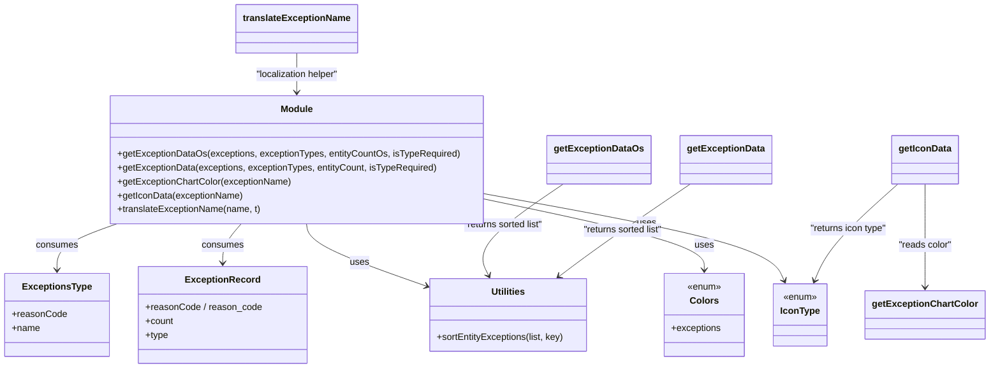

# Diagram: web/portal/src/pages/finishedvehicle/utils/exceptions.utils.js


> Auto-generated by Obscura crawlers

## Diagram 1



### SVG

<svg id="container" width="1688.32421875" xmlns="http://www.w3.org/2000/svg" class="classDiagram" height="638" viewBox="0 0 1688.32421875 638" role="graphics-document document" aria-roledescription="class"><style>#container{font-family:"trebuchet ms",verdana,arial,sans-serif;font-size:16px;fill:#333;}@keyframes edge-animation-frame{from{stroke-dashoffset:0;}}@keyframes dash{to{stroke-dashoffset:0;}}#container .edge-animation-slow{stroke-dasharray:9,5!important;stroke-dashoffset:900;animation:dash 50s linear infinite;stroke-linecap:round;}#container .edge-animation-fast{stroke-dasharray:9,5!important;stroke-dashoffset:900;animation:dash 20s linear infinite;stroke-linecap:round;}#container .error-icon{fill:#552222;}#container .error-text{fill:#552222;stroke:#552222;}#container .edge-thickness-normal{stroke-width:1px;}#container .edge-thickness-thick{stroke-width:3.5px;}#container .edge-pattern-solid{stroke-dasharray:0;}#container .edge-thickness-invisible{stroke-width:0;fill:none;}#container .edge-pattern-dashed{stroke-dasharray:3;}#container .edge-pattern-dotted{stroke-dasharray:2;}#container .marker{fill:#333333;stroke:#333333;}#container .marker.cross{stroke:#333333;}#container svg{font-family:"trebuchet ms",verdana,arial,sans-serif;font-size:16px;}#container p{margin:0;}#container g.classGroup text{fill:#9370DB;stroke:none;font-family:"trebuchet ms",verdana,arial,sans-serif;font-size:10px;}#container g.classGroup text .title{font-weight:bolder;}#container .nodeLabel,#container .edgeLabel{color:#131300;}#container .edgeLabel .label rect{fill:#ECECFF;}#container .label text{fill:#131300;}#container .labelBkg{background:#ECECFF;}#container .edgeLabel .label span{background:#ECECFF;}#container .classTitle{font-weight:bolder;}#container .node rect,#container .node circle,#container .node ellipse,#container .node polygon,#container .node path{fill:#ECECFF;stroke:#9370DB;stroke-width:1px;}#container .divider{stroke:#9370DB;stroke-width:1;}#container g.clickable{cursor:pointer;}#container g.classGroup rect{fill:#ECECFF;stroke:#9370DB;}#container g.classGroup line{stroke:#9370DB;stroke-width:1;}#container .classLabel .box{stroke:none;stroke-width:0;fill:#ECECFF;opacity:0.5;}#container .classLabel .label{fill:#9370DB;font-size:10px;}#container .relation{stroke:#333333;stroke-width:1;fill:none;}#container .dashed-line{stroke-dasharray:3;}#container .dotted-line{stroke-dasharray:1 2;}#container #compositionStart,#container .composition{fill:#333333!important;stroke:#333333!important;stroke-width:1;}#container #compositionEnd,#container .composition{fill:#333333!important;stroke:#333333!important;stroke-width:1;}#container #dependencyStart,#container .dependency{fill:#333333!important;stroke:#333333!important;stroke-width:1;}#container #dependencyStart,#container .dependency{fill:#333333!important;stroke:#333333!important;stroke-width:1;}#container #extensionStart,#container .extension{fill:transparent!important;stroke:#333333!important;stroke-width:1;}#container #extensionEnd,#container .extension{fill:transparent!important;stroke:#333333!important;stroke-width:1;}#container #aggregationStart,#container .aggregation{fill:transparent!important;stroke:#333333!important;stroke-width:1;}#container #aggregationEnd,#container .aggregation{fill:transparent!important;stroke:#333333!important;stroke-width:1;}#container #lollipopStart,#container .lollipop{fill:#ECECFF!important;stroke:#333333!important;stroke-width:1;}#container #lollipopEnd,#container .lollipop{fill:#ECECFF!important;stroke:#333333!important;stroke-width:1;}#container .edgeTerminals{font-size:11px;line-height:initial;}#container .classTitleText{text-anchor:middle;font-size:18px;fill:#333;}#container .label-icon{display:inline-block;height:1em;overflow:visible;vertical-align:-0.125em;}#container .node .label-icon path{fill:currentColor;stroke:revert;stroke-width:revert;}#container :root{--mermaid-font-family:"trebuchet ms",verdana,arial,sans-serif;}</style><g><defs><marker id="container_class-aggregationStart" class="marker aggregation class" refX="18" refY="7" markerWidth="190" markerHeight="240" orient="auto"><path d="M 18,7 L9,13 L1,7 L9,1 Z"></path></marker></defs><defs><marker id="container_class-aggregationEnd" class="marker aggregation class" refX="1" refY="7" markerWidth="20" markerHeight="28" orient="auto"><path d="M 18,7 L9,13 L1,7 L9,1 Z"></path></marker></defs><defs><marker id="container_class-extensionStart" class="marker extension class" refX="18" refY="7" markerWidth="190" markerHeight="240" orient="auto"><path d="M 1,7 L18,13 V 1 Z"></path></marker></defs><defs><marker id="container_class-extensionEnd" class="marker extension class" refX="1" refY="7" markerWidth="20" markerHeight="28" orient="auto"><path d="M 1,1 V 13 L18,7 Z"></path></marker></defs><defs><marker id="container_class-compositionStart" class="marker composition class" refX="18" refY="7" markerWidth="190" markerHeight="240" orient="auto"><path d="M 18,7 L9,13 L1,7 L9,1 Z"></path></marker></defs><defs><marker id="container_class-compositionEnd" class="marker composition class" refX="1" refY="7" markerWidth="20" markerHeight="28" orient="auto"><path d="M 18,7 L9,13 L1,7 L9,1 Z"></path></marker></defs><defs><marker id="container_class-dependencyStart" class="marker dependency class" refX="6" refY="7" markerWidth="190" markerHeight="240" orient="auto"><path d="M 5,7 L9,13 L1,7 L9,1 Z"></path></marker></defs><defs><marker id="container_class-dependencyEnd" class="marker dependency class" refX="13" refY="7" markerWidth="20" markerHeight="28" orient="auto"><path d="M 18,7 L9,13 L14,7 L9,1 Z"></path></marker></defs><defs><marker id="container_class-lollipopStart" class="marker lollipop class" refX="13" refY="7" markerWidth="190" markerHeight="240" orient="auto"><circle stroke="black" fill="transparent" cx="7" cy="7" r="6"></circle></marker></defs><defs><marker id="container_class-lollipopEnd" class="marker lollipop class" refX="1" refY="7" markerWidth="190" markerHeight="240" orient="auto"><circle stroke="black" fill="transparent" cx="7" cy="7" r="6"></circle></marker></defs><g class="root"><g class="clusters"></g><g class="edgePaths"><path d="M199.745,388L182.3,394.167C164.855,400.333,129.965,412.667,112.519,426C95.074,439.333,95.074,453.667,95.074,460.833L95.074,468" id="id_Module_ExceptionsType_1" class="edge-thickness-normal edge-pattern-solid relation" style=";;;" data-edge="true" data-et="edge" data-id="id_Module_ExceptionsType_1" data-points="W3sieCI6MTk5Ljc0NTExNzE4NzUsInkiOjM4OH0seyJ4Ijo5NS4wNzQyMTg3NSwieSI6NDI1fSx7IngiOjk1LjA3NDIxODc1LCJ5Ijo0NzR9XQ==" marker-end="url(#container_class-dependencyEnd)"></path><path d="M410.199,388L404.446,394.167C398.693,400.333,387.186,412.667,381.433,424C375.68,435.333,375.68,445.667,375.68,450.833L375.68,456" id="id_Module_ExceptionRecord_2" class="edge-thickness-normal edge-pattern-solid relation" style=";;;" data-edge="true" data-et="edge" data-id="id_Module_ExceptionRecord_2" data-points="W3sieCI6NDEwLjE5OTIxODc1LCJ5IjozODh9LHsieCI6Mzc1LjY3OTY4NzUsInkiOjQyNX0seyJ4IjozNzUuNjc5Njg3NSwieSI6NDYyfV0=" marker-end="url(#container_class-dependencyEnd)"></path><path d="M521.19,388L521.603,394.167C522.016,400.333,522.842,412.667,555.106,430.364C587.371,448.062,651.074,471.125,682.925,482.656L714.776,494.187" id="id_Module_Utilities_3" class="edge-thickness-normal edge-pattern-solid relation" style=";;;" data-edge="true" data-et="edge" data-id="id_Module_Utilities_3" data-points="W3sieCI6NTIxLjE5MDQyOTY4NzUsInkiOjM4OH0seyJ4Ijo1MjMuNjY3OTY4NzUsInkiOjQyNX0seyJ4Ijo3MjAuNDE3OTY4NzUsInkiOjQ5Ni4yMjkzNzc1Mjc0MDd9XQ==" marker-end="url(#container_class-dependencyEnd)"></path><path d="M835.32,346.257L896.254,359.381C957.188,372.505,1079.055,398.752,1139.988,419.043C1200.922,439.333,1200.922,453.667,1200.922,460.833L1200.922,468" id="id_Module_Colors_4" class="edge-thickness-normal edge-pattern-solid relation" style=";;;" data-edge="true" data-et="edge" data-id="id_Module_Colors_4" data-points="W3sieCI6ODM1LjMyMDMxMjUsInkiOjM0Ni4yNTc0NzgwODU4ODI5fSx7IngiOjEyMDAuOTIxODc1LCJ5Ijo0MjV9LHsieCI6MTIwMC45MjE4NzUsInkiOjQ3NH1d" marker-end="url(#container_class-dependencyEnd)"></path><path d="M835.32,336.794L914.379,351.495C993.438,366.196,1151.555,395.598,1235.341,420.558C1319.128,445.517,1328.583,466.034,1333.311,476.292L1338.039,486.551" id="id_Module_IconType_5" class="edge-thickness-normal edge-pattern-solid relation" style=";;;" data-edge="true" data-et="edge" data-id="id_Module_IconType_5" data-points="W3sieCI6ODM1LjMyMDMxMjUsInkiOjMzNi43OTQ0NTgwMjI5MDk5Nn0seyJ4IjoxMzA5LjY3MTg3NSwieSI6NDI1fSx7IngiOjEzNDAuNTUwMzYxNTcwMjQ4LCJ5Ijo0OTJ9XQ==" marker-end="url(#container_class-dependencyEnd)"></path><path d="M961.26,319L935.426,336.667C909.593,354.333,857.925,389.667,835.824,416.08C813.723,442.494,821.189,459.988,824.922,468.735L828.654,477.481" id="id_getExceptionDataOs_Utilities_6" class="edge-thickness-normal edge-pattern-solid relation" style=";;;" data-edge="true" data-et="edge" data-id="id_getExceptionDataOs_Utilities_6" data-points="W3sieCI6OTYxLjI1OTg3MTE5OTMyNDQsInkiOjMxOX0seyJ4Ijo4MDYuMjU3ODEyNSwieSI6NDI1fSx7IngiOjgzMS4wMDkyOTc1MjA2NjExLCJ5Ijo0ODN9XQ==" marker-end="url(#container_class-dependencyEnd)"></path><path d="M1173.299,319L1147.465,336.667C1121.632,354.333,1069.964,389.667,1032.114,416.398C994.265,443.129,970.232,461.258,958.216,470.322L946.2,479.387" id="id_getExceptionData_Utilities_7" class="edge-thickness-normal edge-pattern-solid relation" style=";;;" data-edge="true" data-et="edge" data-id="id_getExceptionData_Utilities_7" data-points="W3sieCI6MTE3My4yOTg5MzM2OTkzMjQ0LCJ5IjozMTl9LHsieCI6MTAxOC4yOTY4NzUsInkiOjQyNX0seyJ4Ijo5NDEuNDA5ODAxMTM2MzYzNiwieSI6NDgzfV0=" marker-end="url(#container_class-dependencyEnd)"></path><path d="M1581.746,319L1581.746,336.667C1581.746,354.333,1581.746,389.667,1581.746,419.5C1581.746,449.333,1581.746,473.667,1581.746,485.833L1581.746,498" id="id_getIconData_getExceptionChartColor_8" class="edge-thickness-normal edge-pattern-solid relation" style=";;;" data-edge="true" data-et="edge" data-id="id_getIconData_getExceptionChartColor_8" data-points="W3sieCI6MTU4MS43NDYwOTM3NSwieSI6MzE5fSx7IngiOjE1ODEuNzQ2MDkzNzUsInkiOjQyNX0seyJ4IjoxNTgxLjc0NjA5Mzc1LCJ5Ijo1MDR9XQ==" marker-end="url(#container_class-dependencyEnd)"></path><path d="M1535.186,319L1515.601,336.667C1496.016,354.333,1456.846,389.667,1432.836,417.582C1408.827,445.497,1399.978,465.994,1395.553,476.243L1391.129,486.491" id="id_getIconData_IconType_9" class="edge-thickness-normal edge-pattern-solid relation" style=";;;" data-edge="true" data-et="edge" data-id="id_getIconData_IconType_9" data-points="W3sieCI6MTUzNS4xODU1OTk2NjIxNjIsInkiOjMxOX0seyJ4IjoxNDE3LjY3NTc4MTI1LCJ5Ijo0MjV9LHsieCI6MTM4OC43NTA0NTE5NjI4MDk4LCJ5Ijo0OTJ9XQ==" marker-end="url(#container_class-dependencyEnd)"></path><path d="M513.758,92L513.758,98.167C513.758,104.333,513.758,116.667,513.758,128C513.758,139.333,513.758,149.667,513.758,154.833L513.758,160" id="id_translateExceptionName_Module_10" class="edge-thickness-normal edge-pattern-solid relation" style=";;;" data-edge="true" data-et="edge" data-id="id_translateExceptionName_Module_10" data-points="W3sieCI6NTEzLjc1NzgxMjUsInkiOjkyfSx7IngiOjUxMy43NTc4MTI1LCJ5IjoxMjl9LHsieCI6NTEzLjc1NzgxMjUsInkiOjE2Nn1d" marker-end="url(#container_class-dependencyEnd)"></path></g><g class="edgeLabels"><g class="edgeLabel" transform="translate(95.07421875, 425)"><g class="label" data-id="id_Module_ExceptionsType_1" transform="translate(-36.375, -12)"><foreignObject width="72.75" height="24"><div xmlns="http://www.w3.org/1999/xhtml" class="labelBkg" style="display: table-cell; white-space: nowrap; line-height: 1.5; max-width: 200px; text-align: center;"><span class="edgeLabel"><p>consumes</p></span></div></foreignObject></g></g><g class="edgeLabel" transform="translate(375.6796875, 425)"><g class="label" data-id="id_Module_ExceptionRecord_2" transform="translate(-36.375, -12)"><foreignObject width="72.75" height="24"><div xmlns="http://www.w3.org/1999/xhtml" class="labelBkg" style="display: table-cell; white-space: nowrap; line-height: 1.5; max-width: 200px; text-align: center;"><span class="edgeLabel"><p>consumes</p></span></div></foreignObject></g></g><g class="edgeLabel" transform="translate(604.60888, 454.30303)"><g class="label" data-id="id_Module_Utilities_3" transform="translate(-16.4921875, -12)"><foreignObject width="32.984375" height="24"><div xmlns="http://www.w3.org/1999/xhtml" class="labelBkg" style="display: table-cell; white-space: nowrap; line-height: 1.5; max-width: 200px; text-align: center;"><span class="edgeLabel"><p>uses</p></span></div></foreignObject></g></g><g class="edgeLabel" transform="translate(1200.921875, 425)"><g class="label" data-id="id_Module_Colors_4" transform="translate(-16.4921875, -12)"><foreignObject width="32.984375" height="24"><div xmlns="http://www.w3.org/1999/xhtml" class="labelBkg" style="display: table-cell; white-space: nowrap; line-height: 1.5; max-width: 200px; text-align: center;"><span class="edgeLabel"><p>uses</p></span></div></foreignObject></g></g><g class="edgeLabel" transform="translate(1108.76104, 387.64068)"><g class="label" data-id="id_Module_IconType_5" transform="translate(-16.4921875, -12)"><foreignObject width="32.984375" height="24"><div xmlns="http://www.w3.org/1999/xhtml" class="labelBkg" style="display: table-cell; white-space: nowrap; line-height: 1.5; max-width: 200px; text-align: center;"><span class="edgeLabel"><p>uses</p></span></div></foreignObject></g></g><g class="edgeLabel" transform="translate(857.73244, 389.79846)"><g class="label" data-id="id_getExceptionDataOs_Utilities_6" transform="translate(-71.40625, -12)"><foreignObject width="142.8125" height="24"><div xmlns="http://www.w3.org/1999/xhtml" class="labelBkg" style="display: table-cell; white-space: nowrap; line-height: 1.5; max-width: 200px; text-align: center;"><span class="edgeLabel"><p>"returns sorted list"</p></span></div></foreignObject></g></g><g class="edgeLabel" transform="translate(1056.04876, 399.18292)"><g class="label" data-id="id_getExceptionData_Utilities_7" transform="translate(-71.40625, -12)"><foreignObject width="142.8125" height="24"><div xmlns="http://www.w3.org/1999/xhtml" class="labelBkg" style="display: table-cell; white-space: nowrap; line-height: 1.5; max-width: 200px; text-align: center;"><span class="edgeLabel"><p>"returns sorted list"</p></span></div></foreignObject></g></g><g class="edgeLabel" transform="translate(1581.74609375, 425)"><g class="label" data-id="id_getIconData_getExceptionChartColor_8" transform="translate(-46.9375, -12)"><foreignObject width="93.875" height="24"><div xmlns="http://www.w3.org/1999/xhtml" class="labelBkg" style="display: table-cell; white-space: nowrap; line-height: 1.5; max-width: 200px; text-align: center;"><span class="edgeLabel"><p>"reads color"</p></span></div></foreignObject></g></g><g class="edgeLabel" transform="translate(1449.33659, 396.4403)"><g class="label" data-id="id_getIconData_IconType_9" transform="translate(-67.984375, -12)"><foreignObject width="135.96875" height="24"><div xmlns="http://www.w3.org/1999/xhtml" class="labelBkg" style="display: table-cell; white-space: nowrap; line-height: 1.5; max-width: 200px; text-align: center;"><span class="edgeLabel"><p>"returns icon type"</p></span></div></foreignObject></g></g><g class="edgeLabel" transform="translate(513.7578125, 129)"><g class="label" data-id="id_translateExceptionName_Module_10" transform="translate(-73.953125, -12)"><foreignObject width="147.90625" height="24"><div xmlns="http://www.w3.org/1999/xhtml" class="labelBkg" style="display: table-cell; white-space: nowrap; line-height: 1.5; max-width: 200px; text-align: center;"><span class="edgeLabel"><p>"localization helper"</p></span></div></foreignObject></g></g></g><g class="nodes"><g class="node default" id="classId-Module-0" transform="translate(513.7578125, 277)"><g class="basic label-container"><path d="M-321.5625 -111 L321.5625 -111 L321.5625 111 L-321.5625 111" stroke="none" stroke-width="0" fill="#ECECFF" style=""></path><path d="M-321.5625 -111 C-64.48153852550337 -111, 192.59942294899326 -111, 321.5625 -111 M-321.5625 -111 C-188.26350642935054 -111, -54.964512858701084 -111, 321.5625 -111 M321.5625 -111 C321.5625 -57.3555122087752, 321.5625 -3.711024417550405, 321.5625 111 M321.5625 -111 C321.5625 -54.70808311473973, 321.5625 1.5838337705205419, 321.5625 111 M321.5625 111 C182.57685536590677 111, 43.59121073181353 111, -321.5625 111 M321.5625 111 C178.4459842917802 111, 35.32946858356041 111, -321.5625 111 M-321.5625 111 C-321.5625 45.568692324351304, -321.5625 -19.862615351297393, -321.5625 -111 M-321.5625 111 C-321.5625 51.39617150878671, -321.5625 -8.207656982426585, -321.5625 -111" stroke="#9370DB" stroke-width="1.3" fill="none" stroke-dasharray="0 0" style=""></path></g><g class="annotation-group text" transform="translate(0, -87)"></g><g class="label-group text" transform="translate(-27.09375, -87)"><g class="label" style="font-weight: bolder" transform="translate(0,-12)"><foreignObject width="54.1875" height="24"><div xmlns="http://www.w3.org/1999/xhtml" style="display: table-cell; white-space: nowrap; line-height: 1.5; max-width: 104px; text-align: center;"><span class="nodeLabel markdown-node-label" style=""><p>Module</p></span></div></foreignObject></g></g><g class="members-group text" transform="translate(-309.5625, -39)"></g><g class="methods-group text" transform="translate(-309.5625, -9)"><g class="label" style="" transform="translate(0,-12)"><foreignObject width="592.03125" height="24"><div xmlns="http://www.w3.org/1999/xhtml" style="display: table-cell; white-space: nowrap; line-height: 1.5; max-width: 649px; text-align: center;"><span class="nodeLabel markdown-node-label" style=""><p>+getExceptionDataOs(exceptions, exceptionTypes, entityCountOs, isTypeRequired)</p></span></div></foreignObject></g><g class="label" style="" transform="translate(0,12)"><foreignObject width="555" height="24"><div xmlns="http://www.w3.org/1999/xhtml" style="display: table-cell; white-space: nowrap; line-height: 1.5; max-width: 612px; text-align: center;"><span class="nodeLabel markdown-node-label" style=""><p>+getExceptionData(exceptions, exceptionTypes, entityCount, isTypeRequired)</p></span></div></foreignObject></g><g class="label" style="" transform="translate(0,36)"><foreignObject width="301.421875" height="24"><div xmlns="http://www.w3.org/1999/xhtml" style="display: table-cell; white-space: nowrap; line-height: 1.5; max-width: 359px; text-align: center;"><span class="nodeLabel markdown-node-label" style=""><p>+getExceptionChartColor(exceptionName)</p></span></div></foreignObject></g><g class="label" style="" transform="translate(0,60)"><foreignObject width="217.71875" height="24"><div xmlns="http://www.w3.org/1999/xhtml" style="display: table-cell; white-space: nowrap; line-height: 1.5; max-width: 275px; text-align: center;"><span class="nodeLabel markdown-node-label" style=""><p>+getIconData(exceptionName)</p></span></div></foreignObject></g><g class="label" style="" transform="translate(0,84)"><foreignObject width="249.796875" height="24"><div xmlns="http://www.w3.org/1999/xhtml" style="display: table-cell; white-space: nowrap; line-height: 1.5; max-width: 307px; text-align: center;"><span class="nodeLabel markdown-node-label" style=""><p>+translateExceptionName(name, t)</p></span></div></foreignObject></g></g><g class="divider" style=""><path d="M-321.5625 -63 C-112.10442390918277 -63, 97.35365218163446 -63, 321.5625 -63 M-321.5625 -63 C-188.60953175272888 -63, -55.65656350545777 -63, 321.5625 -63" stroke="#9370DB" stroke-width="1.3" fill="none" stroke-dasharray="0 0" style=""></path></g><g class="divider" style=""><path d="M-321.5625 -39 C-182.94670025245085 -39, -44.330900504901706 -39, 321.5625 -39 M-321.5625 -39 C-123.41321225764173 -39, 74.73607548471654 -39, 321.5625 -39" stroke="#9370DB" stroke-width="1.3" fill="none" stroke-dasharray="0 0" style=""></path></g></g><g class="node default" id="classId-ExceptionsType-1" transform="translate(95.07421875, 546)"><g class="basic label-container"><path d="M-87.07421875 -72 L87.07421875 -72 L87.07421875 72 L-87.07421875 72" stroke="none" stroke-width="0" fill="#ECECFF" style=""></path><path d="M-87.07421875 -72 C-24.97391078990124 -72, 37.12639717019752 -72, 87.07421875 -72 M-87.07421875 -72 C-35.52459654302967 -72, 16.025025663940653 -72, 87.07421875 -72 M87.07421875 -72 C87.07421875 -38.364894457866534, 87.07421875 -4.729788915733067, 87.07421875 72 M87.07421875 -72 C87.07421875 -14.73312305138208, 87.07421875 42.53375389723584, 87.07421875 72 M87.07421875 72 C27.97918839175032 72, -31.11584196649936 72, -87.07421875 72 M87.07421875 72 C38.91409075990543 72, -9.246037230189145 72, -87.07421875 72 M-87.07421875 72 C-87.07421875 17.391640028879216, -87.07421875 -37.21671994224157, -87.07421875 -72 M-87.07421875 72 C-87.07421875 22.867119100417646, -87.07421875 -26.265761799164707, -87.07421875 -72" stroke="#9370DB" stroke-width="1.3" fill="none" stroke-dasharray="0 0" style=""></path></g><g class="annotation-group text" transform="translate(0, -48)"></g><g class="label-group text" transform="translate(-56.8984375, -48)"><g class="label" style="font-weight: bolder" transform="translate(0,-12)"><foreignObject width="113.796875" height="24"><div xmlns="http://www.w3.org/1999/xhtml" style="display: table-cell; white-space: nowrap; line-height: 1.5; max-width: 162px; text-align: center;"><span class="nodeLabel markdown-node-label" style=""><p>ExceptionsType</p></span></div></foreignObject></g></g><g class="members-group text" transform="translate(-75.07421875, 0)"><g class="label" style="" transform="translate(0,-12)"><foreignObject width="93.25" height="24"><div xmlns="http://www.w3.org/1999/xhtml" style="display: table-cell; white-space: nowrap; line-height: 1.5; max-width: 151px; text-align: center;"><span class="nodeLabel markdown-node-label" style=""><p>+reasonCode</p></span></div></foreignObject></g><g class="label" style="" transform="translate(0,12)"><foreignObject width="48.5" height="24"><div xmlns="http://www.w3.org/1999/xhtml" style="display: table-cell; white-space: nowrap; line-height: 1.5; max-width: 106px; text-align: center;"><span class="nodeLabel markdown-node-label" style=""><p>+name</p></span></div></foreignObject></g></g><g class="methods-group text" transform="translate(-75.07421875, 72)"></g><g class="divider" style=""><path d="M-87.07421875 -24 C-30.841400498942598 -24, 25.391417752114805 -24, 87.07421875 -24 M-87.07421875 -24 C-39.63843852520287 -24, 7.797341699594256 -24, 87.07421875 -24" stroke="#9370DB" stroke-width="1.3" fill="none" stroke-dasharray="0 0" style=""></path></g><g class="divider" style=""><path d="M-87.07421875 48 C-38.94489919639877 48, 9.184420357202455 48, 87.07421875 48 M-87.07421875 48 C-22.61394354488054 48, 41.84633166023892 48, 87.07421875 48" stroke="#9370DB" stroke-width="1.3" fill="none" stroke-dasharray="0 0" style=""></path></g></g><g class="node default" id="classId-ExceptionRecord-2" transform="translate(375.6796875, 546)"><g class="basic label-container"><path d="M-143.53125 -84 L143.53125 -84 L143.53125 84 L-143.53125 84" stroke="none" stroke-width="0" fill="#ECECFF" style=""></path><path d="M-143.53125 -84 C-58.576765505143484 -84, 26.37771898971303 -84, 143.53125 -84 M-143.53125 -84 C-60.71241623039185 -84, 22.106417539216295 -84, 143.53125 -84 M143.53125 -84 C143.53125 -39.561115942635055, 143.53125 4.877768114729889, 143.53125 84 M143.53125 -84 C143.53125 -39.742367193801165, 143.53125 4.51526561239767, 143.53125 84 M143.53125 84 C65.49987061024342 84, -12.53150877951316 84, -143.53125 84 M143.53125 84 C39.37431227758876 84, -64.78262544482249 84, -143.53125 84 M-143.53125 84 C-143.53125 18.87771178676276, -143.53125 -46.24457642647448, -143.53125 -84 M-143.53125 84 C-143.53125 39.972246141054654, -143.53125 -4.055507717890691, -143.53125 -84" stroke="#9370DB" stroke-width="1.3" fill="none" stroke-dasharray="0 0" style=""></path></g><g class="annotation-group text" transform="translate(0, -60)"></g><g class="label-group text" transform="translate(-61.046875, -60)"><g class="label" style="font-weight: bolder" transform="translate(0,-12)"><foreignObject width="122.09375" height="24"><div xmlns="http://www.w3.org/1999/xhtml" style="display: table-cell; white-space: nowrap; line-height: 1.5; max-width: 171px; text-align: center;"><span class="nodeLabel markdown-node-label" style=""><p>ExceptionRecord</p></span></div></foreignObject></g></g><g class="members-group text" transform="translate(-131.53125, -12)"><g class="label" style="" transform="translate(0,-12)"><foreignObject width="202.015625" height="24"><div xmlns="http://www.w3.org/1999/xhtml" style="display: table-cell; white-space: nowrap; line-height: 1.5; max-width: 259px; text-align: center;"><span class="nodeLabel markdown-node-label" style=""><p>+reasonCode / reason_code</p></span></div></foreignObject></g><g class="label" style="" transform="translate(0,12)"><foreignObject width="49.125" height="24"><div xmlns="http://www.w3.org/1999/xhtml" style="display: table-cell; white-space: nowrap; line-height: 1.5; max-width: 107px; text-align: center;"><span class="nodeLabel markdown-node-label" style=""><p>+count</p></span></div></foreignObject></g><g class="label" style="" transform="translate(0,36)"><foreignObject width="39.703125" height="24"><div xmlns="http://www.w3.org/1999/xhtml" style="display: table-cell; white-space: nowrap; line-height: 1.5; max-width: 97px; text-align: center;"><span class="nodeLabel markdown-node-label" style=""><p>+type</p></span></div></foreignObject></g></g><g class="methods-group text" transform="translate(-131.53125, 84)"></g><g class="divider" style=""><path d="M-143.53125 -36 C-71.94799639389588 -36, -0.36474278779175506 -36, 143.53125 -36 M-143.53125 -36 C-55.770427172334394 -36, 31.990395655331213 -36, 143.53125 -36" stroke="#9370DB" stroke-width="1.3" fill="none" stroke-dasharray="0 0" style=""></path></g><g class="divider" style=""><path d="M-143.53125 60 C-67.22391604404025 60, 9.083417911919497 60, 143.53125 60 M-143.53125 60 C-33.737194478321285 60, 76.05686104335743 60, 143.53125 60" stroke="#9370DB" stroke-width="1.3" fill="none" stroke-dasharray="0 0" style=""></path></g></g><g class="node default" id="classId-Utilities-3" transform="translate(857.89453125, 546)"><g class="basic label-container"><path d="M-137.4765625 -63 L137.4765625 -63 L137.4765625 63 L-137.4765625 63" stroke="none" stroke-width="0" fill="#ECECFF" style=""></path><path d="M-137.4765625 -63 C-74.33071762364884 -63, -11.184872747297689 -63, 137.4765625 -63 M-137.4765625 -63 C-61.023858607462785 -63, 15.42884528507443 -63, 137.4765625 -63 M137.4765625 -63 C137.4765625 -28.42224486874578, 137.4765625 6.155510262508443, 137.4765625 63 M137.4765625 -63 C137.4765625 -12.819353208022328, 137.4765625 37.361293583955344, 137.4765625 63 M137.4765625 63 C44.559225919508975 63, -48.35811066098205 63, -137.4765625 63 M137.4765625 63 C63.20646183457163 63, -11.063638830856746 63, -137.4765625 63 M-137.4765625 63 C-137.4765625 33.81657092197642, -137.4765625 4.633141843952842, -137.4765625 -63 M-137.4765625 63 C-137.4765625 16.711495000745728, -137.4765625 -29.577009998508544, -137.4765625 -63" stroke="#9370DB" stroke-width="1.3" fill="none" stroke-dasharray="0 0" style=""></path></g><g class="annotation-group text" transform="translate(0, -39)"></g><g class="label-group text" transform="translate(-28.8125, -39)"><g class="label" style="font-weight: bolder" transform="translate(0,-12)"><foreignObject width="57.625" height="24"><div xmlns="http://www.w3.org/1999/xhtml" style="display: table-cell; white-space: nowrap; line-height: 1.5; max-width: 107px; text-align: center;"><span class="nodeLabel markdown-node-label" style=""><p>Utilities</p></span></div></foreignObject></g></g><g class="members-group text" transform="translate(-125.4765625, 9)"></g><g class="methods-group text" transform="translate(-125.4765625, 39)"><g class="label" style="" transform="translate(0,-12)"><foreignObject width="222.140625" height="24"><div xmlns="http://www.w3.org/1999/xhtml" style="display: table-cell; white-space: nowrap; line-height: 1.5; max-width: 280px; text-align: center;"><span class="nodeLabel markdown-node-label" style=""><p>+sortEntityExceptions(list, key)</p></span></div></foreignObject></g></g><g class="divider" style=""><path d="M-137.4765625 -15 C-34.16472747987537 -15, 69.14710754024927 -15, 137.4765625 -15 M-137.4765625 -15 C-52.2402983210586 -15, 32.995965857882794 -15, 137.4765625 -15" stroke="#9370DB" stroke-width="1.3" fill="none" stroke-dasharray="0 0" style=""></path></g><g class="divider" style=""><path d="M-137.4765625 9 C-44.46011632645143 9, 48.556329847097146 9, 137.4765625 9 M-137.4765625 9 C-60.990885454332144 9, 15.494791591335712 9, 137.4765625 9" stroke="#9370DB" stroke-width="1.3" fill="none" stroke-dasharray="0 0" style=""></path></g></g><g class="node default" id="classId-Colors-4" transform="translate(1200.921875, 546)"><g class="basic label-container"><path d="M-69.875 -72 L69.875 -72 L69.875 72 L-69.875 72" stroke="none" stroke-width="0" fill="#ECECFF" style=""></path><path d="M-69.875 -72 C-30.739170759665193 -72, 8.396658480669615 -72, 69.875 -72 M-69.875 -72 C-33.20942405663743 -72, 3.456151886725138 -72, 69.875 -72 M69.875 -72 C69.875 -36.79067813655748, 69.875 -1.581356273114963, 69.875 72 M69.875 -72 C69.875 -17.15700110620024, 69.875 37.68599778759952, 69.875 72 M69.875 72 C28.579208254420017 72, -12.716583491159966 72, -69.875 72 M69.875 72 C31.27916207890769 72, -7.3166758421846225 72, -69.875 72 M-69.875 72 C-69.875 16.533195923893956, -69.875 -38.93360815221209, -69.875 -72 M-69.875 72 C-69.875 16.74908715193161, -69.875 -38.50182569613678, -69.875 -72" stroke="#9370DB" stroke-width="1.3" fill="none" stroke-dasharray="0 0" style=""></path></g><g class="annotation-group text" transform="translate(-29.53125, -48)"><g class="label" style="" transform="translate(0,-12)"><foreignObject width="59.0625" height="24"><div xmlns="http://www.w3.org/1999/xhtml" style="display: table-cell; white-space: nowrap; line-height: 1.5; max-width: 109px; text-align: center;"><span class="nodeLabel markdown-node-label" style=""><p>«enum»</p></span></div></foreignObject></g></g><g class="label-group text" transform="translate(-23.1015625, -24)"><g class="label" style="font-weight: bolder" transform="translate(0,-12)"><foreignObject width="46.203125" height="24"><div xmlns="http://www.w3.org/1999/xhtml" style="display: table-cell; white-space: nowrap; line-height: 1.5; max-width: 95px; text-align: center;"><span class="nodeLabel markdown-node-label" style=""><p>Colors</p></span></div></foreignObject></g></g><g class="members-group text" transform="translate(-57.875, 24)"><g class="label" style="" transform="translate(0,-12)"><foreignObject width="86.21875" height="24"><div xmlns="http://www.w3.org/1999/xhtml" style="display: table-cell; white-space: nowrap; line-height: 1.5; max-width: 144px; text-align: center;"><span class="nodeLabel markdown-node-label" style=""><p>+exceptions</p></span></div></foreignObject></g></g><g class="methods-group text" transform="translate(-57.875, 72)"></g><g class="divider" style=""><path d="M-69.875 0 C-36.20078184460819 0, -2.526563689216374 0, 69.875 0 M-69.875 0 C-25.99841294500554 0, 17.87817410998892 0, 69.875 0" stroke="#9370DB" stroke-width="1.3" fill="none" stroke-dasharray="0 0" style=""></path></g><g class="divider" style=""><path d="M-69.875 48 C-40.11033496036572 48, -10.345669920731439 48, 69.875 48 M-69.875 48 C-19.525879723643165 48, 30.82324055271367 48, 69.875 48" stroke="#9370DB" stroke-width="1.3" fill="none" stroke-dasharray="0 0" style=""></path></g></g><g class="node default" id="classId-IconType-5" transform="translate(1365.4375, 546)"><g class="basic label-container"><path d="M-44.640625 -54 L44.640625 -54 L44.640625 54 L-44.640625 54" stroke="none" stroke-width="0" fill="#ECECFF" style=""></path><path d="M-44.640625 -54 C-19.94295137491161 -54, 4.754722250176783 -54, 44.640625 -54 M-44.640625 -54 C-9.806844508672825 -54, 25.02693598265435 -54, 44.640625 -54 M44.640625 -54 C44.640625 -13.446210874212362, 44.640625 27.107578251575276, 44.640625 54 M44.640625 -54 C44.640625 -31.96296132035194, 44.640625 -9.925922640703881, 44.640625 54 M44.640625 54 C24.129179060076996 54, 3.617733120153993 54, -44.640625 54 M44.640625 54 C22.36068216635566 54, 0.0807393327113175 54, -44.640625 54 M-44.640625 54 C-44.640625 28.45626679534817, -44.640625 2.9125335906963414, -44.640625 -54 M-44.640625 54 C-44.640625 22.933287299677744, -44.640625 -8.133425400644512, -44.640625 -54" stroke="#9370DB" stroke-width="1.3" fill="none" stroke-dasharray="0 0" style=""></path></g><g class="annotation-group text" transform="translate(-29.53125, -30)"><g class="label" style="" transform="translate(0,-12)"><foreignObject width="59.0625" height="24"><div xmlns="http://www.w3.org/1999/xhtml" style="display: table-cell; white-space: nowrap; line-height: 1.5; max-width: 109px; text-align: center;"><span class="nodeLabel markdown-node-label" style=""><p>«enum»</p></span></div></foreignObject></g></g><g class="label-group text" transform="translate(-32.640625, -6)"><g class="label" style="font-weight: bolder" transform="translate(0,-12)"><foreignObject width="65.28125" height="24"><div xmlns="http://www.w3.org/1999/xhtml" style="display: table-cell; white-space: nowrap; line-height: 1.5; max-width: 115px; text-align: center;"><span class="nodeLabel markdown-node-label" style=""><p>IconType</p></span></div></foreignObject></g></g><g class="members-group text" transform="translate(-32.640625, 42)"></g><g class="methods-group text" transform="translate(-32.640625, 72)"></g><g class="divider" style=""><path d="M-44.640625 18 C-25.552397750767813 18, -6.464170501535627 18, 44.640625 18 M-44.640625 18 C-25.534368777203465 18, -6.42811255440693 18, 44.640625 18" stroke="#9370DB" stroke-width="1.3" fill="none" stroke-dasharray="0 0" style=""></path></g><g class="divider" style=""><path d="M-44.640625 36 C-14.146710973574681 36, 16.347203052850638 36, 44.640625 36 M-44.640625 36 C-11.79260923075789 36, 21.05540653848422 36, 44.640625 36" stroke="#9370DB" stroke-width="1.3" fill="none" stroke-dasharray="0 0" style=""></path></g></g><g class="node default" id="classId-getExceptionDataOs-6" transform="translate(1022.67578125, 277)"><g class="basic label-container"><path d="M-85.71875 -42 L85.71875 -42 L85.71875 42 L-85.71875 42" stroke="none" stroke-width="0" fill="#ECECFF" style=""></path><path d="M-85.71875 -42 C-27.082063306841924 -42, 31.554623386316152 -42, 85.71875 -42 M-85.71875 -42 C-36.24633611892093 -42, 13.226077762158141 -42, 85.71875 -42 M85.71875 -42 C85.71875 -22.45473066590962, 85.71875 -2.9094613318192373, 85.71875 42 M85.71875 -42 C85.71875 -17.83021027921184, 85.71875 6.339579441576319, 85.71875 42 M85.71875 42 C40.17269420655442 42, -5.373361586891164 42, -85.71875 42 M85.71875 42 C23.920626547933892 42, -37.877496904132215 42, -85.71875 42 M-85.71875 42 C-85.71875 21.541679172638776, -85.71875 1.0833583452775528, -85.71875 -42 M-85.71875 42 C-85.71875 12.22578908066395, -85.71875 -17.5484218386721, -85.71875 -42" stroke="#9370DB" stroke-width="1.3" fill="none" stroke-dasharray="0 0" style=""></path></g><g class="annotation-group text" transform="translate(0, -18)"></g><g class="label-group text" transform="translate(-73.71875, -18)"><g class="label" style="font-weight: bolder" transform="translate(0,-12)"><foreignObject width="147.4375" height="24"><div xmlns="http://www.w3.org/1999/xhtml" style="display: table-cell; white-space: nowrap; line-height: 1.5; max-width: 195px; text-align: center;"><span class="nodeLabel markdown-node-label" style=""><p>getExceptionDataOs</p></span></div></foreignObject></g></g><g class="members-group text" transform="translate(-73.71875, 30)"></g><g class="methods-group text" transform="translate(-73.71875, 60)"></g><g class="divider" style=""><path d="M-85.71875 6 C-36.28299640926284 6, 13.152757181474314 6, 85.71875 6 M-85.71875 6 C-37.716419378796644 6, 10.285911242406712 6, 85.71875 6" stroke="#9370DB" stroke-width="1.3" fill="none" stroke-dasharray="0 0" style=""></path></g><g class="divider" style=""><path d="M-85.71875 24 C-48.83739278960694 24, -11.956035579213875 24, 85.71875 24 M-85.71875 24 C-19.20624669326149 24, 47.30625661347702 24, 85.71875 24" stroke="#9370DB" stroke-width="1.3" fill="none" stroke-dasharray="0 0" style=""></path></g></g><g class="node default" id="classId-getExceptionData-7" transform="translate(1234.71484375, 277)"><g class="basic label-container"><path d="M-76.3203125 -42 L76.3203125 -42 L76.3203125 42 L-76.3203125 42" stroke="none" stroke-width="0" fill="#ECECFF" style=""></path><path d="M-76.3203125 -42 C-17.397209755238777 -42, 41.52589298952245 -42, 76.3203125 -42 M-76.3203125 -42 C-41.47430393467921 -42, -6.628295369358426 -42, 76.3203125 -42 M76.3203125 -42 C76.3203125 -14.735116123564612, 76.3203125 12.529767752870775, 76.3203125 42 M76.3203125 -42 C76.3203125 -14.528658182725408, 76.3203125 12.942683634549184, 76.3203125 42 M76.3203125 42 C30.631251140479613 42, -15.057810219040775 42, -76.3203125 42 M76.3203125 42 C25.132288019840956 42, -26.055736460318087 42, -76.3203125 42 M-76.3203125 42 C-76.3203125 24.86188224708137, -76.3203125 7.723764494162737, -76.3203125 -42 M-76.3203125 42 C-76.3203125 13.063155786325336, -76.3203125 -15.873688427349329, -76.3203125 -42" stroke="#9370DB" stroke-width="1.3" fill="none" stroke-dasharray="0 0" style=""></path></g><g class="annotation-group text" transform="translate(0, -18)"></g><g class="label-group text" transform="translate(-64.3203125, -18)"><g class="label" style="font-weight: bolder" transform="translate(0,-12)"><foreignObject width="128.640625" height="24"><div xmlns="http://www.w3.org/1999/xhtml" style="display: table-cell; white-space: nowrap; line-height: 1.5; max-width: 177px; text-align: center;"><span class="nodeLabel markdown-node-label" style=""><p>getExceptionData</p></span></div></foreignObject></g></g><g class="members-group text" transform="translate(-64.3203125, 30)"></g><g class="methods-group text" transform="translate(-64.3203125, 60)"></g><g class="divider" style=""><path d="M-76.3203125 6 C-35.677930107223524 6, 4.964452285552952 6, 76.3203125 6 M-76.3203125 6 C-20.32889635737161 6, 35.66251978525678 6, 76.3203125 6" stroke="#9370DB" stroke-width="1.3" fill="none" stroke-dasharray="0 0" style=""></path></g><g class="divider" style=""><path d="M-76.3203125 24 C-40.0517776366127 24, -3.783242773225396 24, 76.3203125 24 M-76.3203125 24 C-40.91695639779749 24, -5.513600295594983 24, 76.3203125 24" stroke="#9370DB" stroke-width="1.3" fill="none" stroke-dasharray="0 0" style=""></path></g></g><g class="node default" id="classId-getIconData-8" transform="translate(1581.74609375, 277)"><g class="basic label-container"><path d="M-55.9296875 -42 L55.9296875 -42 L55.9296875 42 L-55.9296875 42" stroke="none" stroke-width="0" fill="#ECECFF" style=""></path><path d="M-55.9296875 -42 C-22.37475073303942 -42, 11.18018603392116 -42, 55.9296875 -42 M-55.9296875 -42 C-11.932379394633564 -42, 32.06492871073287 -42, 55.9296875 -42 M55.9296875 -42 C55.9296875 -24.529613893564978, 55.9296875 -7.059227787129956, 55.9296875 42 M55.9296875 -42 C55.9296875 -19.405009322693175, 55.9296875 3.18998135461365, 55.9296875 42 M55.9296875 42 C14.392242374184754 42, -27.145202751630492 42, -55.9296875 42 M55.9296875 42 C12.793055495874434 42, -30.343576508251132 42, -55.9296875 42 M-55.9296875 42 C-55.9296875 15.724852737802639, -55.9296875 -10.550294524394722, -55.9296875 -42 M-55.9296875 42 C-55.9296875 8.60544719948443, -55.9296875 -24.78910560103114, -55.9296875 -42" stroke="#9370DB" stroke-width="1.3" fill="none" stroke-dasharray="0 0" style=""></path></g><g class="annotation-group text" transform="translate(0, -18)"></g><g class="label-group text" transform="translate(-43.9296875, -18)"><g class="label" style="font-weight: bolder" transform="translate(0,-12)"><foreignObject width="87.859375" height="24"><div xmlns="http://www.w3.org/1999/xhtml" style="display: table-cell; white-space: nowrap; line-height: 1.5; max-width: 137px; text-align: center;"><span class="nodeLabel markdown-node-label" style=""><p>getIconData</p></span></div></foreignObject></g></g><g class="members-group text" transform="translate(-43.9296875, 30)"></g><g class="methods-group text" transform="translate(-43.9296875, 60)"></g><g class="divider" style=""><path d="M-55.9296875 6 C-27.37200864196804 6, 1.1856702160639188 6, 55.9296875 6 M-55.9296875 6 C-16.314160591803642 6, 23.301366316392716 6, 55.9296875 6" stroke="#9370DB" stroke-width="1.3" fill="none" stroke-dasharray="0 0" style=""></path></g><g class="divider" style=""><path d="M-55.9296875 24 C-16.81842992176893 24, 22.292827656462137 24, 55.9296875 24 M-55.9296875 24 C-25.96554127364658 24, 3.9986049527068417 24, 55.9296875 24" stroke="#9370DB" stroke-width="1.3" fill="none" stroke-dasharray="0 0" style=""></path></g></g><g class="node default" id="classId-getExceptionChartColor-9" transform="translate(1581.74609375, 546)"><g class="basic label-container"><path d="M-98.578125 -42 L98.578125 -42 L98.578125 42 L-98.578125 42" stroke="none" stroke-width="0" fill="#ECECFF" style=""></path><path d="M-98.578125 -42 C-48.72811314849654 -42, 1.12189870300692 -42, 98.578125 -42 M-98.578125 -42 C-21.390085296493027 -42, 55.79795440701395 -42, 98.578125 -42 M98.578125 -42 C98.578125 -14.099272737898051, 98.578125 13.801454524203898, 98.578125 42 M98.578125 -42 C98.578125 -22.370994752404638, 98.578125 -2.7419895048092755, 98.578125 42 M98.578125 42 C32.126025623506465 42, -34.32607375298707 42, -98.578125 42 M98.578125 42 C57.816641831383876 42, 17.055158662767752 42, -98.578125 42 M-98.578125 42 C-98.578125 16.957412982890517, -98.578125 -8.085174034218966, -98.578125 -42 M-98.578125 42 C-98.578125 8.716722263833717, -98.578125 -24.566555472332567, -98.578125 -42" stroke="#9370DB" stroke-width="1.3" fill="none" stroke-dasharray="0 0" style=""></path></g><g class="annotation-group text" transform="translate(0, -18)"></g><g class="label-group text" transform="translate(-86.578125, -18)"><g class="label" style="font-weight: bolder" transform="translate(0,-12)"><foreignObject width="173.15625" height="24"><div xmlns="http://www.w3.org/1999/xhtml" style="display: table-cell; white-space: nowrap; line-height: 1.5; max-width: 221px; text-align: center;"><span class="nodeLabel markdown-node-label" style=""><p>getExceptionChartColor</p></span></div></foreignObject></g></g><g class="members-group text" transform="translate(-86.578125, 30)"></g><g class="methods-group text" transform="translate(-86.578125, 60)"></g><g class="divider" style=""><path d="M-98.578125 6 C-23.671033434797877 6, 51.236058130404246 6, 98.578125 6 M-98.578125 6 C-41.602753586130866 6, 15.372617827738267 6, 98.578125 6" stroke="#9370DB" stroke-width="1.3" fill="none" stroke-dasharray="0 0" style=""></path></g><g class="divider" style=""><path d="M-98.578125 24 C-28.654162551214583 24, 41.269799897570834 24, 98.578125 24 M-98.578125 24 C-43.83719355129765 24, 10.903737897404696 24, 98.578125 24" stroke="#9370DB" stroke-width="1.3" fill="none" stroke-dasharray="0 0" style=""></path></g></g><g class="node default" id="classId-translateExceptionName-10" transform="translate(513.7578125, 50)"><g class="basic label-container"><path d="M-101.5234375 -42 L101.5234375 -42 L101.5234375 42 L-101.5234375 42" stroke="none" stroke-width="0" fill="#ECECFF" style=""></path><path d="M-101.5234375 -42 C-27.86408800674316 -42, 45.79526148651368 -42, 101.5234375 -42 M-101.5234375 -42 C-25.78341850925719 -42, 49.95660048148562 -42, 101.5234375 -42 M101.5234375 -42 C101.5234375 -12.278443206095343, 101.5234375 17.443113587809314, 101.5234375 42 M101.5234375 -42 C101.5234375 -20.456211783426557, 101.5234375 1.0875764331468858, 101.5234375 42 M101.5234375 42 C25.038011382854748 42, -51.447414734290504 42, -101.5234375 42 M101.5234375 42 C24.833940556773968 42, -51.855556386452065 42, -101.5234375 42 M-101.5234375 42 C-101.5234375 10.516524819019622, -101.5234375 -20.966950361960755, -101.5234375 -42 M-101.5234375 42 C-101.5234375 17.851955640592948, -101.5234375 -6.296088718814104, -101.5234375 -42" stroke="#9370DB" stroke-width="1.3" fill="none" stroke-dasharray="0 0" style=""></path></g><g class="annotation-group text" transform="translate(0, -18)"></g><g class="label-group text" transform="translate(-89.5234375, -18)"><g class="label" style="font-weight: bolder" transform="translate(0,-12)"><foreignObject width="179.046875" height="24"><div xmlns="http://www.w3.org/1999/xhtml" style="display: table-cell; white-space: nowrap; line-height: 1.5; max-width: 227px; text-align: center;"><span class="nodeLabel markdown-node-label" style=""><p>translateExceptionName</p></span></div></foreignObject></g></g><g class="members-group text" transform="translate(-89.5234375, 30)"></g><g class="methods-group text" transform="translate(-89.5234375, 60)"></g><g class="divider" style=""><path d="M-101.5234375 6 C-59.74076109132275 6, -17.958084682645506 6, 101.5234375 6 M-101.5234375 6 C-33.245625894515285 6, 35.03218571096943 6, 101.5234375 6" stroke="#9370DB" stroke-width="1.3" fill="none" stroke-dasharray="0 0" style=""></path></g><g class="divider" style=""><path d="M-101.5234375 24 C-49.5566191218762 24, 2.4101992562475942 24, 101.5234375 24 M-101.5234375 24 C-35.28209601853095 24, 30.9592454629381 24, 101.5234375 24" stroke="#9370DB" stroke-width="1.3" fill="none" stroke-dasharray="0 0" style=""></path></g></g></g></g></g></svg>

## Diagram 2

```mermaid
flowchart TD
    A[Input: exceptions array] --> B{Filter out Delayed (DL)}
    B --> C{Map over exceptionTypes}
    C --> D[Find matching exception by reasonCode / reason_code]
    D --> E[Compute count and percentage]
    E --> F[Normalize name ("In Hold" -> "On Hold")]
    F --> G[Collect updatedExceptions]
    G --> H[sortEntityExceptions(updatedExceptions, "name")]
    H --> I[Return sorted exceptions data]
    subgraph Icon & Color Resolution
        J[getExceptionChartColor(name)] --> K[Colors.exceptions lookup]
        L[getIconData(name)] --> J
        L --> M[Select IconType and src (ReactIcon/FontAwesome/LocalImage)]
    end
    I --> L
```

> SVG rendering failed for this diagram.
