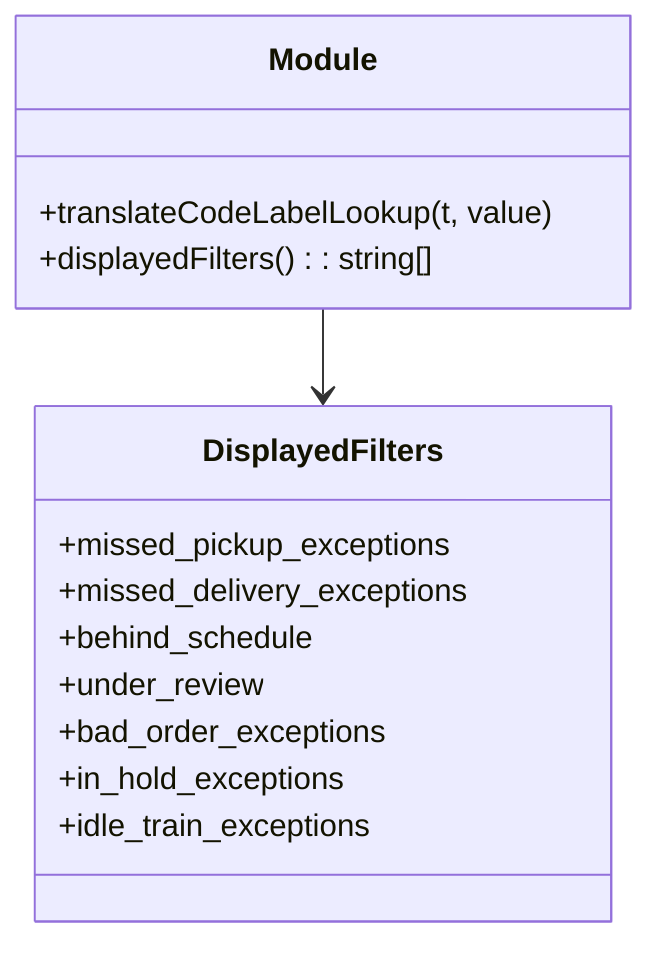

# Diagram: web/portal/src/pages/finishedvehicle/utils/filter.utils.js


> Auto-generated by Obscura crawlers

## Diagram 1

```mermaid
flowchart LR
    A([Inputs: t, value]) --> B[Lookup object]
    subgraph LookupItems [Lookup keys (examples)]
      L1["manually_completed"]
      L2["1300"]
      L3["missed_pickup_exceptions"]
      L4["missed_delivery_exceptions"]
      L5["behind_schedule"]
      L6["Excessive Dwell"]
    end
    B --> LookupItems
    B --> C{lookup[value] exists?}
    C -->|Yes| D[Return lookup[value] (translated string)]
    C -->|No| E[Return value (fallback)]
```

> SVG rendering failed for this diagram.

## Diagram 2



### SVG

<svg id="container" width="331.53125" xmlns="http://www.w3.org/2000/svg" class="classDiagram" height="480" viewBox="0 0 331.53125 480" role="graphics-document document" aria-roledescription="class"><style>#container{font-family:"trebuchet ms",verdana,arial,sans-serif;font-size:16px;fill:#333;}@keyframes edge-animation-frame{from{stroke-dashoffset:0;}}@keyframes dash{to{stroke-dashoffset:0;}}#container .edge-animation-slow{stroke-dasharray:9,5!important;stroke-dashoffset:900;animation:dash 50s linear infinite;stroke-linecap:round;}#container .edge-animation-fast{stroke-dasharray:9,5!important;stroke-dashoffset:900;animation:dash 20s linear infinite;stroke-linecap:round;}#container .error-icon{fill:#552222;}#container .error-text{fill:#552222;stroke:#552222;}#container .edge-thickness-normal{stroke-width:1px;}#container .edge-thickness-thick{stroke-width:3.5px;}#container .edge-pattern-solid{stroke-dasharray:0;}#container .edge-thickness-invisible{stroke-width:0;fill:none;}#container .edge-pattern-dashed{stroke-dasharray:3;}#container .edge-pattern-dotted{stroke-dasharray:2;}#container .marker{fill:#333333;stroke:#333333;}#container .marker.cross{stroke:#333333;}#container svg{font-family:"trebuchet ms",verdana,arial,sans-serif;font-size:16px;}#container p{margin:0;}#container g.classGroup text{fill:#9370DB;stroke:none;font-family:"trebuchet ms",verdana,arial,sans-serif;font-size:10px;}#container g.classGroup text .title{font-weight:bolder;}#container .nodeLabel,#container .edgeLabel{color:#131300;}#container .edgeLabel .label rect{fill:#ECECFF;}#container .label text{fill:#131300;}#container .labelBkg{background:#ECECFF;}#container .edgeLabel .label span{background:#ECECFF;}#container .classTitle{font-weight:bolder;}#container .node rect,#container .node circle,#container .node ellipse,#container .node polygon,#container .node path{fill:#ECECFF;stroke:#9370DB;stroke-width:1px;}#container .divider{stroke:#9370DB;stroke-width:1;}#container g.clickable{cursor:pointer;}#container g.classGroup rect{fill:#ECECFF;stroke:#9370DB;}#container g.classGroup line{stroke:#9370DB;stroke-width:1;}#container .classLabel .box{stroke:none;stroke-width:0;fill:#ECECFF;opacity:0.5;}#container .classLabel .label{fill:#9370DB;font-size:10px;}#container .relation{stroke:#333333;stroke-width:1;fill:none;}#container .dashed-line{stroke-dasharray:3;}#container .dotted-line{stroke-dasharray:1 2;}#container #compositionStart,#container .composition{fill:#333333!important;stroke:#333333!important;stroke-width:1;}#container #compositionEnd,#container .composition{fill:#333333!important;stroke:#333333!important;stroke-width:1;}#container #dependencyStart,#container .dependency{fill:#333333!important;stroke:#333333!important;stroke-width:1;}#container #dependencyStart,#container .dependency{fill:#333333!important;stroke:#333333!important;stroke-width:1;}#container #extensionStart,#container .extension{fill:transparent!important;stroke:#333333!important;stroke-width:1;}#container #extensionEnd,#container .extension{fill:transparent!important;stroke:#333333!important;stroke-width:1;}#container #aggregationStart,#container .aggregation{fill:transparent!important;stroke:#333333!important;stroke-width:1;}#container #aggregationEnd,#container .aggregation{fill:transparent!important;stroke:#333333!important;stroke-width:1;}#container #lollipopStart,#container .lollipop{fill:#ECECFF!important;stroke:#333333!important;stroke-width:1;}#container #lollipopEnd,#container .lollipop{fill:#ECECFF!important;stroke:#333333!important;stroke-width:1;}#container .edgeTerminals{font-size:11px;line-height:initial;}#container .classTitleText{text-anchor:middle;font-size:18px;fill:#333;}#container .label-icon{display:inline-block;height:1em;overflow:visible;vertical-align:-0.125em;}#container .node .label-icon path{fill:currentColor;stroke:revert;stroke-width:revert;}#container :root{--mermaid-font-family:"trebuchet ms",verdana,arial,sans-serif;}</style><g><defs><marker id="container_class-aggregationStart" class="marker aggregation class" refX="18" refY="7" markerWidth="190" markerHeight="240" orient="auto"><path d="M 18,7 L9,13 L1,7 L9,1 Z"></path></marker></defs><defs><marker id="container_class-aggregationEnd" class="marker aggregation class" refX="1" refY="7" markerWidth="20" markerHeight="28" orient="auto"><path d="M 18,7 L9,13 L1,7 L9,1 Z"></path></marker></defs><defs><marker id="container_class-extensionStart" class="marker extension class" refX="18" refY="7" markerWidth="190" markerHeight="240" orient="auto"><path d="M 1,7 L18,13 V 1 Z"></path></marker></defs><defs><marker id="container_class-extensionEnd" class="marker extension class" refX="1" refY="7" markerWidth="20" markerHeight="28" orient="auto"><path d="M 1,1 V 13 L18,7 Z"></path></marker></defs><defs><marker id="container_class-compositionStart" class="marker composition class" refX="18" refY="7" markerWidth="190" markerHeight="240" orient="auto"><path d="M 18,7 L9,13 L1,7 L9,1 Z"></path></marker></defs><defs><marker id="container_class-compositionEnd" class="marker composition class" refX="1" refY="7" markerWidth="20" markerHeight="28" orient="auto"><path d="M 18,7 L9,13 L1,7 L9,1 Z"></path></marker></defs><defs><marker id="container_class-dependencyStart" class="marker dependency class" refX="6" refY="7" markerWidth="190" markerHeight="240" orient="auto"><path d="M 5,7 L9,13 L1,7 L9,1 Z"></path></marker></defs><defs><marker id="container_class-dependencyEnd" class="marker dependency class" refX="13" refY="7" markerWidth="20" markerHeight="28" orient="auto"><path d="M 18,7 L9,13 L14,7 L9,1 Z"></path></marker></defs><defs><marker id="container_class-lollipopStart" class="marker lollipop class" refX="13" refY="7" markerWidth="190" markerHeight="240" orient="auto"><circle stroke="black" fill="transparent" cx="7" cy="7" r="6"></circle></marker></defs><defs><marker id="container_class-lollipopEnd" class="marker lollipop class" refX="1" refY="7" markerWidth="190" markerHeight="240" orient="auto"><circle stroke="black" fill="transparent" cx="7" cy="7" r="6"></circle></marker></defs><g class="root"><g class="clusters"></g><g class="edgePaths"><path d="M165.766,158L165.766,162.167C165.766,166.333,165.766,174.667,165.766,182C165.766,189.333,165.766,195.667,165.766,198.833L165.766,202" id="id_Module_DisplayedFilters_1" class="edge-thickness-normal edge-pattern-solid relation" style=";;;" data-edge="true" data-et="edge" data-id="id_Module_DisplayedFilters_1" data-points="W3sieCI6MTY1Ljc2NTYyNSwieSI6MTU4fSx7IngiOjE2NS43NjU2MjUsInkiOjE4M30seyJ4IjoxNjUuNzY1NjI1LCJ5IjoyMDh9XQ==" marker-end="url(#container_class-dependencyEnd)"></path></g><g class="edgeLabels"><g class="edgeLabel"><g class="label" data-id="id_Module_DisplayedFilters_1" transform="translate(0, 0)"><foreignObject width="0" height="0"><div xmlns="http://www.w3.org/1999/xhtml" class="labelBkg" style="display: table-cell; white-space: nowrap; line-height: 1.5; max-width: 200px; text-align: center;"><span class="edgeLabel"></span></div></foreignObject></g></g></g><g class="nodes"><g class="node default" id="classId-Module-0" transform="translate(165.765625, 83)"><g class="basic label-container"><path d="M-157.765625 -75 L157.765625 -75 L157.765625 75 L-157.765625 75" stroke="none" stroke-width="0" fill="#ECECFF" style=""></path><path d="M-157.765625 -75 C-69.26142217126991 -75, 19.242780657460173 -75, 157.765625 -75 M-157.765625 -75 C-67.6700352781265 -75, 22.42555444374699 -75, 157.765625 -75 M157.765625 -75 C157.765625 -39.535371973359716, 157.765625 -4.070743946719432, 157.765625 75 M157.765625 -75 C157.765625 -29.88262169214768, 157.765625 15.23475661570464, 157.765625 75 M157.765625 75 C48.10825411381424 75, -61.54911677237152 75, -157.765625 75 M157.765625 75 C91.4496537332517 75, 25.133682466503387 75, -157.765625 75 M-157.765625 75 C-157.765625 36.29196400824467, -157.765625 -2.416071983510662, -157.765625 -75 M-157.765625 75 C-157.765625 17.89942633137168, -157.765625 -39.20114733725664, -157.765625 -75" stroke="#9370DB" stroke-width="1.3" fill="none" stroke-dasharray="0 0" style=""></path></g><g class="annotation-group text" transform="translate(0, -51)"></g><g class="label-group text" transform="translate(-27.09375, -51)"><g class="label" style="font-weight: bolder" transform="translate(0,-12)"><foreignObject width="54.1875" height="24"><div xmlns="http://www.w3.org/1999/xhtml" style="display: table-cell; white-space: nowrap; line-height: 1.5; max-width: 104px; text-align: center;"><span class="nodeLabel markdown-node-label" style=""><p>Module</p></span></div></foreignObject></g></g><g class="members-group text" transform="translate(-145.765625, -3)"></g><g class="methods-group text" transform="translate(-145.765625, 27)"><g class="label" style="" transform="translate(0,-12)"><foreignObject width="264.4375" height="24"><div xmlns="http://www.w3.org/1999/xhtml" style="display: table-cell; white-space: nowrap; line-height: 1.5; max-width: 322px; text-align: center;"><span class="nodeLabel markdown-node-label" style=""><p>+translateCodeLabelLookup(t, value)</p></span></div></foreignObject></g><g class="label" style="" transform="translate(0,12)"><foreignObject width="205.078125" height="24"><div xmlns="http://www.w3.org/1999/xhtml" style="display: table-cell; white-space: nowrap; line-height: 1.5; max-width: 262px; text-align: center;"><span class="nodeLabel markdown-node-label" style=""><p>+displayedFilters() : : string[]</p></span></div></foreignObject></g></g><g class="divider" style=""><path d="M-157.765625 -27 C-80.12867394757014 -27, -2.4917228951402706 -27, 157.765625 -27 M-157.765625 -27 C-65.56224275269733 -27, 26.64113949460534 -27, 157.765625 -27" stroke="#9370DB" stroke-width="1.3" fill="none" stroke-dasharray="0 0" style=""></path></g><g class="divider" style=""><path d="M-157.765625 -3 C-71.29093281771874 -3, 15.183759364562519 -3, 157.765625 -3 M-157.765625 -3 C-36.22930004368747 -3, 85.30702491262505 -3, 157.765625 -3" stroke="#9370DB" stroke-width="1.3" fill="none" stroke-dasharray="0 0" style=""></path></g></g><g class="node default" id="classId-DisplayedFilters-1" transform="translate(165.765625, 340)"><g class="basic label-container"><path d="M-146.86328125 -132 L146.86328125 -132 L146.86328125 132 L-146.86328125 132" stroke="none" stroke-width="0" fill="#ECECFF" style=""></path><path d="M-146.86328125 -132 C-84.324045645193 -132, -21.784810040385977 -132, 146.86328125 -132 M-146.86328125 -132 C-41.340307365653004 -132, 64.18266651869399 -132, 146.86328125 -132 M146.86328125 -132 C146.86328125 -72.8344042318591, 146.86328125 -13.668808463718193, 146.86328125 132 M146.86328125 -132 C146.86328125 -67.57934486040313, 146.86328125 -3.158689720806251, 146.86328125 132 M146.86328125 132 C69.02387904166244 132, -8.81552316667512 132, -146.86328125 132 M146.86328125 132 C62.702831537744146 132, -21.45761817451171 132, -146.86328125 132 M-146.86328125 132 C-146.86328125 78.01263651298913, -146.86328125 24.02527302597825, -146.86328125 -132 M-146.86328125 132 C-146.86328125 45.25275232370913, -146.86328125 -41.49449535258174, -146.86328125 -132" stroke="#9370DB" stroke-width="1.3" fill="none" stroke-dasharray="0 0" style=""></path></g><g class="annotation-group text" transform="translate(0, -108)"></g><g class="label-group text" transform="translate(-58.6328125, -108)"><g class="label" style="font-weight: bolder" transform="translate(0,-12)"><foreignObject width="117.265625" height="24"><div xmlns="http://www.w3.org/1999/xhtml" style="display: table-cell; white-space: nowrap; line-height: 1.5; max-width: 165px; text-align: center;"><span class="nodeLabel markdown-node-label" style=""><p>DisplayedFilters</p></span></div></foreignObject></g></g><g class="members-group text" transform="translate(-134.86328125, -60)"><g class="label" style="" transform="translate(0,-12)"><foreignObject width="202.078125" height="24"><div xmlns="http://www.w3.org/1999/xhtml" style="display: table-cell; white-space: nowrap; line-height: 1.5; max-width: 259px; text-align: center;"><span class="nodeLabel markdown-node-label" style=""><p>+missed_pickup_exceptions</p></span></div></foreignObject></g><g class="label" style="" transform="translate(0,12)"><foreignObject width="211.09375" height="24"><div xmlns="http://www.w3.org/1999/xhtml" style="display: table-cell; white-space: nowrap; line-height: 1.5; max-width: 268px; text-align: center;"><span class="nodeLabel markdown-node-label" style=""><p>+missed_delivery_exceptions</p></span></div></foreignObject></g><g class="label" style="" transform="translate(0,36)"><foreignObject width="132.796875" height="24"><div xmlns="http://www.w3.org/1999/xhtml" style="display: table-cell; white-space: nowrap; line-height: 1.5; max-width: 190px; text-align: center;"><span class="nodeLabel markdown-node-label" style=""><p>+behind_schedule</p></span></div></foreignObject></g><g class="label" style="" transform="translate(0,60)"><foreignObject width="105.109375" height="24"><div xmlns="http://www.w3.org/1999/xhtml" style="display: table-cell; white-space: nowrap; line-height: 1.5; max-width: 163px; text-align: center;"><span class="nodeLabel markdown-node-label" style=""><p>+under_review</p></span></div></foreignObject></g><g class="label" style="" transform="translate(0,84)"><foreignObject width="168.0625" height="24"><div xmlns="http://www.w3.org/1999/xhtml" style="display: table-cell; white-space: nowrap; line-height: 1.5; max-width: 225px; text-align: center;"><span class="nodeLabel markdown-node-label" style=""><p>+bad_order_exceptions</p></span></div></foreignObject></g><g class="label" style="" transform="translate(0,108)"><foreignObject width="149.3125" height="24"><div xmlns="http://www.w3.org/1999/xhtml" style="display: table-cell; white-space: nowrap; line-height: 1.5; max-width: 207px; text-align: center;"><span class="nodeLabel markdown-node-label" style=""><p>+in_hold_exceptions</p></span></div></foreignObject></g><g class="label" style="" transform="translate(0,132)"><foreignObject width="163.28125" height="24"><div xmlns="http://www.w3.org/1999/xhtml" style="display: table-cell; white-space: nowrap; line-height: 1.5; max-width: 221px; text-align: center;"><span class="nodeLabel markdown-node-label" style=""><p>+idle_train_exceptions</p></span></div></foreignObject></g></g><g class="methods-group text" transform="translate(-134.86328125, 132)"></g><g class="divider" style=""><path d="M-146.86328125 -84 C-76.93041985849534 -84, -6.997558466990682 -84, 146.86328125 -84 M-146.86328125 -84 C-65.49769652201704 -84, 15.867888205965926 -84, 146.86328125 -84" stroke="#9370DB" stroke-width="1.3" fill="none" stroke-dasharray="0 0" style=""></path></g><g class="divider" style=""><path d="M-146.86328125 108 C-70.88175268577422 108, 5.099775878451567 108, 146.86328125 108 M-146.86328125 108 C-66.34249472020251 108, 14.178291809594981 108, 146.86328125 108" stroke="#9370DB" stroke-width="1.3" fill="none" stroke-dasharray="0 0" style=""></path></g></g></g></g></g></svg>
