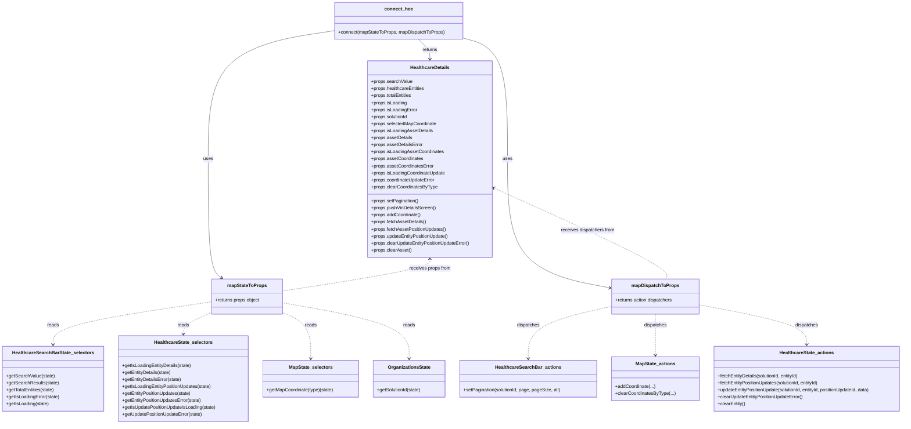

# Diagram: web/portal/src/pages/healthcare/details/Healthcare.Details.page.container.js

> Auto-generated by Obscura crawlers

## Mermaid

### SVG

<svg id="container" width="3076.796875" xmlns="http://www.w3.org/2000/svg" class="classDiagram" height="1450" viewBox="0 0 3076.796875 1450" role="graphics-document document" aria-roledescription="class"><g><defs><marker id="container_class-aggregationStart" class="marker aggregation class" refX="18" refY="7" markerWidth="190" markerHeight="240" orient="auto"><path d="M 18,7 L9,13 L1,7 L9,1 Z"></path></marker></defs><defs><marker id="container_class-aggregationEnd" class="marker aggregation class" refX="1" refY="7" markerWidth="20" markerHeight="28" orient="auto"><path d="M 18,7 L9,13 L1,7 L9,1 Z"></path></marker></defs><defs><marker id="container_class-extensionStart" class="marker extension class" refX="18" refY="7" markerWidth="190" markerHeight="240" orient="auto"><path d="M 1,7 L18,13 V 1 Z"></path></marker></defs><defs><marker id="container_class-extensionEnd" class="marker extension class" refX="1" refY="7" markerWidth="20" markerHeight="28" orient="auto"><path d="M 1,1 V 13 L18,7 Z"></path></marker></defs><defs><marker id="container_class-compositionStart" class="marker composition class" refX="18" refY="7" markerWidth="190" markerHeight="240" orient="auto"><path d="M 18,7 L9,13 L1,7 L9,1 Z"></path></marker></defs><defs><marker id="container_class-compositionEnd" class="marker composition class" refX="1" refY="7" markerWidth="20" markerHeight="28" orient="auto"><path d="M 18,7 L9,13 L1,7 L9,1 Z"></path></marker></defs><defs><marker id="container_class-dependencyStart" class="marker dependency class" refX="6" refY="7" markerWidth="190" markerHeight="240" orient="auto"><path d="M 5,7 L9,13 L1,7 L9,1 Z"></path></marker></defs><defs><marker id="container_class-dependencyEnd" class="marker dependency class" refX="13" refY="7" markerWidth="20" markerHeight="28" orient="auto"><path d="M 18,7 L9,13 L14,7 L9,1 Z"></path></marker></defs><defs><marker id="container_class-lollipopStart" class="marker lollipop class" refX="13" refY="7" markerWidth="190" markerHeight="240" orient="auto"><circle stroke="black" fill="transparent" cx="7" cy="7" r="6"></circle></marker></defs><defs><marker id="container_class-lollipopEnd" class="marker lollipop class" refX="1" refY="7" markerWidth="190" markerHeight="240" orient="auto"><circle stroke="black" fill="transparent" cx="7" cy="7" r="6"></circle></marker></defs><g class="root"><g class="clusters"></g><g class="edgePaths"><path d="M1138.273,104.277L1065.8,115.398C993.326,126.518,848.379,148.759,775.905,222.046C703.432,295.333,703.432,419.667,703.432,544C703.432,668.333,703.432,792.667,711.096,860.412C718.761,928.156,734.091,939.313,741.756,944.891L749.42,950.469" id="id_connect_hoc_mapStateToProps_1" class="edge-thickness-normal edge-pattern-solid relation" style=";;;" data-edge="true" data-et="edge" data-id="id_connect_hoc_mapStateToProps_1" data-points="W3sieCI6MTEzOC4yNzM0Mzc1LCJ5IjoxMDQuMjc3MDkxMzE4ODUwMjd9LHsieCI6NzAzLjQzMTY0MDYyNSwieSI6MTcxfSx7IngiOjcwMy40MzE2NDA2MjUsInkiOjU0NH0seyJ4Ijo3MDMuNDMxNjQwNjI1LCJ5Ijo5MTd9LHsieCI6NzU0LjI3MTYyNTMyMjE2NDksInkiOjk1NH1d" marker-end="url(#container_class-dependencyEnd)"></path><path d="M1572.016,129.606L1597.545,136.505C1623.075,143.404,1674.134,157.202,1699.664,226.268C1725.193,295.333,1725.193,419.667,1725.193,544C1725.193,668.333,1725.193,792.667,1781.977,865.927C1838.761,939.187,1952.329,961.374,2009.113,972.468L2065.896,983.561" id="id_connect_hoc_mapDispatchToProps_2" class="edge-thickness-normal edge-pattern-solid relation" style=";;;" data-edge="true" data-et="edge" data-id="id_connect_hoc_mapDispatchToProps_2" data-points="W3sieCI6MTU3Mi4wMTU2MjUsInkiOjEyOS42MDYwNzUwMDA2NTk3Nn0seyJ4IjoxNzI1LjE5MzM1OTM3NSwieSI6MTcxfSx7IngiOjE3MjUuMTkzMzU5Mzc1LCJ5Ijo1NDR9LHsieCI6MTcyNS4xOTMzNTkzNzUsInkiOjkxN30seyJ4IjoyMDcxLjc4NTE1NjI1LCJ5Ijo5ODQuNzExNDY2MzY4NzUzOH1d" marker-end="url(#container_class-dependencyEnd)"></path><path d="M1420.338,134L1426.72,140.167C1433.101,146.333,1445.864,158.667,1452.246,170C1458.627,181.333,1458.627,191.667,1458.627,196.833L1458.627,202" id="id_connect_hoc_HealthcareDetails_3" class="edge-thickness-normal edge-pattern-solid relation" style=";;;" data-edge="true" data-et="edge" data-id="id_connect_hoc_HealthcareDetails_3" data-points="W3sieCI6MTQyMC4zMzg0NTcwMzEyNSwieSI6MTM0fSx7IngiOjE0NTguNjI2OTUzMTI1LCJ5IjoxNzF9LHsieCI6MTQ1OC42MjY5NTMxMjUsInkiOjIwOH1d" marker-end="url(#container_class-dependencyEnd)"></path><path d="M714.367,1032.014L624.957,1045.178C535.547,1058.343,356.727,1084.671,267.316,1109.002C177.906,1133.333,177.906,1155.667,177.906,1166.833L177.906,1178" id="id_mapStateToProps_HealthcareSearchBarState_selectors_4" class="edge-thickness-normal edge-pattern-dashed relation" style=";;;" data-edge="true" data-et="edge" data-id="id_mapStateToProps_HealthcareSearchBarState_selectors_4" data-points="W3sieCI6NzE0LjM2NzE4NzUsInkiOjEwMzIuMDEzOTE1OTgyMzMxfSx7IngiOjE3Ny45MDYyNSwieSI6MTExMX0seyJ4IjoxNzcuOTA2MjUsInkiOjExODR9XQ==" marker-end="url(#container_class-dependencyEnd)"></path><path d="M714.367,1068.636L698.556,1075.697C682.745,1082.757,651.122,1096.879,635.311,1109.106C619.5,1121.333,619.5,1131.667,619.5,1136.833L619.5,1142" id="id_mapStateToProps_HealthcareState_selectors_5" class="edge-thickness-normal edge-pattern-dashed relation" style=";;;" data-edge="true" data-et="edge" data-id="id_mapStateToProps_HealthcareState_selectors_5" data-points="W3sieCI6NzE0LjM2NzE4NzUsInkiOjEwNjguNjM1ODczMTgxNDM0fSx7IngiOjYxOS41LCJ5IjoxMTExfSx7IngiOjYxOS41LCJ5IjoxMTQ4fV0=" marker-end="url(#container_class-dependencyEnd)"></path><path d="M959.063,1068.636L974.874,1075.697C990.685,1082.757,1022.307,1096.879,1038.118,1123.106C1053.93,1149.333,1053.93,1187.667,1053.93,1206.833L1053.93,1226" id="id_mapStateToProps_MapState_selectors_6" class="edge-thickness-normal edge-pattern-dashed relation" style=";;;" data-edge="true" data-et="edge" data-id="id_mapStateToProps_MapState_selectors_6" data-points="W3sieCI6OTU5LjA2MjUsInkiOjEwNjguNjM1ODczMTgxNDM0fSx7IngiOjEwNTMuOTI5Njg3NSwieSI6MTExMX0seyJ4IjoxMDUzLjkyOTY4NzUsInkiOjEyMzJ9XQ==" marker-end="url(#container_class-dependencyEnd)"></path><path d="M959.063,1035.458L1030.851,1048.048C1102.639,1060.638,1246.216,1085.819,1318.005,1117.576C1389.793,1149.333,1389.793,1187.667,1389.793,1206.833L1389.793,1226" id="id_mapStateToProps_OrganizationsState_7" class="edge-thickness-normal edge-pattern-dashed relation" style=";;;" data-edge="true" data-et="edge" data-id="id_mapStateToProps_OrganizationsState_7" data-points="W3sieCI6OTU5LjA2MjUsInkiOjEwMzUuNDU3NTg4MjEzNjkwM30seyJ4IjoxMzg5Ljc5Mjk2ODc1LCJ5IjoxMTExfSx7IngiOjEzODkuNzkyOTY4NzUsInkiOjEyMzJ9XQ==" marker-end="url(#container_class-dependencyEnd)"></path><path d="M2071.785,1048.002L2025.492,1058.502C1979.199,1069.002,1886.613,1090.001,1840.32,1119.667C1794.027,1149.333,1794.027,1187.667,1794.027,1206.833L1794.027,1226" id="id_mapDispatchToProps_HealthcareSearchBar_actions_8" class="edge-thickness-normal edge-pattern-dashed relation" style=";;;" data-edge="true" data-et="edge" data-id="id_mapDispatchToProps_HealthcareSearchBar_actions_8" data-points="W3sieCI6MjA3MS43ODUxNTYyNSwieSI6MTA0OC4wMDI0OTM0OTIyNTkyfSx7IngiOjE3OTQuMDI3MzQzNzUsInkiOjExMTF9LHsieCI6MTc5NC4wMjczNDM3NSwieSI6MTIzMn1d" marker-end="url(#container_class-dependencyEnd)"></path><path d="M2221.703,1074L2221.703,1080.167C2221.703,1086.333,2221.703,1098.667,2221.703,1122C2221.703,1145.333,2221.703,1179.667,2221.703,1196.833L2221.703,1214" id="id_mapDispatchToProps_MapState_actions_9" class="edge-thickness-normal edge-pattern-dashed relation" style=";;;" data-edge="true" data-et="edge" data-id="id_mapDispatchToProps_MapState_actions_9" data-points="W3sieCI6MjIyMS43MDMxMjUsInkiOjEwNzR9LHsieCI6MjIyMS43MDMxMjUsInkiOjExMTF9LHsieCI6MjIyMS43MDMxMjUsInkiOjEyMjB9XQ==" marker-end="url(#container_class-dependencyEnd)"></path><path d="M2371.621,1041.867L2433.606,1053.39C2495.591,1064.912,2619.561,1087.956,2681.546,1110.645C2743.531,1133.333,2743.531,1155.667,2743.531,1166.833L2743.531,1178" id="id_mapDispatchToProps_HealthcareState_actions_10" class="edge-thickness-normal edge-pattern-dashed relation" style=";;;" data-edge="true" data-et="edge" data-id="id_mapDispatchToProps_HealthcareState_actions_10" data-points="W3sieCI6MjM3MS42MjEwOTM3NSwieSI6MTA0MS44Njc0OTU1ODM0MzU2fSx7IngiOjI3NDMuNTMxMjUsInkiOjExMTF9LHsieCI6Mjc0My41MzEyNSwieSI6MTE4NH1d" marker-end="url(#container_class-dependencyEnd)"></path><path d="M1458.627,886L1458.627,891.167C1458.627,896.333,1458.627,906.667,1375.366,924.82C1292.105,942.972,1125.584,968.945,1042.323,981.931L959.063,994.917" id="id_HealthcareDetails_mapStateToProps_11" class="edge-thickness-normal edge-pattern-dashed relation" style=";;;" data-edge="true" data-et="edge" data-id="id_HealthcareDetails_mapStateToProps_11" data-points="W3sieCI6MTQ1OC42MjY5NTMxMjUsInkiOjg4MH0seyJ4IjoxNDU4LjYyNjk1MzEyNSwieSI6OTE3fSx7IngiOjk1OS4wNjI1LCJ5Ijo5OTQuOTE3MzYzNTk5NTMzOX1d" marker-start="url(#container_class-dependencyStart)"></path><path d="M1679.162,644.373L1778.996,689.811C1878.831,735.249,2078.499,826.124,2174.744,877.729C2270.989,929.333,2263.809,941.667,2260.22,947.833L2256.63,954" id="id_HealthcareDetails_mapDispatchToProps_12" class="edge-thickness-normal edge-pattern-dashed relation" style=";;;" data-edge="true" data-et="edge" data-id="id_HealthcareDetails_mapDispatchToProps_12" data-points="W3sieCI6MTY3My43MDExNzE4NzUsInkiOjY0MS44ODczMzIxMzM3OTI1fSx7IngiOjIyNzguMTY3OTY4NzUsInkiOjkxN30seyJ4IjoyMjU2LjYyOTgzMjQ3NDIyNywieSI6OTU0fV0=" marker-start="url(#container_class-dependencyStart)"></path></g><g class="edgeLabels"><g class="edgeLabel" transform="translate(703.431640625, 544)"><g class="label" data-id="id_connect_hoc_mapStateToProps_1" transform="translate(-16.4921875, -12)"><foreignObject width="32.984375" height="24">

uses

</foreignObject></g></g><g class="edgeLabel" transform="translate(1725.193359375, 544)"><g class="label" data-id="id_connect_hoc_mapDispatchToProps_2" transform="translate(-16.4921875, -12)"><foreignObject width="32.984375" height="24">

uses

</foreignObject></g></g><g class="edgeLabel" transform="translate(1458.626953125, 171)"><g class="label" data-id="id_connect_hoc_HealthcareDetails_3" transform="translate(-26.265625, -12)"><foreignObject width="52.53125" height="24">

returns

</foreignObject></g></g><g class="edgeLabel" transform="translate(177.90625, 1111)"><g class="label" data-id="id_mapStateToProps_HealthcareSearchBarState_selectors_4" transform="translate(-20.0078125, -12)"><foreignObject width="40.015625" height="24">

reads

</foreignObject></g></g><g class="edgeLabel" transform="translate(619.5, 1111)"><g class="label" data-id="id_mapStateToProps_HealthcareState_selectors_5" transform="translate(-20.0078125, -12)"><foreignObject width="40.015625" height="24">

reads

</foreignObject></g></g><g class="edgeLabel" transform="translate(1053.9296875, 1111)"><g class="label" data-id="id_mapStateToProps_MapState_selectors_6" transform="translate(-20.0078125, -12)"><foreignObject width="40.015625" height="24">

reads

</foreignObject></g></g><g class="edgeLabel" transform="translate(1389.79296875, 1111)"><g class="label" data-id="id_mapStateToProps_OrganizationsState_7" transform="translate(-20.0078125, -12)"><foreignObject width="40.015625" height="24">

reads

</foreignObject></g></g><g class="edgeLabel" transform="translate(1794.02734375, 1111)"><g class="label" data-id="id_mapDispatchToProps_HealthcareSearchBar_actions_8" transform="translate(-39.1796875, -12)"><foreignObject width="78.359375" height="24">

dispatches

</foreignObject></g></g><g class="edgeLabel" transform="translate(2221.703125, 1111)"><g class="label" data-id="id_mapDispatchToProps_MapState_actions_9" transform="translate(-39.1796875, -12)"><foreignObject width="78.359375" height="24">

dispatches

</foreignObject></g></g><g class="edgeLabel" transform="translate(2743.53125, 1111)"><g class="label" data-id="id_mapDispatchToProps_HealthcareState_actions_10" transform="translate(-39.1796875, -12)"><foreignObject width="78.359375" height="24">

dispatches

</foreignObject></g></g><g class="edgeLabel" transform="translate(1458.626953125, 917)"><g class="label" data-id="id_HealthcareDetails_mapStateToProps_11" transform="translate(-71.546875, -12)"><foreignObject width="143.09375" height="24">

receives props from

</foreignObject></g></g><g class="edgeLabel" transform="translate(1995.41769, 788.31107)"><g class="label" data-id="id_HealthcareDetails_mapDispatchToProps_12" transform="translate(-92.9296875, -12)"><foreignObject width="185.859375" height="24">

receives dispatchers from

</foreignObject></g></g></g><g class="nodes"><g class="node default" id="classId-HealthcareDetails-0" transform="translate(1458.626953125, 544)"><g class="basic label-container"><path d="M-215.07421875 -336 L215.07421875 -336 L215.07421875 336 L-215.07421875 336" stroke="none" stroke-width="0" fill="#ECECFF" style=""></path><path d="M-215.07421875 -336 C-64.15136143639967 -336, 86.77149587720066 -336, 215.07421875 -336 M-215.07421875 -336 C-65.53805101666123 -336, 83.99811671667754 -336, 215.07421875 -336 M215.07421875 -336 C215.07421875 -161.5613211187329, 215.07421875 12.877357762534189, 215.07421875 336 M215.07421875 -336 C215.07421875 -167.50988281262718, 215.07421875 0.9802343747456348, 215.07421875 336 M215.07421875 336 C128.44482406916038 336, 41.81542938832075 336, -215.07421875 336 M215.07421875 336 C44.127937319972744 336, -126.81834411005451 336, -215.07421875 336 M-215.07421875 336 C-215.07421875 142.18087780402104, -215.07421875 -51.638244391957926, -215.07421875 -336 M-215.07421875 336 C-215.07421875 104.93182468544245, -215.07421875 -126.1363506291151, -215.07421875 -336" stroke="#9370DB" stroke-width="1.3" fill="none" stroke-dasharray="0 0" style=""></path></g><g class="annotation-group text" transform="translate(0, -312)"></g><g class="label-group text" transform="translate(-65.0703125, -312)"><g class="label" style="font-weight: bolder" transform="translate(0,-12)"><foreignObject width="130.140625" height="24">

HealthcareDetails

</foreignObject></g></g><g class="members-group text" transform="translate(-203.07421875, -264)"><g class="label" style="" transform="translate(0,-12)"><foreignObject width="140.390625" height="24">

+props.searchValue

</foreignObject></g><g class="label" style="" transform="translate(0,12)"><foreignObject width="184.828125" height="24">

+props.healthcareEntities

</foreignObject></g><g class="label" style="" transform="translate(0,36)"><foreignObject width="141.1875" height="24">

+props.totalEntities

</foreignObject></g><g class="label" style="" transform="translate(0,60)"><foreignObject width="122.5625" height="24">

+props.isLoading

</foreignObject></g><g class="label" style="" transform="translate(0,84)"><foreignObject width="158.359375" height="24">

+props.isLoadingError

</foreignObject></g><g class="label" style="" transform="translate(0,108)"><foreignObject width="127.53125" height="24">

+props.solutionId

</foreignObject></g><g class="label" style="" transform="translate(0,132)"><foreignObject width="224.5" height="24">

+props.selectedMapCoordinate

</foreignObject></g><g class="label" style="" transform="translate(0,156)"><foreignObject width="211.078125" height="24">

+props.isLoadingAssetDetails

</foreignObject></g><g class="label" style="" transform="translate(0,180)"><foreignObject width="141.234375" height="24">

+props.assetDetails

</foreignObject></g><g class="label" style="" transform="translate(0,204)"><foreignObject width="177.03125" height="24">

+props.assetDetailsError

</foreignObject></g><g class="label" style="" transform="translate(0,228)"><foreignObject width="247.921875" height="24">

+props.isLoadingAssetCoordinates

</foreignObject></g><g class="label" style="" transform="translate(0,252)"><foreignObject width="178.09375" height="24">

+props.assetCoordinates

</foreignObject></g><g class="label" style="" transform="translate(0,276)"><foreignObject width="213.875" height="24">

+props.assetCoordinatesError

</foreignObject></g><g class="label" style="" transform="translate(0,300)"><foreignObject width="254.625" height="24">

+props.isLoadingCoordinateUpdate

</foreignObject></g><g class="label" style="" transform="translate(0,324)"><foreignObject width="219.734375" height="24">

+props.coordinateUpdateError

</foreignObject></g><g class="label" style="" transform="translate(0,348)"><foreignObject width="227.125" height="24">

+props.clearCoordinatesByType

</foreignObject></g></g><g class="methods-group text" transform="translate(-203.07421875, 144)"><g class="label" style="" transform="translate(0,-12)"><foreignObject width="162.625" height="24">

+props.setPagination()

</foreignObject></g><g class="label" style="" transform="translate(0,12)"><foreignObject width="221.109375" height="24">

+props.pushVinDetailsScreen()

</foreignObject></g><g class="label" style="" transform="translate(0,36)"><foreignObject width="171" height="24">

+props.addCoordinate()

</foreignObject></g><g class="label" style="" transform="translate(0,60)"><foreignObject width="188.484375" height="24">

+props.fetchAssetDetails()

</foreignObject></g><g class="label" style="" transform="translate(0,84)"><foreignObject width="257.671875" height="24">

+props.fetchAssetPositionUpdates()

</foreignObject></g><g class="label" style="" transform="translate(0,108)"><foreignObject width="268.3125" height="24">

+props.updateEntityPositionUpdate()

</foreignObject></g><g class="label" style="" transform="translate(0,132)"><foreignObject width="341.078125" height="24">

+props.clearUpdateEntityPositionUpdateError()

</foreignObject></g><g class="label" style="" transform="translate(0,156)"><foreignObject width="137.703125" height="24">

+props.clearAsset()

</foreignObject></g></g><g class="divider" style=""><path d="M-215.07421875 -288 C-97.76305158346426 -288, 19.54811558307148 -288, 215.07421875 -288 M-215.07421875 -288 C-67.10781411133485 -288, 80.8585905273303 -288, 215.07421875 -288" stroke="#9370DB" stroke-width="1.3" fill="none" stroke-dasharray="0 0" style=""></path></g><g class="divider" style=""><path d="M-215.07421875 120 C-85.31592238653286 120, 44.44237397693428 120, 215.07421875 120 M-215.07421875 120 C-43.02668605349521 120, 129.02084664300958 120, 215.07421875 120" stroke="#9370DB" stroke-width="1.3" fill="none" stroke-dasharray="0 0" style=""></path></g></g><g class="node default" id="classId-connect_hoc-1" transform="translate(1355.14453125, 71)"><g class="basic label-container"><path d="M-216.87109375 -63 L216.87109375 -63 L216.87109375 63 L-216.87109375 63" stroke="none" stroke-width="0" fill="#ECECFF" style=""></path><path d="M-216.87109375 -63 C-71.45447806849597 -63, 73.96213761300805 -63, 216.87109375 -63 M-216.87109375 -63 C-59.24719208529265 -63, 98.3767095794147 -63, 216.87109375 -63 M216.87109375 -63 C216.87109375 -19.38093312844564, 216.87109375 24.23813374310872, 216.87109375 63 M216.87109375 -63 C216.87109375 -21.494008714770793, 216.87109375 20.011982570458414, 216.87109375 63 M216.87109375 63 C50.918992281205846 63, -115.03310918758831 63, -216.87109375 63 M216.87109375 63 C52.93324567067978 63, -111.00460240864044 63, -216.87109375 63 M-216.87109375 63 C-216.87109375 24.71629324871484, -216.87109375 -13.567413502570318, -216.87109375 -63 M-216.87109375 63 C-216.87109375 14.299739693642849, -216.87109375 -34.4005206127143, -216.87109375 -63" stroke="#9370DB" stroke-width="1.3" fill="none" stroke-dasharray="0 0" style=""></path></g><g class="annotation-group text" transform="translate(0, -39)"></g><g class="label-group text" transform="translate(-46.1953125, -39)"><g class="label" style="font-weight: bolder" transform="translate(0,-12)"><foreignObject width="92.390625" height="24">

connect_hoc

</foreignObject></g></g><g class="members-group text" transform="translate(-204.87109375, 9)"></g><g class="methods-group text" transform="translate(-204.87109375, 39)"><g class="label" style="" transform="translate(0,-12)"><foreignObject width="363.546875" height="24">

+connect(mapStateToProps, mapDispatchToProps)

</foreignObject></g></g><g class="divider" style=""><path d="M-216.87109375 -15 C-57.46914579311806 -15, 101.93280216376388 -15, 216.87109375 -15 M-216.87109375 -15 C-71.93177331620541 -15, 73.00754711758918 -15, 216.87109375 -15" stroke="#9370DB" stroke-width="1.3" fill="none" stroke-dasharray="0 0" style=""></path></g><g class="divider" style=""><path d="M-216.87109375 9 C-47.546810494121104 9, 121.77747276175779 9, 216.87109375 9 M-216.87109375 9 C-59.57804768624834 9, 97.71499837750332 9, 216.87109375 9" stroke="#9370DB" stroke-width="1.3" fill="none" stroke-dasharray="0 0" style=""></path></g></g><g class="node default" id="classId-mapStateToProps-2" transform="translate(836.71484375, 1014)"><g class="basic label-container"><path d="M-122.34765625 -60 L122.34765625 -60 L122.34765625 60 L-122.34765625 60" stroke="none" stroke-width="0" fill="#ECECFF" style=""></path><path d="M-122.34765625 -60 C-56.02256555272369 -60, 10.302525144552618 -60, 122.34765625 -60 M-122.34765625 -60 C-48.754976110212965 -60, 24.83770402957407 -60, 122.34765625 -60 M122.34765625 -60 C122.34765625 -18.286666126397137, 122.34765625 23.426667747205727, 122.34765625 60 M122.34765625 -60 C122.34765625 -28.94155473751878, 122.34765625 2.116890524962443, 122.34765625 60 M122.34765625 60 C41.25371400177187 60, -39.84022824645626 60, -122.34765625 60 M122.34765625 60 C53.301712860163505 60, -15.74423052967299 60, -122.34765625 60 M-122.34765625 60 C-122.34765625 17.78464366028696, -122.34765625 -24.43071267942608, -122.34765625 -60 M-122.34765625 60 C-122.34765625 35.284562477500984, -122.34765625 10.569124955001975, -122.34765625 -60" stroke="#9370DB" stroke-width="1.3" fill="none" stroke-dasharray="0 0" style=""></path></g><g class="annotation-group text" transform="translate(0, -36)"></g><g class="label-group text" transform="translate(-64.7109375, -36)"><g class="label" style="font-weight: bolder" transform="translate(0,-12)"><foreignObject width="129.421875" height="24">

mapStateToProps

</foreignObject></g></g><g class="members-group text" transform="translate(-110.34765625, 12)"><g class="label" style="" transform="translate(0,-12)"><foreignObject width="155.984375" height="24">

+returns props object

</foreignObject></g></g><g class="methods-group text" transform="translate(-110.34765625, 60)"></g><g class="divider" style=""><path d="M-122.34765625 -12 C-66.38451237168252 -12, -10.421368493365051 -12, 122.34765625 -12 M-122.34765625 -12 C-33.786293517564886 -12, 54.77506921487023 -12, 122.34765625 -12" stroke="#9370DB" stroke-width="1.3" fill="none" stroke-dasharray="0 0" style=""></path></g><g class="divider" style=""><path d="M-122.34765625 36 C-27.35178730121679 36, 67.64408164756642 36, 122.34765625 36 M-122.34765625 36 C-70.47684862661848 36, -18.606041003236967 36, 122.34765625 36" stroke="#9370DB" stroke-width="1.3" fill="none" stroke-dasharray="0 0" style=""></path></g></g><g class="node default" id="classId-mapDispatchToProps-3" transform="translate(2221.703125, 1014)"><g class="basic label-container"><path d="M-149.91796875 -60 L149.91796875 -60 L149.91796875 60 L-149.91796875 60" stroke="none" stroke-width="0" fill="#ECECFF" style=""></path><path d="M-149.91796875 -60 C-48.53256485135803 -60, 52.852839047283936 -60, 149.91796875 -60 M-149.91796875 -60 C-83.7036029076733 -60, -17.4892370653466 -60, 149.91796875 -60 M149.91796875 -60 C149.91796875 -26.776838655918915, 149.91796875 6.446322688162169, 149.91796875 60 M149.91796875 -60 C149.91796875 -21.857516395837074, 149.91796875 16.284967208325853, 149.91796875 60 M149.91796875 60 C39.77352416941042 60, -70.37092041117916 60, -149.91796875 60 M149.91796875 60 C88.03554959050874 60, 26.15313043101746 60, -149.91796875 60 M-149.91796875 60 C-149.91796875 27.89734753246716, -149.91796875 -4.2053049350656835, -149.91796875 -60 M-149.91796875 60 C-149.91796875 23.448699459586464, -149.91796875 -13.102601080827071, -149.91796875 -60" stroke="#9370DB" stroke-width="1.3" fill="none" stroke-dasharray="0 0" style=""></path></g><g class="annotation-group text" transform="translate(0, -36)"></g><g class="label-group text" transform="translate(-77.1953125, -36)"><g class="label" style="font-weight: bolder" transform="translate(0,-12)"><foreignObject width="154.390625" height="24">

mapDispatchToProps

</foreignObject></g></g><g class="members-group text" transform="translate(-137.91796875, 12)"><g class="label" style="" transform="translate(0,-12)"><foreignObject width="198.640625" height="24">

+returns action dispatchers

</foreignObject></g></g><g class="methods-group text" transform="translate(-137.91796875, 60)"></g><g class="divider" style=""><path d="M-149.91796875 -12 C-54.21189231593296 -12, 41.494184118134086 -12, 149.91796875 -12 M-149.91796875 -12 C-34.553637497209664 -12, 80.81069375558067 -12, 149.91796875 -12" stroke="#9370DB" stroke-width="1.3" fill="none" stroke-dasharray="0 0" style=""></path></g><g class="divider" style=""><path d="M-149.91796875 36 C-52.15961056609393 36, 45.59874761781214 36, 149.91796875 36 M-149.91796875 36 C-56.18725940182654 36, 37.543449946346925 36, 149.91796875 36" stroke="#9370DB" stroke-width="1.3" fill="none" stroke-dasharray="0 0" style=""></path></g></g><g class="node default" id="classId-HealthcareSearchBarState_selectors-4" transform="translate(177.90625, 1295)"><g class="basic label-container"><path d="M-169.90625 -111 L169.90625 -111 L169.90625 111 L-169.90625 111" stroke="none" stroke-width="0" fill="#ECECFF" style=""></path><path d="M-169.90625 -111 C-55.679048890981704 -111, 58.54815221803659 -111, 169.90625 -111 M-169.90625 -111 C-82.5681244536509 -111, 4.770001092698209 -111, 169.90625 -111 M169.90625 -111 C169.90625 -39.71281361127602, 169.90625 31.574372777447962, 169.90625 111 M169.90625 -111 C169.90625 -27.05852215795072, 169.90625 56.88295568409856, 169.90625 111 M169.90625 111 C54.38727341675596 111, -61.13170316648808 111, -169.90625 111 M169.90625 111 C65.55942445102659 111, -38.78740109794683 111, -169.90625 111 M-169.90625 111 C-169.90625 40.21009403279716, -169.90625 -30.579811934405683, -169.90625 -111 M-169.90625 111 C-169.90625 62.69014180015771, -169.90625 14.380283600315423, -169.90625 -111" stroke="#9370DB" stroke-width="1.3" fill="none" stroke-dasharray="0 0" style=""></path></g><g class="annotation-group text" transform="translate(0, -87)"></g><g class="label-group text" transform="translate(-133.578125, -87)"><g class="label" style="font-weight: bolder" transform="translate(0,-12)"><foreignObject width="267.15625" height="24">

HealthcareSearchBarState_selectors

</foreignObject></g></g><g class="members-group text" transform="translate(-157.90625, -39)"></g><g class="methods-group text" transform="translate(-157.90625, -9)"><g class="label" style="" transform="translate(0,-12)"><foreignObject width="165.234375" height="24">

+getSearchValue(state)

</foreignObject></g><g class="label" style="" transform="translate(0,12)"><foreignObject width="178.59375" height="24">

+getSearchResults(state)

</foreignObject></g><g class="label" style="" transform="translate(0,36)"><foreignObject width="167.1875" height="24">

+getTotalEntities(state)

</foreignObject></g><g class="label" style="" transform="translate(0,60)"><foreignObject width="182.234375" height="24">

+getIsLoadingError(state)

</foreignObject></g><g class="label" style="" transform="translate(0,84)"><foreignObject width="146.4375" height="24">

+getIsLoading(state)

</foreignObject></g></g><g class="divider" style=""><path d="M-169.90625 -63 C-56.69236814495963 -63, 56.52151371008074 -63, 169.90625 -63 M-169.90625 -63 C-100.15198969518852 -63, -30.397729390377037 -63, 169.90625 -63" stroke="#9370DB" stroke-width="1.3" fill="none" stroke-dasharray="0 0" style=""></path></g><g class="divider" style=""><path d="M-169.90625 -39 C-63.564402450466645 -39, 42.77744509906671 -39, 169.90625 -39 M-169.90625 -39 C-89.65769241357489 -39, -9.409134827149785 -39, 169.90625 -39" stroke="#9370DB" stroke-width="1.3" fill="none" stroke-dasharray="0 0" style=""></path></g></g><g class="node default" id="classId-HealthcareState_selectors-5" transform="translate(619.5, 1295)"><g class="basic label-container"><path d="M-221.6875 -147 L221.6875 -147 L221.6875 147 L-221.6875 147" stroke="none" stroke-width="0" fill="#ECECFF" style=""></path><path d="M-221.6875 -147 C-117.51257260757333 -147, -13.337645215146665 -147, 221.6875 -147 M-221.6875 -147 C-109.576038854776 -147, 2.535422290447997 -147, 221.6875 -147 M221.6875 -147 C221.6875 -68.10962024228188, 221.6875 10.780759515436245, 221.6875 147 M221.6875 -147 C221.6875 -54.14524626655749, 221.6875 38.709507466885015, 221.6875 147 M221.6875 147 C82.91094506955463 147, -55.86560986089074 147, -221.6875 147 M221.6875 147 C129.30021269134852 147, 36.91292538269707 147, -221.6875 147 M-221.6875 147 C-221.6875 79.50639289638912, -221.6875 12.012785792778232, -221.6875 -147 M-221.6875 147 C-221.6875 34.31383235199654, -221.6875 -78.37233529600692, -221.6875 -147" stroke="#9370DB" stroke-width="1.3" fill="none" stroke-dasharray="0 0" style=""></path></g><g class="annotation-group text" transform="translate(0, -123)"></g><g class="label-group text" transform="translate(-96.34375, -123)"><g class="label" style="font-weight: bolder" transform="translate(0,-12)"><foreignObject width="192.6875" height="24">

HealthcareState_selectors

</foreignObject></g></g><g class="members-group text" transform="translate(-209.6875, -75)"></g><g class="methods-group text" transform="translate(-209.6875, -45)"><g class="label" style="" transform="translate(0,-12)"><foreignObject width="238.140625" height="24">

+getIsLoadingEntityDetails(state)

</foreignObject></g><g class="label" style="" transform="translate(0,12)"><foreignObject width="168.71875" height="24">

+getEntityDetails(state)

</foreignObject></g><g class="label" style="" transform="translate(0,36)"><foreignObject width="204.5" height="24">

+getEntityDetailsError(state)

</foreignObject></g><g class="label" style="" transform="translate(0,60)"><foreignObject width="307.328125" height="24">

+getIsLoadingEntityPositionUpdates(state)

</foreignObject></g><g class="label" style="" transform="translate(0,84)"><foreignObject width="237.890625" height="24">

+getEntityPositionUpdates(state)

</foreignObject></g><g class="label" style="" transform="translate(0,108)"><foreignObject width="273.6875" height="24">

+getEntityPositionUpdatesError(state)

</foreignObject></g><g class="label" style="" transform="translate(0,132)"><foreignObject width="323.03125" height="24">

+getIsUpdatePositionUpdateIsLoading(state)

</foreignObject></g><g class="label" style="" transform="translate(0,156)"><foreignObject width="277.203125" height="24">

+getUpdatePositionUpdateError(state)

</foreignObject></g></g><g class="divider" style=""><path d="M-221.6875 -99 C-55.82622655521922 -99, 110.03504688956156 -99, 221.6875 -99 M-221.6875 -99 C-103.64330469524529 -99, 14.400890609509418 -99, 221.6875 -99" stroke="#9370DB" stroke-width="1.3" fill="none" stroke-dasharray="0 0" style=""></path></g><g class="divider" style=""><path d="M-221.6875 -75 C-121.46853321719988 -75, -21.249566434399753 -75, 221.6875 -75 M-221.6875 -75 C-123.43097303633519 -75, -25.174446072670378 -75, 221.6875 -75" stroke="#9370DB" stroke-width="1.3" fill="none" stroke-dasharray="0 0" style=""></path></g></g><g class="node default" id="classId-MapState_selectors-6" transform="translate(1053.9296875, 1295)"><g class="basic label-container"><path d="M-162.7421875 -63 L162.7421875 -63 L162.7421875 63 L-162.7421875 63" stroke="none" stroke-width="0" fill="#ECECFF" style=""></path><path d="M-162.7421875 -63 C-69.89232717799021 -63, 22.95753314401958 -63, 162.7421875 -63 M-162.7421875 -63 C-69.76927312059733 -63, 23.203641258805334 -63, 162.7421875 -63 M162.7421875 -63 C162.7421875 -36.753319953103535, 162.7421875 -10.50663990620707, 162.7421875 63 M162.7421875 -63 C162.7421875 -16.18106371697406, 162.7421875 30.637872566051882, 162.7421875 63 M162.7421875 63 C97.54356208161637 63, 32.344936663232744 63, -162.7421875 63 M162.7421875 63 C49.36256556237913 63, -64.01705637524174 63, -162.7421875 63 M-162.7421875 63 C-162.7421875 13.648917401106779, -162.7421875 -35.70216519778644, -162.7421875 -63 M-162.7421875 63 C-162.7421875 15.575022173866834, -162.7421875 -31.84995565226633, -162.7421875 -63" stroke="#9370DB" stroke-width="1.3" fill="none" stroke-dasharray="0 0" style=""></path></g><g class="annotation-group text" transform="translate(0, -39)"></g><g class="label-group text" transform="translate(-72.21875, -39)"><g class="label" style="font-weight: bolder" transform="translate(0,-12)"><foreignObject width="144.4375" height="24">

MapState_selectors

</foreignObject></g></g><g class="members-group text" transform="translate(-150.7421875, 9)"></g><g class="methods-group text" transform="translate(-150.7421875, 39)"><g class="label" style="" transform="translate(0,-12)"><foreignObject width="229.265625" height="24">

+getMapCoordinate(type)(state)

</foreignObject></g></g><g class="divider" style=""><path d="M-162.7421875 -15 C-50.77160796639821 -15, 61.198971567203586 -15, 162.7421875 -15 M-162.7421875 -15 C-47.352624240834146 -15, 68.03693901833171 -15, 162.7421875 -15" stroke="#9370DB" stroke-width="1.3" fill="none" stroke-dasharray="0 0" style=""></path></g><g class="divider" style=""><path d="M-162.7421875 9 C-95.90819339210313 9, -29.07419928420626 9, 162.7421875 9 M-162.7421875 9 C-57.067800296315426 9, 48.60658690736915 9, 162.7421875 9" stroke="#9370DB" stroke-width="1.3" fill="none" stroke-dasharray="0 0" style=""></path></g></g><g class="node default" id="classId-HealthcareSearchBar_actions-7" transform="translate(1794.02734375, 1295)"><g class="basic label-container"><path d="M-231.11328125 -63 L231.11328125 -63 L231.11328125 63 L-231.11328125 63" stroke="none" stroke-width="0" fill="#ECECFF" style=""></path><path d="M-231.11328125 -63 C-76.89048063953362 -63, 77.33231997093276 -63, 231.11328125 -63 M-231.11328125 -63 C-114.35923059876913 -63, 2.394820052461739 -63, 231.11328125 -63 M231.11328125 -63 C231.11328125 -22.107774864698428, 231.11328125 18.784450270603145, 231.11328125 63 M231.11328125 -63 C231.11328125 -14.75668719968688, 231.11328125 33.48662560062624, 231.11328125 63 M231.11328125 63 C88.19938461663372 63, -54.714512016732556 63, -231.11328125 63 M231.11328125 63 C100.43277571826377 63, -30.24772981347246 63, -231.11328125 63 M-231.11328125 63 C-231.11328125 32.137028697955714, -231.11328125 1.2740573959114343, -231.11328125 -63 M-231.11328125 63 C-231.11328125 37.544825442388785, -231.11328125 12.08965088477757, -231.11328125 -63" stroke="#9370DB" stroke-width="1.3" fill="none" stroke-dasharray="0 0" style=""></path></g><g class="annotation-group text" transform="translate(0, -39)"></g><g class="label-group text" transform="translate(-106.8828125, -39)"><g class="label" style="font-weight: bolder" transform="translate(0,-12)"><foreignObject width="213.765625" height="24">

HealthcareSearchBar_actions

</foreignObject></g></g><g class="members-group text" transform="translate(-219.11328125, 9)"></g><g class="methods-group text" transform="translate(-219.11328125, 39)"><g class="label" style="" transform="translate(0,-12)"><foreignObject width="331.34375" height="24">

+setPagination(solutionId, page, pageSize, all)

</foreignObject></g></g><g class="divider" style=""><path d="M-231.11328125 -15 C-65.3446593403392 -15, 100.42396256932159 -15, 231.11328125 -15 M-231.11328125 -15 C-52.48383022317964 -15, 126.14562080364072 -15, 231.11328125 -15" stroke="#9370DB" stroke-width="1.3" fill="none" stroke-dasharray="0 0" style=""></path></g><g class="divider" style=""><path d="M-231.11328125 9 C-95.2251877027993 9, 40.66290584440139 9, 231.11328125 9 M-231.11328125 9 C-46.434723015471235 9, 138.24383521905753 9, 231.11328125 9" stroke="#9370DB" stroke-width="1.3" fill="none" stroke-dasharray="0 0" style=""></path></g></g><g class="node default" id="classId-MapState_actions-8" transform="translate(2221.703125, 1295)"><g class="basic label-container"><path d="M-146.5625 -75 L146.5625 -75 L146.5625 75 L-146.5625 75" stroke="none" stroke-width="0" fill="#ECECFF" style=""></path><path d="M-146.5625 -75 C-54.809890641114464 -75, 36.94271871777107 -75, 146.5625 -75 M-146.5625 -75 C-57.010648140450215 -75, 32.54120371909957 -75, 146.5625 -75 M146.5625 -75 C146.5625 -29.038391369940733, 146.5625 16.923217260118534, 146.5625 75 M146.5625 -75 C146.5625 -36.25648504909886, 146.5625 2.4870299018022735, 146.5625 75 M146.5625 75 C31.1059921208831 75, -84.3505157582338 75, -146.5625 75 M146.5625 75 C83.16751870004657 75, 19.772537400093128 75, -146.5625 75 M-146.5625 75 C-146.5625 41.380087043064684, -146.5625 7.760174086129368, -146.5625 -75 M-146.5625 75 C-146.5625 21.34192498567591, -146.5625 -32.31615002864818, -146.5625 -75" stroke="#9370DB" stroke-width="1.3" fill="none" stroke-dasharray="0 0" style=""></path></g><g class="annotation-group text" transform="translate(0, -51)"></g><g class="label-group text" transform="translate(-65.3125, -51)"><g class="label" style="font-weight: bolder" transform="translate(0,-12)"><foreignObject width="130.625" height="24">

MapState_actions

</foreignObject></g></g><g class="members-group text" transform="translate(-134.5625, -3)"></g><g class="methods-group text" transform="translate(-134.5625, 27)"><g class="label" style="" transform="translate(0,-12)"><foreignObject width="136.921875" height="24">

+addCoordinate(...)

</foreignObject></g><g class="label" style="" transform="translate(0,12)"><foreignObject width="203.8125" height="24">

+clearCoordinatesByType(...)

</foreignObject></g></g><g class="divider" style=""><path d="M-146.5625 -27 C-30.911846386037197 -27, 84.7388072279256 -27, 146.5625 -27 M-146.5625 -27 C-50.292555921093395 -27, 45.97738815781321 -27, 146.5625 -27" stroke="#9370DB" stroke-width="1.3" fill="none" stroke-dasharray="0 0" style=""></path></g><g class="divider" style=""><path d="M-146.5625 -3 C-77.896402407633 -3, -9.23030481526601 -3, 146.5625 -3 M-146.5625 -3 C-62.20249597176202 -3, 22.15750805647596 -3, 146.5625 -3" stroke="#9370DB" stroke-width="1.3" fill="none" stroke-dasharray="0 0" style=""></path></g></g><g class="node default" id="classId-HealthcareState_actions-9" transform="translate(2743.53125, 1295)"><g class="basic label-container"><path d="M-325.265625 -111 L325.265625 -111 L325.265625 111 L-325.265625 111" stroke="none" stroke-width="0" fill="#ECECFF" style=""></path><path d="M-325.265625 -111 C-193.13177540382887 -111, -60.99792580765774 -111, 325.265625 -111 M-325.265625 -111 C-185.7246909227979 -111, -46.18375684559578 -111, 325.265625 -111 M325.265625 -111 C325.265625 -46.07473771363584, 325.265625 18.850524572728318, 325.265625 111 M325.265625 -111 C325.265625 -64.78017484555967, 325.265625 -18.56034969111934, 325.265625 111 M325.265625 111 C172.7976207212726 111, 20.329616442545216 111, -325.265625 111 M325.265625 111 C84.16137095051505 111, -156.9428830989699 111, -325.265625 111 M-325.265625 111 C-325.265625 25.625065570451326, -325.265625 -59.74986885909735, -325.265625 -111 M-325.265625 111 C-325.265625 47.56998531220362, -325.265625 -15.86002937559276, -325.265625 -111" stroke="#9370DB" stroke-width="1.3" fill="none" stroke-dasharray="0 0" style=""></path></g><g class="annotation-group text" transform="translate(0, -87)"></g><g class="label-group text" transform="translate(-89.4375, -87)"><g class="label" style="font-weight: bolder" transform="translate(0,-12)"><foreignObject width="178.875" height="24">

HealthcareState_actions

</foreignObject></g></g><g class="members-group text" transform="translate(-313.265625, -39)"></g><g class="methods-group text" transform="translate(-313.265625, -9)"><g class="label" style="" transform="translate(0,-12)"><foreignObject width="284.734375" height="24">

+fetchEntityDetails(solutionId, entityId)

</foreignObject></g><g class="label" style="" transform="translate(0,12)"><foreignObject width="353.90625" height="24">

+fetchEntityPositionUpdates(solutionId, entityId)

</foreignObject></g><g class="label" style="" transform="translate(0,36)"><foreignObject width="537.09375" height="24">

+updateEntityPositionUpdate(solutionId, entityId, positionUpdateId, data)

</foreignObject></g><g class="label" style="" transform="translate(0,60)"><foreignObject width="295.875" height="24">

+clearUpdateEntityPositionUpdateError()

</foreignObject></g><g class="label" style="" transform="translate(0,84)"><foreignObject width="95.6875" height="24">

+clearEntity()

</foreignObject></g></g><g class="divider" style=""><path d="M-325.265625 -63 C-111.72656982115302 -63, 101.81248535769396 -63, 325.265625 -63 M-325.265625 -63 C-80.4151615493241 -63, 164.4353019013518 -63, 325.265625 -63" stroke="#9370DB" stroke-width="1.3" fill="none" stroke-dasharray="0 0" style=""></path></g><g class="divider" style=""><path d="M-325.265625 -39 C-87.59124883047346 -39, 150.08312733905308 -39, 325.265625 -39 M-325.265625 -39 C-134.2960958105778 -39, 56.67343337884438 -39, 325.265625 -39" stroke="#9370DB" stroke-width="1.3" fill="none" stroke-dasharray="0 0" style=""></path></g></g><g class="node default" id="classId-OrganizationsState-10" transform="translate(1389.79296875, 1295)"><g class="basic label-container"><path d="M-123.12109375 -63 L123.12109375 -63 L123.12109375 63 L-123.12109375 63" stroke="none" stroke-width="0" fill="#ECECFF" style=""></path><path d="M-123.12109375 -63 C-52.557463117074846 -63, 18.006167515850308 -63, 123.12109375 -63 M-123.12109375 -63 C-52.783390292580705 -63, 17.55431316483859 -63, 123.12109375 -63 M123.12109375 -63 C123.12109375 -15.788808479689813, 123.12109375 31.422383040620375, 123.12109375 63 M123.12109375 -63 C123.12109375 -37.385296392241756, 123.12109375 -11.770592784483505, 123.12109375 63 M123.12109375 63 C53.11811180384696 63, -16.884870142306085 63, -123.12109375 63 M123.12109375 63 C57.97496142177319 63, -7.171170906453625 63, -123.12109375 63 M-123.12109375 63 C-123.12109375 31.208709359850893, -123.12109375 -0.5825812802982142, -123.12109375 -63 M-123.12109375 63 C-123.12109375 14.945471518066398, -123.12109375 -33.109056963867204, -123.12109375 -63" stroke="#9370DB" stroke-width="1.3" fill="none" stroke-dasharray="0 0" style=""></path></g><g class="annotation-group text" transform="translate(0, -39)"></g><g class="label-group text" transform="translate(-69.8671875, -39)"><g class="label" style="font-weight: bolder" transform="translate(0,-12)"><foreignObject width="139.734375" height="24">

OrganizationsState

</foreignObject></g></g><g class="members-group text" transform="translate(-111.12109375, 9)"></g><g class="methods-group text" transform="translate(-111.12109375, 39)"><g class="label" style="" transform="translate(0,-12)"><foreignObject width="152.375" height="24">

+getSolutionId(state)

</foreignObject></g></g><g class="divider" style=""><path d="M-123.12109375 -15 C-63.21881154629945 -15, -3.3165293425988978 -15, 123.12109375 -15 M-123.12109375 -15 C-39.02168597551169 -15, 45.077721798976626 -15, 123.12109375 -15" stroke="#9370DB" stroke-width="1.3" fill="none" stroke-dasharray="0 0" style=""></path></g><g class="divider" style=""><path d="M-123.12109375 9 C-32.15019089729144 9, 58.820711955417124 9, 123.12109375 9 M-123.12109375 9 C-43.32589988120678 9, 36.46929398758644 9, 123.12109375 9" stroke="#9370DB" stroke-width="1.3" fill="none" stroke-dasharray="0 0" style=""></path></g></g></g></g></g></svg>
