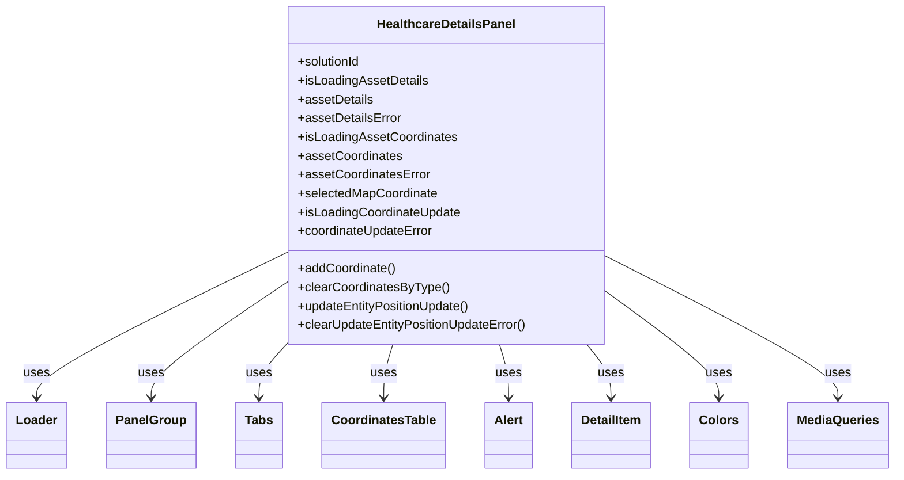

# Diagram: web/portal/src/pages/healthcare/details/components/Healthcare.DetailsPanel.organism.js


> Auto-generated by Obscura crawlers

## Diagram 1



### SVG

<svg id="container" width="1113.65625" xmlns="http://www.w3.org/2000/svg" class="classDiagram" height="606" viewBox="0 0 1113.65625 606" role="graphics-document document" aria-roledescription="class"><style>#container{font-family:"trebuchet ms",verdana,arial,sans-serif;font-size:16px;fill:#333;}@keyframes edge-animation-frame{from{stroke-dashoffset:0;}}@keyframes dash{to{stroke-dashoffset:0;}}#container .edge-animation-slow{stroke-dasharray:9,5!important;stroke-dashoffset:900;animation:dash 50s linear infinite;stroke-linecap:round;}#container .edge-animation-fast{stroke-dasharray:9,5!important;stroke-dashoffset:900;animation:dash 20s linear infinite;stroke-linecap:round;}#container .error-icon{fill:#552222;}#container .error-text{fill:#552222;stroke:#552222;}#container .edge-thickness-normal{stroke-width:1px;}#container .edge-thickness-thick{stroke-width:3.5px;}#container .edge-pattern-solid{stroke-dasharray:0;}#container .edge-thickness-invisible{stroke-width:0;fill:none;}#container .edge-pattern-dashed{stroke-dasharray:3;}#container .edge-pattern-dotted{stroke-dasharray:2;}#container .marker{fill:#333333;stroke:#333333;}#container .marker.cross{stroke:#333333;}#container svg{font-family:"trebuchet ms",verdana,arial,sans-serif;font-size:16px;}#container p{margin:0;}#container g.classGroup text{fill:#9370DB;stroke:none;font-family:"trebuchet ms",verdana,arial,sans-serif;font-size:10px;}#container g.classGroup text .title{font-weight:bolder;}#container .nodeLabel,#container .edgeLabel{color:#131300;}#container .edgeLabel .label rect{fill:#ECECFF;}#container .label text{fill:#131300;}#container .labelBkg{background:#ECECFF;}#container .edgeLabel .label span{background:#ECECFF;}#container .classTitle{font-weight:bolder;}#container .node rect,#container .node circle,#container .node ellipse,#container .node polygon,#container .node path{fill:#ECECFF;stroke:#9370DB;stroke-width:1px;}#container .divider{stroke:#9370DB;stroke-width:1;}#container g.clickable{cursor:pointer;}#container g.classGroup rect{fill:#ECECFF;stroke:#9370DB;}#container g.classGroup line{stroke:#9370DB;stroke-width:1;}#container .classLabel .box{stroke:none;stroke-width:0;fill:#ECECFF;opacity:0.5;}#container .classLabel .label{fill:#9370DB;font-size:10px;}#container .relation{stroke:#333333;stroke-width:1;fill:none;}#container .dashed-line{stroke-dasharray:3;}#container .dotted-line{stroke-dasharray:1 2;}#container #compositionStart,#container .composition{fill:#333333!important;stroke:#333333!important;stroke-width:1;}#container #compositionEnd,#container .composition{fill:#333333!important;stroke:#333333!important;stroke-width:1;}#container #dependencyStart,#container .dependency{fill:#333333!important;stroke:#333333!important;stroke-width:1;}#container #dependencyStart,#container .dependency{fill:#333333!important;stroke:#333333!important;stroke-width:1;}#container #extensionStart,#container .extension{fill:transparent!important;stroke:#333333!important;stroke-width:1;}#container #extensionEnd,#container .extension{fill:transparent!important;stroke:#333333!important;stroke-width:1;}#container #aggregationStart,#container .aggregation{fill:transparent!important;stroke:#333333!important;stroke-width:1;}#container #aggregationEnd,#container .aggregation{fill:transparent!important;stroke:#333333!important;stroke-width:1;}#container #lollipopStart,#container .lollipop{fill:#ECECFF!important;stroke:#333333!important;stroke-width:1;}#container #lollipopEnd,#container .lollipop{fill:#ECECFF!important;stroke:#333333!important;stroke-width:1;}#container .edgeTerminals{font-size:11px;line-height:initial;}#container .classTitleText{text-anchor:middle;font-size:18px;fill:#333;}#container .label-icon{display:inline-block;height:1em;overflow:visible;vertical-align:-0.125em;}#container .node .label-icon path{fill:currentColor;stroke:revert;stroke-width:revert;}#container :root{--mermaid-font-family:"trebuchet ms",verdana,arial,sans-serif;}</style><g><defs><marker id="container_class-aggregationStart" class="marker aggregation class" refX="18" refY="7" markerWidth="190" markerHeight="240" orient="auto"><path d="M 18,7 L9,13 L1,7 L9,1 Z"></path></marker></defs><defs><marker id="container_class-aggregationEnd" class="marker aggregation class" refX="1" refY="7" markerWidth="20" markerHeight="28" orient="auto"><path d="M 18,7 L9,13 L1,7 L9,1 Z"></path></marker></defs><defs><marker id="container_class-extensionStart" class="marker extension class" refX="18" refY="7" markerWidth="190" markerHeight="240" orient="auto"><path d="M 1,7 L18,13 V 1 Z"></path></marker></defs><defs><marker id="container_class-extensionEnd" class="marker extension class" refX="1" refY="7" markerWidth="20" markerHeight="28" orient="auto"><path d="M 1,1 V 13 L18,7 Z"></path></marker></defs><defs><marker id="container_class-compositionStart" class="marker composition class" refX="18" refY="7" markerWidth="190" markerHeight="240" orient="auto"><path d="M 18,7 L9,13 L1,7 L9,1 Z"></path></marker></defs><defs><marker id="container_class-compositionEnd" class="marker composition class" refX="1" refY="7" markerWidth="20" markerHeight="28" orient="auto"><path d="M 18,7 L9,13 L1,7 L9,1 Z"></path></marker></defs><defs><marker id="container_class-dependencyStart" class="marker dependency class" refX="6" refY="7" markerWidth="190" markerHeight="240" orient="auto"><path d="M 5,7 L9,13 L1,7 L9,1 Z"></path></marker></defs><defs><marker id="container_class-dependencyEnd" class="marker dependency class" refX="13" refY="7" markerWidth="20" markerHeight="28" orient="auto"><path d="M 18,7 L9,13 L14,7 L9,1 Z"></path></marker></defs><defs><marker id="container_class-lollipopStart" class="marker lollipop class" refX="13" refY="7" markerWidth="190" markerHeight="240" orient="auto"><circle stroke="black" fill="transparent" cx="7" cy="7" r="6"></circle></marker></defs><defs><marker id="container_class-lollipopEnd" class="marker lollipop class" refX="1" refY="7" markerWidth="190" markerHeight="240" orient="auto"><circle stroke="black" fill="transparent" cx="7" cy="7" r="6"></circle></marker></defs><g class="root"><g class="clusters"></g><g class="edgePaths"><path d="M350.285,324.972L299.455,350.31C248.625,375.648,146.965,426.324,96.135,456.829C45.305,487.333,45.305,497.667,45.305,502.833L45.305,508" id="id_HealthcareDetailsPanel_Loader_1" class="edge-thickness-normal edge-pattern-solid relation" style=";;;" data-edge="true" data-et="edge" data-id="id_HealthcareDetailsPanel_Loader_1" data-points="W3sieCI6MzUwLjI4NTE1NjI1LCJ5IjozMjQuOTcyMTc3MzI2MjUyNTZ9LHsieCI6NDUuMzA0Njg3NSwieSI6NDc3fSx7IngiOjQ1LjMwNDY4NzUsInkiOjUxNH1d" marker-end="url(#container_class-dependencyEnd)"></path><path d="M350.285,364.056L323.061,382.88C295.836,401.704,241.387,439.352,214.162,463.343C186.938,487.333,186.938,497.667,186.938,502.833L186.938,508" id="id_HealthcareDetailsPanel_PanelGroup_2" class="edge-thickness-normal edge-pattern-solid relation" style=";;;" data-edge="true" data-et="edge" data-id="id_HealthcareDetailsPanel_PanelGroup_2" data-points="W3sieCI6MzUwLjI4NTE1NjI1LCJ5IjozNjQuMDU1ODg2NDk3NTY2fSx7IngiOjE4Ni45Mzc1LCJ5Ijo0Nzd9LHsieCI6MTg2LjkzNzUsInkiOjUxNH1d" marker-end="url(#container_class-dependencyEnd)"></path><path d="M354.232,440L348.562,446.167C342.892,452.333,331.551,464.667,325.881,476C320.211,487.333,320.211,497.667,320.211,502.833L320.211,508" id="id_HealthcareDetailsPanel_Tabs_3" class="edge-thickness-normal edge-pattern-solid relation" style=";;;" data-edge="true" data-et="edge" data-id="id_HealthcareDetailsPanel_Tabs_3" data-points="W3sieCI6MzU0LjIzMjMzNjk1NjUyMTc1LCJ5Ijo0NDB9LHsieCI6MzIwLjIxMDkzNzUsInkiOjQ3N30seyJ4IjozMjAuMjEwOTM3NSwieSI6NTE0fV0=" marker-end="url(#container_class-dependencyEnd)"></path><path d="M486.404,440L484.507,446.167C482.611,452.333,478.817,464.667,476.92,476C475.023,487.333,475.023,497.667,475.023,502.833L475.023,508" id="id_HealthcareDetailsPanel_CoordinatesTable_4" class="edge-thickness-normal edge-pattern-solid relation" style=";;;" data-edge="true" data-et="edge" data-id="id_HealthcareDetailsPanel_CoordinatesTable_4" data-points="W3sieCI6NDg2LjQwNDI3MzcxNTQxNSwieSI6NDQwfSx7IngiOjQ3NS4wMjM0Mzc1LCJ5Ijo0Nzd9LHsieCI6NDc1LjAyMzQzNzUsInkiOjUxNH1d" marker-end="url(#container_class-dependencyEnd)"></path><path d="M619.283,440L621.18,446.167C623.077,452.333,626.87,464.667,628.767,476C630.664,487.333,630.664,497.667,630.664,502.833L630.664,508" id="id_HealthcareDetailsPanel_Alert_5" class="edge-thickness-normal edge-pattern-solid relation" style=";;;" data-edge="true" data-et="edge" data-id="id_HealthcareDetailsPanel_Alert_5" data-points="W3sieCI6NjE5LjI4MzIyNjI4NDU4NSwieSI6NDQwfSx7IngiOjYzMC42NjQwNjI1LCJ5Ijo0Nzd9LHsieCI6NjMwLjY2NDA2MjUsInkiOjUxNH1d" marker-end="url(#container_class-dependencyEnd)"></path><path d="M730.165,440L735.227,446.167C740.289,452.333,750.414,464.667,755.477,476C760.539,487.333,760.539,497.667,760.539,502.833L760.539,508" id="id_HealthcareDetailsPanel_DetailItem_6" class="edge-thickness-normal edge-pattern-solid relation" style=";;;" data-edge="true" data-et="edge" data-id="id_HealthcareDetailsPanel_DetailItem_6" data-points="W3sieCI6NzMwLjE2NDY0OTIwOTQ4NjEsInkiOjQ0MH0seyJ4Ijo3NjAuNTM5MDYyNSwieSI6NDc3fSx7IngiOjc2MC41MzkwNjI1LCJ5Ijo1MTR9XQ==" marker-end="url(#container_class-dependencyEnd)"></path><path d="M755.402,373.453L778.792,390.711C802.182,407.969,848.962,442.484,872.352,464.909C895.742,487.333,895.742,497.667,895.742,502.833L895.742,508" id="id_HealthcareDetailsPanel_Colors_7" class="edge-thickness-normal edge-pattern-solid relation" style=";;;" data-edge="true" data-et="edge" data-id="id_HealthcareDetailsPanel_Colors_7" data-points="W3sieCI6NzU1LjQwMjM0Mzc1LCJ5IjozNzMuNDUzMzYxNzM3MDMwNH0seyJ4Ijo4OTUuNzQyMTg3NSwieSI6NDc3fSx7IngiOjg5NS43NDIxODc1LCJ5Ijo1MTR9XQ==" marker-end="url(#container_class-dependencyEnd)"></path><path d="M755.402,328.5L803.377,353.25C851.352,378,947.301,427.5,995.275,457.417C1043.25,487.333,1043.25,497.667,1043.25,502.833L1043.25,508" id="id_HealthcareDetailsPanel_MediaQueries_8" class="edge-thickness-normal edge-pattern-solid relation" style=";;;" data-edge="true" data-et="edge" data-id="id_HealthcareDetailsPanel_MediaQueries_8" data-points="W3sieCI6NzU1LjQwMjM0Mzc1LCJ5IjozMjguNDk5NzM3MTQzOTQ5NX0seyJ4IjoxMDQzLjI1LCJ5Ijo0Nzd9LHsieCI6MTA0My4yNSwieSI6NTE0fV0=" marker-end="url(#container_class-dependencyEnd)"></path></g><g class="edgeLabels"><g class="edgeLabel" transform="translate(45.3046875, 477)"><g class="label" data-id="id_HealthcareDetailsPanel_Loader_1" transform="translate(-16.4921875, -12)"><foreignObject width="32.984375" height="24"><div xmlns="http://www.w3.org/1999/xhtml" class="labelBkg" style="display: table-cell; white-space: nowrap; line-height: 1.5; max-width: 200px; text-align: center;"><span class="edgeLabel"><p>uses</p></span></div></foreignObject></g></g><g class="edgeLabel" transform="translate(186.9375, 477)"><g class="label" data-id="id_HealthcareDetailsPanel_PanelGroup_2" transform="translate(-16.4921875, -12)"><foreignObject width="32.984375" height="24"><div xmlns="http://www.w3.org/1999/xhtml" class="labelBkg" style="display: table-cell; white-space: nowrap; line-height: 1.5; max-width: 200px; text-align: center;"><span class="edgeLabel"><p>uses</p></span></div></foreignObject></g></g><g class="edgeLabel" transform="translate(320.2109375, 477)"><g class="label" data-id="id_HealthcareDetailsPanel_Tabs_3" transform="translate(-16.4921875, -12)"><foreignObject width="32.984375" height="24"><div xmlns="http://www.w3.org/1999/xhtml" class="labelBkg" style="display: table-cell; white-space: nowrap; line-height: 1.5; max-width: 200px; text-align: center;"><span class="edgeLabel"><p>uses</p></span></div></foreignObject></g></g><g class="edgeLabel" transform="translate(475.0234375, 477)"><g class="label" data-id="id_HealthcareDetailsPanel_CoordinatesTable_4" transform="translate(-16.4921875, -12)"><foreignObject width="32.984375" height="24"><div xmlns="http://www.w3.org/1999/xhtml" class="labelBkg" style="display: table-cell; white-space: nowrap; line-height: 1.5; max-width: 200px; text-align: center;"><span class="edgeLabel"><p>uses</p></span></div></foreignObject></g></g><g class="edgeLabel" transform="translate(630.6640625, 477)"><g class="label" data-id="id_HealthcareDetailsPanel_Alert_5" transform="translate(-16.4921875, -12)"><foreignObject width="32.984375" height="24"><div xmlns="http://www.w3.org/1999/xhtml" class="labelBkg" style="display: table-cell; white-space: nowrap; line-height: 1.5; max-width: 200px; text-align: center;"><span class="edgeLabel"><p>uses</p></span></div></foreignObject></g></g><g class="edgeLabel" transform="translate(760.5390625, 477)"><g class="label" data-id="id_HealthcareDetailsPanel_DetailItem_6" transform="translate(-16.4921875, -12)"><foreignObject width="32.984375" height="24"><div xmlns="http://www.w3.org/1999/xhtml" class="labelBkg" style="display: table-cell; white-space: nowrap; line-height: 1.5; max-width: 200px; text-align: center;"><span class="edgeLabel"><p>uses</p></span></div></foreignObject></g></g><g class="edgeLabel" transform="translate(895.7421875, 477)"><g class="label" data-id="id_HealthcareDetailsPanel_Colors_7" transform="translate(-16.4921875, -12)"><foreignObject width="32.984375" height="24"><div xmlns="http://www.w3.org/1999/xhtml" class="labelBkg" style="display: table-cell; white-space: nowrap; line-height: 1.5; max-width: 200px; text-align: center;"><span class="edgeLabel"><p>uses</p></span></div></foreignObject></g></g><g class="edgeLabel" transform="translate(1043.25, 477)"><g class="label" data-id="id_HealthcareDetailsPanel_MediaQueries_8" transform="translate(-16.4921875, -12)"><foreignObject width="32.984375" height="24"><div xmlns="http://www.w3.org/1999/xhtml" class="labelBkg" style="display: table-cell; white-space: nowrap; line-height: 1.5; max-width: 200px; text-align: center;"><span class="edgeLabel"><p>uses</p></span></div></foreignObject></g></g></g><g class="nodes"><g class="node default" id="classId-HealthcareDetailsPanel-0" transform="translate(552.84375, 224)"><g class="basic label-container"><path d="M-202.55859375 -216 L202.55859375 -216 L202.55859375 216 L-202.55859375 216" stroke="none" stroke-width="0" fill="#ECECFF" style=""></path><path d="M-202.55859375 -216 C-110.15965867575542 -216, -17.760723601510847 -216, 202.55859375 -216 M-202.55859375 -216 C-98.25391819284144 -216, 6.050757364317121 -216, 202.55859375 -216 M202.55859375 -216 C202.55859375 -124.88271429281865, 202.55859375 -33.765428585637295, 202.55859375 216 M202.55859375 -216 C202.55859375 -50.76436409177262, 202.55859375 114.47127181645476, 202.55859375 216 M202.55859375 216 C96.2977223758661 216, -9.963148998267798 216, -202.55859375 216 M202.55859375 216 C73.0122934304301 216, -56.53400688913979 216, -202.55859375 216 M-202.55859375 216 C-202.55859375 46.05178513830978, -202.55859375 -123.89642972338044, -202.55859375 -216 M-202.55859375 216 C-202.55859375 67.57758248961468, -202.55859375 -80.84483502077063, -202.55859375 -216" stroke="#9370DB" stroke-width="1.3" fill="none" stroke-dasharray="0 0" style=""></path></g><g class="annotation-group text" transform="translate(0, -192)"></g><g class="label-group text" transform="translate(-85.2421875, -192)"><g class="label" style="font-weight: bolder" transform="translate(0,-12)"><foreignObject width="170.484375" height="24"><div xmlns="http://www.w3.org/1999/xhtml" style="display: table-cell; white-space: nowrap; line-height: 1.5; max-width: 219px; text-align: center;"><span class="nodeLabel markdown-node-label" style=""><p>HealthcareDetailsPanel</p></span></div></foreignObject></g></g><g class="members-group text" transform="translate(-190.55859375, -144)"><g class="label" style="" transform="translate(0,-12)"><foreignObject width="82.109375" height="24"><div xmlns="http://www.w3.org/1999/xhtml" style="display: table-cell; white-space: nowrap; line-height: 1.5; max-width: 139px; text-align: center;"><span class="nodeLabel markdown-node-label" style=""><p>+solutionId</p></span></div></foreignObject></g><g class="label" style="" transform="translate(0,12)"><foreignObject width="165.71875" height="24"><div xmlns="http://www.w3.org/1999/xhtml" style="display: table-cell; white-space: nowrap; line-height: 1.5; max-width: 223px; text-align: center;"><span class="nodeLabel markdown-node-label" style=""><p>+isLoadingAssetDetails</p></span></div></foreignObject></g><g class="label" style="" transform="translate(0,36)"><foreignObject width="95.640625" height="24"><div xmlns="http://www.w3.org/1999/xhtml" style="display: table-cell; white-space: nowrap; line-height: 1.5; max-width: 153px; text-align: center;"><span class="nodeLabel markdown-node-label" style=""><p>+assetDetails</p></span></div></foreignObject></g><g class="label" style="" transform="translate(0,60)"><foreignObject width="131.4375" height="24"><div xmlns="http://www.w3.org/1999/xhtml" style="display: table-cell; white-space: nowrap; line-height: 1.5; max-width: 190px; text-align: center;"><span class="nodeLabel markdown-node-label" style=""><p>+assetDetailsError</p></span></div></foreignObject></g><g class="label" style="" transform="translate(0,84)"><foreignObject width="202.5625" height="24"><div xmlns="http://www.w3.org/1999/xhtml" style="display: table-cell; white-space: nowrap; line-height: 1.5; max-width: 260px; text-align: center;"><span class="nodeLabel markdown-node-label" style=""><p>+isLoadingAssetCoordinates</p></span></div></foreignObject></g><g class="label" style="" transform="translate(0,108)"><foreignObject width="132.484375" height="24"><div xmlns="http://www.w3.org/1999/xhtml" style="display: table-cell; white-space: nowrap; line-height: 1.5; max-width: 190px; text-align: center;"><span class="nodeLabel markdown-node-label" style=""><p>+assetCoordinates</p></span></div></foreignObject></g><g class="label" style="" transform="translate(0,132)"><foreignObject width="168.28125" height="24"><div xmlns="http://www.w3.org/1999/xhtml" style="display: table-cell; white-space: nowrap; line-height: 1.5; max-width: 226px; text-align: center;"><span class="nodeLabel markdown-node-label" style=""><p>+assetCoordinatesError</p></span></div></foreignObject></g><g class="label" style="" transform="translate(0,156)"><foreignObject width="179.078125" height="24"><div xmlns="http://www.w3.org/1999/xhtml" style="display: table-cell; white-space: nowrap; line-height: 1.5; max-width: 236px; text-align: center;"><span class="nodeLabel markdown-node-label" style=""><p>+selectedMapCoordinate</p></span></div></foreignObject></g><g class="label" style="" transform="translate(0,180)"><foreignObject width="209.265625" height="24"><div xmlns="http://www.w3.org/1999/xhtml" style="display: table-cell; white-space: nowrap; line-height: 1.5; max-width: 267px; text-align: center;"><span class="nodeLabel markdown-node-label" style=""><p>+isLoadingCoordinateUpdate</p></span></div></foreignObject></g><g class="label" style="" transform="translate(0,204)"><foreignObject width="174.53125" height="24"><div xmlns="http://www.w3.org/1999/xhtml" style="display: table-cell; white-space: nowrap; line-height: 1.5; max-width: 233px; text-align: center;"><span class="nodeLabel markdown-node-label" style=""><p>+coordinateUpdateError</p></span></div></foreignObject></g></g><g class="methods-group text" transform="translate(-190.55859375, 120)"><g class="label" style="" transform="translate(0,-12)"><foreignObject width="125.40625" height="24"><div xmlns="http://www.w3.org/1999/xhtml" style="display: table-cell; white-space: nowrap; line-height: 1.5; max-width: 183px; text-align: center;"><span class="nodeLabel markdown-node-label" style=""><p>+addCoordinate()</p></span></div></foreignObject></g><g class="label" style="" transform="translate(0,12)"><foreignObject width="192.296875" height="24"><div xmlns="http://www.w3.org/1999/xhtml" style="display: table-cell; white-space: nowrap; line-height: 1.5; max-width: 250px; text-align: center;"><span class="nodeLabel markdown-node-label" style=""><p>+clearCoordinatesByType()</p></span></div></foreignObject></g><g class="label" style="" transform="translate(0,36)"><foreignObject width="223.109375" height="24"><div xmlns="http://www.w3.org/1999/xhtml" style="display: table-cell; white-space: nowrap; line-height: 1.5; max-width: 280px; text-align: center;"><span class="nodeLabel markdown-node-label" style=""><p>+updateEntityPositionUpdate()</p></span></div></foreignObject></g><g class="label" style="" transform="translate(0,60)"><foreignObject width="295.875" height="24"><div xmlns="http://www.w3.org/1999/xhtml" style="display: table-cell; white-space: nowrap; line-height: 1.5; max-width: 353px; text-align: center;"><span class="nodeLabel markdown-node-label" style=""><p>+clearUpdateEntityPositionUpdateError()</p></span></div></foreignObject></g></g><g class="divider" style=""><path d="M-202.55859375 -168 C-63.21755972945206 -168, 76.12347429109587 -168, 202.55859375 -168 M-202.55859375 -168 C-65.98808997239513 -168, 70.58241380520974 -168, 202.55859375 -168" stroke="#9370DB" stroke-width="1.3" fill="none" stroke-dasharray="0 0" style=""></path></g><g class="divider" style=""><path d="M-202.55859375 96 C-59.09555465300224 96, 84.36748444399552 96, 202.55859375 96 M-202.55859375 96 C-106.99059657301913 96, -11.422599396038265 96, 202.55859375 96" stroke="#9370DB" stroke-width="1.3" fill="none" stroke-dasharray="0 0" style=""></path></g></g><g class="node default" id="classId-Loader-1" transform="translate(45.3046875, 556)"><g class="basic label-container"><path d="M-37.3046875 -42 L37.3046875 -42 L37.3046875 42 L-37.3046875 42" stroke="none" stroke-width="0" fill="#ECECFF" style=""></path><path d="M-37.3046875 -42 C-20.527025680675944 -42, -3.7493638613518883 -42, 37.3046875 -42 M-37.3046875 -42 C-21.557573317267913 -42, -5.810459134535826 -42, 37.3046875 -42 M37.3046875 -42 C37.3046875 -9.486734221242067, 37.3046875 23.026531557515867, 37.3046875 42 M37.3046875 -42 C37.3046875 -10.738257999148967, 37.3046875 20.523484001702066, 37.3046875 42 M37.3046875 42 C19.896792338666845 42, 2.4888971773336905 42, -37.3046875 42 M37.3046875 42 C13.22617819042971 42, -10.85233111914058 42, -37.3046875 42 M-37.3046875 42 C-37.3046875 16.310686996289963, -37.3046875 -9.378626007420074, -37.3046875 -42 M-37.3046875 42 C-37.3046875 9.61468620297724, -37.3046875 -22.77062759404552, -37.3046875 -42" stroke="#9370DB" stroke-width="1.3" fill="none" stroke-dasharray="0 0" style=""></path></g><g class="annotation-group text" transform="translate(0, -18)"></g><g class="label-group text" transform="translate(-25.3046875, -18)"><g class="label" style="font-weight: bolder" transform="translate(0,-12)"><foreignObject width="50.609375" height="24"><div xmlns="http://www.w3.org/1999/xhtml" style="display: table-cell; white-space: nowrap; line-height: 1.5; max-width: 101px; text-align: center;"><span class="nodeLabel markdown-node-label" style=""><p>Loader</p></span></div></foreignObject></g></g><g class="members-group text" transform="translate(-25.3046875, 30)"></g><g class="methods-group text" transform="translate(-25.3046875, 60)"></g><g class="divider" style=""><path d="M-37.3046875 6 C-13.672599892641788 6, 9.959487714716424 6, 37.3046875 6 M-37.3046875 6 C-9.159418745966953 6, 18.985850008066095 6, 37.3046875 6" stroke="#9370DB" stroke-width="1.3" fill="none" stroke-dasharray="0 0" style=""></path></g><g class="divider" style=""><path d="M-37.3046875 24 C-17.122926739798423 24, 3.058834020403154 24, 37.3046875 24 M-37.3046875 24 C-12.505726982975375 24, 12.29323353404925 24, 37.3046875 24" stroke="#9370DB" stroke-width="1.3" fill="none" stroke-dasharray="0 0" style=""></path></g></g><g class="node default" id="classId-PanelGroup-2" transform="translate(186.9375, 556)"><g class="basic label-container"><path d="M-54.328125 -42 L54.328125 -42 L54.328125 42 L-54.328125 42" stroke="none" stroke-width="0" fill="#ECECFF" style=""></path><path d="M-54.328125 -42 C-24.41498697577388 -42, 5.498151048452243 -42, 54.328125 -42 M-54.328125 -42 C-26.479889427705803 -42, 1.3683461445883935 -42, 54.328125 -42 M54.328125 -42 C54.328125 -19.75098713128966, 54.328125 2.498025737420683, 54.328125 42 M54.328125 -42 C54.328125 -25.113793305505887, 54.328125 -8.227586611011773, 54.328125 42 M54.328125 42 C26.230835876245955 42, -1.8664532475080904 42, -54.328125 42 M54.328125 42 C28.238211317069748 42, 2.148297634139496 42, -54.328125 42 M-54.328125 42 C-54.328125 18.32084370879201, -54.328125 -5.3583125824159765, -54.328125 -42 M-54.328125 42 C-54.328125 17.77080257006451, -54.328125 -6.458394859870978, -54.328125 -42" stroke="#9370DB" stroke-width="1.3" fill="none" stroke-dasharray="0 0" style=""></path></g><g class="annotation-group text" transform="translate(0, -18)"></g><g class="label-group text" transform="translate(-42.328125, -18)"><g class="label" style="font-weight: bolder" transform="translate(0,-12)"><foreignObject width="84.65625" height="24"><div xmlns="http://www.w3.org/1999/xhtml" style="display: table-cell; white-space: nowrap; line-height: 1.5; max-width: 134px; text-align: center;"><span class="nodeLabel markdown-node-label" style=""><p>PanelGroup</p></span></div></foreignObject></g></g><g class="members-group text" transform="translate(-42.328125, 30)"></g><g class="methods-group text" transform="translate(-42.328125, 60)"></g><g class="divider" style=""><path d="M-54.328125 6 C-30.287682017254436 6, -6.247239034508873 6, 54.328125 6 M-54.328125 6 C-25.776792026208437 6, 2.7745409475831266 6, 54.328125 6" stroke="#9370DB" stroke-width="1.3" fill="none" stroke-dasharray="0 0" style=""></path></g><g class="divider" style=""><path d="M-54.328125 24 C-17.443378169669877 24, 19.441368660660245 24, 54.328125 24 M-54.328125 24 C-18.555339609779274 24, 17.21744578044145 24, 54.328125 24" stroke="#9370DB" stroke-width="1.3" fill="none" stroke-dasharray="0 0" style=""></path></g></g><g class="node default" id="classId-Tabs-3" transform="translate(320.2109375, 556)"><g class="basic label-container"><path d="M-28.9453125 -42 L28.9453125 -42 L28.9453125 42 L-28.9453125 42" stroke="none" stroke-width="0" fill="#ECECFF" style=""></path><path d="M-28.9453125 -42 C-14.50679912628238 -42, -0.06828575256475844 -42, 28.9453125 -42 M-28.9453125 -42 C-9.494905494586408 -42, 9.955501510827183 -42, 28.9453125 -42 M28.9453125 -42 C28.9453125 -10.484560173271202, 28.9453125 21.030879653457596, 28.9453125 42 M28.9453125 -42 C28.9453125 -23.52107872886912, 28.9453125 -5.0421574577382415, 28.9453125 42 M28.9453125 42 C7.09674007622754 42, -14.75183234754492 42, -28.9453125 42 M28.9453125 42 C14.977392148414456 42, 1.0094717968289117 42, -28.9453125 42 M-28.9453125 42 C-28.9453125 19.38632723667453, -28.9453125 -3.227345526650943, -28.9453125 -42 M-28.9453125 42 C-28.9453125 24.07760709375933, -28.9453125 6.155214187518659, -28.9453125 -42" stroke="#9370DB" stroke-width="1.3" fill="none" stroke-dasharray="0 0" style=""></path></g><g class="annotation-group text" transform="translate(0, -18)"></g><g class="label-group text" transform="translate(-16.9453125, -18)"><g class="label" style="font-weight: bolder" transform="translate(0,-12)"><foreignObject width="33.890625" height="24"><div xmlns="http://www.w3.org/1999/xhtml" style="display: table-cell; white-space: nowrap; line-height: 1.5; max-width: 83px; text-align: center;"><span class="nodeLabel markdown-node-label" style=""><p>Tabs</p></span></div></foreignObject></g></g><g class="members-group text" transform="translate(-16.9453125, 30)"></g><g class="methods-group text" transform="translate(-16.9453125, 60)"></g><g class="divider" style=""><path d="M-28.9453125 6 C-11.74427546647398 6, 5.456761567052041 6, 28.9453125 6 M-28.9453125 6 C-17.123737965602388 6, -5.302163431204772 6, 28.9453125 6" stroke="#9370DB" stroke-width="1.3" fill="none" stroke-dasharray="0 0" style=""></path></g><g class="divider" style=""><path d="M-28.9453125 24 C-15.240901835444872 24, -1.536491170889743 24, 28.9453125 24 M-28.9453125 24 C-13.090756682283137 24, 2.7637991354337252 24, 28.9453125 24" stroke="#9370DB" stroke-width="1.3" fill="none" stroke-dasharray="0 0" style=""></path></g></g><g class="node default" id="classId-CoordinatesTable-4" transform="translate(475.0234375, 556)"><g class="basic label-container"><path d="M-75.8671875 -42 L75.8671875 -42 L75.8671875 42 L-75.8671875 42" stroke="none" stroke-width="0" fill="#ECECFF" style=""></path><path d="M-75.8671875 -42 C-43.91845124643945 -42, -11.969714992878906 -42, 75.8671875 -42 M-75.8671875 -42 C-37.791206430708804 -42, 0.28477463858239105 -42, 75.8671875 -42 M75.8671875 -42 C75.8671875 -17.101992304855518, 75.8671875 7.796015390288964, 75.8671875 42 M75.8671875 -42 C75.8671875 -22.106127213394295, 75.8671875 -2.21225442678859, 75.8671875 42 M75.8671875 42 C35.5001526201915 42, -4.866882259617 42, -75.8671875 42 M75.8671875 42 C35.96698853433829 42, -3.933210431323417 42, -75.8671875 42 M-75.8671875 42 C-75.8671875 9.367890892951081, -75.8671875 -23.264218214097838, -75.8671875 -42 M-75.8671875 42 C-75.8671875 9.929814289217319, -75.8671875 -22.140371421565362, -75.8671875 -42" stroke="#9370DB" stroke-width="1.3" fill="none" stroke-dasharray="0 0" style=""></path></g><g class="annotation-group text" transform="translate(0, -18)"></g><g class="label-group text" transform="translate(-63.8671875, -18)"><g class="label" style="font-weight: bolder" transform="translate(0,-12)"><foreignObject width="127.734375" height="24"><div xmlns="http://www.w3.org/1999/xhtml" style="display: table-cell; white-space: nowrap; line-height: 1.5; max-width: 176px; text-align: center;"><span class="nodeLabel markdown-node-label" style=""><p>CoordinatesTable</p></span></div></foreignObject></g></g><g class="members-group text" transform="translate(-63.8671875, 30)"></g><g class="methods-group text" transform="translate(-63.8671875, 60)"></g><g class="divider" style=""><path d="M-75.8671875 6 C-22.169950995001976 6, 31.527285509996048 6, 75.8671875 6 M-75.8671875 6 C-17.440593311641777 6, 40.986000876716446 6, 75.8671875 6" stroke="#9370DB" stroke-width="1.3" fill="none" stroke-dasharray="0 0" style=""></path></g><g class="divider" style=""><path d="M-75.8671875 24 C-42.63903174315284 24, -9.410875986305683 24, 75.8671875 24 M-75.8671875 24 C-23.128033299438897 24, 29.611120901122206 24, 75.8671875 24" stroke="#9370DB" stroke-width="1.3" fill="none" stroke-dasharray="0 0" style=""></path></g></g><g class="node default" id="classId-Alert-5" transform="translate(630.6640625, 556)"><g class="basic label-container"><path d="M-29.7734375 -42 L29.7734375 -42 L29.7734375 42 L-29.7734375 42" stroke="none" stroke-width="0" fill="#ECECFF" style=""></path><path d="M-29.7734375 -42 C-14.541283234561746 -42, 0.690871030876508 -42, 29.7734375 -42 M-29.7734375 -42 C-7.136259817516365 -42, 15.50091786496727 -42, 29.7734375 -42 M29.7734375 -42 C29.7734375 -13.141220605741072, 29.7734375 15.717558788517856, 29.7734375 42 M29.7734375 -42 C29.7734375 -17.474848999368, 29.7734375 7.050302001264001, 29.7734375 42 M29.7734375 42 C9.167044583475331 42, -11.439348333049338 42, -29.7734375 42 M29.7734375 42 C9.631518450393894 42, -10.510400599212211 42, -29.7734375 42 M-29.7734375 42 C-29.7734375 16.47158530761834, -29.7734375 -9.056829384763319, -29.7734375 -42 M-29.7734375 42 C-29.7734375 18.45288674289171, -29.7734375 -5.0942265142165795, -29.7734375 -42" stroke="#9370DB" stroke-width="1.3" fill="none" stroke-dasharray="0 0" style=""></path></g><g class="annotation-group text" transform="translate(0, -18)"></g><g class="label-group text" transform="translate(-17.7734375, -18)"><g class="label" style="font-weight: bolder" transform="translate(0,-12)"><foreignObject width="35.546875" height="24"><div xmlns="http://www.w3.org/1999/xhtml" style="display: table-cell; white-space: nowrap; line-height: 1.5; max-width: 85px; text-align: center;"><span class="nodeLabel markdown-node-label" style=""><p>Alert</p></span></div></foreignObject></g></g><g class="members-group text" transform="translate(-17.7734375, 30)"></g><g class="methods-group text" transform="translate(-17.7734375, 60)"></g><g class="divider" style=""><path d="M-29.7734375 6 C-10.629596622166282 6, 8.514244255667435 6, 29.7734375 6 M-29.7734375 6 C-7.078222465289048 6, 15.616992569421903 6, 29.7734375 6" stroke="#9370DB" stroke-width="1.3" fill="none" stroke-dasharray="0 0" style=""></path></g><g class="divider" style=""><path d="M-29.7734375 24 C-12.047786883299224 24, 5.677863733401551 24, 29.7734375 24 M-29.7734375 24 C-16.908745920008023 24, -4.0440543400160465 24, 29.7734375 24" stroke="#9370DB" stroke-width="1.3" fill="none" stroke-dasharray="0 0" style=""></path></g></g><g class="node default" id="classId-DetailItem-6" transform="translate(760.5390625, 556)"><g class="basic label-container"><path d="M-50.1015625 -42 L50.1015625 -42 L50.1015625 42 L-50.1015625 42" stroke="none" stroke-width="0" fill="#ECECFF" style=""></path><path d="M-50.1015625 -42 C-11.630195788217868 -42, 26.841170923564263 -42, 50.1015625 -42 M-50.1015625 -42 C-10.679372706540285 -42, 28.74281708691943 -42, 50.1015625 -42 M50.1015625 -42 C50.1015625 -9.11051382747442, 50.1015625 23.77897234505116, 50.1015625 42 M50.1015625 -42 C50.1015625 -18.156551638284807, 50.1015625 5.686896723430387, 50.1015625 42 M50.1015625 42 C24.560954918171724 42, -0.9796526636565517 42, -50.1015625 42 M50.1015625 42 C20.741981982850277 42, -8.617598534299447 42, -50.1015625 42 M-50.1015625 42 C-50.1015625 22.837892036071164, -50.1015625 3.675784072142328, -50.1015625 -42 M-50.1015625 42 C-50.1015625 19.10733263347477, -50.1015625 -3.785334733050462, -50.1015625 -42" stroke="#9370DB" stroke-width="1.3" fill="none" stroke-dasharray="0 0" style=""></path></g><g class="annotation-group text" transform="translate(0, -18)"></g><g class="label-group text" transform="translate(-38.1015625, -18)"><g class="label" style="font-weight: bolder" transform="translate(0,-12)"><foreignObject width="76.203125" height="24"><div xmlns="http://www.w3.org/1999/xhtml" style="display: table-cell; white-space: nowrap; line-height: 1.5; max-width: 125px; text-align: center;"><span class="nodeLabel markdown-node-label" style=""><p>DetailItem</p></span></div></foreignObject></g></g><g class="members-group text" transform="translate(-38.1015625, 30)"></g><g class="methods-group text" transform="translate(-38.1015625, 60)"></g><g class="divider" style=""><path d="M-50.1015625 6 C-13.117782392573702 6, 23.865997714852597 6, 50.1015625 6 M-50.1015625 6 C-25.3364928413823 6, -0.5714231827645975 6, 50.1015625 6" stroke="#9370DB" stroke-width="1.3" fill="none" stroke-dasharray="0 0" style=""></path></g><g class="divider" style=""><path d="M-50.1015625 24 C-20.159666902870566 24, 9.782228694258869 24, 50.1015625 24 M-50.1015625 24 C-13.041191616332306 24, 24.01917926733539 24, 50.1015625 24" stroke="#9370DB" stroke-width="1.3" fill="none" stroke-dasharray="0 0" style=""></path></g></g><g class="node default" id="classId-Colors-7" transform="translate(895.7421875, 556)"><g class="basic label-container"><path d="M-35.1015625 -42 L35.1015625 -42 L35.1015625 42 L-35.1015625 42" stroke="none" stroke-width="0" fill="#ECECFF" style=""></path><path d="M-35.1015625 -42 C-14.125275772610255 -42, 6.85101095477949 -42, 35.1015625 -42 M-35.1015625 -42 C-14.531976638132598 -42, 6.037609223734805 -42, 35.1015625 -42 M35.1015625 -42 C35.1015625 -8.416116430402724, 35.1015625 25.167767139194552, 35.1015625 42 M35.1015625 -42 C35.1015625 -13.07744848664511, 35.1015625 15.84510302670978, 35.1015625 42 M35.1015625 42 C18.37401189832055 42, 1.6464612966410996 42, -35.1015625 42 M35.1015625 42 C7.8037046318822725 42, -19.494153236235455 42, -35.1015625 42 M-35.1015625 42 C-35.1015625 20.109358781625232, -35.1015625 -1.7812824367495352, -35.1015625 -42 M-35.1015625 42 C-35.1015625 18.240734588394854, -35.1015625 -5.518530823210291, -35.1015625 -42" stroke="#9370DB" stroke-width="1.3" fill="none" stroke-dasharray="0 0" style=""></path></g><g class="annotation-group text" transform="translate(0, -18)"></g><g class="label-group text" transform="translate(-23.1015625, -18)"><g class="label" style="font-weight: bolder" transform="translate(0,-12)"><foreignObject width="46.203125" height="24"><div xmlns="http://www.w3.org/1999/xhtml" style="display: table-cell; white-space: nowrap; line-height: 1.5; max-width: 95px; text-align: center;"><span class="nodeLabel markdown-node-label" style=""><p>Colors</p></span></div></foreignObject></g></g><g class="members-group text" transform="translate(-23.1015625, 30)"></g><g class="methods-group text" transform="translate(-23.1015625, 60)"></g><g class="divider" style=""><path d="M-35.1015625 6 C-8.667796205582523 6, 17.765970088834955 6, 35.1015625 6 M-35.1015625 6 C-8.813201367987887 6, 17.475159764024227 6, 35.1015625 6" stroke="#9370DB" stroke-width="1.3" fill="none" stroke-dasharray="0 0" style=""></path></g><g class="divider" style=""><path d="M-35.1015625 24 C-19.95258814737069 24, -4.803613794741384 24, 35.1015625 24 M-35.1015625 24 C-9.494276216783977 24, 16.113010066432047 24, 35.1015625 24" stroke="#9370DB" stroke-width="1.3" fill="none" stroke-dasharray="0 0" style=""></path></g></g><g class="node default" id="classId-MediaQueries-8" transform="translate(1043.25, 556)"><g class="basic label-container"><path d="M-62.40625 -42 L62.40625 -42 L62.40625 42 L-62.40625 42" stroke="none" stroke-width="0" fill="#ECECFF" style=""></path><path d="M-62.40625 -42 C-34.44273700201226 -42, -6.479224004024516 -42, 62.40625 -42 M-62.40625 -42 C-22.282758024625835 -42, 17.84073395074833 -42, 62.40625 -42 M62.40625 -42 C62.40625 -20.963186194023702, 62.40625 0.07362761195259537, 62.40625 42 M62.40625 -42 C62.40625 -16.600134449169392, 62.40625 8.799731101661216, 62.40625 42 M62.40625 42 C23.77520390184864 42, -14.855842196302717 42, -62.40625 42 M62.40625 42 C32.97192116023636 42, 3.5375923204727258 42, -62.40625 42 M-62.40625 42 C-62.40625 21.546259405450353, -62.40625 1.0925188109007067, -62.40625 -42 M-62.40625 42 C-62.40625 20.327252567561978, -62.40625 -1.345494864876045, -62.40625 -42" stroke="#9370DB" stroke-width="1.3" fill="none" stroke-dasharray="0 0" style=""></path></g><g class="annotation-group text" transform="translate(0, -18)"></g><g class="label-group text" transform="translate(-50.40625, -18)"><g class="label" style="font-weight: bolder" transform="translate(0,-12)"><foreignObject width="100.8125" height="24"><div xmlns="http://www.w3.org/1999/xhtml" style="display: table-cell; white-space: nowrap; line-height: 1.5; max-width: 150px; text-align: center;"><span class="nodeLabel markdown-node-label" style=""><p>MediaQueries</p></span></div></foreignObject></g></g><g class="members-group text" transform="translate(-50.40625, 30)"></g><g class="methods-group text" transform="translate(-50.40625, 60)"></g><g class="divider" style=""><path d="M-62.40625 6 C-27.66572470310568 6, 7.074800593788638 6, 62.40625 6 M-62.40625 6 C-29.375970767232012 6, 3.6543084655359763 6, 62.40625 6" stroke="#9370DB" stroke-width="1.3" fill="none" stroke-dasharray="0 0" style=""></path></g><g class="divider" style=""><path d="M-62.40625 24 C-24.124223764399666 24, 14.157802471200668 24, 62.40625 24 M-62.40625 24 C-23.66523573960658 24, 15.07577852078684 24, 62.40625 24" stroke="#9370DB" stroke-width="1.3" fill="none" stroke-dasharray="0 0" style=""></path></g></g></g></g></g></svg>

## Diagram 2

```mermaid
graph LR
    A[Start render HealthcareDetailsPanel] --> B{assetDetails present?}
    B -- Yes --> C[Render PanelGroup with Details]
    C --> D[Show DetailItem: Asset Number, Description]
    D --> E[Loader for Coordinates]
    E --> F{assetCoordinates present and length > 0?}
    F -- Yes --> G[Render CoordinatesTable with verifyColumnCellProps]
    F -- No --> H{assetCoordinatesError?}
    H -- Yes --> I[Render Alert variant=danger (error retrieving coordinates)]
    H -- No --> J[Render Alert variant=warning (no coordinates available)]
    B -- No --> K{assetDetailsError?}
    K -- Yes --> L[Render Alert variant=danger (error retrieving details)]
    K -- No --> M[Render Alert variant=warning (please search for an asset)]
```

> SVG rendering failed for this diagram.
