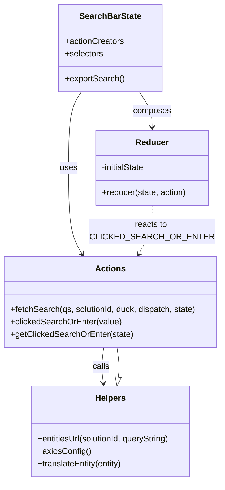

# Diagram: web/portal/src/pages/healthcare/redux/HealthcareSearchBarState.js


> Auto-generated by Obscura crawlers

## Diagram 1



### SVG

<svg id="container" width="426.8671875" xmlns="http://www.w3.org/2000/svg" class="classDiagram" height="922" viewBox="0 0 426.8671875 922" role="graphics-document document" aria-roledescription="class"><style>#container{font-family:"trebuchet ms",verdana,arial,sans-serif;font-size:16px;fill:#333;}@keyframes edge-animation-frame{from{stroke-dashoffset:0;}}@keyframes dash{to{stroke-dashoffset:0;}}#container .edge-animation-slow{stroke-dasharray:9,5!important;stroke-dashoffset:900;animation:dash 50s linear infinite;stroke-linecap:round;}#container .edge-animation-fast{stroke-dasharray:9,5!important;stroke-dashoffset:900;animation:dash 20s linear infinite;stroke-linecap:round;}#container .error-icon{fill:#552222;}#container .error-text{fill:#552222;stroke:#552222;}#container .edge-thickness-normal{stroke-width:1px;}#container .edge-thickness-thick{stroke-width:3.5px;}#container .edge-pattern-solid{stroke-dasharray:0;}#container .edge-thickness-invisible{stroke-width:0;fill:none;}#container .edge-pattern-dashed{stroke-dasharray:3;}#container .edge-pattern-dotted{stroke-dasharray:2;}#container .marker{fill:#333333;stroke:#333333;}#container .marker.cross{stroke:#333333;}#container svg{font-family:"trebuchet ms",verdana,arial,sans-serif;font-size:16px;}#container p{margin:0;}#container g.classGroup text{fill:#9370DB;stroke:none;font-family:"trebuchet ms",verdana,arial,sans-serif;font-size:10px;}#container g.classGroup text .title{font-weight:bolder;}#container .nodeLabel,#container .edgeLabel{color:#131300;}#container .edgeLabel .label rect{fill:#ECECFF;}#container .label text{fill:#131300;}#container .labelBkg{background:#ECECFF;}#container .edgeLabel .label span{background:#ECECFF;}#container .classTitle{font-weight:bolder;}#container .node rect,#container .node circle,#container .node ellipse,#container .node polygon,#container .node path{fill:#ECECFF;stroke:#9370DB;stroke-width:1px;}#container .divider{stroke:#9370DB;stroke-width:1;}#container g.clickable{cursor:pointer;}#container g.classGroup rect{fill:#ECECFF;stroke:#9370DB;}#container g.classGroup line{stroke:#9370DB;stroke-width:1;}#container .classLabel .box{stroke:none;stroke-width:0;fill:#ECECFF;opacity:0.5;}#container .classLabel .label{fill:#9370DB;font-size:10px;}#container .relation{stroke:#333333;stroke-width:1;fill:none;}#container .dashed-line{stroke-dasharray:3;}#container .dotted-line{stroke-dasharray:1 2;}#container #compositionStart,#container .composition{fill:#333333!important;stroke:#333333!important;stroke-width:1;}#container #compositionEnd,#container .composition{fill:#333333!important;stroke:#333333!important;stroke-width:1;}#container #dependencyStart,#container .dependency{fill:#333333!important;stroke:#333333!important;stroke-width:1;}#container #dependencyStart,#container .dependency{fill:#333333!important;stroke:#333333!important;stroke-width:1;}#container #extensionStart,#container .extension{fill:transparent!important;stroke:#333333!important;stroke-width:1;}#container #extensionEnd,#container .extension{fill:transparent!important;stroke:#333333!important;stroke-width:1;}#container #aggregationStart,#container .aggregation{fill:transparent!important;stroke:#333333!important;stroke-width:1;}#container #aggregationEnd,#container .aggregation{fill:transparent!important;stroke:#333333!important;stroke-width:1;}#container #lollipopStart,#container .lollipop{fill:#ECECFF!important;stroke:#333333!important;stroke-width:1;}#container #lollipopEnd,#container .lollipop{fill:#ECECFF!important;stroke:#333333!important;stroke-width:1;}#container .edgeTerminals{font-size:11px;line-height:initial;}#container .classTitleText{text-anchor:middle;font-size:18px;fill:#333;}#container .label-icon{display:inline-block;height:1em;overflow:visible;vertical-align:-0.125em;}#container .node .label-icon path{fill:currentColor;stroke:revert;stroke-width:revert;}#container :root{--mermaid-font-family:"trebuchet ms",verdana,arial,sans-serif;}</style><g><defs><marker id="container_class-aggregationStart" class="marker aggregation class" refX="18" refY="7" markerWidth="190" markerHeight="240" orient="auto"><path d="M 18,7 L9,13 L1,7 L9,1 Z"></path></marker></defs><defs><marker id="container_class-aggregationEnd" class="marker aggregation class" refX="1" refY="7" markerWidth="20" markerHeight="28" orient="auto"><path d="M 18,7 L9,13 L1,7 L9,1 Z"></path></marker></defs><defs><marker id="container_class-extensionStart" class="marker extension class" refX="18" refY="7" markerWidth="190" markerHeight="240" orient="auto"><path d="M 1,7 L18,13 V 1 Z"></path></marker></defs><defs><marker id="container_class-extensionEnd" class="marker extension class" refX="1" refY="7" markerWidth="20" markerHeight="28" orient="auto"><path d="M 1,1 V 13 L18,7 Z"></path></marker></defs><defs><marker id="container_class-compositionStart" class="marker composition class" refX="18" refY="7" markerWidth="190" markerHeight="240" orient="auto"><path d="M 18,7 L9,13 L1,7 L9,1 Z"></path></marker></defs><defs><marker id="container_class-compositionEnd" class="marker composition class" refX="1" refY="7" markerWidth="20" markerHeight="28" orient="auto"><path d="M 18,7 L9,13 L1,7 L9,1 Z"></path></marker></defs><defs><marker id="container_class-dependencyStart" class="marker dependency class" refX="6" refY="7" markerWidth="190" markerHeight="240" orient="auto"><path d="M 5,7 L9,13 L1,7 L9,1 Z"></path></marker></defs><defs><marker id="container_class-dependencyEnd" class="marker dependency class" refX="13" refY="7" markerWidth="20" markerHeight="28" orient="auto"><path d="M 18,7 L9,13 L14,7 L9,1 Z"></path></marker></defs><defs><marker id="container_class-lollipopStart" class="marker lollipop class" refX="13" refY="7" markerWidth="190" markerHeight="240" orient="auto"><circle stroke="black" fill="transparent" cx="7" cy="7" r="6"></circle></marker></defs><defs><marker id="container_class-lollipopEnd" class="marker lollipop class" refX="1" refY="7" markerWidth="190" markerHeight="240" orient="auto"><circle stroke="black" fill="transparent" cx="7" cy="7" r="6"></circle></marker></defs><g class="root"><g class="clusters"></g><g class="edgePaths"><path d="M157.872,176L153.793,182.167C149.714,188.333,141.556,200.667,137.477,225C133.398,249.333,133.398,285.667,133.398,324C133.398,362.333,133.398,402.667,137.697,430.138C141.996,457.61,150.594,472.219,154.893,479.524L159.192,486.829" id="id_SearchBarState_Actions_1" class="edge-thickness-normal edge-pattern-solid relation" style=";;;" data-edge="true" data-et="edge" data-id="id_SearchBarState_Actions_1" data-points="W3sieCI6MTU3Ljg3MTk5NzY3NTYxOTg0LCJ5IjoxNzZ9LHsieCI6MTMzLjM5ODQzNzUsInkiOjIxM30seyJ4IjoxMzMuMzk4NDM3NSwieSI6MzIyfSx7IngiOjEzMy4zOTg0Mzc1LCJ5Ijo0NDN9LHsieCI6MTYyLjIzNDYzMzUwMTgzODIzLCJ5Ijo0OTJ9XQ==" marker-end="url(#container_class-dependencyEnd)"></path><path d="M268.995,176L273.074,182.167C277.153,188.333,285.311,200.667,289.39,212C293.469,223.333,293.469,233.667,293.469,238.833L293.469,244" id="id_SearchBarState_Reducer_2" class="edge-thickness-normal edge-pattern-solid relation" style=";;;" data-edge="true" data-et="edge" data-id="id_SearchBarState_Reducer_2" data-points="W3sieCI6MjY4Ljk5NTE4OTgyNDM4MDIsInkiOjE3Nn0seyJ4IjoyOTMuNDY4NzUsInkiOjIxM30seyJ4IjoyOTMuNDY4NzUsInkiOjI1MH1d" marker-end="url(#container_class-dependencyEnd)"></path><path d="M200.648,666L199.742,672.167C198.836,678.333,197.023,690.667,196.878,702.011C196.733,713.355,198.254,723.709,199.015,728.886L199.776,734.064" id="id_Actions_Helpers_3" class="edge-thickness-normal edge-pattern-solid relation" style=";;;" data-edge="true" data-et="edge" data-id="id_Actions_Helpers_3" data-points="W3sieCI6MjAwLjY0ODM0Mjk5Mzk1MTYyLCJ5Ijo2NjZ9LHsieCI6MTk1LjIxMDkzNzUsInkiOjcwM30seyJ4IjoyMDAuNjQ4MzQyOTkzOTUxNjIsInkiOjc0MH1d" marker-end="url(#container_class-dependencyEnd)"></path><path d="M293.469,394L293.469,402.167C293.469,410.333,293.469,426.667,289.17,442.138C284.871,457.61,276.273,472.219,271.975,479.524L267.676,486.829" id="id_Reducer_Actions_4" class="edge-thickness-normal edge-pattern-dashed relation" style=";;;" data-edge="true" data-et="edge" data-id="id_Reducer_Actions_4" data-points="W3sieCI6MjkzLjQ2ODc1LCJ5IjozOTR9LHsieCI6MjkzLjQ2ODc1LCJ5Ijo0NDN9LHsieCI6MjY0LjYzMjU1Mzk5ODE2MTc3LCJ5Ijo0OTJ9XQ==" marker-end="url(#container_class-dependencyEnd)"></path><path d="M228.727,722.933L229.215,719.611C229.703,716.289,230.68,709.644,230.262,700.156C229.844,690.667,228.031,678.333,227.125,672.167L226.219,666" id="id_Helpers_Actions_5" class="edge-thickness-normal edge-pattern-solid relation" style=";;;" data-edge="true" data-et="edge" data-id="id_Helpers_Actions_5" data-points="W3sieCI6MjI2LjIxODg0NDUwNjA0ODM4LCJ5Ijo3NDB9LHsieCI6MjMxLjY1NjI1LCJ5Ijo3MDN9LHsieCI6MjI2LjIxODg0NDUwNjA0ODM4LCJ5Ijo2NjZ9XQ==" marker-start="url(#container_class-extensionStart)"></path></g><g class="edgeLabels"><g class="edgeLabel" transform="translate(133.3984375, 322)"><g class="label" data-id="id_SearchBarState_Actions_1" transform="translate(-16.4921875, -12)"><foreignObject width="32.984375" height="24"><div xmlns="http://www.w3.org/1999/xhtml" class="labelBkg" style="display: table-cell; white-space: nowrap; line-height: 1.5; max-width: 200px; text-align: center;"><span class="edgeLabel"><p>uses</p></span></div></foreignObject></g></g><g class="edgeLabel" transform="translate(293.46875, 213)"><g class="label" data-id="id_SearchBarState_Reducer_2" transform="translate(-36.453125, -12)"><foreignObject width="72.90625" height="24"><div xmlns="http://www.w3.org/1999/xhtml" class="labelBkg" style="display: table-cell; white-space: nowrap; line-height: 1.5; max-width: 200px; text-align: center;"><span class="edgeLabel"><p>composes</p></span></div></foreignObject></g></g><g class="edgeLabel" transform="translate(195.2109375, 703)"><g class="label" data-id="id_Actions_Helpers_3" transform="translate(-16.4453125, -12)"><foreignObject width="32.890625" height="24"><div xmlns="http://www.w3.org/1999/xhtml" class="labelBkg" style="display: table-cell; white-space: nowrap; line-height: 1.5; max-width: 200px; text-align: center;"><span class="edgeLabel"><p>calls</p></span></div></foreignObject></g></g><g class="edgeLabel" transform="translate(293.46875, 443)"><g class="label" data-id="id_Reducer_Actions_4" transform="translate(-102.421875, -24)"><foreignObject width="204.84375" height="48"><div xmlns="http://www.w3.org/1999/xhtml" class="labelBkg" style="display: table; white-space: break-spaces; line-height: 1.5; max-width: 200px; text-align: center; width: 200px;"><span class="edgeLabel"><p>reacts to CLICKED_SEARCH_OR_ENTER</p></span></div></foreignObject></g></g><g class="edgeLabel"><g class="label" data-id="id_Helpers_Actions_5" transform="translate(0, 0)"><foreignObject width="0" height="0"><div xmlns="http://www.w3.org/1999/xhtml" class="labelBkg" style="display: table-cell; white-space: nowrap; line-height: 1.5; max-width: 200px; text-align: center;"><span class="edgeLabel"></span></div></foreignObject></g></g></g><g class="nodes"><g class="node default" id="classId-SearchBarState-0" transform="translate(213.43359375, 92)"><g class="basic label-container"><path d="M-97.37890625 -84 L97.37890625 -84 L97.37890625 84 L-97.37890625 84" stroke="none" stroke-width="0" fill="#ECECFF" style=""></path><path d="M-97.37890625 -84 C-51.96739514405161 -84, -6.5558840381032155 -84, 97.37890625 -84 M-97.37890625 -84 C-27.001789441454306 -84, 43.37532736709139 -84, 97.37890625 -84 M97.37890625 -84 C97.37890625 -27.077569188378327, 97.37890625 29.844861623243347, 97.37890625 84 M97.37890625 -84 C97.37890625 -36.136475579954066, 97.37890625 11.727048840091868, 97.37890625 84 M97.37890625 84 C41.451775399257684 84, -14.475355451484631 84, -97.37890625 84 M97.37890625 84 C51.15052497722596 84, 4.922143704451926 84, -97.37890625 84 M-97.37890625 84 C-97.37890625 23.74721355815383, -97.37890625 -36.50557288369234, -97.37890625 -84 M-97.37890625 84 C-97.37890625 41.63714942644483, -97.37890625 -0.7257011471103425, -97.37890625 -84" stroke="#9370DB" stroke-width="1.3" fill="none" stroke-dasharray="0 0" style=""></path></g><g class="annotation-group text" transform="translate(0, -60)"></g><g class="label-group text" transform="translate(-56.5546875, -60)"><g class="label" style="font-weight: bolder" transform="translate(0,-12)"><foreignObject width="113.109375" height="24"><div xmlns="http://www.w3.org/1999/xhtml" style="display: table-cell; white-space: nowrap; line-height: 1.5; max-width: 161px; text-align: center;"><span class="nodeLabel markdown-node-label" style=""><p>SearchBarState</p></span></div></foreignObject></g></g><g class="members-group text" transform="translate(-85.37890625, -12)"><g class="label" style="" transform="translate(0,-12)"><foreignObject width="113.078125" height="24"><div xmlns="http://www.w3.org/1999/xhtml" style="display: table-cell; white-space: nowrap; line-height: 1.5; max-width: 170px; text-align: center;"><span class="nodeLabel markdown-node-label" style=""><p>+actionCreators</p></span></div></foreignObject></g><g class="label" style="" transform="translate(0,12)"><foreignObject width="73.453125" height="24"><div xmlns="http://www.w3.org/1999/xhtml" style="display: table-cell; white-space: nowrap; line-height: 1.5; max-width: 131px; text-align: center;"><span class="nodeLabel markdown-node-label" style=""><p>+selectors</p></span></div></foreignObject></g></g><g class="methods-group text" transform="translate(-85.37890625, 60)"><g class="label" style="" transform="translate(0,-12)"><foreignObject width="114.203125" height="24"><div xmlns="http://www.w3.org/1999/xhtml" style="display: table-cell; white-space: nowrap; line-height: 1.5; max-width: 172px; text-align: center;"><span class="nodeLabel markdown-node-label" style=""><p>+exportSearch()</p></span></div></foreignObject></g></g><g class="divider" style=""><path d="M-97.37890625 -36 C-43.83221357028661 -36, 9.714479109426776 -36, 97.37890625 -36 M-97.37890625 -36 C-31.72325484999861 -36, 33.93239655000278 -36, 97.37890625 -36" stroke="#9370DB" stroke-width="1.3" fill="none" stroke-dasharray="0 0" style=""></path></g><g class="divider" style=""><path d="M-97.37890625 36 C-39.95971999935162 36, 17.45946625129676 36, 97.37890625 36 M-97.37890625 36 C-56.386850317662145 36, -15.394794385324289 36, 97.37890625 36" stroke="#9370DB" stroke-width="1.3" fill="none" stroke-dasharray="0 0" style=""></path></g></g><g class="node default" id="classId-Reducer-1" transform="translate(293.46875, 322)"><g class="basic label-container"><path d="M-108.578125 -72 L108.578125 -72 L108.578125 72 L-108.578125 72" stroke="none" stroke-width="0" fill="#ECECFF" style=""></path><path d="M-108.578125 -72 C-40.93364361762882 -72, 26.710837764742365 -72, 108.578125 -72 M-108.578125 -72 C-44.02992573613527 -72, 20.518273527729463 -72, 108.578125 -72 M108.578125 -72 C108.578125 -39.816093054480994, 108.578125 -7.632186108961989, 108.578125 72 M108.578125 -72 C108.578125 -19.027790623998257, 108.578125 33.944418752003486, 108.578125 72 M108.578125 72 C52.73726684396382 72, -3.1035913120723535 72, -108.578125 72 M108.578125 72 C32.1182910862633 72, -44.341542827473404 72, -108.578125 72 M-108.578125 72 C-108.578125 38.56520553909364, -108.578125 5.130411078187279, -108.578125 -72 M-108.578125 72 C-108.578125 20.12017379702278, -108.578125 -31.75965240595444, -108.578125 -72" stroke="#9370DB" stroke-width="1.3" fill="none" stroke-dasharray="0 0" style=""></path></g><g class="annotation-group text" transform="translate(0, -48)"></g><g class="label-group text" transform="translate(-29.90625, -48)"><g class="label" style="font-weight: bolder" transform="translate(0,-12)"><foreignObject width="59.8125" height="24"><div xmlns="http://www.w3.org/1999/xhtml" style="display: table-cell; white-space: nowrap; line-height: 1.5; max-width: 110px; text-align: center;"><span class="nodeLabel markdown-node-label" style=""><p>Reducer</p></span></div></foreignObject></g></g><g class="members-group text" transform="translate(-96.578125, 0)"><g class="label" style="" transform="translate(0,-12)"><foreignObject width="85.71875" height="24"><div xmlns="http://www.w3.org/1999/xhtml" style="display: table-cell; white-space: nowrap; line-height: 1.5; max-width: 143px; text-align: center;"><span class="nodeLabel markdown-node-label" style=""><p>-initialState</p></span></div></foreignObject></g></g><g class="methods-group text" transform="translate(-96.578125, 48)"><g class="label" style="" transform="translate(0,-12)"><foreignObject width="163.25" height="24"><div xmlns="http://www.w3.org/1999/xhtml" style="display: table-cell; white-space: nowrap; line-height: 1.5; max-width: 221px; text-align: center;"><span class="nodeLabel markdown-node-label" style=""><p>+reducer(state, action)</p></span></div></foreignObject></g></g><g class="divider" style=""><path d="M-108.578125 -24 C-43.77648729385689 -24, 21.025150412286223 -24, 108.578125 -24 M-108.578125 -24 C-27.982578011987172 -24, 52.612968976025655 -24, 108.578125 -24" stroke="#9370DB" stroke-width="1.3" fill="none" stroke-dasharray="0 0" style=""></path></g><g class="divider" style=""><path d="M-108.578125 24 C-37.078878890079395 24, 34.42036721984121 24, 108.578125 24 M-108.578125 24 C-28.76766242384474 24, 51.04280015231052 24, 108.578125 24" stroke="#9370DB" stroke-width="1.3" fill="none" stroke-dasharray="0 0" style=""></path></g></g><g class="node default" id="classId-Helpers-2" transform="translate(213.43359375, 827)"><g class="basic label-container"><path d="M-156.84765625 -87 L156.84765625 -87 L156.84765625 87 L-156.84765625 87" stroke="none" stroke-width="0" fill="#ECECFF" style=""></path><path d="M-156.84765625 -87 C-81.25758425315534 -87, -5.667512256310687 -87, 156.84765625 -87 M-156.84765625 -87 C-86.9324018503697 -87, -17.0171474507394 -87, 156.84765625 -87 M156.84765625 -87 C156.84765625 -52.034657626040655, 156.84765625 -17.06931525208131, 156.84765625 87 M156.84765625 -87 C156.84765625 -32.00984068139685, 156.84765625 22.980318637206295, 156.84765625 87 M156.84765625 87 C91.87502668682009 87, 26.902397123640185 87, -156.84765625 87 M156.84765625 87 C68.55771861559407 87, -19.73221901881186 87, -156.84765625 87 M-156.84765625 87 C-156.84765625 48.88308243907235, -156.84765625 10.766164878144707, -156.84765625 -87 M-156.84765625 87 C-156.84765625 38.131932568814115, -156.84765625 -10.73613486237177, -156.84765625 -87" stroke="#9370DB" stroke-width="1.3" fill="none" stroke-dasharray="0 0" style=""></path></g><g class="annotation-group text" transform="translate(0, -63)"></g><g class="label-group text" transform="translate(-28.2890625, -63)"><g class="label" style="font-weight: bolder" transform="translate(0,-12)"><foreignObject width="56.578125" height="24"><div xmlns="http://www.w3.org/1999/xhtml" style="display: table-cell; white-space: nowrap; line-height: 1.5; max-width: 106px; text-align: center;"><span class="nodeLabel markdown-node-label" style=""><p>Helpers</p></span></div></foreignObject></g></g><g class="members-group text" transform="translate(-144.84765625, -15)"></g><g class="methods-group text" transform="translate(-144.84765625, 15)"><g class="label" style="" transform="translate(0,-12)"><foreignObject width="261.40625" height="24"><div xmlns="http://www.w3.org/1999/xhtml" style="display: table-cell; white-space: nowrap; line-height: 1.5; max-width: 319px; text-align: center;"><span class="nodeLabel markdown-node-label" style=""><p>+entitiesUrl(solutionId, queryString)</p></span></div></foreignObject></g><g class="label" style="" transform="translate(0,12)"><foreignObject width="100.796875" height="24"><div xmlns="http://www.w3.org/1999/xhtml" style="display: table-cell; white-space: nowrap; line-height: 1.5; max-width: 158px; text-align: center;"><span class="nodeLabel markdown-node-label" style=""><p>+axiosConfig()</p></span></div></foreignObject></g><g class="label" style="" transform="translate(0,36)"><foreignObject width="166.375" height="24"><div xmlns="http://www.w3.org/1999/xhtml" style="display: table-cell; white-space: nowrap; line-height: 1.5; max-width: 224px; text-align: center;"><span class="nodeLabel markdown-node-label" style=""><p>+translateEntity(entity)</p></span></div></foreignObject></g></g><g class="divider" style=""><path d="M-156.84765625 -39 C-82.8984332034069 -39, -8.949210156813791 -39, 156.84765625 -39 M-156.84765625 -39 C-48.8379872863304 -39, 59.171681677339194 -39, 156.84765625 -39" stroke="#9370DB" stroke-width="1.3" fill="none" stroke-dasharray="0 0" style=""></path></g><g class="divider" style=""><path d="M-156.84765625 -15 C-51.06861756650319 -15, 54.710421116993615 -15, 156.84765625 -15 M-156.84765625 -15 C-45.403067347272426 -15, 66.04152155545515 -15, 156.84765625 -15" stroke="#9370DB" stroke-width="1.3" fill="none" stroke-dasharray="0 0" style=""></path></g></g><g class="node default" id="classId-Actions-3" transform="translate(213.43359375, 579)"><g class="basic label-container"><path d="M-205.43359375 -87 L205.43359375 -87 L205.43359375 87 L-205.43359375 87" stroke="none" stroke-width="0" fill="#ECECFF" style=""></path><path d="M-205.43359375 -87 C-121.49853945474179 -87, -37.56348515948358 -87, 205.43359375 -87 M-205.43359375 -87 C-102.8485744067021 -87, -0.26355506340419765 -87, 205.43359375 -87 M205.43359375 -87 C205.43359375 -51.14055849080813, 205.43359375 -15.281116981616265, 205.43359375 87 M205.43359375 -87 C205.43359375 -25.69400263100932, 205.43359375 35.61199473798136, 205.43359375 87 M205.43359375 87 C41.652250775900825 87, -122.12909219819835 87, -205.43359375 87 M205.43359375 87 C115.95553196855441 87, 26.47747018710882 87, -205.43359375 87 M-205.43359375 87 C-205.43359375 51.129175844330575, -205.43359375 15.25835168866115, -205.43359375 -87 M-205.43359375 87 C-205.43359375 20.04407333440173, -205.43359375 -46.91185333119654, -205.43359375 -87" stroke="#9370DB" stroke-width="1.3" fill="none" stroke-dasharray="0 0" style=""></path></g><g class="annotation-group text" transform="translate(0, -63)"></g><g class="label-group text" transform="translate(-27.0546875, -63)"><g class="label" style="font-weight: bolder" transform="translate(0,-12)"><foreignObject width="54.109375" height="24"><div xmlns="http://www.w3.org/1999/xhtml" style="display: table-cell; white-space: nowrap; line-height: 1.5; max-width: 103px; text-align: center;"><span class="nodeLabel markdown-node-label" style=""><p>Actions</p></span></div></foreignObject></g></g><g class="members-group text" transform="translate(-193.43359375, -15)"></g><g class="methods-group text" transform="translate(-193.43359375, 15)"><g class="label" style="" transform="translate(0,-12)"><foreignObject width="359.8125" height="24"><div xmlns="http://www.w3.org/1999/xhtml" style="display: table-cell; white-space: nowrap; line-height: 1.5; max-width: 417px; text-align: center;"><span class="nodeLabel markdown-node-label" style=""><p>+fetchSearch(qs, solutionId, duck, dispatch, state)</p></span></div></foreignObject></g><g class="label" style="" transform="translate(0,12)"><foreignObject width="212.234375" height="24"><div xmlns="http://www.w3.org/1999/xhtml" style="display: table-cell; white-space: nowrap; line-height: 1.5; max-width: 270px; text-align: center;"><span class="nodeLabel markdown-node-label" style=""><p>+clickedSearchOrEnter(value)</p></span></div></foreignObject></g><g class="label" style="" transform="translate(0,36)"><foreignObject width="233.15625" height="24"><div xmlns="http://www.w3.org/1999/xhtml" style="display: table-cell; white-space: nowrap; line-height: 1.5; max-width: 291px; text-align: center;"><span class="nodeLabel markdown-node-label" style=""><p>+getClickedSearchOrEnter(state)</p></span></div></foreignObject></g></g><g class="divider" style=""><path d="M-205.43359375 -39 C-102.58552216046427 -39, 0.26254942907146983 -39, 205.43359375 -39 M-205.43359375 -39 C-117.2662860460415 -39, -29.098978342083 -39, 205.43359375 -39" stroke="#9370DB" stroke-width="1.3" fill="none" stroke-dasharray="0 0" style=""></path></g><g class="divider" style=""><path d="M-205.43359375 -15 C-106.39002245978416 -15, -7.346451169568326 -15, 205.43359375 -15 M-205.43359375 -15 C-73.58992469354143 -15, 58.25374436291713 -15, 205.43359375 -15" stroke="#9370DB" stroke-width="1.3" fill="none" stroke-dasharray="0 0" style=""></path></g></g></g></g></g></svg>

## Diagram 2

```mermaid
flowchart TD
  U[User triggers search or enter] -->|click/search| Check{hasSearchCriteria?}
  Check -- No --> Err[dispatch REQUEST_ERROR: "Search text or filter(s) must be specified"]
  Check -- Yes --> Url[entitiesUrl(solutionId, qs)]
  Url --> Config[axiosConfig() -> headers with x-time-zone, Accept]
  Config --> Fetch[duck.fetch(url, config, transformResponse)]
  Fetch --> Map[transformResponse: response.data.map(translateEntity)]
  Map --> Result[dispatch success with translated entities]
  U --> ClickAction[clickedSearchOrEnter(value)]
  ClickAction --> DispatchClick[dispatch { type: CLICKED_SEARCH_OR_ENTER, payload: value }]
  State[store: healthcareSearch.clickedSearchOrEnter] -->|selector|getClicked[getClickedSearchOrEnter(state)]
```

> SVG rendering failed for this diagram.
