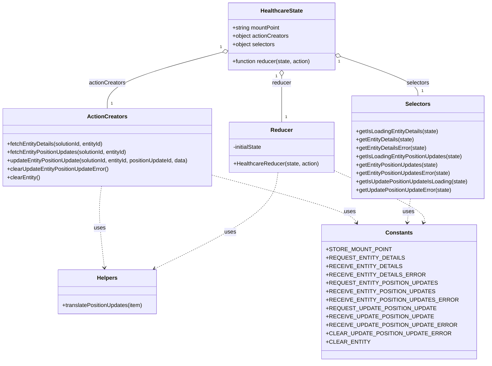

# Diagram: web/portal/src/pages/healthcare/redux/HealthcareState.js


> Auto-generated by Obscura crawlers

## Diagram 1



### SVG

<svg id="container" width="1411.609375" xmlns="http://www.w3.org/2000/svg" class="classDiagram" height="1034" viewBox="0 0 1411.609375 1034" role="graphics-document document" aria-roledescription="class"><style>#container{font-family:"trebuchet ms",verdana,arial,sans-serif;font-size:16px;fill:#333;}@keyframes edge-animation-frame{from{stroke-dashoffset:0;}}@keyframes dash{to{stroke-dashoffset:0;}}#container .edge-animation-slow{stroke-dasharray:9,5!important;stroke-dashoffset:900;animation:dash 50s linear infinite;stroke-linecap:round;}#container .edge-animation-fast{stroke-dasharray:9,5!important;stroke-dashoffset:900;animation:dash 20s linear infinite;stroke-linecap:round;}#container .error-icon{fill:#552222;}#container .error-text{fill:#552222;stroke:#552222;}#container .edge-thickness-normal{stroke-width:1px;}#container .edge-thickness-thick{stroke-width:3.5px;}#container .edge-pattern-solid{stroke-dasharray:0;}#container .edge-thickness-invisible{stroke-width:0;fill:none;}#container .edge-pattern-dashed{stroke-dasharray:3;}#container .edge-pattern-dotted{stroke-dasharray:2;}#container .marker{fill:#333333;stroke:#333333;}#container .marker.cross{stroke:#333333;}#container svg{font-family:"trebuchet ms",verdana,arial,sans-serif;font-size:16px;}#container p{margin:0;}#container g.classGroup text{fill:#9370DB;stroke:none;font-family:"trebuchet ms",verdana,arial,sans-serif;font-size:10px;}#container g.classGroup text .title{font-weight:bolder;}#container .nodeLabel,#container .edgeLabel{color:#131300;}#container .edgeLabel .label rect{fill:#ECECFF;}#container .label text{fill:#131300;}#container .labelBkg{background:#ECECFF;}#container .edgeLabel .label span{background:#ECECFF;}#container .classTitle{font-weight:bolder;}#container .node rect,#container .node circle,#container .node ellipse,#container .node polygon,#container .node path{fill:#ECECFF;stroke:#9370DB;stroke-width:1px;}#container .divider{stroke:#9370DB;stroke-width:1;}#container g.clickable{cursor:pointer;}#container g.classGroup rect{fill:#ECECFF;stroke:#9370DB;}#container g.classGroup line{stroke:#9370DB;stroke-width:1;}#container .classLabel .box{stroke:none;stroke-width:0;fill:#ECECFF;opacity:0.5;}#container .classLabel .label{fill:#9370DB;font-size:10px;}#container .relation{stroke:#333333;stroke-width:1;fill:none;}#container .dashed-line{stroke-dasharray:3;}#container .dotted-line{stroke-dasharray:1 2;}#container #compositionStart,#container .composition{fill:#333333!important;stroke:#333333!important;stroke-width:1;}#container #compositionEnd,#container .composition{fill:#333333!important;stroke:#333333!important;stroke-width:1;}#container #dependencyStart,#container .dependency{fill:#333333!important;stroke:#333333!important;stroke-width:1;}#container #dependencyStart,#container .dependency{fill:#333333!important;stroke:#333333!important;stroke-width:1;}#container #extensionStart,#container .extension{fill:transparent!important;stroke:#333333!important;stroke-width:1;}#container #extensionEnd,#container .extension{fill:transparent!important;stroke:#333333!important;stroke-width:1;}#container #aggregationStart,#container .aggregation{fill:transparent!important;stroke:#333333!important;stroke-width:1;}#container #aggregationEnd,#container .aggregation{fill:transparent!important;stroke:#333333!important;stroke-width:1;}#container #lollipopStart,#container .lollipop{fill:#ECECFF!important;stroke:#333333!important;stroke-width:1;}#container #lollipopEnd,#container .lollipop{fill:#ECECFF!important;stroke:#333333!important;stroke-width:1;}#container .edgeTerminals{font-size:11px;line-height:initial;}#container .classTitleText{text-anchor:middle;font-size:18px;fill:#333;}#container .label-icon{display:inline-block;height:1em;overflow:visible;vertical-align:-0.125em;}#container .node .label-icon path{fill:currentColor;stroke:revert;stroke-width:revert;}#container :root{--mermaid-font-family:"trebuchet ms",verdana,arial,sans-serif;}</style><g><defs><marker id="container_class-aggregationStart" class="marker aggregation class" refX="18" refY="7" markerWidth="190" markerHeight="240" orient="auto"><path d="M 18,7 L9,13 L1,7 L9,1 Z"></path></marker></defs><defs><marker id="container_class-aggregationEnd" class="marker aggregation class" refX="1" refY="7" markerWidth="20" markerHeight="28" orient="auto"><path d="M 18,7 L9,13 L1,7 L9,1 Z"></path></marker></defs><defs><marker id="container_class-extensionStart" class="marker extension class" refX="18" refY="7" markerWidth="190" markerHeight="240" orient="auto"><path d="M 1,7 L18,13 V 1 Z"></path></marker></defs><defs><marker id="container_class-extensionEnd" class="marker extension class" refX="1" refY="7" markerWidth="20" markerHeight="28" orient="auto"><path d="M 1,1 V 13 L18,7 Z"></path></marker></defs><defs><marker id="container_class-compositionStart" class="marker composition class" refX="18" refY="7" markerWidth="190" markerHeight="240" orient="auto"><path d="M 18,7 L9,13 L1,7 L9,1 Z"></path></marker></defs><defs><marker id="container_class-compositionEnd" class="marker composition class" refX="1" refY="7" markerWidth="20" markerHeight="28" orient="auto"><path d="M 18,7 L9,13 L1,7 L9,1 Z"></path></marker></defs><defs><marker id="container_class-dependencyStart" class="marker dependency class" refX="6" refY="7" markerWidth="190" markerHeight="240" orient="auto"><path d="M 5,7 L9,13 L1,7 L9,1 Z"></path></marker></defs><defs><marker id="container_class-dependencyEnd" class="marker dependency class" refX="13" refY="7" markerWidth="20" markerHeight="28" orient="auto"><path d="M 18,7 L9,13 L14,7 L9,1 Z"></path></marker></defs><defs><marker id="container_class-lollipopStart" class="marker lollipop class" refX="13" refY="7" markerWidth="190" markerHeight="240" orient="auto"><circle stroke="black" fill="transparent" cx="7" cy="7" r="6"></circle></marker></defs><defs><marker id="container_class-lollipopEnd" class="marker lollipop class" refX="1" refY="7" markerWidth="190" markerHeight="240" orient="auto"><circle stroke="black" fill="transparent" cx="7" cy="7" r="6"></circle></marker></defs><g class="root"><g class="clusters"></g><g class="edgePaths"><path d="M650.631,149.129L594.781,163.775C538.931,178.42,427.231,207.71,371.381,234.522C315.531,261.333,315.531,285.667,315.531,297.833L315.531,310" id="id_HealthcareState_ActionCreators_1" class="edge-thickness-normal edge-pattern-solid relation" style=";;;" data-edge="true" data-et="edge" data-id="id_HealthcareState_ActionCreators_1" data-points="W3sieCI6NjY3LjMxNjQwNjI1LCJ5IjoxNDQuNzU0MDY2NDE4MTYzMzV9LHsieCI6MzE1LjUzMTI1LCJ5IjoyMzd9LHsieCI6MzE1LjUzMTI1LCJ5IjozMTB9XQ==" marker-start="url(#container_class-aggregationStart)"></path><path d="M994.48,162.529L1030.902,174.941C1067.323,187.352,1140.165,212.176,1176.587,230.755C1213.008,249.333,1213.008,261.667,1213.008,267.833L1213.008,274" id="id_HealthcareState_Selectors_2" class="edge-thickness-normal edge-pattern-solid relation" style=";;;" data-edge="true" data-et="edge" data-id="id_HealthcareState_Selectors_2" data-points="W3sieCI6OTc4LjE1MjM0Mzc1LCJ5IjoxNTYuOTY0Mzc3OTQwMTQ2MTR9LHsieCI6MTIxMy4wMDc4MTI1LCJ5IjoyMzd9LHsieCI6MTIxMy4wMDc4MTI1LCJ5IjoyNzR9XQ==" marker-start="url(#container_class-aggregationStart)"></path><path d="M822.734,217.25L822.734,220.542C822.734,223.833,822.734,230.417,822.734,252.375C822.734,274.333,822.734,311.667,822.734,330.333L822.734,349" id="id_HealthcareState_Reducer_3" class="edge-thickness-normal edge-pattern-solid relation" style=";;;" data-edge="true" data-et="edge" data-id="id_HealthcareState_Reducer_3" data-points="W3sieCI6ODIyLjczNDM3NSwieSI6MjAwfSx7IngiOjgyMi43MzQzNzUsInkiOjIzN30seyJ4Ijo4MjIuNzM0Mzc1LCJ5IjozNDl9XQ==" marker-start="url(#container_class-aggregationStart)"></path><path d="M299.55,532L297.798,544.167C296.046,556.333,292.543,580.667,293.877,619.507C295.211,658.347,301.382,711.693,304.468,738.366L307.553,765.04" id="id_ActionCreators_Helpers_4" class="edge-thickness-normal edge-pattern-dashed relation" style=";;;" data-edge="true" data-et="edge" data-id="id_ActionCreators_Helpers_4" data-points="W3sieCI6Mjk5LjU0OTU0OTkzMjA2NTIsInkiOjUzMn0seyJ4IjoyODkuMDM5MDYyNSwieSI6NjA1fSx7IngiOjMwOC4yNDMwMDYyNzcyOTI2LCJ5Ijo3NzF9XQ==" marker-end="url(#container_class-dependencyEnd)"></path><path d="M623.063,501.567L688.864,518.806C754.665,536.045,886.268,570.522,955.37,593.078C1024.472,615.634,1031.073,626.268,1034.374,631.585L1037.675,636.902" id="id_ActionCreators_Constants_5" class="edge-thickness-normal edge-pattern-dashed relation" style=";;;" data-edge="true" data-et="edge" data-id="id_ActionCreators_Constants_5" data-points="W3sieCI6NjIzLjA2MjUsInkiOjUwMS41Njc0NzgxMjgzNTQ0fSx7IngiOjEwMTcuODcxMDkzNzUsInkiOjYwNX0seyJ4IjoxMDQwLjgzODkzOTY4MzQwNjEsInkiOjY0Mn1d" marker-end="url(#container_class-dependencyEnd)"></path><path d="M1191.843,568L1190.955,574.167C1190.067,580.333,1188.291,592.667,1186.805,604.007C1185.319,615.347,1184.122,625.693,1183.523,630.866L1182.925,636.04" id="id_Selectors_Constants_6" class="edge-thickness-normal edge-pattern-dashed relation" style=";;;" data-edge="true" data-et="edge" data-id="id_Selectors_Constants_6" data-points="W3sieCI6MTE5MS44NDI4NTgzNTU5NzgzLCJ5Ijo1Njh9LHsieCI6MTE4Ni41MTU2MjUsInkiOjYwNX0seyJ4IjoxMTgyLjIzNTIyNzg5MzAxMzIsInkiOjY0Mn1d" marker-end="url(#container_class-dependencyEnd)"></path><path d="M972.406,487.079L1016.922,506.733C1061.438,526.386,1150.469,565.693,1193.172,590.569C1235.875,615.444,1232.251,625.888,1230.438,631.11L1228.626,636.332" id="id_Reducer_Constants_7" class="edge-thickness-normal edge-pattern-dashed relation" style=";;;" data-edge="true" data-et="edge" data-id="id_Reducer_Constants_7" data-points="W3sieCI6OTcyLjQwNjI1LCJ5Ijo0ODcuMDc5NDA2MTQxMDQxNX0seyJ4IjoxMjM5LjUsInkiOjYwNX0seyJ4IjoxMjI2LjY1ODgwODY3OTAzOTMsInkiOjY0Mn1d" marker-end="url(#container_class-dependencyEnd)"></path><path d="M812.368,493L809.68,511.667C806.993,530.333,801.617,567.667,741.755,613.57C681.893,659.473,567.545,713.946,510.37,741.183L453.196,768.42" id="id_Reducer_Helpers_8" class="edge-thickness-normal edge-pattern-dashed relation" style=";;;" data-edge="true" data-et="edge" data-id="id_Reducer_Helpers_8" data-points="W3sieCI6ODEyLjM2Nzg2Njg0NzgyNjEsInkiOjQ5M30seyJ4Ijo3OTYuMjQyMTg3NSwieSI6NjA1fSx7IngiOjQ0Ny43NzkyMzcxNzI0ODkwNSwieSI6NzcxfV0=" marker-end="url(#container_class-dependencyEnd)"></path></g><g class="edgeLabels"><g class="edgeLabel" transform="translate(315.53125, 237)"><g class="label" data-id="id_HealthcareState_ActionCreators_1" transform="translate(-52.671875, -12)"><foreignObject width="105.34375" height="24"><div xmlns="http://www.w3.org/1999/xhtml" class="labelBkg" style="display: table-cell; white-space: nowrap; line-height: 1.5; max-width: 200px; text-align: center;"><span class="edgeLabel"><p>actionCreators</p></span></div></foreignObject></g></g><g class="edgeLabel" transform="translate(1213.0078125, 237)"><g class="label" data-id="id_HealthcareState_Selectors_2" transform="translate(-32.734375, -12)"><foreignObject width="65.46875" height="24"><div xmlns="http://www.w3.org/1999/xhtml" class="labelBkg" style="display: table-cell; white-space: nowrap; line-height: 1.5; max-width: 200px; text-align: center;"><span class="edgeLabel"><p>selectors</p></span></div></foreignObject></g></g><g class="edgeLabel" transform="translate(822.734375, 237)"><g class="label" data-id="id_HealthcareState_Reducer_3" transform="translate(-27.765625, -12)"><foreignObject width="55.53125" height="24"><div xmlns="http://www.w3.org/1999/xhtml" class="labelBkg" style="display: table-cell; white-space: nowrap; line-height: 1.5; max-width: 200px; text-align: center;"><span class="edgeLabel"><p>reducer</p></span></div></foreignObject></g></g><g class="edgeLabel" transform="translate(294.4032, 651.36793)"><g class="label" data-id="id_ActionCreators_Helpers_4" transform="translate(-16.4921875, -12)"><foreignObject width="32.984375" height="24"><div xmlns="http://www.w3.org/1999/xhtml" class="labelBkg" style="display: table-cell; white-space: nowrap; line-height: 1.5; max-width: 200px; text-align: center;"><span class="edgeLabel"><p>uses</p></span></div></foreignObject></g></g><g class="edgeLabel" transform="translate(841.53048, 558.80203)"><g class="label" data-id="id_ActionCreators_Constants_5" transform="translate(-16.4921875, -12)"><foreignObject width="32.984375" height="24"><div xmlns="http://www.w3.org/1999/xhtml" class="labelBkg" style="display: table-cell; white-space: nowrap; line-height: 1.5; max-width: 200px; text-align: center;"><span class="edgeLabel"><p>uses</p></span></div></foreignObject></g></g><g class="edgeLabel" transform="translate(1186.515625, 605)"><g class="label" data-id="id_Selectors_Constants_6" transform="translate(-16.4921875, -12)"><foreignObject width="32.984375" height="24"><div xmlns="http://www.w3.org/1999/xhtml" class="labelBkg" style="display: table-cell; white-space: nowrap; line-height: 1.5; max-width: 200px; text-align: center;"><span class="edgeLabel"><p>uses</p></span></div></foreignObject></g></g><g class="edgeLabel" transform="translate(1123.86739, 553.94876)"><g class="label" data-id="id_Reducer_Constants_7" transform="translate(-16.4921875, -12)"><foreignObject width="32.984375" height="24"><div xmlns="http://www.w3.org/1999/xhtml" class="labelBkg" style="display: table-cell; white-space: nowrap; line-height: 1.5; max-width: 200px; text-align: center;"><span class="edgeLabel"><p>uses</p></span></div></foreignObject></g></g><g class="edgeLabel" transform="translate(673.08856, 663.66765)"><g class="label" data-id="id_Reducer_Helpers_8" transform="translate(-16.4921875, -12)"><foreignObject width="32.984375" height="24"><div xmlns="http://www.w3.org/1999/xhtml" class="labelBkg" style="display: table-cell; white-space: nowrap; line-height: 1.5; max-width: 200px; text-align: center;"><span class="edgeLabel"><p>uses</p></span></div></foreignObject></g></g><g class="edgeTerminals" transform="translate(646.5840083192405, 134.68343538200958)"><g class="inner" transform="translate(0, 0)"><foreignObject style="width: 9px; height: 12px;"><div xmlns="http://www.w3.org/1999/xhtml" style="display: inline-block; padding-right: 1px; white-space: nowrap;"><span class="edgeLabel">1</span></div></foreignObject></g></g><g class="edgeTerminals" transform="translate(989.8783410630173, 176.8075378694266)"><g class="inner" transform="translate(0, 0)"><foreignObject style="width: 9px; height: 12px;"><div xmlns="http://www.w3.org/1999/xhtml" style="display: inline-block; padding-right: 1px; white-space: nowrap;"><span class="edgeLabel">1</span></div></foreignObject></g></g><g class="edgeTerminals" transform="translate(807.7343775, 217.50000214285714)"><g class="inner" transform="translate(0, 0)"><foreignObject style="width: 9px; height: 12px;"><div xmlns="http://www.w3.org/1999/xhtml" style="display: inline-block; padding-right: 1px; white-space: nowrap;"><span class="edgeLabel">1</span></div></foreignObject></g></g><g class="edgeTerminals" transform="translate(325.53125, 287.5)"><g class="inner" transform="translate(0, 0)"></g><foreignObject style="width: 9px; height: 12px;"><div xmlns="http://www.w3.org/1999/xhtml" style="display: inline-block; padding-right: 1px; white-space: nowrap;"><span class="edgeLabel">1</span></div></foreignObject></g><g class="edgeTerminals" transform="translate(1223.00781125, 251.49999892857147)"><g class="inner" transform="translate(0, 0)"></g><foreignObject style="width: 9px; height: 12px;"><div xmlns="http://www.w3.org/1999/xhtml" style="display: inline-block; padding-right: 1px; white-space: nowrap;"><span class="edgeLabel">1</span></div></foreignObject></g><g class="edgeTerminals" transform="translate(832.7343774999998, 326.5000021428571)"><g class="inner" transform="translate(0, 0)"></g><foreignObject style="width: 9px; height: 12px;"><div xmlns="http://www.w3.org/1999/xhtml" style="display: inline-block; padding-right: 1px; white-space: nowrap;"><span class="edgeLabel">1</span></div></foreignObject></g></g><g class="nodes"><g class="node default" id="classId-HealthcareState-0" transform="translate(822.734375, 104)"><g class="basic label-container"><path d="M-155.41796875 -96 L155.41796875 -96 L155.41796875 96 L-155.41796875 96" stroke="none" stroke-width="0" fill="#ECECFF" style=""></path><path d="M-155.41796875 -96 C-82.62192899837875 -96, -9.825889246757498 -96, 155.41796875 -96 M-155.41796875 -96 C-77.72473922235862 -96, -0.03150969471724352 -96, 155.41796875 -96 M155.41796875 -96 C155.41796875 -47.35968883161304, 155.41796875 1.2806223367739165, 155.41796875 96 M155.41796875 -96 C155.41796875 -21.209158449970033, 155.41796875 53.581683100059934, 155.41796875 96 M155.41796875 96 C48.913215104015194 96, -57.59153854196961 96, -155.41796875 96 M155.41796875 96 C58.26070497481203 96, -38.89655880037594 96, -155.41796875 96 M-155.41796875 96 C-155.41796875 37.71250235556654, -155.41796875 -20.574995288866916, -155.41796875 -96 M-155.41796875 96 C-155.41796875 53.825398051737736, -155.41796875 11.650796103475471, -155.41796875 -96" stroke="#9370DB" stroke-width="1.3" fill="none" stroke-dasharray="0 0" style=""></path></g><g class="annotation-group text" transform="translate(0, -72)"></g><g class="label-group text" transform="translate(-58.8828125, -72)"><g class="label" style="font-weight: bolder" transform="translate(0,-12)"><foreignObject width="117.765625" height="24"><div xmlns="http://www.w3.org/1999/xhtml" style="display: table-cell; white-space: nowrap; line-height: 1.5; max-width: 166px; text-align: center;"><span class="nodeLabel markdown-node-label" style=""><p>HealthcareState</p></span></div></foreignObject></g></g><g class="members-group text" transform="translate(-143.41796875, -24)"><g class="label" style="" transform="translate(0,-12)"><foreignObject width="139.203125" height="24"><div xmlns="http://www.w3.org/1999/xhtml" style="display: table-cell; white-space: nowrap; line-height: 1.5; max-width: 197px; text-align: center;"><span class="nodeLabel markdown-node-label" style=""><p>+string mountPoint</p></span></div></foreignObject></g><g class="label" style="" transform="translate(0,12)"><foreignObject width="163.03125" height="24"><div xmlns="http://www.w3.org/1999/xhtml" style="display: table-cell; white-space: nowrap; line-height: 1.5; max-width: 220px; text-align: center;"><span class="nodeLabel markdown-node-label" style=""><p>+object actionCreators</p></span></div></foreignObject></g><g class="label" style="" transform="translate(0,36)"><foreignObject width="123.15625" height="24"><div xmlns="http://www.w3.org/1999/xhtml" style="display: table-cell; white-space: nowrap; line-height: 1.5; max-width: 181px; text-align: center;"><span class="nodeLabel markdown-node-label" style=""><p>+object selectors</p></span></div></foreignObject></g></g><g class="methods-group text" transform="translate(-143.41796875, 72)"><g class="label" style="" transform="translate(0,-12)"><foreignObject width="227.953125" height="24"><div xmlns="http://www.w3.org/1999/xhtml" style="display: table-cell; white-space: nowrap; line-height: 1.5; max-width: 285px; text-align: center;"><span class="nodeLabel markdown-node-label" style=""><p>+function reducer(state, action)</p></span></div></foreignObject></g></g><g class="divider" style=""><path d="M-155.41796875 -48 C-65.30930503121392 -48, 24.799358687572152 -48, 155.41796875 -48 M-155.41796875 -48 C-63.802187339895426 -48, 27.81359407020915 -48, 155.41796875 -48" stroke="#9370DB" stroke-width="1.3" fill="none" stroke-dasharray="0 0" style=""></path></g><g class="divider" style=""><path d="M-155.41796875 48 C-74.57283594979378 48, 6.272296850412431 48, 155.41796875 48 M-155.41796875 48 C-66.11306327225653 48, 23.19184220548695 48, 155.41796875 48" stroke="#9370DB" stroke-width="1.3" fill="none" stroke-dasharray="0 0" style=""></path></g></g><g class="node default" id="classId-ActionCreators-1" transform="translate(315.53125, 421)"><g class="basic label-container"><path d="M-307.53125 -111 L307.53125 -111 L307.53125 111 L-307.53125 111" stroke="none" stroke-width="0" fill="#ECECFF" style=""></path><path d="M-307.53125 -111 C-173.9998053843325 -111, -40.46836076866498 -111, 307.53125 -111 M-307.53125 -111 C-91.24697988367402 -111, 125.03729023265197 -111, 307.53125 -111 M307.53125 -111 C307.53125 -60.1442232822295, 307.53125 -9.288446564458994, 307.53125 111 M307.53125 -111 C307.53125 -28.651521652784055, 307.53125 53.69695669443189, 307.53125 111 M307.53125 111 C104.13889541686885 111, -99.2534591662623 111, -307.53125 111 M307.53125 111 C135.5119995742555 111, -36.507250851489005 111, -307.53125 111 M-307.53125 111 C-307.53125 26.10452123829215, -307.53125 -58.7909575234157, -307.53125 -111 M-307.53125 111 C-307.53125 65.91265085480376, -307.53125 20.8253017096075, -307.53125 -111" stroke="#9370DB" stroke-width="1.3" fill="none" stroke-dasharray="0 0" style=""></path></g><g class="annotation-group text" transform="translate(0, -87)"></g><g class="label-group text" transform="translate(-53.96875, -87)"><g class="label" style="font-weight: bolder" transform="translate(0,-12)"><foreignObject width="107.9375" height="24"><div xmlns="http://www.w3.org/1999/xhtml" style="display: table-cell; white-space: nowrap; line-height: 1.5; max-width: 156px; text-align: center;"><span class="nodeLabel markdown-node-label" style=""><p>ActionCreators</p></span></div></foreignObject></g></g><g class="members-group text" transform="translate(-295.53125, -39)"></g><g class="methods-group text" transform="translate(-295.53125, -9)"><g class="label" style="" transform="translate(0,-12)"><foreignObject width="284.734375" height="24"><div xmlns="http://www.w3.org/1999/xhtml" style="display: table-cell; white-space: nowrap; line-height: 1.5; max-width: 342px; text-align: center;"><span class="nodeLabel markdown-node-label" style=""><p>+fetchEntityDetails(solutionId, entityId)</p></span></div></foreignObject></g><g class="label" style="" transform="translate(0,12)"><foreignObject width="353.90625" height="24"><div xmlns="http://www.w3.org/1999/xhtml" style="display: table-cell; white-space: nowrap; line-height: 1.5; max-width: 411px; text-align: center;"><span class="nodeLabel markdown-node-label" style=""><p>+fetchEntityPositionUpdates(solutionId, entityId)</p></span></div></foreignObject></g><g class="label" style="" transform="translate(0,36)"><foreignObject width="537.09375" height="24"><div xmlns="http://www.w3.org/1999/xhtml" style="display: table-cell; white-space: nowrap; line-height: 1.5; max-width: 594px; text-align: center;"><span class="nodeLabel markdown-node-label" style=""><p>+updateEntityPositionUpdate(solutionId, entityId, positionUpdateId, data)</p></span></div></foreignObject></g><g class="label" style="" transform="translate(0,60)"><foreignObject width="295.875" height="24"><div xmlns="http://www.w3.org/1999/xhtml" style="display: table-cell; white-space: nowrap; line-height: 1.5; max-width: 353px; text-align: center;"><span class="nodeLabel markdown-node-label" style=""><p>+clearUpdateEntityPositionUpdateError()</p></span></div></foreignObject></g><g class="label" style="" transform="translate(0,84)"><foreignObject width="95.6875" height="24"><div xmlns="http://www.w3.org/1999/xhtml" style="display: table-cell; white-space: nowrap; line-height: 1.5; max-width: 153px; text-align: center;"><span class="nodeLabel markdown-node-label" style=""><p>+clearEntity()</p></span></div></foreignObject></g></g><g class="divider" style=""><path d="M-307.53125 -63 C-163.1872831620394 -63, -18.843316324078785 -63, 307.53125 -63 M-307.53125 -63 C-130.15014937183923 -63, 47.23095125632153 -63, 307.53125 -63" stroke="#9370DB" stroke-width="1.3" fill="none" stroke-dasharray="0 0" style=""></path></g><g class="divider" style=""><path d="M-307.53125 -39 C-184.10308506146487 -39, -60.67492012292976 -39, 307.53125 -39 M-307.53125 -39 C-92.65642166705746 -39, 122.21840666588508 -39, 307.53125 -39" stroke="#9370DB" stroke-width="1.3" fill="none" stroke-dasharray="0 0" style=""></path></g></g><g class="node default" id="classId-Selectors-2" transform="translate(1213.0078125, 421)"><g class="basic label-container"><path d="M-190.6015625 -147 L190.6015625 -147 L190.6015625 147 L-190.6015625 147" stroke="none" stroke-width="0" fill="#ECECFF" style=""></path><path d="M-190.6015625 -147 C-82.61841165141223 -147, 25.36473919717554 -147, 190.6015625 -147 M-190.6015625 -147 C-63.3294960412416 -147, 63.942570417516805 -147, 190.6015625 -147 M190.6015625 -147 C190.6015625 -85.88310758914518, 190.6015625 -24.766215178290366, 190.6015625 147 M190.6015625 -147 C190.6015625 -30.83252485689239, 190.6015625 85.33495028621522, 190.6015625 147 M190.6015625 147 C73.29083038468183 147, -44.01990173063635 147, -190.6015625 147 M190.6015625 147 C65.97519013009456 147, -58.65118223981088 147, -190.6015625 147 M-190.6015625 147 C-190.6015625 81.59547029055098, -190.6015625 16.190940581101955, -190.6015625 -147 M-190.6015625 147 C-190.6015625 75.41463929681247, -190.6015625 3.8292785936249345, -190.6015625 -147" stroke="#9370DB" stroke-width="1.3" fill="none" stroke-dasharray="0 0" style=""></path></g><g class="annotation-group text" transform="translate(0, -123)"></g><g class="label-group text" transform="translate(-34.171875, -123)"><g class="label" style="font-weight: bolder" transform="translate(0,-12)"><foreignObject width="68.34375" height="24"><div xmlns="http://www.w3.org/1999/xhtml" style="display: table-cell; white-space: nowrap; line-height: 1.5; max-width: 117px; text-align: center;"><span class="nodeLabel markdown-node-label" style=""><p>Selectors</p></span></div></foreignObject></g></g><g class="members-group text" transform="translate(-178.6015625, -75)"></g><g class="methods-group text" transform="translate(-178.6015625, -45)"><g class="label" style="" transform="translate(0,-12)"><foreignObject width="238.140625" height="24"><div xmlns="http://www.w3.org/1999/xhtml" style="display: table-cell; white-space: nowrap; line-height: 1.5; max-width: 296px; text-align: center;"><span class="nodeLabel markdown-node-label" style=""><p>+getIsLoadingEntityDetails(state)</p></span></div></foreignObject></g><g class="label" style="" transform="translate(0,12)"><foreignObject width="168.71875" height="24"><div xmlns="http://www.w3.org/1999/xhtml" style="display: table-cell; white-space: nowrap; line-height: 1.5; max-width: 226px; text-align: center;"><span class="nodeLabel markdown-node-label" style=""><p>+getEntityDetails(state)</p></span></div></foreignObject></g><g class="label" style="" transform="translate(0,36)"><foreignObject width="204.5" height="24"><div xmlns="http://www.w3.org/1999/xhtml" style="display: table-cell; white-space: nowrap; line-height: 1.5; max-width: 262px; text-align: center;"><span class="nodeLabel markdown-node-label" style=""><p>+getEntityDetailsError(state)</p></span></div></foreignObject></g><g class="label" style="" transform="translate(0,60)"><foreignObject width="307.328125" height="24"><div xmlns="http://www.w3.org/1999/xhtml" style="display: table-cell; white-space: nowrap; line-height: 1.5; max-width: 365px; text-align: center;"><span class="nodeLabel markdown-node-label" style=""><p>+getIsLoadingEntityPositionUpdates(state)</p></span></div></foreignObject></g><g class="label" style="" transform="translate(0,84)"><foreignObject width="237.890625" height="24"><div xmlns="http://www.w3.org/1999/xhtml" style="display: table-cell; white-space: nowrap; line-height: 1.5; max-width: 295px; text-align: center;"><span class="nodeLabel markdown-node-label" style=""><p>+getEntityPositionUpdates(state)</p></span></div></foreignObject></g><g class="label" style="" transform="translate(0,108)"><foreignObject width="273.6875" height="24"><div xmlns="http://www.w3.org/1999/xhtml" style="display: table-cell; white-space: nowrap; line-height: 1.5; max-width: 331px; text-align: center;"><span class="nodeLabel markdown-node-label" style=""><p>+getEntityPositionUpdatesError(state)</p></span></div></foreignObject></g><g class="label" style="" transform="translate(0,132)"><foreignObject width="323.03125" height="24"><div xmlns="http://www.w3.org/1999/xhtml" style="display: table-cell; white-space: nowrap; line-height: 1.5; max-width: 380px; text-align: center;"><span class="nodeLabel markdown-node-label" style=""><p>+getIsUpdatePositionUpdateIsLoading(state)</p></span></div></foreignObject></g><g class="label" style="" transform="translate(0,156)"><foreignObject width="277.203125" height="24"><div xmlns="http://www.w3.org/1999/xhtml" style="display: table-cell; white-space: nowrap; line-height: 1.5; max-width: 335px; text-align: center;"><span class="nodeLabel markdown-node-label" style=""><p>+getUpdatePositionUpdateError(state)</p></span></div></foreignObject></g></g><g class="divider" style=""><path d="M-190.6015625 -99 C-113.25299441119014 -99, -35.90442632238029 -99, 190.6015625 -99 M-190.6015625 -99 C-81.5653456129741 -99, 27.470871274051802 -99, 190.6015625 -99" stroke="#9370DB" stroke-width="1.3" fill="none" stroke-dasharray="0 0" style=""></path></g><g class="divider" style=""><path d="M-190.6015625 -75 C-83.17893150788078 -75, 24.243699484238448 -75, 190.6015625 -75 M-190.6015625 -75 C-42.34714902536115 -75, 105.9072644492777 -75, 190.6015625 -75" stroke="#9370DB" stroke-width="1.3" fill="none" stroke-dasharray="0 0" style=""></path></g></g><g class="node default" id="classId-Reducer-3" transform="translate(822.734375, 421)"><g class="basic label-container"><path d="M-149.671875 -72 L149.671875 -72 L149.671875 72 L-149.671875 72" stroke="none" stroke-width="0" fill="#ECECFF" style=""></path><path d="M-149.671875 -72 C-30.219981202196905 -72, 89.23191259560619 -72, 149.671875 -72 M-149.671875 -72 C-64.61332968126457 -72, 20.445215637470852 -72, 149.671875 -72 M149.671875 -72 C149.671875 -21.54804406600598, 149.671875 28.903911867988043, 149.671875 72 M149.671875 -72 C149.671875 -30.273132269676893, 149.671875 11.453735460646215, 149.671875 72 M149.671875 72 C85.7418573757581 72, 21.811839751516203 72, -149.671875 72 M149.671875 72 C71.16268083022513 72, -7.346513339549745 72, -149.671875 72 M-149.671875 72 C-149.671875 21.352659350178754, -149.671875 -29.29468129964249, -149.671875 -72 M-149.671875 72 C-149.671875 30.538695766620364, -149.671875 -10.922608466759272, -149.671875 -72" stroke="#9370DB" stroke-width="1.3" fill="none" stroke-dasharray="0 0" style=""></path></g><g class="annotation-group text" transform="translate(0, -48)"></g><g class="label-group text" transform="translate(-29.90625, -48)"><g class="label" style="font-weight: bolder" transform="translate(0,-12)"><foreignObject width="59.8125" height="24"><div xmlns="http://www.w3.org/1999/xhtml" style="display: table-cell; white-space: nowrap; line-height: 1.5; max-width: 110px; text-align: center;"><span class="nodeLabel markdown-node-label" style=""><p>Reducer</p></span></div></foreignObject></g></g><g class="members-group text" transform="translate(-137.671875, 0)"><g class="label" style="" transform="translate(0,-12)"><foreignObject width="85.71875" height="24"><div xmlns="http://www.w3.org/1999/xhtml" style="display: table-cell; white-space: nowrap; line-height: 1.5; max-width: 143px; text-align: center;"><span class="nodeLabel markdown-node-label" style=""><p>-initialState</p></span></div></foreignObject></g></g><g class="methods-group text" transform="translate(-137.671875, 48)"><g class="label" style="" transform="translate(0,-12)"><foreignObject width="245.4375" height="24"><div xmlns="http://www.w3.org/1999/xhtml" style="display: table-cell; white-space: nowrap; line-height: 1.5; max-width: 303px; text-align: center;"><span class="nodeLabel markdown-node-label" style=""><p>+HealthcareReducer(state, action)</p></span></div></foreignObject></g></g><g class="divider" style=""><path d="M-149.671875 -24 C-51.50259034034133 -24, 46.666694319317344 -24, 149.671875 -24 M-149.671875 -24 C-67.61619842900855 -24, 14.439478141982903 -24, 149.671875 -24" stroke="#9370DB" stroke-width="1.3" fill="none" stroke-dasharray="0 0" style=""></path></g><g class="divider" style=""><path d="M-149.671875 24 C-84.21585016562449 24, -18.759825331248976 24, 149.671875 24 M-149.671875 24 C-56.74313288351583 24, 36.185609232968346 24, 149.671875 24" stroke="#9370DB" stroke-width="1.3" fill="none" stroke-dasharray="0 0" style=""></path></g></g><g class="node default" id="classId-Helpers-4" transform="translate(315.53125, 834)"><g class="basic label-container"><path d="M-143.40234375 -63 L143.40234375 -63 L143.40234375 63 L-143.40234375 63" stroke="none" stroke-width="0" fill="#ECECFF" style=""></path><path d="M-143.40234375 -63 C-60.82521051370759 -63, 21.751922722584823 -63, 143.40234375 -63 M-143.40234375 -63 C-45.139282799828095 -63, 53.12377815034381 -63, 143.40234375 -63 M143.40234375 -63 C143.40234375 -20.615024917040984, 143.40234375 21.769950165918033, 143.40234375 63 M143.40234375 -63 C143.40234375 -37.54228604922944, 143.40234375 -12.084572098458878, 143.40234375 63 M143.40234375 63 C69.33394436996683 63, -4.734455010066341 63, -143.40234375 63 M143.40234375 63 C37.68013833179461 63, -68.04206708641078 63, -143.40234375 63 M-143.40234375 63 C-143.40234375 25.504370356248906, -143.40234375 -11.991259287502189, -143.40234375 -63 M-143.40234375 63 C-143.40234375 32.94403428985068, -143.40234375 2.888068579701347, -143.40234375 -63" stroke="#9370DB" stroke-width="1.3" fill="none" stroke-dasharray="0 0" style=""></path></g><g class="annotation-group text" transform="translate(0, -39)"></g><g class="label-group text" transform="translate(-28.2890625, -39)"><g class="label" style="font-weight: bolder" transform="translate(0,-12)"><foreignObject width="56.578125" height="24"><div xmlns="http://www.w3.org/1999/xhtml" style="display: table-cell; white-space: nowrap; line-height: 1.5; max-width: 106px; text-align: center;"><span class="nodeLabel markdown-node-label" style=""><p>Helpers</p></span></div></foreignObject></g></g><g class="members-group text" transform="translate(-131.40234375, 9)"></g><g class="methods-group text" transform="translate(-131.40234375, 39)"><g class="label" style="" transform="translate(0,-12)"><foreignObject width="234.515625" height="24"><div xmlns="http://www.w3.org/1999/xhtml" style="display: table-cell; white-space: nowrap; line-height: 1.5; max-width: 292px; text-align: center;"><span class="nodeLabel markdown-node-label" style=""><p>+translatePositionUpdates(item)</p></span></div></foreignObject></g></g><g class="divider" style=""><path d="M-143.40234375 -15 C-85.49502035378089 -15, -27.58769695756176 -15, 143.40234375 -15 M-143.40234375 -15 C-35.56951039261088 -15, 72.26332296477824 -15, 143.40234375 -15" stroke="#9370DB" stroke-width="1.3" fill="none" stroke-dasharray="0 0" style=""></path></g><g class="divider" style=""><path d="M-143.40234375 9 C-82.11105514514986 9, -20.819766540299725 9, 143.40234375 9 M-143.40234375 9 C-69.1849137811169 9, 5.032516187766191 9, 143.40234375 9" stroke="#9370DB" stroke-width="1.3" fill="none" stroke-dasharray="0 0" style=""></path></g></g><g class="node default" id="classId-Constants-5" transform="translate(1160.0234375, 834)"><g class="basic label-container"><path d="M-193.99609375 -192 L193.99609375 -192 L193.99609375 192 L-193.99609375 192" stroke="none" stroke-width="0" fill="#ECECFF" style=""></path><path d="M-193.99609375 -192 C-82.6401024897442 -192, 28.71588877051161 -192, 193.99609375 -192 M-193.99609375 -192 C-105.32831291407717 -192, -16.660532078154347 -192, 193.99609375 -192 M193.99609375 -192 C193.99609375 -54.425869376327626, 193.99609375 83.14826124734475, 193.99609375 192 M193.99609375 -192 C193.99609375 -68.16004028693577, 193.99609375 55.679919426128464, 193.99609375 192 M193.99609375 192 C65.63304762372223 192, -62.72999850255553 192, -193.99609375 192 M193.99609375 192 C112.41698988796138 192, 30.837886025922757 192, -193.99609375 192 M-193.99609375 192 C-193.99609375 43.409194506185884, -193.99609375 -105.18161098762823, -193.99609375 -192 M-193.99609375 192 C-193.99609375 107.49536612742492, -193.99609375 22.99073225484983, -193.99609375 -192" stroke="#9370DB" stroke-width="1.3" fill="none" stroke-dasharray="0 0" style=""></path></g><g class="annotation-group text" transform="translate(0, -168)"></g><g class="label-group text" transform="translate(-36.5390625, -168)"><g class="label" style="font-weight: bolder" transform="translate(0,-12)"><foreignObject width="73.078125" height="24"><div xmlns="http://www.w3.org/1999/xhtml" style="display: table-cell; white-space: nowrap; line-height: 1.5; max-width: 122px; text-align: center;"><span class="nodeLabel markdown-node-label" style=""><p>Constants</p></span></div></foreignObject></g></g><g class="members-group text" transform="translate(-181.99609375, -120)"><g class="label" style="" transform="translate(0,-12)"><foreignObject width="166.03125" height="24"><div xmlns="http://www.w3.org/1999/xhtml" style="display: table-cell; white-space: nowrap; line-height: 1.5; max-width: 224px; text-align: center;"><span class="nodeLabel markdown-node-label" style=""><p>+STORE_MOUNT_POINT</p></span></div></foreignObject></g><g class="label" style="" transform="translate(0,12)"><foreignObject width="193.515625" height="24"><div xmlns="http://www.w3.org/1999/xhtml" style="display: table-cell; white-space: nowrap; line-height: 1.5; max-width: 251px; text-align: center;"><span class="nodeLabel markdown-node-label" style=""><p>+REQUEST_ENTITY_DETAILS</p></span></div></foreignObject></g><g class="label" style="" transform="translate(0,36)"><foreignObject width="187.3125" height="24"><div xmlns="http://www.w3.org/1999/xhtml" style="display: table-cell; white-space: nowrap; line-height: 1.5; max-width: 245px; text-align: center;"><span class="nodeLabel markdown-node-label" style=""><p>+RECEIVE_ENTITY_DETAILS</p></span></div></foreignObject></g><g class="label" style="" transform="translate(0,60)"><foreignObject width="243.6875" height="24"><div xmlns="http://www.w3.org/1999/xhtml" style="display: table-cell; white-space: nowrap; line-height: 1.5; max-width: 301px; text-align: center;"><span class="nodeLabel markdown-node-label" style=""><p>+RECEIVE_ENTITY_DETAILS_ERROR</p></span></div></foreignObject></g><g class="label" style="" transform="translate(0,84)"><foreignObject width="277.265625" height="24"><div xmlns="http://www.w3.org/1999/xhtml" style="display: table-cell; white-space: nowrap; line-height: 1.5; max-width: 335px; text-align: center;"><span class="nodeLabel markdown-node-label" style=""><p>+REQUEST_ENTITY_POSITION_UPDATES</p></span></div></foreignObject></g><g class="label" style="" transform="translate(0,108)"><foreignObject width="271.078125" height="24"><div xmlns="http://www.w3.org/1999/xhtml" style="display: table-cell; white-space: nowrap; line-height: 1.5; max-width: 329px; text-align: center;"><span class="nodeLabel markdown-node-label" style=""><p>+RECEIVE_ENTITY_POSITION_UPDATES</p></span></div></foreignObject></g><g class="label" style="" transform="translate(0,132)"><foreignObject width="327.453125" height="24"><div xmlns="http://www.w3.org/1999/xhtml" style="display: table-cell; white-space: nowrap; line-height: 1.5; max-width: 385px; text-align: center;"><span class="nodeLabel markdown-node-label" style=""><p>+RECEIVE_ENTITY_POSITION_UPDATES_ERROR</p></span></div></foreignObject></g><g class="label" style="" transform="translate(0,156)"><foreignObject width="275.1875" height="24"><div xmlns="http://www.w3.org/1999/xhtml" style="display: table-cell; white-space: nowrap; line-height: 1.5; max-width: 333px; text-align: center;"><span class="nodeLabel markdown-node-label" style=""><p>+REQUEST_UPDATE_POSITION_UPDATE</p></span></div></foreignObject></g><g class="label" style="" transform="translate(0,180)"><foreignObject width="269" height="24"><div xmlns="http://www.w3.org/1999/xhtml" style="display: table-cell; white-space: nowrap; line-height: 1.5; max-width: 326px; text-align: center;"><span class="nodeLabel markdown-node-label" style=""><p>+RECEIVE_UPDATE_POSITION_UPDATE</p></span></div></foreignObject></g><g class="label" style="" transform="translate(0,204)"><foreignObject width="325.84375" height="24"><div xmlns="http://www.w3.org/1999/xhtml" style="display: table-cell; white-space: nowrap; line-height: 1.5; max-width: 384px; text-align: center;"><span class="nodeLabel markdown-node-label" style=""><p>+RECEIVE_UPDATE_POSITION_UPDATE_ERROR</p></span></div></foreignObject></g><g class="label" style="" transform="translate(0,228)"><foreignObject width="312.4375" height="24"><div xmlns="http://www.w3.org/1999/xhtml" style="display: table-cell; white-space: nowrap; line-height: 1.5; max-width: 370px; text-align: center;"><span class="nodeLabel markdown-node-label" style=""><p>+CLEAR_UPDATE_POSITION_UPDATE_ERROR</p></span></div></foreignObject></g><g class="label" style="" transform="translate(0,252)"><foreignObject width="110.203125" height="24"><div xmlns="http://www.w3.org/1999/xhtml" style="display: table-cell; white-space: nowrap; line-height: 1.5; max-width: 168px; text-align: center;"><span class="nodeLabel markdown-node-label" style=""><p>+CLEAR_ENTITY</p></span></div></foreignObject></g></g><g class="methods-group text" transform="translate(-181.99609375, 192)"></g><g class="divider" style=""><path d="M-193.99609375 -144 C-72.58659694222632 -144, 48.822899865547356 -144, 193.99609375 -144 M-193.99609375 -144 C-58.18472259231362 -144, 77.62664856537276 -144, 193.99609375 -144" stroke="#9370DB" stroke-width="1.3" fill="none" stroke-dasharray="0 0" style=""></path></g><g class="divider" style=""><path d="M-193.99609375 168 C-42.13646101208292 168, 109.72317172583416 168, 193.99609375 168 M-193.99609375 168 C-61.60862838252669 168, 70.77883698494662 168, 193.99609375 168" stroke="#9370DB" stroke-width="1.3" fill="none" stroke-dasharray="0 0" style=""></path></g></g></g></g></g></svg>

## Diagram 2

```mermaid
flowchart TD
  subgraph FetchEntityDetails["fetchEntityDetails(solutionId, entityId)"]
    A1[dispatch REQUEST_ENTITY_DETAILS] --> A2[axios.get(entityUrl)]
    A2 -->|success| A3[dispatch RECEIVE_ENTITY_DETAILS\npayload: entityDetails]
    A2 -->|error| A4[dispatch RECEIVE_ENTITY_DETAILS_ERROR\npayload: error]
  end

  subgraph FetchEntityPositionUpdates["fetchEntityPositionUpdates(solutionId, entityId)"]
    B1[dispatch REQUEST_ENTITY_POSITION_UPDATES] --> B2[axios.get(entityUrl + "/position-update", params)]
    B2 -->|success| B3[dispatch RECEIVE_ENTITY_POSITION_UPDATES\npayload: entityPositionUpdates]
    B2 -->|error| B4[dispatch RECEIVE_ENTITY_POSITION_UPDATES_ERROR]
  end

  subgraph UpdateEntityPositionUpdate["updateEntityPositionUpdate(solutionId, entityId, positionUpdateId, data)"]
    C1[dispatch REQUEST_UPDATE_POSITION_UPDATE] --> C2[build patchReferences]
    C2 --> C3[axios.patch(entityUrl + "/position-update/{id}", {references})]
    C3 -->|success| C4[dispatch RECEIVE_UPDATE_POSITION_UPDATE]
    C4 --> C5[dispatch fetchEntityPositionUpdates(solutionId, entityId)]
    C3 -->|error| C6[dispatch RECEIVE_UPDATE_POSITION_UPDATE_ERROR\npayload: error]
  end

  A3 --> D[HealthcareReducer handles RECEIVE_ENTITY_DETAILS\nsets entityDetails, isLoadingEntityDetails=false]
  A4 --> D
  B3 --> E[HealthcareReducer handles RECEIVE_ENTITY_POSITION_UPDATES\nsets entityPositionUpdates, isLoadingEntityPositionUpdates=false]
  B4 --> E
  C1 --> F[HealthcareReducer handles REQUEST_UPDATE_POSITION_UPDATE\nsets isUpdatePositionUpdateIsLoading=true]
  C4 --> G[HealthcareReducer handles RECEIVE_UPDATE_POSITION_UPDATE\nsets isUpdatePositionUpdateIsLoading=false]
  C6 --> H[HealthcareReducer handles RECEIVE_UPDATE_POSITION_UPDATE_ERROR\nsets updatePositionUpdateError]
```

> SVG rendering failed for this diagram.
