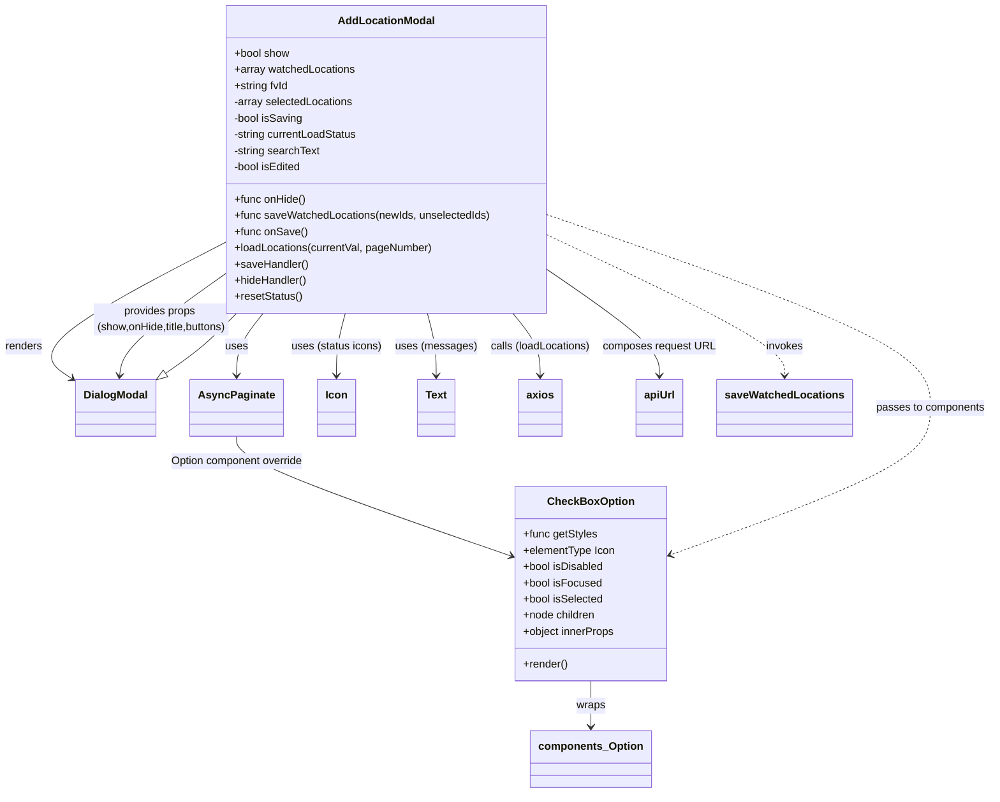
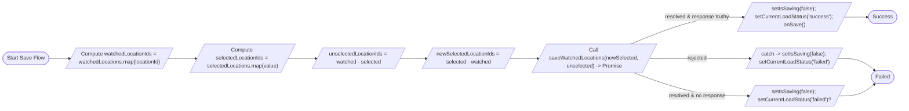

# Diagram: web/portal/src/pages/inventoryview/components/AddLocation.modal.js

> Auto-generated by Obscura crawlers

## Diagram 1

### SVG

<svg id="container" width="1446.03125" xmlns="http://www.w3.org/2000/svg" class="classDiagram" height="1198" viewBox="0 0 1446.03125 1198" role="graphics-document document" aria-roledescription="class"><g><defs><marker id="container_class-aggregationStart" class="marker aggregation class" refX="18" refY="7" markerWidth="190" markerHeight="240" orient="auto"><path d="M 18,7 L9,13 L1,7 L9,1 Z"></path></marker></defs><defs><marker id="container_class-aggregationEnd" class="marker aggregation class" refX="1" refY="7" markerWidth="20" markerHeight="28" orient="auto"><path d="M 18,7 L9,13 L1,7 L9,1 Z"></path></marker></defs><defs><marker id="container_class-extensionStart" class="marker extension class" refX="18" refY="7" markerWidth="190" markerHeight="240" orient="auto"><path d="M 1,7 L18,13 V 1 Z"></path></marker></defs><defs><marker id="container_class-extensionEnd" class="marker extension class" refX="1" refY="7" markerWidth="20" markerHeight="28" orient="auto"><path d="M 1,1 V 13 L18,7 Z"></path></marker></defs><defs><marker id="container_class-compositionStart" class="marker composition class" refX="18" refY="7" markerWidth="190" markerHeight="240" orient="auto"><path d="M 18,7 L9,13 L1,7 L9,1 Z"></path></marker></defs><defs><marker id="container_class-compositionEnd" class="marker composition class" refX="1" refY="7" markerWidth="20" markerHeight="28" orient="auto"><path d="M 18,7 L9,13 L1,7 L9,1 Z"></path></marker></defs><defs><marker id="container_class-dependencyStart" class="marker dependency class" refX="6" refY="7" markerWidth="190" markerHeight="240" orient="auto"><path d="M 5,7 L9,13 L1,7 L9,1 Z"></path></marker></defs><defs><marker id="container_class-dependencyEnd" class="marker dependency class" refX="13" refY="7" markerWidth="20" markerHeight="28" orient="auto"><path d="M 18,7 L9,13 L14,7 L9,1 Z"></path></marker></defs><defs><marker id="container_class-lollipopStart" class="marker lollipop class" refX="13" refY="7" markerWidth="190" markerHeight="240" orient="auto"><circle stroke="black" fill="transparent" cx="7" cy="7" r="6"></circle></marker></defs><defs><marker id="container_class-lollipopEnd" class="marker lollipop class" refX="1" refY="7" markerWidth="190" markerHeight="240" orient="auto"><circle stroke="black" fill="transparent" cx="7" cy="7" r="6"></circle></marker></defs><g class="root"><g class="clusters"></g><g class="edgePaths"><path d="M327.313,359.795L278.719,385.329C230.125,410.864,132.938,461.932,97.204,495.836C61.47,529.74,87.189,546.48,100.049,554.85L112.909,563.221" id="id_AddLocationModal_DialogModal_1" class="edge-thickness-normal edge-pattern-solid relation" style=";;;" data-edge="true" data-et="edge" data-id="id_AddLocationModal_DialogModal_1" data-points="W3sieCI6MzI3LjMxMjUsInkiOjM1OS43OTUzMDQ5OTczMzI0fSx7IngiOjM1Ljc1LCJ5Ijo1MTN9LHsieCI6MTE3LjkzNzUsInkiOjU2Ni40OTM1MTgxMDQ2MDQ0fV0=" marker-end="url(#container_class-dependencyEnd)"></path><path d="M385.958,464L379.62,472.167C373.282,480.333,360.606,496.667,354.268,512C347.93,527.333,347.93,541.667,347.93,548.833L347.93,556" id="id_AddLocationModal_AsyncPaginate_2" class="edge-thickness-normal edge-pattern-solid relation" style=";;;" data-edge="true" data-et="edge" data-id="id_AddLocationModal_AsyncPaginate_2" data-points="W3sieCI6Mzg1Ljk1ODAzMjQ5MDk3NDcsInkiOjQ2NH0seyJ4IjozNDcuOTI5Njg3NSwieSI6NTEzfSx7IngiOjM0Ny45Mjk2ODc1LCJ5Ijo1NjJ9XQ==" marker-end="url(#container_class-dependencyEnd)"></path><path d="M502.877,464L500.727,472.167C498.577,480.333,494.277,496.667,492.127,512C489.977,527.333,489.977,541.667,489.977,548.833L489.977,556" id="id_AddLocationModal_Icon_3" class="edge-thickness-normal edge-pattern-solid relation" style=";;;" data-edge="true" data-et="edge" data-id="id_AddLocationModal_Icon_3" data-points="W3sieCI6NTAyLjg3NzQ4MTk0OTQ1ODQ2LCJ5Ijo0NjR9LHsieCI6NDg5Ljk3NjU2MjUsInkiOjUxM30seyJ4Ijo0ODkuOTc2NTYyNSwieSI6NTYyfV0=" marker-end="url(#container_class-dependencyEnd)"></path><path d="M622.935,464L625.085,472.167C627.235,480.333,631.536,496.667,633.686,512C635.836,527.333,635.836,541.667,635.836,548.833L635.836,556" id="id_AddLocationModal_Text_4" class="edge-thickness-normal edge-pattern-solid relation" style=";;;" data-edge="true" data-et="edge" data-id="id_AddLocationModal_Text_4" data-points="W3sieCI6NjIyLjkzNTAxODA1MDU0MTUsInkiOjQ2NH0seyJ4Ijo2MzUuODM1OTM3NSwieSI6NTEzfSx7IngiOjYzNS44MzU5Mzc1LCJ5Ijo1NjJ9XQ==" marker-end="url(#container_class-dependencyEnd)"></path><path d="M749.114,464L755.784,472.167C762.454,480.333,775.793,496.667,782.463,512C789.133,527.333,789.133,541.667,789.133,548.833L789.133,556" id="id_AddLocationModal_axios_5" class="edge-thickness-normal edge-pattern-solid relation" style=";;;" data-edge="true" data-et="edge" data-id="id_AddLocationModal_axios_5" data-points="W3sieCI6NzQ5LjExNDM5NTMwNjg1OTMsInkiOjQ2NH0seyJ4Ijo3ODkuMTMyODEyNSwieSI6NTEzfSx7IngiOjc4OS4xMzI4MTI1LCJ5Ijo1NjJ9XQ==" marker-end="url(#container_class-dependencyEnd)"></path><path d="M798.5,397.837L826.441,417.031C854.383,436.225,910.266,474.612,938.207,500.973C966.148,527.333,966.148,541.667,966.148,548.833L966.148,556" id="id_AddLocationModal_apiUrl_6" class="edge-thickness-normal edge-pattern-solid relation" style=";;;" data-edge="true" data-et="edge" data-id="id_AddLocationModal_apiUrl_6" data-points="W3sieCI6Nzk4LjUsInkiOjM5Ny44MzY5MDc4NzU2MTc1Nn0seyJ4Ijo5NjYuMTQ4NDM3NSwieSI6NTEzfSx7IngiOjk2Ni4xNDg0Mzc1LCJ5Ijo1NjJ9XQ==" marker-end="url(#container_class-dependencyEnd)"></path><path d="M347.93,646L347.93,654.167C347.93,662.333,347.93,678.667,413.967,711.705C480.005,744.743,612.08,794.486,678.117,819.358L744.155,844.23" id="id_AsyncPaginate_CheckBoxOption_7" class="edge-thickness-normal edge-pattern-solid relation" style=";;;" data-edge="true" data-et="edge" data-id="id_AsyncPaginate_CheckBoxOption_7" data-points="W3sieCI6MzQ3LjkyOTY4NzUsInkiOjY0Nn0seyJ4IjozNDcuOTI5Njg3NSwieSI6Njk1fSx7IngiOjc0OS43Njk1MzEyNSwieSI6ODQ2LjM0NDMwNzY1NzEyNTV9XQ==" marker-end="url(#container_class-dependencyEnd)"></path><path d="M860.371,1032L860.371,1038.167C860.371,1044.333,860.371,1056.667,860.371,1068C860.371,1079.333,860.371,1089.667,860.371,1094.833L860.371,1100" id="id_CheckBoxOption_components_Option_8" class="edge-thickness-normal edge-pattern-solid relation" style=";;;" data-edge="true" data-et="edge" data-id="id_CheckBoxOption_components_Option_8" data-points="W3sieCI6ODYwLjM3MTA5Mzc1LCJ5IjoxMDMyfSx7IngiOjg2MC4zNzEwOTM3NSwieSI6MTA2OX0seyJ4Ijo4NjAuMzcxMDkzNzUsInkiOjExMDZ9XQ==" marker-end="url(#container_class-dependencyEnd)"></path><path d="M798.5,318.188L891.573,350.656C984.646,383.125,1170.792,448.063,1263.865,495.698C1356.938,543.333,1356.938,573.667,1356.938,604C1356.938,634.333,1356.938,664.667,1293.542,704.473C1230.147,744.28,1103.356,793.559,1039.96,818.199L976.565,842.839" id="id_AddLocationModal_CheckBoxOption_9" class="edge-thickness-normal edge-pattern-dashed relation" style=";;;" data-edge="true" data-et="edge" data-id="id_AddLocationModal_CheckBoxOption_9" data-points="W3sieCI6Nzk4LjUsInkiOjMxOC4xODc1MzE5NzY4NTg2fSx7IngiOjEzNTYuOTM3NSwieSI6NTEzfSx7IngiOjEzNTYuOTM3NSwieSI6NjA0fSx7IngiOjEzNTYuOTM3NSwieSI6Njk1fSx7IngiOjk3MC45NzI2NTYyNSwieSI6ODQ1LjAxMjU5NDI5OTkxOX1d" marker-end="url(#container_class-dependencyEnd)"></path><path d="M327.313,408.004L303.344,425.504C279.375,443.003,231.438,478.001,206.843,502.671C182.249,527.341,180.998,541.682,180.373,548.852L179.747,556.023" id="id_AddLocationModal_DialogModal_10" class="edge-thickness-normal edge-pattern-solid relation" style=";;;" data-edge="true" data-et="edge" data-id="id_AddLocationModal_DialogModal_10" data-points="W3sieCI6MzI3LjMxMjUsInkiOjQwOC4wMDQyMDA2NDI0NTEyfSx7IngiOjE4My41LCJ5Ijo1MTN9LHsieCI6MTc5LjIyNTk2MTUzODQ2MTU1LCJ5Ijo1NjJ9XQ==" marker-end="url(#container_class-dependencyEnd)"></path><path d="M798.5,347.996L856.35,375.497C914.201,402.997,1029.901,457.999,1087.751,492.666C1145.602,527.333,1145.602,541.667,1145.602,548.833L1145.602,556" id="id_AddLocationModal_saveWatchedLocations_11" class="edge-thickness-normal edge-pattern-dashed relation" style=";;;" data-edge="true" data-et="edge" data-id="id_AddLocationModal_saveWatchedLocations_11" data-points="W3sieCI6Nzk4LjUsInkiOjM0Ny45OTU4NzA0ODMzNDExNX0seyJ4IjoxMTQ1LjYwMTU2MjUsInkiOjUxM30seyJ4IjoxMTQ1LjYwMTU2MjUsInkiOjU2Mn1d" marker-end="url(#container_class-dependencyEnd)"></path><path d="M247.244,553.014L256.62,546.345C265.996,539.676,284.748,526.338,301.772,511.502C318.796,496.667,334.092,480.333,341.74,472.167L349.388,464" id="id_DialogModal_AddLocationModal_12" class="edge-thickness-normal edge-pattern-solid relation" style=";;;" data-edge="true" data-et="edge" data-id="id_DialogModal_AddLocationModal_12" data-points="W3sieCI6MjMzLjE4NzUsInkiOjU2My4wMTIyMTI5OTQ2MjYyfSx7IngiOjMwMy41LCJ5Ijo1MTN9LHsieCI6MzQ5LjM4Nzc0ODE5NDk0NTg2LCJ5Ijo0NjR9XQ==" marker-start="url(#container_class-extensionStart)"></path></g><g class="edgeLabels"><g class="edgeLabel" transform="translate(35.75, 513)"><g class="label" data-id="id_AddLocationModal_DialogModal_1" transform="translate(-27.75, -12)"><foreignObject width="55.5" height="24">

renders

</foreignObject></g></g><g class="edgeLabel" transform="translate(347.9296875, 513)"><g class="label" data-id="id_AddLocationModal_AsyncPaginate_2" transform="translate(-16.4921875, -12)"><foreignObject width="32.984375" height="24">

uses

</foreignObject></g></g><g class="edgeLabel" transform="translate(489.9765625, 513)"><g class="label" data-id="id_AddLocationModal_Icon_3" transform="translate(-67.1328125, -12)"><foreignObject width="134.265625" height="24">

uses (status icons)

</foreignObject></g></g><g class="edgeLabel" transform="translate(635.8359375, 513)"><g class="label" data-id="id_AddLocationModal_Text_4" transform="translate(-58.7265625, -12)"><foreignObject width="117.453125" height="24">

uses (messages)

</foreignObject></g></g><g class="edgeLabel" transform="translate(789.1328125, 513)"><g class="label" data-id="id_AddLocationModal_axios_5" transform="translate(-74.5703125, -12)"><foreignObject width="149.140625" height="24">

calls (loadLocations)

</foreignObject></g></g><g class="edgeLabel" transform="translate(966.1484375, 513)"><g class="label" data-id="id_AddLocationModal_apiUrl_6" transform="translate(-82.4453125, -12)"><foreignObject width="164.890625" height="24">

composes request URL

</foreignObject></g></g><g class="edgeLabel" transform="translate(347.9296875, 695)"><g class="label" data-id="id_AsyncPaginate_CheckBoxOption_7" transform="translate(-100, -24)"><foreignObject width="200" height="48">

Option component override

</foreignObject></g></g><g class="edgeLabel" transform="translate(860.37109375, 1069)"><g class="label" data-id="id_CheckBoxOption_components_Option_8" transform="translate(-21.390625, -12)"><foreignObject width="42.78125" height="24">

wraps

</foreignObject></g></g><g class="edgeLabel" transform="translate(1356.9375, 604)"><g class="label" data-id="id_AddLocationModal_CheckBoxOption_9" transform="translate(-81.09375, -12)"><foreignObject width="162.1875" height="24">

passes to components

</foreignObject></g></g><g class="edgeLabel" transform="translate(235.54362, 475.00357)"><g class="label" data-id="id_AddLocationModal_DialogModal_10" transform="translate(-100, -24)"><foreignObject width="200" height="48">

provides props (show,onHide,title,buttons)

</foreignObject></g></g><g class="edgeLabel" transform="translate(1145.6015625, 513)"><g class="label" data-id="id_AddLocationModal_saveWatchedLocations_11" transform="translate(-27.5859375, -12)"><foreignObject width="55.171875" height="24">

invokes

</foreignObject></g></g><g class="edgeLabel"><g class="label" data-id="id_DialogModal_AddLocationModal_12" transform="translate(0, 0)"><foreignObject width="0" height="0">

</foreignObject></g></g></g><g class="nodes"><g class="node default" id="classId-AddLocationModal-0" transform="translate(562.90625, 236)"><g class="basic label-container"><path d="M-235.59375 -228 L235.59375 -228 L235.59375 228 L-235.59375 228" stroke="none" stroke-width="0" fill="#ECECFF" style=""></path><path d="M-235.59375 -228 C-62.335643006455626 -228, 110.92246398708875 -228, 235.59375 -228 M-235.59375 -228 C-54.56209694702346 -228, 126.46955610595307 -228, 235.59375 -228 M235.59375 -228 C235.59375 -115.42760858230295, 235.59375 -2.8552171646059037, 235.59375 228 M235.59375 -228 C235.59375 -117.14442728236281, 235.59375 -6.288854564725625, 235.59375 228 M235.59375 228 C113.18082452321362 228, -9.232100953572768 228, -235.59375 228 M235.59375 228 C92.86828213515781 228, -49.857185729684375 228, -235.59375 228 M-235.59375 228 C-235.59375 122.05582309723691, -235.59375 16.11164619447382, -235.59375 -228 M-235.59375 228 C-235.59375 65.60806251800443, -235.59375 -96.78387496399114, -235.59375 -228" stroke="#9370DB" stroke-width="1.3" fill="none" stroke-dasharray="0 0" style=""></path></g><g class="annotation-group text" transform="translate(0, -204)"></g><g class="label-group text" transform="translate(-68.109375, -204)"><g class="label" style="font-weight: bolder" transform="translate(0,-12)"><foreignObject width="136.21875" height="24">

AddLocationModal

</foreignObject></g></g><g class="members-group text" transform="translate(-223.59375, -156)"><g class="label" style="" transform="translate(0,-12)"><foreignObject width="82.78125" height="24">

+bool show

</foreignObject></g><g class="label" style="" transform="translate(0,12)"><foreignObject width="179.234375" height="24">

+array watchedLocations

</foreignObject></g><g class="label" style="" transform="translate(0,36)"><foreignObject width="81.390625" height="24">

+string fvId

</foreignObject></g><g class="label" style="" transform="translate(0,60)"><foreignObject width="177.859375" height="24">

-array selectedLocations

</foreignObject></g><g class="label" style="" transform="translate(0,84)"><foreignObject width="102.828125" height="24">

-bool isSaving

</foreignObject></g><g class="label" style="" transform="translate(0,108)"><foreignObject width="185.546875" height="24">

-string currentLoadStatus

</foreignObject></g><g class="label" style="" transform="translate(0,132)"><foreignObject width="129.28125" height="24">

-string searchText

</foreignObject></g><g class="label" style="" transform="translate(0,156)"><foreignObject width="101.703125" height="24">

-bool isEdited

</foreignObject></g></g><g class="methods-group text" transform="translate(-223.59375, 60)"><g class="label" style="" transform="translate(0,-12)"><foreignObject width="106.453125" height="24">

+func onHide()

</foreignObject></g><g class="label" style="" transform="translate(0,12)"><foreignObject width="379.078125" height="24">

+func saveWatchedLocations(newIds, unselectedIds)

</foreignObject></g><g class="label" style="" transform="translate(0,36)"><foreignObject width="106.484375" height="24">

+func onSave()

</foreignObject></g><g class="label" style="" transform="translate(0,60)"><foreignObject width="295.203125" height="24">

+loadLocations(currentVal, pageNumber)

</foreignObject></g><g class="label" style="" transform="translate(0,84)"><foreignObject width="108.703125" height="24">

+saveHandler()

</foreignObject></g><g class="label" style="" transform="translate(0,108)"><foreignObject width="108.5625" height="24">

+hideHandler()

</foreignObject></g><g class="label" style="" transform="translate(0,132)"><foreignObject width="100.390625" height="24">

+resetStatus()

</foreignObject></g></g><g class="divider" style=""><path d="M-235.59375 -180 C-64.52429837263 -180, 106.54515325474 -180, 235.59375 -180 M-235.59375 -180 C-137.60977498553018 -180, -39.62579997106036 -180, 235.59375 -180" stroke="#9370DB" stroke-width="1.3" fill="none" stroke-dasharray="0 0" style=""></path></g><g class="divider" style=""><path d="M-235.59375 36 C-140.06049545429084 36, -44.52724090858172 36, 235.59375 36 M-235.59375 36 C-59.558424982627145 36, 116.47690003474571 36, 235.59375 36" stroke="#9370DB" stroke-width="1.3" fill="none" stroke-dasharray="0 0" style=""></path></g></g><g class="node default" id="classId-CheckBoxOption-1" transform="translate(860.37109375, 888)"><g class="basic label-container"><path d="M-110.6015625 -144 L110.6015625 -144 L110.6015625 144 L-110.6015625 144" stroke="none" stroke-width="0" fill="#ECECFF" style=""></path><path d="M-110.6015625 -144 C-52.951704734278124 -144, 4.698153031443752 -144, 110.6015625 -144 M-110.6015625 -144 C-65.9791989681444 -144, -21.35683543628879 -144, 110.6015625 -144 M110.6015625 -144 C110.6015625 -78.42753461472176, 110.6015625 -12.85506922944353, 110.6015625 144 M110.6015625 -144 C110.6015625 -45.35679006089711, 110.6015625 53.28641987820578, 110.6015625 144 M110.6015625 144 C55.40130349162449 144, 0.20104448324897817 144, -110.6015625 144 M110.6015625 144 C40.85824521214195 144, -28.885072075716096 144, -110.6015625 144 M-110.6015625 144 C-110.6015625 78.03729932308606, -110.6015625 12.07459864617212, -110.6015625 -144 M-110.6015625 144 C-110.6015625 28.842112809250153, -110.6015625 -86.3157743814997, -110.6015625 -144" stroke="#9370DB" stroke-width="1.3" fill="none" stroke-dasharray="0 0" style=""></path></g><g class="annotation-group text" transform="translate(0, -120)"></g><g class="label-group text" transform="translate(-60.34375, -120)"><g class="label" style="font-weight: bolder" transform="translate(0,-12)"><foreignObject width="120.6875" height="24">

CheckBoxOption

</foreignObject></g></g><g class="members-group text" transform="translate(-98.6015625, -72)"><g class="label" style="" transform="translate(0,-12)"><foreignObject width="109.34375" height="24">

+func getStyles

</foreignObject></g><g class="label" style="" transform="translate(0,12)"><foreignObject width="136.359375" height="24">

+elementType Icon

</foreignObject></g><g class="label" style="" transform="translate(0,36)"><foreignObject width="120.328125" height="24">

+bool isDisabled

</foreignObject></g><g class="label" style="" transform="translate(0,60)"><foreignObject width="116.296875" height="24">

+bool isFocused

</foreignObject></g><g class="label" style="" transform="translate(0,84)"><foreignObject width="119.34375" height="24">

+bool isSelected

</foreignObject></g><g class="label" style="" transform="translate(0,108)"><foreignObject width="108.75" height="24">

+node children

</foreignObject></g><g class="label" style="" transform="translate(0,132)"><foreignObject width="136.859375" height="24">

+object innerProps

</foreignObject></g></g><g class="methods-group text" transform="translate(-98.6015625, 120)"><g class="label" style="" transform="translate(0,-12)"><foreignObject width="66.609375" height="24">

+render()

</foreignObject></g></g><g class="divider" style=""><path d="M-110.6015625 -96 C-35.611915143166684 -96, 39.37773221366663 -96, 110.6015625 -96 M-110.6015625 -96 C-40.700775858081755 -96, 29.20001078383649 -96, 110.6015625 -96" stroke="#9370DB" stroke-width="1.3" fill="none" stroke-dasharray="0 0" style=""></path></g><g class="divider" style=""><path d="M-110.6015625 96 C-35.1687030978094 96, 40.2641563043812 96, 110.6015625 96 M-110.6015625 96 C-51.70281044800322 96, 7.19594160399356 96, 110.6015625 96" stroke="#9370DB" stroke-width="1.3" fill="none" stroke-dasharray="0 0" style=""></path></g></g><g class="node default" id="classId-DialogModal-2" transform="translate(175.5625, 604)"><g class="basic label-container"><path d="M-57.625 -42 L57.625 -42 L57.625 42 L-57.625 42" stroke="none" stroke-width="0" fill="#ECECFF" style=""></path><path d="M-57.625 -42 C-18.092245266300942 -42, 21.440509467398115 -42, 57.625 -42 M-57.625 -42 C-11.714465377197484 -42, 34.19606924560503 -42, 57.625 -42 M57.625 -42 C57.625 -15.412194181588696, 57.625 11.175611636822609, 57.625 42 M57.625 -42 C57.625 -18.53992683706326, 57.625 4.920146325873482, 57.625 42 M57.625 42 C18.125497478103597 42, -21.374005043792806 42, -57.625 42 M57.625 42 C11.983553237667543 42, -33.657893524664914 42, -57.625 42 M-57.625 42 C-57.625 10.724906824503886, -57.625 -20.550186350992227, -57.625 -42 M-57.625 42 C-57.625 24.487995905120325, -57.625 6.97599181024065, -57.625 -42" stroke="#9370DB" stroke-width="1.3" fill="none" stroke-dasharray="0 0" style=""></path></g><g class="annotation-group text" transform="translate(0, -18)"></g><g class="label-group text" transform="translate(-45.625, -18)"><g class="label" style="font-weight: bolder" transform="translate(0,-12)"><foreignObject width="91.25" height="24">

DialogModal

</foreignObject></g></g><g class="members-group text" transform="translate(-45.625, 30)"></g><g class="methods-group text" transform="translate(-45.625, 60)"></g><g class="divider" style=""><path d="M-57.625 6 C-12.24055116635926 6, 33.14389766728148 6, 57.625 6 M-57.625 6 C-25.747594338487144 6, 6.129811323025713 6, 57.625 6" stroke="#9370DB" stroke-width="1.3" fill="none" stroke-dasharray="0 0" style=""></path></g><g class="divider" style=""><path d="M-57.625 24 C-30.005674927706394 24, -2.3863498554127887 24, 57.625 24 M-57.625 24 C-29.29682952730765 24, -0.9686590546153013 24, 57.625 24" stroke="#9370DB" stroke-width="1.3" fill="none" stroke-dasharray="0 0" style=""></path></g></g><g class="node default" id="classId-AsyncPaginate-3" transform="translate(347.9296875, 604)"><g class="basic label-container"><path d="M-64.7421875 -42 L64.7421875 -42 L64.7421875 42 L-64.7421875 42" stroke="none" stroke-width="0" fill="#ECECFF" style=""></path><path d="M-64.7421875 -42 C-16.88824502481654 -42, 30.965697450366918 -42, 64.7421875 -42 M-64.7421875 -42 C-31.883026984090137 -42, 0.9761335318197268 -42, 64.7421875 -42 M64.7421875 -42 C64.7421875 -17.730697030446507, 64.7421875 6.538605939106986, 64.7421875 42 M64.7421875 -42 C64.7421875 -24.23118306988656, 64.7421875 -6.462366139773117, 64.7421875 42 M64.7421875 42 C24.39568575450855 42, -15.950815990982903 42, -64.7421875 42 M64.7421875 42 C29.23863202253358 42, -6.264923454932841 42, -64.7421875 42 M-64.7421875 42 C-64.7421875 21.08697477189157, -64.7421875 0.17394954378313798, -64.7421875 -42 M-64.7421875 42 C-64.7421875 22.87810827765263, -64.7421875 3.756216555305258, -64.7421875 -42" stroke="#9370DB" stroke-width="1.3" fill="none" stroke-dasharray="0 0" style=""></path></g><g class="annotation-group text" transform="translate(0, -18)"></g><g class="label-group text" transform="translate(-52.7421875, -18)"><g class="label" style="font-weight: bolder" transform="translate(0,-12)"><foreignObject width="105.484375" height="24">

AsyncPaginate

</foreignObject></g></g><g class="members-group text" transform="translate(-52.7421875, 30)"></g><g class="methods-group text" transform="translate(-52.7421875, 60)"></g><g class="divider" style=""><path d="M-64.7421875 6 C-23.4656773803397 6, 17.810832739320603 6, 64.7421875 6 M-64.7421875 6 C-18.58160989611632 6, 27.57896770776736 6, 64.7421875 6" stroke="#9370DB" stroke-width="1.3" fill="none" stroke-dasharray="0 0" style=""></path></g><g class="divider" style=""><path d="M-64.7421875 24 C-35.755220166405 24, -6.768252832810006 24, 64.7421875 24 M-64.7421875 24 C-32.00895449490993 24, 0.7242785101801417 24, 64.7421875 24" stroke="#9370DB" stroke-width="1.3" fill="none" stroke-dasharray="0 0" style=""></path></g></g><g class="node default" id="classId-Icon-4" transform="translate(489.9765625, 604)"><g class="basic label-container"><path d="M-27.3046875 -42 L27.3046875 -42 L27.3046875 42 L-27.3046875 42" stroke="none" stroke-width="0" fill="#ECECFF" style=""></path><path d="M-27.3046875 -42 C-10.34839673876797 -42, 6.607894022464059 -42, 27.3046875 -42 M-27.3046875 -42 C-11.060351640112035 -42, 5.18398421977593 -42, 27.3046875 -42 M27.3046875 -42 C27.3046875 -9.401405348862461, 27.3046875 23.197189302275078, 27.3046875 42 M27.3046875 -42 C27.3046875 -20.063242968902834, 27.3046875 1.8735140621943316, 27.3046875 42 M27.3046875 42 C9.466479212321655 42, -8.37172907535669 42, -27.3046875 42 M27.3046875 42 C10.324110665490437 42, -6.656466169019126 42, -27.3046875 42 M-27.3046875 42 C-27.3046875 10.678265976760343, -27.3046875 -20.643468046479313, -27.3046875 -42 M-27.3046875 42 C-27.3046875 10.225227742074122, -27.3046875 -21.549544515851757, -27.3046875 -42" stroke="#9370DB" stroke-width="1.3" fill="none" stroke-dasharray="0 0" style=""></path></g><g class="annotation-group text" transform="translate(0, -18)"></g><g class="label-group text" transform="translate(-15.3046875, -18)"><g class="label" style="font-weight: bolder" transform="translate(0,-12)"><foreignObject width="30.609375" height="24">

Icon

</foreignObject></g></g><g class="members-group text" transform="translate(-15.3046875, 30)"></g><g class="methods-group text" transform="translate(-15.3046875, 60)"></g><g class="divider" style=""><path d="M-27.3046875 6 C-14.892433671452244 6, -2.4801798429044872 6, 27.3046875 6 M-27.3046875 6 C-5.77152593734241 6, 15.76163562531518 6, 27.3046875 6" stroke="#9370DB" stroke-width="1.3" fill="none" stroke-dasharray="0 0" style=""></path></g><g class="divider" style=""><path d="M-27.3046875 24 C-8.18247735074943 24, 10.93973279850114 24, 27.3046875 24 M-27.3046875 24 C-13.151446595565371 24, 1.0017943088692576 24, 27.3046875 24" stroke="#9370DB" stroke-width="1.3" fill="none" stroke-dasharray="0 0" style=""></path></g></g><g class="node default" id="classId-Text-5" transform="translate(635.8359375, 604)"><g class="basic label-container"><path d="M-27.3828125 -42 L27.3828125 -42 L27.3828125 42 L-27.3828125 42" stroke="none" stroke-width="0" fill="#ECECFF" style=""></path><path d="M-27.3828125 -42 C-14.478537387689148 -42, -1.5742622753782953 -42, 27.3828125 -42 M-27.3828125 -42 C-8.896213829841518 -42, 9.590384840316965 -42, 27.3828125 -42 M27.3828125 -42 C27.3828125 -10.527308376095558, 27.3828125 20.945383247808884, 27.3828125 42 M27.3828125 -42 C27.3828125 -16.61826378998853, 27.3828125 8.763472420022943, 27.3828125 42 M27.3828125 42 C12.326241442664434 42, -2.730329614671131 42, -27.3828125 42 M27.3828125 42 C11.73595164291182 42, -3.9109092141763604 42, -27.3828125 42 M-27.3828125 42 C-27.3828125 24.033819445448987, -27.3828125 6.067638890897975, -27.3828125 -42 M-27.3828125 42 C-27.3828125 15.911604269492976, -27.3828125 -10.176791461014048, -27.3828125 -42" stroke="#9370DB" stroke-width="1.3" fill="none" stroke-dasharray="0 0" style=""></path></g><g class="annotation-group text" transform="translate(0, -18)"></g><g class="label-group text" transform="translate(-15.3828125, -18)"><g class="label" style="font-weight: bolder" transform="translate(0,-12)"><foreignObject width="30.765625" height="24">

Text

</foreignObject></g></g><g class="members-group text" transform="translate(-15.3828125, 30)"></g><g class="methods-group text" transform="translate(-15.3828125, 60)"></g><g class="divider" style=""><path d="M-27.3828125 6 C-16.135985404873033 6, -4.889158309746062 6, 27.3828125 6 M-27.3828125 6 C-5.5065536696545365 6, 16.369705160690927 6, 27.3828125 6" stroke="#9370DB" stroke-width="1.3" fill="none" stroke-dasharray="0 0" style=""></path></g><g class="divider" style=""><path d="M-27.3828125 24 C-10.241495374522206 24, 6.899821750955589 24, 27.3828125 24 M-27.3828125 24 C-13.762323812485889 24, -0.1418351249717773 24, 27.3828125 24" stroke="#9370DB" stroke-width="1.3" fill="none" stroke-dasharray="0 0" style=""></path></g></g><g class="node default" id="classId-axios-6" transform="translate(789.1328125, 604)"><g class="basic label-container"><path d="M-31.2734375 -42 L31.2734375 -42 L31.2734375 42 L-31.2734375 42" stroke="none" stroke-width="0" fill="#ECECFF" style=""></path><path d="M-31.2734375 -42 C-18.161949926625372 -42, -5.050462353250744 -42, 31.2734375 -42 M-31.2734375 -42 C-7.809199913684932 -42, 15.655037672630137 -42, 31.2734375 -42 M31.2734375 -42 C31.2734375 -10.558116381273376, 31.2734375 20.88376723745325, 31.2734375 42 M31.2734375 -42 C31.2734375 -11.831233093488606, 31.2734375 18.337533813022787, 31.2734375 42 M31.2734375 42 C14.359945170388361 42, -2.553547159223278 42, -31.2734375 42 M31.2734375 42 C6.805396212058209 42, -17.66264507588358 42, -31.2734375 42 M-31.2734375 42 C-31.2734375 24.038396696823835, -31.2734375 6.0767933936476695, -31.2734375 -42 M-31.2734375 42 C-31.2734375 18.288510437042888, -31.2734375 -5.422979125914225, -31.2734375 -42" stroke="#9370DB" stroke-width="1.3" fill="none" stroke-dasharray="0 0" style=""></path></g><g class="annotation-group text" transform="translate(0, -18)"></g><g class="label-group text" transform="translate(-19.2734375, -18)"><g class="label" style="font-weight: bolder" transform="translate(0,-12)"><foreignObject width="38.546875" height="24">

axios

</foreignObject></g></g><g class="members-group text" transform="translate(-19.2734375, 30)"></g><g class="methods-group text" transform="translate(-19.2734375, 60)"></g><g class="divider" style=""><path d="M-31.2734375 6 C-14.903305050203375 6, 1.4668273995932495 6, 31.2734375 6 M-31.2734375 6 C-16.001392489408914 6, -0.7293474788178322 6, 31.2734375 6" stroke="#9370DB" stroke-width="1.3" fill="none" stroke-dasharray="0 0" style=""></path></g><g class="divider" style=""><path d="M-31.2734375 24 C-16.411273925733795 24, -1.54911035146759 24, 31.2734375 24 M-31.2734375 24 C-7.424497054355399 24, 16.424443391289202 24, 31.2734375 24" stroke="#9370DB" stroke-width="1.3" fill="none" stroke-dasharray="0 0" style=""></path></g></g><g class="node default" id="classId-apiUrl-7" transform="translate(966.1484375, 604)"><g class="basic label-container"><path d="M-34.2109375 -42 L34.2109375 -42 L34.2109375 42 L-34.2109375 42" stroke="none" stroke-width="0" fill="#ECECFF" style=""></path><path d="M-34.2109375 -42 C-17.863135574701108 -42, -1.5153336494022156 -42, 34.2109375 -42 M-34.2109375 -42 C-14.47409520248791 -42, 5.2627470950241815 -42, 34.2109375 -42 M34.2109375 -42 C34.2109375 -23.888032060037425, 34.2109375 -5.7760641200748495, 34.2109375 42 M34.2109375 -42 C34.2109375 -19.152343191882238, 34.2109375 3.6953136162355236, 34.2109375 42 M34.2109375 42 C14.833836738093634 42, -4.543264023812732 42, -34.2109375 42 M34.2109375 42 C12.632532969804249 42, -8.945871560391502 42, -34.2109375 42 M-34.2109375 42 C-34.2109375 11.300045343656198, -34.2109375 -19.399909312687605, -34.2109375 -42 M-34.2109375 42 C-34.2109375 17.020848201828333, -34.2109375 -7.958303596343335, -34.2109375 -42" stroke="#9370DB" stroke-width="1.3" fill="none" stroke-dasharray="0 0" style=""></path></g><g class="annotation-group text" transform="translate(0, -18)"></g><g class="label-group text" transform="translate(-22.2109375, -18)"><g class="label" style="font-weight: bolder" transform="translate(0,-12)"><foreignObject width="44.421875" height="24">

apiUrl

</foreignObject></g></g><g class="members-group text" transform="translate(-22.2109375, 30)"></g><g class="methods-group text" transform="translate(-22.2109375, 60)"></g><g class="divider" style=""><path d="M-34.2109375 6 C-15.902255435575963 6, 2.406426628848074 6, 34.2109375 6 M-34.2109375 6 C-16.93312582666099 6, 0.3446858466780185 6, 34.2109375 6" stroke="#9370DB" stroke-width="1.3" fill="none" stroke-dasharray="0 0" style=""></path></g><g class="divider" style=""><path d="M-34.2109375 24 C-18.13872653371489 24, -2.066515567429782 24, 34.2109375 24 M-34.2109375 24 C-14.235564834796428 24, 5.739807830407145 24, 34.2109375 24" stroke="#9370DB" stroke-width="1.3" fill="none" stroke-dasharray="0 0" style=""></path></g></g><g class="node default" id="classId-components_Option-8" transform="translate(860.37109375, 1148)"><g class="basic label-container"><path d="M-85.7734375 -42 L85.7734375 -42 L85.7734375 42 L-85.7734375 42" stroke="none" stroke-width="0" fill="#ECECFF" style=""></path><path d="M-85.7734375 -42 C-29.76617898017861 -42, 26.241079539642783 -42, 85.7734375 -42 M-85.7734375 -42 C-37.43172000231235 -42, 10.909997495375293 -42, 85.7734375 -42 M85.7734375 -42 C85.7734375 -8.659169046766387, 85.7734375 24.681661906467227, 85.7734375 42 M85.7734375 -42 C85.7734375 -13.22273482460401, 85.7734375 15.554530350791978, 85.7734375 42 M85.7734375 42 C20.72028684630949 42, -44.33286380738102 42, -85.7734375 42 M85.7734375 42 C32.66823592853924 42, -20.43696564292152 42, -85.7734375 42 M-85.7734375 42 C-85.7734375 10.657180401148636, -85.7734375 -20.685639197702727, -85.7734375 -42 M-85.7734375 42 C-85.7734375 11.952108487125791, -85.7734375 -18.095783025748418, -85.7734375 -42" stroke="#9370DB" stroke-width="1.3" fill="none" stroke-dasharray="0 0" style=""></path></g><g class="annotation-group text" transform="translate(0, -18)"></g><g class="label-group text" transform="translate(-73.7734375, -18)"><g class="label" style="font-weight: bolder" transform="translate(0,-12)"><foreignObject width="147.546875" height="24">

components_Option

</foreignObject></g></g><g class="members-group text" transform="translate(-73.7734375, 30)"></g><g class="methods-group text" transform="translate(-73.7734375, 60)"></g><g class="divider" style=""><path d="M-85.7734375 6 C-31.40859454855147 6, 22.95624840289706 6, 85.7734375 6 M-85.7734375 6 C-28.721479225923126 6, 28.330479048153748 6, 85.7734375 6" stroke="#9370DB" stroke-width="1.3" fill="none" stroke-dasharray="0 0" style=""></path></g><g class="divider" style=""><path d="M-85.7734375 24 C-36.47073930877933 24, 12.831958882441342 24, 85.7734375 24 M-85.7734375 24 C-31.987164506058477 24, 21.799108487883046 24, 85.7734375 24" stroke="#9370DB" stroke-width="1.3" fill="none" stroke-dasharray="0 0" style=""></path></g></g><g class="node default" id="classId-saveWatchedLocations-9" transform="translate(1145.6015625, 604)"><g class="basic label-container"><path d="M-95.2421875 -42 L95.2421875 -42 L95.2421875 42 L-95.2421875 42" stroke="none" stroke-width="0" fill="#ECECFF" style=""></path><path d="M-95.2421875 -42 C-52.14281089678094 -42, -9.043434293561873 -42, 95.2421875 -42 M-95.2421875 -42 C-24.40306153860749 -42, 46.43606442278502 -42, 95.2421875 -42 M95.2421875 -42 C95.2421875 -19.458475955652546, 95.2421875 3.083048088694909, 95.2421875 42 M95.2421875 -42 C95.2421875 -20.759020750707982, 95.2421875 0.48195849858403506, 95.2421875 42 M95.2421875 42 C39.46512815780239 42, -16.31193118439522 42, -95.2421875 42 M95.2421875 42 C31.626429893577196 42, -31.989327712845608 42, -95.2421875 42 M-95.2421875 42 C-95.2421875 23.083103068748613, -95.2421875 4.166206137497227, -95.2421875 -42 M-95.2421875 42 C-95.2421875 24.252871120301638, -95.2421875 6.505742240603276, -95.2421875 -42" stroke="#9370DB" stroke-width="1.3" fill="none" stroke-dasharray="0 0" style=""></path></g><g class="annotation-group text" transform="translate(0, -18)"></g><g class="label-group text" transform="translate(-83.2421875, -18)"><g class="label" style="font-weight: bolder" transform="translate(0,-12)"><foreignObject width="166.484375" height="24">

saveWatchedLocations

</foreignObject></g></g><g class="members-group text" transform="translate(-83.2421875, 30)"></g><g class="methods-group text" transform="translate(-83.2421875, 60)"></g><g class="divider" style=""><path d="M-95.2421875 6 C-33.11504245182029 6, 29.012102596359426 6, 95.2421875 6 M-95.2421875 6 C-22.982622347452974 6, 49.27694280509405 6, 95.2421875 6" stroke="#9370DB" stroke-width="1.3" fill="none" stroke-dasharray="0 0" style=""></path></g><g class="divider" style=""><path d="M-95.2421875 24 C-23.97451021368515 24, 47.2931670726297 24, 95.2421875 24 M-95.2421875 24 C-43.58139188994358 24, 8.079403720112836 24, 95.2421875 24" stroke="#9370DB" stroke-width="1.3" fill="none" stroke-dasharray="0 0" style=""></path></g></g></g></g></g></svg>

## Diagram 2

### SVG

<svg id="container" width="2689.9599609375" xmlns="http://www.w3.org/2000/svg" class="flowchart" height="329" viewBox="0 0 2689.9599609375 329" role="graphics-document document" aria-roledescription="flowchart-v2"><g><marker id="container_flowchart-v2-pointEnd" class="marker flowchart-v2" viewBox="0 0 10 10" refX="5" refY="5" markerUnits="userSpaceOnUse" markerWidth="8" markerHeight="8" orient="auto"><path d="M 0 0 L 10 5 L 0 10 z" class="arrowMarkerPath" style="stroke-width: 1; stroke-dasharray: 1, 0;"></path></marker><marker id="container_flowchart-v2-pointStart" class="marker flowchart-v2" viewBox="0 0 10 10" refX="4.5" refY="5" markerUnits="userSpaceOnUse" markerWidth="8" markerHeight="8" orient="auto"><path d="M 0 5 L 10 10 L 10 0 z" class="arrowMarkerPath" style="stroke-width: 1; stroke-dasharray: 1, 0;"></path></marker><marker id="container_flowchart-v2-circleEnd" class="marker flowchart-v2" viewBox="0 0 10 10" refX="11" refY="5" markerUnits="userSpaceOnUse" markerWidth="11" markerHeight="11" orient="auto"><circle cx="5" cy="5" r="5" class="arrowMarkerPath" style="stroke-width: 1; stroke-dasharray: 1, 0;"></circle></marker><marker id="container_flowchart-v2-circleStart" class="marker flowchart-v2" viewBox="0 0 10 10" refX="-1" refY="5" markerUnits="userSpaceOnUse" markerWidth="11" markerHeight="11" orient="auto"><circle cx="5" cy="5" r="5" class="arrowMarkerPath" style="stroke-width: 1; stroke-dasharray: 1, 0;"></circle></marker><marker id="container_flowchart-v2-crossEnd" class="marker cross flowchart-v2" viewBox="0 0 11 11" refX="12" refY="5.2" markerUnits="userSpaceOnUse" markerWidth="11" markerHeight="11" orient="auto"><path d="M 1,1 l 9,9 M 10,1 l -9,9" class="arrowMarkerPath" style="stroke-width: 2; stroke-dasharray: 1, 0;"></path></marker><marker id="container_flowchart-v2-crossStart" class="marker cross flowchart-v2" viewBox="0 0 11 11" refX="-1" refY="5.2" markerUnits="userSpaceOnUse" markerWidth="11" markerHeight="11" orient="auto"><path d="M 1,1 l 9,9 M 10,1 l -9,9" class="arrowMarkerPath" style="stroke-width: 2; stroke-dasharray: 1, 0;"></path></marker><g class="root"><g class="clusters"></g><g class="edgePaths"><path d="M143.589,177L147.673,176.917C151.756,176.833,159.923,176.667,170.214,176.659C180.506,176.651,192.923,176.801,199.131,176.876L205.34,176.952" id="L_Start_ComputeWatchedIds_0" class="edge-thickness-normal edge-pattern-solid edge-thickness-normal edge-pattern-solid flowchart-link" style=";" data-edge="true" data-et="edge" data-id="L_Start_ComputeWatchedIds_0" data-points="W3sieCI6MTQzLjU4OTMzNzQzMTgyNTcsInkiOjE3Ny4wMDAwMDAwMDAwMDAwM30seyJ4IjoxNjguMDg5MzQwMjA5OTYwOTQsInkiOjE3Ni41fSx7IngiOjIwOS4zMzkzNDAyMDk5NjA5NCwieSI6MTc3fV0=" marker-end="url(#container_flowchart-v2-pointEnd)"></path><path d="M505.824,177L512.532,176.917C519.24,176.833,532.657,176.667,546.574,176.66C560.49,176.653,574.907,176.805,582.116,176.881L589.324,176.958" id="L_ComputeWatchedIds_ComputeSelectedIds_0" class="edge-thickness-normal edge-pattern-solid edge-thickness-normal edge-pattern-solid flowchart-link" style=";" data-edge="true" data-et="edge" data-id="L_ComputeWatchedIds_ComputeSelectedIds_0" data-points="W3sieCI6NTA1LjgyMzcxNTIwOTk2MDk0LCJ5IjoxNzd9LHsieCI6NTQ2LjA3MzcxNTIwOTk2MDksInkiOjE3Ni41fSx7IngiOjU5My4zMjM3MTUyMDk5NjA5LCJ5IjoxNzd9XQ==" marker-end="url(#container_flowchart-v2-pointEnd)"></path><path d="M867.402,177L875.11,176.917C882.819,176.833,898.235,176.667,912.152,176.659C926.069,176.651,938.485,176.801,944.694,176.876L950.902,176.952" id="L_ComputeSelectedIds_ComputeUnselected_0" class="edge-thickness-normal edge-pattern-solid edge-thickness-normal edge-pattern-solid flowchart-link" style=";" data-edge="true" data-et="edge" data-id="L_ComputeSelectedIds_ComputeUnselected_0" data-points="W3sieCI6ODY3LjQwMTg0MDIwOTk2MDksInkiOjE3N30seyJ4Ijo5MTMuNjUxODQwMjA5OTYwOSwieSI6MTc2LjV9LHsieCI6OTU0LjkwMTg0MDIwOTk2MDksInkiOjE3N31d" marker-end="url(#container_flowchart-v2-pointEnd)"></path><path d="M1201.402,177L1208.11,176.917C1214.819,176.833,1228.235,176.667,1241.152,176.659C1254.069,176.651,1266.485,176.801,1272.694,176.876L1278.902,176.952" id="L_ComputeUnselected_ComputeNewSelected_0" class="edge-thickness-normal edge-pattern-solid edge-thickness-normal edge-pattern-solid flowchart-link" style=";" data-edge="true" data-et="edge" data-id="L_ComputeUnselected_ComputeNewSelected_0" data-points="W3sieCI6MTIwMS40MDE4NDAyMDk5NjEsInkiOjE3N30seyJ4IjoxMjQxLjY1MTg0MDIwOTk2MSwieSI6MTc2LjV9LHsieCI6MTI4Mi45MDE4NDAyMDk5NjEsInkiOjE3N31d" marker-end="url(#container_flowchart-v2-pointEnd)"></path><path d="M1529.402,177L1536.11,176.917C1542.819,176.833,1556.235,176.667,1570.152,176.66C1584.069,176.653,1598.485,176.805,1605.694,176.881L1612.902,176.958" id="L_ComputeNewSelected_CallSave_0" class="edge-thickness-normal edge-pattern-solid edge-thickness-normal edge-pattern-solid flowchart-link" style=";" data-edge="true" data-et="edge" data-id="L_ComputeNewSelected_CallSave_0" data-points="W3sieCI6MTUyOS40MDE4NDAyMDk5NjEsInkiOjE3N30seyJ4IjoxNTY5LjY1MTg0MDIwOTk2MSwieSI6MTc2LjV9LHsieCI6MTYxNi45MDE4NDAyMDk5NjEsInkiOjE3N31d" marker-end="url(#container_flowchart-v2-pointEnd)"></path><path d="M1888.306,133.5L1921.8,119.833C1955.294,106.167,2022.281,78.833,2079.378,65.248C2136.475,51.662,2183.681,51.824,2207.283,51.905L2230.886,51.986" id="L_CallSave_SaveSuccess_0" class="edge-thickness-normal edge-pattern-solid edge-thickness-normal edge-pattern-solid flowchart-link" style=";" data-edge="true" data-et="edge" data-id="L_CallSave_SaveSuccess_0" data-points="W3sieCI6MTg4OC4zMDYxMjE0NTk5NjA5LCJ5IjoxMzMuNX0seyJ4IjoyMDg5LjI2OTAyNzcwOTk2MSwieSI6NTEuNX0seyJ4IjoyMjM0Ljg4NjIxNTIwOTk2MSwieSI6NTJ9XQ==" marker-end="url(#container_flowchart-v2-pointEnd)"></path><path d="M1899.725,220.5L1931.316,232C1962.906,243.5,2026.088,266.5,2083.462,278.081C2140.837,289.662,2192.404,289.825,2218.188,289.906L2243.972,289.987" id="L_CallSave_SaveNoop_0" class="edge-thickness-normal edge-pattern-solid edge-thickness-normal edge-pattern-solid flowchart-link" style=";" data-edge="true" data-et="edge" data-id="L_CallSave_SaveNoop_0" data-points="W3sieCI6MTg5OS43MjUxNjAxNzY3NzUsInkiOjIyMC41fSx7IngiOjIwODkuMjY5MDI3NzA5OTYxLCJ5IjoyODkuNX0seyJ4IjoyMjQ3Ljk3MjE1MjcwOTk2MSwieSI6MjkwfV0=" marker-end="url(#container_flowchart-v2-pointEnd)"></path><path d="M1944.652,177L1968.755,176.917C1992.858,176.833,2041.063,176.667,2091.562,176.665C2142.061,176.663,2194.852,176.825,2221.248,176.906L2247.644,176.988" id="L_CallSave_SaveFail_0" class="edge-thickness-normal edge-pattern-solid edge-thickness-normal edge-pattern-solid flowchart-link" style=";" data-edge="true" data-et="edge" data-id="L_CallSave_SaveFail_0" data-points="W3sieCI6MTk0NC42NTE4NDAyMDk5NjEsInkiOjE3N30seyJ4IjoyMDg5LjI2OTAyNzcwOTk2MSwieSI6MTc2LjV9LHsieCI6MjI1MS42NDQwMjc3MDk5NjEsInkiOjE3N31d" marker-end="url(#container_flowchart-v2-pointEnd)"></path><path d="M2529.777,52L2537.485,51.917C2545.194,51.833,2560.61,51.667,2571.902,51.654C2583.194,51.641,2590.361,51.781,2593.944,51.851L2597.528,51.922" id="L_SaveSuccess_EndSuccess_0" class="edge-thickness-normal edge-pattern-solid edge-thickness-normal edge-pattern-solid flowchart-link" style=";" data-edge="true" data-et="edge" data-id="L_SaveSuccess_EndSuccess_0" data-points="W3sieCI6MjUyOS43NzY4NDAyMDk5NjEsInkiOjUyfSx7IngiOjI1NzYuMDI2ODQwMjA5OTYxLCJ5Ijo1MS41fSx7IngiOjI2MDEuNTI2ODQwMjA5OTcxNCwieSI6NTIuMDAwMDAwMDAwMDAwMDF9XQ==" marker-end="url(#container_flowchart-v2-pointEnd)"></path><path d="M2513.019,177L2523.52,176.917C2534.022,176.833,2555.024,176.667,2572.487,182.602C2589.95,188.538,2603.874,200.576,2610.836,206.595L2617.798,212.614" id="L_SaveFail_EndFail_0" class="edge-thickness-normal edge-pattern-solid edge-thickness-normal edge-pattern-solid flowchart-link" style=";" data-edge="true" data-et="edge" data-id="L_SaveFail_EndFail_0" data-points="W3sieCI6MjUxMy4wMTkwMjc3MDk5NjEsInkiOjE3N30seyJ4IjoyNTc2LjAyNjg0MDIwOTk2MSwieSI6MTc2LjV9LHsieCI6MjYyMC44MjM2ODA3NDU2MjA1LCJ5IjoyMTUuMjI5Nzc4MDY4MzQ2MX1d" marker-end="url(#container_flowchart-v2-pointEnd)"></path><path d="M2516.691,290L2526.58,289.917C2536.47,289.833,2556.248,289.667,2573.094,283.725C2589.939,277.782,2603.852,266.065,2610.808,260.206L2617.764,254.347" id="L_SaveNoop_EndFail_0" class="edge-thickness-normal edge-pattern-solid edge-thickness-normal edge-pattern-solid flowchart-link" style=";" data-edge="true" data-et="edge" data-id="L_SaveNoop_EndFail_0" data-points="W3sieCI6MjUxNi42OTA5MDI3MDk5NjEsInkiOjI5MH0seyJ4IjoyNTc2LjAyNjg0MDIwOTk2MSwieSI6Mjg5LjV9LHsieCI6MjYyMC44MjM2ODA3NDU1NTcsInkiOjI1MS43NzAyMjE5MzE3MDg4NX1d" marker-end="url(#container_flowchart-v2-pointEnd)"></path></g><g class="edgeLabels"><g class="edgeLabel"><g class="label" data-id="L_Start_ComputeWatchedIds_0" transform="translate(0, 0)"><foreignObject width="0" height="0">

</foreignObject></g></g><g class="edgeLabel"><g class="label" data-id="L_ComputeWatchedIds_ComputeSelectedIds_0" transform="translate(0, 0)"><foreignObject width="0" height="0">

</foreignObject></g></g><g class="edgeLabel"><g class="label" data-id="L_ComputeSelectedIds_ComputeUnselected_0" transform="translate(0, 0)"><foreignObject width="0" height="0">

</foreignObject></g></g><g class="edgeLabel"><g class="label" data-id="L_ComputeUnselected_ComputeNewSelected_0" transform="translate(0, 0)"><foreignObject width="0" height="0">

</foreignObject></g></g><g class="edgeLabel"><g class="label" data-id="L_ComputeNewSelected_CallSave_0" transform="translate(0, 0)"><foreignObject width="0" height="0">

</foreignObject></g></g><g class="edgeLabel" transform="translate(2089.269027709961, 51.5)"><g class="label" data-id="L_CallSave_SaveSuccess_0" transform="translate(-98.3671875, -12)"><foreignObject width="196.734375" height="24">

resolved &amp; response truthy

</foreignObject></g></g><g class="edgeLabel" transform="translate(2089.269027709961, 289.5)"><g class="label" data-id="L_CallSave_SaveNoop_0" transform="translate(-85.6328125, -12)"><foreignObject width="171.265625" height="24">

resolved &amp; no response

</foreignObject></g></g><g class="edgeLabel" transform="translate(2089.269027709961, 176.5)"><g class="label" data-id="L_CallSave_SaveFail_0" transform="translate(-29.546875, -12)"><foreignObject width="59.09375" height="24">

rejected

</foreignObject></g></g><g class="edgeLabel"><g class="label" data-id="L_SaveSuccess_EndSuccess_0" transform="translate(0, 0)"><foreignObject width="0" height="0">

</foreignObject></g></g><g class="edgeLabel"><g class="label" data-id="L_SaveFail_EndFail_0" transform="translate(0, 0)"><foreignObject width="0" height="0">

</foreignObject></g></g><g class="edgeLabel"><g class="label" data-id="L_SaveNoop_EndFail_0" transform="translate(0, 0)"><foreignObject width="0" height="0">

</foreignObject></g></g></g><g class="nodes"><g class="node default" id="flowchart-Start-0" transform="translate(75.54467010498047, 176.5)"><g class="basic label-container outer-path"><path d="M-48.0546875 -19.5 C-19.54416683418452 -19.5, 8.966353831630961 -19.5, 48.0546875 -19.5 C48.0546875 -19.5, 48.0546875 -19.5, 48.0546875 -19.5 C48.50337579495449 -19.485611439699596, 48.95206408990899 -19.47122287939919, 49.3040567896239 -19.45993515863156 C49.60552196695653 -19.4308531755392, 49.90698714428916 -19.40177119244684, 50.548292152847864 -19.3399052695533 C50.960561179449535 -19.273252810526394, 51.372830206051205 -19.20660035149949, 51.78228075967676 -19.140403561325776 C52.166970874450605 -19.052600552966247, 52.551660989224445 -18.96479754460672, 53.00095188623539 -18.862249829261074 C53.4651635370045 -18.724474248009482, 53.9293751877736 -18.58669866675789, 54.199297751460605 -18.50658706670804 C54.548101150446875 -18.378224191577814, 54.89690454943315 -18.249861316447593, 55.3723940951478 -18.074876768247425 C55.72360103859985 -17.919407872565017, 56.07480798205191 -17.763938976882613, 56.51542041279238 -17.568892924097174 C56.945191745526174 -17.34468149509163, 57.374963078259974 -17.12047006608609, 57.62367976407678 -16.990714730406097 C57.98299748121957 -16.772894218688847, 58.342315198362364 -16.5550737069716, 58.6926180736057 -16.342718045390892 C59.02680388813809 -16.10960448784385, 59.36098970267047 -15.876490930296805, 59.71784284457871 -15.627565626425154 C60.10515117034862 -15.318697543331051, 60.492459496118535 -15.00982946023695, 60.695141208501866 -14.848196188198123 C61.03513149684301 -14.539426003976784, 61.37512178518415 -14.230655819755444, 61.62049723676799 -14.007812326905688 C61.90163805217297 -13.717511352909826, 62.18277886757796 -13.427210378913966, 62.49010844296865 -13.10986736009568 C62.810822792951164 -12.73313803544273, 63.13153714293368 -12.356408710789779, 63.30040140812658 -12.158051136245305 C63.4579858769094 -11.94690230431677, 63.61557034569222 -11.735753472388234, 64.04804646464063 -11.156274872382312 C64.31210388309762 -10.75061176828729, 64.57616130155459 -10.34494866419227, 64.72997137860425 -10.108655082055241 C64.91710238711843 -9.776385027368924, 65.10423339563262 -9.444114972682607, 65.3433739742735 -9.019496659696287 C65.48065734133566 -8.734424810598217, 65.61794070839782 -8.449352961500148, 65.88573364880834 -7.893275190886684 C66.04983362670525 -7.487945072824069, 66.21393360460218 -7.082614954761454, 66.35482172997033 -6.734618561215508 C66.50185195524924 -6.291786948760505, 66.64888218052815 -5.848955336305501, 66.74871063421489 -5.548287939305138 C66.85805396156049 -5.131314442438535, 66.96739728890607 -4.714340945571933, 67.06578178754556 -4.339158212148133 C67.13960608962246 -3.9600860237550224, 67.21343039169936 -3.581013835361911, 67.30473227658177 -3.1121979531509023 C67.34820385539257 -2.775040972328572, 67.39167543420336 -2.437883991506242, 67.46458020250937 -1.872449005199798 C67.4916748518148 -1.4504279718604052, 67.51876950112023 -1.0284069385210124, 67.54466871591342 -0.6250057626472757 C67.54466871591342 -0.1501544471633645, 67.54466871591342 0.32469686832054667, 67.54466871591342 0.625005762647271 C67.5210554151992 0.9928019815844529, 67.49744211448498 1.3605982005216348, 67.46458020250937 1.8724490051997846 C67.42363309296306 2.190026700919636, 67.38268598341674 2.507604396639488, 67.30473227658177 3.1121979531508885 C67.22147884485655 3.539686729440899, 67.13822541313132 3.9671755057309093, 67.06578178754556 4.339158212148129 C66.98623658368746 4.6424985495685025, 66.90669137982935 4.945838886988876, 66.74871063421489 5.548287939305125 C66.65995870609794 5.815594606093987, 66.57120677798098 6.08290127288285, 66.35482172997033 6.734618561215495 C66.19377805885667 7.132399542433821, 66.03273438774299 7.530180523652146, 65.88573364880834 7.893275190886679 C65.72241798951963 8.232403651795005, 65.55910233023093 8.57153211270333, 65.3433739742735 9.019496659696284 C65.18386179425447 9.302726687679797, 65.02434961423545 9.58595671566331, 64.72997137860425 10.108655082055236 C64.57444430196651 10.34758643663852, 64.41891722532877 10.586517791221805, 64.04804646464065 11.156274872382301 C63.85546109484517 11.414321723020125, 63.66287572504969 11.672368573657948, 63.30040140812658 12.158051136245302 C63.1063277929305 12.386021047756165, 62.91225417773441 12.613990959267028, 62.49010844296866 13.10986736009567 C62.15570529390109 13.45516606651707, 61.82130214483352 13.800464772938469, 61.62049723676799 14.007812326905684 C61.30351041888028 14.295691367899698, 60.98652360099256 14.583570408893712, 60.69514120850189 14.848196188198111 C60.466227228539985 15.030748995560886, 60.23731324857809 15.213301802923661, 59.71784284457871 15.627565626425152 C59.468354589784624 15.801597832797025, 59.218866334990544 15.975630039168896, 58.69261807360571 16.34271804539089 C58.4761667384657 16.473932116761997, 58.25971540332569 16.605146188133105, 57.62367976407678 16.990714730406093 C57.344567221023695 17.13632756533677, 57.065454677970614 17.28194040026745, 56.51542041279239 17.56889292409717 C56.080450027745805 17.761441410619263, 55.64547964269922 17.953989897141355, 55.372394095147804 18.07487676824742 C55.124820140838864 18.16598627198166, 54.877246186529916 18.257095775715896, 54.19929775146062 18.506587066708033 C53.76117236381478 18.63662038199423, 53.32304697616894 18.766653697280425, 53.00095188623541 18.86224982926107 C52.576691236372156 18.95908455403288, 52.152430586508906 19.055919278804694, 51.782280759676766 19.140403561325773 C51.37952995064356 19.205517188751088, 50.97677914161036 19.270630816176407, 50.54829215284788 19.3399052695533 C50.128298525965455 19.380421549622408, 49.70830489908303 19.420937829691518, 49.3040567896239 19.45993515863156 C48.9936936299788 19.469887901076135, 48.6833304703337 19.47984064352071, 48.05468750000001 19.5 C48.05468750000001 19.5, 48.0546875 19.5, 48.0546875 19.5 C20.835470322287133 19.5, -6.383746855425734 19.5, -48.05468749999999 19.5 C-48.46706978876289 19.486775702652807, -48.87945207752579 19.47355140530561, -49.30405678962389 19.45993515863156 C-49.58308643334042 19.433017504484468, -49.86211607705695 19.40609985033738, -50.54829215284787 19.3399052695533 C-50.91310355694628 19.28092539089336, -51.27791496104469 19.22194551223342, -51.78228075967676 19.140403561325773 C-52.08793861795549 19.070639149777584, -52.39359647623421 19.000874738229395, -53.000951886235384 18.862249829261074 C-53.32091061194949 18.767287758966752, -53.64086933766361 18.672325688672426, -54.19929775146059 18.506587066708043 C-54.56250651154676 18.37292288553136, -54.92571527163293 18.239258704354675, -55.3723940951478 18.074876768247425 C-55.77242135738646 17.89779656564149, -56.17244861962513 17.72071636303555, -56.51542041279238 17.568892924097174 C-56.89906289394178 17.36874688741627, -57.28270537509118 17.168600850735363, -57.62367976407678 16.990714730406097 C-57.92784016121482 16.806330910216122, -58.23200055835285 16.621947090026147, -58.692618073605686 16.3427180453909 C-58.99169935391267 16.134091891268703, -59.29078063421966 15.925465737146503, -59.71784284457871 15.627565626425156 C-59.978421881837505 15.419760778510668, -60.239000919096306 15.211955930596181, -60.695141208501866 14.848196188198125 C-61.025762985654126 14.547934237961305, -61.35638476280638 14.247672287724487, -61.620497236767974 14.007812326905697 C-61.95381049771157 13.663639019453784, -62.28712375865516 13.319465712001872, -62.490108442968655 13.109867360095677 C-62.67563095556532 12.891942060269612, -62.86115346816199 12.674016760443548, -63.300401408126575 12.158051136245307 C-63.52725869126975 11.854083043957111, -63.754115974412926 11.550114951668913, -64.04804646464063 11.156274872382316 C-64.29020655854272 10.784251939058567, -64.53236665244481 10.412229005734817, -64.72997137860425 10.108655082055249 C-64.94534401289059 9.726239161035751, -65.16071664717694 9.343823240016256, -65.3433739742735 9.019496659696289 C-65.50824096368842 8.677146828587755, -65.67310795310333 8.334796997479224, -65.88573364880834 7.893275190886686 C-65.99838494700494 7.615024306376412, -66.11103624520153 7.336773421866139, -66.35482172997033 6.73461856121551 C-66.50446742751811 6.283909563005586, -66.65411312506589 5.8332005647956615, -66.74871063421489 5.5482879393051325 C-66.85487632220769 5.143432158488353, -66.96104201020049 4.738576377671572, -67.06578178754556 4.339158212148136 C-67.1183483135623 4.069240210991401, -67.17091483957903 3.799322209834666, -67.30473227658177 3.112197953150904 C-67.34956662000178 2.764471639127868, -67.39440096342179 2.4167453251048316, -67.46458020250937 1.872449005199809 C-67.48457444819836 1.5610224895291456, -67.50456869388735 1.249595973858482, -67.54466871591342 0.6250057626472781 C-67.54466871591342 0.28011287553877284, -67.54466871591342 -0.06478001156973245, -67.54466871591342 -0.6250057626472687 C-67.52782848954878 -0.8873058814624475, -67.51098826318416 -1.1496060002776263, -67.46458020250937 -1.8724490051997822 C-67.4138972716593 -2.2655358083962573, -67.36321434080921 -2.6586226115927327, -67.30473227658177 -3.112197953150895 C-67.23017787172861 -3.4950190649928388, -67.15562346687545 -3.8778401768347828, -67.06578178754556 -4.339158212148126 C-66.9613500684592 -4.737401618017804, -66.85691834937283 -5.1356450238874825, -66.74871063421489 -5.548287939305123 C-66.61640681563095 -5.94676596112912, -66.48410299704702 -6.345243982953119, -66.35482172997033 -6.734618561215485 C-66.22381772141348 -7.058200995141104, -66.09281371285662 -7.381783429066723, -65.88573364880834 -7.893275190886676 C-65.70306600186534 -8.272588468225331, -65.52039835492235 -8.651901745563988, -65.3433739742735 -9.019496659696282 C-65.18045381596485 -9.30877789822825, -65.0175336576562 -9.598059136760217, -64.72997137860425 -10.108655082055243 C-64.52584479588091 -10.422248328780665, -64.32171821315757 -10.735841575506086, -64.04804646464063 -11.156274872382308 C-63.771716638510654 -11.52653166523145, -63.495386812380666 -11.896788458080591, -63.30040140812659 -12.158051136245302 C-63.024650760354895 -12.481963537774286, -62.7489001125832 -12.80587593930327, -62.49010844296866 -13.10986736009567 C-62.29937831742367 -13.306811873955407, -62.10864819187867 -13.503756387815143, -61.620497236767996 -14.007812326905677 C-61.30706622040549 -14.292462083035849, -60.99363520404299 -14.57711183916602, -60.69514120850189 -14.848196188198107 C-60.3131840155869 -15.152796885240036, -59.9312268226719 -15.457397582281967, -59.71784284457872 -15.627565626425149 C-59.433975080477204 -15.825579490224914, -59.15010731637569 -16.02359335402468, -58.692618073605715 -16.342718045390885 C-58.32347733388726 -16.566493331119986, -57.95433659416881 -16.79026861684909, -57.62367976407679 -16.99071473040609 C-57.29879860743286 -17.160205021730917, -56.973917450788925 -17.329695313055748, -56.51542041279239 -17.56889292409717 C-56.189837837444564 -17.713018672139704, -55.86425526209674 -17.85714442018224, -55.372394095147804 -18.07487676824742 C-55.014971901885026 -18.20641143934266, -54.65754970862224 -18.337946110437898, -54.19929775146062 -18.506587066708033 C-53.87226231587554 -18.60364946734565, -53.545226880290464 -18.700711867983273, -53.00095188623541 -18.862249829261067 C-52.70471720760412 -18.929863461546724, -52.40848252897282 -18.99747709383238, -51.782280759676766 -19.140403561325773 C-51.34924727641263 -19.2104130566751, -50.91621379314849 -19.28042255202443, -50.54829215284788 -19.3399052695533 C-50.25385272857471 -19.368309486697715, -49.959413304301535 -19.39671370384213, -49.3040567896239 -19.45993515863156 C-48.94112981830096 -19.47157352020739, -48.578202846978016 -19.483211881783223, -48.05468750000001 -19.5 C-48.05468750000001 -19.5, -48.0546875 -19.5, -48.0546875 -19.5" stroke="none" stroke-width="0" fill="#ECECFF" style=""></path><path d="M-48.0546875 -19.5 C-10.834468863674324 -19.5, 26.38574977265135 -19.5, 48.0546875 -19.5 M-48.0546875 -19.5 C-16.416187650099662 -19.5, 15.222312199800676 -19.5, 48.0546875 -19.5 M48.0546875 -19.5 C48.0546875 -19.5, 48.0546875 -19.5, 48.0546875 -19.5 M48.0546875 -19.5 C48.0546875 -19.5, 48.0546875 -19.5, 48.0546875 -19.5 M48.0546875 -19.5 C48.46805803234859 -19.48674401160451, 48.881428564697174 -19.473488023209022, 49.3040567896239 -19.45993515863156 M48.0546875 -19.5 C48.43314821649127 -19.487863501451223, 48.811608932982544 -19.475727002902442, 49.3040567896239 -19.45993515863156 M49.3040567896239 -19.45993515863156 C49.79819912385352 -19.412265841941533, 50.29234145808314 -19.364596525251503, 50.548292152847864 -19.3399052695533 M49.3040567896239 -19.45993515863156 C49.73334614381144 -19.418522130929073, 50.16263549799898 -19.377109103226584, 50.548292152847864 -19.3399052695533 M50.548292152847864 -19.3399052695533 C50.83346081539993 -19.29380141170789, 51.11862947795199 -19.24769755386248, 51.78228075967676 -19.140403561325776 M50.548292152847864 -19.3399052695533 C50.911120440668384 -19.281246005753875, 51.27394872848891 -19.222586741954448, 51.78228075967676 -19.140403561325776 M51.78228075967676 -19.140403561325776 C52.110816263977384 -19.06541747636368, 52.43935176827801 -18.990431391401586, 53.00095188623539 -18.862249829261074 M51.78228075967676 -19.140403561325776 C52.26851746267333 -19.029423206857828, 52.7547541656699 -18.918442852389877, 53.00095188623539 -18.862249829261074 M53.00095188623539 -18.862249829261074 C53.356623117791365 -18.756688474691654, 53.71229434934734 -18.651127120122233, 54.199297751460605 -18.50658706670804 M53.00095188623539 -18.862249829261074 C53.39303549100345 -18.745881473454755, 53.785119095771506 -18.629513117648436, 54.199297751460605 -18.50658706670804 M54.199297751460605 -18.50658706670804 C54.610702276217914 -18.35518639861561, 55.022106800975216 -18.203785730523187, 55.3723940951478 -18.074876768247425 M54.199297751460605 -18.50658706670804 C54.458919606209996 -18.411043824242146, 54.718541460959386 -18.315500581776256, 55.3723940951478 -18.074876768247425 M55.3723940951478 -18.074876768247425 C55.7594277257074 -17.903548460943423, 56.146461356267 -17.732220153639418, 56.51542041279238 -17.568892924097174 M55.3723940951478 -18.074876768247425 C55.69894309352057 -17.930323213399664, 56.02549209189334 -17.785769658551903, 56.51542041279238 -17.568892924097174 M56.51542041279238 -17.568892924097174 C56.90450678181708 -17.365906814598702, 57.29359315084178 -17.16292070510023, 57.62367976407678 -16.990714730406097 M56.51542041279238 -17.568892924097174 C56.745474190401886 -17.44887401567477, 56.97552796801139 -17.32885510725237, 57.62367976407678 -16.990714730406097 M57.62367976407678 -16.990714730406097 C58.01789032499275 -16.751741971740437, 58.41210088590872 -16.51276921307478, 58.6926180736057 -16.342718045390892 M57.62367976407678 -16.990714730406097 C57.87390357828054 -16.839027583757428, 58.12412739248429 -16.68734043710876, 58.6926180736057 -16.342718045390892 M58.6926180736057 -16.342718045390892 C59.07786858692485 -16.073983964525386, 59.463119100244 -15.805249883659876, 59.71784284457871 -15.627565626425154 M58.6926180736057 -16.342718045390892 C59.09111477167638 -16.064743999460816, 59.489611469747054 -15.786769953530738, 59.71784284457871 -15.627565626425154 M59.71784284457871 -15.627565626425154 C59.91763438703988 -15.468237187988601, 60.11742592950105 -15.30890874955205, 60.695141208501866 -14.848196188198123 M59.71784284457871 -15.627565626425154 C60.0192243255711 -15.387221915431756, 60.320605806563485 -15.146878204438359, 60.695141208501866 -14.848196188198123 M60.695141208501866 -14.848196188198123 C61.06096824255448 -14.515961755124454, 61.4267952766071 -14.183727322050785, 61.62049723676799 -14.007812326905688 M60.695141208501866 -14.848196188198123 C61.02139243556069 -14.551903455917742, 61.34764366261952 -14.25561072363736, 61.62049723676799 -14.007812326905688 M61.62049723676799 -14.007812326905688 C61.93275805454592 -13.685377395460046, 62.245018872323854 -13.362942464014404, 62.49010844296865 -13.10986736009568 M61.62049723676799 -14.007812326905688 C61.91065066324262 -13.708205092031287, 62.20080408971725 -13.408597857156884, 62.49010844296865 -13.10986736009568 M62.49010844296865 -13.10986736009568 C62.78377021603407 -12.764915531624782, 63.07743198909949 -12.419963703153885, 63.30040140812658 -12.158051136245305 M62.49010844296865 -13.10986736009568 C62.75115071627221 -12.80323225214718, 63.01219298957577 -12.496597144198681, 63.30040140812658 -12.158051136245305 M63.30040140812658 -12.158051136245305 C63.54613500320872 -11.828790505626294, 63.791868598290854 -11.499529875007285, 64.04804646464063 -11.156274872382312 M63.30040140812658 -12.158051136245305 C63.55837077220529 -11.81239568987237, 63.816340136284005 -11.466740243499434, 64.04804646464063 -11.156274872382312 M64.04804646464063 -11.156274872382312 C64.206542327853 -10.912782664389589, 64.36503819106537 -10.669290456396865, 64.72997137860425 -10.108655082055241 M64.04804646464063 -11.156274872382312 C64.2563923186241 -10.836199691968362, 64.46473817260755 -10.516124511554414, 64.72997137860425 -10.108655082055241 M64.72997137860425 -10.108655082055241 C64.95349441248547 -9.711767301237602, 65.17701744636668 -9.31487952041996, 65.3433739742735 -9.019496659696287 M64.72997137860425 -10.108655082055241 C64.8835796520269 -9.835908038068979, 65.03718792544954 -9.563160994082715, 65.3433739742735 -9.019496659696287 M65.3433739742735 -9.019496659696287 C65.46977476095503 -8.757022721608527, 65.59617554763655 -8.494548783520766, 65.88573364880834 -7.893275190886684 M65.3433739742735 -9.019496659696287 C65.49822705059412 -8.697940933391468, 65.65308012691474 -8.376385207086647, 65.88573364880834 -7.893275190886684 M65.88573364880834 -7.893275190886684 C65.99964232210644 -7.611918565565991, 66.11355099540455 -7.330561940245297, 66.35482172997033 -6.734618561215508 M65.88573364880834 -7.893275190886684 C66.04152534094138 -7.50846669929061, 66.19731703307443 -7.123658207694535, 66.35482172997033 -6.734618561215508 M66.35482172997033 -6.734618561215508 C66.4668019276973 -6.397352047283422, 66.57878212542428 -6.0600855333513355, 66.74871063421489 -5.548287939305138 M66.35482172997033 -6.734618561215508 C66.48168746961927 -6.352519166703461, 66.60855320926824 -5.9704197721914145, 66.74871063421489 -5.548287939305138 M66.74871063421489 -5.548287939305138 C66.8572908735094 -5.134224427901764, 66.96587111280391 -4.720160916498391, 67.06578178754556 -4.339158212148133 M66.74871063421489 -5.548287939305138 C66.82789954506308 -5.246306301549926, 66.90708845591126 -4.944324663794715, 67.06578178754556 -4.339158212148133 M67.06578178754556 -4.339158212148133 C67.124283925254 -4.038762099446447, 67.18278606296245 -3.7383659867447614, 67.30473227658177 -3.1121979531509023 M67.06578178754556 -4.339158212148133 C67.15031916660796 -3.9050766376440946, 67.23485654567035 -3.470995063140056, 67.30473227658177 -3.1121979531509023 M67.30473227658177 -3.1121979531509023 C67.34824035289449 -2.7747579049109, 67.39174842920721 -2.437317856670898, 67.46458020250937 -1.872449005199798 M67.30473227658177 -3.1121979531509023 C67.34680858650859 -2.7858624022657623, 67.3888848964354 -2.4595268513806223, 67.46458020250937 -1.872449005199798 M67.46458020250937 -1.872449005199798 C67.48795319797489 -1.5083957344818624, 67.51132619344042 -1.1443424637639268, 67.54466871591342 -0.6250057626472757 M67.46458020250937 -1.872449005199798 C67.48559798305725 -1.5450801079195648, 67.50661576360511 -1.2177112106393315, 67.54466871591342 -0.6250057626472757 M67.54466871591342 -0.6250057626472757 C67.54466871591342 -0.17639643510782266, 67.54466871591342 0.2722128924316304, 67.54466871591342 0.625005762647271 M67.54466871591342 -0.6250057626472757 C67.54466871591342 -0.12986052586679514, 67.54466871591342 0.3652847109136854, 67.54466871591342 0.625005762647271 M67.54466871591342 0.625005762647271 C67.52454072885881 0.9385154080414769, 67.5044127418042 1.2520250534356827, 67.46458020250937 1.8724490051997846 M67.54466871591342 0.625005762647271 C67.51603944457342 1.070929772899626, 67.48741017323341 1.5168537831519813, 67.46458020250937 1.8724490051997846 M67.46458020250937 1.8724490051997846 C67.41284850985107 2.2736697978793003, 67.36111681719278 2.6748905905588165, 67.30473227658177 3.1121979531508885 M67.46458020250937 1.8724490051997846 C67.42288526682513 2.195826692770371, 67.3811903311409 2.519204380340958, 67.30473227658177 3.1121979531508885 M67.30473227658177 3.1121979531508885 C67.22193259471186 3.537356819833958, 67.13913291284194 3.962515686517027, 67.06578178754556 4.339158212148129 M67.30473227658177 3.1121979531508885 C67.23150924467478 3.4881827463000206, 67.15828621276779 3.864167539449153, 67.06578178754556 4.339158212148129 M67.06578178754556 4.339158212148129 C66.99401945871196 4.612819073980714, 66.92225712987836 4.886479935813298, 66.74871063421489 5.548287939305125 M67.06578178754556 4.339158212148129 C66.94080309003198 4.815756151877565, 66.8158243925184 5.292354091607002, 66.74871063421489 5.548287939305125 M66.74871063421489 5.548287939305125 C66.59521760705839 6.01058448130778, 66.44172457990189 6.4728810233104355, 66.35482172997033 6.734618561215495 M66.74871063421489 5.548287939305125 C66.64701866145579 5.854567958840011, 66.54532668869668 6.160847978374897, 66.35482172997033 6.734618561215495 M66.35482172997033 6.734618561215495 C66.22234713298876 7.06183337698207, 66.08987253600718 7.389048192748644, 65.88573364880834 7.893275190886679 M66.35482172997033 6.734618561215495 C66.24011162584655 7.017954736170217, 66.12540152172276 7.30129091112494, 65.88573364880834 7.893275190886679 M65.88573364880834 7.893275190886679 C65.69671321134172 8.28578017367558, 65.5076927738751 8.67828515646448, 65.3433739742735 9.019496659696284 M65.88573364880834 7.893275190886679 C65.6838348754783 8.312522313648222, 65.48193610214825 8.731769436409765, 65.3433739742735 9.019496659696284 M65.3433739742735 9.019496659696284 C65.21309449207102 9.250821072574885, 65.08281500986853 9.482145485453486, 64.72997137860425 10.108655082055236 M65.3433739742735 9.019496659696284 C65.12162817352286 9.413228783126211, 64.89988237277223 9.806960906556139, 64.72997137860425 10.108655082055236 M64.72997137860425 10.108655082055236 C64.56485656212863 10.362315779698136, 64.399741745653 10.615976477341036, 64.04804646464065 11.156274872382301 M64.72997137860425 10.108655082055236 C64.48272395697683 10.48849351690387, 64.2354765353494 10.868331951752506, 64.04804646464065 11.156274872382301 M64.04804646464065 11.156274872382301 C63.89525506380272 11.361001429922156, 63.74246366296479 11.565727987462012, 63.30040140812658 12.158051136245302 M64.04804646464065 11.156274872382301 C63.78066323857804 11.514544036193184, 63.51328001251544 11.872813200004066, 63.30040140812658 12.158051136245302 M63.30040140812658 12.158051136245302 C63.10111689450249 12.39214206555822, 62.9018323808784 12.62623299487114, 62.49010844296866 13.10986736009567 M63.30040140812658 12.158051136245302 C63.064492602356026 12.435163043094724, 62.82858379658546 12.712274949944147, 62.49010844296866 13.10986736009567 M62.49010844296866 13.10986736009567 C62.29482968273354 13.311508712722814, 62.09955092249842 13.513150065349956, 61.62049723676799 14.007812326905684 M62.49010844296866 13.10986736009567 C62.21442600141182 13.394532114952492, 61.938743559854984 13.679196869809314, 61.62049723676799 14.007812326905684 M61.62049723676799 14.007812326905684 C61.41689615359382 14.192717443655006, 61.21329507041964 14.377622560404328, 60.69514120850189 14.848196188198111 M61.62049723676799 14.007812326905684 C61.368344529115696 14.236810744400442, 61.11619182146341 14.465809161895201, 60.69514120850189 14.848196188198111 M60.69514120850189 14.848196188198111 C60.460258596763126 15.035508820570971, 60.225375985024364 15.222821452943833, 59.71784284457871 15.627565626425152 M60.69514120850189 14.848196188198111 C60.41566323117783 15.071072437892722, 60.13618525385378 15.293948687587335, 59.71784284457871 15.627565626425152 M59.71784284457871 15.627565626425152 C59.33705050838672 15.893189875918132, 58.95625817219473 16.158814125411112, 58.69261807360571 16.34271804539089 M59.71784284457871 15.627565626425152 C59.32315200248459 15.902884871978834, 58.92846116039047 16.178204117532516, 58.69261807360571 16.34271804539089 M58.69261807360571 16.34271804539089 C58.420404013636116 16.507735808251834, 58.14818995366653 16.67275357111278, 57.62367976407678 16.990714730406093 M58.69261807360571 16.34271804539089 C58.32573698938183 16.565123514679968, 57.95885590515796 16.787528983969047, 57.62367976407678 16.990714730406093 M57.62367976407678 16.990714730406093 C57.21439503738795 17.204238310160278, 56.80511031069912 17.417761889914463, 56.51542041279239 17.56889292409717 M57.62367976407678 16.990714730406093 C57.39308153135125 17.111017680713786, 57.162483298625716 17.231320631021482, 56.51542041279239 17.56889292409717 M56.51542041279239 17.56889292409717 C56.18997081313581 17.712959807745776, 55.864521213479236 17.857026691394378, 55.372394095147804 18.07487676824742 M56.51542041279239 17.56889292409717 C56.220460178034415 17.699463070340038, 55.92549994327644 17.830033216582905, 55.372394095147804 18.07487676824742 M55.372394095147804 18.07487676824742 C54.91898168994222 18.241736724661404, 54.465569284736645 18.408596681075384, 54.19929775146062 18.506587066708033 M55.372394095147804 18.07487676824742 C55.060887699530326 18.18951400136821, 54.74938130391285 18.304151234488995, 54.19929775146062 18.506587066708033 M54.19929775146062 18.506587066708033 C53.95637102951955 18.57868644263176, 53.71344430757848 18.650785818555484, 53.00095188623541 18.86224982926107 M54.19929775146062 18.506587066708033 C53.94274654346235 18.58273011857715, 53.68619533546408 18.658873170446267, 53.00095188623541 18.86224982926107 M53.00095188623541 18.86224982926107 C52.738746384362535 18.922096524012748, 52.476540882489665 18.981943218764425, 51.782280759676766 19.140403561325773 M53.00095188623541 18.86224982926107 C52.66137688503433 18.939755607351245, 52.321801883833245 19.01726138544142, 51.782280759676766 19.140403561325773 M51.782280759676766 19.140403561325773 C51.47301097892613 19.190403901054566, 51.1637411981755 19.240404240783356, 50.54829215284788 19.3399052695533 M51.782280759676766 19.140403561325773 C51.47079411116821 19.1907623070416, 51.159307462659655 19.24112105275743, 50.54829215284788 19.3399052695533 M50.54829215284788 19.3399052695533 C50.155850305313244 19.37776366260459, 49.7634084577786 19.41562205565588, 49.3040567896239 19.45993515863156 M50.54829215284788 19.3399052695533 C50.21148034143971 19.372397099924378, 49.87466853003155 19.404888930295456, 49.3040567896239 19.45993515863156 M49.3040567896239 19.45993515863156 C49.0396314888318 19.468414763355337, 48.77520618803971 19.476894368079115, 48.05468750000001 19.5 M49.3040567896239 19.45993515863156 C49.01551884074344 19.46918800904711, 48.72698089186298 19.47844085946266, 48.05468750000001 19.5 M48.05468750000001 19.5 C48.05468750000001 19.5, 48.0546875 19.5, 48.0546875 19.5 M48.05468750000001 19.5 C48.05468750000001 19.5, 48.0546875 19.5, 48.0546875 19.5 M48.0546875 19.5 C27.954218376678956 19.5, 7.853749253357911 19.5, -48.05468749999999 19.5 M48.0546875 19.5 C22.829311258958263 19.5, -2.396064982083473 19.5, -48.05468749999999 19.5 M-48.05468749999999 19.5 C-48.513209602478575 19.48529608863264, -48.97173170495715 19.470592177265285, -49.30405678962389 19.45993515863156 M-48.05468749999999 19.5 C-48.5393563971798 19.484457611818222, -49.02402529435961 19.468915223636444, -49.30405678962389 19.45993515863156 M-49.30405678962389 19.45993515863156 C-49.61573192074803 19.4298682335762, -49.927407051872166 19.399801308520843, -50.54829215284787 19.3399052695533 M-49.30405678962389 19.45993515863156 C-49.72160796309115 19.41965449910593, -50.13915913655841 19.3793738395803, -50.54829215284787 19.3399052695533 M-50.54829215284787 19.3399052695533 C-50.96839063752468 19.271987004463156, -51.388489122201484 19.204068739373017, -51.78228075967676 19.140403561325773 M-50.54829215284787 19.3399052695533 C-50.91709814574302 19.280279576755202, -51.28590413863817 19.220653883957105, -51.78228075967676 19.140403561325773 M-51.78228075967676 19.140403561325773 C-52.09277861491454 19.06953445205561, -52.40327647015233 18.99866534278545, -53.000951886235384 18.862249829261074 M-51.78228075967676 19.140403561325773 C-52.18546069265326 19.04838037261883, -52.58864062562975 18.956357183911887, -53.000951886235384 18.862249829261074 M-53.000951886235384 18.862249829261074 C-53.263514377091305 18.784322660193677, -53.52607686794722 18.70639549112628, -54.19929775146059 18.506587066708043 M-53.000951886235384 18.862249829261074 C-53.47073722829946 18.72282000569004, -53.94052257036354 18.583390182119, -54.19929775146059 18.506587066708043 M-54.19929775146059 18.506587066708043 C-54.63998600924751 18.344409714164858, -55.080674267034425 18.182232361621676, -55.3723940951478 18.074876768247425 M-54.19929775146059 18.506587066708043 C-54.58624349887679 18.364187454771603, -54.97318924629298 18.221787842835166, -55.3723940951478 18.074876768247425 M-55.3723940951478 18.074876768247425 C-55.68501469589922 17.9364889018554, -55.99763529665064 17.79810103546338, -56.51542041279238 17.568892924097174 M-55.3723940951478 18.074876768247425 C-55.773256523777924 17.89742686225432, -56.17411895240805 17.719976956261213, -56.51542041279238 17.568892924097174 M-56.51542041279238 17.568892924097174 C-56.85257447896043 17.39299986373479, -57.18972854512847 17.21710680337241, -57.62367976407678 16.990714730406097 M-56.51542041279238 17.568892924097174 C-56.95117043302799 17.341562417651463, -57.386920453263606 17.114231911205756, -57.62367976407678 16.990714730406097 M-57.62367976407678 16.990714730406097 C-57.99274775258737 16.766983546886735, -58.361815741097956 16.543252363367376, -58.692618073605686 16.3427180453909 M-57.62367976407678 16.990714730406097 C-58.002044639415494 16.761347719456957, -58.3804095147542 16.531980708507817, -58.692618073605686 16.3427180453909 M-58.692618073605686 16.3427180453909 C-58.92968604374492 16.177349691928796, -59.16675401388415 16.011981338466693, -59.71784284457871 15.627565626425156 M-58.692618073605686 16.3427180453909 C-58.94234875912647 16.168516729838743, -59.19207944464725 15.994315414286588, -59.71784284457871 15.627565626425156 M-59.71784284457871 15.627565626425156 C-59.931311538491244 15.457330023670428, -60.144780232403775 15.287094420915702, -60.695141208501866 14.848196188198125 M-59.71784284457871 15.627565626425156 C-59.931437275220986 15.457229751974454, -60.14503170586326 15.286893877523752, -60.695141208501866 14.848196188198125 M-60.695141208501866 14.848196188198125 C-60.96895038432276 14.59952993931139, -61.242759560143654 14.350863690424655, -61.620497236767974 14.007812326905697 M-60.695141208501866 14.848196188198125 C-61.05829412854517 14.51839031471453, -61.42144704858848 14.188584441230933, -61.620497236767974 14.007812326905697 M-61.620497236767974 14.007812326905697 C-61.851227359509714 13.769564531879475, -62.08195748225146 13.531316736853253, -62.490108442968655 13.109867360095677 M-61.620497236767974 14.007812326905697 C-61.80896305201554 13.81320589933139, -61.9974288672631 13.618599471757083, -62.490108442968655 13.109867360095677 M-62.490108442968655 13.109867360095677 C-62.78520519783221 12.763229920351906, -63.08030195269577 12.416592480608134, -63.300401408126575 12.158051136245307 M-62.490108442968655 13.109867360095677 C-62.7148817379676 12.845835857827105, -62.93965503296655 12.581804355558532, -63.300401408126575 12.158051136245307 M-63.300401408126575 12.158051136245307 C-63.58798742641701 11.772712071361374, -63.87557344470744 11.387373006477441, -64.04804646464063 11.156274872382316 M-63.300401408126575 12.158051136245307 C-63.520161993018256 11.863591973091602, -63.73992257790994 11.569132809937898, -64.04804646464063 11.156274872382316 M-64.04804646464063 11.156274872382316 C-64.23217433412239 10.873405019602393, -64.41630220360415 10.59053516682247, -64.72997137860425 10.108655082055249 M-64.04804646464063 11.156274872382316 C-64.26105872658779 10.829030836230151, -64.47407098853493 10.501786800077985, -64.72997137860425 10.108655082055249 M-64.72997137860425 10.108655082055249 C-64.88311960004606 9.836724906946277, -65.03626782148785 9.564794731837306, -65.3433739742735 9.019496659696289 M-64.72997137860425 10.108655082055249 C-64.89301603161455 9.819152790574057, -65.05606068462484 9.529650499092865, -65.3433739742735 9.019496659696289 M-65.3433739742735 9.019496659696289 C-65.48914038473218 8.716809589477288, -65.63490679519087 8.414122519258285, -65.88573364880834 7.893275190886686 M-65.3433739742735 9.019496659696289 C-65.48894568474086 8.717213888175207, -65.63451739520819 8.414931116654126, -65.88573364880834 7.893275190886686 M-65.88573364880834 7.893275190886686 C-66.0067145702876 7.59444997582593, -66.12769549176686 7.2956247607651745, -66.35482172997033 6.73461856121551 M-65.88573364880834 7.893275190886686 C-66.01988665092702 7.561914681981703, -66.1540396530457 7.230554173076719, -66.35482172997033 6.73461856121551 M-66.35482172997033 6.73461856121551 C-66.46093080670975 6.415034928261837, -66.56703988344918 6.095451295308164, -66.74871063421489 5.5482879393051325 M-66.35482172997033 6.73461856121551 C-66.46935945014036 6.389649197170787, -66.58389717031041 6.0446798331260645, -66.74871063421489 5.5482879393051325 M-66.74871063421489 5.5482879393051325 C-66.84437023175241 5.183496434762737, -66.94002982928993 4.81870493022034, -67.06578178754556 4.339158212148136 M-66.74871063421489 5.5482879393051325 C-66.81648085791633 5.289850704530774, -66.88425108161778 5.031413469756414, -67.06578178754556 4.339158212148136 M-67.06578178754556 4.339158212148136 C-67.14581708539673 3.928193873148572, -67.2258523832479 3.5172295341490085, -67.30473227658177 3.112197953150904 M-67.06578178754556 4.339158212148136 C-67.16014915402472 3.85460172982759, -67.25451652050388 3.370045247507045, -67.30473227658177 3.112197953150904 M-67.30473227658177 3.112197953150904 C-67.34070596877118 2.833193100338889, -67.37667966096059 2.554188247526874, -67.46458020250937 1.872449005199809 M-67.30473227658177 3.112197953150904 C-67.33730795835758 2.8595473980936617, -67.36988364013341 2.6068968430364197, -67.46458020250937 1.872449005199809 M-67.46458020250937 1.872449005199809 C-67.49113500428153 1.458836532948104, -67.51768980605371 1.0452240606963987, -67.54466871591342 0.6250057626472781 M-67.46458020250937 1.872449005199809 C-67.48302269459009 1.585192304530938, -67.5014651866708 1.2979356038620669, -67.54466871591342 0.6250057626472781 M-67.54466871591342 0.6250057626472781 C-67.54466871591342 0.2518961920474623, -67.54466871591342 -0.12121337855235359, -67.54466871591342 -0.6250057626472687 M-67.54466871591342 0.6250057626472781 C-67.54466871591342 0.3460935961431771, -67.54466871591342 0.06718142963907603, -67.54466871591342 -0.6250057626472687 M-67.54466871591342 -0.6250057626472687 C-67.52119029218822 -0.9907011636095961, -67.49771186846304 -1.3563965645719236, -67.46458020250937 -1.8724490051997822 M-67.54466871591342 -0.6250057626472687 C-67.52642626056692 -0.909146729713946, -67.50818380522041 -1.1932876967806232, -67.46458020250937 -1.8724490051997822 M-67.46458020250937 -1.8724490051997822 C-67.41731718673601 -2.239011622399844, -67.37005417096265 -2.605574239599906, -67.30473227658177 -3.112197953150895 M-67.46458020250937 -1.8724490051997822 C-67.42463498184287 -2.1822562486131356, -67.38468976117636 -2.492063492026489, -67.30473227658177 -3.112197953150895 M-67.30473227658177 -3.112197953150895 C-67.21796136592147 -3.557748240353073, -67.13119045526118 -4.003298527555251, -67.06578178754556 -4.339158212148126 M-67.30473227658177 -3.112197953150895 C-67.24444497775255 -3.4217604909138286, -67.18415767892333 -3.731323028676762, -67.06578178754556 -4.339158212148126 M-67.06578178754556 -4.339158212148126 C-66.99743642378488 -4.5997887052356425, -66.92909106002419 -4.86041919832316, -66.74871063421489 -5.548287939305123 M-67.06578178754556 -4.339158212148126 C-66.9958309379826 -4.605911118421636, -66.92588008841966 -4.872664024695146, -66.74871063421489 -5.548287939305123 M-66.74871063421489 -5.548287939305123 C-66.62017118110849 -5.935428292080957, -66.4916317280021 -6.322568644856791, -66.35482172997033 -6.734618561215485 M-66.74871063421489 -5.548287939305123 C-66.65359668625193 -5.8347559962199504, -66.55848273828896 -6.121224053134779, -66.35482172997033 -6.734618561215485 M-66.35482172997033 -6.734618561215485 C-66.23750314472578 -7.0243977349700675, -66.12018455948123 -7.314176908724651, -65.88573364880834 -7.893275190886676 M-66.35482172997033 -6.734618561215485 C-66.20061405718293 -7.115514494402888, -66.04640638439554 -7.49641042759029, -65.88573364880834 -7.893275190886676 M-65.88573364880834 -7.893275190886676 C-65.7272947602075 -8.222276933115458, -65.56885587160667 -8.551278675344241, -65.3433739742735 -9.019496659696282 M-65.88573364880834 -7.893275190886676 C-65.76042813175854 -8.153474778149139, -65.63512261470875 -8.413674365411602, -65.3433739742735 -9.019496659696282 M-65.3433739742735 -9.019496659696282 C-65.09972607502738 -9.45211817683292, -64.85607817578125 -9.884739693969557, -64.72997137860425 -10.108655082055243 M-65.3433739742735 -9.019496659696282 C-65.11521109202248 -9.424622961130126, -64.88704820977145 -9.82974926256397, -64.72997137860425 -10.108655082055243 M-64.72997137860425 -10.108655082055243 C-64.46428083460671 -10.516827105536173, -64.19859029060918 -10.9249991290171, -64.04804646464063 -11.156274872382308 M-64.72997137860425 -10.108655082055243 C-64.5197573001621 -10.431600356926236, -64.30954322171996 -10.754545631797228, -64.04804646464063 -11.156274872382308 M-64.04804646464063 -11.156274872382308 C-63.84793300869812 -11.424408672634405, -63.64781955275561 -11.692542472886503, -63.30040140812659 -12.158051136245302 M-64.04804646464063 -11.156274872382308 C-63.786531365411896 -11.506681280833169, -63.52501626618315 -11.857087689284029, -63.30040140812659 -12.158051136245302 M-63.30040140812659 -12.158051136245302 C-63.00228000537727 -12.508241499503022, -62.704158602627956 -12.858431862760744, -62.49010844296866 -13.10986736009567 M-63.30040140812659 -12.158051136245302 C-63.06938473742064 -12.42941646287746, -62.838368066714686 -12.70078178950962, -62.49010844296866 -13.10986736009567 M-62.49010844296866 -13.10986736009567 C-62.29057753843616 -13.315899400817397, -62.091046633903666 -13.521931441539124, -61.620497236767996 -14.007812326905677 M-62.49010844296866 -13.10986736009567 C-62.175677069486284 -13.434543568512083, -61.86124569600391 -13.759219776928497, -61.620497236767996 -14.007812326905677 M-61.620497236767996 -14.007812326905677 C-61.305725330306586 -14.293679843945664, -60.990953423845184 -14.579547360985654, -60.69514120850189 -14.848196188198107 M-61.620497236767996 -14.007812326905677 C-61.29477633591942 -14.303623430953571, -60.96905543507085 -14.599434535001466, -60.69514120850189 -14.848196188198107 M-60.69514120850189 -14.848196188198107 C-60.42691643248512 -15.062098309310421, -60.158691656468356 -15.276000430422737, -59.71784284457872 -15.627565626425149 M-60.69514120850189 -14.848196188198107 C-60.445575164564595 -15.047218467006758, -60.1960091206273 -15.246240745815408, -59.71784284457872 -15.627565626425149 M-59.71784284457872 -15.627565626425149 C-59.35933413483977 -15.877645782747129, -59.00082542510082 -16.12772593906911, -58.692618073605715 -16.342718045390885 M-59.71784284457872 -15.627565626425149 C-59.48054074830437 -15.793097296143955, -59.243238652030016 -15.958628965862761, -58.692618073605715 -16.342718045390885 M-58.692618073605715 -16.342718045390885 C-58.34044756293305 -16.556205878544294, -57.988277052260386 -16.769693711697702, -57.62367976407679 -16.99071473040609 M-58.692618073605715 -16.342718045390885 C-58.42364251195395 -16.505772611540035, -58.15466695030219 -16.668827177689185, -57.62367976407679 -16.99071473040609 M-57.62367976407679 -16.99071473040609 C-57.36534212845011 -17.125489309439377, -57.10700449282343 -17.26026388847266, -56.51542041279239 -17.56889292409717 M-57.62367976407679 -16.99071473040609 C-57.36360450621346 -17.126395825847236, -57.103529248350135 -17.26207692128838, -56.51542041279239 -17.56889292409717 M-56.51542041279239 -17.56889292409717 C-56.11563852096427 -17.74586450850101, -55.715856629136155 -17.922836092904852, -55.372394095147804 -18.07487676824742 M-56.51542041279239 -17.56889292409717 C-56.17522710416262 -17.719486410351617, -55.83503379553285 -17.870079896606068, -55.372394095147804 -18.07487676824742 M-55.372394095147804 -18.07487676824742 C-54.96344365224709 -18.225374311531336, -54.55449320934638 -18.37587185481525, -54.19929775146062 -18.506587066708033 M-55.372394095147804 -18.07487676824742 C-54.94006595029616 -18.233977521950386, -54.50773780544451 -18.393078275653355, -54.19929775146062 -18.506587066708033 M-54.19929775146062 -18.506587066708033 C-53.941543257185806 -18.583087247627848, -53.68378876291099 -18.659587428547663, -53.00095188623541 -18.862249829261067 M-54.19929775146062 -18.506587066708033 C-53.760477835332736 -18.636826514402046, -53.321657919204846 -18.76706596209606, -53.00095188623541 -18.862249829261067 M-53.00095188623541 -18.862249829261067 C-52.74782205791966 -18.920025060747637, -52.49469222960391 -18.977800292234207, -51.782280759676766 -19.140403561325773 M-53.00095188623541 -18.862249829261067 C-52.548740526519914 -18.965464121161226, -52.096529166804416 -19.068678413061388, -51.782280759676766 -19.140403561325773 M-51.782280759676766 -19.140403561325773 C-51.32376903896478 -19.214532180518987, -50.865257318252795 -19.2886607997122, -50.54829215284788 -19.3399052695533 M-51.782280759676766 -19.140403561325773 C-51.35139470180083 -19.21006587759187, -50.92050864392489 -19.279728193857967, -50.54829215284788 -19.3399052695533 M-50.54829215284788 -19.3399052695533 C-50.19233163526053 -19.374244352579794, -49.83637111767319 -19.40858343560629, -49.3040567896239 -19.45993515863156 M-50.54829215284788 -19.3399052695533 C-50.25645439561382 -19.368058507007415, -49.96461663837977 -19.396211744461528, -49.3040567896239 -19.45993515863156 M-49.3040567896239 -19.45993515863156 C-48.916238702757596 -19.47237172983525, -48.52842061589129 -19.48480830103894, -48.05468750000001 -19.5 M-49.3040567896239 -19.45993515863156 C-48.99039753237824 -19.46999360051072, -48.676738275132585 -19.480052042389882, -48.05468750000001 -19.5 M-48.05468750000001 -19.5 C-48.05468750000001 -19.5, -48.0546875 -19.5, -48.0546875 -19.5 M-48.05468750000001 -19.5 C-48.05468750000001 -19.5, -48.0546875 -19.5, -48.0546875 -19.5" stroke="#9370DB" stroke-width="1.3" fill="none" stroke-dasharray="0 0" style=""></path></g><g class="label" style="" transform="translate(-55.1796875, -12)"><rect></rect><foreignObject width="110.359375" height="24">

Start Save Flow

</foreignObject></g></g><g class="node default" id="flowchart-ComputeWatchedIds-1" transform="translate(357.08152770996094, 176.5)"><polygon points="-31.5,0 264.984375,0 296.484375,-63 0,-63" class="label-container" transform="translate(-132.4921875,31.5)"></polygon><g class="label" style="" transform="translate(-124.9921875, -24)"><rect></rect><foreignObject width="249.984375" height="48">

Compute watchedLocationIds = watchedLocations.map(locationId)

</foreignObject></g></g><g class="node default" id="flowchart-ComputeSelectedIds-3" transform="translate(729.8627777099609, 176.5)"><polygon points="-43.5,0 230.578125,0 274.078125,-87 0,-87" class="label-container" transform="translate(-115.2890625,43.5)"></polygon><g class="label" style="" transform="translate(-107.7890625, -36)"><rect></rect><foreignObject width="215.578125" height="72">

Compute selectedLocationIds = selectedLocations.map(value)

</foreignObject></g></g><g class="node default" id="flowchart-ComputeUnselected-5" transform="translate(1077.651840209961, 176.5)"><polygon points="-31.5,0 215,0 246.5,-63 0,-63" class="label-container" transform="translate(-107.5,31.5)"></polygon><g class="label" style="" transform="translate(-100, -24)"><rect></rect><foreignObject width="200" height="48">

unselectedLocationIds = watched - selected

</foreignObject></g></g><g class="node default" id="flowchart-ComputeNewSelected-7" transform="translate(1405.651840209961, 176.5)"><polygon points="-31.5,0 215,0 246.5,-63 0,-63" class="label-container" transform="translate(-107.5,31.5)"></polygon><g class="label" style="" transform="translate(-100, -24)"><rect></rect><foreignObject width="200" height="48">

newSelectedLocationIds = selected - watched

</foreignObject></g></g><g class="node default" id="flowchart-CallSave-9" transform="translate(1780.276840209961, 176.5)"><polygon points="-43.5,0 284.25,0 327.75,-87 0,-87" class="label-container" transform="translate(-142.125,43.5)"></polygon><g class="label" style="" transform="translate(-134.625, -36)"><rect></rect><foreignObject width="269.25" height="72">

Call saveWatchedLocations(newSelected, unselected) -&gt; Promise

</foreignObject></g></g><g class="node default" id="flowchart-SaveSuccess-11" transform="translate(2381.831527709961, 51.5)"><polygon points="-43.5,0 251.390625,0 294.890625,-87 0,-87" class="label-container" transform="translate(-125.6953125,43.5)"></polygon><g class="label" style="" transform="translate(-118.1953125, -36)"><rect></rect><foreignObject width="236.390625" height="72">

setIsSaving(false); setCurrentLoadStatus('success'); onSave()

</foreignObject></g></g><g class="node default" id="flowchart-SaveNoop-13" transform="translate(2381.831527709961, 289.5)"><polygon points="-31.5,0 237.21875,0 268.71875,-63 0,-63" class="label-container" transform="translate(-118.609375,31.5)"></polygon><g class="label" style="" transform="translate(-111.109375, -24)"><rect></rect><foreignObject width="222.21875" height="48">

setIsSaving(false); setCurrentLoadStatus('failed')?

</foreignObject></g></g><g class="node default" id="flowchart-SaveFail-15" transform="translate(2381.831527709961, 176.5)"><polygon points="-31.5,0 229.875,0 261.375,-63 0,-63" class="label-container" transform="translate(-114.9375,31.5)"></polygon><g class="label" style="" transform="translate(-107.4375, -24)"><rect></rect><foreignObject width="214.875" height="48">

catch -&gt; setIsSaving(false); setCurrentLoadStatus('failed')

</foreignObject></g></g><g class="node default" id="flowchart-EndSuccess-17" transform="translate(2641.4933853149414, 51.5)"><g class="basic label-container outer-path"><path d="M-20.9765625 -19.5 C-4.449312599256288 -19.5, 12.077937301487424 -19.5, 20.9765625 -19.5 C20.9765625 -19.5, 20.9765625 -19.5, 20.9765625 -19.5 C21.364435236843207 -19.48756167627792, 21.75230797368641 -19.47512335255584, 22.2259317896239 -19.45993515863156 C22.646991823721816 -19.419316003540914, 23.068051857819736 -19.378696848450264, 23.470167152847864 -19.3399052695533 C23.844638329617503 -19.279363673760532, 24.21910950638714 -19.218822077967765, 24.70415575967676 -19.140403561325776 C25.052903727092257 -19.060804113556358, 25.401651694507756 -18.981204665786944, 25.92282688623539 -18.862249829261074 C26.23234289340337 -18.770387103016294, 26.54185890057135 -18.678524376771513, 27.121172751460602 -18.50658706670804 C27.579356840901795 -18.337971086386386, 28.03754093034299 -18.16935510606473, 28.294269095147794 -18.074876768247425 C28.634769782542524 -17.924147214531793, 28.975270469937257 -17.773417660816165, 29.43729541279238 -17.568892924097174 C29.769209168507565 -17.39573373034147, 30.10112292422275 -17.222574536585764, 30.545554764076783 -16.990714730406097 C30.852991188104596 -16.804344963463468, 31.160427612132406 -16.61797519652084, 31.614493073605697 -16.342718045390892 C31.865107073834306 -16.167900567736634, 32.11572107406291 -15.993083090082372, 32.63971784457871 -15.627565626425154 C33.01535025736371 -15.328008773227426, 33.39098267014871 -15.028451920029699, 33.617016208501866 -14.848196188198123 C33.920305987542164 -14.572756435481544, 34.22359576658247 -14.297316682764963, 34.54237223676799 -14.007812326905688 C34.84155317527587 -13.698883444684434, 35.14073411378375 -13.389954562463181, 35.41198344296865 -13.10986736009568 C35.59597351171903 -12.893742156009987, 35.77996358046941 -12.677616951924294, 36.22227640812658 -12.158051136245305 C36.4469523645438 -11.857005823046936, 36.67162832096102 -11.555960509848568, 36.969921464640635 -11.156274872382312 C37.19772097375291 -10.80631365365267, 37.42552048286519 -10.456352434923026, 37.65184637860425 -10.108655082055241 C37.8870427439587 -9.69104011915388, 38.12223910931315 -9.273425156252518, 38.265248974273504 -9.019496659696287 C38.46325292094325 -8.608337227830797, 38.66125686761299 -8.197177795965308, 38.80760864880834 -7.893275190886684 C38.91866648399176 -7.618960190826475, 39.02972431917517 -7.344645190766267, 39.276696729970325 -6.734618561215508 C39.37686282078304 -6.432934254986879, 39.477028911595745 -6.131249948758249, 39.67058563421488 -5.548287939305138 C39.755839632818926 -5.223177493311191, 39.84109363142297 -4.898067047317244, 39.98765678754556 -4.339158212148133 C40.08125825536191 -3.8585344575884033, 40.17485972317826 -3.3779107030286735, 40.226607276581774 -3.1121979531509023 C40.26776508795974 -2.792986095632581, 40.308922899337695 -2.47377423811426, 40.38645520250937 -1.872449005199798 C40.402858959616395 -1.616947247383425, 40.41926271672342 -1.361445489567052, 40.46654371591342 -0.6250057626472757 C40.46654371591342 -0.18499565135276963, 40.46654371591342 0.25501445994173644, 40.46654371591342 0.625005762647271 C40.447562004840755 0.9206612343653979, 40.42858029376809 1.216316706083525, 40.38645520250937 1.8724490051997846 C40.324040155368884 2.3565277855762403, 40.261625108228394 2.8406065659526964, 40.226607276581774 3.1121979531508885 C40.153853953160535 3.485770892498624, 40.08110062973929 3.859343831846359, 39.98765678754556 4.339158212148129 C39.87798479787855 4.757385040889449, 39.76831280821153 5.175611869630769, 39.67058563421489 5.548287939305125 C39.591452654184145 5.786623867029558, 39.51231967415341 6.0249597947539915, 39.276696729970325 6.734618561215495 C39.16706567863336 7.005409377589997, 39.05743462729639 7.276200193964499, 38.80760864880834 7.893275190886679 C38.636966823303695 8.247616592697241, 38.46632499779905 8.601957994507803, 38.265248974273504 9.019496659696284 C38.03290909326544 9.432039645390232, 37.80056921225737 9.844582631084178, 37.65184637860425 10.108655082055236 C37.399875841893426 10.495749490005963, 37.1479053051826 10.88284389795669, 36.96992146464064 11.156274872382301 C36.80640794209093 11.375368096210567, 36.642894419541214 11.594461320038832, 36.22227640812658 12.158051136245302 C36.046357163097625 12.36469589154493, 35.87043791806867 12.57134064684456, 35.41198344296866 13.10986736009567 C35.13120437532586 13.399794799827031, 34.85042530768306 13.689722239558394, 34.54237223676799 14.007812326905684 C34.22491365716568 14.296119809406763, 33.90745507756338 14.58442729190784, 33.61701620850189 14.848196188198111 C33.245985378542436 15.144083401545727, 32.874954548582984 15.43997061489334, 32.63971784457871 15.627565626425152 C32.33232011394133 15.841992976284503, 32.02492238330395 16.056420326143854, 31.614493073605708 16.34271804539089 C31.201952755615203 16.592802410512743, 30.789412437624694 16.842886775634593, 30.545554764076787 16.990714730406093 C30.207343953248756 17.167159093780715, 29.869133142420726 17.343603457155332, 29.437295412792388 17.56889292409717 C29.185119885276514 17.68052354960721, 28.93294435776064 17.792154175117243, 28.294269095147804 18.07487676824742 C27.865165686818425 18.232790789101056, 27.436062278489047 18.39070480995469, 27.121172751460616 18.506587066708033 C26.64976601057346 18.646498112938865, 26.178359269686304 18.786409159169697, 25.922826886235413 18.86224982926107 C25.46438699527896 18.96688574277201, 25.00594710432251 19.071521656282954, 24.704155759676766 19.140403561325773 C24.367681414292758 19.19480212408994, 24.031207068908746 19.249200686854106, 23.47016715284788 19.3399052695533 C23.046735681083582 19.38075319438355, 22.623304209319286 19.4216011192138, 22.2259317896239 19.45993515863156 C21.736663863104596 19.475625028732786, 21.247395936585292 19.491314898834013, 20.976562500000004 19.5 C20.976562500000004 19.5, 20.9765625 19.5, 20.9765625 19.5 C9.849463291326707 19.5, -1.2776359173465863 19.5, -20.976562499999996 19.5 C-21.412861680418306 19.48600873448882, -21.849160860836612 19.472017468977644, -22.225931789623893 19.45993515863156 C-22.70440489003393 19.413777434083098, -23.18287799044397 19.367619709534633, -23.47016715284787 19.3399052695533 C-23.843917775639834 19.279480167339663, -24.2176683984318 19.219055065126025, -24.70415575967676 19.140403561325773 C-24.984014922379856 19.0765275336905, -25.263874085082954 19.012651506055228, -25.922826886235388 18.862249829261074 C-26.24788975435038 18.76577287629436, -26.57295262246537 18.669295923327645, -27.12117275146059 18.506587066708043 C-27.437613422838602 18.390133974495434, -27.754054094216613 18.27368088228283, -28.294269095147797 18.074876768247425 C-28.580060651084832 17.94836532413939, -28.865852207021863 17.821853880031362, -29.43729541279238 17.568892924097174 C-29.843894936592587 17.35677021297003, -30.25049446039279 17.14464750184289, -30.54555476407678 16.990714730406097 C-30.872536960491278 16.792496201378952, -31.19951915690578 16.594277672351804, -31.614493073605686 16.3427180453909 C-31.837320032095413 16.187283605172034, -32.06014699058514 16.03184916495317, -32.63971784457871 15.627565626425156 C-32.93394607722895 15.392926440628687, -33.22817430987919 15.158287254832217, -33.617016208501866 14.848196188198125 C-33.903820505902054 14.587728113725152, -34.190624803302235 14.327260039252181, -34.542372236767974 14.007812326905697 C-34.85165928280589 13.688448058932826, -35.160946328843806 13.369083790959957, -35.411983442968655 13.109867360095677 C-35.711010953730295 12.758612630807672, -36.010038464491934 12.407357901519669, -36.222276408126575 12.158051136245307 C-36.38197324861269 11.944071918675384, -36.541670089098794 11.730092701105463, -36.969921464640635 11.156274872382316 C-37.2027280906827 10.79862137744937, -37.43553471672475 10.440967882516425, -37.65184637860425 10.108655082055249 C-37.81520254192307 9.818599672477427, -37.9785587052419 9.528544262899608, -38.265248974273504 9.019496659696289 C-38.444515645991714 8.64724558018112, -38.62378231770992 8.274994500665953, -38.80760864880834 7.893275190886686 C-38.902764364435384 7.658238733577281, -38.99792008006243 7.423202276267876, -39.276696729970325 6.73461856121551 C-39.421857096165674 6.297418666398607, -39.56701746236102 5.860218771581705, -39.67058563421488 5.5482879393051325 C-39.78060720297918 5.128728013957322, -39.890628771743486 4.709168088609512, -39.98765678754556 4.339158212148136 C-40.0525734913253 4.005824658389398, -40.11749019510503 3.6724911046306596, -40.226607276581774 3.112197953150904 C-40.27263988980163 2.7551780951853573, -40.31867250302149 2.3981582372198105, -40.38645520250937 1.872449005199809 C-40.4038868261232 1.600937396861069, -40.42131844973703 1.329425788522329, -40.46654371591342 0.6250057626472781 C-40.46654371591342 0.25490821569450167, -40.46654371591342 -0.1151893312582748, -40.46654371591342 -0.6250057626472687 C-40.441307500228596 -1.0180801922449558, -40.41607128454378 -1.4111546218426427, -40.38645520250937 -1.8724490051997822 C-40.332572516790705 -2.29035247529391, -40.27868983107204 -2.708255945388038, -40.226607276581774 -3.112197953150895 C-40.164904165152606 -3.4290303893824614, -40.10320105372344 -3.745862825614027, -39.98765678754556 -4.339158212148126 C-39.894202141920815 -4.6955412794149245, -39.80074749629606 -5.051924346681723, -39.67058563421489 -5.548287939305123 C-39.58005868885537 -5.820940675218009, -39.489531743495846 -6.093593411130895, -39.27669672997033 -6.734618561215485 C-39.15504591288665 -7.035098431370733, -39.03339509580296 -7.335578301525982, -38.80760864880834 -7.893275190886676 C-38.68833355650922 -8.140952472123937, -38.5690584642101 -8.388629753361199, -38.265248974273504 -9.019496659696282 C-38.037756547941655 -9.423432498754593, -37.81026412160981 -9.827368337812903, -37.65184637860425 -10.108655082055243 C-37.4369621568374 -10.438774951182054, -37.22207793507056 -10.768894820308866, -36.96992146464064 -11.156274872382308 C-36.81156148416057 -11.368462819334598, -36.65320150368049 -11.580650766286888, -36.22227640812659 -12.158051136245302 C-35.9436609383742 -12.485328720685798, -35.66504546862181 -12.812606305126295, -35.41198344296866 -13.10986736009567 C-35.15804771871441 -13.372076843898878, -34.90411199446015 -13.634286327702084, -34.542372236767996 -14.007812326905677 C-34.325074607564005 -14.20515628436853, -34.107776978360015 -14.402500241831381, -33.61701620850189 -14.848196188198107 C-33.405368755468324 -15.016979399817112, -33.19372130243477 -15.185762611436116, -32.63971784457872 -15.627565626425149 C-32.38527349221427 -15.805054991916101, -32.13082913984982 -15.982544357407052, -31.61449307360571 -16.342718045390885 C-31.393897385133446 -16.476444448106932, -31.17330169666118 -16.61017085082298, -30.54555476407679 -16.99071473040609 C-30.10826991657875 -17.218845955251506, -29.670985069080704 -17.446977180096923, -29.437295412792388 -17.56889292409717 C-29.0770129891832 -17.728379265630586, -28.71673056557401 -17.887865607164, -28.294269095147804 -18.07487676824742 C-27.958716214588122 -18.198363330110208, -27.623163334028444 -18.321849891972995, -27.12117275146062 -18.506587066708033 C-26.846287981917328 -18.58817142340888, -26.571403212374037 -18.669755780109732, -25.922826886235413 -18.862249829261067 C-25.667786825767756 -18.92046105877088, -25.4127467653001 -18.97867228828069, -24.704155759676766 -19.140403561325773 C-24.39067227653727 -19.191085139779048, -24.07718879339777 -19.24176671823232, -23.470167152847882 -19.3399052695533 C-22.98929324911845 -19.386294596710595, -22.50841934538902 -19.43268392386789, -22.225931789623903 -19.45993515863156 C-21.82341831342254 -19.472842982368384, -21.420904837221173 -19.48575080610521, -20.976562500000007 -19.5 C-20.976562500000004 -19.5, -20.976562500000004 -19.5, -20.9765625 -19.5" stroke="none" stroke-width="0" fill="#ECECFF" style=""></path><path d="M-20.9765625 -19.5 C-5.512692873660834 -19.5, 9.951176752678332 -19.5, 20.9765625 -19.5 M-20.9765625 -19.5 C-6.451874943766635 -19.5, 8.07281261246673 -19.5, 20.9765625 -19.5 M20.9765625 -19.5 C20.9765625 -19.5, 20.9765625 -19.5, 20.9765625 -19.5 M20.9765625 -19.5 C20.9765625 -19.5, 20.9765625 -19.5, 20.9765625 -19.5 M20.9765625 -19.5 C21.412507074098485 -19.4860201060233, 21.848451648196974 -19.472040212046597, 22.2259317896239 -19.45993515863156 M20.9765625 -19.5 C21.43941651610123 -19.485157172594324, 21.90227053220246 -19.470314345188644, 22.2259317896239 -19.45993515863156 M22.2259317896239 -19.45993515863156 C22.690962549837906 -19.41507420047503, 23.155993310051915 -19.370213242318496, 23.470167152847864 -19.3399052695533 M22.2259317896239 -19.45993515863156 C22.703138016630373 -19.4138996478367, 23.18034424363685 -19.367864137041842, 23.470167152847864 -19.3399052695533 M23.470167152847864 -19.3399052695533 C23.77975446534176 -19.289853593754753, 24.08934177783566 -19.239801917956203, 24.70415575967676 -19.140403561325776 M23.470167152847864 -19.3399052695533 C23.906269397488668 -19.26939964066319, 24.34237164212947 -19.198894011773085, 24.70415575967676 -19.140403561325776 M24.70415575967676 -19.140403561325776 C25.183212724292275 -19.03106193529113, 25.662269688907795 -18.921720309256486, 25.92282688623539 -18.862249829261074 M24.70415575967676 -19.140403561325776 C24.965387768767066 -19.080779059949084, 25.226619777857373 -19.021154558572395, 25.92282688623539 -18.862249829261074 M25.92282688623539 -18.862249829261074 C26.196769644939835 -18.78094505643248, 26.470712403644278 -18.699640283603884, 27.121172751460602 -18.50658706670804 M25.92282688623539 -18.862249829261074 C26.37773229377735 -18.727236292149833, 26.832637701319307 -18.59222275503859, 27.121172751460602 -18.50658706670804 M27.121172751460602 -18.50658706670804 C27.5771361663621 -18.338788315144686, 28.0330995812636 -18.17098956358133, 28.294269095147794 -18.074876768247425 M27.121172751460602 -18.50658706670804 C27.429681555770525 -18.393052974897863, 27.73819036008045 -18.279518883087686, 28.294269095147794 -18.074876768247425 M28.294269095147794 -18.074876768247425 C28.544464750293823 -17.96412257350469, 28.794660405439853 -17.853368378761957, 29.43729541279238 -17.568892924097174 M28.294269095147794 -18.074876768247425 C28.63593861316563 -17.923629807887075, 28.97760813118347 -17.77238284752672, 29.43729541279238 -17.568892924097174 M29.43729541279238 -17.568892924097174 C29.782416635190746 -17.38884340343264, 30.12753785758911 -17.208793882768106, 30.545554764076783 -16.990714730406097 M29.43729541279238 -17.568892924097174 C29.711300686068085 -17.425944548537995, 29.98530595934379 -17.282996172978812, 30.545554764076783 -16.990714730406097 M30.545554764076783 -16.990714730406097 C30.923747850183528 -16.76145185909892, 31.301940936290272 -16.532188987791738, 31.614493073605697 -16.342718045390892 M30.545554764076783 -16.990714730406097 C30.95158740419172 -16.744575357855773, 31.357620044306657 -16.49843598530545, 31.614493073605697 -16.342718045390892 M31.614493073605697 -16.342718045390892 C31.87575639502065 -16.16047206227872, 32.1370197164356 -15.97822607916655, 32.63971784457871 -15.627565626425154 M31.614493073605697 -16.342718045390892 C31.855268119345126 -16.17476379646681, 32.09604316508455 -16.006809547542726, 32.63971784457871 -15.627565626425154 M32.63971784457871 -15.627565626425154 C32.85098685544048 -15.459084212367387, 33.062255866302245 -15.290602798309619, 33.617016208501866 -14.848196188198123 M32.63971784457871 -15.627565626425154 C32.901590540376354 -15.418729120251635, 33.163463236173996 -15.209892614078118, 33.617016208501866 -14.848196188198123 M33.617016208501866 -14.848196188198123 C33.89709948155936 -14.593831970204631, 34.177182754616844 -14.339467752211137, 34.54237223676799 -14.007812326905688 M33.617016208501866 -14.848196188198123 C33.83434049721479 -14.650828019274634, 34.051664785927706 -14.453459850351146, 34.54237223676799 -14.007812326905688 M34.54237223676799 -14.007812326905688 C34.785848541399766 -13.756403052597006, 35.02932484603154 -13.504993778288327, 35.41198344296865 -13.10986736009568 M34.54237223676799 -14.007812326905688 C34.88832779722715 -13.650584807251859, 35.23428335768631 -13.293357287598027, 35.41198344296865 -13.10986736009568 M35.41198344296865 -13.10986736009568 C35.69699288743503 -12.775079049128657, 35.98200233190141 -12.440290738161632, 36.22227640812658 -12.158051136245305 M35.41198344296865 -13.10986736009568 C35.62509680333605 -12.8595322805144, 35.83821016370345 -12.60919720093312, 36.22227640812658 -12.158051136245305 M36.22227640812658 -12.158051136245305 C36.494248501670484 -11.793633308063912, 36.766220595214385 -11.429215479882519, 36.969921464640635 -11.156274872382312 M36.22227640812658 -12.158051136245305 C36.479099194599 -11.813931999409434, 36.73592198107142 -11.469812862573562, 36.969921464640635 -11.156274872382312 M36.969921464640635 -11.156274872382312 C37.233054366692514 -10.75203207375294, 37.49618726874439 -10.347789275123567, 37.65184637860425 -10.108655082055241 M36.969921464640635 -11.156274872382312 C37.116546419637054 -10.93101956719447, 37.26317137463347 -10.70576426200663, 37.65184637860425 -10.108655082055241 M37.65184637860425 -10.108655082055241 C37.869244196045216 -9.722643243272682, 38.086642013486184 -9.336631404490124, 38.265248974273504 -9.019496659696287 M37.65184637860425 -10.108655082055241 C37.87171426618133 -9.718257383624284, 38.09158215375842 -9.327859685193326, 38.265248974273504 -9.019496659696287 M38.265248974273504 -9.019496659696287 C38.408371166608404 -8.722300364988525, 38.551493358943304 -8.425104070280764, 38.80760864880834 -7.893275190886684 M38.265248974273504 -9.019496659696287 C38.464514878548634 -8.605716745861649, 38.66378078282376 -8.191936832027011, 38.80760864880834 -7.893275190886684 M38.80760864880834 -7.893275190886684 C38.94002863060231 -7.566195275689395, 39.07244861239628 -7.239115360492106, 39.276696729970325 -6.734618561215508 M38.80760864880834 -7.893275190886684 C38.944587124773605 -7.554935706953819, 39.08156560073886 -7.216596223020955, 39.276696729970325 -6.734618561215508 M39.276696729970325 -6.734618561215508 C39.41503725041536 -6.317958955203693, 39.55337777086039 -5.901299349191879, 39.67058563421488 -5.548287939305138 M39.276696729970325 -6.734618561215508 C39.41227801325607 -6.326269337902737, 39.547859296541816 -5.917920114589965, 39.67058563421488 -5.548287939305138 M39.67058563421488 -5.548287939305138 C39.742657117924594 -5.273448135941376, 39.81472860163431 -4.998608332577613, 39.98765678754556 -4.339158212148133 M39.67058563421488 -5.548287939305138 C39.73575045423677 -5.2997862379500145, 39.800915274258664 -5.05128453659489, 39.98765678754556 -4.339158212148133 M39.98765678754556 -4.339158212148133 C40.05951136956596 -3.9702001199446784, 40.13136595158635 -3.6012420277412236, 40.226607276581774 -3.1121979531509023 M39.98765678754556 -4.339158212148133 C40.06560719577477 -3.938899340715776, 40.143557604003966 -3.5386404692834192, 40.226607276581774 -3.1121979531509023 M40.226607276581774 -3.1121979531509023 C40.27166368247468 -2.762749366439236, 40.31672008836759 -2.41330077972757, 40.38645520250937 -1.872449005199798 M40.226607276581774 -3.1121979531509023 C40.27039356096893 -2.77260017802398, 40.31417984535609 -2.433002402897058, 40.38645520250937 -1.872449005199798 M40.38645520250937 -1.872449005199798 C40.4098678410206 -1.5077782620457616, 40.433280479531824 -1.1431075188917252, 40.46654371591342 -0.6250057626472757 M40.38645520250937 -1.872449005199798 C40.40494172088776 -1.5845065594071805, 40.423428239266165 -1.2965641136145631, 40.46654371591342 -0.6250057626472757 M40.46654371591342 -0.6250057626472757 C40.46654371591342 -0.16243266896573355, 40.46654371591342 0.3001404247158086, 40.46654371591342 0.625005762647271 M40.46654371591342 -0.6250057626472757 C40.46654371591342 -0.13403905639246155, 40.46654371591342 0.3569276498623526, 40.46654371591342 0.625005762647271 M40.46654371591342 0.625005762647271 C40.44602986582642 0.9445255362340854, 40.42551601573941 1.2640453098208997, 40.38645520250937 1.8724490051997846 M40.46654371591342 0.625005762647271 C40.436913984837 1.086512740850884, 40.40728425376059 1.5480197190544966, 40.38645520250937 1.8724490051997846 M40.38645520250937 1.8724490051997846 C40.3390444098056 2.240157751090202, 40.29163361710184 2.6078664969806193, 40.226607276581774 3.1121979531508885 M40.38645520250937 1.8724490051997846 C40.34484123189845 2.1951987436501073, 40.303227261287525 2.5179484821004303, 40.226607276581774 3.1121979531508885 M40.226607276581774 3.1121979531508885 C40.15373864486746 3.486362976213128, 40.080870013153145 3.8605279992753667, 39.98765678754556 4.339158212148129 M40.226607276581774 3.1121979531508885 C40.138392875739186 3.5651602573573635, 40.0501784748966 4.018122561563839, 39.98765678754556 4.339158212148129 M39.98765678754556 4.339158212148129 C39.86812257657673 4.794993965027026, 39.7485883656079 5.250829717905924, 39.67058563421489 5.548287939305125 M39.98765678754556 4.339158212148129 C39.86720518488548 4.798492377145852, 39.746753582225395 5.257826542143574, 39.67058563421489 5.548287939305125 M39.67058563421489 5.548287939305125 C39.56047863680918 5.879912672323476, 39.45037163940348 6.2115374053418275, 39.276696729970325 6.734618561215495 M39.67058563421489 5.548287939305125 C39.56217415005928 5.874806056557545, 39.45376266590367 6.201324173809964, 39.276696729970325 6.734618561215495 M39.276696729970325 6.734618561215495 C39.0938191111409 7.1863298154223925, 38.91094149231149 7.63804106962929, 38.80760864880834 7.893275190886679 M39.276696729970325 6.734618561215495 C39.103480910809886 7.162464983441824, 38.930265091649446 7.590311405668154, 38.80760864880834 7.893275190886679 M38.80760864880834 7.893275190886679 C38.64555483881938 8.229783394724828, 38.48350102883042 8.566291598562977, 38.265248974273504 9.019496659696284 M38.80760864880834 7.893275190886679 C38.59258821731372 8.339769717585488, 38.37756778581909 8.786264244284297, 38.265248974273504 9.019496659696284 M38.265248974273504 9.019496659696284 C38.10322639140705 9.307184162141262, 37.941203808540585 9.59487166458624, 37.65184637860425 10.108655082055236 M38.265248974273504 9.019496659696284 C38.0299705758305 9.437257280653126, 37.79469217738749 9.855017901609969, 37.65184637860425 10.108655082055236 M37.65184637860425 10.108655082055236 C37.39839576330353 10.498023288176787, 37.14494514800281 10.887391494298338, 36.96992146464064 11.156274872382301 M37.65184637860425 10.108655082055236 C37.38488587382425 10.51877810633024, 37.11792536904426 10.928901130605245, 36.96992146464064 11.156274872382301 M36.96992146464064 11.156274872382301 C36.76948381529327 11.42484306226228, 36.56904616594589 11.693411252142258, 36.22227640812658 12.158051136245302 M36.96992146464064 11.156274872382301 C36.80657479990985 11.37514452193427, 36.64322813517906 11.59401417148624, 36.22227640812658 12.158051136245302 M36.22227640812658 12.158051136245302 C36.0443524485176 12.367050743362121, 35.86642848890862 12.576050350478942, 35.41198344296866 13.10986736009567 M36.22227640812658 12.158051136245302 C36.02218195464638 12.393093467000098, 35.82208750116617 12.628135797754895, 35.41198344296866 13.10986736009567 M35.41198344296866 13.10986736009567 C35.22019009224482 13.307909741244973, 35.028396741520986 13.505952122394277, 34.54237223676799 14.007812326905684 M35.41198344296866 13.10986736009567 C35.223689501075995 13.304296314319977, 35.035395559183335 13.498725268544282, 34.54237223676799 14.007812326905684 M34.54237223676799 14.007812326905684 C34.21317034762157 14.306784772423779, 33.88396845847516 14.605757217941871, 33.61701620850189 14.848196188198111 M34.54237223676799 14.007812326905684 C34.28820292999902 14.238642166361927, 34.03403362323004 14.46947200581817, 33.61701620850189 14.848196188198111 M33.61701620850189 14.848196188198111 C33.241779473281376 15.14743749906758, 32.866542738060865 15.44667880993705, 32.63971784457871 15.627565626425152 M33.61701620850189 14.848196188198111 C33.38195519248981 15.035651093231403, 33.14689417647774 15.223105998264694, 32.63971784457871 15.627565626425152 M32.63971784457871 15.627565626425152 C32.32175607090669 15.84936199539542, 32.003794297234656 16.071158364365687, 31.614493073605708 16.34271804539089 M32.63971784457871 15.627565626425152 C32.40868328116721 15.78872533653596, 32.17764871775571 15.949885046646767, 31.614493073605708 16.34271804539089 M31.614493073605708 16.34271804539089 C31.273205710967794 16.549608450249156, 30.93191834832988 16.756498855107424, 30.545554764076787 16.990714730406093 M31.614493073605708 16.34271804539089 C31.39599442952541 16.475173207472924, 31.17749578544511 16.607628369554963, 30.545554764076787 16.990714730406093 M30.545554764076787 16.990714730406093 C30.229482771971192 17.15560928623381, 29.913410779865597 17.320503842061527, 29.437295412792388 17.56889292409717 M30.545554764076787 16.990714730406093 C30.11496815411635 17.215351489018566, 29.68438154415591 17.43998824763104, 29.437295412792388 17.56889292409717 M29.437295412792388 17.56889292409717 C29.02446878652594 17.751639025478564, 28.611642160259493 17.934385126859954, 28.294269095147804 18.07487676824742 M29.437295412792388 17.56889292409717 C29.193701205856243 17.676724853542392, 28.950106998920102 17.78455678298761, 28.294269095147804 18.07487676824742 M28.294269095147804 18.07487676824742 C27.86786705322411 18.231796661292606, 27.441465011300416 18.388716554337794, 27.121172751460616 18.506587066708033 M28.294269095147804 18.07487676824742 C27.912299883965623 18.215444968847144, 27.530330672783442 18.356013169446868, 27.121172751460616 18.506587066708033 M27.121172751460616 18.506587066708033 C26.753778041890683 18.615627888014206, 26.38638333232075 18.72466870932038, 25.922826886235413 18.86224982926107 M27.121172751460616 18.506587066708033 C26.845509726472603 18.58840240553973, 26.569846701484593 18.670217744371428, 25.922826886235413 18.86224982926107 M25.922826886235413 18.86224982926107 C25.657553012826195 18.92279685979292, 25.392279139416978 18.983343890324775, 24.704155759676766 19.140403561325773 M25.922826886235413 18.86224982926107 C25.490396637588304 18.960949211643683, 25.057966388941193 19.059648594026296, 24.704155759676766 19.140403561325773 M24.704155759676766 19.140403561325773 C24.27825211958135 19.209260358924343, 23.852348479485936 19.27811715652291, 23.47016715284788 19.3399052695533 M24.704155759676766 19.140403561325773 C24.264760235318253 19.211441622140875, 23.825364710959743 19.282479682955977, 23.47016715284788 19.3399052695533 M23.47016715284788 19.3399052695533 C23.049935074218695 19.38044455277564, 22.62970299558951 19.42098383599798, 22.2259317896239 19.45993515863156 M23.47016715284788 19.3399052695533 C23.03973451563451 19.38142858839429, 22.60930187842114 19.422951907235277, 22.2259317896239 19.45993515863156 M22.2259317896239 19.45993515863156 C21.765966853374874 19.47468533886963, 21.306001917125847 19.4894355191077, 20.976562500000004 19.5 M22.2259317896239 19.45993515863156 C21.903783641514547 19.470265822718094, 21.581635493405194 19.48059648680463, 20.976562500000004 19.5 M20.976562500000004 19.5 C20.976562500000004 19.5, 20.976562500000004 19.5, 20.9765625 19.5 M20.976562500000004 19.5 C20.976562500000004 19.5, 20.9765625 19.5, 20.9765625 19.5 M20.9765625 19.5 C10.993072312150785 19.5, 1.00958212430157 19.5, -20.976562499999996 19.5 M20.9765625 19.5 C9.136477783985757 19.5, -2.7036069320284852 19.5, -20.976562499999996 19.5 M-20.976562499999996 19.5 C-21.269092633754845 19.490619127985845, -21.561622767509693 19.481238255971693, -22.225931789623893 19.45993515863156 M-20.976562499999996 19.5 C-21.234126851161438 19.49174041257685, -21.491691202322883 19.4834808251537, -22.225931789623893 19.45993515863156 M-22.225931789623893 19.45993515863156 C-22.69268428402312 19.41490810684887, -23.159436778422343 19.36988105506618, -23.47016715284787 19.3399052695533 M-22.225931789623893 19.45993515863156 C-22.600634543685057 19.423788034593272, -22.975337297746222 19.387640910554985, -23.47016715284787 19.3399052695533 M-23.47016715284787 19.3399052695533 C-23.850337760882795 19.27844223391331, -24.23050836891772 19.21697919827332, -24.70415575967676 19.140403561325773 M-23.47016715284787 19.3399052695533 C-23.830333464153796 19.281676373472816, -24.19049977545972 19.223447477392334, -24.70415575967676 19.140403561325773 M-24.70415575967676 19.140403561325773 C-25.050032916204348 19.06145935740773, -25.395910072731937 18.982515153489686, -25.922826886235388 18.862249829261074 M-24.70415575967676 19.140403561325773 C-25.050130303934473 19.061437129293843, -25.396104848192184 18.982470697261913, -25.922826886235388 18.862249829261074 M-25.922826886235388 18.862249829261074 C-26.25582777121354 18.763416914556874, -26.588828656191687 18.664583999852674, -27.12117275146059 18.506587066708043 M-25.922826886235388 18.862249829261074 C-26.371848348917077 18.728982616098904, -26.820869811598765 18.595715402936733, -27.12117275146059 18.506587066708043 M-27.12117275146059 18.506587066708043 C-27.394738312499705 18.405912411433324, -27.668303873538818 18.305237756158604, -28.294269095147797 18.074876768247425 M-27.12117275146059 18.506587066708043 C-27.40248725339242 18.403060729554383, -27.683801755324247 18.29953439240072, -28.294269095147797 18.074876768247425 M-28.294269095147797 18.074876768247425 C-28.69214600278685 17.898748463834735, -29.0900229104259 17.722620159422043, -29.43729541279238 17.568892924097174 M-28.294269095147797 18.074876768247425 C-28.54436127734651 17.96416837790905, -28.794453459545228 17.853459987570677, -29.43729541279238 17.568892924097174 M-29.43729541279238 17.568892924097174 C-29.695463019154296 17.434207049222408, -29.953630625516208 17.299521174347642, -30.54555476407678 16.990714730406097 M-29.43729541279238 17.568892924097174 C-29.789188316101573 17.38531062183893, -30.14108121941077 17.201728319580685, -30.54555476407678 16.990714730406097 M-30.54555476407678 16.990714730406097 C-30.787556112003983 16.84401209113485, -31.029557459931183 16.697309451863603, -31.614493073605686 16.3427180453909 M-30.54555476407678 16.990714730406097 C-30.771310502306463 16.853860275203285, -30.997066240536146 16.717005820000473, -31.614493073605686 16.3427180453909 M-31.614493073605686 16.3427180453909 C-31.945005504040964 16.112166881571767, -32.27551793447624 15.88161571775263, -32.63971784457871 15.627565626425156 M-31.614493073605686 16.3427180453909 C-31.858191026369845 16.17272490305697, -32.101888979134 16.00273176072304, -32.63971784457871 15.627565626425156 M-32.63971784457871 15.627565626425156 C-32.93268772235399 15.39392994515524, -33.22565760012927 15.160294263885325, -33.617016208501866 14.848196188198125 M-32.63971784457871 15.627565626425156 C-33.00331194548487 15.337609006597875, -33.366906046391016 15.047652386770594, -33.617016208501866 14.848196188198125 M-33.617016208501866 14.848196188198125 C-33.86118534523645 14.626448238577119, -34.105354481971034 14.40470028895611, -34.542372236767974 14.007812326905697 M-33.617016208501866 14.848196188198125 C-33.8750343281576 14.613870958712141, -34.13305244781333 14.379545729226157, -34.542372236767974 14.007812326905697 M-34.542372236767974 14.007812326905697 C-34.74374551485924 13.799877884222859, -34.94511879295051 13.591943441540023, -35.411983442968655 13.109867360095677 M-34.542372236767974 14.007812326905697 C-34.74460041484464 13.798995129799343, -34.94682859292131 13.590177932692988, -35.411983442968655 13.109867360095677 M-35.411983442968655 13.109867360095677 C-35.65052975162982 12.829657292272781, -35.88907606029099 12.549447224449885, -36.222276408126575 12.158051136245307 M-35.411983442968655 13.109867360095677 C-35.70991270061938 12.759902701404126, -36.007841958270106 12.409938042712575, -36.222276408126575 12.158051136245307 M-36.222276408126575 12.158051136245307 C-36.51308326672014 11.76839643877977, -36.80389012531369 11.378741741314235, -36.969921464640635 11.156274872382316 M-36.222276408126575 12.158051136245307 C-36.37556205097119 11.952662339442863, -36.52884769381581 11.74727354264042, -36.969921464640635 11.156274872382316 M-36.969921464640635 11.156274872382316 C-37.125048455493435 10.917958157002783, -37.280175446346234 10.67964144162325, -37.65184637860425 10.108655082055249 M-36.969921464640635 11.156274872382316 C-37.19489473154579 10.810655520635107, -37.41986799845095 10.4650361688879, -37.65184637860425 10.108655082055249 M-37.65184637860425 10.108655082055249 C-37.848694696874766 9.759130959912255, -38.045543015145284 9.40960683776926, -38.265248974273504 9.019496659696289 M-37.65184637860425 10.108655082055249 C-37.805299390467695 9.836183720689272, -37.95875240233115 9.563712359323295, -38.265248974273504 9.019496659696289 M-38.265248974273504 9.019496659696289 C-38.45375249591785 8.628065063672565, -38.6422560175622 8.236633467648842, -38.80760864880834 7.893275190886686 M-38.265248974273504 9.019496659696289 C-38.4612486475124 8.612499144494542, -38.657248320751286 8.205501629292796, -38.80760864880834 7.893275190886686 M-38.80760864880834 7.893275190886686 C-38.99012173152933 7.442464347915451, -39.17263481425031 6.9916535049442174, -39.276696729970325 6.73461856121551 M-38.80760864880834 7.893275190886686 C-38.90366523407497 7.6560135681503745, -38.9997218193416 7.418751945414063, -39.276696729970325 6.73461856121551 M-39.276696729970325 6.73461856121551 C-39.41736336079835 6.310953081345499, -39.55802999162636 5.887287601475488, -39.67058563421488 5.5482879393051325 M-39.276696729970325 6.73461856121551 C-39.39004539286674 6.393230448228399, -39.503394055763145 6.051842335241289, -39.67058563421488 5.5482879393051325 M-39.67058563421488 5.5482879393051325 C-39.76343532986363 5.194211808483801, -39.856285025512385 4.84013567766247, -39.98765678754556 4.339158212148136 M-39.67058563421488 5.5482879393051325 C-39.768101831635256 5.176416414753945, -39.865618029055625 4.804544890202757, -39.98765678754556 4.339158212148136 M-39.98765678754556 4.339158212148136 C-40.05977602135497 3.9688411889422883, -40.13189525516437 3.5985241657364404, -40.226607276581774 3.112197953150904 M-39.98765678754556 4.339158212148136 C-40.06133070591109 3.960858212329301, -40.13500462427662 3.5825582125104654, -40.226607276581774 3.112197953150904 M-40.226607276581774 3.112197953150904 C-40.27203931874052 2.759836005739152, -40.31747136089927 2.4074740583274004, -40.38645520250937 1.872449005199809 M-40.226607276581774 3.112197953150904 C-40.28724136870109 2.641931908229324, -40.3478754608204 2.171665863307744, -40.38645520250937 1.872449005199809 M-40.38645520250937 1.872449005199809 C-40.41672415531896 1.4009856325314693, -40.44699310812855 0.9295222598631294, -40.46654371591342 0.6250057626472781 M-40.38645520250937 1.872449005199809 C-40.4154988775563 1.4200703227111997, -40.444542552603245 0.9676916402225905, -40.46654371591342 0.6250057626472781 M-40.46654371591342 0.6250057626472781 C-40.46654371591342 0.13967794007756973, -40.46654371591342 -0.3456498824921387, -40.46654371591342 -0.6250057626472687 M-40.46654371591342 0.6250057626472781 C-40.46654371591342 0.20120200469248184, -40.46654371591342 -0.22260175326231446, -40.46654371591342 -0.6250057626472687 M-40.46654371591342 -0.6250057626472687 C-40.446809806609714 -0.9323773289773503, -40.42707589730601 -1.2397488953074318, -40.38645520250937 -1.8724490051997822 M-40.46654371591342 -0.6250057626472687 C-40.44031656999447 -1.0335147305059376, -40.414089424075534 -1.4420236983646064, -40.38645520250937 -1.8724490051997822 M-40.38645520250937 -1.8724490051997822 C-40.326430857419396 -2.337985972569964, -40.266406512329425 -2.803522939940146, -40.226607276581774 -3.112197953150895 M-40.38645520250937 -1.8724490051997822 C-40.341376286907995 -2.222072172765262, -40.29629737130662 -2.571695340330742, -40.226607276581774 -3.112197953150895 M-40.226607276581774 -3.112197953150895 C-40.144391532166516 -3.5343584244195316, -40.06217578775125 -3.956518895688168, -39.98765678754556 -4.339158212148126 M-40.226607276581774 -3.112197953150895 C-40.14394177836771 -3.5366678151208806, -40.06127628015365 -3.961137677090866, -39.98765678754556 -4.339158212148126 M-39.98765678754556 -4.339158212148126 C-39.91395919987118 -4.620199054687099, -39.84026161219679 -4.901239897226072, -39.67058563421489 -5.548287939305123 M-39.98765678754556 -4.339158212148126 C-39.882443154332734 -4.740383395465735, -39.7772295211199 -5.1416085787833445, -39.67058563421489 -5.548287939305123 M-39.67058563421489 -5.548287939305123 C-39.56678179773154 -5.860928555897655, -39.462977961248185 -6.173569172490188, -39.27669672997033 -6.734618561215485 M-39.67058563421489 -5.548287939305123 C-39.554152473647065 -5.898966067830553, -39.43771931307924 -6.249644196355983, -39.27669672997033 -6.734618561215485 M-39.27669672997033 -6.734618561215485 C-39.11082788233913 -7.144317821720558, -38.94495903470793 -7.554017082225632, -38.80760864880834 -7.893275190886676 M-39.27669672997033 -6.734618561215485 C-39.15609835805677 -7.032498871452896, -39.0354999861432 -7.330379181690308, -38.80760864880834 -7.893275190886676 M-38.80760864880834 -7.893275190886676 C-38.69366368188446 -8.129884352735845, -38.57971871496058 -8.366493514585013, -38.265248974273504 -9.019496659696282 M-38.80760864880834 -7.893275190886676 C-38.632062728576635 -8.257800050328791, -38.45651680834494 -8.622324909770906, -38.265248974273504 -9.019496659696282 M-38.265248974273504 -9.019496659696282 C-38.03276409720092 -9.432297100585233, -37.80027922012833 -9.845097541474182, -37.65184637860425 -10.108655082055243 M-38.265248974273504 -9.019496659696282 C-38.065989873611336 -9.373301370093836, -37.866730772949175 -9.72710608049139, -37.65184637860425 -10.108655082055243 M-37.65184637860425 -10.108655082055243 C-37.4086556448066 -10.48226135502414, -37.16546491100895 -10.855867627993035, -36.96992146464064 -11.156274872382308 M-37.65184637860425 -10.108655082055243 C-37.48128448442166 -10.370683953801212, -37.310722590239074 -10.63271282554718, -36.96992146464064 -11.156274872382308 M-36.96992146464064 -11.156274872382308 C-36.770906247758454 -11.422937132345199, -36.571891030876266 -11.68959939230809, -36.22227640812659 -12.158051136245302 M-36.96992146464064 -11.156274872382308 C-36.81043388679231 -11.36997369708183, -36.65094630894398 -11.583672521781352, -36.22227640812659 -12.158051136245302 M-36.22227640812659 -12.158051136245302 C-36.02444716748822 -12.39043261910181, -35.826617926849856 -12.622814101958319, -35.41198344296866 -13.10986736009567 M-36.22227640812659 -12.158051136245302 C-35.9411969575059 -12.488223052818185, -35.660117506885214 -12.818394969391068, -35.41198344296866 -13.10986736009567 M-35.41198344296866 -13.10986736009567 C-35.15672129407971 -13.373446486235693, -34.901459145190756 -13.637025612375716, -34.542372236767996 -14.007812326905677 M-35.41198344296866 -13.10986736009567 C-35.18827920250077 -13.340860354838478, -34.96457496203288 -13.571853349581287, -34.542372236767996 -14.007812326905677 M-34.542372236767996 -14.007812326905677 C-34.35180039878335 -14.18088462790881, -34.1612285607987 -14.353956928911943, -33.61701620850189 -14.848196188198107 M-34.542372236767996 -14.007812326905677 C-34.26613870585885 -14.258680310938644, -33.989905174949705 -14.509548294971609, -33.61701620850189 -14.848196188198107 M-33.61701620850189 -14.848196188198107 C-33.23205777139579 -15.155190297615983, -32.847099334289695 -15.462184407033856, -32.63971784457872 -15.627565626425149 M-33.61701620850189 -14.848196188198107 C-33.40121945189874 -15.020288358996249, -33.1854226952956 -15.19238052979439, -32.63971784457872 -15.627565626425149 M-32.63971784457872 -15.627565626425149 C-32.42467504741301 -15.777570172675293, -32.2096322502473 -15.92757471892544, -31.61449307360571 -16.342718045390885 M-32.63971784457872 -15.627565626425149 C-32.36037668695499 -15.822421925499642, -32.081035529331274 -16.017278224574135, -31.61449307360571 -16.342718045390885 M-31.61449307360571 -16.342718045390885 C-31.30928312093993 -16.52773811230965, -31.004073168274154 -16.712758179228416, -30.54555476407679 -16.99071473040609 M-31.61449307360571 -16.342718045390885 C-31.352120243344157 -16.501769996969337, -31.0897474130826 -16.660821948547788, -30.54555476407679 -16.99071473040609 M-30.54555476407679 -16.99071473040609 C-30.242021559979477 -17.149067808561362, -29.938488355882164 -17.307420886716635, -29.437295412792388 -17.56889292409717 M-30.54555476407679 -16.99071473040609 C-30.29769736011183 -17.120021779294365, -30.04983995614687 -17.249328828182644, -29.437295412792388 -17.56889292409717 M-29.437295412792388 -17.56889292409717 C-29.187045294215263 -17.67967122818525, -28.936795175638142 -17.79044953227333, -28.294269095147804 -18.07487676824742 M-29.437295412792388 -17.56889292409717 C-28.98462545021607 -17.769276488552364, -28.53195548763975 -17.96966005300756, -28.294269095147804 -18.07487676824742 M-28.294269095147804 -18.07487676824742 C-28.010398710733728 -18.17934369378087, -27.726528326319652 -18.283810619314316, -27.12117275146062 -18.506587066708033 M-28.294269095147804 -18.07487676824742 C-27.943875433645484 -18.203824874683775, -27.59348177214316 -18.33277298112013, -27.12117275146062 -18.506587066708033 M-27.12117275146062 -18.506587066708033 C-26.81037741909897 -18.59882948995498, -26.499582086737323 -18.691071913201927, -25.922826886235413 -18.862249829261067 M-27.12117275146062 -18.506587066708033 C-26.780234265642086 -18.60777581967634, -26.43929577982355 -18.708964572644653, -25.922826886235413 -18.862249829261067 M-25.922826886235413 -18.862249829261067 C-25.486319004773165 -18.961879904724693, -25.04981112331092 -19.061509980188323, -24.704155759676766 -19.140403561325773 M-25.922826886235413 -18.862249829261067 C-25.667599177411873 -18.92050388828359, -25.412371468588336 -18.97875794730611, -24.704155759676766 -19.140403561325773 M-24.704155759676766 -19.140403561325773 C-24.26276718234722 -19.211763843488875, -23.821378605017667 -19.283124125651977, -23.470167152847882 -19.3399052695533 M-24.704155759676766 -19.140403561325773 C-24.391168923034655 -19.1910048458249, -24.07818208639254 -19.24160613032403, -23.470167152847882 -19.3399052695533 M-23.470167152847882 -19.3399052695533 C-23.05477803501345 -19.37997735817228, -22.63938891717902 -19.420049446791264, -22.225931789623903 -19.45993515863156 M-23.470167152847882 -19.3399052695533 C-23.123029659200768 -19.37339320607152, -22.775892165553653 -19.40688114258974, -22.225931789623903 -19.45993515863156 M-22.225931789623903 -19.45993515863156 C-21.831264916223564 -19.47259135708904, -21.43659804282322 -19.485247555546522, -20.976562500000007 -19.5 M-22.225931789623903 -19.45993515863156 C-21.825762672573582 -19.47276780333343, -21.42559355552326 -19.4856004480353, -20.976562500000007 -19.5 M-20.976562500000007 -19.5 C-20.976562500000004 -19.5, -20.976562500000004 -19.5, -20.9765625 -19.5 M-20.976562500000007 -19.5 C-20.976562500000007 -19.5, -20.976562500000004 -19.5, -20.9765625 -19.5" stroke="#9370DB" stroke-width="1.3" fill="none" stroke-dasharray="0 0" style=""></path></g><g class="label" style="" transform="translate(-28.1015625, -12)"><rect></rect><foreignObject width="56.203125" height="24">

Success

</foreignObject></g></g><g class="node default" id="flowchart-EndFail-19" transform="translate(2641.4933853149414, 233)"><g class="basic label-container outer-path"><path d="M-14.3828125 -19.5 C-3.7387505042728826 -19.5, 6.905311491454235 -19.5, 14.3828125 -19.5 C14.3828125 -19.5, 14.382812499999998 -19.5, 14.382812499999998 -19.5 C14.635469906360456 -19.49189776874583, 14.888127312720913 -19.483795537491655, 15.6321817896239 -19.45993515863156 C16.127692790839454 -19.41213380828346, 16.623203792055012 -19.364332457935365, 16.876417152847864 -19.3399052695533 C17.324565258290992 -19.26745215930572, 17.772713363734123 -19.194999049058136, 18.11040575967676 -19.140403561325776 C18.539812879670116 -19.042394188330622, 18.969219999663476 -18.94438481533547, 19.32907688623539 -18.862249829261074 C19.617811821345608 -18.776554816120964, 19.906546756455825 -18.690859802980853, 20.527422751460602 -18.50658706670804 C20.847882126792253 -18.388655054292, 21.1683415021239 -18.27072304187596, 21.700519095147794 -18.074876768247425 C21.93729165810006 -17.970064578236986, 22.17406422105233 -17.865252388226548, 22.84354541279238 -17.568892924097174 C23.18624224367214 -17.390108206935, 23.5289390745519 -17.211323489772827, 23.951804764076783 -16.990714730406097 C24.18019058612568 -16.85226590293599, 24.408576408174575 -16.713817075465883, 25.020743073605697 -16.342718045390892 C25.33083252420266 -16.126413068210418, 25.64092197479962 -15.910108091029944, 26.045967844578712 -15.627565626425154 C26.392580825211855 -15.35115099812901, 26.739193805845 -15.074736369832864, 27.02326620850187 -14.848196188198123 C27.389823871613956 -14.515298217144029, 27.75638153472604 -14.182400246089934, 27.948622236767985 -14.007812326905688 C28.223617614387503 -13.723857021973146, 28.498612992007022 -13.439901717040604, 28.818233442968648 -13.10986736009568 C29.093240216149184 -12.786828755989134, 29.36824698932972 -12.463790151882588, 29.628526408126582 -12.158051136245305 C29.79988431970724 -11.928447145754117, 29.9712422312879 -11.698843155262928, 30.376171464640635 -11.156274872382312 C30.640070132020245 -10.750855652572763, 30.903968799399856 -10.345436432763217, 31.058096378604247 -10.108655082055241 C31.21720978140018 -9.826133123411909, 31.37632318419611 -9.543611164768578, 31.6714989742735 -9.019496659696287 C31.787054215518623 -8.779543728764711, 31.902609456763745 -8.539590797833137, 32.21385864880834 -7.893275190886684 C32.332857340515254 -7.599346121687418, 32.45185603222217 -7.305417052488151, 32.682946729970325 -6.734618561215508 C32.80227963908566 -6.375206852077157, 32.92161254820099 -6.0157951429388055, 33.07683563421488 -5.548287939305138 C33.16512064010575 -5.2116189488796785, 33.25340564599661 -4.87494995845422, 33.39390678754556 -4.339158212148133 C33.44642683131651 -4.069478887499492, 33.498946875087455 -3.799799562850851, 33.632857276581774 -3.1121979531509023 C33.67318159035332 -2.7994505384751895, 33.71350590412487 -2.4867031237994768, 33.79270520250937 -1.872449005199798 C33.81652795695534 -1.5013903753224866, 33.840350711401314 -1.1303317454451753, 33.87279371591342 -0.6250057626472757 C33.87279371591342 -0.15139204199919437, 33.87279371591342 0.32222167864888696, 33.87279371591342 0.625005762647271 C33.84841975286126 1.0046499114934306, 33.824045789809105 1.3842940603395901, 33.79270520250937 1.8724490051997846 C33.73280313143923 2.337037639417844, 33.6729010603691 2.8016262736359034, 33.632857276581774 3.1121979531508885 C33.54117964551549 3.582943212602064, 33.44950201444921 4.05368847205324, 33.39390678754556 4.339158212148129 C33.32431238507062 4.60455183118992, 33.25471798259567 4.869945450231712, 33.07683563421489 5.548287939305125 C32.98407045874601 5.827681867693842, 32.891305283277134 6.10707579608256, 32.682946729970325 6.734618561215495 C32.520310755212115 7.136332563220936, 32.357674780453905 7.538046565226378, 32.21385864880834 7.893275190886679 C32.05177759323014 8.229839970773849, 31.889696537651936 8.566404750661018, 31.671498974273504 9.019496659696284 C31.485874247223244 9.349092159115862, 31.300249520172983 9.678687658535441, 31.05809637860425 10.108655082055236 C30.797973409875162 10.50827381482053, 30.537850441146077 10.907892547585826, 30.37617146464064 11.156274872382301 C30.18913796841797 11.406882718218649, 30.0021044721953 11.657490564054996, 29.628526408126582 12.158051136245302 C29.4595184987953 12.3565774433683, 29.290510589464017 12.555103750491298, 28.81823344296866 13.10986736009567 C28.617728706921145 13.316904961809703, 28.417223970873632 13.523942563523738, 27.94862223676799 14.007812326905684 C27.616506270643786 14.309431260032753, 27.28439030451958 14.611050193159823, 27.023266208501887 14.848196188198111 C26.643044879137577 15.151412580251641, 26.262823549773266 15.454628972305171, 26.045967844578715 15.627565626425152 C25.692044552820292 15.87444719366346, 25.338121261061872 16.12132876090177, 25.020743073605708 16.34271804539089 C24.772215300428435 16.493377042002262, 24.523687527251163 16.64403603861363, 23.951804764076787 16.990714730406093 C23.593295472548462 17.17774879816026, 23.23478618102014 17.364782865914425, 22.843545412792388 17.56889292409717 C22.428223598050984 17.75274357139929, 22.01290178330958 17.93659421870141, 21.700519095147804 18.07487676824742 C21.259763019897434 18.237079078244054, 20.819006944647064 18.399281388240684, 20.527422751460616 18.506587066708033 C20.158242511316114 18.616157824116296, 19.789062271171613 18.72572858152456, 19.329076886235413 18.86224982926107 C18.881865576820488 18.964322892308502, 18.43465426740556 19.066395955355933, 18.110405759676766 19.140403561325773 C17.80753984769104 19.1893685732154, 17.504673935705313 19.238333585105025, 16.87641715284788 19.3399052695533 C16.382276556774563 19.387574418565478, 15.888135960701252 19.435243567577654, 15.6321817896239 19.45993515863156 C15.369907753279785 19.468345776491674, 15.10763371693567 19.476756394351785, 14.382812500000004 19.5 C14.382812500000002 19.5, 14.382812500000002 19.5, 14.3828125 19.5 C3.0554440814022037 19.5, -8.271924337195593 19.5, -14.382812499999996 19.5 C-14.69950717444248 19.48984421819942, -15.016201848884965 19.479688436398835, -15.632181789623893 19.45993515863156 C-16.080459573999907 19.416690339905717, -16.52873735837592 19.373445521179878, -16.87641715284787 19.3399052695533 C-17.21644849991368 19.28493163834218, -17.556479846979492 19.229958007131057, -18.11040575967676 19.140403561325773 C-18.5026674525226 19.050872389680478, -18.89492914536844 18.96134121803518, -19.329076886235388 18.862249829261074 C-19.77196383599742 18.730803307332742, -20.21485078575945 18.599356785404414, -20.52742275146059 18.506587066708043 C-20.859105858877722 18.384524617133504, -21.190788966294853 18.262462167558965, -21.700519095147797 18.074876768247425 C-22.151059123746982 17.875436062381663, -22.601599152346164 17.675995356515898, -22.84354541279238 17.568892924097174 C-23.165206903737932 17.4010823303049, -23.486868394683484 17.233271736512624, -23.95180476407678 16.990714730406097 C-24.175416793247162 16.855159804232866, -24.39902882241755 16.719604878059634, -25.020743073605686 16.3427180453909 C-25.2266522267996 16.199084733786403, -25.432561379993516 16.05545142218191, -26.045967844578712 15.627565626425156 C-26.414499441485006 15.333671484930049, -26.7830310383913 15.039777343434942, -27.02326620850187 14.848196188198125 C-27.327194535660038 14.572176522975953, -27.631122862818206 14.29615685775378, -27.948622236767974 14.007812326905697 C-28.25995001624433 13.686340834110307, -28.571277795720682 13.364869341314918, -28.818233442968655 13.109867360095677 C-29.13420756854678 12.738706172754528, -29.45018169412491 12.367544985413376, -29.62852640812658 12.158051136245307 C-29.829614248244596 11.888611749966266, -30.030702088362613 11.619172363687225, -30.376171464640635 11.156274872382316 C-30.523897067383203 10.929328676691087, -30.67162267012577 10.702382480999859, -31.058096378604244 10.108655082055249 C-31.19204522455196 9.870815342283617, -31.32599407049968 9.632975602511987, -31.6714989742735 9.019496659696289 C-31.80712906920295 8.737857865556148, -31.9427591641324 8.456219071416006, -32.21385864880834 7.893275190886686 C-32.39017691818071 7.45776565665511, -32.56649518755307 7.022256122423533, -32.682946729970325 6.73461856121551 C-32.81550332405469 6.335379219858512, -32.94805991813905 5.936139878501516, -33.07683563421488 5.5482879393051325 C-33.16026462138717 5.230137052865427, -33.24369360855946 4.911986166425721, -33.39390678754556 4.339158212148136 C-33.452150557406426 4.04008876373772, -33.510394327267285 3.7410193153273044, -33.632857276581774 3.112197953150904 C-33.69511789125478 2.629316920496083, -33.75737850592778 2.146435887841262, -33.79270520250937 1.872449005199809 C-33.824230412132174 1.3814184186334215, -33.85575562175498 0.8903878320670341, -33.87279371591342 0.6250057626472781 C-33.87279371591342 0.3610709847644444, -33.87279371591342 0.09713620688161062, -33.87279371591342 -0.6250057626472687 C-33.85058433143915 -0.9709348529264092, -33.828374946964885 -1.3168639432055498, -33.79270520250937 -1.8724490051997822 C-33.7524614633693 -2.1845714989449587, -33.712217724229234 -2.4966939926901355, -33.632857276581774 -3.112197953150895 C-33.546328399309004 -3.5565054500618705, -33.45979952203624 -4.000812946972846, -33.39390678754556 -4.339158212148126 C-33.30525567588455 -4.6772233225464035, -33.21660456422354 -5.015288432944682, -33.07683563421489 -5.548287939305123 C-32.960396467863205 -5.898984156294645, -32.84395730151152 -6.249680373284168, -32.68294672997033 -6.734618561215485 C-32.50472103411377 -7.174839475740607, -32.32649533825721 -7.615060390265729, -32.21385864880834 -7.893275190886676 C-32.036768943560695 -8.261005752946106, -31.859679238313046 -8.628736315005536, -31.671498974273504 -9.019496659696282 C-31.430780001593487 -9.446917571128818, -31.19006102891347 -9.874338482561354, -31.058096378604247 -10.108655082055243 C-30.812762026044904 -10.48555452908434, -30.567427673485557 -10.862453976113436, -30.37617146464064 -11.156274872382308 C-30.092740683353775 -11.536046298231346, -29.809309902066907 -11.915817724080382, -29.628526408126586 -12.158051136245302 C-29.44874002260232 -12.369238454817248, -29.268953637078052 -12.580425773389194, -28.818233442968662 -13.10986736009567 C-28.629121452825398 -13.305141016301732, -28.44000946268213 -13.500414672507796, -27.948622236767996 -14.007812326905677 C-27.635168546360095 -14.292482675003955, -27.321714855952195 -14.577153023102234, -27.023266208501887 -14.848196188198107 C-26.810747691639293 -15.017674050040785, -26.598229174776698 -15.187151911883461, -26.04596784457872 -15.627565626425149 C-25.824888826937162 -15.781780778775472, -25.603809809295605 -15.935995931125797, -25.02074307360571 -16.342718045390885 C-24.720854425859738 -16.524512305995806, -24.42096577811376 -16.706306566600727, -23.95180476407679 -16.99071473040609 C-23.625120893421172 -17.16114549647612, -23.298437022765558 -17.33157626254615, -22.843545412792388 -17.56889292409717 C-22.57623512943101 -17.68722325706343, -22.308924846069633 -17.805553590029692, -21.700519095147804 -18.07487676824742 C-21.42436814453509 -18.176502870784304, -21.148217193922378 -18.278128973321184, -20.52742275146062 -18.506587066708033 C-20.175835958948486 -18.6109361812089, -19.824249166436356 -18.715285295709766, -19.329076886235413 -18.862249829261067 C-18.952836193376733 -18.94812431220609, -18.576595500518053 -19.033998795151113, -18.110405759676766 -19.140403561325773 C-17.675137022740092 -19.210774435154224, -17.239868285803418 -19.28114530898268, -16.876417152847882 -19.3399052695533 C-16.3874913716365 -19.387071351647478, -15.898565590425116 -19.434237433741657, -15.632181789623903 -19.45993515863156 C-15.33893325195631 -19.469339068460908, -15.045684714288718 -19.478742978290256, -14.382812500000005 -19.5 C-14.382812500000004 -19.5, -14.382812500000004 -19.5, -14.3828125 -19.5" stroke="none" stroke-width="0" fill="#ECECFF" style=""></path><path d="M-14.3828125 -19.5 C-5.596871773139327 -19.5, 3.189068953721346 -19.5, 14.3828125 -19.5 M-14.3828125 -19.5 C-3.1504423180860837 -19.5, 8.081927863827833 -19.5, 14.3828125 -19.5 M14.3828125 -19.5 C14.3828125 -19.5, 14.382812499999998 -19.5, 14.382812499999998 -19.5 M14.3828125 -19.5 C14.3828125 -19.5, 14.382812499999998 -19.5, 14.382812499999998 -19.5 M14.382812499999998 -19.5 C14.661613058962159 -19.49105940872645, 14.940413617924317 -19.482118817452903, 15.6321817896239 -19.45993515863156 M14.382812499999998 -19.5 C14.801378717410644 -19.48657739609736, 15.219944934821292 -19.473154792194716, 15.6321817896239 -19.45993515863156 M15.6321817896239 -19.45993515863156 C15.948914029315192 -19.42938038039479, 16.265646269006485 -19.39882560215802, 16.876417152847864 -19.3399052695533 M15.6321817896239 -19.45993515863156 C16.073315716365403 -19.417379499259972, 16.514449643106907 -19.37482383988839, 16.876417152847864 -19.3399052695533 M16.876417152847864 -19.3399052695533 C17.186429018832 -19.28978495523891, 17.49644088481614 -19.239664640924524, 18.11040575967676 -19.140403561325776 M16.876417152847864 -19.3399052695533 C17.24756433385883 -19.279901071616823, 17.618711514869794 -19.219896873680348, 18.11040575967676 -19.140403561325776 M18.11040575967676 -19.140403561325776 C18.49808224539829 -19.05191893328533, 18.88575873111982 -18.963434305244885, 19.32907688623539 -18.862249829261074 M18.11040575967676 -19.140403561325776 C18.408262383462905 -19.072419730642707, 18.70611900724905 -19.004435899959635, 19.32907688623539 -18.862249829261074 M19.32907688623539 -18.862249829261074 C19.71197469105075 -18.74860777066347, 20.094872495866102 -18.634965712065863, 20.527422751460602 -18.50658706670804 M19.32907688623539 -18.862249829261074 C19.60044913663234 -18.78170796980527, 19.871821387029286 -18.70116611034947, 20.527422751460602 -18.50658706670804 M20.527422751460602 -18.50658706670804 C20.907738271129396 -18.3666274398718, 21.28805379079819 -18.226667813035554, 21.700519095147794 -18.074876768247425 M20.527422751460602 -18.50658706670804 C20.854691082232595 -18.38614929574866, 21.181959413004588 -18.26571152478928, 21.700519095147794 -18.074876768247425 M21.700519095147794 -18.074876768247425 C22.098010813381702 -17.898918975758153, 22.495502531615614 -17.722961183268882, 22.84354541279238 -17.568892924097174 M21.700519095147794 -18.074876768247425 C21.98209957019197 -17.950229444733385, 22.263680045236146 -17.825582121219345, 22.84354541279238 -17.568892924097174 M22.84354541279238 -17.568892924097174 C23.234686082875147 -17.36483508705255, 23.625826752957913 -17.16077725000793, 23.951804764076783 -16.990714730406097 M22.84354541279238 -17.568892924097174 C23.121294121622725 -17.42399160060692, 23.39904283045307 -17.27909027711667, 23.951804764076783 -16.990714730406097 M23.951804764076783 -16.990714730406097 C24.314176527682125 -16.77104283777568, 24.676548291287464 -16.551370945145266, 25.020743073605697 -16.342718045390892 M23.951804764076783 -16.990714730406097 C24.377667684984782 -16.732554125103352, 24.80353060589278 -16.47439351980061, 25.020743073605697 -16.342718045390892 M25.020743073605697 -16.342718045390892 C25.289076476842475 -16.155540279258727, 25.55740988007925 -15.968362513126563, 26.045967844578712 -15.627565626425154 M25.020743073605697 -16.342718045390892 C25.285485363120003 -16.158045284734715, 25.550227652634312 -15.973372524078536, 26.045967844578712 -15.627565626425154 M26.045967844578712 -15.627565626425154 C26.321510273580532 -15.407827871788184, 26.59705270258235 -15.188090117151214, 27.02326620850187 -14.848196188198123 M26.045967844578712 -15.627565626425154 C26.35021927519597 -15.38493320697849, 26.654470705813228 -15.142300787531825, 27.02326620850187 -14.848196188198123 M27.02326620850187 -14.848196188198123 C27.297366152998716 -14.599265870893207, 27.57146609749556 -14.350335553588291, 27.948622236767985 -14.007812326905688 M27.02326620850187 -14.848196188198123 C27.219708065850295 -14.669792890921013, 27.41614992319872 -14.4913895936439, 27.948622236767985 -14.007812326905688 M27.948622236767985 -14.007812326905688 C28.258379691961036 -13.687962322858827, 28.56813714715409 -13.368112318811965, 28.818233442968648 -13.10986736009568 M27.948622236767985 -14.007812326905688 C28.18299804137739 -13.765800066035053, 28.4173738459868 -13.523787805164417, 28.818233442968648 -13.10986736009568 M28.818233442968648 -13.10986736009568 C29.04785256256891 -12.840143676515172, 29.277471682169175 -12.570419992934665, 29.628526408126582 -12.158051136245305 M28.818233442968648 -13.10986736009568 C29.06420677571894 -12.82093308716806, 29.31018010846923 -12.531998814240438, 29.628526408126582 -12.158051136245305 M29.628526408126582 -12.158051136245305 C29.839982235090183 -11.874719592136211, 30.051438062053787 -11.591388048027117, 30.376171464640635 -11.156274872382312 M29.628526408126582 -12.158051136245305 C29.805100849873636 -11.921457470566823, 29.981675291620686 -11.68486380488834, 30.376171464640635 -11.156274872382312 M30.376171464640635 -11.156274872382312 C30.535432186058824 -10.91160763679226, 30.694692907477013 -10.666940401202206, 31.058096378604247 -10.108655082055241 M30.376171464640635 -11.156274872382312 C30.61102149101553 -10.79548216580831, 30.845871517390425 -10.43468945923431, 31.058096378604247 -10.108655082055241 M31.058096378604247 -10.108655082055241 C31.29607819072062 -9.686094276371017, 31.534060002836995 -9.263533470686793, 31.6714989742735 -9.019496659696287 M31.058096378604247 -10.108655082055241 C31.196417845700353 -9.863051310658744, 31.334739312796458 -9.617447539262248, 31.6714989742735 -9.019496659696287 M31.6714989742735 -9.019496659696287 C31.863038206403864 -8.62176134589455, 32.05457743853423 -8.224026032092812, 32.21385864880834 -7.893275190886684 M31.6714989742735 -9.019496659696287 C31.83061096452668 -8.689097207484348, 31.989722954779864 -8.35869775527241, 32.21385864880834 -7.893275190886684 M32.21385864880834 -7.893275190886684 C32.38270609384057 -7.476218737213816, 32.551553538872795 -7.059162283540947, 32.682946729970325 -6.734618561215508 M32.21385864880834 -7.893275190886684 C32.30916652475755 -7.657862894639704, 32.40447440070677 -7.422450598392724, 32.682946729970325 -6.734618561215508 M32.682946729970325 -6.734618561215508 C32.83032757724549 -6.290730931171817, 32.97770842452065 -5.846843301128125, 33.07683563421488 -5.548287939305138 M32.682946729970325 -6.734618561215508 C32.80030876386148 -6.381142814236053, 32.91767079775264 -6.027667067256599, 33.07683563421488 -5.548287939305138 M33.07683563421488 -5.548287939305138 C33.14381881367334 -5.292852045336419, 33.210801993131795 -5.037416151367701, 33.39390678754556 -4.339158212148133 M33.07683563421488 -5.548287939305138 C33.14593082261653 -5.284798039885565, 33.21502601101818 -5.021308140465993, 33.39390678754556 -4.339158212148133 M33.39390678754556 -4.339158212148133 C33.462306620499575 -3.987939526239067, 33.5307064534536 -3.6367208403300006, 33.632857276581774 -3.1121979531509023 M33.39390678754556 -4.339158212148133 C33.480263249516426 -3.895736031372447, 33.566619711487284 -3.4523138505967608, 33.632857276581774 -3.1121979531509023 M33.632857276581774 -3.1121979531509023 C33.68815179720051 -2.683344570370127, 33.74344631781925 -2.2544911875893523, 33.79270520250937 -1.872449005199798 M33.632857276581774 -3.1121979531509023 C33.69562044138956 -2.625419240890499, 33.75838360619734 -2.138640528630096, 33.79270520250937 -1.872449005199798 M33.79270520250937 -1.872449005199798 C33.81495298773724 -1.5259217921866464, 33.83720077296512 -1.1793945791734948, 33.87279371591342 -0.6250057626472757 M33.79270520250937 -1.872449005199798 C33.80977660003533 -1.6065482089489582, 33.82684799756128 -1.3406474126981185, 33.87279371591342 -0.6250057626472757 M33.87279371591342 -0.6250057626472757 C33.87279371591342 -0.26541040141618777, 33.87279371591342 0.09418495981490016, 33.87279371591342 0.625005762647271 M33.87279371591342 -0.6250057626472757 C33.87279371591342 -0.3739168278668215, 33.87279371591342 -0.12282789308636732, 33.87279371591342 0.625005762647271 M33.87279371591342 0.625005762647271 C33.841533350555885 1.1119111860036246, 33.810272985198345 1.5988166093599778, 33.79270520250937 1.8724490051997846 M33.87279371591342 0.625005762647271 C33.85624923756864 0.8826993673297572, 33.83970475922386 1.1403929720122432, 33.79270520250937 1.8724490051997846 M33.79270520250937 1.8724490051997846 C33.740475294283925 2.2775338594343455, 33.68824538605848 2.682618713668907, 33.632857276581774 3.1121979531508885 M33.79270520250937 1.8724490051997846 C33.73433750791345 2.3251373184807167, 33.675969813317536 2.7778256317616483, 33.632857276581774 3.1121979531508885 M33.632857276581774 3.1121979531508885 C33.538674589893695 3.595806143776302, 33.444491903205616 4.079414334401716, 33.39390678754556 4.339158212148129 M33.632857276581774 3.1121979531508885 C33.54855847773095 3.545054468692441, 33.464259678880126 3.9779109842339926, 33.39390678754556 4.339158212148129 M33.39390678754556 4.339158212148129 C33.28036603842563 4.77213829741436, 33.166825289305706 5.205118382680592, 33.07683563421489 5.548287939305125 M33.39390678754556 4.339158212148129 C33.27973384821847 4.774549112667248, 33.16556090889138 5.209940013186369, 33.07683563421489 5.548287939305125 M33.07683563421489 5.548287939305125 C32.96760460065473 5.877274408786572, 32.858373567094574 6.206260878268018, 32.682946729970325 6.734618561215495 M33.07683563421489 5.548287939305125 C32.99396221774174 5.7978894656364774, 32.91108880126859 6.04749099196783, 32.682946729970325 6.734618561215495 M32.682946729970325 6.734618561215495 C32.54501696882582 7.075307737932947, 32.407087207681315 7.4159969146504, 32.21385864880834 7.893275190886679 M32.682946729970325 6.734618561215495 C32.565722056380885 7.024165771366296, 32.448497382791444 7.313712981517098, 32.21385864880834 7.893275190886679 M32.21385864880834 7.893275190886679 C32.08929303567293 8.151938351839515, 31.964727422537518 8.410601512792352, 31.671498974273504 9.019496659696284 M32.21385864880834 7.893275190886679 C32.0742830150673 8.183106980790095, 31.934707381326263 8.47293877069351, 31.671498974273504 9.019496659696284 M31.671498974273504 9.019496659696284 C31.468654840380893 9.379666959618474, 31.26581070648828 9.739837259540662, 31.05809637860425 10.108655082055236 M31.671498974273504 9.019496659696284 C31.50271023131446 9.31919816453365, 31.33392148835542 9.618899669371018, 31.05809637860425 10.108655082055236 M31.05809637860425 10.108655082055236 C30.827022832033045 10.46364610152395, 30.595949285461842 10.818637120992666, 30.37617146464064 11.156274872382301 M31.05809637860425 10.108655082055236 C30.858344945057198 10.41552692475383, 30.658593511510148 10.722398767452423, 30.37617146464064 11.156274872382301 M30.37617146464064 11.156274872382301 C30.106160271602818 11.51806527252726, 29.836149078564997 11.879855672672218, 29.628526408126582 12.158051136245302 M30.37617146464064 11.156274872382301 C30.175796535876437 11.424759022394793, 29.975421607112235 11.693243172407286, 29.628526408126582 12.158051136245302 M29.628526408126582 12.158051136245302 C29.43942573446989 12.380179547655606, 29.250325060813193 12.602307959065913, 28.81823344296866 13.10986736009567 M29.628526408126582 12.158051136245302 C29.32414968605363 12.515589353518317, 29.019772963980678 12.873127570791333, 28.81823344296866 13.10986736009567 M28.81823344296866 13.10986736009567 C28.520361349831184 13.417444752013775, 28.222489256693706 13.725022143931882, 27.94862223676799 14.007812326905684 M28.81823344296866 13.10986736009567 C28.59312283244801 13.342312547383079, 28.368012221927366 13.574757734670488, 27.94862223676799 14.007812326905684 M27.94862223676799 14.007812326905684 C27.637297919634882 14.290548834535924, 27.325973602501776 14.573285342166166, 27.023266208501887 14.848196188198111 M27.94862223676799 14.007812326905684 C27.760691676229506 14.17848588961658, 27.572761115691023 14.349159452327475, 27.023266208501887 14.848196188198111 M27.023266208501887 14.848196188198111 C26.676909694373435 15.124406291281625, 26.330553180244983 15.400616394365137, 26.045967844578715 15.627565626425152 M27.023266208501887 14.848196188198111 C26.645993338438522 15.149061262420934, 26.268720468375157 15.449926336643756, 26.045967844578715 15.627565626425152 M26.045967844578715 15.627565626425152 C25.642515252389234 15.908996689555309, 25.239062660199753 16.190427752685466, 25.020743073605708 16.34271804539089 M26.045967844578715 15.627565626425152 C25.644629447170118 15.90752191879818, 25.243291049761524 16.187478211171207, 25.020743073605708 16.34271804539089 M25.020743073605708 16.34271804539089 C24.681826456376776 16.548171290450185, 24.34290983914784 16.753624535509484, 23.951804764076787 16.990714730406093 M25.020743073605708 16.34271804539089 C24.76164381363161 16.49978553942345, 24.502544553657515 16.656853033456006, 23.951804764076787 16.990714730406093 M23.951804764076787 16.990714730406093 C23.565639902698162 17.192176691236924, 23.179475041319535 17.393638652067754, 22.843545412792388 17.56889292409717 M23.951804764076787 16.990714730406093 C23.5244821593629 17.213648659572137, 23.09715955464901 17.43658258873818, 22.843545412792388 17.56889292409717 M22.843545412792388 17.56889292409717 C22.463450992422906 17.737149448894364, 22.08335657205342 17.90540597369156, 21.700519095147804 18.07487676824742 M22.843545412792388 17.56889292409717 C22.556405844602175 17.696001093242323, 22.269266276411958 17.823109262387472, 21.700519095147804 18.07487676824742 M21.700519095147804 18.07487676824742 C21.24687603580304 18.241821607516766, 20.793232976458278 18.40876644678611, 20.527422751460616 18.506587066708033 M21.700519095147804 18.07487676824742 C21.247861996766957 18.24145876476792, 20.79520489838611 18.408040761288422, 20.527422751460616 18.506587066708033 M20.527422751460616 18.506587066708033 C20.094756477330126 18.635000145758347, 19.662090203199632 18.76341322480866, 19.329076886235413 18.86224982926107 M20.527422751460616 18.506587066708033 C20.12035749415125 18.627401898348317, 19.71329223684188 18.7482167299886, 19.329076886235413 18.86224982926107 M19.329076886235413 18.86224982926107 C18.863415386020517 18.968534027959848, 18.39775388580562 19.074818226658625, 18.110405759676766 19.140403561325773 M19.329076886235413 18.86224982926107 C18.937604996085025 18.951600733595075, 18.546133105934633 19.040951637929076, 18.110405759676766 19.140403561325773 M18.110405759676766 19.140403561325773 C17.798404969254825 19.190845429518927, 17.48640417883288 19.24128729771208, 16.87641715284788 19.3399052695533 M18.110405759676766 19.140403561325773 C17.682156222663323 19.209639625345346, 17.25390668564988 19.27887568936492, 16.87641715284788 19.3399052695533 M16.87641715284788 19.3399052695533 C16.55673102530225 19.370745005798806, 16.23704489775662 19.401584742044314, 15.6321817896239 19.45993515863156 M16.87641715284788 19.3399052695533 C16.510360789669672 19.375218286661912, 16.14430442649147 19.410531303770526, 15.6321817896239 19.45993515863156 M15.6321817896239 19.45993515863156 C15.316790528729053 19.47004914249661, 15.001399267834206 19.48016312636166, 14.382812500000004 19.5 M15.6321817896239 19.45993515863156 C15.159282266048319 19.475100125909545, 14.686382742472738 19.49026509318753, 14.382812500000004 19.5 M14.382812500000004 19.5 C14.382812500000002 19.5, 14.3828125 19.5, 14.3828125 19.5 M14.382812500000004 19.5 C14.382812500000002 19.5, 14.382812500000002 19.5, 14.3828125 19.5 M14.3828125 19.5 C3.3679394803045906 19.5, -7.646933539390819 19.5, -14.382812499999996 19.5 M14.3828125 19.5 C8.19684634379713 19.5, 2.010880187594262 19.5, -14.382812499999996 19.5 M-14.382812499999996 19.5 C-14.640783016822178 19.49172738763466, -14.89875353364436 19.483454775269326, -15.632181789623893 19.45993515863156 M-14.382812499999996 19.5 C-14.828670146084207 19.48570221309934, -15.274527792168417 19.47140442619868, -15.632181789623893 19.45993515863156 M-15.632181789623893 19.45993515863156 C-16.015910291359667 19.42291733157015, -16.399638793095438 19.385899504508746, -16.87641715284787 19.3399052695533 M-15.632181789623893 19.45993515863156 C-16.03677716176174 19.420904329678546, -16.44137253389959 19.381873500725536, -16.87641715284787 19.3399052695533 M-16.87641715284787 19.3399052695533 C-17.27244074496302 19.275879246388946, -17.66846433707817 19.211853223224594, -18.11040575967676 19.140403561325773 M-16.87641715284787 19.3399052695533 C-17.242589088252313 19.280705430742877, -17.608761023656754 19.22150559193246, -18.11040575967676 19.140403561325773 M-18.11040575967676 19.140403561325773 C-18.481894364928646 19.055613711366732, -18.853382970180537 18.97082386140769, -19.329076886235388 18.862249829261074 M-18.11040575967676 19.140403561325773 C-18.380095763374378 19.078848577873536, -18.649785767071997 19.0172935944213, -19.329076886235388 18.862249829261074 M-19.329076886235388 18.862249829261074 C-19.59249016727794 18.784070150132173, -19.855903448320493 18.705890471003272, -20.52742275146059 18.506587066708043 M-19.329076886235388 18.862249829261074 C-19.590496601427166 18.784661830012244, -19.851916316618944 18.70707383076341, -20.52742275146059 18.506587066708043 M-20.52742275146059 18.506587066708043 C-20.83003497171891 18.395222972336285, -21.132647191977224 18.283858877964523, -21.700519095147797 18.074876768247425 M-20.52742275146059 18.506587066708043 C-20.79871185780564 18.406750167804056, -21.070000964150687 18.30691326890007, -21.700519095147797 18.074876768247425 M-21.700519095147797 18.074876768247425 C-21.963318273303447 17.95854336773856, -22.226117451459093 17.842209967229692, -22.84354541279238 17.568892924097174 M-21.700519095147797 18.074876768247425 C-22.02744186004793 17.930157758045393, -22.354364624948058 17.78543874784336, -22.84354541279238 17.568892924097174 M-22.84354541279238 17.568892924097174 C-23.23743515286568 17.363400898999352, -23.631324892938977 17.157908873901533, -23.95180476407678 16.990714730406097 M-22.84354541279238 17.568892924097174 C-23.25668035418898 17.35336068979613, -23.669815295585575 17.137828455495082, -23.95180476407678 16.990714730406097 M-23.95180476407678 16.990714730406097 C-24.25339084245401 16.8078914773773, -24.554976920831244 16.6250682243485, -25.020743073605686 16.3427180453909 M-23.95180476407678 16.990714730406097 C-24.190719805533302 16.845883028254526, -24.429634846989824 16.701051326102956, -25.020743073605686 16.3427180453909 M-25.020743073605686 16.3427180453909 C-25.30282579255161 16.145949351818317, -25.584908511497535 15.949180658245737, -26.045967844578712 15.627565626425156 M-25.020743073605686 16.3427180453909 C-25.262665439508666 16.173963475587414, -25.504587805411646 16.005208905783924, -26.045967844578712 15.627565626425156 M-26.045967844578712 15.627565626425156 C-26.33178104971469 15.399637201138026, -26.61759425485067 15.171708775850895, -27.02326620850187 14.848196188198125 M-26.045967844578712 15.627565626425156 C-26.430763231977085 15.320701544810255, -26.815558619375462 15.013837463195355, -27.02326620850187 14.848196188198125 M-27.02326620850187 14.848196188198125 C-27.25634023629 14.63652452296179, -27.48941426407813 14.424852857725456, -27.948622236767974 14.007812326905697 M-27.02326620850187 14.848196188198125 C-27.30054814558425 14.596376069417934, -27.577830082666633 14.344555950637744, -27.948622236767974 14.007812326905697 M-27.948622236767974 14.007812326905697 C-28.22366848862707 13.723804490143943, -28.49871474048616 13.439796653382189, -28.818233442968655 13.109867360095677 M-27.948622236767974 14.007812326905697 C-28.16538393966776 13.783988072194893, -28.382145642567544 13.56016381748409, -28.818233442968655 13.109867360095677 M-28.818233442968655 13.109867360095677 C-29.138113360586726 12.734118207178549, -29.457993278204796 12.358369054261418, -29.62852640812658 12.158051136245307 M-28.818233442968655 13.109867360095677 C-28.98043825142616 12.919332362366422, -29.142643059883667 12.728797364637165, -29.62852640812658 12.158051136245307 M-29.62852640812658 12.158051136245307 C-29.882705544226585 11.817474250066967, -30.136884680326588 11.476897363888629, -30.376171464640635 11.156274872382316 M-29.62852640812658 12.158051136245307 C-29.91191001733118 11.77834291668904, -30.195293626535783 11.398634697132774, -30.376171464640635 11.156274872382316 M-30.376171464640635 11.156274872382316 C-30.611967454255684 10.794028912244743, -30.84776344387073 10.43178295210717, -31.058096378604244 10.108655082055249 M-30.376171464640635 11.156274872382316 C-30.637793720611313 10.754352831798938, -30.899415976581995 10.35243079121556, -31.058096378604244 10.108655082055249 M-31.058096378604244 10.108655082055249 C-31.28078903307455 9.713241723966703, -31.503481687544863 9.317828365878158, -31.6714989742735 9.019496659696289 M-31.058096378604244 10.108655082055249 C-31.212835909310677 9.833899376209398, -31.367575440017106 9.559143670363548, -31.6714989742735 9.019496659696289 M-31.6714989742735 9.019496659696289 C-31.84669115787834 8.655706341928612, -32.021883341483175 8.291916024160937, -32.21385864880834 7.893275190886686 M-31.6714989742735 9.019496659696289 C-31.849094824179396 8.65071507742425, -32.02669067408529 8.281933495152213, -32.21385864880834 7.893275190886686 M-32.21385864880834 7.893275190886686 C-32.35750265251435 7.538471724564959, -32.501146656220364 7.183668258243232, -32.682946729970325 6.73461856121551 M-32.21385864880834 7.893275190886686 C-32.34154772347777 7.577880707752883, -32.4692367981472 7.262486224619081, -32.682946729970325 6.73461856121551 M-32.682946729970325 6.73461856121551 C-32.8171794211398 6.330331082487972, -32.95141211230927 5.9260436037604345, -33.07683563421488 5.5482879393051325 M-32.682946729970325 6.73461856121551 C-32.79233988245912 6.4051438153511535, -32.90173303494791 6.075669069486798, -33.07683563421488 5.5482879393051325 M-33.07683563421488 5.5482879393051325 C-33.18949096727968 5.1186843291988495, -33.30214630034448 4.6890807190925665, -33.39390678754556 4.339158212148136 M-33.07683563421488 5.5482879393051325 C-33.15352592168508 5.255834635400434, -33.23021620915527 4.963381331495734, -33.39390678754556 4.339158212148136 M-33.39390678754556 4.339158212148136 C-33.45195081810769 4.0411143828217995, -33.50999484866982 3.7430705534954636, -33.632857276581774 3.112197953150904 M-33.39390678754556 4.339158212148136 C-33.48233003081666 3.8851235462100897, -33.57075327408777 3.4310888802720436, -33.632857276581774 3.112197953150904 M-33.632857276581774 3.112197953150904 C-33.667710232436534 2.841885310035977, -33.7025631882913 2.5715726669210492, -33.79270520250937 1.872449005199809 M-33.632857276581774 3.112197953150904 C-33.688389696388064 2.6814994712499822, -33.743922116194355 2.25080098934906, -33.79270520250937 1.872449005199809 M-33.79270520250937 1.872449005199809 C-33.814752683202975 1.529041696990792, -33.83680016389658 1.1856343887817753, -33.87279371591342 0.6250057626472781 M-33.79270520250937 1.872449005199809 C-33.8242927985353 1.3804467000473148, -33.85588039456123 0.8884443948948207, -33.87279371591342 0.6250057626472781 M-33.87279371591342 0.6250057626472781 C-33.87279371591342 0.3174130585265707, -33.87279371591342 0.009820354405863263, -33.87279371591342 -0.6250057626472687 M-33.87279371591342 0.6250057626472781 C-33.87279371591342 0.15571153922806164, -33.87279371591342 -0.31358268419115487, -33.87279371591342 -0.6250057626472687 M-33.87279371591342 -0.6250057626472687 C-33.852010322718336 -0.948723887713719, -33.831226929523254 -1.2724420127801692, -33.79270520250937 -1.8724490051997822 M-33.87279371591342 -0.6250057626472687 C-33.856677609656806 -0.8760271262808048, -33.840561503400195 -1.127048489914341, -33.79270520250937 -1.8724490051997822 M-33.79270520250937 -1.8724490051997822 C-33.75378989634889 -2.1742684350840276, -33.714874590188415 -2.4760878649682727, -33.632857276581774 -3.112197953150895 M-33.79270520250937 -1.8724490051997822 C-33.744724147463145 -2.24458059320727, -33.696743092416924 -2.6167121812147576, -33.632857276581774 -3.112197953150895 M-33.632857276581774 -3.112197953150895 C-33.56136851656233 -3.479277626695963, -33.489879756542884 -3.8463573002410305, -33.39390678754556 -4.339158212148126 M-33.632857276581774 -3.112197953150895 C-33.53886174113145 -3.5948451617248827, -33.444866205681116 -4.07749237029887, -33.39390678754556 -4.339158212148126 M-33.39390678754556 -4.339158212148126 C-33.26747254323435 -4.8213067826549, -33.141038298923135 -5.303455353161674, -33.07683563421489 -5.548287939305123 M-33.39390678754556 -4.339158212148126 C-33.330299294012775 -4.581721152650724, -33.26669180047999 -4.824284093153322, -33.07683563421489 -5.548287939305123 M-33.07683563421489 -5.548287939305123 C-32.9599582761495 -5.900303919919965, -32.84308091808411 -6.252319900534807, -32.68294672997033 -6.734618561215485 M-33.07683563421489 -5.548287939305123 C-32.97882101504156 -5.843492355746372, -32.88080639586824 -6.138696772187622, -32.68294672997033 -6.734618561215485 M-32.68294672997033 -6.734618561215485 C-32.52207436455037 -7.131976414058388, -32.36120199913041 -7.529334266901292, -32.21385864880834 -7.893275190886676 M-32.68294672997033 -6.734618561215485 C-32.56151773563043 -7.034550524904932, -32.44008874129053 -7.33448248859438, -32.21385864880834 -7.893275190886676 M-32.21385864880834 -7.893275190886676 C-32.0633827816468 -8.205741548715386, -31.91290691448527 -8.518207906544095, -31.671498974273504 -9.019496659696282 M-32.21385864880834 -7.893275190886676 C-32.00412998794823 -8.32878124263716, -31.79440132708812 -8.764287294387643, -31.671498974273504 -9.019496659696282 M-31.671498974273504 -9.019496659696282 C-31.444658531879007 -9.422274835253294, -31.21781808948451 -9.825053010810306, -31.058096378604247 -10.108655082055243 M-31.671498974273504 -9.019496659696282 C-31.49825798676843 -9.327103575563777, -31.325016999263354 -9.634710491431274, -31.058096378604247 -10.108655082055243 M-31.058096378604247 -10.108655082055243 C-30.78734852807856 -10.52459648644036, -30.516600677552876 -10.940537890825478, -30.37617146464064 -11.156274872382308 M-31.058096378604247 -10.108655082055243 C-30.9041583763794 -10.345145191614094, -30.750220374154548 -10.581635301172946, -30.37617146464064 -11.156274872382308 M-30.37617146464064 -11.156274872382308 C-30.118035203552274 -11.50215394554355, -29.859898942463907 -11.848033018704792, -29.628526408126586 -12.158051136245302 M-30.37617146464064 -11.156274872382308 C-30.21446437903989 -11.372947635268758, -30.052757293439136 -11.589620398155208, -29.628526408126586 -12.158051136245302 M-29.628526408126586 -12.158051136245302 C-29.38615782160155 -12.442751069140868, -29.143789235076515 -12.727451002036434, -28.818233442968662 -13.10986736009567 M-29.628526408126586 -12.158051136245302 C-29.39303583685132 -12.434671761058336, -29.15754526557605 -12.711292385871369, -28.818233442968662 -13.10986736009567 M-28.818233442968662 -13.10986736009567 C-28.49144485335492 -13.447303408714031, -28.16465626374118 -13.784739457332392, -27.948622236767996 -14.007812326905677 M-28.818233442968662 -13.10986736009567 C-28.63268772561976 -13.30145854684511, -28.447142008270863 -13.493049733594548, -27.948622236767996 -14.007812326905677 M-27.948622236767996 -14.007812326905677 C-27.733837212577473 -14.202874402975183, -27.51905218838695 -14.39793647904469, -27.023266208501887 -14.848196188198107 M-27.948622236767996 -14.007812326905677 C-27.747291025578722 -14.190656005975834, -27.54595981438945 -14.37349968504599, -27.023266208501887 -14.848196188198107 M-27.023266208501887 -14.848196188198107 C-26.636746574399314 -15.156435310675477, -26.250226940296738 -15.464674433152844, -26.04596784457872 -15.627565626425149 M-27.023266208501887 -14.848196188198107 C-26.641086183249914 -15.152974588098964, -26.25890615799794 -15.457752987999818, -26.04596784457872 -15.627565626425149 M-26.04596784457872 -15.627565626425149 C-25.760710272944394 -15.826548959796003, -25.475452701310065 -16.025532293166858, -25.02074307360571 -16.342718045390885 M-26.04596784457872 -15.627565626425149 C-25.812446700738146 -15.790459867400944, -25.578925556897573 -15.95335410837674, -25.02074307360571 -16.342718045390885 M-25.02074307360571 -16.342718045390885 C-24.660278205951094 -16.561233966489805, -24.29981333829648 -16.779749887588725, -23.95180476407679 -16.99071473040609 M-25.02074307360571 -16.342718045390885 C-24.778985912210658 -16.489272657351346, -24.5372287508156 -16.635827269311804, -23.95180476407679 -16.99071473040609 M-23.95180476407679 -16.99071473040609 C-23.62653884071254 -17.16040575428245, -23.301272917348296 -17.33009677815881, -22.843545412792388 -17.56889292409717 M-23.95180476407679 -16.99071473040609 C-23.67085990285733 -17.13728348455051, -23.389915041637867 -17.283852238694934, -22.843545412792388 -17.56889292409717 M-22.843545412792388 -17.56889292409717 C-22.43677115983753 -17.748959819350798, -22.02999690688267 -17.929026714604422, -21.700519095147804 -18.07487676824742 M-22.843545412792388 -17.56889292409717 C-22.409719473017542 -17.760934798646225, -21.9758935332427 -17.952976673195284, -21.700519095147804 -18.07487676824742 M-21.700519095147804 -18.07487676824742 C-21.339930177993956 -18.207576823007447, -20.979341260840112 -18.340276877767472, -20.52742275146062 -18.506587066708033 M-21.700519095147804 -18.07487676824742 C-21.32804944817562 -18.211949041404857, -20.955579801203434 -18.349021314562297, -20.52742275146062 -18.506587066708033 M-20.52742275146062 -18.506587066708033 C-20.11061140110901 -18.630294487604964, -19.693800050757407 -18.7540019085019, -19.329076886235413 -18.862249829261067 M-20.52742275146062 -18.506587066708033 C-20.276362560072315 -18.581100413670246, -20.025302368684006 -18.65561376063246, -19.329076886235413 -18.862249829261067 M-19.329076886235413 -18.862249829261067 C-19.059948259655677 -18.923676682049475, -18.790819633075944 -18.985103534837883, -18.110405759676766 -19.140403561325773 M-19.329076886235413 -18.862249829261067 C-19.02785471199382 -18.931001824873324, -18.726632537752227 -18.99975382048558, -18.110405759676766 -19.140403561325773 M-18.110405759676766 -19.140403561325773 C-17.708765667114562 -19.205337616725792, -17.30712557455236 -19.270271672125816, -16.876417152847882 -19.3399052695533 M-18.110405759676766 -19.140403561325773 C-17.820298286562338 -19.18730588776186, -17.530190813447906 -19.234208214197945, -16.876417152847882 -19.3399052695533 M-16.876417152847882 -19.3399052695533 C-16.47539620450262 -19.378591278141915, -16.074375256157357 -19.417277286730528, -15.632181789623903 -19.45993515863156 M-16.876417152847882 -19.3399052695533 C-16.398807806335554 -19.385979668802065, -15.921198459823229 -19.43205406805083, -15.632181789623903 -19.45993515863156 M-15.632181789623903 -19.45993515863156 C-15.3364431185301 -19.469418922193135, -15.040704447436298 -19.47890268575471, -14.382812500000005 -19.5 M-15.632181789623903 -19.45993515863156 C-15.24910940233342 -19.472219544486794, -14.866037015042938 -19.484503930342033, -14.382812500000005 -19.5 M-14.382812500000005 -19.5 C-14.382812500000004 -19.5, -14.382812500000004 -19.5, -14.3828125 -19.5 M-14.382812500000005 -19.5 C-14.382812500000004 -19.5, -14.382812500000004 -19.5, -14.3828125 -19.5" stroke="#9370DB" stroke-width="1.3" fill="none" stroke-dasharray="0 0" style=""></path></g><g class="label" style="" transform="translate(-21.5078125, -12)"><rect></rect><foreignObject width="43.015625" height="24">

Failed

</foreignObject></g></g></g></g></g></svg>
