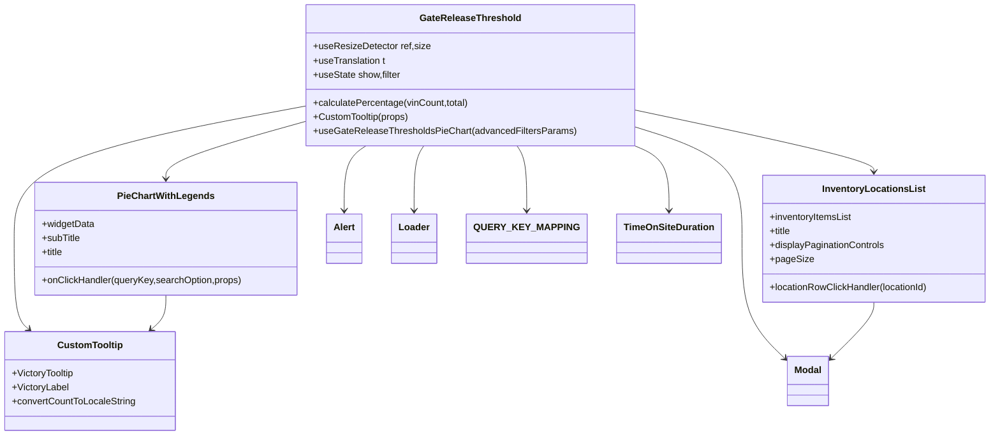

# Diagram: web/portal/src/pages/inventoryview/components/GateReleaseThreshold.PieChart.tsx


> Auto-generated by Obscura crawlers

## Diagram 1



### SVG

<svg id="container" width="1648.564453125" xmlns="http://www.w3.org/2000/svg" class="classDiagram" height="740" viewBox="0 0 1648.564453125 740" role="graphics-document document" aria-roledescription="class"><style>#container{font-family:"trebuchet ms",verdana,arial,sans-serif;font-size:16px;fill:#333;}@keyframes edge-animation-frame{from{stroke-dashoffset:0;}}@keyframes dash{to{stroke-dashoffset:0;}}#container .edge-animation-slow{stroke-dasharray:9,5!important;stroke-dashoffset:900;animation:dash 50s linear infinite;stroke-linecap:round;}#container .edge-animation-fast{stroke-dasharray:9,5!important;stroke-dashoffset:900;animation:dash 20s linear infinite;stroke-linecap:round;}#container .error-icon{fill:#552222;}#container .error-text{fill:#552222;stroke:#552222;}#container .edge-thickness-normal{stroke-width:1px;}#container .edge-thickness-thick{stroke-width:3.5px;}#container .edge-pattern-solid{stroke-dasharray:0;}#container .edge-thickness-invisible{stroke-width:0;fill:none;}#container .edge-pattern-dashed{stroke-dasharray:3;}#container .edge-pattern-dotted{stroke-dasharray:2;}#container .marker{fill:#333333;stroke:#333333;}#container .marker.cross{stroke:#333333;}#container svg{font-family:"trebuchet ms",verdana,arial,sans-serif;font-size:16px;}#container p{margin:0;}#container g.classGroup text{fill:#9370DB;stroke:none;font-family:"trebuchet ms",verdana,arial,sans-serif;font-size:10px;}#container g.classGroup text .title{font-weight:bolder;}#container .nodeLabel,#container .edgeLabel{color:#131300;}#container .edgeLabel .label rect{fill:#ECECFF;}#container .label text{fill:#131300;}#container .labelBkg{background:#ECECFF;}#container .edgeLabel .label span{background:#ECECFF;}#container .classTitle{font-weight:bolder;}#container .node rect,#container .node circle,#container .node ellipse,#container .node polygon,#container .node path{fill:#ECECFF;stroke:#9370DB;stroke-width:1px;}#container .divider{stroke:#9370DB;stroke-width:1;}#container g.clickable{cursor:pointer;}#container g.classGroup rect{fill:#ECECFF;stroke:#9370DB;}#container g.classGroup line{stroke:#9370DB;stroke-width:1;}#container .classLabel .box{stroke:none;stroke-width:0;fill:#ECECFF;opacity:0.5;}#container .classLabel .label{fill:#9370DB;font-size:10px;}#container .relation{stroke:#333333;stroke-width:1;fill:none;}#container .dashed-line{stroke-dasharray:3;}#container .dotted-line{stroke-dasharray:1 2;}#container #compositionStart,#container .composition{fill:#333333!important;stroke:#333333!important;stroke-width:1;}#container #compositionEnd,#container .composition{fill:#333333!important;stroke:#333333!important;stroke-width:1;}#container #dependencyStart,#container .dependency{fill:#333333!important;stroke:#333333!important;stroke-width:1;}#container #dependencyStart,#container .dependency{fill:#333333!important;stroke:#333333!important;stroke-width:1;}#container #extensionStart,#container .extension{fill:transparent!important;stroke:#333333!important;stroke-width:1;}#container #extensionEnd,#container .extension{fill:transparent!important;stroke:#333333!important;stroke-width:1;}#container #aggregationStart,#container .aggregation{fill:transparent!important;stroke:#333333!important;stroke-width:1;}#container #aggregationEnd,#container .aggregation{fill:transparent!important;stroke:#333333!important;stroke-width:1;}#container #lollipopStart,#container .lollipop{fill:#ECECFF!important;stroke:#333333!important;stroke-width:1;}#container #lollipopEnd,#container .lollipop{fill:#ECECFF!important;stroke:#333333!important;stroke-width:1;}#container .edgeTerminals{font-size:11px;line-height:initial;}#container .classTitleText{text-anchor:middle;font-size:18px;fill:#333;}#container .label-icon{display:inline-block;height:1em;overflow:visible;vertical-align:-0.125em;}#container .node .label-icon path{fill:currentColor;stroke:revert;stroke-width:revert;}#container :root{--mermaid-font-family:"trebuchet ms",verdana,arial,sans-serif;}</style><g><defs><marker id="container_class-aggregationStart" class="marker aggregation class" refX="18" refY="7" markerWidth="190" markerHeight="240" orient="auto"><path d="M 18,7 L9,13 L1,7 L9,1 Z"></path></marker></defs><defs><marker id="container_class-aggregationEnd" class="marker aggregation class" refX="1" refY="7" markerWidth="20" markerHeight="28" orient="auto"><path d="M 18,7 L9,13 L1,7 L9,1 Z"></path></marker></defs><defs><marker id="container_class-extensionStart" class="marker extension class" refX="18" refY="7" markerWidth="190" markerHeight="240" orient="auto"><path d="M 1,7 L18,13 V 1 Z"></path></marker></defs><defs><marker id="container_class-extensionEnd" class="marker extension class" refX="1" refY="7" markerWidth="20" markerHeight="28" orient="auto"><path d="M 1,1 V 13 L18,7 Z"></path></marker></defs><defs><marker id="container_class-compositionStart" class="marker composition class" refX="18" refY="7" markerWidth="190" markerHeight="240" orient="auto"><path d="M 18,7 L9,13 L1,7 L9,1 Z"></path></marker></defs><defs><marker id="container_class-compositionEnd" class="marker composition class" refX="1" refY="7" markerWidth="20" markerHeight="28" orient="auto"><path d="M 18,7 L9,13 L1,7 L9,1 Z"></path></marker></defs><defs><marker id="container_class-dependencyStart" class="marker dependency class" refX="6" refY="7" markerWidth="190" markerHeight="240" orient="auto"><path d="M 5,7 L9,13 L1,7 L9,1 Z"></path></marker></defs><defs><marker id="container_class-dependencyEnd" class="marker dependency class" refX="13" refY="7" markerWidth="20" markerHeight="28" orient="auto"><path d="M 18,7 L9,13 L14,7 L9,1 Z"></path></marker></defs><defs><marker id="container_class-lollipopStart" class="marker lollipop class" refX="13" refY="7" markerWidth="190" markerHeight="240" orient="auto"><circle stroke="black" fill="transparent" cx="7" cy="7" r="6"></circle></marker></defs><defs><marker id="container_class-lollipopEnd" class="marker lollipop class" refX="1" refY="7" markerWidth="190" markerHeight="240" orient="auto"><circle stroke="black" fill="transparent" cx="7" cy="7" r="6"></circle></marker></defs><g class="root"><g class="clusters"></g><g class="edgePaths"><path d="M515.189,179.791L433.21,195.326C351.231,210.861,187.273,241.93,105.294,279.632C23.314,317.333,23.314,361.667,23.314,406C23.314,450.333,23.314,494.667,27.466,520.353C31.618,546.04,39.922,553.08,44.074,556.6L48.226,560.12" id="id_GateReleaseThreshold_CustomTooltip_1" class="edge-thickness-normal edge-pattern-solid relation" style=";;;" data-edge="true" data-et="edge" data-id="id_GateReleaseThreshold_CustomTooltip_1" data-points="W3sieCI6NTE1LjE4OTQ1MzEyNSwieSI6MTc5Ljc5MTE2MDIwOTcxMjc2fSx7IngiOjIzLjMxNDQ1MzEyNSwieSI6MjczfSx7IngiOjIzLjMxNDQ1MzEyNSwieSI6NDA2fSx7IngiOjIzLjMxNDQ1MzEyNSwieSI6NTM5fSx7IngiOjUyLjgwMjYwODk0NDk1NDEzLCJ5Ijo1NjR9XQ==" marker-end="url(#container_class-dependencyEnd)"></path><path d="M515.189,206.004L476.066,217.17C436.943,228.336,358.697,250.668,319.574,267.001C280.451,283.333,280.451,293.667,280.451,298.833L280.451,304" id="id_GateReleaseThreshold_PieChartWithLegends_2" class="edge-thickness-normal edge-pattern-solid relation" style=";;;" data-edge="true" data-et="edge" data-id="id_GateReleaseThreshold_PieChartWithLegends_2" data-points="W3sieCI6NTE1LjE4OTQ1MzEyNSwieSI6MjA2LjAwNDExMzQ4NjA4MzMzfSx7IngiOjI4MC40NTExNzE4NzUsInkiOjI3M30seyJ4IjoyODAuNDUxMTcxODc1LCJ5IjozMTB9XQ==" marker-end="url(#container_class-dependencyEnd)"></path><path d="M1061.807,187.883L1126.553,202.069C1191.3,216.255,1320.794,244.628,1385.54,261.98C1450.287,279.333,1450.287,285.667,1450.287,288.833L1450.287,292" id="id_GateReleaseThreshold_InventoryLocationsList_3" class="edge-thickness-normal edge-pattern-solid relation" style=";;;" data-edge="true" data-et="edge" data-id="id_GateReleaseThreshold_InventoryLocationsList_3" data-points="W3sieCI6MTA2MS44MDY2NDA2MjUsInkiOjE4Ny44ODI3NDU2MzUwNTY1fSx7IngiOjE0NTAuMjg3MTA5Mzc1LCJ5IjoyNzN9LHsieCI6MTQ1MC4yODcxMDkzNzUsInkiOjI5OH1d" marker-end="url(#container_class-dependencyEnd)"></path><path d="M1061.807,218.787L1089.007,227.823C1116.208,236.858,1170.609,254.929,1197.809,286.131C1225.01,317.333,1225.01,361.667,1225.01,406C1225.01,450.333,1225.01,494.667,1237.323,528.749C1249.637,562.832,1274.264,586.663,1286.578,598.579L1298.891,610.495" id="id_GateReleaseThreshold_Modal_4" class="edge-thickness-normal edge-pattern-solid relation" style=";;;" data-edge="true" data-et="edge" data-id="id_GateReleaseThreshold_Modal_4" data-points="W3sieCI6MTA2MS44MDY2NDA2MjUsInkiOjIxOC43ODczNTg5NDQ3NTkxNX0seyJ4IjoxMjI1LjAwOTc2NTYyNSwieSI6MjczfSx7IngiOjEyMjUuMDA5NzY1NjI1LCJ5Ijo0MDZ9LHsieCI6MTIyNS4wMDk3NjU2MjUsInkiOjUzOX0seyJ4IjoxMzAzLjIwMzEyNSwieSI6NjE0LjY2NzQwNjQ5NTQ2NTd9XQ==" marker-end="url(#container_class-dependencyEnd)"></path><path d="M617.902,248L611.979,252.167C606.055,256.333,594.208,264.667,588.285,283C582.361,301.333,582.361,329.667,582.361,343.833L582.361,358" id="id_GateReleaseThreshold_Alert_5" class="edge-thickness-normal edge-pattern-solid relation" style=";;;" data-edge="true" data-et="edge" data-id="id_GateReleaseThreshold_Alert_5" data-points="W3sieCI6NjE3LjkwMjE0MTcwMjU4NjMsInkiOjI0OH0seyJ4Ijo1ODIuMzYxMzI4MTI1LCJ5IjoyNzN9LHsieCI6NTgyLjM2MTMyODEyNSwieSI6MzY0fV0=" marker-end="url(#container_class-dependencyEnd)"></path><path d="M714.794,248L712.235,252.167C709.676,256.333,704.558,264.667,701.999,283C699.439,301.333,699.439,329.667,699.439,343.833L699.439,358" id="id_GateReleaseThreshold_Loader_6" class="edge-thickness-normal edge-pattern-solid relation" style=";;;" data-edge="true" data-et="edge" data-id="id_GateReleaseThreshold_Loader_6" data-points="W3sieCI6NzE0Ljc5NDM4MzA4MTg5NjUsInkiOjI0OH0seyJ4Ijo2OTkuNDM5NDUzMTI1LCJ5IjoyNzN9LHsieCI6Njk5LjQzOTQ1MzEyNSwieSI6MzY0fV0=" marker-end="url(#container_class-dependencyEnd)"></path><path d="M862.202,248L864.761,252.167C867.32,256.333,872.438,264.667,874.997,283C877.557,301.333,877.557,329.667,877.557,343.833L877.557,358" id="id_GateReleaseThreshold_QUERY_KEY_MAPPING_7" class="edge-thickness-normal edge-pattern-solid relation" style=";;;" data-edge="true" data-et="edge" data-id="id_GateReleaseThreshold_QUERY_KEY_MAPPING_7" data-points="W3sieCI6ODYyLjIwMTcxMDY2ODEwMzUsInkiOjI0OH0seyJ4Ijo4NzcuNTU2NjQwNjI1LCJ5IjoyNzN9LHsieCI6ODc3LjU1NjY0MDYyNSwieSI6MzY0fV0=" marker-end="url(#container_class-dependencyEnd)"></path><path d="M1049.76,248L1058.831,252.167C1067.903,256.333,1086.046,264.667,1095.118,283C1104.189,301.333,1104.189,329.667,1104.189,343.833L1104.189,358" id="id_GateReleaseThreshold_TimeOnSiteDuration_8" class="edge-thickness-normal edge-pattern-solid relation" style=";;;" data-edge="true" data-et="edge" data-id="id_GateReleaseThreshold_TimeOnSiteDuration_8" data-points="W3sieCI6MTA0OS43NTk5MDAzMjMyNzU4LCJ5IjoyNDh9LHsieCI6MTEwNC4xODk0NTMxMjUsInkiOjI3M30seyJ4IjoxMTA0LjE4OTQ1MzEyNSwieSI6MzY0fV0=" marker-end="url(#container_class-dependencyEnd)"></path><path d="M280.451,502L280.451,508.167C280.451,514.333,280.451,526.667,276.299,536.353C272.147,546.04,263.843,553.08,259.692,556.6L255.54,560.12" id="id_PieChartWithLegends_CustomTooltip_9" class="edge-thickness-normal edge-pattern-solid relation" style=";;;" data-edge="true" data-et="edge" data-id="id_PieChartWithLegends_CustomTooltip_9" data-points="W3sieCI6MjgwLjQ1MTE3MTg3NSwieSI6NTAyfSx7IngiOjI4MC40NTExNzE4NzUsInkiOjUzOX0seyJ4IjoyNTAuOTYzMDE2MDU1MDQ1ODcsInkiOjU2NH1d" marker-end="url(#container_class-dependencyEnd)"></path><path d="M1450.287,514L1450.287,518.167C1450.287,522.333,1450.287,530.667,1437.974,546.749C1425.66,562.832,1401.033,586.663,1388.719,598.579L1376.405,610.495" id="id_InventoryLocationsList_Modal_10" class="edge-thickness-normal edge-pattern-solid relation" style=";;;" data-edge="true" data-et="edge" data-id="id_InventoryLocationsList_Modal_10" data-points="W3sieCI6MTQ1MC4yODcxMDkzNzUsInkiOjUxNH0seyJ4IjoxNDUwLjI4NzEwOTM3NSwieSI6NTM5fSx7IngiOjEzNzIuMDkzNzUsInkiOjYxNC42Njc0MDY0OTU0NjU3fV0=" marker-end="url(#container_class-dependencyEnd)"></path></g><g class="edgeLabels"><g class="edgeLabel"><g class="label" data-id="id_GateReleaseThreshold_CustomTooltip_1" transform="translate(0, 0)"><foreignObject width="0" height="0"><div xmlns="http://www.w3.org/1999/xhtml" class="labelBkg" style="display: table-cell; white-space: nowrap; line-height: 1.5; max-width: 200px; text-align: center;"><span class="edgeLabel"></span></div></foreignObject></g></g><g class="edgeLabel"><g class="label" data-id="id_GateReleaseThreshold_PieChartWithLegends_2" transform="translate(0, 0)"><foreignObject width="0" height="0"><div xmlns="http://www.w3.org/1999/xhtml" class="labelBkg" style="display: table-cell; white-space: nowrap; line-height: 1.5; max-width: 200px; text-align: center;"><span class="edgeLabel"></span></div></foreignObject></g></g><g class="edgeLabel"><g class="label" data-id="id_GateReleaseThreshold_InventoryLocationsList_3" transform="translate(0, 0)"><foreignObject width="0" height="0"><div xmlns="http://www.w3.org/1999/xhtml" class="labelBkg" style="display: table-cell; white-space: nowrap; line-height: 1.5; max-width: 200px; text-align: center;"><span class="edgeLabel"></span></div></foreignObject></g></g><g class="edgeLabel"><g class="label" data-id="id_GateReleaseThreshold_Modal_4" transform="translate(0, 0)"><foreignObject width="0" height="0"><div xmlns="http://www.w3.org/1999/xhtml" class="labelBkg" style="display: table-cell; white-space: nowrap; line-height: 1.5; max-width: 200px; text-align: center;"><span class="edgeLabel"></span></div></foreignObject></g></g><g class="edgeLabel"><g class="label" data-id="id_GateReleaseThreshold_Alert_5" transform="translate(0, 0)"><foreignObject width="0" height="0"><div xmlns="http://www.w3.org/1999/xhtml" class="labelBkg" style="display: table-cell; white-space: nowrap; line-height: 1.5; max-width: 200px; text-align: center;"><span class="edgeLabel"></span></div></foreignObject></g></g><g class="edgeLabel"><g class="label" data-id="id_GateReleaseThreshold_Loader_6" transform="translate(0, 0)"><foreignObject width="0" height="0"><div xmlns="http://www.w3.org/1999/xhtml" class="labelBkg" style="display: table-cell; white-space: nowrap; line-height: 1.5; max-width: 200px; text-align: center;"><span class="edgeLabel"></span></div></foreignObject></g></g><g class="edgeLabel"><g class="label" data-id="id_GateReleaseThreshold_QUERY_KEY_MAPPING_7" transform="translate(0, 0)"><foreignObject width="0" height="0"><div xmlns="http://www.w3.org/1999/xhtml" class="labelBkg" style="display: table-cell; white-space: nowrap; line-height: 1.5; max-width: 200px; text-align: center;"><span class="edgeLabel"></span></div></foreignObject></g></g><g class="edgeLabel"><g class="label" data-id="id_GateReleaseThreshold_TimeOnSiteDuration_8" transform="translate(0, 0)"><foreignObject width="0" height="0"><div xmlns="http://www.w3.org/1999/xhtml" class="labelBkg" style="display: table-cell; white-space: nowrap; line-height: 1.5; max-width: 200px; text-align: center;"><span class="edgeLabel"></span></div></foreignObject></g></g><g class="edgeLabel"><g class="label" data-id="id_PieChartWithLegends_CustomTooltip_9" transform="translate(0, 0)"><foreignObject width="0" height="0"><div xmlns="http://www.w3.org/1999/xhtml" class="labelBkg" style="display: table-cell; white-space: nowrap; line-height: 1.5; max-width: 200px; text-align: center;"><span class="edgeLabel"></span></div></foreignObject></g></g><g class="edgeLabel"><g class="label" data-id="id_InventoryLocationsList_Modal_10" transform="translate(0, 0)"><foreignObject width="0" height="0"><div xmlns="http://www.w3.org/1999/xhtml" class="labelBkg" style="display: table-cell; white-space: nowrap; line-height: 1.5; max-width: 200px; text-align: center;"><span class="edgeLabel"></span></div></foreignObject></g></g></g><g class="nodes"><g class="node default" id="classId-GateReleaseThreshold-0" transform="translate(788.498046875, 128)"><g class="basic label-container"><path d="M-273.30859375 -120 L273.30859375 -120 L273.30859375 120 L-273.30859375 120" stroke="none" stroke-width="0" fill="#ECECFF" style=""></path><path d="M-273.30859375 -120 C-138.91280966509368 -120, -4.517025580187351 -120, 273.30859375 -120 M-273.30859375 -120 C-144.08283612050388 -120, -14.85707849100777 -120, 273.30859375 -120 M273.30859375 -120 C273.30859375 -24.048706382419624, 273.30859375 71.90258723516075, 273.30859375 120 M273.30859375 -120 C273.30859375 -36.40278917698693, 273.30859375 47.19442164602614, 273.30859375 120 M273.30859375 120 C155.25104119343936 120, 37.193488636878726 120, -273.30859375 120 M273.30859375 120 C108.45617492722283 120, -56.396243895554335 120, -273.30859375 120 M-273.30859375 120 C-273.30859375 42.641209341119506, -273.30859375 -34.71758131776099, -273.30859375 -120 M-273.30859375 120 C-273.30859375 37.32050535155055, -273.30859375 -45.3589892968989, -273.30859375 -120" stroke="#9370DB" stroke-width="1.3" fill="none" stroke-dasharray="0 0" style=""></path></g><g class="annotation-group text" transform="translate(0, -96)"></g><g class="label-group text" transform="translate(-82.0078125, -96)"><g class="label" style="font-weight: bolder" transform="translate(0,-12)"><foreignObject width="164.015625" height="24"><div xmlns="http://www.w3.org/1999/xhtml" style="display: table-cell; white-space: nowrap; line-height: 1.5; max-width: 212px; text-align: center;"><span class="nodeLabel markdown-node-label" style=""><p>GateReleaseThreshold</p></span></div></foreignObject></g></g><g class="members-group text" transform="translate(-261.30859375, -48)"><g class="label" style="" transform="translate(0,-12)"><foreignObject width="195.921875" height="24"><div xmlns="http://www.w3.org/1999/xhtml" style="display: table-cell; white-space: nowrap; line-height: 1.5; max-width: 253px; text-align: center;"><span class="nodeLabel markdown-node-label" style=""><p>+useResizeDetector ref,size</p></span></div></foreignObject></g><g class="label" style="" transform="translate(0,12)"><foreignObject width="124.796875" height="24"><div xmlns="http://www.w3.org/1999/xhtml" style="display: table-cell; white-space: nowrap; line-height: 1.5; max-width: 182px; text-align: center;"><span class="nodeLabel markdown-node-label" style=""><p>+useTranslation t</p></span></div></foreignObject></g><g class="label" style="" transform="translate(0,36)"><foreignObject width="150.359375" height="24"><div xmlns="http://www.w3.org/1999/xhtml" style="display: table-cell; white-space: nowrap; line-height: 1.5; max-width: 209px; text-align: center;"><span class="nodeLabel markdown-node-label" style=""><p>+useState show,filter</p></span></div></foreignObject></g></g><g class="methods-group text" transform="translate(-261.30859375, 48)"><g class="label" style="" transform="translate(0,-12)"><foreignObject width="264.421875" height="24"><div xmlns="http://www.w3.org/1999/xhtml" style="display: table-cell; white-space: nowrap; line-height: 1.5; max-width: 322px; text-align: center;"><span class="nodeLabel markdown-node-label" style=""><p>+calculatePercentage(vinCount,total)</p></span></div></foreignObject></g><g class="label" style="" transform="translate(0,12)"><foreignObject width="164.5" height="24"><div xmlns="http://www.w3.org/1999/xhtml" style="display: table-cell; white-space: nowrap; line-height: 1.5; max-width: 222px; text-align: center;"><span class="nodeLabel markdown-node-label" style=""><p>+CustomTooltip(props)</p></span></div></foreignObject></g><g class="label" style="" transform="translate(0,36)"><foreignObject width="440.609375" height="24"><div xmlns="http://www.w3.org/1999/xhtml" style="display: table-cell; white-space: nowrap; line-height: 1.5; max-width: 498px; text-align: center;"><span class="nodeLabel markdown-node-label" style=""><p>+useGateReleaseThresholdsPieChart(advancedFiltersParams)</p></span></div></foreignObject></g></g><g class="divider" style=""><path d="M-273.30859375 -72 C-153.91565273217194 -72, -34.52271171434387 -72, 273.30859375 -72 M-273.30859375 -72 C-105.40648038544458 -72, 62.49563297911084 -72, 273.30859375 -72" stroke="#9370DB" stroke-width="1.3" fill="none" stroke-dasharray="0 0" style=""></path></g><g class="divider" style=""><path d="M-273.30859375 24 C-102.40935401561896 24, 68.48988571876208 24, 273.30859375 24 M-273.30859375 24 C-107.46038946638069 24, 58.38781481723862 24, 273.30859375 24" stroke="#9370DB" stroke-width="1.3" fill="none" stroke-dasharray="0 0" style=""></path></g></g><g class="node default" id="classId-CustomTooltip-1" transform="translate(151.8828125, 648)"><g class="basic label-container"><path d="M-143.8828125 -84 L143.8828125 -84 L143.8828125 84 L-143.8828125 84" stroke="none" stroke-width="0" fill="#ECECFF" style=""></path><path d="M-143.8828125 -84 C-67.8747469231901 -84, 8.133318653619796 -84, 143.8828125 -84 M-143.8828125 -84 C-75.74606707222208 -84, -7.609321644444151 -84, 143.8828125 -84 M143.8828125 -84 C143.8828125 -17.79337299032082, 143.8828125 48.41325401935836, 143.8828125 84 M143.8828125 -84 C143.8828125 -17.444331527021617, 143.8828125 49.111336945956765, 143.8828125 84 M143.8828125 84 C72.54440348190286 84, 1.2059944638057232 84, -143.8828125 84 M143.8828125 84 C51.79710080294019 84, -40.288610894119614 84, -143.8828125 84 M-143.8828125 84 C-143.8828125 26.594367735886266, -143.8828125 -30.81126452822747, -143.8828125 -84 M-143.8828125 84 C-143.8828125 44.24153344162057, -143.8828125 4.483066883241136, -143.8828125 -84" stroke="#9370DB" stroke-width="1.3" fill="none" stroke-dasharray="0 0" style=""></path></g><g class="annotation-group text" transform="translate(0, -60)"></g><g class="label-group text" transform="translate(-53.015625, -60)"><g class="label" style="font-weight: bolder" transform="translate(0,-12)"><foreignObject width="106.03125" height="24"><div xmlns="http://www.w3.org/1999/xhtml" style="display: table-cell; white-space: nowrap; line-height: 1.5; max-width: 155px; text-align: center;"><span class="nodeLabel markdown-node-label" style=""><p>CustomTooltip</p></span></div></foreignObject></g></g><g class="members-group text" transform="translate(-131.8828125, -12)"><g class="label" style="" transform="translate(0,-12)"><foreignObject width="108.140625" height="24"><div xmlns="http://www.w3.org/1999/xhtml" style="display: table-cell; white-space: nowrap; line-height: 1.5; max-width: 166px; text-align: center;"><span class="nodeLabel markdown-node-label" style=""><p>+VictoryTooltip</p></span></div></foreignObject></g><g class="label" style="" transform="translate(0,12)"><foreignObject width="97" height="24"><div xmlns="http://www.w3.org/1999/xhtml" style="display: table-cell; white-space: nowrap; line-height: 1.5; max-width: 155px; text-align: center;"><span class="nodeLabel markdown-node-label" style=""><p>+VictoryLabel</p></span></div></foreignObject></g><g class="label" style="" transform="translate(0,36)"><foreignObject width="210.75" height="24"><div xmlns="http://www.w3.org/1999/xhtml" style="display: table-cell; white-space: nowrap; line-height: 1.5; max-width: 269px; text-align: center;"><span class="nodeLabel markdown-node-label" style=""><p>+convertCountToLocaleString</p></span></div></foreignObject></g></g><g class="methods-group text" transform="translate(-131.8828125, 84)"></g><g class="divider" style=""><path d="M-143.8828125 -36 C-48.14998731888805 -36, 47.5828378622239 -36, 143.8828125 -36 M-143.8828125 -36 C-31.564158928633958 -36, 80.75449464273208 -36, 143.8828125 -36" stroke="#9370DB" stroke-width="1.3" fill="none" stroke-dasharray="0 0" style=""></path></g><g class="divider" style=""><path d="M-143.8828125 60 C-61.82855233710505 60, 20.225707825789897 60, 143.8828125 60 M-143.8828125 60 C-35.21208468284338 60, 73.45864313431323 60, 143.8828125 60" stroke="#9370DB" stroke-width="1.3" fill="none" stroke-dasharray="0 0" style=""></path></g></g><g class="node default" id="classId-PieChartWithLegends-2" transform="translate(280.451171875, 406)"><g class="basic label-container"><path d="M-222.13671875 -96 L222.13671875 -96 L222.13671875 96 L-222.13671875 96" stroke="none" stroke-width="0" fill="#ECECFF" style=""></path><path d="M-222.13671875 -96 C-104.65451683996766 -96, 12.827685070064689 -96, 222.13671875 -96 M-222.13671875 -96 C-115.51468732286818 -96, -8.892655895736368 -96, 222.13671875 -96 M222.13671875 -96 C222.13671875 -31.622878891049595, 222.13671875 32.75424221790081, 222.13671875 96 M222.13671875 -96 C222.13671875 -54.85887542538912, 222.13671875 -13.717750850778245, 222.13671875 96 M222.13671875 96 C96.93449640641782 96, -28.267725937164357 96, -222.13671875 96 M222.13671875 96 C103.95588513373589 96, -14.22494848252822 96, -222.13671875 96 M-222.13671875 96 C-222.13671875 29.509750433362314, -222.13671875 -36.98049913327537, -222.13671875 -96 M-222.13671875 96 C-222.13671875 23.318040451307283, -222.13671875 -49.363919097385434, -222.13671875 -96" stroke="#9370DB" stroke-width="1.3" fill="none" stroke-dasharray="0 0" style=""></path></g><g class="annotation-group text" transform="translate(0, -72)"></g><g class="label-group text" transform="translate(-78.2734375, -72)"><g class="label" style="font-weight: bolder" transform="translate(0,-12)"><foreignObject width="156.546875" height="24"><div xmlns="http://www.w3.org/1999/xhtml" style="display: table-cell; white-space: nowrap; line-height: 1.5; max-width: 204px; text-align: center;"><span class="nodeLabel markdown-node-label" style=""><p>PieChartWithLegends</p></span></div></foreignObject></g></g><g class="members-group text" transform="translate(-210.13671875, -24)"><g class="label" style="" transform="translate(0,-12)"><foreignObject width="89.3125" height="24"><div xmlns="http://www.w3.org/1999/xhtml" style="display: table-cell; white-space: nowrap; line-height: 1.5; max-width: 147px; text-align: center;"><span class="nodeLabel markdown-node-label" style=""><p>+widgetData</p></span></div></foreignObject></g><g class="label" style="" transform="translate(0,12)"><foreignObject width="66.015625" height="24"><div xmlns="http://www.w3.org/1999/xhtml" style="display: table-cell; white-space: nowrap; line-height: 1.5; max-width: 123px; text-align: center;"><span class="nodeLabel markdown-node-label" style=""><p>+subTitle</p></span></div></foreignObject></g><g class="label" style="" transform="translate(0,36)"><foreignObject width="37.140625" height="24"><div xmlns="http://www.w3.org/1999/xhtml" style="display: table-cell; white-space: nowrap; line-height: 1.5; max-width: 95px; text-align: center;"><span class="nodeLabel markdown-node-label" style=""><p>+title</p></span></div></foreignObject></g></g><g class="methods-group text" transform="translate(-210.13671875, 72)"><g class="label" style="" transform="translate(0,-12)"><foreignObject width="342" height="24"><div xmlns="http://www.w3.org/1999/xhtml" style="display: table-cell; white-space: nowrap; line-height: 1.5; max-width: 399px; text-align: center;"><span class="nodeLabel markdown-node-label" style=""><p>+onClickHandler(queryKey,searchOption,props)</p></span></div></foreignObject></g></g><g class="divider" style=""><path d="M-222.13671875 -48 C-108.5620887586126 -48, 5.012541232774794 -48, 222.13671875 -48 M-222.13671875 -48 C-120.26989838201071 -48, -18.403078014021418 -48, 222.13671875 -48" stroke="#9370DB" stroke-width="1.3" fill="none" stroke-dasharray="0 0" style=""></path></g><g class="divider" style=""><path d="M-222.13671875 48 C-111.80574383303971 48, -1.4747689160794266 48, 222.13671875 48 M-222.13671875 48 C-81.75440542754845 48, 58.6279078949031 48, 222.13671875 48" stroke="#9370DB" stroke-width="1.3" fill="none" stroke-dasharray="0 0" style=""></path></g></g><g class="node default" id="classId-InventoryLocationsList-3" transform="translate(1450.287109375, 406)"><g class="basic label-container"><path d="M-190.27734375 -108 L190.27734375 -108 L190.27734375 108 L-190.27734375 108" stroke="none" stroke-width="0" fill="#ECECFF" style=""></path><path d="M-190.27734375 -108 C-105.63772122008965 -108, -20.99809869017929 -108, 190.27734375 -108 M-190.27734375 -108 C-110.70242853594594 -108, -31.127513321891882 -108, 190.27734375 -108 M190.27734375 -108 C190.27734375 -53.58183346856039, 190.27734375 0.8363330628792198, 190.27734375 108 M190.27734375 -108 C190.27734375 -51.243624185984665, 190.27734375 5.512751628030671, 190.27734375 108 M190.27734375 108 C50.771483814636014 108, -88.73437612072797 108, -190.27734375 108 M190.27734375 108 C63.9087636852057 108, -62.4598163795886 108, -190.27734375 108 M-190.27734375 108 C-190.27734375 30.22105310839845, -190.27734375 -47.5578937832031, -190.27734375 -108 M-190.27734375 108 C-190.27734375 61.421965736838594, -190.27734375 14.843931473677188, -190.27734375 -108" stroke="#9370DB" stroke-width="1.3" fill="none" stroke-dasharray="0 0" style=""></path></g><g class="annotation-group text" transform="translate(0, -84)"></g><g class="label-group text" transform="translate(-83.4765625, -84)"><g class="label" style="font-weight: bolder" transform="translate(0,-12)"><foreignObject width="166.953125" height="24"><div xmlns="http://www.w3.org/1999/xhtml" style="display: table-cell; white-space: nowrap; line-height: 1.5; max-width: 214px; text-align: center;"><span class="nodeLabel markdown-node-label" style=""><p>InventoryLocationsList</p></span></div></foreignObject></g></g><g class="members-group text" transform="translate(-178.27734375, -36)"><g class="label" style="" transform="translate(0,-12)"><foreignObject width="142.484375" height="24"><div xmlns="http://www.w3.org/1999/xhtml" style="display: table-cell; white-space: nowrap; line-height: 1.5; max-width: 200px; text-align: center;"><span class="nodeLabel markdown-node-label" style=""><p>+inventoryItemsList</p></span></div></foreignObject></g><g class="label" style="" transform="translate(0,12)"><foreignObject width="37.140625" height="24"><div xmlns="http://www.w3.org/1999/xhtml" style="display: table-cell; white-space: nowrap; line-height: 1.5; max-width: 95px; text-align: center;"><span class="nodeLabel markdown-node-label" style=""><p>+title</p></span></div></foreignObject></g><g class="label" style="" transform="translate(0,36)"><foreignObject width="197.203125" height="24"><div xmlns="http://www.w3.org/1999/xhtml" style="display: table-cell; white-space: nowrap; line-height: 1.5; max-width: 255px; text-align: center;"><span class="nodeLabel markdown-node-label" style=""><p>+displayPaginationControls</p></span></div></foreignObject></g><g class="label" style="" transform="translate(0,60)"><foreignObject width="71.5" height="24"><div xmlns="http://www.w3.org/1999/xhtml" style="display: table-cell; white-space: nowrap; line-height: 1.5; max-width: 129px; text-align: center;"><span class="nodeLabel markdown-node-label" style=""><p>+pageSize</p></span></div></foreignObject></g></g><g class="methods-group text" transform="translate(-178.27734375, 84)"><g class="label" style="" transform="translate(0,-12)"><foreignObject width="273.078125" height="24"><div xmlns="http://www.w3.org/1999/xhtml" style="display: table-cell; white-space: nowrap; line-height: 1.5; max-width: 330px; text-align: center;"><span class="nodeLabel markdown-node-label" style=""><p>+locationRowClickHandler(locationId)</p></span></div></foreignObject></g></g><g class="divider" style=""><path d="M-190.27734375 -60 C-61.97200738282862 -60, 66.33332898434276 -60, 190.27734375 -60 M-190.27734375 -60 C-99.0283469740872 -60, -7.779350198174399 -60, 190.27734375 -60" stroke="#9370DB" stroke-width="1.3" fill="none" stroke-dasharray="0 0" style=""></path></g><g class="divider" style=""><path d="M-190.27734375 60 C-57.73428633545646 60, 74.80877107908708 60, 190.27734375 60 M-190.27734375 60 C-39.43801190282244 60, 111.40131994435512 60, 190.27734375 60" stroke="#9370DB" stroke-width="1.3" fill="none" stroke-dasharray="0 0" style=""></path></g></g><g class="node default" id="classId-Modal-4" transform="translate(1337.6484375, 648)"><g class="basic label-container"><path d="M-34.4453125 -42 L34.4453125 -42 L34.4453125 42 L-34.4453125 42" stroke="none" stroke-width="0" fill="#ECECFF" style=""></path><path d="M-34.4453125 -42 C-18.9146067123801 -42, -3.3839009247602014 -42, 34.4453125 -42 M-34.4453125 -42 C-19.338831245464654 -42, -4.232349990929311 -42, 34.4453125 -42 M34.4453125 -42 C34.4453125 -24.757002709455055, 34.4453125 -7.514005418910109, 34.4453125 42 M34.4453125 -42 C34.4453125 -14.354957673035678, 34.4453125 13.290084653928645, 34.4453125 42 M34.4453125 42 C20.56177438519991 42, 6.678236270399825 42, -34.4453125 42 M34.4453125 42 C16.593820162612715 42, -1.2576721747745694 42, -34.4453125 42 M-34.4453125 42 C-34.4453125 9.779335831034707, -34.4453125 -22.441328337930585, -34.4453125 -42 M-34.4453125 42 C-34.4453125 8.841706417290425, -34.4453125 -24.31658716541915, -34.4453125 -42" stroke="#9370DB" stroke-width="1.3" fill="none" stroke-dasharray="0 0" style=""></path></g><g class="annotation-group text" transform="translate(0, -18)"></g><g class="label-group text" transform="translate(-22.4453125, -18)"><g class="label" style="font-weight: bolder" transform="translate(0,-12)"><foreignObject width="44.890625" height="24"><div xmlns="http://www.w3.org/1999/xhtml" style="display: table-cell; white-space: nowrap; line-height: 1.5; max-width: 95px; text-align: center;"><span class="nodeLabel markdown-node-label" style=""><p>Modal</p></span></div></foreignObject></g></g><g class="members-group text" transform="translate(-22.4453125, 30)"></g><g class="methods-group text" transform="translate(-22.4453125, 60)"></g><g class="divider" style=""><path d="M-34.4453125 6 C-19.86394940828975 6, -5.282586316579497 6, 34.4453125 6 M-34.4453125 6 C-18.245819253692634 6, -2.046326007385268 6, 34.4453125 6" stroke="#9370DB" stroke-width="1.3" fill="none" stroke-dasharray="0 0" style=""></path></g><g class="divider" style=""><path d="M-34.4453125 24 C-8.947001494224022 24, 16.551309511551956 24, 34.4453125 24 M-34.4453125 24 C-7.631805173367788 24, 19.181702153264425 24, 34.4453125 24" stroke="#9370DB" stroke-width="1.3" fill="none" stroke-dasharray="0 0" style=""></path></g></g><g class="node default" id="classId-Alert-5" transform="translate(582.361328125, 406)"><g class="basic label-container"><path d="M-29.7734375 -42 L29.7734375 -42 L29.7734375 42 L-29.7734375 42" stroke="none" stroke-width="0" fill="#ECECFF" style=""></path><path d="M-29.7734375 -42 C-10.254171770674134 -42, 9.265093958651732 -42, 29.7734375 -42 M-29.7734375 -42 C-7.043146641564757 -42, 15.687144216870486 -42, 29.7734375 -42 M29.7734375 -42 C29.7734375 -15.039372621542249, 29.7734375 11.921254756915502, 29.7734375 42 M29.7734375 -42 C29.7734375 -15.771372048526096, 29.7734375 10.457255902947807, 29.7734375 42 M29.7734375 42 C15.925519627541183 42, 2.077601755082366 42, -29.7734375 42 M29.7734375 42 C15.570534772052735 42, 1.36763204410547 42, -29.7734375 42 M-29.7734375 42 C-29.7734375 20.184806255526343, -29.7734375 -1.6303874889473136, -29.7734375 -42 M-29.7734375 42 C-29.7734375 13.893557203788284, -29.7734375 -14.212885592423433, -29.7734375 -42" stroke="#9370DB" stroke-width="1.3" fill="none" stroke-dasharray="0 0" style=""></path></g><g class="annotation-group text" transform="translate(0, -18)"></g><g class="label-group text" transform="translate(-17.7734375, -18)"><g class="label" style="font-weight: bolder" transform="translate(0,-12)"><foreignObject width="35.546875" height="24"><div xmlns="http://www.w3.org/1999/xhtml" style="display: table-cell; white-space: nowrap; line-height: 1.5; max-width: 85px; text-align: center;"><span class="nodeLabel markdown-node-label" style=""><p>Alert</p></span></div></foreignObject></g></g><g class="members-group text" transform="translate(-17.7734375, 30)"></g><g class="methods-group text" transform="translate(-17.7734375, 60)"></g><g class="divider" style=""><path d="M-29.7734375 6 C-12.358185144485052 6, 5.057067211029896 6, 29.7734375 6 M-29.7734375 6 C-11.791778826505269 6, 6.189879846989463 6, 29.7734375 6" stroke="#9370DB" stroke-width="1.3" fill="none" stroke-dasharray="0 0" style=""></path></g><g class="divider" style=""><path d="M-29.7734375 24 C-15.46746689265818 24, -1.1614962853163604 24, 29.7734375 24 M-29.7734375 24 C-8.130329221935074 24, 13.512779056129851 24, 29.7734375 24" stroke="#9370DB" stroke-width="1.3" fill="none" stroke-dasharray="0 0" style=""></path></g></g><g class="node default" id="classId-Loader-6" transform="translate(699.439453125, 406)"><g class="basic label-container"><path d="M-37.3046875 -42 L37.3046875 -42 L37.3046875 42 L-37.3046875 42" stroke="none" stroke-width="0" fill="#ECECFF" style=""></path><path d="M-37.3046875 -42 C-22.343418773347928 -42, -7.382150046695855 -42, 37.3046875 -42 M-37.3046875 -42 C-21.305562628494556 -42, -5.306437756989109 -42, 37.3046875 -42 M37.3046875 -42 C37.3046875 -16.36196021970908, 37.3046875 9.276079560581842, 37.3046875 42 M37.3046875 -42 C37.3046875 -13.54811305529062, 37.3046875 14.903773889418758, 37.3046875 42 M37.3046875 42 C12.486346823873081 42, -12.331993852253838 42, -37.3046875 42 M37.3046875 42 C20.497207789078534 42, 3.689728078157067 42, -37.3046875 42 M-37.3046875 42 C-37.3046875 20.331691580996, -37.3046875 -1.3366168380079984, -37.3046875 -42 M-37.3046875 42 C-37.3046875 13.868228127956915, -37.3046875 -14.26354374408617, -37.3046875 -42" stroke="#9370DB" stroke-width="1.3" fill="none" stroke-dasharray="0 0" style=""></path></g><g class="annotation-group text" transform="translate(0, -18)"></g><g class="label-group text" transform="translate(-25.3046875, -18)"><g class="label" style="font-weight: bolder" transform="translate(0,-12)"><foreignObject width="50.609375" height="24"><div xmlns="http://www.w3.org/1999/xhtml" style="display: table-cell; white-space: nowrap; line-height: 1.5; max-width: 101px; text-align: center;"><span class="nodeLabel markdown-node-label" style=""><p>Loader</p></span></div></foreignObject></g></g><g class="members-group text" transform="translate(-25.3046875, 30)"></g><g class="methods-group text" transform="translate(-25.3046875, 60)"></g><g class="divider" style=""><path d="M-37.3046875 6 C-8.145517210145911 6, 21.013653079708178 6, 37.3046875 6 M-37.3046875 6 C-12.10517804993951 6, 13.094331400120979 6, 37.3046875 6" stroke="#9370DB" stroke-width="1.3" fill="none" stroke-dasharray="0 0" style=""></path></g><g class="divider" style=""><path d="M-37.3046875 24 C-20.150491065034778 24, -2.9962946300695563 24, 37.3046875 24 M-37.3046875 24 C-10.278161509313161 24, 16.748364481373677 24, 37.3046875 24" stroke="#9370DB" stroke-width="1.3" fill="none" stroke-dasharray="0 0" style=""></path></g></g><g class="node default" id="classId-QUERY_KEY_MAPPING-7" transform="translate(877.556640625, 406)"><g class="basic label-container"><path d="M-90.8125 -42 L90.8125 -42 L90.8125 42 L-90.8125 42" stroke="none" stroke-width="0" fill="#ECECFF" style=""></path><path d="M-90.8125 -42 C-37.14748212843898 -42, 16.51753574312204 -42, 90.8125 -42 M-90.8125 -42 C-24.49088367988243 -42, 41.83073264023514 -42, 90.8125 -42 M90.8125 -42 C90.8125 -8.485492397004066, 90.8125 25.02901520599187, 90.8125 42 M90.8125 -42 C90.8125 -10.80549750826517, 90.8125 20.38900498346966, 90.8125 42 M90.8125 42 C39.87788699359324 42, -11.056726012813513 42, -90.8125 42 M90.8125 42 C43.067436486523356 42, -4.677627026953289 42, -90.8125 42 M-90.8125 42 C-90.8125 18.289003329888253, -90.8125 -5.421993340223494, -90.8125 -42 M-90.8125 42 C-90.8125 10.355471165598647, -90.8125 -21.289057668802705, -90.8125 -42" stroke="#9370DB" stroke-width="1.3" fill="none" stroke-dasharray="0 0" style=""></path></g><g class="annotation-group text" transform="translate(0, -18)"></g><g class="label-group text" transform="translate(-78.8125, -18)"><g class="label" style="font-weight: bolder" transform="translate(0,-12)"><foreignObject width="157.625" height="24"><div xmlns="http://www.w3.org/1999/xhtml" style="display: table-cell; white-space: nowrap; line-height: 1.5; max-width: 205px; text-align: center;"><span class="nodeLabel markdown-node-label" style=""><p>QUERY_KEY_MAPPING</p></span></div></foreignObject></g></g><g class="members-group text" transform="translate(-78.8125, 30)"></g><g class="methods-group text" transform="translate(-78.8125, 60)"></g><g class="divider" style=""><path d="M-90.8125 6 C-34.5996956532402 6, 21.613108693519607 6, 90.8125 6 M-90.8125 6 C-25.341587336673257 6, 40.129325326653486 6, 90.8125 6" stroke="#9370DB" stroke-width="1.3" fill="none" stroke-dasharray="0 0" style=""></path></g><g class="divider" style=""><path d="M-90.8125 24 C-36.21089005843469 24, 18.390719883130615 24, 90.8125 24 M-90.8125 24 C-20.239898654829958 24, 50.332702690340085 24, 90.8125 24" stroke="#9370DB" stroke-width="1.3" fill="none" stroke-dasharray="0 0" style=""></path></g></g><g class="node default" id="classId-TimeOnSiteDuration-8" transform="translate(1104.189453125, 406)"><g class="basic label-container"><path d="M-85.8203125 -42 L85.8203125 -42 L85.8203125 42 L-85.8203125 42" stroke="none" stroke-width="0" fill="#ECECFF" style=""></path><path d="M-85.8203125 -42 C-39.08447608508956 -42, 7.651360329820875 -42, 85.8203125 -42 M-85.8203125 -42 C-29.55065287639843 -42, 26.71900674720314 -42, 85.8203125 -42 M85.8203125 -42 C85.8203125 -14.34494778671915, 85.8203125 13.3101044265617, 85.8203125 42 M85.8203125 -42 C85.8203125 -22.336428300934372, 85.8203125 -2.6728566018687445, 85.8203125 42 M85.8203125 42 C32.98000198652819 42, -19.860308526943626 42, -85.8203125 42 M85.8203125 42 C37.487875724553135 42, -10.84456105089373 42, -85.8203125 42 M-85.8203125 42 C-85.8203125 19.014687869916354, -85.8203125 -3.970624260167291, -85.8203125 -42 M-85.8203125 42 C-85.8203125 11.420105838180092, -85.8203125 -19.159788323639816, -85.8203125 -42" stroke="#9370DB" stroke-width="1.3" fill="none" stroke-dasharray="0 0" style=""></path></g><g class="annotation-group text" transform="translate(0, -18)"></g><g class="label-group text" transform="translate(-73.8203125, -18)"><g class="label" style="font-weight: bolder" transform="translate(0,-12)"><foreignObject width="147.640625" height="24"><div xmlns="http://www.w3.org/1999/xhtml" style="display: table-cell; white-space: nowrap; line-height: 1.5; max-width: 196px; text-align: center;"><span class="nodeLabel markdown-node-label" style=""><p>TimeOnSiteDuration</p></span></div></foreignObject></g></g><g class="members-group text" transform="translate(-73.8203125, 30)"></g><g class="methods-group text" transform="translate(-73.8203125, 60)"></g><g class="divider" style=""><path d="M-85.8203125 6 C-48.4353718462578 6, -11.050431192515603 6, 85.8203125 6 M-85.8203125 6 C-44.28132090330875 6, -2.7423293066175063 6, 85.8203125 6" stroke="#9370DB" stroke-width="1.3" fill="none" stroke-dasharray="0 0" style=""></path></g><g class="divider" style=""><path d="M-85.8203125 24 C-21.79247456745965 24, 42.2353633650807 24, 85.8203125 24 M-85.8203125 24 C-41.00979498267831 24, 3.800722534643384 24, 85.8203125 24" stroke="#9370DB" stroke-width="1.3" fill="none" stroke-dasharray="0 0" style=""></path></g></g></g></g></g></svg>

## Diagram 2

```mermaid
flowchart TD
    A[useGateReleaseThresholdsPieChart(advancedFiltersParams)] -->|returns| B[pieChartData / isFetching / isError]
    B --> C{isFetching?}
    C -- yes --> D[Loader]
    C -- no --> E[PieChartWithLegends]
    E --> F[Render pie with labelComponent CustomTooltip]
    F --> G[User clicks slice]
    G --> H[onClickHandler(queryKey, searchOption, props)]
    H --> I[setFilterData & setShow(true)]
    H --> J[fetchLocations(searchOption & advancedFiltersParams)]
    J --> K[isLocationsLoading ? Loader : InventoryLocationsList]
    K --> L[InventoryLocationsList.locationRowClickHandler(locationId)]
    L --> M{filter.searchOption exists?}
    M -- yes --> N[resetSearchAndFilters(); setSearchFilter(...); redirectToDetailsView(solutionId, locationId)]
    M -- no --> O[no-op]
```

> SVG rendering failed for this diagram.
