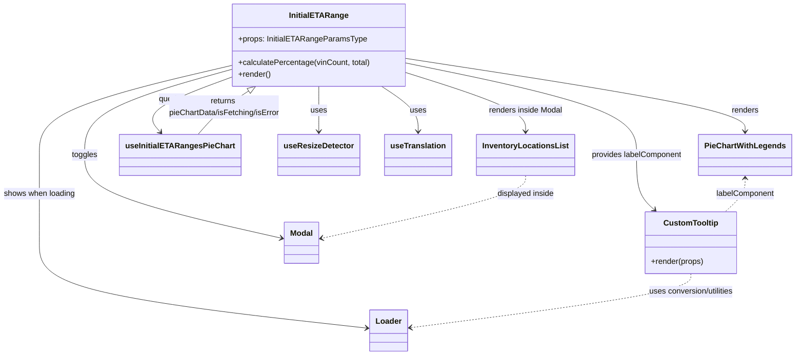

# Diagram: web/portal/src/pages/inventoryview/components/InitialETARange.PieChart.tsx


> Auto-generated by Obscura crawlers

## Diagram 1



### SVG

<svg id="container" width="1598.4765625" xmlns="http://www.w3.org/2000/svg" class="classDiagram" height="724" viewBox="0 0 1598.4765625 724" role="graphics-document document" aria-roledescription="class"><style>#container{font-family:"trebuchet ms",verdana,arial,sans-serif;font-size:16px;fill:#333;}@keyframes edge-animation-frame{from{stroke-dashoffset:0;}}@keyframes dash{to{stroke-dashoffset:0;}}#container .edge-animation-slow{stroke-dasharray:9,5!important;stroke-dashoffset:900;animation:dash 50s linear infinite;stroke-linecap:round;}#container .edge-animation-fast{stroke-dasharray:9,5!important;stroke-dashoffset:900;animation:dash 20s linear infinite;stroke-linecap:round;}#container .error-icon{fill:#552222;}#container .error-text{fill:#552222;stroke:#552222;}#container .edge-thickness-normal{stroke-width:1px;}#container .edge-thickness-thick{stroke-width:3.5px;}#container .edge-pattern-solid{stroke-dasharray:0;}#container .edge-thickness-invisible{stroke-width:0;fill:none;}#container .edge-pattern-dashed{stroke-dasharray:3;}#container .edge-pattern-dotted{stroke-dasharray:2;}#container .marker{fill:#333333;stroke:#333333;}#container .marker.cross{stroke:#333333;}#container svg{font-family:"trebuchet ms",verdana,arial,sans-serif;font-size:16px;}#container p{margin:0;}#container g.classGroup text{fill:#9370DB;stroke:none;font-family:"trebuchet ms",verdana,arial,sans-serif;font-size:10px;}#container g.classGroup text .title{font-weight:bolder;}#container .nodeLabel,#container .edgeLabel{color:#131300;}#container .edgeLabel .label rect{fill:#ECECFF;}#container .label text{fill:#131300;}#container .labelBkg{background:#ECECFF;}#container .edgeLabel .label span{background:#ECECFF;}#container .classTitle{font-weight:bolder;}#container .node rect,#container .node circle,#container .node ellipse,#container .node polygon,#container .node path{fill:#ECECFF;stroke:#9370DB;stroke-width:1px;}#container .divider{stroke:#9370DB;stroke-width:1;}#container g.clickable{cursor:pointer;}#container g.classGroup rect{fill:#ECECFF;stroke:#9370DB;}#container g.classGroup line{stroke:#9370DB;stroke-width:1;}#container .classLabel .box{stroke:none;stroke-width:0;fill:#ECECFF;opacity:0.5;}#container .classLabel .label{fill:#9370DB;font-size:10px;}#container .relation{stroke:#333333;stroke-width:1;fill:none;}#container .dashed-line{stroke-dasharray:3;}#container .dotted-line{stroke-dasharray:1 2;}#container #compositionStart,#container .composition{fill:#333333!important;stroke:#333333!important;stroke-width:1;}#container #compositionEnd,#container .composition{fill:#333333!important;stroke:#333333!important;stroke-width:1;}#container #dependencyStart,#container .dependency{fill:#333333!important;stroke:#333333!important;stroke-width:1;}#container #dependencyStart,#container .dependency{fill:#333333!important;stroke:#333333!important;stroke-width:1;}#container #extensionStart,#container .extension{fill:transparent!important;stroke:#333333!important;stroke-width:1;}#container #extensionEnd,#container .extension{fill:transparent!important;stroke:#333333!important;stroke-width:1;}#container #aggregationStart,#container .aggregation{fill:transparent!important;stroke:#333333!important;stroke-width:1;}#container #aggregationEnd,#container .aggregation{fill:transparent!important;stroke:#333333!important;stroke-width:1;}#container #lollipopStart,#container .lollipop{fill:#ECECFF!important;stroke:#333333!important;stroke-width:1;}#container #lollipopEnd,#container .lollipop{fill:#ECECFF!important;stroke:#333333!important;stroke-width:1;}#container .edgeTerminals{font-size:11px;line-height:initial;}#container .classTitleText{text-anchor:middle;font-size:18px;fill:#333;}#container .label-icon{display:inline-block;height:1em;overflow:visible;vertical-align:-0.125em;}#container .node .label-icon path{fill:currentColor;stroke:revert;stroke-width:revert;}#container :root{--mermaid-font-family:"trebuchet ms",verdana,arial,sans-serif;}</style><g><defs><marker id="container_class-aggregationStart" class="marker aggregation class" refX="18" refY="7" markerWidth="190" markerHeight="240" orient="auto"><path d="M 18,7 L9,13 L1,7 L9,1 Z"></path></marker></defs><defs><marker id="container_class-aggregationEnd" class="marker aggregation class" refX="1" refY="7" markerWidth="20" markerHeight="28" orient="auto"><path d="M 18,7 L9,13 L1,7 L9,1 Z"></path></marker></defs><defs><marker id="container_class-extensionStart" class="marker extension class" refX="18" refY="7" markerWidth="190" markerHeight="240" orient="auto"><path d="M 1,7 L18,13 V 1 Z"></path></marker></defs><defs><marker id="container_class-extensionEnd" class="marker extension class" refX="1" refY="7" markerWidth="20" markerHeight="28" orient="auto"><path d="M 1,1 V 13 L18,7 Z"></path></marker></defs><defs><marker id="container_class-compositionStart" class="marker composition class" refX="18" refY="7" markerWidth="190" markerHeight="240" orient="auto"><path d="M 18,7 L9,13 L1,7 L9,1 Z"></path></marker></defs><defs><marker id="container_class-compositionEnd" class="marker composition class" refX="1" refY="7" markerWidth="20" markerHeight="28" orient="auto"><path d="M 18,7 L9,13 L1,7 L9,1 Z"></path></marker></defs><defs><marker id="container_class-dependencyStart" class="marker dependency class" refX="6" refY="7" markerWidth="190" markerHeight="240" orient="auto"><path d="M 5,7 L9,13 L1,7 L9,1 Z"></path></marker></defs><defs><marker id="container_class-dependencyEnd" class="marker dependency class" refX="13" refY="7" markerWidth="20" markerHeight="28" orient="auto"><path d="M 18,7 L9,13 L14,7 L9,1 Z"></path></marker></defs><defs><marker id="container_class-lollipopStart" class="marker lollipop class" refX="13" refY="7" markerWidth="190" markerHeight="240" orient="auto"><circle stroke="black" fill="transparent" cx="7" cy="7" r="6"></circle></marker></defs><defs><marker id="container_class-lollipopEnd" class="marker lollipop class" refX="1" refY="7" markerWidth="190" markerHeight="240" orient="auto"><circle stroke="black" fill="transparent" cx="7" cy="7" r="6"></circle></marker></defs><g class="root"><g class="clusters"></g><g class="edgePaths"><path d="M650.047,176L650.047,184.167C650.047,192.333,650.047,208.667,650.047,224C650.047,239.333,650.047,253.667,650.047,260.833L650.047,268" id="id_InitialETARange_useResizeDetector_1" class="edge-thickness-normal edge-pattern-solid relation" style=";;;" data-edge="true" data-et="edge" data-id="id_InitialETARange_useResizeDetector_1" data-points="W3sieCI6NjUwLjA0Njg3NSwieSI6MTc2fSx7IngiOjY1MC4wNDY4NzUsInkiOjIyNX0seyJ4Ijo2NTAuMDQ2ODc1LCJ5IjoyNzR9XQ==" marker-end="url(#container_class-dependencyEnd)"></path><path d="M773.807,176L785.839,184.167C797.871,192.333,821.936,208.667,833.968,224C846,239.333,846,253.667,846,260.833L846,268" id="id_InitialETARange_useTranslation_2" class="edge-thickness-normal edge-pattern-solid relation" style=";;;" data-edge="true" data-et="edge" data-id="id_InitialETARange_useTranslation_2" data-points="W3sieCI6NzczLjgwNjc0MzQyMTA1MjYsInkiOjE3Nn0seyJ4Ijo4NDYsInkiOjIyNX0seyJ4Ijo4NDYsInkiOjI3NH1d" marker-end="url(#container_class-dependencyEnd)"></path><path d="M475.18,156.123L443.874,167.602C412.569,179.082,349.958,202.041,325.31,220.943C300.661,239.844,313.974,254.689,320.631,262.111L327.287,269.533" id="id_InitialETARange_useInitialETARangesPieChart_3" class="edge-thickness-normal edge-pattern-solid relation" style=";;;" data-edge="true" data-et="edge" data-id="id_InitialETARange_useInitialETARangesPieChart_3" data-points="W3sieCI6NDc1LjE3OTY4NzUsInkiOjE1Ni4xMjI5MjgxMzIxNjg3NH0seyJ4IjoyODcuMzQ3NjU2MjUsInkiOjIyNX0seyJ4IjozMzEuMjkzMjY5MjMwNzY5MiwieSI6Mjc0fV0=" marker-end="url(#container_class-dependencyEnd)"></path><path d="M824.914,119.357L937.462,136.964C1050.01,154.571,1275.107,189.786,1387.655,214.559C1500.203,239.333,1500.203,253.667,1500.203,260.833L1500.203,268" id="id_InitialETARange_PieChartWithLegends_4" class="edge-thickness-normal edge-pattern-solid relation" style=";;;" data-edge="true" data-et="edge" data-id="id_InitialETARange_PieChartWithLegends_4" data-points="W3sieCI6ODI0LjkxNDA2MjUsInkiOjExOS4zNTY1NDI5MTQ5MDUzNX0seyJ4IjoxNTAwLjIwMzEyNSwieSI6MjI1fSx7IngiOjE1MDAuMjAzMTI1LCJ5IjoyNzR9XQ==" marker-end="url(#container_class-dependencyEnd)"></path><path d="M824.914,128.832L901.009,144.86C977.104,160.888,1129.294,192.944,1205.389,224.139C1281.484,255.333,1281.484,285.667,1281.484,314C1281.484,342.333,1281.484,368.667,1287.49,387.325C1293.496,405.984,1305.508,416.967,1311.514,422.459L1317.519,427.951" id="id_InitialETARange_CustomTooltip_5" class="edge-thickness-normal edge-pattern-solid relation" style=";;;" data-edge="true" data-et="edge" data-id="id_InitialETARange_CustomTooltip_5" data-points="W3sieCI6ODI0LjkxNDA2MjUsInkiOjEyOC44MzIzNjQxNDkyNjI2fSx7IngiOjEyODEuNDg0Mzc1LCJ5IjoyMjV9LHsieCI6MTI4MS40ODQzNzUsInkiOjMxNn0seyJ4IjoxMjgxLjQ4NDM3NSwieSI6Mzk1fSx7IngiOjEzMjEuOTQ3MzQzNzUsInkiOjQzMn1d" marker-end="url(#container_class-dependencyEnd)"></path><path d="M475.18,140.942L425.124,154.952C375.068,168.961,274.956,196.981,224.9,226.157C174.844,255.333,174.844,285.667,174.844,314C174.844,342.333,174.844,368.667,240.166,396.946C305.489,425.226,436.134,455.452,501.457,470.565L566.779,485.678" id="id_InitialETARange_Modal_6" class="edge-thickness-normal edge-pattern-solid relation" style=";;;" data-edge="true" data-et="edge" data-id="id_InitialETARange_Modal_6" data-points="W3sieCI6NDc1LjE3OTY4NzUsInkiOjE0MC45NDE4ODM0MDUxMjI4fSx7IngiOjE3NC44NDM3NSwieSI6MjI1fSx7IngiOjE3NC44NDM3NSwieSI6MzE2fSx7IngiOjE3NC44NDM3NSwieSI6Mzk1fSx7IngiOjU3Mi42MjUsInkiOjQ4Ny4wMzA3Mjc1MTkyMDQ3fV0=" marker-end="url(#container_class-dependencyEnd)"></path><path d="M475.18,132.901L409.553,148.251C343.927,163.601,212.674,194.3,147.048,224.817C81.422,255.333,81.422,285.667,81.422,314C81.422,342.333,81.422,368.667,81.422,398.5C81.422,428.333,81.422,461.667,81.422,495C81.422,528.333,81.422,561.667,190.92,590.686C300.419,619.706,519.416,644.413,628.914,656.766L738.413,669.119" id="id_InitialETARange_Loader_7" class="edge-thickness-normal edge-pattern-solid relation" style=";;;" data-edge="true" data-et="edge" data-id="id_InitialETARange_Loader_7" data-points="W3sieCI6NDc1LjE3OTY4NzUsInkiOjEzMi45MDEwMDg0NjMzOTg1NH0seyJ4Ijo4MS40MjE4NzUsInkiOjIyNX0seyJ4Ijo4MS40MjE4NzUsInkiOjMxNn0seyJ4Ijo4MS40MjE4NzUsInkiOjM5NX0seyJ4Ijo4MS40MjE4NzUsInkiOjQ5NX0seyJ4Ijo4MS40MjE4NzUsInkiOjU5NX0seyJ4Ijo3NDQuMzc1LCJ5Ijo2NjkuNzkxNDQ5NTc3NzIyNX1d" marker-end="url(#container_class-dependencyEnd)"></path><path d="M824.914,149.071L863.689,161.726C902.464,174.381,980.013,199.69,1018.788,219.512C1057.563,239.333,1057.563,253.667,1057.563,260.833L1057.563,268" id="id_InitialETARange_InventoryLocationsList_8" class="edge-thickness-normal edge-pattern-solid relation" style=";;;" data-edge="true" data-et="edge" data-id="id_InitialETARange_InventoryLocationsList_8" data-points="W3sieCI6ODI0LjkxNDA2MjUsInkiOjE0OS4wNzEwMjg3MTgyMjR9LHsieCI6MTA1Ny41NjI1LCJ5IjoyMjV9LHsieCI6MTA1Ny41NjI1LCJ5IjoyNzR9XQ==" marker-end="url(#container_class-dependencyEnd)"></path><path d="M1390.844,558L1390.844,564.167C1390.844,570.333,1390.844,582.667,1296.526,601.065C1202.207,619.463,1013.571,643.927,919.253,656.159L824.935,668.39" id="id_CustomTooltip_Loader_9" class="edge-thickness-normal edge-pattern-dashed relation" style=";;;" data-edge="true" data-et="edge" data-id="id_CustomTooltip_Loader_9" data-points="W3sieCI6MTM5MC44NDM3NSwieSI6NTU4fSx7IngiOjEzOTAuODQzNzUsInkiOjU5NX0seyJ4Ijo4MTguOTg0Mzc1LCJ5Ijo2NjkuMTYyMTA3Mzk2MTV9XQ==" marker-end="url(#container_class-dependencyEnd)"></path><path d="M1500.203,364L1500.203,369.167C1500.203,374.333,1500.203,384.667,1493.459,396C1486.715,407.333,1473.228,419.667,1466.484,425.833L1459.74,432" id="id_PieChartWithLegends_CustomTooltip_10" class="edge-thickness-normal edge-pattern-dashed relation" style=";;;" data-edge="true" data-et="edge" data-id="id_PieChartWithLegends_CustomTooltip_10" data-points="W3sieCI6MTUwMC4yMDMxMjUsInkiOjM1OH0seyJ4IjoxNTAwLjIwMzEyNSwieSI6Mzk1fSx7IngiOjE0NTkuNzQwMTU2MjUsInkiOjQzMn1d" marker-start="url(#container_class-dependencyStart)"></path><path d="M1057.563,358L1057.563,364.167C1057.563,370.333,1057.563,382.667,989.198,404.009C920.833,425.351,784.103,455.702,715.738,470.878L647.373,486.054" id="id_InventoryLocationsList_Modal_11" class="edge-thickness-normal edge-pattern-dashed relation" style=";;;" data-edge="true" data-et="edge" data-id="id_InventoryLocationsList_Modal_11" data-points="W3sieCI6MTA1Ny41NjI1LCJ5IjozNTh9LHsieCI6MTA1Ny41NjI1LCJ5IjozOTV9LHsieCI6NjQxLjUxNTYyNSwieSI6NDg3LjM1Mzg0OTA4ODY3MDM2fV0=" marker-end="url(#container_class-dependencyEnd)"></path><path d="M406.629,274L413.953,265.833C421.277,257.667,435.926,241.333,453.106,226.595C470.287,211.856,489.999,198.713,499.856,192.141L509.712,185.569" id="id_useInitialETARangesPieChart_InitialETARange_12" class="edge-thickness-normal edge-pattern-solid relation" style=";;;" data-edge="true" data-et="edge" data-id="id_useInitialETARangesPieChart_InitialETARange_12" data-points="W3sieCI6NDA2LjYyODYwNTc2OTIzMDgsInkiOjI3NH0seyJ4Ijo0NTAuNTc0MjE4NzUsInkiOjIyNX0seyJ4Ijo1MjQuMDY0MTQ0NzM2ODQyMSwieSI6MTc2fV0=" marker-end="url(#container_class-extensionEnd)"></path></g><g class="edgeLabels"><g class="edgeLabel" transform="translate(650.046875, 225)"><g class="label" data-id="id_InitialETARange_useResizeDetector_1" transform="translate(-16.4921875, -12)"><foreignObject width="32.984375" height="24"><div xmlns="http://www.w3.org/1999/xhtml" class="labelBkg" style="display: table-cell; white-space: nowrap; line-height: 1.5; max-width: 200px; text-align: center;"><span class="edgeLabel"><p>uses</p></span></div></foreignObject></g></g><g class="edgeLabel" transform="translate(846, 225)"><g class="label" data-id="id_InitialETARange_useTranslation_2" transform="translate(-16.4921875, -12)"><foreignObject width="32.984375" height="24"><div xmlns="http://www.w3.org/1999/xhtml" class="labelBkg" style="display: table-cell; white-space: nowrap; line-height: 1.5; max-width: 200px; text-align: center;"><span class="edgeLabel"><p>uses</p></span></div></foreignObject></g></g><g class="edgeLabel" transform="translate(350.36573, 201.89158)"><g class="label" data-id="id_InitialETARange_useInitialETARangesPieChart_3" transform="translate(-27.2421875, -12)"><foreignObject width="54.484375" height="24"><div xmlns="http://www.w3.org/1999/xhtml" class="labelBkg" style="display: table-cell; white-space: nowrap; line-height: 1.5; max-width: 200px; text-align: center;"><span class="edgeLabel"><p>queries</p></span></div></foreignObject></g></g><g class="edgeLabel" transform="translate(1500.203125, 225)"><g class="label" data-id="id_InitialETARange_PieChartWithLegends_4" transform="translate(-27.75, -12)"><foreignObject width="55.5" height="24"><div xmlns="http://www.w3.org/1999/xhtml" class="labelBkg" style="display: table-cell; white-space: nowrap; line-height: 1.5; max-width: 200px; text-align: center;"><span class="edgeLabel"><p>renders</p></span></div></foreignObject></g></g><g class="edgeLabel" transform="translate(1281.484375, 316)"><g class="label" data-id="id_InitialETARange_CustomTooltip_5" transform="translate(-93.4453125, -12)"><foreignObject width="186.890625" height="24"><div xmlns="http://www.w3.org/1999/xhtml" class="labelBkg" style="display: table-cell; white-space: nowrap; line-height: 1.5; max-width: 200px; text-align: center;"><span class="edgeLabel"><p>provides labelComponent</p></span></div></foreignObject></g></g><g class="edgeLabel" transform="translate(174.84375, 316)"><g class="label" data-id="id_InitialETARange_Modal_6" transform="translate(-26.1640625, -12)"><foreignObject width="52.328125" height="24"><div xmlns="http://www.w3.org/1999/xhtml" class="labelBkg" style="display: table-cell; white-space: nowrap; line-height: 1.5; max-width: 200px; text-align: center;"><span class="edgeLabel"><p>toggles</p></span></div></foreignObject></g></g><g class="edgeLabel" transform="translate(81.421875, 395)"><g class="label" data-id="id_InitialETARange_Loader_7" transform="translate(-73.421875, -12)"><foreignObject width="146.84375" height="24"><div xmlns="http://www.w3.org/1999/xhtml" class="labelBkg" style="display: table-cell; white-space: nowrap; line-height: 1.5; max-width: 200px; text-align: center;"><span class="edgeLabel"><p>shows when loading</p></span></div></foreignObject></g></g><g class="edgeLabel" transform="translate(1057.5625, 225)"><g class="label" data-id="id_InitialETARange_InventoryLocationsList_8" transform="translate(-76.3671875, -12)"><foreignObject width="152.734375" height="24"><div xmlns="http://www.w3.org/1999/xhtml" class="labelBkg" style="display: table-cell; white-space: nowrap; line-height: 1.5; max-width: 200px; text-align: center;"><span class="edgeLabel"><p>renders inside Modal</p></span></div></foreignObject></g></g><g class="edgeLabel" transform="translate(1390.84375, 595)"><g class="label" data-id="id_CustomTooltip_Loader_9" transform="translate(-89.7265625, -12)"><foreignObject width="179.453125" height="24"><div xmlns="http://www.w3.org/1999/xhtml" class="labelBkg" style="display: table-cell; white-space: nowrap; line-height: 1.5; max-width: 200px; text-align: center;"><span class="edgeLabel"><p>uses conversion/utilities</p></span></div></foreignObject></g></g><g class="edgeLabel" transform="translate(1500.203125, 395)"><g class="label" data-id="id_PieChartWithLegends_CustomTooltip_10" transform="translate(-60.015625, -12)"><foreignObject width="120.03125" height="24"><div xmlns="http://www.w3.org/1999/xhtml" class="labelBkg" style="display: table-cell; white-space: nowrap; line-height: 1.5; max-width: 200px; text-align: center;"><span class="edgeLabel"><p>labelComponent</p></span></div></foreignObject></g></g><g class="edgeLabel" transform="translate(1057.5625, 395)"><g class="label" data-id="id_InventoryLocationsList_Modal_11" transform="translate(-59.3125, -12)"><foreignObject width="118.625" height="24"><div xmlns="http://www.w3.org/1999/xhtml" class="labelBkg" style="display: table-cell; white-space: nowrap; line-height: 1.5; max-width: 200px; text-align: center;"><span class="edgeLabel"><p>displayed inside</p></span></div></foreignObject></g></g><g class="edgeLabel" transform="translate(459.93774, 218.7568)"><g class="label" data-id="id_useInitialETARangesPieChart_InitialETARange_12" transform="translate(-115.984375, -24)"><foreignObject width="231.96875" height="48"><div xmlns="http://www.w3.org/1999/xhtml" class="labelBkg" style="display: table; white-space: break-spaces; line-height: 1.5; max-width: 200px; text-align: center; width: 200px;"><span class="edgeLabel"><p>returns pieChartData/isFetching/isError</p></span></div></foreignObject></g></g></g><g class="nodes"><g class="node default" id="classId-InitialETARange-0" transform="translate(650.046875, 92)"><g class="basic label-container"><path d="M-174.8671875 -84 L174.8671875 -84 L174.8671875 84 L-174.8671875 84" stroke="none" stroke-width="0" fill="#ECECFF" style=""></path><path d="M-174.8671875 -84 C-77.9311180529048 -84, 19.004951394190414 -84, 174.8671875 -84 M-174.8671875 -84 C-100.9948256181486 -84, -27.122463736297192 -84, 174.8671875 -84 M174.8671875 -84 C174.8671875 -19.60300641298447, 174.8671875 44.79398717403106, 174.8671875 84 M174.8671875 -84 C174.8671875 -20.51946489602171, 174.8671875 42.96107020795658, 174.8671875 84 M174.8671875 84 C66.01193317718261 84, -42.843321145634775 84, -174.8671875 84 M174.8671875 84 C59.4473898779124 84, -55.9724077441752 84, -174.8671875 84 M-174.8671875 84 C-174.8671875 25.978974964820978, -174.8671875 -32.042050070358044, -174.8671875 -84 M-174.8671875 84 C-174.8671875 48.31145326978407, -174.8671875 12.622906539568135, -174.8671875 -84" stroke="#9370DB" stroke-width="1.3" fill="none" stroke-dasharray="0 0" style=""></path></g><g class="annotation-group text" transform="translate(0, -60)"></g><g class="label-group text" transform="translate(-56.59375, -60)"><g class="label" style="font-weight: bolder" transform="translate(0,-12)"><foreignObject width="113.1875" height="24"><div xmlns="http://www.w3.org/1999/xhtml" style="display: table-cell; white-space: nowrap; line-height: 1.5; max-width: 162px; text-align: center;"><span class="nodeLabel markdown-node-label" style=""><p>InitialETARange</p></span></div></foreignObject></g></g><g class="members-group text" transform="translate(-162.8671875, -12)"><g class="label" style="" transform="translate(0,-12)"><foreignObject width="255.65625" height="24"><div xmlns="http://www.w3.org/1999/xhtml" style="display: table-cell; white-space: nowrap; line-height: 1.5; max-width: 313px; text-align: center;"><span class="nodeLabel markdown-node-label" style=""><p>+props: InitialETARangeParamsType</p></span></div></foreignObject></g></g><g class="methods-group text" transform="translate(-162.8671875, 36)"><g class="label" style="" transform="translate(0,-12)"><foreignObject width="269.140625" height="24"><div xmlns="http://www.w3.org/1999/xhtml" style="display: table-cell; white-space: nowrap; line-height: 1.5; max-width: 327px; text-align: center;"><span class="nodeLabel markdown-node-label" style=""><p>+calculatePercentage(vinCount, total)</p></span></div></foreignObject></g><g class="label" style="" transform="translate(0,12)"><foreignObject width="66.609375" height="24"><div xmlns="http://www.w3.org/1999/xhtml" style="display: table-cell; white-space: nowrap; line-height: 1.5; max-width: 124px; text-align: center;"><span class="nodeLabel markdown-node-label" style=""><p>+render()</p></span></div></foreignObject></g></g><g class="divider" style=""><path d="M-174.8671875 -36 C-95.25195191179759 -36, -15.63671632359518 -36, 174.8671875 -36 M-174.8671875 -36 C-44.013315358672884 -36, 86.84055678265423 -36, 174.8671875 -36" stroke="#9370DB" stroke-width="1.3" fill="none" stroke-dasharray="0 0" style=""></path></g><g class="divider" style=""><path d="M-174.8671875 12 C-86.93679865990231 12, 0.9935901801953833 12, 174.8671875 12 M-174.8671875 12 C-48.074488348982655 12, 78.71821080203469 12, 174.8671875 12" stroke="#9370DB" stroke-width="1.3" fill="none" stroke-dasharray="0 0" style=""></path></g></g><g class="node default" id="classId-CustomTooltip-1" transform="translate(1390.84375, 495)"><g class="basic label-container"><path d="M-92.578125 -63 L92.578125 -63 L92.578125 63 L-92.578125 63" stroke="none" stroke-width="0" fill="#ECECFF" style=""></path><path d="M-92.578125 -63 C-43.579168087021735 -63, 5.41978882595653 -63, 92.578125 -63 M-92.578125 -63 C-33.073026407274305 -63, 26.43207218545139 -63, 92.578125 -63 M92.578125 -63 C92.578125 -21.28812937041986, 92.578125 20.42374125916028, 92.578125 63 M92.578125 -63 C92.578125 -34.339954526064076, 92.578125 -5.679909052128146, 92.578125 63 M92.578125 63 C50.62373218394611 63, 8.66933936789222 63, -92.578125 63 M92.578125 63 C51.51989379498 63, 10.46166258996 63, -92.578125 63 M-92.578125 63 C-92.578125 27.07547524720026, -92.578125 -8.849049505599481, -92.578125 -63 M-92.578125 63 C-92.578125 18.24709444906714, -92.578125 -26.505811101865717, -92.578125 -63" stroke="#9370DB" stroke-width="1.3" fill="none" stroke-dasharray="0 0" style=""></path></g><g class="annotation-group text" transform="translate(0, -39)"></g><g class="label-group text" transform="translate(-53.015625, -39)"><g class="label" style="font-weight: bolder" transform="translate(0,-12)"><foreignObject width="106.03125" height="24"><div xmlns="http://www.w3.org/1999/xhtml" style="display: table-cell; white-space: nowrap; line-height: 1.5; max-width: 155px; text-align: center;"><span class="nodeLabel markdown-node-label" style=""><p>CustomTooltip</p></span></div></foreignObject></g></g><g class="members-group text" transform="translate(-80.578125, 9)"></g><g class="methods-group text" transform="translate(-80.578125, 39)"><g class="label" style="" transform="translate(0,-12)"><foreignObject width="108.140625" height="24"><div xmlns="http://www.w3.org/1999/xhtml" style="display: table-cell; white-space: nowrap; line-height: 1.5; max-width: 166px; text-align: center;"><span class="nodeLabel markdown-node-label" style=""><p>+render(props)</p></span></div></foreignObject></g></g><g class="divider" style=""><path d="M-92.578125 -15 C-20.262267648460877 -15, 52.053589703078245 -15, 92.578125 -15 M-92.578125 -15 C-29.334150831951007 -15, 33.909823336097986 -15, 92.578125 -15" stroke="#9370DB" stroke-width="1.3" fill="none" stroke-dasharray="0 0" style=""></path></g><g class="divider" style=""><path d="M-92.578125 9 C-27.970718850798974 9, 36.63668729840205 9, 92.578125 9 M-92.578125 9 C-26.316777431274076 9, 39.94457013745185 9, 92.578125 9" stroke="#9370DB" stroke-width="1.3" fill="none" stroke-dasharray="0 0" style=""></path></g></g><g class="node default" id="classId-PieChartWithLegends-2" transform="translate(1500.203125, 316)"><g class="basic label-container"><path d="M-90.2734375 -42 L90.2734375 -42 L90.2734375 42 L-90.2734375 42" stroke="none" stroke-width="0" fill="#ECECFF" style=""></path><path d="M-90.2734375 -42 C-50.39514198629065 -42, -10.516846472581307 -42, 90.2734375 -42 M-90.2734375 -42 C-23.84524504568425 -42, 42.5829474086315 -42, 90.2734375 -42 M90.2734375 -42 C90.2734375 -20.068933049136447, 90.2734375 1.8621339017271055, 90.2734375 42 M90.2734375 -42 C90.2734375 -10.755674141150923, 90.2734375 20.488651717698154, 90.2734375 42 M90.2734375 42 C20.940460163971593 42, -48.39251717205681 42, -90.2734375 42 M90.2734375 42 C30.157378584969713 42, -29.958680330060574 42, -90.2734375 42 M-90.2734375 42 C-90.2734375 22.120745185851035, -90.2734375 2.2414903717020707, -90.2734375 -42 M-90.2734375 42 C-90.2734375 9.563095517639987, -90.2734375 -22.873808964720027, -90.2734375 -42" stroke="#9370DB" stroke-width="1.3" fill="none" stroke-dasharray="0 0" style=""></path></g><g class="annotation-group text" transform="translate(0, -18)"></g><g class="label-group text" transform="translate(-78.2734375, -18)"><g class="label" style="font-weight: bolder" transform="translate(0,-12)"><foreignObject width="156.546875" height="24"><div xmlns="http://www.w3.org/1999/xhtml" style="display: table-cell; white-space: nowrap; line-height: 1.5; max-width: 204px; text-align: center;"><span class="nodeLabel markdown-node-label" style=""><p>PieChartWithLegends</p></span></div></foreignObject></g></g><g class="members-group text" transform="translate(-78.2734375, 30)"></g><g class="methods-group text" transform="translate(-78.2734375, 60)"></g><g class="divider" style=""><path d="M-90.2734375 6 C-52.32348759639984 6, -14.373537692799687 6, 90.2734375 6 M-90.2734375 6 C-23.444743325722314 6, 43.38395084855537 6, 90.2734375 6" stroke="#9370DB" stroke-width="1.3" fill="none" stroke-dasharray="0 0" style=""></path></g><g class="divider" style=""><path d="M-90.2734375 24 C-31.348582537028186 24, 27.57627242594363 24, 90.2734375 24 M-90.2734375 24 C-36.64185257053521 24, 16.989732358929587 24, 90.2734375 24" stroke="#9370DB" stroke-width="1.3" fill="none" stroke-dasharray="0 0" style=""></path></g></g><g class="node default" id="classId-InventoryLocationsList-3" transform="translate(1057.5625, 316)"><g class="basic label-container"><path d="M-95.4765625 -42 L95.4765625 -42 L95.4765625 42 L-95.4765625 42" stroke="none" stroke-width="0" fill="#ECECFF" style=""></path><path d="M-95.4765625 -42 C-46.34562628818425 -42, 2.7853099236315018 -42, 95.4765625 -42 M-95.4765625 -42 C-56.56242725301023 -42, -17.648292006020455 -42, 95.4765625 -42 M95.4765625 -42 C95.4765625 -21.621989701695863, 95.4765625 -1.2439794033917266, 95.4765625 42 M95.4765625 -42 C95.4765625 -19.624006035397763, 95.4765625 2.751987929204475, 95.4765625 42 M95.4765625 42 C29.900111688101063 42, -35.676339123797874 42, -95.4765625 42 M95.4765625 42 C39.71121147161054 42, -16.05413955677892 42, -95.4765625 42 M-95.4765625 42 C-95.4765625 15.57746750196737, -95.4765625 -10.845064996065261, -95.4765625 -42 M-95.4765625 42 C-95.4765625 17.68407243991613, -95.4765625 -6.631855120167742, -95.4765625 -42" stroke="#9370DB" stroke-width="1.3" fill="none" stroke-dasharray="0 0" style=""></path></g><g class="annotation-group text" transform="translate(0, -18)"></g><g class="label-group text" transform="translate(-83.4765625, -18)"><g class="label" style="font-weight: bolder" transform="translate(0,-12)"><foreignObject width="166.953125" height="24"><div xmlns="http://www.w3.org/1999/xhtml" style="display: table-cell; white-space: nowrap; line-height: 1.5; max-width: 214px; text-align: center;"><span class="nodeLabel markdown-node-label" style=""><p>InventoryLocationsList</p></span></div></foreignObject></g></g><g class="members-group text" transform="translate(-83.4765625, 30)"></g><g class="methods-group text" transform="translate(-83.4765625, 60)"></g><g class="divider" style=""><path d="M-95.4765625 6 C-20.85138920875464 6, 53.77378408249072 6, 95.4765625 6 M-95.4765625 6 C-29.934909457173816 6, 35.60674358565237 6, 95.4765625 6" stroke="#9370DB" stroke-width="1.3" fill="none" stroke-dasharray="0 0" style=""></path></g><g class="divider" style=""><path d="M-95.4765625 24 C-22.03472768886121 24, 51.40710712227758 24, 95.4765625 24 M-95.4765625 24 C-19.338672136722437 24, 56.799218226555126 24, 95.4765625 24" stroke="#9370DB" stroke-width="1.3" fill="none" stroke-dasharray="0 0" style=""></path></g></g><g class="node default" id="classId-Modal-4" transform="translate(607.0703125, 495)"><g class="basic label-container"><path d="M-34.4453125 -42 L34.4453125 -42 L34.4453125 42 L-34.4453125 42" stroke="none" stroke-width="0" fill="#ECECFF" style=""></path><path d="M-34.4453125 -42 C-8.719331220425058 -42, 17.006650059149884 -42, 34.4453125 -42 M-34.4453125 -42 C-19.879173254626124 -42, -5.313034009252252 -42, 34.4453125 -42 M34.4453125 -42 C34.4453125 -9.709251008482035, 34.4453125 22.58149798303593, 34.4453125 42 M34.4453125 -42 C34.4453125 -20.458044906966776, 34.4453125 1.083910186066447, 34.4453125 42 M34.4453125 42 C8.760333253067813 42, -16.924645993864374 42, -34.4453125 42 M34.4453125 42 C13.987770823931523 42, -6.4697708521369535 42, -34.4453125 42 M-34.4453125 42 C-34.4453125 16.849711457750576, -34.4453125 -8.300577084498848, -34.4453125 -42 M-34.4453125 42 C-34.4453125 23.47327153078588, -34.4453125 4.946543061571759, -34.4453125 -42" stroke="#9370DB" stroke-width="1.3" fill="none" stroke-dasharray="0 0" style=""></path></g><g class="annotation-group text" transform="translate(0, -18)"></g><g class="label-group text" transform="translate(-22.4453125, -18)"><g class="label" style="font-weight: bolder" transform="translate(0,-12)"><foreignObject width="44.890625" height="24"><div xmlns="http://www.w3.org/1999/xhtml" style="display: table-cell; white-space: nowrap; line-height: 1.5; max-width: 95px; text-align: center;"><span class="nodeLabel markdown-node-label" style=""><p>Modal</p></span></div></foreignObject></g></g><g class="members-group text" transform="translate(-22.4453125, 30)"></g><g class="methods-group text" transform="translate(-22.4453125, 60)"></g><g class="divider" style=""><path d="M-34.4453125 6 C-15.455198805069205 6, 3.5349148898615894 6, 34.4453125 6 M-34.4453125 6 C-8.757052835188297 6, 16.931206829623406 6, 34.4453125 6" stroke="#9370DB" stroke-width="1.3" fill="none" stroke-dasharray="0 0" style=""></path></g><g class="divider" style=""><path d="M-34.4453125 24 C-20.402064861449833 24, -6.358817222899667 24, 34.4453125 24 M-34.4453125 24 C-16.933974666594235 24, 0.57736316681153 24, 34.4453125 24" stroke="#9370DB" stroke-width="1.3" fill="none" stroke-dasharray="0 0" style=""></path></g></g><g class="node default" id="classId-Loader-5" transform="translate(781.6796875, 674)"><g class="basic label-container"><path d="M-37.3046875 -42 L37.3046875 -42 L37.3046875 42 L-37.3046875 42" stroke="none" stroke-width="0" fill="#ECECFF" style=""></path><path d="M-37.3046875 -42 C-21.33017265831475 -42, -5.355657816629499 -42, 37.3046875 -42 M-37.3046875 -42 C-18.9692821044609 -42, -0.6338767089217967 -42, 37.3046875 -42 M37.3046875 -42 C37.3046875 -20.155063224609215, 37.3046875 1.68987355078157, 37.3046875 42 M37.3046875 -42 C37.3046875 -13.18322664231508, 37.3046875 15.633546715369839, 37.3046875 42 M37.3046875 42 C9.995788528487537 42, -17.313110443024925 42, -37.3046875 42 M37.3046875 42 C9.461505538906874 42, -18.381676422186253 42, -37.3046875 42 M-37.3046875 42 C-37.3046875 20.815516343067998, -37.3046875 -0.3689673138640046, -37.3046875 -42 M-37.3046875 42 C-37.3046875 24.64862270473352, -37.3046875 7.297245409467038, -37.3046875 -42" stroke="#9370DB" stroke-width="1.3" fill="none" stroke-dasharray="0 0" style=""></path></g><g class="annotation-group text" transform="translate(0, -18)"></g><g class="label-group text" transform="translate(-25.3046875, -18)"><g class="label" style="font-weight: bolder" transform="translate(0,-12)"><foreignObject width="50.609375" height="24"><div xmlns="http://www.w3.org/1999/xhtml" style="display: table-cell; white-space: nowrap; line-height: 1.5; max-width: 101px; text-align: center;"><span class="nodeLabel markdown-node-label" style=""><p>Loader</p></span></div></foreignObject></g></g><g class="members-group text" transform="translate(-25.3046875, 30)"></g><g class="methods-group text" transform="translate(-25.3046875, 60)"></g><g class="divider" style=""><path d="M-37.3046875 6 C-18.45445126919082 6, 0.39578496161836085 6, 37.3046875 6 M-37.3046875 6 C-20.11396506790326 6, -2.923242635806517 6, 37.3046875 6" stroke="#9370DB" stroke-width="1.3" fill="none" stroke-dasharray="0 0" style=""></path></g><g class="divider" style=""><path d="M-37.3046875 24 C-18.11477361195143 24, 1.0751402760971374 24, 37.3046875 24 M-37.3046875 24 C-21.171474721753498 24, -5.0382619435069955 24, 37.3046875 24" stroke="#9370DB" stroke-width="1.3" fill="none" stroke-dasharray="0 0" style=""></path></g></g><g class="node default" id="classId-useInitialETARangesPieChart-6" transform="translate(368.9609375, 316)"><g class="basic label-container"><path d="M-116.6015625 -42 L116.6015625 -42 L116.6015625 42 L-116.6015625 42" stroke="none" stroke-width="0" fill="#ECECFF" style=""></path><path d="M-116.6015625 -42 C-33.671885606564786 -42, 49.25779128687043 -42, 116.6015625 -42 M-116.6015625 -42 C-56.334956167191784 -42, 3.931650165616432 -42, 116.6015625 -42 M116.6015625 -42 C116.6015625 -12.788916945448257, 116.6015625 16.422166109103486, 116.6015625 42 M116.6015625 -42 C116.6015625 -11.625604364869616, 116.6015625 18.748791270260767, 116.6015625 42 M116.6015625 42 C25.42789543582461 42, -65.74577162835078 42, -116.6015625 42 M116.6015625 42 C45.51603522668583 42, -25.56949204662834 42, -116.6015625 42 M-116.6015625 42 C-116.6015625 22.819287631965757, -116.6015625 3.6385752639315143, -116.6015625 -42 M-116.6015625 42 C-116.6015625 14.893505066710908, -116.6015625 -12.212989866578184, -116.6015625 -42" stroke="#9370DB" stroke-width="1.3" fill="none" stroke-dasharray="0 0" style=""></path></g><g class="annotation-group text" transform="translate(0, -18)"></g><g class="label-group text" transform="translate(-104.6015625, -18)"><g class="label" style="font-weight: bolder" transform="translate(0,-12)"><foreignObject width="209.203125" height="24"><div xmlns="http://www.w3.org/1999/xhtml" style="display: table-cell; white-space: nowrap; line-height: 1.5; max-width: 256px; text-align: center;"><span class="nodeLabel markdown-node-label" style=""><p>useInitialETARangesPieChart</p></span></div></foreignObject></g></g><g class="members-group text" transform="translate(-104.6015625, 30)"></g><g class="methods-group text" transform="translate(-104.6015625, 60)"></g><g class="divider" style=""><path d="M-116.6015625 6 C-69.00328951399706 6, -21.405016527994107 6, 116.6015625 6 M-116.6015625 6 C-24.910495658731563 6, 66.78057118253687 6, 116.6015625 6" stroke="#9370DB" stroke-width="1.3" fill="none" stroke-dasharray="0 0" style=""></path></g><g class="divider" style=""><path d="M-116.6015625 24 C-61.55910805663381 24, -6.516653613267621 24, 116.6015625 24 M-116.6015625 24 C-39.11329300969746 24, 38.374976480605085 24, 116.6015625 24" stroke="#9370DB" stroke-width="1.3" fill="none" stroke-dasharray="0 0" style=""></path></g></g><g class="node default" id="classId-useResizeDetector-7" transform="translate(650.046875, 316)"><g class="basic label-container"><path d="M-79.8671875 -42 L79.8671875 -42 L79.8671875 42 L-79.8671875 42" stroke="none" stroke-width="0" fill="#ECECFF" style=""></path><path d="M-79.8671875 -42 C-33.003754522728215 -42, 13.85967845454357 -42, 79.8671875 -42 M-79.8671875 -42 C-31.38421715365586 -42, 17.098753192688278 -42, 79.8671875 -42 M79.8671875 -42 C79.8671875 -14.242984517715609, 79.8671875 13.514030964568782, 79.8671875 42 M79.8671875 -42 C79.8671875 -13.838616632609689, 79.8671875 14.322766734780622, 79.8671875 42 M79.8671875 42 C22.5322756187957 42, -34.8026362624086 42, -79.8671875 42 M79.8671875 42 C18.814013400555616 42, -42.23916069888877 42, -79.8671875 42 M-79.8671875 42 C-79.8671875 18.405516871220378, -79.8671875 -5.188966257559244, -79.8671875 -42 M-79.8671875 42 C-79.8671875 24.214431924242437, -79.8671875 6.428863848484873, -79.8671875 -42" stroke="#9370DB" stroke-width="1.3" fill="none" stroke-dasharray="0 0" style=""></path></g><g class="annotation-group text" transform="translate(0, -18)"></g><g class="label-group text" transform="translate(-67.8671875, -18)"><g class="label" style="font-weight: bolder" transform="translate(0,-12)"><foreignObject width="135.734375" height="24"><div xmlns="http://www.w3.org/1999/xhtml" style="display: table-cell; white-space: nowrap; line-height: 1.5; max-width: 184px; text-align: center;"><span class="nodeLabel markdown-node-label" style=""><p>useResizeDetector</p></span></div></foreignObject></g></g><g class="members-group text" transform="translate(-67.8671875, 30)"></g><g class="methods-group text" transform="translate(-67.8671875, 60)"></g><g class="divider" style=""><path d="M-79.8671875 6 C-21.723282562027094 6, 36.42062237594581 6, 79.8671875 6 M-79.8671875 6 C-44.225035095413766 6, -8.582882690827532 6, 79.8671875 6" stroke="#9370DB" stroke-width="1.3" fill="none" stroke-dasharray="0 0" style=""></path></g><g class="divider" style=""><path d="M-79.8671875 24 C-25.953274058027453 24, 27.960639383945093 24, 79.8671875 24 M-79.8671875 24 C-40.00849768417947 24, -0.14980786835893412 24, 79.8671875 24" stroke="#9370DB" stroke-width="1.3" fill="none" stroke-dasharray="0 0" style=""></path></g></g><g class="node default" id="classId-useTranslation-8" transform="translate(846, 316)"><g class="basic label-container"><path d="M-66.0859375 -42 L66.0859375 -42 L66.0859375 42 L-66.0859375 42" stroke="none" stroke-width="0" fill="#ECECFF" style=""></path><path d="M-66.0859375 -42 C-29.70193031165431 -42, 6.682076876691383 -42, 66.0859375 -42 M-66.0859375 -42 C-24.767344927910884 -42, 16.551247644178233 -42, 66.0859375 -42 M66.0859375 -42 C66.0859375 -16.932220859364847, 66.0859375 8.135558281270306, 66.0859375 42 M66.0859375 -42 C66.0859375 -9.773162373580284, 66.0859375 22.45367525283943, 66.0859375 42 M66.0859375 42 C27.390165844126408 42, -11.305605811747185 42, -66.0859375 42 M66.0859375 42 C37.38282149134004 42, 8.67970548268007 42, -66.0859375 42 M-66.0859375 42 C-66.0859375 15.23758613951086, -66.0859375 -11.52482772097828, -66.0859375 -42 M-66.0859375 42 C-66.0859375 15.025996782932452, -66.0859375 -11.948006434135095, -66.0859375 -42" stroke="#9370DB" stroke-width="1.3" fill="none" stroke-dasharray="0 0" style=""></path></g><g class="annotation-group text" transform="translate(0, -18)"></g><g class="label-group text" transform="translate(-54.0859375, -18)"><g class="label" style="font-weight: bolder" transform="translate(0,-12)"><foreignObject width="108.171875" height="24"><div xmlns="http://www.w3.org/1999/xhtml" style="display: table-cell; white-space: nowrap; line-height: 1.5; max-width: 157px; text-align: center;"><span class="nodeLabel markdown-node-label" style=""><p>useTranslation</p></span></div></foreignObject></g></g><g class="members-group text" transform="translate(-54.0859375, 30)"></g><g class="methods-group text" transform="translate(-54.0859375, 60)"></g><g class="divider" style=""><path d="M-66.0859375 6 C-15.761893372804899 6, 34.5621507543902 6, 66.0859375 6 M-66.0859375 6 C-34.256686015982794 6, -2.427434531965581 6, 66.0859375 6" stroke="#9370DB" stroke-width="1.3" fill="none" stroke-dasharray="0 0" style=""></path></g><g class="divider" style=""><path d="M-66.0859375 24 C-31.51350655223083 24, 3.058924395538341 24, 66.0859375 24 M-66.0859375 24 C-22.949598896338422 24, 20.186739707323156 24, 66.0859375 24" stroke="#9370DB" stroke-width="1.3" fill="none" stroke-dasharray="0 0" style=""></path></g></g></g></g></g></svg>

## Diagram 2

```mermaid
flowchart TD
  A[InitialETARange Mounted] --> B{useInitialETARangesPieChart}
  B -->|data available| C[Render PieChartWithLegends]
  C --> D[User clicks pie slice]
  D --> E[setFilterData(filter)]
  D --> F[fetchLocations(searchOption & advancedFiltersParams)]
  D --> G[setShow(true)]
  G --> H[Modal opens]
  H --> I{isLocationsLoading?}
  I -->|true| J[Loader]
  I -->|false & locationsData.length>0| K[InventoryLocationsList shown]
  K --> L[User clicks location row]
  L --> M[resetSearchAndFilters()]
  L --> N[setSearchFilter(Shippability, Initial_ETA, TimeOnSite)]
  L --> O[redirectToDetailsView(solutionId, locationId)]
```

> SVG rendering failed for this diagram.
