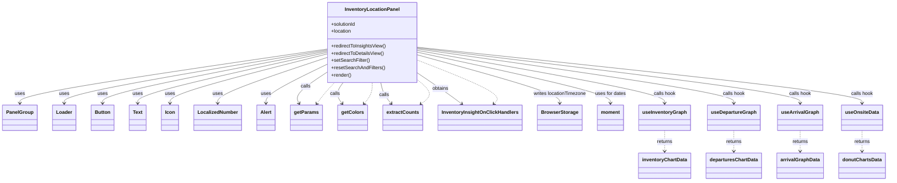

# Diagram: web/portal/src/pages/inventoryview/components/InventoryLocationPanel.js


> Auto-generated by Obscura crawlers

## Diagram 1



### SVG

<svg id="container" width="2843.609375" xmlns="http://www.w3.org/2000/svg" class="classDiagram" height="596" viewBox="0 0 2843.609375 596" role="graphics-document document" aria-roledescription="class"><style>#container{font-family:"trebuchet ms",verdana,arial,sans-serif;font-size:16px;fill:#333;}@keyframes edge-animation-frame{from{stroke-dashoffset:0;}}@keyframes dash{to{stroke-dashoffset:0;}}#container .edge-animation-slow{stroke-dasharray:9,5!important;stroke-dashoffset:900;animation:dash 50s linear infinite;stroke-linecap:round;}#container .edge-animation-fast{stroke-dasharray:9,5!important;stroke-dashoffset:900;animation:dash 20s linear infinite;stroke-linecap:round;}#container .error-icon{fill:#552222;}#container .error-text{fill:#552222;stroke:#552222;}#container .edge-thickness-normal{stroke-width:1px;}#container .edge-thickness-thick{stroke-width:3.5px;}#container .edge-pattern-solid{stroke-dasharray:0;}#container .edge-thickness-invisible{stroke-width:0;fill:none;}#container .edge-pattern-dashed{stroke-dasharray:3;}#container .edge-pattern-dotted{stroke-dasharray:2;}#container .marker{fill:#333333;stroke:#333333;}#container .marker.cross{stroke:#333333;}#container svg{font-family:"trebuchet ms",verdana,arial,sans-serif;font-size:16px;}#container p{margin:0;}#container g.classGroup text{fill:#9370DB;stroke:none;font-family:"trebuchet ms",verdana,arial,sans-serif;font-size:10px;}#container g.classGroup text .title{font-weight:bolder;}#container .nodeLabel,#container .edgeLabel{color:#131300;}#container .edgeLabel .label rect{fill:#ECECFF;}#container .label text{fill:#131300;}#container .labelBkg{background:#ECECFF;}#container .edgeLabel .label span{background:#ECECFF;}#container .classTitle{font-weight:bolder;}#container .node rect,#container .node circle,#container .node ellipse,#container .node polygon,#container .node path{fill:#ECECFF;stroke:#9370DB;stroke-width:1px;}#container .divider{stroke:#9370DB;stroke-width:1;}#container g.clickable{cursor:pointer;}#container g.classGroup rect{fill:#ECECFF;stroke:#9370DB;}#container g.classGroup line{stroke:#9370DB;stroke-width:1;}#container .classLabel .box{stroke:none;stroke-width:0;fill:#ECECFF;opacity:0.5;}#container .classLabel .label{fill:#9370DB;font-size:10px;}#container .relation{stroke:#333333;stroke-width:1;fill:none;}#container .dashed-line{stroke-dasharray:3;}#container .dotted-line{stroke-dasharray:1 2;}#container #compositionStart,#container .composition{fill:#333333!important;stroke:#333333!important;stroke-width:1;}#container #compositionEnd,#container .composition{fill:#333333!important;stroke:#333333!important;stroke-width:1;}#container #dependencyStart,#container .dependency{fill:#333333!important;stroke:#333333!important;stroke-width:1;}#container #dependencyStart,#container .dependency{fill:#333333!important;stroke:#333333!important;stroke-width:1;}#container #extensionStart,#container .extension{fill:transparent!important;stroke:#333333!important;stroke-width:1;}#container #extensionEnd,#container .extension{fill:transparent!important;stroke:#333333!important;stroke-width:1;}#container #aggregationStart,#container .aggregation{fill:transparent!important;stroke:#333333!important;stroke-width:1;}#container #aggregationEnd,#container .aggregation{fill:transparent!important;stroke:#333333!important;stroke-width:1;}#container #lollipopStart,#container .lollipop{fill:#ECECFF!important;stroke:#333333!important;stroke-width:1;}#container #lollipopEnd,#container .lollipop{fill:#ECECFF!important;stroke:#333333!important;stroke-width:1;}#container .edgeTerminals{font-size:11px;line-height:initial;}#container .classTitleText{text-anchor:middle;font-size:18px;fill:#333;}#container .label-icon{display:inline-block;height:1em;overflow:visible;vertical-align:-0.125em;}#container .node .label-icon path{fill:currentColor;stroke:revert;stroke-width:revert;}#container :root{--mermaid-font-family:"trebuchet ms",verdana,arial,sans-serif;}</style><g><defs><marker id="container_class-aggregationStart" class="marker aggregation class" refX="18" refY="7" markerWidth="190" markerHeight="240" orient="auto"><path d="M 18,7 L9,13 L1,7 L9,1 Z"></path></marker></defs><defs><marker id="container_class-aggregationEnd" class="marker aggregation class" refX="1" refY="7" markerWidth="20" markerHeight="28" orient="auto"><path d="M 18,7 L9,13 L1,7 L9,1 Z"></path></marker></defs><defs><marker id="container_class-extensionStart" class="marker extension class" refX="18" refY="7" markerWidth="190" markerHeight="240" orient="auto"><path d="M 1,7 L18,13 V 1 Z"></path></marker></defs><defs><marker id="container_class-extensionEnd" class="marker extension class" refX="1" refY="7" markerWidth="20" markerHeight="28" orient="auto"><path d="M 1,1 V 13 L18,7 Z"></path></marker></defs><defs><marker id="container_class-compositionStart" class="marker composition class" refX="18" refY="7" markerWidth="190" markerHeight="240" orient="auto"><path d="M 18,7 L9,13 L1,7 L9,1 Z"></path></marker></defs><defs><marker id="container_class-compositionEnd" class="marker composition class" refX="1" refY="7" markerWidth="20" markerHeight="28" orient="auto"><path d="M 18,7 L9,13 L1,7 L9,1 Z"></path></marker></defs><defs><marker id="container_class-dependencyStart" class="marker dependency class" refX="6" refY="7" markerWidth="190" markerHeight="240" orient="auto"><path d="M 5,7 L9,13 L1,7 L9,1 Z"></path></marker></defs><defs><marker id="container_class-dependencyEnd" class="marker dependency class" refX="13" refY="7" markerWidth="20" markerHeight="28" orient="auto"><path d="M 18,7 L9,13 L14,7 L9,1 Z"></path></marker></defs><defs><marker id="container_class-lollipopStart" class="marker lollipop class" refX="13" refY="7" markerWidth="190" markerHeight="240" orient="auto"><circle stroke="black" fill="transparent" cx="7" cy="7" r="6"></circle></marker></defs><defs><marker id="container_class-lollipopEnd" class="marker lollipop class" refX="1" refY="7" markerWidth="190" markerHeight="240" orient="auto"><circle stroke="black" fill="transparent" cx="7" cy="7" r="6"></circle></marker></defs><g class="root"><g class="clusters"></g><g class="edgePaths"><path d="M1047.254,161.853L883.1,186.377C718.945,210.902,390.637,259.951,226.482,289.642C62.328,319.333,62.328,329.667,62.328,334.833L62.328,340" id="id_InventoryLocationPanel_PanelGroup_1" class="edge-thickness-normal edge-pattern-solid relation" style=";;;" data-edge="true" data-et="edge" data-id="id_InventoryLocationPanel_PanelGroup_1" data-points="W3sieCI6MTA0Ny4yNTM5MDYyNSwieSI6MTYxLjg1MjU5MzAxMjA5MzE0fSx7IngiOjYyLjMyODEyNSwieSI6MzA5fSx7IngiOjYyLjMyODEyNSwieSI6MzQ2fV0=" marker-end="url(#container_class-dependencyEnd)"></path><path d="M1047.254,164.98L906.705,188.984C766.156,212.987,485.059,260.993,344.51,290.163C203.961,319.333,203.961,329.667,203.961,334.833L203.961,340" id="id_InventoryLocationPanel_Loader_2" class="edge-thickness-normal edge-pattern-solid relation" style=";;;" data-edge="true" data-et="edge" data-id="id_InventoryLocationPanel_Loader_2" data-points="W3sieCI6MTA0Ny4yNTM5MDYyNSwieSI6MTY0Ljk4MDI4MjQ3OTYzMTE0fSx7IngiOjIwMy45NjA5Mzc1LCJ5IjozMDl9LHsieCI6MjAzLjk2MDkzNzUsInkiOjM0Nn1d" marker-end="url(#container_class-dependencyEnd)"></path><path d="M1047.254,168.564L927.395,191.97C807.536,215.376,567.819,262.188,447.96,290.761C328.102,319.333,328.102,329.667,328.102,334.833L328.102,340" id="id_InventoryLocationPanel_Button_3" class="edge-thickness-normal edge-pattern-solid relation" style=";;;" data-edge="true" data-et="edge" data-id="id_InventoryLocationPanel_Button_3" data-points="W3sieCI6MTA0Ny4yNTM5MDYyNSwieSI6MTY4LjU2MzU4NDQxNTExNTQ2fSx7IngiOjMyOC4xMDE1NjI1LCJ5IjozMDl9LHsieCI6MzI4LjEwMTU2MjUsInkiOjM0Nn1d" marker-end="url(#container_class-dependencyEnd)"></path><path d="M1047.254,172.907L946.432,195.589C845.609,218.271,643.965,263.636,543.143,291.484C442.32,319.333,442.32,329.667,442.32,334.833L442.32,340" id="id_InventoryLocationPanel_Text_4" class="edge-thickness-normal edge-pattern-solid relation" style=";;;" data-edge="true" data-et="edge" data-id="id_InventoryLocationPanel_Text_4" data-points="W3sieCI6MTA0Ny4yNTM5MDYyNSwieSI6MTcyLjkwNjYxMzM0OTQxODY1fSx7IngiOjQ0Mi4zMjAzMTI1LCJ5IjozMDl9LHsieCI6NDQyLjMyMDMxMjUsInkiOjM0Nn1d" marker-end="url(#container_class-dependencyEnd)"></path><path d="M1047.254,178.235L963.88,200.029C880.505,221.823,713.757,265.412,630.382,292.373C547.008,319.333,547.008,329.667,547.008,334.833L547.008,340" id="id_InventoryLocationPanel_Icon_5" class="edge-thickness-normal edge-pattern-solid relation" style=";;;" data-edge="true" data-et="edge" data-id="id_InventoryLocationPanel_Icon_5" data-points="W3sieCI6MTA0Ny4yNTM5MDYyNSwieSI6MTc4LjIzNTAzOTk5ODA2NjU1fSx7IngiOjU0Ny4wMDc4MTI1LCJ5IjozMDl9LHsieCI6NTQ3LjAwNzgxMjUsInkiOjM0Nn1d" marker-end="url(#container_class-dependencyEnd)"></path><path d="M1047.254,190.031L989.285,209.859C931.315,229.687,815.376,269.344,757.407,294.338C699.438,319.333,699.438,329.667,699.438,334.833L699.438,340" id="id_InventoryLocationPanel_LocalizedNumber_6" class="edge-thickness-normal edge-pattern-solid relation" style=";;;" data-edge="true" data-et="edge" data-id="id_InventoryLocationPanel_LocalizedNumber_6" data-points="W3sieCI6MTA0Ny4yNTM5MDYyNSwieSI6MTkwLjAzMDg3Mjk4MTk5MDExfSx7IngiOjY5OS40Mzc1LCJ5IjozMDl9LHsieCI6Njk5LjQzNzUsInkiOjM0Nn1d" marker-end="url(#container_class-dependencyEnd)"></path><path d="M1047.254,212.879L1015.101,228.899C982.948,244.919,918.642,276.96,886.489,298.146C854.336,319.333,854.336,329.667,854.336,334.833L854.336,340" id="id_InventoryLocationPanel_Alert_7" class="edge-thickness-normal edge-pattern-solid relation" style=";;;" data-edge="true" data-et="edge" data-id="id_InventoryLocationPanel_Alert_7" data-points="W3sieCI6MTA0Ny4yNTM5MDYyNSwieSI6MjEyLjg3ODcxOTgyNjc5MTk1fSx7IngiOjg1NC4zMzU5Mzc1LCJ5IjozMDl9LHsieCI6ODU0LjMzNTkzNzUsInkiOjM0Nn1d" marker-end="url(#container_class-dependencyEnd)"></path><path d="M1047.254,239.833L1030.364,251.361C1013.474,262.889,979.694,285.944,965.381,302.741C951.068,319.537,956.222,330.073,958.798,335.342L961.375,340.61" id="id_InventoryLocationPanel_getParams_8" class="edge-thickness-normal edge-pattern-solid relation" style=";;;" data-edge="true" data-et="edge" data-id="id_InventoryLocationPanel_getParams_8" data-points="W3sieCI6MTA0Ny4yNTM5MDYyNSwieSI6MjM5LjgzMjg1NDc5OTAxNTZ9LHsieCI6OTQ1LjkxNDA2MjUsInkiOjMwOX0seyJ4Ijo5NjQuMDExNTcwNDExMzkyNCwieSI6MzQ2fV0=" marker-end="url(#container_class-dependencyEnd)"></path><path d="M1102.056,272L1097.783,278.167C1093.51,284.333,1084.964,296.667,1084.443,308.181C1083.921,319.696,1091.424,330.392,1095.176,335.74L1098.928,341.088" id="id_InventoryLocationPanel_getColors_9" class="edge-thickness-normal edge-pattern-solid relation" style=";;;" data-edge="true" data-et="edge" data-id="id_InventoryLocationPanel_getColors_9" data-points="W3sieCI6MTEwMi4wNTY0NDQxNTY4MDQ3LCJ5IjoyNzJ9LHsieCI6MTA3Ni40MTc5Njg3NSwieSI6MzA5fSx7IngiOjExMDIuMzczMjE5OTM2NzA5LCJ5IjozNDZ9XQ==" marker-end="url(#container_class-dependencyEnd)"></path><path d="M1221.99,272L1223.319,278.167C1224.649,284.333,1227.309,296.667,1232.839,308.212C1238.368,319.757,1246.768,330.514,1250.968,335.892L1255.168,341.271" id="id_InventoryLocationPanel_extractCounts_10" class="edge-thickness-normal edge-pattern-solid relation" style=";;;" data-edge="true" data-et="edge" data-id="id_InventoryLocationPanel_extractCounts_10" data-points="W3sieCI6MTIyMS45ODk1OTg3NDI2MDM0LCJ5IjoyNzJ9LHsieCI6MTIyOS45Njg3NSwieSI6MzA5fSx7IngiOjEyNTguODYwMzYzOTI0MDUwNywieSI6MzQ2fV0=" marker-end="url(#container_class-dependencyEnd)"></path><path d="M1339.793,241.085L1356.172,252.404C1372.551,263.723,1405.309,286.362,1428.643,303.224C1451.977,320.087,1465.888,331.174,1472.843,336.717L1479.798,342.26" id="id_InventoryLocationPanel_InventoryInsightOnClickHandlers_11" class="edge-thickness-normal edge-pattern-solid relation" style=";;;" data-edge="true" data-et="edge" data-id="id_InventoryLocationPanel_InventoryInsightOnClickHandlers_11" data-points="W3sieCI6MTMzOS43OTI5Njg3NSwieSI6MjQxLjA4NDY5MjQyNjg4MDV9LHsieCI6MTQzOC4wNjY0MDYyNSwieSI6MzA5fSx7IngiOjE0ODQuNDkwMjA5NjUxODk4OCwieSI6MzQ2fV0=" marker-end="url(#container_class-dependencyEnd)"></path><path d="M1339.793,181.452L1414.805,202.71C1489.818,223.968,1639.842,266.484,1714.855,292.909C1789.867,319.333,1789.867,329.667,1789.867,334.833L1789.867,340" id="id_InventoryLocationPanel_BrowserStorage_12" class="edge-thickness-normal edge-pattern-solid relation" style=";;;" data-edge="true" data-et="edge" data-id="id_InventoryLocationPanel_BrowserStorage_12" data-points="W3sieCI6MTMzOS43OTI5Njg3NSwieSI6MTgxLjQ1MTg0ODUwMzkwNH0seyJ4IjoxNzg5Ljg2NzE4NzUsInkiOjMwOX0seyJ4IjoxNzg5Ljg2NzE4NzUsInkiOjM0Nn1d" marker-end="url(#container_class-dependencyEnd)"></path><path d="M1339.793,172.578L1441.88,195.315C1543.966,218.052,1748.139,263.526,1850.226,291.43C1952.313,319.333,1952.313,329.667,1952.313,334.833L1952.313,340" id="id_InventoryLocationPanel_moment_13" class="edge-thickness-normal edge-pattern-solid relation" style=";;;" data-edge="true" data-et="edge" data-id="id_InventoryLocationPanel_moment_13" data-points="W3sieCI6MTMzOS43OTI5Njg3NSwieSI6MTcyLjU3NzYzMTkxNzYzMTkyfSx7IngiOjE5NTIuMzEyNSwieSI6MzA5fSx7IngiOjE5NTIuMzEyNSwieSI6MzQ2fV0=" marker-end="url(#container_class-dependencyEnd)"></path><path d="M1339.793,166.501L1470.878,190.251C1601.964,214.001,1864.134,261.5,1995.219,290.417C2126.305,319.333,2126.305,329.667,2126.305,334.833L2126.305,340" id="id_InventoryLocationPanel_useInventoryGraph_14" class="edge-thickness-normal edge-pattern-solid relation" style=";;;" data-edge="true" data-et="edge" data-id="id_InventoryLocationPanel_useInventoryGraph_14" data-points="W3sieCI6MTMzOS43OTI5Njg3NSwieSI6MTY2LjUwMDkwODc0MDY2MTMyfSx7IngiOjIxMjYuMzA0Njg3NSwieSI6MzA5fSx7IngiOjIxMjYuMzA0Njg3NSwieSI6MzQ2fV0=" marker-end="url(#container_class-dependencyEnd)"></path><path d="M1339.793,161.393L1507.994,185.994C1676.195,210.596,2012.598,259.798,2180.799,289.566C2349,319.333,2349,329.667,2349,334.833L2349,340" id="id_InventoryLocationPanel_useDepartureGraph_15" class="edge-thickness-normal edge-pattern-solid relation" style=";;;" data-edge="true" data-et="edge" data-id="id_InventoryLocationPanel_useDepartureGraph_15" data-points="W3sieCI6MTMzOS43OTI5Njg3NSwieSI6MTYxLjM5MzM4MTM4MzQ5MzAyfSx7IngiOjIzNDksInkiOjMwOX0seyJ4IjoyMzQ5LCJ5IjozNDZ9XQ==" marker-end="url(#container_class-dependencyEnd)"></path><path d="M1339.793,158.056L1543.585,183.214C1747.378,208.371,2154.962,258.685,2358.755,289.009C2562.547,319.333,2562.547,329.667,2562.547,334.833L2562.547,340" id="id_InventoryLocationPanel_useArrivalGraph_16" class="edge-thickness-normal edge-pattern-solid relation" style=";;;" data-edge="true" data-et="edge" data-id="id_InventoryLocationPanel_useArrivalGraph_16" data-points="W3sieCI6MTMzOS43OTI5Njg3NSwieSI6MTU4LjA1NjMzODYzMDk4MTI2fSx7IngiOjI1NjIuNTQ2ODc1LCJ5IjozMDl9LHsieCI6MjU2Mi41NDY4NzUsInkiOjM0Nn1d" marker-end="url(#container_class-dependencyEnd)"></path><path d="M1339.793,155.767L1576.709,181.306C1813.625,206.845,2287.457,257.922,2524.373,288.628C2761.289,319.333,2761.289,329.667,2761.289,334.833L2761.289,340" id="id_InventoryLocationPanel_useOnsiteData_17" class="edge-thickness-normal edge-pattern-solid relation" style=";;;" data-edge="true" data-et="edge" data-id="id_InventoryLocationPanel_useOnsiteData_17" data-points="W3sieCI6MTMzOS43OTI5Njg3NSwieSI6MTU1Ljc2NzM3NjQ0MTM5MjV9LHsieCI6Mjc2MS4yODkwNjI1LCJ5IjozMDl9LHsieCI6Mjc2MS4yODkwNjI1LCJ5IjozNDZ9XQ==" marker-end="url(#container_class-dependencyEnd)"></path><path d="M2126.305,430L2126.305,436.167C2126.305,442.333,2126.305,454.667,2126.305,466C2126.305,477.333,2126.305,487.667,2126.305,492.833L2126.305,498" id="id_useInventoryGraph_inventoryChartData_18" class="edge-thickness-normal edge-pattern-dashed relation" style=";;;" data-edge="true" data-et="edge" data-id="id_useInventoryGraph_inventoryChartData_18" data-points="W3sieCI6MjEyNi4zMDQ2ODc1LCJ5Ijo0MzB9LHsieCI6MjEyNi4zMDQ2ODc1LCJ5Ijo0Njd9LHsieCI6MjEyNi4zMDQ2ODc1LCJ5Ijo1MDR9XQ==" marker-end="url(#container_class-dependencyEnd)"></path><path d="M2349,430L2349,436.167C2349,442.333,2349,454.667,2349,466C2349,477.333,2349,487.667,2349,492.833L2349,498" id="id_useDepartureGraph_departuresChartData_19" class="edge-thickness-normal edge-pattern-dashed relation" style=";;;" data-edge="true" data-et="edge" data-id="id_useDepartureGraph_departuresChartData_19" data-points="W3sieCI6MjM0OSwieSI6NDMwfSx7IngiOjIzNDksInkiOjQ2N30seyJ4IjoyMzQ5LCJ5Ijo1MDR9XQ==" marker-end="url(#container_class-dependencyEnd)"></path><path d="M2562.547,430L2562.547,436.167C2562.547,442.333,2562.547,454.667,2562.547,466C2562.547,477.333,2562.547,487.667,2562.547,492.833L2562.547,498" id="id_useArrivalGraph_arrivalGraphData_20" class="edge-thickness-normal edge-pattern-dashed relation" style=";;;" data-edge="true" data-et="edge" data-id="id_useArrivalGraph_arrivalGraphData_20" data-points="W3sieCI6MjU2Mi41NDY4NzUsInkiOjQzMH0seyJ4IjoyNTYyLjU0Njg3NSwieSI6NDY3fSx7IngiOjI1NjIuNTQ2ODc1LCJ5Ijo1MDR9XQ==" marker-end="url(#container_class-dependencyEnd)"></path><path d="M2761.289,430L2761.289,436.167C2761.289,442.333,2761.289,454.667,2761.289,466C2761.289,477.333,2761.289,487.667,2761.289,492.833L2761.289,498" id="id_useOnsiteData_donutChartsData_21" class="edge-thickness-normal edge-pattern-dashed relation" style=";;;" data-edge="true" data-et="edge" data-id="id_useOnsiteData_donutChartsData_21" data-points="W3sieCI6Mjc2MS4yODkwNjI1LCJ5Ijo0MzB9LHsieCI6Mjc2MS4yODkwNjI1LCJ5Ijo0Njd9LHsieCI6Mjc2MS4yODkwNjI1LCJ5Ijo1MDR9XQ==" marker-end="url(#container_class-dependencyEnd)"></path><path d="M1017.463,341.088L1021.215,335.74C1024.966,330.392,1032.469,319.696,1041.824,308.181C1051.179,296.667,1062.384,284.333,1067.987,278.167L1073.59,272" id="id_getParams_InventoryLocationPanel_22" class="edge-thickness-normal edge-pattern-dashed relation" style=";;;" data-edge="true" data-et="edge" data-id="id_getParams_InventoryLocationPanel_22" data-points="W3sieCI6MTAxNC4wMTc0MDUwNjMyOTExLCJ5IjozNDZ9LHsieCI6MTAzOS45NzI2NTYyNSwieSI6MzA5fSx7IngiOjEwNzMuNTkwMjgyOTE0MjAxMiwieSI6MjcyfV0=" marker-start="url(#container_class-dependencyStart)"></path><path d="M1168.325,341.271L1172.524,335.892C1176.724,330.514,1185.124,319.757,1189.324,308.212C1193.523,296.667,1193.523,284.333,1193.523,278.167L1193.523,272" id="id_getColors_InventoryLocationPanel_23" class="edge-thickness-normal edge-pattern-dashed relation" style=";;;" data-edge="true" data-et="edge" data-id="id_getColors_InventoryLocationPanel_23" data-points="W3sieCI6MTE2NC42MzE4MjM1NzU5NDkzLCJ5IjozNDZ9LHsieCI6MTE5My41MjM0Mzc1LCJ5IjozMDl9LHsieCI6MTE5My41MjM0Mzc1LCJ5IjoyNzJ9XQ==" marker-start="url(#container_class-dependencyStart)"></path><path d="M1349.046,342.26L1356.001,336.717C1362.956,331.174,1376.867,320.087,1375.325,307.263C1373.783,294.439,1356.788,279.879,1348.29,272.599L1339.793,265.318" id="id_extractCounts_InventoryLocationPanel_24" class="edge-thickness-normal edge-pattern-dashed relation" style=";;;" data-edge="true" data-et="edge" data-id="id_extractCounts_InventoryLocationPanel_24" data-points="W3sieCI6MTM0NC4zNTM1NDAzNDgxMDEyLCJ5IjozNDZ9LHsieCI6MTM5MC43NzczNDM3NSwieSI6MzA5fSx7IngiOjEzMzkuNzkyOTY4NzUsInkiOjI2NS4zMTg0MzQ3NTg1MDA1M31d" marker-start="url(#container_class-dependencyStart)"></path><path d="M1579.598,341.57L1584.556,336.142C1589.514,330.713,1599.431,319.857,1559.464,296.17C1519.496,272.482,1429.645,235.965,1384.719,217.706L1339.793,199.447" id="id_InventoryInsightOnClickHandlers_InventoryLocationPanel_25" class="edge-thickness-normal edge-pattern-dashed relation" style=";;;" data-edge="true" data-et="edge" data-id="id_InventoryInsightOnClickHandlers_InventoryLocationPanel_25" data-points="W3sieCI6MTU3NS41NTExMjczNzM0MTc4LCJ5IjozNDZ9LHsieCI6MTYwOS4zNDc2NTYyNSwieSI6MzA5fSx7IngiOjEzMzkuNzkyOTY4NzUsInkiOjE5OS40NDcxMTY1MTM3MDExM31d" marker-start="url(#container_class-dependencyStart)"></path></g><g class="edgeLabels"><g class="edgeLabel" transform="translate(62.328125, 309)"><g class="label" data-id="id_InventoryLocationPanel_PanelGroup_1" transform="translate(-16.4921875, -12)"><foreignObject width="32.984375" height="24"><div xmlns="http://www.w3.org/1999/xhtml" class="labelBkg" style="display: table-cell; white-space: nowrap; line-height: 1.5; max-width: 200px; text-align: center;"><span class="edgeLabel"><p>uses</p></span></div></foreignObject></g></g><g class="edgeLabel" transform="translate(203.9609375, 309)"><g class="label" data-id="id_InventoryLocationPanel_Loader_2" transform="translate(-16.4921875, -12)"><foreignObject width="32.984375" height="24"><div xmlns="http://www.w3.org/1999/xhtml" class="labelBkg" style="display: table-cell; white-space: nowrap; line-height: 1.5; max-width: 200px; text-align: center;"><span class="edgeLabel"><p>uses</p></span></div></foreignObject></g></g><g class="edgeLabel" transform="translate(328.1015625, 309)"><g class="label" data-id="id_InventoryLocationPanel_Button_3" transform="translate(-16.4921875, -12)"><foreignObject width="32.984375" height="24"><div xmlns="http://www.w3.org/1999/xhtml" class="labelBkg" style="display: table-cell; white-space: nowrap; line-height: 1.5; max-width: 200px; text-align: center;"><span class="edgeLabel"><p>uses</p></span></div></foreignObject></g></g><g class="edgeLabel" transform="translate(442.3203125, 309)"><g class="label" data-id="id_InventoryLocationPanel_Text_4" transform="translate(-16.4921875, -12)"><foreignObject width="32.984375" height="24"><div xmlns="http://www.w3.org/1999/xhtml" class="labelBkg" style="display: table-cell; white-space: nowrap; line-height: 1.5; max-width: 200px; text-align: center;"><span class="edgeLabel"><p>uses</p></span></div></foreignObject></g></g><g class="edgeLabel" transform="translate(547.0078125, 309)"><g class="label" data-id="id_InventoryLocationPanel_Icon_5" transform="translate(-16.4921875, -12)"><foreignObject width="32.984375" height="24"><div xmlns="http://www.w3.org/1999/xhtml" class="labelBkg" style="display: table-cell; white-space: nowrap; line-height: 1.5; max-width: 200px; text-align: center;"><span class="edgeLabel"><p>uses</p></span></div></foreignObject></g></g><g class="edgeLabel" transform="translate(699.4375, 309)"><g class="label" data-id="id_InventoryLocationPanel_LocalizedNumber_6" transform="translate(-16.4921875, -12)"><foreignObject width="32.984375" height="24"><div xmlns="http://www.w3.org/1999/xhtml" class="labelBkg" style="display: table-cell; white-space: nowrap; line-height: 1.5; max-width: 200px; text-align: center;"><span class="edgeLabel"><p>uses</p></span></div></foreignObject></g></g><g class="edgeLabel" transform="translate(854.3359375, 309)"><g class="label" data-id="id_InventoryLocationPanel_Alert_7" transform="translate(-16.4921875, -12)"><foreignObject width="32.984375" height="24"><div xmlns="http://www.w3.org/1999/xhtml" class="labelBkg" style="display: table-cell; white-space: nowrap; line-height: 1.5; max-width: 200px; text-align: center;"><span class="edgeLabel"><p>uses</p></span></div></foreignObject></g></g><g class="edgeLabel" transform="translate(979.57393, 286.02625)"><g class="label" data-id="id_InventoryLocationPanel_getParams_8" transform="translate(-16.4453125, -12)"><foreignObject width="32.890625" height="24"><div xmlns="http://www.w3.org/1999/xhtml" class="labelBkg" style="display: table-cell; white-space: nowrap; line-height: 1.5; max-width: 200px; text-align: center;"><span class="edgeLabel"><p>calls</p></span></div></foreignObject></g></g><g class="edgeLabel" transform="translate(1076.46999, 309.07416)"><g class="label" data-id="id_InventoryLocationPanel_getColors_9" transform="translate(-16.4453125, -12)"><foreignObject width="32.890625" height="24"><div xmlns="http://www.w3.org/1999/xhtml" class="labelBkg" style="display: table-cell; white-space: nowrap; line-height: 1.5; max-width: 200px; text-align: center;"><span class="edgeLabel"><p>calls</p></span></div></foreignObject></g></g><g class="edgeLabel" transform="translate(1232.76698, 312.58355)"><g class="label" data-id="id_InventoryLocationPanel_extractCounts_10" transform="translate(-16.4453125, -12)"><foreignObject width="32.890625" height="24"><div xmlns="http://www.w3.org/1999/xhtml" class="labelBkg" style="display: table-cell; white-space: nowrap; line-height: 1.5; max-width: 200px; text-align: center;"><span class="edgeLabel"><p>calls</p></span></div></foreignObject></g></g><g class="edgeLabel" transform="translate(1413.34825, 291.91765)"><g class="label" data-id="id_InventoryLocationPanel_InventoryInsightOnClickHandlers_11" transform="translate(-27.2890625, -12)"><foreignObject width="54.578125" height="24"><div xmlns="http://www.w3.org/1999/xhtml" class="labelBkg" style="display: table-cell; white-space: nowrap; line-height: 1.5; max-width: 200px; text-align: center;"><span class="edgeLabel"><p>obtains</p></span></div></foreignObject></g></g><g class="edgeLabel" transform="translate(1789.8671875, 309)"><g class="label" data-id="id_InventoryLocationPanel_BrowserStorage_12" transform="translate(-88.359375, -12)"><foreignObject width="176.71875" height="24"><div xmlns="http://www.w3.org/1999/xhtml" class="labelBkg" style="display: table-cell; white-space: nowrap; line-height: 1.5; max-width: 200px; text-align: center;"><span class="edgeLabel"><p>writes locationTimezone</p></span></div></foreignObject></g></g><g class="edgeLabel" transform="translate(1952.3125, 309)"><g class="label" data-id="id_InventoryLocationPanel_moment_13" transform="translate(-51.09375, -12)"><foreignObject width="102.1875" height="24"><div xmlns="http://www.w3.org/1999/xhtml" class="labelBkg" style="display: table-cell; white-space: nowrap; line-height: 1.5; max-width: 200px; text-align: center;"><span class="edgeLabel"><p>uses for dates</p></span></div></foreignObject></g></g><g class="edgeLabel" transform="translate(2126.3046875, 309)"><g class="label" data-id="id_InventoryLocationPanel_useInventoryGraph_14" transform="translate(-36.6953125, -12)"><foreignObject width="73.390625" height="24"><div xmlns="http://www.w3.org/1999/xhtml" class="labelBkg" style="display: table-cell; white-space: nowrap; line-height: 1.5; max-width: 200px; text-align: center;"><span class="edgeLabel"><p>calls hook</p></span></div></foreignObject></g></g><g class="edgeLabel" transform="translate(2349, 309)"><g class="label" data-id="id_InventoryLocationPanel_useDepartureGraph_15" transform="translate(-36.6953125, -12)"><foreignObject width="73.390625" height="24"><div xmlns="http://www.w3.org/1999/xhtml" class="labelBkg" style="display: table-cell; white-space: nowrap; line-height: 1.5; max-width: 200px; text-align: center;"><span class="edgeLabel"><p>calls hook</p></span></div></foreignObject></g></g><g class="edgeLabel" transform="translate(2562.546875, 309)"><g class="label" data-id="id_InventoryLocationPanel_useArrivalGraph_16" transform="translate(-36.6953125, -12)"><foreignObject width="73.390625" height="24"><div xmlns="http://www.w3.org/1999/xhtml" class="labelBkg" style="display: table-cell; white-space: nowrap; line-height: 1.5; max-width: 200px; text-align: center;"><span class="edgeLabel"><p>calls hook</p></span></div></foreignObject></g></g><g class="edgeLabel" transform="translate(2761.2890625, 309)"><g class="label" data-id="id_InventoryLocationPanel_useOnsiteData_17" transform="translate(-36.6953125, -12)"><foreignObject width="73.390625" height="24"><div xmlns="http://www.w3.org/1999/xhtml" class="labelBkg" style="display: table-cell; white-space: nowrap; line-height: 1.5; max-width: 200px; text-align: center;"><span class="edgeLabel"><p>calls hook</p></span></div></foreignObject></g></g><g class="edgeLabel" transform="translate(2126.3046875, 467)"><g class="label" data-id="id_useInventoryGraph_inventoryChartData_18" transform="translate(-26.265625, -12)"><foreignObject width="52.53125" height="24"><div xmlns="http://www.w3.org/1999/xhtml" class="labelBkg" style="display: table-cell; white-space: nowrap; line-height: 1.5; max-width: 200px; text-align: center;"><span class="edgeLabel"><p>returns</p></span></div></foreignObject></g></g><g class="edgeLabel" transform="translate(2349, 467)"><g class="label" data-id="id_useDepartureGraph_departuresChartData_19" transform="translate(-26.265625, -12)"><foreignObject width="52.53125" height="24"><div xmlns="http://www.w3.org/1999/xhtml" class="labelBkg" style="display: table-cell; white-space: nowrap; line-height: 1.5; max-width: 200px; text-align: center;"><span class="edgeLabel"><p>returns</p></span></div></foreignObject></g></g><g class="edgeLabel" transform="translate(2562.546875, 467)"><g class="label" data-id="id_useArrivalGraph_arrivalGraphData_20" transform="translate(-26.265625, -12)"><foreignObject width="52.53125" height="24"><div xmlns="http://www.w3.org/1999/xhtml" class="labelBkg" style="display: table-cell; white-space: nowrap; line-height: 1.5; max-width: 200px; text-align: center;"><span class="edgeLabel"><p>returns</p></span></div></foreignObject></g></g><g class="edgeLabel" transform="translate(2761.2890625, 467)"><g class="label" data-id="id_useOnsiteData_donutChartsData_21" transform="translate(-26.265625, -12)"><foreignObject width="52.53125" height="24"><div xmlns="http://www.w3.org/1999/xhtml" class="labelBkg" style="display: table-cell; white-space: nowrap; line-height: 1.5; max-width: 200px; text-align: center;"><span class="edgeLabel"><p>returns</p></span></div></foreignObject></g></g><g class="edgeLabel"><g class="label" data-id="id_getParams_InventoryLocationPanel_22" transform="translate(0, 0)"><foreignObject width="0" height="0"><div xmlns="http://www.w3.org/1999/xhtml" class="labelBkg" style="display: table-cell; white-space: nowrap; line-height: 1.5; max-width: 200px; text-align: center;"><span class="edgeLabel"></span></div></foreignObject></g></g><g class="edgeLabel"><g class="label" data-id="id_getColors_InventoryLocationPanel_23" transform="translate(0, 0)"><foreignObject width="0" height="0"><div xmlns="http://www.w3.org/1999/xhtml" class="labelBkg" style="display: table-cell; white-space: nowrap; line-height: 1.5; max-width: 200px; text-align: center;"><span class="edgeLabel"></span></div></foreignObject></g></g><g class="edgeLabel"><g class="label" data-id="id_extractCounts_InventoryLocationPanel_24" transform="translate(0, 0)"><foreignObject width="0" height="0"><div xmlns="http://www.w3.org/1999/xhtml" class="labelBkg" style="display: table-cell; white-space: nowrap; line-height: 1.5; max-width: 200px; text-align: center;"><span class="edgeLabel"></span></div></foreignObject></g></g><g class="edgeLabel"><g class="label" data-id="id_InventoryInsightOnClickHandlers_InventoryLocationPanel_25" transform="translate(0, 0)"><foreignObject width="0" height="0"><div xmlns="http://www.w3.org/1999/xhtml" class="labelBkg" style="display: table-cell; white-space: nowrap; line-height: 1.5; max-width: 200px; text-align: center;"><span class="edgeLabel"></span></div></foreignObject></g></g></g><g class="nodes"><g class="node default" id="classId-InventoryLocationPanel-0" transform="translate(1193.5234375, 140)"><g class="basic label-container"><path d="M-146.26953125 -132 L146.26953125 -132 L146.26953125 132 L-146.26953125 132" stroke="none" stroke-width="0" fill="#ECECFF" style=""></path><path d="M-146.26953125 -132 C-87.16823421731209 -132, -28.066937184624166 -132, 146.26953125 -132 M-146.26953125 -132 C-78.12357546825815 -132, -9.977619686516306 -132, 146.26953125 -132 M146.26953125 -132 C146.26953125 -77.64046862274816, 146.26953125 -23.280937245496318, 146.26953125 132 M146.26953125 -132 C146.26953125 -45.76842767708219, 146.26953125 40.46314464583563, 146.26953125 132 M146.26953125 132 C59.87309119636093 132, -26.523348857278137 132, -146.26953125 132 M146.26953125 132 C87.13578555058143 132, 28.002039851162877 132, -146.26953125 132 M-146.26953125 132 C-146.26953125 67.86193632753711, -146.26953125 3.723872655074217, -146.26953125 -132 M-146.26953125 132 C-146.26953125 29.028629929988483, -146.26953125 -73.94274014002303, -146.26953125 -132" stroke="#9370DB" stroke-width="1.3" fill="none" stroke-dasharray="0 0" style=""></path></g><g class="annotation-group text" transform="translate(0, -108)"></g><g class="label-group text" transform="translate(-86.4765625, -108)"><g class="label" style="font-weight: bolder" transform="translate(0,-12)"><foreignObject width="172.953125" height="24"><div xmlns="http://www.w3.org/1999/xhtml" style="display: table-cell; white-space: nowrap; line-height: 1.5; max-width: 221px; text-align: center;"><span class="nodeLabel markdown-node-label" style=""><p>InventoryLocationPanel</p></span></div></foreignObject></g></g><g class="members-group text" transform="translate(-134.26953125, -60)"><g class="label" style="" transform="translate(0,-12)"><foreignObject width="82.109375" height="24"><div xmlns="http://www.w3.org/1999/xhtml" style="display: table-cell; white-space: nowrap; line-height: 1.5; max-width: 139px; text-align: center;"><span class="nodeLabel markdown-node-label" style=""><p>+solutionId</p></span></div></foreignObject></g><g class="label" style="" transform="translate(0,12)"><foreignObject width="67.140625" height="24"><div xmlns="http://www.w3.org/1999/xhtml" style="display: table-cell; white-space: nowrap; line-height: 1.5; max-width: 125px; text-align: center;"><span class="nodeLabel markdown-node-label" style=""><p>+location</p></span></div></foreignObject></g></g><g class="methods-group text" transform="translate(-134.26953125, 12)"><g class="label" style="" transform="translate(0,-12)"><foreignObject width="182.0625" height="24"><div xmlns="http://www.w3.org/1999/xhtml" style="display: table-cell; white-space: nowrap; line-height: 1.5; max-width: 239px; text-align: center;"><span class="nodeLabel markdown-node-label" style=""><p>+redirectToInsightsView()</p></span></div></foreignObject></g><g class="label" style="" transform="translate(0,12)"><foreignObject width="175.09375" height="24"><div xmlns="http://www.w3.org/1999/xhtml" style="display: table-cell; white-space: nowrap; line-height: 1.5; max-width: 232px; text-align: center;"><span class="nodeLabel markdown-node-label" style=""><p>+redirectToDetailsView()</p></span></div></foreignObject></g><g class="label" style="" transform="translate(0,36)"><foreignObject width="125.953125" height="24"><div xmlns="http://www.w3.org/1999/xhtml" style="display: table-cell; white-space: nowrap; line-height: 1.5; max-width: 183px; text-align: center;"><span class="nodeLabel markdown-node-label" style=""><p>+setSearchFilter()</p></span></div></foreignObject></g><g class="label" style="" transform="translate(0,60)"><foreignObject width="175.71875" height="24"><div xmlns="http://www.w3.org/1999/xhtml" style="display: table-cell; white-space: nowrap; line-height: 1.5; max-width: 233px; text-align: center;"><span class="nodeLabel markdown-node-label" style=""><p>+resetSearchAndFilters()</p></span></div></foreignObject></g><g class="label" style="" transform="translate(0,84)"><foreignObject width="66.609375" height="24"><div xmlns="http://www.w3.org/1999/xhtml" style="display: table-cell; white-space: nowrap; line-height: 1.5; max-width: 124px; text-align: center;"><span class="nodeLabel markdown-node-label" style=""><p>+render()</p></span></div></foreignObject></g></g><g class="divider" style=""><path d="M-146.26953125 -84 C-84.5950933425697 -84, -22.92065543513941 -84, 146.26953125 -84 M-146.26953125 -84 C-53.9325856187731 -84, 38.40436001245379 -84, 146.26953125 -84" stroke="#9370DB" stroke-width="1.3" fill="none" stroke-dasharray="0 0" style=""></path></g><g class="divider" style=""><path d="M-146.26953125 -12 C-53.30314845705553 -12, 39.663234335888944 -12, 146.26953125 -12 M-146.26953125 -12 C-33.55547395920699 -12, 79.15858333158602 -12, 146.26953125 -12" stroke="#9370DB" stroke-width="1.3" fill="none" stroke-dasharray="0 0" style=""></path></g></g><g class="node default" id="classId-PanelGroup-1" transform="translate(62.328125, 388)"><g class="basic label-container"><path d="M-54.328125 -42 L54.328125 -42 L54.328125 42 L-54.328125 42" stroke="none" stroke-width="0" fill="#ECECFF" style=""></path><path d="M-54.328125 -42 C-26.48212320133078 -42, 1.3638785973384415 -42, 54.328125 -42 M-54.328125 -42 C-24.876328073349082 -42, 4.575468853301835 -42, 54.328125 -42 M54.328125 -42 C54.328125 -21.354887517933896, 54.328125 -0.7097750358677928, 54.328125 42 M54.328125 -42 C54.328125 -17.464764520981138, 54.328125 7.070470958037724, 54.328125 42 M54.328125 42 C21.29642940222128 42, -11.735266195557443 42, -54.328125 42 M54.328125 42 C21.365485250629042 42, -11.597154498741915 42, -54.328125 42 M-54.328125 42 C-54.328125 22.876887780317645, -54.328125 3.7537755606352903, -54.328125 -42 M-54.328125 42 C-54.328125 19.16649515131676, -54.328125 -3.667009697366481, -54.328125 -42" stroke="#9370DB" stroke-width="1.3" fill="none" stroke-dasharray="0 0" style=""></path></g><g class="annotation-group text" transform="translate(0, -18)"></g><g class="label-group text" transform="translate(-42.328125, -18)"><g class="label" style="font-weight: bolder" transform="translate(0,-12)"><foreignObject width="84.65625" height="24"><div xmlns="http://www.w3.org/1999/xhtml" style="display: table-cell; white-space: nowrap; line-height: 1.5; max-width: 134px; text-align: center;"><span class="nodeLabel markdown-node-label" style=""><p>PanelGroup</p></span></div></foreignObject></g></g><g class="members-group text" transform="translate(-42.328125, 30)"></g><g class="methods-group text" transform="translate(-42.328125, 60)"></g><g class="divider" style=""><path d="M-54.328125 6 C-23.238751573087395 6, 7.85062185382521 6, 54.328125 6 M-54.328125 6 C-21.79406468643009 6, 10.73999562713982 6, 54.328125 6" stroke="#9370DB" stroke-width="1.3" fill="none" stroke-dasharray="0 0" style=""></path></g><g class="divider" style=""><path d="M-54.328125 24 C-28.302311183112366 24, -2.2764973662247314 24, 54.328125 24 M-54.328125 24 C-23.656912383209544 24, 7.0143002335809115 24, 54.328125 24" stroke="#9370DB" stroke-width="1.3" fill="none" stroke-dasharray="0 0" style=""></path></g></g><g class="node default" id="classId-Loader-2" transform="translate(203.9609375, 388)"><g class="basic label-container"><path d="M-37.3046875 -42 L37.3046875 -42 L37.3046875 42 L-37.3046875 42" stroke="none" stroke-width="0" fill="#ECECFF" style=""></path><path d="M-37.3046875 -42 C-14.13609811849297 -42, 9.032491263014059 -42, 37.3046875 -42 M-37.3046875 -42 C-11.811434760415 -42, 13.681817979169999 -42, 37.3046875 -42 M37.3046875 -42 C37.3046875 -15.498024193803573, 37.3046875 11.003951612392854, 37.3046875 42 M37.3046875 -42 C37.3046875 -23.60169058756774, 37.3046875 -5.203381175135483, 37.3046875 42 M37.3046875 42 C17.59641865563026 42, -2.1118501887394814 42, -37.3046875 42 M37.3046875 42 C19.920250215629288 42, 2.535812931258576 42, -37.3046875 42 M-37.3046875 42 C-37.3046875 19.085946848431572, -37.3046875 -3.828106303136856, -37.3046875 -42 M-37.3046875 42 C-37.3046875 19.435224235337195, -37.3046875 -3.12955152932561, -37.3046875 -42" stroke="#9370DB" stroke-width="1.3" fill="none" stroke-dasharray="0 0" style=""></path></g><g class="annotation-group text" transform="translate(0, -18)"></g><g class="label-group text" transform="translate(-25.3046875, -18)"><g class="label" style="font-weight: bolder" transform="translate(0,-12)"><foreignObject width="50.609375" height="24"><div xmlns="http://www.w3.org/1999/xhtml" style="display: table-cell; white-space: nowrap; line-height: 1.5; max-width: 101px; text-align: center;"><span class="nodeLabel markdown-node-label" style=""><p>Loader</p></span></div></foreignObject></g></g><g class="members-group text" transform="translate(-25.3046875, 30)"></g><g class="methods-group text" transform="translate(-25.3046875, 60)"></g><g class="divider" style=""><path d="M-37.3046875 6 C-21.524222422532056 6, -5.743757345064111 6, 37.3046875 6 M-37.3046875 6 C-9.739875189915523 6, 17.824937120168954 6, 37.3046875 6" stroke="#9370DB" stroke-width="1.3" fill="none" stroke-dasharray="0 0" style=""></path></g><g class="divider" style=""><path d="M-37.3046875 24 C-10.56588198014554 24, 16.17292353970892 24, 37.3046875 24 M-37.3046875 24 C-14.343981840696905 24, 8.61672381860619 24, 37.3046875 24" stroke="#9370DB" stroke-width="1.3" fill="none" stroke-dasharray="0 0" style=""></path></g></g><g class="node default" id="classId-Button-3" transform="translate(328.1015625, 388)"><g class="basic label-container"><path d="M-36.8359375 -42 L36.8359375 -42 L36.8359375 42 L-36.8359375 42" stroke="none" stroke-width="0" fill="#ECECFF" style=""></path><path d="M-36.8359375 -42 C-9.375332839769602 -42, 18.085271820460797 -42, 36.8359375 -42 M-36.8359375 -42 C-14.159494465781748 -42, 8.516948568436504 -42, 36.8359375 -42 M36.8359375 -42 C36.8359375 -16.729590878076067, 36.8359375 8.540818243847866, 36.8359375 42 M36.8359375 -42 C36.8359375 -9.318904222181068, 36.8359375 23.362191555637864, 36.8359375 42 M36.8359375 42 C10.602784572832242 42, -15.630368354335516 42, -36.8359375 42 M36.8359375 42 C14.315436867044166 42, -8.205063765911667 42, -36.8359375 42 M-36.8359375 42 C-36.8359375 22.989258179277744, -36.8359375 3.9785163585554884, -36.8359375 -42 M-36.8359375 42 C-36.8359375 12.542224606997479, -36.8359375 -16.915550786005042, -36.8359375 -42" stroke="#9370DB" stroke-width="1.3" fill="none" stroke-dasharray="0 0" style=""></path></g><g class="annotation-group text" transform="translate(0, -18)"></g><g class="label-group text" transform="translate(-24.8359375, -18)"><g class="label" style="font-weight: bolder" transform="translate(0,-12)"><foreignObject width="49.671875" height="24"><div xmlns="http://www.w3.org/1999/xhtml" style="display: table-cell; white-space: nowrap; line-height: 1.5; max-width: 99px; text-align: center;"><span class="nodeLabel markdown-node-label" style=""><p>Button</p></span></div></foreignObject></g></g><g class="members-group text" transform="translate(-24.8359375, 30)"></g><g class="methods-group text" transform="translate(-24.8359375, 60)"></g><g class="divider" style=""><path d="M-36.8359375 6 C-21.800357995761033 6, -6.764778491522069 6, 36.8359375 6 M-36.8359375 6 C-10.940578760309098 6, 14.954779979381804 6, 36.8359375 6" stroke="#9370DB" stroke-width="1.3" fill="none" stroke-dasharray="0 0" style=""></path></g><g class="divider" style=""><path d="M-36.8359375 24 C-11.299208897437335 24, 14.23751970512533 24, 36.8359375 24 M-36.8359375 24 C-17.0028805722562 24, 2.830176355487602 24, 36.8359375 24" stroke="#9370DB" stroke-width="1.3" fill="none" stroke-dasharray="0 0" style=""></path></g></g><g class="node default" id="classId-Text-4" transform="translate(442.3203125, 388)"><g class="basic label-container"><path d="M-27.3828125 -42 L27.3828125 -42 L27.3828125 42 L-27.3828125 42" stroke="none" stroke-width="0" fill="#ECECFF" style=""></path><path d="M-27.3828125 -42 C-12.927621204012077 -42, 1.5275700919758464 -42, 27.3828125 -42 M-27.3828125 -42 C-6.430906023653019 -42, 14.521000452693961 -42, 27.3828125 -42 M27.3828125 -42 C27.3828125 -23.015967621959888, 27.3828125 -4.031935243919776, 27.3828125 42 M27.3828125 -42 C27.3828125 -22.714249696294967, 27.3828125 -3.4284993925899343, 27.3828125 42 M27.3828125 42 C15.734132742336886 42, 4.085452984673772 42, -27.3828125 42 M27.3828125 42 C13.006575692853222 42, -1.3696611142935566 42, -27.3828125 42 M-27.3828125 42 C-27.3828125 15.309940575767829, -27.3828125 -11.380118848464342, -27.3828125 -42 M-27.3828125 42 C-27.3828125 15.390709532393231, -27.3828125 -11.218580935213538, -27.3828125 -42" stroke="#9370DB" stroke-width="1.3" fill="none" stroke-dasharray="0 0" style=""></path></g><g class="annotation-group text" transform="translate(0, -18)"></g><g class="label-group text" transform="translate(-15.3828125, -18)"><g class="label" style="font-weight: bolder" transform="translate(0,-12)"><foreignObject width="30.765625" height="24"><div xmlns="http://www.w3.org/1999/xhtml" style="display: table-cell; white-space: nowrap; line-height: 1.5; max-width: 80px; text-align: center;"><span class="nodeLabel markdown-node-label" style=""><p>Text</p></span></div></foreignObject></g></g><g class="members-group text" transform="translate(-15.3828125, 30)"></g><g class="methods-group text" transform="translate(-15.3828125, 60)"></g><g class="divider" style=""><path d="M-27.3828125 6 C-7.432799799403629 6, 12.517212901192742 6, 27.3828125 6 M-27.3828125 6 C-7.902941231225785 6, 11.57693003754843 6, 27.3828125 6" stroke="#9370DB" stroke-width="1.3" fill="none" stroke-dasharray="0 0" style=""></path></g><g class="divider" style=""><path d="M-27.3828125 24 C-7.405598833694256 24, 12.571614832611488 24, 27.3828125 24 M-27.3828125 24 C-9.557636242856546 24, 8.267540014286908 24, 27.3828125 24" stroke="#9370DB" stroke-width="1.3" fill="none" stroke-dasharray="0 0" style=""></path></g></g><g class="node default" id="classId-Icon-5" transform="translate(547.0078125, 388)"><g class="basic label-container"><path d="M-27.3046875 -42 L27.3046875 -42 L27.3046875 42 L-27.3046875 42" stroke="none" stroke-width="0" fill="#ECECFF" style=""></path><path d="M-27.3046875 -42 C-13.250819307266125 -42, 0.8030488854677493 -42, 27.3046875 -42 M-27.3046875 -42 C-6.446669069055858 -42, 14.411349361888284 -42, 27.3046875 -42 M27.3046875 -42 C27.3046875 -25.179774825505902, 27.3046875 -8.359549651011804, 27.3046875 42 M27.3046875 -42 C27.3046875 -9.456255287330059, 27.3046875 23.087489425339882, 27.3046875 42 M27.3046875 42 C6.9968817845231115 42, -13.310923930953777 42, -27.3046875 42 M27.3046875 42 C15.542017447018235 42, 3.7793473940364706 42, -27.3046875 42 M-27.3046875 42 C-27.3046875 23.080131316797164, -27.3046875 4.1602626335943285, -27.3046875 -42 M-27.3046875 42 C-27.3046875 10.931957162398984, -27.3046875 -20.136085675202033, -27.3046875 -42" stroke="#9370DB" stroke-width="1.3" fill="none" stroke-dasharray="0 0" style=""></path></g><g class="annotation-group text" transform="translate(0, -18)"></g><g class="label-group text" transform="translate(-15.3046875, -18)"><g class="label" style="font-weight: bolder" transform="translate(0,-12)"><foreignObject width="30.609375" height="24"><div xmlns="http://www.w3.org/1999/xhtml" style="display: table-cell; white-space: nowrap; line-height: 1.5; max-width: 81px; text-align: center;"><span class="nodeLabel markdown-node-label" style=""><p>Icon</p></span></div></foreignObject></g></g><g class="members-group text" transform="translate(-15.3046875, 30)"></g><g class="methods-group text" transform="translate(-15.3046875, 60)"></g><g class="divider" style=""><path d="M-27.3046875 6 C-7.771946277161096 6, 11.760794945677809 6, 27.3046875 6 M-27.3046875 6 C-13.955842548573436 6, -0.6069975971468722 6, 27.3046875 6" stroke="#9370DB" stroke-width="1.3" fill="none" stroke-dasharray="0 0" style=""></path></g><g class="divider" style=""><path d="M-27.3046875 24 C-15.90489521208085 24, -4.505102924161701 24, 27.3046875 24 M-27.3046875 24 C-6.096707661076586 24, 15.111272177846828 24, 27.3046875 24" stroke="#9370DB" stroke-width="1.3" fill="none" stroke-dasharray="0 0" style=""></path></g></g><g class="node default" id="classId-LocalizedNumber-6" transform="translate(699.4375, 388)"><g class="basic label-container"><path d="M-75.125 -42 L75.125 -42 L75.125 42 L-75.125 42" stroke="none" stroke-width="0" fill="#ECECFF" style=""></path><path d="M-75.125 -42 C-43.1324923233629 -42, -11.1399846467258 -42, 75.125 -42 M-75.125 -42 C-29.524108080843703 -42, 16.076783838312593 -42, 75.125 -42 M75.125 -42 C75.125 -9.574944646986808, 75.125 22.850110706026385, 75.125 42 M75.125 -42 C75.125 -22.252590601172173, 75.125 -2.505181202344346, 75.125 42 M75.125 42 C17.79525271515989 42, -39.53449456968022 42, -75.125 42 M75.125 42 C25.586029201859894 42, -23.952941596280212 42, -75.125 42 M-75.125 42 C-75.125 12.824851365883184, -75.125 -16.350297268233632, -75.125 -42 M-75.125 42 C-75.125 14.068179485275497, -75.125 -13.863641029449006, -75.125 -42" stroke="#9370DB" stroke-width="1.3" fill="none" stroke-dasharray="0 0" style=""></path></g><g class="annotation-group text" transform="translate(0, -18)"></g><g class="label-group text" transform="translate(-63.125, -18)"><g class="label" style="font-weight: bolder" transform="translate(0,-12)"><foreignObject width="126.25" height="24"><div xmlns="http://www.w3.org/1999/xhtml" style="display: table-cell; white-space: nowrap; line-height: 1.5; max-width: 176px; text-align: center;"><span class="nodeLabel markdown-node-label" style=""><p>LocalizedNumber</p></span></div></foreignObject></g></g><g class="members-group text" transform="translate(-63.125, 30)"></g><g class="methods-group text" transform="translate(-63.125, 60)"></g><g class="divider" style=""><path d="M-75.125 6 C-38.63603997940762 6, -2.1470799588152403 6, 75.125 6 M-75.125 6 C-22.176894332287453 6, 30.771211335425093 6, 75.125 6" stroke="#9370DB" stroke-width="1.3" fill="none" stroke-dasharray="0 0" style=""></path></g><g class="divider" style=""><path d="M-75.125 24 C-36.27043658017572 24, 2.5841268396485617 24, 75.125 24 M-75.125 24 C-42.100793575013554 24, -9.076587150027109 24, 75.125 24" stroke="#9370DB" stroke-width="1.3" fill="none" stroke-dasharray="0 0" style=""></path></g></g><g class="node default" id="classId-Alert-7" transform="translate(854.3359375, 388)"><g class="basic label-container"><path d="M-29.7734375 -42 L29.7734375 -42 L29.7734375 42 L-29.7734375 42" stroke="none" stroke-width="0" fill="#ECECFF" style=""></path><path d="M-29.7734375 -42 C-11.270211660159763 -42, 7.233014179680474 -42, 29.7734375 -42 M-29.7734375 -42 C-14.651640939967706 -42, 0.4701556200645882 -42, 29.7734375 -42 M29.7734375 -42 C29.7734375 -8.97274105047267, 29.7734375 24.05451789905466, 29.7734375 42 M29.7734375 -42 C29.7734375 -12.551640683768031, 29.7734375 16.896718632463937, 29.7734375 42 M29.7734375 42 C9.863672980736993 42, -10.046091538526014 42, -29.7734375 42 M29.7734375 42 C17.500218274520343 42, 5.2269990490406855 42, -29.7734375 42 M-29.7734375 42 C-29.7734375 19.576009344293865, -29.7734375 -2.847981311412269, -29.7734375 -42 M-29.7734375 42 C-29.7734375 14.46502292583575, -29.7734375 -13.069954148328499, -29.7734375 -42" stroke="#9370DB" stroke-width="1.3" fill="none" stroke-dasharray="0 0" style=""></path></g><g class="annotation-group text" transform="translate(0, -18)"></g><g class="label-group text" transform="translate(-17.7734375, -18)"><g class="label" style="font-weight: bolder" transform="translate(0,-12)"><foreignObject width="35.546875" height="24"><div xmlns="http://www.w3.org/1999/xhtml" style="display: table-cell; white-space: nowrap; line-height: 1.5; max-width: 85px; text-align: center;"><span class="nodeLabel markdown-node-label" style=""><p>Alert</p></span></div></foreignObject></g></g><g class="members-group text" transform="translate(-17.7734375, 30)"></g><g class="methods-group text" transform="translate(-17.7734375, 60)"></g><g class="divider" style=""><path d="M-29.7734375 6 C-6.009302984022767 6, 17.754831531954466 6, 29.7734375 6 M-29.7734375 6 C-13.613503216383027 6, 2.5464310672339465 6, 29.7734375 6" stroke="#9370DB" stroke-width="1.3" fill="none" stroke-dasharray="0 0" style=""></path></g><g class="divider" style=""><path d="M-29.7734375 24 C-10.810488029785965 24, 8.15246144042807 24, 29.7734375 24 M-29.7734375 24 C-8.553784372151277 24, 12.665868755697446 24, 29.7734375 24" stroke="#9370DB" stroke-width="1.3" fill="none" stroke-dasharray="0 0" style=""></path></g></g><g class="node default" id="classId-getParams-8" transform="translate(984.5546875, 388)"><g class="basic label-container"><path d="M-50.4453125 -42 L50.4453125 -42 L50.4453125 42 L-50.4453125 42" stroke="none" stroke-width="0" fill="#ECECFF" style=""></path><path d="M-50.4453125 -42 C-17.31117327978187 -42, 15.822965940436262 -42, 50.4453125 -42 M-50.4453125 -42 C-28.219257932398556 -42, -5.993203364797111 -42, 50.4453125 -42 M50.4453125 -42 C50.4453125 -21.551166210598243, 50.4453125 -1.1023324211964862, 50.4453125 42 M50.4453125 -42 C50.4453125 -24.89103006501798, 50.4453125 -7.782060130035958, 50.4453125 42 M50.4453125 42 C23.487251567438488 42, -3.4708093651230243 42, -50.4453125 42 M50.4453125 42 C12.057671644788464 42, -26.329969210423073 42, -50.4453125 42 M-50.4453125 42 C-50.4453125 20.536616758947954, -50.4453125 -0.9267664821040924, -50.4453125 -42 M-50.4453125 42 C-50.4453125 24.547374421359358, -50.4453125 7.094748842718715, -50.4453125 -42" stroke="#9370DB" stroke-width="1.3" fill="none" stroke-dasharray="0 0" style=""></path></g><g class="annotation-group text" transform="translate(0, -18)"></g><g class="label-group text" transform="translate(-38.4453125, -18)"><g class="label" style="font-weight: bolder" transform="translate(0,-12)"><foreignObject width="76.890625" height="24"><div xmlns="http://www.w3.org/1999/xhtml" style="display: table-cell; white-space: nowrap; line-height: 1.5; max-width: 125px; text-align: center;"><span class="nodeLabel markdown-node-label" style=""><p>getParams</p></span></div></foreignObject></g></g><g class="members-group text" transform="translate(-38.4453125, 30)"></g><g class="methods-group text" transform="translate(-38.4453125, 60)"></g><g class="divider" style=""><path d="M-50.4453125 6 C-14.234406253040127 6, 21.976499993919745 6, 50.4453125 6 M-50.4453125 6 C-28.128254431714684 6, -5.811196363429367 6, 50.4453125 6" stroke="#9370DB" stroke-width="1.3" fill="none" stroke-dasharray="0 0" style=""></path></g><g class="divider" style=""><path d="M-50.4453125 24 C-28.129052858360538 24, -5.812793216721076 24, 50.4453125 24 M-50.4453125 24 C-11.201210210042461 24, 28.042892079915077 24, 50.4453125 24" stroke="#9370DB" stroke-width="1.3" fill="none" stroke-dasharray="0 0" style=""></path></g></g><g class="node default" id="classId-getColors-9" transform="translate(1131.8359375, 388)"><g class="basic label-container"><path d="M-46.8359375 -42 L46.8359375 -42 L46.8359375 42 L-46.8359375 42" stroke="none" stroke-width="0" fill="#ECECFF" style=""></path><path d="M-46.8359375 -42 C-18.450931144086432 -42, 9.934075211827135 -42, 46.8359375 -42 M-46.8359375 -42 C-9.966871659635466 -42, 26.90219418072907 -42, 46.8359375 -42 M46.8359375 -42 C46.8359375 -10.195966023807166, 46.8359375 21.608067952385667, 46.8359375 42 M46.8359375 -42 C46.8359375 -14.238866469406567, 46.8359375 13.522267061186866, 46.8359375 42 M46.8359375 42 C20.91098112048313 42, -5.013975259033742 42, -46.8359375 42 M46.8359375 42 C18.650531449536405 42, -9.53487460092719 42, -46.8359375 42 M-46.8359375 42 C-46.8359375 21.245873146020312, -46.8359375 0.4917462920406237, -46.8359375 -42 M-46.8359375 42 C-46.8359375 22.878190176051312, -46.8359375 3.7563803521026244, -46.8359375 -42" stroke="#9370DB" stroke-width="1.3" fill="none" stroke-dasharray="0 0" style=""></path></g><g class="annotation-group text" transform="translate(0, -18)"></g><g class="label-group text" transform="translate(-34.8359375, -18)"><g class="label" style="font-weight: bolder" transform="translate(0,-12)"><foreignObject width="69.671875" height="24"><div xmlns="http://www.w3.org/1999/xhtml" style="display: table-cell; white-space: nowrap; line-height: 1.5; max-width: 118px; text-align: center;"><span class="nodeLabel markdown-node-label" style=""><p>getColors</p></span></div></foreignObject></g></g><g class="members-group text" transform="translate(-34.8359375, 30)"></g><g class="methods-group text" transform="translate(-34.8359375, 60)"></g><g class="divider" style=""><path d="M-46.8359375 6 C-18.62411695917722 6, 9.587703581645563 6, 46.8359375 6 M-46.8359375 6 C-16.220642767295367 6, 14.394651965409267 6, 46.8359375 6" stroke="#9370DB" stroke-width="1.3" fill="none" stroke-dasharray="0 0" style=""></path></g><g class="divider" style=""><path d="M-46.8359375 24 C-18.639878284291104 24, 9.556180931417792 24, 46.8359375 24 M-46.8359375 24 C-22.00274340353809 24, 2.8304506929238187 24, 46.8359375 24" stroke="#9370DB" stroke-width="1.3" fill="none" stroke-dasharray="0 0" style=""></path></g></g><g class="node default" id="classId-extractCounts-10" transform="translate(1291.65625, 388)"><g class="basic label-container"><path d="M-62.984375 -42 L62.984375 -42 L62.984375 42 L-62.984375 42" stroke="none" stroke-width="0" fill="#ECECFF" style=""></path><path d="M-62.984375 -42 C-18.581904024487855 -42, 25.82056695102429 -42, 62.984375 -42 M-62.984375 -42 C-25.847071361740873 -42, 11.290232276518253 -42, 62.984375 -42 M62.984375 -42 C62.984375 -21.656478915067204, 62.984375 -1.3129578301344083, 62.984375 42 M62.984375 -42 C62.984375 -9.581291511833903, 62.984375 22.837416976332193, 62.984375 42 M62.984375 42 C34.15008595671672 42, 5.315796913433438 42, -62.984375 42 M62.984375 42 C16.593309987285473 42, -29.797755025429055 42, -62.984375 42 M-62.984375 42 C-62.984375 25.189133694985898, -62.984375 8.378267389971796, -62.984375 -42 M-62.984375 42 C-62.984375 19.474890208608937, -62.984375 -3.050219582782127, -62.984375 -42" stroke="#9370DB" stroke-width="1.3" fill="none" stroke-dasharray="0 0" style=""></path></g><g class="annotation-group text" transform="translate(0, -18)"></g><g class="label-group text" transform="translate(-50.984375, -18)"><g class="label" style="font-weight: bolder" transform="translate(0,-12)"><foreignObject width="101.96875" height="24"><div xmlns="http://www.w3.org/1999/xhtml" style="display: table-cell; white-space: nowrap; line-height: 1.5; max-width: 150px; text-align: center;"><span class="nodeLabel markdown-node-label" style=""><p>extractCounts</p></span></div></foreignObject></g></g><g class="members-group text" transform="translate(-50.984375, 30)"></g><g class="methods-group text" transform="translate(-50.984375, 60)"></g><g class="divider" style=""><path d="M-62.984375 6 C-18.388933989480613 6, 26.206507021038774 6, 62.984375 6 M-62.984375 6 C-34.54579038535713 6, -6.107205770714259 6, 62.984375 6" stroke="#9370DB" stroke-width="1.3" fill="none" stroke-dasharray="0 0" style=""></path></g><g class="divider" style=""><path d="M-62.984375 24 C-26.422801771067448 24, 10.138771457865104 24, 62.984375 24 M-62.984375 24 C-26.777486450422096 24, 9.429402099155809 24, 62.984375 24" stroke="#9370DB" stroke-width="1.3" fill="none" stroke-dasharray="0 0" style=""></path></g></g><g class="node default" id="classId-InventoryInsightOnClickHandlers-11" transform="translate(1537.1875, 388)"><g class="basic label-container"><path d="M-132.546875 -42 L132.546875 -42 L132.546875 42 L-132.546875 42" stroke="none" stroke-width="0" fill="#ECECFF" style=""></path><path d="M-132.546875 -42 C-63.75734910357164 -42, 5.032176792856717 -42, 132.546875 -42 M-132.546875 -42 C-35.34718909448162 -42, 61.85249681103676 -42, 132.546875 -42 M132.546875 -42 C132.546875 -19.854407642559078, 132.546875 2.291184714881844, 132.546875 42 M132.546875 -42 C132.546875 -20.375539246082393, 132.546875 1.2489215078352132, 132.546875 42 M132.546875 42 C32.32229801286205 42, -67.9022789742759 42, -132.546875 42 M132.546875 42 C53.137884970609704 42, -26.27110505878059 42, -132.546875 42 M-132.546875 42 C-132.546875 13.206857278971817, -132.546875 -15.586285442056365, -132.546875 -42 M-132.546875 42 C-132.546875 11.131060027522938, -132.546875 -19.737879944954123, -132.546875 -42" stroke="#9370DB" stroke-width="1.3" fill="none" stroke-dasharray="0 0" style=""></path></g><g class="annotation-group text" transform="translate(0, -18)"></g><g class="label-group text" transform="translate(-120.546875, -18)"><g class="label" style="font-weight: bolder" transform="translate(0,-12)"><foreignObject width="241.09375" height="24"><div xmlns="http://www.w3.org/1999/xhtml" style="display: table-cell; white-space: nowrap; line-height: 1.5; max-width: 288px; text-align: center;"><span class="nodeLabel markdown-node-label" style=""><p>InventoryInsightOnClickHandlers</p></span></div></foreignObject></g></g><g class="members-group text" transform="translate(-120.546875, 30)"></g><g class="methods-group text" transform="translate(-120.546875, 60)"></g><g class="divider" style=""><path d="M-132.546875 6 C-75.13184670134035 6, -17.716818402680715 6, 132.546875 6 M-132.546875 6 C-52.79730930839561 6, 26.952256383208777 6, 132.546875 6" stroke="#9370DB" stroke-width="1.3" fill="none" stroke-dasharray="0 0" style=""></path></g><g class="divider" style=""><path d="M-132.546875 24 C-34.736088694059006 24, 63.07469761188199 24, 132.546875 24 M-132.546875 24 C-55.31112412134624 24, 21.92462675730752 24, 132.546875 24" stroke="#9370DB" stroke-width="1.3" fill="none" stroke-dasharray="0 0" style=""></path></g></g><g class="node default" id="classId-BrowserStorage-12" transform="translate(1789.8671875, 388)"><g class="basic label-container"><path d="M-70.1328125 -42 L70.1328125 -42 L70.1328125 42 L-70.1328125 42" stroke="none" stroke-width="0" fill="#ECECFF" style=""></path><path d="M-70.1328125 -42 C-38.760538317461936 -42, -7.38826413492388 -42, 70.1328125 -42 M-70.1328125 -42 C-23.928815750732227 -42, 22.275180998535546 -42, 70.1328125 -42 M70.1328125 -42 C70.1328125 -9.131728343209993, 70.1328125 23.736543313580015, 70.1328125 42 M70.1328125 -42 C70.1328125 -20.592574890556005, 70.1328125 0.8148502188879903, 70.1328125 42 M70.1328125 42 C19.40388445946622 42, -31.32504358106756 42, -70.1328125 42 M70.1328125 42 C26.75201754220219 42, -16.62877741559562 42, -70.1328125 42 M-70.1328125 42 C-70.1328125 11.605407994293657, -70.1328125 -18.789184011412686, -70.1328125 -42 M-70.1328125 42 C-70.1328125 24.981533228263935, -70.1328125 7.963066456527869, -70.1328125 -42" stroke="#9370DB" stroke-width="1.3" fill="none" stroke-dasharray="0 0" style=""></path></g><g class="annotation-group text" transform="translate(0, -18)"></g><g class="label-group text" transform="translate(-58.1328125, -18)"><g class="label" style="font-weight: bolder" transform="translate(0,-12)"><foreignObject width="116.265625" height="24"><div xmlns="http://www.w3.org/1999/xhtml" style="display: table-cell; white-space: nowrap; line-height: 1.5; max-width: 163px; text-align: center;"><span class="nodeLabel markdown-node-label" style=""><p>BrowserStorage</p></span></div></foreignObject></g></g><g class="members-group text" transform="translate(-58.1328125, 30)"></g><g class="methods-group text" transform="translate(-58.1328125, 60)"></g><g class="divider" style=""><path d="M-70.1328125 6 C-23.110885293170476 6, 23.911041913659048 6, 70.1328125 6 M-70.1328125 6 C-37.69850495368682 6, -5.2641974073736435 6, 70.1328125 6" stroke="#9370DB" stroke-width="1.3" fill="none" stroke-dasharray="0 0" style=""></path></g><g class="divider" style=""><path d="M-70.1328125 24 C-38.28777119365231 24, -6.442729887304623 24, 70.1328125 24 M-70.1328125 24 C-14.9060704144403 24, 40.3206716711194 24, 70.1328125 24" stroke="#9370DB" stroke-width="1.3" fill="none" stroke-dasharray="0 0" style=""></path></g></g><g class="node default" id="classId-moment-13" transform="translate(1952.3125, 388)"><g class="basic label-container"><path d="M-42.3125 -42 L42.3125 -42 L42.3125 42 L-42.3125 42" stroke="none" stroke-width="0" fill="#ECECFF" style=""></path><path d="M-42.3125 -42 C-10.536808174380138 -42, 21.238883651239725 -42, 42.3125 -42 M-42.3125 -42 C-19.329013754340917 -42, 3.6544724913181668 -42, 42.3125 -42 M42.3125 -42 C42.3125 -10.407761976174964, 42.3125 21.184476047650072, 42.3125 42 M42.3125 -42 C42.3125 -8.70227064839733, 42.3125 24.59545870320534, 42.3125 42 M42.3125 42 C15.383354150716915 42, -11.54579169856617 42, -42.3125 42 M42.3125 42 C12.427618779731308 42, -17.457262440537384 42, -42.3125 42 M-42.3125 42 C-42.3125 9.064461610519281, -42.3125 -23.871076778961438, -42.3125 -42 M-42.3125 42 C-42.3125 15.515305805691359, -42.3125 -10.969388388617283, -42.3125 -42" stroke="#9370DB" stroke-width="1.3" fill="none" stroke-dasharray="0 0" style=""></path></g><g class="annotation-group text" transform="translate(0, -18)"></g><g class="label-group text" transform="translate(-30.3125, -18)"><g class="label" style="font-weight: bolder" transform="translate(0,-12)"><foreignObject width="60.625" height="24"><div xmlns="http://www.w3.org/1999/xhtml" style="display: table-cell; white-space: nowrap; line-height: 1.5; max-width: 111px; text-align: center;"><span class="nodeLabel markdown-node-label" style=""><p>moment</p></span></div></foreignObject></g></g><g class="members-group text" transform="translate(-30.3125, 30)"></g><g class="methods-group text" transform="translate(-30.3125, 60)"></g><g class="divider" style=""><path d="M-42.3125 6 C-13.211478337767332 6, 15.889543324465336 6, 42.3125 6 M-42.3125 6 C-21.454637112373824 6, -0.596774224747648 6, 42.3125 6" stroke="#9370DB" stroke-width="1.3" fill="none" stroke-dasharray="0 0" style=""></path></g><g class="divider" style=""><path d="M-42.3125 24 C-8.85484232069333 24, 24.60281535861334 24, 42.3125 24 M-42.3125 24 C-20.144451080733354 24, 2.0235978385332913 24, 42.3125 24" stroke="#9370DB" stroke-width="1.3" fill="none" stroke-dasharray="0 0" style=""></path></g></g><g class="node default" id="classId-useInventoryGraph-14" transform="translate(2126.3046875, 388)"><g class="basic label-container"><path d="M-81.6796875 -42 L81.6796875 -42 L81.6796875 42 L-81.6796875 42" stroke="none" stroke-width="0" fill="#ECECFF" style=""></path><path d="M-81.6796875 -42 C-41.19474302569013 -42, -0.7097985513802598 -42, 81.6796875 -42 M-81.6796875 -42 C-25.9911624457348 -42, 29.697362608530398 -42, 81.6796875 -42 M81.6796875 -42 C81.6796875 -15.94206193099398, 81.6796875 10.115876138012041, 81.6796875 42 M81.6796875 -42 C81.6796875 -24.961702843172308, 81.6796875 -7.923405686344616, 81.6796875 42 M81.6796875 42 C42.574839076579956 42, 3.469990653159911 42, -81.6796875 42 M81.6796875 42 C35.63158939175875 42, -10.416508716482497 42, -81.6796875 42 M-81.6796875 42 C-81.6796875 9.56699641412736, -81.6796875 -22.86600717174528, -81.6796875 -42 M-81.6796875 42 C-81.6796875 8.528489067867781, -81.6796875 -24.943021864264438, -81.6796875 -42" stroke="#9370DB" stroke-width="1.3" fill="none" stroke-dasharray="0 0" style=""></path></g><g class="annotation-group text" transform="translate(0, -18)"></g><g class="label-group text" transform="translate(-69.6796875, -18)"><g class="label" style="font-weight: bolder" transform="translate(0,-12)"><foreignObject width="139.359375" height="24"><div xmlns="http://www.w3.org/1999/xhtml" style="display: table-cell; white-space: nowrap; line-height: 1.5; max-width: 188px; text-align: center;"><span class="nodeLabel markdown-node-label" style=""><p>useInventoryGraph</p></span></div></foreignObject></g></g><g class="members-group text" transform="translate(-69.6796875, 30)"></g><g class="methods-group text" transform="translate(-69.6796875, 60)"></g><g class="divider" style=""><path d="M-81.6796875 6 C-36.39978779917821 6, 8.880111901643573 6, 81.6796875 6 M-81.6796875 6 C-45.39438314746116 6, -9.109078794922326 6, 81.6796875 6" stroke="#9370DB" stroke-width="1.3" fill="none" stroke-dasharray="0 0" style=""></path></g><g class="divider" style=""><path d="M-81.6796875 24 C-18.120083684303907 24, 45.439520131392186 24, 81.6796875 24 M-81.6796875 24 C-32.23855834241733 24, 17.202570815165345 24, 81.6796875 24" stroke="#9370DB" stroke-width="1.3" fill="none" stroke-dasharray="0 0" style=""></path></g></g><g class="node default" id="classId-useDepartureGraph-15" transform="translate(2349, 388)"><g class="basic label-container"><path d="M-83.6875 -42 L83.6875 -42 L83.6875 42 L-83.6875 42" stroke="none" stroke-width="0" fill="#ECECFF" style=""></path><path d="M-83.6875 -42 C-34.02841688415105 -42, 15.630666231697901 -42, 83.6875 -42 M-83.6875 -42 C-37.334223191812654 -42, 9.019053616374691 -42, 83.6875 -42 M83.6875 -42 C83.6875 -16.15529847037493, 83.6875 9.68940305925014, 83.6875 42 M83.6875 -42 C83.6875 -8.933135738994125, 83.6875 24.13372852201175, 83.6875 42 M83.6875 42 C48.51541454567862 42, 13.343329091357234 42, -83.6875 42 M83.6875 42 C32.181766277116424 42, -19.323967445767153 42, -83.6875 42 M-83.6875 42 C-83.6875 18.908251578773978, -83.6875 -4.183496842452044, -83.6875 -42 M-83.6875 42 C-83.6875 12.913820794225511, -83.6875 -16.172358411548977, -83.6875 -42" stroke="#9370DB" stroke-width="1.3" fill="none" stroke-dasharray="0 0" style=""></path></g><g class="annotation-group text" transform="translate(0, -18)"></g><g class="label-group text" transform="translate(-71.6875, -18)"><g class="label" style="font-weight: bolder" transform="translate(0,-12)"><foreignObject width="143.375" height="24"><div xmlns="http://www.w3.org/1999/xhtml" style="display: table-cell; white-space: nowrap; line-height: 1.5; max-width: 192px; text-align: center;"><span class="nodeLabel markdown-node-label" style=""><p>useDepartureGraph</p></span></div></foreignObject></g></g><g class="members-group text" transform="translate(-71.6875, 30)"></g><g class="methods-group text" transform="translate(-71.6875, 60)"></g><g class="divider" style=""><path d="M-83.6875 6 C-28.606404434028946 6, 26.47469113194211 6, 83.6875 6 M-83.6875 6 C-41.53052014854141 6, 0.6264597029171739 6, 83.6875 6" stroke="#9370DB" stroke-width="1.3" fill="none" stroke-dasharray="0 0" style=""></path></g><g class="divider" style=""><path d="M-83.6875 24 C-24.88928796626864 24, 33.90892406746272 24, 83.6875 24 M-83.6875 24 C-48.89207510450049 24, -14.096650209000984 24, 83.6875 24" stroke="#9370DB" stroke-width="1.3" fill="none" stroke-dasharray="0 0" style=""></path></g></g><g class="node default" id="classId-useArrivalGraph-16" transform="translate(2562.546875, 388)"><g class="basic label-container"><path d="M-70.7265625 -42 L70.7265625 -42 L70.7265625 42 L-70.7265625 42" stroke="none" stroke-width="0" fill="#ECECFF" style=""></path><path d="M-70.7265625 -42 C-31.16399133941789 -42, 8.398579821164219 -42, 70.7265625 -42 M-70.7265625 -42 C-39.35469468949583 -42, -7.982826878991666 -42, 70.7265625 -42 M70.7265625 -42 C70.7265625 -18.066726756799774, 70.7265625 5.866546486400452, 70.7265625 42 M70.7265625 -42 C70.7265625 -25.03906665211679, 70.7265625 -8.078133304233582, 70.7265625 42 M70.7265625 42 C37.0502550262178 42, 3.3739475524355953 42, -70.7265625 42 M70.7265625 42 C41.83864610635745 42, 12.950729712714903 42, -70.7265625 42 M-70.7265625 42 C-70.7265625 23.490722167948764, -70.7265625 4.981444335897528, -70.7265625 -42 M-70.7265625 42 C-70.7265625 18.48117960463899, -70.7265625 -5.037640790722023, -70.7265625 -42" stroke="#9370DB" stroke-width="1.3" fill="none" stroke-dasharray="0 0" style=""></path></g><g class="annotation-group text" transform="translate(0, -18)"></g><g class="label-group text" transform="translate(-58.7265625, -18)"><g class="label" style="font-weight: bolder" transform="translate(0,-12)"><foreignObject width="117.453125" height="24"><div xmlns="http://www.w3.org/1999/xhtml" style="display: table-cell; white-space: nowrap; line-height: 1.5; max-width: 166px; text-align: center;"><span class="nodeLabel markdown-node-label" style=""><p>useArrivalGraph</p></span></div></foreignObject></g></g><g class="members-group text" transform="translate(-58.7265625, 30)"></g><g class="methods-group text" transform="translate(-58.7265625, 60)"></g><g class="divider" style=""><path d="M-70.7265625 6 C-28.37058797578362 6, 13.985386548432757 6, 70.7265625 6 M-70.7265625 6 C-37.54527084858421 6, -4.363979197168419 6, 70.7265625 6" stroke="#9370DB" stroke-width="1.3" fill="none" stroke-dasharray="0 0" style=""></path></g><g class="divider" style=""><path d="M-70.7265625 24 C-21.08403401426687 24, 28.55849447146626 24, 70.7265625 24 M-70.7265625 24 C-26.756808323056426 24, 17.21294585388715 24, 70.7265625 24" stroke="#9370DB" stroke-width="1.3" fill="none" stroke-dasharray="0 0" style=""></path></g></g><g class="node default" id="classId-useOnsiteData-17" transform="translate(2761.2890625, 388)"><g class="basic label-container"><path d="M-65.375 -42 L65.375 -42 L65.375 42 L-65.375 42" stroke="none" stroke-width="0" fill="#ECECFF" style=""></path><path d="M-65.375 -42 C-28.697080715261144 -42, 7.9808385694777115 -42, 65.375 -42 M-65.375 -42 C-39.14581068091209 -42, -12.916621361824184 -42, 65.375 -42 M65.375 -42 C65.375 -24.92668118354859, 65.375 -7.8533623670971835, 65.375 42 M65.375 -42 C65.375 -23.491456760204876, 65.375 -4.9829135204097526, 65.375 42 M65.375 42 C31.56003945707286 42, -2.254921085854278 42, -65.375 42 M65.375 42 C35.78342692233241 42, 6.191853844664827 42, -65.375 42 M-65.375 42 C-65.375 21.482074543454907, -65.375 0.9641490869098135, -65.375 -42 M-65.375 42 C-65.375 9.945810582949441, -65.375 -22.108378834101117, -65.375 -42" stroke="#9370DB" stroke-width="1.3" fill="none" stroke-dasharray="0 0" style=""></path></g><g class="annotation-group text" transform="translate(0, -18)"></g><g class="label-group text" transform="translate(-53.375, -18)"><g class="label" style="font-weight: bolder" transform="translate(0,-12)"><foreignObject width="106.75" height="24"><div xmlns="http://www.w3.org/1999/xhtml" style="display: table-cell; white-space: nowrap; line-height: 1.5; max-width: 155px; text-align: center;"><span class="nodeLabel markdown-node-label" style=""><p>useOnsiteData</p></span></div></foreignObject></g></g><g class="members-group text" transform="translate(-53.375, 30)"></g><g class="methods-group text" transform="translate(-53.375, 60)"></g><g class="divider" style=""><path d="M-65.375 6 C-15.052911675773395 6, 35.26917664845321 6, 65.375 6 M-65.375 6 C-14.503888341163815 6, 36.36722331767237 6, 65.375 6" stroke="#9370DB" stroke-width="1.3" fill="none" stroke-dasharray="0 0" style=""></path></g><g class="divider" style=""><path d="M-65.375 24 C-21.28331288751616 24, 22.80837422496768 24, 65.375 24 M-65.375 24 C-26.11406997398681 24, 13.146860052026383 24, 65.375 24" stroke="#9370DB" stroke-width="1.3" fill="none" stroke-dasharray="0 0" style=""></path></g></g><g class="node default" id="classId-inventoryChartData-18" transform="translate(2126.3046875, 546)"><g class="basic label-container"><path d="M-83.5703125 -42 L83.5703125 -42 L83.5703125 42 L-83.5703125 42" stroke="none" stroke-width="0" fill="#ECECFF" style=""></path><path d="M-83.5703125 -42 C-36.757071038273544 -42, 10.056170423452912 -42, 83.5703125 -42 M-83.5703125 -42 C-22.58668253781353 -42, 38.39694742437294 -42, 83.5703125 -42 M83.5703125 -42 C83.5703125 -17.223383162337853, 83.5703125 7.553233675324293, 83.5703125 42 M83.5703125 -42 C83.5703125 -19.530127732794714, 83.5703125 2.939744534410572, 83.5703125 42 M83.5703125 42 C25.199349522605004 42, -33.17161345478999 42, -83.5703125 42 M83.5703125 42 C36.84608513283768 42, -9.878142234324642 42, -83.5703125 42 M-83.5703125 42 C-83.5703125 12.029288447821298, -83.5703125 -17.941423104357405, -83.5703125 -42 M-83.5703125 42 C-83.5703125 11.259481836980068, -83.5703125 -19.481036326039863, -83.5703125 -42" stroke="#9370DB" stroke-width="1.3" fill="none" stroke-dasharray="0 0" style=""></path></g><g class="annotation-group text" transform="translate(0, -18)"></g><g class="label-group text" transform="translate(-71.5703125, -18)"><g class="label" style="font-weight: bolder" transform="translate(0,-12)"><foreignObject width="143.140625" height="24"><div xmlns="http://www.w3.org/1999/xhtml" style="display: table-cell; white-space: nowrap; line-height: 1.5; max-width: 191px; text-align: center;"><span class="nodeLabel markdown-node-label" style=""><p>inventoryChartData</p></span></div></foreignObject></g></g><g class="members-group text" transform="translate(-71.5703125, 30)"></g><g class="methods-group text" transform="translate(-71.5703125, 60)"></g><g class="divider" style=""><path d="M-83.5703125 6 C-19.361518142848695 6, 44.84727621430261 6, 83.5703125 6 M-83.5703125 6 C-37.98241435966572 6, 7.605483780668564 6, 83.5703125 6" stroke="#9370DB" stroke-width="1.3" fill="none" stroke-dasharray="0 0" style=""></path></g><g class="divider" style=""><path d="M-83.5703125 24 C-29.217326079943305 24, 25.13566034011339 24, 83.5703125 24 M-83.5703125 24 C-17.43354015679779 24, 48.70323218640442 24, 83.5703125 24" stroke="#9370DB" stroke-width="1.3" fill="none" stroke-dasharray="0 0" style=""></path></g></g><g class="node default" id="classId-departuresChartData-19" transform="translate(2349, 546)"><g class="basic label-container"><path d="M-89.125 -42 L89.125 -42 L89.125 42 L-89.125 42" stroke="none" stroke-width="0" fill="#ECECFF" style=""></path><path d="M-89.125 -42 C-21.63146314156539 -42, 45.86207371686922 -42, 89.125 -42 M-89.125 -42 C-28.628555188645755 -42, 31.86788962270849 -42, 89.125 -42 M89.125 -42 C89.125 -20.49776181379259, 89.125 1.0044763724148211, 89.125 42 M89.125 -42 C89.125 -13.376727556944982, 89.125 15.246544886110037, 89.125 42 M89.125 42 C36.37543909546016 42, -16.374121809079682 42, -89.125 42 M89.125 42 C22.557965831622653 42, -44.009068336754694 42, -89.125 42 M-89.125 42 C-89.125 23.730405414385576, -89.125 5.460810828771152, -89.125 -42 M-89.125 42 C-89.125 11.149816470434708, -89.125 -19.700367059130585, -89.125 -42" stroke="#9370DB" stroke-width="1.3" fill="none" stroke-dasharray="0 0" style=""></path></g><g class="annotation-group text" transform="translate(0, -18)"></g><g class="label-group text" transform="translate(-77.125, -18)"><g class="label" style="font-weight: bolder" transform="translate(0,-12)"><foreignObject width="154.25" height="24"><div xmlns="http://www.w3.org/1999/xhtml" style="display: table-cell; white-space: nowrap; line-height: 1.5; max-width: 202px; text-align: center;"><span class="nodeLabel markdown-node-label" style=""><p>departuresChartData</p></span></div></foreignObject></g></g><g class="members-group text" transform="translate(-77.125, 30)"></g><g class="methods-group text" transform="translate(-77.125, 60)"></g><g class="divider" style=""><path d="M-89.125 6 C-21.606426702668315 6, 45.91214659466337 6, 89.125 6 M-89.125 6 C-46.76320279548038 6, -4.4014055909607634 6, 89.125 6" stroke="#9370DB" stroke-width="1.3" fill="none" stroke-dasharray="0 0" style=""></path></g><g class="divider" style=""><path d="M-89.125 24 C-32.592386483824846 24, 23.940227032350307 24, 89.125 24 M-89.125 24 C-48.46308115374738 24, -7.801162307494764 24, 89.125 24" stroke="#9370DB" stroke-width="1.3" fill="none" stroke-dasharray="0 0" style=""></path></g></g><g class="node default" id="classId-arrivalGraphData-20" transform="translate(2562.546875, 546)"><g class="basic label-container"><path d="M-74.421875 -42 L74.421875 -42 L74.421875 42 L-74.421875 42" stroke="none" stroke-width="0" fill="#ECECFF" style=""></path><path d="M-74.421875 -42 C-26.712575491511558 -42, 20.996724016976884 -42, 74.421875 -42 M-74.421875 -42 C-16.858707574075645 -42, 40.70445985184871 -42, 74.421875 -42 M74.421875 -42 C74.421875 -17.373974187737122, 74.421875 7.252051624525755, 74.421875 42 M74.421875 -42 C74.421875 -17.444381187607114, 74.421875 7.1112376247857725, 74.421875 42 M74.421875 42 C44.27728523356568 42, 14.132695467131349 42, -74.421875 42 M74.421875 42 C20.520849793717282 42, -33.380175412565436 42, -74.421875 42 M-74.421875 42 C-74.421875 9.28730894652611, -74.421875 -23.42538210694778, -74.421875 -42 M-74.421875 42 C-74.421875 16.63460281933689, -74.421875 -8.730794361326218, -74.421875 -42" stroke="#9370DB" stroke-width="1.3" fill="none" stroke-dasharray="0 0" style=""></path></g><g class="annotation-group text" transform="translate(0, -18)"></g><g class="label-group text" transform="translate(-62.421875, -18)"><g class="label" style="font-weight: bolder" transform="translate(0,-12)"><foreignObject width="124.84375" height="24"><div xmlns="http://www.w3.org/1999/xhtml" style="display: table-cell; white-space: nowrap; line-height: 1.5; max-width: 173px; text-align: center;"><span class="nodeLabel markdown-node-label" style=""><p>arrivalGraphData</p></span></div></foreignObject></g></g><g class="members-group text" transform="translate(-62.421875, 30)"></g><g class="methods-group text" transform="translate(-62.421875, 60)"></g><g class="divider" style=""><path d="M-74.421875 6 C-35.32423352881476 6, 3.7734079423704827 6, 74.421875 6 M-74.421875 6 C-20.305196117009885 6, 33.81148276598023 6, 74.421875 6" stroke="#9370DB" stroke-width="1.3" fill="none" stroke-dasharray="0 0" style=""></path></g><g class="divider" style=""><path d="M-74.421875 24 C-22.99132495739999 24, 28.43922508520002 24, 74.421875 24 M-74.421875 24 C-34.686746203858085 24, 5.048382592283829 24, 74.421875 24" stroke="#9370DB" stroke-width="1.3" fill="none" stroke-dasharray="0 0" style=""></path></g></g><g class="node default" id="classId-donutChartsData-21" transform="translate(2761.2890625, 546)"><g class="basic label-container"><path d="M-74.3203125 -42 L74.3203125 -42 L74.3203125 42 L-74.3203125 42" stroke="none" stroke-width="0" fill="#ECECFF" style=""></path><path d="M-74.3203125 -42 C-41.800679405437386 -42, -9.281046310874771 -42, 74.3203125 -42 M-74.3203125 -42 C-23.06783169342846 -42, 28.18464911314308 -42, 74.3203125 -42 M74.3203125 -42 C74.3203125 -23.55536541579142, 74.3203125 -5.110730831582842, 74.3203125 42 M74.3203125 -42 C74.3203125 -16.120496483367905, 74.3203125 9.75900703326419, 74.3203125 42 M74.3203125 42 C30.49474867820072 42, -13.330815143598556 42, -74.3203125 42 M74.3203125 42 C20.211732921042092 42, -33.896846657915816 42, -74.3203125 42 M-74.3203125 42 C-74.3203125 24.599639713550193, -74.3203125 7.199279427100386, -74.3203125 -42 M-74.3203125 42 C-74.3203125 12.110020843723863, -74.3203125 -17.779958312552274, -74.3203125 -42" stroke="#9370DB" stroke-width="1.3" fill="none" stroke-dasharray="0 0" style=""></path></g><g class="annotation-group text" transform="translate(0, -18)"></g><g class="label-group text" transform="translate(-62.3203125, -18)"><g class="label" style="font-weight: bolder" transform="translate(0,-12)"><foreignObject width="124.640625" height="24"><div xmlns="http://www.w3.org/1999/xhtml" style="display: table-cell; white-space: nowrap; line-height: 1.5; max-width: 173px; text-align: center;"><span class="nodeLabel markdown-node-label" style=""><p>donutChartsData</p></span></div></foreignObject></g></g><g class="members-group text" transform="translate(-62.3203125, 30)"></g><g class="methods-group text" transform="translate(-62.3203125, 60)"></g><g class="divider" style=""><path d="M-74.3203125 6 C-35.4545894515367 6, 3.4111335969266037 6, 74.3203125 6 M-74.3203125 6 C-18.960907478788016 6, 36.39849754242397 6, 74.3203125 6" stroke="#9370DB" stroke-width="1.3" fill="none" stroke-dasharray="0 0" style=""></path></g><g class="divider" style=""><path d="M-74.3203125 24 C-22.139529972630783 24, 30.041252554738435 24, 74.3203125 24 M-74.3203125 24 C-40.62257399962822 24, -6.924835499256446 24, 74.3203125 24" stroke="#9370DB" stroke-width="1.3" fill="none" stroke-dasharray="0 0" style=""></path></g></g></g></g></g></svg>

## Diagram 2

```mermaid
flowchart TD
  A[Location + timezone] -->|getParams(locationId, tz, orgFvId, windows)| B[getParams]
  B --> C{Params}
  C --> D[useInventoryGraph(inventoryParams)]
  C --> E[useDepartureGraph(departureParams)]
  C --> F[useArrivalGraph(arrivalsParams)]
  D --> G[inventoryChartData]
  E --> H[departuresChartData]
  F --> I[arrivalGraphData]
  J[useOnsiteData(locationId)] --> K[donutChartsData / allData]
  G & H & I & K --> L[extractCounts]
  L --> M[todaysArrivalsCount, fivePercentOfTotalCapacity]
  K --> N[todaysInventory calculation]
  O[tenDaysOnSite selector] --> P[tenDaysOnSite.metrics]
  N & P & M & H --> Q[metrics values]
  Q --> R[render Tiles (inventory, 10+ days, forecasted arrivals, yesterday departures)]
  R --> S[InventoryInsightOnClickHandlers]
  S --> T[redirectToDetailsView / redirectToInsightsView / setSearchFilter]
  H -->|capacity, primaryDepartureTarget| R
  style R fill:#f9f,stroke:#333,stroke-width:1px
```

> SVG rendering failed for this diagram.
