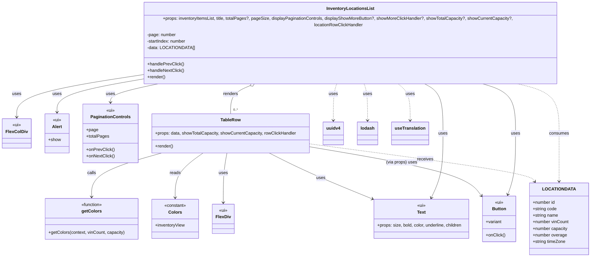

# Diagram: web/portal/src/pages/inventoryview/components/InventoryLocationRow.tsx

> Auto-generated by Obscura crawlers

## Mermaid

### SVG

<svg id="container" width="2136.970703125" xmlns="http://www.w3.org/2000/svg" class="classDiagram" height="908" viewBox="0 0 2136.970703125 908" role="graphics-document document" aria-roledescription="class"><g><defs><marker id="container_class-aggregationStart" class="marker aggregation class" refX="18" refY="7" markerWidth="190" markerHeight="240" orient="auto"><path d="M 18,7 L9,13 L1,7 L9,1 Z"></path></marker></defs><defs><marker id="container_class-aggregationEnd" class="marker aggregation class" refX="1" refY="7" markerWidth="20" markerHeight="28" orient="auto"><path d="M 18,7 L9,13 L1,7 L9,1 Z"></path></marker></defs><defs><marker id="container_class-extensionStart" class="marker extension class" refX="18" refY="7" markerWidth="190" markerHeight="240" orient="auto"><path d="M 1,7 L18,13 V 1 Z"></path></marker></defs><defs><marker id="container_class-extensionEnd" class="marker extension class" refX="1" refY="7" markerWidth="20" markerHeight="28" orient="auto"><path d="M 1,1 V 13 L18,7 Z"></path></marker></defs><defs><marker id="container_class-compositionStart" class="marker composition class" refX="18" refY="7" markerWidth="190" markerHeight="240" orient="auto"><path d="M 18,7 L9,13 L1,7 L9,1 Z"></path></marker></defs><defs><marker id="container_class-compositionEnd" class="marker composition class" refX="1" refY="7" markerWidth="20" markerHeight="28" orient="auto"><path d="M 18,7 L9,13 L1,7 L9,1 Z"></path></marker></defs><defs><marker id="container_class-dependencyStart" class="marker dependency class" refX="6" refY="7" markerWidth="190" markerHeight="240" orient="auto"><path d="M 5,7 L9,13 L1,7 L9,1 Z"></path></marker></defs><defs><marker id="container_class-dependencyEnd" class="marker dependency class" refX="13" refY="7" markerWidth="20" markerHeight="28" orient="auto"><path d="M 18,7 L9,13 L14,7 L9,1 Z"></path></marker></defs><defs><marker id="container_class-lollipopStart" class="marker lollipop class" refX="13" refY="7" markerWidth="190" markerHeight="240" orient="auto"><circle stroke="black" fill="transparent" cx="7" cy="7" r="6"></circle></marker></defs><defs><marker id="container_class-lollipopEnd" class="marker lollipop class" refX="1" refY="7" markerWidth="190" markerHeight="240" orient="auto"><circle stroke="black" fill="transparent" cx="7" cy="7" r="6"></circle></marker></defs><g class="root"><g class="clusters"></g><g class="edgePaths"><path d="M911.078,278.216L897.796,283.346C884.513,288.477,857.948,298.739,844.665,316.036C831.383,333.333,831.383,357.667,831.383,369.833L831.383,382" id="id_InventoryLocationsList_TableRow_1" class="edge-thickness-normal edge-pattern-solid relation" style=";;;" data-edge="true" data-et="edge" data-id="id_InventoryLocationsList_TableRow_1" data-points="W3sieCI6OTI3LjE2OTQwMTgxMjEzMDIsInkiOjI3Mn0seyJ4Ijo4MzEuMzgyODEyNSwieSI6MzA5fSx7IngiOjgzMS4zODI4MTI1LCJ5IjozODJ9XQ==" marker-start="url(#container_class-aggregationStart)"></path><path d="M585.142,272L553.199,278.167C521.256,284.333,457.37,296.667,425.427,308C393.484,319.333,393.484,329.667,393.484,334.833L393.484,340" id="id_InventoryLocationsList_PaginationControls_2" class="edge-thickness-normal edge-pattern-solid relation" style=";;;" data-edge="true" data-et="edge" data-id="id_InventoryLocationsList_PaginationControls_2" data-points="W3sieCI6NTg1LjE0MjIxOTg1OTQ2NzQsInkiOjI3Mn0seyJ4IjozOTMuNDg0Mzc1LCJ5IjozMDl9LHsieCI6MzkzLjQ4NDM3NSwieSI6MzQ2fV0=" marker-end="url(#container_class-dependencyEnd)"></path><path d="M486.008,263.89L438.498,271.408C390.988,278.927,295.969,293.963,248.459,312.648C200.949,331.333,200.949,353.667,200.949,364.833L200.949,376" id="id_InventoryLocationsList_Alert_3" class="edge-thickness-normal edge-pattern-solid relation" style=";;;" data-edge="true" data-et="edge" data-id="id_InventoryLocationsList_Alert_3" data-points="W3sieCI6NDg2LjAwNzgxMjUsInkiOjI2My44OTAxMDM2NTk5MTk0fSx7IngiOjIwMC45NDkyMTg3NSwieSI6MzA5fSx7IngiOjIwMC45NDkyMTg3NSwieSI6MzgyfV0=" marker-end="url(#container_class-dependencyEnd)"></path><path d="M1735.476,272L1757.273,278.167C1779.07,284.333,1822.665,296.667,1844.462,327C1866.26,357.333,1866.26,405.667,1866.26,454C1866.26,502.333,1866.26,550.667,1861.706,588.055C1857.152,625.442,1848.045,651.885,1843.492,665.106L1838.938,678.327" id="id_InventoryLocationsList_Button_4" class="edge-thickness-normal edge-pattern-solid relation" style=";;;" data-edge="true" data-et="edge" data-id="id_InventoryLocationsList_Button_4" data-points="W3sieCI6MTczNS40NzU2NjEwNTc2OTI0LCJ5IjoyNzJ9LHsieCI6MTg2Ni4yNTk3NjU2MjUsInkiOjMwOX0seyJ4IjoxODY2LjI1OTc2NTYyNSwieSI6NDU0fSx7IngiOjE4NjYuMjU5NzY1NjI1LCJ5Ijo1OTl9LHsieCI6MTgzNi45ODQwMzk4NDgzNzI3LCJ5Ijo2ODR9XQ==" marker-end="url(#container_class-dependencyEnd)"></path><path d="M1528.156,272L1540.268,278.167C1552.38,284.333,1576.604,296.667,1588.716,327C1600.828,357.333,1600.828,405.667,1600.828,454C1600.828,502.333,1600.828,550.667,1593.556,590.097C1586.284,629.528,1571.741,660.056,1564.469,675.319L1557.197,690.583" id="id_InventoryLocationsList_Text_5" class="edge-thickness-normal edge-pattern-solid relation" style=";;;" data-edge="true" data-et="edge" data-id="id_InventoryLocationsList_Text_5" data-points="W3sieCI6MTUyOC4xNTYyNzMxMTM5MDU0LCJ5IjoyNzJ9LHsieCI6MTYwMC44MjgxMjUsInkiOjMwOX0seyJ4IjoxNjAwLjgyODEyNSwieSI6NDU0fSx7IngiOjE2MDAuODI4MTI1LCJ5Ijo1OTl9LHsieCI6MTU1NC42MTYxMzU4MTczMDc2LCJ5Ijo2OTZ9XQ==" marker-end="url(#container_class-dependencyEnd)"></path><path d="M486.008,249.23L414.609,259.192C343.211,269.153,200.414,289.077,129.016,313.205C57.617,337.333,57.617,365.667,57.617,379.833L57.617,394" id="id_InventoryLocationsList_FlexColDiv_6" class="edge-thickness-normal edge-pattern-solid relation" style=";;;" data-edge="true" data-et="edge" data-id="id_InventoryLocationsList_FlexColDiv_6" data-points="W3sieCI6NDg2LjAwNzgxMjUsInkiOjI0OS4yMzAwMjU3NjY5NjIxN30seyJ4Ijo1Ny42MTcxODc1LCJ5IjozMDl9LHsieCI6NTcuNjE3MTg3NSwieSI6NDAwfV0=" marker-end="url(#container_class-dependencyEnd)"></path><path d="M577.509,526L534.609,538.167C491.709,550.333,405.909,574.667,363.009,601.5C320.109,628.333,320.109,657.667,320.109,672.333L320.109,687" id="id_TableRow_getColors_7" class="edge-thickness-normal edge-pattern-solid relation" style=";;;" data-edge="true" data-et="edge" data-id="id_TableRow_getColors_7" data-points="W3sieCI6NTc3LjUwOTEwNTYwMzQ0ODIsInkiOjUyNn0seyJ4IjozMjAuMTA5Mzc1LCJ5Ijo1OTl9LHsieCI6MzIwLjEwOTM3NSwieSI6NjkzfV0=" marker-end="url(#container_class-dependencyEnd)"></path><path d="M731.093,526L714.146,538.167C697.199,550.333,663.304,574.667,646.357,602C629.41,629.333,629.41,659.667,629.41,674.833L629.41,690" id="id_TableRow_Colors_8" class="edge-thickness-normal edge-pattern-solid relation" style=";;;" data-edge="true" data-et="edge" data-id="id_TableRow_Colors_8" data-points="W3sieCI6NzMxLjA5Mjk0MTgxMDM0NDksInkiOjUyNn0seyJ4Ijo2MjkuNDEwMTU2MjUsInkiOjU5OX0seyJ4Ijo2MjkuNDEwMTU2MjUsInkiOjY5Nn1d" marker-end="url(#container_class-dependencyEnd)"></path><path d="M818.228,526L816.005,538.167C813.782,550.333,809.336,574.667,807.114,605C804.891,635.333,804.891,671.667,804.891,689.833L804.891,708" id="id_TableRow_FlexDiv_9" class="edge-thickness-normal edge-pattern-solid relation" style=";;;" data-edge="true" data-et="edge" data-id="id_TableRow_FlexDiv_9" data-points="W3sieCI6ODE4LjIyODA3MTEyMDY4OTYsInkiOjUyNn0seyJ4Ijo4MDQuODkwNjI1LCJ5Ijo1OTl9LHsieCI6ODA0Ljg5MDYyNSwieSI6NzE0fV0=" marker-end="url(#container_class-dependencyEnd)"></path><path d="M970.151,526L993.6,538.167C1017.049,550.333,1063.947,574.667,1125.642,602.618C1187.337,630.57,1263.829,662.141,1302.074,677.926L1340.32,693.711" id="id_TableRow_Text_10" class="edge-thickness-normal edge-pattern-solid relation" style=";;;" data-edge="true" data-et="edge" data-id="id_TableRow_Text_10" data-points="W3sieCI6OTcwLjE1MDU5MjY3MjQxMzcsInkiOjUyNn0seyJ4IjoxMTEwLjg0NTcwMzEyNSwieSI6NTk5fSx7IngiOjEzNDUuODY2MjI4MjcyOTI5LCJ5Ijo2OTZ9XQ==" marker-end="url(#container_class-dependencyEnd)"></path><path d="M1120.461,503.508L1213.392,519.423C1306.323,535.338,1492.185,567.169,1596.194,597.485C1700.203,627.802,1722.359,656.604,1733.437,671.004L1744.515,685.405" id="id_TableRow_Button_11" class="edge-thickness-normal edge-pattern-solid relation" style=";;;" data-edge="true" data-et="edge" data-id="id_TableRow_Button_11" data-points="W3sieCI6MTEyMC40NjA5Mzc1LCJ5Ijo1MDMuNTA3NjI2NDM4MzE5NX0seyJ4IjoxNjc4LjA0Njg3NSwieSI6NTk5fSx7IngiOjE3NDguMTczODI4MTI1LCJ5Ijo2OTAuMTYwOTMwMjQ2NTMzM31d" marker-end="url(#container_class-dependencyEnd)"></path><path d="M1858.252,272L1885.786,278.167C1913.319,284.333,1968.385,296.667,1995.918,327C2023.451,357.333,2023.451,405.667,2023.451,454C2023.451,502.333,2023.451,550.667,2023.451,580C2023.451,609.333,2023.451,619.667,2023.451,624.833L2023.451,630" id="id_InventoryLocationsList_LOCATIONDATA_12" class="edge-thickness-normal edge-pattern-dashed relation" style=";;;" data-edge="true" data-et="edge" data-id="id_InventoryLocationsList_LOCATIONDATA_12" data-points="W3sieCI6MTg1OC4yNTIzODA3MzIyNDg2LCJ5IjoyNzJ9LHsieCI6MjAyMy40NTExNzE4NzUsInkiOjMwOX0seyJ4IjoyMDIzLjQ1MTE3MTg3NSwieSI6NDU0fSx7IngiOjIwMjMuNDUxMTcxODc1LCJ5Ijo1OTl9LHsieCI6MjAyMy40NTExNzE4NzUsInkiOjYzNn1d" marker-end="url(#container_class-dependencyEnd)"></path><path d="M1120.461,492.655L1253.009,510.379C1385.558,528.103,1650.655,563.552,1786.596,586.599C1922.537,609.647,1929.322,620.293,1932.714,625.617L1936.107,630.94" id="id_TableRow_LOCATIONDATA_13" class="edge-thickness-normal edge-pattern-dashed relation" style=";;;" data-edge="true" data-et="edge" data-id="id_TableRow_LOCATIONDATA_13" data-points="W3sieCI6MTEyMC40NjA5Mzc1LCJ5Ijo0OTIuNjU1MDM1OTYwMjA4N30seyJ4IjoxOTE1Ljc1MTk1MzEyNSwieSI6NTk5fSx7IngiOjE5MzkuMzMxMDcyMDIyOTI5LCJ5Ijo2MzZ9XQ==" marker-end="url(#container_class-dependencyEnd)"></path><path d="M1220.722,272L1218.471,278.167C1216.221,284.333,1211.72,296.667,1209.469,319C1207.219,341.333,1207.219,373.667,1207.219,389.833L1207.219,406" id="id_InventoryLocationsList_uuidv4_14" class="edge-thickness-normal edge-pattern-dashed relation" style=";;;" data-edge="true" data-et="edge" data-id="id_InventoryLocationsList_uuidv4_14" data-points="W3sieCI6MTIyMC43MjE3MzE2OTM3ODcsInkiOjI3Mn0seyJ4IjoxMjA3LjIxODc1LCJ5IjozMDl9LHsieCI6MTIwNy4yMTg3NSwieSI6NDEyfV0=" marker-end="url(#container_class-dependencyEnd)"></path><path d="M1317.067,272L1319.318,278.167C1321.568,284.333,1326.069,296.667,1328.32,319C1330.57,341.333,1330.57,373.667,1330.57,389.833L1330.57,406" id="id_InventoryLocationsList_lodash_15" class="edge-thickness-normal edge-pattern-dashed relation" style=";;;" data-edge="true" data-et="edge" data-id="id_InventoryLocationsList_lodash_15" data-points="W3sieCI6MTMxNy4wNjczMzA4MDYyMTMsInkiOjI3Mn0seyJ4IjoxMzMwLjU3MDMxMjUsInkiOjMwOX0seyJ4IjoxMzMwLjU3MDMxMjUsInkiOjQxMn1d" marker-end="url(#container_class-dependencyEnd)"></path><path d="M1436.32,272L1444.142,278.167C1451.963,284.333,1467.607,296.667,1475.428,319C1483.25,341.333,1483.25,373.667,1483.25,389.833L1483.25,406" id="id_InventoryLocationsList_useTranslation_16" class="edge-thickness-normal edge-pattern-dashed relation" style=";;;" data-edge="true" data-et="edge" data-id="id_InventoryLocationsList_useTranslation_16" data-points="W3sieCI6MTQzNi4zMjAxMDQ0NzQ4NTIsInkiOjI3Mn0seyJ4IjoxNDgzLjI1LCJ5IjozMDl9LHsieCI6MTQ4My4yNSwieSI6NDEyfV0=" marker-end="url(#container_class-dependencyEnd)"></path></g><g class="edgeLabels"><g class="edgeLabel" transform="translate(831.3828125, 309)"><g class="label" data-id="id_InventoryLocationsList_TableRow_1" transform="translate(-27.75, -12)"><foreignObject width="55.5" height="24">

renders

</foreignObject></g></g><g class="edgeLabel" transform="translate(393.484375, 309)"><g class="label" data-id="id_InventoryLocationsList_PaginationControls_2" transform="translate(-16.4921875, -12)"><foreignObject width="32.984375" height="24">

uses

</foreignObject></g></g><g class="edgeLabel" transform="translate(200.94921875, 309)"><g class="label" data-id="id_InventoryLocationsList_Alert_3" transform="translate(-16.4921875, -12)"><foreignObject width="32.984375" height="24">

uses

</foreignObject></g></g><g class="edgeLabel" transform="translate(1866.259765625, 454)"><g class="label" data-id="id_InventoryLocationsList_Button_4" transform="translate(-16.4921875, -12)"><foreignObject width="32.984375" height="24">

uses

</foreignObject></g></g><g class="edgeLabel" transform="translate(1600.828125, 454)"><g class="label" data-id="id_InventoryLocationsList_Text_5" transform="translate(-16.4921875, -12)"><foreignObject width="32.984375" height="24">

uses

</foreignObject></g></g><g class="edgeLabel" transform="translate(57.6171875, 309)"><g class="label" data-id="id_InventoryLocationsList_FlexColDiv_6" transform="translate(-16.4921875, -12)"><foreignObject width="32.984375" height="24">

uses

</foreignObject></g></g><g class="edgeLabel" transform="translate(320.109375, 599)"><g class="label" data-id="id_TableRow_getColors_7" transform="translate(-16.4453125, -12)"><foreignObject width="32.890625" height="24">

calls

</foreignObject></g></g><g class="edgeLabel" transform="translate(629.41015625, 599)"><g class="label" data-id="id_TableRow_Colors_8" transform="translate(-20.0078125, -12)"><foreignObject width="40.015625" height="24">

reads

</foreignObject></g></g><g class="edgeLabel" transform="translate(804.890625, 599)"><g class="label" data-id="id_TableRow_FlexDiv_9" transform="translate(-16.4921875, -12)"><foreignObject width="32.984375" height="24">

uses

</foreignObject></g></g><g class="edgeLabel" transform="translate(1155.09743, 617.26401)"><g class="label" data-id="id_TableRow_Text_10" transform="translate(-16.4921875, -12)"><foreignObject width="32.984375" height="24">

uses

</foreignObject></g></g><g class="edgeLabel" transform="translate(1455.93542, 560.96111)"><g class="label" data-id="id_TableRow_Button_11" transform="translate(-57.21875, -12)"><foreignObject width="114.4375" height="24">

(via props) uses

</foreignObject></g></g><g class="edgeLabel" transform="translate(2023.451171875, 454)"><g class="label" data-id="id_InventoryLocationsList_LOCATIONDATA_12" transform="translate(-36.375, -12)"><foreignObject width="72.75" height="24">

consumes

</foreignObject></g></g><g class="edgeLabel" transform="translate(1539.85018, 548.73505)"><g class="label" data-id="id_TableRow_LOCATIONDATA_13" transform="translate(-29.4921875, -12)"><foreignObject width="58.984375" height="24">

receives

</foreignObject></g></g><g class="edgeLabel" transform="translate(1207.21875, 309)"><g class="label" data-id="id_InventoryLocationsList_uuidv4_14" transform="translate(-16.4921875, -12)"><foreignObject width="32.984375" height="24">

uses

</foreignObject></g></g><g class="edgeLabel" transform="translate(1330.5703125, 309)"><g class="label" data-id="id_InventoryLocationsList_lodash_15" transform="translate(-16.4921875, -12)"><foreignObject width="32.984375" height="24">

uses

</foreignObject></g></g><g class="edgeLabel" transform="translate(1483.25, 309)"><g class="label" data-id="id_InventoryLocationsList_useTranslation_16" transform="translate(-16.4921875, -12)"><foreignObject width="32.984375" height="24">

uses

</foreignObject></g></g><g class="edgeTerminals" transform="translate(905.4400351147848, 264.31334830976135)"><g class="inner" transform="translate(0, 0)"><foreignObject style="width: 9px; height: 12px;">
1
</foreignObject></g></g><g class="edgeTerminals" transform="translate(841.38281125, 359.4999989285714)"><g class="inner" transform="translate(0, 0)"></g><foreignObject style="width: 36px; height: 12px;">
0..*
</foreignObject></g></g><g class="nodes"><g class="node default" id="classId-LOCATIONDATA-0" transform="translate(2023.451171875, 768)"><g class="basic label-container"><path d="M-105.51953125 -132 L105.51953125 -132 L105.51953125 132 L-105.51953125 132" stroke="none" stroke-width="0" fill="#ECECFF" style=""></path><path d="M-105.51953125 -132 C-41.31972256072858 -132, 22.880086128542843 -132, 105.51953125 -132 M-105.51953125 -132 C-31.991385876381045 -132, 41.53675949723791 -132, 105.51953125 -132 M105.51953125 -132 C105.51953125 -51.5185038800995, 105.51953125 28.962992239800997, 105.51953125 132 M105.51953125 -132 C105.51953125 -52.55198934915781, 105.51953125 26.896021301684385, 105.51953125 132 M105.51953125 132 C59.10942104957441 132, 12.699310849148816 132, -105.51953125 132 M105.51953125 132 C41.079438576304 132, -23.360654097392 132, -105.51953125 132 M-105.51953125 132 C-105.51953125 64.6312996570236, -105.51953125 -2.7374006859527924, -105.51953125 -132 M-105.51953125 132 C-105.51953125 48.7992344345608, -105.51953125 -34.401531130878396, -105.51953125 -132" stroke="#9370DB" stroke-width="1.3" fill="none" stroke-dasharray="0 0" style=""></path></g><g class="annotation-group text" transform="translate(0, -108)"></g><g class="label-group text" transform="translate(-53.8046875, -108)"><g class="label" style="font-weight: bolder" transform="translate(0,-12)"><foreignObject width="107.609375" height="24">

LOCATIONDATA

</foreignObject></g></g><g class="members-group text" transform="translate(-93.51953125, -60)"><g class="label" style="" transform="translate(0,-12)"><foreignObject width="83.109375" height="24">

+number id

</foreignObject></g><g class="label" style="" transform="translate(0,12)"><foreignObject width="88.828125" height="24">

+string code

</foreignObject></g><g class="label" style="" transform="translate(0,36)"><foreignObject width="94.375" height="24">

+string name

</foreignObject></g><g class="label" style="" transform="translate(0,60)"><foreignObject width="133.234375" height="24">

+number vinCount

</foreignObject></g><g class="label" style="" transform="translate(0,84)"><foreignObject width="129" height="24">

+number capacity

</foreignObject></g><g class="label" style="" transform="translate(0,108)"><foreignObject width="125.78125" height="24">

+number overage

</foreignObject></g><g class="label" style="" transform="translate(0,132)"><foreignObject width="122.03125" height="24">

+string timeZone

</foreignObject></g></g><g class="methods-group text" transform="translate(-93.51953125, 132)"></g><g class="divider" style=""><path d="M-105.51953125 -84 C-57.59478825074586 -84, -9.670045251491715 -84, 105.51953125 -84 M-105.51953125 -84 C-61.29354725139714 -84, -17.067563252794287 -84, 105.51953125 -84" stroke="#9370DB" stroke-width="1.3" fill="none" stroke-dasharray="0 0" style=""></path></g><g class="divider" style=""><path d="M-105.51953125 108 C-34.43119708666865 108, 36.65713707666271 108, 105.51953125 108 M-105.51953125 108 C-22.290055334148704 108, 60.93942058170259 108, 105.51953125 108" stroke="#9370DB" stroke-width="1.3" fill="none" stroke-dasharray="0 0" style=""></path></g></g><g class="node default" id="classId-getColors-1" transform="translate(320.109375, 768)"><g class="basic label-container"><path d="M-171.953125 -75 L171.953125 -75 L171.953125 75 L-171.953125 75" stroke="none" stroke-width="0" fill="#ECECFF" style=""></path><path d="M-171.953125 -75 C-97.70610834615853 -75, -23.45909169231706 -75, 171.953125 -75 M-171.953125 -75 C-80.69230214111407 -75, 10.568520717771861 -75, 171.953125 -75 M171.953125 -75 C171.953125 -33.331068781606525, 171.953125 8.33786243678695, 171.953125 75 M171.953125 -75 C171.953125 -16.226678279516207, 171.953125 42.546643440967586, 171.953125 75 M171.953125 75 C93.62782233020819 75, 15.30251966041638 75, -171.953125 75 M171.953125 75 C84.80773387195264 75, -2.3376572560947295 75, -171.953125 75 M-171.953125 75 C-171.953125 21.582537785069043, -171.953125 -31.834924429861914, -171.953125 -75 M-171.953125 75 C-171.953125 38.0485557435167, -171.953125 1.097111487033402, -171.953125 -75" stroke="#9370DB" stroke-width="1.3" fill="none" stroke-dasharray="0 0" style=""></path></g><g class="annotation-group text" transform="translate(-39.484375, -51)"><g class="label" style="" transform="translate(0,-12)"><foreignObject width="78.96875" height="24">

«function»

</foreignObject></g></g><g class="label-group text" transform="translate(-34.8359375, -27)"><g class="label" style="font-weight: bolder" transform="translate(0,-12)"><foreignObject width="69.671875" height="24">

getColors

</foreignObject></g></g><g class="members-group text" transform="translate(-159.953125, 21)"></g><g class="methods-group text" transform="translate(-159.953125, 51)"><g class="label" style="" transform="translate(0,-12)"><foreignObject width="280.421875" height="24">

+getColors(context, vinCount, capacity)

</foreignObject></g></g><g class="divider" style=""><path d="M-171.953125 -3 C-71.12761666452288 -3, 29.69789167095425 -3, 171.953125 -3 M-171.953125 -3 C-36.49607157698523 -3, 98.96098184602954 -3, 171.953125 -3" stroke="#9370DB" stroke-width="1.3" fill="none" stroke-dasharray="0 0" style=""></path></g><g class="divider" style=""><path d="M-171.953125 21 C-101.6092146981566 21, -31.265304396313212 21, 171.953125 21 M-171.953125 21 C-87.44178702312021 21, -2.930449046240426 21, 171.953125 21" stroke="#9370DB" stroke-width="1.3" fill="none" stroke-dasharray="0 0" style=""></path></g></g><g class="node default" id="classId-Colors-2" transform="translate(629.41015625, 768)"><g class="basic label-container"><path d="M-87.34765625 -72 L87.34765625 -72 L87.34765625 72 L-87.34765625 72" stroke="none" stroke-width="0" fill="#ECECFF" style=""></path><path d="M-87.34765625 -72 C-52.39412145987426 -72, -17.440586669748527 -72, 87.34765625 -72 M-87.34765625 -72 C-18.465497277252865 -72, 50.41666169549427 -72, 87.34765625 -72 M87.34765625 -72 C87.34765625 -24.894477542295085, 87.34765625 22.21104491540983, 87.34765625 72 M87.34765625 -72 C87.34765625 -40.93147853684448, 87.34765625 -9.862957073688953, 87.34765625 72 M87.34765625 72 C37.18938896158177 72, -12.96887832683646 72, -87.34765625 72 M87.34765625 72 C25.033900762906605 72, -37.27985472418679 72, -87.34765625 72 M-87.34765625 72 C-87.34765625 26.167889169008042, -87.34765625 -19.664221661983916, -87.34765625 -72 M-87.34765625 72 C-87.34765625 42.524289718551955, -87.34765625 13.04857943710391, -87.34765625 -72" stroke="#9370DB" stroke-width="1.3" fill="none" stroke-dasharray="0 0" style=""></path></g><g class="annotation-group text" transform="translate(-40.4921875, -48)"><g class="label" style="" transform="translate(0,-12)"><foreignObject width="80.984375" height="24">

«constant»

</foreignObject></g></g><g class="label-group text" transform="translate(-23.1015625, -24)"><g class="label" style="font-weight: bolder" transform="translate(0,-12)"><foreignObject width="46.203125" height="24">

Colors

</foreignObject></g></g><g class="members-group text" transform="translate(-75.34765625, 24)"><g class="label" style="" transform="translate(0,-12)"><foreignObject width="110.203125" height="24">

+inventoryView

</foreignObject></g></g><g class="methods-group text" transform="translate(-75.34765625, 72)"></g><g class="divider" style=""><path d="M-87.34765625 0 C-40.99008521145443 0, 5.367485827091144 0, 87.34765625 0 M-87.34765625 0 C-22.723952710528522 0, 41.899750828942956 0, 87.34765625 0" stroke="#9370DB" stroke-width="1.3" fill="none" stroke-dasharray="0 0" style=""></path></g><g class="divider" style=""><path d="M-87.34765625 48 C-23.12144937064828 48, 41.10475750870344 48, 87.34765625 48 M-87.34765625 48 C-52.03049198120879 48, -16.71332771241758 48, 87.34765625 48" stroke="#9370DB" stroke-width="1.3" fill="none" stroke-dasharray="0 0" style=""></path></g></g><g class="node default" id="classId-FlexDiv-3" transform="translate(804.890625, 768)"><g class="basic label-container"><path d="M-38.1328125 -54 L38.1328125 -54 L38.1328125 54 L-38.1328125 54" stroke="none" stroke-width="0" fill="#ECECFF" style=""></path><path d="M-38.1328125 -54 C-19.242873539835784 -54, -0.3529345796715688 -54, 38.1328125 -54 M-38.1328125 -54 C-8.132151483084208 -54, 21.868509533831585 -54, 38.1328125 -54 M38.1328125 -54 C38.1328125 -18.55886039713301, 38.1328125 16.88227920573398, 38.1328125 54 M38.1328125 -54 C38.1328125 -28.729508745412186, 38.1328125 -3.4590174908243725, 38.1328125 54 M38.1328125 54 C20.138834931720265 54, 2.1448573634405292 54, -38.1328125 54 M38.1328125 54 C11.05083091720719 54, -16.03115066558562 54, -38.1328125 54 M-38.1328125 54 C-38.1328125 22.99123125382751, -38.1328125 -8.017537492344978, -38.1328125 -54 M-38.1328125 54 C-38.1328125 11.692901866330502, -38.1328125 -30.614196267338997, -38.1328125 -54" stroke="#9370DB" stroke-width="1.3" fill="none" stroke-dasharray="0 0" style=""></path></g><g class="annotation-group text" transform="translate(-16.046875, -30)"><g class="label" style="" transform="translate(0,-12)"><foreignObject width="32.09375" height="24">

«ui»

</foreignObject></g></g><g class="label-group text" transform="translate(-26.1328125, -6)"><g class="label" style="font-weight: bolder" transform="translate(0,-12)"><foreignObject width="52.265625" height="24">

FlexDiv

</foreignObject></g></g><g class="members-group text" transform="translate(-26.1328125, 42)"></g><g class="methods-group text" transform="translate(-26.1328125, 72)"></g><g class="divider" style=""><path d="M-38.1328125 18 C-12.422881464610509 18, 13.287049570778983 18, 38.1328125 18 M-38.1328125 18 C-12.083741245622527 18, 13.965330008754947 18, 38.1328125 18" stroke="#9370DB" stroke-width="1.3" fill="none" stroke-dasharray="0 0" style=""></path></g><g class="divider" style=""><path d="M-38.1328125 36 C-13.757246771259855 36, 10.618318957480291 36, 38.1328125 36 M-38.1328125 36 C-19.194551358657147 36, -0.25629021731429447 36, 38.1328125 36" stroke="#9370DB" stroke-width="1.3" fill="none" stroke-dasharray="0 0" style=""></path></g></g><g class="node default" id="classId-FlexColDiv-4" transform="translate(57.6171875, 454)"><g class="basic label-container"><path d="M-49.6171875 -54 L49.6171875 -54 L49.6171875 54 L-49.6171875 54" stroke="none" stroke-width="0" fill="#ECECFF" style=""></path><path d="M-49.6171875 -54 C-17.190992153531198 -54, 15.235203192937604 -54, 49.6171875 -54 M-49.6171875 -54 C-26.024014711167897 -54, -2.4308419223357944 -54, 49.6171875 -54 M49.6171875 -54 C49.6171875 -20.152910230041243, 49.6171875 13.694179539917513, 49.6171875 54 M49.6171875 -54 C49.6171875 -15.581577739650065, 49.6171875 22.83684452069987, 49.6171875 54 M49.6171875 54 C11.81741129416514 54, -25.98236491166972 54, -49.6171875 54 M49.6171875 54 C16.499858078944094 54, -16.617471342111813 54, -49.6171875 54 M-49.6171875 54 C-49.6171875 32.049270418254395, -49.6171875 10.098540836508782, -49.6171875 -54 M-49.6171875 54 C-49.6171875 24.1092077101151, -49.6171875 -5.781584579769799, -49.6171875 -54" stroke="#9370DB" stroke-width="1.3" fill="none" stroke-dasharray="0 0" style=""></path></g><g class="annotation-group text" transform="translate(-16.046875, -30)"><g class="label" style="" transform="translate(0,-12)"><foreignObject width="32.09375" height="24">

«ui»

</foreignObject></g></g><g class="label-group text" transform="translate(-37.6171875, -6)"><g class="label" style="font-weight: bolder" transform="translate(0,-12)"><foreignObject width="75.234375" height="24">

FlexColDiv

</foreignObject></g></g><g class="members-group text" transform="translate(-37.6171875, 42)"></g><g class="methods-group text" transform="translate(-37.6171875, 72)"></g><g class="divider" style=""><path d="M-49.6171875 18 C-24.016072263273784 18, 1.5850429734524312 18, 49.6171875 18 M-49.6171875 18 C-24.862042712766197 18, -0.10689792553239386 18, 49.6171875 18" stroke="#9370DB" stroke-width="1.3" fill="none" stroke-dasharray="0 0" style=""></path></g><g class="divider" style=""><path d="M-49.6171875 36 C-13.579550635808232 36, 22.458086228383536 36, 49.6171875 36 M-49.6171875 36 C-16.60404818853568 36, 16.409091122928643 36, 49.6171875 36" stroke="#9370DB" stroke-width="1.3" fill="none" stroke-dasharray="0 0" style=""></path></g></g><g class="node default" id="classId-Text-5" transform="translate(1520.314453125, 768)"><g class="basic label-container"><path d="M-177.859375 -72 L177.859375 -72 L177.859375 72 L-177.859375 72" stroke="none" stroke-width="0" fill="#ECECFF" style=""></path><path d="M-177.859375 -72 C-82.68046513405956 -72, 12.49844473188088 -72, 177.859375 -72 M-177.859375 -72 C-47.08057563993941 -72, 83.69822372012118 -72, 177.859375 -72 M177.859375 -72 C177.859375 -22.429654136710717, 177.859375 27.140691726578567, 177.859375 72 M177.859375 -72 C177.859375 -35.911964931231104, 177.859375 0.176070137537792, 177.859375 72 M177.859375 72 C72.99458104030914 72, -31.870212919381714 72, -177.859375 72 M177.859375 72 C67.40488711071971 72, -43.049600778560574 72, -177.859375 72 M-177.859375 72 C-177.859375 22.567431639395146, -177.859375 -26.86513672120971, -177.859375 -72 M-177.859375 72 C-177.859375 36.574137633426325, -177.859375 1.1482752668526501, -177.859375 -72" stroke="#9370DB" stroke-width="1.3" fill="none" stroke-dasharray="0 0" style=""></path></g><g class="annotation-group text" transform="translate(-16.046875, -48)"><g class="label" style="" transform="translate(0,-12)"><foreignObject width="32.09375" height="24">

«ui»

</foreignObject></g></g><g class="label-group text" transform="translate(-15.3828125, -24)"><g class="label" style="font-weight: bolder" transform="translate(0,-12)"><foreignObject width="30.765625" height="24">

Text

</foreignObject></g></g><g class="members-group text" transform="translate(-165.859375, 24)"><g class="label" style="" transform="translate(0,-12)"><foreignObject width="315.671875" height="24">

+props: size, bold, color, underline, children

</foreignObject></g></g><g class="methods-group text" transform="translate(-165.859375, 72)"></g><g class="divider" style=""><path d="M-177.859375 0 C-103.86186781089732 0, -29.864360621794646 0, 177.859375 0 M-177.859375 0 C-87.4411683022155 0, 2.9770383955689965 0, 177.859375 0" stroke="#9370DB" stroke-width="1.3" fill="none" stroke-dasharray="0 0" style=""></path></g><g class="divider" style=""><path d="M-177.859375 48 C-104.80835297509118 48, -31.757330950182364 48, 177.859375 48 M-177.859375 48 C-48.41969180212169 48, 81.01999139575662 48, 177.859375 48" stroke="#9370DB" stroke-width="1.3" fill="none" stroke-dasharray="0 0" style=""></path></g></g><g class="node default" id="classId-Button-6" transform="translate(1808.052734375, 768)"><g class="basic label-container"><path d="M-59.87890625 -84 L59.87890625 -84 L59.87890625 84 L-59.87890625 84" stroke="none" stroke-width="0" fill="#ECECFF" style=""></path><path d="M-59.87890625 -84 C-27.03900278688367 -84, 5.800900676232658 -84, 59.87890625 -84 M-59.87890625 -84 C-34.64749320818676 -84, -9.416080166373526 -84, 59.87890625 -84 M59.87890625 -84 C59.87890625 -24.830741520033413, 59.87890625 34.33851695993317, 59.87890625 84 M59.87890625 -84 C59.87890625 -30.602332622035632, 59.87890625 22.795334755928735, 59.87890625 84 M59.87890625 84 C20.638768900867248 84, -18.601368448265504 84, -59.87890625 84 M59.87890625 84 C18.667505354319907 84, -22.543895541360186 84, -59.87890625 84 M-59.87890625 84 C-59.87890625 30.915266330548164, -59.87890625 -22.169467338903672, -59.87890625 -84 M-59.87890625 84 C-59.87890625 22.915495035347533, -59.87890625 -38.169009929304934, -59.87890625 -84" stroke="#9370DB" stroke-width="1.3" fill="none" stroke-dasharray="0 0" style=""></path></g><g class="annotation-group text" transform="translate(-16.046875, -60)"><g class="label" style="" transform="translate(0,-12)"><foreignObject width="32.09375" height="24">

«ui»

</foreignObject></g></g><g class="label-group text" transform="translate(-24.8359375, -36)"><g class="label" style="font-weight: bolder" transform="translate(0,-12)"><foreignObject width="49.671875" height="24">

Button

</foreignObject></g></g><g class="members-group text" transform="translate(-47.87890625, 12)"><g class="label" style="" transform="translate(0,-12)"><foreignObject width="58.703125" height="24">

+variant

</foreignObject></g></g><g class="methods-group text" transform="translate(-47.87890625, 60)"><g class="label" style="" transform="translate(0,-12)"><foreignObject width="70.921875" height="24">

+onClick()

</foreignObject></g></g><g class="divider" style=""><path d="M-59.87890625 -12 C-26.981000238137106 -12, 5.916905773725787 -12, 59.87890625 -12 M-59.87890625 -12 C-17.118243827857974 -12, 25.642418594284052 -12, 59.87890625 -12" stroke="#9370DB" stroke-width="1.3" fill="none" stroke-dasharray="0 0" style=""></path></g><g class="divider" style=""><path d="M-59.87890625 36 C-12.383876031422169 36, 35.11115418715566 36, 59.87890625 36 M-59.87890625 36 C-31.97405745701911 36, -4.0692086640382215 36, 59.87890625 36" stroke="#9370DB" stroke-width="1.3" fill="none" stroke-dasharray="0 0" style=""></path></g></g><g class="node default" id="classId-Alert-7" transform="translate(200.94921875, 454)"><g class="basic label-container"><path d="M-43.71484375 -72 L43.71484375 -72 L43.71484375 72 L-43.71484375 72" stroke="none" stroke-width="0" fill="#ECECFF" style=""></path><path d="M-43.71484375 -72 C-23.63704337380179 -72, -3.559242997603583 -72, 43.71484375 -72 M-43.71484375 -72 C-25.972311150949743 -72, -8.229778551899486 -72, 43.71484375 -72 M43.71484375 -72 C43.71484375 -26.272615541839357, 43.71484375 19.454768916321285, 43.71484375 72 M43.71484375 -72 C43.71484375 -42.49022444857779, 43.71484375 -12.98044889715559, 43.71484375 72 M43.71484375 72 C21.77792301825681 72, -0.1589977134863787 72, -43.71484375 72 M43.71484375 72 C9.750542808047648 72, -24.213758133904705 72, -43.71484375 72 M-43.71484375 72 C-43.71484375 24.46388852419723, -43.71484375 -23.07222295160554, -43.71484375 -72 M-43.71484375 72 C-43.71484375 39.882171592150044, -43.71484375 7.764343184300088, -43.71484375 -72" stroke="#9370DB" stroke-width="1.3" fill="none" stroke-dasharray="0 0" style=""></path></g><g class="annotation-group text" transform="translate(-16.046875, -48)"><g class="label" style="" transform="translate(0,-12)"><foreignObject width="32.09375" height="24">

«ui»

</foreignObject></g></g><g class="label-group text" transform="translate(-17.7734375, -24)"><g class="label" style="font-weight: bolder" transform="translate(0,-12)"><foreignObject width="35.546875" height="24">

Alert

</foreignObject></g></g><g class="members-group text" transform="translate(-31.71484375, 24)"><g class="label" style="" transform="translate(0,-12)"><foreignObject width="45.65625" height="24">

+show

</foreignObject></g></g><g class="methods-group text" transform="translate(-31.71484375, 72)"></g><g class="divider" style=""><path d="M-43.71484375 0 C-11.541826443387109 0, 20.631190863225783 0, 43.71484375 0 M-43.71484375 0 C-17.783530440984933 0, 8.147782868030134 0, 43.71484375 0" stroke="#9370DB" stroke-width="1.3" fill="none" stroke-dasharray="0 0" style=""></path></g><g class="divider" style=""><path d="M-43.71484375 48 C-17.579328610758846 48, 8.556186528482307 48, 43.71484375 48 M-43.71484375 48 C-20.67603756235725 48, 2.362768625285497 48, 43.71484375 48" stroke="#9370DB" stroke-width="1.3" fill="none" stroke-dasharray="0 0" style=""></path></g></g><g class="node default" id="classId-PaginationControls-8" transform="translate(393.484375, 454)"><g class="basic label-container"><path d="M-98.8203125 -108 L98.8203125 -108 L98.8203125 108 L-98.8203125 108" stroke="none" stroke-width="0" fill="#ECECFF" style=""></path><path d="M-98.8203125 -108 C-51.93170300684796 -108, -5.043093513695922 -108, 98.8203125 -108 M-98.8203125 -108 C-43.002313310645356 -108, 12.815685878709289 -108, 98.8203125 -108 M98.8203125 -108 C98.8203125 -36.29967062472991, 98.8203125 35.400658750540174, 98.8203125 108 M98.8203125 -108 C98.8203125 -28.169079091811355, 98.8203125 51.66184181637729, 98.8203125 108 M98.8203125 108 C35.621263314744596 108, -27.57778587051081 108, -98.8203125 108 M98.8203125 108 C37.01892130099578 108, -24.782469898008443 108, -98.8203125 108 M-98.8203125 108 C-98.8203125 47.48276690112098, -98.8203125 -13.034466197758036, -98.8203125 -108 M-98.8203125 108 C-98.8203125 61.1394753909686, -98.8203125 14.278950781937198, -98.8203125 -108" stroke="#9370DB" stroke-width="1.3" fill="none" stroke-dasharray="0 0" style=""></path></g><g class="annotation-group text" transform="translate(-16.046875, -84)"><g class="label" style="" transform="translate(0,-12)"><foreignObject width="32.09375" height="24">

«ui»

</foreignObject></g></g><g class="label-group text" transform="translate(-69.6875, -60)"><g class="label" style="font-weight: bolder" transform="translate(0,-12)"><foreignObject width="139.375" height="24">

PaginationControls

</foreignObject></g></g><g class="members-group text" transform="translate(-86.8203125, -12)"><g class="label" style="" transform="translate(0,-12)"><foreignObject width="42.65625" height="24">

+page

</foreignObject></g><g class="label" style="" transform="translate(0,12)"><foreignObject width="82.90625" height="24">

+totalPages

</foreignObject></g></g><g class="methods-group text" transform="translate(-86.8203125, 60)"><g class="label" style="" transform="translate(0,-12)"><foreignObject width="102.125" height="24">

+onPrevClick()

</foreignObject></g><g class="label" style="" transform="translate(0,12)"><foreignObject width="103.953125" height="24">

+onNextClick()

</foreignObject></g></g><g class="divider" style=""><path d="M-98.8203125 -36 C-36.543843278449955 -36, 25.73262594310009 -36, 98.8203125 -36 M-98.8203125 -36 C-32.91625149727723 -36, 32.98780950544554 -36, 98.8203125 -36" stroke="#9370DB" stroke-width="1.3" fill="none" stroke-dasharray="0 0" style=""></path></g><g class="divider" style=""><path d="M-98.8203125 36 C-38.45006296370935 36, 21.9201865725813 36, 98.8203125 36 M-98.8203125 36 C-30.462870217504488 36, 37.894572064991024 36, 98.8203125 36" stroke="#9370DB" stroke-width="1.3" fill="none" stroke-dasharray="0 0" style=""></path></g></g><g class="node default" id="classId-TableRow-9" transform="translate(831.3828125, 454)"><g class="basic label-container"><path d="M-289.078125 -72 L289.078125 -72 L289.078125 72 L-289.078125 72" stroke="none" stroke-width="0" fill="#ECECFF" style=""></path><path d="M-289.078125 -72 C-76.02335964275775 -72, 137.0314057144845 -72, 289.078125 -72 M-289.078125 -72 C-161.85116628585678 -72, -34.62420757171358 -72, 289.078125 -72 M289.078125 -72 C289.078125 -22.37790266682144, 289.078125 27.244194666357117, 289.078125 72 M289.078125 -72 C289.078125 -27.7361570939281, 289.078125 16.5276858121438, 289.078125 72 M289.078125 72 C138.3438681706829 72, -12.390388658634208 72, -289.078125 72 M289.078125 72 C108.95083390271986 72, -71.17645719456027 72, -289.078125 72 M-289.078125 72 C-289.078125 24.76606620584873, -289.078125 -22.46786758830254, -289.078125 -72 M-289.078125 72 C-289.078125 31.40814895642542, -289.078125 -9.183702087149157, -289.078125 -72" stroke="#9370DB" stroke-width="1.3" fill="none" stroke-dasharray="0 0" style=""></path></g><g class="annotation-group text" transform="translate(0, -48)"></g><g class="label-group text" transform="translate(-35.3125, -48)"><g class="label" style="font-weight: bolder" transform="translate(0,-12)"><foreignObject width="70.625" height="24">

TableRow

</foreignObject></g></g><g class="members-group text" transform="translate(-277.078125, 0)"><g class="label" style="" transform="translate(0,-12)"><foreignObject width="518.84375" height="24">

+props: data, showTotalCapacity, showCurrentCapacity, rowClickHandler

</foreignObject></g></g><g class="methods-group text" transform="translate(-277.078125, 48)"><g class="label" style="" transform="translate(0,-12)"><foreignObject width="66.609375" height="24">

+render()

</foreignObject></g></g><g class="divider" style=""><path d="M-289.078125 -24 C-109.41352637172835 -24, 70.2510722565433 -24, 289.078125 -24 M-289.078125 -24 C-80.4050807365524 -24, 128.2679635268952 -24, 289.078125 -24" stroke="#9370DB" stroke-width="1.3" fill="none" stroke-dasharray="0 0" style=""></path></g><g class="divider" style=""><path d="M-289.078125 24 C-94.05264628037932 24, 100.97283243924136 24, 289.078125 24 M-289.078125 24 C-160.17332784595212 24, -31.268530691904232 24, 289.078125 24" stroke="#9370DB" stroke-width="1.3" fill="none" stroke-dasharray="0 0" style=""></path></g></g><g class="node default" id="classId-InventoryLocationsList-10" transform="translate(1268.89453125, 140)"><g class="basic label-container"><path d="M-782.88671875 -132 L782.88671875 -132 L782.88671875 132 L-782.88671875 132" stroke="none" stroke-width="0" fill="#ECECFF" style=""></path><path d="M-782.88671875 -132 C-354.24220095443263 -132, 74.40231684113473 -132, 782.88671875 -132 M-782.88671875 -132 C-345.75539587601725 -132, 91.37592699796551 -132, 782.88671875 -132 M782.88671875 -132 C782.88671875 -49.37982234795186, 782.88671875 33.24035530409628, 782.88671875 132 M782.88671875 -132 C782.88671875 -71.23435430721165, 782.88671875 -10.468708614423306, 782.88671875 132 M782.88671875 132 C398.1198436134146 132, 13.352968476829233 132, -782.88671875 132 M782.88671875 132 C199.96218842156486 132, -382.9623419068703 132, -782.88671875 132 M-782.88671875 132 C-782.88671875 69.07546327261281, -782.88671875 6.15092654522563, -782.88671875 -132 M-782.88671875 132 C-782.88671875 27.59281107119837, -782.88671875 -76.81437785760326, -782.88671875 -132" stroke="#9370DB" stroke-width="1.3" fill="none" stroke-dasharray="0 0" style=""></path></g><g class="annotation-group text" transform="translate(0, -108)"></g><g class="label-group text" transform="translate(-83.4765625, -108)"><g class="label" style="font-weight: bolder" transform="translate(0,-12)"><foreignObject width="166.953125" height="24">

InventoryLocationsList

</foreignObject></g></g><g class="members-group text" transform="translate(-770.88671875, -60)"><g class="label" style="" transform="translate(0,-12)"><foreignObject width="1458.296875" height="24">

+props: inventoryItemsList, title, totalPages?, pageSize, displayPaginationControls, displayShowMoreButton?, showMoreClickHandler?, showTotalCapacity?, showCurrentCapacity?, locationRowClickHandler

</foreignObject></g><g class="label" style="" transform="translate(0,12)"><foreignObject width="106.015625" height="24">

-page: number

</foreignObject></g><g class="label" style="" transform="translate(0,36)"><foreignObject width="145.1875" height="24">

-startIndex: number

</foreignObject></g><g class="label" style="" transform="translate(0,60)"><foreignObject width="163.265625" height="24">

-data: LOCATIONDATA[]

</foreignObject></g></g><g class="methods-group text" transform="translate(-770.88671875, 60)"><g class="label" style="" transform="translate(0,-12)"><foreignObject width="133.75" height="24">

+handlePrevClick()

</foreignObject></g><g class="label" style="" transform="translate(0,12)"><foreignObject width="135.59375" height="24">

+handleNextClick()

</foreignObject></g><g class="label" style="" transform="translate(0,36)"><foreignObject width="66.609375" height="24">

+render()

</foreignObject></g></g><g class="divider" style=""><path d="M-782.88671875 -84 C-195.01722530625352 -84, 392.85226813749296 -84, 782.88671875 -84 M-782.88671875 -84 C-184.83543657249345 -84, 413.2158456050131 -84, 782.88671875 -84" stroke="#9370DB" stroke-width="1.3" fill="none" stroke-dasharray="0 0" style=""></path></g><g class="divider" style=""><path d="M-782.88671875 36 C-468.3908770748553 36, -153.89503539971065 36, 782.88671875 36 M-782.88671875 36 C-159.89164639480896 36, 463.1034259603821 36, 782.88671875 36" stroke="#9370DB" stroke-width="1.3" fill="none" stroke-dasharray="0 0" style=""></path></g></g><g class="node default" id="classId-uuidv4-11" transform="translate(1207.21875, 454)"><g class="basic label-container"><path d="M-36.7578125 -42 L36.7578125 -42 L36.7578125 42 L-36.7578125 42" stroke="none" stroke-width="0" fill="#ECECFF" style=""></path><path d="M-36.7578125 -42 C-19.921730329797775 -42, -3.08564815959555 -42, 36.7578125 -42 M-36.7578125 -42 C-15.625168884741946 -42, 5.507474730516108 -42, 36.7578125 -42 M36.7578125 -42 C36.7578125 -23.93350912412152, 36.7578125 -5.867018248243042, 36.7578125 42 M36.7578125 -42 C36.7578125 -18.335861455008743, 36.7578125 5.328277089982514, 36.7578125 42 M36.7578125 42 C14.918985821456776 42, -6.919840857086449 42, -36.7578125 42 M36.7578125 42 C8.62529593200021 42, -19.50722063599958 42, -36.7578125 42 M-36.7578125 42 C-36.7578125 18.954450466658002, -36.7578125 -4.091099066683995, -36.7578125 -42 M-36.7578125 42 C-36.7578125 25.022204435122962, -36.7578125 8.044408870245924, -36.7578125 -42" stroke="#9370DB" stroke-width="1.3" fill="none" stroke-dasharray="0 0" style=""></path></g><g class="annotation-group text" transform="translate(0, -18)"></g><g class="label-group text" transform="translate(-24.7578125, -18)"><g class="label" style="font-weight: bolder" transform="translate(0,-12)"><foreignObject width="49.515625" height="24">

uuidv4

</foreignObject></g></g><g class="members-group text" transform="translate(-24.7578125, 30)"></g><g class="methods-group text" transform="translate(-24.7578125, 60)"></g><g class="divider" style=""><path d="M-36.7578125 6 C-16.67516227371927 6, 3.4074879525614605 6, 36.7578125 6 M-36.7578125 6 C-7.439488864738351 6, 21.878834770523298 6, 36.7578125 6" stroke="#9370DB" stroke-width="1.3" fill="none" stroke-dasharray="0 0" style=""></path></g><g class="divider" style=""><path d="M-36.7578125 24 C-8.152805822704707 24, 20.452200854590586 24, 36.7578125 24 M-36.7578125 24 C-10.097345008870931 24, 16.563122482258137 24, 36.7578125 24" stroke="#9370DB" stroke-width="1.3" fill="none" stroke-dasharray="0 0" style=""></path></g></g><g class="node default" id="classId-lodash-12" transform="translate(1330.5703125, 454)"><g class="basic label-container"><path d="M-36.59375 -42 L36.59375 -42 L36.59375 42 L-36.59375 42" stroke="none" stroke-width="0" fill="#ECECFF" style=""></path><path d="M-36.59375 -42 C-10.540743874374726 -42, 15.512262251250547 -42, 36.59375 -42 M-36.59375 -42 C-12.431286771690395 -42, 11.73117645661921 -42, 36.59375 -42 M36.59375 -42 C36.59375 -12.016591372105939, 36.59375 17.966817255788122, 36.59375 42 M36.59375 -42 C36.59375 -8.894171145319092, 36.59375 24.211657709361816, 36.59375 42 M36.59375 42 C14.55820756429549 42, -7.47733487140902 42, -36.59375 42 M36.59375 42 C9.095385055901662 42, -18.402979888196676 42, -36.59375 42 M-36.59375 42 C-36.59375 10.69634652816314, -36.59375 -20.60730694367372, -36.59375 -42 M-36.59375 42 C-36.59375 14.882941045152354, -36.59375 -12.234117909695293, -36.59375 -42" stroke="#9370DB" stroke-width="1.3" fill="none" stroke-dasharray="0 0" style=""></path></g><g class="annotation-group text" transform="translate(0, -18)"></g><g class="label-group text" transform="translate(-24.59375, -18)"><g class="label" style="font-weight: bolder" transform="translate(0,-12)"><foreignObject width="49.1875" height="24">

lodash

</foreignObject></g></g><g class="members-group text" transform="translate(-24.59375, 30)"></g><g class="methods-group text" transform="translate(-24.59375, 60)"></g><g class="divider" style=""><path d="M-36.59375 6 C-18.01583920439085 6, 0.5620715912182987 6, 36.59375 6 M-36.59375 6 C-8.269012039251596 6, 20.05572592149681 6, 36.59375 6" stroke="#9370DB" stroke-width="1.3" fill="none" stroke-dasharray="0 0" style=""></path></g><g class="divider" style=""><path d="M-36.59375 24 C-11.809573308096443 24, 12.974603383807114 24, 36.59375 24 M-36.59375 24 C-11.757996898842215 24, 13.07775620231557 24, 36.59375 24" stroke="#9370DB" stroke-width="1.3" fill="none" stroke-dasharray="0 0" style=""></path></g></g><g class="node default" id="classId-useTranslation-13" transform="translate(1483.25, 454)"><g class="basic label-container"><path d="M-66.0859375 -42 L66.0859375 -42 L66.0859375 42 L-66.0859375 42" stroke="none" stroke-width="0" fill="#ECECFF" style=""></path><path d="M-66.0859375 -42 C-18.219889960902208 -42, 29.646157578195584 -42, 66.0859375 -42 M-66.0859375 -42 C-33.984881186277455 -42, -1.8838248725549107 -42, 66.0859375 -42 M66.0859375 -42 C66.0859375 -18.024874447807854, 66.0859375 5.950251104384293, 66.0859375 42 M66.0859375 -42 C66.0859375 -24.15117327960611, 66.0859375 -6.302346559212218, 66.0859375 42 M66.0859375 42 C36.64356182417281 42, 7.201186148345606 42, -66.0859375 42 M66.0859375 42 C29.713622877960724 42, -6.658691744078553 42, -66.0859375 42 M-66.0859375 42 C-66.0859375 16.605043899002165, -66.0859375 -8.78991220199567, -66.0859375 -42 M-66.0859375 42 C-66.0859375 12.450073785753087, -66.0859375 -17.099852428493826, -66.0859375 -42" stroke="#9370DB" stroke-width="1.3" fill="none" stroke-dasharray="0 0" style=""></path></g><g class="annotation-group text" transform="translate(0, -18)"></g><g class="label-group text" transform="translate(-54.0859375, -18)"><g class="label" style="font-weight: bolder" transform="translate(0,-12)"><foreignObject width="108.171875" height="24">

useTranslation

</foreignObject></g></g><g class="members-group text" transform="translate(-54.0859375, 30)"></g><g class="methods-group text" transform="translate(-54.0859375, 60)"></g><g class="divider" style=""><path d="M-66.0859375 6 C-18.433118243276077 6, 29.219701013447846 6, 66.0859375 6 M-66.0859375 6 C-37.69075376877815 6, -9.29557003755631 6, 66.0859375 6" stroke="#9370DB" stroke-width="1.3" fill="none" stroke-dasharray="0 0" style=""></path></g><g class="divider" style=""><path d="M-66.0859375 24 C-19.861462814304033 24, 26.363011871391933 24, 66.0859375 24 M-66.0859375 24 C-35.998271835011465 24, -5.9106061700229375 24, 66.0859375 24" stroke="#9370DB" stroke-width="1.3" fill="none" stroke-dasharray="0 0" style=""></path></g></g></g></g></g></svg>
