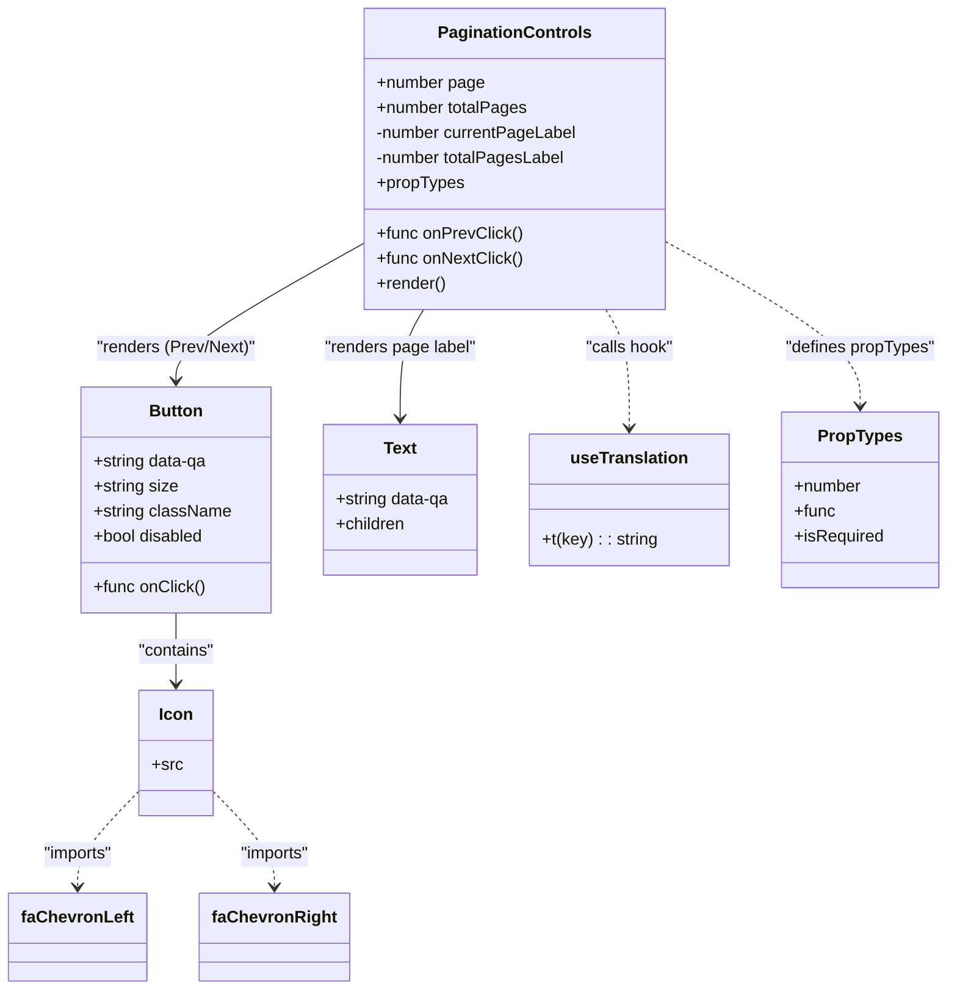

# Diagram: web/portal/src/pages/inventoryview/components/PaginationControls.js

> Auto-generated by Obscura crawlers

## Mermaid

### SVG

<svg id="container" width="896.95703125" xmlns="http://www.w3.org/2000/svg" class="classDiagram" height="946" viewBox="0 0 896.95703125 946" role="graphics-document document" aria-roledescription="class"><g><defs><marker id="container_class-aggregationStart" class="marker aggregation class" refX="18" refY="7" markerWidth="190" markerHeight="240" orient="auto"><path d="M 18,7 L9,13 L1,7 L9,1 Z"></path></marker></defs><defs><marker id="container_class-aggregationEnd" class="marker aggregation class" refX="1" refY="7" markerWidth="20" markerHeight="28" orient="auto"><path d="M 18,7 L9,13 L1,7 L9,1 Z"></path></marker></defs><defs><marker id="container_class-extensionStart" class="marker extension class" refX="18" refY="7" markerWidth="190" markerHeight="240" orient="auto"><path d="M 1,7 L18,13 V 1 Z"></path></marker></defs><defs><marker id="container_class-extensionEnd" class="marker extension class" refX="1" refY="7" markerWidth="20" markerHeight="28" orient="auto"><path d="M 1,1 V 13 L18,7 Z"></path></marker></defs><defs><marker id="container_class-compositionStart" class="marker composition class" refX="18" refY="7" markerWidth="190" markerHeight="240" orient="auto"><path d="M 18,7 L9,13 L1,7 L9,1 Z"></path></marker></defs><defs><marker id="container_class-compositionEnd" class="marker composition class" refX="1" refY="7" markerWidth="20" markerHeight="28" orient="auto"><path d="M 18,7 L9,13 L1,7 L9,1 Z"></path></marker></defs><defs><marker id="container_class-dependencyStart" class="marker dependency class" refX="6" refY="7" markerWidth="190" markerHeight="240" orient="auto"><path d="M 5,7 L9,13 L1,7 L9,1 Z"></path></marker></defs><defs><marker id="container_class-dependencyEnd" class="marker dependency class" refX="13" refY="7" markerWidth="20" markerHeight="28" orient="auto"><path d="M 18,7 L9,13 L14,7 L9,1 Z"></path></marker></defs><defs><marker id="container_class-lollipopStart" class="marker lollipop class" refX="13" refY="7" markerWidth="190" markerHeight="240" orient="auto"><circle stroke="black" fill="transparent" cx="7" cy="7" r="6"></circle></marker></defs><defs><marker id="container_class-lollipopEnd" class="marker lollipop class" refX="1" refY="7" markerWidth="190" markerHeight="240" orient="auto"><circle stroke="black" fill="transparent" cx="7" cy="7" r="6"></circle></marker></defs><g class="root"><g class="clusters"></g><g class="edgePaths"><path d="M343.57,231.84L313.279,248.7C282.987,265.56,222.404,299.28,192.112,321.307C161.82,343.333,161.82,353.667,161.82,358.833L161.82,364" id="id_PaginationControls_Button_1" class="edge-thickness-normal edge-pattern-solid relation" style=";;;" data-edge="true" data-et="edge" data-id="id_PaginationControls_Button_1" data-points="W3sieCI6MzQzLjU3MDMxMjUsInkiOjIzMS44NDAwMjQwMjQwMjQwMn0seyJ4IjoxNjEuODIwMzEyNSwieSI6MzMzfSx7IngiOjE2MS44MjAzMTI1LCJ5IjozNzB9XQ==" marker-end="url(#container_class-dependencyEnd)"></path><path d="M399.663,296L395.923,302.167C392.182,308.333,384.7,320.667,380.96,338C377.219,355.333,377.219,377.667,377.219,388.833L377.219,400" id="id_PaginationControls_Text_2" class="edge-thickness-normal edge-pattern-solid relation" style=";;;" data-edge="true" data-et="edge" data-id="id_PaginationControls_Text_2" data-points="W3sieCI6Mzk5LjY2MzQxNTA1NTI0ODYsInkiOjI5Nn0seyJ4IjozNzcuMjE4NzUsInkiOjMzM30seyJ4IjozNzcuMjE4NzUsInkiOjQwNn1d" marker-end="url(#container_class-dependencyEnd)"></path><path d="M161.82,586L161.82,592.167C161.82,598.333,161.82,610.667,161.82,622C161.82,633.333,161.82,643.667,161.82,648.833L161.82,654" id="id_Button_Icon_3" class="edge-thickness-normal edge-pattern-solid relation" style=";;;" data-edge="true" data-et="edge" data-id="id_Button_Icon_3" data-points="W3sieCI6MTYxLjgyMDMxMjUsInkiOjU4Nn0seyJ4IjoxNjEuODIwMzEyNSwieSI6NjIzfSx7IngiOjE2MS44MjAzMTI1LCJ5Ijo2NjB9XQ==" marker-end="url(#container_class-dependencyEnd)"></path><path d="M574.368,296L578.109,302.167C581.849,308.333,589.331,320.667,593.072,339.5C596.813,358.333,596.813,383.667,596.813,396.333L596.813,409" id="id_PaginationControls_useTranslation_4" class="edge-thickness-normal edge-pattern-dashed relation" style=";;;" data-edge="true" data-et="edge" data-id="id_PaginationControls_useTranslation_4" data-points="W3sieCI6NTc0LjM2NzgzNDk0NDc1MTQsInkiOjI5Nn0seyJ4Ijo1OTYuODEyNSwieSI6MzMzfSx7IngiOjU5Ni44MTI1LCJ5Ijo0MTV9XQ==" marker-end="url(#container_class-dependencyEnd)"></path><path d="M127.762,756.436L118.326,766.53C108.891,776.624,90.02,796.812,80.584,812.073C71.148,827.333,71.148,837.667,71.148,842.833L71.148,848" id="id_Icon_faChevronLeft_5" class="edge-thickness-normal edge-pattern-dashed relation" style=";;;" data-edge="true" data-et="edge" data-id="id_Icon_faChevronLeft_5" data-points="W3sieCI6MTI3Ljc2MTcxODc1LCJ5Ijo3NTYuNDM1NTkzNjU4NDUyNX0seyJ4Ijo3MS4xNDg0Mzc1LCJ5Ijo4MTd9LHsieCI6NzEuMTQ4NDM3NSwieSI6ODU0fV0=" marker-end="url(#container_class-dependencyEnd)"></path><path d="M195.879,756.436L205.314,766.53C214.75,776.624,233.621,796.812,243.057,812.073C252.492,827.333,252.492,837.667,252.492,842.833L252.492,848" id="id_Icon_faChevronRight_6" class="edge-thickness-normal edge-pattern-dashed relation" style=";;;" data-edge="true" data-et="edge" data-id="id_Icon_faChevronRight_6" data-points="W3sieCI6MTk1Ljg3ODkwNjI1LCJ5Ijo3NTYuNDM1NTkzNjU4NDUyNX0seyJ4IjoyNTIuNDkyMTg3NSwieSI6ODE3fSx7IngiOjI1Mi40OTIxODc1LCJ5Ijo4NTR9XQ==" marker-end="url(#container_class-dependencyEnd)"></path><path d="M630.461,231.144L661.229,248.12C691.997,265.096,753.534,299.048,784.302,325.191C815.07,351.333,815.07,369.667,815.07,378.833L815.07,388" id="id_PaginationControls_PropTypes_7" class="edge-thickness-normal edge-pattern-dashed relation" style=";;;" data-edge="true" data-et="edge" data-id="id_PaginationControls_PropTypes_7" data-points="W3sieCI6NjMwLjQ2MDkzNzUsInkiOjIzMS4xNDQxMjYxMjIyNjQzfSx7IngiOjgxNS4wNzAzMTI1LCJ5IjozMzN9LHsieCI6ODE1LjA3MDMxMjUsInkiOjM5NH1d" marker-end="url(#container_class-dependencyEnd)"></path></g><g class="edgeLabels"><g class="edgeLabel" transform="translate(161.8203125, 333)"><g class="label" data-id="id_PaginationControls_Button_1" transform="translate(-77.71875, -12)"><foreignObject width="155.4375" height="24">

"renders (Prev/Next)"

</foreignObject></g></g><g class="edgeLabel" transform="translate(377.21875, 333)"><g class="label" data-id="id_PaginationControls_Text_2" transform="translate(-73.703125, -12)"><foreignObject width="147.40625" height="24">

"renders page label"

</foreignObject></g></g><g class="edgeLabel" transform="translate(161.8203125, 623)"><g class="label" data-id="id_Button_Icon_3" transform="translate(-37.078125, -12)"><foreignObject width="74.15625" height="24">

"contains"

</foreignObject></g></g><g class="edgeLabel" transform="translate(596.8125, 333)"><g class="label" data-id="id_PaginationControls_useTranslation_4" transform="translate(-42.9921875, -12)"><foreignObject width="85.984375" height="24">

"calls hook"

</foreignObject></g></g><g class="edgeLabel" transform="translate(71.1484375, 817)"><g class="label" data-id="id_Icon_faChevronLeft_5" transform="translate(-34.515625, -12)"><foreignObject width="69.03125" height="24">

"imports"

</foreignObject></g></g><g class="edgeLabel" transform="translate(252.4921875, 817)"><g class="label" data-id="id_Icon_faChevronRight_6" transform="translate(-34.515625, -12)"><foreignObject width="69.03125" height="24">

"imports"

</foreignObject></g></g><g class="edgeLabel" transform="translate(815.0703125, 333)"><g class="label" data-id="id_PaginationControls_PropTypes_7" transform="translate(-72.4609375, -12)"><foreignObject width="144.921875" height="24">

"defines propTypes"

</foreignObject></g></g></g><g class="nodes"><g class="node default" id="classId-PaginationControls-0" transform="translate(487.015625, 152)"><g class="basic label-container"><path d="M-143.4453125 -144 L143.4453125 -144 L143.4453125 144 L-143.4453125 144" stroke="none" stroke-width="0" fill="#ECECFF" style=""></path><path d="M-143.4453125 -144 C-58.98068361414656 -144, 25.483945271706887 -144, 143.4453125 -144 M-143.4453125 -144 C-31.272218416058408 -144, 80.90087566788318 -144, 143.4453125 -144 M143.4453125 -144 C143.4453125 -37.32945868100758, 143.4453125 69.34108263798484, 143.4453125 144 M143.4453125 -144 C143.4453125 -58.92857363903511, 143.4453125 26.142852721929785, 143.4453125 144 M143.4453125 144 C50.09735779783635 144, -43.250596904327296 144, -143.4453125 144 M143.4453125 144 C67.89432509474638 144, -7.656662310507244 144, -143.4453125 144 M-143.4453125 144 C-143.4453125 37.67278012034204, -143.4453125 -68.65443975931592, -143.4453125 -144 M-143.4453125 144 C-143.4453125 84.74118926916518, -143.4453125 25.48237853833035, -143.4453125 -144" stroke="#9370DB" stroke-width="1.3" fill="none" stroke-dasharray="0 0" style=""></path></g><g class="annotation-group text" transform="translate(0, -120)"></g><g class="label-group text" transform="translate(-69.6875, -120)"><g class="label" style="font-weight: bolder" transform="translate(0,-12)"><foreignObject width="139.375" height="24">

PaginationControls

</foreignObject></g></g><g class="members-group text" transform="translate(-131.4453125, -72)"><g class="label" style="" transform="translate(0,-12)"><foreignObject width="103.703125" height="24">

+number page

</foreignObject></g><g class="label" style="" transform="translate(0,12)"><foreignObject width="144.03125" height="24">

+number totalPages

</foreignObject></g><g class="label" style="" transform="translate(0,36)"><foreignObject width="193.203125" height="24">

-number currentPageLabel

</foreignObject></g><g class="label" style="" transform="translate(0,60)"><foreignObject width="181.90625" height="24">

-number totalPagesLabel

</foreignObject></g><g class="label" style="" transform="translate(0,84)"><foreignObject width="83.234375" height="24">

+propTypes

</foreignObject></g></g><g class="methods-group text" transform="translate(-131.4453125, 72)"><g class="label" style="" transform="translate(0,-12)"><foreignObject width="137.8125" height="24">

+func onPrevClick()

</foreignObject></g><g class="label" style="" transform="translate(0,12)"><foreignObject width="139.65625" height="24">

+func onNextClick()

</foreignObject></g><g class="label" style="" transform="translate(0,36)"><foreignObject width="66.609375" height="24">

+render()

</foreignObject></g></g><g class="divider" style=""><path d="M-143.4453125 -96 C-66.51505682645974 -96, 10.415198847080518 -96, 143.4453125 -96 M-143.4453125 -96 C-70.69310864720026 -96, 2.0590952055994762 -96, 143.4453125 -96" stroke="#9370DB" stroke-width="1.3" fill="none" stroke-dasharray="0 0" style=""></path></g><g class="divider" style=""><path d="M-143.4453125 48 C-60.78377094832216 48, 21.877770603355685 48, 143.4453125 48 M-143.4453125 48 C-84.41421975784422 48, -25.38312701568843 48, 143.4453125 48" stroke="#9370DB" stroke-width="1.3" fill="none" stroke-dasharray="0 0" style=""></path></g></g><g class="node default" id="classId-Button-1" transform="translate(161.8203125, 478)"><g class="basic label-container"><path d="M-90.17578125 -108 L90.17578125 -108 L90.17578125 108 L-90.17578125 108" stroke="none" stroke-width="0" fill="#ECECFF" style=""></path><path d="M-90.17578125 -108 C-36.80985648840225 -108, 16.556068273195507 -108, 90.17578125 -108 M-90.17578125 -108 C-41.52100417341188 -108, 7.1337729031762365 -108, 90.17578125 -108 M90.17578125 -108 C90.17578125 -40.31637345691331, 90.17578125 27.367253086173378, 90.17578125 108 M90.17578125 -108 C90.17578125 -43.826779482797235, 90.17578125 20.34644103440553, 90.17578125 108 M90.17578125 108 C34.668590309084436 108, -20.838600631831127 108, -90.17578125 108 M90.17578125 108 C27.59145706553231 108, -34.99286711893538 108, -90.17578125 108 M-90.17578125 108 C-90.17578125 40.649177358121065, -90.17578125 -26.70164528375787, -90.17578125 -108 M-90.17578125 108 C-90.17578125 64.05750624739446, -90.17578125 20.115012494788928, -90.17578125 -108" stroke="#9370DB" stroke-width="1.3" fill="none" stroke-dasharray="0 0" style=""></path></g><g class="annotation-group text" transform="translate(0, -84)"></g><g class="label-group text" transform="translate(-24.8359375, -84)"><g class="label" style="font-weight: bolder" transform="translate(0,-12)"><foreignObject width="49.671875" height="24">

Button

</foreignObject></g></g><g class="members-group text" transform="translate(-78.17578125, -36)"><g class="label" style="" transform="translate(0,-12)"><foreignObject width="111.0625" height="24">

+string data-qa

</foreignObject></g><g class="label" style="" transform="translate(0,12)"><foreignObject width="81.453125" height="24">

+string size

</foreignObject></g><g class="label" style="" transform="translate(0,36)"><foreignObject width="131.515625" height="24">

+string className

</foreignObject></g><g class="label" style="" transform="translate(0,60)"><foreignObject width="107.609375" height="24">

+bool disabled

</foreignObject></g></g><g class="methods-group text" transform="translate(-78.17578125, 84)"><g class="label" style="" transform="translate(0,-12)"><foreignObject width="106.609375" height="24">

+func onClick()

</foreignObject></g></g><g class="divider" style=""><path d="M-90.17578125 -60 C-49.37016572592303 -60, -8.56455020184606 -60, 90.17578125 -60 M-90.17578125 -60 C-22.356948094968885 -60, 45.46188506006223 -60, 90.17578125 -60" stroke="#9370DB" stroke-width="1.3" fill="none" stroke-dasharray="0 0" style=""></path></g><g class="divider" style=""><path d="M-90.17578125 60 C-38.32244514114351 60, 13.530890967712978 60, 90.17578125 60 M-90.17578125 60 C-33.900131970322164 60, 22.375517309355672 60, 90.17578125 60" stroke="#9370DB" stroke-width="1.3" fill="none" stroke-dasharray="0 0" style=""></path></g></g><g class="node default" id="classId-Icon-2" transform="translate(161.8203125, 720)"><g class="basic label-container"><path d="M-34.05859375 -60 L34.05859375 -60 L34.05859375 60 L-34.05859375 60" stroke="none" stroke-width="0" fill="#ECECFF" style=""></path><path d="M-34.05859375 -60 C-14.482261932261743 -60, 5.0940698854765145 -60, 34.05859375 -60 M-34.05859375 -60 C-15.155818505657074 -60, 3.746956738685853 -60, 34.05859375 -60 M34.05859375 -60 C34.05859375 -14.596633226761533, 34.05859375 30.806733546476934, 34.05859375 60 M34.05859375 -60 C34.05859375 -19.02904040813869, 34.05859375 21.941919183722618, 34.05859375 60 M34.05859375 60 C7.695118491385472 60, -18.668356767229056 60, -34.05859375 60 M34.05859375 60 C10.189838175638528 60, -13.678917398722945 60, -34.05859375 60 M-34.05859375 60 C-34.05859375 24.805398041947434, -34.05859375 -10.389203916105131, -34.05859375 -60 M-34.05859375 60 C-34.05859375 20.203685546433704, -34.05859375 -19.592628907132593, -34.05859375 -60" stroke="#9370DB" stroke-width="1.3" fill="none" stroke-dasharray="0 0" style=""></path></g><g class="annotation-group text" transform="translate(0, -36)"></g><g class="label-group text" transform="translate(-15.3046875, -36)"><g class="label" style="font-weight: bolder" transform="translate(0,-12)"><foreignObject width="30.609375" height="24">

Icon

</foreignObject></g></g><g class="members-group text" transform="translate(-22.05859375, 12)"><g class="label" style="" transform="translate(0,-12)"><foreignObject width="28.8125" height="24">

+src

</foreignObject></g></g><g class="methods-group text" transform="translate(-22.05859375, 60)"></g><g class="divider" style=""><path d="M-34.05859375 -12 C-11.484487808409067 -12, 11.089618133181865 -12, 34.05859375 -12 M-34.05859375 -12 C-19.36087462327507 -12, -4.663155496550139 -12, 34.05859375 -12" stroke="#9370DB" stroke-width="1.3" fill="none" stroke-dasharray="0 0" style=""></path></g><g class="divider" style=""><path d="M-34.05859375 36 C-14.484660313345145 36, 5.0892731233097095 36, 34.05859375 36 M-34.05859375 36 C-19.880324952058018 36, -5.702056154116036 36, 34.05859375 36" stroke="#9370DB" stroke-width="1.3" fill="none" stroke-dasharray="0 0" style=""></path></g></g><g class="node default" id="classId-Text-3" transform="translate(377.21875, 478)"><g class="basic label-container"><path d="M-75.22265625 -72 L75.22265625 -72 L75.22265625 72 L-75.22265625 72" stroke="none" stroke-width="0" fill="#ECECFF" style=""></path><path d="M-75.22265625 -72 C-41.85824580636573 -72, -8.49383536273146 -72, 75.22265625 -72 M-75.22265625 -72 C-34.285743407990324 -72, 6.6511694340193515 -72, 75.22265625 -72 M75.22265625 -72 C75.22265625 -34.991198515518, 75.22265625 2.017602968963999, 75.22265625 72 M75.22265625 -72 C75.22265625 -41.9311584222029, 75.22265625 -11.862316844405797, 75.22265625 72 M75.22265625 72 C40.14754244088114 72, 5.072428631762278 72, -75.22265625 72 M75.22265625 72 C18.03967027333242 72, -39.14331570333516 72, -75.22265625 72 M-75.22265625 72 C-75.22265625 26.72324463336851, -75.22265625 -18.553510733262982, -75.22265625 -72 M-75.22265625 72 C-75.22265625 32.79711546479851, -75.22265625 -6.405769070402982, -75.22265625 -72" stroke="#9370DB" stroke-width="1.3" fill="none" stroke-dasharray="0 0" style=""></path></g><g class="annotation-group text" transform="translate(0, -48)"></g><g class="label-group text" transform="translate(-15.3828125, -48)"><g class="label" style="font-weight: bolder" transform="translate(0,-12)"><foreignObject width="30.765625" height="24">

Text

</foreignObject></g></g><g class="members-group text" transform="translate(-63.22265625, 0)"><g class="label" style="" transform="translate(0,-12)"><foreignObject width="111.0625" height="24">

+string data-qa

</foreignObject></g><g class="label" style="" transform="translate(0,12)"><foreignObject width="67.5" height="24">

+children

</foreignObject></g></g><g class="methods-group text" transform="translate(-63.22265625, 72)"></g><g class="divider" style=""><path d="M-75.22265625 -24 C-28.752375483789343 -24, 17.717905282421313 -24, 75.22265625 -24 M-75.22265625 -24 C-39.2072302818591 -24, -3.191804313718194 -24, 75.22265625 -24" stroke="#9370DB" stroke-width="1.3" fill="none" stroke-dasharray="0 0" style=""></path></g><g class="divider" style=""><path d="M-75.22265625 48 C-44.949514759085844 48, -14.67637326817168 48, 75.22265625 48 M-75.22265625 48 C-20.904422296473356 48, 33.41381165705329 48, 75.22265625 48" stroke="#9370DB" stroke-width="1.3" fill="none" stroke-dasharray="0 0" style=""></path></g></g><g class="node default" id="classId-useTranslation-4" transform="translate(596.8125, 478)"><g class="basic label-container"><path d="M-94.37109375 -63 L94.37109375 -63 L94.37109375 63 L-94.37109375 63" stroke="none" stroke-width="0" fill="#ECECFF" style=""></path><path d="M-94.37109375 -63 C-20.53718214708313 -63, 53.29672945583374 -63, 94.37109375 -63 M-94.37109375 -63 C-25.556298422527547 -63, 43.258496904944906 -63, 94.37109375 -63 M94.37109375 -63 C94.37109375 -34.613963223588044, 94.37109375 -6.227926447176081, 94.37109375 63 M94.37109375 -63 C94.37109375 -16.757693761242294, 94.37109375 29.484612477515412, 94.37109375 63 M94.37109375 63 C41.88532633645608 63, -10.600441077087837 63, -94.37109375 63 M94.37109375 63 C56.10687594999028 63, 17.842658149980565 63, -94.37109375 63 M-94.37109375 63 C-94.37109375 14.566640702866252, -94.37109375 -33.866718594267496, -94.37109375 -63 M-94.37109375 63 C-94.37109375 25.215216846707513, -94.37109375 -12.569566306584974, -94.37109375 -63" stroke="#9370DB" stroke-width="1.3" fill="none" stroke-dasharray="0 0" style=""></path></g><g class="annotation-group text" transform="translate(0, -39)"></g><g class="label-group text" transform="translate(-54.0859375, -39)"><g class="label" style="font-weight: bolder" transform="translate(0,-12)"><foreignObject width="108.171875" height="24">

useTranslation

</foreignObject></g></g><g class="members-group text" transform="translate(-82.37109375, 9)"></g><g class="methods-group text" transform="translate(-82.37109375, 39)"><g class="label" style="" transform="translate(0,-12)"><foreignObject width="110.65625" height="24">

+t(key) : : string

</foreignObject></g></g><g class="divider" style=""><path d="M-94.37109375 -15 C-21.79673572147385 -15, 50.7776223070523 -15, 94.37109375 -15 M-94.37109375 -15 C-24.78964177336934 -15, 44.79181020326132 -15, 94.37109375 -15" stroke="#9370DB" stroke-width="1.3" fill="none" stroke-dasharray="0 0" style=""></path></g><g class="divider" style=""><path d="M-94.37109375 9 C-38.76899659497673 9, 16.833100560046546 9, 94.37109375 9 M-94.37109375 9 C-49.48517955784287 9, -4.5992653656857385 9, 94.37109375 9" stroke="#9370DB" stroke-width="1.3" fill="none" stroke-dasharray="0 0" style=""></path></g></g><g class="node default" id="classId-faChevronLeft-5" transform="translate(71.1484375, 896)"><g class="basic label-container"><path d="M-63.1484375 -42 L63.1484375 -42 L63.1484375 42 L-63.1484375 42" stroke="none" stroke-width="0" fill="#ECECFF" style=""></path><path d="M-63.1484375 -42 C-31.3787445622775 -42, 0.3909483754449994 -42, 63.1484375 -42 M-63.1484375 -42 C-14.863130906952662 -42, 33.422175686094675 -42, 63.1484375 -42 M63.1484375 -42 C63.1484375 -23.46387197433366, 63.1484375 -4.92774394866732, 63.1484375 42 M63.1484375 -42 C63.1484375 -12.670155779174664, 63.1484375 16.659688441650673, 63.1484375 42 M63.1484375 42 C31.496348170906188 42, -0.1557411581876238 42, -63.1484375 42 M63.1484375 42 C29.499979544890493 42, -4.148478410219013 42, -63.1484375 42 M-63.1484375 42 C-63.1484375 21.643025373091277, -63.1484375 1.2860507461825534, -63.1484375 -42 M-63.1484375 42 C-63.1484375 24.955125247525725, -63.1484375 7.91025049505145, -63.1484375 -42" stroke="#9370DB" stroke-width="1.3" fill="none" stroke-dasharray="0 0" style=""></path></g><g class="annotation-group text" transform="translate(0, -18)"></g><g class="label-group text" transform="translate(-51.1484375, -18)"><g class="label" style="font-weight: bolder" transform="translate(0,-12)"><foreignObject width="102.296875" height="24">

faChevronLeft

</foreignObject></g></g><g class="members-group text" transform="translate(-51.1484375, 30)"></g><g class="methods-group text" transform="translate(-51.1484375, 60)"></g><g class="divider" style=""><path d="M-63.1484375 6 C-29.85152335038763 6, 3.4453907992247395 6, 63.1484375 6 M-63.1484375 6 C-14.546467840960602 6, 34.055501818078795 6, 63.1484375 6" stroke="#9370DB" stroke-width="1.3" fill="none" stroke-dasharray="0 0" style=""></path></g><g class="divider" style=""><path d="M-63.1484375 24 C-37.780900032104356 24, -12.413362564208718 24, 63.1484375 24 M-63.1484375 24 C-21.032298294731717 24, 21.083840910536566 24, 63.1484375 24" stroke="#9370DB" stroke-width="1.3" fill="none" stroke-dasharray="0 0" style=""></path></g></g><g class="node default" id="classId-faChevronRight-6" transform="translate(252.4921875, 896)"><g class="basic label-container"><path d="M-68.1953125 -42 L68.1953125 -42 L68.1953125 42 L-68.1953125 42" stroke="none" stroke-width="0" fill="#ECECFF" style=""></path><path d="M-68.1953125 -42 C-40.29061224315239 -42, -12.385911986304777 -42, 68.1953125 -42 M-68.1953125 -42 C-23.53631009557069 -42, 21.122692308858618 -42, 68.1953125 -42 M68.1953125 -42 C68.1953125 -25.110151199137817, 68.1953125 -8.220302398275635, 68.1953125 42 M68.1953125 -42 C68.1953125 -17.077797375823412, 68.1953125 7.844405248353176, 68.1953125 42 M68.1953125 42 C33.152407212873605 42, -1.8904980742527897 42, -68.1953125 42 M68.1953125 42 C23.367136558696266 42, -21.461039382607467 42, -68.1953125 42 M-68.1953125 42 C-68.1953125 21.882170814010223, -68.1953125 1.7643416280204463, -68.1953125 -42 M-68.1953125 42 C-68.1953125 10.040349938683, -68.1953125 -21.919300122634, -68.1953125 -42" stroke="#9370DB" stroke-width="1.3" fill="none" stroke-dasharray="0 0" style=""></path></g><g class="annotation-group text" transform="translate(0, -18)"></g><g class="label-group text" transform="translate(-56.1953125, -18)"><g class="label" style="font-weight: bolder" transform="translate(0,-12)"><foreignObject width="112.390625" height="24">

faChevronRight

</foreignObject></g></g><g class="members-group text" transform="translate(-56.1953125, 30)"></g><g class="methods-group text" transform="translate(-56.1953125, 60)"></g><g class="divider" style=""><path d="M-68.1953125 6 C-15.090289684256604 6, 38.01473313148679 6, 68.1953125 6 M-68.1953125 6 C-33.57003856889536 6, 1.0552353622092738 6, 68.1953125 6" stroke="#9370DB" stroke-width="1.3" fill="none" stroke-dasharray="0 0" style=""></path></g><g class="divider" style=""><path d="M-68.1953125 24 C-18.91651984164455 24, 30.3622728167109 24, 68.1953125 24 M-68.1953125 24 C-31.06522540868616 24, 6.064861682627679 24, 68.1953125 24" stroke="#9370DB" stroke-width="1.3" fill="none" stroke-dasharray="0 0" style=""></path></g></g><g class="node default" id="classId-PropTypes-7" transform="translate(815.0703125, 478)"><g class="basic label-container"><path d="M-73.88671875 -84 L73.88671875 -84 L73.88671875 84 L-73.88671875 84" stroke="none" stroke-width="0" fill="#ECECFF" style=""></path><path d="M-73.88671875 -84 C-20.85840963938014 -84, 32.16989947123972 -84, 73.88671875 -84 M-73.88671875 -84 C-27.33040012351279 -84, 19.225918502974423 -84, 73.88671875 -84 M73.88671875 -84 C73.88671875 -26.388319033492593, 73.88671875 31.223361933014814, 73.88671875 84 M73.88671875 -84 C73.88671875 -17.883046193596883, 73.88671875 48.233907612806235, 73.88671875 84 M73.88671875 84 C28.14008418552946 84, -17.60655037894108 84, -73.88671875 84 M73.88671875 84 C33.714697282544265 84, -6.457324184911471 84, -73.88671875 84 M-73.88671875 84 C-73.88671875 46.03524015244303, -73.88671875 8.070480304886061, -73.88671875 -84 M-73.88671875 84 C-73.88671875 29.917395562753093, -73.88671875 -24.165208874493814, -73.88671875 -84" stroke="#9370DB" stroke-width="1.3" fill="none" stroke-dasharray="0 0" style=""></path></g><g class="annotation-group text" transform="translate(0, -60)"></g><g class="label-group text" transform="translate(-38.2578125, -60)"><g class="label" style="font-weight: bolder" transform="translate(0,-12)"><foreignObject width="76.515625" height="24">

PropTypes

</foreignObject></g></g><g class="members-group text" transform="translate(-61.88671875, -12)"><g class="label" style="" transform="translate(0,-12)"><foreignObject width="64.796875" height="24">

+number

</foreignObject></g><g class="label" style="" transform="translate(0,12)"><foreignObject width="39.453125" height="24">

+func

</foreignObject></g><g class="label" style="" transform="translate(0,36)"><foreignObject width="85.515625" height="24">

+isRequired

</foreignObject></g></g><g class="methods-group text" transform="translate(-61.88671875, 84)"></g><g class="divider" style=""><path d="M-73.88671875 -36 C-30.540963617132768 -36, 12.804791515734465 -36, 73.88671875 -36 M-73.88671875 -36 C-15.855072367472722 -36, 42.176574015054555 -36, 73.88671875 -36" stroke="#9370DB" stroke-width="1.3" fill="none" stroke-dasharray="0 0" style=""></path></g><g class="divider" style=""><path d="M-73.88671875 60 C-38.87366869095558 60, -3.8606186319111657 60, 73.88671875 60 M-73.88671875 60 C-29.67754420356122 60, 14.531630342877563 60, 73.88671875 60" stroke="#9370DB" stroke-width="1.3" fill="none" stroke-dasharray="0 0" style=""></path></g></g></g></g></g></svg>
