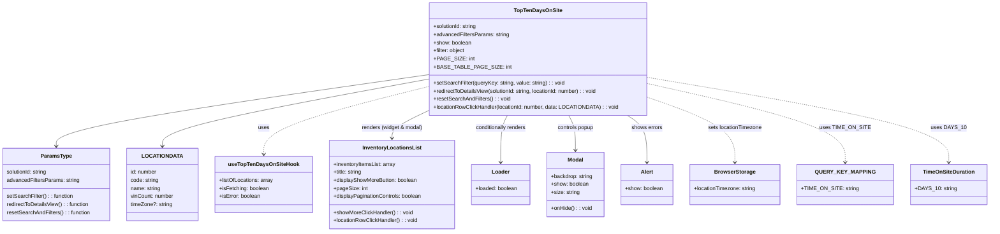

# Diagram: web/portal/src/pages/inventoryview/components/TopTenDaysOnSite.Table.tsx

> Auto-generated by Obscura crawlers

## Mermaid

### SVG

<svg id="container" width="2892.90625" xmlns="http://www.w3.org/2000/svg" class="classDiagram" height="690" viewBox="0 0 2892.90625 690" role="graphics-document document" aria-roledescription="class"><g><defs><marker id="container_class-aggregationStart" class="marker aggregation class" refX="18" refY="7" markerWidth="190" markerHeight="240" orient="auto"><path d="M 18,7 L9,13 L1,7 L9,1 Z"></path></marker></defs><defs><marker id="container_class-aggregationEnd" class="marker aggregation class" refX="1" refY="7" markerWidth="20" markerHeight="28" orient="auto"><path d="M 18,7 L9,13 L1,7 L9,1 Z"></path></marker></defs><defs><marker id="container_class-extensionStart" class="marker extension class" refX="18" refY="7" markerWidth="190" markerHeight="240" orient="auto"><path d="M 1,7 L18,13 V 1 Z"></path></marker></defs><defs><marker id="container_class-extensionEnd" class="marker extension class" refX="1" refY="7" markerWidth="20" markerHeight="28" orient="auto"><path d="M 1,1 V 13 L18,7 Z"></path></marker></defs><defs><marker id="container_class-compositionStart" class="marker composition class" refX="18" refY="7" markerWidth="190" markerHeight="240" orient="auto"><path d="M 18,7 L9,13 L1,7 L9,1 Z"></path></marker></defs><defs><marker id="container_class-compositionEnd" class="marker composition class" refX="1" refY="7" markerWidth="20" markerHeight="28" orient="auto"><path d="M 18,7 L9,13 L1,7 L9,1 Z"></path></marker></defs><defs><marker id="container_class-dependencyStart" class="marker dependency class" refX="6" refY="7" markerWidth="190" markerHeight="240" orient="auto"><path d="M 5,7 L9,13 L1,7 L9,1 Z"></path></marker></defs><defs><marker id="container_class-dependencyEnd" class="marker dependency class" refX="13" refY="7" markerWidth="20" markerHeight="28" orient="auto"><path d="M 18,7 L9,13 L14,7 L9,1 Z"></path></marker></defs><defs><marker id="container_class-lollipopStart" class="marker lollipop class" refX="13" refY="7" markerWidth="190" markerHeight="240" orient="auto"><circle stroke="black" fill="transparent" cx="7" cy="7" r="6"></circle></marker></defs><defs><marker id="container_class-lollipopEnd" class="marker lollipop class" refX="1" refY="7" markerWidth="190" markerHeight="240" orient="auto"><circle stroke="black" fill="transparent" cx="7" cy="7" r="6"></circle></marker></defs><g class="root"><g class="clusters"></g><g class="edgePaths"><path d="M1271.258,221.751L1087.122,248.293C902.987,274.834,534.716,327.917,350.581,363.625C166.445,399.333,166.445,417.667,166.445,426.833L166.445,436" id="id_TopTenDaysOnSite_ParamsType_1" class="edge-thickness-normal edge-pattern-solid relation" style=";;;" data-edge="true" data-et="edge" data-id="id_TopTenDaysOnSite_ParamsType_1" data-points="W3sieCI6MTI3MS4yNTc4MTI1LCJ5IjoyMjEuNzUxMjQ2OTUxMjg2NX0seyJ4IjoxNjYuNDQ1MzEyNSwieSI6MzgxfSx7IngiOjE2Ni40NDUzMTI1LCJ5Ijo0NDJ9XQ==" marker-end="url(#container_class-dependencyEnd)"></path><path d="M1271.258,234.605L1139.11,259.004C1006.962,283.403,742.667,332.202,610.519,365.767C478.371,399.333,478.371,417.667,478.371,426.833L478.371,436" id="id_TopTenDaysOnSite_LOCATIONDATA_2" class="edge-thickness-normal edge-pattern-solid relation" style=";;;" data-edge="true" data-et="edge" data-id="id_TopTenDaysOnSite_LOCATIONDATA_2" data-points="W3sieCI6MTI3MS4yNTc4MTI1LCJ5IjoyMzQuNjA0NjA1MzQ0MTY5NDR9LHsieCI6NDc4LjM3MTA5Mzc1LCJ5IjozODF9LHsieCI6NDc4LjM3MTA5Mzc1LCJ5Ijo0NDJ9XQ==" marker-end="url(#container_class-dependencyEnd)"></path><path d="M1271.258,255.917L1188.459,276.764C1105.66,297.611,940.063,339.306,857.264,373.319C774.465,407.333,774.465,433.667,774.465,446.833L774.465,460" id="id_TopTenDaysOnSite_useTopTenDaysOnSiteHook_3" class="edge-thickness-normal edge-pattern-dashed relation" style=";;;" data-edge="true" data-et="edge" data-id="id_TopTenDaysOnSite_useTopTenDaysOnSiteHook_3" data-points="W3sieCI6MTI3MS4yNTc4MTI1LCJ5IjoyNTUuOTE2OTA0NTUwNTc5MzJ9LHsieCI6Nzc0LjQ2NDg0Mzc1LCJ5IjozODF9LHsieCI6Nzc0LjQ2NDg0Mzc1LCJ5Ijo0NjZ9XQ==" marker-end="url(#container_class-dependencyEnd)"></path><path d="M1271.258,325.417L1251.579,334.681C1231.9,343.945,1192.542,362.472,1172.863,376.903C1153.184,391.333,1153.184,401.667,1153.184,406.833L1153.184,412" id="id_TopTenDaysOnSite_InventoryLocationsList_4" class="edge-thickness-normal edge-pattern-solid relation" style=";;;" data-edge="true" data-et="edge" data-id="id_TopTenDaysOnSite_InventoryLocationsList_4" data-points="W3sieCI6MTI3MS4yNTc4MTI1LCJ5IjozMjUuNDE3MjIwNTYyNzc2NH0seyJ4IjoxMTUzLjE4MzU5Mzc1LCJ5IjozODF9LHsieCI6MTE1My4xODM1OTM3NSwieSI6NDE4fV0=" marker-end="url(#container_class-dependencyEnd)"></path><path d="M1497.048,344L1493.685,350.167C1490.323,356.333,1483.597,368.667,1480.234,392C1476.871,415.333,1476.871,449.667,1476.871,466.833L1476.871,484" id="id_TopTenDaysOnSite_Loader_5" class="edge-thickness-normal edge-pattern-solid relation" style=";;;" data-edge="true" data-et="edge" data-id="id_TopTenDaysOnSite_Loader_5" data-points="W3sieCI6MTQ5Ny4wNDgzNjEyODA0ODc4LCJ5IjozNDR9LHsieCI6MTQ3Ni44NzEwOTM3NSwieSI6MzgxfSx7IngiOjE0NzYuODcxMDkzNzUsInkiOjQ5MH1d" marker-end="url(#container_class-dependencyEnd)"></path><path d="M1680.28,344L1683.643,350.167C1687.006,356.333,1693.731,368.667,1697.094,386C1700.457,403.333,1700.457,425.667,1700.457,436.833L1700.457,448" id="id_TopTenDaysOnSite_Modal_6" class="edge-thickness-normal edge-pattern-solid relation" style=";;;" data-edge="true" data-et="edge" data-id="id_TopTenDaysOnSite_Modal_6" data-points="W3sieCI6MTY4MC4yNzk3NjM3MTk1MTIyLCJ5IjozNDR9LHsieCI6MTcwMC40NTcwMzEyNSwieSI6MzgxfSx7IngiOjE3MDAuNDU3MDMxMjUsInkiOjQ1NH1d" marker-end="url(#container_class-dependencyEnd)"></path><path d="M1855.252,344L1865.037,350.167C1874.823,356.333,1894.394,368.667,1904.179,392C1913.965,415.333,1913.965,449.667,1913.965,466.833L1913.965,484" id="id_TopTenDaysOnSite_Alert_7" class="edge-thickness-normal edge-pattern-solid relation" style=";;;" data-edge="true" data-et="edge" data-id="id_TopTenDaysOnSite_Alert_7" data-points="W3sieCI6MTg1NS4yNTIwMTk4MTcwNzMyLCJ5IjozNDR9LHsieCI6MTkxMy45NjQ4NDM3NSwieSI6MzgxfSx7IngiOjE5MTMuOTY0ODQzNzUsInkiOjQ5MH1d" marker-end="url(#container_class-dependencyEnd)"></path><path d="M1906.07,286.847L1951.005,302.539C1995.939,318.231,2085.807,349.616,2130.742,382.474C2175.676,415.333,2175.676,449.667,2175.676,466.833L2175.676,484" id="id_TopTenDaysOnSite_BrowserStorage_8" class="edge-thickness-normal edge-pattern-dashed relation" style=";;;" data-edge="true" data-et="edge" data-id="id_TopTenDaysOnSite_BrowserStorage_8" data-points="W3sieCI6MTkwNi4wNzAzMTI1LCJ5IjoyODYuODQ2NjQ3ODEyMzQ0MDN9LHsieCI6MjE3NS42NzU3ODEyNSwieSI6MzgxfSx7IngiOjIxNzUuNjc1NzgxMjUsInkiOjQ5MH1d" marker-end="url(#container_class-dependencyEnd)"></path><path d="M1906.07,248.133L2003.512,270.278C2100.953,292.422,2295.836,336.711,2393.277,376.022C2490.719,415.333,2490.719,449.667,2490.719,466.833L2490.719,484" id="id_TopTenDaysOnSite_QUERY_KEY_MAPPING_9" class="edge-thickness-normal edge-pattern-dashed relation" style=";;;" data-edge="true" data-et="edge" data-id="id_TopTenDaysOnSite_QUERY_KEY_MAPPING_9" data-points="W3sieCI6MTkwNi4wNzAzMTI1LCJ5IjoyNDguMTMzNDEwNzAyOTk1Nzd9LHsieCI6MjQ5MC43MTg3NSwieSI6MzgxfSx7IngiOjI0OTAuNzE4NzUsInkiOjQ5MH1d" marker-end="url(#container_class-dependencyEnd)"></path><path d="M1906.07,230.699L2051.43,255.749C2196.79,280.799,2487.51,330.9,2632.87,373.117C2778.23,415.333,2778.23,449.667,2778.23,466.833L2778.23,484" id="id_TopTenDaysOnSite_TimeOnSiteDuration_10" class="edge-thickness-normal edge-pattern-dashed relation" style=";;;" data-edge="true" data-et="edge" data-id="id_TopTenDaysOnSite_TimeOnSiteDuration_10" data-points="W3sieCI6MTkwNi4wNzAzMTI1LCJ5IjoyMzAuNjk5MTU4MzcyNDM3NDR9LHsieCI6Mjc3OC4yMzA0Njg3NSwieSI6MzgxfSx7IngiOjI3NzguMjMwNDY4NzUsInkiOjQ5MH1d" marker-end="url(#container_class-dependencyEnd)"></path></g><g class="edgeLabels"><g class="edgeLabel"><g class="label" data-id="id_TopTenDaysOnSite_ParamsType_1" transform="translate(0, 0)"><foreignObject width="0" height="0">

</foreignObject></g></g><g class="edgeLabel"><g class="label" data-id="id_TopTenDaysOnSite_LOCATIONDATA_2" transform="translate(0, 0)"><foreignObject width="0" height="0">

</foreignObject></g></g><g class="edgeLabel" transform="translate(774.46484375, 381)"><g class="label" data-id="id_TopTenDaysOnSite_useTopTenDaysOnSiteHook_3" transform="translate(-16.4921875, -12)"><foreignObject width="32.984375" height="24">

uses

</foreignObject></g></g><g class="edgeLabel" transform="translate(1153.18359375, 381)"><g class="label" data-id="id_TopTenDaysOnSite_InventoryLocationsList_4" transform="translate(-92.109375, -12)"><foreignObject width="184.21875" height="24">

renders (widget &amp; modal)

</foreignObject></g></g><g class="edgeLabel" transform="translate(1476.87109375, 381)"><g class="label" data-id="id_TopTenDaysOnSite_Loader_5" transform="translate(-77.25, -12)"><foreignObject width="154.5" height="24">

conditionally renders

</foreignObject></g></g><g class="edgeLabel" transform="translate(1700.45703125, 381)"><g class="label" data-id="id_TopTenDaysOnSite_Modal_6" transform="translate(-55.21875, -12)"><foreignObject width="110.4375" height="24">

controls popup

</foreignObject></g></g><g class="edgeLabel" transform="translate(1913.96484375, 381)"><g class="label" data-id="id_TopTenDaysOnSite_Alert_7" transform="translate(-46.3671875, -12)"><foreignObject width="92.734375" height="24">

shows errors

</foreignObject></g></g><g class="edgeLabel" transform="translate(2175.67578125, 381)"><g class="label" data-id="id_TopTenDaysOnSite_BrowserStorage_8" transform="translate(-81.1328125, -12)"><foreignObject width="162.265625" height="24">

sets locationTimezone

</foreignObject></g></g><g class="edgeLabel" transform="translate(2490.71875, 381)"><g class="label" data-id="id_TopTenDaysOnSite_QUERY_KEY_MAPPING_9" transform="translate(-69.5859375, -12)"><foreignObject width="139.171875" height="24">

uses TIME_ON_SITE

</foreignObject></g></g><g class="edgeLabel" transform="translate(2778.23046875, 381)"><g class="label" data-id="id_TopTenDaysOnSite_TimeOnSiteDuration_10" transform="translate(-47.5234375, -12)"><foreignObject width="95.046875" height="24">

uses DAYS_10

</foreignObject></g></g></g><g class="nodes"><g class="node default" id="classId-TopTenDaysOnSite-0" transform="translate(1588.6640625, 176)"><g class="basic label-container"><path d="M-317.40625 -168 L317.40625 -168 L317.40625 168 L-317.40625 168" stroke="none" stroke-width="0" fill="#ECECFF" style=""></path><path d="M-317.40625 -168 C-89.43333944379765 -168, 138.5395711124047 -168, 317.40625 -168 M-317.40625 -168 C-76.76011319414056 -168, 163.88602361171888 -168, 317.40625 -168 M317.40625 -168 C317.40625 -44.90490434658928, 317.40625 78.19019130682145, 317.40625 168 M317.40625 -168 C317.40625 -92.73440415430241, 317.40625 -17.46880830860482, 317.40625 168 M317.40625 168 C146.99261662177014 168, -23.42101675645972 168, -317.40625 168 M317.40625 168 C130.2836149554014 168, -56.83902008919722 168, -317.40625 168 M-317.40625 168 C-317.40625 55.85830741061963, -317.40625 -56.28338517876074, -317.40625 -168 M-317.40625 168 C-317.40625 39.804437178900145, -317.40625 -88.39112564219971, -317.40625 -168" stroke="#9370DB" stroke-width="1.3" fill="none" stroke-dasharray="0 0" style=""></path></g><g class="annotation-group text" transform="translate(0, -144)"></g><g class="label-group text" transform="translate(-67.90625, -144)"><g class="label" style="font-weight: bolder" transform="translate(0,-12)"><foreignObject width="135.8125" height="24">

TopTenDaysOnSite

</foreignObject></g></g><g class="members-group text" transform="translate(-305.40625, -96)"><g class="label" style="" transform="translate(0,-12)"><foreignObject width="131.8125" height="24">

+solutionId: string

</foreignObject></g><g class="label" style="" transform="translate(0,12)"><foreignObject width="223.828125" height="24">

+advancedFiltersParams: string

</foreignObject></g><g class="label" style="" transform="translate(0,36)"><foreignObject width="113.234375" height="24">

+show: boolean

</foreignObject></g><g class="label" style="" transform="translate(0,60)"><foreignObject width="95.78125" height="24">

+filter: object

</foreignObject></g><g class="label" style="" transform="translate(0,84)"><foreignObject width="110.09375" height="24">

+PAGE_SIZE: int

</foreignObject></g><g class="label" style="" transform="translate(0,108)"><foreignObject width="204.921875" height="24">

+BASE_TABLE_PAGE_SIZE: int

</foreignObject></g></g><g class="methods-group text" transform="translate(-305.40625, 72)"><g class="label" style="" transform="translate(0,-12)"><foreignObject width="391.421875" height="24">

+setSearchFilter(queryKey: string, value: string) : : void

</foreignObject></g><g class="label" style="" transform="translate(0,12)"><foreignObject width="496.953125" height="24">

+redirectToDetailsView(solutionId: string, locationId: number) : : void

</foreignObject></g><g class="label" style="" transform="translate(0,36)"><foreignObject width="227.359375" height="24">

+resetSearchAndFilters() : : void

</foreignObject></g><g class="label" style="" transform="translate(0,60)"><foreignObject width="542.90625" height="24">

+locationRowClickHandler(locationId: number, data: LOCATIONDATA) : : void

</foreignObject></g></g><g class="divider" style=""><path d="M-317.40625 -120 C-176.8299746729494 -120, -36.25369934589878 -120, 317.40625 -120 M-317.40625 -120 C-82.53417429562589 -120, 152.33790140874822 -120, 317.40625 -120" stroke="#9370DB" stroke-width="1.3" fill="none" stroke-dasharray="0 0" style=""></path></g><g class="divider" style=""><path d="M-317.40625 48 C-121.05751874152443 48, 75.29121251695113 48, 317.40625 48 M-317.40625 48 C-123.11374611044926 48, 71.17875777910149 48, 317.40625 48" stroke="#9370DB" stroke-width="1.3" fill="none" stroke-dasharray="0 0" style=""></path></g></g><g class="node default" id="classId-ParamsType-1" transform="translate(166.4453125, 550)"><g class="basic label-container"><path d="M-158.4453125 -108 L158.4453125 -108 L158.4453125 108 L-158.4453125 108" stroke="none" stroke-width="0" fill="#ECECFF" style=""></path><path d="M-158.4453125 -108 C-64.17527629019682 -108, 30.09475991960636 -108, 158.4453125 -108 M-158.4453125 -108 C-83.08686759471657 -108, -7.728422689433131 -108, 158.4453125 -108 M158.4453125 -108 C158.4453125 -33.066324112618275, 158.4453125 41.86735177476345, 158.4453125 108 M158.4453125 -108 C158.4453125 -62.43406085399907, 158.4453125 -16.868121707998142, 158.4453125 108 M158.4453125 108 C72.43340084817963 108, -13.57851080364074 108, -158.4453125 108 M158.4453125 108 C71.13832354725926 108, -16.168665405481477 108, -158.4453125 108 M-158.4453125 108 C-158.4453125 60.0342799292604, -158.4453125 12.0685598585208, -158.4453125 -108 M-158.4453125 108 C-158.4453125 57.78477391561833, -158.4453125 7.569547831236662, -158.4453125 -108" stroke="#9370DB" stroke-width="1.3" fill="none" stroke-dasharray="0 0" style=""></path></g><g class="annotation-group text" transform="translate(0, -84)"></g><g class="label-group text" transform="translate(-44.046875, -84)"><g class="label" style="font-weight: bolder" transform="translate(0,-12)"><foreignObject width="88.09375" height="24">

ParamsType

</foreignObject></g></g><g class="members-group text" transform="translate(-146.4453125, -36)"><g class="label" style="" transform="translate(0,-12)"><foreignObject width="123.828125" height="24">

solutionId: string

</foreignObject></g><g class="label" style="" transform="translate(0,12)"><foreignObject width="216.09375" height="24">

advancedFiltersParams: string

</foreignObject></g></g><g class="methods-group text" transform="translate(-146.4453125, 36)"><g class="label" style="" transform="translate(0,-12)"><foreignObject width="199.078125" height="24">

setSearchFilter() : : function

</foreignObject></g><g class="label" style="" transform="translate(0,12)"><foreignObject width="248.21875" height="24">

redirectToDetailsView() : : function

</foreignObject></g><g class="label" style="" transform="translate(0,36)"><foreignObject width="248.84375" height="24">

resetSearchAndFilters() : : function

</foreignObject></g></g><g class="divider" style=""><path d="M-158.4453125 -60 C-63.70040012300825 -60, 31.0445122539835 -60, 158.4453125 -60 M-158.4453125 -60 C-37.17299615101416 -60, 84.09932019797168 -60, 158.4453125 -60" stroke="#9370DB" stroke-width="1.3" fill="none" stroke-dasharray="0 0" style=""></path></g><g class="divider" style=""><path d="M-158.4453125 12 C-89.48983389015024 12, -20.534355280300474 12, 158.4453125 12 M-158.4453125 12 C-86.39326364203752 12, -14.34121478407505 12, 158.4453125 12" stroke="#9370DB" stroke-width="1.3" fill="none" stroke-dasharray="0 0" style=""></path></g></g><g class="node default" id="classId-LOCATIONDATA-2" transform="translate(478.37109375, 550)"><g class="basic label-container"><path d="M-103.48046875 -108 L103.48046875 -108 L103.48046875 108 L-103.48046875 108" stroke="none" stroke-width="0" fill="#ECECFF" style=""></path><path d="M-103.48046875 -108 C-46.80608745966812 -108, 9.86829383066376 -108, 103.48046875 -108 M-103.48046875 -108 C-26.02841721766076 -108, 51.42363431467848 -108, 103.48046875 -108 M103.48046875 -108 C103.48046875 -46.81467687764551, 103.48046875 14.370646244708979, 103.48046875 108 M103.48046875 -108 C103.48046875 -53.08911155859718, 103.48046875 1.8217768828056364, 103.48046875 108 M103.48046875 108 C46.26731810117328 108, -10.945832547653438 108, -103.48046875 108 M103.48046875 108 C60.60263008338515 108, 17.7247914167703 108, -103.48046875 108 M-103.48046875 108 C-103.48046875 52.48191688328399, -103.48046875 -3.036166233432013, -103.48046875 -108 M-103.48046875 108 C-103.48046875 61.2316936972786, -103.48046875 14.463387394557202, -103.48046875 -108" stroke="#9370DB" stroke-width="1.3" fill="none" stroke-dasharray="0 0" style=""></path></g><g class="annotation-group text" transform="translate(0, -84)"></g><g class="label-group text" transform="translate(-53.8046875, -84)"><g class="label" style="font-weight: bolder" transform="translate(0,-12)"><foreignObject width="107.609375" height="24">

LOCATIONDATA

</foreignObject></g></g><g class="members-group text" transform="translate(-91.48046875, -36)"><g class="label" style="" transform="translate(0,-12)"><foreignObject width="78.96875" height="24">

id: number

</foreignObject></g><g class="label" style="" transform="translate(0,12)"><foreignObject width="84.6875" height="24">

code: string

</foreignObject></g><g class="label" style="" transform="translate(0,36)"><foreignObject width="90.234375" height="24">

name: string

</foreignObject></g><g class="label" style="" transform="translate(0,60)"><foreignObject width="129.15625" height="24">

vinCount: number

</foreignObject></g><g class="label" style="" transform="translate(0,84)"><foreignObject width="124.578125" height="24">

timeZone?: string

</foreignObject></g></g><g class="methods-group text" transform="translate(-91.48046875, 108)"></g><g class="divider" style=""><path d="M-103.48046875 -60 C-52.90706537065805 -60, -2.333661991316106 -60, 103.48046875 -60 M-103.48046875 -60 C-21.088678547038242 -60, 61.303111655923516 -60, 103.48046875 -60" stroke="#9370DB" stroke-width="1.3" fill="none" stroke-dasharray="0 0" style=""></path></g><g class="divider" style=""><path d="M-103.48046875 84 C-61.04015066393873 84, -18.599832577877464 84, 103.48046875 84 M-103.48046875 84 C-37.30843022420751 84, 28.863608301584975 84, 103.48046875 84" stroke="#9370DB" stroke-width="1.3" fill="none" stroke-dasharray="0 0" style=""></path></g></g><g class="node default" id="classId-useTopTenDaysOnSiteHook-3" transform="translate(774.46484375, 550)"><g class="basic label-container"><path d="M-142.61328125 -84 L142.61328125 -84 L142.61328125 84 L-142.61328125 84" stroke="none" stroke-width="0" fill="#ECECFF" style=""></path><path d="M-142.61328125 -84 C-75.73933130767556 -84, -8.865381365351112 -84, 142.61328125 -84 M-142.61328125 -84 C-79.91564633785788 -84, -17.218011425715773 -84, 142.61328125 -84 M142.61328125 -84 C142.61328125 -21.124395713958144, 142.61328125 41.75120857208371, 142.61328125 84 M142.61328125 -84 C142.61328125 -38.59212913954392, 142.61328125 6.815741720912158, 142.61328125 84 M142.61328125 84 C35.91605387828467 84, -70.78117349343066 84, -142.61328125 84 M142.61328125 84 C35.94264668127069 84, -70.72798788745862 84, -142.61328125 84 M-142.61328125 84 C-142.61328125 27.0412423224533, -142.61328125 -29.9175153550934, -142.61328125 -84 M-142.61328125 84 C-142.61328125 33.63333279530548, -142.61328125 -16.733334409389045, -142.61328125 -84" stroke="#9370DB" stroke-width="1.3" fill="none" stroke-dasharray="0 0" style=""></path></g><g class="annotation-group text" transform="translate(0, -60)"></g><g class="label-group text" transform="translate(-99.8515625, -60)"><g class="label" style="font-weight: bolder" transform="translate(0,-12)"><foreignObject width="199.703125" height="24">

useTopTenDaysOnSiteHook

</foreignObject></g></g><g class="members-group text" transform="translate(-130.61328125, -12)"><g class="label" style="" transform="translate(0,-12)"><foreignObject width="161.375" height="24">

+listOfLocations: array

</foreignObject></g><g class="label" style="" transform="translate(0,12)"><foreignObject width="148.28125" height="24">

+isFetching: boolean

</foreignObject></g><g class="label" style="" transform="translate(0,36)"><foreignObject width="123.453125" height="24">

+isError: boolean

</foreignObject></g></g><g class="methods-group text" transform="translate(-130.61328125, 84)"></g><g class="divider" style=""><path d="M-142.61328125 -36 C-74.77795862695078 -36, -6.942636003901555 -36, 142.61328125 -36 M-142.61328125 -36 C-78.57706051026982 -36, -14.540839770539634 -36, 142.61328125 -36" stroke="#9370DB" stroke-width="1.3" fill="none" stroke-dasharray="0 0" style=""></path></g><g class="divider" style=""><path d="M-142.61328125 60 C-82.34094174522693 60, -22.06860224045387 60, 142.61328125 60 M-142.61328125 60 C-81.44150733056433 60, -20.26973341112867 60, 142.61328125 60" stroke="#9370DB" stroke-width="1.3" fill="none" stroke-dasharray="0 0" style=""></path></g></g><g class="node default" id="classId-InventoryLocationsList-4" transform="translate(1153.18359375, 550)"><g class="basic label-container"><path d="M-186.10546875 -132 L186.10546875 -132 L186.10546875 132 L-186.10546875 132" stroke="none" stroke-width="0" fill="#ECECFF" style=""></path><path d="M-186.10546875 -132 C-80.11916473488085 -132, 25.86713928023829 -132, 186.10546875 -132 M-186.10546875 -132 C-110.11652519495973 -132, -34.12758163991947 -132, 186.10546875 -132 M186.10546875 -132 C186.10546875 -48.33445455275688, 186.10546875 35.33109089448624, 186.10546875 132 M186.10546875 -132 C186.10546875 -64.56266429650825, 186.10546875 2.8746714069835093, 186.10546875 132 M186.10546875 132 C48.49250500793772 132, -89.12045873412455 132, -186.10546875 132 M186.10546875 132 C74.63574884671789 132, -36.83397105656422 132, -186.10546875 132 M-186.10546875 132 C-186.10546875 27.0051085826652, -186.10546875 -77.9897828346696, -186.10546875 -132 M-186.10546875 132 C-186.10546875 28.903337064406074, -186.10546875 -74.19332587118785, -186.10546875 -132" stroke="#9370DB" stroke-width="1.3" fill="none" stroke-dasharray="0 0" style=""></path></g><g class="annotation-group text" transform="translate(0, -108)"></g><g class="label-group text" transform="translate(-83.4765625, -108)"><g class="label" style="font-weight: bolder" transform="translate(0,-12)"><foreignObject width="166.953125" height="24">

InventoryLocationsList

</foreignObject></g></g><g class="members-group text" transform="translate(-174.10546875, -60)"><g class="label" style="" transform="translate(0,-12)"><foreignObject width="187.46875" height="24">

+inventoryItemsList: array

</foreignObject></g><g class="label" style="" transform="translate(0,12)"><foreignObject width="86.859375" height="24">

+title: string

</foreignObject></g><g class="label" style="" transform="translate(0,36)"><foreignObject width="251.703125" height="24">

+displayShowMoreButton: boolean

</foreignObject></g><g class="label" style="" transform="translate(0,60)"><foreignObject width="99.234375" height="24">

+pageSize: int

</foreignObject></g><g class="label" style="" transform="translate(0,84)"><foreignObject width="264.734375" height="24">

+displayPaginationControls: boolean

</foreignObject></g></g><g class="methods-group text" transform="translate(-174.10546875, 84)"><g class="label" style="" transform="translate(0,-12)"><foreignObject width="235.734375" height="24">

+showMoreClickHandler() : : void

</foreignObject></g><g class="label" style="" transform="translate(0,12)"><foreignObject width="251.265625" height="24">

+locationRowClickHandler() : : void

</foreignObject></g></g><g class="divider" style=""><path d="M-186.10546875 -84 C-92.96462698717765 -84, 0.176214775644695 -84, 186.10546875 -84 M-186.10546875 -84 C-61.6584277969296 -84, 62.7886131561408 -84, 186.10546875 -84" stroke="#9370DB" stroke-width="1.3" fill="none" stroke-dasharray="0 0" style=""></path></g><g class="divider" style=""><path d="M-186.10546875 60 C-59.255365779718176 60, 67.59473719056365 60, 186.10546875 60 M-186.10546875 60 C-72.24630413260383 60, 41.61286048479235 60, 186.10546875 60" stroke="#9370DB" stroke-width="1.3" fill="none" stroke-dasharray="0 0" style=""></path></g></g><g class="node default" id="classId-Loader-5" transform="translate(1476.87109375, 550)"><g class="basic label-container"><path d="M-87.58203125 -60 L87.58203125 -60 L87.58203125 60 L-87.58203125 60" stroke="none" stroke-width="0" fill="#ECECFF" style=""></path><path d="M-87.58203125 -60 C-20.985729309167837 -60, 45.610572631664326 -60, 87.58203125 -60 M-87.58203125 -60 C-34.54386495181238 -60, 18.494301346375238 -60, 87.58203125 -60 M87.58203125 -60 C87.58203125 -17.83411001964808, 87.58203125 24.33177996070384, 87.58203125 60 M87.58203125 -60 C87.58203125 -24.568315177375887, 87.58203125 10.863369645248227, 87.58203125 60 M87.58203125 60 C33.227288220263645 60, -21.12745480947271 60, -87.58203125 60 M87.58203125 60 C22.758489718040906 60, -42.06505181391819 60, -87.58203125 60 M-87.58203125 60 C-87.58203125 22.60510558019689, -87.58203125 -14.789788839606217, -87.58203125 -60 M-87.58203125 60 C-87.58203125 18.60111846495134, -87.58203125 -22.797763070097318, -87.58203125 -60" stroke="#9370DB" stroke-width="1.3" fill="none" stroke-dasharray="0 0" style=""></path></g><g class="annotation-group text" transform="translate(0, -36)"></g><g class="label-group text" transform="translate(-25.3046875, -36)"><g class="label" style="font-weight: bolder" transform="translate(0,-12)"><foreignObject width="50.609375" height="24">

Loader

</foreignObject></g></g><g class="members-group text" transform="translate(-75.58203125, 12)"><g class="label" style="" transform="translate(0,-12)"><foreignObject width="125.859375" height="24">

+loaded: boolean

</foreignObject></g></g><g class="methods-group text" transform="translate(-75.58203125, 60)"></g><g class="divider" style=""><path d="M-87.58203125 -12 C-21.50821928539709 -12, 44.56559267920582 -12, 87.58203125 -12 M-87.58203125 -12 C-32.32201362534728 -12, 22.938003999305437 -12, 87.58203125 -12" stroke="#9370DB" stroke-width="1.3" fill="none" stroke-dasharray="0 0" style=""></path></g><g class="divider" style=""><path d="M-87.58203125 36 C-42.841982427505464 36, 1.8980663949890726 36, 87.58203125 36 M-87.58203125 36 C-23.076199774125783 36, 41.429631701748434 36, 87.58203125 36" stroke="#9370DB" stroke-width="1.3" fill="none" stroke-dasharray="0 0" style=""></path></g></g><g class="node default" id="classId-Modal-6" transform="translate(1700.45703125, 550)"><g class="basic label-container"><path d="M-86.00390625 -96 L86.00390625 -96 L86.00390625 96 L-86.00390625 96" stroke="none" stroke-width="0" fill="#ECECFF" style=""></path><path d="M-86.00390625 -96 C-36.248713642014025 -96, 13.50647896597195 -96, 86.00390625 -96 M-86.00390625 -96 C-44.004395803103954 -96, -2.0048853562079074 -96, 86.00390625 -96 M86.00390625 -96 C86.00390625 -40.15411307293897, 86.00390625 15.691773854122061, 86.00390625 96 M86.00390625 -96 C86.00390625 -43.94742041904581, 86.00390625 8.105159161908375, 86.00390625 96 M86.00390625 96 C29.402736930550198 96, -27.198432388899604 96, -86.00390625 96 M86.00390625 96 C32.08650545859105 96, -21.830895332817903 96, -86.00390625 96 M-86.00390625 96 C-86.00390625 47.46857423398795, -86.00390625 -1.0628515320240979, -86.00390625 -96 M-86.00390625 96 C-86.00390625 54.38770568481331, -86.00390625 12.775411369626624, -86.00390625 -96" stroke="#9370DB" stroke-width="1.3" fill="none" stroke-dasharray="0 0" style=""></path></g><g class="annotation-group text" transform="translate(0, -72)"></g><g class="label-group text" transform="translate(-22.4453125, -72)"><g class="label" style="font-weight: bolder" transform="translate(0,-12)"><foreignObject width="44.890625" height="24">

Modal

</foreignObject></g></g><g class="members-group text" transform="translate(-74.00390625, -24)"><g class="label" style="" transform="translate(0,-12)"><foreignObject width="125.5625" height="24">

+backdrop: string

</foreignObject></g><g class="label" style="" transform="translate(0,12)"><foreignObject width="113.234375" height="24">

+show: boolean

</foreignObject></g><g class="label" style="" transform="translate(0,36)"><foreignObject width="85.28125" height="24">

+size: string

</foreignObject></g></g><g class="methods-group text" transform="translate(-74.00390625, 72)"><g class="label" style="" transform="translate(0,-12)"><foreignObject width="122.390625" height="24">

+onHide() : : void

</foreignObject></g></g><g class="divider" style=""><path d="M-86.00390625 -48 C-40.171210868018214 -48, 5.661484513963572 -48, 86.00390625 -48 M-86.00390625 -48 C-43.60162059168529 -48, -1.1993349333705794 -48, 86.00390625 -48" stroke="#9370DB" stroke-width="1.3" fill="none" stroke-dasharray="0 0" style=""></path></g><g class="divider" style=""><path d="M-86.00390625 48 C-20.90901545246598 48, 44.18587534506804 48, 86.00390625 48 M-86.00390625 48 C-23.47891241688218 48, 39.04608141623564 48, 86.00390625 48" stroke="#9370DB" stroke-width="1.3" fill="none" stroke-dasharray="0 0" style=""></path></g></g><g class="node default" id="classId-Alert-7" transform="translate(1913.96484375, 550)"><g class="basic label-container"><path d="M-77.50390625 -60 L77.50390625 -60 L77.50390625 60 L-77.50390625 60" stroke="none" stroke-width="0" fill="#ECECFF" style=""></path><path d="M-77.50390625 -60 C-31.350620819733088 -60, 14.802664610533824 -60, 77.50390625 -60 M-77.50390625 -60 C-44.59675375553568 -60, -11.68960126107136 -60, 77.50390625 -60 M77.50390625 -60 C77.50390625 -20.38073561557966, 77.50390625 19.23852876884068, 77.50390625 60 M77.50390625 -60 C77.50390625 -16.187726234204426, 77.50390625 27.624547531591148, 77.50390625 60 M77.50390625 60 C44.217246302200856 60, 10.930586354401711 60, -77.50390625 60 M77.50390625 60 C30.083129000591825 60, -17.33764824881635 60, -77.50390625 60 M-77.50390625 60 C-77.50390625 31.10965151219865, -77.50390625 2.2193030243972984, -77.50390625 -60 M-77.50390625 60 C-77.50390625 20.451943330330096, -77.50390625 -19.09611333933981, -77.50390625 -60" stroke="#9370DB" stroke-width="1.3" fill="none" stroke-dasharray="0 0" style=""></path></g><g class="annotation-group text" transform="translate(0, -36)"></g><g class="label-group text" transform="translate(-17.7734375, -36)"><g class="label" style="font-weight: bolder" transform="translate(0,-12)"><foreignObject width="35.546875" height="24">

Alert

</foreignObject></g></g><g class="members-group text" transform="translate(-65.50390625, 12)"><g class="label" style="" transform="translate(0,-12)"><foreignObject width="113.234375" height="24">

+show: boolean

</foreignObject></g></g><g class="methods-group text" transform="translate(-65.50390625, 60)"></g><g class="divider" style=""><path d="M-77.50390625 -12 C-38.4182838002549 -12, 0.6673386494902047 -12, 77.50390625 -12 M-77.50390625 -12 C-42.572644419054924 -12, -7.641382588109849 -12, 77.50390625 -12" stroke="#9370DB" stroke-width="1.3" fill="none" stroke-dasharray="0 0" style=""></path></g><g class="divider" style=""><path d="M-77.50390625 36 C-32.64341183544943 36, 12.217082579101145 36, 77.50390625 36 M-77.50390625 36 C-20.305985728215354 36, 36.89193479356929 36, 77.50390625 36" stroke="#9370DB" stroke-width="1.3" fill="none" stroke-dasharray="0 0" style=""></path></g></g><g class="node default" id="classId-BrowserStorage-8" transform="translate(2175.67578125, 550)"><g class="basic label-container"><path d="M-134.20703125 -60 L134.20703125 -60 L134.20703125 60 L-134.20703125 60" stroke="none" stroke-width="0" fill="#ECECFF" style=""></path><path d="M-134.20703125 -60 C-63.51812043129425 -60, 7.1707903874115 -60, 134.20703125 -60 M-134.20703125 -60 C-49.560749296960495 -60, 35.08553265607901 -60, 134.20703125 -60 M134.20703125 -60 C134.20703125 -28.426125606757275, 134.20703125 3.147748786485451, 134.20703125 60 M134.20703125 -60 C134.20703125 -23.677813055352033, 134.20703125 12.644373889295935, 134.20703125 60 M134.20703125 60 C33.3931335007605 60, -67.420764248479 60, -134.20703125 60 M134.20703125 60 C30.799275937058624 60, -72.60847937588275 60, -134.20703125 60 M-134.20703125 60 C-134.20703125 31.615197554835056, -134.20703125 3.2303951096701127, -134.20703125 -60 M-134.20703125 60 C-134.20703125 26.83724054160499, -134.20703125 -6.325518916790017, -134.20703125 -60" stroke="#9370DB" stroke-width="1.3" fill="none" stroke-dasharray="0 0" style=""></path></g><g class="annotation-group text" transform="translate(0, -36)"></g><g class="label-group text" transform="translate(-58.1328125, -36)"><g class="label" style="font-weight: bolder" transform="translate(0,-12)"><foreignObject width="116.265625" height="24">

BrowserStorage

</foreignObject></g></g><g class="members-group text" transform="translate(-122.20703125, 12)"><g class="label" style="" transform="translate(0,-12)"><foreignObject width="186.28125" height="24">

+locationTimezone: string

</foreignObject></g></g><g class="methods-group text" transform="translate(-122.20703125, 60)"></g><g class="divider" style=""><path d="M-134.20703125 -12 C-42.71619740969511 -12, 48.774636430609775 -12, 134.20703125 -12 M-134.20703125 -12 C-56.764933622056304 -12, 20.67716400588739 -12, 134.20703125 -12" stroke="#9370DB" stroke-width="1.3" fill="none" stroke-dasharray="0 0" style=""></path></g><g class="divider" style=""><path d="M-134.20703125 36 C-42.061945733987415 36, 50.08313978202517 36, 134.20703125 36 M-134.20703125 36 C-33.13828158220278 36, 67.93046808559444 36, 134.20703125 36" stroke="#9370DB" stroke-width="1.3" fill="none" stroke-dasharray="0 0" style=""></path></g></g><g class="node default" id="classId-QUERY_KEY_MAPPING-9" transform="translate(2490.71875, 550)"><g class="basic label-container"><path d="M-130.8359375 -60 L130.8359375 -60 L130.8359375 60 L-130.8359375 60" stroke="none" stroke-width="0" fill="#ECECFF" style=""></path><path d="M-130.8359375 -60 C-53.25830910690455 -60, 24.319319286190904 -60, 130.8359375 -60 M-130.8359375 -60 C-57.52518546900794 -60, 15.785566561984126 -60, 130.8359375 -60 M130.8359375 -60 C130.8359375 -29.761339566784144, 130.8359375 0.477320866431711, 130.8359375 60 M130.8359375 -60 C130.8359375 -17.904067553090044, 130.8359375 24.19186489381991, 130.8359375 60 M130.8359375 60 C39.119862912857116 60, -52.59621167428577 60, -130.8359375 60 M130.8359375 60 C29.839793638283822 60, -71.15635022343236 60, -130.8359375 60 M-130.8359375 60 C-130.8359375 19.027783977481114, -130.8359375 -21.94443204503777, -130.8359375 -60 M-130.8359375 60 C-130.8359375 12.10829025550263, -130.8359375 -35.78341948899474, -130.8359375 -60" stroke="#9370DB" stroke-width="1.3" fill="none" stroke-dasharray="0 0" style=""></path></g><g class="annotation-group text" transform="translate(0, -36)"></g><g class="label-group text" transform="translate(-78.8125, -36)"><g class="label" style="font-weight: bolder" transform="translate(0,-12)"><foreignObject width="157.625" height="24">

QUERY_KEY_MAPPING

</foreignObject></g></g><g class="members-group text" transform="translate(-118.8359375, 12)"><g class="label" style="" transform="translate(0,-12)"><foreignObject width="158.859375" height="24">

+TIME_ON_SITE: string

</foreignObject></g></g><g class="methods-group text" transform="translate(-118.8359375, 60)"></g><g class="divider" style=""><path d="M-130.8359375 -12 C-39.27551076321575 -12, 52.2849159735685 -12, 130.8359375 -12 M-130.8359375 -12 C-34.701655002411115 -12, 61.43262749517777 -12, 130.8359375 -12" stroke="#9370DB" stroke-width="1.3" fill="none" stroke-dasharray="0 0" style=""></path></g><g class="divider" style=""><path d="M-130.8359375 36 C-77.59056546638655 36, -24.3451934327731 36, 130.8359375 36 M-130.8359375 36 C-52.765811352751896 36, 25.304314794496207 36, 130.8359375 36" stroke="#9370DB" stroke-width="1.3" fill="none" stroke-dasharray="0 0" style=""></path></g></g><g class="node default" id="classId-TimeOnSiteDuration-10" transform="translate(2778.23046875, 550)"><g class="basic label-container"><path d="M-106.67578125 -60 L106.67578125 -60 L106.67578125 60 L-106.67578125 60" stroke="none" stroke-width="0" fill="#ECECFF" style=""></path><path d="M-106.67578125 -60 C-27.846726275933293 -60, 50.982328698133415 -60, 106.67578125 -60 M-106.67578125 -60 C-40.99576076148314 -60, 24.68425972703372 -60, 106.67578125 -60 M106.67578125 -60 C106.67578125 -30.17447453019042, 106.67578125 -0.34894906038083917, 106.67578125 60 M106.67578125 -60 C106.67578125 -32.43027132131688, 106.67578125 -4.86054264263376, 106.67578125 60 M106.67578125 60 C44.06363190740309 60, -18.548517435193816 60, -106.67578125 60 M106.67578125 60 C30.470037565984384 60, -45.73570611803123 60, -106.67578125 60 M-106.67578125 60 C-106.67578125 33.31565925248825, -106.67578125 6.631318504976505, -106.67578125 -60 M-106.67578125 60 C-106.67578125 30.99328801254984, -106.67578125 1.98657602509968, -106.67578125 -60" stroke="#9370DB" stroke-width="1.3" fill="none" stroke-dasharray="0 0" style=""></path></g><g class="annotation-group text" transform="translate(0, -36)"></g><g class="label-group text" transform="translate(-73.8203125, -36)"><g class="label" style="font-weight: bolder" transform="translate(0,-12)"><foreignObject width="147.640625" height="24">

TimeOnSiteDuration

</foreignObject></g></g><g class="members-group text" transform="translate(-94.67578125, 12)"><g class="label" style="" transform="translate(0,-12)"><foreignObject width="115.53125" height="24">

+DAYS_10: string

</foreignObject></g></g><g class="methods-group text" transform="translate(-94.67578125, 60)"></g><g class="divider" style=""><path d="M-106.67578125 -12 C-30.27310456553586 -12, 46.12957211892828 -12, 106.67578125 -12 M-106.67578125 -12 C-44.07852062427904 -12, 18.518740001441927 -12, 106.67578125 -12" stroke="#9370DB" stroke-width="1.3" fill="none" stroke-dasharray="0 0" style=""></path></g><g class="divider" style=""><path d="M-106.67578125 36 C-41.02987096276654 36, 24.616039324466925 36, 106.67578125 36 M-106.67578125 36 C-56.33460132904838 36, -5.993421408096765 36, 106.67578125 36" stroke="#9370DB" stroke-width="1.3" fill="none" stroke-dasharray="0 0" style=""></path></g></g></g></g></g></svg>
