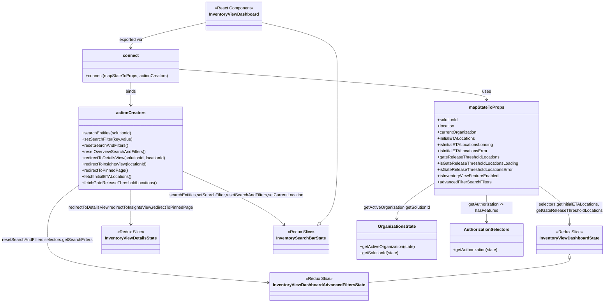

# Diagram: web/portal/src/pages/inventoryview/dashboard/InventoryView.Dashboard.page.container.js


> Auto-generated by Obscura crawlers

## Diagram 1



### SVG

<svg id="container" width="2317.994140625" xmlns="http://www.w3.org/2000/svg" class="classDiagram" height="1164" viewBox="0 0 2317.994140625 1164" role="graphics-document document" aria-roledescription="class"><style>#container{font-family:"trebuchet ms",verdana,arial,sans-serif;font-size:16px;fill:#333;}@keyframes edge-animation-frame{from{stroke-dashoffset:0;}}@keyframes dash{to{stroke-dashoffset:0;}}#container .edge-animation-slow{stroke-dasharray:9,5!important;stroke-dashoffset:900;animation:dash 50s linear infinite;stroke-linecap:round;}#container .edge-animation-fast{stroke-dasharray:9,5!important;stroke-dashoffset:900;animation:dash 20s linear infinite;stroke-linecap:round;}#container .error-icon{fill:#552222;}#container .error-text{fill:#552222;stroke:#552222;}#container .edge-thickness-normal{stroke-width:1px;}#container .edge-thickness-thick{stroke-width:3.5px;}#container .edge-pattern-solid{stroke-dasharray:0;}#container .edge-thickness-invisible{stroke-width:0;fill:none;}#container .edge-pattern-dashed{stroke-dasharray:3;}#container .edge-pattern-dotted{stroke-dasharray:2;}#container .marker{fill:#333333;stroke:#333333;}#container .marker.cross{stroke:#333333;}#container svg{font-family:"trebuchet ms",verdana,arial,sans-serif;font-size:16px;}#container p{margin:0;}#container g.classGroup text{fill:#9370DB;stroke:none;font-family:"trebuchet ms",verdana,arial,sans-serif;font-size:10px;}#container g.classGroup text .title{font-weight:bolder;}#container .nodeLabel,#container .edgeLabel{color:#131300;}#container .edgeLabel .label rect{fill:#ECECFF;}#container .label text{fill:#131300;}#container .labelBkg{background:#ECECFF;}#container .edgeLabel .label span{background:#ECECFF;}#container .classTitle{font-weight:bolder;}#container .node rect,#container .node circle,#container .node ellipse,#container .node polygon,#container .node path{fill:#ECECFF;stroke:#9370DB;stroke-width:1px;}#container .divider{stroke:#9370DB;stroke-width:1;}#container g.clickable{cursor:pointer;}#container g.classGroup rect{fill:#ECECFF;stroke:#9370DB;}#container g.classGroup line{stroke:#9370DB;stroke-width:1;}#container .classLabel .box{stroke:none;stroke-width:0;fill:#ECECFF;opacity:0.5;}#container .classLabel .label{fill:#9370DB;font-size:10px;}#container .relation{stroke:#333333;stroke-width:1;fill:none;}#container .dashed-line{stroke-dasharray:3;}#container .dotted-line{stroke-dasharray:1 2;}#container #compositionStart,#container .composition{fill:#333333!important;stroke:#333333!important;stroke-width:1;}#container #compositionEnd,#container .composition{fill:#333333!important;stroke:#333333!important;stroke-width:1;}#container #dependencyStart,#container .dependency{fill:#333333!important;stroke:#333333!important;stroke-width:1;}#container #dependencyStart,#container .dependency{fill:#333333!important;stroke:#333333!important;stroke-width:1;}#container #extensionStart,#container .extension{fill:transparent!important;stroke:#333333!important;stroke-width:1;}#container #extensionEnd,#container .extension{fill:transparent!important;stroke:#333333!important;stroke-width:1;}#container #aggregationStart,#container .aggregation{fill:transparent!important;stroke:#333333!important;stroke-width:1;}#container #aggregationEnd,#container .aggregation{fill:transparent!important;stroke:#333333!important;stroke-width:1;}#container #lollipopStart,#container .lollipop{fill:#ECECFF!important;stroke:#333333!important;stroke-width:1;}#container #lollipopEnd,#container .lollipop{fill:#ECECFF!important;stroke:#333333!important;stroke-width:1;}#container .edgeTerminals{font-size:11px;line-height:initial;}#container .classTitleText{text-anchor:middle;font-size:18px;fill:#333;}#container .label-icon{display:inline-block;height:1em;overflow:visible;vertical-align:-0.125em;}#container .node .label-icon path{fill:currentColor;stroke:revert;stroke-width:revert;}#container :root{--mermaid-font-family:"trebuchet ms",verdana,arial,sans-serif;}</style><g><defs><marker id="container_class-aggregationStart" class="marker aggregation class" refX="18" refY="7" markerWidth="190" markerHeight="240" orient="auto"><path d="M 18,7 L9,13 L1,7 L9,1 Z"></path></marker></defs><defs><marker id="container_class-aggregationEnd" class="marker aggregation class" refX="1" refY="7" markerWidth="20" markerHeight="28" orient="auto"><path d="M 18,7 L9,13 L1,7 L9,1 Z"></path></marker></defs><defs><marker id="container_class-extensionStart" class="marker extension class" refX="18" refY="7" markerWidth="190" markerHeight="240" orient="auto"><path d="M 1,7 L18,13 V 1 Z"></path></marker></defs><defs><marker id="container_class-extensionEnd" class="marker extension class" refX="1" refY="7" markerWidth="20" markerHeight="28" orient="auto"><path d="M 1,1 V 13 L18,7 Z"></path></marker></defs><defs><marker id="container_class-compositionStart" class="marker composition class" refX="18" refY="7" markerWidth="190" markerHeight="240" orient="auto"><path d="M 18,7 L9,13 L1,7 L9,1 Z"></path></marker></defs><defs><marker id="container_class-compositionEnd" class="marker composition class" refX="1" refY="7" markerWidth="20" markerHeight="28" orient="auto"><path d="M 18,7 L9,13 L1,7 L9,1 Z"></path></marker></defs><defs><marker id="container_class-dependencyStart" class="marker dependency class" refX="6" refY="7" markerWidth="190" markerHeight="240" orient="auto"><path d="M 5,7 L9,13 L1,7 L9,1 Z"></path></marker></defs><defs><marker id="container_class-dependencyEnd" class="marker dependency class" refX="13" refY="7" markerWidth="20" markerHeight="28" orient="auto"><path d="M 18,7 L9,13 L14,7 L9,1 Z"></path></marker></defs><defs><marker id="container_class-lollipopStart" class="marker lollipop class" refX="13" refY="7" markerWidth="190" markerHeight="240" orient="auto"><circle stroke="black" fill="transparent" cx="7" cy="7" r="6"></circle></marker></defs><defs><marker id="container_class-lollipopEnd" class="marker lollipop class" refX="1" refY="7" markerWidth="190" markerHeight="240" orient="auto"><circle stroke="black" fill="transparent" cx="7" cy="7" r="6"></circle></marker></defs><g class="root"><g class="clusters"></g><g class="edgePaths"><path d="M793.066,85.638L743.857,96.865C694.648,108.092,596.23,130.546,547.021,146.94C497.813,163.333,497.813,173.667,497.813,178.833L497.813,184" id="id_InventoryViewDashboard_connect_1" class="edge-thickness-normal edge-pattern-solid relation" style=";;;" data-edge="true" data-et="edge" data-id="id_InventoryViewDashboard_connect_1" data-points="W3sieCI6NzkzLjA2NjQwNjI1LCJ5Ijo4NS42MzgzMDgwODI1MzkyNX0seyJ4Ijo0OTcuODEyNSwieSI6MTUzfSx7IngiOjQ5Ny44MTI1LCJ5IjoxOTB9XQ==" marker-end="url(#container_class-dependencyEnd)"></path><path d="M682.434,266.467L880.148,280.889C1077.863,295.311,1473.292,324.156,1671.006,343.745C1868.721,363.333,1868.721,373.667,1868.721,378.833L1868.721,384" id="id_connect_mapStateToProps_2" class="edge-thickness-normal edge-pattern-solid relation" style=";;;" data-edge="true" data-et="edge" data-id="id_connect_mapStateToProps_2" data-points="W3sieCI6NjgyLjQzMzU5Mzc1LCJ5IjoyNjYuNDY3MDY0NjMxMjUzNX0seyJ4IjoxODY4LjcyMDcwMzEyNSwieSI6MzUzfSx7IngiOjE4NjguNzIwNzAzMTI1LCJ5IjozOTB9XQ==" marker-end="url(#container_class-dependencyEnd)"></path><path d="M497.813,316L497.813,322.167C497.813,328.333,497.813,340.667,497.813,355.5C497.813,370.333,497.813,387.667,497.813,396.333L497.813,405" id="id_connect_actionCreators_3" class="edge-thickness-normal edge-pattern-solid relation" style=";;;" data-edge="true" data-et="edge" data-id="id_connect_actionCreators_3" data-points="W3sieCI6NDk3LjgxMjUsInkiOjMxNn0seyJ4Ijo0OTcuODEyNSwieSI6MzUzfSx7IngiOjQ5Ny44MTI1LCJ5Ijo0MTF9XQ==" marker-end="url(#container_class-dependencyEnd)"></path><path d="M2067.248,714.588L2086.565,728.657C2105.882,742.725,2144.516,770.863,2163.833,795.598C2183.15,820.333,2183.15,841.667,2183.15,852.333L2183.15,863" id="id_mapStateToProps_InventoryViewDashboardState_4" class="edge-thickness-normal edge-pattern-solid relation" style=";;;" data-edge="true" data-et="edge" data-id="id_mapStateToProps_InventoryViewDashboardState_4" data-points="W3sieCI6MjA2Ny4yNDgwNDY4NzUsInkiOjcxNC41ODgwMDY1NTk0OTUyfSx7IngiOjIxODMuMTUwMzkwNjI1LCJ5Ijo3OTl9LHsieCI6MjE4My4xNTAzOTA2MjUsInkiOjg2OX1d" marker-end="url(#container_class-dependencyEnd)"></path><path d="M1670.193,701.849L1645.813,718.041C1621.433,734.233,1572.673,766.616,1548.292,789.975C1523.912,813.333,1523.912,827.667,1523.912,834.833L1523.912,842" id="id_mapStateToProps_OrganizationsState_5" class="edge-thickness-normal edge-pattern-solid relation" style=";;;" data-edge="true" data-et="edge" data-id="id_mapStateToProps_OrganizationsState_5" data-points="W3sieCI6MTY3MC4xOTMzNTkzNzUsInkiOjcwMS44NDkyNzA5OTUwMDR9LHsieCI6MTUyMy45MTIxMDkzNzUsInkiOjc5OX0seyJ4IjoxNTIzLjkxMjEwOTM3NSwieSI6ODQ4fV0=" marker-end="url(#container_class-dependencyEnd)"></path><path d="M1868.721,750L1868.721,758.167C1868.721,766.333,1868.721,782.667,1868.721,800C1868.721,817.333,1868.721,835.667,1868.721,844.833L1868.721,854" id="id_mapStateToProps_AuthorizationSelectors_6" class="edge-thickness-normal edge-pattern-solid relation" style=";;;" data-edge="true" data-et="edge" data-id="id_mapStateToProps_AuthorizationSelectors_6" data-points="W3sieCI6MTg2OC43MjA3MDMxMjUsInkiOjc1MH0seyJ4IjoxODY4LjcyMDcwMzEyNSwieSI6Nzk5fSx7IngiOjE4NjguNzIwNzAzMTI1LCJ5Ijo4NjB9XQ==" marker-end="url(#container_class-dependencyEnd)"></path><path d="M701.996,659.894L754.657,683.078C807.318,706.262,912.639,752.631,977.613,786.816C1042.586,821.001,1067.21,843.002,1079.523,854.002L1091.835,865.002" id="id_actionCreators_InventorySearchBarState_7" class="edge-thickness-normal edge-pattern-solid relation" style=";;;" data-edge="true" data-et="edge" data-id="id_actionCreators_InventorySearchBarState_7" data-points="W3sieCI6NzAxLjk5NjA5Mzc1LCJ5Ijo2NTkuODkzNjUyNjUzMjM5fSx7IngiOjEwMTcuOTYwOTM3NSwieSI6Nzk5fSx7IngiOjEwOTYuMzA5NjAxODE0NTE2LCJ5Ijo4Njl9XQ==" marker-end="url(#container_class-dependencyEnd)"></path><path d="M293.629,717.549L274.843,731.124C256.057,744.699,218.486,771.85,199.7,806.091C180.914,840.333,180.914,881.667,180.914,919C180.914,956.333,180.914,989.667,323.158,1017.135C465.402,1044.603,749.889,1066.206,892.133,1077.008L1034.377,1087.809" id="id_actionCreators_InventoryViewDashboardAdvancedFiltersState_8" class="edge-thickness-normal edge-pattern-solid relation" style=";;;" data-edge="true" data-et="edge" data-id="id_actionCreators_InventoryViewDashboardAdvancedFiltersState_8" data-points="W3sieCI6MjkzLjYyODkwNjI1LCJ5Ijo3MTcuNTQ4OTg1NTI4NjgzN30seyJ4IjoxODAuOTE0MDYyNSwieSI6Nzk5fSx7IngiOjE4MC45MTQwNjI1LCJ5Ijo5MjN9LHsieCI6MTgwLjkxNDA2MjUsInkiOjEwMjN9LHsieCI6MTA0MC4zNTkzNzUsInkiOjEwODguMjYzNzA2ODg1NTQ2M31d" marker-end="url(#container_class-dependencyEnd)"></path><path d="M497.813,729L497.813,740.667C497.813,752.333,497.813,775.667,497.813,798C497.813,820.333,497.813,841.667,497.813,852.333L497.813,863" id="id_actionCreators_InventoryViewDetailsState_9" class="edge-thickness-normal edge-pattern-solid relation" style=";;;" data-edge="true" data-et="edge" data-id="id_actionCreators_InventoryViewDetailsState_9" data-points="W3sieCI6NDk3LjgxMjUsInkiOjcyOX0seyJ4Ijo0OTcuODEyNSwieSI6Nzk5fSx7IngiOjQ5Ny44MTI1LCJ5Ijo4Njl9XQ==" marker-end="url(#container_class-dependencyEnd)"></path><path d="M2183.15,994.25L2183.15,999.042C2183.15,1003.833,2183.15,1013.417,2052.982,1028.899C1922.814,1044.381,1662.477,1065.762,1532.309,1076.453L1402.141,1087.144" id="id_InventoryViewDashboardState_InventoryViewDashboardAdvancedFiltersState_10" class="edge-thickness-normal edge-pattern-solid relation" style=";;;" data-edge="true" data-et="edge" data-id="id_InventoryViewDashboardState_InventoryViewDashboardAdvancedFiltersState_10" data-points="W3sieCI6MjE4My4xNTAzOTA2MjUsInkiOjk3N30seyJ4IjoyMTgzLjE1MDM5MDYyNSwieSI6MTAyM30seyJ4IjoxNDAyLjE0MDYyNSwieSI6MTA4Ny4xNDM2MTgyODQ5M31d" marker-start="url(#container_class-extensionStart)"></path><path d="M1230.054,857.507L1240.968,847.756C1251.882,838.005,1273.711,818.502,1284.625,770.585C1295.539,722.667,1295.539,646.333,1295.539,572C1295.539,497.667,1295.539,425.333,1295.539,372.5C1295.539,319.667,1295.539,286.333,1295.539,253C1295.539,219.667,1295.539,186.333,1246.33,158.44C1197.121,130.546,1098.703,108.092,1049.494,96.865L1000.285,85.638" id="id_InventorySearchBarState_InventoryViewDashboard_11" class="edge-thickness-normal edge-pattern-solid relation" style=";;;" data-edge="true" data-et="edge" data-id="id_InventorySearchBarState_InventoryViewDashboard_11" data-points="W3sieCI6MTIxNy4xOTAzOTgxODU0ODQsInkiOjg2OX0seyJ4IjoxMjk1LjUzOTA2MjUsInkiOjc5OX0seyJ4IjoxMjk1LjUzOTA2MjUsInkiOjU3MH0seyJ4IjoxMjk1LjUzOTA2MjUsInkiOjM1M30seyJ4IjoxMjk1LjUzOTA2MjUsInkiOjI1M30seyJ4IjoxMjk1LjUzOTA2MjUsInkiOjE1M30seyJ4IjoxMDAwLjI4NTE1NjI1LCJ5Ijo4NS42MzgzMDgwODI1MzkyNX1d" marker-start="url(#container_class-extensionStart)"></path></g><g class="edgeLabels"><g class="edgeLabel" transform="translate(497.8125, 153)"><g class="label" data-id="id_InventoryViewDashboard_connect_1" transform="translate(-45.2578125, -12)"><foreignObject width="90.515625" height="24"><div xmlns="http://www.w3.org/1999/xhtml" class="labelBkg" style="display: table-cell; white-space: nowrap; line-height: 1.5; max-width: 200px; text-align: center;"><span class="edgeLabel"><p>exported via</p></span></div></foreignObject></g></g><g class="edgeLabel" transform="translate(1868.720703125, 353)"><g class="label" data-id="id_connect_mapStateToProps_2" transform="translate(-16.4921875, -12)"><foreignObject width="32.984375" height="24"><div xmlns="http://www.w3.org/1999/xhtml" class="labelBkg" style="display: table-cell; white-space: nowrap; line-height: 1.5; max-width: 200px; text-align: center;"><span class="edgeLabel"><p>uses</p></span></div></foreignObject></g></g><g class="edgeLabel" transform="translate(497.8125, 353)"><g class="label" data-id="id_connect_actionCreators_3" transform="translate(-20.21875, -12)"><foreignObject width="40.4375" height="24"><div xmlns="http://www.w3.org/1999/xhtml" class="labelBkg" style="display: table-cell; white-space: nowrap; line-height: 1.5; max-width: 200px; text-align: center;"><span class="edgeLabel"><p>binds</p></span></div></foreignObject></g></g><g class="edgeLabel" transform="translate(2183.150390625, 799)"><g class="label" data-id="id_mapStateToProps_InventoryViewDashboardState_4" transform="translate(-126.84375, -24)"><foreignObject width="253.6875" height="48"><div xmlns="http://www.w3.org/1999/xhtml" class="labelBkg" style="display: table; white-space: break-spaces; line-height: 1.5; max-width: 200px; text-align: center; width: 200px;"><span class="edgeLabel"><p>selectors.getInitialETALocations, getGateReleaseThresholdLocations</p></span></div></foreignObject></g></g><g class="edgeLabel" transform="translate(1523.912109375, 799)"><g class="label" data-id="id_mapStateToProps_OrganizationsState_5" transform="translate(-129.9375, -12)"><foreignObject width="259.875" height="24"><div xmlns="http://www.w3.org/1999/xhtml" class="labelBkg" style="display: table; white-space: break-spaces; line-height: 1.5; max-width: 200px; text-align: center; width: 200px;"><span class="edgeLabel"><p>getActiveOrganization,getSolutionId</p></span></div></foreignObject></g></g><g class="edgeLabel" transform="translate(1868.720703125, 799)"><g class="label" data-id="id_mapStateToProps_AuthorizationSelectors_6" transform="translate(-100, -24)"><foreignObject width="200" height="48"><div xmlns="http://www.w3.org/1999/xhtml" class="labelBkg" style="display: table; white-space: break-spaces; line-height: 1.5; max-width: 200px; text-align: center; width: 200px;"><span class="edgeLabel"><p>getAuthorization -&gt; hasFeatures</p></span></div></foreignObject></g></g><g class="edgeLabel" transform="translate(908.0574, 750.61399)"><g class="label" data-id="id_actionCreators_InventorySearchBarState_7" transform="translate(-257.578125, -12)"><foreignObject width="515.15625" height="24"><div xmlns="http://www.w3.org/1999/xhtml" class="labelBkg" style="display: table; white-space: break-spaces; line-height: 1.5; max-width: 200px; text-align: center; width: 200px;"><span class="edgeLabel"><p>searchEntities,setSearchFilter,resetSearchAndFilters,setCurrentLocation</p></span></div></foreignObject></g></g><g class="edgeLabel" transform="translate(180.9140625, 923)"><g class="label" data-id="id_actionCreators_InventoryViewDashboardAdvancedFiltersState_8" transform="translate(-172.9140625, -12)"><foreignObject width="345.828125" height="24"><div xmlns="http://www.w3.org/1999/xhtml" class="labelBkg" style="display: table; white-space: break-spaces; line-height: 1.5; max-width: 200px; text-align: center; width: 200px;"><span class="edgeLabel"><p>resetSearchAndFilters,selectors.getSearchFilters</p></span></div></foreignObject></g></g><g class="edgeLabel" transform="translate(497.8125, 799)"><g class="label" data-id="id_actionCreators_InventoryViewDetailsState_9" transform="translate(-242.5703125, -12)"><foreignObject width="485.140625" height="24"><div xmlns="http://www.w3.org/1999/xhtml" class="labelBkg" style="display: table; white-space: break-spaces; line-height: 1.5; max-width: 200px; text-align: center; width: 200px;"><span class="edgeLabel"><p>redirectToDetailsView,redirectToInsightsView,redirectToPinnedPage</p></span></div></foreignObject></g></g><g class="edgeLabel"><g class="label" data-id="id_InventoryViewDashboardState_InventoryViewDashboardAdvancedFiltersState_10" transform="translate(0, 0)"><foreignObject width="0" height="0"><div xmlns="http://www.w3.org/1999/xhtml" class="labelBkg" style="display: table-cell; white-space: nowrap; line-height: 1.5; max-width: 200px; text-align: center;"><span class="edgeLabel"></span></div></foreignObject></g></g><g class="edgeLabel"><g class="label" data-id="id_InventorySearchBarState_InventoryViewDashboard_11" transform="translate(0, 0)"><foreignObject width="0" height="0"><div xmlns="http://www.w3.org/1999/xhtml" class="labelBkg" style="display: table-cell; white-space: nowrap; line-height: 1.5; max-width: 200px; text-align: center;"><span class="edgeLabel"></span></div></foreignObject></g></g></g><g class="nodes"><g class="node default" id="classId-InventoryViewDashboard-0" transform="translate(896.67578125, 62)"><g class="basic label-container"><path d="M-103.609375 -54 L103.609375 -54 L103.609375 54 L-103.609375 54" stroke="none" stroke-width="0" fill="#ECECFF" style=""></path><path d="M-103.609375 -54 C-60.46511607826914 -54, -17.32085715653828 -54, 103.609375 -54 M-103.609375 -54 C-27.39865041500535 -54, 48.8120741699893 -54, 103.609375 -54 M103.609375 -54 C103.609375 -23.068703575929, 103.609375 7.862592848142, 103.609375 54 M103.609375 -54 C103.609375 -20.890670303703203, 103.609375 12.218659392593594, 103.609375 54 M103.609375 54 C49.29899462987778 54, -5.011385740244435 54, -103.609375 54 M103.609375 54 C61.96853309008606 54, 20.327691180172124 54, -103.609375 54 M-103.609375 54 C-103.609375 20.843583503897868, -103.609375 -12.312832992204264, -103.609375 -54 M-103.609375 54 C-103.609375 19.08723702444192, -103.609375 -15.825525951116163, -103.609375 -54" stroke="#9370DB" stroke-width="1.3" fill="none" stroke-dasharray="0 0" style=""></path></g><g class="annotation-group text" transform="translate(-73.2109375, -30)"><g class="label" style="" transform="translate(0,-12)"><foreignObject width="146.421875" height="24"><div xmlns="http://www.w3.org/1999/xhtml" style="display: table-cell; white-space: nowrap; line-height: 1.5; max-width: 196px; text-align: center;"><span class="nodeLabel markdown-node-label" style=""><p>«React Component»</p></span></div></foreignObject></g></g><g class="label-group text" transform="translate(-91.609375, -6)"><g class="label" style="font-weight: bolder" transform="translate(0,-12)"><foreignObject width="183.21875" height="24"><div xmlns="http://www.w3.org/1999/xhtml" style="display: table-cell; white-space: nowrap; line-height: 1.5; max-width: 231px; text-align: center;"><span class="nodeLabel markdown-node-label" style=""><p>InventoryViewDashboard</p></span></div></foreignObject></g></g><g class="members-group text" transform="translate(-91.609375, 42)"></g><g class="methods-group text" transform="translate(-91.609375, 72)"></g><g class="divider" style=""><path d="M-103.609375 18 C-33.18662430693708 18, 37.23612638612585 18, 103.609375 18 M-103.609375 18 C-55.9256649523363 18, -8.241954904672596 18, 103.609375 18" stroke="#9370DB" stroke-width="1.3" fill="none" stroke-dasharray="0 0" style=""></path></g><g class="divider" style=""><path d="M-103.609375 36 C-30.982992887308143 36, 41.643389225383714 36, 103.609375 36 M-103.609375 36 C-30.89126916045535 36, 41.8268366790893 36, 103.609375 36" stroke="#9370DB" stroke-width="1.3" fill="none" stroke-dasharray="0 0" style=""></path></g></g><g class="node default" id="classId-connect-1" transform="translate(497.8125, 253)"><g class="basic label-container"><path d="M-184.62109375 -63 L184.62109375 -63 L184.62109375 63 L-184.62109375 63" stroke="none" stroke-width="0" fill="#ECECFF" style=""></path><path d="M-184.62109375 -63 C-65.65863589845414 -63, 53.30382195309173 -63, 184.62109375 -63 M-184.62109375 -63 C-61.465731414768925 -63, 61.68963092046215 -63, 184.62109375 -63 M184.62109375 -63 C184.62109375 -34.294236080288414, 184.62109375 -5.588472160576828, 184.62109375 63 M184.62109375 -63 C184.62109375 -37.52536027279927, 184.62109375 -12.050720545598537, 184.62109375 63 M184.62109375 63 C79.12799324152724 63, -26.36510726694553 63, -184.62109375 63 M184.62109375 63 C83.01398499813084 63, -18.593123753738325 63, -184.62109375 63 M-184.62109375 63 C-184.62109375 24.72264724855694, -184.62109375 -13.554705502886122, -184.62109375 -63 M-184.62109375 63 C-184.62109375 35.57713066266566, -184.62109375 8.15426132533132, -184.62109375 -63" stroke="#9370DB" stroke-width="1.3" fill="none" stroke-dasharray="0 0" style=""></path></g><g class="annotation-group text" transform="translate(0, -39)"></g><g class="label-group text" transform="translate(-28.9140625, -39)"><g class="label" style="font-weight: bolder" transform="translate(0,-12)"><foreignObject width="57.828125" height="24"><div xmlns="http://www.w3.org/1999/xhtml" style="display: table-cell; white-space: nowrap; line-height: 1.5; max-width: 108px; text-align: center;"><span class="nodeLabel markdown-node-label" style=""><p>connect</p></span></div></foreignObject></g></g><g class="members-group text" transform="translate(-172.62109375, 9)"></g><g class="methods-group text" transform="translate(-172.62109375, 39)"><g class="label" style="" transform="translate(0,-12)"><foreignObject width="316.328125" height="24"><div xmlns="http://www.w3.org/1999/xhtml" style="display: table-cell; white-space: nowrap; line-height: 1.5; max-width: 374px; text-align: center;"><span class="nodeLabel markdown-node-label" style=""><p>+connect(mapStateToProps, actionCreators)</p></span></div></foreignObject></g></g><g class="divider" style=""><path d="M-184.62109375 -15 C-41.346870293381556 -15, 101.92735316323689 -15, 184.62109375 -15 M-184.62109375 -15 C-45.37989168757724 -15, 93.86131037484552 -15, 184.62109375 -15" stroke="#9370DB" stroke-width="1.3" fill="none" stroke-dasharray="0 0" style=""></path></g><g class="divider" style=""><path d="M-184.62109375 9 C-39.29412451798012 9, 106.03284471403975 9, 184.62109375 9 M-184.62109375 9 C-104.71313840678091 9, -24.805183063561827 9, 184.62109375 9" stroke="#9370DB" stroke-width="1.3" fill="none" stroke-dasharray="0 0" style=""></path></g></g><g class="node default" id="classId-mapStateToProps-2" transform="translate(1868.720703125, 570)"><g class="basic label-container"><path d="M-198.52734375 -180 L198.52734375 -180 L198.52734375 180 L-198.52734375 180" stroke="none" stroke-width="0" fill="#ECECFF" style=""></path><path d="M-198.52734375 -180 C-99.85861567262964 -180, -1.189887595259279 -180, 198.52734375 -180 M-198.52734375 -180 C-74.27546271610943 -180, 49.97641831778114 -180, 198.52734375 -180 M198.52734375 -180 C198.52734375 -37.24740940839652, 198.52734375 105.50518118320696, 198.52734375 180 M198.52734375 -180 C198.52734375 -99.9677163420338, 198.52734375 -19.935432684067592, 198.52734375 180 M198.52734375 180 C112.35147081904844 180, 26.17559788809689 180, -198.52734375 180 M198.52734375 180 C83.44102681683977 180, -31.645290116320467 180, -198.52734375 180 M-198.52734375 180 C-198.52734375 71.7966714006958, -198.52734375 -36.4066571986084, -198.52734375 -180 M-198.52734375 180 C-198.52734375 72.89027380577238, -198.52734375 -34.21945238845524, -198.52734375 -180" stroke="#9370DB" stroke-width="1.3" fill="none" stroke-dasharray="0 0" style=""></path></g><g class="annotation-group text" transform="translate(0, -156)"></g><g class="label-group text" transform="translate(-64.7109375, -156)"><g class="label" style="font-weight: bolder" transform="translate(0,-12)"><foreignObject width="129.421875" height="24"><div xmlns="http://www.w3.org/1999/xhtml" style="display: table-cell; white-space: nowrap; line-height: 1.5; max-width: 177px; text-align: center;"><span class="nodeLabel markdown-node-label" style=""><p>mapStateToProps</p></span></div></foreignObject></g></g><g class="members-group text" transform="translate(-186.52734375, -108)"><g class="label" style="" transform="translate(0,-12)"><foreignObject width="82.109375" height="24"><div xmlns="http://www.w3.org/1999/xhtml" style="display: table-cell; white-space: nowrap; line-height: 1.5; max-width: 139px; text-align: center;"><span class="nodeLabel markdown-node-label" style=""><p>+solutionId</p></span></div></foreignObject></g><g class="label" style="" transform="translate(0,12)"><foreignObject width="67.140625" height="24"><div xmlns="http://www.w3.org/1999/xhtml" style="display: table-cell; white-space: nowrap; line-height: 1.5; max-width: 125px; text-align: center;"><span class="nodeLabel markdown-node-label" style=""><p>+location</p></span></div></foreignObject></g><g class="label" style="" transform="translate(0,36)"><foreignObject width="152.609375" height="24"><div xmlns="http://www.w3.org/1999/xhtml" style="display: table-cell; white-space: nowrap; line-height: 1.5; max-width: 210px; text-align: center;"><span class="nodeLabel markdown-node-label" style=""><p>+currentOrganization</p></span></div></foreignObject></g><g class="label" style="" transform="translate(0,60)"><foreignObject width="144.703125" height="24"><div xmlns="http://www.w3.org/1999/xhtml" style="display: table-cell; white-space: nowrap; line-height: 1.5; max-width: 202px; text-align: center;"><span class="nodeLabel markdown-node-label" style=""><p>+initialETALocations</p></span></div></foreignObject></g><g class="label" style="" transform="translate(0,84)"><foreignObject width="214.125" height="24"><div xmlns="http://www.w3.org/1999/xhtml" style="display: table-cell; white-space: nowrap; line-height: 1.5; max-width: 272px; text-align: center;"><span class="nodeLabel markdown-node-label" style=""><p>+isInitialETALocationsLoading</p></span></div></foreignObject></g><g class="label" style="" transform="translate(0,108)"><foreignObject width="192.6875" height="24"><div xmlns="http://www.w3.org/1999/xhtml" style="display: table-cell; white-space: nowrap; line-height: 1.5; max-width: 251px; text-align: center;"><span class="nodeLabel markdown-node-label" style=""><p>+isInitialETALocationsError</p></span></div></foreignObject></g><g class="label" style="" transform="translate(0,132)"><foreignObject width="237.046875" height="24"><div xmlns="http://www.w3.org/1999/xhtml" style="display: table-cell; white-space: nowrap; line-height: 1.5; max-width: 294px; text-align: center;"><span class="nodeLabel markdown-node-label" style=""><p>+gateReleaseThresholdLocations</p></span></div></foreignObject></g><g class="label" style="" transform="translate(0,156)"><foreignObject width="308.34375" height="24"><div xmlns="http://www.w3.org/1999/xhtml" style="display: table-cell; white-space: nowrap; line-height: 1.5; max-width: 366px; text-align: center;"><span class="nodeLabel markdown-node-label" style=""><p>+isGateReleaseThresholdLocationsLoading</p></span></div></foreignObject></g><g class="label" style="" transform="translate(0,180)"><foreignObject width="286.90625" height="24"><div xmlns="http://www.w3.org/1999/xhtml" style="display: table-cell; white-space: nowrap; line-height: 1.5; max-width: 345px; text-align: center;"><span class="nodeLabel markdown-node-label" style=""><p>+isGateReleaseThresholdLocationsError</p></span></div></foreignObject></g><g class="label" style="" transform="translate(0,204)"><foreignObject width="235.34375" height="24"><div xmlns="http://www.w3.org/1999/xhtml" style="display: table-cell; white-space: nowrap; line-height: 1.5; max-width: 293px; text-align: center;"><span class="nodeLabel markdown-node-label" style=""><p>+isInventoryViewFeatureEnabled</p></span></div></foreignObject></g><g class="label" style="" transform="translate(0,228)"><foreignObject width="207.125" height="24"><div xmlns="http://www.w3.org/1999/xhtml" style="display: table-cell; white-space: nowrap; line-height: 1.5; max-width: 264px; text-align: center;"><span class="nodeLabel markdown-node-label" style=""><p>+advancedFilterSearchFilters</p></span></div></foreignObject></g></g><g class="methods-group text" transform="translate(-186.52734375, 180)"></g><g class="divider" style=""><path d="M-198.52734375 -132 C-71.63554452087875 -132, 55.256254708242494 -132, 198.52734375 -132 M-198.52734375 -132 C-117.78707886242111 -132, -37.04681397484222 -132, 198.52734375 -132" stroke="#9370DB" stroke-width="1.3" fill="none" stroke-dasharray="0 0" style=""></path></g><g class="divider" style=""><path d="M-198.52734375 156 C-64.82398417372505 156, 68.8793754025499 156, 198.52734375 156 M-198.52734375 156 C-53.527383067172366 156, 91.47257761565527 156, 198.52734375 156" stroke="#9370DB" stroke-width="1.3" fill="none" stroke-dasharray="0 0" style=""></path></g></g><g class="node default" id="classId-actionCreators-3" transform="translate(497.8125, 570)"><g class="basic label-container"><path d="M-204.18359375 -159 L204.18359375 -159 L204.18359375 159 L-204.18359375 159" stroke="none" stroke-width="0" fill="#ECECFF" style=""></path><path d="M-204.18359375 -159 C-53.8733473883145 -159, 96.436898973371 -159, 204.18359375 -159 M-204.18359375 -159 C-59.305398495546854 -159, 85.57279675890629 -159, 204.18359375 -159 M204.18359375 -159 C204.18359375 -66.7392030830926, 204.18359375 25.52159383381479, 204.18359375 159 M204.18359375 -159 C204.18359375 -55.24352314575208, 204.18359375 48.51295370849584, 204.18359375 159 M204.18359375 159 C45.052229291819884 159, -114.07913516636023 159, -204.18359375 159 M204.18359375 159 C94.45567088345909 159, -15.272251983081816 159, -204.18359375 159 M-204.18359375 159 C-204.18359375 44.461150133994096, -204.18359375 -70.07769973201181, -204.18359375 -159 M-204.18359375 159 C-204.18359375 57.58850080517219, -204.18359375 -43.82299838965562, -204.18359375 -159" stroke="#9370DB" stroke-width="1.3" fill="none" stroke-dasharray="0 0" style=""></path></g><g class="annotation-group text" transform="translate(0, -135)"></g><g class="label-group text" transform="translate(-53.6328125, -135)"><g class="label" style="font-weight: bolder" transform="translate(0,-12)"><foreignObject width="107.265625" height="24"><div xmlns="http://www.w3.org/1999/xhtml" style="display: table-cell; white-space: nowrap; line-height: 1.5; max-width: 155px; text-align: center;"><span class="nodeLabel markdown-node-label" style=""><p>actionCreators</p></span></div></foreignObject></g></g><g class="members-group text" transform="translate(-192.18359375, -87)"></g><g class="methods-group text" transform="translate(-192.18359375, -57)"><g class="label" style="" transform="translate(0,-12)"><foreignObject width="194.46875" height="24"><div xmlns="http://www.w3.org/1999/xhtml" style="display: table-cell; white-space: nowrap; line-height: 1.5; max-width: 252px; text-align: center;"><span class="nodeLabel markdown-node-label" style=""><p>+searchEntities(solutionId)</p></span></div></foreignObject></g><g class="label" style="" transform="translate(0,12)"><foreignObject width="191.96875" height="24"><div xmlns="http://www.w3.org/1999/xhtml" style="display: table-cell; white-space: nowrap; line-height: 1.5; max-width: 249px; text-align: center;"><span class="nodeLabel markdown-node-label" style=""><p>+setSearchFilter(key,value)</p></span></div></foreignObject></g><g class="label" style="" transform="translate(0,36)"><foreignObject width="175.71875" height="24"><div xmlns="http://www.w3.org/1999/xhtml" style="display: table-cell; white-space: nowrap; line-height: 1.5; max-width: 233px; text-align: center;"><span class="nodeLabel markdown-node-label" style=""><p>+resetSearchAndFilters()</p></span></div></foreignObject></g><g class="label" style="" transform="translate(0,60)"><foreignObject width="242.078125" height="24"><div xmlns="http://www.w3.org/1999/xhtml" style="display: table-cell; white-space: nowrap; line-height: 1.5; max-width: 299px; text-align: center;"><span class="nodeLabel markdown-node-label" style=""><p>+resetOverviewSearchAndFilters()</p></span></div></foreignObject></g><g class="label" style="" transform="translate(0,84)"><foreignObject width="330.734375" height="24"><div xmlns="http://www.w3.org/1999/xhtml" style="display: table-cell; white-space: nowrap; line-height: 1.5; max-width: 388px; text-align: center;"><span class="nodeLabel markdown-node-label" style=""><p>+redirectToDetailsView(solutionId, locationId)</p></span></div></foreignObject></g><g class="label" style="" transform="translate(0,108)"><foreignObject width="255.5" height="24"><div xmlns="http://www.w3.org/1999/xhtml" style="display: table-cell; white-space: nowrap; line-height: 1.5; max-width: 313px; text-align: center;"><span class="nodeLabel markdown-node-label" style=""><p>+redirectToInsightsView(locationId)</p></span></div></foreignObject></g><g class="label" style="" transform="translate(0,132)"><foreignObject width="176.03125" height="24"><div xmlns="http://www.w3.org/1999/xhtml" style="display: table-cell; white-space: nowrap; line-height: 1.5; max-width: 233px; text-align: center;"><span class="nodeLabel markdown-node-label" style=""><p>+redirectToPinnedPage()</p></span></div></foreignObject></g><g class="label" style="" transform="translate(0,156)"><foreignObject width="191.515625" height="24"><div xmlns="http://www.w3.org/1999/xhtml" style="display: table-cell; white-space: nowrap; line-height: 1.5; max-width: 249px; text-align: center;"><span class="nodeLabel markdown-node-label" style=""><p>+fetchInitialETALocations()</p></span></div></foreignObject></g><g class="label" style="" transform="translate(0,180)"><foreignObject width="285.734375" height="24"><div xmlns="http://www.w3.org/1999/xhtml" style="display: table-cell; white-space: nowrap; line-height: 1.5; max-width: 343px; text-align: center;"><span class="nodeLabel markdown-node-label" style=""><p>+fetchGateReleaseThresholdLocations()</p></span></div></foreignObject></g></g><g class="divider" style=""><path d="M-204.18359375 -111 C-78.3733284472634 -111, 47.43693685547319 -111, 204.18359375 -111 M-204.18359375 -111 C-97.2967005722302 -111, 9.590192605539613 -111, 204.18359375 -111" stroke="#9370DB" stroke-width="1.3" fill="none" stroke-dasharray="0 0" style=""></path></g><g class="divider" style=""><path d="M-204.18359375 -87 C-91.3917938941075 -87, 21.400005961785013 -87, 204.18359375 -87 M-204.18359375 -87 C-55.370822750385 -87, 93.44194824923 -87, 204.18359375 -87" stroke="#9370DB" stroke-width="1.3" fill="none" stroke-dasharray="0 0" style=""></path></g></g><g class="node default" id="classId-InventoryViewDashboardState-4" transform="translate(2183.150390625, 923)"><g class="basic label-container"><path d="M-122.921875 -54 L122.921875 -54 L122.921875 54 L-122.921875 54" stroke="none" stroke-width="0" fill="#ECECFF" style=""></path><path d="M-122.921875 -54 C-46.45584464175734 -54, 30.010185716485324 -54, 122.921875 -54 M-122.921875 -54 C-51.632838005471854 -54, 19.656198989056293 -54, 122.921875 -54 M122.921875 -54 C122.921875 -32.06996753659928, 122.921875 -10.13993507319855, 122.921875 54 M122.921875 -54 C122.921875 -27.644236247971367, 122.921875 -1.2884724959427345, 122.921875 54 M122.921875 54 C47.36884210440944 54, -28.184190791181123 54, -122.921875 54 M122.921875 54 C30.541822184987822 54, -61.838230630024356 54, -122.921875 54 M-122.921875 54 C-122.921875 16.899770710645797, -122.921875 -20.200458578708407, -122.921875 -54 M-122.921875 54 C-122.921875 14.283823288122178, -122.921875 -25.432353423755643, -122.921875 -54" stroke="#9370DB" stroke-width="1.3" fill="none" stroke-dasharray="0 0" style=""></path></g><g class="annotation-group text" transform="translate(-50.4765625, -30)"><g class="label" style="" transform="translate(0,-12)"><foreignObject width="100.953125" height="24"><div xmlns="http://www.w3.org/1999/xhtml" style="display: table-cell; white-space: nowrap; line-height: 1.5; max-width: 151px; text-align: center;"><span class="nodeLabel markdown-node-label" style=""><p>«Redux Slice»</p></span></div></foreignObject></g></g><g class="label-group text" transform="translate(-110.921875, -6)"><g class="label" style="font-weight: bolder" transform="translate(0,-12)"><foreignObject width="221.84375" height="24"><div xmlns="http://www.w3.org/1999/xhtml" style="display: table-cell; white-space: nowrap; line-height: 1.5; max-width: 268px; text-align: center;"><span class="nodeLabel markdown-node-label" style=""><p>InventoryViewDashboardState</p></span></div></foreignObject></g></g><g class="members-group text" transform="translate(-110.921875, 42)"></g><g class="methods-group text" transform="translate(-110.921875, 72)"></g><g class="divider" style=""><path d="M-122.921875 18 C-57.79971242760607 18, 7.322450144787865 18, 122.921875 18 M-122.921875 18 C-26.977848115100272 18, 68.96617876979946 18, 122.921875 18" stroke="#9370DB" stroke-width="1.3" fill="none" stroke-dasharray="0 0" style=""></path></g><g class="divider" style=""><path d="M-122.921875 36 C-24.82014686531211 36, 73.28158126937578 36, 122.921875 36 M-122.921875 36 C-70.82768787486381 36, -18.733500749727625 36, 122.921875 36" stroke="#9370DB" stroke-width="1.3" fill="none" stroke-dasharray="0 0" style=""></path></g></g><g class="node default" id="classId-InventoryViewDetailsState-5" transform="translate(497.8125, 923)"><g class="basic label-container"><path d="M-108.984375 -54 L108.984375 -54 L108.984375 54 L-108.984375 54" stroke="none" stroke-width="0" fill="#ECECFF" style=""></path><path d="M-108.984375 -54 C-38.406739061547256 -54, 32.17089687690549 -54, 108.984375 -54 M-108.984375 -54 C-26.62376767278748 -54, 55.73683965442504 -54, 108.984375 -54 M108.984375 -54 C108.984375 -29.032609561633475, 108.984375 -4.0652191232669495, 108.984375 54 M108.984375 -54 C108.984375 -19.16320686435609, 108.984375 15.673586271287817, 108.984375 54 M108.984375 54 C39.67877039273321 54, -29.626834214533574 54, -108.984375 54 M108.984375 54 C60.577826280766416 54, 12.171277561532833 54, -108.984375 54 M-108.984375 54 C-108.984375 24.375463277457374, -108.984375 -5.249073445085251, -108.984375 -54 M-108.984375 54 C-108.984375 31.65702023893249, -108.984375 9.314040477864978, -108.984375 -54" stroke="#9370DB" stroke-width="1.3" fill="none" stroke-dasharray="0 0" style=""></path></g><g class="annotation-group text" transform="translate(-50.4765625, -30)"><g class="label" style="" transform="translate(0,-12)"><foreignObject width="100.953125" height="24"><div xmlns="http://www.w3.org/1999/xhtml" style="display: table-cell; white-space: nowrap; line-height: 1.5; max-width: 151px; text-align: center;"><span class="nodeLabel markdown-node-label" style=""><p>«Redux Slice»</p></span></div></foreignObject></g></g><g class="label-group text" transform="translate(-96.984375, -6)"><g class="label" style="font-weight: bolder" transform="translate(0,-12)"><foreignObject width="193.96875" height="24"><div xmlns="http://www.w3.org/1999/xhtml" style="display: table-cell; white-space: nowrap; line-height: 1.5; max-width: 240px; text-align: center;"><span class="nodeLabel markdown-node-label" style=""><p>InventoryViewDetailsState</p></span></div></foreignObject></g></g><g class="members-group text" transform="translate(-96.984375, 42)"></g><g class="methods-group text" transform="translate(-96.984375, 72)"></g><g class="divider" style=""><path d="M-108.984375 18 C-65.26009590169569 18, -21.535816803391384 18, 108.984375 18 M-108.984375 18 C-22.525018508104537 18, 63.934337983790925 18, 108.984375 18" stroke="#9370DB" stroke-width="1.3" fill="none" stroke-dasharray="0 0" style=""></path></g><g class="divider" style=""><path d="M-108.984375 36 C-33.809013781533025 36, 41.36634743693395 36, 108.984375 36 M-108.984375 36 C-43.360516910271116 36, 22.26334117945777 36, 108.984375 36" stroke="#9370DB" stroke-width="1.3" fill="none" stroke-dasharray="0 0" style=""></path></g></g><g class="node default" id="classId-InventorySearchBarState-6" transform="translate(1156.75, 923)"><g class="basic label-container"><path d="M-103.5078125 -54 L103.5078125 -54 L103.5078125 54 L-103.5078125 54" stroke="none" stroke-width="0" fill="#ECECFF" style=""></path><path d="M-103.5078125 -54 C-54.567704495664316 -54, -5.627596491328632 -54, 103.5078125 -54 M-103.5078125 -54 C-37.6728496856839 -54, 28.1621131286322 -54, 103.5078125 -54 M103.5078125 -54 C103.5078125 -12.027847653526521, 103.5078125 29.944304692946957, 103.5078125 54 M103.5078125 -54 C103.5078125 -11.850791445178814, 103.5078125 30.298417109642372, 103.5078125 54 M103.5078125 54 C49.53118813249874 54, -4.445436235002518 54, -103.5078125 54 M103.5078125 54 C35.65811953456513 54, -32.19157343086974 54, -103.5078125 54 M-103.5078125 54 C-103.5078125 21.634781098064302, -103.5078125 -10.730437803871396, -103.5078125 -54 M-103.5078125 54 C-103.5078125 29.665525089998674, -103.5078125 5.331050179997348, -103.5078125 -54" stroke="#9370DB" stroke-width="1.3" fill="none" stroke-dasharray="0 0" style=""></path></g><g class="annotation-group text" transform="translate(-50.4765625, -30)"><g class="label" style="" transform="translate(0,-12)"><foreignObject width="100.953125" height="24"><div xmlns="http://www.w3.org/1999/xhtml" style="display: table-cell; white-space: nowrap; line-height: 1.5; max-width: 151px; text-align: center;"><span class="nodeLabel markdown-node-label" style=""><p>«Redux Slice»</p></span></div></foreignObject></g></g><g class="label-group text" transform="translate(-91.5078125, -6)"><g class="label" style="font-weight: bolder" transform="translate(0,-12)"><foreignObject width="183.015625" height="24"><div xmlns="http://www.w3.org/1999/xhtml" style="display: table-cell; white-space: nowrap; line-height: 1.5; max-width: 229px; text-align: center;"><span class="nodeLabel markdown-node-label" style=""><p>InventorySearchBarState</p></span></div></foreignObject></g></g><g class="members-group text" transform="translate(-91.5078125, 42)"></g><g class="methods-group text" transform="translate(-91.5078125, 72)"></g><g class="divider" style=""><path d="M-103.5078125 18 C-42.15690909719904 18, 19.19399430560192 18, 103.5078125 18 M-103.5078125 18 C-41.6091643587426 18, 20.289483782514793 18, 103.5078125 18" stroke="#9370DB" stroke-width="1.3" fill="none" stroke-dasharray="0 0" style=""></path></g><g class="divider" style=""><path d="M-103.5078125 36 C-54.70265203554952 36, -5.897491571099039 36, 103.5078125 36 M-103.5078125 36 C-45.065265400988814 36, 13.377281698022372 36, 103.5078125 36" stroke="#9370DB" stroke-width="1.3" fill="none" stroke-dasharray="0 0" style=""></path></g></g><g class="node default" id="classId-InventoryViewDashboardAdvancedFiltersState-7" transform="translate(1221.25, 1102)"><g class="basic label-container"><path d="M-180.890625 -54 L180.890625 -54 L180.890625 54 L-180.890625 54" stroke="none" stroke-width="0" fill="#ECECFF" style=""></path><path d="M-180.890625 -54 C-38.69492410693749 -54, 103.50077678612502 -54, 180.890625 -54 M-180.890625 -54 C-71.96112047757352 -54, 36.96838404485297 -54, 180.890625 -54 M180.890625 -54 C180.890625 -15.756533009189226, 180.890625 22.486933981621547, 180.890625 54 M180.890625 -54 C180.890625 -25.187289197105095, 180.890625 3.6254216057898105, 180.890625 54 M180.890625 54 C82.06635471253978 54, -16.757915574920446 54, -180.890625 54 M180.890625 54 C41.9892235194649 54, -96.9121779610702 54, -180.890625 54 M-180.890625 54 C-180.890625 12.762587077584037, -180.890625 -28.474825844831926, -180.890625 -54 M-180.890625 54 C-180.890625 29.90826428045783, -180.890625 5.816528560915657, -180.890625 -54" stroke="#9370DB" stroke-width="1.3" fill="none" stroke-dasharray="0 0" style=""></path></g><g class="annotation-group text" transform="translate(-50.4765625, -30)"><g class="label" style="" transform="translate(0,-12)"><foreignObject width="100.953125" height="24"><div xmlns="http://www.w3.org/1999/xhtml" style="display: table-cell; white-space: nowrap; line-height: 1.5; max-width: 151px; text-align: center;"><span class="nodeLabel markdown-node-label" style=""><p>«Redux Slice»</p></span></div></foreignObject></g></g><g class="label-group text" transform="translate(-168.890625, -6)"><g class="label" style="font-weight: bolder" transform="translate(0,-12)"><foreignObject width="337.78125" height="24"><div xmlns="http://www.w3.org/1999/xhtml" style="display: table-cell; white-space: nowrap; line-height: 1.5; max-width: 382px; text-align: center;"><span class="nodeLabel markdown-node-label" style=""><p>InventoryViewDashboardAdvancedFiltersState</p></span></div></foreignObject></g></g><g class="members-group text" transform="translate(-168.890625, 42)"></g><g class="methods-group text" transform="translate(-168.890625, 72)"></g><g class="divider" style=""><path d="M-180.890625 18 C-62.30452381528855 18, 56.281577369422905 18, 180.890625 18 M-180.890625 18 C-73.80874443693494 18, 33.27313612613011 18, 180.890625 18" stroke="#9370DB" stroke-width="1.3" fill="none" stroke-dasharray="0 0" style=""></path></g><g class="divider" style=""><path d="M-180.890625 36 C-59.76187544176197 36, 61.366874116476055 36, 180.890625 36 M-180.890625 36 C-83.2575531520851 36, 14.375518695829811 36, 180.890625 36" stroke="#9370DB" stroke-width="1.3" fill="none" stroke-dasharray="0 0" style=""></path></g></g><g class="node default" id="classId-OrganizationsState-8" transform="translate(1523.912109375, 923)"><g class="basic label-container"><path d="M-153.30078125 -75 L153.30078125 -75 L153.30078125 75 L-153.30078125 75" stroke="none" stroke-width="0" fill="#ECECFF" style=""></path><path d="M-153.30078125 -75 C-87.96502769972035 -75, -22.629274149440704 -75, 153.30078125 -75 M-153.30078125 -75 C-49.70072835403886 -75, 53.89932454192228 -75, 153.30078125 -75 M153.30078125 -75 C153.30078125 -25.01949989026059, 153.30078125 24.96100021947882, 153.30078125 75 M153.30078125 -75 C153.30078125 -23.674391511879385, 153.30078125 27.65121697624123, 153.30078125 75 M153.30078125 75 C58.05375122822687 75, -37.193278793546256 75, -153.30078125 75 M153.30078125 75 C37.81831883077204 75, -77.66414358845591 75, -153.30078125 75 M-153.30078125 75 C-153.30078125 22.30082469655001, -153.30078125 -30.39835060689998, -153.30078125 -75 M-153.30078125 75 C-153.30078125 27.671314947941497, -153.30078125 -19.657370104117007, -153.30078125 -75" stroke="#9370DB" stroke-width="1.3" fill="none" stroke-dasharray="0 0" style=""></path></g><g class="annotation-group text" transform="translate(0, -51)"></g><g class="label-group text" transform="translate(-69.8671875, -51)"><g class="label" style="font-weight: bolder" transform="translate(0,-12)"><foreignObject width="139.734375" height="24"><div xmlns="http://www.w3.org/1999/xhtml" style="display: table-cell; white-space: nowrap; line-height: 1.5; max-width: 187px; text-align: center;"><span class="nodeLabel markdown-node-label" style=""><p>OrganizationsState</p></span></div></foreignObject></g></g><g class="members-group text" transform="translate(-141.30078125, -3)"></g><g class="methods-group text" transform="translate(-141.30078125, 27)"><g class="label" style="" transform="translate(0,-12)"><foreignObject width="212.734375" height="24"><div xmlns="http://www.w3.org/1999/xhtml" style="display: table-cell; white-space: nowrap; line-height: 1.5; max-width: 270px; text-align: center;"><span class="nodeLabel markdown-node-label" style=""><p>+getActiveOrganization(state)</p></span></div></foreignObject></g><g class="label" style="" transform="translate(0,12)"><foreignObject width="152.375" height="24"><div xmlns="http://www.w3.org/1999/xhtml" style="display: table-cell; white-space: nowrap; line-height: 1.5; max-width: 210px; text-align: center;"><span class="nodeLabel markdown-node-label" style=""><p>+getSolutionId(state)</p></span></div></foreignObject></g></g><g class="divider" style=""><path d="M-153.30078125 -27 C-32.713128668849436 -27, 87.87452391230113 -27, 153.30078125 -27 M-153.30078125 -27 C-59.94533464356485 -27, 33.4101119628703 -27, 153.30078125 -27" stroke="#9370DB" stroke-width="1.3" fill="none" stroke-dasharray="0 0" style=""></path></g><g class="divider" style=""><path d="M-153.30078125 -3 C-91.22610273274327 -3, -29.15142421548653 -3, 153.30078125 -3 M-153.30078125 -3 C-64.03845907086718 -3, 25.223863108265647 -3, 153.30078125 -3" stroke="#9370DB" stroke-width="1.3" fill="none" stroke-dasharray="0 0" style=""></path></g></g><g class="node default" id="classId-AuthorizationSelectors-9" transform="translate(1868.720703125, 923)"><g class="basic label-container"><path d="M-141.5078125 -63 L141.5078125 -63 L141.5078125 63 L-141.5078125 63" stroke="none" stroke-width="0" fill="#ECECFF" style=""></path><path d="M-141.5078125 -63 C-40.471998288914335 -63, 60.56381592217133 -63, 141.5078125 -63 M-141.5078125 -63 C-79.42909787166897 -63, -17.35038324333796 -63, 141.5078125 -63 M141.5078125 -63 C141.5078125 -15.669844960333407, 141.5078125 31.660310079333186, 141.5078125 63 M141.5078125 -63 C141.5078125 -17.319260651661942, 141.5078125 28.361478696676116, 141.5078125 63 M141.5078125 63 C56.03269469598064 63, -29.442423108038724 63, -141.5078125 63 M141.5078125 63 C82.88923179029729 63, 24.27065108059459 63, -141.5078125 63 M-141.5078125 63 C-141.5078125 19.046775699119998, -141.5078125 -24.906448601760005, -141.5078125 -63 M-141.5078125 63 C-141.5078125 26.869949386766116, -141.5078125 -9.260101226467768, -141.5078125 -63" stroke="#9370DB" stroke-width="1.3" fill="none" stroke-dasharray="0 0" style=""></path></g><g class="annotation-group text" transform="translate(0, -39)"></g><g class="label-group text" transform="translate(-83.875, -39)"><g class="label" style="font-weight: bolder" transform="translate(0,-12)"><foreignObject width="167.75" height="24"><div xmlns="http://www.w3.org/1999/xhtml" style="display: table-cell; white-space: nowrap; line-height: 1.5; max-width: 215px; text-align: center;"><span class="nodeLabel markdown-node-label" style=""><p>AuthorizationSelectors</p></span></div></foreignObject></g></g><g class="members-group text" transform="translate(-129.5078125, 9)"></g><g class="methods-group text" transform="translate(-129.5078125, 39)"><g class="label" style="" transform="translate(0,-12)"><foreignObject width="175.140625" height="24"><div xmlns="http://www.w3.org/1999/xhtml" style="display: table-cell; white-space: nowrap; line-height: 1.5; max-width: 233px; text-align: center;"><span class="nodeLabel markdown-node-label" style=""><p>+getAuthorization(state)</p></span></div></foreignObject></g></g><g class="divider" style=""><path d="M-141.5078125 -15 C-47.50811481215541 -15, 46.491582875689176 -15, 141.5078125 -15 M-141.5078125 -15 C-39.312860083428816 -15, 62.88209233314237 -15, 141.5078125 -15" stroke="#9370DB" stroke-width="1.3" fill="none" stroke-dasharray="0 0" style=""></path></g><g class="divider" style=""><path d="M-141.5078125 9 C-35.459855937688886 9, 70.58810062462223 9, 141.5078125 9 M-141.5078125 9 C-67.89106933950073 9, 5.725673820998537 9, 141.5078125 9" stroke="#9370DB" stroke-width="1.3" fill="none" stroke-dasharray="0 0" style=""></path></g></g></g></g></g></svg>

## Diagram 2

```mermaid
sequenceDiagram
    participant UI as User/UI
    participant AC as actionCreators.redirectToDetailsView
    participant Store as ReduxStore
    participant AF as AdvancedFiltersSelector
    participant Dispatch as dispatch
    participant SearchBar as InventorySearchBarState
    participant Details as InventoryViewDetailsState
    participant SearchAPI as searchEntities
    UI->>AC: call redirectToDetailsView(solutionId, locationId)
    AC->>Store: getState()
    Store->>AF: selectors.getSearchFilters(state)
    AF-->>AC: advancedFilters (object)
    loop For each [key,value] in advancedFilters
        AC->>Dispatch: dispatch(setSearchFilter(key,value))
        Dispatch->>SearchBar: setSearchFilter(key,value)
    end
    AC->>Dispatch: dispatch(setCurrentLocation(locationId))
    Dispatch->>SearchBar: setCurrentLocation(locationId)
    AC->>Dispatch: dispatch(searchEntities(solutionId))
    Dispatch->>SearchAPI: searchEntities(solutionId)
    AC->>Dispatch: dispatch(Details.actionCreators.redirectToDetailsView(locationId))
    Dispatch->>Details: redirectToDetailsView(locationId)
```

> SVG rendering failed for this diagram.
