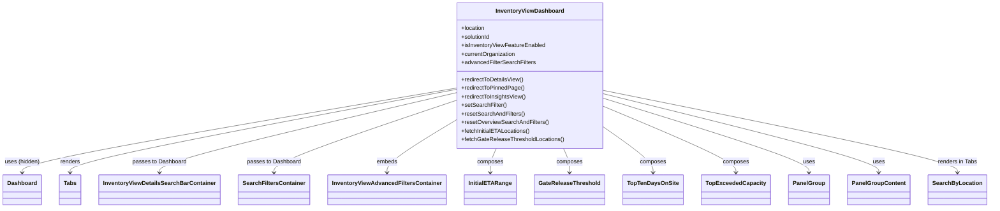

# Diagram: web/portal/src/pages/inventoryview/dashboard/InventoryView.Dashboard.page.js


> Auto-generated by Obscura crawlers

## Diagram 1



### SVG

<svg id="container" width="2654.015625" xmlns="http://www.w3.org/2000/svg" class="classDiagram" height="582" viewBox="0 0 2654.015625 582" role="graphics-document document" aria-roledescription="class"><style>#container{font-family:"trebuchet ms",verdana,arial,sans-serif;font-size:16px;fill:#333;}@keyframes edge-animation-frame{from{stroke-dashoffset:0;}}@keyframes dash{to{stroke-dashoffset:0;}}#container .edge-animation-slow{stroke-dasharray:9,5!important;stroke-dashoffset:900;animation:dash 50s linear infinite;stroke-linecap:round;}#container .edge-animation-fast{stroke-dasharray:9,5!important;stroke-dashoffset:900;animation:dash 20s linear infinite;stroke-linecap:round;}#container .error-icon{fill:#552222;}#container .error-text{fill:#552222;stroke:#552222;}#container .edge-thickness-normal{stroke-width:1px;}#container .edge-thickness-thick{stroke-width:3.5px;}#container .edge-pattern-solid{stroke-dasharray:0;}#container .edge-thickness-invisible{stroke-width:0;fill:none;}#container .edge-pattern-dashed{stroke-dasharray:3;}#container .edge-pattern-dotted{stroke-dasharray:2;}#container .marker{fill:#333333;stroke:#333333;}#container .marker.cross{stroke:#333333;}#container svg{font-family:"trebuchet ms",verdana,arial,sans-serif;font-size:16px;}#container p{margin:0;}#container g.classGroup text{fill:#9370DB;stroke:none;font-family:"trebuchet ms",verdana,arial,sans-serif;font-size:10px;}#container g.classGroup text .title{font-weight:bolder;}#container .nodeLabel,#container .edgeLabel{color:#131300;}#container .edgeLabel .label rect{fill:#ECECFF;}#container .label text{fill:#131300;}#container .labelBkg{background:#ECECFF;}#container .edgeLabel .label span{background:#ECECFF;}#container .classTitle{font-weight:bolder;}#container .node rect,#container .node circle,#container .node ellipse,#container .node polygon,#container .node path{fill:#ECECFF;stroke:#9370DB;stroke-width:1px;}#container .divider{stroke:#9370DB;stroke-width:1;}#container g.clickable{cursor:pointer;}#container g.classGroup rect{fill:#ECECFF;stroke:#9370DB;}#container g.classGroup line{stroke:#9370DB;stroke-width:1;}#container .classLabel .box{stroke:none;stroke-width:0;fill:#ECECFF;opacity:0.5;}#container .classLabel .label{fill:#9370DB;font-size:10px;}#container .relation{stroke:#333333;stroke-width:1;fill:none;}#container .dashed-line{stroke-dasharray:3;}#container .dotted-line{stroke-dasharray:1 2;}#container #compositionStart,#container .composition{fill:#333333!important;stroke:#333333!important;stroke-width:1;}#container #compositionEnd,#container .composition{fill:#333333!important;stroke:#333333!important;stroke-width:1;}#container #dependencyStart,#container .dependency{fill:#333333!important;stroke:#333333!important;stroke-width:1;}#container #dependencyStart,#container .dependency{fill:#333333!important;stroke:#333333!important;stroke-width:1;}#container #extensionStart,#container .extension{fill:transparent!important;stroke:#333333!important;stroke-width:1;}#container #extensionEnd,#container .extension{fill:transparent!important;stroke:#333333!important;stroke-width:1;}#container #aggregationStart,#container .aggregation{fill:transparent!important;stroke:#333333!important;stroke-width:1;}#container #aggregationEnd,#container .aggregation{fill:transparent!important;stroke:#333333!important;stroke-width:1;}#container #lollipopStart,#container .lollipop{fill:#ECECFF!important;stroke:#333333!important;stroke-width:1;}#container #lollipopEnd,#container .lollipop{fill:#ECECFF!important;stroke:#333333!important;stroke-width:1;}#container .edgeTerminals{font-size:11px;line-height:initial;}#container .classTitleText{text-anchor:middle;font-size:18px;fill:#333;}#container .label-icon{display:inline-block;height:1em;overflow:visible;vertical-align:-0.125em;}#container .node .label-icon path{fill:currentColor;stroke:revert;stroke-width:revert;}#container :root{--mermaid-font-family:"trebuchet ms",verdana,arial,sans-serif;}</style><g><defs><marker id="container_class-aggregationStart" class="marker aggregation class" refX="18" refY="7" markerWidth="190" markerHeight="240" orient="auto"><path d="M 18,7 L9,13 L1,7 L9,1 Z"></path></marker></defs><defs><marker id="container_class-aggregationEnd" class="marker aggregation class" refX="1" refY="7" markerWidth="20" markerHeight="28" orient="auto"><path d="M 18,7 L9,13 L1,7 L9,1 Z"></path></marker></defs><defs><marker id="container_class-extensionStart" class="marker extension class" refX="18" refY="7" markerWidth="190" markerHeight="240" orient="auto"><path d="M 1,7 L18,13 V 1 Z"></path></marker></defs><defs><marker id="container_class-extensionEnd" class="marker extension class" refX="1" refY="7" markerWidth="20" markerHeight="28" orient="auto"><path d="M 1,1 V 13 L18,7 Z"></path></marker></defs><defs><marker id="container_class-compositionStart" class="marker composition class" refX="18" refY="7" markerWidth="190" markerHeight="240" orient="auto"><path d="M 18,7 L9,13 L1,7 L9,1 Z"></path></marker></defs><defs><marker id="container_class-compositionEnd" class="marker composition class" refX="1" refY="7" markerWidth="20" markerHeight="28" orient="auto"><path d="M 18,7 L9,13 L1,7 L9,1 Z"></path></marker></defs><defs><marker id="container_class-dependencyStart" class="marker dependency class" refX="6" refY="7" markerWidth="190" markerHeight="240" orient="auto"><path d="M 5,7 L9,13 L1,7 L9,1 Z"></path></marker></defs><defs><marker id="container_class-dependencyEnd" class="marker dependency class" refX="13" refY="7" markerWidth="20" markerHeight="28" orient="auto"><path d="M 18,7 L9,13 L14,7 L9,1 Z"></path></marker></defs><defs><marker id="container_class-lollipopStart" class="marker lollipop class" refX="13" refY="7" markerWidth="190" markerHeight="240" orient="auto"><circle stroke="black" fill="transparent" cx="7" cy="7" r="6"></circle></marker></defs><defs><marker id="container_class-lollipopEnd" class="marker lollipop class" refX="1" refY="7" markerWidth="190" markerHeight="240" orient="auto"><circle stroke="black" fill="transparent" cx="7" cy="7" r="6"></circle></marker></defs><g class="root"><g class="clusters"></g><g class="edgePaths"><path d="M1223.41,247.439L1029.415,281.699C835.419,315.959,447.428,384.48,253.433,423.907C59.438,463.333,59.438,473.667,59.438,478.833L59.438,484" id="id_InventoryViewDashboard_Dashboard_1" class="edge-thickness-normal edge-pattern-solid relation" style=";;;" data-edge="true" data-et="edge" data-id="id_InventoryViewDashboard_Dashboard_1" data-points="W3sieCI6MTIyMy40MTAxNTYyNSwieSI6MjQ3LjQzOTIwODM1NjExMzh9LHsieCI6NTkuNDM3NSwieSI6NDUzfSx7IngiOjU5LjQzNzUsInkiOjQ5MH1d" marker-end="url(#container_class-dependencyEnd)"></path><path d="M1223.41,251.183L1051.145,284.819C878.88,318.455,534.35,385.728,362.085,424.53C189.82,463.333,189.82,473.667,189.82,478.833L189.82,484" id="id_InventoryViewDashboard_Tabs_2" class="edge-thickness-normal edge-pattern-solid relation" style=";;;" data-edge="true" data-et="edge" data-id="id_InventoryViewDashboard_Tabs_2" data-points="W3sieCI6MTIyMy40MTAxNTYyNSwieSI6MjUxLjE4Mjg3NDM3NzcxMTg3fSx7IngiOjE4OS44MjAzMTI1LCJ5Ijo0NTN9LHsieCI6MTg5LjgyMDMxMjUsInkiOjQ5MH1d" marker-end="url(#container_class-dependencyEnd)"></path><path d="M1223.41,260.713L1091.389,292.761C959.367,324.808,695.324,388.904,563.303,426.119C431.281,463.333,431.281,473.667,431.281,478.833L431.281,484" id="id_InventoryViewDashboard_InventoryViewDetailsSearchBarContainer_3" class="edge-thickness-normal edge-pattern-solid relation" style=";;;" data-edge="true" data-et="edge" data-id="id_InventoryViewDashboard_InventoryViewDetailsSearchBarContainer_3" data-points="W3sieCI6MTIyMy40MTAxNTYyNSwieSI6MjYwLjcxMjYxNDY0MzcwNDQ2fSx7IngiOjQzMS4yODEyNSwieSI6NDUzfSx7IngiOjQzMS4yODEyNSwieSI6NDkwfV0=" marker-end="url(#container_class-dependencyEnd)"></path><path d="M1223.41,282.566L1142.632,310.972C1061.854,339.378,900.298,396.189,819.52,429.761C738.742,463.333,738.742,473.667,738.742,478.833L738.742,484" id="id_InventoryViewDashboard_SearchFiltersContainer_4" class="edge-thickness-normal edge-pattern-solid relation" style=";;;" data-edge="true" data-et="edge" data-id="id_InventoryViewDashboard_SearchFiltersContainer_4" data-points="W3sieCI6MTIyMy40MTAxNTYyNSwieSI6MjgyLjU2NjMzNjI3MjQ5MjU1fSx7IngiOjczOC43NDIxODc1LCJ5Ijo0NTN9LHsieCI6NzM4Ljc0MjE4NzUsInkiOjQ5MH1d" marker-end="url(#container_class-dependencyEnd)"></path><path d="M1223.41,338.389L1193.081,357.491C1162.753,376.592,1102.095,414.796,1071.766,439.065C1041.438,463.333,1041.438,473.667,1041.438,478.833L1041.438,484" id="id_InventoryViewDashboard_InventoryViewAdvancedFiltersContainer_5" class="edge-thickness-normal edge-pattern-solid relation" style=";;;" data-edge="true" data-et="edge" data-id="id_InventoryViewDashboard_InventoryViewAdvancedFiltersContainer_5" data-points="W3sieCI6MTIyMy40MTAxNTYyNSwieSI6MzM4LjM4ODYzOTkxMzQzMTR9LHsieCI6MTA0MS40Mzc1LCJ5Ijo0NTN9LHsieCI6MTA0MS40Mzc1LCJ5Ijo0OTB9XQ==" marker-end="url(#container_class-dependencyEnd)"></path><path d="M1334.101,416L1331.381,422.167C1328.661,428.333,1323.221,440.667,1320.501,452C1317.781,463.333,1317.781,473.667,1317.781,478.833L1317.781,484" id="id_InventoryViewDashboard_InitialETARange_6" class="edge-thickness-normal edge-pattern-solid relation" style=";;;" data-edge="true" data-et="edge" data-id="id_InventoryViewDashboard_InitialETARange_6" data-points="W3sieCI6MTMzNC4xMDEyODY5NTUzOTQyLCJ5Ijo0MTZ9LHsieCI6MTMxNy43ODEyNSwieSI6NDUzfSx7IngiOjEzMTcuNzgxMjUsInkiOjQ5MH1d" marker-end="url(#container_class-dependencyEnd)"></path><path d="M1514.063,416L1516.783,422.167C1519.503,428.333,1524.943,440.667,1527.663,452C1530.383,463.333,1530.383,473.667,1530.383,478.833L1530.383,484" id="id_InventoryViewDashboard_GateReleaseThreshold_7" class="edge-thickness-normal edge-pattern-solid relation" style=";;;" data-edge="true" data-et="edge" data-id="id_InventoryViewDashboard_GateReleaseThreshold_7" data-points="W3sieCI6MTUxNC4wNjI3NzU1NDQ2MDU4LCJ5Ijo0MTZ9LHsieCI6MTUzMC4zODI4MTI1LCJ5Ijo0NTN9LHsieCI6MTUzMC4zODI4MTI1LCJ5Ijo0OTB9XQ==" marker-end="url(#container_class-dependencyEnd)"></path><path d="M1624.754,358.456L1646.344,374.213C1667.935,389.971,1711.116,421.485,1732.706,442.409C1754.297,463.333,1754.297,473.667,1754.297,478.833L1754.297,484" id="id_InventoryViewDashboard_TopTenDaysOnSite_8" class="edge-thickness-normal edge-pattern-solid relation" style=";;;" data-edge="true" data-et="edge" data-id="id_InventoryViewDashboard_TopTenDaysOnSite_8" data-points="W3sieCI6MTYyNC43NTM5MDYyNSwieSI6MzU4LjQ1NTkyOTQ5NjY1ODJ9LHsieCI6MTc1NC4yOTY4NzUsInkiOjQ1M30seyJ4IjoxNzU0LjI5Njg3NSwieSI6NDkwfV0=" marker-end="url(#container_class-dependencyEnd)"></path><path d="M1624.754,299.702L1683.214,325.252C1741.674,350.801,1858.595,401.901,1917.055,432.617C1975.516,463.333,1975.516,473.667,1975.516,478.833L1975.516,484" id="id_InventoryViewDashboard_TopExceededCapacity_9" class="edge-thickness-normal edge-pattern-solid relation" style=";;;" data-edge="true" data-et="edge" data-id="id_InventoryViewDashboard_TopExceededCapacity_9" data-points="W3sieCI6MTYyNC43NTM5MDYyNSwieSI6Mjk5LjcwMjE2ODM1Mzc5Mzc1fSx7IngiOjE5NzUuNTE1NjI1LCJ5Ijo0NTN9LHsieCI6MTk3NS41MTU2MjUsInkiOjQ5MH1d" marker-end="url(#container_class-dependencyEnd)"></path><path d="M1624.754,276.735L1715.821,306.113C1806.888,335.49,1989.022,394.245,2080.089,428.789C2171.156,463.333,2171.156,473.667,2171.156,478.833L2171.156,484" id="id_InventoryViewDashboard_PanelGroup_10" class="edge-thickness-normal edge-pattern-solid relation" style=";;;" data-edge="true" data-et="edge" data-id="id_InventoryViewDashboard_PanelGroup_10" data-points="W3sieCI6MTYyNC43NTM5MDYyNSwieSI6Mjc2LjczNTA5NjgwOTk1MTN9LHsieCI6MjE3MS4xNTYyNSwieSI6NDUzfSx7IngiOjIxNzEuMTU2MjUsInkiOjQ5MH1d" marker-end="url(#container_class-dependencyEnd)"></path><path d="M1624.754,263.75L1747.063,295.292C1869.372,326.833,2113.991,389.917,2236.3,426.625C2358.609,463.333,2358.609,473.667,2358.609,478.833L2358.609,484" id="id_InventoryViewDashboard_PanelGroupContent_11" class="edge-thickness-normal edge-pattern-solid relation" style=";;;" data-edge="true" data-et="edge" data-id="id_InventoryViewDashboard_PanelGroupContent_11" data-points="W3sieCI6MTYyNC43NTM5MDYyNSwieSI6MjYzLjc1MDE0MTA3MjMxNjh9LHsieCI6MjM1OC42MDkzNzUsInkiOjQ1M30seyJ4IjoyMzU4LjYwOTM3NSwieSI6NDkwfV0=" marker-end="url(#container_class-dependencyEnd)"></path><path d="M1624.754,254.245L1782.107,287.371C1939.461,320.497,2254.168,386.748,2411.521,425.041C2568.875,463.333,2568.875,473.667,2568.875,478.833L2568.875,484" id="id_InventoryViewDashboard_SearchByLocation_12" class="edge-thickness-normal edge-pattern-solid relation" style=";;;" data-edge="true" data-et="edge" data-id="id_InventoryViewDashboard_SearchByLocation_12" data-points="W3sieCI6MTYyNC43NTM5MDYyNSwieSI6MjU0LjI0NTEyNDgzNDkzNTM1fSx7IngiOjI1NjguODc1LCJ5Ijo0NTN9LHsieCI6MjU2OC44NzUsInkiOjQ5MH1d" marker-end="url(#container_class-dependencyEnd)"></path></g><g class="edgeLabels"><g class="edgeLabel" transform="translate(59.4375, 453)"><g class="label" data-id="id_InventoryViewDashboard_Dashboard_1" transform="translate(-49.359375, -12)"><foreignObject width="98.71875" height="24"><div xmlns="http://www.w3.org/1999/xhtml" class="labelBkg" style="display: table-cell; white-space: nowrap; line-height: 1.5; max-width: 200px; text-align: center;"><span class="edgeLabel"><p>uses (hidden)</p></span></div></foreignObject></g></g><g class="edgeLabel" transform="translate(189.8203125, 453)"><g class="label" data-id="id_InventoryViewDashboard_Tabs_2" transform="translate(-27.75, -12)"><foreignObject width="55.5" height="24"><div xmlns="http://www.w3.org/1999/xhtml" class="labelBkg" style="display: table-cell; white-space: nowrap; line-height: 1.5; max-width: 200px; text-align: center;"><span class="edgeLabel"><p>renders</p></span></div></foreignObject></g></g><g class="edgeLabel" transform="translate(431.28125, 453)"><g class="label" data-id="id_InventoryViewDashboard_InventoryViewDetailsSearchBarContainer_3" transform="translate(-75.2109375, -12)"><foreignObject width="150.421875" height="24"><div xmlns="http://www.w3.org/1999/xhtml" class="labelBkg" style="display: table-cell; white-space: nowrap; line-height: 1.5; max-width: 200px; text-align: center;"><span class="edgeLabel"><p>passes to Dashboard</p></span></div></foreignObject></g></g><g class="edgeLabel" transform="translate(738.7421875, 453)"><g class="label" data-id="id_InventoryViewDashboard_SearchFiltersContainer_4" transform="translate(-75.2109375, -12)"><foreignObject width="150.421875" height="24"><div xmlns="http://www.w3.org/1999/xhtml" class="labelBkg" style="display: table-cell; white-space: nowrap; line-height: 1.5; max-width: 200px; text-align: center;"><span class="edgeLabel"><p>passes to Dashboard</p></span></div></foreignObject></g></g><g class="edgeLabel" transform="translate(1041.4375, 453)"><g class="label" data-id="id_InventoryViewDashboard_InventoryViewAdvancedFiltersContainer_5" transform="translate(-28.8515625, -12)"><foreignObject width="57.703125" height="24"><div xmlns="http://www.w3.org/1999/xhtml" class="labelBkg" style="display: table-cell; white-space: nowrap; line-height: 1.5; max-width: 200px; text-align: center;"><span class="edgeLabel"><p>embeds</p></span></div></foreignObject></g></g><g class="edgeLabel" transform="translate(1317.78125, 453)"><g class="label" data-id="id_InventoryViewDashboard_InitialETARange_6" transform="translate(-36.453125, -12)"><foreignObject width="72.90625" height="24"><div xmlns="http://www.w3.org/1999/xhtml" class="labelBkg" style="display: table-cell; white-space: nowrap; line-height: 1.5; max-width: 200px; text-align: center;"><span class="edgeLabel"><p>composes</p></span></div></foreignObject></g></g><g class="edgeLabel" transform="translate(1530.3828125, 453)"><g class="label" data-id="id_InventoryViewDashboard_GateReleaseThreshold_7" transform="translate(-36.453125, -12)"><foreignObject width="72.90625" height="24"><div xmlns="http://www.w3.org/1999/xhtml" class="labelBkg" style="display: table-cell; white-space: nowrap; line-height: 1.5; max-width: 200px; text-align: center;"><span class="edgeLabel"><p>composes</p></span></div></foreignObject></g></g><g class="edgeLabel" transform="translate(1754.296875, 453)"><g class="label" data-id="id_InventoryViewDashboard_TopTenDaysOnSite_8" transform="translate(-36.453125, -12)"><foreignObject width="72.90625" height="24"><div xmlns="http://www.w3.org/1999/xhtml" class="labelBkg" style="display: table-cell; white-space: nowrap; line-height: 1.5; max-width: 200px; text-align: center;"><span class="edgeLabel"><p>composes</p></span></div></foreignObject></g></g><g class="edgeLabel" transform="translate(1975.515625, 453)"><g class="label" data-id="id_InventoryViewDashboard_TopExceededCapacity_9" transform="translate(-36.453125, -12)"><foreignObject width="72.90625" height="24"><div xmlns="http://www.w3.org/1999/xhtml" class="labelBkg" style="display: table-cell; white-space: nowrap; line-height: 1.5; max-width: 200px; text-align: center;"><span class="edgeLabel"><p>composes</p></span></div></foreignObject></g></g><g class="edgeLabel" transform="translate(2171.15625, 453)"><g class="label" data-id="id_InventoryViewDashboard_PanelGroup_10" transform="translate(-16.4921875, -12)"><foreignObject width="32.984375" height="24"><div xmlns="http://www.w3.org/1999/xhtml" class="labelBkg" style="display: table-cell; white-space: nowrap; line-height: 1.5; max-width: 200px; text-align: center;"><span class="edgeLabel"><p>uses</p></span></div></foreignObject></g></g><g class="edgeLabel" transform="translate(2358.609375, 453)"><g class="label" data-id="id_InventoryViewDashboard_PanelGroupContent_11" transform="translate(-16.4921875, -12)"><foreignObject width="32.984375" height="24"><div xmlns="http://www.w3.org/1999/xhtml" class="labelBkg" style="display: table-cell; white-space: nowrap; line-height: 1.5; max-width: 200px; text-align: center;"><span class="edgeLabel"><p>uses</p></span></div></foreignObject></g></g><g class="edgeLabel" transform="translate(2568.875, 453)"><g class="label" data-id="id_InventoryViewDashboard_SearchByLocation_12" transform="translate(-55.5078125, -12)"><foreignObject width="111.015625" height="24"><div xmlns="http://www.w3.org/1999/xhtml" class="labelBkg" style="display: table-cell; white-space: nowrap; line-height: 1.5; max-width: 200px; text-align: center;"><span class="edgeLabel"><p>renders in Tabs</p></span></div></foreignObject></g></g></g><g class="nodes"><g class="node default" id="classId-InventoryViewDashboard-0" transform="translate(1424.08203125, 212)"><g class="basic label-container"><path d="M-200.671875 -204 L200.671875 -204 L200.671875 204 L-200.671875 204" stroke="none" stroke-width="0" fill="#ECECFF" style=""></path><path d="M-200.671875 -204 C-118.5444849452987 -204, -36.41709489059741 -204, 200.671875 -204 M-200.671875 -204 C-78.1343126691079 -204, 44.4032496617842 -204, 200.671875 -204 M200.671875 -204 C200.671875 -72.77984841701718, 200.671875 58.440303165965645, 200.671875 204 M200.671875 -204 C200.671875 -109.74987603008327, 200.671875 -15.499752060166543, 200.671875 204 M200.671875 204 C72.92581016245587 204, -54.82025467508825 204, -200.671875 204 M200.671875 204 C105.88069220815113 204, 11.089509416302263 204, -200.671875 204 M-200.671875 204 C-200.671875 83.88013208743212, -200.671875 -36.23973582513577, -200.671875 -204 M-200.671875 204 C-200.671875 97.0815206361527, -200.671875 -9.836958727694594, -200.671875 -204" stroke="#9370DB" stroke-width="1.3" fill="none" stroke-dasharray="0 0" style=""></path></g><g class="annotation-group text" transform="translate(0, -180)"></g><g class="label-group text" transform="translate(-91.609375, -180)"><g class="label" style="font-weight: bolder" transform="translate(0,-12)"><foreignObject width="183.21875" height="24"><div xmlns="http://www.w3.org/1999/xhtml" style="display: table-cell; white-space: nowrap; line-height: 1.5; max-width: 231px; text-align: center;"><span class="nodeLabel markdown-node-label" style=""><p>InventoryViewDashboard</p></span></div></foreignObject></g></g><g class="members-group text" transform="translate(-188.671875, -132)"><g class="label" style="" transform="translate(0,-12)"><foreignObject width="67.140625" height="24"><div xmlns="http://www.w3.org/1999/xhtml" style="display: table-cell; white-space: nowrap; line-height: 1.5; max-width: 125px; text-align: center;"><span class="nodeLabel markdown-node-label" style=""><p>+location</p></span></div></foreignObject></g><g class="label" style="" transform="translate(0,12)"><foreignObject width="82.109375" height="24"><div xmlns="http://www.w3.org/1999/xhtml" style="display: table-cell; white-space: nowrap; line-height: 1.5; max-width: 139px; text-align: center;"><span class="nodeLabel markdown-node-label" style=""><p>+solutionId</p></span></div></foreignObject></g><g class="label" style="" transform="translate(0,36)"><foreignObject width="235.34375" height="24"><div xmlns="http://www.w3.org/1999/xhtml" style="display: table-cell; white-space: nowrap; line-height: 1.5; max-width: 293px; text-align: center;"><span class="nodeLabel markdown-node-label" style=""><p>+isInventoryViewFeatureEnabled</p></span></div></foreignObject></g><g class="label" style="" transform="translate(0,60)"><foreignObject width="152.609375" height="24"><div xmlns="http://www.w3.org/1999/xhtml" style="display: table-cell; white-space: nowrap; line-height: 1.5; max-width: 210px; text-align: center;"><span class="nodeLabel markdown-node-label" style=""><p>+currentOrganization</p></span></div></foreignObject></g><g class="label" style="" transform="translate(0,84)"><foreignObject width="207.125" height="24"><div xmlns="http://www.w3.org/1999/xhtml" style="display: table-cell; white-space: nowrap; line-height: 1.5; max-width: 264px; text-align: center;"><span class="nodeLabel markdown-node-label" style=""><p>+advancedFilterSearchFilters</p></span></div></foreignObject></g></g><g class="methods-group text" transform="translate(-188.671875, 12)"><g class="label" style="" transform="translate(0,-12)"><foreignObject width="175.09375" height="24"><div xmlns="http://www.w3.org/1999/xhtml" style="display: table-cell; white-space: nowrap; line-height: 1.5; max-width: 232px; text-align: center;"><span class="nodeLabel markdown-node-label" style=""><p>+redirectToDetailsView()</p></span></div></foreignObject></g><g class="label" style="" transform="translate(0,12)"><foreignObject width="176.03125" height="24"><div xmlns="http://www.w3.org/1999/xhtml" style="display: table-cell; white-space: nowrap; line-height: 1.5; max-width: 233px; text-align: center;"><span class="nodeLabel markdown-node-label" style=""><p>+redirectToPinnedPage()</p></span></div></foreignObject></g><g class="label" style="" transform="translate(0,36)"><foreignObject width="182.0625" height="24"><div xmlns="http://www.w3.org/1999/xhtml" style="display: table-cell; white-space: nowrap; line-height: 1.5; max-width: 239px; text-align: center;"><span class="nodeLabel markdown-node-label" style=""><p>+redirectToInsightsView()</p></span></div></foreignObject></g><g class="label" style="" transform="translate(0,60)"><foreignObject width="125.953125" height="24"><div xmlns="http://www.w3.org/1999/xhtml" style="display: table-cell; white-space: nowrap; line-height: 1.5; max-width: 183px; text-align: center;"><span class="nodeLabel markdown-node-label" style=""><p>+setSearchFilter()</p></span></div></foreignObject></g><g class="label" style="" transform="translate(0,84)"><foreignObject width="175.71875" height="24"><div xmlns="http://www.w3.org/1999/xhtml" style="display: table-cell; white-space: nowrap; line-height: 1.5; max-width: 233px; text-align: center;"><span class="nodeLabel markdown-node-label" style=""><p>+resetSearchAndFilters()</p></span></div></foreignObject></g><g class="label" style="" transform="translate(0,108)"><foreignObject width="242.078125" height="24"><div xmlns="http://www.w3.org/1999/xhtml" style="display: table-cell; white-space: nowrap; line-height: 1.5; max-width: 299px; text-align: center;"><span class="nodeLabel markdown-node-label" style=""><p>+resetOverviewSearchAndFilters()</p></span></div></foreignObject></g><g class="label" style="" transform="translate(0,132)"><foreignObject width="191.515625" height="24"><div xmlns="http://www.w3.org/1999/xhtml" style="display: table-cell; white-space: nowrap; line-height: 1.5; max-width: 249px; text-align: center;"><span class="nodeLabel markdown-node-label" style=""><p>+fetchInitialETALocations()</p></span></div></foreignObject></g><g class="label" style="" transform="translate(0,156)"><foreignObject width="285.734375" height="24"><div xmlns="http://www.w3.org/1999/xhtml" style="display: table-cell; white-space: nowrap; line-height: 1.5; max-width: 343px; text-align: center;"><span class="nodeLabel markdown-node-label" style=""><p>+fetchGateReleaseThresholdLocations()</p></span></div></foreignObject></g></g><g class="divider" style=""><path d="M-200.671875 -156 C-112.14952301868324 -156, -23.62717103736648 -156, 200.671875 -156 M-200.671875 -156 C-74.79567450065555 -156, 51.0805259986889 -156, 200.671875 -156" stroke="#9370DB" stroke-width="1.3" fill="none" stroke-dasharray="0 0" style=""></path></g><g class="divider" style=""><path d="M-200.671875 -12 C-100.70938279257177 -12, -0.7468905851435466 -12, 200.671875 -12 M-200.671875 -12 C-87.83314063518581 -12, 25.005593729628373 -12, 200.671875 -12" stroke="#9370DB" stroke-width="1.3" fill="none" stroke-dasharray="0 0" style=""></path></g></g><g class="node default" id="classId-Dashboard-1" transform="translate(59.4375, 532)"><g class="basic label-container"><path d="M-51.4375 -42 L51.4375 -42 L51.4375 42 L-51.4375 42" stroke="none" stroke-width="0" fill="#ECECFF" style=""></path><path d="M-51.4375 -42 C-11.436107254943245 -42, 28.56528549011351 -42, 51.4375 -42 M-51.4375 -42 C-24.32209275456972 -42, 2.79331449086056 -42, 51.4375 -42 M51.4375 -42 C51.4375 -23.440657513087068, 51.4375 -4.881315026174136, 51.4375 42 M51.4375 -42 C51.4375 -9.959603097727275, 51.4375 22.08079380454545, 51.4375 42 M51.4375 42 C10.799014898824893 42, -29.839470202350213 42, -51.4375 42 M51.4375 42 C22.63887897958926 42, -6.159742040821477 42, -51.4375 42 M-51.4375 42 C-51.4375 14.615014619925336, -51.4375 -12.769970760149327, -51.4375 -42 M-51.4375 42 C-51.4375 15.78177938009041, -51.4375 -10.436441239819182, -51.4375 -42" stroke="#9370DB" stroke-width="1.3" fill="none" stroke-dasharray="0 0" style=""></path></g><g class="annotation-group text" transform="translate(0, -18)"></g><g class="label-group text" transform="translate(-39.4375, -18)"><g class="label" style="font-weight: bolder" transform="translate(0,-12)"><foreignObject width="78.875" height="24"><div xmlns="http://www.w3.org/1999/xhtml" style="display: table-cell; white-space: nowrap; line-height: 1.5; max-width: 128px; text-align: center;"><span class="nodeLabel markdown-node-label" style=""><p>Dashboard</p></span></div></foreignObject></g></g><g class="members-group text" transform="translate(-39.4375, 30)"></g><g class="methods-group text" transform="translate(-39.4375, 60)"></g><g class="divider" style=""><path d="M-51.4375 6 C-19.74144736232864 6, 11.954605275342722 6, 51.4375 6 M-51.4375 6 C-11.125471928741781 6, 29.186556142516437 6, 51.4375 6" stroke="#9370DB" stroke-width="1.3" fill="none" stroke-dasharray="0 0" style=""></path></g><g class="divider" style=""><path d="M-51.4375 24 C-12.706063894072976 24, 26.025372211854048 24, 51.4375 24 M-51.4375 24 C-24.370838436815795 24, 2.69582312636841 24, 51.4375 24" stroke="#9370DB" stroke-width="1.3" fill="none" stroke-dasharray="0 0" style=""></path></g></g><g class="node default" id="classId-Tabs-2" transform="translate(189.8203125, 532)"><g class="basic label-container"><path d="M-28.9453125 -42 L28.9453125 -42 L28.9453125 42 L-28.9453125 42" stroke="none" stroke-width="0" fill="#ECECFF" style=""></path><path d="M-28.9453125 -42 C-8.246974680987599 -42, 12.451363138024803 -42, 28.9453125 -42 M-28.9453125 -42 C-9.257992988271145 -42, 10.42932652345771 -42, 28.9453125 -42 M28.9453125 -42 C28.9453125 -18.825980935750522, 28.9453125 4.348038128498956, 28.9453125 42 M28.9453125 -42 C28.9453125 -14.554801254973729, 28.9453125 12.890397490052543, 28.9453125 42 M28.9453125 42 C17.02056361089334 42, 5.095814721786677 42, -28.9453125 42 M28.9453125 42 C6.40688158279556 42, -16.13154933440888 42, -28.9453125 42 M-28.9453125 42 C-28.9453125 24.892141332165515, -28.9453125 7.78428266433103, -28.9453125 -42 M-28.9453125 42 C-28.9453125 14.975801907463254, -28.9453125 -12.048396185073493, -28.9453125 -42" stroke="#9370DB" stroke-width="1.3" fill="none" stroke-dasharray="0 0" style=""></path></g><g class="annotation-group text" transform="translate(0, -18)"></g><g class="label-group text" transform="translate(-16.9453125, -18)"><g class="label" style="font-weight: bolder" transform="translate(0,-12)"><foreignObject width="33.890625" height="24"><div xmlns="http://www.w3.org/1999/xhtml" style="display: table-cell; white-space: nowrap; line-height: 1.5; max-width: 83px; text-align: center;"><span class="nodeLabel markdown-node-label" style=""><p>Tabs</p></span></div></foreignObject></g></g><g class="members-group text" transform="translate(-16.9453125, 30)"></g><g class="methods-group text" transform="translate(-16.9453125, 60)"></g><g class="divider" style=""><path d="M-28.9453125 6 C-8.810306000176038 6, 11.324700499647925 6, 28.9453125 6 M-28.9453125 6 C-10.19518403587892 6, 8.554944428242159 6, 28.9453125 6" stroke="#9370DB" stroke-width="1.3" fill="none" stroke-dasharray="0 0" style=""></path></g><g class="divider" style=""><path d="M-28.9453125 24 C-6.8941445391810205 24, 15.157023421637959 24, 28.9453125 24 M-28.9453125 24 C-17.329365620713396 24, -5.713418741426796 24, 28.9453125 24" stroke="#9370DB" stroke-width="1.3" fill="none" stroke-dasharray="0 0" style=""></path></g></g><g class="node default" id="classId-InitialETARange-3" transform="translate(1317.78125, 532)"><g class="basic label-container"><path d="M-68.59375 -42 L68.59375 -42 L68.59375 42 L-68.59375 42" stroke="none" stroke-width="0" fill="#ECECFF" style=""></path><path d="M-68.59375 -42 C-17.355252040339558 -42, 33.883245919320885 -42, 68.59375 -42 M-68.59375 -42 C-40.89841330863026 -42, -13.203076617260521 -42, 68.59375 -42 M68.59375 -42 C68.59375 -11.416303767218306, 68.59375 19.16739246556339, 68.59375 42 M68.59375 -42 C68.59375 -14.03586748377029, 68.59375 13.928265032459421, 68.59375 42 M68.59375 42 C24.93968699915817 42, -18.71437600168366 42, -68.59375 42 M68.59375 42 C31.03241528777474 42, -6.528919424450521 42, -68.59375 42 M-68.59375 42 C-68.59375 19.691005555848704, -68.59375 -2.617988888302591, -68.59375 -42 M-68.59375 42 C-68.59375 19.274399448045063, -68.59375 -3.451201103909874, -68.59375 -42" stroke="#9370DB" stroke-width="1.3" fill="none" stroke-dasharray="0 0" style=""></path></g><g class="annotation-group text" transform="translate(0, -18)"></g><g class="label-group text" transform="translate(-56.59375, -18)"><g class="label" style="font-weight: bolder" transform="translate(0,-12)"><foreignObject width="113.1875" height="24"><div xmlns="http://www.w3.org/1999/xhtml" style="display: table-cell; white-space: nowrap; line-height: 1.5; max-width: 162px; text-align: center;"><span class="nodeLabel markdown-node-label" style=""><p>InitialETARange</p></span></div></foreignObject></g></g><g class="members-group text" transform="translate(-56.59375, 30)"></g><g class="methods-group text" transform="translate(-56.59375, 60)"></g><g class="divider" style=""><path d="M-68.59375 6 C-34.34804951554174 6, -0.10234903108347737 6, 68.59375 6 M-68.59375 6 C-16.536453645358357 6, 35.520842709283286 6, 68.59375 6" stroke="#9370DB" stroke-width="1.3" fill="none" stroke-dasharray="0 0" style=""></path></g><g class="divider" style=""><path d="M-68.59375 24 C-22.723333723983608 24, 23.147082552032785 24, 68.59375 24 M-68.59375 24 C-30.73799067043643 24, 7.117768659127137 24, 68.59375 24" stroke="#9370DB" stroke-width="1.3" fill="none" stroke-dasharray="0 0" style=""></path></g></g><g class="node default" id="classId-GateReleaseThreshold-4" transform="translate(1530.3828125, 532)"><g class="basic label-container"><path d="M-94.0078125 -42 L94.0078125 -42 L94.0078125 42 L-94.0078125 42" stroke="none" stroke-width="0" fill="#ECECFF" style=""></path><path d="M-94.0078125 -42 C-39.43406225792927 -42, 15.13968798414146 -42, 94.0078125 -42 M-94.0078125 -42 C-30.124777391597206 -42, 33.75825771680559 -42, 94.0078125 -42 M94.0078125 -42 C94.0078125 -9.633968355582361, 94.0078125 22.732063288835278, 94.0078125 42 M94.0078125 -42 C94.0078125 -24.812632365702953, 94.0078125 -7.625264731405906, 94.0078125 42 M94.0078125 42 C27.638750152203215 42, -38.73031219559357 42, -94.0078125 42 M94.0078125 42 C27.397535210340124 42, -39.21274207931975 42, -94.0078125 42 M-94.0078125 42 C-94.0078125 23.182306239937365, -94.0078125 4.3646124798747294, -94.0078125 -42 M-94.0078125 42 C-94.0078125 13.615256156002491, -94.0078125 -14.769487687995017, -94.0078125 -42" stroke="#9370DB" stroke-width="1.3" fill="none" stroke-dasharray="0 0" style=""></path></g><g class="annotation-group text" transform="translate(0, -18)"></g><g class="label-group text" transform="translate(-82.0078125, -18)"><g class="label" style="font-weight: bolder" transform="translate(0,-12)"><foreignObject width="164.015625" height="24"><div xmlns="http://www.w3.org/1999/xhtml" style="display: table-cell; white-space: nowrap; line-height: 1.5; max-width: 212px; text-align: center;"><span class="nodeLabel markdown-node-label" style=""><p>GateReleaseThreshold</p></span></div></foreignObject></g></g><g class="members-group text" transform="translate(-82.0078125, 30)"></g><g class="methods-group text" transform="translate(-82.0078125, 60)"></g><g class="divider" style=""><path d="M-94.0078125 6 C-47.76259572045952 6, -1.5173789409190448 6, 94.0078125 6 M-94.0078125 6 C-37.34681991734771 6, 19.314172665304582 6, 94.0078125 6" stroke="#9370DB" stroke-width="1.3" fill="none" stroke-dasharray="0 0" style=""></path></g><g class="divider" style=""><path d="M-94.0078125 24 C-39.77307374699342 24, 14.461665006013163 24, 94.0078125 24 M-94.0078125 24 C-45.939760407849015 24, 2.1282916843019706 24, 94.0078125 24" stroke="#9370DB" stroke-width="1.3" fill="none" stroke-dasharray="0 0" style=""></path></g></g><g class="node default" id="classId-TopTenDaysOnSite-5" transform="translate(1754.296875, 532)"><g class="basic label-container"><path d="M-79.90625 -42 L79.90625 -42 L79.90625 42 L-79.90625 42" stroke="none" stroke-width="0" fill="#ECECFF" style=""></path><path d="M-79.90625 -42 C-23.155155763617906 -42, 33.59593847276419 -42, 79.90625 -42 M-79.90625 -42 C-32.29534997217676 -42, 15.315550055646483 -42, 79.90625 -42 M79.90625 -42 C79.90625 -21.244246277541976, 79.90625 -0.4884925550839512, 79.90625 42 M79.90625 -42 C79.90625 -9.069214205035976, 79.90625 23.861571589928047, 79.90625 42 M79.90625 42 C37.610780867128625 42, -4.68468826574275 42, -79.90625 42 M79.90625 42 C26.084354246996234 42, -27.73754150600753 42, -79.90625 42 M-79.90625 42 C-79.90625 22.365045107467775, -79.90625 2.730090214935551, -79.90625 -42 M-79.90625 42 C-79.90625 14.153476282392859, -79.90625 -13.693047435214282, -79.90625 -42" stroke="#9370DB" stroke-width="1.3" fill="none" stroke-dasharray="0 0" style=""></path></g><g class="annotation-group text" transform="translate(0, -18)"></g><g class="label-group text" transform="translate(-67.90625, -18)"><g class="label" style="font-weight: bolder" transform="translate(0,-12)"><foreignObject width="135.8125" height="24"><div xmlns="http://www.w3.org/1999/xhtml" style="display: table-cell; white-space: nowrap; line-height: 1.5; max-width: 184px; text-align: center;"><span class="nodeLabel markdown-node-label" style=""><p>TopTenDaysOnSite</p></span></div></foreignObject></g></g><g class="members-group text" transform="translate(-67.90625, 30)"></g><g class="methods-group text" transform="translate(-67.90625, 60)"></g><g class="divider" style=""><path d="M-79.90625 6 C-23.645526042770733 6, 32.615197914458534 6, 79.90625 6 M-79.90625 6 C-33.31858248058458 6, 13.269085038830838 6, 79.90625 6" stroke="#9370DB" stroke-width="1.3" fill="none" stroke-dasharray="0 0" style=""></path></g><g class="divider" style=""><path d="M-79.90625 24 C-27.131308305455235 24, 25.64363338908953 24, 79.90625 24 M-79.90625 24 C-39.58655290889387 24, 0.7331441822122571 24, 79.90625 24" stroke="#9370DB" stroke-width="1.3" fill="none" stroke-dasharray="0 0" style=""></path></g></g><g class="node default" id="classId-TopExceededCapacity-6" transform="translate(1975.515625, 532)"><g class="basic label-container"><path d="M-91.3125 -42 L91.3125 -42 L91.3125 42 L-91.3125 42" stroke="none" stroke-width="0" fill="#ECECFF" style=""></path><path d="M-91.3125 -42 C-32.610003019206886 -42, 26.09249396158623 -42, 91.3125 -42 M-91.3125 -42 C-38.44981702976854 -42, 14.412865940462922 -42, 91.3125 -42 M91.3125 -42 C91.3125 -16.645463309693742, 91.3125 8.709073380612516, 91.3125 42 M91.3125 -42 C91.3125 -17.630242955260357, 91.3125 6.739514089479286, 91.3125 42 M91.3125 42 C23.78459819889123 42, -43.74330360221754 42, -91.3125 42 M91.3125 42 C24.49339585100232 42, -42.32570829799536 42, -91.3125 42 M-91.3125 42 C-91.3125 10.699626684355415, -91.3125 -20.60074663128917, -91.3125 -42 M-91.3125 42 C-91.3125 16.1706520178356, -91.3125 -9.6586959643288, -91.3125 -42" stroke="#9370DB" stroke-width="1.3" fill="none" stroke-dasharray="0 0" style=""></path></g><g class="annotation-group text" transform="translate(0, -18)"></g><g class="label-group text" transform="translate(-79.3125, -18)"><g class="label" style="font-weight: bolder" transform="translate(0,-12)"><foreignObject width="158.625" height="24"><div xmlns="http://www.w3.org/1999/xhtml" style="display: table-cell; white-space: nowrap; line-height: 1.5; max-width: 206px; text-align: center;"><span class="nodeLabel markdown-node-label" style=""><p>TopExceededCapacity</p></span></div></foreignObject></g></g><g class="members-group text" transform="translate(-79.3125, 30)"></g><g class="methods-group text" transform="translate(-79.3125, 60)"></g><g class="divider" style=""><path d="M-91.3125 6 C-42.566205739212215 6, 6.18008852157557 6, 91.3125 6 M-91.3125 6 C-44.328381259120206 6, 2.655737481759587 6, 91.3125 6" stroke="#9370DB" stroke-width="1.3" fill="none" stroke-dasharray="0 0" style=""></path></g><g class="divider" style=""><path d="M-91.3125 24 C-19.373775697072105 24, 52.56494860585579 24, 91.3125 24 M-91.3125 24 C-27.612874014286398 24, 36.086751971427205 24, 91.3125 24" stroke="#9370DB" stroke-width="1.3" fill="none" stroke-dasharray="0 0" style=""></path></g></g><g class="node default" id="classId-InventoryViewAdvancedFiltersContainer-7" transform="translate(1041.4375, 532)"><g class="basic label-container"><path d="M-157.75 -42 L157.75 -42 L157.75 42 L-157.75 42" stroke="none" stroke-width="0" fill="#ECECFF" style=""></path><path d="M-157.75 -42 C-38.553072358047885 -42, 80.64385528390423 -42, 157.75 -42 M-157.75 -42 C-61.83307988907541 -42, 34.08384022184919 -42, 157.75 -42 M157.75 -42 C157.75 -19.889593315928998, 157.75 2.2208133681420037, 157.75 42 M157.75 -42 C157.75 -20.480504319684957, 157.75 1.0389913606300851, 157.75 42 M157.75 42 C85.31344509194214 42, 12.876890183884285 42, -157.75 42 M157.75 42 C71.80269297336535 42, -14.144614053269294 42, -157.75 42 M-157.75 42 C-157.75 23.108539727468916, -157.75 4.217079454937831, -157.75 -42 M-157.75 42 C-157.75 10.406320792879708, -157.75 -21.187358414240585, -157.75 -42" stroke="#9370DB" stroke-width="1.3" fill="none" stroke-dasharray="0 0" style=""></path></g><g class="annotation-group text" transform="translate(0, -18)"></g><g class="label-group text" transform="translate(-145.75, -18)"><g class="label" style="font-weight: bolder" transform="translate(0,-12)"><foreignObject width="291.5" height="24"><div xmlns="http://www.w3.org/1999/xhtml" style="display: table-cell; white-space: nowrap; line-height: 1.5; max-width: 338px; text-align: center;"><span class="nodeLabel markdown-node-label" style=""><p>InventoryViewAdvancedFiltersContainer</p></span></div></foreignObject></g></g><g class="members-group text" transform="translate(-145.75, 30)"></g><g class="methods-group text" transform="translate(-145.75, 60)"></g><g class="divider" style=""><path d="M-157.75 6 C-85.59065430708169 6, -13.431308614163385 6, 157.75 6 M-157.75 6 C-64.1201029538386 6, 29.509794092322807 6, 157.75 6" stroke="#9370DB" stroke-width="1.3" fill="none" stroke-dasharray="0 0" style=""></path></g><g class="divider" style=""><path d="M-157.75 24 C-94.33451682381535 24, -30.919033647630698 24, 157.75 24 M-157.75 24 C-51.80347908896876 24, 54.143041822062486 24, 157.75 24" stroke="#9370DB" stroke-width="1.3" fill="none" stroke-dasharray="0 0" style=""></path></g></g><g class="node default" id="classId-SearchByLocation-8" transform="translate(2568.875, 532)"><g class="basic label-container"><path d="M-77.140625 -42 L77.140625 -42 L77.140625 42 L-77.140625 42" stroke="none" stroke-width="0" fill="#ECECFF" style=""></path><path d="M-77.140625 -42 C-19.34875296626337 -42, 38.44311906747326 -42, 77.140625 -42 M-77.140625 -42 C-30.598787640982607 -42, 15.943049718034786 -42, 77.140625 -42 M77.140625 -42 C77.140625 -10.56972530285611, 77.140625 20.86054939428778, 77.140625 42 M77.140625 -42 C77.140625 -25.026675883289425, 77.140625 -8.05335176657885, 77.140625 42 M77.140625 42 C40.280252678792294 42, 3.4198803575845886 42, -77.140625 42 M77.140625 42 C33.630296711211386 42, -9.880031577577228 42, -77.140625 42 M-77.140625 42 C-77.140625 18.327579476858904, -77.140625 -5.344841046282191, -77.140625 -42 M-77.140625 42 C-77.140625 11.654396971397336, -77.140625 -18.691206057205328, -77.140625 -42" stroke="#9370DB" stroke-width="1.3" fill="none" stroke-dasharray="0 0" style=""></path></g><g class="annotation-group text" transform="translate(0, -18)"></g><g class="label-group text" transform="translate(-65.140625, -18)"><g class="label" style="font-weight: bolder" transform="translate(0,-12)"><foreignObject width="130.28125" height="24"><div xmlns="http://www.w3.org/1999/xhtml" style="display: table-cell; white-space: nowrap; line-height: 1.5; max-width: 178px; text-align: center;"><span class="nodeLabel markdown-node-label" style=""><p>SearchByLocation</p></span></div></foreignObject></g></g><g class="members-group text" transform="translate(-65.140625, 30)"></g><g class="methods-group text" transform="translate(-65.140625, 60)"></g><g class="divider" style=""><path d="M-77.140625 6 C-20.34516937889957 6, 36.45028624220086 6, 77.140625 6 M-77.140625 6 C-18.505122986992475 6, 40.13037902601505 6, 77.140625 6" stroke="#9370DB" stroke-width="1.3" fill="none" stroke-dasharray="0 0" style=""></path></g><g class="divider" style=""><path d="M-77.140625 24 C-25.339620276916314 24, 26.461384446167372 24, 77.140625 24 M-77.140625 24 C-41.268391675902286 24, -5.396158351804573 24, 77.140625 24" stroke="#9370DB" stroke-width="1.3" fill="none" stroke-dasharray="0 0" style=""></path></g></g><g class="node default" id="classId-InventoryViewDetailsSearchBarContainer-9" transform="translate(431.28125, 532)"><g class="basic label-container"><path d="M-162.515625 -42 L162.515625 -42 L162.515625 42 L-162.515625 42" stroke="none" stroke-width="0" fill="#ECECFF" style=""></path><path d="M-162.515625 -42 C-94.91400892665527 -42, -27.31239285331054 -42, 162.515625 -42 M-162.515625 -42 C-73.32311531692041 -42, 15.869394366159185 -42, 162.515625 -42 M162.515625 -42 C162.515625 -17.096267700858977, 162.515625 7.807464598282046, 162.515625 42 M162.515625 -42 C162.515625 -19.221076338383984, 162.515625 3.557847323232032, 162.515625 42 M162.515625 42 C80.90066171732482 42, -0.7143015653503539 42, -162.515625 42 M162.515625 42 C47.22345897905734 42, -68.06870704188532 42, -162.515625 42 M-162.515625 42 C-162.515625 17.781498157584657, -162.515625 -6.437003684830685, -162.515625 -42 M-162.515625 42 C-162.515625 21.932983434250293, -162.515625 1.8659668685005855, -162.515625 -42" stroke="#9370DB" stroke-width="1.3" fill="none" stroke-dasharray="0 0" style=""></path></g><g class="annotation-group text" transform="translate(0, -18)"></g><g class="label-group text" transform="translate(-150.515625, -18)"><g class="label" style="font-weight: bolder" transform="translate(0,-12)"><foreignObject width="301.03125" height="24"><div xmlns="http://www.w3.org/1999/xhtml" style="display: table-cell; white-space: nowrap; line-height: 1.5; max-width: 347px; text-align: center;"><span class="nodeLabel markdown-node-label" style=""><p>InventoryViewDetailsSearchBarContainer</p></span></div></foreignObject></g></g><g class="members-group text" transform="translate(-150.515625, 30)"></g><g class="methods-group text" transform="translate(-150.515625, 60)"></g><g class="divider" style=""><path d="M-162.515625 6 C-63.30153474714632 6, 35.91255550570736 6, 162.515625 6 M-162.515625 6 C-88.34541959622054 6, -14.175214192441075 6, 162.515625 6" stroke="#9370DB" stroke-width="1.3" fill="none" stroke-dasharray="0 0" style=""></path></g><g class="divider" style=""><path d="M-162.515625 24 C-32.58861548891409 24, 97.33839402217183 24, 162.515625 24 M-162.515625 24 C-68.39650416042677 24, 25.722616679146455 24, 162.515625 24" stroke="#9370DB" stroke-width="1.3" fill="none" stroke-dasharray="0 0" style=""></path></g></g><g class="node default" id="classId-SearchFiltersContainer-10" transform="translate(738.7421875, 532)"><g class="basic label-container"><path d="M-94.9453125 -42 L94.9453125 -42 L94.9453125 42 L-94.9453125 42" stroke="none" stroke-width="0" fill="#ECECFF" style=""></path><path d="M-94.9453125 -42 C-53.16466474067278 -42, -11.384016981345553 -42, 94.9453125 -42 M-94.9453125 -42 C-29.265115741098427 -42, 36.415081017803146 -42, 94.9453125 -42 M94.9453125 -42 C94.9453125 -18.889173718126166, 94.9453125 4.221652563747668, 94.9453125 42 M94.9453125 -42 C94.9453125 -12.849176151054415, 94.9453125 16.30164769789117, 94.9453125 42 M94.9453125 42 C54.07253125091734 42, 13.199750001834687 42, -94.9453125 42 M94.9453125 42 C44.095039723234706 42, -6.7552330535305884 42, -94.9453125 42 M-94.9453125 42 C-94.9453125 16.50285884532286, -94.9453125 -8.994282309354283, -94.9453125 -42 M-94.9453125 42 C-94.9453125 11.93203718204094, -94.9453125 -18.13592563591812, -94.9453125 -42" stroke="#9370DB" stroke-width="1.3" fill="none" stroke-dasharray="0 0" style=""></path></g><g class="annotation-group text" transform="translate(0, -18)"></g><g class="label-group text" transform="translate(-82.9453125, -18)"><g class="label" style="font-weight: bolder" transform="translate(0,-12)"><foreignObject width="165.890625" height="24"><div xmlns="http://www.w3.org/1999/xhtml" style="display: table-cell; white-space: nowrap; line-height: 1.5; max-width: 214px; text-align: center;"><span class="nodeLabel markdown-node-label" style=""><p>SearchFiltersContainer</p></span></div></foreignObject></g></g><g class="members-group text" transform="translate(-82.9453125, 30)"></g><g class="methods-group text" transform="translate(-82.9453125, 60)"></g><g class="divider" style=""><path d="M-94.9453125 6 C-22.762908012693856 6, 49.41949647461229 6, 94.9453125 6 M-94.9453125 6 C-56.62451234359469 6, -18.303712187189376 6, 94.9453125 6" stroke="#9370DB" stroke-width="1.3" fill="none" stroke-dasharray="0 0" style=""></path></g><g class="divider" style=""><path d="M-94.9453125 24 C-29.19753403855566 24, 36.55024442288868 24, 94.9453125 24 M-94.9453125 24 C-31.644782168948893 24, 31.655748162102213 24, 94.9453125 24" stroke="#9370DB" stroke-width="1.3" fill="none" stroke-dasharray="0 0" style=""></path></g></g><g class="node default" id="classId-PanelGroup-11" transform="translate(2171.15625, 532)"><g class="basic label-container"><path d="M-54.328125 -42 L54.328125 -42 L54.328125 42 L-54.328125 42" stroke="none" stroke-width="0" fill="#ECECFF" style=""></path><path d="M-54.328125 -42 C-12.332484419566548 -42, 29.663156160866905 -42, 54.328125 -42 M-54.328125 -42 C-17.64007773606665 -42, 19.047969527866698 -42, 54.328125 -42 M54.328125 -42 C54.328125 -15.928890416975271, 54.328125 10.142219166049458, 54.328125 42 M54.328125 -42 C54.328125 -8.739353325631818, 54.328125 24.521293348736364, 54.328125 42 M54.328125 42 C14.251757668945707 42, -25.824609662108585 42, -54.328125 42 M54.328125 42 C28.32922582177668 42, 2.330326643553363 42, -54.328125 42 M-54.328125 42 C-54.328125 23.204552102295843, -54.328125 4.409104204591685, -54.328125 -42 M-54.328125 42 C-54.328125 19.924515530530577, -54.328125 -2.1509689389388456, -54.328125 -42" stroke="#9370DB" stroke-width="1.3" fill="none" stroke-dasharray="0 0" style=""></path></g><g class="annotation-group text" transform="translate(0, -18)"></g><g class="label-group text" transform="translate(-42.328125, -18)"><g class="label" style="font-weight: bolder" transform="translate(0,-12)"><foreignObject width="84.65625" height="24"><div xmlns="http://www.w3.org/1999/xhtml" style="display: table-cell; white-space: nowrap; line-height: 1.5; max-width: 134px; text-align: center;"><span class="nodeLabel markdown-node-label" style=""><p>PanelGroup</p></span></div></foreignObject></g></g><g class="members-group text" transform="translate(-42.328125, 30)"></g><g class="methods-group text" transform="translate(-42.328125, 60)"></g><g class="divider" style=""><path d="M-54.328125 6 C-28.602817323575653 6, -2.8775096471513066 6, 54.328125 6 M-54.328125 6 C-25.84622154030679 6, 2.635681919386421 6, 54.328125 6" stroke="#9370DB" stroke-width="1.3" fill="none" stroke-dasharray="0 0" style=""></path></g><g class="divider" style=""><path d="M-54.328125 24 C-16.68414670266187 24, 20.95983159467626 24, 54.328125 24 M-54.328125 24 C-20.95122571675285 24, 12.425673566494297 24, 54.328125 24" stroke="#9370DB" stroke-width="1.3" fill="none" stroke-dasharray="0 0" style=""></path></g></g><g class="node default" id="classId-PanelGroupContent-12" transform="translate(2358.609375, 532)"><g class="basic label-container"><path d="M-83.125 -42 L83.125 -42 L83.125 42 L-83.125 42" stroke="none" stroke-width="0" fill="#ECECFF" style=""></path><path d="M-83.125 -42 C-42.02683428786123 -42, -0.9286685757224546 -42, 83.125 -42 M-83.125 -42 C-20.232465074013817 -42, 42.66006985197237 -42, 83.125 -42 M83.125 -42 C83.125 -10.40630845770151, 83.125 21.18738308459698, 83.125 42 M83.125 -42 C83.125 -9.135557438703131, 83.125 23.728885122593738, 83.125 42 M83.125 42 C24.419734041121373 42, -34.285531917757254 42, -83.125 42 M83.125 42 C44.70774795153892 42, 6.29049590307784 42, -83.125 42 M-83.125 42 C-83.125 24.426136290307127, -83.125 6.852272580614255, -83.125 -42 M-83.125 42 C-83.125 19.744802497201768, -83.125 -2.5103950055964646, -83.125 -42" stroke="#9370DB" stroke-width="1.3" fill="none" stroke-dasharray="0 0" style=""></path></g><g class="annotation-group text" transform="translate(0, -18)"></g><g class="label-group text" transform="translate(-71.125, -18)"><g class="label" style="font-weight: bolder" transform="translate(0,-12)"><foreignObject width="142.25" height="24"><div xmlns="http://www.w3.org/1999/xhtml" style="display: table-cell; white-space: nowrap; line-height: 1.5; max-width: 191px; text-align: center;"><span class="nodeLabel markdown-node-label" style=""><p>PanelGroupContent</p></span></div></foreignObject></g></g><g class="members-group text" transform="translate(-71.125, 30)"></g><g class="methods-group text" transform="translate(-71.125, 60)"></g><g class="divider" style=""><path d="M-83.125 6 C-35.521336863968706 6, 12.082326272062588 6, 83.125 6 M-83.125 6 C-28.00743454058727 6, 27.110130918825462 6, 83.125 6" stroke="#9370DB" stroke-width="1.3" fill="none" stroke-dasharray="0 0" style=""></path></g><g class="divider" style=""><path d="M-83.125 24 C-39.32065162147227 24, 4.483696757055455 24, 83.125 24 M-83.125 24 C-48.12798433869754 24, -13.130968677395074 24, 83.125 24" stroke="#9370DB" stroke-width="1.3" fill="none" stroke-dasharray="0 0" style=""></path></g></g></g></g></g></svg>

## Diagram 2

```mermaid
flowchart LR
    subgraph Initialization
        A[useTranslation("inv-dashboard")] --> B[useSetTitleOnMount]
        B --> C[useSetDescriptionOnMount]
        C --> D[useTrackWithMixpanelOnce]
        D --> E[BrowserStorage.locationTimezone = null]
    end

    subgraph State
        S1[selectedTabIndex]
        S2[advancedFilters]
        S3[filterParams]
        S4[isPageLoaded]
    end

    Initialization --> S1
    Initialization --> S2
    S1 --> UI[Render Tabs and TabPanels]
    UI --> OverviewCondition{isInventoryViewFeatureEnabled?}
    OverviewCondition -->|yes| OverviewPanel[Advanced Filters + Charts + Tables]
    OverviewPanel --> InventoryViewAdvancedFiltersContainer
    OverviewPanel --> InitialETARange
    OverviewPanel --> GateReleaseThreshold
    OverviewPanel --> TopTenDaysOnSite
    OverviewPanel --> TopExceededCapacity

    S2 --> BuildQuery[build queryParams from INVENTORY_VIEW_FILTERS]
    BuildQuery --> S3
    S4 --> SyncFilters{on mount and navigation checks}
    SyncFilters -->|reset| resetOverviewSearchAndFilters
    SyncFilters -->|set| setAdvancedFilters

    Events[User actions: tab change, apply/clear filters, redirects] --> S1
    Events --> setAdvancedFilters
    setAdvancedFilters --> BuildQuery
    S3 --> Charts[Charts/Tables receive advancedFiltersParams]
```

> SVG rendering failed for this diagram.
