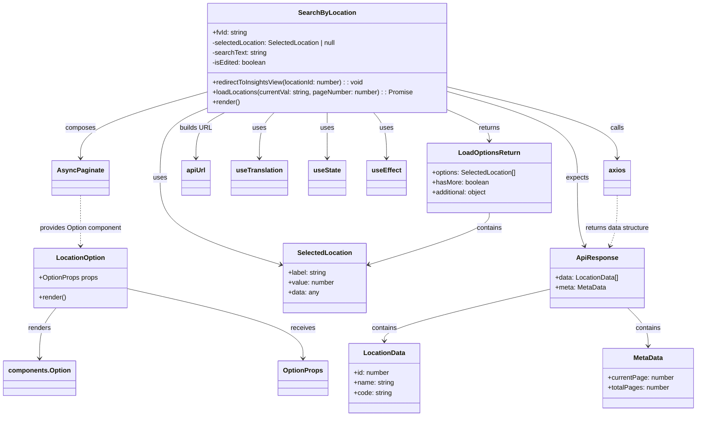

# Diagram: web/portal/src/pages/inventoryview/dashboard/components/SearchByLocation.tsx

> Auto-generated by Obscura crawlers

## Mermaid

### SVG

<svg id="container" width="1663.771484375" xmlns="http://www.w3.org/2000/svg" class="classDiagram" height="1030" viewBox="0 0 1663.771484375 1030" role="graphics-document document" aria-roledescription="class"><g><defs><marker id="container_class-aggregationStart" class="marker aggregation class" refX="18" refY="7" markerWidth="190" markerHeight="240" orient="auto"><path d="M 18,7 L9,13 L1,7 L9,1 Z"></path></marker></defs><defs><marker id="container_class-aggregationEnd" class="marker aggregation class" refX="1" refY="7" markerWidth="20" markerHeight="28" orient="auto"><path d="M 18,7 L9,13 L1,7 L9,1 Z"></path></marker></defs><defs><marker id="container_class-extensionStart" class="marker extension class" refX="18" refY="7" markerWidth="190" markerHeight="240" orient="auto"><path d="M 1,7 L18,13 V 1 Z"></path></marker></defs><defs><marker id="container_class-extensionEnd" class="marker extension class" refX="1" refY="7" markerWidth="20" markerHeight="28" orient="auto"><path d="M 1,1 V 13 L18,7 Z"></path></marker></defs><defs><marker id="container_class-compositionStart" class="marker composition class" refX="18" refY="7" markerWidth="190" markerHeight="240" orient="auto"><path d="M 18,7 L9,13 L1,7 L9,1 Z"></path></marker></defs><defs><marker id="container_class-compositionEnd" class="marker composition class" refX="1" refY="7" markerWidth="20" markerHeight="28" orient="auto"><path d="M 18,7 L9,13 L1,7 L9,1 Z"></path></marker></defs><defs><marker id="container_class-dependencyStart" class="marker dependency class" refX="6" refY="7" markerWidth="190" markerHeight="240" orient="auto"><path d="M 5,7 L9,13 L1,7 L9,1 Z"></path></marker></defs><defs><marker id="container_class-dependencyEnd" class="marker dependency class" refX="13" refY="7" markerWidth="20" markerHeight="28" orient="auto"><path d="M 18,7 L9,13 L14,7 L9,1 Z"></path></marker></defs><defs><marker id="container_class-lollipopStart" class="marker lollipop class" refX="13" refY="7" markerWidth="190" markerHeight="240" orient="auto"><circle stroke="black" fill="transparent" cx="7" cy="7" r="6"></circle></marker></defs><defs><marker id="container_class-lollipopEnd" class="marker lollipop class" refX="1" refY="7" markerWidth="190" markerHeight="240" orient="auto"><circle stroke="black" fill="transparent" cx="7" cy="7" r="6"></circle></marker></defs><g class="root"><g class="clusters"></g><g class="edgePaths"><path d="M485.771,263.262L467.898,270.885C450.024,278.508,414.277,293.754,396.403,321.544C378.529,349.333,378.529,389.667,378.529,432C378.529,474.333,378.529,518.667,426.258,557.052C473.986,595.437,569.443,627.875,617.171,644.094L664.899,660.312" id="id_SearchByLocation_SelectedLocation_1" class="edge-thickness-normal edge-pattern-solid relation" style=";;;" data-edge="true" data-et="edge" data-id="id_SearchByLocation_SelectedLocation_1" data-points="W3sieCI6NDg1Ljc3MTQ4NDM3NSwieSI6MjYzLjI2MjI3Nzk1MTkzMzEzfSx7IngiOjM3OC41MjkyOTY4NzUsInkiOjMwOX0seyJ4IjozNzguNTI5Mjk2ODc1LCJ5Ijo0MzB9LHsieCI6Mzc4LjUyOTI5Njg3NSwieSI6NTYzfSx7IngiOjY3MC41ODAwNzgxMjUsInkiOjY2Mi4yNDI5MzM4NDk2NTQ3fV0=" marker-end="url(#container_class-dependencyEnd)"></path><path d="M1063.803,266.367L1080.054,273.472C1096.305,280.578,1128.808,294.789,1145.059,307.061C1161.311,319.333,1161.311,329.667,1161.311,334.833L1161.311,340" id="id_SearchByLocation_LoadOptionsReturn_2" class="edge-thickness-normal edge-pattern-solid relation" style=";;;" data-edge="true" data-et="edge" data-id="id_SearchByLocation_LoadOptionsReturn_2" data-points="W3sieCI6MTA2My44MDI3MzQzNzUsInkiOjI2Ni4zNjY1Njg5NzQyMjk0fSx7IngiOjExNjEuMzEwNTQ2ODc1LCJ5IjozMDl9LHsieCI6MTE2MS4zMTA1NDY4NzUsInkiOjM0Nn1d" marker-end="url(#container_class-dependencyEnd)"></path><path d="M485.771,223.198L436.094,237.498C386.417,251.798,287.062,280.399,237.384,306.866C187.707,333.333,187.707,357.667,187.707,369.833L187.707,382" id="id_SearchByLocation_AsyncPaginate_3" class="edge-thickness-normal edge-pattern-solid relation" style=";;;" data-edge="true" data-et="edge" data-id="id_SearchByLocation_AsyncPaginate_3" data-points="W3sieCI6NDg1Ljc3MTQ4NDM3NSwieSI6MjIzLjE5NzU3ODA1NjEyMzl9LHsieCI6MTg3LjcwNzAzMTI1LCJ5IjozMDl9LHsieCI6MTg3LjcwNzAzMTI1LCJ5IjozODh9XQ==" marker-end="url(#container_class-dependencyEnd)"></path><path d="M774.787,272L774.787,278.167C774.787,284.333,774.787,296.667,774.787,315C774.787,333.333,774.787,357.667,774.787,369.833L774.787,382" id="id_SearchByLocation_useState_4" class="edge-thickness-normal edge-pattern-solid relation" style=";;;" data-edge="true" data-et="edge" data-id="id_SearchByLocation_useState_4" data-points="W3sieCI6Nzc0Ljc4NzEwOTM3NSwieSI6MjcyfSx7IngiOjc3NC43ODcxMDkzNzUsInkiOjMwOX0seyJ4Ijo3NzQuNzg3MTA5Mzc1LCJ5IjozODh9XQ==" marker-end="url(#container_class-dependencyEnd)"></path><path d="M884.161,272L889.27,278.167C894.38,284.333,904.599,296.667,909.709,315C914.818,333.333,914.818,357.667,914.818,369.833L914.818,382" id="id_SearchByLocation_useEffect_5" class="edge-thickness-normal edge-pattern-solid relation" style=";;;" data-edge="true" data-et="edge" data-id="id_SearchByLocation_useEffect_5" data-points="W3sieCI6ODg0LjE2MDYzMDA4NTA1OTIsInkiOjI3Mn0seyJ4Ijo5MTQuODE4MzU5Mzc1LCJ5IjozMDl9LHsieCI6OTE0LjgxODM1OTM3NSwieSI6Mzg4fV0=" marker-end="url(#container_class-dependencyEnd)"></path><path d="M649.615,272L643.768,278.167C637.92,284.333,626.225,296.667,620.377,315C614.529,333.333,614.529,357.667,614.529,369.833L614.529,382" id="id_SearchByLocation_useTranslation_6" class="edge-thickness-normal edge-pattern-solid relation" style=";;;" data-edge="true" data-et="edge" data-id="id_SearchByLocation_useTranslation_6" data-points="W3sieCI6NjQ5LjYxNTMyNjgzMDYyMTMsInkiOjI3Mn0seyJ4Ijo2MTQuNTI5Mjk2ODc1LCJ5IjozMDl9LHsieCI6NjE0LjUyOTI5Njg3NSwieSI6Mzg4fV0=" marker-end="url(#container_class-dependencyEnd)"></path><path d="M1063.803,209.81L1132.244,226.342C1200.686,242.873,1337.568,275.937,1406.01,304.635C1474.451,333.333,1474.451,357.667,1474.451,369.833L1474.451,382" id="id_SearchByLocation_axios_7" class="edge-thickness-normal edge-pattern-solid relation" style=";;;" data-edge="true" data-et="edge" data-id="id_SearchByLocation_axios_7" data-points="W3sieCI6MTA2My44MDI3MzQzNzUsInkiOjIwOS44MTAxMzIwOTQ2NDM2Mn0seyJ4IjoxNDc0LjQ1MTE3MTg3NSwieSI6MzA5fSx7IngiOjE0NzQuNDUxMTcxODc1LCJ5IjozODh9XQ==" marker-end="url(#container_class-dependencyEnd)"></path><path d="M532.224,272L520.892,278.167C509.56,284.333,486.896,296.667,475.564,315C464.232,333.333,464.232,357.667,464.232,369.833L464.232,382" id="id_SearchByLocation_apiUrl_8" class="edge-thickness-normal edge-pattern-solid relation" style=";;;" data-edge="true" data-et="edge" data-id="id_SearchByLocation_apiUrl_8" data-points="W3sieCI6NTMyLjIyMzY4NDgxODc4NywieSI6MjcyfSx7IngiOjQ2NC4yMzI0MjE4NzUsInkiOjMwOX0seyJ4Ijo0NjQuMjMyNDIxODc1LCJ5IjozODh9XQ==" marker-end="url(#container_class-dependencyEnd)"></path><path d="M1063.803,221.421L1115.615,236.017C1167.428,250.614,1271.053,279.807,1322.865,314.57C1374.678,349.333,1374.678,389.667,1374.678,432C1374.678,474.333,1374.678,518.667,1378.14,550.064C1381.602,581.461,1388.527,599.921,1391.989,609.152L1395.451,618.382" id="id_SearchByLocation_ApiResponse_9" class="edge-thickness-normal edge-pattern-solid relation" style=";;;" data-edge="true" data-et="edge" data-id="id_SearchByLocation_ApiResponse_9" data-points="W3sieCI6MTA2My44MDI3MzQzNzUsInkiOjIyMS40MjA5MTAwNjE3M30seyJ4IjoxMzc0LjY3NzczNDM3NSwieSI6MzA5fSx7IngiOjEzNzQuNjc3NzM0Mzc1LCJ5Ijo0MzB9LHsieCI6MTM3NC42Nzc3MzQzNzUsInkiOjU2M30seyJ4IjoxMzk3LjU1ODEwOTE0MDAzNzcsInkiOjYyNH1d" marker-end="url(#container_class-dependencyEnd)"></path><path d="M1161.311,514L1161.311,522.167C1161.311,530.333,1161.311,546.667,1113.582,571.052C1065.854,595.437,970.397,627.875,922.669,644.094L874.941,660.312" id="id_LoadOptionsReturn_SelectedLocation_10" class="edge-thickness-normal edge-pattern-solid relation" style=";;;" data-edge="true" data-et="edge" data-id="id_LoadOptionsReturn_SelectedLocation_10" data-points="W3sieCI6MTE2MS4zMTA1NDY4NzUsInkiOjUxNH0seyJ4IjoxMTYxLjMxMDU0Njg3NSwieSI6NTYzfSx7IngiOjg2OS4yNTk3NjU2MjUsInkiOjY2Mi4yNDI5MzM4NDk2NTQ3fV0=" marker-end="url(#container_class-dependencyEnd)"></path><path d="M1311.795,722.681L1245.354,738.401C1178.912,754.121,1046.029,785.56,979.588,806.447C913.146,827.333,913.146,837.667,913.146,842.833L913.146,848" id="id_ApiResponse_LocationData_11" class="edge-thickness-normal edge-pattern-solid relation" style=";;;" data-edge="true" data-et="edge" data-id="id_ApiResponse_LocationData_11" data-points="W3sieCI6MTMxMS43OTQ5MjE4NzUsInkiOjcyMi42ODA5NDIyMzMyMjF9LHsieCI6OTEzLjE0NjQ4NDM3NSwieSI6ODE3fSx7IngiOjkxMy4xNDY0ODQzNzUsInkiOjg1NH1d" marker-end="url(#container_class-dependencyEnd)"></path><path d="M1497.245,768L1505.489,776.167C1513.733,784.333,1530.221,800.667,1538.465,816C1546.709,831.333,1546.709,845.667,1546.709,852.833L1546.709,860" id="id_ApiResponse_MetaData_12" class="edge-thickness-normal edge-pattern-solid relation" style=";;;" data-edge="true" data-et="edge" data-id="id_ApiResponse_MetaData_12" data-points="W3sieCI6MTQ5Ny4yNDU0OTY1MTM0Mjk4LCJ5Ijo3Njh9LHsieCI6MTU0Ni43MDg5ODQzNzUsInkiOjgxN30seyJ4IjoxNTQ2LjcwODk4NDM3NSwieSI6ODY2fV0=" marker-end="url(#container_class-dependencyEnd)"></path><path d="M130.669,768L124.199,776.167C117.73,784.333,104.791,800.667,98.321,821C91.852,841.333,91.852,865.667,91.852,877.833L91.852,890" id="id_LocationOption_components.Option_13" class="edge-thickness-normal edge-pattern-solid relation" style=";;;" data-edge="true" data-et="edge" data-id="id_LocationOption_components.Option_13" data-points="W3sieCI6MTMwLjY2OTA2NjM3Mzk2NjkzLCJ5Ijo3Njh9LHsieCI6OTEuODUxNTYyNSwieSI6ODE3fSx7IngiOjkxLjg1MTU2MjUsInkiOjg5Nn1d" marker-end="url(#container_class-dependencyEnd)"></path><path d="M300.012,721.526L370.02,737.438C440.028,753.351,580.044,785.175,650.052,813.254C720.061,841.333,720.061,865.667,720.061,877.833L720.061,890" id="id_LocationOption_OptionProps_14" class="edge-thickness-normal edge-pattern-solid relation" style=";;;" data-edge="true" data-et="edge" data-id="id_LocationOption_OptionProps_14" data-points="W3sieCI6MzAwLjAxMTcxODc1LCJ5Ijo3MjEuNTI2MDIxMzE2MDE2M30seyJ4Ijo3MjAuMDYwNTQ2ODc1LCJ5Ijo4MTd9LHsieCI6NzIwLjA2MDU0Njg3NSwieSI6ODk2fV0=" marker-end="url(#container_class-dependencyEnd)"></path><path d="M187.707,472L187.707,487.167C187.707,502.333,187.707,532.667,187.707,557C187.707,581.333,187.707,599.667,187.707,608.833L187.707,618" id="id_AsyncPaginate_LocationOption_15" class="edge-thickness-normal edge-pattern-dashed relation" style=";;;" data-edge="true" data-et="edge" data-id="id_AsyncPaginate_LocationOption_15" data-points="W3sieCI6MTg3LjcwNzAzMTI1LCJ5Ijo0NzJ9LHsieCI6MTg3LjcwNzAzMTI1LCJ5Ijo1NjN9LHsieCI6MTg3LjcwNzAzMTI1LCJ5Ijo2MjR9XQ==" marker-end="url(#container_class-dependencyEnd)"></path><path d="M1474.451,472L1474.451,487.167C1474.451,502.333,1474.451,532.667,1470.989,557.064C1467.527,581.461,1460.602,599.921,1457.14,609.152L1453.678,618.382" id="id_axios_ApiResponse_16" class="edge-thickness-normal edge-pattern-dashed relation" style=";;;" data-edge="true" data-et="edge" data-id="id_axios_ApiResponse_16" data-points="W3sieCI6MTQ3NC40NTExNzE4NzUsInkiOjQ3Mn0seyJ4IjoxNDc0LjQ1MTE3MTg3NSwieSI6NTYzfSx7IngiOjE0NTEuNTcwNzk3MTA5OTYyMywieSI6NjI0fV0=" marker-end="url(#container_class-dependencyEnd)"></path></g><g class="edgeLabels"><g class="edgeLabel" transform="translate(378.529296875, 430)"><g class="label" data-id="id_SearchByLocation_SelectedLocation_1" transform="translate(-16.4921875, -12)"><foreignObject width="32.984375" height="24">

uses

</foreignObject></g></g><g class="edgeLabel" transform="translate(1161.310546875, 309)"><g class="label" data-id="id_SearchByLocation_LoadOptionsReturn_2" transform="translate(-26.265625, -12)"><foreignObject width="52.53125" height="24">

returns

</foreignObject></g></g><g class="edgeLabel" transform="translate(187.70703125, 309)"><g class="label" data-id="id_SearchByLocation_AsyncPaginate_3" transform="translate(-36.453125, -12)"><foreignObject width="72.90625" height="24">

composes

</foreignObject></g></g><g class="edgeLabel" transform="translate(774.787109375, 309)"><g class="label" data-id="id_SearchByLocation_useState_4" transform="translate(-16.4921875, -12)"><foreignObject width="32.984375" height="24">

uses

</foreignObject></g></g><g class="edgeLabel" transform="translate(914.818359375, 309)"><g class="label" data-id="id_SearchByLocation_useEffect_5" transform="translate(-16.4921875, -12)"><foreignObject width="32.984375" height="24">

uses

</foreignObject></g></g><g class="edgeLabel" transform="translate(614.529296875, 309)"><g class="label" data-id="id_SearchByLocation_useTranslation_6" transform="translate(-16.4921875, -12)"><foreignObject width="32.984375" height="24">

uses

</foreignObject></g></g><g class="edgeLabel" transform="translate(1474.451171875, 309)"><g class="label" data-id="id_SearchByLocation_axios_7" transform="translate(-16.4453125, -12)"><foreignObject width="32.890625" height="24">

calls

</foreignObject></g></g><g class="edgeLabel" transform="translate(464.232421875, 309)"><g class="label" data-id="id_SearchByLocation_apiUrl_8" transform="translate(-38.734375, -12)"><foreignObject width="77.46875" height="24">

builds URL

</foreignObject></g></g><g class="edgeLabel" transform="translate(1374.677734375, 430)"><g class="label" data-id="id_SearchByLocation_ApiResponse_9" transform="translate(-27.734375, -12)"><foreignObject width="55.46875" height="24">

expects

</foreignObject></g></g><g class="edgeLabel" transform="translate(1161.310546875, 563)"><g class="label" data-id="id_LoadOptionsReturn_SelectedLocation_10" transform="translate(-30.890625, -12)"><foreignObject width="61.78125" height="24">

contains

</foreignObject></g></g><g class="edgeLabel" transform="translate(913.146484375, 817)"><g class="label" data-id="id_ApiResponse_LocationData_11" transform="translate(-30.890625, -12)"><foreignObject width="61.78125" height="24">

contains

</foreignObject></g></g><g class="edgeLabel" transform="translate(1546.708984375, 817)"><g class="label" data-id="id_ApiResponse_MetaData_12" transform="translate(-30.890625, -12)"><foreignObject width="61.78125" height="24">

contains

</foreignObject></g></g><g class="edgeLabel" transform="translate(91.8515625, 817)"><g class="label" data-id="id_LocationOption_components.Option_13" transform="translate(-27.75, -12)"><foreignObject width="55.5" height="24">

renders

</foreignObject></g></g><g class="edgeLabel" transform="translate(720.060546875, 817)"><g class="label" data-id="id_LocationOption_OptionProps_14" transform="translate(-29.4921875, -12)"><foreignObject width="58.984375" height="24">

receives

</foreignObject></g></g><g class="edgeLabel" transform="translate(187.70703125, 563)"><g class="label" data-id="id_AsyncPaginate_LocationOption_15" transform="translate(-100, -24)"><foreignObject width="200" height="48">

provides Option component

</foreignObject></g></g><g class="edgeLabel" transform="translate(1474.451171875, 563)"><g class="label" data-id="id_axios_ApiResponse_16" transform="translate(-79.7734375, -12)"><foreignObject width="159.546875" height="24">

returns data structure

</foreignObject></g></g></g><g class="nodes"><g class="node default" id="classId-LocationOption-0" transform="translate(187.70703125, 696)"><g class="basic label-container"><path d="M-112.3046875 -72 L112.3046875 -72 L112.3046875 72 L-112.3046875 72" stroke="none" stroke-width="0" fill="#ECECFF" style=""></path><path d="M-112.3046875 -72 C-33.4614613542376 -72, 45.3817647915248 -72, 112.3046875 -72 M-112.3046875 -72 C-45.31860589345513 -72, 21.667475713089743 -72, 112.3046875 -72 M112.3046875 -72 C112.3046875 -15.968919113518126, 112.3046875 40.06216177296375, 112.3046875 72 M112.3046875 -72 C112.3046875 -14.679744251500175, 112.3046875 42.64051149699965, 112.3046875 72 M112.3046875 72 C34.70670013382846 72, -42.891287232343075 72, -112.3046875 72 M112.3046875 72 C56.35096632514423 72, 0.3972451502884553 72, -112.3046875 72 M-112.3046875 72 C-112.3046875 26.392199638459168, -112.3046875 -19.215600723081664, -112.3046875 -72 M-112.3046875 72 C-112.3046875 25.904658697941862, -112.3046875 -20.190682604116276, -112.3046875 -72" stroke="#9370DB" stroke-width="1.3" fill="none" stroke-dasharray="0 0" style=""></path></g><g class="annotation-group text" transform="translate(0, -48)"></g><g class="label-group text" transform="translate(-56.28125, -48)"><g class="label" style="font-weight: bolder" transform="translate(0,-12)"><foreignObject width="112.5625" height="24">

LocationOption

</foreignObject></g></g><g class="members-group text" transform="translate(-100.3046875, 0)"><g class="label" style="" transform="translate(0,-12)"><foreignObject width="144.328125" height="24">

+OptionProps props

</foreignObject></g></g><g class="methods-group text" transform="translate(-100.3046875, 48)"><g class="label" style="" transform="translate(0,-12)"><foreignObject width="66.609375" height="24">

+render()

</foreignObject></g></g><g class="divider" style=""><path d="M-112.3046875 -24 C-46.44834382969616 -24, 19.407999840607687 -24, 112.3046875 -24 M-112.3046875 -24 C-62.54592938982075 -24, -12.787171279641498 -24, 112.3046875 -24" stroke="#9370DB" stroke-width="1.3" fill="none" stroke-dasharray="0 0" style=""></path></g><g class="divider" style=""><path d="M-112.3046875 24 C-51.47264041630501 24, 9.359406667389976 24, 112.3046875 24 M-112.3046875 24 C-34.31890907377122 24, 43.66686935245755 24, 112.3046875 24" stroke="#9370DB" stroke-width="1.3" fill="none" stroke-dasharray="0 0" style=""></path></g></g><g class="node default" id="classId-SearchByLocation-1" transform="translate(774.787109375, 140)"><g class="basic label-container"><path d="M-289.015625 -132 L289.015625 -132 L289.015625 132 L-289.015625 132" stroke="none" stroke-width="0" fill="#ECECFF" style=""></path><path d="M-289.015625 -132 C-59.113156758460406 -132, 170.7893114830792 -132, 289.015625 -132 M-289.015625 -132 C-134.03504324879663 -132, 20.945538502406748 -132, 289.015625 -132 M289.015625 -132 C289.015625 -29.992014447106158, 289.015625 72.01597110578768, 289.015625 132 M289.015625 -132 C289.015625 -73.43144988617061, 289.015625 -14.862899772341237, 289.015625 132 M289.015625 132 C152.22772308120244 132, 15.439821162404883 132, -289.015625 132 M289.015625 132 C64.06174550817786 132, -160.89213398364427 132, -289.015625 132 M-289.015625 132 C-289.015625 28.559734373983773, -289.015625 -74.88053125203245, -289.015625 -132 M-289.015625 132 C-289.015625 68.38681998116633, -289.015625 4.773639962332652, -289.015625 -132" stroke="#9370DB" stroke-width="1.3" fill="none" stroke-dasharray="0 0" style=""></path></g><g class="annotation-group text" transform="translate(0, -108)"></g><g class="label-group text" transform="translate(-65.140625, -108)"><g class="label" style="font-weight: bolder" transform="translate(0,-12)"><foreignObject width="130.28125" height="24">

SearchByLocation

</foreignObject></g></g><g class="members-group text" transform="translate(-277.015625, -60)"><g class="label" style="" transform="translate(0,-12)"><foreignObject width="84.984375" height="24">

+fvId: string

</foreignObject></g><g class="label" style="" transform="translate(0,12)"><foreignObject width="304.984375" height="24">

-selectedLocation: SelectedLocation | null

</foreignObject></g><g class="label" style="" transform="translate(0,36)"><foreignObject width="133.1875" height="24">

-searchText: string

</foreignObject></g><g class="label" style="" transform="translate(0,60)"><foreignObject width="132.109375" height="24">

-isEdited: boolean

</foreignObject></g></g><g class="methods-group text" transform="translate(-277.015625, 60)"><g class="label" style="" transform="translate(0,-12)"><foreignObject width="372.015625" height="24">

+redirectToInsightsView(locationId: number) : : void

</foreignObject></g><g class="label" style="" transform="translate(0,12)"><foreignObject width="488.890625" height="24">

+loadLocations(currentVal: string, pageNumber: number) : : Promise

</foreignObject></g><g class="label" style="" transform="translate(0,36)"><foreignObject width="66.609375" height="24">

+render()

</foreignObject></g></g><g class="divider" style=""><path d="M-289.015625 -84 C-151.93899032293362 -84, -14.86235564586724 -84, 289.015625 -84 M-289.015625 -84 C-146.54873485626217 -84, -4.081844712524344 -84, 289.015625 -84" stroke="#9370DB" stroke-width="1.3" fill="none" stroke-dasharray="0 0" style=""></path></g><g class="divider" style=""><path d="M-289.015625 36 C-96.4476953664298 36, 96.1202342671404 36, 289.015625 36 M-289.015625 36 C-141.88853528664168 36, 5.238554426716632 36, 289.015625 36" stroke="#9370DB" stroke-width="1.3" fill="none" stroke-dasharray="0 0" style=""></path></g></g><g class="node default" id="classId-AsyncPaginate-2" transform="translate(187.70703125, 430)"><g class="basic label-container"><path d="M-64.7421875 -42 L64.7421875 -42 L64.7421875 42 L-64.7421875 42" stroke="none" stroke-width="0" fill="#ECECFF" style=""></path><path d="M-64.7421875 -42 C-33.71258667429498 -42, -2.682985848589958 -42, 64.7421875 -42 M-64.7421875 -42 C-19.26672872255243 -42, 26.208730054895142 -42, 64.7421875 -42 M64.7421875 -42 C64.7421875 -12.986088819211382, 64.7421875 16.027822361577236, 64.7421875 42 M64.7421875 -42 C64.7421875 -20.337619438469467, 64.7421875 1.3247611230610659, 64.7421875 42 M64.7421875 42 C36.389034153626326 42, 8.035880807252653 42, -64.7421875 42 M64.7421875 42 C38.05117994377247 42, 11.360172387544935 42, -64.7421875 42 M-64.7421875 42 C-64.7421875 18.323196494560158, -64.7421875 -5.353607010879685, -64.7421875 -42 M-64.7421875 42 C-64.7421875 11.710180097739638, -64.7421875 -18.579639804520724, -64.7421875 -42" stroke="#9370DB" stroke-width="1.3" fill="none" stroke-dasharray="0 0" style=""></path></g><g class="annotation-group text" transform="translate(0, -18)"></g><g class="label-group text" transform="translate(-52.7421875, -18)"><g class="label" style="font-weight: bolder" transform="translate(0,-12)"><foreignObject width="105.484375" height="24">

AsyncPaginate

</foreignObject></g></g><g class="members-group text" transform="translate(-52.7421875, 30)"></g><g class="methods-group text" transform="translate(-52.7421875, 60)"></g><g class="divider" style=""><path d="M-64.7421875 6 C-34.9811608597181 6, -5.220134219436197 6, 64.7421875 6 M-64.7421875 6 C-25.412101732565368 6, 13.917984034869264 6, 64.7421875 6" stroke="#9370DB" stroke-width="1.3" fill="none" stroke-dasharray="0 0" style=""></path></g><g class="divider" style=""><path d="M-64.7421875 24 C-38.79589869069918 24, -12.849609881398365 24, 64.7421875 24 M-64.7421875 24 C-33.21150542673102 24, -1.6808233534620385 24, 64.7421875 24" stroke="#9370DB" stroke-width="1.3" fill="none" stroke-dasharray="0 0" style=""></path></g></g><g class="node default" id="classId-axios-3" transform="translate(1474.451171875, 430)"><g class="basic label-container"><path d="M-31.2734375 -42 L31.2734375 -42 L31.2734375 42 L-31.2734375 42" stroke="none" stroke-width="0" fill="#ECECFF" style=""></path><path d="M-31.2734375 -42 C-17.635555133047756 -42, -3.997672766095512 -42, 31.2734375 -42 M-31.2734375 -42 C-6.7599512783102185 -42, 17.753534943379563 -42, 31.2734375 -42 M31.2734375 -42 C31.2734375 -24.19534095294645, 31.2734375 -6.390681905892897, 31.2734375 42 M31.2734375 -42 C31.2734375 -22.969287403775898, 31.2734375 -3.9385748075517952, 31.2734375 42 M31.2734375 42 C13.099567865947396 42, -5.074301768105208 42, -31.2734375 42 M31.2734375 42 C15.141451667533936 42, -0.9905341649321286 42, -31.2734375 42 M-31.2734375 42 C-31.2734375 10.673856901930208, -31.2734375 -20.652286196139585, -31.2734375 -42 M-31.2734375 42 C-31.2734375 15.608215792147341, -31.2734375 -10.783568415705318, -31.2734375 -42" stroke="#9370DB" stroke-width="1.3" fill="none" stroke-dasharray="0 0" style=""></path></g><g class="annotation-group text" transform="translate(0, -18)"></g><g class="label-group text" transform="translate(-19.2734375, -18)"><g class="label" style="font-weight: bolder" transform="translate(0,-12)"><foreignObject width="38.546875" height="24">

axios

</foreignObject></g></g><g class="members-group text" transform="translate(-19.2734375, 30)"></g><g class="methods-group text" transform="translate(-19.2734375, 60)"></g><g class="divider" style=""><path d="M-31.2734375 6 C-8.433243216225364 6, 14.406951067549272 6, 31.2734375 6 M-31.2734375 6 C-7.368930923006257 6, 16.535575653987486 6, 31.2734375 6" stroke="#9370DB" stroke-width="1.3" fill="none" stroke-dasharray="0 0" style=""></path></g><g class="divider" style=""><path d="M-31.2734375 24 C-14.313773404000386 24, 2.6458906919992273 24, 31.2734375 24 M-31.2734375 24 C-12.985964243778142 24, 5.3015090124437165 24, 31.2734375 24" stroke="#9370DB" stroke-width="1.3" fill="none" stroke-dasharray="0 0" style=""></path></g></g><g class="node default" id="classId-apiUrl-4" transform="translate(464.232421875, 430)"><g class="basic label-container"><path d="M-34.2109375 -42 L34.2109375 -42 L34.2109375 42 L-34.2109375 42" stroke="none" stroke-width="0" fill="#ECECFF" style=""></path><path d="M-34.2109375 -42 C-14.679562107673402 -42, 4.851813284653197 -42, 34.2109375 -42 M-34.2109375 -42 C-18.736985491411637 -42, -3.263033482823271 -42, 34.2109375 -42 M34.2109375 -42 C34.2109375 -9.218255006681865, 34.2109375 23.56348998663627, 34.2109375 42 M34.2109375 -42 C34.2109375 -19.71822755313295, 34.2109375 2.5635448937340968, 34.2109375 42 M34.2109375 42 C12.263370057293297 42, -9.684197385413405 42, -34.2109375 42 M34.2109375 42 C9.171443496995774 42, -15.868050506008451 42, -34.2109375 42 M-34.2109375 42 C-34.2109375 20.95685212042984, -34.2109375 -0.08629575914032017, -34.2109375 -42 M-34.2109375 42 C-34.2109375 24.49046249213593, -34.2109375 6.980924984271859, -34.2109375 -42" stroke="#9370DB" stroke-width="1.3" fill="none" stroke-dasharray="0 0" style=""></path></g><g class="annotation-group text" transform="translate(0, -18)"></g><g class="label-group text" transform="translate(-22.2109375, -18)"><g class="label" style="font-weight: bolder" transform="translate(0,-12)"><foreignObject width="44.421875" height="24">

apiUrl

</foreignObject></g></g><g class="members-group text" transform="translate(-22.2109375, 30)"></g><g class="methods-group text" transform="translate(-22.2109375, 60)"></g><g class="divider" style=""><path d="M-34.2109375 6 C-10.651196557390424 6, 12.908544385219152 6, 34.2109375 6 M-34.2109375 6 C-9.930085873968686 6, 14.350765752062628 6, 34.2109375 6" stroke="#9370DB" stroke-width="1.3" fill="none" stroke-dasharray="0 0" style=""></path></g><g class="divider" style=""><path d="M-34.2109375 24 C-12.646808716736782 24, 8.917320066526436 24, 34.2109375 24 M-34.2109375 24 C-16.247339584549877 24, 1.7162583309002457 24, 34.2109375 24" stroke="#9370DB" stroke-width="1.3" fill="none" stroke-dasharray="0 0" style=""></path></g></g><g class="node default" id="classId-useTranslation-5" transform="translate(614.529296875, 430)"><g class="basic label-container"><path d="M-66.0859375 -42 L66.0859375 -42 L66.0859375 42 L-66.0859375 42" stroke="none" stroke-width="0" fill="#ECECFF" style=""></path><path d="M-66.0859375 -42 C-20.502230224147347 -42, 25.081477051705306 -42, 66.0859375 -42 M-66.0859375 -42 C-16.191047651914104 -42, 33.70384219617179 -42, 66.0859375 -42 M66.0859375 -42 C66.0859375 -24.501904131718856, 66.0859375 -7.003808263437712, 66.0859375 42 M66.0859375 -42 C66.0859375 -8.975928122871629, 66.0859375 24.048143754256742, 66.0859375 42 M66.0859375 42 C37.71586123520548 42, 9.345784970410953 42, -66.0859375 42 M66.0859375 42 C13.980485701197772 42, -38.12496609760446 42, -66.0859375 42 M-66.0859375 42 C-66.0859375 12.504083386614735, -66.0859375 -16.99183322677053, -66.0859375 -42 M-66.0859375 42 C-66.0859375 18.021763435132502, -66.0859375 -5.956473129734995, -66.0859375 -42" stroke="#9370DB" stroke-width="1.3" fill="none" stroke-dasharray="0 0" style=""></path></g><g class="annotation-group text" transform="translate(0, -18)"></g><g class="label-group text" transform="translate(-54.0859375, -18)"><g class="label" style="font-weight: bolder" transform="translate(0,-12)"><foreignObject width="108.171875" height="24">

useTranslation

</foreignObject></g></g><g class="members-group text" transform="translate(-54.0859375, 30)"></g><g class="methods-group text" transform="translate(-54.0859375, 60)"></g><g class="divider" style=""><path d="M-66.0859375 6 C-33.62057638637244 6, -1.1552152727448828 6, 66.0859375 6 M-66.0859375 6 C-23.790714938582518 6, 18.504507622834964 6, 66.0859375 6" stroke="#9370DB" stroke-width="1.3" fill="none" stroke-dasharray="0 0" style=""></path></g><g class="divider" style=""><path d="M-66.0859375 24 C-16.290480899194975 24, 33.50497570161005 24, 66.0859375 24 M-66.0859375 24 C-18.311384429777227 24, 29.463168640445545 24, 66.0859375 24" stroke="#9370DB" stroke-width="1.3" fill="none" stroke-dasharray="0 0" style=""></path></g></g><g class="node default" id="classId-useState-6" transform="translate(774.787109375, 430)"><g class="basic label-container"><path d="M-44.171875 -42 L44.171875 -42 L44.171875 42 L-44.171875 42" stroke="none" stroke-width="0" fill="#ECECFF" style=""></path><path d="M-44.171875 -42 C-9.750474613372049 -42, 24.670925773255902 -42, 44.171875 -42 M-44.171875 -42 C-25.005302433684193 -42, -5.838729867368386 -42, 44.171875 -42 M44.171875 -42 C44.171875 -12.059350415176347, 44.171875 17.881299169647306, 44.171875 42 M44.171875 -42 C44.171875 -16.65701563187419, 44.171875 8.685968736251617, 44.171875 42 M44.171875 42 C19.48360473748639 42, -5.204665525027217 42, -44.171875 42 M44.171875 42 C12.933550161652015 42, -18.30477467669597 42, -44.171875 42 M-44.171875 42 C-44.171875 22.99925127104755, -44.171875 3.9985025420951033, -44.171875 -42 M-44.171875 42 C-44.171875 13.641482100415303, -44.171875 -14.717035799169395, -44.171875 -42" stroke="#9370DB" stroke-width="1.3" fill="none" stroke-dasharray="0 0" style=""></path></g><g class="annotation-group text" transform="translate(0, -18)"></g><g class="label-group text" transform="translate(-32.171875, -18)"><g class="label" style="font-weight: bolder" transform="translate(0,-12)"><foreignObject width="64.34375" height="24">

useState

</foreignObject></g></g><g class="members-group text" transform="translate(-32.171875, 30)"></g><g class="methods-group text" transform="translate(-32.171875, 60)"></g><g class="divider" style=""><path d="M-44.171875 6 C-25.199287168611374 6, -6.2266993372227475 6, 44.171875 6 M-44.171875 6 C-11.19316512345133 6, 21.78554475309734 6, 44.171875 6" stroke="#9370DB" stroke-width="1.3" fill="none" stroke-dasharray="0 0" style=""></path></g><g class="divider" style=""><path d="M-44.171875 24 C-12.726276367708063 24, 18.719322264583873 24, 44.171875 24 M-44.171875 24 C-13.416054675377517 24, 17.339765649244967 24, 44.171875 24" stroke="#9370DB" stroke-width="1.3" fill="none" stroke-dasharray="0 0" style=""></path></g></g><g class="node default" id="classId-useEffect-7" transform="translate(914.818359375, 430)"><g class="basic label-container"><path d="M-45.859375 -42 L45.859375 -42 L45.859375 42 L-45.859375 42" stroke="none" stroke-width="0" fill="#ECECFF" style=""></path><path d="M-45.859375 -42 C-16.05136759679167 -42, 13.756639806416658 -42, 45.859375 -42 M-45.859375 -42 C-21.00560072391062 -42, 3.848173552178757 -42, 45.859375 -42 M45.859375 -42 C45.859375 -11.832438488516196, 45.859375 18.335123022967608, 45.859375 42 M45.859375 -42 C45.859375 -16.521340573439332, 45.859375 8.957318853121336, 45.859375 42 M45.859375 42 C15.025845362080641 42, -15.807684275838717 42, -45.859375 42 M45.859375 42 C25.99842779683566 42, 6.13748059367132 42, -45.859375 42 M-45.859375 42 C-45.859375 16.36733592392558, -45.859375 -9.26532815214884, -45.859375 -42 M-45.859375 42 C-45.859375 21.987022829922186, -45.859375 1.9740456598443714, -45.859375 -42" stroke="#9370DB" stroke-width="1.3" fill="none" stroke-dasharray="0 0" style=""></path></g><g class="annotation-group text" transform="translate(0, -18)"></g><g class="label-group text" transform="translate(-33.859375, -18)"><g class="label" style="font-weight: bolder" transform="translate(0,-12)"><foreignObject width="67.71875" height="24">

useEffect

</foreignObject></g></g><g class="members-group text" transform="translate(-33.859375, 30)"></g><g class="methods-group text" transform="translate(-33.859375, 60)"></g><g class="divider" style=""><path d="M-45.859375 6 C-25.4254873060302 6, -4.991599612060398 6, 45.859375 6 M-45.859375 6 C-14.422653153438787 6, 17.014068693122425 6, 45.859375 6" stroke="#9370DB" stroke-width="1.3" fill="none" stroke-dasharray="0 0" style=""></path></g><g class="divider" style=""><path d="M-45.859375 24 C-10.245245057164617 24, 25.368884885670766 24, 45.859375 24 M-45.859375 24 C-26.59626010299177 24, -7.333145205983541 24, 45.859375 24" stroke="#9370DB" stroke-width="1.3" fill="none" stroke-dasharray="0 0" style=""></path></g></g><g class="node default" id="classId-SelectedLocation-8" transform="translate(769.919921875, 696)"><g class="basic label-container"><path d="M-99.33984375 -84 L99.33984375 -84 L99.33984375 84 L-99.33984375 84" stroke="none" stroke-width="0" fill="#ECECFF" style=""></path><path d="M-99.33984375 -84 C-36.94402913168336 -84, 25.451785486633284 -84, 99.33984375 -84 M-99.33984375 -84 C-38.53621821267469 -84, 22.26740732465062 -84, 99.33984375 -84 M99.33984375 -84 C99.33984375 -27.14808836114433, 99.33984375 29.703823277711336, 99.33984375 84 M99.33984375 -84 C99.33984375 -28.354024172409034, 99.33984375 27.291951655181933, 99.33984375 84 M99.33984375 84 C38.6794961525868 84, -21.9808514448264 84, -99.33984375 84 M99.33984375 84 C47.56390748710625 84, -4.212028775787502 84, -99.33984375 84 M-99.33984375 84 C-99.33984375 30.568598129407604, -99.33984375 -22.86280374118479, -99.33984375 -84 M-99.33984375 84 C-99.33984375 24.491742386309028, -99.33984375 -35.016515227381944, -99.33984375 -84" stroke="#9370DB" stroke-width="1.3" fill="none" stroke-dasharray="0 0" style=""></path></g><g class="annotation-group text" transform="translate(0, -60)"></g><g class="label-group text" transform="translate(-63.0859375, -60)"><g class="label" style="font-weight: bolder" transform="translate(0,-12)"><foreignObject width="126.171875" height="24">

SelectedLocation

</foreignObject></g></g><g class="members-group text" transform="translate(-87.33984375, -12)"><g class="label" style="" transform="translate(0,-12)"><foreignObject width="94.09375" height="24">

+label: string

</foreignObject></g><g class="label" style="" transform="translate(0,12)"><foreignObject width="111.59375" height="24">

+value: number

</foreignObject></g><g class="label" style="" transform="translate(0,36)"><foreignObject width="74.546875" height="24">

+data: any

</foreignObject></g></g><g class="methods-group text" transform="translate(-87.33984375, 84)"></g><g class="divider" style=""><path d="M-99.33984375 -36 C-45.8397822632715 -36, 7.660279223456996 -36, 99.33984375 -36 M-99.33984375 -36 C-27.50918422260831 -36, 44.32147530478338 -36, 99.33984375 -36" stroke="#9370DB" stroke-width="1.3" fill="none" stroke-dasharray="0 0" style=""></path></g><g class="divider" style=""><path d="M-99.33984375 60 C-20.863985682491418 60, 57.611872385017165 60, 99.33984375 60 M-99.33984375 60 C-35.37549662824523 60, 28.58885049350954 60, 99.33984375 60" stroke="#9370DB" stroke-width="1.3" fill="none" stroke-dasharray="0 0" style=""></path></g></g><g class="node default" id="classId-LoadOptionsReturn-9" transform="translate(1161.310546875, 430)"><g class="basic label-container"><path d="M-150.6328125 -84 L150.6328125 -84 L150.6328125 84 L-150.6328125 84" stroke="none" stroke-width="0" fill="#ECECFF" style=""></path><path d="M-150.6328125 -84 C-73.38020788920053 -84, 3.872396721598932 -84, 150.6328125 -84 M-150.6328125 -84 C-44.322366796667936 -84, 61.98807890666413 -84, 150.6328125 -84 M150.6328125 -84 C150.6328125 -27.46906234416202, 150.6328125 29.061875311675962, 150.6328125 84 M150.6328125 -84 C150.6328125 -21.34953928739744, 150.6328125 41.30092142520512, 150.6328125 84 M150.6328125 84 C84.01621767220244 84, 17.399622844404888 84, -150.6328125 84 M150.6328125 84 C67.62366180966792 84, -15.385488880664155 84, -150.6328125 84 M-150.6328125 84 C-150.6328125 20.45488282268549, -150.6328125 -43.09023435462902, -150.6328125 -84 M-150.6328125 84 C-150.6328125 34.83943551176778, -150.6328125 -14.321128976464436, -150.6328125 -84" stroke="#9370DB" stroke-width="1.3" fill="none" stroke-dasharray="0 0" style=""></path></g><g class="annotation-group text" transform="translate(0, -60)"></g><g class="label-group text" transform="translate(-71.203125, -60)"><g class="label" style="font-weight: bolder" transform="translate(0,-12)"><foreignObject width="142.40625" height="24">

LoadOptionsReturn

</foreignObject></g></g><g class="members-group text" transform="translate(-138.6328125, -12)"><g class="label" style="" transform="translate(0,-12)"><foreignObject width="206.0625" height="24">

+options: SelectedLocation[]

</foreignObject></g><g class="label" style="" transform="translate(0,12)"><foreignObject width="137.109375" height="24">

+hasMore: boolean

</foreignObject></g><g class="label" style="" transform="translate(0,36)"><foreignObject width="136.0625" height="24">

+additional: object

</foreignObject></g></g><g class="methods-group text" transform="translate(-138.6328125, 84)"></g><g class="divider" style=""><path d="M-150.6328125 -36 C-58.30529162972394 -36, 34.02222924055212 -36, 150.6328125 -36 M-150.6328125 -36 C-52.87462776752328 -36, 44.88355696495344 -36, 150.6328125 -36" stroke="#9370DB" stroke-width="1.3" fill="none" stroke-dasharray="0 0" style=""></path></g><g class="divider" style=""><path d="M-150.6328125 60 C-36.349516759213145 60, 77.93377898157371 60, 150.6328125 60 M-150.6328125 60 C-52.08417110002567 60, 46.46447029994866 60, 150.6328125 60" stroke="#9370DB" stroke-width="1.3" fill="none" stroke-dasharray="0 0" style=""></path></g></g><g class="node default" id="classId-LocationData-10" transform="translate(913.146484375, 938)"><g class="basic label-container"><path d="M-85.2265625 -84 L85.2265625 -84 L85.2265625 84 L-85.2265625 84" stroke="none" stroke-width="0" fill="#ECECFF" style=""></path><path d="M-85.2265625 -84 C-45.60715658138952 -84, -5.987750662779035 -84, 85.2265625 -84 M-85.2265625 -84 C-51.03262960787345 -84, -16.838696715746906 -84, 85.2265625 -84 M85.2265625 -84 C85.2265625 -34.147032811688824, 85.2265625 15.705934376622352, 85.2265625 84 M85.2265625 -84 C85.2265625 -46.74428398569936, 85.2265625 -9.488567971398723, 85.2265625 84 M85.2265625 84 C32.870262000423295 84, -19.48603849915341 84, -85.2265625 84 M85.2265625 84 C38.37496384036612 84, -8.476634819267758 84, -85.2265625 84 M-85.2265625 84 C-85.2265625 22.786150888616227, -85.2265625 -38.427698222767546, -85.2265625 -84 M-85.2265625 84 C-85.2265625 47.040314465892294, -85.2265625 10.080628931784588, -85.2265625 -84" stroke="#9370DB" stroke-width="1.3" fill="none" stroke-dasharray="0 0" style=""></path></g><g class="annotation-group text" transform="translate(0, -60)"></g><g class="label-group text" transform="translate(-48.234375, -60)"><g class="label" style="font-weight: bolder" transform="translate(0,-12)"><foreignObject width="96.46875" height="24">

LocationData

</foreignObject></g></g><g class="members-group text" transform="translate(-73.2265625, -12)"><g class="label" style="" transform="translate(0,-12)"><foreignObject width="86.953125" height="24">

+id: number

</foreignObject></g><g class="label" style="" transform="translate(0,12)"><foreignObject width="98.21875" height="24">

+name: string

</foreignObject></g><g class="label" style="" transform="translate(0,36)"><foreignObject width="92.65625" height="24">

+code: string

</foreignObject></g></g><g class="methods-group text" transform="translate(-73.2265625, 84)"></g><g class="divider" style=""><path d="M-85.2265625 -36 C-47.2540826075417 -36, -9.281602715083395 -36, 85.2265625 -36 M-85.2265625 -36 C-48.968164300050724 -36, -12.709766100101447 -36, 85.2265625 -36" stroke="#9370DB" stroke-width="1.3" fill="none" stroke-dasharray="0 0" style=""></path></g><g class="divider" style=""><path d="M-85.2265625 60 C-45.32517938039252 60, -5.423796260785039 60, 85.2265625 60 M-85.2265625 60 C-18.288754324638745 60, 48.64905385072251 60, 85.2265625 60" stroke="#9370DB" stroke-width="1.3" fill="none" stroke-dasharray="0 0" style=""></path></g></g><g class="node default" id="classId-MetaData-11" transform="translate(1546.708984375, 938)"><g class="basic label-container"><path d="M-109.0625 -72 L109.0625 -72 L109.0625 72 L-109.0625 72" stroke="none" stroke-width="0" fill="#ECECFF" style=""></path><path d="M-109.0625 -72 C-29.99976815349956 -72, 49.06296369300088 -72, 109.0625 -72 M-109.0625 -72 C-40.75516202622684 -72, 27.552175947546317 -72, 109.0625 -72 M109.0625 -72 C109.0625 -30.633849563605942, 109.0625 10.732300872788116, 109.0625 72 M109.0625 -72 C109.0625 -31.077065874593593, 109.0625 9.845868250812813, 109.0625 72 M109.0625 72 C37.518539345364985 72, -34.02542130927003 72, -109.0625 72 M109.0625 72 C26.824637926864 72, -55.413224146272 72, -109.0625 72 M-109.0625 72 C-109.0625 33.47524688920814, -109.0625 -5.0495062215837265, -109.0625 -72 M-109.0625 72 C-109.0625 38.71488263373962, -109.0625 5.42976526747924, -109.0625 -72" stroke="#9370DB" stroke-width="1.3" fill="none" stroke-dasharray="0 0" style=""></path></g><g class="annotation-group text" transform="translate(0, -48)"></g><g class="label-group text" transform="translate(-34.96875, -48)"><g class="label" style="font-weight: bolder" transform="translate(0,-12)"><foreignObject width="69.9375" height="24">

MetaData

</foreignObject></g></g><g class="members-group text" transform="translate(-97.0625, 0)"><g class="label" style="" transform="translate(0,-12)"><foreignObject width="159.15625" height="24">

+currentPage: number

</foreignObject></g><g class="label" style="" transform="translate(0,12)"><foreignObject width="147.78125" height="24">

+totalPages: number

</foreignObject></g></g><g class="methods-group text" transform="translate(-97.0625, 72)"></g><g class="divider" style=""><path d="M-109.0625 -24 C-49.052375208470785 -24, 10.95774958305843 -24, 109.0625 -24 M-109.0625 -24 C-31.51519249990986 -24, 46.03211500018028 -24, 109.0625 -24" stroke="#9370DB" stroke-width="1.3" fill="none" stroke-dasharray="0 0" style=""></path></g><g class="divider" style=""><path d="M-109.0625 48 C-55.48576439077295 48, -1.9090287815458993 48, 109.0625 48 M-109.0625 48 C-45.01193277447679 48, 19.03863445104642 48, 109.0625 48" stroke="#9370DB" stroke-width="1.3" fill="none" stroke-dasharray="0 0" style=""></path></g></g><g class="node default" id="classId-ApiResponse-12" transform="translate(1424.564453125, 696)"><g class="basic label-container"><path d="M-112.76953125 -72 L112.76953125 -72 L112.76953125 72 L-112.76953125 72" stroke="none" stroke-width="0" fill="#ECECFF" style=""></path><path d="M-112.76953125 -72 C-40.939343152790684 -72, 30.89084494441863 -72, 112.76953125 -72 M-112.76953125 -72 C-47.17438224135725 -72, 18.4207667672855 -72, 112.76953125 -72 M112.76953125 -72 C112.76953125 -16.3614148756684, 112.76953125 39.2771702486632, 112.76953125 72 M112.76953125 -72 C112.76953125 -34.35026120753749, 112.76953125 3.2994775849250146, 112.76953125 72 M112.76953125 72 C45.8369984218581 72, -21.095534406283804 72, -112.76953125 72 M112.76953125 72 C35.84460584834068 72, -41.080319553318645 72, -112.76953125 72 M-112.76953125 72 C-112.76953125 19.29327688330185, -112.76953125 -33.4134462333963, -112.76953125 -72 M-112.76953125 72 C-112.76953125 27.206473671793603, -112.76953125 -17.587052656412794, -112.76953125 -72" stroke="#9370DB" stroke-width="1.3" fill="none" stroke-dasharray="0 0" style=""></path></g><g class="annotation-group text" transform="translate(0, -48)"></g><g class="label-group text" transform="translate(-47.1953125, -48)"><g class="label" style="font-weight: bolder" transform="translate(0,-12)"><foreignObject width="94.390625" height="24">

ApiResponse

</foreignObject></g></g><g class="members-group text" transform="translate(-100.76953125, 0)"><g class="label" style="" transform="translate(0,-12)"><foreignObject width="154.34375" height="24">

+data: LocationData[]

</foreignObject></g><g class="label" style="" transform="translate(0,12)"><foreignObject width="121.625" height="24">

+meta: MetaData

</foreignObject></g></g><g class="methods-group text" transform="translate(-100.76953125, 72)"></g><g class="divider" style=""><path d="M-112.76953125 -24 C-66.65279136226002 -24, -20.53605147452005 -24, 112.76953125 -24 M-112.76953125 -24 C-25.325552543459963 -24, 62.11842616308007 -24, 112.76953125 -24" stroke="#9370DB" stroke-width="1.3" fill="none" stroke-dasharray="0 0" style=""></path></g><g class="divider" style=""><path d="M-112.76953125 48 C-65.64700407684745 48, -18.524476903694904 48, 112.76953125 48 M-112.76953125 48 C-24.957238261148575 48, 62.85505472770285 48, 112.76953125 48" stroke="#9370DB" stroke-width="1.3" fill="none" stroke-dasharray="0 0" style=""></path></g></g><g class="node default" id="classId-components.Option-13" transform="translate(91.8515625, 938)"><g class="basic label-container"><path d="M-83.8515625 -42 L83.8515625 -42 L83.8515625 42 L-83.8515625 42" stroke="none" stroke-width="0" fill="#ECECFF" style=""></path><path d="M-83.8515625 -42 C-49.35627998426375 -42, -14.8609974685275 -42, 83.8515625 -42 M-83.8515625 -42 C-27.426280477726387 -42, 28.999001544547227 -42, 83.8515625 -42 M83.8515625 -42 C83.8515625 -10.66624711055275, 83.8515625 20.6675057788945, 83.8515625 42 M83.8515625 -42 C83.8515625 -19.14573448091643, 83.8515625 3.7085310381671377, 83.8515625 42 M83.8515625 42 C38.89085923502972 42, -6.069844029940555 42, -83.8515625 42 M83.8515625 42 C20.307900602788692 42, -43.235761294422616 42, -83.8515625 42 M-83.8515625 42 C-83.8515625 14.52311386266523, -83.8515625 -12.95377227466954, -83.8515625 -42 M-83.8515625 42 C-83.8515625 14.286616657223675, -83.8515625 -13.42676668555265, -83.8515625 -42" stroke="#9370DB" stroke-width="1.3" fill="none" stroke-dasharray="0 0" style=""></path></g><g class="annotation-group text" transform="translate(0, -18)"></g><g class="label-group text" transform="translate(-71.8515625, -18)"><g class="label" style="font-weight: bolder" transform="translate(0,-12)"><foreignObject width="143.703125" height="24">

components.Option

</foreignObject></g></g><g class="members-group text" transform="translate(-71.8515625, 30)"></g><g class="methods-group text" transform="translate(-71.8515625, 60)"></g><g class="divider" style=""><path d="M-83.8515625 6 C-17.02168106336285 6, 49.8082003732743 6, 83.8515625 6 M-83.8515625 6 C-34.954370543761456 6, 13.942821412477088 6, 83.8515625 6" stroke="#9370DB" stroke-width="1.3" fill="none" stroke-dasharray="0 0" style=""></path></g><g class="divider" style=""><path d="M-83.8515625 24 C-44.95415065218617 24, -6.056738804372344 24, 83.8515625 24 M-83.8515625 24 C-44.52142354416183 24, -5.191284588323654 24, 83.8515625 24" stroke="#9370DB" stroke-width="1.3" fill="none" stroke-dasharray="0 0" style=""></path></g></g><g class="node default" id="classId-OptionProps-14" transform="translate(720.060546875, 938)"><g class="basic label-container"><path d="M-57.859375 -42 L57.859375 -42 L57.859375 42 L-57.859375 42" stroke="none" stroke-width="0" fill="#ECECFF" style=""></path><path d="M-57.859375 -42 C-17.889187529391393 -42, 22.080999941217215 -42, 57.859375 -42 M-57.859375 -42 C-23.697910871226796 -42, 10.463553257546408 -42, 57.859375 -42 M57.859375 -42 C57.859375 -18.786646658524248, 57.859375 4.4267066829515045, 57.859375 42 M57.859375 -42 C57.859375 -18.345927207513178, 57.859375 5.308145584973644, 57.859375 42 M57.859375 42 C24.32804588822244 42, -9.203283223555118 42, -57.859375 42 M57.859375 42 C22.015514748677916 42, -13.828345502644169 42, -57.859375 42 M-57.859375 42 C-57.859375 18.76850809466947, -57.859375 -4.462983810661058, -57.859375 -42 M-57.859375 42 C-57.859375 17.787877659032386, -57.859375 -6.424244681935228, -57.859375 -42" stroke="#9370DB" stroke-width="1.3" fill="none" stroke-dasharray="0 0" style=""></path></g><g class="annotation-group text" transform="translate(0, -18)"></g><g class="label-group text" transform="translate(-45.859375, -18)"><g class="label" style="font-weight: bolder" transform="translate(0,-12)"><foreignObject width="91.71875" height="24">

OptionProps

</foreignObject></g></g><g class="members-group text" transform="translate(-45.859375, 30)"></g><g class="methods-group text" transform="translate(-45.859375, 60)"></g><g class="divider" style=""><path d="M-57.859375 6 C-30.28946445010933 6, -2.7195539002186635 6, 57.859375 6 M-57.859375 6 C-14.460135285765027 6, 28.939104428469946 6, 57.859375 6" stroke="#9370DB" stroke-width="1.3" fill="none" stroke-dasharray="0 0" style=""></path></g><g class="divider" style=""><path d="M-57.859375 24 C-20.139763058431228 24, 17.579848883137544 24, 57.859375 24 M-57.859375 24 C-13.976186317275982 24, 29.907002365448037 24, 57.859375 24" stroke="#9370DB" stroke-width="1.3" fill="none" stroke-dasharray="0 0" style=""></path></g></g></g></g></g></svg>
