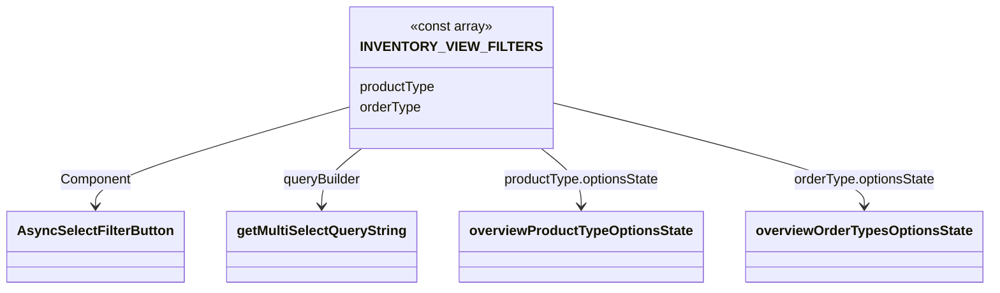

# Diagram: web/portal/src/pages/inventoryview/dashboard/search/InventoryView.Dashboard.AdvancedFilters.js

> Auto-generated by Obscura crawlers

## Mermaid

### SVG

<svg id="container" width="1131.484375" xmlns="http://www.w3.org/2000/svg" class="classDiagram" height="342" viewBox="0 0 1131.484375 342" role="graphics-document document" aria-roledescription="class"><g><defs><marker id="container_class-aggregationStart" class="marker aggregation class" refX="18" refY="7" markerWidth="190" markerHeight="240" orient="auto"><path d="M 18,7 L9,13 L1,7 L9,1 Z"></path></marker></defs><defs><marker id="container_class-aggregationEnd" class="marker aggregation class" refX="1" refY="7" markerWidth="20" markerHeight="28" orient="auto"><path d="M 18,7 L9,13 L1,7 L9,1 Z"></path></marker></defs><defs><marker id="container_class-extensionStart" class="marker extension class" refX="18" refY="7" markerWidth="190" markerHeight="240" orient="auto"><path d="M 1,7 L18,13 V 1 Z"></path></marker></defs><defs><marker id="container_class-extensionEnd" class="marker extension class" refX="1" refY="7" markerWidth="20" markerHeight="28" orient="auto"><path d="M 1,1 V 13 L18,7 Z"></path></marker></defs><defs><marker id="container_class-compositionStart" class="marker composition class" refX="18" refY="7" markerWidth="190" markerHeight="240" orient="auto"><path d="M 18,7 L9,13 L1,7 L9,1 Z"></path></marker></defs><defs><marker id="container_class-compositionEnd" class="marker composition class" refX="1" refY="7" markerWidth="20" markerHeight="28" orient="auto"><path d="M 18,7 L9,13 L1,7 L9,1 Z"></path></marker></defs><defs><marker id="container_class-dependencyStart" class="marker dependency class" refX="6" refY="7" markerWidth="190" markerHeight="240" orient="auto"><path d="M 5,7 L9,13 L1,7 L9,1 Z"></path></marker></defs><defs><marker id="container_class-dependencyEnd" class="marker dependency class" refX="13" refY="7" markerWidth="20" markerHeight="28" orient="auto"><path d="M 18,7 L9,13 L14,7 L9,1 Z"></path></marker></defs><defs><marker id="container_class-lollipopStart" class="marker lollipop class" refX="13" refY="7" markerWidth="190" markerHeight="240" orient="auto"><circle stroke="black" fill="transparent" cx="7" cy="7" r="6"></circle></marker></defs><defs><marker id="container_class-lollipopEnd" class="marker lollipop class" refX="1" refY="7" markerWidth="190" markerHeight="240" orient="auto"><circle stroke="black" fill="transparent" cx="7" cy="7" r="6"></circle></marker></defs><g class="root"><g class="clusters"></g><g class="edgePaths"><path d="M409.859,123.173L359.448,138.145C309.036,153.116,208.214,183.058,157.802,203.196C107.391,223.333,107.391,233.667,107.391,238.833L107.391,244" id="id_INVENTORY_VIEW_FILTERS_AsyncSelectFilterButton_1" class="edge-thickness-normal edge-pattern-solid relation" style=";;;" data-edge="true" data-et="edge" data-id="id_INVENTORY_VIEW_FILTERS_AsyncSelectFilterButton_1" data-points="W3sieCI6NDA5Ljg1OTM3NSwieSI6MTIzLjE3MzQxNjE2ODEyMzk1fSx7IngiOjEwNy4zOTA2MjUsInkiOjIxM30seyJ4IjoxMDcuMzkwNjI1LCJ5IjoyNTB9XQ==" marker-end="url(#container_class-dependencyEnd)"></path><path d="M411.363,176L403.767,182.167C396.172,188.333,380.98,200.667,373.385,212C365.789,223.333,365.789,233.667,365.789,238.833L365.789,244" id="id_INVENTORY_VIEW_FILTERS_getMultiSelectQueryString_2" class="edge-thickness-normal edge-pattern-solid relation" style=";;;" data-edge="true" data-et="edge" data-id="id_INVENTORY_VIEW_FILTERS_getMultiSelectQueryString_2" data-points="W3sieCI6NDExLjM2Mjk5MDcwMjQ3OTM1LCJ5IjoxNzZ9LHsieCI6MzY1Ljc4OTA2MjUsInkiOjIxM30seyJ4IjozNjUuNzg5MDYyNSwieSI6MjUwfV0=" marker-end="url(#container_class-dependencyEnd)"></path><path d="M618.293,176L625.889,182.167C633.485,188.333,648.676,200.667,656.272,212C663.867,223.333,663.867,233.667,663.867,238.833L663.867,244" id="id_INVENTORY_VIEW_FILTERS_overviewProductTypeOptionsState_3" class="edge-thickness-normal edge-pattern-solid relation" style=";;;" data-edge="true" data-et="edge" data-id="id_INVENTORY_VIEW_FILTERS_overviewProductTypeOptionsState_3" data-points="W3sieCI6NjE4LjI5MzI1OTI5NzUyMDYsInkiOjE3Nn0seyJ4Ijo2NjMuODY3MTg3NSwieSI6MjEzfSx7IngiOjY2My44NjcxODc1LCJ5IjoyNTB9XQ==" marker-end="url(#container_class-dependencyEnd)"></path><path d="M619.797,118.831L681.199,134.526C742.602,150.221,865.406,181.61,926.809,202.472C988.211,223.333,988.211,233.667,988.211,238.833L988.211,244" id="id_INVENTORY_VIEW_FILTERS_overviewOrderTypesOptionsState_4" class="edge-thickness-normal edge-pattern-solid relation" style=";;;" data-edge="true" data-et="edge" data-id="id_INVENTORY_VIEW_FILTERS_overviewOrderTypesOptionsState_4" data-points="W3sieCI6NjE5Ljc5Njg3NSwieSI6MTE4LjgzMDc1NjAyNzkyNDAyfSx7IngiOjk4OC4yMTA5Mzc1LCJ5IjoyMTN9LHsieCI6OTg4LjIxMDkzNzUsInkiOjI1MH1d" marker-end="url(#container_class-dependencyEnd)"></path></g><g class="edgeLabels"><g class="edgeLabel" transform="translate(107.390625, 213)"><g class="label" data-id="id_INVENTORY_VIEW_FILTERS_AsyncSelectFilterButton_1" transform="translate(-41.8984375, -12)"><foreignObject width="83.796875" height="24">

Component

</foreignObject></g></g><g class="edgeLabel" transform="translate(365.7890625, 213)"><g class="label" data-id="id_INVENTORY_VIEW_FILTERS_getMultiSelectQueryString_2" transform="translate(-47.140625, -12)"><foreignObject width="94.28125" height="24">

queryBuilder

</foreignObject></g></g><g class="edgeLabel" transform="translate(663.8671875, 213)"><g class="label" data-id="id_INVENTORY_VIEW_FILTERS_overviewProductTypeOptionsState_3" transform="translate(-93.390625, -12)"><foreignObject width="186.78125" height="24">

productType.optionsState

</foreignObject></g></g><g class="edgeLabel" transform="translate(988.2109375, 213)"><g class="label" data-id="id_INVENTORY_VIEW_FILTERS_overviewOrderTypesOptionsState_4" transform="translate(-84.71875, -12)"><foreignObject width="169.4375" height="24">

orderType.optionsState

</foreignObject></g></g></g><g class="nodes"><g class="node default" id="classId-getMultiSelectQueryString-0" transform="translate(365.7890625, 292)"><g class="basic label-container"><path d="M-109.0078125 -42 L109.0078125 -42 L109.0078125 42 L-109.0078125 42" stroke="none" stroke-width="0" fill="#ECECFF" style=""></path><path d="M-109.0078125 -42 C-41.53969855457308 -42, 25.928415390853843 -42, 109.0078125 -42 M-109.0078125 -42 C-60.487091225813565 -42, -11.96636995162713 -42, 109.0078125 -42 M109.0078125 -42 C109.0078125 -11.400479147724727, 109.0078125 19.199041704550545, 109.0078125 42 M109.0078125 -42 C109.0078125 -23.126126095256623, 109.0078125 -4.252252190513246, 109.0078125 42 M109.0078125 42 C32.81407853234178 42, -43.37965543531644 42, -109.0078125 42 M109.0078125 42 C52.875684590743575 42, -3.2564433185128507 42, -109.0078125 42 M-109.0078125 42 C-109.0078125 13.213188016534733, -109.0078125 -15.573623966930533, -109.0078125 -42 M-109.0078125 42 C-109.0078125 18.417286111574786, -109.0078125 -5.165427776850429, -109.0078125 -42" stroke="#9370DB" stroke-width="1.3" fill="none" stroke-dasharray="0 0" style=""></path></g><g class="annotation-group text" transform="translate(0, -18)"></g><g class="label-group text" transform="translate(-97.0078125, -18)"><g class="label" style="font-weight: bolder" transform="translate(0,-12)"><foreignObject width="194.015625" height="24">

getMultiSelectQueryString

</foreignObject></g></g><g class="members-group text" transform="translate(-97.0078125, 30)"></g><g class="methods-group text" transform="translate(-97.0078125, 60)"></g><g class="divider" style=""><path d="M-109.0078125 6 C-29.577155224563583 6, 49.853502050872834 6, 109.0078125 6 M-109.0078125 6 C-47.52144280949417 6, 13.964926881011664 6, 109.0078125 6" stroke="#9370DB" stroke-width="1.3" fill="none" stroke-dasharray="0 0" style=""></path></g><g class="divider" style=""><path d="M-109.0078125 24 C-29.49465270007775 24, 50.0185070998445 24, 109.0078125 24 M-109.0078125 24 C-59.0869164247623 24, -9.1660203495246 24, 109.0078125 24" stroke="#9370DB" stroke-width="1.3" fill="none" stroke-dasharray="0 0" style=""></path></g></g><g class="node default" id="classId-AsyncSelectFilterButton-1" transform="translate(107.390625, 292)"><g class="basic label-container"><path d="M-99.390625 -42 L99.390625 -42 L99.390625 42 L-99.390625 42" stroke="none" stroke-width="0" fill="#ECECFF" style=""></path><path d="M-99.390625 -42 C-55.413942318542965 -42, -11.43725963708593 -42, 99.390625 -42 M-99.390625 -42 C-35.675160828318404 -42, 28.040303343363192 -42, 99.390625 -42 M99.390625 -42 C99.390625 -23.511825265911966, 99.390625 -5.023650531823932, 99.390625 42 M99.390625 -42 C99.390625 -23.890273197153757, 99.390625 -5.780546394307514, 99.390625 42 M99.390625 42 C35.560463473317974 42, -28.269698053364053 42, -99.390625 42 M99.390625 42 C27.937822270759938 42, -43.514980458480125 42, -99.390625 42 M-99.390625 42 C-99.390625 22.556715455331414, -99.390625 3.113430910662828, -99.390625 -42 M-99.390625 42 C-99.390625 10.195904653968721, -99.390625 -21.608190692062557, -99.390625 -42" stroke="#9370DB" stroke-width="1.3" fill="none" stroke-dasharray="0 0" style=""></path></g><g class="annotation-group text" transform="translate(0, -18)"></g><g class="label-group text" transform="translate(-87.390625, -18)"><g class="label" style="font-weight: bolder" transform="translate(0,-12)"><foreignObject width="174.78125" height="24">

AsyncSelectFilterButton

</foreignObject></g></g><g class="members-group text" transform="translate(-87.390625, 30)"></g><g class="methods-group text" transform="translate(-87.390625, 60)"></g><g class="divider" style=""><path d="M-99.390625 6 C-55.68936679754692 6, -11.988108595093834 6, 99.390625 6 M-99.390625 6 C-31.273141703155204 6, 36.84434159368959 6, 99.390625 6" stroke="#9370DB" stroke-width="1.3" fill="none" stroke-dasharray="0 0" style=""></path></g><g class="divider" style=""><path d="M-99.390625 24 C-38.388546270320134 24, 22.61353245935973 24, 99.390625 24 M-99.390625 24 C-21.94957256369139 24, 55.49147987261722 24, 99.390625 24" stroke="#9370DB" stroke-width="1.3" fill="none" stroke-dasharray="0 0" style=""></path></g></g><g class="node default" id="classId-overviewOrderTypesOptionsState-2" transform="translate(988.2109375, 292)"><g class="basic label-container"><path d="M-135.2734375 -42 L135.2734375 -42 L135.2734375 42 L-135.2734375 42" stroke="none" stroke-width="0" fill="#ECECFF" style=""></path><path d="M-135.2734375 -42 C-33.84602083171707 -42, 67.58139583656586 -42, 135.2734375 -42 M-135.2734375 -42 C-36.61669592264788 -42, 62.040045654704244 -42, 135.2734375 -42 M135.2734375 -42 C135.2734375 -10.167449635302663, 135.2734375 21.665100729394673, 135.2734375 42 M135.2734375 -42 C135.2734375 -9.89591789330273, 135.2734375 22.20816421339454, 135.2734375 42 M135.2734375 42 C68.05031358031687 42, 0.827189660633735 42, -135.2734375 42 M135.2734375 42 C41.12712165715001 42, -53.01919418569997 42, -135.2734375 42 M-135.2734375 42 C-135.2734375 17.189030172650636, -135.2734375 -7.621939654698728, -135.2734375 -42 M-135.2734375 42 C-135.2734375 15.876529391373428, -135.2734375 -10.246941217253145, -135.2734375 -42" stroke="#9370DB" stroke-width="1.3" fill="none" stroke-dasharray="0 0" style=""></path></g><g class="annotation-group text" transform="translate(0, -18)"></g><g class="label-group text" transform="translate(-123.2734375, -18)"><g class="label" style="font-weight: bolder" transform="translate(0,-12)"><foreignObject width="246.546875" height="24">

overviewOrderTypesOptionsState

</foreignObject></g></g><g class="members-group text" transform="translate(-123.2734375, 30)"></g><g class="methods-group text" transform="translate(-123.2734375, 60)"></g><g class="divider" style=""><path d="M-135.2734375 6 C-52.76766257919769 6, 29.73811234160462 6, 135.2734375 6 M-135.2734375 6 C-41.8473417467703 6, 51.578754006459405 6, 135.2734375 6" stroke="#9370DB" stroke-width="1.3" fill="none" stroke-dasharray="0 0" style=""></path></g><g class="divider" style=""><path d="M-135.2734375 24 C-54.62454712995577 24, 26.024343240088456 24, 135.2734375 24 M-135.2734375 24 C-51.09289911641697 24, 33.087639267166054 24, 135.2734375 24" stroke="#9370DB" stroke-width="1.3" fill="none" stroke-dasharray="0 0" style=""></path></g></g><g class="node default" id="classId-overviewProductTypeOptionsState-3" transform="translate(663.8671875, 292)"><g class="basic label-container"><path d="M-139.0703125 -42 L139.0703125 -42 L139.0703125 42 L-139.0703125 42" stroke="none" stroke-width="0" fill="#ECECFF" style=""></path><path d="M-139.0703125 -42 C-49.53170085933097 -42, 40.006910781338064 -42, 139.0703125 -42 M-139.0703125 -42 C-30.222937165763653 -42, 78.6244381684727 -42, 139.0703125 -42 M139.0703125 -42 C139.0703125 -12.697199736610386, 139.0703125 16.605600526779227, 139.0703125 42 M139.0703125 -42 C139.0703125 -19.265835313010896, 139.0703125 3.4683293739782073, 139.0703125 42 M139.0703125 42 C53.72669895201025 42, -31.616914595979495 42, -139.0703125 42 M139.0703125 42 C52.66470120025669 42, -33.74091009948663 42, -139.0703125 42 M-139.0703125 42 C-139.0703125 22.422036917393665, -139.0703125 2.8440738347873307, -139.0703125 -42 M-139.0703125 42 C-139.0703125 12.71769438532316, -139.0703125 -16.56461122935368, -139.0703125 -42" stroke="#9370DB" stroke-width="1.3" fill="none" stroke-dasharray="0 0" style=""></path></g><g class="annotation-group text" transform="translate(0, -18)"></g><g class="label-group text" transform="translate(-127.0703125, -18)"><g class="label" style="font-weight: bolder" transform="translate(0,-12)"><foreignObject width="254.140625" height="24">

overviewProductTypeOptionsState

</foreignObject></g></g><g class="members-group text" transform="translate(-127.0703125, 30)"></g><g class="methods-group text" transform="translate(-127.0703125, 60)"></g><g class="divider" style=""><path d="M-139.0703125 6 C-44.6606256159433 6, 49.749061268113394 6, 139.0703125 6 M-139.0703125 6 C-44.1798088384741 6, 50.710694823051796 6, 139.0703125 6" stroke="#9370DB" stroke-width="1.3" fill="none" stroke-dasharray="0 0" style=""></path></g><g class="divider" style=""><path d="M-139.0703125 24 C-79.95859594734085 24, -20.846879394681693 24, 139.0703125 24 M-139.0703125 24 C-75.4073849769276 24, -11.744457453855219 24, 139.0703125 24" stroke="#9370DB" stroke-width="1.3" fill="none" stroke-dasharray="0 0" style=""></path></g></g><g class="node default" id="classId-INVENTORY_VIEW_FILTERS-4" transform="translate(514.828125, 92)"><g class="basic label-container"><path d="M-104.96875 -84 L104.96875 -84 L104.96875 84 L-104.96875 84" stroke="none" stroke-width="0" fill="#ECECFF" style=""></path><path d="M-104.96875 -84 C-25.98089643576779 -84, 53.00695712846442 -84, 104.96875 -84 M-104.96875 -84 C-39.15134191636113 -84, 26.666066167277734 -84, 104.96875 -84 M104.96875 -84 C104.96875 -39.23346735875319, 104.96875 5.533065282493624, 104.96875 84 M104.96875 -84 C104.96875 -16.87453556677049, 104.96875 50.25092886645902, 104.96875 84 M104.96875 84 C37.979641728193 84, -29.009466543613996 84, -104.96875 84 M104.96875 84 C43.043699640786706 84, -18.88135071842659 84, -104.96875 84 M-104.96875 84 C-104.96875 40.244645327282065, -104.96875 -3.5107093454358704, -104.96875 -84 M-104.96875 84 C-104.96875 35.74348940992345, -104.96875 -12.513021180153103, -104.96875 -84" stroke="#9370DB" stroke-width="1.3" fill="none" stroke-dasharray="0 0" style=""></path></g><g class="annotation-group text" transform="translate(-49.15625, -60)"><g class="label" style="" transform="translate(0,-12)"><foreignObject width="98.3125" height="24">

«const array»

</foreignObject></g></g><g class="label-group text" transform="translate(-92.96875, -36)"><g class="label" style="font-weight: bolder" transform="translate(0,-12)"><foreignObject width="185.9375" height="24">

INVENTORY_VIEW_FILTERS

</foreignObject></g></g><g class="members-group text" transform="translate(-92.96875, 12)"><g class="label" style="" transform="translate(0,-12)"><foreignObject width="90.578125" height="24">

productType

</foreignObject></g><g class="label" style="" transform="translate(0,12)"><foreignObject width="73.234375" height="24">

orderType

</foreignObject></g></g><g class="methods-group text" transform="translate(-92.96875, 84)"></g><g class="divider" style=""><path d="M-104.96875 -12 C-23.499662024449336 -12, 57.96942595110133 -12, 104.96875 -12 M-104.96875 -12 C-46.02078838678028 -12, 12.927173226439436 -12, 104.96875 -12" stroke="#9370DB" stroke-width="1.3" fill="none" stroke-dasharray="0 0" style=""></path></g><g class="divider" style=""><path d="M-104.96875 60 C-56.82703917751439 60, -8.685328355028787 60, 104.96875 60 M-104.96875 60 C-50.98512089496419 60, 2.99850821007162 60, 104.96875 60" stroke="#9370DB" stroke-width="1.3" fill="none" stroke-dasharray="0 0" style=""></path></g></g></g></g></g></svg>
