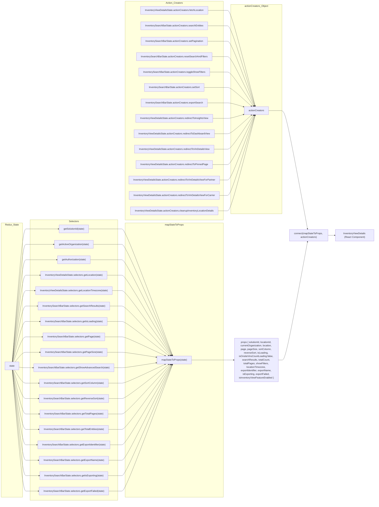
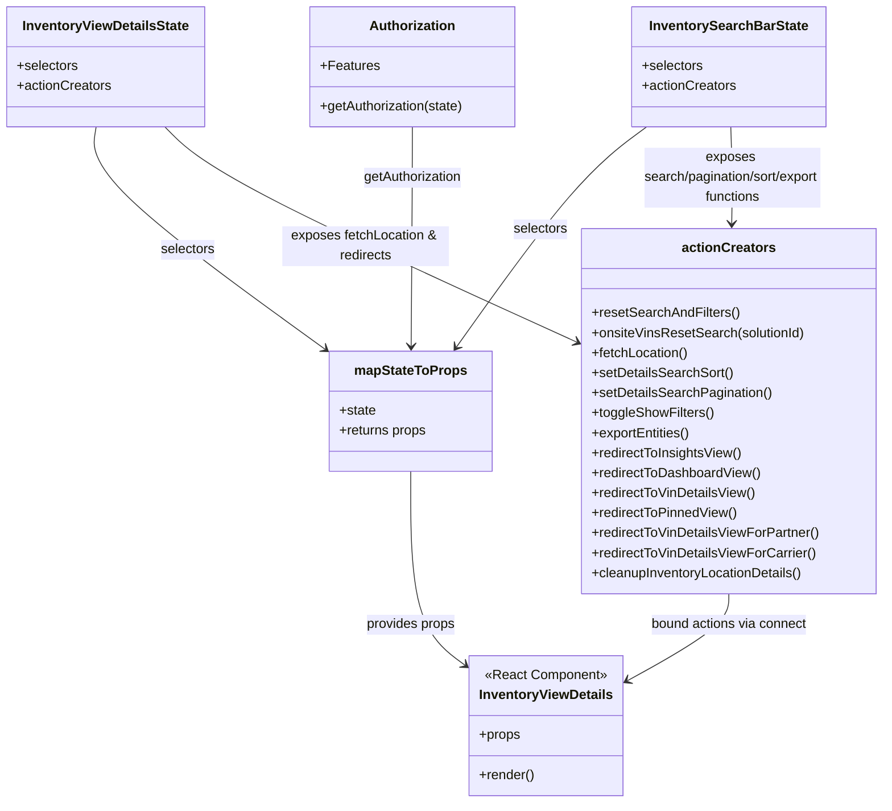

# Diagram: web/portal/src/pages/inventoryview/details/InventoryView.Details.page.container.js

> Auto-generated by Obscura crawlers

## Diagram 1

### SVG

<svg id="container" width="2534.390625" xmlns="http://www.w3.org/2000/svg" class="flowchart" height="3382" viewBox="0 0 2534.390625 3382" role="graphics-document document" aria-roledescription="flowchart-v2"><g><marker id="container_flowchart-v2-pointEnd" class="marker flowchart-v2" viewBox="0 0 10 10" refX="5" refY="5" markerUnits="userSpaceOnUse" markerWidth="8" markerHeight="8" orient="auto"><path d="M 0 0 L 10 5 L 0 10 z" class="arrowMarkerPath" style="stroke-width: 1; stroke-dasharray: 1, 0;"></path></marker><marker id="container_flowchart-v2-pointStart" class="marker flowchart-v2" viewBox="0 0 10 10" refX="4.5" refY="5" markerUnits="userSpaceOnUse" markerWidth="8" markerHeight="8" orient="auto"><path d="M 0 5 L 10 10 L 10 0 z" class="arrowMarkerPath" style="stroke-width: 1; stroke-dasharray: 1, 0;"></path></marker><marker id="container_flowchart-v2-circleEnd" class="marker flowchart-v2" viewBox="0 0 10 10" refX="11" refY="5" markerUnits="userSpaceOnUse" markerWidth="11" markerHeight="11" orient="auto"><circle cx="5" cy="5" r="5" class="arrowMarkerPath" style="stroke-width: 1; stroke-dasharray: 1, 0;"></circle></marker><marker id="container_flowchart-v2-circleStart" class="marker flowchart-v2" viewBox="0 0 10 10" refX="-1" refY="5" markerUnits="userSpaceOnUse" markerWidth="11" markerHeight="11" orient="auto"><circle cx="5" cy="5" r="5" class="arrowMarkerPath" style="stroke-width: 1; stroke-dasharray: 1, 0;"></circle></marker><marker id="container_flowchart-v2-crossEnd" class="marker cross flowchart-v2" viewBox="0 0 11 11" refX="12" refY="5.2" markerUnits="userSpaceOnUse" markerWidth="11" markerHeight="11" orient="auto"><path d="M 1,1 l 9,9 M 10,1 l -9,9" class="arrowMarkerPath" style="stroke-width: 2; stroke-dasharray: 1, 0;"></path></marker><marker id="container_flowchart-v2-crossStart" class="marker cross flowchart-v2" viewBox="0 0 11 11" refX="-1" refY="5.2" markerUnits="userSpaceOnUse" markerWidth="11" markerHeight="11" orient="auto"><path d="M 1,1 l 9,9 M 10,1 l -9,9" class="arrowMarkerPath" style="stroke-width: 2; stroke-dasharray: 1, 0;"></path></marker><g class="root"><g class="clusters"><g class="cluster" id="actionCreators_Object" data-look="classic"><rect style="" x="1561.515625" y="30" width="344.875" height="1412"></rect><g class="cluster-label" transform="translate(1654.0078125, 30)"><foreignObject width="159.890625" height="24">

actionCreators_Object

</foreignObject></g></g><g class="cluster" id="Action_Creators" data-look="classic"><rect style="" x="843.15625" y="8" width="668.359375" height="1476"></rect><g class="cluster-label" transform="translate(1120.59375, 8)"><foreignObject width="113.484375" height="24">

Action_Creators

</foreignObject></g></g><g class="cluster" id="mapStateToProps" data-look="classic"><rect style="" x="843.15625" y="1504" width="668.359375" height="1849"></rect><g class="cluster-label" transform="translate(1113.8359375, 1504)"><foreignObject width="127" height="24">

mapStateToProps

</foreignObject></g></g><g class="cluster" id="Selectors" data-look="classic"><rect style="" x="204.109375" y="1482" width="589.046875" height="1892"></rect><g class="cluster-label" transform="translate(465.2734375, 1482)"><foreignObject width="66.71875" height="24">

Selectors

</foreignObject></g></g><g class="cluster" id="Redux_State" data-look="classic"><rect style="" x="8" y="1504" width="146.109375" height="1849"></rect><g class="cluster-label" transform="translate(35.9765625, 1504)"><foreignObject width="90.15625" height="24">

Redux_State

</foreignObject></g></g></g><g class="edgePaths"><path d="M83.176,2447L94.998,2296.5C106.82,2146,130.465,1845,146.454,1694.5C162.443,1544,170.776,1544,179.109,1544C187.443,1544,195.776,1544,231.331,1544C266.885,1544,329.661,1544,361.049,1544L392.438,1544" id="L_State_S_solutionId_0" class="edge-thickness-normal edge-pattern-solid edge-thickness-normal edge-pattern-solid flowchart-link" style=";" data-edge="true" data-et="edge" data-id="L_State_S_solutionId_0" data-points="W3sieCI6ODMuMTc1NjMwMDQwMzIyNTcsInkiOjI0NDd9LHsieCI6MTU0LjEwOTM3NSwieSI6MTU0NH0seyJ4IjoxNzkuMTA5Mzc1LCJ5IjoxNTQ0fSx7IngiOjIwNC4xMDkzNzUsInkiOjE1NDR9LHsieCI6Mzk2LjQzNzUsInkiOjE1NDR9XQ==" marker-end="url(#container_flowchart-v2-pointEnd)"></path><path d="M83.443,2447L95.22,2313.833C106.998,2180.667,130.554,1914.333,146.498,1781.167C162.443,1648,170.776,1648,179.109,1648C187.443,1648,195.776,1648,226.301,1648C256.826,1648,309.542,1648,335.9,1648L362.258,1648" id="L_State_S_activeOrg_0" class="edge-thickness-normal edge-pattern-solid edge-thickness-normal edge-pattern-solid flowchart-link" style=";" data-edge="true" data-et="edge" data-id="L_State_S_activeOrg_0" data-points="W3sieCI6ODMuNDQyNjczNjUzMTQ3NywieSI6MjQ0N30seyJ4IjoxNTQuMTA5Mzc1LCJ5IjoxNjQ4fSx7IngiOjE3OS4xMDkzNzUsInkiOjE2NDh9LHsieCI6MjA0LjEwOTM3NSwieSI6MTY0OH0seyJ4IjozNjYuMjU3ODEyNSwieSI6MTY0OH1d" marker-end="url(#container_flowchart-v2-pointEnd)"></path><path d="M83.787,2447L95.507,2331.167C107.228,2215.333,130.668,1983.667,146.556,1867.833C162.443,1752,170.776,1752,179.109,1752C187.443,1752,195.776,1752,229.434,1752C263.091,1752,322.073,1752,351.564,1752L381.055,1752" id="L_State_S_auth_0" class="edge-thickness-normal edge-pattern-solid edge-thickness-normal edge-pattern-solid flowchart-link" style=";" data-edge="true" data-et="edge" data-id="L_State_S_auth_0" data-points="W3sieCI6ODMuNzg2NjQ5NDk3OTIyNDQsInkiOjI0NDd9LHsieCI6MTU0LjEwOTM3NSwieSI6MTc1Mn0seyJ4IjoxNzkuMTA5Mzc1LCJ5IjoxNzUyfSx7IngiOjIwNC4xMDkzNzUsInkiOjE3NTJ9LHsieCI6Mzg1LjA1NDY4NzUsInkiOjE3NTJ9XQ==" marker-end="url(#container_flowchart-v2-pointEnd)"></path><path d="M84.246,2447L95.89,2348.5C107.534,2250,130.822,2053,146.632,1954.5C162.443,1856,170.776,1856,179.109,1856C187.443,1856,195.776,1856,210.543,1856C225.31,1856,246.51,1856,257.111,1856L267.711,1856" id="L_State_SV_getLocation_0" class="edge-thickness-normal edge-pattern-solid edge-thickness-normal edge-pattern-solid flowchart-link" style=";" data-edge="true" data-et="edge" data-id="L_State_SV_getLocation_0" data-points="W3sieCI6ODQuMjQ2Mzk3MTQ4MDU4MjUsInkiOjI0NDd9LHsieCI6MTU0LjEwOTM3NSwieSI6MTg1Nn0seyJ4IjoxNzkuMTA5Mzc1LCJ5IjoxODU2fSx7IngiOjIwNC4xMDkzNzUsInkiOjE4NTZ9LHsieCI6MjcxLjcxMDkzNzUsInkiOjE4NTZ9XQ==" marker-end="url(#container_flowchart-v2-pointEnd)"></path><path d="M84.892,2447L96.428,2365.833C107.965,2284.667,131.037,2122.333,146.74,2041.167C162.443,1960,170.776,1960,179.109,1960C187.443,1960,195.776,1960,204.758,1960C213.74,1960,223.37,1960,228.185,1960L233,1960" id="L_State_SV_getLocationTZ_0" class="edge-thickness-normal edge-pattern-solid edge-thickness-normal edge-pattern-solid flowchart-link" style=";" data-edge="true" data-et="edge" data-id="L_State_SV_getLocationTZ_0" data-points="W3sieCI6ODQuODkyMTkwNTM5ODgzMjcsInkiOjI0NDd9LHsieCI6MTU0LjEwOTM3NSwieSI6MTk2MH0seyJ4IjoxNzkuMTA5Mzc1LCJ5IjoxOTYwfSx7IngiOjIwNC4xMDkzNzUsInkiOjE5NjB9LHsieCI6MjM3LCJ5IjoxOTYwfV0=" marker-end="url(#container_flowchart-v2-pointEnd)"></path><path d="M85.866,2447L97.24,2383.167C108.614,2319.333,131.361,2191.667,146.902,2127.833C162.443,2064,170.776,2064,179.109,2064C187.443,2064,195.776,2064,208.116,2064C220.456,2064,236.802,2064,244.975,2064L253.148,2064" id="L_State_SB_getSearchResults_0" class="edge-thickness-normal edge-pattern-solid edge-thickness-normal edge-pattern-solid flowchart-link" style=";" data-edge="true" data-et="edge" data-id="L_State_SB_getSearchResults_0" data-points="W3sieCI6ODUuODY1NjA1OTQ1MTIxOTYsInkiOjI0NDd9LHsieCI6MTU0LjEwOTM3NSwieSI6MjA2NH0seyJ4IjoxNzkuMTA5Mzc1LCJ5IjoyMDY0fSx7IngiOjIwNC4xMDkzNzUsInkiOjIwNjR9LHsieCI6MjU3LjE0ODQzNzUsInkiOjIwNjR9XQ==" marker-end="url(#container_flowchart-v2-pointEnd)"></path><path d="M87.501,2447L98.602,2400.5C109.704,2354,131.906,2261,147.175,2214.5C162.443,2168,170.776,2168,179.109,2168C187.443,2168,195.776,2168,210.796,2168C225.815,2168,247.521,2168,258.374,2168L269.227,2168" id="L_State_SB_getIsLoading_0" class="edge-thickness-normal edge-pattern-solid edge-thickness-normal edge-pattern-solid flowchart-link" style=";" data-edge="true" data-et="edge" data-id="L_State_SB_getIsLoading_0" data-points="W3sieCI6ODcuNTAwNjg5MzM4MjM1MjksInkiOjI0NDd9LHsieCI6MTU0LjEwOTM3NSwieSI6MjE2OH0seyJ4IjoxNzkuMTA5Mzc1LCJ5IjoyMTY4fSx7IngiOjIwNC4xMDkzNzUsInkiOjIxNjh9LHsieCI6MjczLjIyNjU2MjUsInkiOjIxNjh9XQ==" marker-end="url(#container_flowchart-v2-pointEnd)"></path><path d="M90.819,2447L101.368,2417.833C111.916,2388.667,133.013,2330.333,147.728,2301.167C162.443,2272,170.776,2272,179.109,2272C187.443,2272,195.776,2272,213.77,2272C231.763,2272,259.417,2272,273.243,2272L287.07,2272" id="L_State_SB_getPage_0" class="edge-thickness-normal edge-pattern-solid edge-thickness-normal edge-pattern-solid flowchart-link" style=";" data-edge="true" data-et="edge" data-id="L_State_SB_getPage_0" data-points="W3sieCI6OTAuODE5NDIyOTU3OTIwNzksInkiOjI0NDd9LHsieCI6MTU0LjEwOTM3NSwieSI6MjI3Mn0seyJ4IjoxNzkuMTA5Mzc1LCJ5IjoyMjcyfSx7IngiOjIwNC4xMDkzNzUsInkiOjIyNzJ9LHsieCI6MjkxLjA3MDMxMjUsInkiOjIyNzJ9XQ==" marker-end="url(#container_flowchart-v2-pointEnd)"></path><path d="M101.182,2447L110.003,2435.167C118.824,2423.333,136.467,2399.667,149.455,2387.833C162.443,2376,170.776,2376,179.109,2376C187.443,2376,195.776,2376,211.367,2376C226.958,2376,249.807,2376,261.232,2376L272.656,2376" id="L_State_SB_getPageSize_0" class="edge-thickness-normal edge-pattern-solid edge-thickness-normal edge-pattern-solid flowchart-link" style=";" data-edge="true" data-et="edge" data-id="L_State_SB_getPageSize_0" data-points="W3sieCI6MTAxLjE4MTk5OTM2MjI0NDksInkiOjI0NDd9LHsieCI6MTU0LjEwOTM3NSwieSI6MjM3Nn0seyJ4IjoxNzkuMTA5Mzc1LCJ5IjoyMzc2fSx7IngiOjIwNC4xMDkzNzUsInkiOjIzNzZ9LHsieCI6Mjc2LjY1NjI1LCJ5IjoyMzc2fV0=" marker-end="url(#container_flowchart-v2-pointEnd)"></path><path d="M129.109,2477.947L133.276,2478.289C137.443,2478.631,145.776,2479.316,154.109,2479.658C162.443,2480,170.776,2480,179.109,2480C187.443,2480,195.776,2480,203.443,2480C211.109,2480,218.109,2480,221.609,2480L225.109,2480" id="L_State_SB_getShowAdvanced_0" class="edge-thickness-normal edge-pattern-solid edge-thickness-normal edge-pattern-solid flowchart-link" style=";" data-edge="true" data-et="edge" data-id="L_State_SB_getShowAdvanced_0" data-points="W3sieCI6MTI5LjEwOTM3NSwieSI6MjQ3Ny45NDY3NDM2NjM3Nzl9LHsieCI6MTU0LjEwOTM3NSwieSI6MjQ4MH0seyJ4IjoxNzkuMTA5Mzc1LCJ5IjoyNDgwfSx7IngiOjIwNC4xMDkzNzUsInkiOjI0ODB9LHsieCI6MjI5LjEwOTM3NSwieSI6MjQ4MH1d" marker-end="url(#container_flowchart-v2-pointEnd)"></path><path d="M98.986,2501L108.173,2514.833C117.361,2528.667,135.735,2556.333,149.089,2570.167C162.443,2584,170.776,2584,179.109,2584C187.443,2584,195.776,2584,209.491,2584C223.206,2584,242.302,2584,251.85,2584L261.398,2584" id="L_State_SB_getSortColumn_0" class="edge-thickness-normal edge-pattern-solid edge-thickness-normal edge-pattern-solid flowchart-link" style=";" data-edge="true" data-et="edge" data-id="L_State_SB_getSortColumn_0" data-points="W3sieCI6OTguOTg2MjkyNjEzNjM2MzcsInkiOjI1MDF9LHsieCI6MTU0LjEwOTM3NSwieSI6MjU4NH0seyJ4IjoxNzkuMTA5Mzc1LCJ5IjoyNTg0fSx7IngiOjIwNC4xMDkzNzUsInkiOjI1ODR9LHsieCI6MjY1LjM5ODQzNzUsInkiOjI1ODR9XQ==" marker-end="url(#container_flowchart-v2-pointEnd)"></path><path d="M90.272,2501L100.911,2532.167C111.551,2563.333,132.83,2625.667,147.636,2656.833C162.443,2688,170.776,2688,179.109,2688C187.443,2688,195.776,2688,209.35,2688C222.924,2688,241.74,2688,251.147,2688L260.555,2688" id="L_State_SB_getReverseSort_0" class="edge-thickness-normal edge-pattern-solid edge-thickness-normal edge-pattern-solid flowchart-link" style=";" data-edge="true" data-et="edge" data-id="L_State_SB_getReverseSort_0" data-points="W3sieCI6OTAuMjcxODY3Njk4NTk4MTMsInkiOjI1MDF9LHsieCI6MTU0LjEwOTM3NSwieSI6MjY4OH0seyJ4IjoxNzkuMTA5Mzc1LCJ5IjoyNjg4fSx7IngiOjIwNC4xMDkzNzUsInkiOjI2ODh9LHsieCI6MjY0LjU1NDY4NzUsInkiOjI2ODh9XQ==" marker-end="url(#container_flowchart-v2-pointEnd)"></path><path d="M87.257,2501L98.399,2549.5C109.541,2598,131.825,2695,147.134,2743.5C162.443,2792,170.776,2792,179.109,2792C187.443,2792,195.776,2792,210.177,2792C224.578,2792,245.047,2792,255.281,2792L265.516,2792" id="L_State_SB_getTotalPages_0" class="edge-thickness-normal edge-pattern-solid edge-thickness-normal edge-pattern-solid flowchart-link" style=";" data-edge="true" data-et="edge" data-id="L_State_SB_getTotalPages_0" data-points="W3sieCI6ODcuMjU3NDQzOTg1ODQ5MDUsInkiOjI1MDF9LHsieCI6MTU0LjEwOTM3NSwieSI6Mjc5Mn0seyJ4IjoxNzkuMTA5Mzc1LCJ5IjoyNzkyfSx7IngiOjIwNC4xMDkzNzUsInkiOjI3OTJ9LHsieCI6MjY5LjUxNTYyNSwieSI6Mjc5Mn1d" marker-end="url(#container_flowchart-v2-pointEnd)"></path><path d="M85.729,2501L97.126,2566.833C108.522,2632.667,131.316,2764.333,146.879,2830.167C162.443,2896,170.776,2896,179.109,2896C187.443,2896,195.776,2896,209.066,2896C222.357,2896,240.604,2896,249.728,2896L258.852,2896" id="L_State_SB_getTotalEntities_0" class="edge-thickness-normal edge-pattern-solid edge-thickness-normal edge-pattern-solid flowchart-link" style=";" data-edge="true" data-et="edge" data-id="L_State_SB_getTotalEntities_0" data-points="W3sieCI6ODUuNzI4ODAyNTc3MDE0MjIsInkiOjI1MDF9LHsieCI6MTU0LjEwOTM3NSwieSI6Mjg5Nn0seyJ4IjoxNzkuMTA5Mzc1LCJ5IjoyODk2fSx7IngiOjIwNC4xMDkzNzUsInkiOjI4OTZ9LHsieCI6MjYyLjg1MTU2MjUsInkiOjI4OTZ9XQ==" marker-end="url(#container_flowchart-v2-pointEnd)"></path><path d="M84.805,2501L96.355,2584.167C107.906,2667.333,131.008,2833.667,146.725,2916.833C162.443,3000,170.776,3000,179.109,3000C187.443,3000,195.776,3000,207.091,3000C218.406,3000,232.703,3000,239.852,3000L247,3000" id="L_State_SB_getExportIdentifier_0" class="edge-thickness-normal edge-pattern-solid edge-thickness-normal edge-pattern-solid flowchart-link" style=";" data-edge="true" data-et="edge" data-id="L_State_SB_getExportIdentifier_0" data-points="W3sieCI6ODQuODA0NjQyOTQyMDE1MiwieSI6MjUwMX0seyJ4IjoxNTQuMTA5Mzc1LCJ5IjozMDAwfSx7IngiOjE3OS4xMDkzNzUsInkiOjMwMDB9LHsieCI6MjA0LjEwOTM3NSwieSI6MzAwMH0seyJ4IjoyNTEsInkiOjMwMDB9XQ==" marker-end="url(#container_flowchart-v2-pointEnd)"></path><path d="M84.186,2501L95.84,2601.5C107.494,2702,130.801,2903,146.622,3003.5C162.443,3104,170.776,3104,179.109,3104C187.443,3104,195.776,3104,209.15,3104C222.523,3104,240.938,3104,250.145,3104L259.352,3104" id="L_State_SB_getExportName_0" class="edge-thickness-normal edge-pattern-solid edge-thickness-normal edge-pattern-solid flowchart-link" style=";" data-edge="true" data-et="edge" data-id="L_State_SB_getExportName_0" data-points="W3sieCI6ODQuMTg1NjAyNjc4NTcxNDMsInkiOjI1MDF9LHsieCI6MTU0LjEwOTM3NSwieSI6MzEwNH0seyJ4IjoxNzkuMTA5Mzc1LCJ5IjozMTA0fSx7IngiOjIwNC4xMDkzNzUsInkiOjMxMDR9LHsieCI6MjYzLjM1MTU2MjUsInkiOjMxMDR9XQ==" marker-end="url(#container_flowchart-v2-pointEnd)"></path><path d="M83.742,2501L95.47,2618.833C107.198,2736.667,130.654,2972.333,146.548,3090.167C162.443,3208,170.776,3208,179.109,3208C187.443,3208,195.776,3208,209.788,3208C223.799,3208,243.49,3208,253.335,3208L263.18,3208" id="L_State_SB_getIsExporting_0" class="edge-thickness-normal edge-pattern-solid edge-thickness-normal edge-pattern-solid flowchart-link" style=";" data-edge="true" data-et="edge" data-id="L_State_SB_getIsExporting_0" data-points="W3sieCI6ODMuNzQxOTg1MjY5MDczNTcsInkiOjI1MDF9LHsieCI6MTU0LjEwOTM3NSwieSI6MzIwOH0seyJ4IjoxNzkuMTA5Mzc1LCJ5IjozMjA4fSx7IngiOjIwNC4xMDkzNzUsInkiOjMyMDh9LHsieCI6MjY3LjE3OTY4NzUsInkiOjMyMDh9XQ==" marker-end="url(#container_flowchart-v2-pointEnd)"></path><path d="M83.408,2501L95.192,2636.167C106.975,2771.333,130.542,3041.667,146.493,3176.833C162.443,3312,170.776,3312,179.109,3312C187.443,3312,195.776,3312,209.07,3312C222.365,3312,240.62,3312,249.747,3312L258.875,3312" id="L_State_SB_getExportFailed_0" class="edge-thickness-normal edge-pattern-solid edge-thickness-normal edge-pattern-solid flowchart-link" style=";" data-edge="true" data-et="edge" data-id="L_State_SB_getExportFailed_0" data-points="W3sieCI6ODMuNDA4NDc4MTQ3Mzc0NywieSI6MjUwMX0seyJ4IjoxNTQuMTA5Mzc1LCJ5IjozMzEyfSx7IngiOjE3OS4xMDkzNzUsInkiOjMzMTJ9LHsieCI6MjA0LjEwOTM3NSwieSI6MzMxMn0seyJ4IjoyNjIuODc1LCJ5IjozMzEyfV0=" marker-end="url(#container_flowchart-v2-pointEnd)"></path><path d="M600.828,1544L632.883,1544C664.938,1544,729.047,1544,765.268,1544C801.49,1544,809.823,1544,818.156,1544C826.49,1544,834.823,1544,892.749,1686.21C950.676,1828.419,1058.195,2112.839,1111.955,2255.049L1165.715,2397.258" id="L_S_solutionId_MSP_0" class="edge-thickness-normal edge-pattern-solid edge-thickness-normal edge-pattern-solid flowchart-link" style=";" data-edge="true" data-et="edge" data-id="L_S_solutionId_MSP_0" data-points="W3sieCI6NjAwLjgyODEyNSwieSI6MTU0NH0seyJ4Ijo3OTMuMTU2MjUsInkiOjE1NDR9LHsieCI6ODE4LjE1NjI1LCJ5IjoxNTQ0fSx7IngiOjg0My4xNTYyNSwieSI6MTU0NH0seyJ4IjoxMTY3LjEyOTA5MTg0MTA2MzQsInkiOjI0MDF9XQ==" marker-end="url(#container_flowchart-v2-pointEnd)"></path><path d="M631.008,1648L658.033,1648C685.057,1648,739.107,1648,770.298,1648C801.49,1648,809.823,1648,818.156,1648C826.49,1648,834.823,1648,892.496,1772.887C950.168,1897.774,1057.181,2147.549,1110.687,2272.436L1164.193,2397.323" id="L_S_activeOrg_MSP_0" class="edge-thickness-normal edge-pattern-solid edge-thickness-normal edge-pattern-solid flowchart-link" style=";" data-edge="true" data-et="edge" data-id="L_S_activeOrg_MSP_0" data-points="W3sieCI6NjMxLjAwNzgxMjUsInkiOjE2NDh9LHsieCI6NzkzLjE1NjI1LCJ5IjoxNjQ4fSx7IngiOjgxOC4xNTYyNSwieSI6MTY0OH0seyJ4Ijo4NDMuMTU2MjUsInkiOjE2NDh9LHsieCI6MTE2NS43NjgxNzkwODY1Mzg2LCJ5IjoyNDAxfV0=" marker-end="url(#container_flowchart-v2-pointEnd)"></path><path d="M612.211,1752L642.368,1752C672.526,1752,732.841,1752,767.165,1752C801.49,1752,809.823,1752,818.156,1752C826.49,1752,834.823,1752,892.166,1859.569C949.509,1967.138,1055.863,2182.276,1109.039,2289.845L1162.216,2397.414" id="L_S_auth_MSP_0" class="edge-thickness-normal edge-pattern-solid edge-thickness-normal edge-pattern-solid flowchart-link" style=";" data-edge="true" data-et="edge" data-id="L_S_auth_MSP_0" data-points="W3sieCI6NjEyLjIxMDkzNzUsInkiOjE3NTJ9LHsieCI6NzkzLjE1NjI1LCJ5IjoxNzUyfSx7IngiOjgxOC4xNTYyNSwieSI6MTc1Mn0seyJ4Ijo4NDMuMTU2MjUsInkiOjE3NTJ9LHsieCI6MTE2My45ODg1MjM5NDYwMDYsInkiOjI0MDF9XQ==" marker-end="url(#container_flowchart-v2-pointEnd)"></path><path d="M725.555,1856L736.822,1856C748.089,1856,770.622,1856,786.056,1856C801.49,1856,809.823,1856,818.156,1856C826.49,1856,834.823,1856,891.721,1946.258C948.619,2036.515,1054.081,2217.031,1106.813,2307.289L1159.544,2397.546" id="L_SV_getLocation_MSP_0" class="edge-thickness-normal edge-pattern-solid edge-thickness-normal edge-pattern-solid flowchart-link" style=";" data-edge="true" data-et="edge" data-id="L_SV_getLocation_MSP_0" data-points="W3sieCI6NzI1LjU1NDY4NzUsInkiOjE4NTZ9LHsieCI6NzkzLjE1NjI1LCJ5IjoxODU2fSx7IngiOjgxOC4xNTYyNSwieSI6MTg1Nn0seyJ4Ijo4NDMuMTU2MjUsInkiOjE4NTZ9LHsieCI6MTE2MS41NjE3MjE0ODE2NDM0LCJ5IjoyNDAxfV0=" marker-end="url(#container_flowchart-v2-pointEnd)"></path><path d="M760.266,1960L765.747,1960C771.229,1960,782.193,1960,791.841,1960C801.49,1960,809.823,1960,818.156,1960C826.49,1960,834.823,1960,891.086,2032.957C947.348,2105.915,1051.54,2251.83,1103.636,2324.787L1155.732,2397.745" id="L_SV_getLocationTZ_MSP_0" class="edge-thickness-normal edge-pattern-solid edge-thickness-normal edge-pattern-solid flowchart-link" style=";" data-edge="true" data-et="edge" data-id="L_SV_getLocationTZ_MSP_0" data-points="W3sieCI6NzYwLjI2NTYyNSwieSI6MTk2MH0seyJ4Ijo3OTMuMTU2MjUsInkiOjE5NjB9LHsieCI6ODE4LjE1NjI1LCJ5IjoxOTYwfSx7IngiOjg0My4xNTYyNSwieSI6MTk2MH0seyJ4IjoxMTU4LjA1NjM0MDE0NDIzMDcsInkiOjI0MDF9XQ==" marker-end="url(#container_flowchart-v2-pointEnd)"></path><path d="M740.117,2064L748.957,2064C757.797,2064,775.477,2064,788.483,2064C801.49,2064,809.823,2064,818.156,2064C826.49,2064,834.823,2064,890.104,2119.676C945.385,2175.351,1047.614,2286.702,1098.728,2342.378L1149.843,2398.053" id="L_SB_getSearchResults_MSP_0" class="edge-thickness-normal edge-pattern-solid edge-thickness-normal edge-pattern-solid flowchart-link" style=";" data-edge="true" data-et="edge" data-id="L_SB_getSearchResults_MSP_0" data-points="W3sieCI6NzQwLjExNzE4NzUsInkiOjIwNjR9LHsieCI6NzkzLjE1NjI1LCJ5IjoyMDY0fSx7IngiOjgxOC4xNTYyNSwieSI6MjA2NH0seyJ4Ijo4NDMuMTU2MjUsInkiOjIwNjR9LHsieCI6MTE1Mi41NDc4ODM3NTY4NjgsInkiOjI0MDF9XQ==" marker-end="url(#container_flowchart-v2-pointEnd)"></path><path d="M724.039,2168L735.559,2168C747.078,2168,770.117,2168,785.803,2168C801.49,2168,809.823,2168,818.156,2168C826.49,2168,834.823,2168,888.376,2206.424C941.929,2244.848,1040.703,2321.696,1090.089,2360.12L1139.476,2398.544" id="L_SB_getIsLoading_MSP_0" class="edge-thickness-normal edge-pattern-solid edge-thickness-normal edge-pattern-solid flowchart-link" style=";" data-edge="true" data-et="edge" data-id="L_SB_getIsLoading_MSP_0" data-points="W3sieCI6NzI0LjAzOTA2MjUsInkiOjIxNjh9LHsieCI6NzkzLjE1NjI1LCJ5IjoyMTY4fSx7IngiOjgxOC4xNTYyNSwieSI6MjE2OH0seyJ4Ijo4NDMuMTU2MjUsInkiOjIxNjh9LHsieCI6MTE0Mi42MzI2NjIyNTk2MTU1LCJ5IjoyNDAxfV0=" marker-end="url(#container_flowchart-v2-pointEnd)"></path><path d="M706.195,2272L720.689,2272C735.182,2272,764.169,2272,782.829,2272C801.49,2272,809.823,2272,818.156,2272C826.49,2272,834.823,2272,884.442,2293.218C934.062,2314.436,1024.967,2356.872,1070.42,2378.09L1115.873,2399.308" id="L_SB_getPage_MSP_0" class="edge-thickness-normal edge-pattern-solid edge-thickness-normal edge-pattern-solid flowchart-link" style=";" data-edge="true" data-et="edge" data-id="L_SB_getPage_MSP_0" data-points="W3sieCI6NzA2LjE5NTMxMjUsInkiOjIyNzJ9LHsieCI6NzkzLjE1NjI1LCJ5IjoyMjcyfSx7IngiOjgxOC4xNTYyNSwieSI6MjI3Mn0seyJ4Ijo4NDMuMTU2MjUsInkiOjIyNzJ9LHsieCI6MTExOS40OTcxNDU0MzI2OTI0LCJ5IjoyNDAxfV0=" marker-end="url(#container_flowchart-v2-pointEnd)"></path><path d="M720.609,2376L732.701,2376C744.792,2376,768.974,2376,785.232,2376C801.49,2376,809.823,2376,818.156,2376C826.49,2376,834.823,2376,874.572,2381.537C914.321,2387.074,985.485,2398.147,1021.067,2403.684L1056.649,2409.221" id="L_SB_getPageSize_MSP_0" class="edge-thickness-normal edge-pattern-solid edge-thickness-normal edge-pattern-solid flowchart-link" style=";" data-edge="true" data-et="edge" data-id="L_SB_getPageSize_MSP_0" data-points="W3sieCI6NzIwLjYwOTM3NSwieSI6MjM3Nn0seyJ4Ijo3OTMuMTU2MjUsInkiOjIzNzZ9LHsieCI6ODE4LjE1NjI1LCJ5IjoyMzc2fSx7IngiOjg0My4xNTYyNSwieSI6MjM3Nn0seyJ4IjoxMDYwLjYwMTU2MjUsInkiOjI0MDkuODM1NTU4MTUzMTI3fV0=" marker-end="url(#container_flowchart-v2-pointEnd)"></path><path d="M768.156,2480L772.323,2480C776.49,2480,784.823,2480,793.156,2480C801.49,2480,809.823,2480,818.156,2480C826.49,2480,834.823,2480,874.572,2474.463C914.321,2468.926,985.485,2457.853,1021.067,2452.316L1056.649,2446.779" id="L_SB_getShowAdvanced_MSP_0" class="edge-thickness-normal edge-pattern-solid edge-thickness-normal edge-pattern-solid flowchart-link" style=";" data-edge="true" data-et="edge" data-id="L_SB_getShowAdvanced_MSP_0" data-points="W3sieCI6NzY4LjE1NjI1LCJ5IjoyNDgwfSx7IngiOjc5My4xNTYyNSwieSI6MjQ4MH0seyJ4Ijo4MTguMTU2MjUsInkiOjI0ODB9LHsieCI6ODQzLjE1NjI1LCJ5IjoyNDgwfSx7IngiOjEwNjAuNjAxNTYyNSwieSI6MjQ0Ni4xNjQ0NDE4NDY4NzN9XQ==" marker-end="url(#container_flowchart-v2-pointEnd)"></path><path d="M731.867,2584L742.082,2584C752.297,2584,772.727,2584,787.108,2584C801.49,2584,809.823,2584,818.156,2584C826.49,2584,834.823,2584,884.442,2562.782C934.062,2541.564,1024.967,2499.128,1070.42,2477.91L1115.873,2456.692" id="L_SB_getSortColumn_MSP_0" class="edge-thickness-normal edge-pattern-solid edge-thickness-normal edge-pattern-solid flowchart-link" style=";" data-edge="true" data-et="edge" data-id="L_SB_getSortColumn_MSP_0" data-points="W3sieCI6NzMxLjg2NzE4NzUsInkiOjI1ODR9LHsieCI6NzkzLjE1NjI1LCJ5IjoyNTg0fSx7IngiOjgxOC4xNTYyNSwieSI6MjU4NH0seyJ4Ijo4NDMuMTU2MjUsInkiOjI1ODR9LHsieCI6MTExOS40OTcxNDU0MzI2OTI0LCJ5IjoyNDU1fV0=" marker-end="url(#container_flowchart-v2-pointEnd)"></path><path d="M732.711,2688L742.785,2688C752.859,2688,773.008,2688,787.249,2688C801.49,2688,809.823,2688,818.156,2688C826.49,2688,834.823,2688,888.376,2649.576C941.929,2611.152,1040.703,2534.304,1090.089,2495.88L1139.476,2457.456" id="L_SB_getReverseSort_MSP_0" class="edge-thickness-normal edge-pattern-solid edge-thickness-normal edge-pattern-solid flowchart-link" style=";" data-edge="true" data-et="edge" data-id="L_SB_getReverseSort_MSP_0" data-points="W3sieCI6NzMyLjcxMDkzNzUsInkiOjI2ODh9LHsieCI6NzkzLjE1NjI1LCJ5IjoyNjg4fSx7IngiOjgxOC4xNTYyNSwieSI6MjY4OH0seyJ4Ijo4NDMuMTU2MjUsInkiOjI2ODh9LHsieCI6MTE0Mi42MzI2NjIyNTk2MTU1LCJ5IjoyNDU1fV0=" marker-end="url(#container_flowchart-v2-pointEnd)"></path><path d="M727.75,2792L738.651,2792C749.552,2792,771.354,2792,786.422,2792C801.49,2792,809.823,2792,818.156,2792C826.49,2792,834.823,2792,890.104,2736.324C945.385,2680.649,1047.614,2569.298,1098.728,2513.622L1149.843,2457.947" id="L_SB_getTotalPages_MSP_0" class="edge-thickness-normal edge-pattern-solid edge-thickness-normal edge-pattern-solid flowchart-link" style=";" data-edge="true" data-et="edge" data-id="L_SB_getTotalPages_MSP_0" data-points="W3sieCI6NzI3Ljc1LCJ5IjoyNzkyfSx7IngiOjc5My4xNTYyNSwieSI6Mjc5Mn0seyJ4Ijo4MTguMTU2MjUsInkiOjI3OTJ9LHsieCI6ODQzLjE1NjI1LCJ5IjoyNzkyfSx7IngiOjExNTIuNTQ3ODgzNzU2ODY4LCJ5IjoyNDU1fV0=" marker-end="url(#container_flowchart-v2-pointEnd)"></path><path d="M734.414,2896L744.204,2896C753.995,2896,773.576,2896,787.533,2896C801.49,2896,809.823,2896,818.156,2896C826.49,2896,834.823,2896,891.086,2823.043C947.348,2750.085,1051.54,2604.17,1103.636,2531.213L1155.732,2458.255" id="L_SB_getTotalEntities_MSP_0" class="edge-thickness-normal edge-pattern-solid edge-thickness-normal edge-pattern-solid flowchart-link" style=";" data-edge="true" data-et="edge" data-id="L_SB_getTotalEntities_MSP_0" data-points="W3sieCI6NzM0LjQxNDA2MjUsInkiOjI4OTZ9LHsieCI6NzkzLjE1NjI1LCJ5IjoyODk2fSx7IngiOjgxOC4xNTYyNSwieSI6Mjg5Nn0seyJ4Ijo4NDMuMTU2MjUsInkiOjI4OTZ9LHsieCI6MTE1OC4wNTYzNDAxNDQyMzA3LCJ5IjoyNDU1fV0=" marker-end="url(#container_flowchart-v2-pointEnd)"></path><path d="M746.266,3000L754.081,3000C761.896,3000,777.526,3000,789.508,3000C801.49,3000,809.823,3000,818.156,3000C826.49,3000,834.823,3000,891.721,2909.742C948.619,2819.485,1054.081,2638.969,1106.813,2548.711L1159.544,2458.454" id="L_SB_getExportIdentifier_MSP_0" class="edge-thickness-normal edge-pattern-solid edge-thickness-normal edge-pattern-solid flowchart-link" style=";" data-edge="true" data-et="edge" data-id="L_SB_getExportIdentifier_MSP_0" data-points="W3sieCI6NzQ2LjI2NTYyNSwieSI6MzAwMH0seyJ4Ijo3OTMuMTU2MjUsInkiOjMwMDB9LHsieCI6ODE4LjE1NjI1LCJ5IjozMDAwfSx7IngiOjg0My4xNTYyNSwieSI6MzAwMH0seyJ4IjoxMTYxLjU2MTcyMTQ4MTY0MzQsInkiOjI0NTV9XQ==" marker-end="url(#container_flowchart-v2-pointEnd)"></path><path d="M733.914,3104L743.788,3104C753.661,3104,773.409,3104,787.449,3104C801.49,3104,809.823,3104,818.156,3104C826.49,3104,834.823,3104,892.166,2996.431C949.509,2888.862,1055.863,2673.724,1109.039,2566.155L1162.216,2458.586" id="L_SB_getExportName_MSP_0" class="edge-thickness-normal edge-pattern-solid edge-thickness-normal edge-pattern-solid flowchart-link" style=";" data-edge="true" data-et="edge" data-id="L_SB_getExportName_MSP_0" data-points="W3sieCI6NzMzLjkxNDA2MjUsInkiOjMxMDR9LHsieCI6NzkzLjE1NjI1LCJ5IjozMTA0fSx7IngiOjgxOC4xNTYyNSwieSI6MzEwNH0seyJ4Ijo4NDMuMTU2MjUsInkiOjMxMDR9LHsieCI6MTE2My45ODg1MjM5NDYwMDYsInkiOjI0NTV9XQ==" marker-end="url(#container_flowchart-v2-pointEnd)"></path><path d="M730.086,3208L740.598,3208C751.109,3208,772.133,3208,786.811,3208C801.49,3208,809.823,3208,818.156,3208C826.49,3208,834.823,3208,892.496,3083.113C950.168,2958.226,1057.181,2708.451,1110.687,2583.564L1164.193,2458.677" id="L_SB_getIsExporting_MSP_0" class="edge-thickness-normal edge-pattern-solid edge-thickness-normal edge-pattern-solid flowchart-link" style=";" data-edge="true" data-et="edge" data-id="L_SB_getIsExporting_MSP_0" data-points="W3sieCI6NzMwLjA4NTkzNzUsInkiOjMyMDh9LHsieCI6NzkzLjE1NjI1LCJ5IjozMjA4fSx7IngiOjgxOC4xNTYyNSwieSI6MzIwOH0seyJ4Ijo4NDMuMTU2MjUsInkiOjMyMDh9LHsieCI6MTE2NS43NjgxNzkwODY1Mzg2LCJ5IjoyNDU1fV0=" marker-end="url(#container_flowchart-v2-pointEnd)"></path><path d="M734.391,3312L744.185,3312C753.979,3312,773.568,3312,787.529,3312C801.49,3312,809.823,3312,818.156,3312C826.49,3312,834.823,3312,892.749,3169.79C950.676,3027.581,1058.195,2743.161,1111.955,2600.951L1165.715,2458.742" id="L_SB_getExportFailed_MSP_0" class="edge-thickness-normal edge-pattern-solid edge-thickness-normal edge-pattern-solid flowchart-link" style=";" data-edge="true" data-et="edge" data-id="L_SB_getExportFailed_MSP_0" data-points="W3sieCI6NzM0LjM5MDYyNSwieSI6MzMxMn0seyJ4Ijo3OTMuMTU2MjUsInkiOjMzMTJ9LHsieCI6ODE4LjE1NjI1LCJ5IjozMzEyfSx7IngiOjg0My4xNTYyNSwieSI6MzMxMn0seyJ4IjoxMTY3LjEyOTA5MTg0MTA2MzQsInkiOjI0NTV9XQ==" marker-end="url(#container_flowchart-v2-pointEnd)"></path><path d="M1294.07,2428L1330.311,2428C1366.552,2428,1439.034,2428,1479.441,2428C1519.849,2428,1528.182,2428,1536.516,2428C1544.849,2428,1553.182,2428,1560.849,2428C1568.516,2428,1575.516,2428,1579.016,2428L1582.516,2428" id="L_MSP_Props_0" class="edge-thickness-normal edge-pattern-solid edge-thickness-normal edge-pattern-solid flowchart-link" style=";" data-edge="true" data-et="edge" data-id="L_MSP_Props_0" data-points="W3sieCI6MTI5NC4wNzAzMTI1LCJ5IjoyNDI4fSx7IngiOjE1MTEuNTE1NjI1LCJ5IjoyNDI4fSx7IngiOjE1MzYuNTE1NjI1LCJ5IjoyNDI4fSx7IngiOjE1NjEuNTE1NjI1LCJ5IjoyNDI4fSx7IngiOjE1ODYuNTE1NjI1LCJ5IjoyNDI4fV0=" marker-end="url(#container_flowchart-v2-pointEnd)"></path><path d="M1407.859,70L1425.135,70C1442.411,70,1476.964,70,1498.406,70C1519.849,70,1528.182,70,1536.516,70C1544.849,70,1553.182,70,1584.776,177.521C1616.369,285.041,1671.223,500.083,1698.65,607.603L1726.077,715.124" id="L_A_fetchLocation_AC_0" class="edge-thickness-normal edge-pattern-solid edge-thickness-normal edge-pattern-solid flowchart-link" style=";" data-edge="true" data-et="edge" data-id="L_A_fetchLocation_AC_0" data-points="W3sieCI6MTQwNy44NTkzNzUsInkiOjcwfSx7IngiOjE1MTEuNTE1NjI1LCJ5Ijo3MH0seyJ4IjoxNTM2LjUxNTYyNSwieSI6NzB9LHsieCI6MTU2MS41MTU2MjUsInkiOjcwfSx7IngiOjE3MjcuMDY1ODI4NDAyMzY2OCwieSI6NzE5fV0=" marker-end="url(#container_flowchart-v2-pointEnd)"></path><path d="M1404.531,174L1422.362,174C1440.193,174,1475.854,174,1497.852,174C1519.849,174,1528.182,174,1536.516,174C1544.849,174,1553.182,174,1584.54,264.195C1615.897,354.39,1670.278,534.78,1697.468,624.975L1724.659,715.17" id="L_A_searchEntities_AC_0" class="edge-thickness-normal edge-pattern-solid edge-thickness-normal edge-pattern-solid flowchart-link" style=";" data-edge="true" data-et="edge" data-id="L_A_searchEntities_AC_0" data-points="W3sieCI6MTQwNC41MzEyNSwieSI6MTc0fSx7IngiOjE1MTEuNTE1NjI1LCJ5IjoxNzR9LHsieCI6MTUzNi41MTU2MjUsInkiOjE3NH0seyJ4IjoxNTYxLjUxNTYyNSwieSI6MTc0fSx7IngiOjE3MjUuODEzNTkyNjU3MzQyNywieSI6NzE5fV0=" marker-end="url(#container_flowchart-v2-pointEnd)"></path><path d="M1402.953,278L1421.047,278C1439.141,278,1475.328,278,1497.589,278C1519.849,278,1528.182,278,1536.516,278C1544.849,278,1553.182,278,1584.2,350.874C1615.218,423.749,1668.92,569.498,1695.771,642.372L1722.622,715.247" id="L_A_setPagination_AC_0" class="edge-thickness-normal edge-pattern-solid edge-thickness-normal edge-pattern-solid flowchart-link" style=";" data-edge="true" data-et="edge" data-id="L_A_setPagination_AC_0" data-points="W3sieCI6MTQwMi45NTMxMjUsInkiOjI3OH0seyJ4IjoxNTExLjUxNTYyNSwieSI6Mjc4fSx7IngiOjE1MzYuNTE1NjI1LCJ5IjoyNzh9LHsieCI6MTU2MS41MTU2MjUsInkiOjI3OH0seyJ4IjoxNzI0LjAwNDgwNzY5MjMwNzYsInkiOjcxOX1d" marker-end="url(#container_flowchart-v2-pointEnd)"></path><path d="M1432.18,382L1445.402,382C1458.625,382,1485.07,382,1502.46,382C1519.849,382,1528.182,382,1536.516,382C1544.849,382,1553.182,382,1583.671,437.564C1614.16,493.128,1666.805,604.257,1693.128,659.821L1719.45,715.385" id="L_A_resetSearchAndFilters_AC_0" class="edge-thickness-normal edge-pattern-solid edge-thickness-normal edge-pattern-solid flowchart-link" style=";" data-edge="true" data-et="edge" data-id="L_A_resetSearchAndFilters_AC_0" data-points="W3sieCI6MTQzMi4xNzk2ODc1LCJ5IjozODJ9LHsieCI6MTUxMS41MTU2MjUsInkiOjM4Mn0seyJ4IjoxNTM2LjUxNTYyNSwieSI6MzgyfSx7IngiOjE1NjEuNTE1NjI1LCJ5IjozODJ9LHsieCI6MTcyMS4xNjI0MzEzMTg2ODEyLCJ5Ijo3MTl9XQ==" marker-end="url(#container_flowchart-v2-pointEnd)"></path><path d="M1417.219,486L1432.935,486C1448.651,486,1480.083,486,1499.966,486C1519.849,486,1528.182,486,1536.516,486C1544.849,486,1553.182,486,1582.736,524.278C1612.289,562.556,1663.062,639.111,1688.449,677.389L1713.835,715.667" id="L_A_toggleShowFilters_AC_0" class="edge-thickness-normal edge-pattern-solid edge-thickness-normal edge-pattern-solid flowchart-link" style=";" data-edge="true" data-et="edge" data-id="L_A_toggleShowFilters_AC_0" data-points="W3sieCI6MTQxNy4yMTg3NSwieSI6NDg2fSx7IngiOjE1MTEuNTE1NjI1LCJ5Ijo0ODZ9LHsieCI6MTUzNi41MTU2MjUsInkiOjQ4Nn0seyJ4IjoxNTYxLjUxNTYyNSwieSI6NDg2fSx7IngiOjE3MTYuMDQ2MTUzODQ2MTUzOSwieSI6NzE5fV0=" marker-end="url(#container_flowchart-v2-pointEnd)"></path><path d="M1379.523,590L1401.522,590C1423.521,590,1467.518,590,1493.684,590C1519.849,590,1528.182,590,1536.516,590C1544.849,590,1553.182,590,1580.62,611.053C1608.058,632.105,1654.6,674.211,1677.871,695.264L1701.142,716.316" id="L_A_setSort_AC_0" class="edge-thickness-normal edge-pattern-solid edge-thickness-normal edge-pattern-solid flowchart-link" style=";" data-edge="true" data-et="edge" data-id="L_A_setSort_AC_0" data-points="W3sieCI6MTM3OS41MjM0Mzc1LCJ5Ijo1OTB9LHsieCI6MTUxMS41MTU2MjUsInkiOjU5MH0seyJ4IjoxNTM2LjUxNTYyNSwieSI6NTkwfSx7IngiOjE1NjEuNTE1NjI1LCJ5Ijo1OTB9LHsieCI6MTcwNC4xMDgxNzMwNzY5MjMsInkiOjcxOX1d" marker-end="url(#container_flowchart-v2-pointEnd)"></path><path d="M1401.344,694L1419.706,694C1438.068,694,1474.792,694,1497.32,694C1519.849,694,1528.182,694,1536.516,694C1544.849,694,1553.182,694,1571.672,698.319C1590.161,702.638,1618.806,711.276,1633.129,715.596L1647.452,719.915" id="L_A_exportSearch_AC_0" class="edge-thickness-normal edge-pattern-solid edge-thickness-normal edge-pattern-solid flowchart-link" style=";" data-edge="true" data-et="edge" data-id="L_A_exportSearch_AC_0" data-points="W3sieCI6MTQwMS4zNDM3NSwieSI6Njk0fSx7IngiOjE1MTEuNTE1NjI1LCJ5Ijo2OTR9LHsieCI6MTUzNi41MTU2MjUsInkiOjY5NH0seyJ4IjoxNTYxLjUxNTYyNSwieSI6Njk0fSx7IngiOjE2NTEuMjgxMjUsInkiOjcyMS4wNjk1OTA0MzEzMTU2fV0=" marker-end="url(#container_flowchart-v2-pointEnd)"></path><path d="M1440.523,798L1452.355,798C1464.188,798,1487.852,798,1503.85,798C1519.849,798,1528.182,798,1536.516,798C1544.849,798,1553.182,798,1571.672,793.681C1590.161,789.362,1618.806,780.724,1633.129,776.404L1647.452,772.085" id="L_A_redirectInsights_AC_0" class="edge-thickness-normal edge-pattern-solid edge-thickness-normal edge-pattern-solid flowchart-link" style=";" data-edge="true" data-et="edge" data-id="L_A_redirectInsights_AC_0" data-points="W3sieCI6MTQ0MC41MjM0Mzc1LCJ5Ijo3OTh9LHsieCI6MTUxMS41MTU2MjUsInkiOjc5OH0seyJ4IjoxNTM2LjUxNTYyNSwieSI6Nzk4fSx7IngiOjE1NjEuNTE1NjI1LCJ5Ijo3OTh9LHsieCI6MTY1MS4yODEyNSwieSI6NzcwLjkzMDQwOTU2ODY4NDR9XQ==" marker-end="url(#container_flowchart-v2-pointEnd)"></path><path d="M1451.109,902L1461.177,902C1471.245,902,1491.38,902,1505.615,902C1519.849,902,1528.182,902,1536.516,902C1544.849,902,1553.182,902,1580.62,880.947C1608.058,859.895,1654.6,817.789,1677.871,796.736L1701.142,775.684" id="L_A_redirectDashboard_AC_0" class="edge-thickness-normal edge-pattern-solid edge-thickness-normal edge-pattern-solid flowchart-link" style=";" data-edge="true" data-et="edge" data-id="L_A_redirectDashboard_AC_0" data-points="W3sieCI6MTQ1MS4xMDkzNzUsInkiOjkwMn0seyJ4IjoxNTExLjUxNTYyNSwieSI6OTAyfSx7IngiOjE1MzYuNTE1NjI1LCJ5Ijo5MDJ9LHsieCI6MTU2MS41MTU2MjUsInkiOjkwMn0seyJ4IjoxNzA0LjEwODE3MzA3NjkyMywieSI6NzczfV0=" marker-end="url(#container_flowchart-v2-pointEnd)"></path><path d="M1448.438,1006L1458.951,1006C1469.464,1006,1490.49,1006,1505.169,1006C1519.849,1006,1528.182,1006,1536.516,1006C1544.849,1006,1553.182,1006,1582.736,967.722C1612.289,929.444,1663.062,852.889,1688.449,814.611L1713.835,776.333" id="L_A_redirectVinDetails_AC_0" class="edge-thickness-normal edge-pattern-solid edge-thickness-normal edge-pattern-solid flowchart-link" style=";" data-edge="true" data-et="edge" data-id="L_A_redirectVinDetails_AC_0" data-points="W3sieCI6MTQ0OC40Mzc1LCJ5IjoxMDA2fSx7IngiOjE1MTEuNTE1NjI1LCJ5IjoxMDA2fSx7IngiOjE1MzYuNTE1NjI1LCJ5IjoxMDA2fSx7IngiOjE1NjEuNTE1NjI1LCJ5IjoxMDA2fSx7IngiOjE3MTYuMDQ2MTUzODQ2MTUzOSwieSI6NzczfV0=" marker-end="url(#container_flowchart-v2-pointEnd)"></path><path d="M1437.508,1110L1449.842,1110C1462.177,1110,1486.846,1110,1503.348,1110C1519.849,1110,1528.182,1110,1536.516,1110C1544.849,1110,1553.182,1110,1583.671,1054.436C1614.16,998.872,1666.805,887.743,1693.128,832.179L1719.45,776.615" id="L_A_redirectPinned_AC_0" class="edge-thickness-normal edge-pattern-solid edge-thickness-normal edge-pattern-solid flowchart-link" style=";" data-edge="true" data-et="edge" data-id="L_A_redirectPinned_AC_0" data-points="W3sieCI6MTQzNy41MDc4MTI1LCJ5IjoxMTEwfSx7IngiOjE1MTEuNTE1NjI1LCJ5IjoxMTEwfSx7IngiOjE1MzYuNTE1NjI1LCJ5IjoxMTEwfSx7IngiOjE1NjEuNTE1NjI1LCJ5IjoxMTEwfSx7IngiOjE3MjEuMTYyNDMxMzE4NjgxMiwieSI6NzczfV0=" marker-end="url(#container_flowchart-v2-pointEnd)"></path><path d="M1486.516,1214L1490.682,1214C1494.849,1214,1503.182,1214,1511.516,1214C1519.849,1214,1528.182,1214,1536.516,1214C1544.849,1214,1553.182,1214,1584.2,1141.126C1615.218,1068.251,1668.92,922.502,1695.771,849.628L1722.622,776.753" id="L_A_redirectVinPartner_AC_0" class="edge-thickness-normal edge-pattern-solid edge-thickness-normal edge-pattern-solid flowchart-link" style=";" data-edge="true" data-et="edge" data-id="L_A_redirectVinPartner_AC_0" data-points="W3sieCI6MTQ4Ni41MTU2MjUsInkiOjEyMTR9LHsieCI6MTUxMS41MTU2MjUsInkiOjEyMTR9LHsieCI6MTUzNi41MTU2MjUsInkiOjEyMTR9LHsieCI6MTU2MS41MTU2MjUsInkiOjEyMTR9LHsieCI6MTcyNC4wMDQ4MDc2OTIzMDc2LCJ5Ijo3NzN9XQ==" marker-end="url(#container_flowchart-v2-pointEnd)"></path><path d="M1484.477,1318L1488.983,1318C1493.49,1318,1502.503,1318,1511.176,1318C1519.849,1318,1528.182,1318,1536.516,1318C1544.849,1318,1553.182,1318,1584.54,1227.805C1615.897,1137.61,1670.278,957.22,1697.468,867.025L1724.659,776.83" id="L_A_redirectVinCarrier_AC_0" class="edge-thickness-normal edge-pattern-solid edge-thickness-normal edge-pattern-solid flowchart-link" style=";" data-edge="true" data-et="edge" data-id="L_A_redirectVinCarrier_AC_0" data-points="W3sieCI6MTQ4NC40NzY1NjI1LCJ5IjoxMzE4fSx7IngiOjE1MTEuNTE1NjI1LCJ5IjoxMzE4fSx7IngiOjE1MzYuNTE1NjI1LCJ5IjoxMzE4fSx7IngiOjE1NjEuNTE1NjI1LCJ5IjoxMzE4fSx7IngiOjE3MjUuODEzNTkyNjU3MzQyNywieSI6NzczfV0=" marker-end="url(#container_flowchart-v2-pointEnd)"></path><path d="M1477.945,1422L1483.54,1422C1489.135,1422,1500.326,1422,1510.087,1422C1519.849,1422,1528.182,1422,1536.516,1422C1544.849,1422,1553.182,1422,1584.776,1314.479C1616.369,1206.959,1671.223,991.917,1698.65,884.397L1726.077,776.876" id="L_A_cleanup_AC_0" class="edge-thickness-normal edge-pattern-solid edge-thickness-normal edge-pattern-solid flowchart-link" style=";" data-edge="true" data-et="edge" data-id="L_A_cleanup_AC_0" data-points="W3sieCI6MTQ3Ny45NDUzMTI1LCJ5IjoxNDIyfSx7IngiOjE1MTEuNTE1NjI1LCJ5IjoxNDIyfSx7IngiOjE1MzYuNTE1NjI1LCJ5IjoxNDIyfSx7IngiOjE1NjEuNTE1NjI1LCJ5IjoxNDIyfSx7IngiOjE3MjcuMDY1ODI4NDAyMzY2OCwieSI6NzczfV0=" marker-end="url(#container_flowchart-v2-pointEnd)"></path><path d="M1816.625,746L1831.586,746C1846.547,746,1876.469,746,1895.596,746C1914.724,746,1923.057,746,1951.738,879.011C1980.42,1012.022,2029.449,1278.044,2053.963,1411.055L2078.478,1544.066" id="L_AC_connect_0" class="edge-thickness-normal edge-pattern-solid edge-thickness-normal edge-pattern-solid flowchart-link" style=";" data-edge="true" data-et="edge" data-id="L_AC_connect_0" data-points="W3sieCI6MTgxNi42MjUsInkiOjc0Nn0seyJ4IjoxOTA2LjM5MDYyNSwieSI6NzQ2fSx7IngiOjE5MzEuMzkwNjI1LCJ5Ijo3NDZ9LHsieCI6MjA3OS4yMDI3NTM0MTg1NDk1LCJ5IjoxNTQ4fV0=" marker-end="url(#container_flowchart-v2-pointEnd)"></path><path d="M1881.391,2428L1885.557,2428C1889.724,2428,1898.057,2428,1906.391,2428C1914.724,2428,1923.057,2428,1951.738,2294.989C1980.42,2161.978,2029.449,1895.956,2053.963,1762.945L2078.478,1629.934" id="L_Props_connect_0" class="edge-thickness-normal edge-pattern-solid edge-thickness-normal edge-pattern-solid flowchart-link" style=";" data-edge="true" data-et="edge" data-id="L_Props_connect_0" data-points="W3sieCI6MTg4MS4zOTA2MjUsInkiOjI0Mjh9LHsieCI6MTkwNi4zOTA2MjUsInkiOjI0Mjh9LHsieCI6MTkzMS4zOTA2MjUsInkiOjI0Mjh9LHsieCI6MjA3OS4yMDI3NTM0MTg1NDk1LCJ5IjoxNjI2fV0=" marker-end="url(#container_flowchart-v2-pointEnd)"></path><path d="M2216.391,1587L2220.557,1587C2224.724,1587,2233.057,1587,2240.724,1587C2248.391,1587,2255.391,1587,2258.891,1587L2262.391,1587" id="L_connect_Component_0" class="edge-thickness-normal edge-pattern-solid edge-thickness-normal edge-pattern-solid flowchart-link" style=";" data-edge="true" data-et="edge" data-id="L_connect_Component_0" data-points="W3sieCI6MjIxNi4zOTA2MjUsInkiOjE1ODd9LHsieCI6MjI0MS4zOTA2MjUsInkiOjE1ODd9LHsieCI6MjI2Ni4zOTA2MjUsInkiOjE1ODd9XQ==" marker-end="url(#container_flowchart-v2-pointEnd)"></path></g><g class="edgeLabels"><g class="edgeLabel"><g class="label" data-id="L_State_S_solutionId_0" transform="translate(0, 0)"><foreignObject width="0" height="0">

</foreignObject></g></g><g class="edgeLabel"><g class="label" data-id="L_State_S_activeOrg_0" transform="translate(0, 0)"><foreignObject width="0" height="0">

</foreignObject></g></g><g class="edgeLabel"><g class="label" data-id="L_State_S_auth_0" transform="translate(0, 0)"><foreignObject width="0" height="0">

</foreignObject></g></g><g class="edgeLabel"><g class="label" data-id="L_State_SV_getLocation_0" transform="translate(0, 0)"><foreignObject width="0" height="0">

</foreignObject></g></g><g class="edgeLabel"><g class="label" data-id="L_State_SV_getLocationTZ_0" transform="translate(0, 0)"><foreignObject width="0" height="0">

</foreignObject></g></g><g class="edgeLabel"><g class="label" data-id="L_State_SB_getSearchResults_0" transform="translate(0, 0)"><foreignObject width="0" height="0">

</foreignObject></g></g><g class="edgeLabel"><g class="label" data-id="L_State_SB_getIsLoading_0" transform="translate(0, 0)"><foreignObject width="0" height="0">

</foreignObject></g></g><g class="edgeLabel"><g class="label" data-id="L_State_SB_getPage_0" transform="translate(0, 0)"><foreignObject width="0" height="0">

</foreignObject></g></g><g class="edgeLabel"><g class="label" data-id="L_State_SB_getPageSize_0" transform="translate(0, 0)"><foreignObject width="0" height="0">

</foreignObject></g></g><g class="edgeLabel"><g class="label" data-id="L_State_SB_getShowAdvanced_0" transform="translate(0, 0)"><foreignObject width="0" height="0">

</foreignObject></g></g><g class="edgeLabel"><g class="label" data-id="L_State_SB_getSortColumn_0" transform="translate(0, 0)"><foreignObject width="0" height="0">

</foreignObject></g></g><g class="edgeLabel"><g class="label" data-id="L_State_SB_getReverseSort_0" transform="translate(0, 0)"><foreignObject width="0" height="0">

</foreignObject></g></g><g class="edgeLabel"><g class="label" data-id="L_State_SB_getTotalPages_0" transform="translate(0, 0)"><foreignObject width="0" height="0">

</foreignObject></g></g><g class="edgeLabel"><g class="label" data-id="L_State_SB_getTotalEntities_0" transform="translate(0, 0)"><foreignObject width="0" height="0">

</foreignObject></g></g><g class="edgeLabel"><g class="label" data-id="L_State_SB_getExportIdentifier_0" transform="translate(0, 0)"><foreignObject width="0" height="0">

</foreignObject></g></g><g class="edgeLabel"><g class="label" data-id="L_State_SB_getExportName_0" transform="translate(0, 0)"><foreignObject width="0" height="0">

</foreignObject></g></g><g class="edgeLabel"><g class="label" data-id="L_State_SB_getIsExporting_0" transform="translate(0, 0)"><foreignObject width="0" height="0">

</foreignObject></g></g><g class="edgeLabel"><g class="label" data-id="L_State_SB_getExportFailed_0" transform="translate(0, 0)"><foreignObject width="0" height="0">

</foreignObject></g></g><g class="edgeLabel"><g class="label" data-id="L_S_solutionId_MSP_0" transform="translate(0, 0)"><foreignObject width="0" height="0">

</foreignObject></g></g><g class="edgeLabel"><g class="label" data-id="L_S_activeOrg_MSP_0" transform="translate(0, 0)"><foreignObject width="0" height="0">

</foreignObject></g></g><g class="edgeLabel"><g class="label" data-id="L_S_auth_MSP_0" transform="translate(0, 0)"><foreignObject width="0" height="0">

</foreignObject></g></g><g class="edgeLabel"><g class="label" data-id="L_SV_getLocation_MSP_0" transform="translate(0, 0)"><foreignObject width="0" height="0">

</foreignObject></g></g><g class="edgeLabel"><g class="label" data-id="L_SV_getLocationTZ_MSP_0" transform="translate(0, 0)"><foreignObject width="0" height="0">

</foreignObject></g></g><g class="edgeLabel"><g class="label" data-id="L_SB_getSearchResults_MSP_0" transform="translate(0, 0)"><foreignObject width="0" height="0">

</foreignObject></g></g><g class="edgeLabel"><g class="label" data-id="L_SB_getIsLoading_MSP_0" transform="translate(0, 0)"><foreignObject width="0" height="0">

</foreignObject></g></g><g class="edgeLabel"><g class="label" data-id="L_SB_getPage_MSP_0" transform="translate(0, 0)"><foreignObject width="0" height="0">

</foreignObject></g></g><g class="edgeLabel"><g class="label" data-id="L_SB_getPageSize_MSP_0" transform="translate(0, 0)"><foreignObject width="0" height="0">

</foreignObject></g></g><g class="edgeLabel"><g class="label" data-id="L_SB_getShowAdvanced_MSP_0" transform="translate(0, 0)"><foreignObject width="0" height="0">

</foreignObject></g></g><g class="edgeLabel"><g class="label" data-id="L_SB_getSortColumn_MSP_0" transform="translate(0, 0)"><foreignObject width="0" height="0">

</foreignObject></g></g><g class="edgeLabel"><g class="label" data-id="L_SB_getReverseSort_MSP_0" transform="translate(0, 0)"><foreignObject width="0" height="0">

</foreignObject></g></g><g class="edgeLabel"><g class="label" data-id="L_SB_getTotalPages_MSP_0" transform="translate(0, 0)"><foreignObject width="0" height="0">

</foreignObject></g></g><g class="edgeLabel"><g class="label" data-id="L_SB_getTotalEntities_MSP_0" transform="translate(0, 0)"><foreignObject width="0" height="0">

</foreignObject></g></g><g class="edgeLabel"><g class="label" data-id="L_SB_getExportIdentifier_MSP_0" transform="translate(0, 0)"><foreignObject width="0" height="0">

</foreignObject></g></g><g class="edgeLabel"><g class="label" data-id="L_SB_getExportName_MSP_0" transform="translate(0, 0)"><foreignObject width="0" height="0">

</foreignObject></g></g><g class="edgeLabel"><g class="label" data-id="L_SB_getIsExporting_MSP_0" transform="translate(0, 0)"><foreignObject width="0" height="0">

</foreignObject></g></g><g class="edgeLabel"><g class="label" data-id="L_SB_getExportFailed_MSP_0" transform="translate(0, 0)"><foreignObject width="0" height="0">

</foreignObject></g></g><g class="edgeLabel"><g class="label" data-id="L_MSP_Props_0" transform="translate(0, 0)"><foreignObject width="0" height="0">

</foreignObject></g></g><g class="edgeLabel"><g class="label" data-id="L_A_fetchLocation_AC_0" transform="translate(0, 0)"><foreignObject width="0" height="0">

</foreignObject></g></g><g class="edgeLabel"><g class="label" data-id="L_A_searchEntities_AC_0" transform="translate(0, 0)"><foreignObject width="0" height="0">

</foreignObject></g></g><g class="edgeLabel"><g class="label" data-id="L_A_setPagination_AC_0" transform="translate(0, 0)"><foreignObject width="0" height="0">

</foreignObject></g></g><g class="edgeLabel"><g class="label" data-id="L_A_resetSearchAndFilters_AC_0" transform="translate(0, 0)"><foreignObject width="0" height="0">

</foreignObject></g></g><g class="edgeLabel"><g class="label" data-id="L_A_toggleShowFilters_AC_0" transform="translate(0, 0)"><foreignObject width="0" height="0">

</foreignObject></g></g><g class="edgeLabel"><g class="label" data-id="L_A_setSort_AC_0" transform="translate(0, 0)"><foreignObject width="0" height="0">

</foreignObject></g></g><g class="edgeLabel"><g class="label" data-id="L_A_exportSearch_AC_0" transform="translate(0, 0)"><foreignObject width="0" height="0">

</foreignObject></g></g><g class="edgeLabel"><g class="label" data-id="L_A_redirectInsights_AC_0" transform="translate(0, 0)"><foreignObject width="0" height="0">

</foreignObject></g></g><g class="edgeLabel"><g class="label" data-id="L_A_redirectDashboard_AC_0" transform="translate(0, 0)"><foreignObject width="0" height="0">

</foreignObject></g></g><g class="edgeLabel"><g class="label" data-id="L_A_redirectVinDetails_AC_0" transform="translate(0, 0)"><foreignObject width="0" height="0">

</foreignObject></g></g><g class="edgeLabel"><g class="label" data-id="L_A_redirectPinned_AC_0" transform="translate(0, 0)"><foreignObject width="0" height="0">

</foreignObject></g></g><g class="edgeLabel"><g class="label" data-id="L_A_redirectVinPartner_AC_0" transform="translate(0, 0)"><foreignObject width="0" height="0">

</foreignObject></g></g><g class="edgeLabel"><g class="label" data-id="L_A_redirectVinCarrier_AC_0" transform="translate(0, 0)"><foreignObject width="0" height="0">

</foreignObject></g></g><g class="edgeLabel"><g class="label" data-id="L_A_cleanup_AC_0" transform="translate(0, 0)"><foreignObject width="0" height="0">

</foreignObject></g></g><g class="edgeLabel"><g class="label" data-id="L_AC_connect_0" transform="translate(0, 0)"><foreignObject width="0" height="0">

</foreignObject></g></g><g class="edgeLabel"><g class="label" data-id="L_Props_connect_0" transform="translate(0, 0)"><foreignObject width="0" height="0">

</foreignObject></g></g><g class="edgeLabel"><g class="label" data-id="L_connect_Component_0" transform="translate(0, 0)"><foreignObject width="0" height="0">

</foreignObject></g></g></g><g class="nodes"><g class="node default" id="flowchart-State-0" transform="translate(81.0546875, 2474)"><rect class="basic label-container" style="" x="-48.0546875" y="-27" width="96.109375" height="54"></rect><g class="label" style="" transform="translate(-18.0546875, -12)"><rect></rect><foreignObject width="36.109375" height="24">

state

</foreignObject></g></g><g class="node default" id="flowchart-S_solutionId-1" transform="translate(498.6328125, 1544)"><rect class="basic label-container" style="" x="-102.1953125" y="-27" width="204.390625" height="54"></rect><g class="label" style="" transform="translate(-72.1953125, -12)"><rect></rect><foreignObject width="144.390625" height="24">

getSolutionId(state)

</foreignObject></g></g><g class="node default" id="flowchart-S_activeOrg-2" transform="translate(498.6328125, 1648)"><rect class="basic label-container" style="" x="-132.375" y="-27" width="264.75" height="54"></rect><g class="label" style="" transform="translate(-102.375, -12)"><rect></rect><foreignObject width="204.75" height="24">

getActiveOrganization(state)

</foreignObject></g></g><g class="node default" id="flowchart-S_auth-3" transform="translate(498.6328125, 1752)"><rect class="basic label-container" style="" x="-113.578125" y="-27" width="227.15625" height="54"></rect><g class="label" style="" transform="translate(-83.578125, -12)"><rect></rect><foreignObject width="167.15625" height="24">

getAuthorization(state)

</foreignObject></g></g><g class="node default" id="flowchart-SV_getLocation-4" transform="translate(498.6328125, 1856)"><rect class="basic label-container" style="" x="-226.921875" y="-27" width="453.84375" height="54"></rect><g class="label" style="" transform="translate(-196.921875, -12)"><rect></rect><foreignObject width="393.84375" height="24">

InventoryViewDetailsState.selectors.getLocation(state)

</foreignObject></g></g><g class="node default" id="flowchart-SV_getLocationTZ-5" transform="translate(498.6328125, 1960)"><rect class="basic label-container" style="" x="-261.6328125" y="-27" width="523.265625" height="54"></rect><g class="label" style="" transform="translate(-231.6328125, -12)"><rect></rect><foreignObject width="463.265625" height="24">

InventoryViewDetailsState.selectors.getLocationTimezone(state)

</foreignObject></g></g><g class="node default" id="flowchart-SB_getSearchResults-6" transform="translate(498.6328125, 2064)"><rect class="basic label-container" style="" x="-241.484375" y="-27" width="482.96875" height="54"></rect><g class="label" style="" transform="translate(-211.484375, -12)"><rect></rect><foreignObject width="422.96875" height="24">

InventorySearchBarState.selectors.getSearchResults(state)

</foreignObject></g></g><g class="node default" id="flowchart-SB_getIsLoading-7" transform="translate(498.6328125, 2168)"><rect class="basic label-container" style="" x="-225.40625" y="-27" width="450.8125" height="54"></rect><g class="label" style="" transform="translate(-195.40625, -12)"><rect></rect><foreignObject width="390.8125" height="24">

InventorySearchBarState.selectors.getIsLoading(state)

</foreignObject></g></g><g class="node default" id="flowchart-SB_getPage-8" transform="translate(498.6328125, 2272)"><rect class="basic label-container" style="" x="-207.5625" y="-27" width="415.125" height="54"></rect><g class="label" style="" transform="translate(-177.5625, -12)"><rect></rect><foreignObject width="355.125" height="24">

InventorySearchBarState.selectors.getPage(state)

</foreignObject></g></g><g class="node default" id="flowchart-SB_getPageSize-9" transform="translate(498.6328125, 2376)"><rect class="basic label-container" style="" x="-221.9765625" y="-27" width="443.953125" height="54"></rect><g class="label" style="" transform="translate(-191.9765625, -12)"><rect></rect><foreignObject width="383.953125" height="24">

InventorySearchBarState.selectors.getPageSize(state)

</foreignObject></g></g><g class="node default" id="flowchart-SB_getShowAdvanced-10" transform="translate(498.6328125, 2480)"><rect class="basic label-container" style="" x="-269.5234375" y="-27" width="539.046875" height="54"></rect><g class="label" style="" transform="translate(-239.5234375, -12)"><rect></rect><foreignObject width="479.046875" height="24">

InventorySearchBarState.selectors.getShowAdvancedSearch(state)

</foreignObject></g></g><g class="node default" id="flowchart-SB_getSortColumn-11" transform="translate(498.6328125, 2584)"><rect class="basic label-container" style="" x="-233.234375" y="-27" width="466.46875" height="54"></rect><g class="label" style="" transform="translate(-203.234375, -12)"><rect></rect><foreignObject width="406.46875" height="24">

InventorySearchBarState.selectors.getSortColumn(state)

</foreignObject></g></g><g class="node default" id="flowchart-SB_getReverseSort-12" transform="translate(498.6328125, 2688)"><rect class="basic label-container" style="" x="-234.078125" y="-27" width="468.15625" height="54"></rect><g class="label" style="" transform="translate(-204.078125, -12)"><rect></rect><foreignObject width="408.15625" height="24">

InventorySearchBarState.selectors.getReverseSort(state)

</foreignObject></g></g><g class="node default" id="flowchart-SB_getTotalPages-13" transform="translate(498.6328125, 2792)"><rect class="basic label-container" style="" x="-229.1171875" y="-27" width="458.234375" height="54"></rect><g class="label" style="" transform="translate(-199.1171875, -12)"><rect></rect><foreignObject width="398.234375" height="24">

InventorySearchBarState.selectors.getTotalPages(state)

</foreignObject></g></g><g class="node default" id="flowchart-SB_getTotalEntities-14" transform="translate(498.6328125, 2896)"><rect class="basic label-container" style="" x="-235.78125" y="-27" width="471.5625" height="54"></rect><g class="label" style="" transform="translate(-205.78125, -12)"><rect></rect><foreignObject width="411.5625" height="24">

InventorySearchBarState.selectors.getTotalEntities(state)

</foreignObject></g></g><g class="node default" id="flowchart-SB_getExportIdentifier-15" transform="translate(498.6328125, 3000)"><rect class="basic label-container" style="" x="-247.6328125" y="-27" width="495.265625" height="54"></rect><g class="label" style="" transform="translate(-217.6328125, -12)"><rect></rect><foreignObject width="435.265625" height="24">

InventorySearchBarState.selectors.getExportIdentifier(state)

</foreignObject></g></g><g class="node default" id="flowchart-SB_getExportName-16" transform="translate(498.6328125, 3104)"><rect class="basic label-container" style="" x="-235.28125" y="-27" width="470.5625" height="54"></rect><g class="label" style="" transform="translate(-205.28125, -12)"><rect></rect><foreignObject width="410.5625" height="24">

InventorySearchBarState.selectors.getExportName(state)

</foreignObject></g></g><g class="node default" id="flowchart-SB_getIsExporting-17" transform="translate(498.6328125, 3208)"><rect class="basic label-container" style="" x="-231.453125" y="-27" width="462.90625" height="54"></rect><g class="label" style="" transform="translate(-201.453125, -12)"><rect></rect><foreignObject width="402.90625" height="24">

InventorySearchBarState.selectors.getIsExporting(state)

</foreignObject></g></g><g class="node default" id="flowchart-SB_getExportFailed-18" transform="translate(498.6328125, 3312)"><rect class="basic label-container" style="" x="-235.7578125" y="-27" width="471.515625" height="54"></rect><g class="label" style="" transform="translate(-205.7578125, -12)"><rect></rect><foreignObject width="411.515625" height="24">

InventorySearchBarState.selectors.getExportFailed(state)

</foreignObject></g></g><g class="node default" id="flowchart-MSP-55" transform="translate(1177.3359375, 2428)"><rect class="basic label-container" style="" x="-116.734375" y="-27" width="233.46875" height="54"></rect><g class="label" style="" transform="translate(-86.734375, -12)"><rect></rect><foreignObject width="173.46875" height="24">

mapStateToProps(state)

</foreignObject></g></g><g class="node default" id="flowchart-Props-93" transform="translate(1733.953125, 2428)"><rect class="basic label-container" style="" x="-147.4375" y="-159" width="294.875" height="318"></rect><g class="label" style="" transform="translate(-117.4375, -144)"><rect></rect><foreignObject width="234.875" height="288">

props { solutionId, locationId, currentOrganization, location, page, pageSize, sortColumn, reverseSort, isLoading, isOnsiteVinsCountLoading:false, searchResults, totalCount, totalPages, showFilters, locationTimezone, exportIdentifier, exportName, isExporting, exportFailed, isInventoryViewFeatureEnabled }

</foreignObject></g></g><g class="node default" id="flowchart-A_fetchLocation-94" transform="translate(1177.3359375, 70)"><rect class="basic label-container" style="" x="-230.5234375" y="-27" width="461.046875" height="54"></rect><g class="label" style="" transform="translate(-200.5234375, -12)"><rect></rect><foreignObject width="401.046875" height="24">

InventoryViewDetailsState.actionCreators.fetchLocation

</foreignObject></g></g><g class="node default" id="flowchart-A_searchEntities-95" transform="translate(1177.3359375, 174)"><rect class="basic label-container" style="" x="-227.1953125" y="-27" width="454.390625" height="54"></rect><g class="label" style="" transform="translate(-197.1953125, -12)"><rect></rect><foreignObject width="394.390625" height="24">

InventorySearchBarState.actionCreators.searchEntities

</foreignObject></g></g><g class="node default" id="flowchart-A_setPagination-96" transform="translate(1177.3359375, 278)"><rect class="basic label-container" style="" x="-225.6171875" y="-27" width="451.234375" height="54"></rect><g class="label" style="" transform="translate(-195.6171875, -12)"><rect></rect><foreignObject width="391.234375" height="24">

InventorySearchBarState.actionCreators.setPagination

</foreignObject></g></g><g class="node default" id="flowchart-A_resetSearchAndFilters-97" transform="translate(1177.3359375, 382)"><rect class="basic label-container" style="" x="-254.84375" y="-27" width="509.6875" height="54"></rect><g class="label" style="" transform="translate(-224.84375, -12)"><rect></rect><foreignObject width="449.6875" height="24">

InventorySearchBarState.actionCreators.resetSearchAndFilters

</foreignObject></g></g><g class="node default" id="flowchart-A_toggleShowFilters-98" transform="translate(1177.3359375, 486)"><rect class="basic label-container" style="" x="-239.8828125" y="-27" width="479.765625" height="54"></rect><g class="label" style="" transform="translate(-209.8828125, -12)"><rect></rect><foreignObject width="419.765625" height="24">

InventorySearchBarState.actionCreators.toggleShowFilters

</foreignObject></g></g><g class="node default" id="flowchart-A_setSort-99" transform="translate(1177.3359375, 590)"><rect class="basic label-container" style="" x="-202.1875" y="-27" width="404.375" height="54"></rect><g class="label" style="" transform="translate(-172.1875, -12)"><rect></rect><foreignObject width="344.375" height="24">

InventorySearchBarState.actionCreators.setSort

</foreignObject></g></g><g class="node default" id="flowchart-A_exportSearch-100" transform="translate(1177.3359375, 694)"><rect class="basic label-container" style="" x="-224.0078125" y="-27" width="448.015625" height="54"></rect><g class="label" style="" transform="translate(-194.0078125, -12)"><rect></rect><foreignObject width="388.015625" height="24">

InventorySearchBarState.actionCreators.exportSearch

</foreignObject></g></g><g class="node default" id="flowchart-A_redirectInsights-101" transform="translate(1177.3359375, 798)"><rect class="basic label-container" style="" x="-263.1875" y="-27" width="526.375" height="54"></rect><g class="label" style="" transform="translate(-233.1875, -12)"><rect></rect><foreignObject width="466.375" height="24">

InventoryViewDetailsState.actionCreators.redirectToInsightsView

</foreignObject></g></g><g class="node default" id="flowchart-A_redirectDashboard-102" transform="translate(1177.3359375, 902)"><rect class="basic label-container" style="" x="-273.7734375" y="-27" width="547.546875" height="54"></rect><g class="label" style="" transform="translate(-243.7734375, -12)"><rect></rect><foreignObject width="487.546875" height="24">

InventoryViewDetailsState.actionCreators.redirectToDashboardView

</foreignObject></g></g><g class="node default" id="flowchart-A_redirectVinDetails-103" transform="translate(1177.3359375, 1006)"><rect class="basic label-container" style="" x="-271.1015625" y="-27" width="542.203125" height="54"></rect><g class="label" style="" transform="translate(-241.1015625, -12)"><rect></rect><foreignObject width="482.203125" height="24">

InventoryViewDetailsState.actionCreators.redirectToVinDetailsView

</foreignObject></g></g><g class="node default" id="flowchart-A_redirectPinned-104" transform="translate(1177.3359375, 1110)"><rect class="basic label-container" style="" x="-260.171875" y="-27" width="520.34375" height="54"></rect><g class="label" style="" transform="translate(-230.171875, -12)"><rect></rect><foreignObject width="460.34375" height="24">

InventoryViewDetailsState.actionCreators.redirectToPinnedPage

</foreignObject></g></g><g class="node default" id="flowchart-A_redirectVinPartner-105" transform="translate(1177.3359375, 1214)"><rect class="basic label-container" style="" x="-309.1796875" y="-27" width="618.359375" height="54"></rect><g class="label" style="" transform="translate(-279.1796875, -12)"><rect></rect><foreignObject width="558.359375" height="24">

InventoryViewDetailsState.actionCreators.redirectToVinDetailsViewForPartner

</foreignObject></g></g><g class="node default" id="flowchart-A_redirectVinCarrier-106" transform="translate(1177.3359375, 1318)"><rect class="basic label-container" style="" x="-307.140625" y="-27" width="614.28125" height="54"></rect><g class="label" style="" transform="translate(-277.140625, -12)"><rect></rect><foreignObject width="554.28125" height="24">

InventoryViewDetailsState.actionCreators.redirectToVinDetailsViewForCarrier

</foreignObject></g></g><g class="node default" id="flowchart-A_cleanup-107" transform="translate(1177.3359375, 1422)"><rect class="basic label-container" style="" x="-300.609375" y="-27" width="601.21875" height="54"></rect><g class="label" style="" transform="translate(-270.609375, -12)"><rect></rect><foreignObject width="541.21875" height="24">

InventoryViewDetailsState.actionCreators.cleanupInventoryLocationDetails

</foreignObject></g></g><g class="node default" id="flowchart-AC-108" transform="translate(1733.953125, 746)"><rect class="basic label-container" style="" x="-82.671875" y="-27" width="165.34375" height="54"></rect><g class="label" style="" transform="translate(-52.671875, -12)"><rect></rect><foreignObject width="105.34375" height="24">

actionCreators

</foreignObject></g></g><g class="node default" id="flowchart-connect-138" transform="translate(2086.390625, 1587)"><rect class="basic label-container" style="" x="-130" y="-39" width="260" height="78"></rect><g class="label" style="" transform="translate(-100, -24)"><rect></rect><foreignObject width="200" height="48">

connect(mapStateToProps, actionCreators)

</foreignObject></g></g><g class="node default" id="flowchart-Component-142" transform="translate(2396.390625, 1587)"><rect class="basic label-container" style="" x="-130" y="-39" width="260" height="78"></rect><g class="label" style="" transform="translate(-100, -24)"><rect></rect><foreignObject width="200" height="48">

InventoryViewDetails (React Component)

</foreignObject></g></g></g></g></g></svg>

## Diagram 2

### SVG

<svg id="container" width="1056.57421875" xmlns="http://www.w3.org/2000/svg" class="classDiagram" height="962" viewBox="0 0 1056.57421875 962" role="graphics-document document" aria-roledescription="class"><g><defs><marker id="container_class-aggregationStart" class="marker aggregation class" refX="18" refY="7" markerWidth="190" markerHeight="240" orient="auto"><path d="M 18,7 L9,13 L1,7 L9,1 Z"></path></marker></defs><defs><marker id="container_class-aggregationEnd" class="marker aggregation class" refX="1" refY="7" markerWidth="20" markerHeight="28" orient="auto"><path d="M 18,7 L9,13 L1,7 L9,1 Z"></path></marker></defs><defs><marker id="container_class-extensionStart" class="marker extension class" refX="18" refY="7" markerWidth="190" markerHeight="240" orient="auto"><path d="M 1,7 L18,13 V 1 Z"></path></marker></defs><defs><marker id="container_class-extensionEnd" class="marker extension class" refX="1" refY="7" markerWidth="20" markerHeight="28" orient="auto"><path d="M 1,1 V 13 L18,7 Z"></path></marker></defs><defs><marker id="container_class-compositionStart" class="marker composition class" refX="18" refY="7" markerWidth="190" markerHeight="240" orient="auto"><path d="M 18,7 L9,13 L1,7 L9,1 Z"></path></marker></defs><defs><marker id="container_class-compositionEnd" class="marker composition class" refX="1" refY="7" markerWidth="20" markerHeight="28" orient="auto"><path d="M 18,7 L9,13 L1,7 L9,1 Z"></path></marker></defs><defs><marker id="container_class-dependencyStart" class="marker dependency class" refX="6" refY="7" markerWidth="190" markerHeight="240" orient="auto"><path d="M 5,7 L9,13 L1,7 L9,1 Z"></path></marker></defs><defs><marker id="container_class-dependencyEnd" class="marker dependency class" refX="13" refY="7" markerWidth="20" markerHeight="28" orient="auto"><path d="M 18,7 L9,13 L14,7 L9,1 Z"></path></marker></defs><defs><marker id="container_class-lollipopStart" class="marker lollipop class" refX="13" refY="7" markerWidth="190" markerHeight="240" orient="auto"><circle stroke="black" fill="transparent" cx="7" cy="7" r="6"></circle></marker></defs><defs><marker id="container_class-lollipopEnd" class="marker lollipop class" refX="1" refY="7" markerWidth="190" markerHeight="240" orient="auto"><circle stroke="black" fill="transparent" cx="7" cy="7" r="6"></circle></marker></defs><g class="root"><g class="clusters"></g><g class="edgePaths"><path d="M493.846,565L493.846,595.667C493.846,626.333,493.846,687.667,505.043,726.714C516.241,765.761,538.636,782.523,549.833,790.904L561.03,799.284" id="id_mapStateToProps_InventoryViewDetails_1" class="edge-thickness-normal edge-pattern-solid relation" style=";;;" data-edge="true" data-et="edge" data-id="id_mapStateToProps_InventoryViewDetails_1" data-points="W3sieCI6NDkzLjg0NTcwMzEyNSwieSI6NTY1fSx7IngiOjQ5My44NDU3MDMxMjUsInkiOjc0OX0seyJ4Ijo1NjUuODMzOTg0Mzc1LCJ5Ijo4MDIuODc5NDU0OTAxMjk3NX1d" marker-end="url(#container_class-dependencyEnd)"></path><path d="M114.299,152L112.784,162.167C111.269,172.333,108.238,192.667,154.435,237.208C200.632,281.75,296.057,350.5,343.769,384.875L391.481,419.25" id="id_InventoryViewDetailsState_mapStateToProps_2" class="edge-thickness-normal edge-pattern-solid relation" style=";;;" data-edge="true" data-et="edge" data-id="id_InventoryViewDetailsState_mapStateToProps_2" data-points="W3sieCI6MTE0LjI5OTM0MjEwNTI2MzE1LCJ5IjoxNTJ9LHsieCI6MTA1LjIwNzAzMTI1LCJ5IjoyMTN9LHsieCI6Mzk2LjM0OTYwOTM3NSwieSI6NDIyLjc1NzYxNzQ4NDkxMDh9XQ==" marker-end="url(#container_class-dependencyEnd)"></path><path d="M776.381,152L762.775,162.167C749.17,172.333,721.959,192.667,684.063,236.688C646.167,280.708,597.585,348.417,573.295,382.271L549.004,416.125" id="id_InventorySearchBarState_mapStateToProps_3" class="edge-thickness-normal edge-pattern-solid relation" style=";;;" data-edge="true" data-et="edge" data-id="id_InventorySearchBarState_mapStateToProps_3" data-points="W3sieCI6Nzc2LjM4MDg3NDA2MDE1MDQsInkiOjE1Mn0seyJ4Ijo2OTQuNzQ4MDQ2ODc1LCJ5IjoyMTN9LHsieCI6NTQ1LjUwNjMwNTgwMzU3MTQsInkiOjQyMX1d" marker-end="url(#container_class-dependencyEnd)"></path><path d="M493.846,152L493.846,162.167C493.846,172.333,493.846,192.667,493.846,236.5C493.846,280.333,493.846,347.667,493.846,381.333L493.846,415" id="id_Authorization_mapStateToProps_4" class="edge-thickness-normal edge-pattern-solid relation" style=";;;" data-edge="true" data-et="edge" data-id="id_Authorization_mapStateToProps_4" data-points="W3sieCI6NDkzLjg0NTcwMzEyNSwieSI6MTUyfSx7IngiOjQ5My44NDU3MDMxMjUsInkiOjIxM30seyJ4Ijo0OTMuODQ1NzAzMTI1LCJ5Ijo0MjF9XQ==" marker-end="url(#container_class-dependencyEnd)"></path><path d="M872.734,712L872.734,718.167C872.734,724.333,872.734,736.667,852.351,754.188C831.968,771.708,791.201,794.417,770.818,805.771L750.435,817.125" id="id_actionCreators_InventoryViewDetails_5" class="edge-thickness-normal edge-pattern-solid relation" style=";;;" data-edge="true" data-et="edge" data-id="id_actionCreators_InventoryViewDetails_5" data-points="W3sieCI6ODcyLjczNDM3NSwieSI6NzEyfSx7IngiOjg3Mi43MzQzNzUsInkiOjc0OX0seyJ4Ijo3NDUuMTkzMzU5Mzc1LCJ5Ijo4MjAuMDQ1MDgzMDM1ODY2OH1d" marker-end="url(#container_class-dependencyEnd)"></path><path d="M196.983,152L207.142,162.167C217.302,172.333,237.622,192.667,320.03,235.738C402.439,278.81,546.937,344.619,619.185,377.524L691.434,410.429" id="id_InventoryViewDetailsState_actionCreators_6" class="edge-thickness-normal edge-pattern-solid relation" style=";;;" data-edge="true" data-et="edge" data-id="id_InventoryViewDetailsState_actionCreators_6" data-points="W3sieCI6MTk2Ljk4MjYxMjc4MTk1NDg4LCJ5IjoxNTJ9LHsieCI6MjU3Ljk0MTQwNjI1LCJ5IjoyMTN9LHsieCI6Njk2Ljg5NDUzMTI1LCJ5Ijo0MTIuOTE1ODc2MTUyNDE0MX1d" marker-end="url(#container_class-dependencyEnd)"></path><path d="M878.504,152L879.319,162.167C880.134,172.333,881.763,192.667,882.229,212.001C882.695,231.335,881.997,249.67,881.648,258.837L881.299,268.004" id="id_InventorySearchBarState_actionCreators_7" class="edge-thickness-normal edge-pattern-solid relation" style=";;;" data-edge="true" data-et="edge" data-id="id_InventorySearchBarState_actionCreators_7" data-points="W3sieCI6ODc4LjUwNDIyOTMyMzMwODMsInkiOjE1Mn0seyJ4Ijo4ODMuMzkyNTc4MTI1LCJ5IjoyMTN9LHsieCI6ODgxLjA3MDYxMjQ0NDE5NjQsInkiOjI3NH1d" marker-end="url(#container_class-dependencyEnd)"></path></g><g class="edgeLabels"><g class="edgeLabel" transform="translate(493.845703125, 749)"><g class="label" data-id="id_mapStateToProps_InventoryViewDetails_1" transform="translate(-54.1953125, -12)"><foreignObject width="108.390625" height="24">

provides props

</foreignObject></g></g><g class="edgeLabel" transform="translate(225.75858, 299.853)"><g class="label" data-id="id_InventoryViewDetailsState_mapStateToProps_2" transform="translate(-32.734375, -12)"><foreignObject width="65.46875" height="24">

selectors

</foreignObject></g></g><g class="edgeLabel" transform="translate(649.8314, 275.60086)"><g class="label" data-id="id_InventorySearchBarState_mapStateToProps_3" transform="translate(-32.734375, -12)"><foreignObject width="65.46875" height="24">

selectors

</foreignObject></g></g><g class="edgeLabel" transform="translate(493.845703125, 213)"><g class="label" data-id="id_Authorization_mapStateToProps_4" transform="translate(-60.3515625, -12)"><foreignObject width="120.703125" height="24">

getAuthorization

</foreignObject></g></g><g class="edgeLabel" transform="translate(872.734375, 749)"><g class="label" data-id="id_actionCreators_InventoryViewDetails_5" transform="translate(-95.65625, -12)"><foreignObject width="191.3125" height="24">

bound actions via connect

</foreignObject></g></g><g class="edgeLabel" transform="translate(438.17713, 295.08617)"><g class="label" data-id="id_InventoryViewDetailsState_actionCreators_6" transform="translate(-100, -24)"><foreignObject width="200" height="48">

exposes fetchLocation &amp; redirects

</foreignObject></g></g><g class="edgeLabel" transform="translate(883.392578125, 213)"><g class="label" data-id="id_InventorySearchBarState_actionCreators_7" transform="translate(-114.3046875, -36)"><foreignObject width="228.609375" height="72">

exposes search/pagination/sort/export functions

</foreignObject></g></g></g><g class="nodes"><g class="node default" id="classId-InventoryViewDetails-0" transform="translate(655.513671875, 870)"><g class="basic label-container"><path d="M-89.6796875 -84 L89.6796875 -84 L89.6796875 84 L-89.6796875 84" stroke="none" stroke-width="0" fill="#ECECFF" style=""></path><path d="M-89.6796875 -84 C-30.37215506559272 -84, 28.935377368814557 -84, 89.6796875 -84 M-89.6796875 -84 C-42.62828653921534 -84, 4.423114421569323 -84, 89.6796875 -84 M89.6796875 -84 C89.6796875 -36.78287235086904, 89.6796875 10.434255298261917, 89.6796875 84 M89.6796875 -84 C89.6796875 -31.90607595817732, 89.6796875 20.187848083645363, 89.6796875 84 M89.6796875 84 C34.95186125002614 84, -19.775964999947718 84, -89.6796875 84 M89.6796875 84 C47.084769211932006 84, 4.489850923864012 84, -89.6796875 84 M-89.6796875 84 C-89.6796875 17.501187666633697, -89.6796875 -48.997624666732605, -89.6796875 -84 M-89.6796875 84 C-89.6796875 38.51538403486505, -89.6796875 -6.969231930269899, -89.6796875 -84" stroke="#9370DB" stroke-width="1.3" fill="none" stroke-dasharray="0 0" style=""></path></g><g class="annotation-group text" transform="translate(-73.2109375, -60)"><g class="label" style="" transform="translate(0,-12)"><foreignObject width="146.421875" height="24">

«React Component»

</foreignObject></g></g><g class="label-group text" transform="translate(-77.6796875, -36)"><g class="label" style="font-weight: bolder" transform="translate(0,-12)"><foreignObject width="155.359375" height="24">

InventoryViewDetails

</foreignObject></g></g><g class="members-group text" transform="translate(-77.6796875, 12)"><g class="label" style="" transform="translate(0,-12)"><foreignObject width="49.515625" height="24">

+props

</foreignObject></g></g><g class="methods-group text" transform="translate(-77.6796875, 60)"><g class="label" style="" transform="translate(0,-12)"><foreignObject width="66.609375" height="24">

+render()

</foreignObject></g></g><g class="divider" style=""><path d="M-89.6796875 -12 C-52.670558191360286 -12, -15.661428882720571 -12, 89.6796875 -12 M-89.6796875 -12 C-23.65591593527506 -12, 42.36785562944988 -12, 89.6796875 -12" stroke="#9370DB" stroke-width="1.3" fill="none" stroke-dasharray="0 0" style=""></path></g><g class="divider" style=""><path d="M-89.6796875 36 C-34.27260318822287 36, 21.134481123554266 36, 89.6796875 36 M-89.6796875 36 C-20.21626971605407 36, 49.24714806789186 36, 89.6796875 36" stroke="#9370DB" stroke-width="1.3" fill="none" stroke-dasharray="0 0" style=""></path></g></g><g class="node default" id="classId-mapStateToProps-1" transform="translate(493.845703125, 493)"><g class="basic label-container"><path d="M-97.49609375 -72 L97.49609375 -72 L97.49609375 72 L-97.49609375 72" stroke="none" stroke-width="0" fill="#ECECFF" style=""></path><path d="M-97.49609375 -72 C-27.07252538494194 -72, 43.35104298011612 -72, 97.49609375 -72 M-97.49609375 -72 C-41.45076266956205 -72, 14.594568410875894 -72, 97.49609375 -72 M97.49609375 -72 C97.49609375 -16.544694584517046, 97.49609375 38.91061083096591, 97.49609375 72 M97.49609375 -72 C97.49609375 -32.139224903258324, 97.49609375 7.721550193483353, 97.49609375 72 M97.49609375 72 C24.63272226050624 72, -48.23064922898752 72, -97.49609375 72 M97.49609375 72 C27.747619798694018 72, -42.000854152611964 72, -97.49609375 72 M-97.49609375 72 C-97.49609375 31.61334851024229, -97.49609375 -8.773302979515421, -97.49609375 -72 M-97.49609375 72 C-97.49609375 39.93985778600802, -97.49609375 7.879715572016039, -97.49609375 -72" stroke="#9370DB" stroke-width="1.3" fill="none" stroke-dasharray="0 0" style=""></path></g><g class="annotation-group text" transform="translate(0, -48)"></g><g class="label-group text" transform="translate(-64.7109375, -48)"><g class="label" style="font-weight: bolder" transform="translate(0,-12)"><foreignObject width="129.421875" height="24">

mapStateToProps

</foreignObject></g></g><g class="members-group text" transform="translate(-85.49609375, 0)"><g class="label" style="" transform="translate(0,-12)"><foreignObject width="44.09375" height="24">

+state

</foreignObject></g><g class="label" style="" transform="translate(0,12)"><foreignObject width="106.28125" height="24">

+returns props

</foreignObject></g></g><g class="methods-group text" transform="translate(-85.49609375, 72)"></g><g class="divider" style=""><path d="M-97.49609375 -24 C-39.665071868321995 -24, 18.16595001335601 -24, 97.49609375 -24 M-97.49609375 -24 C-46.16346648245494 -24, 5.169160785090114 -24, 97.49609375 -24" stroke="#9370DB" stroke-width="1.3" fill="none" stroke-dasharray="0 0" style=""></path></g><g class="divider" style=""><path d="M-97.49609375 48 C-39.49240221832809 48, 18.511289313343823 48, 97.49609375 48 M-97.49609375 48 C-45.72457314512031 48, 6.04694745975938 48, 97.49609375 48" stroke="#9370DB" stroke-width="1.3" fill="none" stroke-dasharray="0 0" style=""></path></g></g><g class="node default" id="classId-InventoryViewDetailsState-2" transform="translate(125.03125, 80)"><g class="basic label-container"><path d="M-117.03125 -72 L117.03125 -72 L117.03125 72 L-117.03125 72" stroke="none" stroke-width="0" fill="#ECECFF" style=""></path><path d="M-117.03125 -72 C-62.58637652171312 -72, -8.14150304342624 -72, 117.03125 -72 M-117.03125 -72 C-50.353192193184356 -72, 16.32486561363129 -72, 117.03125 -72 M117.03125 -72 C117.03125 -38.057923967148646, 117.03125 -4.1158479342972925, 117.03125 72 M117.03125 -72 C117.03125 -36.011655662330256, 117.03125 -0.023311324660511445, 117.03125 72 M117.03125 72 C67.17157157968279 72, 17.31189315936558 72, -117.03125 72 M117.03125 72 C51.6029310828701 72, -13.8253878342598 72, -117.03125 72 M-117.03125 72 C-117.03125 41.73156684092645, -117.03125 11.463133681852888, -117.03125 -72 M-117.03125 72 C-117.03125 23.058119545484644, -117.03125 -25.883760909030713, -117.03125 -72" stroke="#9370DB" stroke-width="1.3" fill="none" stroke-dasharray="0 0" style=""></path></g><g class="annotation-group text" transform="translate(0, -48)"></g><g class="label-group text" transform="translate(-96.984375, -48)"><g class="label" style="font-weight: bolder" transform="translate(0,-12)"><foreignObject width="193.96875" height="24">

InventoryViewDetailsState

</foreignObject></g></g><g class="members-group text" transform="translate(-105.03125, 0)"><g class="label" style="" transform="translate(0,-12)"><foreignObject width="73.453125" height="24">

+selectors

</foreignObject></g><g class="label" style="" transform="translate(0,12)"><foreignObject width="113.078125" height="24">

+actionCreators

</foreignObject></g></g><g class="methods-group text" transform="translate(-105.03125, 72)"></g><g class="divider" style=""><path d="M-117.03125 -24 C-58.06736110389993 -24, 0.8965277922001462 -24, 117.03125 -24 M-117.03125 -24 C-60.07710313993065 -24, -3.122956279861299 -24, 117.03125 -24" stroke="#9370DB" stroke-width="1.3" fill="none" stroke-dasharray="0 0" style=""></path></g><g class="divider" style=""><path d="M-117.03125 48 C-37.575332401075656 48, 41.88058519784869 48, 117.03125 48 M-117.03125 48 C-56.69604340311636 48, 3.639163193767274 48, 117.03125 48" stroke="#9370DB" stroke-width="1.3" fill="none" stroke-dasharray="0 0" style=""></path></g></g><g class="node default" id="classId-InventorySearchBarState-3" transform="translate(872.734375, 80)"><g class="basic label-container"><path d="M-114.29296875 -72 L114.29296875 -72 L114.29296875 72 L-114.29296875 72" stroke="none" stroke-width="0" fill="#ECECFF" style=""></path><path d="M-114.29296875 -72 C-35.01668762354083 -72, 44.259593502918335 -72, 114.29296875 -72 M-114.29296875 -72 C-48.567933894514795 -72, 17.15710096097041 -72, 114.29296875 -72 M114.29296875 -72 C114.29296875 -21.28919092301676, 114.29296875 29.421618153966477, 114.29296875 72 M114.29296875 -72 C114.29296875 -41.73732235794258, 114.29296875 -11.474644715885162, 114.29296875 72 M114.29296875 72 C35.96810659664489 72, -42.356755556710226 72, -114.29296875 72 M114.29296875 72 C60.70972072862335 72, 7.126472707246705 72, -114.29296875 72 M-114.29296875 72 C-114.29296875 20.32660184304354, -114.29296875 -31.346796313912918, -114.29296875 -72 M-114.29296875 72 C-114.29296875 26.10328171033641, -114.29296875 -19.793436579327178, -114.29296875 -72" stroke="#9370DB" stroke-width="1.3" fill="none" stroke-dasharray="0 0" style=""></path></g><g class="annotation-group text" transform="translate(0, -48)"></g><g class="label-group text" transform="translate(-91.5078125, -48)"><g class="label" style="font-weight: bolder" transform="translate(0,-12)"><foreignObject width="183.015625" height="24">

InventorySearchBarState

</foreignObject></g></g><g class="members-group text" transform="translate(-102.29296875, 0)"><g class="label" style="" transform="translate(0,-12)"><foreignObject width="73.453125" height="24">

+selectors

</foreignObject></g><g class="label" style="" transform="translate(0,12)"><foreignObject width="113.078125" height="24">

+actionCreators

</foreignObject></g></g><g class="methods-group text" transform="translate(-102.29296875, 72)"></g><g class="divider" style=""><path d="M-114.29296875 -24 C-37.33174632577355 -24, 39.6294760984529 -24, 114.29296875 -24 M-114.29296875 -24 C-37.15960641443368 -24, 39.973755921132636 -24, 114.29296875 -24" stroke="#9370DB" stroke-width="1.3" fill="none" stroke-dasharray="0 0" style=""></path></g><g class="divider" style=""><path d="M-114.29296875 48 C-45.59581353558059 48, 23.10134167883882 48, 114.29296875 48 M-114.29296875 48 C-32.00069370021839 48, 50.29158134956322 48, 114.29296875 48" stroke="#9370DB" stroke-width="1.3" fill="none" stroke-dasharray="0 0" style=""></path></g></g><g class="node default" id="classId-Authorization-4" transform="translate(493.845703125, 80)"><g class="basic label-container"><path d="M-124.42578125 -72 L124.42578125 -72 L124.42578125 72 L-124.42578125 72" stroke="none" stroke-width="0" fill="#ECECFF" style=""></path><path d="M-124.42578125 -72 C-54.036227858943434 -72, 16.353325532113132 -72, 124.42578125 -72 M-124.42578125 -72 C-54.116608896103074 -72, 16.192563457793852 -72, 124.42578125 -72 M124.42578125 -72 C124.42578125 -19.844146417061822, 124.42578125 32.311707165876356, 124.42578125 72 M124.42578125 -72 C124.42578125 -17.67423528423756, 124.42578125 36.65152943152488, 124.42578125 72 M124.42578125 72 C71.79541786398737 72, 19.165054477974735 72, -124.42578125 72 M124.42578125 72 C44.657588132948234 72, -35.11060498410353 72, -124.42578125 72 M-124.42578125 72 C-124.42578125 33.25462240308531, -124.42578125 -5.490755193829386, -124.42578125 -72 M-124.42578125 72 C-124.42578125 16.418003425852, -124.42578125 -39.163993148296, -124.42578125 -72" stroke="#9370DB" stroke-width="1.3" fill="none" stroke-dasharray="0 0" style=""></path></g><g class="annotation-group text" transform="translate(0, -48)"></g><g class="label-group text" transform="translate(-49.7109375, -48)"><g class="label" style="font-weight: bolder" transform="translate(0,-12)"><foreignObject width="99.421875" height="24">

Authorization

</foreignObject></g></g><g class="members-group text" transform="translate(-112.42578125, 0)"><g class="label" style="" transform="translate(0,-12)"><foreignObject width="69.53125" height="24">

+Features

</foreignObject></g></g><g class="methods-group text" transform="translate(-112.42578125, 48)"><g class="label" style="" transform="translate(0,-12)"><foreignObject width="175.140625" height="24">

+getAuthorization(state)

</foreignObject></g></g><g class="divider" style=""><path d="M-124.42578125 -24 C-55.70120775973889 -24, 13.023365730522215 -24, 124.42578125 -24 M-124.42578125 -24 C-66.7775950242373 -24, -9.1294087984746 -24, 124.42578125 -24" stroke="#9370DB" stroke-width="1.3" fill="none" stroke-dasharray="0 0" style=""></path></g><g class="divider" style=""><path d="M-124.42578125 24 C-25.89646935730515 24, 72.6328425353897 24, 124.42578125 24 M-124.42578125 24 C-43.0725875706282 24, 38.2806061087436 24, 124.42578125 24" stroke="#9370DB" stroke-width="1.3" fill="none" stroke-dasharray="0 0" style=""></path></g></g><g class="node default" id="classId-actionCreators-5" transform="translate(872.734375, 493)"><g class="basic label-container"><path d="M-175.83984375 -219 L175.83984375 -219 L175.83984375 219 L-175.83984375 219" stroke="none" stroke-width="0" fill="#ECECFF" style=""></path><path d="M-175.83984375 -219 C-65.67662317442355 -219, 44.48659740115289 -219, 175.83984375 -219 M-175.83984375 -219 C-70.91795096478421 -219, 34.00394182043158 -219, 175.83984375 -219 M175.83984375 -219 C175.83984375 -99.7680824738126, 175.83984375 19.463835052374804, 175.83984375 219 M175.83984375 -219 C175.83984375 -84.26468515094047, 175.83984375 50.47062969811907, 175.83984375 219 M175.83984375 219 C50.46953360834378 219, -74.90077653331244 219, -175.83984375 219 M175.83984375 219 C46.29777184297154 219, -83.24430006405692 219, -175.83984375 219 M-175.83984375 219 C-175.83984375 90.81654943180806, -175.83984375 -37.36690113638389, -175.83984375 -219 M-175.83984375 219 C-175.83984375 60.035898118478855, -175.83984375 -98.92820376304229, -175.83984375 -219" stroke="#9370DB" stroke-width="1.3" fill="none" stroke-dasharray="0 0" style=""></path></g><g class="annotation-group text" transform="translate(0, -195)"></g><g class="label-group text" transform="translate(-53.6328125, -195)"><g class="label" style="font-weight: bolder" transform="translate(0,-12)"><foreignObject width="107.265625" height="24">

actionCreators

</foreignObject></g></g><g class="members-group text" transform="translate(-163.83984375, -147)"></g><g class="methods-group text" transform="translate(-163.83984375, -117)"><g class="label" style="" transform="translate(0,-12)"><foreignObject width="175.71875" height="24">

+resetSearchAndFilters()

</foreignObject></g><g class="label" style="" transform="translate(0,12)"><foreignObject width="256.515625" height="24">

+onsiteVinsResetSearch(solutionId)

</foreignObject></g><g class="label" style="" transform="translate(0,36)"><foreignObject width="116.71875" height="24">

+fetchLocation()

</foreignObject></g><g class="label" style="" transform="translate(0,60)"><foreignObject width="169.109375" height="24">

+setDetailsSearchSort()

</foreignObject></g><g class="label" style="" transform="translate(0,84)"><foreignObject width="215.96875" height="24">

+setDetailsSearchPagination()

</foreignObject></g><g class="label" style="" transform="translate(0,108)"><foreignObject width="146.203125" height="24">

+toggleShowFilters()

</foreignObject></g><g class="label" style="" transform="translate(0,132)"><foreignObject width="120.046875" height="24">

+exportEntities()

</foreignObject></g><g class="label" style="" transform="translate(0,156)"><foreignObject width="182.0625" height="24">

+redirectToInsightsView()

</foreignObject></g><g class="label" style="" transform="translate(0,180)"><foreignObject width="203.21875" height="24">

+redirectToDashboardView()

</foreignObject></g><g class="label" style="" transform="translate(0,204)"><foreignObject width="197.875" height="24">

+redirectToVinDetailsView()

</foreignObject></g><g class="label" style="" transform="translate(0,228)"><foreignObject width="175.875" height="24">

+redirectToPinnedView()

</foreignObject></g><g class="label" style="" transform="translate(0,252)"><foreignObject width="274.046875" height="24">

+redirectToVinDetailsViewForPartner()

</foreignObject></g><g class="label" style="" transform="translate(0,276)"><foreignObject width="269.953125" height="24">

+redirectToVinDetailsViewForCarrier()

</foreignObject></g><g class="label" style="" transform="translate(0,300)"><foreignObject width="257.0625" height="24">

+cleanupInventoryLocationDetails()

</foreignObject></g></g><g class="divider" style=""><path d="M-175.83984375 -171 C-94.9432059737838 -171, -14.046568197567609 -171, 175.83984375 -171 M-175.83984375 -171 C-94.13416530334703 -171, -12.428486856694064 -171, 175.83984375 -171" stroke="#9370DB" stroke-width="1.3" fill="none" stroke-dasharray="0 0" style=""></path></g><g class="divider" style=""><path d="M-175.83984375 -147 C-98.19873747181457 -147, -20.557631193629135 -147, 175.83984375 -147 M-175.83984375 -147 C-36.11325615715566 -147, 103.61333143568868 -147, 175.83984375 -147" stroke="#9370DB" stroke-width="1.3" fill="none" stroke-dasharray="0 0" style=""></path></g></g></g></g></g></svg>
