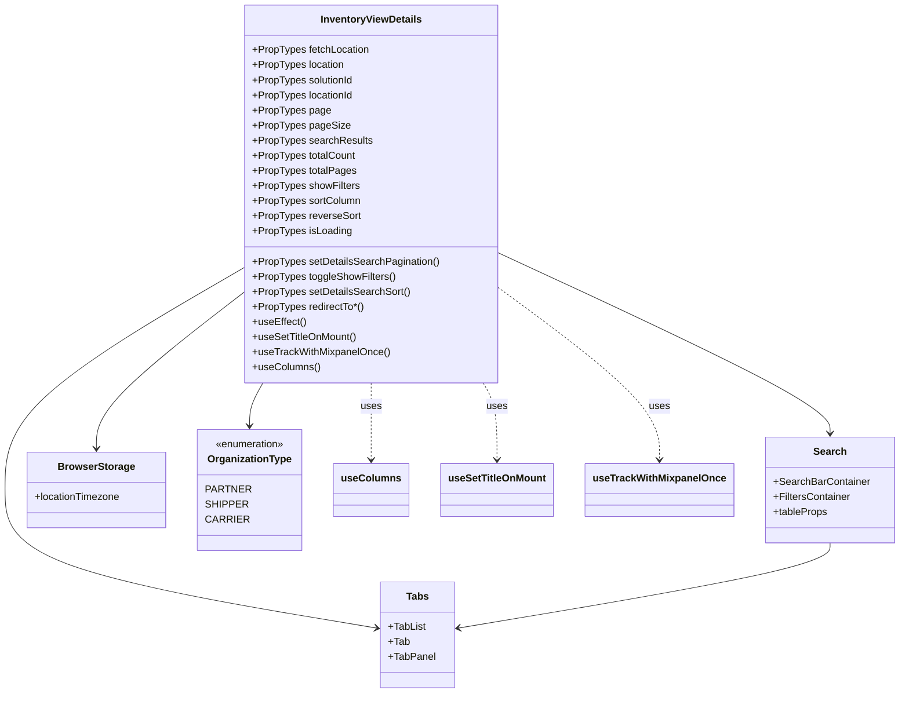

# Diagram: web/portal/src/pages/inventoryview/details/InventoryView.Details.page.js


> Auto-generated by Obscura crawlers

## Diagram 1

```mermaid
flowchart LR
  IV[InventoryViewDetails Component]
  IV -->|uses| USET[useSetTitleOnMount]
  IV -->|uses| TRACK[useTrackWithMixpanelOnce]
  IV -->|uses| COLUMNS[useColumns]
  IV -->|uses| BROWSER[BrowserStorage]
  IV -->|renders| TABS[Tabs]
  IV -->|renders| SEARCH[Search Template]
  IV -->|effect| EF[useEffect: fetchLocation / cleanupInventoryLocationDetails]
  EF --> FETCH[fetchLocation(fvId, locationId)]
  EF --> CLEANUP[cleanupInventoryLocationDetails()]
  BROWSER -->|sets| TZ[locationTimezone]
  TABS --> TabList[TabList]
  TabList --> Tab1[Overview Tab (conditional)]
  TabList --> Tab2[Pinned Tab]
  TabList --> Tab3[Details Tab]
  SEARCH -->|props| SEARCH_PROPS[searchResults, totalCount, isLoading, showFilters, exportProps, tableProps]
  SEARCH_PROPS --> TABLE[tableProps]
  TABLE -->|contains| COLUMNS_PROP[columns]
  TABLE -->|contains| PAGINATION[page, pageSize, totalPages]
  TABLE -->|contains| ROW_CLICK[rowClickHandler]
  ROW_CLICK --> ORG_MAP[orgTypeToRowClickHandler]
  ORG_MAP --> PartnerHandler[partnerRowClickHandler -> redirectToVinDetailsViewForPartner]
  ORG_MAP --> ShipperHandler[shipperRowClickHandler -> redirectToVinDetailsView]
  ORG_MAP --> CarrierHandler[carrierRowClickHandler -> redirectToVinDetailsViewForCarrier]
```

> SVG rendering failed for this diagram.

## Diagram 2



### SVG

<svg id="container" width="1382.7578125" xmlns="http://www.w3.org/2000/svg" class="classDiagram" height="1100" viewBox="-35 0 1382.7578125 1100" role="graphics-document document" aria-roledescription="class"><style>#container{font-family:"trebuchet ms",verdana,arial,sans-serif;font-size:16px;fill:#333;}@keyframes edge-animation-frame{from{stroke-dashoffset:0;}}@keyframes dash{to{stroke-dashoffset:0;}}#container .edge-animation-slow{stroke-dasharray:9,5!important;stroke-dashoffset:900;animation:dash 50s linear infinite;stroke-linecap:round;}#container .edge-animation-fast{stroke-dasharray:9,5!important;stroke-dashoffset:900;animation:dash 20s linear infinite;stroke-linecap:round;}#container .error-icon{fill:#552222;}#container .error-text{fill:#552222;stroke:#552222;}#container .edge-thickness-normal{stroke-width:1px;}#container .edge-thickness-thick{stroke-width:3.5px;}#container .edge-pattern-solid{stroke-dasharray:0;}#container .edge-thickness-invisible{stroke-width:0;fill:none;}#container .edge-pattern-dashed{stroke-dasharray:3;}#container .edge-pattern-dotted{stroke-dasharray:2;}#container .marker{fill:#333333;stroke:#333333;}#container .marker.cross{stroke:#333333;}#container svg{font-family:"trebuchet ms",verdana,arial,sans-serif;font-size:16px;}#container p{margin:0;}#container g.classGroup text{fill:#9370DB;stroke:none;font-family:"trebuchet ms",verdana,arial,sans-serif;font-size:10px;}#container g.classGroup text .title{font-weight:bolder;}#container .nodeLabel,#container .edgeLabel{color:#131300;}#container .edgeLabel .label rect{fill:#ECECFF;}#container .label text{fill:#131300;}#container .labelBkg{background:#ECECFF;}#container .edgeLabel .label span{background:#ECECFF;}#container .classTitle{font-weight:bolder;}#container .node rect,#container .node circle,#container .node ellipse,#container .node polygon,#container .node path{fill:#ECECFF;stroke:#9370DB;stroke-width:1px;}#container .divider{stroke:#9370DB;stroke-width:1;}#container g.clickable{cursor:pointer;}#container g.classGroup rect{fill:#ECECFF;stroke:#9370DB;}#container g.classGroup line{stroke:#9370DB;stroke-width:1;}#container .classLabel .box{stroke:none;stroke-width:0;fill:#ECECFF;opacity:0.5;}#container .classLabel .label{fill:#9370DB;font-size:10px;}#container .relation{stroke:#333333;stroke-width:1;fill:none;}#container .dashed-line{stroke-dasharray:3;}#container .dotted-line{stroke-dasharray:1 2;}#container #compositionStart,#container .composition{fill:#333333!important;stroke:#333333!important;stroke-width:1;}#container #compositionEnd,#container .composition{fill:#333333!important;stroke:#333333!important;stroke-width:1;}#container #dependencyStart,#container .dependency{fill:#333333!important;stroke:#333333!important;stroke-width:1;}#container #dependencyStart,#container .dependency{fill:#333333!important;stroke:#333333!important;stroke-width:1;}#container #extensionStart,#container .extension{fill:transparent!important;stroke:#333333!important;stroke-width:1;}#container #extensionEnd,#container .extension{fill:transparent!important;stroke:#333333!important;stroke-width:1;}#container #aggregationStart,#container .aggregation{fill:transparent!important;stroke:#333333!important;stroke-width:1;}#container #aggregationEnd,#container .aggregation{fill:transparent!important;stroke:#333333!important;stroke-width:1;}#container #lollipopStart,#container .lollipop{fill:#ECECFF!important;stroke:#333333!important;stroke-width:1;}#container #lollipopEnd,#container .lollipop{fill:#ECECFF!important;stroke:#333333!important;stroke-width:1;}#container .edgeTerminals{font-size:11px;line-height:initial;}#container .classTitleText{text-anchor:middle;font-size:18px;fill:#333;}#container .label-icon{display:inline-block;height:1em;overflow:visible;vertical-align:-0.125em;}#container .node .label-icon path{fill:currentColor;stroke:revert;stroke-width:revert;}#container :root{--mermaid-font-family:"trebuchet ms",verdana,arial,sans-serif;}</style><g><defs><marker id="container_class-aggregationStart" class="marker aggregation class" refX="18" refY="7" markerWidth="190" markerHeight="240" orient="auto"><path d="M 18,7 L9,13 L1,7 L9,1 Z"></path></marker></defs><defs><marker id="container_class-aggregationEnd" class="marker aggregation class" refX="1" refY="7" markerWidth="20" markerHeight="28" orient="auto"><path d="M 18,7 L9,13 L1,7 L9,1 Z"></path></marker></defs><defs><marker id="container_class-extensionStart" class="marker extension class" refX="18" refY="7" markerWidth="190" markerHeight="240" orient="auto"><path d="M 1,7 L18,13 V 1 Z"></path></marker></defs><defs><marker id="container_class-extensionEnd" class="marker extension class" refX="1" refY="7" markerWidth="20" markerHeight="28" orient="auto"><path d="M 1,1 V 13 L18,7 Z"></path></marker></defs><defs><marker id="container_class-compositionStart" class="marker composition class" refX="18" refY="7" markerWidth="190" markerHeight="240" orient="auto"><path d="M 18,7 L9,13 L1,7 L9,1 Z"></path></marker></defs><defs><marker id="container_class-compositionEnd" class="marker composition class" refX="1" refY="7" markerWidth="20" markerHeight="28" orient="auto"><path d="M 18,7 L9,13 L1,7 L9,1 Z"></path></marker></defs><defs><marker id="container_class-dependencyStart" class="marker dependency class" refX="6" refY="7" markerWidth="190" markerHeight="240" orient="auto"><path d="M 5,7 L9,13 L1,7 L9,1 Z"></path></marker></defs><defs><marker id="container_class-dependencyEnd" class="marker dependency class" refX="13" refY="7" markerWidth="20" markerHeight="28" orient="auto"><path d="M 18,7 L9,13 L14,7 L9,1 Z"></path></marker></defs><defs><marker id="container_class-lollipopStart" class="marker lollipop class" refX="13" refY="7" markerWidth="190" markerHeight="240" orient="auto"><circle stroke="black" fill="transparent" cx="7" cy="7" r="6"></circle></marker></defs><defs><marker id="container_class-lollipopEnd" class="marker lollipop class" refX="1" refY="7" markerWidth="190" markerHeight="240" orient="auto"><circle stroke="black" fill="transparent" cx="7" cy="7" r="6"></circle></marker></defs><g class="root"><g class="clusters"></g><g class="edgePaths"><path d="M336.895,426.872L276.245,463.226C215.596,499.581,94.298,572.291,33.649,630.812C-27,689.333,-27,733.667,-27,776C-27,818.333,-27,858.667,68.105,895.2C163.21,931.732,353.42,964.465,448.525,980.831L543.63,997.197" id="id_InventoryViewDetails_Tabs_1" class="edge-thickness-normal edge-pattern-solid relation" style=";;;" data-edge="true" data-et="edge" data-id="id_InventoryViewDetails_Tabs_1" data-points="W3sieCI6MzM2Ljg5NDUzMTI1LCJ5Ijo0MjYuODcxNjE5NzQzNzUzNn0seyJ4IjotMjcsInkiOjY0NX0seyJ4IjotMjcsInkiOjc3OH0seyJ4IjotMjcsInkiOjg5OX0seyJ4Ijo1NDkuNTQyOTY4NzUsInkiOjk5OC4yMTQ2NTY2MTg0ODE0fV0=" marker-end="url(#container_class-dependencyEnd)"></path><path d="M733.512,402.847L817.895,443.206C902.279,483.565,1071.046,564.282,1155.429,611.808C1239.813,659.333,1239.813,673.667,1239.813,680.833L1239.813,688" id="id_InventoryViewDetails_Search_2" class="edge-thickness-normal edge-pattern-solid relation" style=";;;" data-edge="true" data-et="edge" data-id="id_InventoryViewDetails_Search_2" data-points="W3sieCI6NzMzLjUxMTcxODc1LCJ5Ijo0MDIuODQ2ODczMjY3NTQ2M30seyJ4IjoxMjM5LjgxMjUsInkiOjY0NX0seyJ4IjoxMjM5LjgxMjUsInkiOjY5NH1d" marker-end="url(#container_class-dependencyEnd)"></path><path d="M336.895,467.936L300.303,497.446C263.712,526.957,190.53,585.979,153.939,626.656C117.348,667.333,117.348,689.667,117.348,700.833L117.348,712" id="id_InventoryViewDetails_BrowserStorage_3" class="edge-thickness-normal edge-pattern-solid relation" style=";;;" data-edge="true" data-et="edge" data-id="id_InventoryViewDetails_BrowserStorage_3" data-points="W3sieCI6MzM2Ljg5NDUzMTI1LCJ5Ijo0NjcuOTM1Njc0MTU0Njc3NDN9LHsieCI6MTE3LjM0NzY1NjI1LCJ5Ijo2NDV9LHsieCI6MTE3LjM0NzY1NjI1LCJ5Ijo3MTh9XQ==" marker-end="url(#container_class-dependencyEnd)"></path><path d="M372.886,608L369.55,614.167C366.213,620.333,359.54,632.667,356.204,644C352.867,655.333,352.867,665.667,352.867,670.833L352.867,676" id="id_InventoryViewDetails_OrganizationType_4" class="edge-thickness-normal edge-pattern-solid relation" style=";;;" data-edge="true" data-et="edge" data-id="id_InventoryViewDetails_OrganizationType_4" data-points="W3sieCI6MzcyLjg4NjI2NjY5MTM5NDY3LCJ5Ijo2MDh9LHsieCI6MzUyLjg2NzE4NzUsInkiOjY0NX0seyJ4IjozNTIuODY3MTg3NSwieSI6NjgyfV0=" marker-end="url(#container_class-dependencyEnd)"></path><path d="M1239.813,862L1239.813,868.167C1239.813,874.333,1239.813,886.667,1144.708,909.2C1049.603,931.732,859.393,964.465,764.288,980.831L669.183,997.197" id="id_Search_Tabs_5" class="edge-thickness-normal edge-pattern-solid relation" style=";;;" data-edge="true" data-et="edge" data-id="id_Search_Tabs_5" data-points="W3sieCI6MTIzOS44MTI1LCJ5Ijo4NjJ9LHsieCI6MTIzOS44MTI1LCJ5Ijo4OTl9LHsieCI6NjYzLjI2OTUzMTI1LCJ5Ijo5OTguMjE0NjU2NjE4NDgxNH1d" marker-end="url(#container_class-dependencyEnd)"></path><path d="M535.203,608L535.203,614.167C535.203,620.333,535.203,632.667,535.203,653C535.203,673.333,535.203,701.667,535.203,715.833L535.203,730" id="id_InventoryViewDetails_useColumns_6" class="edge-thickness-normal edge-pattern-dashed relation" style=";;;" data-edge="true" data-et="edge" data-id="id_InventoryViewDetails_useColumns_6" data-points="W3sieCI6NTM1LjIwMzEyNSwieSI6NjA4fSx7IngiOjUzNS4yMDMxMjUsInkiOjY0NX0seyJ4Ijo1MzUuMjAzMTI1LCJ5Ijo3MzZ9XQ==" marker-end="url(#container_class-dependencyEnd)"></path><path d="M706.853,608L710.382,614.167C713.91,620.333,720.967,632.667,724.495,653C728.023,673.333,728.023,701.667,728.023,715.833L728.023,730" id="id_InventoryViewDetails_useSetTitleOnMount_7" class="edge-thickness-normal edge-pattern-dashed relation" style=";;;" data-edge="true" data-et="edge" data-id="id_InventoryViewDetails_useSetTitleOnMount_7" data-points="W3sieCI6NzA2Ljg1MzI1NDgyMTk1ODQsInkiOjYwOH0seyJ4Ijo3MjguMDIzNDM3NSwieSI6NjQ1fSx7IngiOjcyOC4wMjM0Mzc1LCJ5Ijo3MzZ9XQ==" marker-end="url(#container_class-dependencyEnd)"></path><path d="M733.512,459.175L774.139,490.146C814.766,521.117,896.02,583.058,936.646,628.196C977.273,673.333,977.273,701.667,977.273,715.833L977.273,730" id="id_InventoryViewDetails_useTrackWithMixpanelOnce_8" class="edge-thickness-normal edge-pattern-dashed relation" style=";;;" data-edge="true" data-et="edge" data-id="id_InventoryViewDetails_useTrackWithMixpanelOnce_8" data-points="W3sieCI6NzMzLjUxMTcxODc1LCJ5Ijo0NTkuMTc1MDM3NTU0MTIyMX0seyJ4Ijo5NzcuMjczNDM3NSwieSI6NjQ1fSx7IngiOjk3Ny4yNzM0Mzc1LCJ5Ijo3MzZ9XQ==" marker-end="url(#container_class-dependencyEnd)"></path></g><g class="edgeLabels"><g class="edgeLabel"><g class="label" data-id="id_InventoryViewDetails_Tabs_1" transform="translate(0, 0)"><foreignObject width="0" height="0"><div xmlns="http://www.w3.org/1999/xhtml" class="labelBkg" style="display: table-cell; white-space: nowrap; line-height: 1.5; max-width: 200px; text-align: center;"><span class="edgeLabel"></span></div></foreignObject></g></g><g class="edgeLabel"><g class="label" data-id="id_InventoryViewDetails_Search_2" transform="translate(0, 0)"><foreignObject width="0" height="0"><div xmlns="http://www.w3.org/1999/xhtml" class="labelBkg" style="display: table-cell; white-space: nowrap; line-height: 1.5; max-width: 200px; text-align: center;"><span class="edgeLabel"></span></div></foreignObject></g></g><g class="edgeLabel"><g class="label" data-id="id_InventoryViewDetails_BrowserStorage_3" transform="translate(0, 0)"><foreignObject width="0" height="0"><div xmlns="http://www.w3.org/1999/xhtml" class="labelBkg" style="display: table-cell; white-space: nowrap; line-height: 1.5; max-width: 200px; text-align: center;"><span class="edgeLabel"></span></div></foreignObject></g></g><g class="edgeLabel"><g class="label" data-id="id_InventoryViewDetails_OrganizationType_4" transform="translate(0, 0)"><foreignObject width="0" height="0"><div xmlns="http://www.w3.org/1999/xhtml" class="labelBkg" style="display: table-cell; white-space: nowrap; line-height: 1.5; max-width: 200px; text-align: center;"><span class="edgeLabel"></span></div></foreignObject></g></g><g class="edgeLabel"><g class="label" data-id="id_Search_Tabs_5" transform="translate(0, 0)"><foreignObject width="0" height="0"><div xmlns="http://www.w3.org/1999/xhtml" class="labelBkg" style="display: table-cell; white-space: nowrap; line-height: 1.5; max-width: 200px; text-align: center;"><span class="edgeLabel"></span></div></foreignObject></g></g><g class="edgeLabel" transform="translate(535.203125, 645)"><g class="label" data-id="id_InventoryViewDetails_useColumns_6" transform="translate(-16.4921875, -12)"><foreignObject width="32.984375" height="24"><div xmlns="http://www.w3.org/1999/xhtml" class="labelBkg" style="display: table-cell; white-space: nowrap; line-height: 1.5; max-width: 200px; text-align: center;"><span class="edgeLabel"><p>uses</p></span></div></foreignObject></g></g><g class="edgeLabel" transform="translate(728.0234375, 645)"><g class="label" data-id="id_InventoryViewDetails_useSetTitleOnMount_7" transform="translate(-16.4921875, -12)"><foreignObject width="32.984375" height="24"><div xmlns="http://www.w3.org/1999/xhtml" class="labelBkg" style="display: table-cell; white-space: nowrap; line-height: 1.5; max-width: 200px; text-align: center;"><span class="edgeLabel"><p>uses</p></span></div></foreignObject></g></g><g class="edgeLabel" transform="translate(977.2734375, 645)"><g class="label" data-id="id_InventoryViewDetails_useTrackWithMixpanelOnce_8" transform="translate(-16.4921875, -12)"><foreignObject width="32.984375" height="24"><div xmlns="http://www.w3.org/1999/xhtml" class="labelBkg" style="display: table-cell; white-space: nowrap; line-height: 1.5; max-width: 200px; text-align: center;"><span class="edgeLabel"><p>uses</p></span></div></foreignObject></g></g></g><g class="nodes"><g class="node default" id="classId-InventoryViewDetails-0" transform="translate(535.203125, 308)"><g class="basic label-container"><path d="M-198.30859375 -300 L198.30859375 -300 L198.30859375 300 L-198.30859375 300" stroke="none" stroke-width="0" fill="#ECECFF" style=""></path><path d="M-198.30859375 -300 C-45.164228020494534 -300, 107.98013770901093 -300, 198.30859375 -300 M-198.30859375 -300 C-53.19184671413362 -300, 91.92490032173276 -300, 198.30859375 -300 M198.30859375 -300 C198.30859375 -175.69749017311528, 198.30859375 -51.39498034623057, 198.30859375 300 M198.30859375 -300 C198.30859375 -94.75517906015642, 198.30859375 110.48964187968716, 198.30859375 300 M198.30859375 300 C45.30464748235039 300, -107.69929878529922 300, -198.30859375 300 M198.30859375 300 C58.009586527541984 300, -82.28942069491603 300, -198.30859375 300 M-198.30859375 300 C-198.30859375 109.76360894332967, -198.30859375 -80.47278211334066, -198.30859375 -300 M-198.30859375 300 C-198.30859375 117.25163320008139, -198.30859375 -65.49673359983723, -198.30859375 -300" stroke="#9370DB" stroke-width="1.3" fill="none" stroke-dasharray="0 0" style=""></path></g><g class="annotation-group text" transform="translate(0, -276)"></g><g class="label-group text" transform="translate(-77.6796875, -276)"><g class="label" style="font-weight: bolder" transform="translate(0,-12)"><foreignObject width="155.359375" height="24"><div xmlns="http://www.w3.org/1999/xhtml" style="display: table-cell; white-space: nowrap; line-height: 1.5; max-width: 202px; text-align: center;"><span class="nodeLabel markdown-node-label" style=""><p>InventoryViewDetails</p></span></div></foreignObject></g></g><g class="members-group text" transform="translate(-186.30859375, -228)"><g class="label" style="" transform="translate(0,-12)"><foreignObject width="185.546875" height="24"><div xmlns="http://www.w3.org/1999/xhtml" style="display: table-cell; white-space: nowrap; line-height: 1.5; max-width: 243px; text-align: center;"><span class="nodeLabel markdown-node-label" style=""><p>+PropTypes fetchLocation</p></span></div></foreignObject></g><g class="label" style="" transform="translate(0,12)"><foreignObject width="146.109375" height="24"><div xmlns="http://www.w3.org/1999/xhtml" style="display: table-cell; white-space: nowrap; line-height: 1.5; max-width: 203px; text-align: center;"><span class="nodeLabel markdown-node-label" style=""><p>+PropTypes location</p></span></div></foreignObject></g><g class="label" style="" transform="translate(0,36)"><foreignObject width="161.0625" height="24"><div xmlns="http://www.w3.org/1999/xhtml" style="display: table-cell; white-space: nowrap; line-height: 1.5; max-width: 218px; text-align: center;"><span class="nodeLabel markdown-node-label" style=""><p>+PropTypes solutionId</p></span></div></foreignObject></g><g class="label" style="" transform="translate(0,60)"><foreignObject width="160.390625" height="24"><div xmlns="http://www.w3.org/1999/xhtml" style="display: table-cell; white-space: nowrap; line-height: 1.5; max-width: 218px; text-align: center;"><span class="nodeLabel markdown-node-label" style=""><p>+PropTypes locationId</p></span></div></foreignObject></g><g class="label" style="" transform="translate(0,84)"><foreignObject width="121.625" height="24"><div xmlns="http://www.w3.org/1999/xhtml" style="display: table-cell; white-space: nowrap; line-height: 1.5; max-width: 179px; text-align: center;"><span class="nodeLabel markdown-node-label" style=""><p>+PropTypes page</p></span></div></foreignObject></g><g class="label" style="" transform="translate(0,108)"><foreignObject width="150.453125" height="24"><div xmlns="http://www.w3.org/1999/xhtml" style="display: table-cell; white-space: nowrap; line-height: 1.5; max-width: 208px; text-align: center;"><span class="nodeLabel markdown-node-label" style=""><p>+PropTypes pageSize</p></span></div></foreignObject></g><g class="label" style="" transform="translate(0,132)"><foreignObject width="187.28125" height="24"><div xmlns="http://www.w3.org/1999/xhtml" style="display: table-cell; white-space: nowrap; line-height: 1.5; max-width: 245px; text-align: center;"><span class="nodeLabel markdown-node-label" style=""><p>+PropTypes searchResults</p></span></div></foreignObject></g><g class="label" style="" transform="translate(0,156)"><foreignObject width="163.171875" height="24"><div xmlns="http://www.w3.org/1999/xhtml" style="display: table-cell; white-space: nowrap; line-height: 1.5; max-width: 221px; text-align: center;"><span class="nodeLabel markdown-node-label" style=""><p>+PropTypes totalCount</p></span></div></foreignObject></g><g class="label" style="" transform="translate(0,180)"><foreignObject width="161.9375" height="24"><div xmlns="http://www.w3.org/1999/xhtml" style="display: table-cell; white-space: nowrap; line-height: 1.5; max-width: 219px; text-align: center;"><span class="nodeLabel markdown-node-label" style=""><p>+PropTypes totalPages</p></span></div></foreignObject></g><g class="label" style="" transform="translate(0,204)"><foreignObject width="168.78125" height="24"><div xmlns="http://www.w3.org/1999/xhtml" style="display: table-cell; white-space: nowrap; line-height: 1.5; max-width: 226px; text-align: center;"><span class="nodeLabel markdown-node-label" style=""><p>+PropTypes showFilters</p></span></div></foreignObject></g><g class="label" style="" transform="translate(0,228)"><foreignObject width="170.796875" height="24"><div xmlns="http://www.w3.org/1999/xhtml" style="display: table-cell; white-space: nowrap; line-height: 1.5; max-width: 228px; text-align: center;"><span class="nodeLabel markdown-node-label" style=""><p>+PropTypes sortColumn</p></span></div></foreignObject></g><g class="label" style="" transform="translate(0,252)"><foreignObject width="169.96875" height="24"><div xmlns="http://www.w3.org/1999/xhtml" style="display: table-cell; white-space: nowrap; line-height: 1.5; max-width: 228px; text-align: center;"><span class="nodeLabel markdown-node-label" style=""><p>+PropTypes reverseSort</p></span></div></foreignObject></g><g class="label" style="" transform="translate(0,276)"><foreignObject width="156.171875" height="24"><div xmlns="http://www.w3.org/1999/xhtml" style="display: table-cell; white-space: nowrap; line-height: 1.5; max-width: 214px; text-align: center;"><span class="nodeLabel markdown-node-label" style=""><p>+PropTypes isLoading</p></span></div></foreignObject></g></g><g class="methods-group text" transform="translate(-186.30859375, 108)"><g class="label" style="" transform="translate(0,-12)"><foreignObject width="294.9375" height="24"><div xmlns="http://www.w3.org/1999/xhtml" style="display: table-cell; white-space: nowrap; line-height: 1.5; max-width: 352px; text-align: center;"><span class="nodeLabel markdown-node-label" style=""><p>+PropTypes setDetailsSearchPagination()</p></span></div></foreignObject></g><g class="label" style="" transform="translate(0,12)"><foreignObject width="225.234375" height="24"><div xmlns="http://www.w3.org/1999/xhtml" style="display: table-cell; white-space: nowrap; line-height: 1.5; max-width: 283px; text-align: center;"><span class="nodeLabel markdown-node-label" style=""><p>+PropTypes toggleShowFilters()</p></span></div></foreignObject></g><g class="label" style="" transform="translate(0,36)"><foreignObject width="248.078125" height="24"><div xmlns="http://www.w3.org/1999/xhtml" style="display: table-cell; white-space: nowrap; line-height: 1.5; max-width: 305px; text-align: center;"><span class="nodeLabel markdown-node-label" style=""><p>+PropTypes setDetailsSearchSort()</p></span></div></foreignObject></g><g class="label" style="" transform="translate(0,60)"><foreignObject width="177.25" height="24"><div xmlns="http://www.w3.org/1999/xhtml" style="display: table-cell; white-space: nowrap; line-height: 1.5; max-width: 235px; text-align: center;"><span class="nodeLabel markdown-node-label" style=""><p>+PropTypes redirectTo*()</p></span></div></foreignObject></g><g class="label" style="" transform="translate(0,84)"><foreignObject width="84.8125" height="24"><div xmlns="http://www.w3.org/1999/xhtml" style="display: table-cell; white-space: nowrap; line-height: 1.5; max-width: 142px; text-align: center;"><span class="nodeLabel markdown-node-label" style=""><p>+useEffect()</p></span></div></foreignObject></g><g class="label" style="" transform="translate(0,108)"><foreignObject width="165.515625" height="24"><div xmlns="http://www.w3.org/1999/xhtml" style="display: table-cell; white-space: nowrap; line-height: 1.5; max-width: 223px; text-align: center;"><span class="nodeLabel markdown-node-label" style=""><p>+useSetTitleOnMount()</p></span></div></foreignObject></g><g class="label" style="" transform="translate(0,132)"><foreignObject width="216.75" height="24"><div xmlns="http://www.w3.org/1999/xhtml" style="display: table-cell; white-space: nowrap; line-height: 1.5; max-width: 274px; text-align: center;"><span class="nodeLabel markdown-node-label" style=""><p>+useTrackWithMixpanelOnce()</p></span></div></foreignObject></g><g class="label" style="" transform="translate(0,156)"><foreignObject width="106.40625" height="24"><div xmlns="http://www.w3.org/1999/xhtml" style="display: table-cell; white-space: nowrap; line-height: 1.5; max-width: 164px; text-align: center;"><span class="nodeLabel markdown-node-label" style=""><p>+useColumns()</p></span></div></foreignObject></g></g><g class="divider" style=""><path d="M-198.30859375 -252 C-100.76271905979158 -252, -3.216844369583157 -252, 198.30859375 -252 M-198.30859375 -252 C-94.75078753429248 -252, 8.80701868141503 -252, 198.30859375 -252" stroke="#9370DB" stroke-width="1.3" fill="none" stroke-dasharray="0 0" style=""></path></g><g class="divider" style=""><path d="M-198.30859375 84 C-64.87796111511432 84, 68.55267151977137 84, 198.30859375 84 M-198.30859375 84 C-53.08580340939321 84, 92.13698693121358 84, 198.30859375 84" stroke="#9370DB" stroke-width="1.3" fill="none" stroke-dasharray="0 0" style=""></path></g></g><g class="node default" id="classId-Tabs-1" transform="translate(606.40625, 1008)"><g class="basic label-container"><path d="M-56.86328125 -84 L56.86328125 -84 L56.86328125 84 L-56.86328125 84" stroke="none" stroke-width="0" fill="#ECECFF" style=""></path><path d="M-56.86328125 -84 C-16.576737237524455 -84, 23.70980677495109 -84, 56.86328125 -84 M-56.86328125 -84 C-13.738382232056573 -84, 29.386516785886855 -84, 56.86328125 -84 M56.86328125 -84 C56.86328125 -36.72986205198017, 56.86328125 10.54027589603966, 56.86328125 84 M56.86328125 -84 C56.86328125 -43.66470861849663, 56.86328125 -3.3294172369932653, 56.86328125 84 M56.86328125 84 C17.548258618222192 84, -21.766764013555616 84, -56.86328125 84 M56.86328125 84 C12.23339318079396 84, -32.39649488841208 84, -56.86328125 84 M-56.86328125 84 C-56.86328125 45.74311248027184, -56.86328125 7.48622496054368, -56.86328125 -84 M-56.86328125 84 C-56.86328125 42.54244864027398, -56.86328125 1.0848972805479633, -56.86328125 -84" stroke="#9370DB" stroke-width="1.3" fill="none" stroke-dasharray="0 0" style=""></path></g><g class="annotation-group text" transform="translate(0, -60)"></g><g class="label-group text" transform="translate(-16.9453125, -60)"><g class="label" style="font-weight: bolder" transform="translate(0,-12)"><foreignObject width="33.890625" height="24"><div xmlns="http://www.w3.org/1999/xhtml" style="display: table-cell; white-space: nowrap; line-height: 1.5; max-width: 83px; text-align: center;"><span class="nodeLabel markdown-node-label" style=""><p>Tabs</p></span></div></foreignObject></g></g><g class="members-group text" transform="translate(-44.86328125, -12)"><g class="label" style="" transform="translate(0,-12)"><foreignObject width="58.59375" height="24"><div xmlns="http://www.w3.org/1999/xhtml" style="display: table-cell; white-space: nowrap; line-height: 1.5; max-width: 116px; text-align: center;"><span class="nodeLabel markdown-node-label" style=""><p>+TabList</p></span></div></foreignObject></g><g class="label" style="" transform="translate(0,12)"><foreignObject width="32.875" height="24"><div xmlns="http://www.w3.org/1999/xhtml" style="display: table-cell; white-space: nowrap; line-height: 1.5; max-width: 90px; text-align: center;"><span class="nodeLabel markdown-node-label" style=""><p>+Tab</p></span></div></foreignObject></g><g class="label" style="" transform="translate(0,36)"><foreignObject width="72.78125" height="24"><div xmlns="http://www.w3.org/1999/xhtml" style="display: table-cell; white-space: nowrap; line-height: 1.5; max-width: 130px; text-align: center;"><span class="nodeLabel markdown-node-label" style=""><p>+TabPanel</p></span></div></foreignObject></g></g><g class="methods-group text" transform="translate(-44.86328125, 84)"></g><g class="divider" style=""><path d="M-56.86328125 -36 C-19.3956062990215 -36, 18.072068651956997 -36, 56.86328125 -36 M-56.86328125 -36 C-30.67295681367247 -36, -4.482632377344942 -36, 56.86328125 -36" stroke="#9370DB" stroke-width="1.3" fill="none" stroke-dasharray="0 0" style=""></path></g><g class="divider" style=""><path d="M-56.86328125 60 C-25.826522663097535 60, 5.21023592380493 60, 56.86328125 60 M-56.86328125 60 C-27.195605741592576 60, 2.4720697668148475 60, 56.86328125 60" stroke="#9370DB" stroke-width="1.3" fill="none" stroke-dasharray="0 0" style=""></path></g></g><g class="node default" id="classId-Search-2" transform="translate(1239.8125, 778)"><g class="basic label-container"><path d="M-99.9453125 -84 L99.9453125 -84 L99.9453125 84 L-99.9453125 84" stroke="none" stroke-width="0" fill="#ECECFF" style=""></path><path d="M-99.9453125 -84 C-40.73046741745596 -84, 18.484377665088076 -84, 99.9453125 -84 M-99.9453125 -84 C-47.327985445570974 -84, 5.289341608858052 -84, 99.9453125 -84 M99.9453125 -84 C99.9453125 -36.955715901761636, 99.9453125 10.088568196476729, 99.9453125 84 M99.9453125 -84 C99.9453125 -43.37933950334019, 99.9453125 -2.7586790066803815, 99.9453125 84 M99.9453125 84 C46.11627862189388 84, -7.712755256212233 84, -99.9453125 84 M99.9453125 84 C31.72836941830502 84, -36.48857366338996 84, -99.9453125 84 M-99.9453125 84 C-99.9453125 28.890329507664106, -99.9453125 -26.21934098467179, -99.9453125 -84 M-99.9453125 84 C-99.9453125 45.72886254165337, -99.9453125 7.457725083306741, -99.9453125 -84" stroke="#9370DB" stroke-width="1.3" fill="none" stroke-dasharray="0 0" style=""></path></g><g class="annotation-group text" transform="translate(0, -60)"></g><g class="label-group text" transform="translate(-24.71875, -60)"><g class="label" style="font-weight: bolder" transform="translate(0,-12)"><foreignObject width="49.4375" height="24"><div xmlns="http://www.w3.org/1999/xhtml" style="display: table-cell; white-space: nowrap; line-height: 1.5; max-width: 99px; text-align: center;"><span class="nodeLabel markdown-node-label" style=""><p>Search</p></span></div></foreignObject></g></g><g class="members-group text" transform="translate(-87.9453125, -12)"><g class="label" style="" transform="translate(0,-12)"><foreignObject width="151.171875" height="24"><div xmlns="http://www.w3.org/1999/xhtml" style="display: table-cell; white-space: nowrap; line-height: 1.5; max-width: 209px; text-align: center;"><span class="nodeLabel markdown-node-label" style=""><p>+SearchBarContainer</p></span></div></foreignObject></g><g class="label" style="" transform="translate(0,12)"><foreignObject width="122.65625" height="24"><div xmlns="http://www.w3.org/1999/xhtml" style="display: table-cell; white-space: nowrap; line-height: 1.5; max-width: 181px; text-align: center;"><span class="nodeLabel markdown-node-label" style=""><p>+FiltersContainer</p></span></div></foreignObject></g><g class="label" style="" transform="translate(0,36)"><foreignObject width="86.109375" height="24"><div xmlns="http://www.w3.org/1999/xhtml" style="display: table-cell; white-space: nowrap; line-height: 1.5; max-width: 143px; text-align: center;"><span class="nodeLabel markdown-node-label" style=""><p>+tableProps</p></span></div></foreignObject></g></g><g class="methods-group text" transform="translate(-87.9453125, 84)"></g><g class="divider" style=""><path d="M-99.9453125 -36 C-40.3817462248216 -36, 19.181820050356805 -36, 99.9453125 -36 M-99.9453125 -36 C-36.86375935907711 -36, 26.217793781845785 -36, 99.9453125 -36" stroke="#9370DB" stroke-width="1.3" fill="none" stroke-dasharray="0 0" style=""></path></g><g class="divider" style=""><path d="M-99.9453125 60 C-55.060157218115485 60, -10.17500193623097 60, 99.9453125 60 M-99.9453125 60 C-38.0363206357462 60, 23.8726712285076 60, 99.9453125 60" stroke="#9370DB" stroke-width="1.3" fill="none" stroke-dasharray="0 0" style=""></path></g></g><g class="node default" id="classId-BrowserStorage-3" transform="translate(117.34765625, 778)"><g class="basic label-container"><path d="M-109.34765625 -60 L109.34765625 -60 L109.34765625 60 L-109.34765625 60" stroke="none" stroke-width="0" fill="#ECECFF" style=""></path><path d="M-109.34765625 -60 C-46.461250529103296 -60, 16.425155191793408 -60, 109.34765625 -60 M-109.34765625 -60 C-34.77054669577734 -60, 39.80656285844532 -60, 109.34765625 -60 M109.34765625 -60 C109.34765625 -25.52155656366051, 109.34765625 8.956886872678979, 109.34765625 60 M109.34765625 -60 C109.34765625 -26.3442102916746, 109.34765625 7.311579416650801, 109.34765625 60 M109.34765625 60 C58.27263141176549 60, 7.197606573530976 60, -109.34765625 60 M109.34765625 60 C35.30371550723028 60, -38.74022523553944 60, -109.34765625 60 M-109.34765625 60 C-109.34765625 21.324645787518357, -109.34765625 -17.350708424963287, -109.34765625 -60 M-109.34765625 60 C-109.34765625 12.186466556783344, -109.34765625 -35.62706688643331, -109.34765625 -60" stroke="#9370DB" stroke-width="1.3" fill="none" stroke-dasharray="0 0" style=""></path></g><g class="annotation-group text" transform="translate(0, -36)"></g><g class="label-group text" transform="translate(-58.1328125, -36)"><g class="label" style="font-weight: bolder" transform="translate(0,-12)"><foreignObject width="116.265625" height="24"><div xmlns="http://www.w3.org/1999/xhtml" style="display: table-cell; white-space: nowrap; line-height: 1.5; max-width: 163px; text-align: center;"><span class="nodeLabel markdown-node-label" style=""><p>BrowserStorage</p></span></div></foreignObject></g></g><g class="members-group text" transform="translate(-97.34765625, 12)"><g class="label" style="" transform="translate(0,-12)"><foreignObject width="136.5625" height="24"><div xmlns="http://www.w3.org/1999/xhtml" style="display: table-cell; white-space: nowrap; line-height: 1.5; max-width: 194px; text-align: center;"><span class="nodeLabel markdown-node-label" style=""><p>+locationTimezone</p></span></div></foreignObject></g></g><g class="methods-group text" transform="translate(-97.34765625, 60)"></g><g class="divider" style=""><path d="M-109.34765625 -12 C-53.49883370792069 -12, 2.349988834158623 -12, 109.34765625 -12 M-109.34765625 -12 C-28.285907509151855 -12, 52.77584123169629 -12, 109.34765625 -12" stroke="#9370DB" stroke-width="1.3" fill="none" stroke-dasharray="0 0" style=""></path></g><g class="divider" style=""><path d="M-109.34765625 36 C-21.92763448386377 36, 65.49238728227246 36, 109.34765625 36 M-109.34765625 36 C-24.50932733049285 36, 60.3290015890143 36, 109.34765625 36" stroke="#9370DB" stroke-width="1.3" fill="none" stroke-dasharray="0 0" style=""></path></g></g><g class="node default" id="classId-OrganizationType-4" transform="translate(352.8671875, 778)"><g class="basic label-container"><path d="M-76.171875 -96 L76.171875 -96 L76.171875 96 L-76.171875 96" stroke="none" stroke-width="0" fill="#ECECFF" style=""></path><path d="M-76.171875 -96 C-34.47762217691503 -96, 7.216630646169946 -96, 76.171875 -96 M-76.171875 -96 C-39.47943655728561 -96, -2.786998114571219 -96, 76.171875 -96 M76.171875 -96 C76.171875 -48.899263534499184, 76.171875 -1.798527068998368, 76.171875 96 M76.171875 -96 C76.171875 -21.827668401981498, 76.171875 52.344663196037004, 76.171875 96 M76.171875 96 C45.600080515335804 96, 15.028286030671602 96, -76.171875 96 M76.171875 96 C28.60639756873511 96, -18.959079862529777 96, -76.171875 96 M-76.171875 96 C-76.171875 21.155703037119537, -76.171875 -53.68859392576093, -76.171875 -96 M-76.171875 96 C-76.171875 51.683178394233636, -76.171875 7.366356788467272, -76.171875 -96" stroke="#9370DB" stroke-width="1.3" fill="none" stroke-dasharray="0 0" style=""></path></g><g class="annotation-group text" transform="translate(-55.5546875, -72)"><g class="label" style="" transform="translate(0,-12)"><foreignObject width="111.109375" height="24"><div xmlns="http://www.w3.org/1999/xhtml" style="display: table-cell; white-space: nowrap; line-height: 1.5; max-width: 161px; text-align: center;"><span class="nodeLabel markdown-node-label" style=""><p>«enumeration»</p></span></div></foreignObject></g></g><g class="label-group text" transform="translate(-64.03125, -48)"><g class="label" style="font-weight: bolder" transform="translate(0,-12)"><foreignObject width="128.0625" height="24"><div xmlns="http://www.w3.org/1999/xhtml" style="display: table-cell; white-space: nowrap; line-height: 1.5; max-width: 176px; text-align: center;"><span class="nodeLabel markdown-node-label" style=""><p>OrganizationType</p></span></div></foreignObject></g></g><g class="members-group text" transform="translate(-64.171875, 0)"><g class="label" style="" transform="translate(0,-12)"><foreignObject width="64.3125" height="24"><div xmlns="http://www.w3.org/1999/xhtml" style="display: table-cell; white-space: nowrap; line-height: 1.5; max-width: 115px; text-align: center;"><span class="nodeLabel markdown-node-label" style=""><p>PARTNER</p></span></div></foreignObject></g><g class="label" style="" transform="translate(0,12)"><foreignObject width="61.15625" height="24"><div xmlns="http://www.w3.org/1999/xhtml" style="display: table-cell; white-space: nowrap; line-height: 1.5; max-width: 111px; text-align: center;"><span class="nodeLabel markdown-node-label" style=""><p>SHIPPER</p></span></div></foreignObject></g><g class="label" style="" transform="translate(0,36)"><foreignObject width="60.453125" height="24"><div xmlns="http://www.w3.org/1999/xhtml" style="display: table-cell; white-space: nowrap; line-height: 1.5; max-width: 111px; text-align: center;"><span class="nodeLabel markdown-node-label" style=""><p>CARRIER</p></span></div></foreignObject></g></g><g class="methods-group text" transform="translate(-64.171875, 96)"></g><g class="divider" style=""><path d="M-76.171875 -24 C-16.88570052420735 -24, 42.4004739515853 -24, 76.171875 -24 M-76.171875 -24 C-29.892188913016923 -24, 16.387497173966153 -24, 76.171875 -24" stroke="#9370DB" stroke-width="1.3" fill="none" stroke-dasharray="0 0" style=""></path></g><g class="divider" style=""><path d="M-76.171875 72 C-30.65343089483813 72, 14.865013210323738 72, 76.171875 72 M-76.171875 72 C-27.050909948550036 72, 22.07005510289993 72, 76.171875 72" stroke="#9370DB" stroke-width="1.3" fill="none" stroke-dasharray="0 0" style=""></path></g></g><g class="node default" id="classId-useColumns-5" transform="translate(535.203125, 778)"><g class="basic label-container"><path d="M-56.1640625 -42 L56.1640625 -42 L56.1640625 42 L-56.1640625 42" stroke="none" stroke-width="0" fill="#ECECFF" style=""></path><path d="M-56.1640625 -42 C-31.129074710545467 -42, -6.094086921090934 -42, 56.1640625 -42 M-56.1640625 -42 C-31.646001591380905 -42, -7.12794068276181 -42, 56.1640625 -42 M56.1640625 -42 C56.1640625 -11.695784272422834, 56.1640625 18.60843145515433, 56.1640625 42 M56.1640625 -42 C56.1640625 -14.49948735392989, 56.1640625 13.00102529214022, 56.1640625 42 M56.1640625 42 C21.762682567167033 42, -12.638697365665934 42, -56.1640625 42 M56.1640625 42 C24.297220760821507 42, -7.569620978356987 42, -56.1640625 42 M-56.1640625 42 C-56.1640625 14.150774964287699, -56.1640625 -13.698450071424602, -56.1640625 -42 M-56.1640625 42 C-56.1640625 18.631335925645406, -56.1640625 -4.737328148709189, -56.1640625 -42" stroke="#9370DB" stroke-width="1.3" fill="none" stroke-dasharray="0 0" style=""></path></g><g class="annotation-group text" transform="translate(0, -18)"></g><g class="label-group text" transform="translate(-44.1640625, -18)"><g class="label" style="font-weight: bolder" transform="translate(0,-12)"><foreignObject width="88.328125" height="24"><div xmlns="http://www.w3.org/1999/xhtml" style="display: table-cell; white-space: nowrap; line-height: 1.5; max-width: 138px; text-align: center;"><span class="nodeLabel markdown-node-label" style=""><p>useColumns</p></span></div></foreignObject></g></g><g class="members-group text" transform="translate(-44.1640625, 30)"></g><g class="methods-group text" transform="translate(-44.1640625, 60)"></g><g class="divider" style=""><path d="M-56.1640625 6 C-26.01920411286771 6, 4.125654274264583 6, 56.1640625 6 M-56.1640625 6 C-27.53897691810273 6, 1.0861086637945405 6, 56.1640625 6" stroke="#9370DB" stroke-width="1.3" fill="none" stroke-dasharray="0 0" style=""></path></g><g class="divider" style=""><path d="M-56.1640625 24 C-13.750766969637304 24, 28.66252856072539 24, 56.1640625 24 M-56.1640625 24 C-29.001029811771748 24, -1.837997123543495 24, 56.1640625 24" stroke="#9370DB" stroke-width="1.3" fill="none" stroke-dasharray="0 0" style=""></path></g></g><g class="node default" id="classId-useSetTitleOnMount-6" transform="translate(728.0234375, 778)"><g class="basic label-container"><path d="M-86.65625 -42 L86.65625 -42 L86.65625 42 L-86.65625 42" stroke="none" stroke-width="0" fill="#ECECFF" style=""></path><path d="M-86.65625 -42 C-42.24150782769953 -42, 2.1732343446009423 -42, 86.65625 -42 M-86.65625 -42 C-49.707819920701155 -42, -12.75938984140231 -42, 86.65625 -42 M86.65625 -42 C86.65625 -14.00565408217259, 86.65625 13.98869183565482, 86.65625 42 M86.65625 -42 C86.65625 -23.670441821298162, 86.65625 -5.340883642596324, 86.65625 42 M86.65625 42 C51.11774208624303 42, 15.579234172486053 42, -86.65625 42 M86.65625 42 C43.754080671501015 42, 0.8519113430020298 42, -86.65625 42 M-86.65625 42 C-86.65625 11.773202779855822, -86.65625 -18.453594440288356, -86.65625 -42 M-86.65625 42 C-86.65625 22.265864017198336, -86.65625 2.5317280343966715, -86.65625 -42" stroke="#9370DB" stroke-width="1.3" fill="none" stroke-dasharray="0 0" style=""></path></g><g class="annotation-group text" transform="translate(0, -18)"></g><g class="label-group text" transform="translate(-74.65625, -18)"><g class="label" style="font-weight: bolder" transform="translate(0,-12)"><foreignObject width="149.3125" height="24"><div xmlns="http://www.w3.org/1999/xhtml" style="display: table-cell; white-space: nowrap; line-height: 1.5; max-width: 197px; text-align: center;"><span class="nodeLabel markdown-node-label" style=""><p>useSetTitleOnMount</p></span></div></foreignObject></g></g><g class="members-group text" transform="translate(-74.65625, 30)"></g><g class="methods-group text" transform="translate(-74.65625, 60)"></g><g class="divider" style=""><path d="M-86.65625 6 C-40.77349945204163 6, 5.109251095916747 6, 86.65625 6 M-86.65625 6 C-45.20934908142653 6, -3.7624481628530617 6, 86.65625 6" stroke="#9370DB" stroke-width="1.3" fill="none" stroke-dasharray="0 0" style=""></path></g><g class="divider" style=""><path d="M-86.65625 24 C-22.65239811314899 24, 41.35145377370202 24, 86.65625 24 M-86.65625 24 C-19.82946433317845 24, 46.9973213336431 24, 86.65625 24" stroke="#9370DB" stroke-width="1.3" fill="none" stroke-dasharray="0 0" style=""></path></g></g><g class="node default" id="classId-useTrackWithMixpanelOnce-7" transform="translate(977.2734375, 778)"><g class="basic label-container"><path d="M-112.59375 -42 L112.59375 -42 L112.59375 42 L-112.59375 42" stroke="none" stroke-width="0" fill="#ECECFF" style=""></path><path d="M-112.59375 -42 C-34.23859019695418 -42, 44.116569606091645 -42, 112.59375 -42 M-112.59375 -42 C-42.783267463885664 -42, 27.02721507222867 -42, 112.59375 -42 M112.59375 -42 C112.59375 -15.32709348756444, 112.59375 11.34581302487112, 112.59375 42 M112.59375 -42 C112.59375 -14.749495440908007, 112.59375 12.501009118183987, 112.59375 42 M112.59375 42 C40.71823238286402 42, -31.157285234271967 42, -112.59375 42 M112.59375 42 C44.60815468707807 42, -23.37744062584386 42, -112.59375 42 M-112.59375 42 C-112.59375 21.8911425813877, -112.59375 1.782285162775402, -112.59375 -42 M-112.59375 42 C-112.59375 16.403991620301916, -112.59375 -9.192016759396168, -112.59375 -42" stroke="#9370DB" stroke-width="1.3" fill="none" stroke-dasharray="0 0" style=""></path></g><g class="annotation-group text" transform="translate(0, -18)"></g><g class="label-group text" transform="translate(-100.59375, -18)"><g class="label" style="font-weight: bolder" transform="translate(0,-12)"><foreignObject width="201.1875" height="24"><div xmlns="http://www.w3.org/1999/xhtml" style="display: table-cell; white-space: nowrap; line-height: 1.5; max-width: 248px; text-align: center;"><span class="nodeLabel markdown-node-label" style=""><p>useTrackWithMixpanelOnce</p></span></div></foreignObject></g></g><g class="members-group text" transform="translate(-100.59375, 30)"></g><g class="methods-group text" transform="translate(-100.59375, 60)"></g><g class="divider" style=""><path d="M-112.59375 6 C-60.632714398950405 6, -8.67167879790081 6, 112.59375 6 M-112.59375 6 C-44.32877702627344 6, 23.936195947453115 6, 112.59375 6" stroke="#9370DB" stroke-width="1.3" fill="none" stroke-dasharray="0 0" style=""></path></g><g class="divider" style=""><path d="M-112.59375 24 C-47.296505554715026 24, 18.00073889056995 24, 112.59375 24 M-112.59375 24 C-35.43801200934186 24, 41.71772598131628 24, 112.59375 24" stroke="#9370DB" stroke-width="1.3" fill="none" stroke-dasharray="0 0" style=""></path></g></g></g></g></g></svg>
