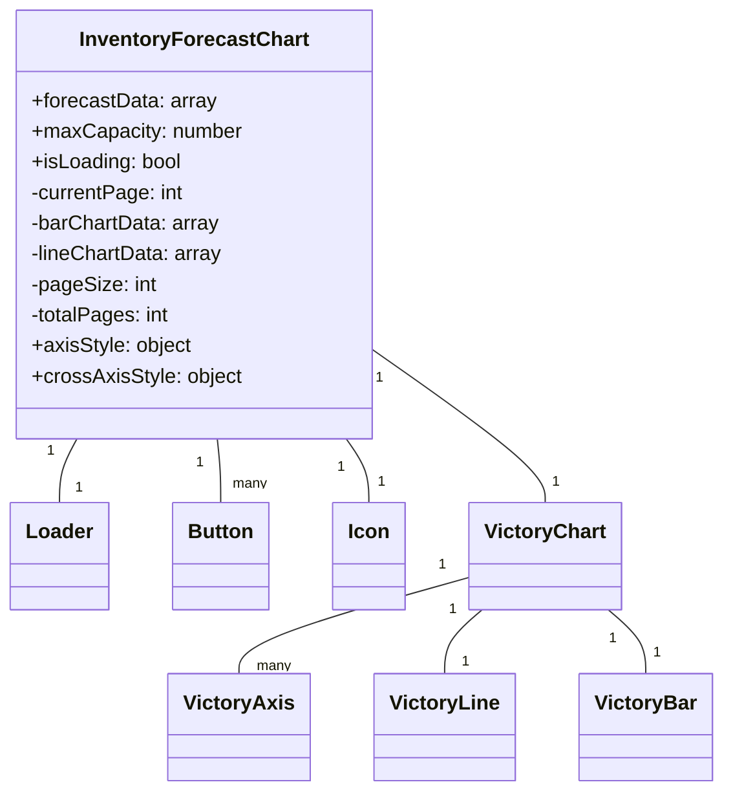

# Diagram: web/portal/src/pages/inventoryview/details/components/InventoryForecastChart.js


> Auto-generated by Obscura crawlers

## Diagram 1



### SVG

<svg id="container" width="553.05859375" xmlns="http://www.w3.org/2000/svg" class="classDiagram" height="620" viewBox="0 0 553.05859375 620" role="graphics-document document" aria-roledescription="class"><style>#container{font-family:"trebuchet ms",verdana,arial,sans-serif;font-size:16px;fill:#333;}@keyframes edge-animation-frame{from{stroke-dashoffset:0;}}@keyframes dash{to{stroke-dashoffset:0;}}#container .edge-animation-slow{stroke-dasharray:9,5!important;stroke-dashoffset:900;animation:dash 50s linear infinite;stroke-linecap:round;}#container .edge-animation-fast{stroke-dasharray:9,5!important;stroke-dashoffset:900;animation:dash 20s linear infinite;stroke-linecap:round;}#container .error-icon{fill:#552222;}#container .error-text{fill:#552222;stroke:#552222;}#container .edge-thickness-normal{stroke-width:1px;}#container .edge-thickness-thick{stroke-width:3.5px;}#container .edge-pattern-solid{stroke-dasharray:0;}#container .edge-thickness-invisible{stroke-width:0;fill:none;}#container .edge-pattern-dashed{stroke-dasharray:3;}#container .edge-pattern-dotted{stroke-dasharray:2;}#container .marker{fill:#333333;stroke:#333333;}#container .marker.cross{stroke:#333333;}#container svg{font-family:"trebuchet ms",verdana,arial,sans-serif;font-size:16px;}#container p{margin:0;}#container g.classGroup text{fill:#9370DB;stroke:none;font-family:"trebuchet ms",verdana,arial,sans-serif;font-size:10px;}#container g.classGroup text .title{font-weight:bolder;}#container .nodeLabel,#container .edgeLabel{color:#131300;}#container .edgeLabel .label rect{fill:#ECECFF;}#container .label text{fill:#131300;}#container .labelBkg{background:#ECECFF;}#container .edgeLabel .label span{background:#ECECFF;}#container .classTitle{font-weight:bolder;}#container .node rect,#container .node circle,#container .node ellipse,#container .node polygon,#container .node path{fill:#ECECFF;stroke:#9370DB;stroke-width:1px;}#container .divider{stroke:#9370DB;stroke-width:1;}#container g.clickable{cursor:pointer;}#container g.classGroup rect{fill:#ECECFF;stroke:#9370DB;}#container g.classGroup line{stroke:#9370DB;stroke-width:1;}#container .classLabel .box{stroke:none;stroke-width:0;fill:#ECECFF;opacity:0.5;}#container .classLabel .label{fill:#9370DB;font-size:10px;}#container .relation{stroke:#333333;stroke-width:1;fill:none;}#container .dashed-line{stroke-dasharray:3;}#container .dotted-line{stroke-dasharray:1 2;}#container #compositionStart,#container .composition{fill:#333333!important;stroke:#333333!important;stroke-width:1;}#container #compositionEnd,#container .composition{fill:#333333!important;stroke:#333333!important;stroke-width:1;}#container #dependencyStart,#container .dependency{fill:#333333!important;stroke:#333333!important;stroke-width:1;}#container #dependencyStart,#container .dependency{fill:#333333!important;stroke:#333333!important;stroke-width:1;}#container #extensionStart,#container .extension{fill:transparent!important;stroke:#333333!important;stroke-width:1;}#container #extensionEnd,#container .extension{fill:transparent!important;stroke:#333333!important;stroke-width:1;}#container #aggregationStart,#container .aggregation{fill:transparent!important;stroke:#333333!important;stroke-width:1;}#container #aggregationEnd,#container .aggregation{fill:transparent!important;stroke:#333333!important;stroke-width:1;}#container #lollipopStart,#container .lollipop{fill:#ECECFF!important;stroke:#333333!important;stroke-width:1;}#container #lollipopEnd,#container .lollipop{fill:#ECECFF!important;stroke:#333333!important;stroke-width:1;}#container .edgeTerminals{font-size:11px;line-height:initial;}#container .classTitleText{text-anchor:middle;font-size:18px;fill:#333;}#container .label-icon{display:inline-block;height:1em;overflow:visible;vertical-align:-0.125em;}#container .node .label-icon path{fill:currentColor;stroke:revert;stroke-width:revert;}#container :root{--mermaid-font-family:"trebuchet ms",verdana,arial,sans-serif;}</style><g><defs><marker id="container_class-aggregationStart" class="marker aggregation class" refX="18" refY="7" markerWidth="190" markerHeight="240" orient="auto"><path d="M 18,7 L9,13 L1,7 L9,1 Z"></path></marker></defs><defs><marker id="container_class-aggregationEnd" class="marker aggregation class" refX="1" refY="7" markerWidth="20" markerHeight="28" orient="auto"><path d="M 18,7 L9,13 L1,7 L9,1 Z"></path></marker></defs><defs><marker id="container_class-extensionStart" class="marker extension class" refX="18" refY="7" markerWidth="190" markerHeight="240" orient="auto"><path d="M 1,7 L18,13 V 1 Z"></path></marker></defs><defs><marker id="container_class-extensionEnd" class="marker extension class" refX="1" refY="7" markerWidth="20" markerHeight="28" orient="auto"><path d="M 1,1 V 13 L18,7 Z"></path></marker></defs><defs><marker id="container_class-compositionStart" class="marker composition class" refX="18" refY="7" markerWidth="190" markerHeight="240" orient="auto"><path d="M 18,7 L9,13 L1,7 L9,1 Z"></path></marker></defs><defs><marker id="container_class-compositionEnd" class="marker composition class" refX="1" refY="7" markerWidth="20" markerHeight="28" orient="auto"><path d="M 18,7 L9,13 L1,7 L9,1 Z"></path></marker></defs><defs><marker id="container_class-dependencyStart" class="marker dependency class" refX="6" refY="7" markerWidth="190" markerHeight="240" orient="auto"><path d="M 5,7 L9,13 L1,7 L9,1 Z"></path></marker></defs><defs><marker id="container_class-dependencyEnd" class="marker dependency class" refX="13" refY="7" markerWidth="20" markerHeight="28" orient="auto"><path d="M 18,7 L9,13 L14,7 L9,1 Z"></path></marker></defs><defs><marker id="container_class-lollipopStart" class="marker lollipop class" refX="13" refY="7" markerWidth="190" markerHeight="240" orient="auto"><circle stroke="black" fill="transparent" cx="7" cy="7" r="6"></circle></marker></defs><defs><marker id="container_class-lollipopEnd" class="marker lollipop class" refX="1" refY="7" markerWidth="190" markerHeight="240" orient="auto"><circle stroke="black" fill="transparent" cx="7" cy="7" r="6"></circle></marker></defs><g class="root"><g class="clusters"></g><g class="edgePaths"><path d="M58.858,344L56.599,348.167C54.34,352.333,49.822,360.667,47.564,369C45.305,377.333,45.305,385.667,45.305,389.833L45.305,394" id="id_InventoryForecastChart_Loader_1" class="edge-thickness-normal edge-pattern-solid relation" style=";;;" data-edge="true" data-et="edge" data-id="id_InventoryForecastChart_Loader_1" data-points="W3sieCI6NTguODU3NjU0NjMwODI5MDIsInkiOjM0NH0seyJ4Ijo0NS4zMDQ2ODc1LCJ5IjozNjl9LHsieCI6NDUuMzA0Njg3NSwieSI6Mzk0fV0="></path><path d="M166.918,344L167.339,348.167C167.76,352.333,168.603,360.667,169.024,369C169.445,377.333,169.445,385.667,169.445,389.833L169.445,394" id="id_InventoryForecastChart_Button_2" class="edge-thickness-normal edge-pattern-solid relation" style=";;;" data-edge="true" data-et="edge" data-id="id_InventoryForecastChart_Button_2" data-points="W3sieCI6MTY2LjkxNzg4Nzc5MTQ1MDc3LCJ5IjozNDR9LHsieCI6MTY5LjQ0NTMxMjUsInkiOjM2OX0seyJ4IjoxNjkuNDQ1MzEyNSwieSI6Mzk0fV0="></path><path d="M266.273,344L269.159,348.167C272.044,352.333,277.815,360.667,280.701,369C283.586,377.333,283.586,385.667,283.586,389.833L283.586,394" id="id_InventoryForecastChart_Icon_3" class="edge-thickness-normal edge-pattern-solid relation" style=";;;" data-edge="true" data-et="edge" data-id="id_InventoryForecastChart_Icon_3" data-points="W3sieCI6MjY2LjI3MzQ1NzczOTYzNzMsInkiOjM0NH0seyJ4IjoyODMuNTg1OTM3NSwieSI6MzY5fSx7IngiOjI4My41ODU5Mzc1LCJ5IjozOTR9XQ=="></path><path d="M286.855,274.459L308.768,290.216C330.68,305.973,374.504,337.486,396.416,357.41C418.328,377.333,418.328,385.667,418.328,389.833L418.328,394" id="id_InventoryForecastChart_VictoryChart_4" class="edge-thickness-normal edge-pattern-solid relation" style=";;;" data-edge="true" data-et="edge" data-id="id_InventoryForecastChart_VictoryChart_4" data-points="W3sieCI6Mjg2Ljg1NTQ2ODc1LCJ5IjoyNzQuNDU5MjQxMTQ3NDQ3OX0seyJ4Ijo0MTguMzI4MTI1LCJ5IjozNjl9LHsieCI6NDE4LjMyODEyNSwieSI6Mzk0fV0="></path><path d="M360.891,452.577L331.771,460.981C302.652,469.384,244.414,486.192,215.295,498.763C186.176,511.333,186.176,519.667,186.176,523.833L186.176,528" id="id_VictoryChart_VictoryAxis_5" class="edge-thickness-normal edge-pattern-solid relation" style=";;;" data-edge="true" data-et="edge" data-id="id_VictoryChart_VictoryAxis_5" data-points="W3sieCI6MzYwLjg5MDYyNSwieSI6NDUyLjU3NjY2ODc0MTkwMjR9LHsieCI6MTg2LjE3NTc4MTI1LCJ5Ijo1MDN9LHsieCI6MTg2LjE3NTc4MTI1LCJ5Ijo1Mjh9XQ=="></path><path d="M370.321,478L365.559,482.167C360.796,486.333,351.271,494.667,346.509,503C341.746,511.333,341.746,519.667,341.746,523.833L341.746,528" id="id_VictoryChart_VictoryLine_6" class="edge-thickness-normal edge-pattern-solid relation" style=";;;" data-edge="true" data-et="edge" data-id="id_VictoryChart_VictoryLine_6" data-points="W3sieCI6MzcwLjMyMTQ3ODU0NDc3NjE0LCJ5Ijo0Nzh9LHsieCI6MzQxLjc0NjA5Mzc1LCJ5Ijo1MDN9LHsieCI6MzQxLjc0NjA5Mzc1LCJ5Ijo1Mjh9XQ=="></path><path d="M466.335,478L471.097,482.167C475.86,486.333,485.385,494.667,490.148,503C494.91,511.333,494.91,519.667,494.91,523.833L494.91,528" id="id_VictoryChart_VictoryBar_7" class="edge-thickness-normal edge-pattern-solid relation" style=";;;" data-edge="true" data-et="edge" data-id="id_VictoryChart_VictoryBar_7" data-points="W3sieCI6NDY2LjMzNDc3MTQ1NTIyMzg2LCJ5Ijo0Nzh9LHsieCI6NDk0LjkxMDE1NjI1LCJ5Ijo1MDN9LHsieCI6NDk0LjkxMDE1NjI1LCJ5Ijo1Mjh9XQ=="></path></g><g class="edgeLabels"><g class="edgeLabel"><g class="label" data-id="id_InventoryForecastChart_Loader_1" transform="translate(0, 0)"><foreignObject width="0" height="0"><div xmlns="http://www.w3.org/1999/xhtml" class="labelBkg" style="display: table-cell; white-space: nowrap; line-height: 1.5; max-width: 200px; text-align: center;"><span class="edgeLabel"></span></div></foreignObject></g></g><g class="edgeLabel"><g class="label" data-id="id_InventoryForecastChart_Button_2" transform="translate(0, 0)"><foreignObject width="0" height="0"><div xmlns="http://www.w3.org/1999/xhtml" class="labelBkg" style="display: table-cell; white-space: nowrap; line-height: 1.5; max-width: 200px; text-align: center;"><span class="edgeLabel"></span></div></foreignObject></g></g><g class="edgeLabel"><g class="label" data-id="id_InventoryForecastChart_Icon_3" transform="translate(0, 0)"><foreignObject width="0" height="0"><div xmlns="http://www.w3.org/1999/xhtml" class="labelBkg" style="display: table-cell; white-space: nowrap; line-height: 1.5; max-width: 200px; text-align: center;"><span class="edgeLabel"></span></div></foreignObject></g></g><g class="edgeLabel"><g class="label" data-id="id_InventoryForecastChart_VictoryChart_4" transform="translate(0, 0)"><foreignObject width="0" height="0"><div xmlns="http://www.w3.org/1999/xhtml" class="labelBkg" style="display: table-cell; white-space: nowrap; line-height: 1.5; max-width: 200px; text-align: center;"><span class="edgeLabel"></span></div></foreignObject></g></g><g class="edgeLabel"><g class="label" data-id="id_VictoryChart_VictoryAxis_5" transform="translate(0, 0)"><foreignObject width="0" height="0"><div xmlns="http://www.w3.org/1999/xhtml" class="labelBkg" style="display: table-cell; white-space: nowrap; line-height: 1.5; max-width: 200px; text-align: center;"><span class="edgeLabel"></span></div></foreignObject></g></g><g class="edgeLabel"><g class="label" data-id="id_VictoryChart_VictoryLine_6" transform="translate(0, 0)"><foreignObject width="0" height="0"><div xmlns="http://www.w3.org/1999/xhtml" class="labelBkg" style="display: table-cell; white-space: nowrap; line-height: 1.5; max-width: 200px; text-align: center;"><span class="edgeLabel"></span></div></foreignObject></g></g><g class="edgeLabel"><g class="label" data-id="id_VictoryChart_VictoryBar_7" transform="translate(0, 0)"><foreignObject width="0" height="0"><div xmlns="http://www.w3.org/1999/xhtml" class="labelBkg" style="display: table-cell; white-space: nowrap; line-height: 1.5; max-width: 200px; text-align: center;"><span class="edgeLabel"></span></div></foreignObject></g></g><g class="edgeTerminals" transform="translate(38.298129250020736, 353.8629025871014)"><g class="inner" transform="translate(0, 0)"><foreignObject style="width: 9px; height: 12px;"><div xmlns="http://www.w3.org/1999/xhtml" style="display: inline-block; padding-right: 1px; white-space: nowrap;"><span class="edgeLabel">1</span></div></foreignObject></g></g><g class="edgeTerminals" transform="translate(153.2208400812981, 362.5205800228312)"><g class="inner" transform="translate(0, 0)"><foreignObject style="width: 9px; height: 12px;"><div xmlns="http://www.w3.org/1999/xhtml" style="display: inline-block; padding-right: 1px; white-space: nowrap;"><span class="edgeLabel">1</span></div></foreignObject></g></g><g class="edgeTerminals" transform="translate(261.9827771535308, 366.3701551169466)"><g class="inner" transform="translate(0, 0)"><foreignObject style="width: 9px; height: 12px;"><div xmlns="http://www.w3.org/1999/xhtml" style="display: inline-block; padding-right: 1px; white-space: nowrap;"><span class="edgeLabel">1</span></div></foreignObject></g></g><g class="edgeTerminals" transform="translate(292.3061673350265, 296.8543289493105)"><g class="inner" transform="translate(0, 0)"><foreignObject style="width: 9px; height: 12px;"><div xmlns="http://www.w3.org/1999/xhtml" style="display: inline-block; padding-right: 1px; white-space: nowrap;"><span class="edgeLabel">1</span></div></foreignObject></g></g><g class="edgeTerminals" transform="translate(339.91754853708204, 443.0173755969954)"><g class="inner" transform="translate(0, 0)"><foreignObject style="width: 9px; height: 12px;"><div xmlns="http://www.w3.org/1999/xhtml" style="display: inline-block; padding-right: 1px; white-space: nowrap;"><span class="edgeLabel">1</span></div></foreignObject></g></g><g class="edgeTerminals" transform="translate(347.2738013035329, 478.23359549597836)"><g class="inner" transform="translate(0, 0)"><foreignObject style="width: 9px; height: 12px;"><div xmlns="http://www.w3.org/1999/xhtml" style="display: inline-block; padding-right: 1px; white-space: nowrap;"><span class="edgeLabel">1</span></div></foreignObject></g></g><g class="edgeTerminals" transform="translate(469.6288627587568, 500.8122545040216)"><g class="inner" transform="translate(0, 0)"><foreignObject style="width: 9px; height: 12px;"><div xmlns="http://www.w3.org/1999/xhtml" style="display: inline-block; padding-right: 1px; white-space: nowrap;"><span class="edgeLabel">1</span></div></foreignObject></g></g><g class="edgeTerminals" transform="translate(57.54063713631122, 374.19923512331053)"><g class="inner" transform="translate(0, 0)"></g><foreignObject style="width: 9px; height: 12px;"><div xmlns="http://www.w3.org/1999/xhtml" style="display: inline-block; padding-right: 1px; white-space: nowrap;"><span class="edgeLabel">1</span></div></foreignObject></g><g class="edgeTerminals" transform="translate(178.93618291957813, 371.0938328461191)"><g class="inner" transform="translate(0, 0)"></g><foreignObject style="width: 36px; height: 12px;"><div xmlns="http://www.w3.org/1999/xhtml" style="display: inline-block; padding-right: 1px; white-space: nowrap;"><span class="edgeLabel">many</span></div></foreignObject></g><g class="edgeTerminals" transform="translate(290.52382789325077, 369.8557664489142)"><g class="inner" transform="translate(0, 0)"></g><foreignObject style="width: 9px; height: 12px;"><div xmlns="http://www.w3.org/1999/xhtml" style="display: inline-block; padding-right: 1px; white-space: nowrap;"><span class="edgeLabel">1</span></div></foreignObject></g><g class="edgeTerminals" transform="translate(423.7744112985566, 369.7619556599379)"><g class="inner" transform="translate(0, 0)"></g><foreignObject style="width: 9px; height: 12px;"><div xmlns="http://www.w3.org/1999/xhtml" style="display: inline-block; padding-right: 1px; white-space: nowrap;"><span class="edgeLabel">1</span></div></foreignObject></g><g class="edgeTerminals" transform="translate(200.1554242711106, 514.0175719719143)"><g class="inner" transform="translate(0, 0)"></g><foreignObject style="width: 36px; height: 12px;"><div xmlns="http://www.w3.org/1999/xhtml" style="display: inline-block; padding-right: 1px; white-space: nowrap;"><span class="edgeLabel">many</span></div></foreignObject></g><g class="edgeTerminals" transform="translate(355.10066091081245, 510.6847054062888)"><g class="inner" transform="translate(0, 0)"></g><foreignObject style="width: 9px; height: 12px;"><div xmlns="http://www.w3.org/1999/xhtml" style="display: inline-block; padding-right: 1px; white-space: nowrap;"><span class="edgeLabel">1</span></div></foreignObject></g><g class="edgeTerminals" transform="translate(500.7385071608124, 503.73076459371117)"><g class="inner" transform="translate(0, 0)"></g><foreignObject style="width: 9px; height: 12px;"><div xmlns="http://www.w3.org/1999/xhtml" style="display: inline-block; padding-right: 1px; white-space: nowrap;"><span class="edgeLabel">1</span></div></foreignObject></g></g><g class="nodes"><g class="node default" id="classId-InventoryForecastChart-0" transform="translate(149.93359375, 176)"><g class="basic label-container"><path d="M-136.921875 -168 L136.921875 -168 L136.921875 168 L-136.921875 168" stroke="none" stroke-width="0" fill="#ECECFF" style=""></path><path d="M-136.921875 -168 C-64.69561115965216 -168, 7.530652680695681 -168, 136.921875 -168 M-136.921875 -168 C-29.269507531532938 -168, 78.38285993693412 -168, 136.921875 -168 M136.921875 -168 C136.921875 -45.892499421468486, 136.921875 76.21500115706303, 136.921875 168 M136.921875 -168 C136.921875 -48.06378167269841, 136.921875 71.87243665460318, 136.921875 168 M136.921875 168 C59.26188935390208 168, -18.398096292195845 168, -136.921875 168 M136.921875 168 C36.60677696612312 168, -63.70832106775376 168, -136.921875 168 M-136.921875 168 C-136.921875 75.23808329945655, -136.921875 -17.523833401086904, -136.921875 -168 M-136.921875 168 C-136.921875 84.46322428157583, -136.921875 0.9264485631516663, -136.921875 -168" stroke="#9370DB" stroke-width="1.3" fill="none" stroke-dasharray="0 0" style=""></path></g><g class="annotation-group text" transform="translate(0, -144)"></g><g class="label-group text" transform="translate(-85.453125, -144)"><g class="label" style="font-weight: bolder" transform="translate(0,-12)"><foreignObject width="170.90625" height="24"><div xmlns="http://www.w3.org/1999/xhtml" style="display: table-cell; white-space: nowrap; line-height: 1.5; max-width: 218px; text-align: center;"><span class="nodeLabel markdown-node-label" style=""><p>InventoryForecastChart</p></span></div></foreignObject></g></g><g class="members-group text" transform="translate(-124.921875, -96)"><g class="label" style="" transform="translate(0,-12)"><foreignObject width="144.125" height="24"><div xmlns="http://www.w3.org/1999/xhtml" style="display: table-cell; white-space: nowrap; line-height: 1.5; max-width: 202px; text-align: center;"><span class="nodeLabel markdown-node-label" style=""><p>+forecastData: array</p></span></div></foreignObject></g><g class="label" style="" transform="translate(0,12)"><foreignObject width="164.390625" height="24"><div xmlns="http://www.w3.org/1999/xhtml" style="display: table-cell; white-space: nowrap; line-height: 1.5; max-width: 223px; text-align: center;"><span class="nodeLabel markdown-node-label" style=""><p>+maxCapacity: number</p></span></div></foreignObject></g><g class="label" style="" transform="translate(0,36)"><foreignObject width="118.171875" height="24"><div xmlns="http://www.w3.org/1999/xhtml" style="display: table-cell; white-space: nowrap; line-height: 1.5; max-width: 176px; text-align: center;"><span class="nodeLabel markdown-node-label" style=""><p>+isLoading: bool</p></span></div></foreignObject></g><g class="label" style="" transform="translate(0,60)"><foreignObject width="120.484375" height="24"><div xmlns="http://www.w3.org/1999/xhtml" style="display: table-cell; white-space: nowrap; line-height: 1.5; max-width: 178px; text-align: center;"><span class="nodeLabel markdown-node-label" style=""><p>-currentPage: int</p></span></div></foreignObject></g><g class="label" style="" transform="translate(0,84)"><foreignObject width="147.640625" height="24"><div xmlns="http://www.w3.org/1999/xhtml" style="display: table-cell; white-space: nowrap; line-height: 1.5; max-width: 205px; text-align: center;"><span class="nodeLabel markdown-node-label" style=""><p>-barChartData: array</p></span></div></foreignObject></g><g class="label" style="" transform="translate(0,108)"><foreignObject width="150.71875" height="24"><div xmlns="http://www.w3.org/1999/xhtml" style="display: table-cell; white-space: nowrap; line-height: 1.5; max-width: 208px; text-align: center;"><span class="nodeLabel markdown-node-label" style=""><p>-lineChartData: array</p></span></div></foreignObject></g><g class="label" style="" transform="translate(0,132)"><foreignObject width="97.703125" height="24"><div xmlns="http://www.w3.org/1999/xhtml" style="display: table-cell; white-space: nowrap; line-height: 1.5; max-width: 155px; text-align: center;"><span class="nodeLabel markdown-node-label" style=""><p>-pageSize: int</p></span></div></foreignObject></g><g class="label" style="" transform="translate(0,156)"><foreignObject width="109.109375" height="24"><div xmlns="http://www.w3.org/1999/xhtml" style="display: table-cell; white-space: nowrap; line-height: 1.5; max-width: 167px; text-align: center;"><span class="nodeLabel markdown-node-label" style=""><p>-totalPages: int</p></span></div></foreignObject></g><g class="label" style="" transform="translate(0,180)"><foreignObject width="125.375" height="24"><div xmlns="http://www.w3.org/1999/xhtml" style="display: table-cell; white-space: nowrap; line-height: 1.5; max-width: 183px; text-align: center;"><span class="nodeLabel markdown-node-label" style=""><p>+axisStyle: object</p></span></div></foreignObject></g><g class="label" style="" transform="translate(0,204)"><foreignObject width="163.546875" height="24"><div xmlns="http://www.w3.org/1999/xhtml" style="display: table-cell; white-space: nowrap; line-height: 1.5; max-width: 221px; text-align: center;"><span class="nodeLabel markdown-node-label" style=""><p>+crossAxisStyle: object</p></span></div></foreignObject></g></g><g class="methods-group text" transform="translate(-124.921875, 168)"></g><g class="divider" style=""><path d="M-136.921875 -120 C-32.899875801321244 -120, 71.12212339735751 -120, 136.921875 -120 M-136.921875 -120 C-53.97519545960141 -120, 28.971484080797183 -120, 136.921875 -120" stroke="#9370DB" stroke-width="1.3" fill="none" stroke-dasharray="0 0" style=""></path></g><g class="divider" style=""><path d="M-136.921875 144 C-40.43693826771067 144, 56.047998464578654 144, 136.921875 144 M-136.921875 144 C-47.84578030111665 144, 41.230314397766705 144, 136.921875 144" stroke="#9370DB" stroke-width="1.3" fill="none" stroke-dasharray="0 0" style=""></path></g></g><g class="node default" id="classId-Loader-1" transform="translate(45.3046875, 436)"><g class="basic label-container"><path d="M-37.3046875 -42 L37.3046875 -42 L37.3046875 42 L-37.3046875 42" stroke="none" stroke-width="0" fill="#ECECFF" style=""></path><path d="M-37.3046875 -42 C-14.033245844940605 -42, 9.238195810118789 -42, 37.3046875 -42 M-37.3046875 -42 C-15.262954865085632 -42, 6.778777769828736 -42, 37.3046875 -42 M37.3046875 -42 C37.3046875 -21.687051927228456, 37.3046875 -1.3741038544569122, 37.3046875 42 M37.3046875 -42 C37.3046875 -15.428240725575964, 37.3046875 11.143518548848071, 37.3046875 42 M37.3046875 42 C20.774008913141284 42, 4.2433303262825675 42, -37.3046875 42 M37.3046875 42 C17.199159944972706 42, -2.9063676100545877 42, -37.3046875 42 M-37.3046875 42 C-37.3046875 12.128116290780504, -37.3046875 -17.743767418438992, -37.3046875 -42 M-37.3046875 42 C-37.3046875 16.667964171719394, -37.3046875 -8.664071656561212, -37.3046875 -42" stroke="#9370DB" stroke-width="1.3" fill="none" stroke-dasharray="0 0" style=""></path></g><g class="annotation-group text" transform="translate(0, -18)"></g><g class="label-group text" transform="translate(-25.3046875, -18)"><g class="label" style="font-weight: bolder" transform="translate(0,-12)"><foreignObject width="50.609375" height="24"><div xmlns="http://www.w3.org/1999/xhtml" style="display: table-cell; white-space: nowrap; line-height: 1.5; max-width: 101px; text-align: center;"><span class="nodeLabel markdown-node-label" style=""><p>Loader</p></span></div></foreignObject></g></g><g class="members-group text" transform="translate(-25.3046875, 30)"></g><g class="methods-group text" transform="translate(-25.3046875, 60)"></g><g class="divider" style=""><path d="M-37.3046875 6 C-13.253768118419092 6, 10.797151263161815 6, 37.3046875 6 M-37.3046875 6 C-18.800110038269416 6, -0.29553257653883236 6, 37.3046875 6" stroke="#9370DB" stroke-width="1.3" fill="none" stroke-dasharray="0 0" style=""></path></g><g class="divider" style=""><path d="M-37.3046875 24 C-19.48619999815701 24, -1.6677124963140173 24, 37.3046875 24 M-37.3046875 24 C-19.41242341589128 24, -1.5201593317825584 24, 37.3046875 24" stroke="#9370DB" stroke-width="1.3" fill="none" stroke-dasharray="0 0" style=""></path></g></g><g class="node default" id="classId-Button-2" transform="translate(169.4453125, 436)"><g class="basic label-container"><path d="M-36.8359375 -42 L36.8359375 -42 L36.8359375 42 L-36.8359375 42" stroke="none" stroke-width="0" fill="#ECECFF" style=""></path><path d="M-36.8359375 -42 C-16.858301975481027 -42, 3.119333549037947 -42, 36.8359375 -42 M-36.8359375 -42 C-9.792858502685899 -42, 17.250220494628202 -42, 36.8359375 -42 M36.8359375 -42 C36.8359375 -19.46199783741922, 36.8359375 3.0760043251615627, 36.8359375 42 M36.8359375 -42 C36.8359375 -16.318305176401587, 36.8359375 9.363389647196826, 36.8359375 42 M36.8359375 42 C17.675504086523443 42, -1.4849293269531145 42, -36.8359375 42 M36.8359375 42 C11.35434353694302 42, -14.12725042611396 42, -36.8359375 42 M-36.8359375 42 C-36.8359375 23.73572740308483, -36.8359375 5.47145480616966, -36.8359375 -42 M-36.8359375 42 C-36.8359375 13.445983600617577, -36.8359375 -15.108032798764846, -36.8359375 -42" stroke="#9370DB" stroke-width="1.3" fill="none" stroke-dasharray="0 0" style=""></path></g><g class="annotation-group text" transform="translate(0, -18)"></g><g class="label-group text" transform="translate(-24.8359375, -18)"><g class="label" style="font-weight: bolder" transform="translate(0,-12)"><foreignObject width="49.671875" height="24"><div xmlns="http://www.w3.org/1999/xhtml" style="display: table-cell; white-space: nowrap; line-height: 1.5; max-width: 99px; text-align: center;"><span class="nodeLabel markdown-node-label" style=""><p>Button</p></span></div></foreignObject></g></g><g class="members-group text" transform="translate(-24.8359375, 30)"></g><g class="methods-group text" transform="translate(-24.8359375, 60)"></g><g class="divider" style=""><path d="M-36.8359375 6 C-13.663123330822962 6, 9.509690838354075 6, 36.8359375 6 M-36.8359375 6 C-9.772074858590237 6, 17.291787782819526 6, 36.8359375 6" stroke="#9370DB" stroke-width="1.3" fill="none" stroke-dasharray="0 0" style=""></path></g><g class="divider" style=""><path d="M-36.8359375 24 C-11.92179378022134 24, 12.992349939557322 24, 36.8359375 24 M-36.8359375 24 C-9.041772424193166 24, 18.75239265161367 24, 36.8359375 24" stroke="#9370DB" stroke-width="1.3" fill="none" stroke-dasharray="0 0" style=""></path></g></g><g class="node default" id="classId-Icon-3" transform="translate(283.5859375, 436)"><g class="basic label-container"><path d="M-27.3046875 -42 L27.3046875 -42 L27.3046875 42 L-27.3046875 42" stroke="none" stroke-width="0" fill="#ECECFF" style=""></path><path d="M-27.3046875 -42 C-7.503967767377951 -42, 12.296751965244098 -42, 27.3046875 -42 M-27.3046875 -42 C-6.912270048579156 -42, 13.480147402841688 -42, 27.3046875 -42 M27.3046875 -42 C27.3046875 -19.274338632116194, 27.3046875 3.4513227357676115, 27.3046875 42 M27.3046875 -42 C27.3046875 -13.47448408453669, 27.3046875 15.051031830926618, 27.3046875 42 M27.3046875 42 C6.810507380040214 42, -13.683672739919572 42, -27.3046875 42 M27.3046875 42 C12.536345060225893 42, -2.231997379548215 42, -27.3046875 42 M-27.3046875 42 C-27.3046875 9.553538187742205, -27.3046875 -22.89292362451559, -27.3046875 -42 M-27.3046875 42 C-27.3046875 19.358681948668618, -27.3046875 -3.2826361026627637, -27.3046875 -42" stroke="#9370DB" stroke-width="1.3" fill="none" stroke-dasharray="0 0" style=""></path></g><g class="annotation-group text" transform="translate(0, -18)"></g><g class="label-group text" transform="translate(-15.3046875, -18)"><g class="label" style="font-weight: bolder" transform="translate(0,-12)"><foreignObject width="30.609375" height="24"><div xmlns="http://www.w3.org/1999/xhtml" style="display: table-cell; white-space: nowrap; line-height: 1.5; max-width: 81px; text-align: center;"><span class="nodeLabel markdown-node-label" style=""><p>Icon</p></span></div></foreignObject></g></g><g class="members-group text" transform="translate(-15.3046875, 30)"></g><g class="methods-group text" transform="translate(-15.3046875, 60)"></g><g class="divider" style=""><path d="M-27.3046875 6 C-6.729975230931657 6, 13.844737038136685 6, 27.3046875 6 M-27.3046875 6 C-5.972354996967685 6, 15.35997750606463 6, 27.3046875 6" stroke="#9370DB" stroke-width="1.3" fill="none" stroke-dasharray="0 0" style=""></path></g><g class="divider" style=""><path d="M-27.3046875 24 C-10.703729449249472 24, 5.897228601501055 24, 27.3046875 24 M-27.3046875 24 C-10.869351570171673 24, 5.565984359656653 24, 27.3046875 24" stroke="#9370DB" stroke-width="1.3" fill="none" stroke-dasharray="0 0" style=""></path></g></g><g class="node default" id="classId-VictoryChart-4" transform="translate(418.328125, 436)"><g class="basic label-container"><path d="M-57.4375 -42 L57.4375 -42 L57.4375 42 L-57.4375 42" stroke="none" stroke-width="0" fill="#ECECFF" style=""></path><path d="M-57.4375 -42 C-24.061547679866614 -42, 9.314404640266773 -42, 57.4375 -42 M-57.4375 -42 C-16.454393409723096 -42, 24.528713180553808 -42, 57.4375 -42 M57.4375 -42 C57.4375 -21.516553935796733, 57.4375 -1.0331078715934652, 57.4375 42 M57.4375 -42 C57.4375 -23.69181289059353, 57.4375 -5.383625781187057, 57.4375 42 M57.4375 42 C29.49244395283076 42, 1.5473879056615232 42, -57.4375 42 M57.4375 42 C21.340187688775515 42, -14.75712462244897 42, -57.4375 42 M-57.4375 42 C-57.4375 18.53813012955899, -57.4375 -4.92373974088202, -57.4375 -42 M-57.4375 42 C-57.4375 23.63929455525955, -57.4375 5.2785891105191, -57.4375 -42" stroke="#9370DB" stroke-width="1.3" fill="none" stroke-dasharray="0 0" style=""></path></g><g class="annotation-group text" transform="translate(0, -18)"></g><g class="label-group text" transform="translate(-45.4375, -18)"><g class="label" style="font-weight: bolder" transform="translate(0,-12)"><foreignObject width="90.875" height="24"><div xmlns="http://www.w3.org/1999/xhtml" style="display: table-cell; white-space: nowrap; line-height: 1.5; max-width: 139px; text-align: center;"><span class="nodeLabel markdown-node-label" style=""><p>VictoryChart</p></span></div></foreignObject></g></g><g class="members-group text" transform="translate(-45.4375, 30)"></g><g class="methods-group text" transform="translate(-45.4375, 60)"></g><g class="divider" style=""><path d="M-57.4375 6 C-15.088604383762323 6, 27.260291232475353 6, 57.4375 6 M-57.4375 6 C-25.4888385971036 6, 6.459822805792797 6, 57.4375 6" stroke="#9370DB" stroke-width="1.3" fill="none" stroke-dasharray="0 0" style=""></path></g><g class="divider" style=""><path d="M-57.4375 24 C-15.037182113171546 24, 27.363135773656907 24, 57.4375 24 M-57.4375 24 C-13.2487642098708 24, 30.9399715802584 24, 57.4375 24" stroke="#9370DB" stroke-width="1.3" fill="none" stroke-dasharray="0 0" style=""></path></g></g><g class="node default" id="classId-VictoryAxis-5" transform="translate(186.17578125, 570)"><g class="basic label-container"><path d="M-52.5546875 -42 L52.5546875 -42 L52.5546875 42 L-52.5546875 42" stroke="none" stroke-width="0" fill="#ECECFF" style=""></path><path d="M-52.5546875 -42 C-16.189088460633137 -42, 20.176510578733726 -42, 52.5546875 -42 M-52.5546875 -42 C-22.042987817663164 -42, 8.468711864673672 -42, 52.5546875 -42 M52.5546875 -42 C52.5546875 -16.306800734742172, 52.5546875 9.386398530515656, 52.5546875 42 M52.5546875 -42 C52.5546875 -17.395108262998278, 52.5546875 7.209783474003444, 52.5546875 42 M52.5546875 42 C20.442231529213913 42, -11.670224441572174 42, -52.5546875 42 M52.5546875 42 C18.545390455144258 42, -15.463906589711485 42, -52.5546875 42 M-52.5546875 42 C-52.5546875 23.566682512932143, -52.5546875 5.133365025864286, -52.5546875 -42 M-52.5546875 42 C-52.5546875 20.500964030146676, -52.5546875 -0.998071939706648, -52.5546875 -42" stroke="#9370DB" stroke-width="1.3" fill="none" stroke-dasharray="0 0" style=""></path></g><g class="annotation-group text" transform="translate(0, -18)"></g><g class="label-group text" transform="translate(-40.5546875, -18)"><g class="label" style="font-weight: bolder" transform="translate(0,-12)"><foreignObject width="81.109375" height="24"><div xmlns="http://www.w3.org/1999/xhtml" style="display: table-cell; white-space: nowrap; line-height: 1.5; max-width: 129px; text-align: center;"><span class="nodeLabel markdown-node-label" style=""><p>VictoryAxis</p></span></div></foreignObject></g></g><g class="members-group text" transform="translate(-40.5546875, 30)"></g><g class="methods-group text" transform="translate(-40.5546875, 60)"></g><g class="divider" style=""><path d="M-52.5546875 6 C-21.786953323550332 6, 8.980780852899336 6, 52.5546875 6 M-52.5546875 6 C-14.932462415160273 6, 22.689762669679453 6, 52.5546875 6" stroke="#9370DB" stroke-width="1.3" fill="none" stroke-dasharray="0 0" style=""></path></g><g class="divider" style=""><path d="M-52.5546875 24 C-14.403784507539065 24, 23.74711848492187 24, 52.5546875 24 M-52.5546875 24 C-27.74926763907815 24, -2.9438477781562966 24, 52.5546875 24" stroke="#9370DB" stroke-width="1.3" fill="none" stroke-dasharray="0 0" style=""></path></g></g><g class="node default" id="classId-VictoryBar-6" transform="translate(494.91015625, 570)"><g class="basic label-container"><path d="M-50.1484375 -42 L50.1484375 -42 L50.1484375 42 L-50.1484375 42" stroke="none" stroke-width="0" fill="#ECECFF" style=""></path><path d="M-50.1484375 -42 C-23.354036684396494 -42, 3.440364131207012 -42, 50.1484375 -42 M-50.1484375 -42 C-21.582723348885068 -42, 6.982990802229864 -42, 50.1484375 -42 M50.1484375 -42 C50.1484375 -14.335466169370775, 50.1484375 13.329067661258449, 50.1484375 42 M50.1484375 -42 C50.1484375 -9.751162476403373, 50.1484375 22.497675047193255, 50.1484375 42 M50.1484375 42 C26.724981467000944 42, 3.3015254340018885 42, -50.1484375 42 M50.1484375 42 C19.3944386155156 42, -11.3595602689688 42, -50.1484375 42 M-50.1484375 42 C-50.1484375 9.243422562570814, -50.1484375 -23.513154874858373, -50.1484375 -42 M-50.1484375 42 C-50.1484375 19.959325441461953, -50.1484375 -2.081349117076094, -50.1484375 -42" stroke="#9370DB" stroke-width="1.3" fill="none" stroke-dasharray="0 0" style=""></path></g><g class="annotation-group text" transform="translate(0, -18)"></g><g class="label-group text" transform="translate(-38.1484375, -18)"><g class="label" style="font-weight: bolder" transform="translate(0,-12)"><foreignObject width="76.296875" height="24"><div xmlns="http://www.w3.org/1999/xhtml" style="display: table-cell; white-space: nowrap; line-height: 1.5; max-width: 125px; text-align: center;"><span class="nodeLabel markdown-node-label" style=""><p>VictoryBar</p></span></div></foreignObject></g></g><g class="members-group text" transform="translate(-38.1484375, 30)"></g><g class="methods-group text" transform="translate(-38.1484375, 60)"></g><g class="divider" style=""><path d="M-50.1484375 6 C-22.361360592195012 6, 5.425716315609975 6, 50.1484375 6 M-50.1484375 6 C-22.32410938820155 6, 5.500218723596902 6, 50.1484375 6" stroke="#9370DB" stroke-width="1.3" fill="none" stroke-dasharray="0 0" style=""></path></g><g class="divider" style=""><path d="M-50.1484375 24 C-17.698794424793732 24, 14.750848650412536 24, 50.1484375 24 M-50.1484375 24 C-23.082035915753423 24, 3.9843656684931545 24, 50.1484375 24" stroke="#9370DB" stroke-width="1.3" fill="none" stroke-dasharray="0 0" style=""></path></g></g><g class="node default" id="classId-VictoryLine-7" transform="translate(341.74609375, 570)"><g class="basic label-container"><path d="M-53.015625 -42 L53.015625 -42 L53.015625 42 L-53.015625 42" stroke="none" stroke-width="0" fill="#ECECFF" style=""></path><path d="M-53.015625 -42 C-18.856401211632246 -42, 15.302822576735508 -42, 53.015625 -42 M-53.015625 -42 C-23.895458354105607 -42, 5.224708291788787 -42, 53.015625 -42 M53.015625 -42 C53.015625 -22.751953482565327, 53.015625 -3.5039069651306534, 53.015625 42 M53.015625 -42 C53.015625 -14.281625397398745, 53.015625 13.43674920520251, 53.015625 42 M53.015625 42 C30.034538028669406 42, 7.053451057338812 42, -53.015625 42 M53.015625 42 C10.76304775583256 42, -31.48952948833488 42, -53.015625 42 M-53.015625 42 C-53.015625 16.52076280491685, -53.015625 -8.958474390166302, -53.015625 -42 M-53.015625 42 C-53.015625 16.8902338497031, -53.015625 -8.219532300593798, -53.015625 -42" stroke="#9370DB" stroke-width="1.3" fill="none" stroke-dasharray="0 0" style=""></path></g><g class="annotation-group text" transform="translate(0, -18)"></g><g class="label-group text" transform="translate(-41.015625, -18)"><g class="label" style="font-weight: bolder" transform="translate(0,-12)"><foreignObject width="82.03125" height="24"><div xmlns="http://www.w3.org/1999/xhtml" style="display: table-cell; white-space: nowrap; line-height: 1.5; max-width: 131px; text-align: center;"><span class="nodeLabel markdown-node-label" style=""><p>VictoryLine</p></span></div></foreignObject></g></g><g class="members-group text" transform="translate(-41.015625, 30)"></g><g class="methods-group text" transform="translate(-41.015625, 60)"></g><g class="divider" style=""><path d="M-53.015625 6 C-18.179209812305984 6, 16.65720537538803 6, 53.015625 6 M-53.015625 6 C-20.82303319112775 6, 11.369558617744502 6, 53.015625 6" stroke="#9370DB" stroke-width="1.3" fill="none" stroke-dasharray="0 0" style=""></path></g><g class="divider" style=""><path d="M-53.015625 24 C-13.106064115498093 24, 26.803496769003814 24, 53.015625 24 M-53.015625 24 C-11.90685801924743 24, 29.20190896150514 24, 53.015625 24" stroke="#9370DB" stroke-width="1.3" fill="none" stroke-dasharray="0 0" style=""></path></g></g></g></g></g></svg>

## Diagram 2

```mermaid
flowchart LR
  A[forecastData (array)] --> B{compute totalPages}
  B --> C[slice current page -> pagedData]
  C --> D[map -> updatedChartData (date formatted)]
  C --> E[map -> updatedLineData (maxCapacity per date)]
  D --> F[setBarChartData]
  E --> G[setLineChartData]
  F --> H[VictoryChart]
  G --> H
  H --> I[VictoryAxis (x)]
  H --> J[VictoryAxis (y)]
  H --> K[VictoryLine (maxCapacity line)]
  H --> L[VictoryBar (bars colored by count vs maxCapacity)]
  I & J & K & L --> M[Rendered chart UI]
  M --> N[Left Button (disabled when currentPage <= 0)]
  M --> O[Right Button (disabled when currentPage+1 >= totalPages)]
  N --> P[decrement currentPage]
  O --> Q[increment currentPage]
  P & Q --> R[useEffect dependency change]
  R --> C
```

> SVG rendering failed for this diagram.
