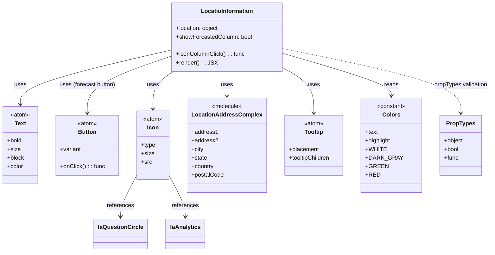

# Diagram: web/portal/src/pages/inventoryview/details/components/LocationInformation.js

> Auto-generated by Obscura crawlers

## Mermaid

### SVG

<svg id="container" width="1347.59765625" xmlns="http://www.w3.org/2000/svg" class="classDiagram" height="704" viewBox="0 0 1347.59765625 704" role="graphics-document document" aria-roledescription="class"><g><defs><marker id="container_class-aggregationStart" class="marker aggregation class" refX="18" refY="7" markerWidth="190" markerHeight="240" orient="auto"><path d="M 18,7 L9,13 L1,7 L9,1 Z"></path></marker></defs><defs><marker id="container_class-aggregationEnd" class="marker aggregation class" refX="1" refY="7" markerWidth="20" markerHeight="28" orient="auto"><path d="M 18,7 L9,13 L1,7 L9,1 Z"></path></marker></defs><defs><marker id="container_class-extensionStart" class="marker extension class" refX="18" refY="7" markerWidth="190" markerHeight="240" orient="auto"><path d="M 1,7 L18,13 V 1 Z"></path></marker></defs><defs><marker id="container_class-extensionEnd" class="marker extension class" refX="1" refY="7" markerWidth="20" markerHeight="28" orient="auto"><path d="M 1,1 V 13 L18,7 Z"></path></marker></defs><defs><marker id="container_class-compositionStart" class="marker composition class" refX="18" refY="7" markerWidth="190" markerHeight="240" orient="auto"><path d="M 18,7 L9,13 L1,7 L9,1 Z"></path></marker></defs><defs><marker id="container_class-compositionEnd" class="marker composition class" refX="1" refY="7" markerWidth="20" markerHeight="28" orient="auto"><path d="M 18,7 L9,13 L1,7 L9,1 Z"></path></marker></defs><defs><marker id="container_class-dependencyStart" class="marker dependency class" refX="6" refY="7" markerWidth="190" markerHeight="240" orient="auto"><path d="M 5,7 L9,13 L1,7 L9,1 Z"></path></marker></defs><defs><marker id="container_class-dependencyEnd" class="marker dependency class" refX="13" refY="7" markerWidth="20" markerHeight="28" orient="auto"><path d="M 18,7 L9,13 L14,7 L9,1 Z"></path></marker></defs><defs><marker id="container_class-lollipopStart" class="marker lollipop class" refX="13" refY="7" markerWidth="190" markerHeight="240" orient="auto"><circle stroke="black" fill="transparent" cx="7" cy="7" r="6"></circle></marker></defs><defs><marker id="container_class-lollipopEnd" class="marker lollipop class" refX="1" refY="7" markerWidth="190" markerHeight="240" orient="auto"><circle stroke="black" fill="transparent" cx="7" cy="7" r="6"></circle></marker></defs><g class="root"><g class="clusters"></g><g class="edgePaths"><path d="M474.348,139.663L404.868,155.886C335.388,172.109,196.428,204.554,126.949,229.944C57.469,255.333,57.469,273.667,57.469,282.833L57.469,292" id="id_LocatioInformation_Text_1" class="edge-thickness-normal edge-pattern-solid relation" style=";;;" data-edge="true" data-et="edge" data-id="id_LocatioInformation_Text_1" data-points="W3sieCI6NDc0LjM0NzY1NjI1LCJ5IjoxMzkuNjYyODgzNTE1NTE4OTN9LHsieCI6NTcuNDY4NzUsInkiOjIzN30seyJ4Ijo1Ny40Njg3NSwieSI6Mjk4fV0=" marker-end="url(#container_class-dependencyEnd)"></path><path d="M627.086,200L627.086,206.167C627.086,212.333,627.086,224.667,627.086,236C627.086,247.333,627.086,257.667,627.086,262.833L627.086,268" id="id_LocatioInformation_LocationAddressComplex_2" class="edge-thickness-normal edge-pattern-solid relation" style=";;;" data-edge="true" data-et="edge" data-id="id_LocatioInformation_LocationAddressComplex_2" data-points="W3sieCI6NjI3LjA4NTkzNzUsInkiOjIwMH0seyJ4Ijo2MjcuMDg1OTM3NSwieSI6MjM3fSx7IngiOjYyNy4wODU5Mzc1LCJ5IjoyNzR9XQ==" marker-end="url(#container_class-dependencyEnd)"></path><path d="M474.348,157.066L436.002,170.388C397.656,183.71,320.965,210.355,282.619,236.844C244.273,263.333,244.273,289.667,244.273,302.833L244.273,316" id="id_LocatioInformation_Button_3" class="edge-thickness-normal edge-pattern-solid relation" style=";;;" data-edge="true" data-et="edge" data-id="id_LocatioInformation_Button_3" data-points="W3sieCI6NDc0LjM0NzY1NjI1LCJ5IjoxNTcuMDY1NjQyODU3MTQyODV9LHsieCI6MjQ0LjI3MzQzNzUsInkiOjIzN30seyJ4IjoyNDQuMjczNDM3NSwieSI6MzIyfV0=" marker-end="url(#container_class-dependencyEnd)"></path><path d="M482.872,200L473.608,206.167C464.344,212.333,445.817,224.667,436.553,242C427.289,259.333,427.289,281.667,427.289,292.833L427.289,304" id="id_LocatioInformation_Icon_4" class="edge-thickness-normal edge-pattern-solid relation" style=";;;" data-edge="true" data-et="edge" data-id="id_LocatioInformation_Icon_4" data-points="W3sieCI6NDgyLjg3MTY1MTc4NTcxNDMsInkiOjIwMH0seyJ4Ijo0MjcuMjg5MDYyNSwieSI6MjM3fSx7IngiOjQyNy4yODkwNjI1LCJ5IjozMTB9XQ==" marker-end="url(#container_class-dependencyEnd)"></path><path d="M779.824,189.147L794.131,197.122C808.438,205.098,837.051,221.049,851.357,242.191C865.664,263.333,865.664,289.667,865.664,302.833L865.664,316" id="id_LocatioInformation_Tooltip_5" class="edge-thickness-normal edge-pattern-solid relation" style=";;;" data-edge="true" data-et="edge" data-id="id_LocatioInformation_Tooltip_5" data-points="W3sieCI6Nzc5LjgyNDIxODc1LCJ5IjoxODkuMTQ2OTE1MzE4NjE5NDJ9LHsieCI6ODY1LjY2NDA2MjUsInkiOjIzN30seyJ4Ijo4NjUuNjY0MDYyNSwieSI6MzIyfV0=" marker-end="url(#container_class-dependencyEnd)"></path><path d="M779.824,149.062L829.503,163.718C879.181,178.374,978.538,207.687,1028.216,227.51C1077.895,247.333,1077.895,257.667,1077.895,262.833L1077.895,268" id="id_LocatioInformation_Colors_6" class="edge-thickness-normal edge-pattern-solid relation" style=";;;" data-edge="true" data-et="edge" data-id="id_LocatioInformation_Colors_6" data-points="W3sieCI6Nzc5LjgyNDIxODc1LCJ5IjoxNDkuMDYxNjc3MzY3OTIzOTV9LHsieCI6MTA3Ny44OTQ1MzEyNSwieSI6MjM3fSx7IngiOjEwNzcuODk0NTMxMjUsInkiOjI3NH1d" marker-end="url(#container_class-dependencyEnd)"></path><path d="M779.824,135.918L860.441,152.765C941.059,169.612,1102.293,203.306,1182.91,233.32C1263.527,263.333,1263.527,289.667,1263.527,302.833L1263.527,316" id="id_LocatioInformation_PropTypes_7" class="edge-thickness-normal edge-pattern-dashed relation" style=";;;" data-edge="true" data-et="edge" data-id="id_LocatioInformation_PropTypes_7" data-points="W3sieCI6Nzc5LjgyNDIxODc1LCJ5IjoxMzUuOTE4NDAwMDM5MjgwOTN9LHsieCI6MTI2My41MjczNDM3NSwieSI6MjM3fSx7IngiOjEyNjMuNTI3MzQzNzUsInkiOjMyMn1d" marker-end="url(#container_class-dependencyEnd)"></path><path d="M381.609,494.417L374.671,507.847C367.732,521.278,353.854,548.139,346.915,566.736C339.977,585.333,339.977,595.667,339.977,600.833L339.977,606" id="id_Icon_faQuestionCircle_8" class="edge-thickness-normal edge-pattern-solid relation" style=";;;" data-edge="true" data-et="edge" data-id="id_Icon_faQuestionCircle_8" data-points="W3sieCI6MzgxLjYwOTM3NSwieSI6NDk0LjQxNjUxNzUzNzU4MDU1fSx7IngiOjMzOS45NzY1NjI1LCJ5Ijo1NzV9LHsieCI6MzM5Ljk3NjU2MjUsInkiOjYxMn1d" marker-end="url(#container_class-dependencyEnd)"></path><path d="M472.969,494.417L479.908,507.847C486.846,521.278,500.724,548.139,507.663,566.736C514.602,585.333,514.602,595.667,514.602,600.833L514.602,606" id="id_Icon_faAnalytics_9" class="edge-thickness-normal edge-pattern-solid relation" style=";;;" data-edge="true" data-et="edge" data-id="id_Icon_faAnalytics_9" data-points="W3sieCI6NDcyLjk2ODc1LCJ5Ijo0OTQuNDE2NTE3NTM3NTgwNTV9LHsieCI6NTE0LjYwMTU2MjUsInkiOjU3NX0seyJ4Ijo1MTQuNjAxNTYyNSwieSI6NjEyfV0=" marker-end="url(#container_class-dependencyEnd)"></path></g><g class="edgeLabels"><g class="edgeLabel" transform="translate(57.46875, 237)"><g class="label" data-id="id_LocatioInformation_Text_1" transform="translate(-16.4921875, -12)"><foreignObject width="32.984375" height="24">

uses

</foreignObject></g></g><g class="edgeLabel" transform="translate(627.0859375, 237)"><g class="label" data-id="id_LocatioInformation_LocationAddressComplex_2" transform="translate(-16.4921875, -12)"><foreignObject width="32.984375" height="24">

uses

</foreignObject></g></g><g class="edgeLabel" transform="translate(244.2734375, 237)"><g class="label" data-id="id_LocatioInformation_Button_3" transform="translate(-79.4609375, -12)"><foreignObject width="158.921875" height="24">

uses (forecast button)

</foreignObject></g></g><g class="edgeLabel" transform="translate(427.2890625, 237)"><g class="label" data-id="id_LocatioInformation_Icon_4" transform="translate(-16.4921875, -12)"><foreignObject width="32.984375" height="24">

uses

</foreignObject></g></g><g class="edgeLabel" transform="translate(865.6640625, 237)"><g class="label" data-id="id_LocatioInformation_Tooltip_5" transform="translate(-16.4921875, -12)"><foreignObject width="32.984375" height="24">

uses

</foreignObject></g></g><g class="edgeLabel" transform="translate(1077.89453125, 237)"><g class="label" data-id="id_LocatioInformation_Colors_6" transform="translate(-20.0078125, -12)"><foreignObject width="40.015625" height="24">

reads

</foreignObject></g></g><g class="edgeLabel" transform="translate(1263.52734375, 237)"><g class="label" data-id="id_LocatioInformation_PropTypes_7" transform="translate(-76.0703125, -12)"><foreignObject width="152.140625" height="24">

propTypes validation

</foreignObject></g></g><g class="edgeLabel" transform="translate(339.9765625, 575)"><g class="label" data-id="id_Icon_faQuestionCircle_8" transform="translate(-37.828125, -12)"><foreignObject width="75.65625" height="24">

references

</foreignObject></g></g><g class="edgeLabel" transform="translate(514.6015625, 575)"><g class="label" data-id="id_Icon_faAnalytics_9" transform="translate(-37.828125, -12)"><foreignObject width="75.65625" height="24">

references

</foreignObject></g></g></g><g class="nodes"><g class="node default" id="classId-LocatioInformation-0" transform="translate(627.0859375, 104)"><g class="basic label-container"><path d="M-152.73828125 -96 L152.73828125 -96 L152.73828125 96 L-152.73828125 96" stroke="none" stroke-width="0" fill="#ECECFF" style=""></path><path d="M-152.73828125 -96 C-90.94008734406789 -96, -29.14189343813578 -96, 152.73828125 -96 M-152.73828125 -96 C-50.979374124675914 -96, 50.77953300064817 -96, 152.73828125 -96 M152.73828125 -96 C152.73828125 -53.41002328208391, 152.73828125 -10.820046564167825, 152.73828125 96 M152.73828125 -96 C152.73828125 -46.84843236232244, 152.73828125 2.3031352753551175, 152.73828125 96 M152.73828125 96 C76.8207171506897 96, 0.9031530513794053 96, -152.73828125 96 M152.73828125 96 C33.20079057515248 96, -86.33670009969504 96, -152.73828125 96 M-152.73828125 96 C-152.73828125 23.5599631701907, -152.73828125 -48.8800736596186, -152.73828125 -96 M-152.73828125 96 C-152.73828125 50.02881510952103, -152.73828125 4.0576302190420535, -152.73828125 -96" stroke="#9370DB" stroke-width="1.3" fill="none" stroke-dasharray="0 0" style=""></path></g><g class="annotation-group text" transform="translate(0, -72)"></g><g class="label-group text" transform="translate(-70.1171875, -72)"><g class="label" style="font-weight: bolder" transform="translate(0,-12)"><foreignObject width="140.234375" height="24">

LocatioInformation

</foreignObject></g></g><g class="members-group text" transform="translate(-140.73828125, -24)"><g class="label" style="" transform="translate(0,-12)"><foreignObject width="120.703125" height="24">

+location: object

</foreignObject></g><g class="label" style="" transform="translate(0,12)"><foreignObject width="211.359375" height="24">

+showForcastedColumn: bool

</foreignObject></g></g><g class="methods-group text" transform="translate(-140.73828125, 48)"><g class="label" style="" transform="translate(0,-12)"><foreignObject width="189.921875" height="24">

+iconColumnClick() : : func

</foreignObject></g><g class="label" style="" transform="translate(0,12)"><foreignObject width="109.140625" height="24">

+render() : : JSX

</foreignObject></g></g><g class="divider" style=""><path d="M-152.73828125 -48 C-64.30727397099163 -48, 24.12373330801674 -48, 152.73828125 -48 M-152.73828125 -48 C-47.36925349506025 -48, 57.9997742598795 -48, 152.73828125 -48" stroke="#9370DB" stroke-width="1.3" fill="none" stroke-dasharray="0 0" style=""></path></g><g class="divider" style=""><path d="M-152.73828125 24 C-36.9907754088745 24, 78.756730432251 24, 152.73828125 24 M-152.73828125 24 C-54.207256348367295 24, 44.32376855326541 24, 152.73828125 24" stroke="#9370DB" stroke-width="1.3" fill="none" stroke-dasharray="0 0" style=""></path></g></g><g class="node default" id="classId-Text-1" transform="translate(57.46875, 406)"><g class="basic label-container"><path d="M-49.46875 -108 L49.46875 -108 L49.46875 108 L-49.46875 108" stroke="none" stroke-width="0" fill="#ECECFF" style=""></path><path d="M-49.46875 -108 C-26.326124294677545 -108, -3.1834985893550893 -108, 49.46875 -108 M-49.46875 -108 C-14.415069828674767 -108, 20.638610342650466 -108, 49.46875 -108 M49.46875 -108 C49.46875 -58.75284632179037, 49.46875 -9.505692643580744, 49.46875 108 M49.46875 -108 C49.46875 -26.409634829032882, 49.46875 55.180730341934236, 49.46875 108 M49.46875 108 C25.253766862245126 108, 1.0387837244902514 108, -49.46875 108 M49.46875 108 C17.446696312739107 108, -14.575357374521786 108, -49.46875 108 M-49.46875 108 C-49.46875 32.03206909291117, -49.46875 -43.935861814177656, -49.46875 -108 M-49.46875 108 C-49.46875 27.76372851827189, -49.46875 -52.47254296345622, -49.46875 -108" stroke="#9370DB" stroke-width="1.3" fill="none" stroke-dasharray="0 0" style=""></path></g><g class="annotation-group text" transform="translate(-27.65625, -84)"><g class="label" style="" transform="translate(0,-12)"><foreignObject width="55.3125" height="24">

«atom»

</foreignObject></g></g><g class="label-group text" transform="translate(-15.3828125, -60)"><g class="label" style="font-weight: bolder" transform="translate(0,-12)"><foreignObject width="30.765625" height="24">

Text

</foreignObject></g></g><g class="members-group text" transform="translate(-37.46875, -12)"><g class="label" style="" transform="translate(0,-12)"><foreignObject width="41.015625" height="24">

+bold

</foreignObject></g><g class="label" style="" transform="translate(0,12)"><foreignObject width="35.578125" height="24">

+size

</foreignObject></g><g class="label" style="" transform="translate(0,36)"><foreignObject width="47.28125" height="24">

+block

</foreignObject></g><g class="label" style="" transform="translate(0,60)"><foreignObject width="44.796875" height="24">

+color

</foreignObject></g></g><g class="methods-group text" transform="translate(-37.46875, 108)"></g><g class="divider" style=""><path d="M-49.46875 -36 C-15.84914230986709 -36, 17.77046538026582 -36, 49.46875 -36 M-49.46875 -36 C-10.251855857525356 -36, 28.965038284949287 -36, 49.46875 -36" stroke="#9370DB" stroke-width="1.3" fill="none" stroke-dasharray="0 0" style=""></path></g><g class="divider" style=""><path d="M-49.46875 84 C-13.176416313226802 84, 23.115917373546395 84, 49.46875 84 M-49.46875 84 C-17.691212390020084 84, 14.086325219959832 84, 49.46875 84" stroke="#9370DB" stroke-width="1.3" fill="none" stroke-dasharray="0 0" style=""></path></g></g><g class="node default" id="classId-Button-2" transform="translate(244.2734375, 406)"><g class="basic label-container"><path d="M-87.3359375 -84 L87.3359375 -84 L87.3359375 84 L-87.3359375 84" stroke="none" stroke-width="0" fill="#ECECFF" style=""></path><path d="M-87.3359375 -84 C-31.22448749598736 -84, 24.886962508025277 -84, 87.3359375 -84 M-87.3359375 -84 C-44.60743771358767 -84, -1.8789379271753432 -84, 87.3359375 -84 M87.3359375 -84 C87.3359375 -21.48122729862667, 87.3359375 41.03754540274666, 87.3359375 84 M87.3359375 -84 C87.3359375 -25.381268019652268, 87.3359375 33.237463960695464, 87.3359375 84 M87.3359375 84 C25.929196620869767 84, -35.477544258260465 84, -87.3359375 84 M87.3359375 84 C30.899493037984726 84, -25.536951424030548 84, -87.3359375 84 M-87.3359375 84 C-87.3359375 44.30008917643192, -87.3359375 4.600178352863836, -87.3359375 -84 M-87.3359375 84 C-87.3359375 31.666970589738824, -87.3359375 -20.666058820522352, -87.3359375 -84" stroke="#9370DB" stroke-width="1.3" fill="none" stroke-dasharray="0 0" style=""></path></g><g class="annotation-group text" transform="translate(-27.65625, -60)"><g class="label" style="" transform="translate(0,-12)"><foreignObject width="55.3125" height="24">

«atom»

</foreignObject></g></g><g class="label-group text" transform="translate(-24.8359375, -36)"><g class="label" style="font-weight: bolder" transform="translate(0,-12)"><foreignObject width="49.671875" height="24">

Button

</foreignObject></g></g><g class="members-group text" transform="translate(-75.3359375, 12)"><g class="label" style="" transform="translate(0,-12)"><foreignObject width="58.703125" height="24">

+variant

</foreignObject></g></g><g class="methods-group text" transform="translate(-75.3359375, 60)"><g class="label" style="" transform="translate(0,-12)"><foreignObject width="123.015625" height="24">

+onClick() : : func

</foreignObject></g></g><g class="divider" style=""><path d="M-87.3359375 -12 C-52.369504416100746 -12, -17.403071332201492 -12, 87.3359375 -12 M-87.3359375 -12 C-33.48853950043691 -12, 20.358858499126185 -12, 87.3359375 -12" stroke="#9370DB" stroke-width="1.3" fill="none" stroke-dasharray="0 0" style=""></path></g><g class="divider" style=""><path d="M-87.3359375 36 C-21.73892964722424 36, 43.85807820555152 36, 87.3359375 36 M-87.3359375 36 C-51.466033763708204 36, -15.596130027416407 36, 87.3359375 36" stroke="#9370DB" stroke-width="1.3" fill="none" stroke-dasharray="0 0" style=""></path></g></g><g class="node default" id="classId-Icon-3" transform="translate(427.2890625, 406)"><g class="basic label-container"><path d="M-45.6796875 -96 L45.6796875 -96 L45.6796875 96 L-45.6796875 96" stroke="none" stroke-width="0" fill="#ECECFF" style=""></path><path d="M-45.6796875 -96 C-23.26886976201386 -96, -0.858052024027721 -96, 45.6796875 -96 M-45.6796875 -96 C-14.67323246100505 -96, 16.3332225779899 -96, 45.6796875 -96 M45.6796875 -96 C45.6796875 -38.651456479561716, 45.6796875 18.697087040876568, 45.6796875 96 M45.6796875 -96 C45.6796875 -22.74430271718282, 45.6796875 50.51139456563436, 45.6796875 96 M45.6796875 96 C15.321649726429417 96, -15.036388047141166 96, -45.6796875 96 M45.6796875 96 C19.42636295317573 96, -6.826961593648541 96, -45.6796875 96 M-45.6796875 96 C-45.6796875 38.382220023688035, -45.6796875 -19.23555995262393, -45.6796875 -96 M-45.6796875 96 C-45.6796875 55.77393223525478, -45.6796875 15.547864470509566, -45.6796875 -96" stroke="#9370DB" stroke-width="1.3" fill="none" stroke-dasharray="0 0" style=""></path></g><g class="annotation-group text" transform="translate(-27.65625, -72)"><g class="label" style="" transform="translate(0,-12)"><foreignObject width="55.3125" height="24">

«atom»

</foreignObject></g></g><g class="label-group text" transform="translate(-15.3046875, -48)"><g class="label" style="font-weight: bolder" transform="translate(0,-12)"><foreignObject width="30.609375" height="24">

Icon

</foreignObject></g></g><g class="members-group text" transform="translate(-33.6796875, 0)"><g class="label" style="" transform="translate(0,-12)"><foreignObject width="39.703125" height="24">

+type

</foreignObject></g><g class="label" style="" transform="translate(0,12)"><foreignObject width="35.578125" height="24">

+size

</foreignObject></g><g class="label" style="" transform="translate(0,36)"><foreignObject width="28.8125" height="24">

+src

</foreignObject></g></g><g class="methods-group text" transform="translate(-33.6796875, 96)"></g><g class="divider" style=""><path d="M-45.6796875 -24 C-16.47084215109807 -24, 12.738003197803863 -24, 45.6796875 -24 M-45.6796875 -24 C-14.696559238467628 -24, 16.286569023064743 -24, 45.6796875 -24" stroke="#9370DB" stroke-width="1.3" fill="none" stroke-dasharray="0 0" style=""></path></g><g class="divider" style=""><path d="M-45.6796875 72 C-20.758700238179113 72, 4.162287023641774 72, 45.6796875 72 M-45.6796875 72 C-12.141638068095638 72, 21.396411363808724 72, 45.6796875 72" stroke="#9370DB" stroke-width="1.3" fill="none" stroke-dasharray="0 0" style=""></path></g></g><g class="node default" id="classId-LocationAddressComplex-4" transform="translate(627.0859375, 406)"><g class="basic label-container"><path d="M-104.1171875 -132 L104.1171875 -132 L104.1171875 132 L-104.1171875 132" stroke="none" stroke-width="0" fill="#ECECFF" style=""></path><path d="M-104.1171875 -132 C-37.466719837949924 -132, 29.183747824100152 -132, 104.1171875 -132 M-104.1171875 -132 C-27.038685778289434 -132, 50.03981594342113 -132, 104.1171875 -132 M104.1171875 -132 C104.1171875 -65.66150176321446, 104.1171875 0.6769964735710801, 104.1171875 132 M104.1171875 -132 C104.1171875 -34.12371943145226, 104.1171875 63.75256113709548, 104.1171875 132 M104.1171875 132 C51.19316591641363 132, -1.730855667172733 132, -104.1171875 132 M104.1171875 132 C38.1011809787537 132, -27.914825542492594 132, -104.1171875 132 M-104.1171875 132 C-104.1171875 28.670569112317366, -104.1171875 -74.65886177536527, -104.1171875 -132 M-104.1171875 132 C-104.1171875 61.33411304389054, -104.1171875 -9.331773912218921, -104.1171875 -132" stroke="#9370DB" stroke-width="1.3" fill="none" stroke-dasharray="0 0" style=""></path></g><g class="annotation-group text" transform="translate(-42.2265625, -108)"><g class="label" style="" transform="translate(0,-12)"><foreignObject width="84.453125" height="24">

«molecule»

</foreignObject></g></g><g class="label-group text" transform="translate(-92.1171875, -84)"><g class="label" style="font-weight: bolder" transform="translate(0,-12)"><foreignObject width="184.234375" height="24">

LocationAddressComplex

</foreignObject></g></g><g class="members-group text" transform="translate(-92.1171875, -36)"><g class="label" style="" transform="translate(0,-12)"><foreignObject width="71.234375" height="24">

+address1

</foreignObject></g><g class="label" style="" transform="translate(0,12)"><foreignObject width="72.546875" height="24">

+address2

</foreignObject></g><g class="label" style="" transform="translate(0,36)"><foreignObject width="33.71875" height="24">

+city

</foreignObject></g><g class="label" style="" transform="translate(0,60)"><foreignObject width="44.09375" height="24">

+state

</foreignObject></g><g class="label" style="" transform="translate(0,84)"><foreignObject width="63.171875" height="24">

+country

</foreignObject></g><g class="label" style="" transform="translate(0,108)"><foreignObject width="89.484375" height="24">

+postalCode

</foreignObject></g></g><g class="methods-group text" transform="translate(-92.1171875, 132)"></g><g class="divider" style=""><path d="M-104.1171875 -60 C-30.129373489335265 -60, 43.85844052132947 -60, 104.1171875 -60 M-104.1171875 -60 C-21.679919902799796 -60, 60.75734769440041 -60, 104.1171875 -60" stroke="#9370DB" stroke-width="1.3" fill="none" stroke-dasharray="0 0" style=""></path></g><g class="divider" style=""><path d="M-104.1171875 108 C-59.99577475890504 108, -15.874362017810085 108, 104.1171875 108 M-104.1171875 108 C-22.905787298751363 108, 58.30561290249727 108, 104.1171875 108" stroke="#9370DB" stroke-width="1.3" fill="none" stroke-dasharray="0 0" style=""></path></g></g><g class="node default" id="classId-Tooltip-5" transform="translate(865.6640625, 406)"><g class="basic label-container"><path d="M-84.4609375 -84 L84.4609375 -84 L84.4609375 84 L-84.4609375 84" stroke="none" stroke-width="0" fill="#ECECFF" style=""></path><path d="M-84.4609375 -84 C-19.908747711134282 -84, 44.643442077731436 -84, 84.4609375 -84 M-84.4609375 -84 C-37.88987118308644 -84, 8.681195133827117 -84, 84.4609375 -84 M84.4609375 -84 C84.4609375 -23.579660556216993, 84.4609375 36.840678887566014, 84.4609375 84 M84.4609375 -84 C84.4609375 -20.118482494137687, 84.4609375 43.763035011724625, 84.4609375 84 M84.4609375 84 C41.70284532016202 84, -1.055246859675961 84, -84.4609375 84 M84.4609375 84 C18.901458323874024 84, -46.65802085225195 84, -84.4609375 84 M-84.4609375 84 C-84.4609375 24.998442843870684, -84.4609375 -34.00311431225863, -84.4609375 -84 M-84.4609375 84 C-84.4609375 41.190169694587084, -84.4609375 -1.6196606108258322, -84.4609375 -84" stroke="#9370DB" stroke-width="1.3" fill="none" stroke-dasharray="0 0" style=""></path></g><g class="annotation-group text" transform="translate(-27.65625, -60)"><g class="label" style="" transform="translate(0,-12)"><foreignObject width="55.3125" height="24">

«atom»

</foreignObject></g></g><g class="label-group text" transform="translate(-25.7265625, -36)"><g class="label" style="font-weight: bolder" transform="translate(0,-12)"><foreignObject width="51.453125" height="24">

Tooltip

</foreignObject></g></g><g class="members-group text" transform="translate(-72.4609375, 12)"><g class="label" style="" transform="translate(0,-12)"><foreignObject width="84.4375" height="24">

+placement

</foreignObject></g><g class="label" style="" transform="translate(0,12)"><foreignObject width="117.265625" height="24">

+tooltipChildren

</foreignObject></g></g><g class="methods-group text" transform="translate(-72.4609375, 84)"></g><g class="divider" style=""><path d="M-84.4609375 -12 C-47.330757591616354 -12, -10.200577683232709 -12, 84.4609375 -12 M-84.4609375 -12 C-49.60517591954194 -12, -14.749414339083884 -12, 84.4609375 -12" stroke="#9370DB" stroke-width="1.3" fill="none" stroke-dasharray="0 0" style=""></path></g><g class="divider" style=""><path d="M-84.4609375 60 C-23.096609589098932 60, 38.267718321802136 60, 84.4609375 60 M-84.4609375 60 C-42.37675423246361 60, -0.2925709649272221 60, 84.4609375 60" stroke="#9370DB" stroke-width="1.3" fill="none" stroke-dasharray="0 0" style=""></path></g></g><g class="node default" id="classId-Colors-6" transform="translate(1077.89453125, 406)"><g class="basic label-container"><path d="M-77.76953125 -132 L77.76953125 -132 L77.76953125 132 L-77.76953125 132" stroke="none" stroke-width="0" fill="#ECECFF" style=""></path><path d="M-77.76953125 -132 C-22.766161079106027 -132, 32.237209091787946 -132, 77.76953125 -132 M-77.76953125 -132 C-28.590842848540603 -132, 20.587845552918793 -132, 77.76953125 -132 M77.76953125 -132 C77.76953125 -78.0827748664141, 77.76953125 -24.165549732828197, 77.76953125 132 M77.76953125 -132 C77.76953125 -40.01323057676436, 77.76953125 51.973538846471286, 77.76953125 132 M77.76953125 132 C35.200103137993324 132, -7.369324974013352 132, -77.76953125 132 M77.76953125 132 C24.627585349431953 132, -28.514360551136093 132, -77.76953125 132 M-77.76953125 132 C-77.76953125 66.71081564537869, -77.76953125 1.4216312907573752, -77.76953125 -132 M-77.76953125 132 C-77.76953125 68.2937149748182, -77.76953125 4.587429949636402, -77.76953125 -132" stroke="#9370DB" stroke-width="1.3" fill="none" stroke-dasharray="0 0" style=""></path></g><g class="annotation-group text" transform="translate(-40.4921875, -108)"><g class="label" style="" transform="translate(0,-12)"><foreignObject width="80.984375" height="24">

«constant»

</foreignObject></g></g><g class="label-group text" transform="translate(-23.1015625, -84)"><g class="label" style="font-weight: bolder" transform="translate(0,-12)"><foreignObject width="46.203125" height="24">

Colors

</foreignObject></g></g><g class="members-group text" transform="translate(-65.76953125, -36)"><g class="label" style="" transform="translate(0,-12)"><foreignObject width="35.5625" height="24">

+text

</foreignObject></g><g class="label" style="" transform="translate(0,12)"><foreignObject width="72.25" height="24">

+highlight

</foreignObject></g><g class="label" style="" transform="translate(0,36)"><foreignObject width="53.640625" height="24">

+WHITE

</foreignObject></g><g class="label" style="" transform="translate(0,60)"><foreignObject width="91.046875" height="24">

+DARK_GRAY

</foreignObject></g><g class="label" style="" transform="translate(0,84)"><foreignObject width="55.8125" height="24">

+GREEN

</foreignObject></g><g class="label" style="" transform="translate(0,108)"><foreignObject width="36.53125" height="24">

+RED

</foreignObject></g></g><g class="methods-group text" transform="translate(-65.76953125, 132)"></g><g class="divider" style=""><path d="M-77.76953125 -60 C-34.76540568155841 -60, 8.238719886883175 -60, 77.76953125 -60 M-77.76953125 -60 C-19.749517032820037 -60, 38.270497184359925 -60, 77.76953125 -60" stroke="#9370DB" stroke-width="1.3" fill="none" stroke-dasharray="0 0" style=""></path></g><g class="divider" style=""><path d="M-77.76953125 108 C-30.42740204047461 108, 16.914727169050778 108, 77.76953125 108 M-77.76953125 108 C-23.433258252635177 108, 30.903014744729646 108, 77.76953125 108" stroke="#9370DB" stroke-width="1.3" fill="none" stroke-dasharray="0 0" style=""></path></g></g><g class="node default" id="classId-PropTypes-7" transform="translate(1263.52734375, 406)"><g class="basic label-container"><path d="M-57.86328125 -84 L57.86328125 -84 L57.86328125 84 L-57.86328125 84" stroke="none" stroke-width="0" fill="#ECECFF" style=""></path><path d="M-57.86328125 -84 C-19.979748511600867 -84, 17.903784226798265 -84, 57.86328125 -84 M-57.86328125 -84 C-32.66252301253851 -84, -7.461764775077015 -84, 57.86328125 -84 M57.86328125 -84 C57.86328125 -25.967268897085404, 57.86328125 32.06546220582919, 57.86328125 84 M57.86328125 -84 C57.86328125 -39.714218430070126, 57.86328125 4.571563139859748, 57.86328125 84 M57.86328125 84 C18.114783058127806 84, -21.63371513374439 84, -57.86328125 84 M57.86328125 84 C30.208045325727237 84, 2.552809401454475 84, -57.86328125 84 M-57.86328125 84 C-57.86328125 33.404073880485626, -57.86328125 -17.191852239028748, -57.86328125 -84 M-57.86328125 84 C-57.86328125 35.603868337352914, -57.86328125 -12.792263325294172, -57.86328125 -84" stroke="#9370DB" stroke-width="1.3" fill="none" stroke-dasharray="0 0" style=""></path></g><g class="annotation-group text" transform="translate(0, -60)"></g><g class="label-group text" transform="translate(-38.2578125, -60)"><g class="label" style="font-weight: bolder" transform="translate(0,-12)"><foreignObject width="76.515625" height="24">

PropTypes

</foreignObject></g></g><g class="members-group text" transform="translate(-45.86328125, -12)"><g class="label" style="" transform="translate(0,-12)"><foreignObject width="53.46875" height="24">

+object

</foreignObject></g><g class="label" style="" transform="translate(0,12)"><foreignObject width="40.875" height="24">

+bool

</foreignObject></g><g class="label" style="" transform="translate(0,36)"><foreignObject width="39.453125" height="24">

+func

</foreignObject></g></g><g class="methods-group text" transform="translate(-45.86328125, 84)"></g><g class="divider" style=""><path d="M-57.86328125 -36 C-26.028622710896254 -36, 5.8060358282074915 -36, 57.86328125 -36 M-57.86328125 -36 C-33.758669688647686 -36, -9.654058127295372 -36, 57.86328125 -36" stroke="#9370DB" stroke-width="1.3" fill="none" stroke-dasharray="0 0" style=""></path></g><g class="divider" style=""><path d="M-57.86328125 60 C-15.05369888636779 60, 27.75588347726442 60, 57.86328125 60 M-57.86328125 60 C-25.06829692288631 60, 7.726687404227377 60, 57.86328125 60" stroke="#9370DB" stroke-width="1.3" fill="none" stroke-dasharray="0 0" style=""></path></g></g><g class="node default" id="classId-faQuestionCircle-8" transform="translate(339.9765625, 654)"><g class="basic label-container"><path d="M-72.4609375 -42 L72.4609375 -42 L72.4609375 42 L-72.4609375 42" stroke="none" stroke-width="0" fill="#ECECFF" style=""></path><path d="M-72.4609375 -42 C-33.918053568692876 -42, 4.624830362614247 -42, 72.4609375 -42 M-72.4609375 -42 C-21.54003865407182 -42, 29.380860191856357 -42, 72.4609375 -42 M72.4609375 -42 C72.4609375 -23.666811244522663, 72.4609375 -5.333622489045325, 72.4609375 42 M72.4609375 -42 C72.4609375 -9.74699771101168, 72.4609375 22.50600457797664, 72.4609375 42 M72.4609375 42 C41.79684441064664 42, 11.132751321293291 42, -72.4609375 42 M72.4609375 42 C15.039736292929128 42, -42.381464914141745 42, -72.4609375 42 M-72.4609375 42 C-72.4609375 16.95687493467304, -72.4609375 -8.086250130653923, -72.4609375 -42 M-72.4609375 42 C-72.4609375 11.89895403413993, -72.4609375 -18.20209193172014, -72.4609375 -42" stroke="#9370DB" stroke-width="1.3" fill="none" stroke-dasharray="0 0" style=""></path></g><g class="annotation-group text" transform="translate(0, -18)"></g><g class="label-group text" transform="translate(-60.4609375, -18)"><g class="label" style="font-weight: bolder" transform="translate(0,-12)"><foreignObject width="120.921875" height="24">

faQuestionCircle

</foreignObject></g></g><g class="members-group text" transform="translate(-60.4609375, 30)"></g><g class="methods-group text" transform="translate(-60.4609375, 60)"></g><g class="divider" style=""><path d="M-72.4609375 6 C-33.14545383884895 6, 6.170029822302098 6, 72.4609375 6 M-72.4609375 6 C-16.46151555776688 6, 39.53790638446624 6, 72.4609375 6" stroke="#9370DB" stroke-width="1.3" fill="none" stroke-dasharray="0 0" style=""></path></g><g class="divider" style=""><path d="M-72.4609375 24 C-18.911755629022366 24, 34.63742624195527 24, 72.4609375 24 M-72.4609375 24 C-30.286801407894288 24, 11.887334684211424 24, 72.4609375 24" stroke="#9370DB" stroke-width="1.3" fill="none" stroke-dasharray="0 0" style=""></path></g></g><g class="node default" id="classId-faAnalytics-9" transform="translate(514.6015625, 654)"><g class="basic label-container"><path d="M-52.1640625 -42 L52.1640625 -42 L52.1640625 42 L-52.1640625 42" stroke="none" stroke-width="0" fill="#ECECFF" style=""></path><path d="M-52.1640625 -42 C-30.596583021029655 -42, -9.02910354205931 -42, 52.1640625 -42 M-52.1640625 -42 C-12.164890525234512 -42, 27.834281449530977 -42, 52.1640625 -42 M52.1640625 -42 C52.1640625 -16.930613489626626, 52.1640625 8.138773020746747, 52.1640625 42 M52.1640625 -42 C52.1640625 -20.39619520364993, 52.1640625 1.2076095927001376, 52.1640625 42 M52.1640625 42 C19.86094138121313 42, -12.442179737573738 42, -52.1640625 42 M52.1640625 42 C21.73549480866555 42, -8.6930728826689 42, -52.1640625 42 M-52.1640625 42 C-52.1640625 23.92153161416034, -52.1640625 5.8430632283206805, -52.1640625 -42 M-52.1640625 42 C-52.1640625 24.69372063344001, -52.1640625 7.387441266880018, -52.1640625 -42" stroke="#9370DB" stroke-width="1.3" fill="none" stroke-dasharray="0 0" style=""></path></g><g class="annotation-group text" transform="translate(0, -18)"></g><g class="label-group text" transform="translate(-40.1640625, -18)"><g class="label" style="font-weight: bolder" transform="translate(0,-12)"><foreignObject width="80.328125" height="24">

faAnalytics

</foreignObject></g></g><g class="members-group text" transform="translate(-40.1640625, 30)"></g><g class="methods-group text" transform="translate(-40.1640625, 60)"></g><g class="divider" style=""><path d="M-52.1640625 6 C-27.439380685391793 6, -2.714698870783586 6, 52.1640625 6 M-52.1640625 6 C-24.325326489595465 6, 3.51340952080907 6, 52.1640625 6" stroke="#9370DB" stroke-width="1.3" fill="none" stroke-dasharray="0 0" style=""></path></g><g class="divider" style=""><path d="M-52.1640625 24 C-10.986581023300744 24, 30.190900453398513 24, 52.1640625 24 M-52.1640625 24 C-22.37084511647261 24, 7.422372267054783 24, 52.1640625 24" stroke="#9370DB" stroke-width="1.3" fill="none" stroke-dasharray="0 0" style=""></path></g></g></g></g></g></svg>
